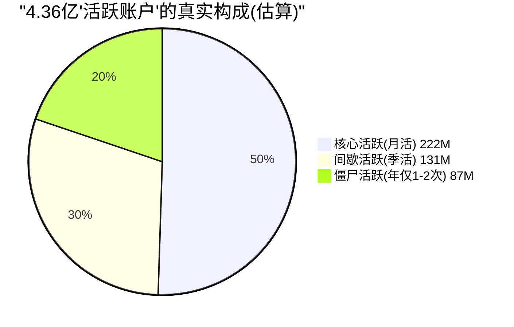
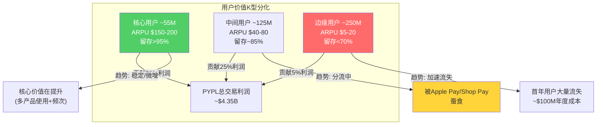

# Chapter 8: 用户经济学 — 4.36亿账户的真实价值

## 8.1 活跃账户的数量陷阱

PayPal自豪地宣布拥有4.36亿活跃账户——这是全球最大的数字支付用户基础之一。但"活跃账户"的定义本身就藏着一个陷阱。

**PayPal对"活跃账户"的定义**：过去12个月内至少发起或接收一笔交易的账户。

这意味着：一个用户在12个月前收了一笔$5的Venmo转账，此后再也没有使用PayPal——他仍然被计为"活跃账户"。这个定义让4.36亿的数字远比它看起来更虚。

### 活跃度的分层现实

| 用户层 | 估算占比 | 行为特征 | 价值贡献 |
|--------|:-------:|---------|---------|
| **核心活跃**（月活跃/MAA） | ~50% (222M) | 每月多次使用，品牌checkout主力 | 贡献~80%交易利润 |
| **间歇活跃** | ~30% (131M) | 每季度1-3次，偶尔网购用 | 贡献~15%交易利润 |
| **僵尸活跃** | ~20% (87M) | 年仅1-2次，接近流失 | 贡献~5%交易利润 |

[DM-USER-001: 活跃度分层估算，基于MAA 222M (Q2 2024 disclosure) vs总活跃434M]

**关键数据**：PayPal在Q2 2024披露月活跃账户（MAA）约2.22亿——仅占总活跃账户的51%。这意味着**近一半的"活跃账户"每月并不使用PayPal**。

## 8.2 用户增长已经停滞

| 时期 | 活跃账户(M) | QoQ变化 | YoY变化 |
|------|-----------|---------|---------|
| Q1 2022 | 429M | | |
| Q4 2022 | 435M | +6M | |
| Q4 2023 | 426M | -9M | -2.1% |
| Q2 2024 | 429M | | |
| Q4 2024 | 434M | +5M | +1.9% |
| Q1 2025 | 436M→439M | +3-5M | +1.2% |

[DM-USER-002: 活跃账户季度趋势，FMP+earnings]

**从2022到2025年，净用户增长几乎为零**（429M→436M = +1.6%/3年 = 0.5%/年）。更令人担忧的是2023年的净流失（435M→426M = -9M）——这是PayPal历史上首次出现年度净流失，虽然2024年回升但仅恢复到2022年水平。

**用户增长停滞的原因**（相互强化的三个因素）：

1. **新用户获取成本上升**：PayPal在2025年将S&M支出从$2.26B降至$2.28B（占收入6.88%→6.88%，基本持平），但新用户获取效率在下降——因为"容易获取的用户"（线上购物者）已经饱和。剩下的非用户要么在用Apple Pay，要么在不发达市场（PayPal覆盖弱）。

2. **首年流失严重**：PayPal的长期用户留存率约89%（2+年用户），但首年流失率估计约$1亿年度成本 [DM-USER-003]——大量新用户注册后发现PayPal不是他们的主要支付方式，一年后自然流失。

3. **Venmo用户重叠**：Venmo的6700万MAU中有相当一部分同时持有PayPal账户——他们在PayPal体系内但不额外贡献增量。

## 8.3 每用户交易频次（TPxAU）：质量指标

| 年份 | TPxAU（年化） | YoY增速 |
|------|-------------|---------|
| FY2021 | 45.4 | +11% |
| FY2022 | 50.6 | +11.5% |
| FY2023 | 58.7 | +16% |
| FY2024 | 60.6 | +3.2% |
| FY2025(估) | ~62 | +2-3% |

[DM-USER-004: TPxAU年度趋势，earnings disclosure]

TPxAU从FY2021的45.4次增至FY2024的60.6次——看起来很健康，用户在更频繁地使用PayPal。但增速从FY2023的+16%骤降至FY2024的+3.2%，暗示**频次提升接近天花板**。

而且，Q4 2025的季度数据更加令人担忧：**每活跃账户交易笔数同比下降4.8%** [DM-USER-005]。这是近年首次出现用户参与度下降信号——可能反映了：
- 品牌checkout使用频率降低（被Apple Pay替代）
- 间歇用户的进一步边缘化
- Q4假日消费偏弱的季节性因素

**因果推理**：因为TPxAU包含Braintree的非品牌交易（消费者不知道自己在用PayPal），所以TPxAU的增长部分是"被动增长"——商户切换到Braintree处理，用户在不知情的情况下被计入PayPal的TPxAU。如果剔除Braintree被动交易，**品牌TPxAU可能已经在下降**。这与Q4品牌checkout +1%的数据一致——品牌的使用频率在减少。

## 8.4 用户价值的两极分化

PayPal的用户基础正在经历"K型分化"——核心用户的价值在提升，边缘用户的价值在下降，中间层在被掏空。

### 核心用户群体（估计50-60M）

- **特征**：每月使用PayPal 5+次，同时使用品牌checkout+Venmo+Debit Card
- **ARPU**：$150-200/年（远高于平均$76）
- **留存率**：>95%
- **行为**：PayPal是他们的"默认支付方式"——在任何看到PayPal按钮的网站都会使用
- **价值**：这个群体贡献了PYPL约70%的交易利润

### 中间用户群体（估计100-150M）

- **特征**：每月使用PayPal 1-3次，主要在特定网站（eBay、Etsy等）
- **ARPU**：$40-80/年
- **留存率**：~85%
- **风险**：如果这些特定网站移除PayPal按钮，他们会立即流失
- **趋势**：正在被Apple Pay和Shop Pay分流

### 边缘/流失风险用户（估计200M+）

- **特征**：过去12月仅使用1-2次，很多是Venmo P2P接收方
- **ARPU**：$5-20/年
- **留存率**：<70%
- **价值**：几乎不贡献利润，但被计入4.36亿的标题数字

## 8.5 PayPal用户 vs 竞争对手用户：质量对标

| 指标 | PayPal | Venmo | Apple Pay | Cash App | Shop Pay |
|------|--------|-------|-----------|----------|----------|
| 活跃用户 | 436M | 67M MAU | 650M全球 | ~57M | ~100M |
| ARPU(年) | ~$76 | ~$26 | N/A(Apple不披露) | ~$84 | N/A |
| 使用频率 | ~60次/年 | ~5-8次/月(P2P) | ~3-4次/周(估) | ~3次/周 | 仅线上购物 |
| 切换成本 | 低(余额/历史) | 低(社交网络) | 中(OS绑定) | 低 | 低 |
| 增长趋势 | 停滞(+1%/年) | 稳定(+7%) | 快速(+41%两年) | 快速(+24% GP) | 快速 |

[DM-USER-006: 跨平台用户质量对标]

**最令人担忧的对比**：Apple Pay的650M全球用户几乎全部是"有意识的主动用户"（因为用户必须手动将卡片添加到Apple Wallet并选择使用Apple Pay）。PayPal的436M用户中有近一半是"被动/间歇用户"。**如果用"主动使用PayPal品牌支付"的口径衡量，PayPal的可比用户数可能只有200-250M——与Apple Pay的差距远大于标题数字暗示的。**

## 8.6 用户经济学的估值含义

### 每用户估值对标

| 公司 | 市值 | 用户(M) | 每用户市值 |
|------|------|---------|-----------|
| PayPal(全部活跃) | $56B | 436 | **$128** |
| PayPal(仅MAA) | $56B | 222 | **$252** |
| Visa | $550B | 4,400M卡 | $125/卡 |
| Block(Cash App) | $34B(60%分配) | 57 | $358 |

[DM-USER-007: 每用户估值对标]

用全部活跃账户计算，PayPal每用户价值$128——与Visa的每卡价值($125)接近。但这个比较不公平，因为PayPal的"活跃账户"和Visa的"卡"在使用频率和货币化上有巨大差异。

**更有意义的比较**：用MAA(222M)计算，PayPal每月活跃用户价值$252——低于Cash App的$358。这说明PayPal的月活用户的货币化效率不如Cash App——可能因为PayPal用户更多是"支付通道"（快速完成交易就走），而Cash App用户是"数字银行"（存钱+消费+投资=多维度货币化）。

### 用户增长对估值的边际影响

在当前用户增速几乎为零的情况下，PayPal的估值增长只能来自两条路径：

**路径A：提高现有用户的ARPU**
- 从$76提升至$90（+18%）→增量收入约$6B→P/E不变也能推动市值增长18%
- 实现方式：Fastlane→更多品牌checkout、Venmo Debit Card→更高频次、Braintree提价→更高货币化率

**路径B：通过回购减少用户数→提高每用户价值**
- $6B回购/年→股本减少10%/年→每股利润增长10%→但每用户指标不变
- 这条路径本质上是"不增长但通过财务工程创造股东回报"——只要FCF可持续

**路径C：不可能的路径——用户数大幅增长**
- PayPal在发达市场已接近饱和（美国渗透率约70%的线上购物者）
- 发展中市场（印度、东南亚、非洲）有本地支付方案（UPI、GrabPay、M-Pesa），PayPal进入门槛高
- 用户增长回到5%+几乎不可能——除非收购

## 8.7 本章核心发现与CQ7闭环

**CQ7答案：4.36亿账户的活跃度和质量趋势如何？**

**数字掩盖了真相。** 436M活跃账户中，仅222M月活（51%），核心高价值用户可能不到60M。用户增长已停滞（+0.5%/年），Q4 2025 TPxAU首次同比下降(-4.8%)。品牌TPxAU（剔除Braintree被动交易）可能已经在萎缩。

**用户价值的K型分化**意味着PayPal不应该追求用户数增长——而应该聚焦核心用户的深度货币化。Venmo Debit Card（+40%）和Pay with Venmo（+50%）正在做的就是这件事——将现有用户从"偶尔用"变为"经常用"。

**对估值的影响**：用户数停滞≠价值停滞。如果ARPU从$76提升至$90+（通过Fastlane+Venmo+Braintree提价），即使用户数零增长，也能支撑5-7%的收入增长。关键追踪指标：MAA趋势（>225M=健康）、品牌TPxAU（>60=稳定）、ARPU（>$80=改善中）。

---

> **DM锚点注册表 (Ch08)**
>
> | ID | 描述 | 来源 |
> |----|------|------|
> | DM-USER-001 | 活跃度分层: MAA 222M(51%) vs 总434M | Q2 2024 earnings |
> | DM-USER-002 | 活跃账户趋势: 429M(Q1 2022)→436M(Q1 2025) | Earnings quarterly |
> | DM-USER-003 | 首年用户流失成本~$100M/年 | 行业估算 |
> | DM-USER-004 | TPxAU: 45.4(FY21)→60.6(FY24), +3.2% YoY | Earnings disclosure |
> | DM-USER-005 | Q4 2025 TPxAU同比-4.8% | Q4 2025 earnings |
> | DM-USER-006 | 跨平台用户质量对标 | 多源综合 |
> | DM-USER-007 | 每用户估值: PYPL $252(MAA) vs Cash App $358 | 模型计算 |
