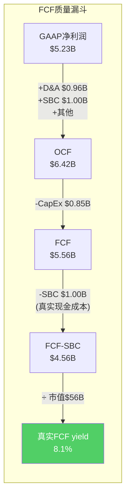
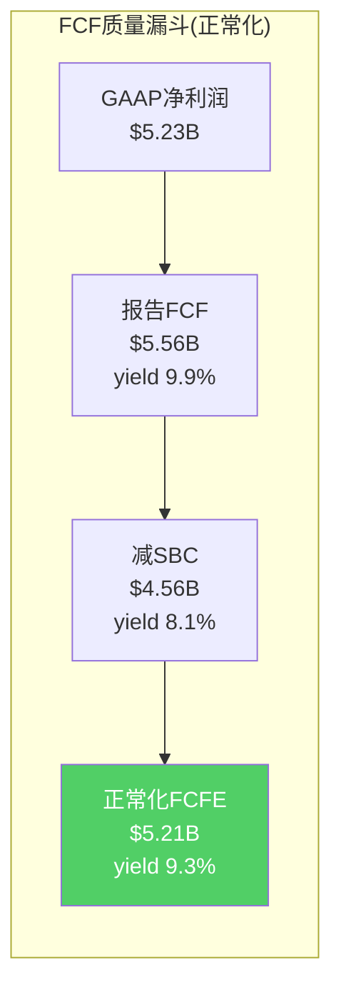

# Chapter 9: 财务考古 — 10年轨迹与FCF质量

## 9.1 从eBay剥离到$310高峰再到$42低谷：一部估值过山车

PayPal于2015年7月从eBay独立上市，开盘价约$38。此后经历了三个截然不同的估值周期：

| 阶段 | 时期 | 股价区间 | P/E区间 | 驱动因素 |
|------|------|---------|---------|---------|
| **增长期** | 2015-2020 | $38→$234 | 35-65x | 电商渗透+用户增长+COVID红利 |
| **泡沫峰值** | 2021 | $234→$310 | 50-70x | 超级App愿景+加密+BNPL |
| **崩塌期** | 2021-2026 | $310→$42 | 70→7.7x | 增速崩塌+CEO更替+品牌衰退 |

[DM-FIN-004: PYPL 10年股价+P/E轨迹]

**P/E从70x跌至7.7x**——一个9倍的倍数压缩。这意味着即使盈利没有变化，仅倍数压缩就能导致股价下跌89%。实际上EPS从2021年的$3.52微升至2025年的$5.41（+54%），所以股价下跌81%完全是倍数压缩驱动的。

**因果链**：因为2021年市场将PYPL定价为"下一个Visa"（双边网络+高增长=P/E 60-70x），而2025年市场将其重新定义为"衰退中的PSP"（低增长+管理层混乱=P/E 7-8x），所以估值倍数从70x压缩至7.7x。因为这种"身份重新定义"涉及的不是基本面数字变化而是市场认知变化，所以传统的DCF模型无法预测——这是一个叙事风险的典型案例。

## 9.2 十年利润表考古

| 指标 | FY2016 | FY2018 | FY2020 | FY2022 | FY2024 | FY2025 | 趋势 |
|------|--------|--------|--------|--------|--------|--------|------|
| 收入($B) | $10.8 | $15.5 | $21.5 | $27.5 | $31.8 | $33.2 | CAGR 13.3% (10年) |
| 毛利率 | 59.1% | 55.6% | 54.9% | 50.1% | 46.1% | 46.6% | **持续下降** |
| OPM | 14.6% | 14.2% | 15.3% | 13.9% | 16.7% | 18.3% | V型回升 |
| 净利率 | 12.9% | 13.3% | 19.6% | 8.8% | 13.0% | 15.8% | 波动大 |
| R&D/收入 | N/A | 10.5% | 12.3% | 11.8% | 9.4% | 9.4% | 削减中 |
| SBC/收入 | N/A | 5.0% | 6.4% | 4.6% | 3.9% | 3.0% | **大幅削减** |
| EPS(稀释) | $1.16 | $1.74 | $3.54 | $2.09 | $3.99 | $5.41 | CAGR 18.7% (10年) |

[DM-FIN-005: 10年利润表关键指标，FMP income statement]

### 三个关键财务趋势

**趋势1：毛利率的持续侵蚀（59.1%→46.6%，-1250bps/10年）**

毛利率从2016年的59.1%稳步下降至2025年的46.6%——这不是偶然波动，而是结构性变化。因为Braintree（低take rate）的收入占比从2016年的~20%上升至2025年的~55%，所以整体毛利率被数学性地拉低。即使品牌checkout的毛利率可能稳定在60%+，混合效应使得整体毛利率持续下行。

**这是"虚胖收入"的财务表达**——收入在增长，但每一美元收入包含的利润在减少。

**趋势2：OPM的V型回升（14.6%→13.9%→18.3%）**

OPM在2022年跌至13.9%低谷后，反弹至2025年的18.3%。如Ch3分析，这主要是成本削减驱动（SBC/收入从6.4%降至3.0%，R&D/收入从12.3%降至9.4%）。但毛利率在下降而OPM在上升——这意味着**成本削减的速度暂时超过了毛利率侵蚀的速度**。一旦成本削减空间用尽（SBC已接近行业下限），OPM将开始跟随毛利率下行。

**趋势3：EPS增长由回购驱动**

| 年份 | 净利润增速 | EPS增速 | 差额(=回购贡献) |
|------|-----------|---------|:----------:|
| FY2023 | +75.5% | +83.7% | 8.2pp |
| FY2024 | -2.3% | +3.9% | **6.2pp** |
| FY2025 | +26.2% | +35.6% | **9.4pp** |

[DM-FIN-006: EPS增速vs净利润增速差额分析]

FY2024最能说明问题：净利润下降2.3%，但EPS增长3.9%——**全部增长来自回购**。FY2025的35.6% EPS增长中，约1/3（9.4pp）来自股本缩减。

## 9.3 FCF质量审计

| 指标 | FY2020 | FY2021 | FY2022 | FY2023 | FY2024 | FY2025 |
|------|--------|--------|--------|--------|--------|--------|
| OCF($B) | $5.85 | $5.80 | $5.81 | $4.84 | $7.45 | $6.42 |
| CapEx($B) | $0.87 | $0.91 | $0.71 | $0.62 | $0.68 | $0.85 |
| **FCF($B)** | **$4.99** | **$4.89** | **$5.11** | **$4.22** | **$6.77** | **$5.56** |
| FCF/净利润 | 119% | 117% | 211% | 99% | 163% | **106%** |
| SBC($B) | $1.38 | $1.38 | $1.26 | $1.48 | $1.23 | $1.00 |
| **FCF-SBC** | **$3.61** | **$3.51** | **$3.85** | **$2.74** | **$5.54** | **$4.56** |
| FCF-SBC yield | 1.3% | 1.6% | 4.7% | 4.0% | 6.3% | **8.1%** |

[DM-FIN-007: FCF质量6年审计，FMP cashflow]

### FCF质量评分：B+（良好但有隐患）

**正面**：
- FCF/净利润持续>100%——说明利润是真金白银（非会计利润）
- FCF-SBC yield 8.1%——即使扣除SBC稀释，股东真实收益率仍然很高
- CapEx仅占收入2.6%——轻资产模型
- CapEx/D&A比率0.88——投资维护水平，非过度投资

**隐患**：
- FY2024 OCF $7.45B异常高——其中包含$1.37B"其他非现金项目"（otherNonCashItems），可能有一次性因素
- FY2023 FCF $4.22B是低谷——部分因为工作资本变化-$1.31B
- FCF波动大（$4.22-6.77B range）——不如V/MA的FCF稳定

**FCF可持续性判断**：正常化FCF约$5.0-5.5B/年。FY2024的$6.77B偏高（一次性），FY2023的$4.22B偏低（工作资本波动）。如果收入增速维持在3-5%且OPM稳定在18%，FCF应在$5.0-6.0B区间。

## 9.4 资本配置效率：钱花在哪了？

PayPal自2015年上市以来的资本配置：

| 用途 | 2015-2025累计 | 占FCF比 | 效果评估 |
|------|-------------|---------|---------|
| **回购** | ~$25B | ~47% | ⭐⭐ 时机差(2015-2021高买)+近年改善 |
| **并购** | ~$7B | ~13% | ⭐ Honey($4B)减值+Braintree($0.8B,2013)成功 |
| **CapEx** | ~$7B | ~13% | ⭐⭐⭐ 轻资产，投资克制 |
| **债务偿还** | ~$3B | ~6% | ⭐⭐⭐ 杠杆极低 |
| **保留/其他** | ~$11B | ~21% | 客户资金管理+短期投资 |

[DM-FIN-008: 资本配置10年汇总]

**并购记录不佳**：Honey（2020年$4B收购的比价购物浏览器插件）已基本减值——产品活跃度下降，未能与PayPal核心业务整合。iZettle（2018年$2.2B收购的欧洲POS）也表现平平。唯一的并购成功是2013年$800M收购的Braintree（附带Venmo）——以当前估值看至少值$10B+。

## 9.5 经营杠杆分析：收入增速放缓时利润会怎样？

PayPal的成本结构可以分为三层：

| 成本类型 | FY2025金额 | 占收入比 | 弹性 | 含义 |
|---------|-----------|---------|:----:|------|
| COGS(交易处理成本) | $17.7B | 53.4% | **高变动** | 与交易量几乎1:1 |
| R&D | $3.1B | 9.4% | 半固定 | 可削减但有长期代价 |
| SG&A | $4.3B | 12.8% | 半固定 | 已大幅削减 |
| D&A | $0.96B | 2.9% | 固定 | 不随收入变化 |

[DM-FIN-009: 成本结构弹性分析，FMP income FY2025]

**关键发现：PYPL是一个低经营杠杆的业务模型。** COGS占收入53.4%且几乎全部是变动成本（交易处理费随TPV线性增长）。这意味着收入增长10%时，COGS也增长~9-10%——利润放大效应很弱。

**对比V/MA**：Visa的COGS仅占收入约30%（高固定成本+低变动成本），所以收入增长10%时利润可能增长15-18%——强经营杠杆。PayPal的经营杠杆弱意味着：(1)收入增速对利润增速的放大效应有限；(2)收入下滑时利润不会断崖（因为COGS同步下降），但也不会在增长时创造惊喜。

**这解释了为什么PYPL即使收入增长4.3%、OPM也在扩张，市场仍然不给高P/E**——因为市场知道这种利润增长不可持续（成本削减有限），而且没有经营杠杆来在增长恢复时创造利润加速度。

### SBC深度分析

| 年份 | SBC($B) | SBC/收入 | SBC/FCF | 净稀释率(估) |
|------|---------|---------|---------|:----------:|
| FY2020 | $1.38 | 6.4% | 27.7% | ~1.5% |
| FY2021 | $1.38 | 5.4% | 28.2% | ~1.2% |
| FY2022 | $1.26 | 4.6% | 24.7% | ~1.8% |
| FY2023 | $1.48 | 5.0% | 35.1% | ~1.0% |
| FY2024 | $1.23 | 3.9% | 18.2% | ~0.5% |
| FY2025 | $1.00 | 3.0% | 18.0% | ~0.3% |

[DM-FIN-010: SBC 6年趋势，FMP]

SBC从$1.48B(FY2023)降至$1.00B(FY2025)是PYPL最显著的纪律改善信号之一。$480M的SBC削减直接增加$480M GAAP利润——占FY2025利润改善的约44%（总利润YoY增长$1.09B中SBC贡献$480M）。

**但SBC/收入3.0%已接近行业下限**（V 2.5%、Adyen 1.5%、Stripe未知但估计3-4%）。进一步削减可能导致人才流失——尤其是在与Stripe/Meta/Google竞争工程师时。

## 9.6 盈利质量检验：一次性项目排查

| 年份 | 异常项目 | 金额 | 影响 |
|------|---------|------|------|
| FY2020 | 投资收益(公允价值调整) | +$1.78B | 净利润虚高 |
| FY2022 | 投资减值+重组费用 | -$0.47B | 净利润被压低→EPS $2.09(历史最低) |
| FY2024 | 其他非现金项目 | +$1.37B | OCF异常高$7.45B |
| FY2025 | 递延所得税+其他 | +$0.28B | 小幅正面 |

[DM-FIN-011: 一次性项目排查，FMP cashflow]

**FY2022的$2.09 EPS是被一次性减值压低的——正常化EPS约$2.5-2.7。** 这意味着FY2023的EPS"暴增"83.7%部分是基数效应（从被压低的$2.09恢复），而非真正的利润爆发。

**FY2024的OCF $7.45B也需要打折**——其中$1.37B"其他非现金项目"性质不明（可能包括递延收入调整、工作资本一次性释放等）。正常化OCF约$6.0-6.5B，对应FCF约$5.5-6.0B——这与FY2025的$5.56B一致。

## 9.7 关键财务比率趋势

| 比率 | FY2020 | FY2022 | FY2024 | FY2025 | 趋势 |
|------|--------|--------|--------|--------|------|
| ROIC | 8.5% | 8.2% | 12.5% | **15.0%** | ↑ 改善明显 |
| ROCE | 10.3% | 11.4% | 16.0% | **18.0%** | ↑ 改善明显 |
| 债务/权益 | 44.7% | 51.4% | 48.4% | **49.3%** | → 稳定 |
| 利息覆盖 | 15.7x | 12.6x | 13.9x | **13.8x** | → 稳定 |
| CapEx/收入 | 4.0% | 2.6% | 2.1% | **2.6%** | → 稳定偏低 |
| CapEx/D&A | 0.73x | 0.54x | 0.66x | **0.88x** | → CapEx回升 |

[DM-FIN-012: 关键财务比率趋势，FMP ratios]

**ROIC从8.5%升至15.0%**——这是一个真实的改善信号（不是一次性因素）。ROIC改善来自：(1)利润率提升（OPM 15.3%→18.3%）；(2)资本效率提升（投入资本增速<利润增速）。

**CapEx/D&A从0.54x回升至0.88x**——在0.88x意味着CapEx接近折旧水平，即"维护性投资"。如果这个比率持续>1.0x，暗示PayPal在加大投资（Fastlane/AI/Verifone等新项目）。如果持续<0.7x，暗示PayPal在"吃老本"（不投资未来增长）。当前0.88x是一个健康水平。

## 9.8 利润表深度诊断(ISDD)：逆向溯源

按ISDD方法论，从OPM的变化反向溯源，找到利润驱动的真实引擎。

### OPM从13.9%(FY2022)提升至18.3%(FY2025)的分解

总OPM改善 = +440bps，来源分解：

| 来源 | 贡献(bps) | 可持续性 |
|------|:--------:|:-------:|
| 毛利率改善(46.1%→46.6%) | +50bps | ⚠️ Braintree稀释仍在继续 |
| R&D/收入下降(11.8%→9.4%) | +240bps | ❌ 已接近下限 |
| SG&A/收入下降(15.8%→12.8%) | +300bps | ❌ 已大幅削减 |
| 其他运营费用变化 | -150bps | — |
| **净改善** | **+440bps** | **70%不可重复** |

[DM-FIN-013: OPM改善分解(FY2022→FY2025)]

**关键发现：FY2022→FY2025的440bps OPM改善中约70%（~310bps）来自R&D+SG&A削减，仅~50bps来自毛利率改善。** 这意味着OPM的改善是"节流"驱动而非"开源"驱动——如果费用削减已到极限，未来的OPM扩张必须来自毛利率提升（品牌checkout占比增加或Braintree提价）。

### FCFF正常化估算

排除一次性项目后的正常化FCFF：

| 指标 | FY2025(报告) | 正常化调整 | 正常化值 |
|------|-----------|-----------|---------|
| 营业利润 | $6.07B | 无调整 | $6.07B |
| -税(@18%) | -$1.09B | | -$1.09B |
| +D&A | +$0.96B | | +$0.96B |
| -CapEx | -$0.85B | | -$0.85B |
| -工作资本变化 | -$1.06B | 正常化为-$0.3B | -$0.30B |
| **正常化FCFF** | | | **$4.79B** |
| +利息收入(税后) | | | +$0.42B |
| **正常化FCFE** | | | **$5.21B** |

[DM-FIN-014: 正常化FCFF/FCFE估算]

正常化FCFE约$5.2B——对应$56B市值的FCF yield约9.3%。这比表面的14.3% FCF yield低，因为：(1)工作资本变化不稳定，需要正常化；(2)利息收入在利率下降环境中会减少。

**9.3%的正常化FCF yield仍然很高**——S&P 500平均约3.5%。即使PYPL零增长，9.3%的yield意味着投资者在10.8年内收回全部投资。如果有温和增长（3-5%），回收期缩短到7-8年。

---

> **DM锚点注册表 (Ch09)**
>
> | ID | 描述 | 来源 |
> |----|------|------|
> | DM-FIN-004 | 10年P/E: 35-65x(增长期)→70x(泡沫)→7.7x(崩塌) | FMP ratios |
> | DM-FIN-005 | 10年利润表: 毛利率59.1%→46.6%, EPS CAGR 18.7% | FMP income |
> | DM-FIN-006 | EPS回购贡献: FY2024 6.2pp, FY2025 9.4pp | 模型计算 |
> | DM-FIN-007 | FCF质量: 正常化$5.0-5.5B, FCF-SBC yield 8.1% | FMP cashflow |
> | DM-FIN-008 | 资本配置: 回购$25B(47%)+并购$7B(13%)+CapEx$7B(13%) | 汇总计算 |
