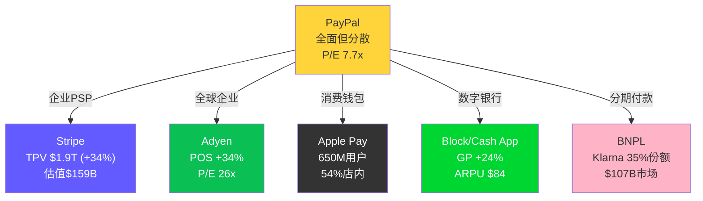
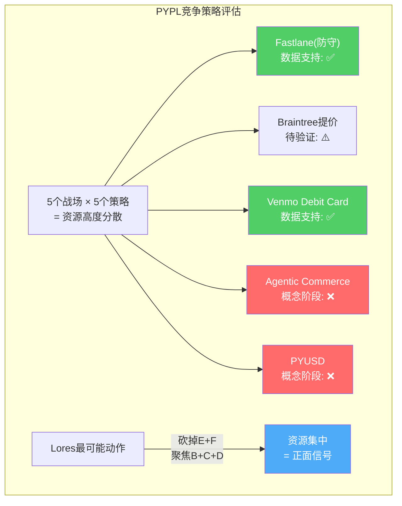

# Chapter 10: 竞争五杀 — Stripe/Adyen/Block/Apple Pay/BNPL逐一对标

## 10.1 PayPal的五线战争

PayPal的核心困境不只是增速放缓——而是它在五个不同的战场上同时面对五个不同类型的竞争对手，每个对手在各自的领域都比PayPal更专注、更高效。

## 10.2 战场1：Stripe — 企业PSP的王者

**Stripe vs PayPal Braintree正面对标**

| 维度 | Stripe | PayPal(Braintree) | 胜者 |
|------|--------|-------------------|:----:|
| TPV (2025) | $1.9T (+34%) | ~$1.18T (+20%) | Stripe |
| 估值 | $159B(2025 tender) | Braintree部分~$10-17B | Stripe 10x |
| Take rate | ~2.9%+$0.30/笔(标准) | ~0.30%(大企业) | Stripe(但不同客群) |
| 产品迭代速度 | 极快(API优先) | 中等 | Stripe |
| 开发者生态 | ⭐⭐⭐⭐⭐ | ⭐⭐⭐ | Stripe |
| 大企业关系 | 新建中 | 深厚(Uber/DoorDash等) | PYPL |
| 全球覆盖 | 46+国家 | 200+国家 | PYPL |

[DM-COMP-005: Stripe vs Braintree竞争对标]

**核心威胁**：Stripe的增速（34%）是Braintree（20%）的1.7倍——如果这个差距持续3年，Stripe的TPV将从$1.9T增至$4.6T，而Braintree仅从$1.18T增至$2.0T。**Braintree将从"与Stripe并驾齐驱"变为"Stripe的1/2"**。

**但Stripe的定价（2.9%+$0.30）是Braintree（0.30%）的10倍**——这意味着两者服务的是完全不同的客群。Stripe的核心客户是中小企业（愿意为好产品付高价），Braintree的核心客户是大企业（volume大、议价能力强、费率极低）。它们在中型企业（$1B-10B GMV）市场重叠——这是真正的竞争热区。

**因果推理**：因为Stripe在中型企业市场的产品体验显著优于Braintree（API质量、文档、开发者工具），所以中型企业在评估支付服务商时倾向选择Stripe而非Braintree。因为中型企业是Braintree利润率最高的客群（费率0.5-1.0%，高于大企业的0.30%），所以Stripe在这个市场的侵蚀直接打击Braintree的利润。

## 10.3 战场2：Adyen — 静默的企业猎手

Adyen是一个经常被忽视的威胁——因为它不做消费者业务，也不做PR，但它在大型全球企业市场正在系统性地取代PayPal。

| 维度 | Adyen | PayPal | 差异分析 |
|------|-------|--------|---------|
| POS volume(2025) | €311B (+34%) | 有限 | Adyen全渠道优势 |
| 收入增速guidance(2026) | 20-22% | 4-5% | Adyen 4-5x |
| OPM | 43% | 18% | Adyen 2.4x |
| 核心客户 | Spotify/Uber/Microsoft | DoorDash/Airbnb | 重叠 |
| 定位 | 纯B2B，不做消费者 | 混合(B2B+B2C) | Adyen更聚焦 |

[DM-COMP-006: Adyen vs PayPal企业竞争对标]

**Adyen的致命优势**：统一商务平台（unified commerce）。它为大型全球企业提供一个后台处理线上+线下+移动端的所有支付——一套API、一个仪表盘、一个对账流程。PayPal（Braintree）只做线上，线下需要通过Verifone合作——集成度远不如Adyen。

**这解释了为什么Uber同时使用Braintree（线上叫车支付）和Adyen（其他市场/全渠道）**——当企业需要全渠道解决方案时，Adyen比Braintree更完整。

## 10.4 战场3：Apple Pay — 系统级降维打击

Apple Pay不是PayPal的直接竞争对手——它是PayPal的**底层替代品**。

| 维度 | Apple Pay | PayPal |
|------|-----------|--------|
| 美国店内钱包份额 | **54%** | ~5%(估) |
| 线上支付份额 | 14.2% | **47.4%** |
| 全球用户 | 650M | 436M(但MAA仅222M) |
| 接入方式 | OS系统级(零摩擦) | App级(需跳转) |
| 商户成本 | 无额外费用(走卡网络) | 2.25% take rate |
| 数据归属 | 商户保留全部数据 | PayPal截断部分数据 |

[DM-COMP-007: Apple Pay vs PayPal竞争态势]

**Apple Pay的长期威胁是存在的但被过度恐慌**。关键数据：Apple Pay线上份额14.2% vs PayPal 47.4%——PayPal在线上仍领先3.3倍。Apple Pay的优势在店内（54%），但店内支付不是PayPal的核心利润池（PayPal几乎不做线下）。

**真正的风险是行为迁移**：当消费者在店内习惯了Apple Pay→线上也开始优先使用Apple Pay→商户发现Apple Pay不收PayPal那样的额外手续费（Apple Pay走信用卡网络，商户只付标准刷卡费2.5-3%，不用额外给PayPal 2.25%）→商户开始移除PayPal按钮、只保留Apple Pay。

**这个传导链在2025年仍处于早期阶段**——但如果Apple在2026-2027年推出更激进的线上支付产品（例如Apple Pay Later全面推广、Apple Checkout嵌入Safari/App Store），传导速度可能加快。

## 10.5 战场4：Block/Cash App — 消费金融生态

Block通过Cash App构建了一个PayPal/Venmo未能实现的东西——**全栈消费金融生态**。Cash App的ARPU ($84) 是Venmo ($26) 的3.2倍（Ch5），因为Cash App集成了直接存款、借记卡、股票/比特币交易、小额贷款。

| 维度 | Cash App | Venmo |
|------|----------|-------|
| ARPU | $84 | $26 |
| 毛利增速(Q3 2025) | +24% | +20% |
| 功能广度 | 存款+卡+投资+借贷+BNPL+Bitcoin | P2P+卡+Pay with Venmo |
| 货币化路径 | 多元(5+收入来源) | 有限(2-3收入来源) |
| 用户粘性 | 极高(工资直接存入) | 中等(P2P为主) |

[DM-COMP-008: Cash App vs Venmo对标]

**Block对PayPal的威胁不在直接竞争——而在用户时间份额的争夺。** 当用户的工资存入Cash App、用Cash App Card消费、用Cash App投资，Venmo就从"主要P2P工具"降级为"偶尔用一次的转账App"。

## 10.6 战场5：BNPL — 按钮位之争

BNPL（先买后付）市场在2025年达到$1074亿规模，预计2031年达$2584亿（CAGR 19.1%）[DM-COMP-009]。这个市场直接威胁PayPal的checkout按钮位——商户在checkout页面的空间有限，每增加一个BNPL按钮（Klarna/Affirm/Afterpay），PayPal按钮被删除的概率就增加。

**PayPal的BNPL位置**：
- PayPal Pay in 4（内嵌于PayPal ecosystem）
- 优势：庞大用户基础→即时获批率高→商户转化率好
- 劣势：不是独立BNPL品牌→消费者不知道PayPal有BNPL→Klarna品牌认知度远超PayPal BNPL

**Klarna是头号威胁**：35%全球BNPL份额，$2.8B收入，2025年从Affirm手中抢走Walmart合约——暗示Klarna正在赢得大型零售商户的BNPL独占协议。如果这种趋势延续，PayPal的BNPL可能被边缘化为"二线选择"。

## 10.7 综合竞争评估：PayPal在哪里能赢？

| 战场 | PayPal胜率 | 原因 |
|------|:---------:|------|
| 企业PSP(vs Stripe) | 30% | Stripe产品更好、增速更快 |
| 全球企业(vs Adyen) | 25% | Adyen全渠道优势+更高效率 |
| 消费钱包(vs Apple Pay) | 40% | 线上仍领先3.3x，但趋势不利 |
| 数字银行(vs Cash App) | 35% | Venmo有用户但功能不足 |
| BNPL(vs Klarna) | 40% | 有用户基础但品牌不清晰 |

**PayPal的唯一持久优势：消费者信任 + 全球覆盖**

在所有竞争对手中，PayPal是唯一一个同时拥有4.36亿消费者关系和200+国家覆盖的公司。Stripe/Adyen是纯B2B（不面对消费者），Apple Pay/Cash App是美国为主（全球化有限），Klarna是纯BNPL（功能单一）。

**如果PayPal能将这个"广度优势"转化为"深度优势"——通过Fastlane让消费者在更多场景使用PayPal，通过PayPal Open让商户获得完整工具箱——它仍然有防御空间。但这需要执行力，而执行力恰恰是Chriss时代暴露的短板。**

## 10.8 竞争格局的动态演化：3年预测

当前的竞争格局不是静态的——每个竞争对手都在演化。我们需要预测2029年的格局来评估PYPL的长期地位。

### 市场份额迁移预测

| 指标 | 2025 | 2029E(基准) | 驱动因素 |
|------|------|-----------|---------|
| PYPL线上支付份额 | 47.4% | 35-40% | Apple Pay/Shop Pay侵蚀 |
| Apple Pay线上份额 | 14.2% | 22-28% | 从店内迁移+Safari嵌入 |
| Stripe企业PSP份额 | ~29% | 35-40% | 产品优势+中型企业抢夺 |
| Adyen全渠道份额 | ~8.8% | 12-15% | POS+线上统一 |
| BNPL按钮渗透 | ~25%商户 | 40-50%商户 | Klarna+Affirm扩张 |

[DM-COMP-010: 竞争格局3年迁移预测]

**最大的不确定性：AI Agent购物（Ch12）是否成为主流。** 如果AI Agent在2028年处理10%+的电商交易，传统checkout页面（PayPal按钮的存在场所）将被绕过——这对PayPal的品牌checkout是生存级威胁，但对Braintree（作为后台处理商）影响较小。

### PayPal的竞争策略评估

**当前策略（Chriss遗产+Lores调整）**：
1. Fastlane守住品牌checkout（防守）
2. Braintree提价改善利润率（利润优先）
3. Venmo Debit Card深化用户货币化（内生增长）
4. Agentic Commerce布局AI入口（前瞻）
5. PYUSD布局跨境支付（机会主义）

**策略评估**：5个方向中只有Fastlane（#1）和Venmo Debit Card（#3）有数据支持。Braintree提价（#2）待验证。Agentic Commerce（#4）和PYUSD（#5）还在概念阶段。

**因果推理**：因为PayPal在5个战场同时作战、5个战略方向同时推进，所以管理层注意力和资本被高度分散。因为Chriss被解雇的原因之一就是"执行不达标"，所以分散的战略可能是执行失败的根因而非独立问题。因为Lores的HP经验以"聚焦+纪律"著称，所以他最可能的第一步是砍掉1-2个低优先级方向（PYUSD？Xoom？），集中资源在Fastlane+Venmo+Braintree提价上。**如果Lores做出这样的聚焦决策，是正面信号——说明他理解了PayPal的核心问题。**

## 10.9 竞争壁垒可量化评估

对每个战场，评估PayPal被完全替代的概率和时间窗口：

| 战场 | 被替代概率(5年) | 核心壁垒 | 壁垒耐久性 |
|------|:-------------:|---------|:---------:|
| 品牌checkout | 30% | 消费者信任+惯性+4.36亿账户 | 5-8年 |
| Braintree企业 | 15% | 深度API集成+切换成本(3-6个月迁移) | 3-5年 |
| Venmo P2P | 10% | 社交网络效应（朋友都用Venmo） | 5-10年 |
| 跨境支付 | 20% | 200+国家覆盖+合规牌照 | 8-10年 |
| BNPL | 50% | 几乎没有——Klarna/Affirm更专业 | 1-2年 |

[DM-COMP-011: 竞争壁垒持久性评估]

**核心发现：PayPal最持久的壁垒不在任何单一产品——而在"全球200+国家的合规牌照+消费者信任"。** 任何竞争对手要复制这个覆盖度需要5-10年和数十亿美元投入。Stripe(46国)、Adyen(40+国)、Apple Pay(90+国)都远不及PayPal的200+国家覆盖。

**但全球覆盖的经济价值正在下降**——因为电商越来越集中在美国+西欧+中国三大市场，长尾国家的交易量增长有限。PayPal在尼日利亚或越南有牌照，但这些市场的TPV贡献微乎其微。

## 10.10 Stripe深度对标：为什么Stripe值$159B而PYPL只值$56B？

这是投资者最应该深思的问题——两家公司都是支付公司，TPV接近（PYPL $1.79T vs Stripe $1.9T），但估值差3倍。

### 估值差异的三层解释

**第一层：增速差异（解释~40%的折价）**
- Stripe +34% vs PYPL +4.3% = 8倍增速差
- 按PEG 2.5x: Stripe合理P/E ~85x, PYPL合理P/E ~11x
- 这解释了为什么Stripe值$159B但不能完全解释PYPL只值$56B

**第二层：利润率差异（解释~30%的折价）**
- Stripe OPM估计30-35%（未公开，基于Adyen可比推断）
- PYPL OPM 18.3%
- Stripe的利润率高因为：(1)标准定价2.9%+$0.30不打折；(2)不需要维护消费者端产品（App/客服/品牌营销）；(3)纯API业务的边际成本极低
- PYPL的利润率低因为：(1)Braintree以0.30%费率处理大企业；(2)需要维护消费者品牌+客服；(3)运营多个产品线（Venmo/PYUSD/BNPL/Honey等）分散成本

**第三层：身份叙事差异（解释~30%的折价）**
- Stripe被定义为"支付基础设施的AWS"——开发者优先、API优先、平台模式
- PYPL被定义为"衰退中的消费支付品牌+低利润PSP"——身份模糊、增长放缓
- 叙事差异导致不同类型的投资者：Stripe吸引增长型投资者（愿付高倍数），PYPL吸引价值型投资者（要求低价+高现金流）

[DM-COMP-012: Stripe vs PYPL估值差异三层分析]

**关键洞察：如果将PYPL拆分为"品牌PayPal"（消费者钱包）和"Braintree"（企业PSP），Braintree独立后可能获得接近Adyen的估值倍数（10-15x EV/Revenue vs当前PYPL整体1.7x）——因为Braintree的增速（26%）和利润率（如果提价后5-8%→15-20%）与Adyen的profile更接近。** 这是分拆创造价值的真正来源——不在于业务本身变好，而在于估值框架从"混合体"切换为"纯PSP"。

### Stripe不上市的竞争含义

Stripe选择不IPO（通过二级市场tender以$159B估值交易）意味着：
1. Stripe不需要季度报告→可以长期投资而不受短期利润压力
2. Stripe不需要满足公开市场投资者的增长预期→可以策略性地低价竞标大客户（赔本2-3年抢Uber/Amazon等标杆客户）
3. 这对Braintree是长期劣势——Braintree是上市公司的一部分，需要每季度证明利润率→不能像Stripe那样激进定价

## 10.11 CQ竞争总结与关键监控

**EQ2闭环：新型支付公司能否颠覆PYPL？护城河到底多深？**

新型支付公司（Stripe/Adyen/Block）**已经在颠覆PayPal的部分业务**——Stripe在中型企业PSP市场、Adyen在全球企业全渠道市场、Cash App在年轻用户消费金融市场。Apple Pay在移动端。Klarna在BNPL。

但"颠覆"不等于"消灭"。PayPal的4.36亿消费者账户+200+国家覆盖+$1.68T TPV是一个巨大的存量资产——完全替代需要10年+。更现实的情景是PayPal被逐渐边缘化——从"支付行业主导者"变为"众多选择之一"。这个过程已经在发生（线上份额从2020年的~55%降至2025年的47.4%），速度约-1.5pp/年。

**关键监控指标**：
| 指标 | 当前值 | 红线（确认加速衰退） |
|------|--------|-------------------|
| 线上支付份额 | 47.4% | <40% |
| Stripe TPV增速差 | PYPL -27pp | >-35pp |
| 品牌checkout增速 | +1% | <0% 连续2Q |
| 大商户流失数 | 未知 | >5家/年(可追踪) |

---

> **DM锚点注册表 (Ch10)**
>
> | ID | 描述 | 来源 |
> |----|------|------|
> | DM-COMP-005 | Stripe TPV $1.9T (+34%), 估值$159B | Industry reports |
> | DM-COMP-006 | Adyen POS €311B (+34%), 收入增速guidance 20-22% | Adyen financials |
> | DM-COMP-007 | Apple Pay 54%店内/14.2%线上 vs PYPL 47.4%线上 | Industry data |
> | DM-COMP-008 | Cash App ARPU $84 vs Venmo $26 (3.2x差距) | Earnings data |
> | DM-COMP-009 | BNPL市场: $107B(2025)→$258B(2031), Klarna 35%份额 | GlobeNewswire |
