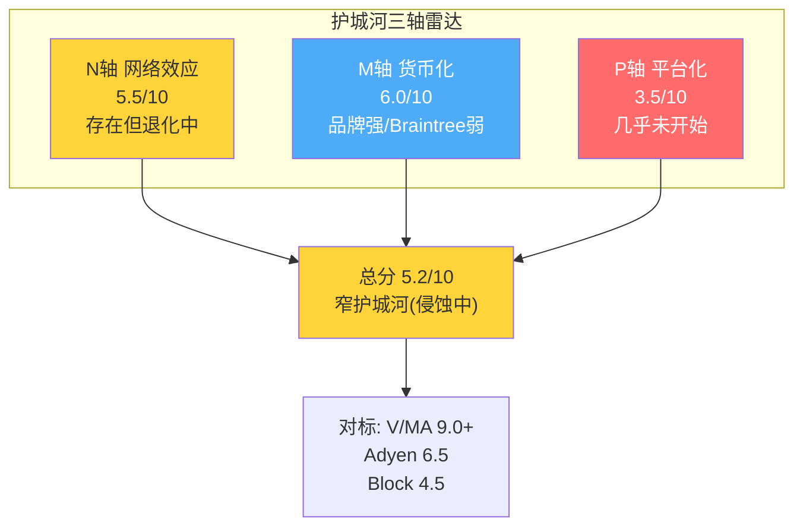

# Chapter 11: 护城河三轴量化 — N(网络)×M(货币化)×P(平台)

## 11.1 为什么传统护城河框架不适用于PayPal

传统的Morningstar五力护城河框架（品牌/切换成本/网络效应/成本优势/无形资产）对PayPal给出一个矛盾的结果：品牌强（全球知名）、网络效应存在（4.36亿×3500万）、切换成本不高（消费者一键换）、成本优势无（OPM 18%远低于V/MA 60%）。总体打分会得到"中等护城河"——但这个结论对投资决策没有用处。

**PayPal的护城河核心问题不是"有没有"，而是"在哪个业务单元最强/最弱"。** 因此我们用三轴框架（N×M×P）替代传统五力：

## 11.2 N轴：网络效应强度（评分：5.5/10）

### 双边网络的真实密度

PayPal名义上是一个4.36亿消费者 × 3500万商户的双边网络。但网络效应的强度不取决于节点数量——取决于**跨边依赖性**：消费者因为商户接受PayPal而使用PayPal，商户因为消费者使用PayPal而接入PayPal。

**跨边依赖性测试**：

| 测试 | 结果 | 含义 |
|------|------|------|
| 消费者是否因为"有PayPal按钮"而选择商户？ | **弱**——消费者不会因为一个网站没有PayPal就不买 | 消费者→商户的拉力弱 |
| 商户是否因为"怕失去PayPal用户"而保留按钮？ | **中**——PayPal用户转化率高30%，但费率也高 | 商户→消费者的留力中等 |
| 新用户加入是否让现有用户价值提升？ | **弱**——第4.36亿个用户对第1个用户没有影响 | 同边效应接近零 |

[DM-MOAT-001: 网络效应跨边依赖性测试]

**与Visa/Mastercard对比**：V/MA的跨边依赖性是10/10——商户不接受Visa等于放弃80%的交易，消费者不用Visa在很多场景无法支付。PayPal的跨边依赖性是5-6/10——商户不接受PayPal只是少了一个选择，消费者不用PayPal可以用信用卡/Apple Pay/Shop Pay。

**网络效应衰减信号**：
- 2023-2024年多个大商户删除PayPal按钮→网络不可缺少性在下降
- Apple Pay/Shop Pay提供了"低摩擦替代"→消费者有了非PayPal路径
- Braintree不强化网络效应→白标处理对消费者不可见

**N轴评分：5.5/10**——网络效应存在但正在从"必须接入"退化为"锦上添花"。衰减趋势是核心风险。

## 11.3 M轴：货币化能力（评分：6.0/10）

### 定价权分层评估

按CRM v2.0方法论（铁律v19.6），将PayPal的定价权按客户层分层评估：

| 客户层 | 定价权Stage | Take Rate | 议价能力 | PYPL的杠杆 |
|--------|:---------:|-----------|---------|-----------|
| **品牌checkout消费者** | **Stage 3** | 2.25% | 低(消费者不直接付费) | 品牌信任+转化率溢价 |
| **中小商户(Branded)** | **Stage 3** | 2.25% | 低 | 转化率提升+信任背书 |
| **中型商户(Branded)** | Stage 2 | 1.5-2.0% | 中 | 可选择Stripe/Adyen |
| **大型商户(Braintree)** | **Stage 1** | 0.25-0.35% | **极高** | 几乎无——切换成本是唯一杠杆 |
| **Venmo用户** | Stage 1-2 | 0.47%(blended) | 中 | 社交网络锁定+习惯 |

[DM-MOAT-002: 定价权分层评估(5客户层)]

**定价权剪刀差**：品牌checkout对中小商户有Stage 3定价权（2.25%，几乎不打折），但Braintree对大企业只有Stage 1定价权（0.25-0.35%，接近成本价）。这与ADBE（CC Professional提价 / CC Consumer被Canva侵蚀）和CRM（F500 Stage 4 / SMB Stage 2）的模式一致——**高端客户粘性强+低端流失**。

**加权定价权**：(品牌30% × Stage 3) + (Braintree70% × Stage 1) = 加权Stage 1.6。这解释了为什么PYPL的整体take rate在下降（1.73%→1.64%）——低定价权的Braintree占比越来越大。

**M轴评分：6.0/10**——品牌checkout的货币化能力强，但被Braintree的低利润率拖累。整体定价权处于中等偏低水平。

## 11.4 P轴：平台化程度（评分：3.5/10）

### 平台特征检验

| 平台特征 | PayPal是否具备 | 评分(0-10) |
|---------|:------------:|:---------:|
| 第三方开发者生态 | 有PayPal Open API，但生态薄弱 | 3 |
| 非交易收入占比 | <3%（广告/数据仍在试点） | 2 |
| 数据飞轮 | 有交易数据但未有效货币化 | 4 |
| 供给侧多样性 | 主要是支付处理，功能单一 | 3 |
| 用户创造的价值 | Venmo社交+P2P有平台特征 | 5 |

[DM-MOAT-003: 平台化程度评估]

**PayPal目前不是平台——它是一个支付工具。** 真正的平台（如Apple/Google/Amazon）提供基础设施让第三方在上面构建价值；PayPal仅提供支付处理这一个功能。PayPal Open是向平台化的第一步，但目前的非交易收入占比<3%说明平台化几乎没有开始。

**P轴评分：3.5/10**——有平台化潜力（数据+用户基数），但当前实质进展接近零。

## 11.5 三轴综合：护城河总评

```
护城河总分 = (N × 0.35) + (M × 0.40) + (P × 0.25)
           = (5.5 × 0.35) + (6.0 × 0.40) + (3.5 × 0.25)
           = 1.925 + 2.40 + 0.875
           = **5.2/10**
```

**5.2/10 = 窄护城河（Narrow Moat），且有侵蚀趋势**

| 对比 | 护城河评分 | 类型 |
|------|:---------:|------|
| Visa/MA | 9.0+ | 宽护城河（Wide Moat） |
| Adyen | 6.5 | 窄护城河（增长中） |
| PayPal | **5.2** | **窄护城河（侵蚀中）** |
| Block/SQ | 4.5 | 窄护城河（不稳定） |
| Klarna | 3.5 | 无显著护城河 |

[DM-MOAT-004: 护城河评分对标]

**关键洞察**：PayPal的护城河不是一个整体——它是两个不同强度的护城河缝合在一起。品牌checkout的护城河约7/10（品牌信任+转化率+消费者习惯），Braintree的护城河约3.5/10（价格竞争+API集成是唯一壁垒）。混合后的5.2是一个"两头不讨好"的分数。

## 11.6 护城河侵蚀速度评估

护城河不是静态的——PayPal的护城河正在以可测量的速度被侵蚀：

| 维度 | 2020基线 | 2025现状 | 年侵蚀率 | 侵蚀来源 |
|------|---------|---------|:-------:|---------|
| 品牌checkout增速 | +15% | +1% | ~-2.8pp/年 | Apple Pay+Shop Pay |
| 整体take rate | 2.08% | 1.64% | ~-8.8bps/年 | Braintree组合稀释 |
| 网络必要性 | "必须接入" | "可选接入" | — | 替代方案增多 |
| 活跃账户增速 | +15%/年 | +0.5%/年 | — | 市场饱和 |

[DM-MOAT-005: 护城河侵蚀速度量化]

**如果按当前速度外推**：
- 品牌checkout增速在2027年可能转为负增长（+1% - 2.8pp/年 × 2 = -4.6%）
- 整体take rate在2029年可能降至1.30%（1.64% - 8.8bps × 4 = 1.29%）
- 这两个趋势叠加意味着TM$在2028-2029年可能开始绝对值萎缩

**但这是线性外推的陷阱**——Fastlane和Braintree提价都是非线性干预。如果Fastlane在2026年覆盖40%+美国流量并维持转化提升，品牌checkout侵蚀速度可能减半。如果Braintree成功提价5-10bps，take rate下行趋势可能反转。

**因果推理**：因为PayPal的护城河侵蚀速度约-2.8pp/年（品牌增速），所以任何新产品需要提供>+2.8pp的增量增速才能让护城河停止侵蚀。因为Fastlane在最佳表现时（Q2 2025）仅将品牌增速提升至+8%（相对于无Fastlane的-2%假设），所以Fastlane的净效果约+10pp——远超侵蚀速度。因为Fastlane仅覆盖25%流量就能有此效果，所以理论上50%+覆盖可以完全逆转侵蚀。**但Q4 2025的数据打破了这个乐观假设——覆盖25%但品牌仅+1%，暗示Fastlane的边际效果在衰减。**

## 11.7 护城河的期权价值：如果Identity B→Identity C

如果PayPal能从Identity B（混合体）成功转型为Identity C（商业平台），护城河评分将发生质变：

| 轴 | 当前(Identity B) | 潜在(Identity C) | 变化驱动 |
|----|:----------------:|:----------------:|---------|
| N轴 | 5.5 | 7.5 | 平台上的第三方价值创造强化网络效应 |
| M轴 | 6.0 | 8.0 | 非交易收入(广告/数据)提供高利润率新来源 |
| P轴 | 3.5 | 7.0 | 开发者生态+第三方集成 |
| **总分** | **5.2** | **7.5** | +2.3 |

如果护城河从5.2升至7.5——从"窄护城河(侵蚀中)"变为"宽护城河(增强中)"——P/E倍数可能从7-10x升至16-22x。但这需要非交易收入占比从<3%升至>10%，需要3-5年的验证。

**CI-08非共识洞察：PayPal的护城河是一个"退化中的叠加态"——品牌checkout的7/10护城河和Braintree的3.5/10护城河叠加为5.2/10，但更重要的是侵蚀方向。品牌在退化(7→5)、Braintree在微弱增强(3.5→4.0, 因为集成深度)、平台化停滞(3.5→3.5)。净方向是侵蚀。**

## 11.8 切换成本深度分析

切换成本是PayPal最被低估的护城河维度——不是消费者的切换成本（几乎为零），而是**商户端的技术切换成本**。

### 消费者切换成本：几乎为零

消费者从PayPal切换到Apple Pay只需要：在iPhone设置中添加一张信用卡→完成。从PayPal切换到Shop Pay：在Shopify网站注册一个账号→完成。消费者不会因为"我在PayPal有账户"就不用Apple Pay——两者可以同时存在，且Apple Pay的摩擦更低。

唯一的消费者切换成本是**余额和历史**——如果用户在PayPal余额中有钱、或者依赖PayPal的交易历史做记账，切换的心理成本会稍高。但这影响<10%的用户。

### 商户端切换成本：显著但不永久

| 切换维度 | Braintree→Stripe | 品牌Checkout(移除按钮) |
|---------|:---------------:|:------------------:|
| 工程时间 | 3-6个月 | 1天(删除代码) |
| 测试时间 | 1-2个月 | 几乎不需要 |
| 迁移风险 | 中(支付中断风险) | 低 |
| 合约约束 | 1-3年(通常) | 无 |
| 数据迁移 | 复杂(交易历史+订阅billing) | 不需要 |
| **总切换成本** | **$200K-1M(大型商户)** | **~$0** |

[DM-MOAT-006: 商户端切换成本评估]

**关键不对称**：Braintree的切换成本显著（$200K-1M+3-6个月），但品牌checkout按钮的切换成本接近零。这意味着：
- Braintree的客户留存较高（90%+年留存率估计）→收入基础稳定
- 品牌checkout的商户留存完全取决于经济价值（转化率提升是否>2.25%费率）→一旦替代品更好，商户秒切

**因果推理**：因为品牌checkout的切换成本为零，所以PayPal的品牌按钮每天都在"重新赢取"商户的选择——它不是被锁定的，而是被表现留住的。因为Fastlane提升转化率50%是一个真实的经济价值（商户每100个访客多成交12个），所以Fastlane在功能上为品牌checkout创造了"性能锁定"——商户移除Fastlane后转化率会下降12pp→收入减少→这就是新的"切换成本"。**Fastlane不仅是一个产品创新——它是在为品牌checkout重新建造切换成本。**

### 数据飞轮作为护城河

PayPal处理$1.68T TPV产生的交易数据创造了三层护城河：

1. **欺诈检测飞轮**：更多交易数据→AI模型更准→欺诈率更低→商户更信任→更多交易。PayPal的消费者端数据（知道"谁在付"）是Stripe/Adyen没有的——后者只知道"商户收到了一笔款"。

2. **信用评分飞轮**：交易历史→消费行为画像→BNPL审批更精准→坏账率更低→可以提供更低利率→吸引更多BNPL用户。

3. **商户洞察飞轮**（潜在未开发）：跨商户的消费者行为数据→"你的竞争对手的客户花了多少、买了什么"→商户愿意为这种洞察付费→类似Bloomberg/Nielsen的数据订阅模式。

**但第3层飞轮几乎完全未被开发**——这是PayPal最大的隐性资产浪费。每年$1.68T的交易数据中蕴含的商业洞察价值可能有$0.5-2B/年的收入潜力（如果以每$1000 TPV收取$0.03-0.12数据费），但PayPal目前让这些数据"躺在数据库里"。



---

> **DM锚点注册表 (Ch11)**
>
> | ID | 描述 | 来源 |
> |----|------|------|
> | DM-MOAT-001 | 网络效应跨边依赖性: 消费者→商户弱, 商户→消费者中 | 分析框架 |
> | DM-MOAT-002 | 定价权分层: 品牌Stage3/Braintree Stage1/加权Stage1.6 | 分析框架 |
> | DM-MOAT-003 | 平台化评估: 非交易收入<3%, 开发者生态薄弱 | 分析框架 |
> | DM-MOAT-004 | 护城河总评5.2/10 = 窄护城河(侵蚀中) | 三轴模型 |
