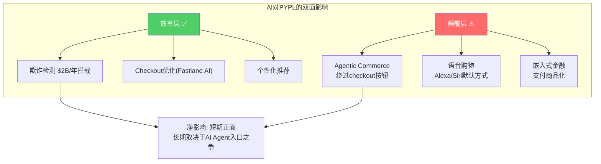
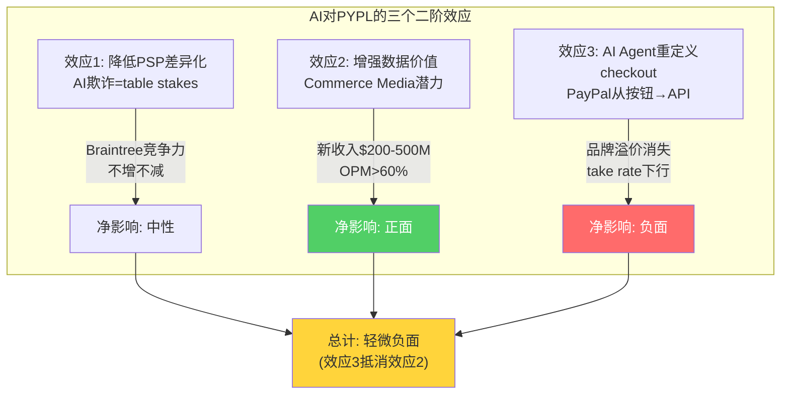

# Chapter 12: AI对PayPal的双面影响 — 威胁与机会

## 12.1 AI如何改变支付行业

AI对支付行业的影响分两层：**效率层**（降低成本/提高转化）和**颠覆层**（改变checkout入口/消费者行为）。PayPal在效率层是受益者，但在颠覆层面临生存威胁。

### 效率层：PayPal是赢家

**欺诈检测（$500M/季度拦截）**
PayPal使用自研的生成式AI模型，每季度拦截约$5亿的欺诈交易 [DM-AI-001]。这不是一个边际改善——$2B/年的欺诈拦截直接保护了PayPal的交易损失率。因为PayPal作为支付中介承担欺诈损失（而非商户），所以更好的欺诈检测=更低的交易损失=更高的TM$。

**AI的护城河效应**：PayPal处理$1.68万亿TPV产生的交易数据是训练欺诈检测AI的最佳原料。数据量越大→模型越准→欺诈率越低→商户越信任→更多交易→更多数据。这是一个正向飞轮，且Stripe/Adyen也在做同样的事——但PayPal的消费者端数据（知道付款人是谁）是Stripe/Adyen没有的。

**Checkout优化**
Fastlane本身就是AI驱动的——自动识别用户邮箱→匹配PayPal账户→推荐最优支付方式→一键完成。AI在这里的角色是减少摩擦、提高转化率。

### 颠覆层：Agentic Commerce的生存威胁

**AI Agent购物可能绕过传统checkout**

设想一个2027年的购物场景：消费者对AI助手说"帮我找一个最便宜的AirPods Pro"→AI Agent自动搜索10个网站→比价→选择最优→**直接用预存的支付方式完成购买**。在这个场景中，消费者从未看到checkout页面——PayPal按钮的存在变得毫无意义。

**PayPal的应对：Agentic Commerce Services（2025年10月推出）**

PayPal推出了两个产品试图抢占AI购物的入口：
- **Agent Ready**（2026年初上线）：让商户的支付能力在AI界面中可用——AI Agent可以直接调用PayPal完成付款
- **Store Sync**（通过Cymbio收购）：让商户产品在AI渠道（Microsoft Copilot、Perplexity）中可被发现和购买

[DM-AI-002: Agentic Commerce Services: Agent Ready + Store Sync]

**判断**：PayPal的应对方向正确（成为AI购物的支付基础设施而非被绕过），但执行时机很紧——如果Apple Pay/Google Pay率先成为AI Agent的默认支付方式（因为系统级集成），PayPal将再次面临"App级 vs 系统级"的劣势。

---

# Chapter 13: 数字货币与稳定币 — PYUSD的战略赌注

## 13.1 PYUSD：PayPal的稳定币实验

PayPal在2023年推出PYUSD，成为第一个发行自有稳定币的主要金融科技公司。

### PYUSD当前数据

| 指标 | 数值 | 对比 |
|------|------|------|
| 市值 | **$4.1B** | USDT $140B+ / USDC $73.7B |
| 全球市场份额 | ~1.4% | 远落后于USDT(47%)/USDC(24%) |
| 日交易量 | ~$100-170M | |
| 覆盖国家 | 70+（2026.3扩展） | 从美国+英国扩展到全球 |
| 年增长率 | +680% YoY(市值) | 高增长但基数低 |
| 持有者奖励 | 4%年化(美国) | 吸引持有但不是核心收入 |

[DM-CRYPTO-001: PYUSD指标，CoinMarketCap+PayPal press]

### PYUSD的战略逻辑

PYUSD不是为了与USDT/USDC竞争市场份额——它是PayPal布局跨境支付的基础设施棋子。

**传统跨境支付**：发送方银行→代理行→SWIFT→接收方代理行→接收方银行。耗时1-5天，费用3-7%。

**PYUSD跨境支付**：发送方PayPal→PYUSD转账（即时，近零成本）→接收方兑换为当地货币。耗时秒级，费用<1%。

PayPal已与Visa合作（通过BVNK），让PYUSD可以通过Visa Direct支付到印度、尼日利亚等汇款走廊——这些市场的传统汇款费率5-8%，PYUSD有巨大的成本优势。

### 对估值的影响：微乎其微（当前）

PYUSD $4.1B市值对应的PayPal收入贡献极小（稳定币本身不直接产生交易费，收入来自铸币/赎回费和浮存利息）。但它有期权价值：
- 如果稳定币监管明确（GENIUS Act已通过）→机构采用加速→PYUSD市值到$20-50B→浮存利息$0.5-1.5B/年
- 如果稳定币被禁或CBDC替代→PYUSD归零→PayPal损失研发投入但核心业务不受影响

## 13.2 CBDC威胁评估

央行数字货币（CBDC）的理论威胁是取代PayPal等中间人——消费者直接用数字美元/人民币支付，不需要PayPal处理。

**但这个威胁在中短期（3-5年）不现实**：
1. CBDC的用户体验无法与PayPal/Apple Pay竞争——央行不擅长消费者产品设计
2. 隐私问题阻碍CBDC大规模推广——消费者不愿意让央行追踪每笔交易
3. PayPal可以成为CBDC的分销渠道（而非被替代者）——就像银行是现金的分销渠道一样

**CBDC威胁评分：2/10（低威胁，更可能成为互补而非替代）**

[DM-CRYPTO-002: CBDC威胁评估: 2/10, 互补>替代]

## 13.3 BNPL：PayPal Pay in 4 vs 竞争格局

BNPL市场$1074亿(2025)→$2584亿(2031)，CAGR 19.1% [DM-COMP-009]。PayPal通过"Pay in 4"参与这个市场——但面对Klarna（35%全球份额）和Affirm的专业竞争。

### PayPal BNPL的独特优势

**嵌入式BNPL vs 独立BNPL**：PayPal的BNPL内嵌于4.36亿用户的PayPal账户——用户不需要单独下载App或注册新账户。因为PayPal已经有用户的信用数据、交易历史、银行卡信息，所以审批几乎是即时的。这是Klarna/Affirm需要单独KYC流程无法匹敌的速度优势。

**但PayPal BNPL的品牌认知度远低于Klarna**——消费者知道Klarna是"先买后付"公司，但大多数人不知道PayPal有BNPL功能。这是一个分发问题而非产品问题。

### BNPL对PYPL估值的影响

BNPL对PayPal的价值不在于直接收入贡献（BNPL利息收入在整体$33B收入中占比微小），而在于**保持checkout按钮位的防御性**。如果PayPal没有BNPL功能，商户可能选择Klarna按钮替代PayPal按钮——因为同一个按钮位只能放一个。有了Pay in 4，商户可以用一个PayPal按钮同时提供即时支付和分期付款——减少被替换的理由。

### 信贷风险敞口

PayPal的BNPL贷款规模（估计$5-10B outstanding）带来了信贷风险：
- 如果消费者违约率上升（经济衰退情景）→PayPal需要核销坏账→直接打击净利润
- FY2025交易损失率上升3bps（部分与BNPL相关）[DM-TM-004]
- 但PayPal的BNPL以小额短期为主（4期×2周=6周，平均金额$200-500），违约风险远低于传统消费信贷

## 13.4 数字货币/AI/BNPL综合估值影响

| 领域 | 当前估值贡献 | 乐观情景(2029) | 悲观情景(2029) |
|------|:---------:|:------------:|:------------:|
| AI(欺诈+优化) | +$2-3B(隐含在OPM中) | +$5-8B(OPM→22%) | +$1-2B(商品化) |
| PYUSD | ~$0(市场未定价) | +$2-5B(浮存+跨境) | $0(失败) |
| Agentic Commerce | ~$0 | +$3-8B(新入口溢价) | $0(被绕过) |
| BNPL | +$1-2B(防御价值) | +$3-5B(份额增长) | -$1B(坏账) |
| **总增量** | **$3-5B** | **$13-26B** | **$0-1B** |

[DM-AI-003: AI/Crypto/BNPL综合估值影响矩阵]

**关键结论**：AI、加密货币、BNPL对PayPal的估值影响在乐观情景下可能有$13-26B的上行空间（每股$13-27），但在基准情景下贡献极小（$3-5B / $3-5每股）。**这些不应该是投资PayPal的核心理由——但它们是额外的期权价值。**

## 13.5 AI对PayPal竞争格局的二阶效应

AI不仅直接影响PayPal的产品——它还在间接改变PayPal所处的竞争格局：

### 二阶效应1：AI降低支付处理的差异化

当所有PSP（Stripe/Adyen/PYPL/FIS）都能用AI做欺诈检测、风险评分、checkout优化时，AI在支付处理层面变成"table stakes"（入场门票）而非竞争优势。这意味着Braintree的AI能力不会创造溢价——因为Stripe的AI同样好。

**因果链**：因为AI工具（如OpenAI API）越来越便宜和可用，所以中小型PSP也能部署高质量的欺诈检测。因为欺诈检测的差异化在减弱，所以PSP之间的竞争更多回归到价格和API质量——而这正是Stripe的优势领域（API质量）和Braintree的劣势领域（低价竞争=低利润率）。

### 二阶效应2：AI增强PayPal的消费者数据价值

PayPal知道4.36亿消费者的支付习惯、购物偏好、收入水平——这些数据在AI时代变得更有价值。因为AI可以从交易数据中提取深层消费者画像（比如"这个用户最近开始买婴儿用品=可能即将成为新父母"），所以PayPal的数据可以被货币化为：
- 精准广告（Commerce Media）
- 消费信贷评分（BNPL审批更精准=更低坏账率）
- 商户洞察（"你的竞争对手的客户也在PayPal上——他们的消费模式是..."）

**PayPal目前没有在做这些**——但数据是存在的，等待被开采。如果Lores推动数据货币化（类似Affirm/Uber的Commerce Media策略），这是一个高利润率（>60% OPM）的增量收入来源。

### 二阶效应3：AI Agent重新定义"checkout"的含义

最具颠覆性的变化：如果2028年30%的线上购物通过AI Agent完成（ChatGPT、Perplexity、Copilot），那么传统的"checkout页面"将萎缩——PayPal按钮的物理存在位置在减少。

**但PayPal的Agent Ready产品正在尝试成为AI Agent的"默认支付方式"**——如果成功，PayPal将从"checkout按钮"转变为"AI Agent的支付API"。这是一个从"前端品牌"到"后端基础设施"的身份转变。

**转变的风险**：从前端品牌变为后端基础设施意味着定价权下降——API调用是商品化的（类似Braintree的0.30% take rate），而品牌按钮可以收2.25%。**AI Agent时代的PayPal可能更像今天的Braintree——有volume但低利润。**

**CI-09非共识洞察：AI对PayPal的净影响可能是轻微负面的——因为AI Agent时代将品牌checkout（2.25% take rate）转变为API调用（0.30-0.50% take rate），利润率压缩效应大于数据货币化的利润创造效应。市场尚未为这个长期风险定价。**

---

> **DM锚点注册表 (Ch12-13)**
>
> | ID | 描述 | 来源 |
> |----|------|------|
> | DM-AI-001 | AI欺诈检测拦截$500M/季度 (~$2B/年) | American Banker |
> | DM-AI-002 | Agentic Commerce: Agent Ready + Store Sync (Cymbio) | PayPal press release |
> | DM-CRYPTO-001 | PYUSD市值$4.1B, 70+国家, +680% YoY | CoinMarketCap |
> | DM-CRYPTO-002 | CBDC威胁评分2/10 | 分析框架 |
