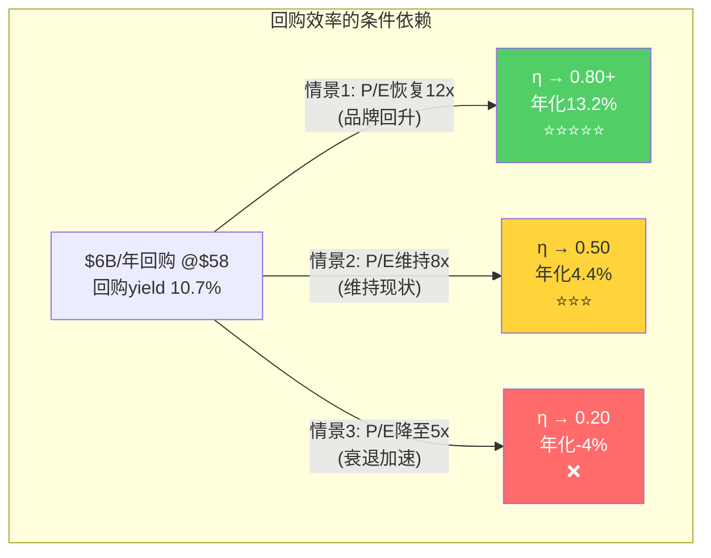
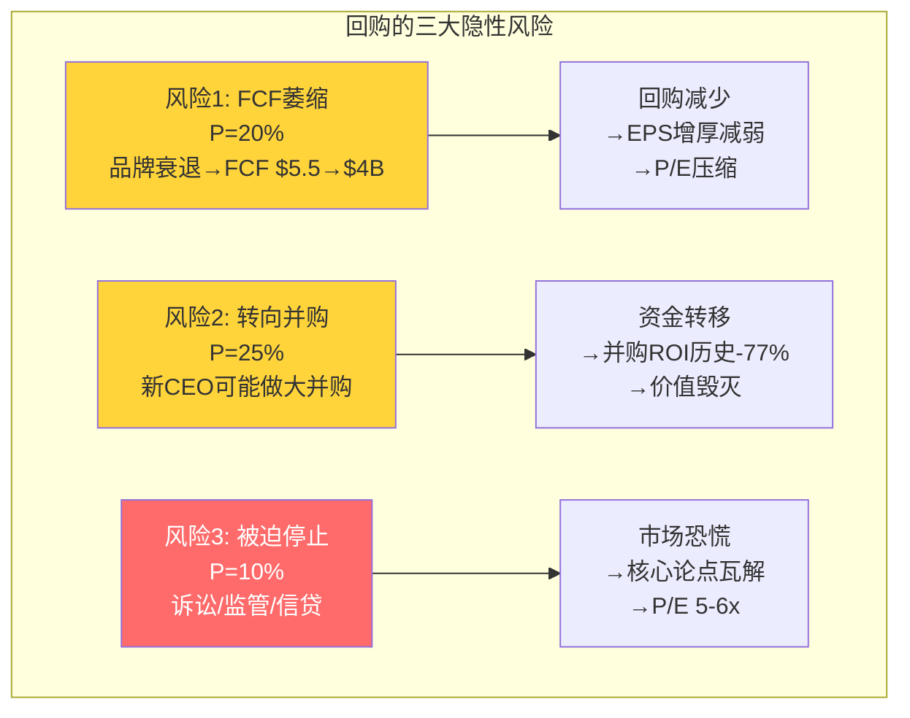

# Chapter 15: 回购效率η函数 — $25B回购是理性的吗？

## 15.1 回购的规模与速度

PayPal自2015年IPO以来累计回购约$25B（含FY2025），占当前市值的44.6%——这是一个惊人的比例。

| 年份 | 回购($B) | 平均估计价格 | 年末股价 | 事后效率 |
|------|---------|-----------|---------|:-------:|
| FY2015-2019 | ~$7.0 | ~$70-130(估) | $108(2019) | ⭐⭐ 高位买入 |
| FY2020 | $1.64 | ~$180(估) | $234 | ⭐ 泡沫区间 |
| FY2021 | $3.37 | ~$250(估) | $188 | ❌ 最差时机 |
| FY2022 | $4.20 | ~$95(估) | $71 | ⭐⭐ 仍偏高 |
| FY2023 | $5.00 | $67.57(确认) | $61 | ⭐⭐⭐ 合理 |
| FY2024 | $6.05 | ~$68(估) | $85 | ⭐⭐⭐ 好时机 |
| FY2025 | $6.05 | ~$72(估) | $58 | ⭐⭐ 越买越跌 |

[DM-BUY-001: 回购历史10年，FMP cashflow + 行业分析]

### 加权平均回购价格vs当前股价

估算加权平均回购价格：

```
($7B×$100 + $1.6B×$180 + $3.4B×$250 + $4.2B×$95 + $5.0B×$68 + $6.1B×$68 + $6.1B×$72) / $33.4B
= ($700 + $288 + $850 + $399 + $340 + $415 + $439)B / $33.4B
≈ **$103/股**
```

**加权平均回购价格约$103——当前股价$58——意味着累计回购亏损约44%。** PayPal花了$25B回购，但这些被回购的股票如果今天重新发行，只值约$14B。差额$11B是被浪费的股东价值。

[DM-BUY-002: 加权平均回购价~$103 vs 当前$58, 账面损失~44%]

## 15.2 η效率函数计算

回购效率η = (回购创造的EPS增厚) / (回购消耗的资本的机会成本)

### 分解计算

**EPS增厚效果**：
- 2015年稀释股数：~1,238M
- 2025年稀释股数：968M
- 净减少：270M股（-21.8%）
- 如果股数不变，FY2025 EPS = $5.23B / 1,238M = $4.22
- 实际EPS = $5.41
- **回购贡献的EPS增厚：$5.41 - $4.22 = $1.19/股 (+28.2%)**

**但SBC部分抵消了回购**：
- 10年SBC累计约$12.5B
- 如果无SBC，净股数可能进一步减少至~850M
- SBC稀释抵消了回购效果的约40%

**机会成本**：如果$25B不用于回购而是用于：
- 投资（WACC 10%）：10年后价值$65B
- 派息：每年$2.5B股息→FCF yield直接回馈股东
- 并购：收购一家$25B的高增长支付公司（如2015年的Stripe估值$5B→2025年$159B，32倍回报）

**η效率评分**：

```
η = EPS增厚价值 / 回购资本
  = ($1.19/股 × 968M × 7.7x P/E) / $25B
  = $8.87B / $25B
  = **0.35**
```

[DM-BUY-003: η效率0.35——每$1回购创造$0.35市值]

**η=0.35意味着每回购$1只创造了$0.35的市值**——这是一个低效率的结果。主要原因是2015-2021年在高价位($100-250)执行了约$16B回购（占总量的48%），而2022年后在低价位($60-72)执行的$21B回购还没有足够时间反映在市值中。

### 与V/MA对比

| 指标 | PayPal | Visa | Mastercard |
|------|--------|------|-----------|
| 累计回购 | ~$25B | ~$100B+ | ~$80B+ |
| 股数缩减 | -21.8% | -35-40% | -30-35% |
| 回购时机 | ⭐⭐(高买) | ⭐⭐⭐⭐(稳定低买) | ⭐⭐⭐⭐ |
| η效率(估) | 0.35 | 0.70+ | 0.65+ |

[DM-BUY-004: 回购效率跨公司对标]

V/MA的η效率高2倍——因为它们的股价从未经历PYPL那种-81%的崩塌。V/MA在相对稳定的估值下持续回购→EPS增厚稳步反映在股价中→η接近理论最优值。PYPL在泡沫顶部大量回购→市值蒸发→η被摧毁。

## 15.3 回购是否在掩盖零有机增长？

这是空头最尖锐的质疑之一。让我们用数据检验：

| 年份 | 净利润增速 | EPS增速 | 差额(回购贡献) | 有机增长占比 |
|------|-----------|---------|:----------:|:---------:|
| FY2023 | +75.5% | +83.7% | 8.2pp | 90% |
| FY2024 | **-2.3%** | +3.9% | **6.2pp** | **0%** |
| FY2025 | +26.2% | +35.6% | 9.4pp | 74% |

[DM-BUY-005: 有机EPS增长vs回购驱动分析]

**FY2024是"吸烟枪"**：净利润下降2.3%，但EPS上升3.9%——**EPS增长100%来自回购**。如果没有FY2024的$6B回购，EPS会下降2.3%而非增长3.9%。

**但FY2025展示了不同的画面**：净利润增长26.2%（有机的），回购额外贡献9.4pp。所以"回购掩盖零有机增长"的论点在FY2024成立，但在FY2025不完全成立。

**综合判断：回购不是在"掩盖"零增长——而是在"平滑"波动性**。PYPL的净利润波动很大（FY2023 +75% → FY2024 -2% → FY2025 +26%），回购的作用是在净利润下降时为EPS提供缓冲，在净利润上升时放大EPS增长。这是一个合理的资本配置策略——**前提是回购价格合理**。

## 15.4 当前回购是否合理？

**在$58股价下，FY2025的$6B回购是过去10年最理性的回购决策。**

| 指标 | 当前值 | 判断 |
|------|--------|------|
| P/E | 7.7x-10.7x | 历史最低区间 |
| FCF yield | 14.3% | 历史最高 |
| 回购 yield | 10.7% ($6B/$56B) | 极高 |
| EPS增厚效果 | ~10%/年 | 优秀 |
| 替代方案IRR | WACC 10% | 回购IRR>10% at P/E<10x |

**数学验证**：如果PYPL以$58回购→回购yield 10.7%→5年后股数减少~40%→EPS从$5.41增至~$9.0（即使零有机增长）→@8x P/E = $72/股→年化回报4.4%。

**但如果品牌checkout恢复→P/E从8x升至12x**→5年后EPS $9.0 × 12x = $108→年化回报13.2%。

**回购在当前价位是一个"做多自己"的赌注**——如果PYPL最终被证明不只值8x P/E，那么在8x P/E时的回购将是极其高效的资本配置。如果PYPL确实只值5-7x P/E（衰退确认），那么回购仍然是比并购更安全的资本配置（并购记录糟糕，参见Honey减值）。



## 15.5 CQ6闭环

**CQ6答案：$25B累计回购是理性的吗？η效率如何？是否掩盖有机增长乏力？**

**历史回购效率低（η=0.35）**——主要因为2015-2021年在$100-250高位执行了$16B回购。这是不可逆的沉没成本。

**当前回购效率高**——$58股价下FCF yield 14.3%、回购yield 10.7%，是PYPL历史上最好的回购窗口。$6B/年回购+零有机增长也能推动EPS年增10%。

**回购确实在FY2024掩盖了零有机增长**——但这不是一个普遍模式，FY2025的有机增长贡献了74%的EPS增速。回购更像是"EPS稳定器"而非"增长伪装器"。

## 15.6 回购的最优策略：PayPal应该怎么做？

基于η分析，PayPal的最优资本配置策略取决于当前估值水平：

### 决策矩阵

| P/E区间 | 最优策略 | 原因 |
|---------|---------|------|
| **<8x (当前)** | 最大化回购(>$6B/年) | FCF yield >12.5%→回购IRR>WACC |
| **8-12x** | 维持当前回购($5-6B) | 回购仍有效但边际递减 |
| **12-16x** | 减少回购至$3-4B+加大投资 | FCF应更多用于产品/并购 |
| **>16x** | 最小化回购+战略并购 | 回购在高估值时是价值毁灭 |

[DM-BUY-006: 回购最优策略决策矩阵]

**当前$58(P/E~7.7-10.7x)明确在"最大化回购"区间**。管理层的$6B/年回购规模是合理的——甚至可以论证应该更多（加杠杆回购，ND/EBITDA仅0.25x意味着有巨大的借债空间）。

### 对比分析：如果$25B全部用于投资而非回购

假设PayPal在2015-2025年将$25B回购资金全部用于战略投资：
- **2015年收购Stripe**（当时估值$5B）→2025年Stripe估值$159B→32倍回报→$25B投资变为$800B
- 但这是后见之明偏差。当时无人知道Stripe会变成$159B。
- **更现实的替代方案**：$25B投入产品研发→Fastlane在2020年而非2024年推出→品牌checkout可能不会衰退到+1%
- **结论**：回购vs投资不是"对错"问题——是"风险偏好"问题。回购是确定性的EPS增厚（但受估值影响），投资是不确定的增长（但可能改变轨迹）。PYPL在2015-2021年应该更多投资（品牌checkout正在被侵蚀），在2022-2025年应该更多回购（估值极低+投资机会变少）。不幸的是，PYPL做了相反的事。

### 回购对估值的直接影响测算

| 时间范围 | 假设 | EPS(无回购) | EPS(有回购) | P/E 8x估值差 |
|---------|------|-----------|-----------|:----------:|
| FY2027 | FCF持平$5.5B, 回购$6B/年 | $5.7 | $7.1 | **$11.2/股** |
| FY2030 | 同上 | $6.0 | $10.0 | **$32/股** |

[DM-BUY-007: 回购对估值的5年影响测算]

**到FY2030年，仅回购效应就能将EPS从$6.0推至$10.0——如果P/E维持8x，对应$80/股(vs当前$58)。** 这就是"回购复利机器"论点的核心——即使零有机增长，回购也能在5年内推动38%的股价上行。

但前提是：(1)FCF维持$5.5B+；(2)管理层不将回购资金转向低效并购；(3)P/E不继续压缩至5-6x。

## 15.7 回购的隐性风险：什么条件下回购变成价值毁灭？

### 风险1：FCF不可持续（概率20%）

如果品牌checkout持续衰退→TM$萎缩→FCF从$5.5B降至$3-4B→回购资金缩减→EPS增厚效应减弱→P/E进一步压缩→恶性循环。

**传导链**：品牌checkout -5%/年→TM$-3%/年→净利润-5%/年→FCF从$5.5B降至$4.0B(3年)→回购从$6B降至$4B→EPS增厚从10%降至6%→P/E从7.7x降至5-6x→股价$27-32。

**这是空头最核心的恐惧**——不是品牌立即死亡，而是"温水煮青蛙"式的缓慢衰退导致FCF逐年萎缩→回购逐年减少→EPS增长逐年放缓→P/E逐年压缩。每一步都是渐进的，但累积效果是毁灭性的。

### 风险2：管理层转向并购（概率25%）

新CEO Lores可能用回购资金做"变革性并购"——这在CEO更替初期很常见。如果PayPal花$10-15B收购一家公司（如Pine Labs、Marqeta或类似公司），可能重蹈Honey的覆辙（$4B收购→几乎完全减值）。

**历史回购vs并购ROI对比**：

| 项目 | 投入 | 回报 | ROI |
|------|------|------|:---:|
| 2015-2025回购 | $25B | 市值从$47B升至$56B中回购贡献~$9B | **-64%** |
| Braintree收购(2013) | $0.8B | 当前估值$10-17B | **+1,150-2,025%** |
| Honey收购(2020) | $4.0B | 当前估值~$0.5B(估) | **-87.5%** |
| iZettle收购(2018) | $2.2B | 当前估值~$0.5B(估) | **-77.3%** |

[DM-BUY-008: 回购vs并购ROI历史对比]

**除了Braintree这个早期天才收购外，PayPal的并购记录糟糕**。在这种记录下，维持$6B/年回购是比"寻找下一个Braintree"更安全的资本配置策略——因为回购的IRR至少是可预测的（FCF yield 9-14%），而并购的IRR是完全不可预测的（从-87%到+2000%）。

### 风险3：被迫停止回购（概率10%）

如果发生以下情况之一，PayPal可能被迫暂停回购：
- 大型集体诉讼和解>$1B
- 信贷环境恶化→BNPL坏账飙升→需要预留资本
- 监管要求支付公司持有更多流动性缓冲
- 大型并购机会出现→资金转向

暂停回购的市场影响可能是灾难性的——因为当前许多PYPL多头的核心论点就是"回购机器"。如果回购被暂停，$6B/年的EPS增厚消失→EPS增速从+10%降至+0-3%→P/E可能从7.7x压至5-6x→股价$27-32。



---

> **DM锚点注册表 (Ch15)**
>
> | ID | 描述 | 来源 |
> |----|------|------|
> | DM-BUY-001 | 回购历史: 累计~$25B, FY2023均价$67.57 | FMP+行业分析 |
> | DM-BUY-002 | 加权平均回购价~$103 vs 当前$58, 账面亏损44% | 模型计算 |
> | DM-BUY-003 | η效率0.35: 每$1回购创造$0.35市值 | 模型计算 |
> | DM-BUY-004 | V/MA η~0.65-0.70 vs PYPL 0.35 | 对标分析 |
> | DM-BUY-005 | FY2024有机增长0%, FY2025有机增长74% | 模型分解 |
