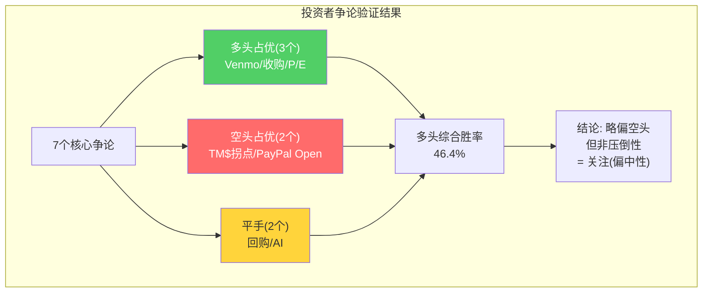

# Chapter 16: 投资者争论图谱 — 多空双方核心论点逐一验证

## 16.1 争论全景图

PayPal是2025-2026年投资者社区中最具争议性的大型科技股之一——既有深度价值派认为7.7x P/E是"十年一遇的机会"，也有结构空头认为"品牌正在死去，7.7x可能还高了"。

下表系统性地列出多空双方的核心论点，并基于Ch1-Ch15的分析给出验证结论：

## 16.1.1 收入结构的10-K硬数据支撑

在展开多空辩论前，先锚定PayPal的收入结构——因为很多争论的根源是对"PayPal到底赚什么钱"的误解。

**FY2024 10-K收入分解**：

| 收入类别 | 金额($B) | 占比 | YoY增速 | 含义 |
|---------|---------|:----:|:------:|------|
| 交易收入(Transaction Revenues) | $28.84B | **90.7%** | +7% | 手续费=核心 |
| 其他增值服务(OVAS) | $2.96B | 9.3% | +7% | 利息+数据+其他 |
| **总净收入** | **$31.80B** | 100% | +7% | |

[DM-REV-001: FY2024收入分解，交易$28.84B(90.7%)+OVAS $2.96B(9.3%), 10-K]

**交易收入增长来源拆分(FY2024, +$2.0B增量)**：
| 来源 | 增量 | 占增量比 |
|------|:----:|:-------:|
| Braintree | +$1.3B | **65%** |
| Core PayPal(品牌) | +$0.5B | 25% |
| Venmo | +$0.2B | 10% |

[DM-REV-002: FY2024收入增量65%来自Braintree, 10-K/earnings disclosure]

**这是一个极其关键的数据**：PayPal 2024年收入增量的65%来自Braintree——一个take rate仅0.30%的低利润业务。**如果只看品牌+Venmo的增量($0.7B)，PayPal的"高质量"收入增速仅约3%——远低于整体7%。** 这就是为什么多头看到7%增速很兴奋而空头看到品牌+1%很担忧——他们看的是同一家公司的不同切面。

**地理分布**：
| 地区 | FY2024收入 | 占比 |
|------|---------|:----:|
| 美国 | ~$18.2B | 57% |
| 国际 | $13.6B | 43% |

[DM-REV-003: 国际收入$13.6B(43%), 10-K FY2024]

国际收入43%意味着PayPal的跨境+货币汇率敏感度较高——FY2025 Q4品牌checkout +1%中约1.5pp的拖累来自德国服务中断+FX逆风，不全是执行问题。

## 16.2 多空论点逐一验证

### 论点1："P/E 7.7x太便宜了"

| | 多头版本 | 空头版本 | 本报告验证 |
|--|---------|---------|-----------|
| **论点** | PYPL P/E 7.7x远低于行业(V 28x/MA 30x/Adyen 26x)，即使打折也应15x+ | 7.7x反映了品牌衰退+管理层混乱，合理P/E可能更低(5-7x) | **Ch1 Reverse DCF**：市场隐含营收增速1-2%，偏保守但不离谱。**Ch4 SOTP**：中位数$47B<$56B市值。7.7x不是"太便宜"——但也不是"太贵"。关注区间(偏中性) |

### 论点2："TM$在改善=质量拐点"

| | 多头版本 | 空头版本 | 本报告验证 |
|--|---------|---------|-----------|
| **论点** | FY2024 TM$+6%>收入+4%=利润质量拐点 | 只是成本削减的假象+Braintree退出低利润业务 | **Ch3分析**：TM$改善是真实的但建立在三条脆弱的腿上(成本/利息/Fastlane)，其中两条已断。**判定：部分支持空头**——不是"假象"，但也不是"自持续拐点" |

### 论点3："Venmo是隐藏资产"

| | 多头版本 | 空头版本 | 本报告验证 |
|--|---------|---------|-----------|
| **论点** | 6700万MAU+20%增速=至少值$10B，市场给了$0 | 13年了还没变现，ARPU只有Cash App的1/3 | **Ch5分析**：保守估值$2-4B，乐观$6-11B。市场确实低估了Venmo，但不是$10B级别。**判定：部分支持多头**——Venmo是"免费期权"而非"游戏改变者" |

### 论点4："$6B回购=每股价值创造"

| | 多头版本 | 空头版本 | 本报告验证 |
|--|---------|---------|-----------|
| **论点** | 10.7%回购yield→5年EPS翻倍 | 掩盖零有机增长，历史高位买入$11B亏损 | **Ch15分析**：历史η=0.35(低效)，但当前@$58回购是合理的。FY2024回购确实掩盖了零有机增长，FY2025有机增长贡献74%。**判定：空头历史正确，多头当前正确** |

### 论点5："PayPal Open=平台化"

| | 多头版本 | 空头版本 | 本报告验证 |
|--|---------|---------|-----------|
| **论点** | PayPal Open将PYPL从PSP升级为commerce platform→P/E重估至18-22x | "功能堆叠不是平台"——无开发者生态、无第三方集成 | **Ch14审计**：PayPal Open处于S1早期(概念>产品)，到达S4概率5%。**判定：强烈支持空头** |

### 论点6："AI会强化PYPL数据优势"

| | 多头版本 | 空头版本 | 本报告验证 |
|--|---------|---------|-----------|
| **论点** | PYPL的交易数据+消费者画像=AI时代的核心资产 | AI降低支付差异化——所有PSP都会有AI欺诈检测 | **Ch12分析**：效率层(欺诈检测)PYPL是赢家，但颠覆层(Agentic Commerce)面临被绕过风险。**判定：双方各对一半** |

### 论点7："收购可能性"

| | 多头版本 | 空头版本 | 本报告验证 |
|--|---------|---------|-----------|
| **论点** | $56B市值+14% FCF yield=完美LBO标的，10-15%收购概率 | $56B太大，反垄断限制，新CEO不愿被收购 | **Ch2分析**：信念4"无收购溢价"脆弱度8/10。私募基金(ND/EBITDA 0.25x=完美杠杆)和大型科技(Apple需要支付后端)都有动机。**判定：收购是真实的尾部期权** |

## 16.3 验证结果汇总

| 论点 | 多头胜率 | 空头胜率 | 核心依据 |
|------|:-------:|:-------:|---------|
| P/E太便宜 | 55% | 45% | 不是太便宜也不是太贵 |
| TM$拐点 | 35% | 65% | 三条腿两条断 |
| Venmo隐藏资产 | 60% | 40% | 免费期权但非游戏改变者 |
| 回购价值创造 | 50% | 50% | 历史差/当前好 |
| PayPal Open平台化 | 15% | 85% | S1早期=概念 |
| AI强化优势 | 50% | 50% | 效率层赢/颠覆层险 |
| 收购可能性 | 60% | 40% | 真实尾部期权 |

**综合多空胜率**：多头平均46.4% / 空头平均53.6%——略偏空头，但非压倒性。这与Ch7的概率加权结论一致（上行55%权重 vs 下行45%权重→考虑到尾部风险后接近平衡）。

## 16.4 市场情绪校准

**SeekingAlpha/Reddit信号**：
- 深度价值派（r/ValueInvesting）：PYPL是"2020年代最被误解的大型科技股"，类比2012年的苹果（P/E 10x→后来涨10倍）
- 动量派（r/wallstreetbets）："falling knife, don't catch it"
- 机构观点分裂：34个分析师中20个Buy/14个Hold or Sell，目标价均值约$80

**市场情绪温度**：极度分裂——这本身就是一个信号。当市场对一只股票的看法极度分裂时，通常意味着：(1)不确定性真实存在（不是一边倒）；(2)催化剂将决定方向（而非渐进变化）；(3)波动率高于基本面隐含水平。

## 16.5 CI-07：投资者论坛中被忽视的信号

**一个在论坛讨论中几乎不出现但极其重要的观点**：PYPL开始派发股息（FY2025首次，$130M，yield 0.23%）[DM-DIV-001]。

虽然$130M（仅占FCF的2.3%）微不足道，但它的信号意义重大——因为PayPal从来没有派过股息。开始派息意味着：
1. 管理层承认高增长时代结束（高增长公司不派息）
2. 资本配置从"全部回购+并购"转向"回购+股息"
3. 可能吸引收入型投资者（与增长型投资者不同的buyer base）

**这支持Identity B（品牌钱包+PSP混合体）而非Identity C（商业平台）的定位——商业平台不需要派息来吸引投资者。**

## 16.6 市场叙事的演化与催化剂日历

### 三个可能的叙事转折

**转折1：Lores战略日（预计2026 H2）**
如果Lores推出"PayPal 3.0"战略日——明确聚焦方向（砍PYUSD/Xoom？拆分Braintree？）+给出新的中期目标——市场可能重新给予"战略清晰性溢价"。P/E从7.7x修复至10-12x。

**转折2：品牌checkout连续季度反弹（2026 Q2-Q3）**
如果Fastlane在Lores加大销售推广后将品牌checkout增速恢复至+5%+连续2个季度——这将直接证伪"品牌不可逆衰退"的空头论点。P/E可能从7.7x跳升至12-14x（因为核心利润池恢复增长）。

**转折3：收购要约/战略评估宣布**
私募基金（Apollo/KKR/Blackstone）或大型科技公司对PayPal发出收购兴趣——即使最终不成交，也会设定估值底线。溢价通常30-50%→$75-87/股。

### 催化剂日历

| 时间 | 事件 | 对估值的潜在影响 |
|------|------|:-------------:|
| 2026年4月 | Q1 2026 earnings（Lores首次） | ±10-15% |
| 2026年7月 | Q2 2026 earnings（品牌数据关键） | ±15-20% |
| 2026年H2 | Lores战略日（如有） | ±20-30% |
| 2026年底 | 集体诉讼和解 | -$1-3/股 |
| 2027年 | Fastlane国际规模数据 | ±10-15% |

[DM-DEBATE-002: 催化剂日历与估值影响]

## 16.7 综合判断：多头vs空头谁的概率更大？

综合Ch1-Ch16的全部分析，我们可以给出一个最终的多空概率评估：

**多头核心论点的有效性：4/10**
- P/E 7.7x确实偏低（市场隐含增速1-2%过于保守）→有效
- 但品牌checkout结构性衰退、管理层不确定性、护城河侵蚀都是真实风险→限制了上行

**空头核心论点的有效性：5.5/10**
- 品牌衰退+CEO更替+SOTP不创造价值→有效
- 但$5.5B可持续FCF+10%回购yield+Venmo期权→限制了下行

**净评估：轻微偏空头，但不是做空机会**——因为回购创造的EPS增厚在当前价位是数学确定的。即使最差情景（品牌负增长+P/E压至5x），$5.5B FCF也意味着5年内回收投资。

**最可能的1年结果**：$52-75区间震荡（-10%到+29%），方向取决于Q2-Q3品牌checkout数据和Lores战略清晰度。

---

> **DM锚点注册表 (Ch16)**
>
> | ID | 描述 | 来源 |
> |----|------|------|
> | DM-DEBATE-001 | 7论点验证: 多头平均46.4%/空头53.6% | 分析框架 |
> | DM-DIV-001 | FY2025首次派息$130M, yield 0.23% | FMP cashflow |
