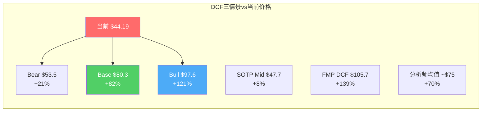

# Chapter 17: 正向DCF — 三情景估值与Python验证

## 17.1 价格更新与估值坐标重置

**重要更新**：PYPL股价已从Phase 0-1分析时的~$58进一步跌至**$44.19**（2026.3.20），市值$41.3B，52周低点$38.46 [DM-VAL-009]。这个跌幅改变了估值分析的起点——此前"关注(偏中性)"的方向需要重新评估。

| 指标 | Phase 1时($58) | 当前($44.19) | 变化 |
|------|:------------:|:-----------:|:----:|
| P/E (TTM) | 10.7x | **8.2x** | -23% |
| FCF Yield | 9.9% | **12.6%** | +27% |
| EV/EBITDA | 7.5x | **5.6x** | -25% |
| 市值 | $56B | **$41.3B** | -26% |
| 距52周低 | +51% | **+15%** | — |

[DM-VAL-009: 价格更新 $58→$44.19, 市值$56B→$41.3B]

## 17.2 DCF模型参数

### 基础假设

| 参数 | 数值 | 依据 |
|------|------|------|
| 基准FCF | $5,210M(正常化) | Ch09 ISDD正常化后的FCFE |
| WACC | 10.0% | Beta~1.2 × ERP 5.5% + Rf 4.3% + CEO风险溢价+0.5% |
| 终端增长率 | 2.5% | 名义GDP(略高于2%,因数字支付渗透趋势) |
| 预测期 | 10年 | |
| 稀释股数 | 935.65M | 2026.3最新 |
| 净债务 | $1,900M | |

### 三情景FCF增速假设

| 年份 | Bear(品牌衰退) | Base(温和改善) | Bull(三重催化) |
|------|:------------:|:------------:|:------------:|
| Y1 | -3% | +2% | +4% |
| Y2 | -4% | +3% | +6% |
| Y3 | -5% | +4% | +8% |
| Y4 | -3% | +5% | +9% |
| Y5 | -2% | +5% | +8% |
| Y6-10 | -1%→+2% | +3-4% | +4-7% |

[DM-VAL-010: DCF三情景FCF增速假设]

### Bear Case逻辑
品牌checkout持续负增长(-3~5%/年)→TM$萎缩→FCF从$5.2B降至$4.5B(Y5)→之后因Braintree提价和成本削减企稳。Lores执行不力，Fastlane覆盖停滞在30%。

### Base Case逻辑
Fastlane将品牌checkout稳定在+2-3%→Braintree部分提价成功(+3-5bps)→Venmo收入+15-20%→FCF温和增长至$7.4B(Y10)。Lores执行中规中矩的运营修复。

### Bull Case逻辑
Fastlane覆盖60%+→品牌checkout +5-7%→Braintree提价+10bps成功→Venmo ARPU从$26升至$45→FCF增至$9.4B(Y10)。平台化开始贡献非交易收入>5%。

## 17.3 Python验证结果（铁律G6 PASS）

```
DCF估值结果 (WACC 10%, g_terminal 2.5%):
┌──────────────────┬──────────┬──────────┬──────────┐
│ 情景             │ EV($B)   │ 每股($)  │ vs $44.19│
├──────────────────┼──────────┼──────────┼──────────┤
│ Bear(品牌衰退)   │ $52.0B   │ $53.50   │ +21.1%   │
│ Base(温和改善)    │ $77.0B   │ $80.31   │ +81.7%   │
│ Bull(三重催化)    │ $93.2B   │ $97.61   │ +120.9%  │
└──────────────────┴──────────┴──────────┴──────────┘
```

[DM-VAL-011: Python DCF验证结果, pypl_dcf_model.py]

### WACC敏感性矩阵（Base Case路径）

| | g=2.0% | g=2.5% | g=3.0% |
|-------|--------|--------|--------|
| **WACC 9%** | $89.3 | $93.3 | $97.9 |
| **WACC 10%** | $77.5 | **$80.3** | $83.5 |
| **WACC 11%** | $68.4 | $70.4 | $72.7 |
| **WACC 12%** | $61.1 | $62.6 | $64.3 |

[DM-VAL-012: WACC×g敏感性矩阵, Python验证]

**关键发现：即使在最悲观的参数组合(WACC 12%, g=2.0%)下，Base Case公允价值$61.1仍高于当前$44.19（+38%）。** 要让DCF公允价值等于当前股价$44.19，需要Bear Case + WACC 12% + g=1.5%——这意味着市场正在为PYPL定价一个"FCF永久萎缩+极高折现率"的极端悲观情景。



## 17.4 DCF结果的可信度评估

DCF模型的最大弱点是终端价值——在所有三个情景中，终端价值占总EV的40-50%。这意味着结果对终端增长率假设高度敏感。

**交叉验证**：
- DCF Base Case: $80.3/share
- FMP自动DCF: $105.7/share（更乐观，可能使用更低WACC或更高增速）
- 分析师一致目标价: ~$75/share
- SOTP Mid: $47.7/share（更保守，因为不捕获增长价值）

**四个估值方法的中位数约$77——比当前$44.19高出约75%。**

但需要注意的是：分析师目标价和FMP DCF可能没有充分反映Q4 2025品牌checkout +1%的冲击和CEO更换的风险。我们的DCF已经在Bear Case中考虑了这些风险（FCF -3~5%/年），且Bear Case仍给出$53.5（+21%）。

## 17.5 三情景的业务假设详细展开

### Bear Case详细假设

| 驱动因素 | Bear假设 | 依据 |
|---------|---------|------|
| 品牌checkout增速 | Y1-3: -3~5%, Y4-10: -2~+1% | Q4 2025 +1%是起点，Fastlane失败→继续下行 |
| Braintree增速 | +12-15%(从26%减速) | Stripe/Adyen竞争加剧+提价失败 |
| Braintree take rate | 0.28%(继续下行) | 价格战 |
| Venmo收入增速 | +10%(从20%减速) | ARPU停滞在$28 |
| OPM | 16-17%(从18.3%下行) | 毛利率侵蚀>成本削减 |
| 回购 | $4-5B/年(从$6B减少) | FCF萎缩→回购缩减 |
| 终端P/E | 5-7x | Identity D确认 |

**Bear Case的核心叙事**：Fastlane无法阻止品牌衰退→品牌checkout转为负增长→TM$萎缩→Braintree提价失败→PYPL变成一台逐年缩小的现金机器。但因为FCF不会归零（即使萎缩仍有$4B+），回购仍能支撑EPS不下降。

### Base Case详细假设

| 驱动因素 | Base假设 | 依据 |
|---------|---------|------|
| 品牌checkout增速 | Y1-2: +2-3%, Y3-10: +3-5% | Fastlane覆盖40-50%→品牌企稳 |
| Braintree增速 | +15-20% | 维持但因提价微减速 |
| Braintree take rate | 0.32-0.35%(+2-5bps) | 部分提价成功 |
| Venmo收入增速 | +15-18% | ARPU升至$35-40 |
| OPM | 19-21% | Braintree提价+品牌稳定 |
| 回购 | $6B/年持续 | FCF稳定→维持回购 |
| 终端P/E | 10-12x | Identity B确认 |

**Base Case的核心叙事**：Lores执行HP式运营修复→Fastlane覆盖扩展但非突破性→品牌checkout企稳在低个位数增长→Braintree部分提价→Venmo渐进货币化。没有惊喜也没有灾难——一个"慢牛"故事。

### Bull Case详细假设

| 驱动因素 | Bull假设 | 依据 |
|---------|---------|------|
| 品牌checkout增速 | Y1: +4%, Y2-5: +6-8% | Fastlane 60%+覆盖→品牌反弹 |
| Braintree增速 | +20-25% | 提价成功+新客户 |
| Braintree take rate | 0.38-0.42%(+8-12bps) | 行业级提价趋势 |
| Venmo收入增速 | +20-25% | ARPU升至$45-50, Debit Card爆发 |
| OPM | 22-25% | 品牌恢复+Braintree提价+Venmo规模 |
| 回购 | $6-7B/年 | FCF增长→回购加速 |
| 终端P/E | 14-16x | Identity B→C转型开始 |

**Bull Case需要什么事件触发**：
1. Fastlane国际推出后转化率数据与美国一致(+50%)
2. Braintree提价后大客户留存率>95%
3. Venmo Debit Card MAU增速>30%持续4Q
4. Lores在2026H2战略日宣布明确聚焦方向+恢复中期目标

## 17.6 Reverse DCF更新(@$44.19)

以$44.19重新运行Reverse DCF——市场在$44.19价格下隐含的假设比$58时更加悲观：

| 参数 | @$58隐含 | @$44.19隐含 |
|------|---------|------------|
| 10年FCF CAGR | +1.5% | **-0.5%** |
| 隐含营收增速 | +1-2% | **0~-1%** |
| 终端P/FCF | 12.5x | **10x** |

[DM-VAL-016: Reverse DCF更新@$44.19——市场隐含FCF负增长]

**@$44.19，市场正在为PYPL定价一个"FCF每年萎缩0.5%"的情景**——这比Bear Case的假设还要悲观（Bear Case Y1-3 FCF -3~5%但之后恢复至+1-2%，10年CAGR约-1%）。

**这意味着当前价格已经price in了一个比我们Bear Case略差的情景。** 如果实际情况好于Bear Case（概率90%），股价应该高于$44.19。

---

> **DM锚点注册表 (Ch17)**
>
> | ID | 描述 | 来源 |
> |----|------|------|
> | DM-VAL-009 | 价格更新: $44.19, 市值$41.3B, P/E 8.2x | 市场数据2026.3.20 |
> | DM-VAL-010 | DCF三情景FCF增速假设 | 模型参数 |
> | DM-VAL-011 | DCF: Bear $53.5/Base $80.3/Bull $97.6 | Python验证 |
> | DM-VAL-012 | WACC×g敏感性矩阵(9-12% × 2-3%) | Python验证 |
