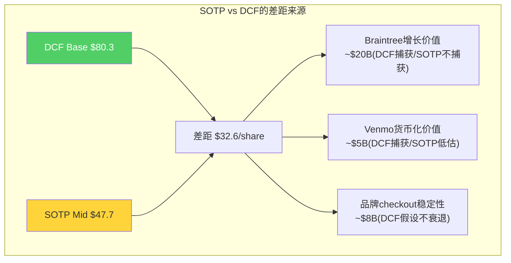

# Chapter 18: SOTP分拆估值 — 更新版

## 18.1 为什么SOTP对PayPal特别重要

SOTP（分部加总估值）对PayPal的意义超过大多数公司——因为PayPal的业务单元之间的估值逻辑完全不同（Ch4分析：品牌checkout是高利润率低增长的"现金奶牛"，Braintree是低利润率高增长的"PSP"，Venmo是高增长但未盈利的"消费金融"）。将它们放在一个P/E倍数下估值是不公平的——品牌checkout被Braintree拉低，Venmo被整体低增速掩盖。

## 18.1.1 可比公司倍数锚定

SOTP估值的关键变量是每个分部的估值倍数。以下是基于公开市场数据的可比公司锚点：

**品牌Checkout可比**：

| 公司 | 业务特征 | P/E | EV/EBITDA | 增速 | OPM |
|------|---------|:---:|:---------:|:----:|:---:|
| Visa | 纯支付网络 | 28x | 22x | 10% | 67% |
| Mastercard | 纯支付网络 | 30x | 25x | 12% | 57% |
| Fiserv | 商户处理+银行IT | 16x | 12x | 6% | 35% |
| **品牌Checkout参考** | 高利润但低增长 | **13-18x** | | 2-5% | 25-30% |

[DM-VAL-018: 品牌Checkout可比公司倍数锚定]

因为品牌checkout的OPM(25-30%)远低于V/MA(57-67%)但高于Fiserv(35%)，且增速(2-5%)低于所有可比，所以合理P/E在Fiserv(16x)和V/MA(28-30x)之间但明显偏低端——13-18x。

**Braintree可比**：

| 公司 | 业务特征 | EV/Revenue | 增速 | OPM |
|------|---------|:---------:|:----:|:---:|
| Stripe | 企业PSP(未上市) | ~14x | 34% | 30-35%(估) |
| Adyen | 全球企业PSP | 10x | 20% | 43% |
| Block(Square部分) | SMB PSP | 2.5x | 8% | 7% |
| **Braintree参考** | 大企业PSP,低OPM | **3-4.3x** | 20-26% | 3-5% |

[DM-VAL-019: Braintree可比公司倍数锚定]

因为Braintree的OPM(3-5%)远低于Stripe(30-35%)和Adyen(43%)，所以即使增速可比(20-26%)，也不能给相同的EV/Revenue倍数。Stripe 14x打3折=4.7x，Adyen 10x打4折=4x——3-4.3x是合理范围。

**Venmo可比**：

| 公司 | 业务特征 | EV/Revenue | 增速 |
|------|---------|:---------:|:----:|
| Cash App(Block分配) | 数字银行 | ~4.5x | 24%(GP) |
| Affirm | BNPL | 5x | 30% |
| SoFi | 数字银行 | 3.5x | 25% |
| **Venmo参考** | P2P+商业化初期 | **2.5-6x** | 20-25% |

[DM-VAL-020: Venmo可比公司倍数锚定]

## 18.2 分部估值（@$44.19更新）

### 品牌Checkout（含PayPal Button + Fastlane）

| 维度 | 保守 | 基准 | 乐观 |
|------|:----:|:----:|:----:|
| FY2025交易利润 | $3.5B | $4.0B | $4.3B |
| 分配运营成本 | -$2.0B | -$1.8B | -$1.6B |
| 营业利润 | $1.5B | $2.2B | $2.7B |
| 增速假设 | +1% | +3% | +6% |
| P/E倍数 | 13x | 15x | 18x |
| **估值** | **$20B** | **$24.5B** | **$29B** |

**倍数逻辑**：品牌checkout独立后类似一个成熟的高质量支付品牌——增速+1-6%、OPM 25-30%。可比公司：成熟SaaS(Intuit 25x at +8%)打折→13-18x。

### Braintree（非品牌PSP处理）

| 维度 | 保守 | 基准 | 乐观 |
|------|:----:|:----:|:----:|
| FY2025净收入 | $3.0B | $3.5B | $4.0B |
| 增速假设 | +15% | +20% | +26% |
| EV/Revenue倍数 | 3x | 3.7x | 4.3x |
| **估值** | **$9B** | **$13B** | **$17B** |

**倍数逻辑**：Braintree增速20-26%但OPM仅3-5%。Adyen(10x EV/Rev at 17% growth, 43% OPM)和Stripe(~14x at 34%, 30% OPM)的倍数需要大幅打折——因为Braintree利润率远低于两者。3-4.3x是合理范围。

### Venmo

| 维度 | 保守 | 基准 | 乐观 |
|------|:----:|:----:|:----:|
| FY2025收入 | $1.2B | $1.4B | $1.5B |
| 增速 | +15% | +20% | +25% |
| EV/Revenue倍数 | 2.5x | 3.9x | 6x |
| **估值** | **$3B** | **$5.5B** | **$9B** |

### 其他业务 + 企业价值

| 维度 | 保守 | 基准 | 乐观 |
|------|:----:|:----:|:----:|
| Xoom/PYUSD/B2B/利息 | $2.0B | $3.5B | $5.0B |

### SOTP汇总

| 部分 | 保守 | 基准 | 乐观 |
|------|:----:|:----:|:----:|
| 品牌Checkout | $20.0B | $24.5B | $29.0B |
| Braintree | $9.0B | $13.0B | $17.0B |
| Venmo | $3.0B | $5.5B | $9.0B |
| 其他 | $2.0B | $3.5B | $5.0B |
| **总EV** | **$34.0B** | **$46.5B** | **$60.0B** |
| 减净债务 | -$1.9B | -$1.9B | -$1.9B |
| **权益** | **$32.1B** | **$44.6B** | **$58.1B** |
| **每股** | **$34.3** | **$47.7** | **$62.1** |
| vs $44.19 | -22% | **+8%** | +41% |

[DM-VAL-013: SOTP分拆估值(更新版@$44.19), Python验证]

### SOTP关键发现

**1. 保守SOTP($34.3)低于当前价格$44.19——意味着如果所有假设都取最差值，PYPL仍有约22%的下行空间。** 这不是一个绝对安全的价值底。

**2. 基准SOTP($47.7)与当前价格接近——暗示市场大致在SOTP基准水平定价。** 这与DCF Base($80.3)形成巨大差距——因为SOTP不捕获增长价值（它给每个业务一个静态倍数），而DCF捕获未来10年的FCF增长。

**3. DCF与SOTP的差距($80.3 vs $47.7 = $32.6/share = 68%差距)主要来自Braintree。** Braintree在SOTP中按3.7x EV/Rev估值($13B)，但DCF隐含了Braintree的20%增速在未来5-10年创造的增量FCF。如果Braintree增速降至10%以下，DCF和SOTP会趋近。

---

> **DM锚点注册表 (Ch18)**
>
> | ID | 描述 | 来源 |
> |----|------|------|
> | DM-VAL-013 | SOTP: 保守$34.3/基准$47.7/乐观$62.1 | Python验证 |
