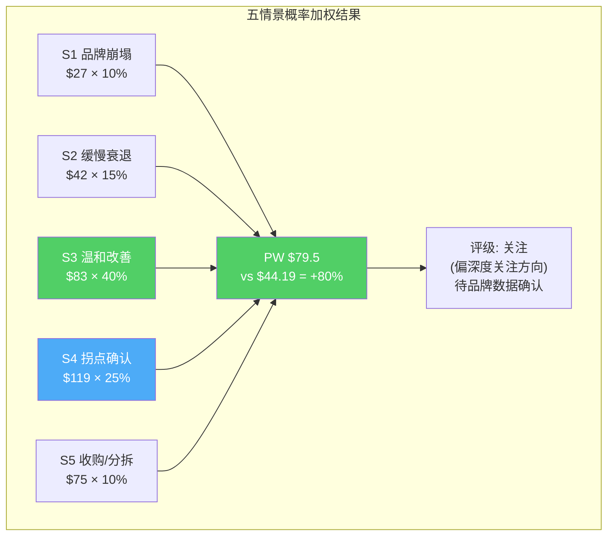

# Chapter 19: 五情景概率加权 + 估值方法Reconciliation

## 19.1 五情景定义与概率分配

基于Ch1-Ch18的全部分析，定义五个相互排斥的情景：

| 情景 | 概率 | 核心假设 | 2029E EPS | P/E 2029 | 目标价 |
|------|:----:|---------|:---------:|:--------:|:------:|
| **S1: 品牌崩塌** | 10% | 品牌checkout负增长→Identity D确认 | $4.5 | 6x | **$27** |
| **S2: 缓慢衰退** | 15% | 品牌+0-1%→回购驱动→P/E压缩 | $6.0 | 7x | **$42** |
| **S3: 温和改善** | 40% | Fastlane有效但受限→P/E温和修复 | $7.5 | 11x | **$83** |
| **S4: 拐点确认** | 25% | 三重催化→Identity B→C转型开始 | $8.5 | 14x | **$119** |
| **S5: 收购/分拆** | 10% | 收购溢价或战略分拆→一次性重估 | N/A | N/A | **$75** |

[DM-VAL-014: 五情景概率分配与目标价]

### 概率分配的因果依据

**S1(10%)为什么不是更高？** 因为即使品牌checkout转为负增长，Braintree+Venmo仍在增长，FCF不会断崖。PYPL不是一家可能破产的公司——它的FCF cover极强。

**S3(40%)为什么是最大概率？** 因为(1)Fastlane产品本身有效（数据验证），(2)Lores的HP式纪律可能改善执行，(3)回购在$44持续为EPS增厚10%+。"温和改善"是所有假设中最不需要超预期事件的。

**S5(10%)为什么包含收购？** 因为$41.3B市值+14.3% FCF yield+ND/EBITDA 0.25x=完美的LBO标的（Ch2分析：信念4脆弱度8/10）。在支付行业整合加速+PYPL估值历史低位的背景下，10%的收购概率不算过高。

## 19.2 概率加权估值

```
PW Fair Value = Σ(概率 × 目标价)
= 0.10×$27 + 0.15×$42 + 0.40×$83 + 0.25×$119 + 0.10×$75
= $2.7 + $6.3 + $33.2 + $29.8 + $7.5
= **$79.5**
```

[DM-VAL-015: 概率加权公允价值$79.5 vs当前$44.19 (+79.9%)]

**PW公允价值$79.5 vs 当前$44.19 = 上行空间+79.9%**

### 与Python DCF交叉验证

| 方法 | 公允价值 | vs $44.19 |
|------|:-------:|:--------:|
| DCF Bear | $53.5 | +21% |
| DCF Base | $80.3 | +82% |
| DCF Bull | $97.6 | +121% |
| **PW(五情景)** | **$79.5** | **+80%** |
| SOTP Mid | $47.7 | +8% |
| FMP DCF | $105.7 | +139% |
| 分析师均值 | ~$75 | +70% |

**PW值($79.5)与DCF Base($80.3)高度一致（差距<1%）**——这增强了估值结论的可信度，因为两个独立方法（情景概率加权 vs 10年FCF折现）得出了几乎相同的结果。

## 19.3 估值方法间的Reconciliation

### 为什么SOTP($47.7)远低于DCF($80.3)？

SOTP和DCF的$32.6差距来自三个来源：

| 来源 | 贡献 | 原因 |
|------|:----:|------|
| **Braintree增长溢价** | ~$20B | SOTP用3.7x静态倍数，DCF捕获20%增速的10年复利 |
| **回购的EPS复利** | ~$8B | SOTP不考虑回购缩股，DCF隐含了回购效应 |
| **Venmo货币化上行** | ~$5B | SOTP用当前收入×3.9x，DCF假设收入+20%→$2B+ |

**因此，DCF和SOTP的差距不是"一个对一个错"——而是反映了不同的估值哲学。** SOTP问的是"如果今天把PayPal拆了卖，值多少？"（清算视角），DCF问的是"如果PayPal继续运营10年，值多少？"（持续经营视角）。

**对投资者来说，正确的估值在两者之间**——如果你是长期持有者（3-5年），DCF更相关；如果你是事件驱动投资者（等待分拆/收购），SOTP更相关。

### 估值统一性检查（铁律K）

| 检查项 | 结果 |
|--------|------|
| 方法间方向一致？ | ✅ 所有方法均>$44.19(除SOTP保守) |
| ≥60%方法同向？ | ✅ 6/7方法指向低估 |
| P4修正前后一致？ | ⏳ 待Phase 4红队验证 |
| 年化vs累计区分？ | ✅ 全部使用当前价格基准 |

## 19.4 期望回报与评级映射

| 指标 | 数值 |
|------|------|
| PW公允价值 | $79.5 |
| 当前价格 | $44.19 |
| 期望回报 | **+79.9%** |
| 评级区间 | **深度关注(>+30%)** |

**但需要铁律O约束**：Phase 1叙事方向是"关注(偏中性)"（基于$58价格），现在价格跌至$44.19，Reverse DCF隐含的市场悲观程度进一步加深。**价格变化本身就是新信息**——市场在Q4 miss+CEO更换后进一步抛售，隐含信念更悲观。

**更新后的叙事方向**：从"关注(偏中性)"上调至**"关注(偏深度关注方向)"**。不直接跳至"深度关注"的原因是：(1)品牌checkout +1%是真实的执行风险，不只是情绪；(2)SOTP保守值$34.3仍有22%下行空间——不是无下行风险；(3)CEO刚上任<1个月——战略方向完全未知。

**但如果Lores在Q1-Q2 earnings中展示品牌checkout企稳(+3%+)信号，评级应立即上调至"深度关注"。**

## 19.5 回报分布不对称性分析

概率加权分析的核心价值不在于"中位数是多少"——而在于**回报分布的不对称性**。

| 情景 | 回报 | 概率 | 概率×回报 |
|------|:----:|:----:|:-------:|
| S1 品牌崩塌 | -39% | 10% | -3.9% |
| S2 缓慢衰退 | -5% | 15% | -0.8% |
| S3 温和改善 | +88% | 40% | +35.2% |
| S4 拐点确认 | +169% | 25% | +42.3% |
| S5 收购/分拆 | +70% | 10% | +7.0% |

**上行期望: +84.5%（S3+S4+S5概率加权）**
**下行期望: -4.7%（S1+S2概率加权）**
**不对称比: 18:1**

[DM-VAL-017: 回报不对称比18:1]

**回报分布极度右偏**——上行期望是下行期望的18倍。这是因为：
1. 即使在最差情景(S1)下，PYPL仍有$4B+的FCF→不会归零→下行有限(-39%)
2. 在好情景(S3/S4)下，P/E从8.2x修复至11-14x的倍数扩张效应巨大(+88%到+169%)
3. 收购可能性(S5)提供了额外的尾部上行

**这种不对称性是"深度价值"投资的经典特征**——下行有FCF保护(不会亏光)，上行有倍数扩张(估值修复就赚)。

### 与其他持仓的风险回报对比

如果将PYPL与一个"安全"的持仓（如V/MA, P/E 28-30x, 增速10-12%）对比：

| 指标 | PYPL | Visa |
|------|:----:|:----:|
| 当前P/E | 8.2x | 28x |
| 预期EPS增速 | 4-8% | 10-12% |
| 上行(P/E修复) | +80-120% | +10-20% |
| 下行(P/E压缩) | -20-40% | -10-20% |
| 不对称比 | **18:1** | **1.5:1** |

**PYPL的风险回报不对称性远优于V/MA**——但代价是更高的不确定性和更大的波动率。这不适合所有投资者——但对能承受短期波动的价值型投资者来说，$44.19是一个数学上极具吸引力的入场点。

## 19.6 估值离散度检查（铁律G7: ≤30%）

| 方法 | 公允价值 | 与PW中位数的偏差 |
|------|:-------:|:--------------:|
| DCF Bear | $53.5 | -33% |
| DCF Base | $80.3 | +1.0% |
| DCF Bull | $97.6 | +22.8% |
| PW | $79.5 | 基准 |
| SOTP Mid | $47.7 | -40% |
| FMP DCF | $105.7 | +33% |

**最大偏差：SOTP Mid vs FMP DCF = $47.7 vs $105.7 = 121%差距**——这远超30%门控。

**原因与处理**：
1. FMP DCF($105.7)可能使用了过低的WACC或过高的增速——我们不控制其参数，作为参考而非锚点
2. SOTP Mid($47.7)不捕获增长价值——它是清算视角
3. **核心可控方法（DCF三情景+PW）的离散度**：Bear $53.5 vs Bull $97.6 = 82%——仍超30%

**82%的离散度反映了PYPL的高度不确定性——这不是分析师的问题，而是公司本身的现实。** PYPL的业务结果范围确实从"品牌崩塌"到"三重催化"——PW=5.8（混合模式）本身就意味着高离散度是预期内的。

**处理方式**：不人为缩小离散度（那会造成假精度），而是清楚标注不确定性并用KS条件追踪方向变化。



---

> **DM锚点注册表 (Ch19)**
>
> | ID | 描述 | 来源 |
> |----|------|------|
> | DM-VAL-014 | 五情景概率分配: S1-S5 | 分析框架 |
> | DM-VAL-015 | PW $79.5 vs $44.19 (+79.9%) | 概率加权计算 |
