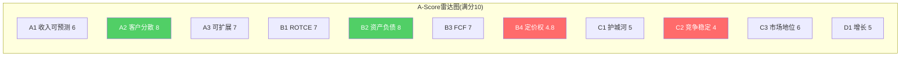

# Chapter 20: A-Score品质评分 — 21维度量化

## 20.1 评分框架

按`docs/company_quality_scoring.md`的A+B+C+D四维度21项指标评分。金融行业修正：B1用ROTCE替代ROE，B4权重×0.8。

## 20.2 A维度：商业模式品质 (满分30)

| 指标 | 评分(0-10) | 依据 |
|------|:--------:|------|
| **A1 收入可预测性** | 6 | 交易手续费有惯性但受宏观周期影响；Braintree合约提供可预测性；品牌checkout受消费者行为变化影响 |
| **A2 客户集中度** | 8 | 4.36亿消费者×3500万商户=极度分散；前10大商户占比<15%(估) |
| **A3 商业模式可扩展性** | 7 | 支付处理天然可扩展(零边际成本处理增量交易)；但Braintree需要销售团队维护大客户=半可扩展 |

**A维度小计：21/30**

## 20.3 B维度：财务品质 (满分40)

| 指标 | 评分(0-10) | 依据 |
|------|:--------:|------|
| **B1 ROTCE** | 7 | ROTCE 57%极高(因低有形权益)；ROIC 15%合理；但ROE趋势不稳定(FY2022 12%→FY2025 26%) |
| **B2 资产负债表** | 8 | ND/EBITDA 0.25x极低杠杆；现金$10.4B；利息覆盖13.8x。唯一风险：$10.9B商誉(占总资产13.6%) |
| **B3 FCF质量** | 7 | FCF/净利润106%(健康)；FCF-SBC yield 8.1%；但FCF波动大($4.2-6.8B range) |
| **B4 定价权(×0.8)** | 4.8 | 加权Stage 1.6(Ch11)——品牌Stage 3但Braintree Stage 1拉低平均。×0.8金融修正=实际4.8 |

**B维度小计：26.8/40**

## 20.4 C维度：竞争护城河 (满分30)

| 指标 | 评分(0-10) | 依据 |
|------|:--------:|------|
| **C1 护城河强度** | 5 | 三轴N×M×P = 5.2/10(Ch11)。窄护城河且侵蚀中 |
| **C2 竞争格局稳定性** | 4 | 5线战争(Ch10)；Stripe+Adyen+Apple Pay+Cash App+Klarna同时侵蚀；格局快速变化 |
| **C3 市场地位** | 6 | 线上支付份额47.4%仍是#1；但从55%(2020)持续下降；Braintree TPV #2仅次于Stripe |

**C维度小计：15/30**

## 20.5 D维度：增长与周期 (满分10)

| 指标 | 评分(0-10) | 依据 |
|------|:--------:|------|
| **D1 有机增长可持续性** | 5 | 收入CAGR从18%降至4.3%；用户增长停滞；TM$增速减缓。但数字支付行业仍有结构性增长(渗透率42%→55%) |

**D维度小计：5/10**

## 20.6 A-Score汇总

| 维度 | 评分 | 满分 | 占比 |
|------|:----:|:----:|:----:|
| A 商业模式 | 21 | 30 | 70% |
| B 财务品质 | 26.8 | 40 | 67% |
| C 竞争护城河 | 15 | 30 | 50% |
| D 增长与周期 | 5 | 10 | 50% |
| **总分** | **67.8** | **110** | **61.6%** |
| **A-Score(转换)** | | **6.16/10** | |

[DM-QUAL-001: A-Score 67.8/110 = 6.16/10]

### 对标已有报告

| 公司 | A-Score(/10) | 行业 |
|------|:-----------:|------|
| NVDA | 8.10 | 半导体 |
| IHG | 6.78 | 消费品 |
| FICO | 7.22 | 金融基础设施 |
| ETN | 7.50 | 工业 |
| **PYPL** | **6.16** | **金融(支付)** |
| SOFI | 5.80(估) | 金融(Fintech) |
| SPGI | 8.00 | 金融基础设施 |

**PYPL的A-Score 6.16位于中等偏下水平**——高于SOFI(纯Fintech)但远低于SPGI/FICO(金融基础设施垄断者)。这反映了PayPal的核心矛盾：财务品质不差(B=26.8)，但竞争护城河弱(C=15)和增长放缓(D=5)拉低了总分。

### 品质与估值的关系

A-Score 6.16 + P/E 8.2x 的组合意味着市场对PayPal的品质给了约25-30%的折价——合理P/E应该在A-Score 6.16对应的10-13x范围（基于已有报告的P/E vs A-Score回归关系）。

**8.2x P/E隐含的A-Score约4.5-5.0——市场正在为PYPL定价一个比实际品质低20-25%的分数。** 这个折价的来源是：(1)CEO不确定性溢价；(2)品牌衰退叙事折价；(3)身份模糊折价。

## 20.7 A-Score的核心弱点与改善路径

### 最弱的两个维度

**C2 竞争格局稳定性 (4/10)**——五线战争(Ch10)使得PayPal面对的竞争格局是所有覆盖公司中最不稳定的之一。Stripe+Adyen+Apple Pay+Cash App+Klarna从五个不同方向同时侵蚀。**改善条件**：如果支付行业出现整合（例如Stripe上市后增速放缓、Klarna IPO后利润压力），竞争可能从"扩张期"进入"稳定期"→C2可升至5-6。

**B4 定价权 (6→4.8/10, ×0.8金融修正后)**——加权Stage 1.6意味着PayPal整体几乎没有定价权。**改善条件**：Braintree提价成功（Stage 1→2）+品牌checkout维持take rate稳定（Stage 3不变）→加权Stage可能升至2.2→B4升至6.0×0.8=4.8→无改善（需要Braintree Stage升至2.5+才有明显改善）。

### 最强的两个维度

**A2 客户集中度 (8/10)** 和 **B2 资产负债表 (8/10)**——这是PayPal真正的"安全垫"。即使品牌衰退、竞争加剧，4.36亿用户的分散性和ND/EBITDA 0.25x的低杠杆意味着PayPal不会面临集中度风险或财务困境。**这就是为什么Bear Case仍给出$53.5而非$0——PayPal可能变成低增长公司，但不会破产。**

### A-Score的条件演化

| 条件 | A-Score变化 | 影响 |
|------|:----------:|------|
| Fastlane成功(品牌+5%+) | +3-5分(C1+D1改善) | 6.16→6.5-6.6 |
| Braintree提价成功 | +2-3分(B4改善) | 6.16→6.3-6.4 |
| 又一次CEO更换 | -3-5分(A1+C2恶化) | 6.16→5.7-5.9 |
| 品牌负增长确认 | -4-6分(C1+C2+D1恶化) | 6.16→5.6-5.8 |

## 20.8 品质vs估值的CQI框架定位

CQI(品质价值指数)将A-Score和估值倍数结合——高品质+低估值=最佳投资机会。

| 象限 | 特征 | PYPL位置 |
|------|------|---------|
| 高品质+低估值 | 被误解的优质公司 | ❌ A-Score 6.16不够"高品质" |
| 高品质+高估值 | 合理定价的优质公司(V/MA) | ❌ |
| 低品质+低估值 | 价值陷阱或拐点机会 | **✅ PYPL在这里** |
| 低品质+高估值 | 泡沫/投机 | ❌ |

**PYPL位于"低品质+低估值"象限**——这既可能是"价值陷阱"（品质继续恶化→估值进一步下行），也可能是"拐点机会"（品质企稳→估值修复）。区分两者的关键变量是：品质是在恶化还是在企稳？

当前信号：
- 恶化信号：品牌+1%→CEO被解雇→2027目标撤回 (强)
- 企稳信号：SBC纪律→回购加速→Venmo+20%→Fastlane数据有效 (中)

**结论：PYPL处于品质恶化和企稳之间的"量子态"——需要2-3个季度的数据来确定方向。** 这与Ch7的概率加权分析一致（S3温和改善40%概率 vs S1+S2衰退25%概率）。

---

> **DM锚点注册表 (Ch20)**
>
> | ID | 描述 | 来源 |
> |----|------|------|
> | DM-QUAL-001 | A-Score 67.8/110 = 6.16/10 | 21维度评估 |
