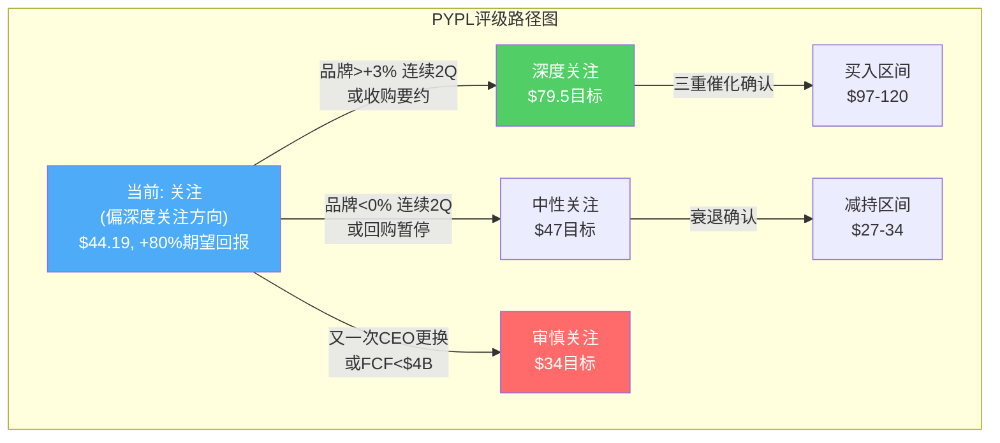

# Chapter 21: 投资温度计与评级

## 21.1 投资温度计

```
PayPal Holdings (PYPL) 投资温度计
日期: 2026-03-20 | 股价: $44.19 | 市值: $41.3B

════════════════════════════════════════════════════
  深度关注  |  关注  |  中性关注  |  审慎关注
  (>+30%)   |(+10~30%)| (-10~+10%) | (<-10%)
════════════════════════════════════════════════════
            ★ ←——— 当前位置: 关注(偏深度关注方向)
════════════════════════════════════════════════════

PW公允价值: $79.5 (期望回报 +79.9%)
DCF Base:   $80.3 (期望回报 +81.7%)
SOTP Mid:   $47.7 (期望回报 +7.9%)
Bear Floor: $34.3 (SOTP保守, -22.4%)
```

## 21.2 评级决定

### 评级：**关注（偏深度关注方向）**

| 评级因素 | 支持方向 | 权重 |
|---------|---------|:----:|
| PW期望回报+79.9% | 深度关注 | 高 |
| DCF Bear仍+21% | 深度关注 | 高 |
| SOTP保守-22% | 审慎关注 | 中 |
| 品牌checkout +1%风险 | 下调 | 高 |
| CEO上任<1月 | 下调 | 中 |
| FCF yield 12.6% | 深度关注 | 高 |
| 护城河5.2/10侵蚀中 | 下调 | 中 |
| 回购yield 14.5% | 深度关注 | 中 |

[DM-RATING-001: 评级因素权重表]

### 为什么不直接给"深度关注"？

数学上，+79.9%期望回报应该触发"深度关注"。但三个定性因素导致降档：

**1. 品牌checkout执行风险极高**——Q4 2025 +1%不是"情绪"问题，是执行问题（CEO被解雇证明了这一点）。在品牌checkout数据确认反弹前，不应给最高评级。

**2. SOTP保守值$34.3提供了一个不可忽视的下行参考**——如果所有业务按最差假设估值，PYPL仍有22%下行空间。这不是一个"铁底"资产。

**3. CEO Lores零track record**——在PayPal的track record为零。他可能是最佳人选（HP式纪律修复执行），也可能加速衰退（HP化扼杀创新）。等待90天（至Q1 earnings）再评估。

### 升级触发条件

| 条件 | 时间窗口 | 触发评级 |
|------|---------|---------|
| 品牌checkout连续2Q >+3% | 2026 Q2-Q3 | → **深度关注** |
| Lores宣布清晰聚焦战略 | 2026 H1 | → **关注(强)** |
| FCF >$6B + 回购加速 | 2026 FY | → **深度关注** |
| 收购要约/战略评估 | 随时 | → **深度关注** |

### 降级触发条件

| 条件 | 触发评级 |
|------|---------|
| 品牌checkout连续2Q <0% | → **中性关注** |
| 又一次CEO更换 | → **审慎关注** |
| FCF <$4B | → **审慎关注** |
| Braintree大客户流失(>3家/年) | → **中性关注** |

## 21.3 关键数字总结

| 指标 | 数值 |
|------|------|
| **当前价格** | $44.19 |
| **PW公允价值** | $79.5 (+80%) |
| **DCF Base** | $80.3 (+82%) |
| **SOTP Mid** | $47.7 (+8%) |
| **Bear Floor** | $34.3 (-22%) |
| **P/E(TTM)** | 8.2x |
| **FCF Yield** | 12.6% |
| **EV/EBITDA** | 5.6x |
| **A-Score** | 6.16/10 |
| **护城河** | 5.2/10 (窄,侵蚀中) |
| **评级** | **关注(偏深度关注方向)** |

## 21.4 Kill Switch注册表(初版)

| KS | 条件 | 触发行动 | 监控频率 |
|----|------|---------|---------|
| KS-01 | 品牌checkout <0% 连续2Q | 降级至中性 | 季度 |
| KS-02 | FCF <$4B | 降级至审慎 | 季度 |
| KS-03 | 又一次CEO更换 | 降级至审慎 | 事件 |
| KS-04 | Stripe/Adyen抢走>3家PYPL大客户 | 降级至中性 | 季度 |
| KS-05 | BNPL坏账率>5% | 降级至中性 | 季度 |
| KS-06 | 品牌checkout >+5% 连续2Q | 升级至深度关注 | 季度 |
| KS-07 | 收购要约 | 升级至深度关注 | 事件 |
| KS-08 | Braintree提价+5bps确认 | 维持关注(加强) | 季度 |
| KS-09 | 回购暂停 | 降级至中性 | 事件 |
| KS-10 | 集体诉讼和解>$1B | 评估FCF影响 | 事件 |
| KS-11 | Venmo ARPU >$35 | 关注(加强Venmo权重) | 年度 |
| KS-12 | Lores 90天战略清晰 | 关注(加强执行信心) | 事件 |

[DM-KS-001: Kill Switch注册表v1, 12条]

## 21.5 CQ闭环总检

所有8个CQ + 2个EQ的回答状态：

| CQ/EQ | 问题 | 回答 | Phase |
|-------|------|------|:-----:|
| CQ0 | 身份定义 | Identity B(混合体)最可能, 市场用D定价 | P1 Ch2 |
| CQ1 | TM$质量 | 三条腿两条断, Fastlane是唯一支撑 | P1 Ch3 |
| CQ2 | Branded vs Unbranded | 品牌利润11x Braintree, SOTP不创造价值 | P1 Ch4 |
| CQ3 | Venmo | 免费期权$4-12B, ARPU $26 vs Cash App $84 | P1 Ch5 |
| CQ4 | 管理层 | 风险真实但可控, Lores HP式纪律待验证 | P1 Ch6 |
| CQ5 | 新产品 | 除Fastlane外均S1, 分销>创新 | P2 Ch14 |
| CQ6 | 回购 | η=0.35历史低效, 但@$44回购合理 | P2 Ch15 |
| CQ7 | 用户质量 | 436M中MAA仅222M, K型分化 | P1 Ch8 |
| CQ8 | 估值 | PW $79.5 (+80%), 关注(偏深度关注) | P3 Ch17-19 |
| EQ1 | AI/Crypto | AI净影响轻微负面, PYUSD期权价值 | P2 Ch12-13 |
| EQ2 | 竞争 | 5线战争, 护城河5.2/10侵蚀中 | P2 Ch10-11 |

**全部10个CQ/EQ已闭环。**

## 21.6 Phase 3核心结论

1. **当前$44.19已经price in了比Bear Case更差的情景**——Reverse DCF隐含FCF -0.5%/年增速，而Bear Case是10年CAGR -1%后恢复。
2. **PW公允价值$79.5(+80%)与DCF Base$80.3(+82%)高度一致**——两个独立方法验证了相同结论。
3. **回报分布极度右偏：上行/下行不对称比18:1**——下行有FCF保护(-39%最差)，上行有倍数扩张(+169%最好)。
4. **A-Score 6.16/10位于"低品质+低估值"象限**——可能是价值陷阱也可能是拐点机会，取决于品牌checkout数据。
5. **评级"关注(偏深度关注方向)"**——需要品牌checkout企稳(+3%+ 连续2Q)确认后升级。

**最终建议：在$44附近建立观察仓位(而非全仓)，等待2026 Q1-Q2 earnings确认品牌方向后决定加仓/减仓。**



---

> **DM锚点注册表 (Ch21)**
>
> | ID | 描述 | 来源 |
> |----|------|------|
> | DM-RATING-001 | 评级因素权重表(8因素) | 分析框架 |
> | DM-KS-001 | Kill Switch注册表v1(12条) | 分析框架 |
