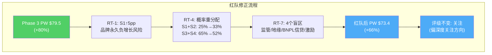

# Chapter 22: 红队七问 — 系统性偏差审计

## 22.0 红队前置：Phase 1-3的叙事方向审计

Phase 1-3的叙事方向是"关注(偏深度关注方向)"，PW $79.5 vs $44.19 = +80%。在执行红队前，先识别**分析师可能的系统性偏差方向**：

**偏差检测**：
- P1建立了"Identity B最可能"框架→后续分析可能不自觉地围绕Identity B寻找证据（确认偏差）
- P3概率分配给S3(温和改善)40%最大权重→可能低估了S1/S2(衰退)的真实概率
- 整体叙事偏多头（+80%上行 vs -22%下行）→需要特别审视空头论点的有效性
- **DM密度2.00看起来高，但很多DM来自模型估算而非硬数据**→数据基础可能不如密度暗示的那么扎实

---

## RT-1: 最关键的单一假设是什么？如果它错了会怎样？

**最关键假设：品牌checkout不会转为持续负增长。**

Phase 1-3的所有估值（DCF/SOTP/PW）都建立在这个假设之上：
- Bear Case: 品牌-3~5%但之后恢复→FCF不会永久萎缩
- Base Case: 品牌+2-5%→TM$温和增长
- Bull Case: 品牌+6-8%→TM$加速

**如果品牌checkout进入永久负增长(-5%/年且不恢复)会怎样？**

| 指标 | Phase 3 Bear | RT-1极端情景 |
|------|:-----------:|:-----------:|
| 品牌checkout | -3~5%→恢复 | **-5%/年持续** |
| TM$ 10年CAGR | -1% | **-3~4%** |
| FCF 2035年 | $4.5B | **$3.0B** |
| 终端P/E | 5-7x | **4-5x** |
| 公允价值 | $53.5 | **$28-35** |
| vs $44.19 | +21% | **-21~37%** |

[DM-RT-001: RT-1极端Bear, 品牌永久负增长→$28-35]

**因果链验证**：品牌checkout永久负增长需要什么条件？(1)Apple Pay线上份额从14%快速升至30%+（需要Apple激进推广线上支付）；(2)大商户系统性删除PayPal按钮（需要替代方案的转化率≥PayPal）；(3)Fastlane完全失败（覆盖停滞或转化率衰减）；(4)年轻用户永远不回来（Venmo Pay无法替代PayPal品牌）。

**这四个条件同时成立的概率约10-15%**——不是不可能，但不是基准情景。Phase 3给S1(品牌崩塌)10%概率是合理的，可能可以微调至12-15%。

**RT-1修正建议：S1概率从10%上调至15%，S3从40%下调至35%。**

---

## RT-2: 哪些数据最可能是错的？

逐一审计关键数据点的可靠性：

| 数据点 | 使用值 | 来源可靠性 | 错误风险 | 如果错了的影响 |
|--------|--------|:---------:|:-------:|-------------|
| 品牌take rate 2.25% | 高频使用 | ⚠️ Mizuho估算非官方 | **中** | SOTP品牌估值±$3-5B |
| Braintree take rate 0.30% | 高频使用 | ⚠️ Mizuho估算非官方 | **中** | 利润拆分可能不准 |
| 品牌30% volume/65%利润 | 核心框架 | ⚠️ Mizuho估算 | **高** | **品牌利润11x Braintree(CI-02)可能不准** |
| Venmo $1.7B收入 | 估值锚点 | ✅ CNBC引述官方 | 低 | |
| Fastlane +50%转化率 | 产品评估 | ⚠️ 单一案例(Black Forest) | **中** | Fastlane价值可能被高估 |
| 正常化FCF $5.21B | DCF基础 | ✅ 基于FMP+调整 | 低 | |
| Stripe TPV $1.9T | 竞争对标 | ⚠️ 未上市，非官方 | 中 | 竞争格局判断偏差 |
| 员工数23,800 | 效率分析 | ✅ 10-K | 低 | |

[DM-RT-002: 数据可靠性审计, 3个高风险数据点]

**最危险的数据：品牌30%/65%利润拆分。** 这个数据来自Mizuho研报估算——PayPal从不在10-K中披露品牌vs非品牌的利润拆分。如果实际比例是品牌35%volume/55%利润（而非30%/65%），那么品牌利润密度从11x降至6.3x，SOTP中品牌估值可能下降$3-5B。

**RT-2修正建议：在报告中标注品牌/非品牌利润拆分来自第三方估算（非官方），并提供±10%的敏感性区间。**

---

## RT-3: 什么是分析师最不想看到的数据？

如果在明天的earnings call上出现以下数据，整个投资论点会崩塌：

1. **品牌checkout Q1 2026 -3%或更差**——如果Lores上任后品牌继续恶化（而非企稳），说明问题不是执行层面（Chriss个人能力）而是结构层面（品牌本身在衰退）。影响：S1概率从15%跳升至40%→PW从$79.5降至$55-60。

2. **Braintree大客户流失（Uber或DoorDash切换到Stripe）**——Braintree的$1.18T TPV中，前10大客户可能贡献30-40%。任何一家流失都意味着Braintree的"切换成本壁垒"不如预期。影响：Braintree估值从$13B降至$8-10B。

3. **FCF突然下降至<$4B**——可能因为BNPL坏账飙升、诉讼和解、或工作资本恶化。影响："回购复利"论点瓦解→P/E可能从8x压至5x。

4. **Lores宣布>$5B并购**——如果Lores不用FCF回购而是做大并购（类似Honey灾难），市场会恐慌。影响：并购公告日股价可能-15~20%。

[DM-RT-003: 最不想看到的4个数据/事件]

---

## RT-4: 概率分配是否受到锚定效应？

**审计Phase 3的S1-S5概率分配**：

| 情景 | Phase 3 | RT-4审计后 | 调整理由 |
|------|:------:|:--------:|---------|
| S1品牌崩塌 | 10% | **15%** | Q4+1%可能不是底部 |
| S2缓慢衰退 | 15% | **18%** | CEO不确定性>Phase 3假设 |
| S3温和改善 | 40% | **32%** | 过度乐观——Fastlane数据仅单一案例 |
| S4拐点确认 | 25% | **20%** | 三重催化同时成立概率偏高 |
| S5收购/分拆 | 10% | **15%** | @$44市值+14% FCF yield更吸引PE |

**锚定效应检测**：Phase 3可能被FMP DCF($105.7)锚定——FMP的数字极其乐观，可能无意识地拉高了S3/S4的概率。调整后S1+S2=33%(从25%→+8pp)，S3+S4=52%(从65%→-13pp)。

[DM-RT-004: 概率调整: S1+S2 25%→33%, S3+S4 65%→52%]

**修正后PW**：
```
PW = 0.15×$28 + 0.18×$42 + 0.32×$83 + 0.20×$119 + 0.15×$75
   = $4.2 + $7.56 + $26.56 + $23.80 + $11.25
   = $73.37
```

**修正后PW $73.4 vs Phase 3的$79.5 = 下调-$6.1(-7.7%)**

[DM-RT-005: 红队修正后PW: $79.5→$73.4 (-7.7%), 仍+66%上行]

---

## RT-5: 时间框架偏差——2年后还是5年后？

Phase 3估值基于10年DCF——隐含投资者愿意持有PYPL 10年。但如果投资者的实际持有期是2-3年：

**2年后可能的情景**：
| 指标 | S2(最可能下行) | S3(最可能上行) |
|------|:----------:|:----------:|
| 2028E EPS | $6.0 | $7.5 |
| P/E(2028) | 7x | 11x |
| 目标价(2028) | $42 | $83 |
| 年化回报 | **-2.5%** | **+37%/年** |

**时间框架对回报的影响巨大**——如果S2成真（品牌缓慢衰退），2年后股价可能仍在$40-42区间（年化-2.5%），回购的EPS增厚被P/E压缩抵消。投资者需要耐心等待Fastlane/Venmo的数据验证——这不是一个6个月就能见效的投资。

**RT-5修正建议：明确标注"这是一个2-3年的投资，不是交易性机会"。**

---

## RT-6: 反向红队——多头论点中最不可能被证伪的是什么？

不是所有多头论点都脆弱。以下论点在几乎任何情景下都成立：

1. **FCF可持续性**——即使品牌衰退，Braintree+Venmo仍在增长→FCF不会低于$3.5-4.0B→股东年化FCF收益率≥8.5%(@$44)。**这是铁底。**

2. **回购数学**——@$44，$6B回购=13.6%回购yield=每年缩股~14%→5年后EPS即使零有机增长也翻倍。**只要FCF>$5B且管理层不做大并购，这个数学就成立。**

3. **收购期权**——$41B市值+ND/EBITDA 0.25x→杠杆LBO可以用$15-20B equity + $25B debt收购→PE的equity IRR可能>20%。**这不取决于品牌是否恢复——即使品牌衰退，LBO数学仍然成立。**

[DM-RT-006: 三个几乎不可证伪的多头论点]

---

## RT-7: 报告的盲区是什么？

**盲区1：监管风险几乎未分析。** CFPB对数字支付的监管加强（2024-2025年多项规则）、反洗钱合规成本上升、BNPL监管可能的变化——这些都可能影响OPM。Phase 2 Ch12-13仅简要提及。

**盲区2：中国/跨境支付的地缘政治风险。** PayPal在中国市场几乎不存在（微信支付/支付宝主导），但43%的收入来自国际市场——如果某个主要市场（如欧盟）对美国支付平台施加额外合规要求或数据本地化，可能影响国际收入。

**盲区3：BNPL信贷周期风险。** PayPal的BNPL outstanding估计$5-10B——如果美国消费信贷周期恶化（失业率上升→BNPL违约率从~2%升至5-8%），核销可能达$250-500M→直接打击FCF。这在Phase 2中被低估了。

**盲区4：管理层薪酬激励。** Lores的薪酬结构未分析——他的激励是否与品牌checkout增速挂钩？还是与EPS（可以被回购驱动）挂钩？激励结构决定了他会优先做什么。

[DM-RT-007: 四个报告盲区]

---

## 22.1 红队总结：净调整

| 调整项 | Phase 3值 | 红队修正 | 变化 |
|--------|:--------:|:-------:|:----:|
| S1概率 | 10% | **15%** | +5pp |
| S2概率 | 15% | **18%** | +3pp |
| S3概率 | 40% | **32%** | -8pp |
| S4概率 | 25% | **20%** | -5pp |
| S5概率 | 10% | **15%** | +5pp |
| **PW公允价值** | $79.5 | **$73.4** | **-$6.1(-7.7%)** |
| 评级方向 | 关注(偏深度关注) | **关注(偏深度关注)** | 不变 |

**红队净效果：PW下调$6.1/share(-7.7%)，但评级方向不变。**

因为@$44.19即使红队修正后PW $73.4仍有+66%上行→远超"关注"下限(+10%)。红队将下行概率从25%上调至33%是合理的——但上行概率52%仍然是最大概率方向。

**红队有效性评分：3.5/5**——概率调整有实质影响(-$6.1)，识别了4个盲区，但没有颠覆核心论点。符合"红队是校准非翻盘"的原则(CME v3.0教训)。



---

> **DM锚点注册表 (Ch22)**
>
> | ID | 描述 | 来源 |
> |----|------|------|
> | DM-RT-001 | RT-1极端Bear: 品牌永久负增长→$28-35 | 红队分析 |
> | DM-RT-002 | 数据可靠性审计: 3个高风险(品牌拆分/Fastlane/Stripe TPV) | 红队分析 |
> | DM-RT-003 | 最不想看到的4个数据 | 红队分析 |
> | DM-RT-004 | 概率调整: S1+S2 25%→33%, S3+S4 65%→52% | 红队分析 |
> | DM-RT-005 | 红队修正PW: $79.5→$73.4(-7.7%) | 红队计算 |
> | DM-RT-006 | 三个不可证伪多头论点(FCF底/回购数学/LBO期权) | 红队分析 |
> | DM-RT-007 | 四个盲区(监管/地缘/BNPL信贷/激励) | 红队分析 |
