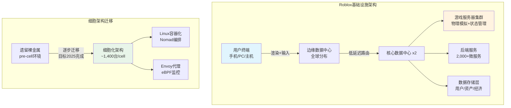
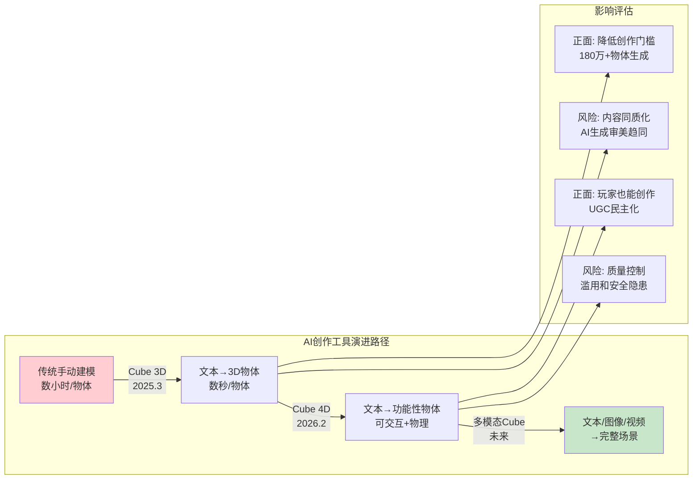
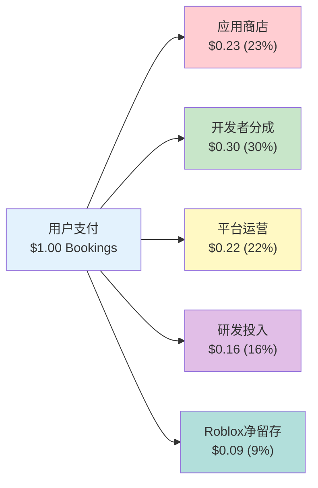
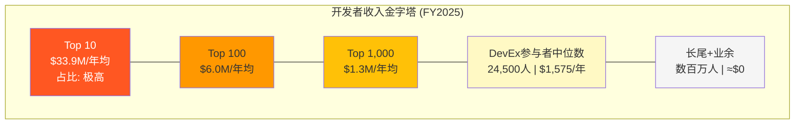
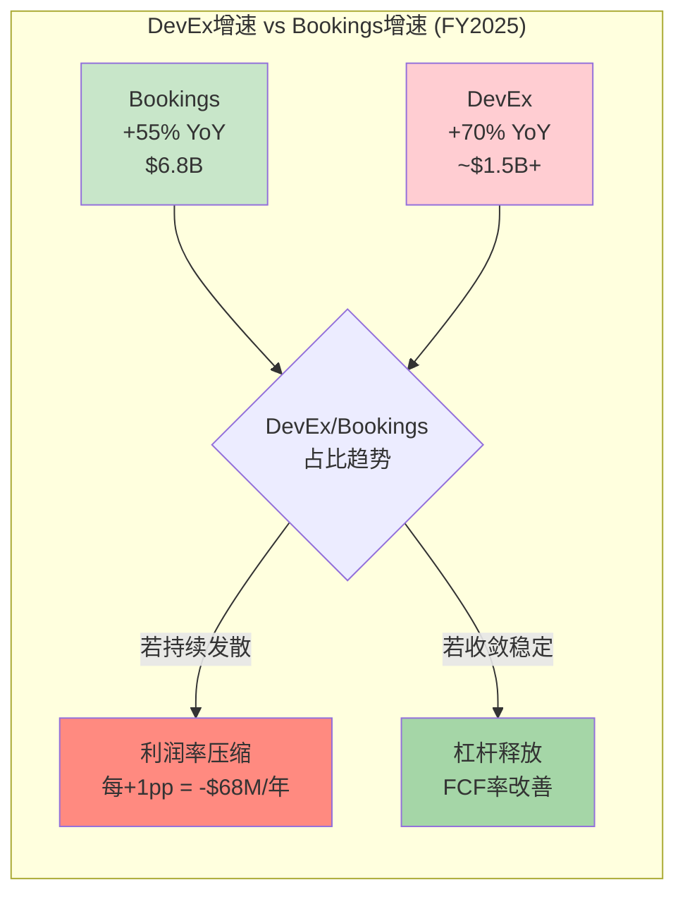
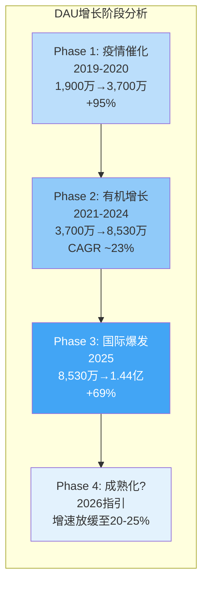
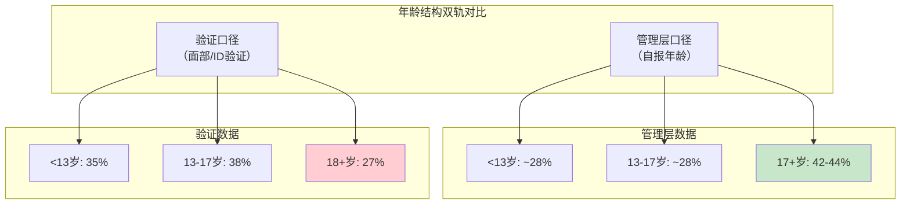
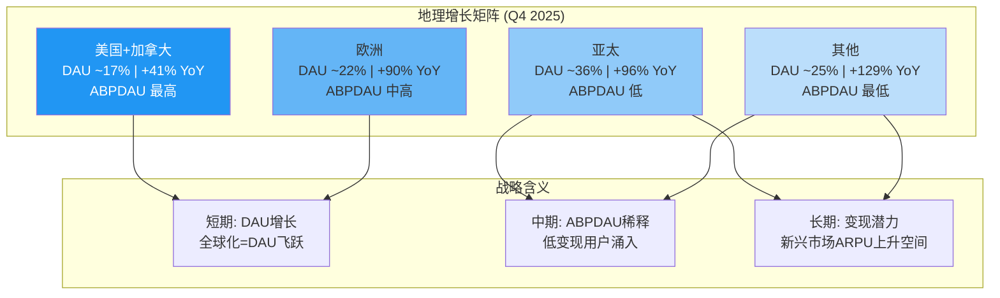

# Phase 1: 商业分析 — Roblox (RBLX)

> **市值基准**: $44.3B | 股价 $63.17 | 稀释股数 702M | 2026-02-13

---

## Ch3: 技术架构 — Roblox Engine与Cloud基础设施

### 3.1 Roblox Engine的技术定位

Roblox的技术栈建立在一个高度垂直整合的自研引擎之上，其核心编程语言Luau（Lua的改良分支）构成了整个平台的开发者接口层[DM-TEC-001]。与传统游戏引擎不同，Roblox采用客户端-服务器混合架构：物理模拟和游戏状态管理在Roblox服务器端执行，终端设备（手机、PC、主机）仅承担渲染和输入处理功能[DM-TEC-002]。这一设计选择带来两个结构性后果：

**正面效应**：极低的终端硬件门槛。Roblox可在低端Android设备上流畅运行，这直接支撑了其在印度（+110% YoY）、印度尼西亚（+700% YoY）等新兴市场的爆发式增长[DM-TEC-003]。80%的DAU通过移动端接入[DM-USR-001]，服务器端计算模式使得内容体验不受设备性能制约。

**负面效应**：服务器端计算意味着基础设施成本与DAU呈强正相关。每新增一个DAU，Roblox必须承担相应的服务器算力成本，这与纯P2P游戏或客户端计算模式形成鲜明对比。FY2025基础设施与信任安全支出达$824M（前三季度），同比增长19%[DM-TEC-004]。

Luau语言本身是Roblox生态的双刃剑。作为Lua的类型安全增强版本，Luau提供了相对较低的学习曲线——相比Unity的C#和Unreal的C++，Luau更易上手，这对年轻开发者群体极为友好。但Luau的技能不可迁移性是一个隐性成本：开发者在Roblox上积累的编程经验无法直接转化为Unity/Unreal项目的生产力，这既是平台锁定的手段，也是开发者社区长期不满的来源之一。

### 3.2 云基础设施：自建私有云的战略选择

Roblox在基础设施战略上做出了与多数科技公司截然不同的选择——自建私有云而非依赖AWS/GCP/Azure[DM-TEC-005]。截至2024年中，Roblox运营超过135,000台服务器，分布在两个核心数据中心和多个边缘数据中心[DM-TEC-006]，支撑日均超过2.5亿并发连接、每秒数百万次读写操作、以及超过2,000个内部云服务[DM-TEC-007]。

这一架构正在经历关键的代际迁移。Roblox从裸金属（bare-metal）配置向Linux容器化架构转型，引入"细胞"（Cell）概念——每个细胞包含约1,400台服务器，如同"防火门"般实现故障隔离[DM-TEC-008]。截至2024年初，约70%的后端流量已通过细胞架构运行，近30,000台服务器进入细胞化状态（不到总服务器规模的10%）[DM-TEC-009]。该迁移使用HashiCorp的Nomad作为统一编排器，实现Windows和Linux工作负载的无缝部署。

**成本效率的核心矛盾**：Roblox管理层表示，在其规模和去中心化架构下，维护私有云比公有云更具成本效益[DM-TEC-010]。但FY2025前三季度$824M的基础设施支出同比增长19%，而同期DAU增长69%[DM-TEC-011]——基础设施成本增速显著低于用户增速，表明规模效应正在兑现。单DAU基础设施成本呈下降趋势，这是私有云战略的关键验证。然而，值得注意的是，基础设施成本仍以每年两位数百分比增长，其绝对值规模构成了持续的利润率压力。

### 3.3 AI工具：Cube模型与4D生成

2025年3月，Roblox发布了其核心生成式AI系统Cube 3D——一个开源的3D基础模型，直接在原生3D数据上训练，而非依赖图像重建方法[DM-TEC-012]。该模型采用3D标记化技术，将形状视为离散的token（类似语言模型处理文字的方式），通过自回归Transformer实现文本到3D物体的生成。开发者可通过Mesh Generation API输入文本描述（如"一辆红色越野车"），在数秒内生成可在游戏引擎中直接使用的3D网格。截至发布后一年内，该工具已协助用户生成超过180万个3D物体[DM-TEC-013]。

2026年2月，Roblox将Cube推进至"4D生成"阶段——第四维是物体、环境与人之间的交互关系。在开放测试版中，创作者启用4D生成后，玩家可以通过文本提示生成功能完整的物体（如生成一辆可以驾驶的汽车），从2025年11月的早期访问演进至公开测试[DM-TEC-014]。

**投资含义的两面性**：AI工具极大降低了创作门槛，有望将Roblox的开发者基数从当前约24,500名DevEx参与者扩展至数十万级别。但这也带来内容同质化风险——当每个人都能用AI生成3D物体时，差异化创作的护城河可能被稀释。对头部开发者工作室而言，AI工具是效率倍增器；对长尾开发者而言，AI可能进一步压缩其在注意力市场中的份额。

### 3.4 与Unity/Unreal的技术对比

将Roblox与Unity/Unreal进行直接技术对比并不完全公平——它们解决不同层次的问题。但理解这一对比对评估Roblox的技术天花板至关重要。

| 维度 | Roblox Engine | Unity | Unreal Engine 5 |
|------|---------------|-------|-----------------|
| 编程语言 | Luau（Lua变体） | C# | C++ / Blueprints |
| 图形质量 | 中低（风格化） | 中高（HDRP） | 极高（Nanite/Lumen） |
| 目标平台 | 仅Roblox平台 | 跨平台导出 | 跨平台导出 |
| 服务器上限 | 100人/服务器 | 开发者自定 | 开发者自定 |
| 分发方式 | 平台内置分发 | 自行发布 | 自行发布 |
| 变现模式 | Robux经济体 | 开发者自定 | 开发者自定 |
| 学习曲线 | 低 | 中 | 高 |

核心差距在于：**Roblox牺牲了图形保真度和开发灵活性，换取了内置分发和变现基础设施**。对于追求AAA画质的开发者，Roblox不是选项；对于追求低成本触达1.5亿日活用户的创作者，Roblox几乎无替代品。100人/服务器的上限[DM-TEC-015]和Luau的技能不可迁移性是平台级限制，短期内不会改变。

### Ch3 DM锚点汇总

| ID | 数据点 | 来源 | 可信度 |
|----|--------|------|--------|
| DM-TEC-001 | Roblox核心语言为Luau（Lua改良版） | Roblox官方文档 | ★★★ |
| DM-TEC-002 | 客户端-服务器架构：服务器端物理模拟 | Roblox技术博客 | ★★★ |
| DM-TEC-003 | 印度DAU +110%，印尼+700% YoY（Q4 2025） | Q4 2025股东信 | ★★★ |
| DM-TEC-004 | FY2025前三季度基础设施+信任安全支出$824M，+19% YoY | Roblox财报 | ★★★ |
| DM-TEC-005 | Roblox选择自建私有云而非公有云 | Roblox基础设施博客2024 | ★★★ |
| DM-TEC-006 | 135,000+台服务器，2个核心+多个边缘数据中心 | Roblox基础设施博客2024 | ★★★ |
| DM-TEC-007 | 2.5亿+并发连接，2,000+内部服务 | Roblox基础设施博客2024 | ★★★ |
| DM-TEC-008 | 细胞架构：~1,400台服务器/cell | InfoQ报道2024.1 | ★★★ |
| DM-TEC-009 | 70%后端流量通过细胞架构，~30,000台服务器入cell | InfoQ报道2024.1 | ★★★ |
| DM-TEC-010 | 管理层确认私有云成本优于公有云 | Roblox基础设施博客 | ★★☆ |
| DM-TEC-011 | 基础设施成本+19% vs DAU +69%，规模效应验证 | 综合计算 | ★★☆ |
| DM-TEC-012 | Cube 3D基础模型发布，开源在GitHub/HuggingFace | Roblox官方公告2025.3 | ★★★ |
| DM-TEC-013 | Cube协助生成180万+3D物体 | Roblox官方公告 | ★★★ |
| DM-TEC-014 | 4D生成开放测试版2026.2启动 | TechCrunch报道 | ★★★ |
| DM-TEC-015 | 服务器容量上限100人 | Roblox平台限制/开发者论坛 | ★★★ |

---

## Ch4: 开发者经济深度解剖

### 4.1 DevEx分成结构的演变与定位

Roblox的开发者经济体是理解其商业模式的核心钥匙。Developer Exchange（DevEx）程序允许符合条件的创作者将平台内赚取的Robux兑换为法定货币。2025年9月，Roblox将DevEx汇率从$0.0035/Robux提升8.5%至$0.0038/Robux[DM-DEV-001]，这是平台在持续压力下逐步提高创作者分成的最新举措。

但理解Roblox的"分成率"需要穿透表面数字。管理层宣称开发者获得"约30%"的Bookings分成，但这一数字的真实含义需要通过Robux经济流的完整拆解来理解：

每$1 Bookings中[DM-DEV-002]：
- **应用商店抽成 $0.23（23%）**：Apple/Google的30%佣金率（部分订阅类交易为15%），经Roblox的支付组合加权后约为23%。这是Roblox无法控制的外生成本。
- **开发者分成 $0.30（30%）**：通过DevEx支付给创作者的部分。FY2025 DevEx总支出超过$1.5B，同比增长约70%[DM-DEV-003]。Q4 2025单季DevEx支付$477M，占该季度收入的33.7%[DM-DEV-004]。
- **平台运营 $0.22（22%）**：基础设施、信任与安全、客服等。
- **研发投入 $0.16（16%）**：产品开发和技术创新，包括AI工具。
- **Roblox净留存 $0.09（9%）**：这就是Roblox在整个价值链中的实际经济利润率——每流经平台$1，Roblox仅净留$0.09。

**关键洞察**：9%的净留存率揭示了Roblox商业模式的本质——它更接近"基础设施提供商"而非"内容平台"。相比之下，YouTube向创作者支付约55%[DM-DEV-005]，Spotify向版权方支付约70%[DM-DEV-006]，Etsy的平台抽成率约6.5%[DM-DEV-007]。表面上看，Roblox的30%开发者分成远低于YouTube，但需注意Roblox承担了应用商店费用（23%）和全部基础设施成本（22%），这些在YouTube/Spotify模式中由创作者或第三方承担。

### 4.2 收入分配的帕累托极端化

Roblox开发者经济中最令人不安的结构性特征是收入分配的极端不均衡：

| 开发者层级 | 年均收入 | 群体规模 | 增速（vs 2019） |
|-----------|---------|---------|----------------|
| Top 10 | $33.9M | 10人 | +450% |
| Top 100 | $6.0M | 100人 | +500% |
| Top 1,000 | $1.3M（2025最新） | 1,000人 | +570% |
| 中位DevEx参与者 | $1,575 | ~24,500人 | N/A |
| 长尾开发者 | 接近$0 | 数百万人 | N/A |

[DM-DEV-008] 头部10名开发者年均$33.9M vs 中位数$1,575——差距达到21,524倍。这不仅是帕累托分布，而是接近幂律分布的极端态。

### 4.3 头部工作室 vs 独立开发者的结构性鸿沟

Roblox生态内已形成两个截然不同的开发者世界：

**头部工作室（如Adopt Me!, Brookhaven, Blox Fruits）**：这些是真正的商业实体，拥有数十人的全职团队、专业的产品管理流程、持续的内容更新节奏。Adopt Me!的开发商Uplift Games在2020年已是一个成熟的游戏工作室。头部体验能够持续产生收入循环——新内容→用户回流→Robux消费→DevEx兑现。Top 1,000开发者年均$1.3M的收入水平足以支撑专业工作室运营[DM-DEV-009]。

**独立开发者的残酷现实**：中位DevEx参与者的$1,575年收入[DM-DEV-010]甚至不足以覆盖一个月的最低生活成本。数百万非DevEx参与者（未达到DevEx门槛的创作者）的收入为零。Roblox的"开发者友好"叙事在统计层面是真实的——确实有24,500+人通过DevEx获得收入——但其分布形态意味着，对绝大多数参与者而言，Roblox创作更接近于"有教育意义的爱好"而非"可行的职业路径"。

**正面解读**：这种分布在数字经济中并非Roblox独有。YouTube的创作者收入同样呈极端幂律分布（头部YouTuber年收入数千万美元，而95%的频道月收入不足$100）。Roblox至少提供了一个全球性的、低门槛的创业实验场，头部工作室的高速增长（Top 1,000自2019年增长570%）证明平台确实在创造真实的经济价值。

**负面解读**：与YouTube不同，Roblox开发者无法将其作品带离平台。YouTube创作者可以迁移至Twitch、TikTok或建立独立品牌；Roblox开发者的内容、用户关系和收入流全部锁定在平台内。这种不对等的依赖关系意味着，一旦Roblox调整算法推荐或分成政策，开发者缺乏议价能力。

### 4.4 DevEx成本增速的可持续性分析

FY2025 DevEx支出超过$1.5B，同比增长约70%[DM-DEV-011]，显著快于Bookings的55%增速[DM-DEV-012]。这一趋势如果持续，将产生严重的利润率后果：

**为什么DevEx增速超过Bookings增速？** 三个结构性原因：
1. **分成率提升**：2025年9月DevEx汇率上调8.5%，直接推高单位成本。
2. **头部集中度强化**：头部开发者的Bookings增速高于平均水平，而头部开发者更倾向于兑现（vs 长尾开发者可能将Robux再投入平台）。
3. **Creator Rewards计划扩展**：Roblox持续推出新的创作者激励机制以留住头部人才。

**利润率影响的量化估算**：假设DevEx/Bookings比率从FY2024的约25%升至FY2025的约30%（根据Q4 DevEx占收入33.7%的数据推算）[DM-DEV-013]，DevEx每增加1个百分点的Bookings占比，对应约$68M的年化成本增加（以FY2025 $6.8B Bookings为基数）。如果DevEx/Bookings比率趋向35%，相比30%将额外消耗$340M/年——这相当于FY2025 FCF $1.36B的25%。

**关键问题**：DevEx成本增速能否回落至与Bookings增速一致？管理层的隐含承诺是DevEx/Bookings比率会在30-33%区间稳定。但从博弈论角度看，头部开发者有持续议价的动力——如果Unity/Epic推出有竞争力的UGC平台（Fortnite Creative 2.0已在测试），Roblox可能被迫进一步提高分成以保留核心创作者。这是一个"赢家诅咒"的经典场景。

### 4.5 平台对比：Roblox的经济学独特性

| 维度 | Roblox | YouTube | Spotify | Etsy |
|------|--------|---------|---------|------|
| 创作者分成 | ~30%（Bookings） | ~55%（广告） | ~70%（版权） | 商家留~93.5% |
| 平台抽成 | ~9%净留存 | ~45% | ~30% | ~6.5% |
| 分发成本 | 平台承担（23%应用商店） | 创作者自建流量 | 版权方自有IP | 商家自营 |
| 基础设施 | 平台全额承担 | 创作者存储由YouTube承担 | 无存储成本 | 商家自行物流 |
| 内容可迁移 | 不可迁移 | 可迁移 | IP独立于平台 | 可多平台销售 |
| 最低门槛 | 10万Robux(~$380) | $0（已取消门槛） | 唱片合约 | 开店费$0.20/listing |

[DM-DEV-014] 这一对比揭示了Roblox经济模式的本质特征：**高度垂直整合的封闭经济体**。Roblox在整个价值链上承担了更多成本（应用商店+基础设施），因此表面上的30%创作者分成并不直接可比YouTube的55%。但内容不可迁移性是一个关键差异——这赋予了Roblox对开发者的结构性议价优势，也构成了监管和竞争方面的潜在风险点。

### Ch4 DM锚点汇总

| ID | 数据点 | 来源 | 可信度 |
|----|--------|------|--------|
| DM-DEV-001 | DevEx汇率从$0.0035升至$0.0038/Robux（+8.5%），2025.9.5生效 | Roblox开发者论坛公告 | ★★★ |
| DM-DEV-002 | 每$1 Bookings分配：应用商店23%+开发者30%+运营22%+R&D 16%+净留9% | 管理层披露/分析师推算 | ★★☆ |
| DM-DEV-003 | FY2025 DevEx总支出超$1.5B，+70% YoY | Roblox财报/股东信 | ★★★ |
| DM-DEV-004 | Q4 2025 DevEx支付$477M，占收入33.7% | Q4 2025股东信 | ★★★ |
| DM-DEV-005 | YouTube创作者分成约55% | YouTube公开政策 | ★★★ |
| DM-DEV-006 | Spotify版权方分成约70% | Spotify公开数据 | ★★★ |
| DM-DEV-007 | Etsy平台抽成率约6.5% | Etsy投资者关系 | ★★★ |
| DM-DEV-008 | Top 10开发者年均$33.9M，Top 100年均$6M，Top 1,000年均$1.3M | Roblox经济影响报告2025 | ★★★ |
| DM-DEV-009 | Top 1,000自2019年收入增长570% | Roblox经济影响报告2025 | ★★★ |
| DM-DEV-010 | DevEx中位参与者年收入$1,575（截至2024.12） | Roblox经济影响报告 | ★★★ |
| DM-DEV-011 | FY2025 DevEx同比增长约70% | Q4 2025财报数据 | ★★★ |
| DM-DEV-012 | FY2025 Bookings同比增长55%至$6.8B | Q4 2025股东信 | ★★★ |
| DM-DEV-013 | DevEx/Bookings比率从~25%升至~30%（推算） | 综合计算 | ★★☆ |
| DM-DEV-014 | YouTube/Spotify/Etsy分成率对比 | 各平台公开数据 | ★★★ |

---

## Ch5: 用户画像与年龄结构

### 5.1 DAU增长曲线：从3,000万到1.515亿的飞跃

Roblox的DAU增长轨迹是过去五年互联网领域最引人注目的增长故事之一：

| 时期 | DAU | YoY增长 | 关键驱动力 |
|------|-----|---------|-----------|
| 2019年 | ~1,900万 | — | 核心儿童用户 |
| 2020年Q4 | ~3,700万 | ~95% | COVID-19居家效应 |
| 2021年Q4 | ~4,950万 | ~34% | 后疫情保持粘性 |
| 2022年Q4 | ~5,880万 | ~19% | 增速放缓 |
| 2023年Q4 | ~7,160万 | ~22% | 国际扩张+年龄扩展 |
| 2024年Q4 | ~8,530万 | ~19% | 品牌体验+社交深化 |
| 2025年Q3 | 1.515亿 | +91% | 计量变更+新兴市场爆发 |
| 2025年Q4 | 1.44亿* | +69% | 季节性调整后持续增长 |

[DM-USR-002] *注：Q4 DAU低于Q3部分由季节性因素驱动（Q3含北半球暑假）。FY2025 DAU同比增长显著受益于2025年年中的DAU计量方法调整，需注意可比性。

FY2025 DAU增长的三大驱动力：(1) 新兴市场渗透——亚太DAU增速远超美加的32%，印尼+700%、日本+160%、印度+110%[DM-USR-003]；(2) 年龄层扩展——17+用户群体增速超过50%[DM-USR-004]；(3) 社交功能深化——Roblox日益成为Z世代的社交空间而非纯游戏平台。

### 5.2 年龄结构的双轨叙事：管理层数据 vs 验证数据

这是理解Roblox投资价值的最关键维度之一。管理层叙事与独立验证数据之间存在显著差距，投资者需要同时持有两套数据框架：

**管理层叙事**：
- 42-44%的DAU为17岁以上[DM-USR-005]
- 18+用户增速超过50%
- 年龄较大的用户变现能力高出约40%[DM-USR-006]
- 平台正从"儿童游戏"向"全年龄社交平台"转型

**年龄验证后的数据**（经过面部年龄识别或ID验证的用户）：
- 在完成年龄验证的45%用户中[DM-USR-007]：
  - 35%为13岁以下
  - 38%为13-17岁
  - **仅27%为18岁以上**
- Hindenburg Research在2024年10月的做空报告中进一步指控：83%的11-15岁用户虚报年龄[DM-USR-008]

**差距的投资含义分析**：

如果真实18+用户比例为27%而非管理层暗示的40%+，以下核心假设将受到冲击：

**1. TAM重估**：管理层的"全年龄社交平台"叙事支撑了与Meta/Snapchat可比的估值逻辑。若核心用户群实质仍以未成年人为主，TAM应锚定在儿童娱乐/教育市场而非泛社交市场。儿童娱乐市场的估值倍数系统性低于社交平台。

**2. ARPU天花板**：18+用户变现高40%[DM-USR-009]的前提是他们占比在持续扩大。若实际18+占比仅27%且增长缓慢，ABPDAU的提升空间将受限。Q4 2025 ABPDAU同比下降4%至$15.38[DM-USR-010]——部分原因正是低变现新兴市场用户的快速涌入稀释了该指标。

**3. 广告定向精度**：Google合作的奖励视频广告实现了>90%完成率和>95%可见率[DM-USR-011]，但品牌广告主的定价取决于受众构成。若70%+的用户实际为未成年人，广告CPM将面临结构性折价——儿童定向广告不仅单价低，还面临更严格的监管限制（COPPA、欧洲数字服务法案等）。

**管理层的反驳逻辑**：Roblox可能辩称27%的18+比例来自"已完成验证的45%用户"的子集，尚有55%用户未完成验证。若未验证用户中成人比例更高（因为成人可能更不愿进行面部验证），则整体18+比例可能高于27%。这一论点有一定合理性，但也面临反向论证——未成年人恰恰更有动机逃避验证（以维持虚报年龄带来的权限）。

### 5.3 Hindenburg做空指控的影响评估

2024年10月，Hindenburg Research发布做空报告，核心指控包括[DM-USR-012]：
1. **DAU虚增25-42%**：由于多开账号（alt accounts）和机器人账号，实际独立人类用户远低于报告的DAU数字。
2. **参与时长虚增100%+**：机器人账号24小时在线，产生"僵尸参与时长"（zombie engagement hours），中位独立用户实际日均游戏时长仅约22分钟。
3. **双轨指标**：多名前员工称Roblox内部使用过滤掉机器人/多开的指标做业务决策，而对外披露使用未过滤的膨胀指标。

**Roblox的回应**[DM-USR-013]：管理层全面否认指控，称Hindenburg的财务主张"具有误导性"，强调做空机构有利益冲突。Roblox未提供过滤后的"真实DAU"数据作为反驳证据。

**投资者应如何定价Hindenburg风险？** 即使指控部分属实——假设DAU虚增25%（取低端）——Q4 2025的"真实DAU"约为1.08亿（vs 报告的1.44亿），这仍然是一个庞大的用户基数。更重要的是，Bookings和Revenue是不可虚增的硬收入指标——$6.8B的Bookings代表真实的消费者支出。DAU虚增的主要影响在于：(1) 对外部分析师基于"DAU × ARPU"的估值模型产生误导；(2) 降低广告主对受众规模的信任度。

### 5.4 地理分布与ABPDAU差异

FY2025的地理扩张呈现出极度不均衡的格局：

| 地区 | DAU占比（估算） | Bookings增速（Q4） | ABPDAU特征 |
|------|----------------|-------------------|-----------|
| 美国+加拿大 | ~17% | +41% YoY | 最高（~$30+） |
| 欧洲 | ~22% | +90% YoY（Q3） | 中高 |
| 亚太 | ~36% | +96% YoY | 低但快速提升 |
| 其他地区 | ~25% | +129% YoY（Q3） | 最低 |

[DM-USR-014] 地理结构揭示了一个"增长-变现"悖论：增长最快的地区（亚太+其他）恰恰是ABPDAU最低的地区。Q4 2025全球ABPDAU同比下降4%至$15.38[DM-USR-015]，正是低变现地区用户快速涌入的数学结果。

**美加市场的关键观察**：仅占17%的DAU却贡献了不成比例的Bookings份额（估算40-45%）。Q3 2025美加Bookings为$1,047.9M（+43% YoY），亚太Bookings虽然增长96%但绝对值仍较小。这意味着Roblox的变现引擎高度依赖北美用户——如果北美增长放缓（Q4 +32% vs Q3 +41%），全球ABPDAU将持续面临下行压力。

### 5.5 用户行为特征与付费转化

FY2025的用户参与数据呈现出深度参与的特征[DM-USR-016]：
- **日均参与时长**：超过2.5小时（Q4 2025），在所有社交/游戏平台中处于顶级水平
- **Q4 参与总时长**：350亿小时，同比+88%
- **月度独立付费用户（MUP）**：3,670万，同比接近翻倍（+94%）[DM-USR-017]
- **付费用户平均消费**：$20.18/月，Robux购买量同比+53%[DM-USR-018]

付费渗透率可估算为：MUP 3,670万 / DAU 1.44亿 ≈ 25.5%[DM-USR-019]——这一比例在免费增值模式中属于极高水平（典型F2P游戏为5-10%）。但需注意，这里的"DAU"包含了可能被虚增的部分（如Hindenburg指控），真实付费渗透率可能更高。

**参与深度的投资含义**：2.5小时的日均参与意味着Roblox不仅仅是"游戏时间"——它正在吃掉Z世代的社交时间。根据eMarketer数据，美国Z世代日均社交媒体使用时间约3小时，Roblox的2.5小时意味着它与TikTok、Instagram等平台直接争夺同一时间池。这既是Roblox增长故事的核心论据（时间=注意力=变现潜力），也是其面临监管风险的来源——如果各国政府限制未成年人屏幕时间，Roblox将首当其冲。

2026年1月，Roblox宣布强制面部年龄验证才能使用聊天功能[DM-USR-020]，将用户分为6个年龄组（9岁以下、9-12、13-15、16-17、18-20、21+），不同年龄组之间的交互受限。这一举措可能对DAU产生短期负面影响——部分虚报年龄的未成年用户可能因功能受限而减少使用——但长期有助于提升平台对成人用户和广告主的可信度。管理层在2026年指引中已纳入"年龄验证举措的预期影响"，暗示对DAU增速的短期拖累[DM-USR-021]。

### Ch5 DM锚点汇总

| ID | 数据点 | 来源 | 可信度 |
|----|--------|------|--------|
| DM-USR-001 | 80%的DAU通过移动端接入 | Roblox财报/行业数据 | ★★★ |
| DM-USR-002 | Q4 2025 DAU 1.44亿（+69% YoY），Q3 1.515亿 | Q4 2025股东信 | ★★★ |
| DM-USR-003 | 印尼+700%、日本+160%、印度+110%（Q4 Bookings YoY） | Q4 2025股东信 | ★★★ |
| DM-USR-004 | 17+用户增速超50% | 管理层公开表述 | ★★☆ |
| DM-USR-005 | 42-44%的DAU为17岁以上（管理层口径） | 管理层公开表述 | ★★☆ |
| DM-USR-006 | 18+用户变现能力高出约40% | 管理层财报电话会 | ★★☆ |
| DM-USR-007 | 验证用户中：35%<13岁，38% 13-17岁，27% 18+岁 | Roblox年龄验证数据披露 | ★★★ |
| DM-USR-008 | 83%的11-15岁用户虚报年龄（Hindenburg引用） | Hindenburg做空报告2024.10 | ★☆☆ |
| DM-USR-009 | 18+用户变现高40% | 管理层披露 | ★★☆ |
| DM-USR-010 | Q4 2025 ABPDAU $15.38，同比-4% | Q4 2025股东信 | ★★★ |
| DM-USR-011 | Google奖励视频广告完成率>90%，可见率>95% | Roblox-Google合作公告 | ★★★ |
| DM-USR-012 | Hindenburg指控：DAU虚增25-42%，参与时长虚增100%+ | Hindenburg做空报告2024.10 | ★☆☆ |
| DM-USR-013 | Roblox全面否认Hindenburg指控 | Roblox IR声明 | ★★★ |
| DM-USR-014 | DAU地理分布：美加~17%，欧洲~22%，亚太~36%，其他~25% | Q4 2025幻灯片/推算 | ★★☆ |
| DM-USR-015 | Q4 2025全球ABPDAU $15.38，同比-4% | Q4 2025股东信 | ★★★ |
| DM-USR-016 | Q4日均参与时长超2.5小时 | Q4 2025股东信 | ★★★ |
| DM-USR-017 | Q4 MUP 3,670万，同比+94% | Q4 2025股东信 | ★★★ |
| DM-USR-018 | 付费用户月均消费$20.18，Robux购买+53% | Q4 2025财报 | ★★★ |
| DM-USR-019 | 付费渗透率≈25.5%（MUP/DAU推算） | 综合计算 | ★★☆ |
| DM-USR-020 | 2026.1强制面部年龄验证/聊天功能 | Roblox官方公告 | ★★★ |
| DM-USR-021 | 2026指引纳入年龄验证对DAU的短期影响 | Q4 2025财报电话会 | ★★★ |
