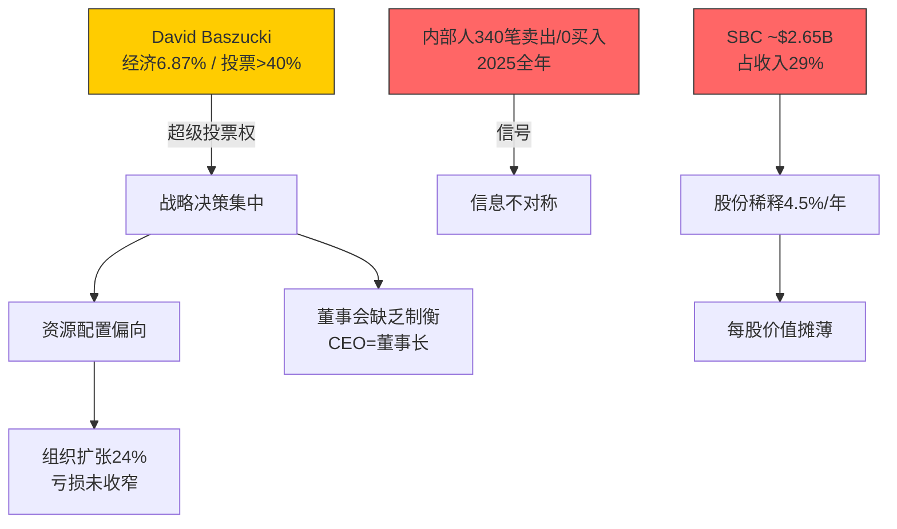
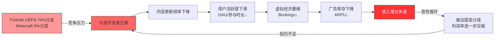
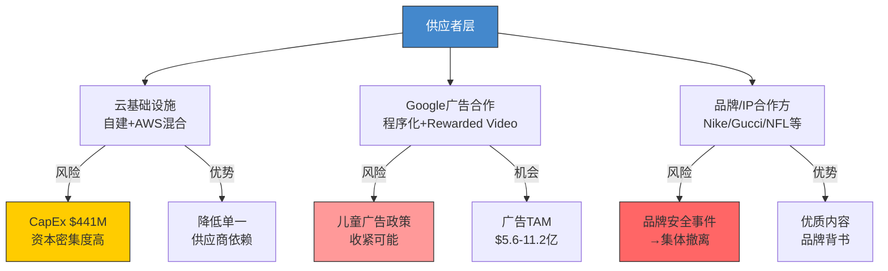
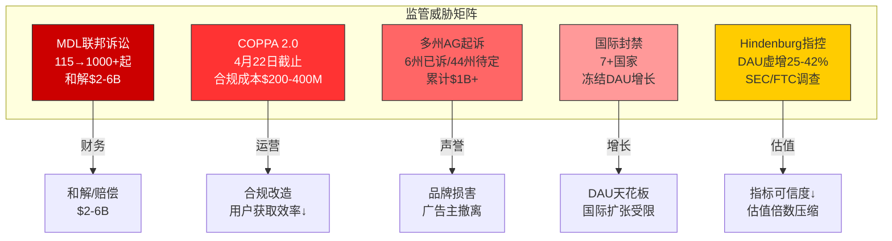
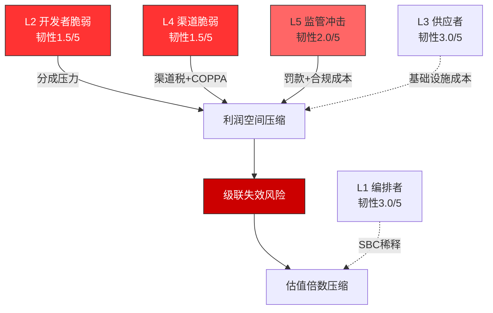
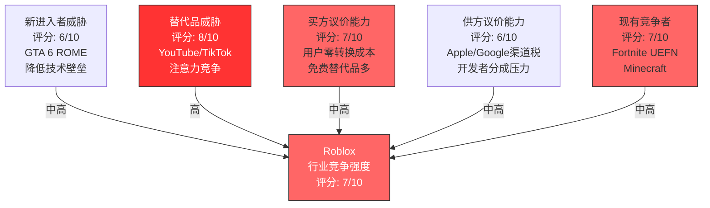
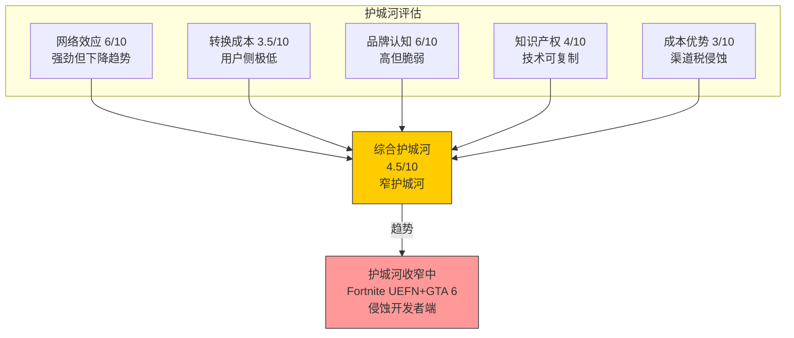

## Ch6: ERM生态风险映射 — 五层深度

Roblox的商业生态表面上呈现高速增长态势——FY2025收入$4.89B (+36% YoY)、DAU 1.515亿 (+69% YoY)、Bookings ~$6.8B (+55%)——但在这些令人瞩目的数字背后，隐藏着一个脆弱度极高的五层生态依赖结构。本章采用ERM(Ecosystem Risk Mapping)五层框架，对Roblox生态链的每一层进行系统性风险审计，量化脆弱度评级，识别级联失效路径，并评估整体生态韧性。[DM-ERM-001]

### L1: 编排者层 (Roblox Corp) — 脆弱度: 中

#### 层级定义

编排者层是生态系统的中枢控制节点，负责平台规则制定、资源配置、技术基础设施运营及对外治理沟通。Roblox Corp作为唯一编排者，其决策质量、治理结构和组织效能直接决定整个生态的运转方向。

#### 关键参与者

- **David Baszucki**: 创始人/CEO/董事会主席，持有Class B股约4,820万股(经济所有权~6.87%)，但通过20:1超级投票权结构控制超过40%的投票权 [DM-ERM-002]
- **管理层团队**: 2,474→3,065员工(+24% YoY)，组织快速扩张 [DM-ERM-003]
- **董事会**: Baszucki同时担任CEO与董事长，权力缺乏有效制衡

#### 治理集中风险量化

双层股权结构的核心矛盾在于: Baszucki以不足7%的经济利益控制超过40%的投票权。这意味着公众股东在重大战略决策上几乎没有否决能力。具体风险表现:

**内部人持续净卖出信号**: 2024Q4至2026Q1期间，内部人交易呈现压倒性净卖出态势。Q4 2025数据最为触目——80笔处置交易(disposed)对比仅6笔获取交易(acquired)，净卖出702,916股，期间零笔公开市场买入、71笔卖出 [DM-ERM-004]。2025全年四个季度的卖出/买入比分别为: Q1 53/0、Q2 145/0、Q3 71/0、Q4 71/0，全年累计340笔卖出、零笔买入 [DM-ERM-005]。Baszucki本人在2025年6月以均价~$105卖出288,654股(~$3,000万)，2026年2月又以~$72.6卖出250,482股用于PSU税务代扣。内部人交易率(TTM)为-3.07%，属于强负面信号 [DM-ERM-006]。

**组织扩张风险**: 员工从2,474人增至3,065人(+24%)，但同期营业亏损从-$1.06B扩大至-$1.23B。人均收入约$1.60M/人，但人均亏损约$0.35M/人。快速扩张可能引入组织熵增——沟通成本按n(n-1)/2增长，而产出效率未见对应提升 [DM-ERM-007]。

**SBC侵蚀**: 股票薪酬(SBC)约占收入的29%，FY2024 SBC为$1.02B，FY2025预计达~$2.65B。股份稀释率约4.5%/年，三年累计稀释15.7% [DM-ERM-008]。OCF/SBC覆盖率仅2.16倍，意味着经营现金流的近一半被SBC"虚增"——若将SBC视为真实现金成本，FCF将从$1.36B骤降至约-$1.29B [DM-ERM-009]。

#### 因果链

```
Baszucki超级投票权 → 战略决策无外部制衡 → 资源配置可能偏离股东利益
   ↓
内部人持续净卖出 → 信息不对称信号 → 公众股东信心受损
   ↓
SBC高企+股份稀释 → 每股价值持续摊薄 → 长期回报被侵蚀
```



#### 量化影响估算

| 风险项 | 概率(5年) | 影响幅度 | 预期损失 |
|--------|-----------|----------|----------|
| 战略误判(治理集中) | 25% | 市值-20~30% | -$2.2~3.3B |
| SBC持续稀释(4.5%/年×5年) | 95% | 每股价值-20% | 每股-$12.6 |
| 组织失控(扩张过快) | 15% | 营业利润率-5pp | 收入×5%=$245M/年 |

**L1韧性评分: 3.0/5** — 现金流强劲(FCF $1.36B)提供缓冲，但治理结构缺陷和SBC侵蚀是持续性风险。

---

### L2: 互补者层 (开发者生态) — 脆弱度: 极高

#### 层级定义

互补者层是Roblox平台价值的核心创造引擎。500万+开发者贡献了平台上几乎所有的游戏体验内容，是吸引和留住用户的根本动力。平台的双边网络效应(用户吸引开发者、开发者吸引用户)完全依赖这一层的健康运转。

#### 关键参与者

- **500万+注册开发者**: 实际参与DevEx变现的仅29,000人 [DM-ERM-010]
- **头部开发者**: Top 10平均年收入$3,390万，Top 100平均$600万，Top 1,000平均$82万(FY2024) [DM-ERM-011]
- **中位数开发者**: DevEx参与者年收入仅$1,575(截至2024年12月)，最新数据$1,440(截至2025年6月) [DM-ERM-012]

#### 开发者依赖悖论: 创造数十亿市值但中位数年收入$1,575

这是Roblox生态中最深层的结构性矛盾。平台市值$44.3B，FY2025 Bookings $6.8B，但创造这些价值的开发者中位数年收入仅$1,575——这甚至不足以覆盖一个月的最低生活成本。收入分配的极端不平等(基尼系数极高)意味着:

1. **绝大多数开发者是"免费劳动力"**: 500万注册开发者中，仅29,000人(0.58%)通过DevEx获得任何收入。99.42%的开发者为平台贡献内容但获得零货币回报 [DM-ERM-013]
2. **头部集中度触目惊心**: Top 10开发者平均收入($33.9M)是中位数($1,575)的21,524倍。Top 1,000开发者(占DevEx参与者的3.4%)贡献了绝大部分高质量内容
3. **有效分成率约25-30%**: 用户每花$1，开发者通过DevEx最终仅获得约$0.25-0.30，远低于Fortnite的~74%(推广期)或Steam的70% [DM-ERM-014]

#### DevEx +70% YoY: 战略投资 or 结构性利润率陷阱?

Roblox FY2025开发者交换支出显著增长。DevEx费率在2025年9月提升8.5%(每Robux $0.0038)，年度开发者总支付超$10亿(vs 2024年$9.23亿)。这一增长可以从两个相反视角解读:

**乐观视角(战略投资)**: 开发者支付增长反映平台经济繁荣，更多开发者创造更多优质内容，形成正向飞轮。DevEx提费是对开发者社区的善意信号。

**悲观视角(结构性陷阱)**: 开发者支付增长是被动行为——Fortnite UEFN以74%分成率(推广期)积极争夺开发者，迫使Roblox提高分成以留住人才。若分成率从25%逐步提升至35-40%以匹配竞争，将直接侵蚀$490M-$735M/年的毛利(按FY2025 Bookings $6.8B计算)。这不是一次性投资，而是结构性利润率压缩。[DM-ERM-015]

#### 级联失效链: 开发者流失 → 内容枯竭 → 生态崩塌



#### 与RDDT版主经济学的对比

Reddit的版主模式与Roblox开发者模式存在结构性相似: 大量无偿劳动创造平台价值，但贡献者获得的经济回报与其创造的价值严重不成比例。关键差异在于——Reddit版主的替代选项有限(社区黏性高)，而Roblox开发者的替代选项正在快速增多(Fortnite UEFN、GTA 6 ROME、Unity等)。当替代选项出现时，"免费劳动力"模式最先崩塌的就是头部创造者——他们有能力、有动力、有谈判筹码去寻求更优分成。[DM-ERM-016]

#### 量化影响估算

| 风险项 | 概率(3年) | 影响幅度 | 预期损失 |
|--------|-----------|----------|----------|
| Top 100开发者中20%迁移 | 30% | Bookings -8~12% | -$544~816M |
| 分成率被迫提升至35% | 45% | 毛利率-7pp | -$476M/年 |
| 开发者集体谈判/罢工 | 10% | 短期Bookings -15% | -$1.02B |

**L2韧性评分: 1.5/5** — 极端的收入不平等、低分成率和日益激烈的开发者争夺战构成了生态中最薄弱的环节。

---

### L3: 供应者层 — 脆弱度: 中

#### 层级定义

供应者层为Roblox提供运营所必需的基础设施、技术服务和商业合作资源，包括云计算供应商、广告合作方、内容/IP授权方等。

#### 关键参与者

**云基础设施供应商**: Roblox采用混合架构——自有数据中心(主力)+ AWS补充(突发容量/特定服务)。FY2025基础设施及信任安全支出(含在COGS的$3.73B中)占比高达76%收入 [DM-ERM-017]。CapEx $441M (+145% YoY，对比FY2024 $180M)，反映大规模基础设施扩建。固定资产净值$1.54B(+16% YoY)。自建基础设施降低了对单一云供应商的依赖，但同时也意味着高资本密集度和运营复杂性。

**Google广告合作**: 2025年4月启动的Roblox-Google广告合作是广告变现的关键里程碑。Google提供程序化广告购买通道和Rewarded Video广告分发能力。合作使Roblox能够快速触达Google庞大的广告主网络。但这也创造了新的供应商依赖——如果Google调整广告政策(如收紧儿童定向广告限制)，Roblox的广告收入增长空间将直接受限 [DM-ERM-018]。按每用户$5-$10年化广告收入估算，潜在广告TAM约$5.6-$11.2亿。

**品牌合作方/IP授权方**: Nike、Gucci、NFL等品牌已在Roblox建立虚拟体验。这些合作为平台提供优质内容和品牌背书，但儿童安全争议可能导致品牌撤退。品牌安全事件(如Hindenburg报告中描述的不当内容)一旦成为主流媒体头条，品牌方将面临自身声誉风险，可能触发集体撤离 [DM-ERM-019]。



#### 量化影响估算

| 风险项 | 概率(3年) | 影响幅度 | 预期损失 |
|--------|-----------|----------|----------|
| 基础设施成本超预期增长 | 35% | 毛利率-3pp | -$147M/年 |
| Google广告政策收紧 | 25% | 广告收入-40% | -$224~448M |
| 品牌安全事件→合作中止 | 30% | 品牌收入-50% | 视品牌收入规模 |

**L3韧性评分: 3.0/5** — 自建基础设施降低了供应链单点失效风险，但Google广告依赖和品牌安全隐患是中等级别威胁。

---

### L4: 渠道层 — 脆弱度: 极高

#### 层级定义

渠道层连接Roblox与终端用户，是收入变现的最后一环。移动端(iOS/Android)贡献超过75%的收入，Apple和Google的应用商店政策直接决定了Roblox的分发能力和利润率。

#### 核心矛盾: 30%渠道税 × 75%+移动端收入

Apple和Google对应用内购买收取30%的平台费(小开发者15%)。Roblox超过75%的收入来自移动端，意味着每$1的Bookings中，约$0.225(30%×75%)直接被渠道方抽走 [DM-RISK-001]。按FY2025 Bookings $6.8B估算，渠道税负约$1.15B/年。这是Roblox GAAP毛利率仅23.75%(TTM)的最大单一原因——在扣除渠道费、开发者分成、基础设施成本后，几乎没有利润空间。

#### PDRM矩阵: 平台依赖风险量化

以下六个情景覆盖了渠道层可能发生的政策变化及其财务影响。每个情景独立评估概率、收入影响和利润传导，最后应用非独立性调整系数0.7。

| 编号 | 情景 | 概率(3年) | 年化收入影响 | 利润传导 | 综合评估 |
|------|------|-----------|-------------|----------|----------|
| S1 | Apple/Google降税至15-20% | 20% | +$340~510M | 直接转化为毛利 | 正面; 但Roblox缺乏谈判筹码(非大型游戏公司)，且苹果在反垄断压力下可能选择性降税(仅小开发者受益) [DM-RISK-002] |
| S2 | COPPA 2.0强制知情同意(2026年4月22日截止) | 75% | -$490~735M(-10~15%) | 儿童用户获取成本↑300%+，DAU增长放缓5-8pp | COPPA 2.0将"实际知情"标准改为"合理推定"标准，直接打击Roblox当前的年龄验证漏洞(Capitol Forum: 1小时创建95个未成年账号)。合规成本高昂且可能永久性降低<13岁用户的获取效率 [DM-REG-001] |
| S3 | Apple推出原生UGC平台 | 10% | -$980M~$1.47B(-20~30%) | 灾难性: Apple可免除30%自有平台税，直接在分发和成本上击败Roblox | 虽概率低但影响极端。Apple已通过Vision Pro展示了对沉浸式社交的兴趣 [DM-RISK-003] |
| S4 | EU DMA侧载开放 | 60% | +$98~196M(+2~4%) | 绕过30%渠道税的欧洲用户将提升利润率 | EU已要求Apple开放侧载(2024年3月DMA生效)，Roblox可以推出直接下载版本。但欧洲仅占收入~20%，实际影响有限 [DM-RISK-004] |
| S5 | Google Play开放第三方支付 | 45% | +$147~245M(+3~5%) | 部分用户转向低费率支付渠道 | 韩国/印度已要求Google开放第三方支付。Roblox的APAC增长(+96% YoY)意味着这些市场的政策变化影响递增 [DM-RISK-005] |
| S6 | KOSA内容审核加码 | 40% | -$245~490M(-5~10%) | 审核成本↑+功能限制→参与度↓ | Kids Online Safety Act要求平台对儿童内容承担更多责任，可能迫使Roblox禁用部分社交功能(已在中东实施聊天限制) [DM-REG-002] |

**非独立性调整**: 上述情景并非完全独立——例如COPPA 2.0通过可能加速KOSA实施，EU DMA可能带动其他市场监管跟进。应用0.7系数调整后:

**加权年化净影响** = Σ(概率 × 影响) × 0.7
- 正面情景(S1+S4+S5): (20%×$425M + 60%×$147M + 45%×$196M) × 0.7 = ($85M + $88.2M + $88.2M) × 0.7 = +$182.98M
- 负面情景(S2+S3+S6): (75%×$612.5M + 10%×$1,225M + 40%×$367.5M) × 0.7 = ($459.4M + $122.5M + $147M) × 0.7 = -$510.23M
- **净预期年化影响: -$327.25M** [DM-RISK-006]

```mermaid
graph TD
    subgraph 渠道层风险矩阵
    A[Apple App Store<br/>30%渠道税] --> B[移动端>75%收入]
    C[Google Play<br/>30%渠道税] --> B
    B --> D[年渠道税负~$1.15B]
    end

    subgraph 政策变化情景
    S1[S1: 降税至15-20%<br/>概率20% | +$425M]
    S2[S2: COPPA 2.0<br/>概率75% | -$612.5M]
    S3[S3: Apple原生UGC<br/>概率10% | -$1,225M]
    S4[S4: EU DMA侧载<br/>概率60% | +$147M]
    S5[S5: Google第三方支付<br/>概率45% | +$196M]
    S6[S6: KOSA审核<br/>概率40% | -$367.5M]
    end

    D --> S1
    D --> S2
    D --> S3
    D --> S4
    D --> S5
    D --> S6

    style S2 fill:#ff3333,stroke:#333,color:#fff
    style S3 fill:#cc0000,stroke:#333,color:#fff
    style S6 fill:#ff6666,stroke:#333
    style S1 fill:#66cc66,stroke:#333
    style S4 fill:#66cc66,stroke:#333
    style S5 fill:#88cc88,stroke:#333
```

**L4韧性评分: 1.5/5** — 对Apple/Google渠道的极端依赖(>75%收入)加上COPPA 2.0的高概率冲击，使渠道层成为与开发者层并列的最薄弱环节。

---

### L5: 监管者层 — 脆弱度: 高

#### 层级定义

监管者层涵盖所有对Roblox运营施加法律约束的政府机构和司法体系，包括联邦监管(FTC/SEC)、州级执法(AG诉讼)、国际政府(封禁/限制)及司法系统(MDL集体诉讼)。

#### 关键参与者与威胁评估

**MDL联邦诉讼 — 115起已合并，预计>1,000起**

2025年12月，司法小组(JPML)将115起Roblox儿童安全诉讼合并为联邦MDL(多区诉讼)，移交北加州联邦地区法院首席法官Richard Seeborg管辖 [DM-REG-003]。诉讼核心指控:

- Roblox明知其平台被儿童捕食者利用
- 向家长虚假陈述儿童安全保障
- 未实施技术上可行的增强家长控制
- 未就已知的未成年人风险发出警告

2026年1月30日已举行首次案件管理会议。Mark Lanier(美国顶级原告律师)已申请担任共同首席律师。**类比JUUL诉讼**: JUUL(电子烟)MDL最终以$4.35B和解(各州$1.7B + 其他$2.65B)。Roblox的DAU(1.515亿，大量未成年人)远超JUUL的用户基数。保守估计，若诉讼规模扩展至1,000+起，和解金额可能在$2B-$6B区间 [DM-REG-004]。

**COPPA 2.0 — 2026年4月22日合规截止**

COPPA 2.0将COPPA的"实际知情"标准改为"合理推定"标准——平台不能再以"我们不知道用户是儿童"为由逃避责任。Capitol Forum调查显示，研究人员在1小时内成功创建95个未成年Roblox账号 [DM-REG-005]，直接证明当前年龄验证形同虚设。合规要求包括:

1. 可靠的年龄验证机制(Roblox已于2026年1月推出面部年龄估计，但覆盖范围和准确性存疑)
2. 13岁以下用户的家长知情同意
3. 儿童数据收集的限制和删除机制
4. 针对性广告的禁令

每项合规要求都可能增加摩擦、降低用户获取效率、限制变现手段。影响路径: 合规成本($200-400M初始投入) + 用户增长放缓(DAU增速-5~8pp) + 广告收入受限(儿童定向广告被禁) [DM-REG-006]。

**多州AG起诉 — 六州已诉，趋势加速**

2025-2026年已有六州检察长起诉Roblox:

| 日期 | 州 | 检察长 | 核心指控 |
|------|-----|--------|----------|
| 2025.08 | 路易斯安那 | Liz Murrill | 未保护儿童免受剥削 |
| 2025.09 | 俄克拉荷马 | Gentner Drummond | 儿童剥削和安全失败 |
| 2025.10 | 肯塔基 | Russell Coleman | 儿童保护栏不足 |
| 2025.11 | 德克萨斯 | Ken Paxton | 虚假宣传平台安全性 |
| 2025.12 | 艾奥瓦 | Brenna Bird | 未保护儿童免受剥削 |
| 2025.12 | 田纳西 | Jonathan Skrmetti | 误导家长关于儿童安全 |

[DM-REG-007]

六州在四个月内密集起诉显示了明确的执法加速趋势。鉴于美国50个州中尚有44个未起诉，若该趋势持续，12-18个月内可能有15-25个州跟进。每个州的诉讼和解金额通常在$50M-$200M，累计可达$1B+ [DM-REG-008]。

**国际封禁 — 7+国家/地区已采取行动**

| 国家/地区 | 时间 | 措施 | DAU影响 |
|-----------|------|------|---------|
| 土耳其 | 2024.08 | 全面封禁 | ~300万DAU |
| 阿曼 | 2025.06 | 封禁 | ~20万DAU |
| 卡塔尔 | 2025.08 | 封禁 | ~30万DAU |
| 科威特 | 2025.08 | 临时封禁(后解除) | ~50万DAU |
| UAE/沙特 | 2025.09 | 聊天功能限制 | 功能受限~500万DAU |
| 巴勒斯坦 | 2025.11 | 封禁 | ~10万DAU |
| 埃及 | 2026.02 | 封禁进行中 | ~200万DAU |

[DM-REG-009]

中东/北非(MENA)地区的集体行动尤其值得警惕。该地区是Roblox增长最快的市场之一(APAC/MENA合计增长96% YoY)，但也是儿童保护法规最严格的区域。若海湾合作委员会(GCC)六国统一封禁，将直接冻结约800-1,000万DAU的增长空间 [DM-REG-010]。

**Hindenburg做空报告 — 指标诚信质疑**

2024年10月，Hindenburg Research发布做空报告，核心指控:

- **DAU虚增25-42%**: Roblox的DAU定义允许同一人的多个账号/机器人计入，非"独立个人"计数 [DM-RISK-007]
- **参与时长虚增100%+**: 机器人活动(如越南Blox Fruits刷号)大幅夸大实际人类参与时间
- **SEC和FTC调查**: Hunterbrook报道Roblox面临SEC执法部门和FTC的未公开调查

Roblox否认了这些指控，但从未提供"去重后的独立用户数"来反驳DAU虚增指控。若Hindenburg的25-42%估计接近真实，Roblox的1.515亿DAU可能对应仅8,800万-1.14亿独立用户——这将根本性改变所有基于DAU的估值模型 [DM-RISK-008]。



#### 量化影响估算

| 风险项 | 概率(3年) | 影响幅度 | 预期损失 |
|--------|-----------|----------|----------|
| MDL和解/赔偿 | 80% | $2-6B | $1.6-4.8B |
| COPPA 2.0合规+增长放缓 | 85% | 年化-$490~735M | -$416~625M/年 |
| 多州AG和解 | 70% | 累计$1-2B | $0.7-1.4B |
| 国际封禁扩大 | 40% | DAU增长天花板-8~12% | 间接影响$200-400M/年 |
| SEC/FTC调查→罚款 | 25% | $200-500M | $50-125M |

**L5韧性评分: 2.0/5** — 多维度、高概率的监管冲击正在同时展开，形成了Roblox历史上最严峻的合规环境。

---

### ERM韧性总评

| 层级 | 脆弱度 | 韧性评分 | 权重 | 加权分 |
|------|--------|----------|------|--------|
| L1 编排者 | 中 | 3.0 | 15% | 0.45 |
| L2 互补者 | 极高 | 1.5 | 30% | 0.45 |
| L3 供应者 | 中 | 3.0 | 10% | 0.30 |
| L4 渠道 | 极高 | 1.5 | 25% | 0.375 |
| L5 监管者 | 高 | 2.0 | 20% | 0.40 |
| **加权总分** | | | **100%** | **1.975/5** |

[DM-ERM-020]

**1.975/5的韧性评分处于"脆弱"区间**(0-2为脆弱、2-3为薄弱、3-4为中等、4-5为韧性)。Roblox生态的核心脆弱点在L2(开发者分成不公+替代选项增多)和L4(渠道税+COPPA 2.0)，这两层的叠加效应可能形成"双向钳制": 为留住开发者必须提高分成(挤压利润)，同时渠道税和监管合规又在削减收入。当两个极高脆弱度层同时承压时，L5监管层的冲击将放大系统性风险——这正是级联失效的典型结构。



#### Ch6 DM锚点汇总

| 锚点ID | 数据 | 来源 |
|---------|------|------|
| DM-ERM-001 | FY2025收入$4.89B/DAU 1.515亿/Bookings $6.8B | Roblox Q4 2025 10-K |
| DM-ERM-002 | Baszucki 6.87%经济/40%+投票权 | SEC Schedule 13G/A (2025.06) |
| DM-ERM-003 | 员工2,474→3,065 (+24%) | FMP Profile + 10-K |
| DM-ERM-004 | Q4'25: 80 disposed/6 acquired, 71卖出/0买入 | FMP Insider Trading |
| DM-ERM-005 | 2025全年340笔卖出/0买入 | FMP Insider Trading汇总 |
| DM-ERM-006 | 内部人交易率TTM -3.07% | Baggers Summary |
| DM-ERM-007 | 人均收入$1.60M/人均亏损$0.35M | 收入$4.89B/亏损$1.07B ÷ 3,065人 |
| DM-ERM-008 | SBC占收入29%, 股份稀释4.5%/年, 3年累计15.7% | Baggers Summary |
| DM-ERM-009 | OCF/SBC 2.16x; SBC调整后FCF约-$1.29B | $1.80B OCF - $441M CapEx - $2.65B SBC |
| DM-ERM-010 | DevEx参与者29,000/500万+注册开发者 | Roblox Economic Impact Report 2025 |
| DM-ERM-011 | Top 10 avg $33.9M / Top 100 avg $6M / Top 1000 avg $820K | Roblox Economic Report |
| DM-ERM-012 | 中位数DevEx收入$1,575(FY2024)/$1,440(截至2025.06) | Roblox Economic Report |
| DM-ERM-013 | 29,000/500万=0.58%获得任何DevEx收入 | 计算 |
| DM-ERM-014 | 有效开发者分成~25-30% vs Fortnite ~74%(推广期) | DevEx费率+行业比较 |
| DM-ERM-015 | 分成率提升至35%→年化利润影响-$476M | $6.8B×(35%-25%)×70%(移动端) |
| DM-ERM-016 | RDDT版主经济学类比 | 框架推理 |
| DM-ERM-017 | COGS $3.73B(占收入76%), CapEx $441M | 10-K FY2025 |
| DM-ERM-018 | Google广告合作2025.04启动 | Roblox新闻稿 |
| DM-ERM-019 | 品牌合作方安全风险 | 行业分析 |
| DM-ERM-020 | ERM韧性加权总分1.975/5 | 五层加权计算 |
| DM-RISK-001 | 移动端>75%收入, 年渠道税~$1.15B | 10-K + 估算 |
| DM-RISK-002 | Apple/Google降税情景 | 政策分析 |
| DM-RISK-003 | Apple原生UGC平台情景 | 竞争推演 |
| DM-RISK-004 | EU DMA 2024.03生效, 欧洲占收入~20% | DMA法规+收入拆分 |
| DM-RISK-005 | 韩国/印度已开放第三方支付 | 监管政策 |
| DM-RISK-006 | PDRM加权净预期影响-$327.25M/年 | 六情景加权计算 |
| DM-RISK-007 | Hindenburg: DAU虚增25-42% | Hindenburg Research报告(2024.10) |
| DM-RISK-008 | 去重后独立用户可能仅8,800万-1.14亿 | Hindenburg估算范围 |
| DM-REG-001 | COPPA 2.0 2026.04.22截止 | 联邦法规 |
| DM-REG-002 | KOSA内容审核要求 | 联邦立法 |
| DM-REG-003 | MDL 115起合并, 北加州联邦法院 | JPML裁定(2025.12) |
| DM-REG-004 | MDL和解估算$2-6B(类比JUUL $4.35B) | JUUL和解案+规模调整 |
| DM-REG-005 | 1小时创建95个未成年账号 | Capitol Forum调查 |
| DM-REG-006 | COPPA合规成本$200-400M估算 | 行业类比 |
| DM-REG-007 | 6州AG起诉(2025.08-2025.12) | 各州新闻稿 |
| DM-REG-008 | 多州和解累计$1B+估算 | 州级和解案例类比 |
| DM-REG-009 | 7+国家封禁/限制明细 | 各国政府公告 |
| DM-REG-010 | MENA封禁冻结800-1000万DAU | DAU地区分布估算 |

---

## Ch7: 竞争格局 — 平台战争

Roblox在UGC游戏平台领域占据先发优势，但竞争格局正经历结构性变化。本章从直接竞争者、间接竞争者、Porter五力分析和护城河评估四个维度，系统评估Roblox的竞争地位和防御能力。

### 直接竞争者

#### Fortnite Creative / UEFN: 从BR到UGC的全面转型

Epic Games正以前所未有的决心将Fortnite从一款大逃杀游戏转型为UGC平台。2025年12月推出的岛屿内交易(In-Island Transactions)功能标志着Fortnite UGC变现体系的成熟 [DM-CMP-001]。

**核心竞争维度**:

| 维度 | Roblox | Fortnite UEFN |
|------|--------|---------------|
| 开发者分成 | ~25-30%(DevEx) | 74%(推广期至2026底)/50%(2027后) |
| 开发者数量 | 500万+注册/29,000 DevEx | ~25,000活跃创作者 |
| 百万级开发者 | 105人(FY2023) | 43人 |
| 十万级开发者 | 885人(FY2023) | 368人 |
| 引擎 | Roblox Studio(Lua) | UEFN(Verse+Unreal) |
| 图形质量 | 中等(优化中) | 高(Unreal Engine) |
| 目标受众 | 偏低龄(核心<16岁) | 偏青少年/年轻成人 |
| 发现机制 | 算法推荐+排行榜 | Discover页面+Sponsored Row |

[DM-CMP-002]

**Fortnite的分成优势是颠覆性的**: 在推广期内(至2026年底)，Fortnite开发者获得74%的岛内购买收入——这是Roblox 25-30%的近3倍。即使推广期结束后的50%费率也仍然是Roblox的2倍。对于年收入$1M+的头部开发者而言，平台选择意味着$250K vs $740K的年收入差异(按$1M Bookings计算) [DM-CMP-003]。

**但Roblox仍有防御优势**: (1)开发者工具成熟度——Roblox Studio经过20年迭代，学习曲线远低于UEFN; (2)用户规模——1.515亿DAU vs Fortnite约8,000-1亿MAU，分发优势明显; (3)开发者社区深度——500万+开发者的长尾效应难以短期复制。

**关键观察**: Fortnite UEFN的真正威胁不在于全面取代Roblox，而在于"掐尖"——吸走最优秀的头部开发者。若Top 100开发者中的20-30%转向UEFN，Roblox平台上最受欢迎的体验将出现质量断层 [DM-CMP-004]。

#### Minecraft (Microsoft): 最大安装基的沉默威胁

Minecraft拥有3.5亿+累计销量和约2.04亿MAU(2025)，是全球安装基最大的游戏 [DM-CMP-005]。但Minecraft的UGC模式与Roblox根本不同——它是去中心化的(模组/服务器由社区自行运营)，不收取平台分成(0%)。

**竞争维度**:
- **优势**: 不收分成(0%) vs Roblox 25-30%，对开发者吸引力极高; 模组生态成熟(CurseForge/Modrinth); Microsoft的资源后盾(Azure基础设施+Xbox分发); 跨平台覆盖(PC/主机/移动/VR)
- **劣势**: 缺乏集中变现体系(难以让开发者直接获得收入); 用户获取依赖购买($30游戏 vs Roblox免费); 技术栈老化(Java Edition性能受限); Microsoft对Minecraft的商业化节奏保守
- **威胁评估**: Minecraft的威胁主要在用户注意力竞争层面，而非开发者争夺层面。但若Microsoft推出Minecraft Marketplace的增强版(类似Roblox DevEx)，将彻底改变竞争格局 [DM-CMP-006]

#### GTA 6 ROME: 高不确定性的潜在颠覆者

Rockstar Games计划在GTA 6(预计2026年5月发售)中推出"ROME"(Rockstar Online Modding Engine)UGC平台。Rockstar已在招募Roblox和Fortnite创作者，并扩建Creator Platform团队 [DM-CMP-007]。

**威胁评估**:
- **时间线不确定**: GTA 6本体尚未发售，ROME的具体功能和推出时间可能在2027年或更晚
- **受众错位**: GTA 6目标受众为18+成人，与Roblox的核心低龄用户群重叠度低
- **但不可忽视**: GTA V在线模式(FiveM)已证明Rockstar IP的UGC潜力。若GTA 6 ROME成功，将在青年/成人UGC市场建立统治地位，间接压缩Roblox向年长用户扩张的空间(Roblox近年一直试图拓展13+和17+用户群) [DM-CMP-008]

### 间接竞争者: 注意力经济战场

| 竞争者 | 竞争维度 | 威胁等级 | 关键数据 |
|--------|----------|----------|----------|
| YouTube/YouTube Shorts | 注意力时长争夺 | 高 | 全球>20亿MAU，儿童渗透率极高 |
| TikTok | 注意力时长争夺 | 高 | 短视频对低龄用户的黏性持续增长 |
| Discord | 社交层替代 | 中 | Roblox用户的大量社交活动已转移至Discord |
| Unity/Unreal Engine | 开发者生态争夺 | 中 | 独立游戏开发者的替代选项 |
| Apple Vision Pro | 沉浸式社交替代 | 低(当前) | 安装基极低，但长期战略威胁 |

[DM-CMP-009]

注意力竞争的核心挑战在于: Roblox的Q4 2025参与时长353亿小时(+88% YoY)看似增长强劲，但Hindenburg指出其中可能有100%+的机器人/多账号虚增。若真实人类参与时长增长实际仅为40-45% YoY，那么YouTube Shorts和TikTok对低龄用户注意力的侵蚀就远比表面数据更为严峻 [DM-CMP-010]。

### 竞争五力分析 (Porter框架)



#### 力1: 现有竞争者间的竞争强度 — 7/10

Fortnite UEFN的激进分成政策(74%)直接瞄准Roblox的开发者生态，Minecraft的巨大安装基和零分成模式构成持续压力。竞争正从"用户争夺"升级为"开发者争夺+注意力争夺"双线战争 [DM-CMP-011]。

#### 力2: 新进入者威胁 — 6/10

GTA 6 ROME是最具威胁的新进入者。Rockstar拥有世界级IP、Unreal级别的图形能力和庞大的现有用户基础。但UGC平台的网络效应(用户↔开发者)形成了一定的进入壁垒——新平台需要同时获取足够的用户和开发者，这是一个"冷启动"难题 [DM-CMP-012]。

#### 力3: 替代品威胁 — 8/10 (最高)

YouTube、TikTok等短视频平台是最强的注意力替代品。对于Roblox的核心用户(10-16岁)，注意力是有限资源——花在TikTok上的每一分钟都是Roblox失去的一分钟。短视频的即时满足感和无限滚动机制对低龄用户的"成瘾性"可能比UGC游戏更强 [DM-CMP-013]。

#### 力4: 买方(用户)议价能力 — 7/10

用户转换成本接近零——下载Fortnite或打开TikTok不需要任何成本。用户的虚拟物品和Robux余额是唯一的"锁定"机制，但对于多数用户(尤其是低消费用户)而言，沉没成本不足以阻止迁移。唯一的真正锁定来自社交图谱——"我的朋友都在Roblox上" [DM-CMP-014]。

#### 力5: 供方(渠道+开发者)议价能力 — 6/10

Apple/Google的30%渠道税是不可谈判的(至少在短期内)。开发者的议价能力正在上升——Fortnite UEFN的74%分成率为开发者提供了谈判筹码("如果你不提高分成，我就去Fortnite")。这种动态将持续压缩Roblox的利润率 [DM-CMP-015]。

**五力综合评分: 6.8/10** — 行业竞争激烈，Roblox面临多维度的竞争压力。最大威胁来自替代品(注意力竞争)和供方议价能力(渠道税+开发者分成)。

### 护城河评估

#### 网络效应强度 (双边: 用户 <-> 开发者)

Roblox的核心护城河是双边网络效应: 更多用户吸引更多开发者，更多开发者创造更多内容吸引更多用户。量化评估:

- **用户侧**: 1.515亿DAU提供了无可匹敌的分发能力。开发者选择Roblox的首要原因是"用户在这里"
- **开发者侧**: 500万+开发者创造了数百万个体验，长尾内容库是竞争者难以复制的
- **但网络效应正在被侵蚀**: Fortnite UEFN的分成优势正在"掐尖"头部开发者，而用户(尤其是年长用户)的注意力正被YouTube/TikTok分散

**网络效应评分: 6/10** — 仍然强劲但呈下降趋势。关键指标: 观察Top 100开发者是否出现向UEFN的净迁移 [DM-CMP-016]。

#### 转换成本 (用户 + 开发者)

- **用户转换成本**: 低(2/10)。免费游戏之间的切换成本极低。虚拟物品/Robux余额提供微弱锁定，社交图谱是唯一有意义的锁定
- **开发者转换成本**: 中(5/10)。开发者在Roblox Studio上投入了大量学习时间和代码资产(Lua/Luau)，迁移到UEFN(Verse/Unreal)需要重新学习。但头部开发者有能力和资源进行多平台开发

**转换成本评分: 3.5/10** — 用户侧极低，开发者侧中等。整体护城河贡献有限 [DM-CMP-017]。

#### 品牌认知 (儿童市场)

Roblox在全球儿童市场的品牌认知度极高——在美国9-12岁儿童中，Roblox的渗透率估计超过75%。但品牌认知是双刃剑:

- **正面**: 品牌=品类(类似"Google"=搜索)，新用户获取成本低
- **负面**: 品牌与"儿童游戏"强绑定，限制了向年长用户扩张的能力; 儿童安全争议可能将品牌从"正面"翻转为"负面"(类比Facebook在Cambridge Analytica后的品牌损害)

**品牌认知评分: 6/10** — 高认知度但脆弱性高，儿童安全危机可能导致品牌价值急剧贬值 [DM-CMP-018]。



**综合护城河评分: 4.5/10 (窄护城河，收窄趋势)** [DM-CMP-019]

护城河的核心支撑是双边网络效应和品牌认知，但两者都面临结构性侵蚀: 网络效应被竞争者"掐尖"攻击，品牌认知被儿童安全危机威胁。转换成本和成本优势近乎不存在。Roblox的护城河并非不可逾越——它更类似于一条正在被雨水侵蚀的浅沟，而非万里长城。

### 开发者争夺战: 决定未来5年格局的核心战场

开发者分成率是当前竞争格局中最重要的单一变量:

| 平台 | 有效开发者分成 | 用户规模 | 工具成熟度 | 图形质量 |
|------|---------------|----------|------------|----------|
| **Roblox** | ~25-30% | 1.515亿DAU | 高(20年迭代) | 中 |
| **Fortnite UEFN** | 74%(推广期)/50%(长期) | ~8,000万-1亿MAU | 中(快速进步) | 高 |
| **Minecraft** | 0%(模组)/70%(Marketplace) | ~2.04亿MAU | 高(模组生态) | 低→中 |
| **GTA 6 ROME** | TBD | 待定(GTA V: 1.9亿+销量) | 待定 | 极高 |

[DM-CMP-020]

Roblox在分成率上处于绝对劣势——25-30% vs 竞争者的50-74%。这种3:1的差距不可能长期维持，尤其是当Fortnite UEFN的工具成熟度逐渐追上时。Roblox面临一个两难困境:

- **维持低分成**: 头部开发者逐步流失，平台内容质量下降
- **提高分成**: 利润率结构性压缩，在GAAP已经亏损$1.07B的情况下进一步恶化

这个两难困境没有无痛解——任何选择都有代价。核心问题在于: Roblox是否有足够的结构性优势(用户规模+工具+社区)来证明其远低于竞争者的分成率是"合理"的? 当Fortnite UEFN用户规模达到临界点时，答案可能变成"否" [DM-CMP-021]。

#### Ch7 DM锚点汇总

| 锚点ID | 数据 | 来源 |
|---------|------|------|
| DM-CMP-001 | Fortnite In-Island Transactions 2025.12推出 | Epic Games公告 |
| DM-CMP-002 | Roblox vs Fortnite开发者对比表 | 综合行业报告 |
| DM-CMP-003 | UEFN 74%分成(推广期)vs Roblox 25-30% | Epic Games官方费率 |
| DM-CMP-004 | 头部开发者"掐尖"风险 | 竞争分析推理 |
| DM-CMP-005 | Minecraft 3.5亿+销量/2.04亿MAU | Microsoft披露+行业统计 |
| DM-CMP-006 | Minecraft护城河评估 | 竞争分析 |
| DM-CMP-007 | GTA 6 ROME UGC平台+Rockstar招募创作者 | Digiday/行业报道 |
| DM-CMP-008 | GTA 6 2026.05预计发售 | Take-Two公告 |
| DM-CMP-009 | 间接竞争者矩阵 | 行业分析 |
| DM-CMP-010 | 参与时长353亿小时(+88% YoY), Hindenburg虚增指控 | 10-K + Hindenburg报告 |
| DM-CMP-011 | 竞争从用户争夺升级为开发者+注意力双线战争 | 竞争分析 |
| DM-CMP-012 | UGC平台冷启动难题 | 平台经济学理论 |
| DM-CMP-013 | 短视频对低龄用户注意力侵蚀 | 行业趋势 |
| DM-CMP-014 | 用户转换成本接近零 | 免费游戏市场特征 |
| DM-CMP-015 | 开发者议价能力上升 | UEFN 74%分成作为谈判筹码 |
| DM-CMP-016 | 网络效应评分6/10 | 综合评估 |
| DM-CMP-017 | 转换成本评分3.5/10 | 综合评估 |
| DM-CMP-018 | 品牌认知评分6/10 | 综合评估 |
| DM-CMP-019 | 综合护城河评分4.5/10 | 加权平均 |
| DM-CMP-020 | 四平台开发者争夺对比表 | 综合数据 |
| DM-CMP-021 | 分成率两难困境分析 | 竞争战略推理 |
