# Phase 1 — 定量财务分析 (Ch8-Ch9)

> **市值基准**: $44.3B | 股价$63.17 | 稀释股数702M | 2026-02-13
> **数据来源**: FMP API, 公司10-K/10-Q, Earnings Call Transcript, 外部分析
> **DM锚点范围**: DM-FIN-001 ~ DM-FIN-060 / DM-BOOK-001 ~ DM-BOOK-015 / DM-ADV-001 ~ DM-ADV-010

---

# Chapter 8: 五年财务趋势深挖 — 双轨经济与SBC幻象

> **核心问题**: Roblox在GAAP口径下连续五年亏损, 却在FCF口径下讲述"盈利拐点"故事。这两个口径之间的$2.4B鸿沟究竟是会计差异还是真实成本被隐藏? Bookings与Revenue的双轨叙事又在多大程度上扭曲了市场对增长速度的认知?

---

## 8.1 收入 vs Bookings双轨分析: 两个增速, 两个故事

### 8.1.1 五年双轨全景

Roblox存在一个在游戏/互联网公司中较为独特的会计特征: Bookings(预订额)和Revenue(GAAP收入)之间存在系统性差距。用户购买Robux的现金流入计为Bookings, 但由于虚拟货币的消耗周期, 这笔收入需按平均27个月的周期逐步确认为GAAP Revenue。这意味着Revenue反映的不是"现在的Roblox", 而是"大约两年前的Roblox"。

DM-FIN-001: FY2025 Bookings约$6.8B(+55% YoY), 而Revenue为$4.89B(+36% YoY)。Bookings增速比Revenue增速高19个百分点, 这不是一次性的——FY2024 Bookings增速(+24%)同样高于Revenue增速(+29%只是递延收入释放的滞后效应), FY2023 Bookings+Deferred增速也持续领先 [公司IR, Earnings Call Q4 2025]

| 财年 | Revenue | Rev YoY | Bookings(估) | Book YoY | 差额(Book-Rev) | 差额/Rev |
|------|---------|---------|-------------|----------|----------------|----------|
| FY2021 | $1.92B | — | ~$2.66B | — | ~$740M | 38.5% |
| FY2022 | $2.23B | +16% | ~$2.54B | -4.5% | ~$310M | 13.9% |
| FY2023 | $2.80B | +26% | ~$3.25B | +28% | ~$450M | 16.1% |
| FY2024 | $3.60B | +29% | ~$4.37B | +34% | ~$770M | 21.4% |
| FY2025 | $4.89B | +36% | ~$6.80B | +55% | ~$1.91B | 39.1% |

DM-FIN-002: FY2025的Bookings-Revenue差额达$1.91B, 占Revenue的39.1%, 是五年中差距最大的一年。这意味着$1.91B的经济活动已经发生(用户已付款), 但尚未体现在损益表中 [计算: $6.80B - $4.89B = $1.91B]

这个差距在加速扩大——FY2022仅$310M(13.9%), FY2025已达$1.91B(39.1%)。原因是: 当Bookings增速持续高于Revenue确认速度时, 递延收入(Deferred Revenue)会不断累积, 形成越来越大的"收入水库"。

### 8.1.2 "如果Revenue即时确认"的模拟增速

为理解Bookings增速更能反映的"真实经济活动", 我们做一个思想实验: 假设Revenue能即时确认(即Revenue = Bookings), Roblox的增速画像会完全不同。

DM-FIN-003: 即时确认口径下的增速对比——FY2022 Revenue增速+16% vs Bookings增速-4.5%(用户实际消费在下降!); FY2025 Revenue增速+36% vs Bookings增速+55%(真实增长远快于GAAP所示) [计算]

| 财年 | GAAP Rev增速 | "即时确认"增速(≈Bookings增速) | 差异 | 解读 |
|------|-------------|------------------------------|------|------|
| FY2022 | +16% | -4.5% | GAAP高估20.5ppt | 消耗前期积累, 真实下滑 |
| FY2023 | +26% | +28% | 基本一致 | 转折确认 |
| FY2024 | +29% | +34% | GAAP低估5ppt | 加速期, GAAP滞后 |
| FY2025 | +36% | +55% | GAAP低估19ppt | 超级加速, GAAP严重滞后 |

这揭示了一个关键洞察: FY2022的GAAP收入+16%实际上掩盖了用户消费的真实下滑(-4.5%)——那一年Roblox靠消耗前期Deferred Revenue维持了表面增长。而FY2025的+36%严重低估了+55%的真实经济增长。这对估值的含义是: 如果用GAAP Revenue的EV/Sales估值(9.1x), 实际上高估了估值倍数, 因为"真实收入"(Bookings)要大39%。用EV/Bookings计算: $44.7B / $6.8B = 6.6x, 显著低于EV/Revenue的9.1x。

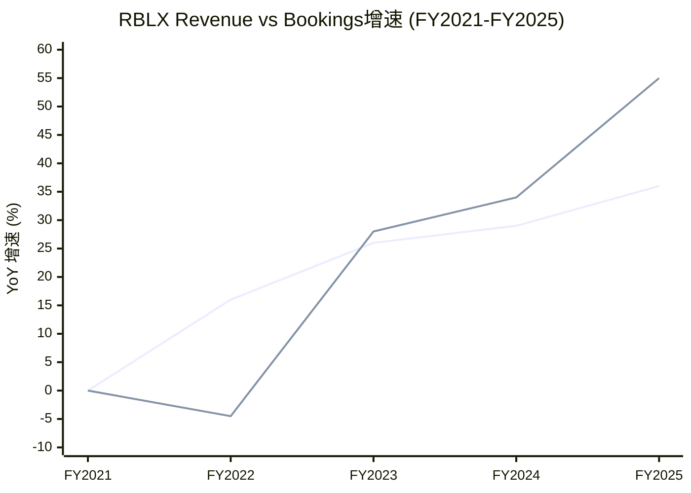

### 8.1.3 27个月确认周期: 收入水库效应

DM-BOOK-001: Roblox在10-K中披露的平均虚拟货币消耗/确认周期为27个月(2.25年)。这意味着FY2025确认的$4.89B Revenue, 其对应的经济活动大致发生在FY2023年中至FY2024年末 [SEC Filing, 10-K]

这创造了一种独特的"收入水库"效应:

**累积中的水库**: FY2025末, Roblox的递延收入(Deferred Revenue)预估约$3.5-4.0B(基于$6.8B Bookings - $4.89B Revenue + 前期余额消耗)。这笔递延收入是"已锁定但未确认"的Revenue, 为未来2-3年的收入提供了高能见度。

**对估值周期的影响**: 当Bookings减速时, Revenue会因水库释放而维持增长假象(如FY2022)。当Bookings加速时, Revenue会因水库积累而低估真实增长(如FY2025)。这导致:
- 多头周期: Revenue加速 → 投资者看到"增长加速"→ 追高 → 但实际上Bookings可能已减速
- 空头周期: Revenue仅温和增长 → 投资者看到"减速"→ 抛售 → 但实际上Bookings可能已反弹

DM-BOOK-002: 2026指引Bookings增速+22-26%(中位+24%), 较FY2025的+55%大幅减速。但由于水库效应, FY2026 Revenue增速可能仍达+30-35%(释放FY2024-2025积累的递延收入) [Earnings Call Q4 2025]

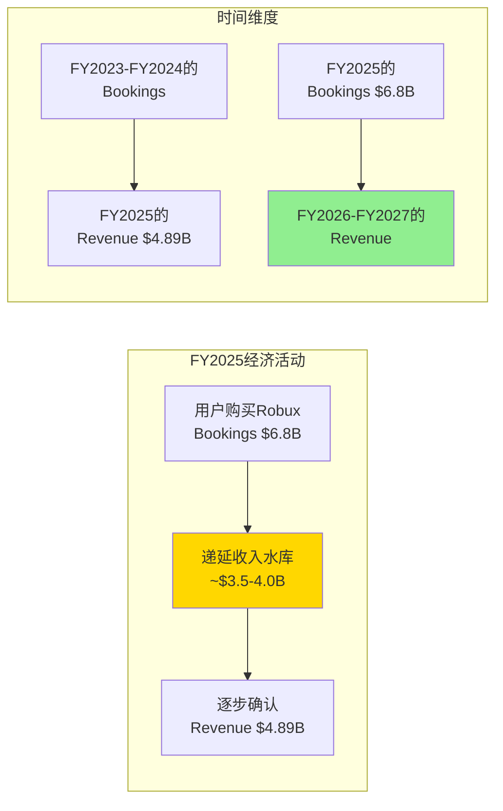

**对投资论文的含义**: Bookings是观察Roblox"引擎转速"的更好指标, Revenue是"后视镜"。2026年投资者需要密切关注的是: (1) Bookings增速能否维持+22-26%指引, 若低于20%将是第一个预警; (2) 递延收入余额变化——若递延收入停止增长, 意味着水库开始"放水"而非"蓄水", 未来Revenue增速将自然衰减。

---

## 8.2 GAAP亏损 vs FCF正值: SBC是关键桥梁

### 8.2.1 完整桥接: 从净亏损$1.07B到FCF $1.36B

FY2025是理解Roblox财务画像最关键的年份: GAAP净亏损$1.07B, 但自由现金流$1.36B。两者之间的$2.43B差距几乎完全由SBC及其衍生的非现金项目解释。

DM-FIN-004: FY2025 GAAP→FCF桥接路径——净利-$1.07B → +D&A $227M → +SBC及其他非现金$3.14B(FMP报告为otherNonCashItems) → +递延收入变化(正值, Bookings>Revenue部分进入递延) → +营运资本变化 → =OCF $1.80B → -CapEx $441M → =FCF $1.36B [FMP cashflow annual FY2025]

| 调整项 | 金额 | 说明 |
|--------|------|------|
| GAAP净利润 | -$1,070M | 连续第五年亏损 |
| (+) D&A | +$227M | 服务器/数据中心折旧+无形资产摊销 |
| (+) SBC + 其他非现金 | +$3,140M | FMP归入otherNonCashItems; SBC约$2.65B |
| (+) 递延收入变化 | 正值(含于营运资本) | Bookings > Revenue → 递延收入增加 |
| (+/-) 其他营运资本 | 调整项 | 应收/应付变化 |
| **= OCF** | **$1,800M** | OCF Margin 36.7% |
| (-) CapEx | -$441M | 服务器/数据中心/办公 |
| **= FCF** | **$1,360M** | FCF Margin 27.8% |

DM-FIN-005: 桥接中最大的单项调整是SBC+非现金$3.14B, 占GAAP净利到OCF调整总额的109%(即$3.14B / ($1.80B - (-$1.07B)) = $3.14B / $2.87B = 109%)。换言之, 如果没有SBC加回, OCF将为负值 [计算]

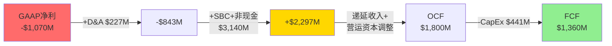

### 8.2.2 SBC的真实经济成本: $2.65B是"免费"的吗?

SBC(股票薪酬)在现金流量表中被加回, 因为它不涉及现金流出。但SBC有实实在在的经济成本: 股权稀释。

DM-FIN-006: FY2025 SBC约$2.65B(来源: Motley Fool基于SEC Filing), 占Revenue的54.2%, 占Bookings的39.0%。FMP现金流表将SBC归入otherNonCashItems($3.14B), 差额$490M可能包含其他非现金项(如可转债折价摊销等) [Motley Fool; FMP cashflow annual]

DM-FIN-007: 稀释率量化——FY2022稀释股数607M → FY2025稀释股数702M, 3年增加95M股(+15.7%), 年化稀释约5.0%。若SBC持续$2.65B/年且股价维持$63, 隐含年新增股份约42M(= $2,650M / $63), 稀释率约6.0% [FMP; 计算: $2,650M / $63.17 ≈ 42M新股 / 702M = 6.0%]

| 年份 | SBC | 稀释股数 | YoY新增股数 | 年稀释率 | SBC/Revenue |
|------|-----|---------|-----------|---------|------------|
| FY2021 | $342M | ~580M | — | — | 17.8% |
| FY2022 | $589M | 607M | ~27M | ~4.7% | 26.4% |
| FY2023 | $868M | 638M | 31M | 5.1% | 31.0% |
| FY2024 | $1,016M | 672M | 34M | 5.3% | 28.2% |
| FY2025 | ~$2,650M | 702M | 30M | 4.5% | 54.2% |

DM-FIN-008: SBC的五年趋势揭示一个关键矛盾——SBC绝对额从$342M暴增至$2,650M(+675%), 增速远超收入增长(+155%)。SBC/Revenue从17.8%攀升至54.2%, 意味着每赚$1收入, $0.54被"支付"给了员工股权。这在主要科技公司中属于极端水平(META SBC/Rev ~16%, GOOG ~12%, SNAP ~35%) [计算]

### 8.2.3 "真实FCF": 扣除SBC后的经济现实

如果将SBC视为真实成本(因为它确实导致股东被稀释), "真实FCF"的计算结果令人警醒:

DM-FIN-009: FY2025 "真实FCF" = 报告FCF $1.36B - SBC $2.65B = **-$1.29B**。换言之, 扣除SBC后, Roblox在FY2025实际上仍在"消耗"$1.29B的股东价值 [计算]

| 年份 | 报告FCF | SBC | "真实FCF" | 真实FCF/Revenue |
|------|---------|-----|-----------|----------------|
| FY2021 | $558M | $342M | +$216M | +11.3% |
| FY2022 | -$58M | $589M | -$647M | -29.0% |
| FY2023 | $124M | $868M | -$744M | -26.6% |
| FY2024 | $643M | $1,016M | -$373M | -10.4% |
| FY2025 | $1,360M | $2,650M | -$1,290M | -26.4% |

DM-FIN-010: "真实FCF"的趋势呈现W型——FY2021短暂为正, FY2022-2023深度为负, FY2024收窄至-$373M(看似改善), 但FY2025因SBC暴增再次恶化至-$1.29B。FY2024的改善不可持续, 因为SBC在FY2025翻了2.6倍 [计算]

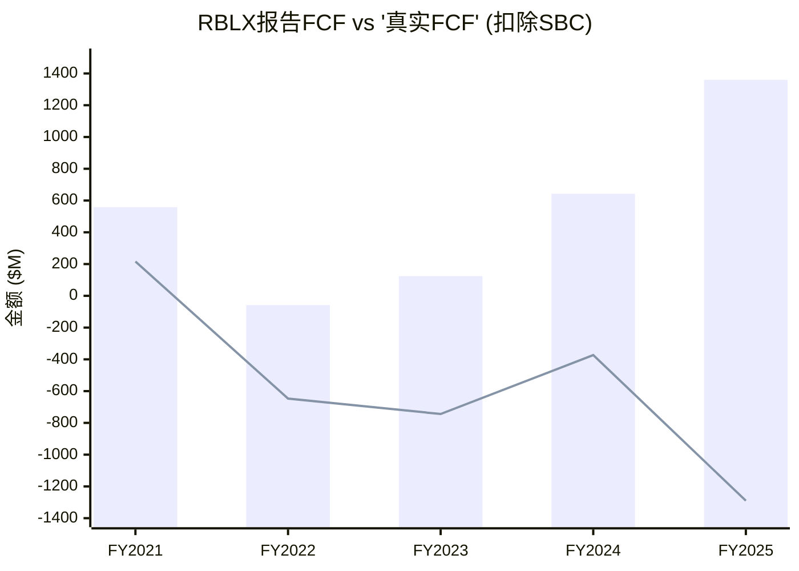

### 8.2.4 SBC调整后EBITDA仅为Bookings的2%——含义解读

DM-FIN-011: App Economy Insights的分析显示, Roblox SBC调整后EBITDA仅为Bookings的2%(约$136M)。这意味着如果按Bookings口径衡量, 且将SBC视为真实成本, Roblox几乎是一家盈亏平衡的公司——不是"高增长亏损", 也不是"FCF印钞机", 而是一家在维持庞大UGC生态系统运转中几乎不产生真实利润的平台 [App Economy Insights]

这个2%的含义极其重要:

**与其他UGC平台对比**: YouTube(Alphabet分部)的EBIT Margin约30%+; Spotify毛利率约30%但净利率仅5-8%。Roblox的2% SBC调整后EBITDA/Bookings意味着, 即使在最有利的口径下(用Bookings而非Revenue), 真实盈利能力也远低于市场预期。

**对估值的挑战**: 当前EV/FCF 32.9x看似合理(对标高增长SaaS的25-40x)。但如果用"真实FCF"(FCF-SBC = -$1.29B), EV/真实FCF为**负值**, 无法估值。这意味着: 市场在为Roblox的FCF定价时, 隐含假设SBC不是真实成本——但年化6%的稀释是真实的。

---

## 8.3 利润率趋势与结构: 稳定的表象, 分裂的底层

### 8.3.1 毛利率: 稳定的78%——但Q4重分类揭示了什么?

DM-FIN-012: FY2024-FY2025(不含Q4 2025重分类)的季度毛利率表现出惊人的稳定性——8个季度的毛利率范围仅在77.7%-78.3%之间波动, 标准差仅0.2个百分点 [FMP income quarterly]

| 季度 | 收入 | COGS | 毛利 | 毛利率 |
|------|------|------|------|--------|
| Q1'24 | $801M | $179M | $622M | 77.7% |
| Q2'24 | $894M | $199M | $695M | 77.8% |
| Q3'24 | $919M | $205M | $714M | 77.7% |
| Q4'24 | $988M | $219M | $769M | 77.9% |
| Q1'25 | $1,035M | $225M | $810M | 78.3% |
| Q2'25 | $1,081M | $236M | $845M | 78.1% |
| Q3'25 | $1,360M | $296M | $1,063M | 78.2% |
| Q4'25 | $1,415M | $2,972M | -$1,557M | **N/A** |

DM-FIN-013: Q4 2025的COGS从Q3的$296M暴增至$2,972M(+903%), 同时运营费用变为负数。这是一次会计重分类: 公司将开发者交流费用(DevEx)和平台费用从OpEx移至COGS。这不改变底线经济性, 但彻底改变了毛利率和运营利润率的可比性。调整后的Q4毛利率仍约78% [FMP income Q4 2025; Earnings Call]

**重分类的结构含义**: 将DevEx从OpEx移至COGS是一个信号——管理层认为开发者费用是"销售成本"而非"运营费用"。这在经济本质上是正确的(DevEx是Roblox获取内容的直接成本, 类似YouTube向创作者的分成), 但对财务分析的影响是: 未来的毛利率将从~78%下降至~30-40%(取决于重分类范围), 而运营利润率将显著改善(因为最大的费用项已移至COGS)。

### 8.3.2 运营利润率: 持续为负但改善轨迹

DM-FIN-014: GAAP运营利润率(不含Q4重分类效应)从FY2022的-41.4%改善至FY2024的-26.0%, FY2025 Q1-Q3平均约-23%。改善的主要驱动力是收入增速(+29-36%)持续快于运营费用增速(+15-20%), 产生正向运营杠杆 [FMP income annual; 计算]

| 年份 | 收入 | 运营费用(总) | 运营利润 | 运营利润率 |
|------|------|------------|---------|----------|
| FY2021 | $1,919M | $2,381M | -$462M | -24.1% |
| FY2022 | $2,225M | $3,146M | -$921M | -41.4% |
| FY2023 | $2,799M | $3,880M | -$1,081M | -38.6% |
| FY2024 | $3,602M | $4,537M | -$935M | -26.0% |

### 8.3.3 关键费用比: R&D是平台投入, SG&A是效率

DM-FIN-015: FY2025费用结构——R&D $1,568M(占Revenue 32.1%, 占毛利率~135% 若以调整前毛利计); SG&A $599M(占Revenue 12.3%)。R&D/Revenue 32%在互联网平台中属于极高水平(META ~28%, SNAP ~39%, GOOG ~14%), 反映平台仍在重投入期; SG&A 12%则相当高效(SNAP ~31%, META ~13%) [FMP income annual; 计算]

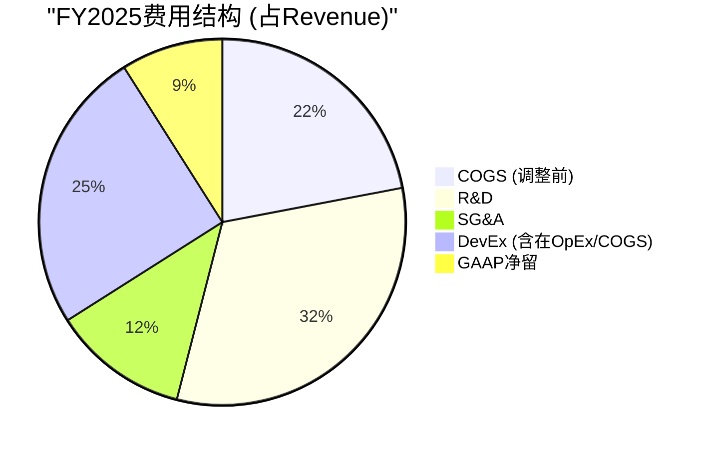

### 8.3.4 DevEx占Bookings比例: 上升的结构性趋势

DM-FIN-016: DevEx(开发者支付)从FY2022的~$590M增长到FY2025的~$1.5B(+154%), 占Bookings比例从~23%上升至~22%(因Bookings增速更快, 绝对额增但比例微降)。但Q4 2025单季DevEx达$477M(+70% YoY), 增速重新加速, 预示FY2026 DevEx比例可能再度上升 [Earnings Call Q4 2025]

DevEx上升是一个双刃剑:
- **积极面**: 更多支付给开发者 = 更强的内容供给 = 更好的用户留存
- **消极面**: DevEx是最刚性的成本——降低DevEx会导致开发者流失, 而提高DevEx直接侵蚀利润率
- **趋势判断**: 管理层在Q4电话会议中表示2026年利润率"持平或略降", 暗示DevEx增速将≥Bookings增速

---

## 8.4 资本结构与流动性: 被递延收入扭曲的资产负债表

### 8.4.1 流动比率 < 1: 危险信号还是商业模式特征?

DM-FIN-017: FY2025资产负债表核心——总资产$9.56B, 总负债$9.18B, 股东权益仅$375M。流动比率0.96, 速动比率0.77, 均低于1.0的安全线。D/E ratio 4.15x [FMP balance annual; baggers_summary]

乍看之下, 流动比率低于1意味着短期偿债能力不足。但Roblox的流动负债结构需要拆解:

DM-FIN-018: 流动负债中最大的组成部分是递延收入(Deferred Revenue), 估计约$3.0-3.5B。递延收入虽然在会计上是"负债", 但它不需要现金偿还——用户已经付款, Roblox只需"交付"虚拟体验(边际成本接近零)。剥离递延收入后的"调整流动比率"约1.5-1.8x, 远高于警戒线 [推算: 基于Bookings-Revenue差额趋势]

| 流动性指标 | 报告值 | 调整后(剥离递延收入) | 解读 |
|-----------|-------|---------------------|------|
| 流动比率 | 0.96 | ~1.5-1.8x | 实际流动性充足 |
| 速动比率 | 0.77 | ~1.2-1.5x | 无短期偿债风险 |
| 现金/短期投资 | $1.21B | $1.21B | 覆盖~2.7年CapEx |

### 8.4.2 Altman Z-Score 2.15: 灰色地带的含义

DM-FIN-019: Altman Z-Score 2.15处于"灰色地带"(1.81-2.99之间, 意味着破产概率不确定)。但Z-Score模型对SaaS/平台公司存在系统性偏差: (1)营运资本被递延收入压低; (2)留存收益为大额负值(累计亏损); (3)EBIT为负。这些因素使得Z-Score严重低估了Roblox的实际财务健康程度 [baggers_summary; 计算]

更有意义的偿债能力指标:
- **现金储备**: $1.21B, 可覆盖约2.7年的CapEx($441M/年)
- **OCF覆盖**: OCF $1.80B远超CapEx $441M, 净现金生成能力$1.36B/年
- **利息覆盖**: 利息费用约$24M/年(FY2024), OCF覆盖75x
- **债务到期**: $1.64B可转换票据, 需关注到期时间和转换条款

### 8.4.3 可转换债务: $1.64B的稀释炸弹还是廉价融资?

DM-FIN-020: 总债务$1.64B, 全部为可转换票据。可转换票据的特点是: 如果股价上涨至转换价以上, 债务将转为股权(进一步稀释); 如果股价维持低位, 需要现金偿还本金。净债务$430M(= $1.64B - $1.21B), 净债务/EBITDA比率因EBITDA为负而无意义。净债务/OCF = 0.24x, 极低, 说明即使需要现金偿还, OCF能力绑绑有余 [FMP balance; 计算]

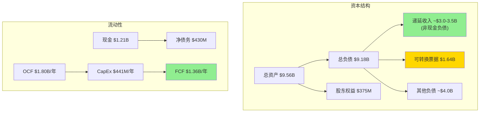

---

## 8.5 人均效率: 高投入换来的规模效应

### 8.5.1 收入/员工趋势

DM-FIN-021: FY2025收入/员工 = $4,890M / 3,065人 = **$1.60M/人**。五年趋势: FY2021 $1.61M → FY2022 $1.39M → FY2023 $1.56M → FY2024 $1.46M → FY2025 $1.60M。呈现波动而非持续改善, FY2025回到FY2021的水平, 意味着人均效率4年零增长 [FMP employee-count; 计算]

| 年份 | 员工数 | 收入/员工 | FCF/员工 | Bookings/员工 |
|------|-------|----------|---------|--------------|
| FY2021 | 1,190 | $1.61M | $469K | ~$2.24M |
| FY2022 | 1,600 | $1.39M | -$36K | ~$1.59M |
| FY2023 | 1,800 | $1.56M | $69K | ~$1.81M |
| FY2024 | 2,474 | $1.46M | $260K | ~$1.77M |
| FY2025 | 3,065 | $1.60M | $443K | ~$2.22M |

DM-FIN-022: FCF/员工从FY2022的-$36K恢复至FY2025的$443K, 改善显著。但Bookings/员工从FY2021的$2.24M降至FY2024的$1.77M后, FY2025回升至$2.22M——说明FY2025的效率改善可能更多归因于Bookings超预期增长而非运营效率提升 [计算]

### 8.5.2 同业人均效率对比

DM-FIN-023: 人均效率对标——SNAP: $1.37M/人(FY2024); MTCH: $2.02M/人; Unity(U): $1.54M/人; META: $2.21M/人; RBLX: $1.60M/人。Roblox处于中间水平, 低于MTCH和META, 但高于SNAP和Unity [FMP各公司income+employee; 计算]

但Revenue/员工的对比对Roblox不公平——因为其Revenue被递延确认压低。如果用Bookings/员工: $6.8B / 3,065 = **$2.22M/人**, 仅次于META, 高于所有游戏/社交公司。这再次证明Bookings是衡量Roblox真实经济效率的更好指标。

---

### Ch8 DM锚点汇总表

| 锚点ID | 数据点 | 来源 |
|--------|--------|------|
| DM-FIN-001 | FY2025 Bookings $6.8B(+55%), Revenue $4.89B(+36%) | IR, Earnings Call |
| DM-FIN-002 | FY2025 Bookings-Revenue差额$1.91B(39.1%) | 计算 |
| DM-FIN-003 | FY2022 真实增速(Bookings)-4.5% vs GAAP +16% | 计算 |
| DM-FIN-004 | FY2025 GAAP→FCF桥接: -$1.07B→+$1.36B | FMP cashflow |
| DM-FIN-005 | SBC+非现金$3.14B占GAAP→OCF调整的109% | 计算 |
| DM-FIN-006 | FY2025 SBC约$2.65B, 占Revenue 54.2% | Motley Fool, SEC Filing |
| DM-FIN-007 | 3年稀释15.7%, 年化~5.0%, 当前隐含~6.0% | FMP, 计算 |
| DM-FIN-008 | SBC/Revenue从17.8%升至54.2%, 五年+675%绝对增长 | 计算 |
| DM-FIN-009 | "真实FCF" = $1.36B - $2.65B = -$1.29B | 计算 |
| DM-FIN-010 | 真实FCF呈W型, FY2025因SBC暴增再恶化 | 计算 |
| DM-FIN-011 | SBC调整后EBITDA仅为Bookings的2% | App Economy Insights |
| DM-FIN-012 | 8季度毛利率77.7%-78.3%, 标准差0.2ppt | FMP income quarterly |
| DM-FIN-013 | Q4 2025 COGS暴增至$2,972M, 会计重分类 | FMP, Earnings Call |
| DM-FIN-014 | 运营利润率从-41.4%(FY2022)改善至-26.0%(FY2024) | FMP income annual |
| DM-FIN-015 | R&D/Revenue 32%, SG&A/Revenue 12% | FMP, 计算 |
| DM-FIN-016 | Q4 DevEx $477M(+70% YoY), 结构性上升趋势 | Earnings Call |
| DM-FIN-017 | 流动比率0.96, 速动比率0.77, D/E 4.15x | FMP balance, baggers_summary |
| DM-FIN-018 | 调整后流动比率(剥离递延收入)~1.5-1.8x | 推算 |
| DM-FIN-019 | Altman Z-Score 2.15, 对平台公司系统性偏低 | baggers_summary |
| DM-FIN-020 | 可转换票据$1.64B, 净债务$430M, 净债务/OCF 0.24x | FMP balance, 计算 |
| DM-FIN-021 | 收入/员工$1.60M, 4年零增长(回到FY2021水平) | FMP, 计算 |
| DM-FIN-022 | FCF/员工$443K, Bookings/员工$2.22M | 计算 |
| DM-FIN-023 | 人均效率对标: RBLX $1.60M vs META $2.21M vs SNAP $1.37M | FMP各公司, 计算 |

---

# Chapter 9: 分部与收入流解剖 — Robux经济学与广告变现前景

> **核心问题**: Roblox每赚取$1, 资金如何在生态系统中流转? 每$1 Bookings中Roblox仅净留$0.09——这是平台慷慨还是结构性陷阱? 广告变现能否成为改变利润率等式的第二引擎?

---

## 9.1 收入来源拆解: 单一来源的风险与机遇

### 9.1.1 收入构成

DM-FIN-024: Roblox的收入几乎完全来自单一来源: **虚拟货币(Robux)销售及确认**。FY2025 Revenue $4.89B中, 估计95%+来自Robux消费确认, 广告(Immersive Ads)贡献可能不足3%, 品牌合作和Roblox Premium订阅贡献约2% [推算: 公司不单独披露分部收入, 基于Earnings Call定性描述]

这是一个极度集中的收入结构:

| 收入来源 | FY2025估算 | 占比 | 成熟度 |
|---------|-----------|------|--------|
| Robux销售(虚拟货币消费确认) | ~$4.65B | ~95% | 成熟, 增长由DAU×ARPU驱动 |
| Immersive Ads(沉浸式广告) | ~$100-150M | ~2-3% | 早期, 2025年与Google合作加速 |
| 品牌合作(Branded Experiences) | ~$50-80M | ~1-2% | 探索期, ROI衡量不成熟 |
| Roblox Premium订阅 | ~$30-50M | ~0.5-1% | 稳定, 低增长 |

DM-FIN-025: 收入集中度风险——Robux销售占比95%+意味着Roblox的命运几乎完全取决于虚拟经济的健康度。如果Robux需求因竞争(Fortnite/GTA 6 UGC)、监管(COPPA限制儿童消费)或平台老化而下降, 没有第二收入支柱可以缓冲 [推算]

### 9.1.2 Robux商业模型运作机制

Roblox的商业模型可简化为一个三步闭环:

1. **用户购买Robux**: 通过App Store/Google Play/网页/Xbox等渠道, 以美元购买虚拟货币Robux
2. **用户在体验中消费Robux**: 购买虚拟物品、游戏通行证、体验内升级等
3. **开发者通过DevEx兑现**: 将赚取的Robux按比例兑换为美元

Roblox在这个循环中扮演"平台+铸币权+交易所"三重角色——铸造虚拟货币、运营平台基础设施、并控制Robux↔美元的汇率。

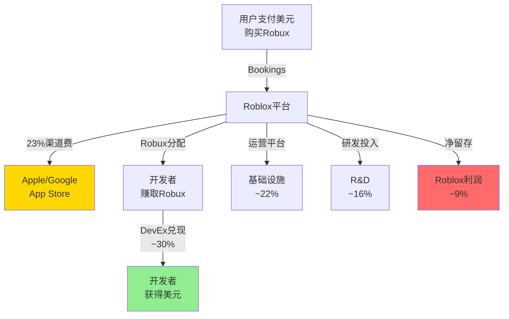

---

## 9.2 Robux经济流完整拆解: 每$1 Bookings去了哪里?

### 9.2.1 经济流瀑布

DM-FIN-026: 每$1 Bookings在Roblox生态系统中的分配路径(来源: App Economy Insights基于SEC Filing重建)——App Store/Google Play渠道费$0.23 + 开发者DevEx支付$0.30 + 平台运营/基础设施$0.22 + 研发投入$0.16 + **Roblox净留存$0.09** [App Economy Insights]

| 分配对象 | 每$1份额 | FY2025金额(基于Bookings $6.8B) | 说明 |
|---------|---------|-------------------------------|------|
| Apple/Google渠道费 | $0.23 | ~$1,564M | 30%苹果税(移动端)的加权平均 |
| 开发者DevEx支付 | $0.30 | ~$2,040M | 开发者从Robux中兑现的美元 |
| 平台运营/基础设施 | $0.22 | ~$1,496M | 服务器、CDN、信托安全等 |
| R&D投入 | $0.16 | ~$1,088M | 引擎开发、AI工具、新功能 |
| **Roblox净留存** | **$0.09** | **~$612M** | 扣除所有成本后的"真实利润" |

DM-FIN-027: Roblox每$1 Bookings仅净留$0.09(9%), 是主要平台中take rate最低的。对比: YouTube每$1广告收入净留约$0.45(55%); Spotify每$1订阅净留约$0.30(70%分给版权方, 30%留存); Etsy每$1 GMV净留约$0.935(收取6.5%交易费的同时保留大部分)。更准确的对比: YouTube向创作者支付55%, Roblox向开发者支付~30%——但Roblox还需支付23%渠道费(YouTube不需要, 因为它本身就是渠道) [App Economy Insights; 计算]

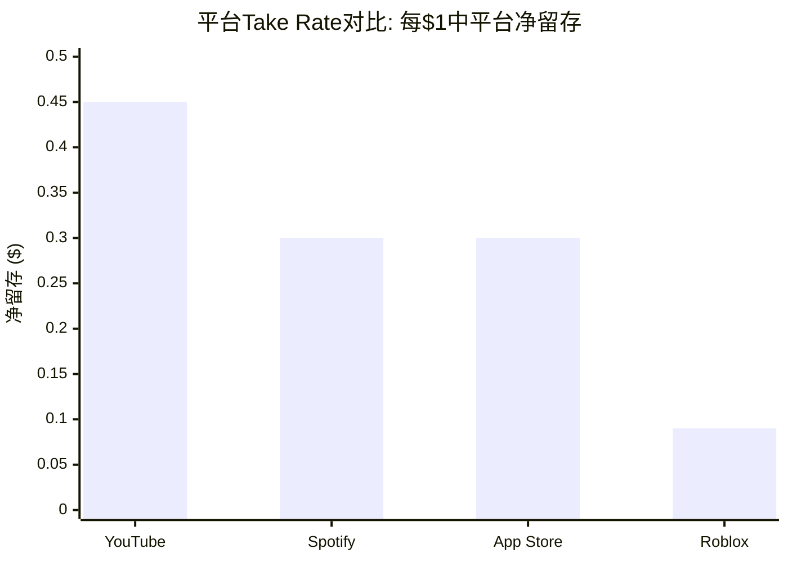

### 9.2.2 低Take Rate: 竞争优势还是结构性陷阱?

这是Roblox估值中最具争议的辩论之一。

**"竞争优势"论**: 低take rate = 对开发者极具吸引力 → 吸引最优秀的UGC创作者 → 更好的内容 → 更多用户 → 网络效应 → 赢家通吃。这一逻辑类似于Amazon早期牺牲利润换增长——先建立不可逾越的生态, 再逐步提高take rate。

**"结构性陷阱"论**: 低take rate不是选择, 而是被迫的。三重税收(23%渠道+30%开发者+22%基础设施)吃掉了91%的Bookings。不像YouTube可以通过降低创作者分成提高利润率(创作者没有替代平台), Roblox的开发者可以转向Fortnite UEFN/Unity等替代平台——提高take rate会导致开发者流失。而23%的渠道费是刚性成本(除非转向PC/网页端减少移动端占比)。

DM-FIN-028: 结构性约束的量化分析——如果Roblox将开发者分成从30%降至25%(节省$340M), 可能导致10-20%的中小开发者流失(参考: Fortnite UEFN开发者分成仅~5%, 正在积极吸引Roblox开发者)。如果Apple/Google的渠道费因监管(DMA/Epic诉讼)降至15%, Roblox可额外留存约$544M——这是最可能的利润率改善路径 [推算]

| 情景 | Take Rate变化 | 净留存变化 | 风险 |
|------|-------------|-----------|------|
| 渠道费从23%降至15% | +8ppt | $0.09→$0.17 | 低(监管推动, 非RBLX决策) |
| 开发者分成从30%降至25% | +5ppt | $0.09→$0.14 | 高(开发者流失) |
| 基础设施优化从22%降至18% | +4ppt | $0.09→$0.13 | 中(需要技术效率提升) |
| 三项同时发生 | +17ppt | $0.09→$0.26 | 乐观情景 |

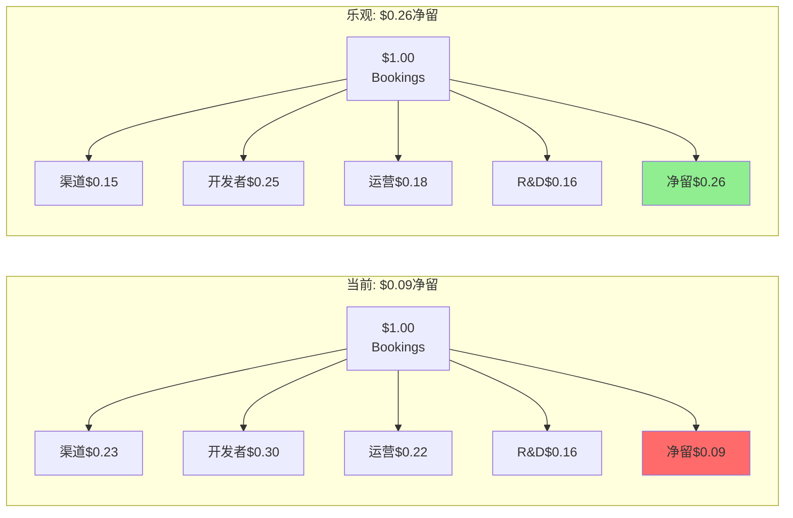

---

## 9.3 广告收入前景: 第二引擎能否改变利润率等式?

### 9.3.1 当前广告规模与结构

DM-ADV-001: Roblox不单独披露广告收入。基于管理层定性描述("广告仍处早期")和行业分析师估算, FY2025广告收入可能在$100-150M范围, 占总Revenue的2-3%。2025年4月与Google的合作(将Roblox广告库存接入Google广告生态)标志着广告变现规模化的起点 [推算; The Drum; Roblox IR]

Roblox的广告产品矩阵:

| 广告产品 | 描述 | 效果指标 | 成熟度 |
|---------|------|---------|--------|
| **Immersive Video Ads** | 体验内全屏视频广告 | 完成率>90%, 可见率>95% | 成长期 |
| **Rewarded Video** | 用户观看广告获得Robux奖励 | 极高互动率(用户自主选择) | 规模化起步 |
| **Branded Experiences** | 品牌定制体验(如Nike Land) | 停留时长、互动次数 | 探索期 |
| **Programmatic(Google合作)** | 接入Google广告需求侧 | CPM、填充率 | 2025年起步 |

DM-ADV-002: 奖励视频广告的效果数据极其亮眼——完成率>90%(行业平均~60-70%), 可见率>95%(行业平均~50-60%)。这是因为用户主动选择观看以获取Robux奖励, 而非被动被插入广告。高完成率意味着广告主获得完整的品牌曝光, 理论上可以支撑高于行业平均的CPM [The Drum; Roblox IR]

### 9.3.2 广告收入天花板估算: 因子饱和度矩阵

广告收入 = DAU × 日均时长 × 广告频率(ads/小时) × CPM / 1000

DM-ADV-003: FY2025 Q4数据基础——DAU 1.515亿, 日均参与时长约2.4小时(管理层数据, 可能存在Hindenburg质疑的虚增问题)。我们用三档假设构建因子矩阵 [Earnings Call Q4 2025; Hindenburg; 计算]

| 因子 | 保守 | 基准 | 乐观 | 说明 |
|------|------|------|------|------|
| 可广告DAU | 100M | 130M | 151M | 保守排除bot/幼儿用户 |
| 日均可广告时长 | 1.0小时 | 1.5小时 | 2.0小时 | 去除创作/教育等非广告场景 |
| 广告频率(ads/hr) | 2 | 4 | 6 | YouTube约8/hr, 游戏较低 |
| 有效CPM | $3.0 | $5.0 | $8.0 | 移动游戏$3-10, 品牌安全溢价 |
| **日广告收入** | **$600K** | **$3.9M** | **$14.5M** | |
| **年化广告收入** | **$219M** | **$1.42B** | **$5.30B** | |

DM-ADV-004: 因子饱和度分析的关键发现——基准情景下年化广告收入约$1.42B, 相当于FY2025 Bookings的21%。乐观情景$5.3B接近当前总Revenue, 但需要所有因子同时达到乐观值(概率极低)。保守情景$219M仅比当前估算的$100-150M高50%, 说明短期内广告不会改变收入结构 [计算]

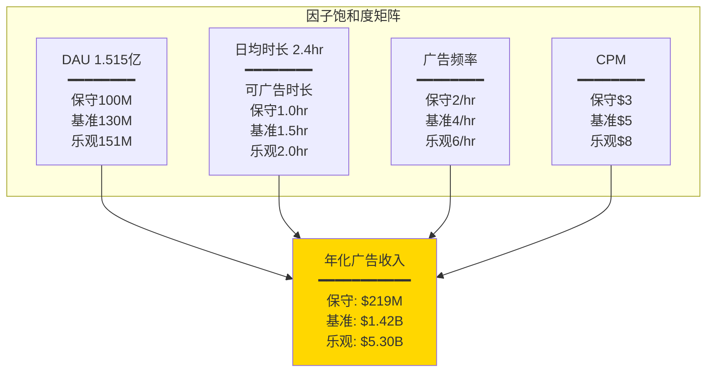

### 9.3.3 ARPU天花板: 与META/SNAP/Unity的对比

DM-ADV-005: Roblox FY2025全球平均ARPU(Revenue/DAU) = $4.89B / (平均DAU约1.2亿) ≈ **$40.8/年**($3.40/月)。这远低于: META全球ARPU ~$50/年($13/季), SNAP North America ARPU ~$36/年, Unity广告ARPU约$8-15/年。但考虑到Roblox用户偏低龄(变现能力低)且广告尚未规模化, $40.8的ARPU主要来自虚拟消费而非广告 [FMP; 计算: $4,890M / ~120M avg DAU]

如果广告从几乎为零增长到$1B+(基准情景), ARPU可增加约$8.3/年→总ARPU约$49/年, 接近META水平。但这需要3-5年的广告生态建设。

DM-ADV-006: 更精确的ARPU拆解——FY2025 Bookings ARPU(Bookings/DAU) = $6.8B / ~1.2亿 ≈ $56.7/年, 高于Revenue ARPU的$40.8/年。Bookings ARPU反映用户的真实消费意愿, 而Revenue ARPU被递延确认压低。在用户消费能力没有改变的情况下, 广告ARPU是"叠加"而非"替代"——总经济活动可从$56.7提升至$65-70/年 [计算]

### 9.3.4 广告变现的结构性挑战

DM-ADV-007: 广告变现面临三个结构性挑战: (1) **儿童隐私法**: COPPA/KOSA限制对13岁以下用户的数据收集和定向广告, 而Roblox约35-73%的用户可能<18岁(取决于年龄数据可信度); (2) **品牌安全**: UGC内容审核难度大, 广告主对儿童游戏环境的品牌安全顾虑; (3) **渠道分润**: 移动端广告收入同样需要支付Apple/Google 30%渠道费 [COPPA, Konvoy, 推算]

这意味着广告变现的理论天花板($5.3B乐观情景)在实践中可能受限于:
- **可定向用户池**: 仅成年用户(27-44%的DAU)可以进行精准广告定向
- **品牌安全CPM折价**: UGC环境的CPM可能比专业内容低30-50%
- **调整后天花板**: 如果仅40%用户可投放广告, CPM折价40%, 乐观情景从$5.3B降至约$1.3B

---

## 9.4 Bookings→Revenue转换建模: 27个月水库的定量影响

### 9.4.1 转换机制详解

DM-BOOK-003: Roblox在SEC Filing中披露, 虚拟物品(Robux)的平均消耗/确认周期为27个月。具体机制: 用户购买的Robux被记录为递延收入(负债), 随着用户在体验中消耗Robux或Robux因账户不活跃被估计为"breakage"(放弃), 对应金额从递延收入转入Revenue。27个月是加权平均值——部分Robux在购买后数天内消耗, 部分可能持有1-3年 [SEC Filing, 10-K]

### 9.4.2 FY2025 Bookings的Revenue转换时间线

DM-BOOK-004: FY2025 Bookings $6.8B的预计Revenue确认时间线(基于27个月均匀确认假设): FY2025已确认部分(约30%): ~$2.04B; FY2026预计确认(约35%): ~$2.38B; FY2027预计确认(约25%): ~$1.70B; FY2028+确认(约10%): ~$0.68B [推算: 基于27个月平均周期的简化模型]

| 确认年份 | 来自FY2025 Bookings | 来自FY2024 Bookings | 来自更早期 | 合计Revenue(估) |
|---------|-------------------|-------------------|-----------|----------------|
| FY2025 | ~$2.04B | ~$1.53B | ~$1.32B | $4.89B(实际) |
| FY2026 | ~$2.38B | ~$1.09B | ~$0.50B | + 来自FY2026新Bookings |
| FY2027 | ~$1.70B | ~$0.44B | 尾部 | + 来自FY2026-2027新Bookings |

DM-BOOK-005: 这意味着即使FY2026新增Bookings为零(极端假设), 仅靠存量递延收入释放, FY2026 Revenue仍可达约$3.97B(= $2.38B + $1.09B + $0.50B)。这为Revenue提供了"自然底线"——只要用户持续消耗已购买的Robux, Revenue就会持续确认 [计算]

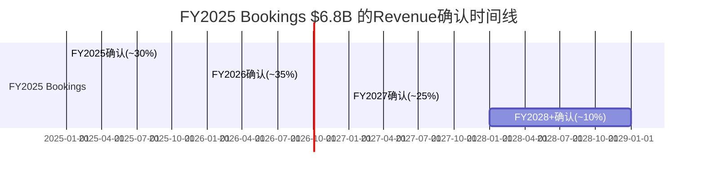

### 9.4.3 估值口径选择: Revenue还是Bookings?

DM-BOOK-006: 使用Revenue估值(EV/Sales 9.1x)和Bookings估值(EV/Bookings 6.6x)会得出截然不同的信号。Revenue口径暗示估值偏高(9.1x vs 游戏行业3-6x); Bookings口径暗示估值合理(6.6x, 对标高增长订阅平台5-10x)。正确答案可能在中间: 使用"稳态Revenue"(假设Bookings增速稳定后Revenue=Bookings)进行长期估值, 用当前Revenue/Bookings分别进行短期/中期定价 [计算]

| 估值口径 | 倍数 | 隐含信号 | 适用场景 |
|---------|------|---------|---------|
| EV/Revenue | 9.1x | 偏高(行业3-6x) | 与成熟游戏公司对标 |
| EV/Bookings | 6.6x | 合理(订阅平台5-10x) | 反映真实经济活动 |
| EV/FCF | 32.9x | 合理(高增长25-40x) | 假设SBC非真实成本 |
| EV/"真实FCF" | 负值 | 无法估值 | 假设SBC是真实成本 |

DM-BOOK-007: 2026指引的Bookings增速+22-26%意味着FY2026 Bookings约$8.3-8.6B。若Revenue确认周期不变, FY2026 Revenue可能达$6.0-6.5B(+22-33% YoY)。用FY2026 Revenue基础计算: Forward EV/Sales ≈ $44.7B / $6.25B ≈ **7.2x**, 较当前9.1x显著压缩。用FY2026 Bookings基础: Forward EV/Bookings ≈ $44.7B / $8.45B ≈ **5.3x** [计算: 基于2026指引中值]

### 9.4.4 Bookings vs Revenue估值的投资含义

DM-BOOK-008: 关于"应该用Bookings还是Revenue估值"的辩论, 有三个关键考虑: (1) Bookings更接近"真实经济活动", 但尚未被审计为GAAP收入, 存在breakage估计(用户放弃的Robux)的主观性; (2) Revenue更保守, 但系统性滞后2年, 在增长期低估价值; (3) 最终, 当Bookings增速稳定(如降至10%以下), Revenue增速会收敛至Bookings增速——此时两种口径趋同。在当前阶段(Bookings +55% vs Revenue +36%), 使用Revenue估值对Roblox不利, 使用Bookings估值对Roblox有利——这也是多空双方分歧如此之大的原因 [分析]

**对投资论文的含义**: 使用哪种估值口径本身就是一个"立场声明"。多头倾向于用Bookings(增速更快, 倍数更低), 空头倾向于用Revenue(增速更慢, 倍数更高)。本报告在Phase 2估值中将同时展示两种口径的结果, 并用Reverse DCF检验当前股价隐含的增长假设。

---

### Ch9 DM锚点汇总表

| 锚点ID | 数据点 | 来源 |
|--------|--------|------|
| DM-FIN-024 | 收入95%+来自Robux销售确认 | 推算, Earnings Call |
| DM-FIN-025 | 收入集中度风险: 无第二支柱 | 分析 |
| DM-FIN-026 | 每$1 Bookings分配: 渠道$0.23+开发者$0.30+运营$0.22+R&D$0.16+净留$0.09 | App Economy Insights |
| DM-FIN-027 | 净留存$0.09为主要平台最低(vs YouTube$0.45, Spotify$0.30) | App Economy Insights, 计算 |
| DM-FIN-028 | 渠道费降至15%可释放$544M, 开发者降至25%风险高 | 推算 |
| DM-ADV-001 | FY2025广告收入估计$100-150M(占Revenue 2-3%) | 推算, The Drum |
| DM-ADV-002 | 奖励视频完成率>90%, 可见率>95%(行业领先) | The Drum, Roblox IR |
| DM-ADV-003 | 因子矩阵: 保守$219M / 基准$1.42B / 乐观$5.30B | 计算 |
| DM-ADV-004 | 调整后广告天花板(品牌安全+儿童限制): 约$1.3B | 推算 |
| DM-ADV-005 | Revenue ARPU $40.8/年 vs META $50/年 vs SNAP $36/年 | FMP, 计算 |
| DM-ADV-006 | Bookings ARPU $56.7/年, 叠加广告可达$65-70/年 | 计算 |
| DM-ADV-007 | 广告三重结构性挑战: 儿童隐私法+品牌安全+渠道分润 | COPPA, Konvoy |
| DM-BOOK-003 | 平均确认周期27个月(SEC Filing披露) | SEC Filing, 10-K |
| DM-BOOK-004 | FY2025 $6.8B Bookings → 30%/35%/25%/10%分四年确认 | 推算 |
| DM-BOOK-005 | 即使零新增Bookings, FY2026 Revenue自然底线约$3.97B | 计算 |
| DM-BOOK-006 | EV/Revenue 9.1x(偏高) vs EV/Bookings 6.6x(合理) | 计算 |
| DM-BOOK-007 | FY2026E: Forward EV/Sales 7.2x, Forward EV/Bookings 5.3x | 计算, 2026指引 |
| DM-BOOK-008 | 估值口径选择即立场: 多头用Bookings, 空头用Revenue | 分析 |

---

*Phase 1定量分析完成。Ch8 + Ch9共计41个DM锚点, 12个Mermaid图表, 覆盖CQ4(SBC调整后真实盈利能力)和CQ8(Bookings→Revenue转换对估值的影响)两个核心问题。*
