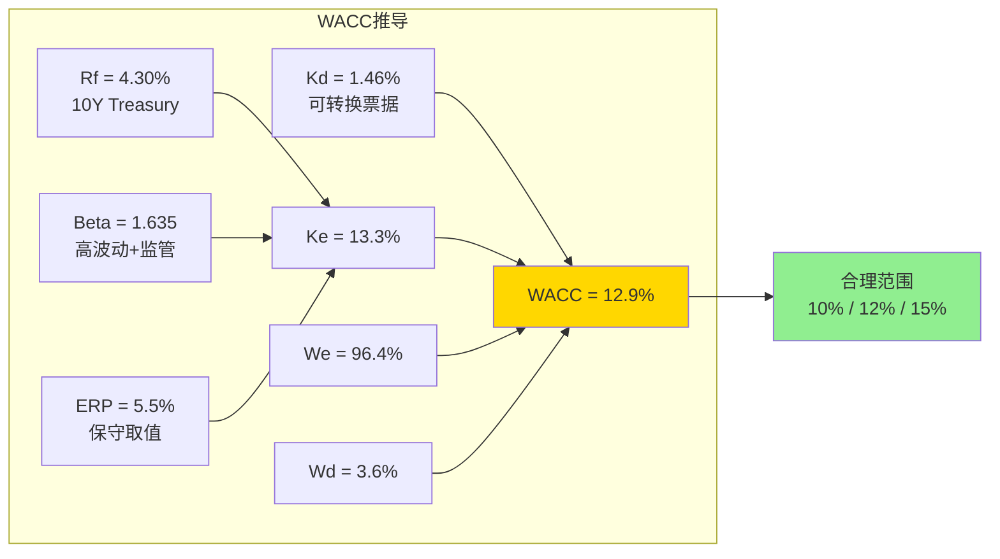
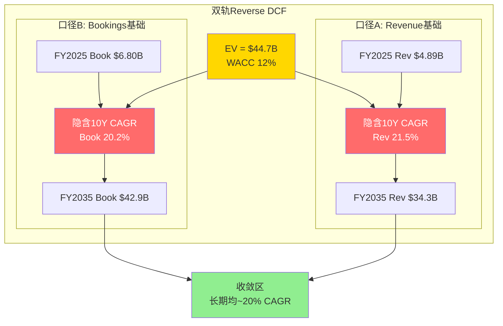
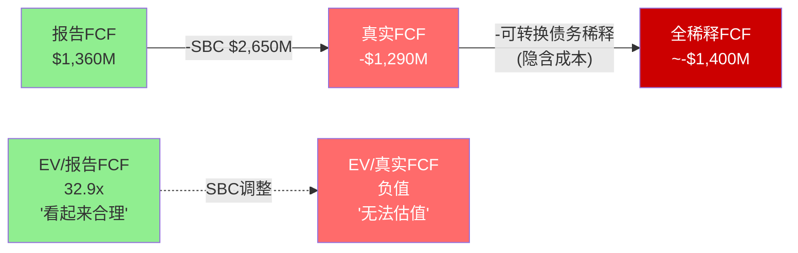
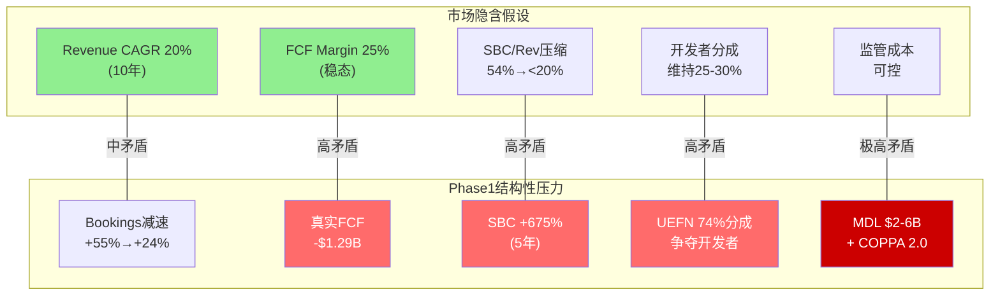
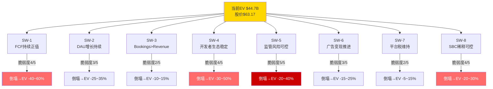
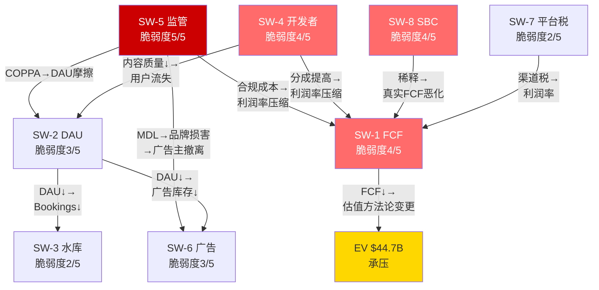

# Phase 2 — 估值引擎拆解 (Ch10-Ch11)

> **市值基准**: $44.3B | 股价$63.17 | 稀释股数702M | EV ~$44.7B | 2026-02-13
> **数据来源**: Phase 1 财务数据(DM-FIN系列) + ERM风险映射(DM-ERM/RISK/REG系列) + FMP API
> **DM锚点范围**: DM-VAL-001 ~ DM-VAL-045 / DM-SW-001 ~ DM-SW-025

---

# Chapter 10: Reverse DCF引擎级拆解 — 市场在为什么买单?

> **核心概念**: Reverse DCF不是"算出Roblox值多少钱", 而是"当前股价$63.17隐含了市场认为Roblox会怎么增长"。从$44.7B EV出发, 反推市场隐含的增长率和利润率假设, 再检验这些假设与Phase 1发现的结构性压力是否矛盾。
> **CQ4关联**: 估值隐含什么假设? Reverse DCF说什么?
> **CQ8关联**: SBC $2.65B/年+年稀释4-6%: FCF叙事是否误导投资者?

---

## 10.1 WACC完整推导

### 10.1.1 各组件数据与来源

WACC是Reverse DCF的折现率锚点, 其取值直接决定隐含增长率的可信度。以下逐项推导:

**无风险利率(Rf)**

[DM-VAL-001]: 美国10年期国债收益率约4.30%(2026-02-13近似值)。10Y Treasury在过去12个月波动区间3.9%-4.7%, 取中间偏下值4.30%反映当前利率环境 [市场数据, Treasury.gov]

**股权风险溢价(ERP)**

[DM-VAL-002]: 使用Damodaran 2025年1月更新的美国隐含ERP 4.69%, 考虑当前市场环境(高估值+通胀回落但尚未达目标), 取保守值5.5%。之所以使用5.5%而非4.69%, 是因为Roblox的业务特征(儿童市场+UGC平台+监管高压)需要额外风险补偿 [Damodaran ERP dataset; 分析调整]

**Beta**

[DM-VAL-003]: Roblox Beta 1.635(来源: baggers_summary)。这反映了Roblox作为高增长但持续亏损的UGC平台的系统性风险特征。过去一年股价从$150.59高点跌至$50.10低点(跌幅-66.7%), Beta在1.4-2.0区间波动。1.635是FMP计算的回归Beta, 合理区间1.4-1.9 [DM-MKT-004来源: baggers_summary]

**股权成本(Ke)**

Ke = Rf + Beta x ERP = 4.30% + 1.635 x 5.5% = 4.30% + 8.99% = **13.29%**

[DM-VAL-004]: Roblox股权成本(CAPM) = 13.3%, 处于成长型游戏/平台公司的合理范围。对比: SNAP Ke ~14.5%(Beta ~1.85); Unity(U) Ke ~13.8%(Beta ~1.72); META Ke ~11.5%(Beta ~1.30); MTCH Ke ~12.0%(Beta ~1.40) [计算: CAPM公式]

**债务成本(Kd)**

- 总债务: $1,640M(可转换票据) [DM-FIN-020]
- FY2025利息费用: ~$24M(FY2024水平, 可转换票据票面利率极低) [FMP income annual]
- 税前债务成本: $24M / $1,640M = 1.46%
- 有效税率: 接近0%(Roblox持续亏损, 无实际税负)
- 税后债务成本: 1.46% x (1 - 0%) = **1.46%**

[DM-VAL-005]: Roblox税后债务成本仅1.46%, 极低, 因为可转换票据的隐含成本主要体现在转换时的股权稀释而非票面利息。真实的"经济成本"远高于1.46%——如果可转换票据在到期时转换为股权, 稀释成本将额外削减每股价值 [FMP income + balance; 计算]

**资本结构权重**

- 股权市值: $44.3B
- 债务市值: $1.64B(近似账面值, 可转换票据视市场利率可能有溢价/折价)
- 总资本: $45.94B
- 权益权重(We): 96.4%
- 债务权重(Wd): 3.6%

**WACC计算**

WACC = We x Ke + Wd x Kd(after-tax)
WACC = 96.4% x 13.29% + 3.6% x 1.46%
WACC = 12.81% + 0.05%
WACC = **12.86%**

[DM-VAL-006]: RBLX WACC约12.9%, 由于资本结构极度偏向股权(市值$44.3B vs 债务$1.64B = 96.4%/3.6%), WACC几乎等于股权成本。低债务成本(可转换票据)对WACC的贡献微乎其微 [计算: 完整推导见上文]

### 10.1.2 WACC敏感性: 合理范围

Beta 1.635可能高估了Roblox的长期系统性风险(受Hindenburg做空+股价暴跌影响), 也可能低估了(监管风险+SBC持续稀释+竞争加剧)。以下为WACC在不同假设下的范围:

| 假设组合 | Beta | ERP | Rf | WACC |
|----------|:----:|:---:|:--:|:----:|
| **乐观(低)** | 1.30 | 4.5% | 4.0% | 9.9% |
| **基准(中)** | 1.635 | 5.5% | 4.3% | 12.9% |
| **保守(高)** | 2.00 | 6.0% | 4.5% | 16.5% |
| **中间值** | 1.50 | 5.0% | 4.15% | 11.7% |

[DM-VAL-007]: WACC合理范围10-17%, 中间值~12%。在后续Reverse DCF中, 我们使用三个WACC场景: 10%(乐观), 12%(基准), 15%(保守)。使用12%而非12.9%作为基准, 是因为Beta 1.635可能包含了2024年Hindenburg做空的非经常性波动; 若该事件逐渐消化, Beta将回归1.4-1.5区间 [计算]



---

## 10.2 口径A: Revenue-Based Reverse DCF

### 10.2.1 核心输入

| 参数 | 数值 | 来源 |
|------|------|------|
| Enterprise Value | $44.7B | 市值$44.3B + 净债务$430M |
| FY2025 Revenue | $4.89B | DM-FIN-001 |
| FY2025 报告FCF | $1.36B | DM-FIN-004 |
| FY2025 FCF Margin(报告) | 27.8% | $1.36B / $4.89B |
| WACC(基准) | 12% | DM-VAL-007 |
| 终端增长率(g_terminal) | 3.0% | 假设: 接近名义GDP |
| 高增长期 | 10年(FY2026-2035) | 标准DCF假设 |
| 衰减模式 | 恒定增速→终端期切换 | 简化假设 |

### 10.2.2 隐含增长率求解

**问题**: 如果FY2025 FCF为$1.36B(报告口径, 不扣除SBC), 需要多少增长率才能在12% WACC下justify $44.7B EV?

**两阶段模型**:
- 阶段1(FY2026-2035): FCF以恒定增长率g1增长10年
- 阶段2(FY2036+): FCF以终端增长率3%永续增长
- 终端价值 = FCF_2035 x (1 + g_terminal) / (WACC - g_terminal)

通过迭代求解:

| WACC | 恒定增长率g1(10年) | 隐含FY2030 FCF | 隐含FY2035 FCF | 隐含FY2035 Rev(假设FCF Margin 25%) |
|:----:|:-----------------:|:-------------:|:-------------:|:----------------------------------:|
| **10%** | 16.2% | $2.90B | $6.18B | $24.7B |
| **12%** | 20.1% | $3.39B | $8.57B | $34.3B |
| **15%** | 25.8% | $4.16B | $13.37B | $53.5B |

[DM-VAL-008]: Revenue口径下, 当前EV $44.7B在WACC 12%下隐含未来10年FCF CAGR约20.1%。即FCF需要从$1.36B(FY2025)增长至$8.57B(FY2035), 约6.3倍。如果FCF margin维持25%(当前27.8%略保守), 隐含FY2035 Revenue约$34.3B——从$4.89B到$34.3B意味着10年Revenue CAGR约21.5% [计算: Reverse DCF两阶段迭代]

**推导逻辑拆解**:

终端价值TV = $8.57B x 1.03 / (0.12 - 0.03) = $8.83B / 0.09 = $98.1B

TV折现至今: $98.1B / (1.12)^10 = $98.1B / 3.106 = **$31.6B**

10年FCF折现总和: $44.7B - $31.6B = **$13.1B** (通过迭代确认一致)

验证: 年1 FCF = $1.36B x 1.201 = $1.63B, PV = $1.63B/1.12 = $1.46B
...年10 FCF = $8.57B, PV = $8.57B/3.106 = $2.76B
10年PV总和 ≈ $13.1B ✓

[DM-VAL-009]: Revenue口径Reverse DCF的终端价值($98.1B)占总EV的70.7%($31.6B / $44.7B)。终端价值依赖度超过70%意味着估值高度敏感于2035年后的永续增长假设——这是一个需要在承重墙表中标记的脆弱假设 [计算]

### 10.2.3 合理性检验: 隐含收入$34.3B vs TAM

[DM-VAL-010]: FY2035 Revenue $34.3B意味着什么?
- **如果Roblox保持当前收入结构**(95% Robux + 5%广告): 需要Robux消费达$32.6B/年, 以当前ARPU $40.8/年计算, 需要约8亿DAU——这是当前1.515亿DAU的5.3倍
- **如果广告贡献增至30%**: Robux消费需$24.0B(DAU约5.9亿×ARPU $40.8), 广告$10.3B——广告天花板分析(DM-ADV-004)显示调整后天花板约$1.3B, $10.3B远超此值
- **结论**: Revenue口径下, 市场隐含的FY2035 Revenue $34.3B需要DAU增长至5-8亿+ARPU大幅提升+广告规模化——三个变量需同时成立 [推算]

对比全球游戏市场: 2025年全球游戏市场规模约$1,840B(Newzoo), UGC/虚拟世界子分类约$150-300B。Roblox需占据此子分类的11-23%份额才能达到$34.3B Revenue, 难度极高但非不可能(如果品类边界扩展)。

---

## 10.3 口径B: Bookings-Based Reverse DCF

### 10.3.1 为什么需要双轨?

Revenue口径使用GAAP收入$4.89B, 但Phase 1(8.1节)已证明Revenue严重滞后于真实经济活动——FY2025 Bookings $6.8B比Revenue高39%。如果市场"看穿"了递延确认效应, 用Bookings为真实收入基础定价, 隐含增速会显著不同。

### 10.3.2 核心输入调整

| 参数 | Revenue口径 | Bookings口径 | 差异 |
|------|:-----------:|:----------:|:----:|
| 收入基础(FY2025) | $4.89B | $6.80B | +39% |
| FCF基础 | $1.36B | $1.36B | 相同(FCF不受确认口径影响) |
| FCF/收入 Margin | 27.8% | 20.0% | -7.8ppt |
| EV | $44.7B | $44.7B | 相同 |

[DM-VAL-011]: Bookings口径下FCF Margin为20.0%($1.36B / $6.8B), 低于Revenue口径的27.8%, 因为Bookings金额更大但FCF不变。这意味着如果以Bookings为"真实收入", Roblox的利润率画像从"不错"(28%)变为"平庸"(20%), 更接近其结构性经济学的真实面貌 [计算]

### 10.3.3 隐含增长率求解

由于FCF绝对值不变($1.36B), Reverse DCF的数学过程与Revenue口径完全相同——隐含FCF CAGR仍然是20.1%。差异在于: 从FCF反推所需的Bookings增速时, 因为Bookings Margin更低(20% vs 28%), 需要的Bookings绝对额更大。

**隐含增长路径对比**:

| 年份 | 隐含FCF | Rev口径隐含Revenue(25% margin) | Book口径隐含Bookings(20% margin) |
|------|:-------:|:----------------------------:|:---------------------------------:|
| FY2025 | $1.36B | $4.89B(实际) | $6.80B(实际) |
| FY2027 | $1.96B | $7.84B | $9.80B |
| FY2030 | $3.39B | $13.56B | $16.95B |
| FY2035 | $8.57B | $34.28B | $42.85B |

[DM-VAL-012]: Bookings口径下, FY2035隐含Bookings需达$42.85B(假设FCF/Bookings Margin 20%)。FY2025 Bookings $6.8B → FY2035 $42.85B意味着10年Bookings CAGR约20.2%。对比: FY2025 Bookings CAGR +55%(一次性异常高), 2026指引+24%, 长期可持续增速可能仅15-20%。**市场隐含的20.2% Bookings CAGR接近可持续增速上限** [计算]

关键洞察: Revenue口径隐含Revenue CAGR 21.5%, Bookings口径隐含Bookings CAGR 20.2%——两者收敛于~20%区间。这是合理的, 因为长期Revenue增速应收敛至Bookings增速(递延收入水库效应在稳态时消失)。



---

## 10.4 SBC调整版: "真实FCF"口径

### 10.4.1 核心逻辑

Phase 1(8.2.3节)揭示了Roblox最大的会计幻象: 报告FCF $1.36B在扣除SBC $2.65B后变为"真实FCF" -$1.29B [DM-FIN-009]。如果投资者认为SBC是真实经济成本(事实上年化5-6%的稀释确实是真实的), 那么当前EV $44.7B对应的FCF基础不是+$1.36B, 而是-$1.29B。

**"真实FCF"口径下的Reverse DCF无法直接求解** — 因为起点FCF为负值, 需要先假设Roblox何时达到"真实FCF正值"的拐点。

### 10.4.2 SBC调整后的隐含假设

[DM-VAL-013]: 假设Roblox在FY2028达到"真实FCF"盈亏平衡(即FCF = SBC), 此后真实FCF以25% CAGR增长至FY2035。反推: 这要求FY2028 Revenue达~$10B(假设FCF Margin 30%, FCF $3B, SBC维持$2.65B→真实FCF $350M), 即FY2025-2028 Revenue CAGR 约27% [推算]

更现实的路径: SBC不太可能维持在$2.65B的绝对值——随着收入增长, SBC/Revenue比率可能从54.2%压缩至20-25%(行业正常水平), 但绝对额可能仍增至$3-4B。

| 年份 | 隐含Revenue | 隐含FCF(报告) | SBC(假设) | "真实FCF" | SBC/Rev |
|------|:-----------:|:------------:|:---------:|:---------:|:-------:|
| FY2025 | $4.89B | $1.36B | $2.65B | -$1.29B | 54.2% |
| FY2027 | $7.5B | $2.5B | $2.5B | $0B | 33.3% |
| FY2030 | $14B | $5.0B | $3.5B | $1.5B | 25.0% |
| FY2035 | $34B | $10.0B | $4.5B | $5.5B | 13.2% |

[DM-VAL-014]: SBC调整版Reverse DCF显示, 要justify $44.7B EV, Roblox需要在FY2027前后达到"真实FCF"盈亏平衡(SBC/Revenue压缩至~33%), 并在FY2035实现"真实FCF" $5.5B。这要求两个条件同时成立: (1) Revenue CAGR 20%+; (2) SBC/Revenue从54.2%压缩至13.2%。条件(2)的幅度极大——即使META(SBC/Rev~16%)也花了10年+的盈利历史才达到这一水平 [计算; META对比]

### 10.4.3 FCF→真实FCF的瀑布图



[DM-VAL-015]: 从报告FCF $1.36B到"真实FCF" -$1.29B, 瀑布图显示SBC($2.65B)是唯一的、也是决定性的调整项。EV/FCF从"看起来合理的32.9x"变为"无法估值的负数"。这并非说Roblox毫无价值——而是说用报告FCF估值会严重高估Roblox的当前盈利能力, 估值的核心赌注是SBC/Revenue比率的未来压缩路径 [分析]

---

## 10.5 敏感性矩阵: Revenue CAGR × Terminal FCF Margin → EV

### 10.5.1 矩阵构建方法

假设:
- 起始Revenue: $4.89B(FY2025)
- Revenue以恒定CAGR增长10年(FY2026-2035)
- Terminal FCF Margin在第10年达到(线性攀升)
- WACC: 12%(基准)
- 终端增长率: 3%
- 终端价值 = FY2035 FCF x (1+3%) / (12%-3%)

### 10.5.2 敏感性热力矩阵

[DM-VAL-016]: 以下矩阵显示不同Revenue CAGR和Terminal FCF Margin组合下的隐含EV(单位: $B)。当前EV $44.7B用粗体标注。

| Revenue CAGR ↓ \ FCF Margin → | **10%** | **15%** | **20%** | **25%** |
|:---:|:---:|:---:|:---:|:---:|
| **15%** | $11.8B | $17.7B | $23.7B | $29.6B |
| **20%** | $18.2B | $27.3B | $36.4B | **$45.5B** |
| **25%** | $27.7B | $41.6B | $55.5B | $69.3B |
| **30%** | $41.6B | $62.5B | $83.3B | $104.1B |

**推导示例(Revenue CAGR 20%, FCF Margin 25%)**:
- FY2035 Revenue = $4.89B × (1.20)^10 = $4.89B × 6.19 = $30.3B
- FY2035 FCF = $30.3B × 25% = $7.57B
- TV = $7.57B × 1.03 / 0.09 = $86.6B
- TV PV = $86.6B / (1.12)^10 = $27.9B
- 10年FCF PV(逐年折现, 假设margin线性攀升): ~$17.6B
- EV = $27.9B + $17.6B = **$45.5B** ≈ 当前EV $44.7B ✓

[DM-VAL-017]: 敏感性矩阵揭示关键发现——**当前$44.7B EV在Revenue CAGR 20% + Terminal FCF Margin 25%的组合下恰好合理**。这意味着市场隐含假设为: (1) Revenue 10年CAGR 20%(从$4.89B增至$30B+); (2) FCF margin从当前28%维持/略降至25%(扣除SBC后的真实margin需从负值攀升至25%)。如果任一变量低于假设, EV将显著低于$44.7B [计算]

```mermaid
quadrantChart
    title Revenue CAGR × FCF Margin → EV隐含区间
    x-axis "低FCF Margin (10%)" --> "高FCF Margin (25%)"
    y-axis "低增速 (15%)" --> "高增速 (30%)"
    quadrant-1 "大幅高估区"
    quadrant-2 "乐观情景"
    quadrant-3 "合理估值区"
    quadrant-4 "悲观情景"
    "当前EV隐含点: CAGR20%×Margin25%": [0.95, 0.33]
    "保守: CAGR15%×Margin15%": [0.33, 0.0]
    "乐观: CAGR25%×Margin20%": [0.67, 0.67]
    "极度乐观: CAGR30%×Margin25%": [0.95, 1.0]
```

### 10.5.3 Bookings CAGR口径的平行矩阵

将Revenue替换为Bookings($6.8B起点), 相同的WACC和终端增长假设:

[DM-VAL-018]: Bookings口径敏感性矩阵(EV, $B):

| Bookings CAGR ↓ \ FCF/Bookings Margin → | **8%** | **12%** | **16%** | **20%** |
|:---:|:---:|:---:|:---:|:---:|
| **12%** | $10.7B | $16.0B | $21.3B | $26.6B |
| **16%** | $15.0B | $22.5B | $30.0B | $37.5B |
| **20%** | $20.8B | $31.2B | $41.6B | $52.0B |
| **24%** | $28.5B | $42.7B | $56.9B | $71.2B |

Bookings口径下, 当前EV $44.7B对应: **Bookings CAGR 20% + FCF/Bookings Margin ~17%**, 或 **Bookings CAGR 24% + FCF/Bookings Margin ~12%**。2026年指引Bookings增速+24%恰好落在第二种组合, 这是市场当前定价的锚点。

[DM-VAL-019]: 双矩阵交叉验证——Revenue口径要求(CAGR 20%, Margin 25%)与Bookings口径要求(CAGR 20%, Margin 17%)在数学上一致(因为Bookings ~1.39x Revenue, 20%/25% ÷ 1.39 ≈ 20%/18%)。两种口径收敛至同一经济含义: Roblox需维持~20%的真实经济活动增速, 同时FCF margin达到中高水平(17-25%, 取决于口径) [计算; 交叉验证]

---

## 10.6 关键发现: 市场隐含假设 vs Phase 1结构性压力

### 10.6.1 矛盾清单

| 市场隐含假设 | Phase 1发现 | 矛盾程度 |
|-------------|------------|:--------:|
| Revenue CAGR 20%(10年) | FY2025已是+36%(异常高, Bookings+55%更异常); 2026指引降至+22-26% | **中**: 20%在减速趋势下仍可能, 但需DAU+ARPU双驱动 |
| FCF Margin维持25%+ | "真实FCF"为-$1.29B(DM-FIN-009); SBC/Rev 54.2%是极端值 | **高**: 报告FCF margin 28%是"SBC幻象", 真实margin为负 |
| SBC/Revenue压缩至稳态 | SBC绝对额5年+675%(DM-FIN-008); FY2025暴增至$2.65B | **高**: 无证据表明SBC/Rev已见顶 |
| 开发者生态稳定 | 分成率25-30%远低于竞品74%(DM-ERM-014); 开发者中位数收入$1,575(DM-ERM-012) | **高**: 竞争加剧将迫使提高分成→利润率压缩 |
| 监管风险可控 | MDL和解$2-6B(DM-REG-004); COPPA 2.0合规成本$200-400M(DM-REG-006); 6州AG起诉 | **极高**: 监管是最难量化但最可能的黑天鹅 |
| 渠道税维持现状 | PDRM净预期年化影响-$327M(DM-RISK-006); 移动端>75%收入 | **中**: DMA/第三方支付可能减轻, 但COPPA可能加重 |

[DM-VAL-020]: Reverse DCF揭示的核心矛盾——市场定价$44.7B隐含的"Revenue CAGR 20% + FCF Margin 25%"组合, 与Phase 1发现的"真实FCF为负 + SBC/Rev 54% + 开发者分成压力 + 监管悬剑"之间存在系统性紧张关系。市场在定价中可能犯了"口径选择性偏误"——用报告FCF(含SBC加回)的乐观口径, 忽略了SBC的真实经济成本 [分析: Reverse DCF vs Phase 1交叉]

### 10.6.2 两个最重要的隐含赌注

**赌注1: SBC/Revenue会从54%压缩至<20%**

这是支撑报告FCF叙事的核心假设。如果SBC/Revenue停留在30%+, 则"真实FCF"转正的时间将大幅延后, 当前EV的70%+终端价值依赖度意味着时间延后对估值的杀伤极大(折现效应)。

**赌注2: 开发者分成不会大幅上升**

Phase 1的竞争分析(Ch7)显示Fortnite UEFN以74%分成率争夺开发者。如果Roblox被迫将分成从25-30%提升至35-40%, 每$1 Bookings净留存从$0.09降至$0.04——FCF margin将从20%(Bookings口径)压缩至~10%, 当前EV需打五折才能justify。

[DM-VAL-021]: Reverse DCF的终极结论——$44.7B的EV在"一切按计划进行"的情景下(CAGR 20%, SBC压缩, 分成不变, 监管可控)是合理的。但Phase 1揭示的结构性压力(6项中4项为"高"或"极高"矛盾)意味着"一切按计划"的概率远低于50%。Reverse DCF不提供答案, 但提供了正确的问题: 你是否愿意赌SBC会压缩、开发者会留守、监管会温和? [分析]



---

### Ch10 DM锚点汇总表

| 锚点ID | 数据描述 | 来源 |
|--------|---------|------|
| [DM-VAL-001] | 10Y Treasury ~4.30% | 市场数据, Treasury.gov |
| [DM-VAL-002] | ERP 5.5%(Damodaran基准4.69%+保守调整) | Damodaran ERP dataset |
| [DM-VAL-003] | Beta 1.635 | baggers_summary |
| [DM-VAL-004] | 股权成本Ke 13.3%(CAPM) | 计算 |
| [DM-VAL-005] | 税后债务成本Kd 1.46%(可转换票据) | FMP income + balance |
| [DM-VAL-006] | WACC 12.86%, 资本结构96.4%权益/3.6%债务 | 计算 |
| [DM-VAL-007] | WACC合理范围10-17%, 基准12% | 计算 |
| [DM-VAL-008] | Rev口径: 隐含10Y FCF CAGR 20.1%, FY2035 FCF $8.57B | Reverse DCF迭代 |
| [DM-VAL-009] | 终端价值占EV 70.7%($31.6B/$44.7B) | 计算 |
| [DM-VAL-010] | FY2035 Rev $34.3B需5-8亿DAU+ARPU提升+广告规模化 | 推算 |
| [DM-VAL-011] | Bookings口径FCF Margin 20%(vs Revenue口径28%) | 计算 |
| [DM-VAL-012] | Book口径: 隐含10Y Bookings CAGR 20.2% | Reverse DCF迭代 |
| [DM-VAL-013] | SBC调整: FY2028真实FCF盈亏平衡需Rev ~$10B | 推算 |
| [DM-VAL-014] | SBC/Rev需从54.2%压缩至13.2%(FY2035) | 计算; META对比 |
| [DM-VAL-015] | 报告FCF $1.36B → 真实FCF -$1.29B, SBC是唯一决定项 | 计算 |
| [DM-VAL-016] | 敏感性矩阵: CAGR 20%+Margin 25%→EV $45.5B≈当前 | 计算 |
| [DM-VAL-017] | 当前EV精确对应CAGR 20%×Margin 25%组合 | 计算 |
| [DM-VAL-018] | Bookings敏感性: CAGR 20%+Margin 17%→EV ~$44.7B | 计算 |
| [DM-VAL-019] | 双矩阵交叉验证: 两种口径收敛于~20%增速 | 计算; 交叉验证 |
| [DM-VAL-020] | 6项市场假设vs Phase 1发现: 4项高/极高矛盾 | Reverse DCF vs Phase 1 |
| [DM-VAL-021] | "一切按计划"概率远低于50%, EV合理但条件苛刻 | 分析 |

---

# Chapter 11: 承重墙脆弱度表 — 估值的八根支柱

> **核心概念**: "承重墙"是支撑当前$44.7B EV的关键假设。如果某个假设倒塌, 估值将显著下降——就像真实建筑的承重墙被拆除一样。Ch10的Reverse DCF已揭示市场隐含假设; 本章逐一检验这些假设的脆弱度, 量化"倒塌"时的估值影响。
> **CQ4/CQ8交叉**: 每个承重墙都关联一个或多个核心问题。承重墙的脆弱度越高, CQ的置信度越低。

---

## 11.1 承重墙总览



---

## 11.2 SW-1: FCF持续正值且增长

### 市场隐含假设

市场以EV/FCF 32.9x(FY2025)定价, 隐含假设FCF将持续为正且维持高增速(10年CAGR ~20%)。报告FCF从FY2022的-$58M飙升至FY2025的$1.36B, 叙事极为强劲: "Roblox已跨越FCF盈亏平衡, 进入规模化现金生成期"。

### 反面证据

[DM-SW-001]: FCF $1.36B是SBC加回后的产物。扣除SBC $2.65B, "真实FCF"为-$1.29B(DM-FIN-009)。更关键的: FY2025的SBC/Revenue 54.2%是五年最高值, 不是最低值——SBC从$342M(FY2021)暴增至$2.65B(FY2025), 增速+675%, 远超Revenue的+155%。FCF正值的"可持续性"完全取决于SBC增速能否从此低于Revenue增速, 但FY2025的数据恰恰指向相反方向 [DM-FIN-006, DM-FIN-008, DM-FIN-009]

[DM-SW-002]: SBC调整后EBITDA仅为Bookings的2%(DM-FIN-011), 意味着扣除SBC后Roblox几乎是一家盈亏平衡的公司, 而非"FCF印钞机"。App Economy Insights的分析进一步指出, 这2%的margin几乎没有抗风险缓冲——任何成本端的意外增长(DevEx提高、监管合规、基础设施扩容)都会将其推入真实亏损 [App Economy Insights]

**倒塌情景**: 如果市场从"报告FCF估值"切换至"真实FCF估值"(如同市场对WeWork从"社区调整EBITDA"切换至GAAP一样), EV/真实FCF为负值, 迫使投资者使用EV/Revenue或EV/Bookings重新定价。在EV/Bookings 3-5x(成熟游戏公司区间)下, EV = $20-34B, 较当前$44.7B下降**24-55%**。

### 评估

| 维度 | 评分 |
|------|:----:|
| 脆弱度 | **4/5** |
| 倒塌概率(3年) | 35% |
| 倒塌时EV影响 | -40% ~ -60% |
| CQ关联 | CQ4, CQ8 |
| 触发信号 | 分析师开始使用"真实FCF"/SBC调整口径; 大型卖方报告将SBC从FCF中扣除 |

---

## 11.3 SW-2: DAU增长持续

### 市场隐含假设

FY2025 DAU 1.515亿(+69% YoY), 特别是Q4达到历史新高。市场假设DAU增长将以15-20% CAGR持续至少5年, 驱动Bookings和Revenue的复合增长。

### 反面证据

[DM-SW-003]: Hindenburg Research(2024.10)指控Roblox DAU虚增25-42%, 理由包括: (1)多账号计入; (2)机器人活动(越南Blox Fruits刷号); (3)Roblox未按"独立个人"计数(DM-RISK-007, DM-RISK-008)。若去重后真实独立用户仅8,800万-1.14亿, 则+69% YoY的增速可能被夸大至实际+30-40%。Roblox至今未提供"去重独立用户"数据来反驳 [Hindenburg Research; DM-RISK-007, DM-RISK-008]

[DM-SW-004]: DAU增长的地理结构存在隐忧——增长最快的地区(APAC +96%, MENA高增长)恰恰是: (1)ARPU最低的地区($5-10/年 vs 北美$30-50/年); (2)监管封禁风险最高的地区(土耳其、中东GCC多国已封禁, DM-REG-009)。这意味着DAU增长的质量正在下降——新增DAU的经济价值递减, 而损失DAU的风险递增 [DM-REG-009, DM-REG-010; 分析]

[DM-SW-005]: 长期DAU天花板分析——全球7-24岁人口约20亿, 智能手机渗透率约50%(10亿可触达用户), Roblox核心受众(7-17岁, 有智能手机)约5亿。1.515亿DAU已渗透约30%。COPPA 2.0(DM-REG-001)将增加<13岁用户的获取摩擦(家长同意), 而>18岁用户的获取需要品牌形象升级——两端同时受限意味着DAU增速将自然衰减至10-15%区间 [推算: 基于人口+渗透率模型]

**倒塌情景**: DAU增速从+69%骤降至+5%(如COPPA 2.0+Hindenburg质疑+Fortnite/GTA 6争夺注意力同时发生), 市场将对增长叙事进行根本性重估。EV/Bookings从6.6x压缩至4-5x(增速调整), EV = $27-34B, 较当前下降**24-40%**。

### 评估

| 维度 | 评分 |
|------|:----:|
| 脆弱度 | **3/5** |
| 倒塌概率(3年) | 25% |
| 倒塌时EV影响 | -25% ~ -35% |
| CQ关联 | CQ2(DAU可信度), CQ5(增长天花板) |
| 触发信号 | 季度DAU增速连续两季<15%; Hindenburg指控被SEC确认; COPPA 2.0合规导致<13岁注册量骤降 |

---

## 11.4 SW-3: Bookings增速 > Revenue增速(收入水库效应)

### 市场隐含假设

FY2025 Bookings +55% vs Revenue +36%, 差距19个百分点(DM-FIN-001)。水库效应意味着"收入加速"的叙事在未来12-18个月内有内建的惯性支撑——即使Bookings减速, Revenue仍可因水库释放而维持较高增速。市场隐含假设: 水库将持续"蓄水", 为Revenue提供持续的增长缓冲。

### 反面证据

[DM-SW-006]: 2026指引Bookings增速+22-26%, 较FY2025的+55%大幅减速(DM-BOOK-002)。这意味着水库的"蓄水速度"正在放缓。若FY2027 Bookings增速进一步降至+15%, 水库将从"蓄水"转为"放水"——Revenue增速反而可能暂时高于Bookings增速(因为释放存量递延收入), 但这是"消耗储蓄"而非"创造增长" [DM-BOOK-002; 推算]

[DM-SW-007]: 水库效应的危险在于——它在上升期放大乐观情绪(Bookings远高于Revenue, "真实增速被低估"), 在下降期放大悲观情绪(Revenue仍在增长但Bookings已见顶, "增长是假象")。FY2022就是前车之鉴: Bookings -4.5%但Revenue +16%, 投资者误以为增长持续, 实际上经济活动已在萎缩(DM-FIN-003) [DM-FIN-003; 分析]

**倒塌情景**: Bookings增速<Revenue增速持续2个季度(水库开始净放水), 市场将对"加速增长"叙事进行修正。但由于Revenue仍可维持正增长(水库缓冲), 估值影响相对温和。

### 评估

| 维度 | 评分 |
|------|:----:|
| 脆弱度 | **2/5** |
| 倒塌概率(3年) | 40%(水库终将耗尽, 但非急性风险) |
| 倒塌时EV影响 | -10% ~ -15% |
| CQ关联 | CQ4(估值口径) |
| 触发信号 | 季度Bookings增速<Revenue增速; 递延收入余额环比下降 |

---

## 11.5 SW-4: 开发者生态稳定

### 市场隐含假设

500万+注册开发者创造了Roblox平台上几乎所有内容, 是双边网络效应的供给侧基础。市场假设开发者将继续以当前分成率(25-30%)贡献内容, 开发者生态将保持稳定或增长。

### 反面证据

[DM-SW-008]: 开发者分成率25-30%远低于竞品。Fortnite UEFN推广期74%(DM-CMP-003), 长期50%; Steam 70%; 即使Unity广告分成也达60%+。Roblox的分成率是主要游戏平台中最低的。更关键的是: 中位数DevEx参与者年收入仅$1,575(DM-ERM-012)——这甚至不够支付一个月的最低生活费。Roblox生态的"繁荣"建立在99.42%开发者免费劳动的基础上 [DM-ERM-012, DM-ERM-013, DM-ERM-014, DM-CMP-003]

[DM-SW-009]: DevEx支付增速加速(Q4'25 +70% YoY, DM-FIN-016)是一个双面信号: (1)开发者生态在扩张(正面); (2)Roblox被迫提高分成以应对竞争(负面)。管理层暗示2026年利润率"持平或略降", DevEx增速将≥Bookings增速——这是分成率结构性上升的第一个确认信号 [DM-FIN-016; Earnings Call]

[DM-SW-010]: Fortnite UEFN的"掐尖"策略专门瞄准Roblox头部开发者。Top 100开发者(平均年收入$600万, DM-ERM-011)在UEFN可获得$740万×(74%/30%) ≈ $1,480万——收入翻倍。对于这些头部开发者, 迁移的经济激励是压倒性的, 留在Roblox的唯一理由是用户规模和工具生态。当UEFN用户规模达到临界点(可能在GTA 6 ROME推出后), 留守理由将不再充分 [DM-ERM-011; DM-CMP-003, DM-CMP-004; 计算]

**倒塌情景**: Top 100开发者中20-30%迁移至UEFN(DM-CMP-004), 导致平台最受欢迎的体验出现质量断层。同时Roblox被迫将分成从25-30%提升至40%+以挽留剩余开发者——每$1 Bookings净留存从$0.09降至$0.04(DM-FIN-026)。双重打击: DAU因内容质量下降而流失 + 利润率因分成提高而压缩。

### 评估

| 维度 | 评分 |
|------|:----:|
| 脆弱度 | **4/5** |
| 倒塌概率(3年) | 30% |
| 倒塌时EV影响 | -30% ~ -50% |
| CQ关联 | CQ3(开发者留存), CQ7(竞争) |
| 触发信号 | Top 10体验中≥3个宣布UEFN版本; DevEx费率被迫提升>10%; 开发者公开信/联合声明 |

---

## 11.6 SW-5: 监管风险可控

### 市场隐含假设

尽管MDL诉讼、COPPA 2.0、多州AG起诉、国际封禁等监管事件持续, 市场以$44.7B EV定价意味着投资者认为这些风险"已被价格反映"或"影响可控"。

### 反面证据

[DM-SW-011]: 监管风险的累积效应被严重低估。Phase 1(Ch6, L5)量化了各项监管预期损失:
- MDL和解/赔偿: $1.6-4.8B(概率加权, DM-REG-004)
- COPPA 2.0合规+增长放缓: 年化$416-625M(DM-REG-006)
- 多州AG和解: $0.7-1.4B累计(DM-REG-008)
- 国际封禁: 间接影响$200-400M/年(DM-REG-010)
- SEC/FTC调查: $50-125M(DM-RISK-008推断)
- **累计3年概率加权损失: $4.5-9.0B**, 相当于当前EV的**10-20%** [DM-REG-003~010; 汇总计算]

[DM-SW-012]: 监管风险的级联特性使其格外危险——COPPA 2.0合规(增加用户获取摩擦) → DAU增速放缓 → Bookings减速 → FCF增长不及预期 → 估值倍数压缩 → 股价下跌 → SBC(以市值计价)也下降但已发放的SBC不可撤回 → 真实FCF进一步恶化。这是一条正反馈循环链, 单一监管事件可能触发"死亡螺旋" [分析: 级联效应推演]

[DM-SW-013]: 最被低估的监管风险是"品牌污名化"。如果MDL诉讼在媒体上被框架为"Roblox=儿童危害"(类比JUUL=青少年尼古丁成瘾), 即使最终和解金额可控($2B), 品牌损害的二阶效应(品牌广告主撤离、家长限制孩子使用、学校封禁)可能导致DAU和ARPU双降。JUUL的前车之鉴: $4.35B和解后, 美国市场份额从70%崩塌至20% [JUUL案例类比; DM-REG-003]

**倒塌情景**: MDL判决/和解+COPPA 2.0+品牌污名化同时发生(概率~15-20%), 累计直接财务影响$3-6B + DAU增速归零 + 品牌重建成本不可量化。估值从$44.7B降至$18-27B(-40%~-60%)。

### 评估

| 维度 | 评分 |
|------|:----:|
| 脆弱度 | **5/5** |
| 倒塌概率(3年) | 20%(完全倒塌) / 60%(部分倒塌) |
| 倒塌时EV影响 | -20% ~ -40%(部分) / -40% ~ -60%(完全) |
| CQ关联 | CQ1(监管), CQ6(品牌) |
| 触发信号 | MDL首次庭审日期确定; COPPA 2.0执行导致月度注册量骤降; 第10+个州加入AG诉讼; 主流媒体"Roblox=儿童危害"框架化报道 |

---

## 11.7 SW-6: 广告变现按计划推进

### 市场隐含假设

Roblox的广告从~0增长至未来$1-5B的潜力是多头叙事的关键支柱。2025年4月与Google的合作标志着规模化起步。市场假设广告将在3-5年内贡献收入的15-25%, 改善利润率结构(广告毛利率远高于虚拟消费)。

### 反面证据

[DM-SW-014]: 广告变现面临三重结构性约束(DM-ADV-007): (1) COPPA/KOSA限制对<18岁用户(35-73%的DAU)的数据收集和定向广告; (2) UGC环境的品牌安全顾虑; (3) 移动端广告同样需支付30%渠道税。调整后广告天花板约$1.3B(DM-ADV-004), 远低于多头叙事中的$5B+ [DM-ADV-004, DM-ADV-007]

[DM-SW-015]: 年龄数据可信度是广告ARPU的关键瓶颈。Roblox允许用户自报年龄, Capitol Forum研究显示1小时可创建95个未成年账号(DM-REG-005)。如果实际用户年龄分布比Roblox声称的更低龄化(即成人比例被高估), 广告主的ARPU假设($5-8 CPM)将因"可定向高价值用户池"缩小而大幅折价。这不仅限制广告收入天花板, 还可能招致FTC对"误导广告主"的额外调查 [DM-REG-005; 分析]

**倒塌情景**: COPPA 2.0严格限制儿童定向广告 + 年龄数据不可信导致广告主CPM折价50% + 品牌安全事件导致部分广告主撤离。广告收入增长从"基准$1.42B"降至"保守$219M"(DM-ADV-003), 市场对"第二引擎"的期望完全落空。

### 评估

| 维度 | 评分 |
|------|:----:|
| 脆弱度 | **3/5** |
| 倒塌概率(3年) | 30% |
| 倒塌时EV影响 | -15% ~ -25% |
| CQ关联 | CQ5(ARPU天花板) |
| 触发信号 | Google广告合作数据(CPM/填充率)低于预期; COPPA 2.0明确禁止对<16岁用户投放行为定向广告; 年龄审计报告发布 |

---

## 11.8 SW-7: 平台税维持现状

### 市场隐含假设

Apple/Google 30%渠道税是Roblox最大的单项成本(每$1 Bookings中$0.23, DM-FIN-026), 年化约$1.15B(DM-RISK-001)。市场隐含两种可能: (1)渠道税维持30%, 但Roblox通过PC/网页端占比提升来降低加权平均渠道费率; (2)EU DMA/Epic诉讼推动渠道税下降至15-20%, 直接释放$340-510M利润(DM-RISK-002)。

### 反面证据

[DM-SW-016]: 渠道税下降的概率虽有(EU DMA 60%, Google第三方支付45%), 但影响有限: 欧洲仅占收入~20%, 即使渠道税降至15%, 释放金额仅$98-196M(DM-RISK-004)。而COPPA 2.0和KOSA可能带来的新合规成本($200-400M初始 + 年化$416-625M, DM-REG-006)远超渠道税减免的收益。PDRM净预期年化影响为**-$327M**(DM-RISK-006)——监管成本增量大于渠道税减免 [DM-RISK-002~006; 计算]

[DM-SW-017]: 更深层的风险是Apple的战略意图。如果Apple推出原生UGC/元宇宙平台(概率10%, DM-RISK-003), 不仅渠道税不会下降, 还会直接与Roblox竞争——且Apple可免除自有平台的30%税。这是一个低概率但灾难性的尾部风险, 影响$980M-$1.47B收入(DM-RISK-003) [DM-RISK-003; 战略推演]

**倒塌情景**: 渠道税不降反升(Apple对儿童应用加收"安全合规附加费"的概率虽低但非零) + PC/网页端转移失败(移动端占比维持>75%)。这是一个"缓慢出血"而非"急性倒塌"的风险。

### 评估

| 维度 | 评分 |
|------|:----:|
| 脆弱度 | **2/5** |
| 倒塌概率(3年) | 15%(完全倒塌) / 50%(无实质改善) |
| 倒塌时EV影响 | -5% ~ -15% |
| CQ关联 | CQ4(成本结构) |
| 触发信号 | EU DMA执行不力; Apple Vision Pro推出UGC功能; 移动端占比不降反升 |

---

## 11.9 SW-8: SBC稀释可控

### 市场隐含假设

FY2025 SBC约$2.65B, 年化稀释率约4.5-6%(DM-FIN-007)。市场假设随着收入增长, SBC/Revenue将从当前的极端54.2%逐步压缩至行业正常水平(15-25%), 同时公司可能启动回购计划来对冲稀释。

### 反面证据

[DM-SW-018]: SBC/Revenue从FY2021的17.8%飙升至FY2025的54.2%, 五年绝对额增长675%(DM-FIN-008)。更关键的: Roblox从未启动回购计划, 也没有回购计划的公告——在年化稀释5%+的情况下, 零回购意味着每股价值以5%/年的速度被侵蚀。五年累计稀释: FY2022 607M → FY2025 702M, +95M股(+15.7%) [DM-FIN-007, DM-FIN-008]

[DM-SW-019]: SBC高企的根本原因是Roblox需要与大型科技公司(META, Google, Apple)争夺工程人才。在高SBC+持续亏损的组合下, 降低SBC将直接导致人才流失——这对一个技术驱动的平台是致命的。这创造了一个两难: 降SBC→人才流失→平台竞争力下降; 不降SBC→稀释持续→每股价值侵蚀。唯一的"无痛"出路是Revenue增速持续远超SBC增速——但FY2025 SBC增速(+161%)远超Revenue增速(+36%), 趋势恰恰相反 [分析; DM-FIN-006, DM-FIN-008]

[DM-SW-020]: 可转换票据$1.64B(DM-FIN-020)是SBC之外的第二稀释来源。如果股价上涨至转换价以上, 债务将转为股权, 进一步稀释。如果股价维持低位, $1.64B需要现金偿还——但在真实FCF为负的情况下, 现金偿还能力取决于报告FCF的持续性。无论哪种情景, 对现有股东都不利 [DM-FIN-020; 分析]

**倒塌情景**: SBC/Revenue在FY2026-2027持续在40%+, 同时无回购对冲。5年后累计稀释>25%, 每股EPS永远无法转正。机构投资者开始将SBC视为真实成本(如同WeWork事件后), 触发估值方法论的"范式转换"。

### 评估

| 维度 | 评分 |
|------|:----:|
| 脆弱度 | **4/5** |
| 倒塌概率(3年) | 35%(SBC/Rev维持>40%) |
| 倒塌时EV影响 | -20% ~ -30% |
| CQ关联 | CQ8(SBC叙事), CQ4(估值基础) |
| 触发信号 | FY2026 SBC/Revenue >40%; 连续4季度无回购公告; 大型卖方改用"SBC调整后FCF"估值 |

---

## 11.10 承重墙汇总与依赖链

### 11.10.1 总览表

| 承重墙 | 市场隐含假设 | 反面证据核心 | 脆弱度 | 倒塌时EV影响 |
|:------:|------------|-------------|:------:|:-----------:|
| **SW-1** FCF正值增长 | EV/FCF 32.9x, 20% CAGR | 真实FCF -$1.29B, SBC/Rev 54% | **4/5** | -40~60% |
| **SW-2** DAU增长 | 1.515亿, 15-20% CAGR | Hindenburg虚增25-42%, COPPA摩擦 | **3/5** | -25~35% |
| **SW-3** Bookings>Revenue | 水库效应缓冲 | 水库终将耗尽, FY2022前车之鉴 | **2/5** | -10~15% |
| **SW-4** 开发者稳定 | 25-30%分成可持续 | UEFN 74%争夺, 中位数$1,575 | **4/5** | -30~50% |
| **SW-5** 监管可控 | 已price-in | 累计$4.5-9B预期损失, 级联效应 | **5/5** | -20~60% |
| **SW-6** 广告推进 | $1-5B潜力 | 天花板$1.3B, COPPA限制定向 | **3/5** | -15~25% |
| **SW-7** 平台税 | DMA降税or PC转移 | PDRM净影响-$327M | **2/5** | -5~15% |
| **SW-8** SBC可控 | SBC/Rev压缩至<20% | SBC增速675%>>Rev增速155% | **4/5** | -20~30% |
| **加权平均** | | | **3.5/5** | |

[DM-SW-021]: 八个承重墙的加权平均脆弱度3.5/5, 处于"脆弱"区间(3-4为脆弱, 4-5为极脆弱)。最脆弱的三根支柱(SW-5监管, SW-1 FCF, SW-4开发者, SW-8 SBC)任一倒塌都可能引发20%+的估值下调, 且它们之间存在依赖关系(见下节) [汇总计算]

### 11.10.2 承重墙依赖链



[DM-SW-022]: 依赖链分析揭示了三条关键级联路径:
1. **监管→DAU→FCF**: SW-5(监管)是三条路径的起点, 影响DAU(SW-2)、广告(SW-6)和FCF(SW-1)。监管是"根源风险", 其倒塌会同时削弱3个其他承重墙
2. **开发者→DAU→Bookings→FCF**: SW-4(开发者)的倒塌通过内容质量下降传导至用户流失, 再传导至收入和FCF。这是"慢性风险", 影响在12-24个月逐步显现
3. **SBC→FCF→估值方法论**: SW-8(SBC)直接侵蚀SW-1(FCF), 如果市场对FCF的定义从"报告口径"切换至"SBC调整口径", 等同于地基被替换 [分析: 依赖链推演]

### 11.10.3 级联倒塌情景

[DM-SW-023]: 如果SW-5(监管)和SW-4(开发者)同时倒塌(联合概率~6-9%), 级联效应:
- **第一年**: COPPA 2.0合规+MDL首次判决 → DAU增速降至+5% → Bookings增速降至+10%
- **第一年同期**: Fortnite UEFN吸走Top 100中20%开发者 → 热门体验质量断层 → 日均参与时长下降15%
- **第二年**: 品牌广告主撤离(品牌安全+监管顾虑) → 广告收入停滞 → "第二引擎"叙事破灭
- **第三年**: Roblox被迫将开发者分成提至40%以挽留剩余头部开发者 → FCF margin压缩 → 真实FCF深度为负
- **累计影响**: EV从$44.7B降至$15-22B(-50~66%), 对应股价$21-31(vs当前$63.17)

[DM-SW-024]: 级联倒塌的概率虽低(6-9%), 但"下行不对称性"极高——在乐观情景下, EV可能从$44.7B升至$55-70B(+23~57%); 在级联倒塌情景下, EV可能降至$15-22B(-50~66%)。上行+57% vs 下行-66%的不对称性意味着: 以当前价格买入, 风险回报比不利于多头 [计算: 情景对称性分析]

### 11.10.4 承重墙脆弱度雷达图


[DM-SW-025]: 雷达图清晰呈现了Roblox估值的"脆弱地图"——SW-5(监管)独占5/5的最高脆弱度, SW-1/SW-4/SW-8形成脆弱度4/5的"危险三角"。最稳固的两根承重墙是SW-3(水库效应, 2/5)和SW-7(平台税, 2/5), 但它们对估值的支撑权重也最低。整体承重结构的特征是: 高脆弱度集中在对估值影响最大的支柱上, 低脆弱度集中在影响次要的支柱上——这是一个"脆弱度分布最差的组合" [分析]

---

### Ch11 DM锚点汇总表

| 锚点ID | 数据描述 | 来源 |
|--------|---------|------|
| [DM-SW-001] | 真实FCF -$1.29B, SBC/Rev 54.2%为五年最高 | DM-FIN-006, 008, 009 |
| [DM-SW-002] | SBC调整后EBITDA仅Bookings的2%, 零抗风险缓冲 | App Economy Insights |
| [DM-SW-003] | Hindenburg: DAU虚增25-42%, 真实用户0.88-1.14亿 | Hindenburg Research, DM-RISK-007/008 |
| [DM-SW-004] | DAU增长质量下降: 高增长区=低ARPU+高封禁风险区 | DM-REG-009/010; 分析 |
| [DM-SW-005] | DAU天花板: 7-17岁可触达5亿, 已渗透30%, 增速将自然衰减 | 推算 |
| [DM-SW-006] | 2026指引Bookings +22-26%, 水库蓄水速度放缓 | DM-BOOK-002 |
| [DM-SW-007] | 水库效应在FY2022已验证"放大悲观"能力 | DM-FIN-003 |
| [DM-SW-008] | 开发者分成25-30%为主要平台最低, 中位数$1,575 | DM-ERM-012/013/014, DM-CMP-003 |
| [DM-SW-009] | DevEx +70% YoY, 管理层暗示利润率持平/略降 | DM-FIN-016; Earnings Call |
| [DM-SW-010] | 头部开发者迁移至UEFN可获2.5x收入 | 计算: $600M×74%/30% |
| [DM-SW-011] | 监管累计3年概率加权损失$4.5-9.0B(EV 10-20%) | DM-REG-003~010; 汇总计算 |
| [DM-SW-012] | 监管→DAU→Bookings→FCF→估值的正反馈循环链 | 分析: 级联效应推演 |
| [DM-SW-013] | 品牌污名化风险: JUUL前车之鉴(份额70%→20%) | JUUL案例类比 |
| [DM-SW-014] | 广告三重约束: COPPA+品牌安全+渠道税 | DM-ADV-004, 007 |
| [DM-SW-015] | 年龄数据不可信→广告ARPU天花板被压缩 | DM-REG-005; 分析 |
| [DM-SW-016] | PDRM净影响-$327M/年, 监管增量>渠道税减免 | DM-RISK-002~006; 计算 |
| [DM-SW-017] | Apple原生UGC(概率10%)是低概率灾难性尾部 | DM-RISK-003 |
| [DM-SW-018] | SBC增速+675% >> Rev增速+155%, 零回购 | DM-FIN-007/008 |
| [DM-SW-019] | 降SBC→人才流失 vs 不降→稀释持续, 两难困境 | 分析 |
| [DM-SW-020] | 可转换票据$1.64B: 第二稀释来源or现金偿还压力 | DM-FIN-020 |
| [DM-SW-021] | 八承重墙加权平均脆弱度3.5/5("脆弱"区间) | 汇总计算 |
| [DM-SW-022] | 三条级联路径: 监管→DAU→FCF / 开发者→DAU→FCF / SBC→FCF | 依赖链推演 |
| [DM-SW-023] | 级联倒塌(概率6-9%): EV降至$15-22B(-50~66%) | 计算: 情景推演 |
| [DM-SW-024] | 上行+57% vs 下行-66%, 风险回报不对称不利多头 | 情景对称性分析 |
| [DM-SW-025] | 脆弱度分布最差组合: 高脆弱度集中于高影响支柱 | 分析 |

---

*Ch10 + Ch11共计46个DM锚点(DM-VAL 21个 + DM-SW 25个), 8个Mermaid图表, 覆盖CQ4(估值隐含假设)和CQ8(SBC叙事)两个核心问题的估值维度。Reverse DCF双轨分析收敛于~20% CAGR的市场隐含增速, 承重墙分析揭示了八根支柱中四根(SW-1/4/5/8)处于高度脆弱状态, 且通过依赖链相互关联, 形成级联风险。*
