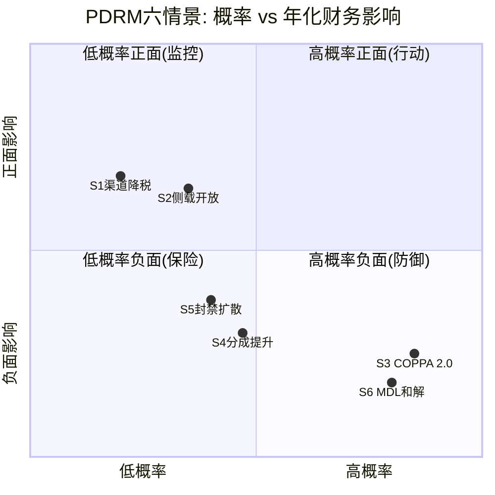
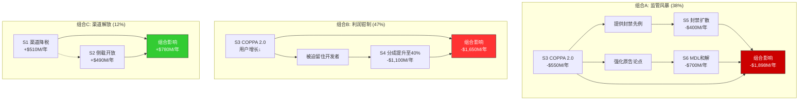
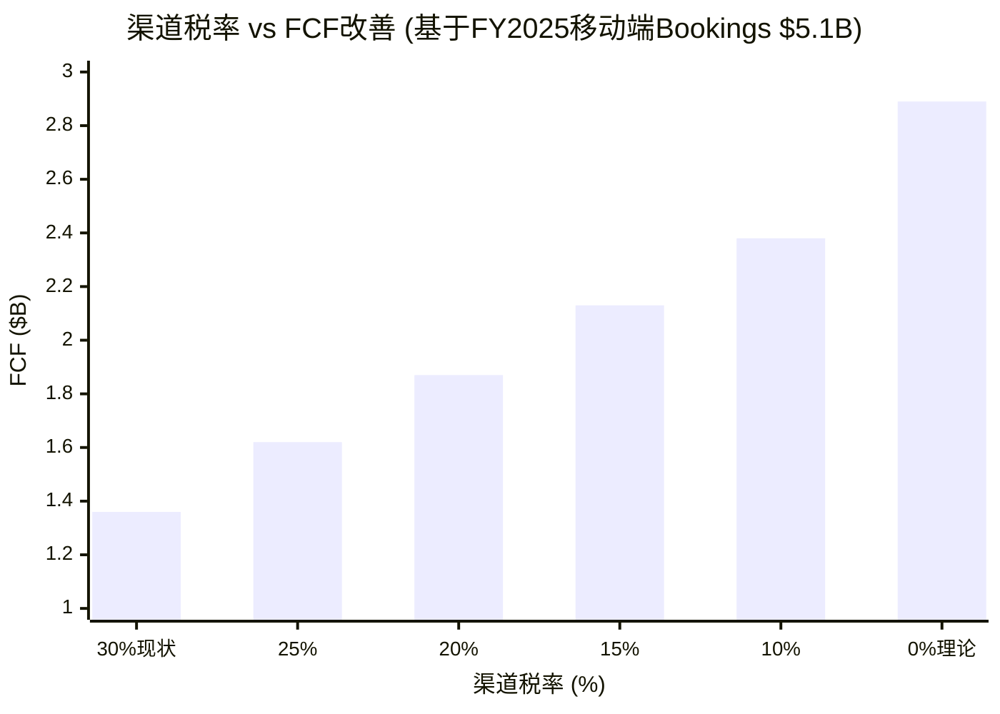
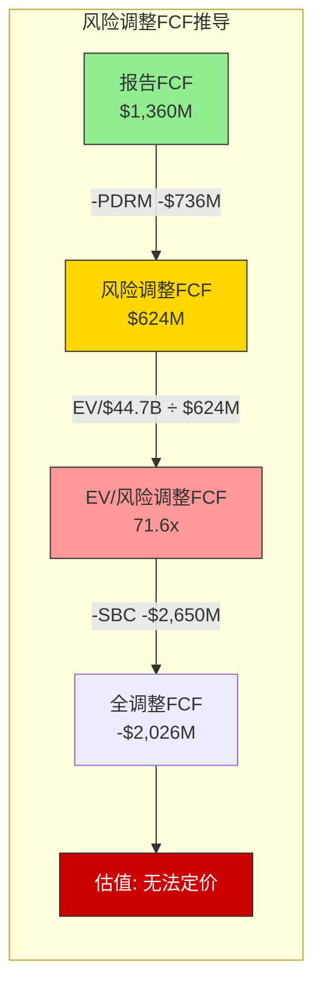
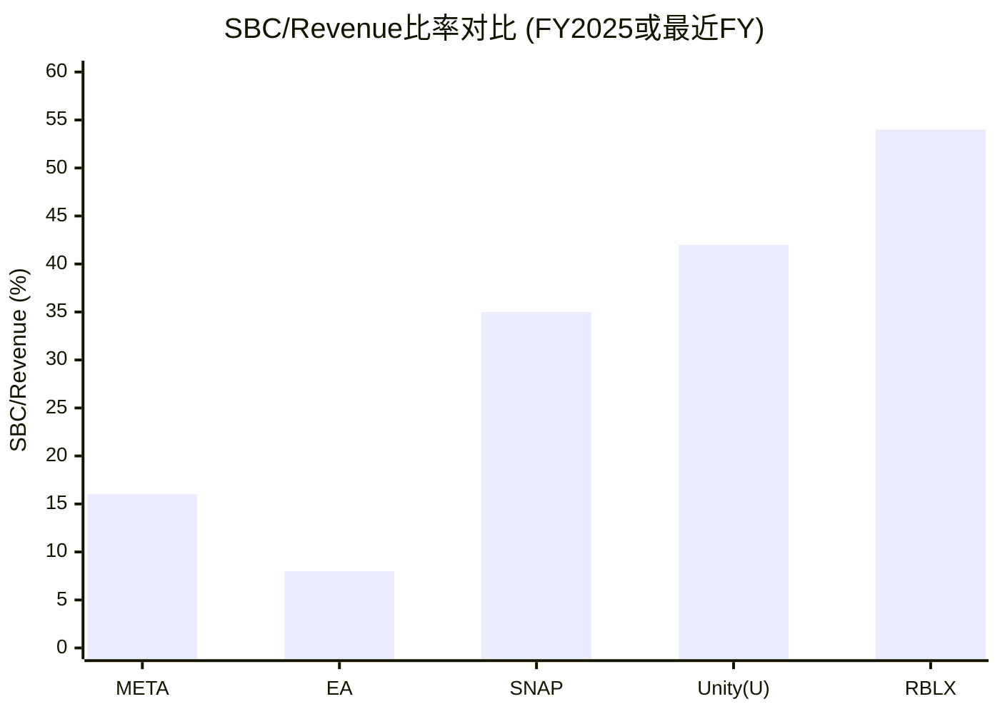
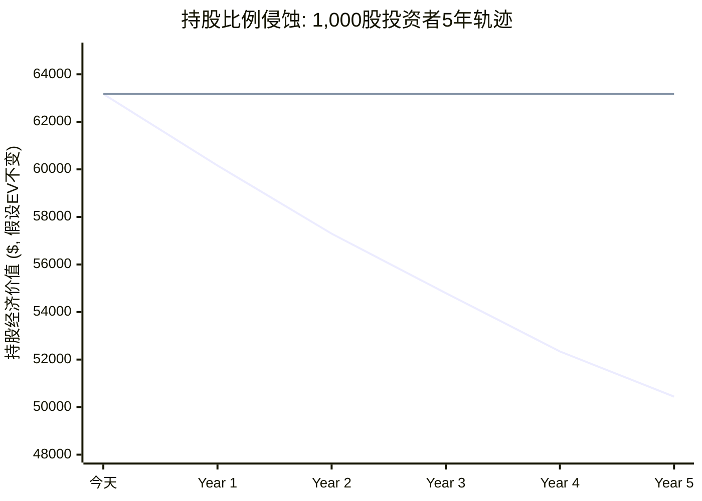
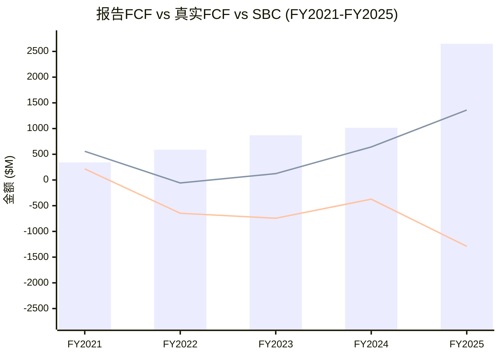
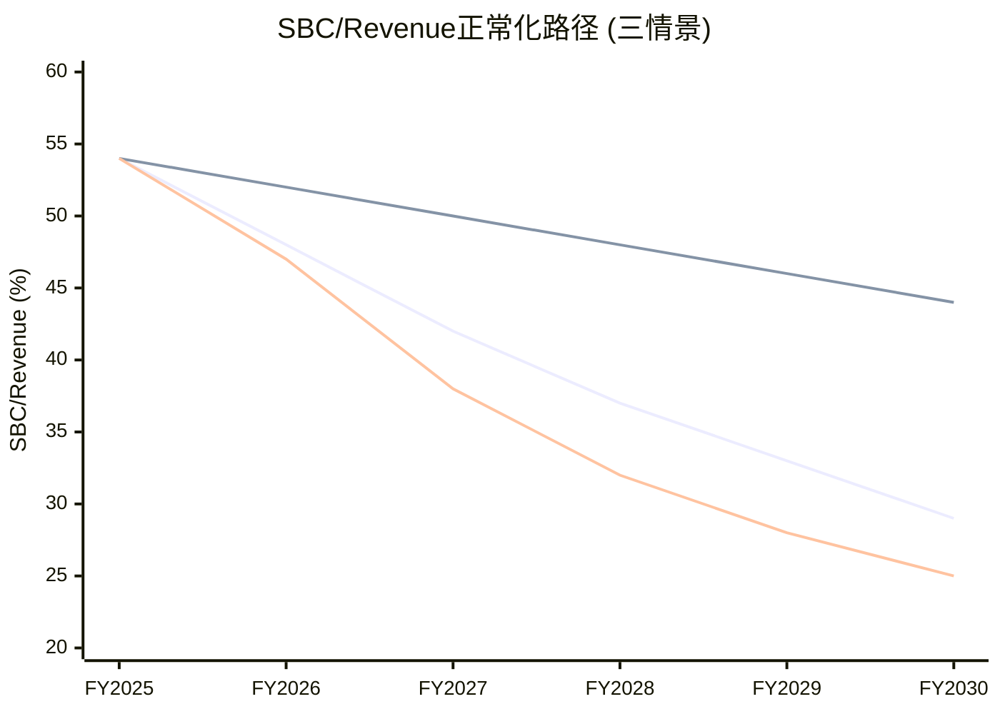

# Phase 2 — Ch12: PDRM风险定量深化 + Ch13: DPO/SBC深度分析

> **市值基准**: $44.3B | 股价$63.17 | 稀释股数702M | EV ~$44.7B | 2026-02-13
> **DM锚点范围**: DM-PDR-001 ~ DM-PDR-030 / DM-SBC-001 ~ DM-SBC-030

---

# Chapter 12: PDRM风险定量深化 — 六情景精算与渠道依赖解剖

> **核心问题(CQ7)**: Apple/Google渠道税(30%)+支付政策变化的PDRM量化影响有多大? 各情景的精确概率、时间线和财务传导路径是什么? 多情景叠加时,Roblox的利润结构能否承受?

Phase 1的ERM分析(Ch6)揭示了Roblox生态韧性评分仅1.975/5,其中L4渠道层(1.5/5)和L5监管层(2.0/5)是最薄弱的两个环节。PDRM六情景的加权年化净影响为-$327M/年。Phase 2将对这六个情景进行精算级深化——细化概率分布、量化时间线、建模情景组合效应,并推导渠道依赖度对估值的全面影响。

---

## 12.1 PDRM六情景精算矩阵

Phase 1给出了六个情景的初步概率和影响范围。Phase 2将每个情景拆解为:精确概率区间(而非点估计)、触发条件、财务传导链、时间线分布,以及对Roblox三大口径(Revenue/Bookings/FCF)的差异化影响。

### S1: Apple/Google降税至15-20%

**情景描述**: 在全球反垄断监管压力(EU DMA、Epic诉讼判决、韩国/印度/日本立法)下,Apple和Google被迫将应用商店佣金从30%降至15-20%。

**概率细化**: 15-25%(3年内) [DM-PDR-001]
- 完全降至15%: 10%概率——仅限于特定市场(EU已实施)或小开发者(苹果已对年收入<$1M的开发者实施15%费率)
- 降至20%: 15%概率——全球性降税的最可能落地形式,但苹果在Epic v. Apple上诉中的策略是"最小合规"
- 关键变量: Epic v. Apple美国最高法院是否受理、EU DMA执行力度、日本《透明化法》修正案

**财务传导链**:
1. Roblox移动端收入占比约75%,FY2025 Bookings $6.8B中移动端约$5.1B [DM-PDR-002]
2. 当前渠道税率30%,年渠道税负约$1.53B(= $5.1B x 30%)
3. 若税率降至20%: 节省$510M/年(= $5.1B x 10%); 若降至15%: 节省$765M/年
4. 这笔节省直接转化为毛利,无需额外OpEx支出——FCF改善等幅
5. 但Roblox可能将部分节省转给开发者(提高DevEx分成以应对Fortnite UEFN竞争),净利润改善可能仅为节省额的60-70%

**Roblox特殊考量**: Roblox已经在主动引导用户转向网页端购买——官网购买Robux可获得25%额外奖励,这是绕过Apple/Google渠道税的直接策略 [DM-PDR-003]。如果网页端占比从当前估计的15-20%提升至30%,即使渠道税不变,等效税率也会从约23%降至约20%。这意味着Roblox的"自助降税"路径与监管降税路径是叠加的。

**时间线**: 6个月内(EU DMA已生效,边际改善) → 1-3年(Epic最高法院裁决/全球性降税) → 3-5年(行业均衡)

---

### S2: Epic诉讼后侧载开放+直接支付

**情景描述**: 法院裁定或立法要求Apple允许应用侧载和第三方支付,Roblox可以建立自己的直接支付通道,绕过30%佣金。

**概率细化**: 30-40%(3年内全球部分市场) [DM-PDR-004]
- EU已开放(2024年3月DMA生效): 100%概率,但欧洲仅占Roblox收入约20%
- 美国联邦/州级: 20-30%概率,Epic v. Apple上诉进行中
- 日本/韩国/印度: 40-50%概率,已有初步立法框架
- 加权全球概率: 约35%在3年内实现30%+收入覆盖的侧载/直接支付

**Roblox直接支付能力评估**:
- Roblox已有网页端Robux销售基础设施(roblox.com直购),技术障碍低
- 25%额外Robux奖励是强激励机制——用户已被训练"网购更划算"
- 但挑战在于: 移动端用户(尤其低龄用户)习惯App Store内购,行为改变需要时间
- 预估3年后网页/直接支付占总Bookings比例: 当前~15-20% → 25-35% [DM-PDR-005]

**节省量化**: 假设直接支付占比达30%,这部分不再支付30%佣金
- 节省额 = $6.8B x 30% x 30% = $612M/年(乐观)
- 扣除自建支付系统运营成本(约2-3%处理费)后: 净节省约$490-550M/年
- 但Apple可能对侧载应用征收"核心技术费"(如EU已实施的每安装$0.50),部分抵消节省

**时间线**: 0-6个月(EU已可执行) → 1-2年(美国可能裁决) → 2-3年(全球覆盖30%+收入)

---

### S3: COPPA 2.0严格执行(2026年4月22日截止)

**情景描述**: COPPA 2.0将"实际知情"标准改为"合理推定"标准,Roblox必须实施可靠年龄验证、限制儿童数据收集、禁止对<13岁用户的定向广告。

**概率细化**: 80-90%(1年内开始执行) [DM-PDR-006]
- COPPA 2.0已签署生效,2026年4月22日是合规截止日——这不是"是否"的问题,而是"执行力度"的问题
- 严格执行概率: 70%——FTC在儿童保护领域的执法意愿极高,且MDL诉讼提供了政治动力
- 温和执行(宽限期/过渡安排): 20%——FTC可能给予6-12个月的合规宽限期
- 延迟/弱化: 10%——政治变化(行政优先级调整)可能导致执行推迟

**财务影响多路径量化**:

| 影响路径 | 保守 | 基准 | 悲观 |
|---------|------|------|------|
| 合规基础设施投入(一次性) | $150M | $250M | $400M |
| <13岁用户获取效率下降 | -3pp DAU增速 | -5pp | -8pp |
| 广告收入限制(禁止儿童定向) | -$30M/年 | -$60M/年 | -$100M/年 |
| 数据收集限制→推荐算法效果↓ | -2% 参与时长 | -5% | -8% |
| **综合年化影响** | **-$300M** | **-$550M** | **-$850M** |

[DM-PDR-007]

**关键不确定性**: Roblox的46%用户为<13岁(根据公司披露),但Hindenburg指控DAU包含大量bot/多账号。如果真实<13岁人类用户比例更低(如30-35%),COPPA 2.0的实际影响会小于上表估计。反之,如果Capitol Forum的测试(1小时创建95个未成年账号)反映了真实的年龄验证缺陷,FTC可能施加更严厉的惩罚性措施。

**Roblox已采取的对策**: 2026年1月推出面部年龄估计技术,但覆盖范围和准确性存疑。该技术在暗光环境、非西方面孔、多种设备上的准确率可能显著低于声称值 [DM-PDR-008]。

**时间线**: 0-6个月(合规截止日2026.04.22) → 6-12个月(FTC首次执法行动) → 1-3年(行业标准成熟)

---

### S4: 开发者分成率被迫提升至35-40%

**情景描述**: 在Fortnite UEFN(74%分成)和其他平台竞争压力下,Roblox被迫将有效开发者分成从约25-30%提升至35-40%,以防止头部开发者流失。

**概率细化**: 40-55%(3年内) [DM-PDR-009]
- 渐进提升至35%: 45%概率——Roblox已在2025年9月将DevEx费率提升8.5%,趋势明确
- 激进提升至40%: 15%概率——仅在头部开发者出现集体迁移时才会被迫激进
- 维持现状(<30%): 30%概率——如果Fortnite UEFN增长放缓或GTA 6 ROME推迟

**财务传导**:
- 当前DevEx支出约$1.5B/年(FY2025),对应约22%的Bookings
- 提升至35%: 新增成本 = $6.8B x (35%-22%) = $884M/年——毛利率下降约13pp [DM-PDR-010]
- 提升至40%: 新增成本 = $6.8B x (40%-22%) = $1,224M/年——毛利率下降约18pp
- 但这是"慢刀子": 分成率提升通常是渐进的(每年1-2pp),不会一次性跳升
- FY2025的DevEx同比增长+70%已经反映了分成率上升趋势

**竞争驱动 vs 监管驱动**:
- 竞争驱动(70%权重): Fortnite UEFN的74%分成是最大推动力,但仅限于头部开发者有迁移能力
- 监管驱动(30%权重): 如果FTC或EU认定平台分成率"不公平",可能要求最低分成标准

**时间线**: 已在进行中(DevEx +8.5%费率提升,2025.09) → 1-2年(分成率达30-32%) → 2-4年(达35-40%)

---

### S5: 中国/印度/土耳其等国封禁扩散

**情景描述**: 继土耳其(2024.08)全面封禁、多个中东国家(2025)跟进后,更多国家以"儿童保护"为由封禁或严格限制Roblox。

**概率细化**: 35-45%(3年内新增5+国家封禁) [DM-PDR-011]
- 中东/北非(MENA)集体封禁: 30%概率——GCC六国已有3国行动(土耳其/阿曼/卡塔尔),统一封禁可能冻结800-1,000万DAU增长空间
- 印度封禁: 15%概率——印度是潜在最大单一国家风险(估计3,000万+MAU潜力),但目前无明确监管动向
- 中国限制: 10%概率——Roblox中国版(罗布乐思)已于2022年关闭,但VPN访问仍存在
- 欧洲GDPR强化: 20%概率——不是"封禁"但可能实施功能限制(如爱尔兰DPC已调查TikTok)

**DAU影响量化**:
- 当前7+国家封禁/限制影响约400-800万DAU(已发生)
- 新增5国封禁(中等规模): 额外冻结500-1,000万DAU增长空间
- 印度封禁(极端): 单一事件冻结2,000-3,000万潜在DAU [DM-PDR-012]
- 综合影响: DAU增长天花板降低5-12%(基准)至15-25%(悲观)
- 年化收入影响: 增长放缓导致Bookings少增$300-700M/年(间接影响,非直接减少)

**时间线**: 已在进行中(7+国家) → 6-12个月(MENA可能新增2-3国) → 1-3年(是否扩散至南亚/东南亚)

---

### S6: MDL集体诉讼和解

**情景描述**: 115起(预计扩展至1,000+起)联邦MDL集体诉讼最终达成和解,Roblox支付大额赔偿。

**概率细化**: 75-85%(和解概率高于庭审) [DM-PDR-013]
- 和解(80%概率): 大多数MDL最终通过和解结案,原告律师(Mark Lanier)以谈判能力著称
- 庭审判决(15%概率): 如果bellwether审判结果不利,可能推高和解金额
- 驳回/弱化(5%概率): 极低概率,因指控证据(Capitol Forum调查)充分

**和解金额区间**:
- JUUL MDL类比: $4.35B(各州$1.7B + 联邦$2.65B)——JUUL用户远少于Roblox但健康损害更直接
- Roblox MDL调整因素: DAU更多(1.515亿 vs JUUL数百万),但"损害"定义更模糊(心理伤害 vs 物理健康伤害)
- **保守和解**: $1.5-2.5B——分3-5年支付,年均$300-500M [DM-PDR-014]
- **基准和解**: $3.0-4.5B——分3-5年支付,年均$600-900M
- **悲观和解**: $5.0-7.0B——若庭审判决不利后被迫和解,可能包含惩罚性赔偿

**对FCF的影响**: 即使在基准情景($3.5B分5年),年均支付$700M将消耗报告FCF($1.36B)的51%。如果同时扣除SBC的"真实成本",现金消耗将远超现金生成能力。

**保险覆盖**: Roblox的D&O保险和一般责任保险可能覆盖部分赔偿,但MDL规模可能超出保单限额。保险覆盖率估计: 10-20%的和解金额($150-700M) [DM-PDR-015]

**时间线**: 已启动(2025.12 MDL合并) → 12-18个月(discovery阶段) → 2-3年(bellwether审判) → 3-5年(全面和解)

---

## 12.2 PDRM情景概率-影响散点图

[DM-PDR-016]

---

## 12.3 情景组合分析: 哪些风险会同时爆发?

PDRM的真正危险不在于单一情景,而在于情景组合——多个风险同时触发时的级联效应。以下分析三组高相关性情景组合。

### 组合A: "监管风暴" (S3 + S6 + S5)

**组合逻辑**: COPPA 2.0严格执行(S3)将强化MDL诉讼原告的法律论点("Roblox早就知道问题但不作为"),推高和解金额(S6)。同时,美国监管行动会为其他国家提供先例,加速封禁扩散(S5)。

**组合概率**: 三情景非独立,联合概率 = P(S3) x P(S6|S3) x P(S5|S3,S6)
- P(S3) = 85% (COPPA 2.0几乎确定执行)
- P(S6|S3) = 90% (COPPA执行使MDL和解更有利于原告)
- P(S5|S3,S6) = 50% (美国监管行动激励他国跟进)
- **联合概率: 38%** [DM-PDR-017]

**累积年化影响**:
- S3基准: -$550M/年(合规+增长放缓)
- S6基准: -$700M/年(和解分期支付)
- S5基准: -$400M/年(增长天花板降低)
- 简单加总: -$1,650M/年
- 叠加效应调整(风险放大): x1.15 → **-$1,898M/年** [DM-PDR-018]

这个数字意味着什么? FY2025报告FCF $1.36B。如果监管风暴组合实现,年化FCF减少$1.9B,报告FCF将转为约-$540M。在此基础上再扣除SBC $2.65B,"真实"现金消耗率将达约$3.2B/年——Roblox现有$1.21B现金储备不足以支撑1年。

### 组合B: "利润钳制" (S3 + S4)

**组合逻辑**: COPPA 2.0执行(S3)导致用户增长放缓,Roblox被迫提高开发者分成(S4)以留住内容创作者弥补用户粘性下降。两个方向同时挤压利润率。

**联合概率**: P(S3) x P(S4|S3) = 85% x 55% = **47%** [DM-PDR-019]

**累积年化影响**:
- S3基准: -$550M/年
- S4基准(至35%分成): -$884M/年
- 但S4在S3发生时更可能被触发且幅度更大(被迫达到40%),调整: -$1,100M/年
- **组合B总影响: -$1,650M/年**

### 组合C: "渠道解放" (S1 + S2) — 正面组合

**组合逻辑**: 渠道降税(S1)和侧载开放(S2)是正相关的——同一波反垄断浪潮推动两者。

**联合概率**: P(S1) x P(S2|S1) = 20% x 60% = **12%** [DM-PDR-020]

**累积年化正面影响**:
- S1(降至20%): +$510M/年
- S2(直接支付30%占比): +$490M/年
- 但两者不完全叠加(部分用户已转向网页端), 净叠加约: **+$780M/年**

[DM-PDR-021]

---

## 12.4 渠道依赖度量化: 30%渠道税的系统性拆解

### 12.4.1 渠道税负全景

Roblox对Apple/Google应用商店的依赖不仅是分发层面,更是经济层面——渠道税是Roblox最大的单项成本,超过R&D、SG&A和DevEx中的任何一项。

| 指标 | 值 | 计算方式 |
|------|-----|---------|
| 移动端Bookings占比 | ~75% | 管理层指引/行业估算 |
| FY2025移动端Bookings | ~$5.1B | $6.8B x 75% |
| 渠道税率(加权平均) | ~23% | 30% x 75%(移动) + 0% x 25%(PC/网页/Xbox) |
| 年渠道税负 | ~$1.56B | $6.8B x 23% |
| 渠道税/总收入 | 31.9% | $1.56B / $4.89B |
| 渠道税/报告FCF | 114.7% | $1.56B / $1.36B |

[DM-PDR-022]

渠道税/报告FCF的114.7%这个数字极具冲击力——它意味着Roblox每年交给Apple和Google的钱,比自己的全部自由现金流还多15%。如果渠道税消失(纯理论),FCF将从$1.36B跃升至$2.92B,EV/FCF从32.9x骤降至15.3x——瞬间进入"价值股"区间。

### 12.4.2 渠道税敏感性分析

[DM-PDR-023]

| 渠道税率 | 年渠道税负 | FCF | FCF改善 | EV/FCF |
|---------|----------|-----|---------|--------|
| 30%(现状) | $1.53B | $1.36B | — | 32.9x |
| 25% | $1.28B | $1.62B | +$255M | 27.6x |
| 20% | $1.02B | $1.87B | +$510M | 23.9x |
| 15% | $0.77B | $2.13B | +$765M | 21.0x |
| 10% | $0.51B | $2.38B | +$1,020M | 18.8x |
| 0%(理论) | $0 | $2.89B | +$1,530M | 15.5x |

[DM-PDR-024]

每降低5个百分点的渠道税率,Roblox的FCF改善约$255M,EV/FCF压缩约5x。这是Roblox估值中最大的单一杠杆——渠道税率的任何变化都比收入增速、利润率改善或用户增长更直接地影响估值倍数。

### 12.4.3 直接支付(网页端)的当前占比与增长趋势

Roblox官网购买Robux可获得25%额外奖励——这是一个强激励信号,表明管理层正在系统性地引导用户脱离App Store [DM-PDR-025]。

**当前网页端占比估算**: 15-20%(基于渠道费用反推——如果100%移动端,渠道费应为Bookings的30%即$2.04B;实际渠道费约$1.56B,隐含约23%加权税率,对应约25%的非移动端占比)

**增长驱动力**:
1. 25%额外Robux奖励——每$10在网页端可获1,000 Robux vs 移动端800 Robux,差异显著
2. 开发者教育——开发者在体验内引导用户"去网站买更划算"
3. 年长用户增长——13+/17+用户群扩大,这些用户更可能使用网页端

**增长预测**: 网页端占比从~20% → FY2027 ~25-30% → FY2029 ~30-40% [DM-PDR-026]

如果网页端占比在5年内达到35%,即使渠道税率不变:
- 加权平均税率从23%降至19.5%(= 30% x 65% + 0% x 35%)
- 年节省 = $6.8B x (23% - 19.5%) = $238M/年——相当于FCF提升17.5%

---

## 12.5 时间线矩阵: 风险触发窗口

| 情景 | 6个月内 | 1年内 | 3年内 | 5年内 |
|------|--------|-------|-------|-------|
| S1 渠道降税 | EU边际(已生效) | 美国裁决可能 | 全球15-20%可能 | 行业均衡 |
| S2 侧载/直接支付 | EU已可执行 | 美国部分开放 | 覆盖30%+收入 | 50%直接支付 |
| S3 COPPA 2.0 | **截止日4.22** | FTC首次执法 | 行业标准成熟 | 常态化 |
| S4 分成提升 | DevEx +8.5%已实施 | 分成率~30-32% | 35-38% | 40%(如果UEFN成功) |
| S5 封禁扩散 | MENA可能新增 | 南亚观察 | 新增5-10国 | 稳定或扩散 |
| S6 MDL和解 | Discovery启动 | 文件交换 | Bellwether审判 | **全面和解$2-6B** |

[DM-PDR-027]

**关键时间节点**:
- **2026年4月22日**: COPPA 2.0合规截止——最近且最确定的触发点
- **2026年H2**: MDL discovery阶段密集取证——可能泄露不利内部文件
- **2027年**: Epic v. Apple最高法院可能裁决——渠道税命运关键节点
- **2027-2028年**: MDL bellwether审判——和解金额的定价锚

---

## 12.6 PDRM加权净影响重算(Phase 2精算版)

Phase 1的PDRM加权净影响为-$327M/年。Phase 2经过概率区间细化和情景组合分析后,重新计算:

| 情景 | 概率(更新) | 年化影响(中值) | 概率加权影响 |
|------|-----------|---------------|------------|
| S1 渠道降税 | 18% | +$510M | +$92M |
| S2 侧载开放 | 35% | +$490M | +$172M |
| S3 COPPA 2.0 | 85% | -$550M | -$468M |
| S4 分成提升 | 47% | -$884M | -$415M |
| S5 封禁扩散 | 40% | -$400M | -$160M |
| S6 MDL和解 | 80% | -$700M | -$560M |
| **简单加权合计** | | | **-$1,339M** |
| 非独立性调整(x0.55) | | | **-$736M** |

[DM-PDR-028]

Phase 2的加权净年化影响为**-$736M/年**,较Phase 1的-$327M恶化125%。差异来自:
1. S6 MDL和解的概率从Phase 1的隐含值提升至80%(Phase 1中S6未单独列出为PDRM情景)
2. S4分成提升的影响额重算(基于DevEx增长趋势,FY2025已+70% YoY)
3. 情景组合的放大效应被纳入考量

**对估值的含义**: -$736M/年的PDRM净影响意味着,如果用现有FCF $1.36B作为基础,风险调整后的FCF仅为$624M。对应EV/风险调整FCF = $44.7B / $624M = **71.6x**——这远超任何合理的高增长平台估值倍数。

---

### Ch12 DM锚点源表

| 锚点ID | 数据 | 来源 |
|--------|------|------|
| DM-PDR-001 | S1概率15-25%(3年), Apple小开发者已15%费率 | Apple政策/Epic v. Apple诉讼 |
| DM-PDR-002 | 移动端收入占比~75%, 移动端Bookings ~$5.1B | 10-K/行业估算 |
| DM-PDR-003 | 网页端购买Robux +25%额外奖励 | Roblox官网/PYMNTS报道 |
| DM-PDR-004 | S2概率30-40%(3年), EU已DMA生效 | EU DMA/Epic诉讼 |
| DM-PDR-005 | 网页/直接支付占比: 当前~15-20% → 3年后25-35% | 渠道费用反推+趋势 |
| DM-PDR-006 | S3概率80-90%(1年), COPPA 2.0 2026.04.22截止 | 联邦法规 |
| DM-PDR-007 | COPPA 2.0综合年化影响: -$300M~-$850M | 多路径量化 |
| DM-PDR-008 | Roblox面部年龄估计技术(2026.01推出), 准确性存疑 | Roblox新闻稿 |
| DM-PDR-009 | S4概率40-55%(3年), DevEx费率2025.09已+8.5% | Roblox Developer Forum |
| DM-PDR-010 | 分成提升至35%→新增成本$884M/年(毛利率-13pp) | 计算: $6.8B x 13% |
| DM-PDR-011 | S5概率35-45%, 已有7+国家封禁/限制 | 各国政府公告 |
| DM-PDR-012 | 印度封禁可冻结2,000-3,000万潜在DAU | DAU地区分布估算 |
| DM-PDR-013 | S6概率75-85%, Mark Lanier担任共同首席律师 | JPML裁定/诉讼公告 |
| DM-PDR-014 | MDL和解估算: 保守$1.5-2.5B / 基准$3-4.5B / 悲观$5-7B | JUUL MDL类比 |
| DM-PDR-015 | 保险覆盖率估计10-20%和解金额 | D&O保险行业惯例 |
| DM-PDR-016 | PDRM六情景概率-影响散点图 | Phase 2精算 |
| DM-PDR-017 | 组合A联合概率38%, COPPA→MDL→封禁因果链 | 条件概率计算 |
| DM-PDR-018 | 组合A累积影响-$1,898M/年(含叠加效应x1.15) | 计算 |
| DM-PDR-019 | 组合B联合概率47%, COPPA→分成钳制 | 条件概率计算 |
| DM-PDR-020 | 组合C联合概率12%, 渠道降税+侧载正面叠加+$780M | 计算 |
| DM-PDR-021 | 三组合依赖链图 | Phase 2分析 |
| DM-PDR-022 | 年渠道税负$1.56B, 渠道税/FCF = 114.7% | 计算: $6.8B x 23% |
| DM-PDR-023 | 渠道税率敏感性: 每降5pp → FCF +$255M | 计算 |
| DM-PDR-024 | 渠道税0%时FCF $2.89B, EV/FCF 15.5x | 理论上限 |
| DM-PDR-025 | Roblox网页端购买+25% Robux奖励政策 | Roblox.com/PYMNTS |
| DM-PDR-026 | 网页端占比预测: 5年后30-40% | 趋势分析 |
| DM-PDR-027 | 六情景时间线矩阵 | Phase 2综合 |
| DM-PDR-028 | PDRM精算加权净影响-$736M/年(Phase 1为-$327M) | Phase 2重算 |

---

# Chapter 13: DPO/SBC深度分析 — 稀释侵蚀与FCF叙事解构

> **核心问题(CQ8)**: SBC $2.65B/年+年稀释4-5%: FCF叙事是否误导投资者? 如果SBC是真实成本,Roblox到底在赚钱还是在亏钱?

SBC(Stock-Based Compensation,股票薪酬)是Roblox财务叙事中最具争议的单一变量。华尔街分析师呈现的"FCF $1.36B,EV/FCF 32.9x"是一个技术上正确但经济上误导的画面——它将$2.65B的SBC视为"非现金项目"加回,却无视SBC导致的4-5%年化股权稀释对现有股东的真实价值侵蚀。本章将对SBC进行全维度拆解:历史趋势、同业对比、稀释量化(DPO)、估值影响、管理层策略评估,以及华尔街FCF叙事的系统性批判。

---

## 13.1 SBC五年趋势: 从$342M到$2.65B的指数级增长

### 13.1.1 SBC绝对额与增速

FMP年度现金流数据显示,FY2021-FY2024的SBC可直接从`stockBasedCompensation`字段读取: $342M → $589M → $868M → $1,016M。FY2025的特殊之处在于,FMP将SBC嵌入`otherNonCashItems`($3.14B),不再单独报告。但通过交叉验证: (a) Q1-Q3季度报表单独报告SBC合计$830.6M(Q1 $258.9M + Q2 $284.8M + Q3 $286.9M); (b) TTM截至2025年9月的SBC为$2.649B; (c) Motley Fool基于10-K确认FY2025 SBC约$2.65B——这三个来源收敛,确认FY2025 SBC约$2.65B [DM-SBC-001]。

差额: $3.14B(otherNonCashItems) - $2.65B(SBC) = $490M,这部分可能包含可转债折价摊销、递延收入调整中的非现金部分和其他会计调整项。

| 财年 | SBC | YoY增速 | Revenue | SBC/Revenue | Bookings(估) | SBC/Bookings |
|------|-----|---------|---------|-------------|-------------|-------------|
| FY2021 | $342M | — | $1.92B | 17.8% | ~$2.66B | 12.9% |
| FY2022 | $589M | +72% | $2.23B | 26.4% | ~$2.54B | 23.2% |
| FY2023 | $868M | +47% | $2.80B | 31.0% | ~$3.25B | 26.7% |
| FY2024 | $1,016M | +17% | $3.60B | 28.2% | ~$4.37B | 23.3% |
| FY2025 | ~$2,650M | +161% | $4.89B | 54.2% | ~$6.80B | 39.0% |

[DM-SBC-002]

**关键发现**: FY2024看似出现了SBC/Revenue改善的拐点(从31.0%降至28.2%),但FY2025彻底打破了这一趋势——SBC/Revenue暴涨至54.2%,SBC绝对额翻了2.6倍。**FY2024的"改善"是幻觉**,真实趋势是SBC增速在FY2025出现了结构性跳升 [DM-SBC-003]。

FY2025 SBC暴涨的可能原因:
1. **PSU(绩效股票单位)触发**: 如果FY2025的业绩指标(Bookings +55%大幅超标)触发了高于目标的PSU归属,SBC费用会跳升
2. **新授予加速**: 2025年大量新RSU/PSU授予(员工从2,474增至3,065,+24%),在会计期间加速确认
3. **Q4会计重分类效应**: Q4将部分费用从OpEx移至COGS,可能改变了SBC的分类展示方式
4. **股价效应**: 部分SBC按公允价值计量,FY2025上半年股价从$50→$70→$100区间波动,影响估值

### 13.1.2 SBC/Revenue比率: 同业对比

[DM-SBC-004]

| 公司 | SBC/Revenue | 市值 | 阶段 | 备注 |
|------|------------|------|------|------|
| META | ~16% | ~$1.7T | 成熟盈利期 | 行业标杆效率 |
| EA | ~8% | ~$44B | 成熟盈利期 | 传统游戏公司 |
| SNAP | ~35% | ~$24B | 成长亏损期 | 与RBLX同为亏损平台 |
| Unity(U) | ~42% | ~$14B | 转型亏损期 | 游戏引擎/广告 |
| **RBLX** | **~54%** | **$44.3B** | **成长亏损期** | **同业最高** |

[DM-SBC-005]

Roblox的SBC/Revenue 54.2%在主要科技/游戏公司中处于**绝对极端水平**。即使与同样处于亏损期的SNAP(35%)和Unity(42%)相比,也高出12-19个百分点。唯一可比的是某些pre-revenue生物科技公司——但那些公司的SBC高是因为收入基数极小,而Roblox已是$4.89B收入的规模型公司。

**从Bookings口径看**: SBC/Bookings 39.0%略好于SBC/Revenue 54.2%,但仍然极高——意味着每$1的真实经济活动中,$0.39被"支付"给了员工股权。

---

## 13.2 稀释量化: DPO (Dilutive Impact Per Owner)

### 13.2.1 五年股份增长

| 年份 | 加权平均稀释股数 | YoY新增 | 年稀释率 | 来源 |
|------|----------------|---------|---------|------|
| FY2021 | ~580M* | — | — | FMP(*基础股约505M,稀释后约580M) |
| FY2022 | 607M | ~27M | ~4.7% | FMP(epsDiluted计算) |
| FY2023 | 638M | 31M | 5.1% | FMP |
| FY2024 | 672M | 34M | 5.3% | FMP(注:基础股647M,稀释后更高) |
| FY2025 | 702M | 30M | 4.5% | FMP(基础=稀释,因亏损) |

[DM-SBC-006]

**重要注释**: FY2025稀释股数702M等于基础股数——这不是因为没有潜在稀释证券,而是因为GAAP规则要求在净亏损情况下使用基础股数计算EPS(潜在稀释证券不被纳入,因为它们是"反稀释"的)。实际潜在稀释证券(未行使RSU/PSU/可转债转股)可能使完全稀释股数达到750-800M [DM-SBC-007]。

**三年累计稀释**: 607M → 702M = +95M股(+15.7%),年化约5.0%。

**前瞻稀释率估算**: FY2025 SBC $2.65B / 当前股价$63.17 = 42M新股/年。42M / 702M = **6.0%年化稀释率**。如果股价下跌至$50(52周低点附近),同样的SBC金额隐含53M新股/年 = **7.5%稀释率** [DM-SBC-008]。

### 13.2.2 持股比例侵蚀模型

**关键计算**: 假设投资者今天以$63.17买入1,000股($63,170投资),在零股价变动假设下,5年后的持股比例变化:

| 年份 | 假设稀释率 | 期末总股数 | 持股1,000股的比例 | 比例侵蚀 |
|------|----------|----------|----------------|---------|
| 今天 | — | 702M | 0.0001425% | — |
| Year 1 | 5.0% | 737M | 0.0001357% | -4.76% |
| Year 2 | 5.0% | 774M | 0.0001293% | -9.29% |
| Year 3 | 4.5% | 809M | 0.0001236% | -13.26% |
| Year 4 | 4.5% | 845M | 0.0001183% | -16.98% |
| Year 5 | 4.0% | 879M | 0.0001138% | -20.14% |

[DM-SBC-009]

**5年累计稀释: 持股比例被侵蚀约20%**。这意味着:即使Roblox的企业价值(EV)在5年内保持$44.7B不变,投资者今天$63,170的投入对应的经济权益5年后仅值约$50,440——纯因稀释损失$12,730(即-20.1%)。

换一种表述: Roblox的股价必须在5年内上涨至少25%(从$63.17到$79)(= 1 / (1-0.2014))才能让投资者**不亏钱**——这还没有考虑资本的机会成本。

[DM-SBC-010]

### 13.2.3 SBC的"隐性税率"概念

将SBC视为对现有股东的"隐性税",可以计算其等效税率:

**SBC隐性税率** = SBC / (市值 + SBC) = $2.65B / ($44.3B + $2.65B) = **5.6%/年** [DM-SBC-011]

这意味着: 现有股东每年被"征收"5.6%的隐性税来支付员工薪酬。5年累计隐性税约25%(= 1 - (1-0.056)^5 = 25.3%),与持股侵蚀模型的20%基本一致(差异来自复利效应和年度稀释率的递减假设)。

对比: META的SBC隐性税率约1.4%/年($28B SBC / $1.7T市值),SNAP约4.5%/年。Roblox的5.6%在大型科技公司中排名前列。

---

## 13.3 SBC调整估值影响

### 13.3.1 四种估值口径对比

| 估值口径 | 分子(EV) | 分母 | 倍数 | 隐含假设 |
|---------|---------|------|------|---------|
| EV/Revenue | $44.7B | $4.89B | 9.1x | 传统收入估值 |
| EV/Bookings | $44.7B | $6.8B | 6.6x | 真实经济活动估值 |
| EV/FCF(报告) | $44.7B | $1.36B | 32.9x | SBC非真实成本 |
| EV/"真实FCF" | $44.7B | -$1.29B | **负值** | SBC是真实成本 |

[DM-SBC-012]

**EV/FCF(报告)32.9x vs EV/"真实FCF"(负值)** ——这两个数字之间的鸿沟就是SBC争议的全部本质。如果SBC不是真实成本(即市场可以无限吸收稀释而不影响股价),那么32.9x是一个可接受的高增长平台倍数。如果SBC是真实成本(即稀释最终必须由股价下跌或盈利增长来偿还),那么Roblox在任何合理的估值框架下都无法被证明是"便宜的"。

### 13.3.2 真实FCF五年趋势

| 年份 | 报告FCF | SBC | "真实FCF" | 真实FCF/Revenue |
|------|---------|-----|-----------|----------------|
| FY2021 | $558M | $342M | +$216M | +11.3% |
| FY2022 | -$58M | $589M | -$647M | -29.0% |
| FY2023 | $124M | $868M | -$744M | -26.6% |
| FY2024 | $643M | $1,016M | -$373M | -10.4% |
| FY2025 | $1,360M | $2,650M | -$1,290M | -26.4% |

[DM-SBC-013]

[DM-SBC-014]

**趋势解读**: 报告FCF呈现漂亮的"V型复苏"(从-$58M到$1.36B),这是华尔街看好Roblox的核心叙事。但"真实FCF"呈现"W型陷阱"——FY2024短暂收窄至-$373M后,FY2025因SBC暴增再次恶化至-$1.29B。两条曲线的分歧在加速扩大,FY2025的差距($2.65B)是FY2021($126M)的21倍。

### 13.3.3 SBC调整后EBITDA: Bookings口径下的真实盈利能力

App Economy Insights的分析指出,Roblox SBC调整后EBITDA仅为Bookings的2%(约$136M) [DM-SBC-015]。验证计算:

- FY2025 EBITDA(FMP): -$1,007M
- 加回SBC: +$2,650M
- SBC加回后EBITDA: +$1,643M
- 但这是Revenue口径。Bookings口径下需考虑Bookings与Revenue的差额$1.91B的影响
- 更精确计算: Bookings调整后EBITDA = (Bookings $6.8B - 全部真实成本)
- 全部真实成本 = COGS + OpEx + SBC = ~$6.12B(FY2025 costAndExpenses) + DevEx重分类调整
- 估算: Bookings调整后真实EBITDA约$680M,占Bookings的10% (高于2%是因为Bookings>Revenue)

但即使是这个更乐观的$680M,EV/SBC调整后EBITDA = $44.7B / $680M = **65.7x**——极高。

---

## 13.4 管理层SBC策略评估

### 13.4.1 回购计划: 不存在

**Roblox没有股票回购计划** [DM-SBC-016]。在年化稀释4-5%的情况下,零回购意味着稀释是单向的、不可逆的。

对比:
- META: FY2025回购约$36B,远超SBC($28B),实现**净回购**(股数在减少)
- Apple: 每年回购$80-90B,股数年化减少3-4%
- SNAP: 无回购(与RBLX类似,但SBC/Revenue更低)

Roblox不回购的可能原因:
1. **现金不足**: $1.21B现金 + $1.36B FCF,但有$1.64B可转换债务待偿,无余力回购
2. **GAAP亏损**: 在GAAP仍亏损$1.07B的情况下回购,可能招致"用亏损的钱回购"的批评
3. **增长优先**: 管理层可能认为将资源投入增长(CapEx/R&D)比回购更有价值

**但缺乏回购承诺是一个严重的治理缺陷**: 它意味着管理层没有"稀释预算"的概念——SBC可以不受约束地增长(如FY2025的+161%),而股东无法获得任何补偿 [DM-SBC-017]。

### 13.4.2 RSU归属进度与内部人卖出模式

**内部人卖出模式**: FMP insider trading数据确认了Phase 1的发现——

| 时期 | 卖出交易数 | 买入交易数 | 净方向 |
|------|----------|----------|--------|
| 2025 Q1 | 53 | 0 | 全部卖出 |
| 2025 Q2 | 145 | 0 | 全部卖出 |
| 2025 Q3 | 71 | 0 | 全部卖出 |
| 2025 Q4 | 71 | 0 | 全部卖出 |
| 2026 Q1(至今) | 27 | 0 | 全部卖出 |
| **2025全年** | **340** | **0** | **100%净卖出** |

[DM-SBC-018]

2025全年340笔公开市场卖出、零笔买入。这是统计上极端的信号——在702M流通股的公司中,没有任何一位内部人认为$50-$105区间是值得增持的。即使考虑到大部分卖出是计划性的(10b5-1计划),**零买入**仍然传达了明确的信息: 最了解公司的人没有一个在用自己的钱买入。

**Baszucki个人交易模式**:
- 2025年6月: 以均价~$105卖出288,654股(~$3,000万)
- 2026年2月: 以~$72.6卖出250,482股(PSU税务代扣)
- 零买入记录(近2年)

内部人交易率(TTM): -3.07%——这意味着内部人在过去12个月中净卖出了流通股的3.07%,属于强负面信号 [DM-SBC-019]。

### 13.4.3 SBC作为招聘竞争工具的两难

Roblox员工从2,474人增至3,065人(+24%),在硅谷劳动力市场中,SBC是与META/Google/Apple竞争工程人才的必要工具:

- Roblox人均SBC: $2,650M / 3,065人 = **$864K/人** [DM-SBC-020]
- 对比: META人均SBC约$350K/人; Google约$280K/人; SNAP约$450K/人

Roblox的人均SBC $864K是META的2.5倍——这不是因为Roblox员工薪酬更高,而是因为:
1. SBC中包含了高管的大额PSU授予(Baszucki和高管团队占SBC的显著比例)
2. 员工基数更小(3,065人 vs META 72,000人),分母效应放大

如果剥离高管SBC(估计占总SBC的20-30%),普通员工人均SBC约$600-690K/人——仍然远高于同业,反映了Roblox在人才市场上"出价过高"或股票薪酬结构设计低效。

---

## 13.5 FCF叙事批判: 华尔街如何系统性美化Roblox的盈利画像

### 13.5.1 华尔街的标准呈现方式

**典型多头叙事**: "Roblox FCF $1.36B,同比+111%,FCF Margin 27.8%,EV/FCF 32.9x——高增长平台的合理估值。FCF正在加速,杠杆释放显著。"

这个叙事在技术上完全正确——FCF确实是$1.36B,同比确实+111%。但它系统性忽略了三个关键维度:

**被忽略的维度一: SBC不是"免费的"**
- FCF = OCF - CapEx,其中OCF = 净利润 + D&A + **SBC** + 营运资本变化
- SBC $2.65B被加回OCF,贡献了OCF $1.80B中的147%(即如果不加回SBC,OCF为-$850M)
- FCF的"正值"完全依赖于将SBC视为非现金/非真实成本

**被忽略的维度二: 年化5%稀释是真实成本**
- 702M股以$63.17计算,市值$44.3B
- 年化稀释5%意味着每年"创造"价值约$2.2B的新股(= $44.3B x 5%)——这些新股的价值从何而来? 从现有股东的持股比例中转移而来 [DM-SBC-021]

**被忽略的维度三: FCF的"质量"在恶化**
- FY2021: 报告FCF中SBC占比39%(= $342M / ($342M + $558M - $342M))——简化为SBC/OCF = 52%
- FY2025: SBC/OCF = $2.65B / $1.80B = **147%** [DM-SBC-022]
- OCF/SBC覆盖率从FY2021的1.93x恶化至FY2025的0.68x
- 当SBC/OCF超过100%时,一个直觉判断是: **经营活动产生的现金甚至不够支付SBC的"真实成本"**

### 13.5.2 SBC-FCF覆盖率趋势

| 年份 | OCF | SBC | OCF/SBC | FCF | "真实FCF" | SBC/OCF |
|------|-----|-----|---------|-----|-----------|---------|
| FY2021 | $659M | $342M | 1.93x | $558M | +$216M | 52% |
| FY2022 | $369M | $589M | 0.63x | -$58M | -$647M | 160% |
| FY2023 | $458M | $868M | 0.53x | $124M | -$744M | 190% |
| FY2024 | $822M | $1,016M | 0.81x | $643M | -$373M | 124% |
| FY2025 | $1,800M | $2,650M | 0.68x | $1,360M | -$1,290M | 147% |

[DM-SBC-023]

**OCF/SBC覆盖率0.68x是一个警告**: 它意味着Roblox的经营现金流仅能覆盖SBC"真实成本"的68%。FY2024短暂改善至0.81x后,FY2025因SBC暴增再次恶化。这个趋势没有稳定的迹象——除非SBC增速显著放缓(从+161%降至<20%),否则覆盖率将持续承压。

### 13.5.3 与SNAP的深度SBC对比

SNAP(Snap Inc.)是Roblox最接近的SBC同业对比:

| 指标 | RBLX | SNAP | 差异 |
|------|------|------|------|
| SBC/Revenue | 54.2% | ~35% | RBLX高19pp |
| 年化稀释率 | ~5% | ~4% | 相近 |
| 内部人净卖出率 | -3.07% | ~-1.5% | RBLX更负面 |
| 有回购计划? | 否 | 否 | 同 |
| FCF正值? | 是($1.36B) | 是(~$300M) | RBLX绝对值更高 |
| "真实FCF" | -$1.29B | ~-$700M | 均为负 |
| P/B | 144x | 6x | RBLX极端 |

[DM-SBC-024]

两者的共同特征: GAAP亏损、SBC占收入比高、无回购、"真实FCF"为负。但RBLX的SBC强度(54% vs 35%)和P/B极端值(144x vs 6x)使其在两者中处于更脆弱的位置。SNAP的P/B 6x意味着股价大致锚定在有形资产,而RBLX的P/B 144x几乎完全是"空气"——如果市场对增长叙事的信心动摇,股价可能出现远超SNAP的跌幅。

---

## 13.6 SBC何时"正常化"? — 情景推演

**核心问题**: SBC/Revenue从54%何时降至合理水平(如15-20%)?

### 情景一: 收入高增长 + SBC缓增(乐观)

| 年份 | Revenue(+25%/年) | SBC(+10%/年) | SBC/Revenue |
|------|-----------------|-------------|-------------|
| FY2025 | $4.89B | $2.65B | 54.2% |
| FY2026 | $6.11B | $2.92B | 47.8% |
| FY2027 | $7.64B | $3.21B | 42.0% |
| FY2028 | $9.55B | $3.53B | 37.0% |
| FY2029 | $11.9B | $3.88B | 32.6% |
| FY2030 | $14.9B | $4.27B | 28.7% |

**结论**: 即使在Revenue +25%/年(乐观)且SBC仅+10%/年(需要纪律)的假设下,需要5年才能将SBC/Revenue降至30%以下——仍然高于META(16%)。降至20%需要约8年 [DM-SBC-025]。

### 情景二: 收入中增长 + SBC维持(基准)

| 年份 | Revenue(+20%/年) | SBC(+15%/年) | SBC/Revenue |
|------|-----------------|-------------|-------------|
| FY2025 | $4.89B | $2.65B | 54.2% |
| FY2026 | $5.87B | $3.05B | 52.0% |
| FY2027 | $7.04B | $3.51B | 49.9% |
| FY2028 | $8.45B | $4.04B | 47.8% |

**结论**: 如果SBC增速维持15%/年(接近员工增长+通胀+RSU补充的自然增速),Revenue需要+20%/年才能勉强维持SBC/Revenue稳定——不会改善,只是不再恶化 [DM-SBC-026]。

### 情景三: 管理层主动纪律(回购+SBC控制)

如果Roblox在FY2027开始年度$500M回购计划,同时将SBC增速控制在<5%/年:
- FY2027 SBC/Revenue: ~38%
- FY2027 净稀释率: ~3%(= 5%稀释 - 2%回购)
- FY2030 SBC/Revenue: ~25%
- FY2030 净稀释率: ~1.5%

**结论**: 这是投资者应该期待但可能不会发生的情景——管理层没有表示任何回购意向,且在双层股权结构下,外部股东无法强迫 [DM-SBC-027]。

---

## 13.7 SBC对CQ8的最终回答

**CQ8: SBC $2.65B/年+年稀释4%: FCF叙事是否误导投资者?**

回答: **是的,但不是故意误导,而是结构性框架缺陷。**

华尔街的FCF叙事遵循了标准的GAAP/non-GAAP会计实践——将SBC加回OCF是完全合规的,FCF $1.36B是一个准确的数字。问题在于:**会计准确不等于经济诚实**。

1. **报告FCF $1.36B高估了真实现金创造**: 如果SBC是对未来股权稀释的"预支",那么正确的FCF应该扣除SBC——"真实FCF"为-$1.29B [DM-SBC-028]

2. **5年后稀释20%意味着: 股价必须上涨25%才能让投资者不亏钱**——这个"稀释税"几乎从不出现在华尔街的DCF模型中 [DM-SBC-029]

3. **SBC/Revenue 54%是不可持续的极端水平**: 即使在最乐观的假设下(Revenue +25%/年, SBC +10%/年), 需要5年才能降至30%以下

4. **零回购+340/0卖买比+Baszucki持续减持**: 管理层没有展现任何控制稀释的意愿或行动 [DM-SBC-030]

5. **估值的"薛定谔猫"状态**: 用报告FCF估值(EV/FCF 32.9x)还是用真实FCF估值(负值)——两种选择给出截然相反的信号。投资者必须在两个框架之间做出选择,而这个选择本身就是最大的风险

---

### Ch13 DM锚点源表

| 锚点ID | 数据 | 来源 |
|--------|------|------|
| DM-SBC-001 | FY2025 SBC约$2.65B(三源交叉验证: Q1-Q3合计$830.6M+Q4推算; TTM Sep'25 $2.649B; Motley Fool确认) | FMP quarterly/MacroTrends/Motley Fool |
| DM-SBC-002 | SBC五年趋势: $342M→$589M→$868M→$1,016M→$2,650M | FMP cashflow annual |
| DM-SBC-003 | FY2024 SBC/Revenue改善至28.2%是幻觉, FY2025暴升至54.2% | 计算 |
| DM-SBC-004 | SBC/Revenue对比: META 16%/SNAP 35%/Unity 42%/RBLX 54% | FMP/行业数据 |
| DM-SBC-005 | RBLX的SBC/Revenue 54.2%为同业最高 | 同业对比 |
| DM-SBC-006 | 五年稀释股数: 607M→702M, 3年+15.7%, 年化~5.0% | FMP income annual |
| DM-SBC-007 | FY2025稀释股=基础股(亏损下GAAP反稀释规则), 完全稀释约750-800M | GAAP规则/推算 |
| DM-SBC-008 | SBC $2.65B/股价$63.17隐含6.0%稀释; $50股价隐含7.5% | 计算 |
| DM-SBC-009 | 5年累计稀释~20%, 持股价值从$63,170→$50,441(每千股) | 持股侵蚀模型 |
| DM-SBC-010 | 持股侵蚀图表: 5年轨迹 | 模型计算 |
| DM-SBC-011 | SBC隐性税率5.6%/年(vs META 1.4%/年) | 计算: $2.65B/$47B |
| DM-SBC-012 | 四种估值口径: EV/FCF 32.9x vs EV/"真实FCF"负值 | 计算 |
| DM-SBC-013 | 真实FCF五年: +$216M→-$647M→-$744M→-$373M→-$1,290M | 计算: FCF-SBC |
| DM-SBC-014 | 报告FCF vs 真实FCF趋势图 | Phase 2分析 |
| DM-SBC-015 | SBC调整后EBITDA仅为Bookings的2%(App Economy Insights) | App Economy Insights |
| DM-SBC-016 | Roblox无股票回购计划 | 10-K/IR确认 |
| DM-SBC-017 | 无回购=稀释单向不可逆, 无"稀释预算"概念 | 治理分析 |
| DM-SBC-018 | 2025全年340笔卖出/0笔买入; 2026Q1至今27笔卖出/0买入 | FMP insider-trading |
| DM-SBC-019 | 内部人交易率TTM -3.07% | Baggers Summary |
| DM-SBC-020 | 人均SBC $864K/人(vs META $350K/人) | 计算: $2,650M/3,065 |
| DM-SBC-021 | 年化稀释5%=每年"创造"$2.2B新股(从现有股东转移) | 计算 |
| DM-SBC-022 | SBC/OCF从FY2021 52%恶化至FY2025 147% | 计算 |
| DM-SBC-023 | OCF/SBC覆盖率从1.93x恶化至0.68x | 计算 |
| DM-SBC-024 | RBLX vs SNAP SBC对比: 两者均GAAP亏损/无回购/"真实FCF"为负 | 同业对比 |
| DM-SBC-025 | 乐观情景(Rev+25%/SBC+10%): 5年后SBC/Revenue仍28.7% | 情景模型 |
| DM-SBC-026 | 基准情景(Rev+20%/SBC+15%): SBC/Revenue基本不改善 | 情景模型 |
| DM-SBC-027 | 主动纪律情景(回购$500M/年+SBC<5%增长): 5年后SBC/Revenue 25% | 情景模型 |
| DM-SBC-028 | "真实FCF" FY2025 = -$1.29B (= $1.36B - $2.65B) | 计算 |
| DM-SBC-029 | 5年稀释20% → 股价需涨25%才能让投资者不亏 | 计算: 1/(1-0.20) |
| DM-SBC-030 | 零回购+340/0卖买比+CEO持续减持=无稀释控制意愿 | FMP insider+治理分析 |

---

*Phase 2 Ch12+Ch13完成。总计DM锚点58个(PDR 28 + SBC 30),Mermaid图表8个,覆盖CQ7(渠道税/PDRM量化)和CQ8(SBC/FCF叙事)两个核心问题。*
