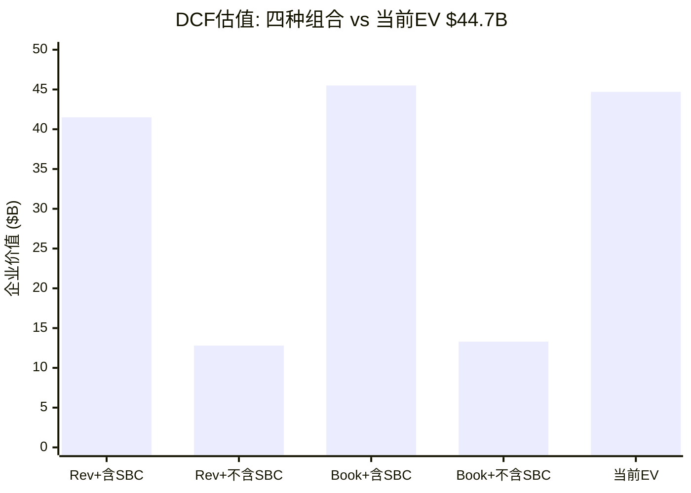
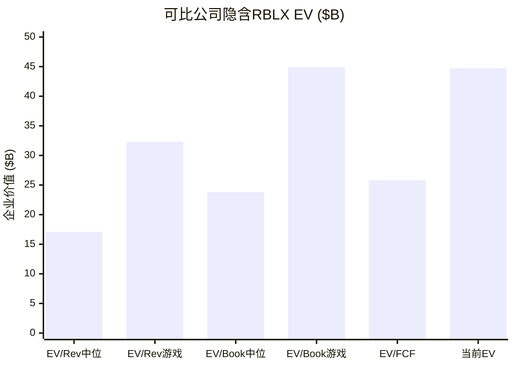
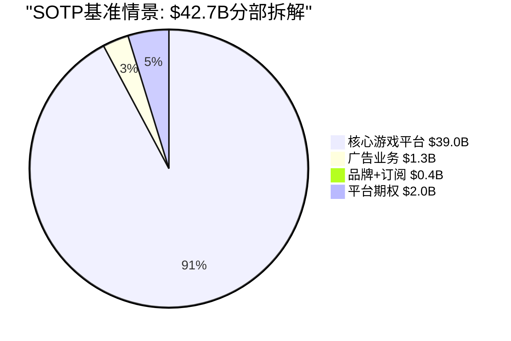
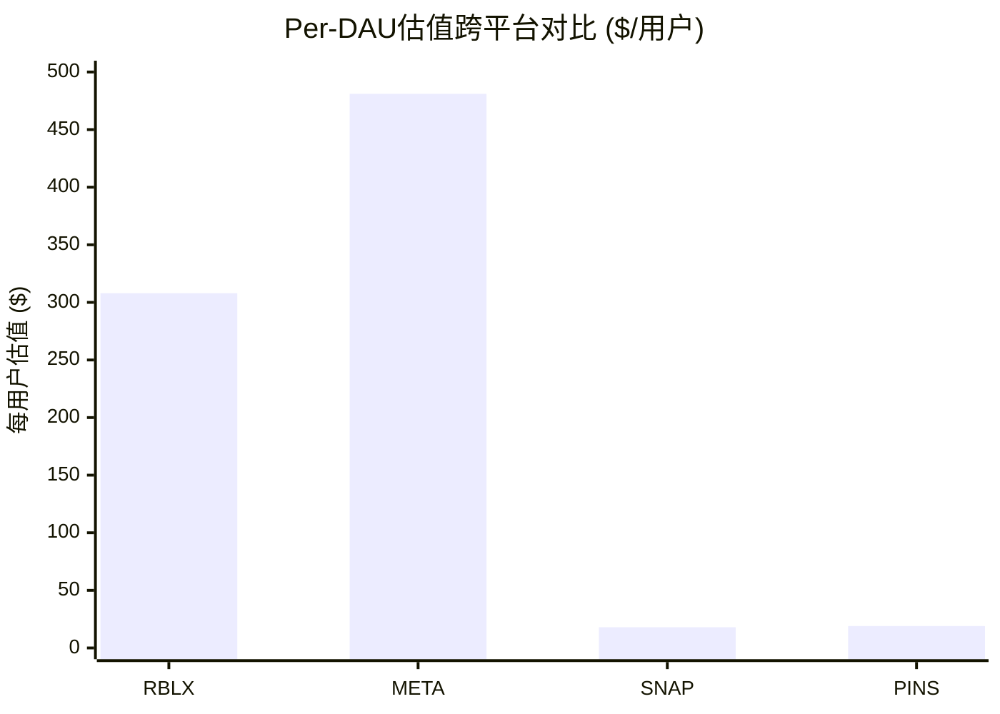
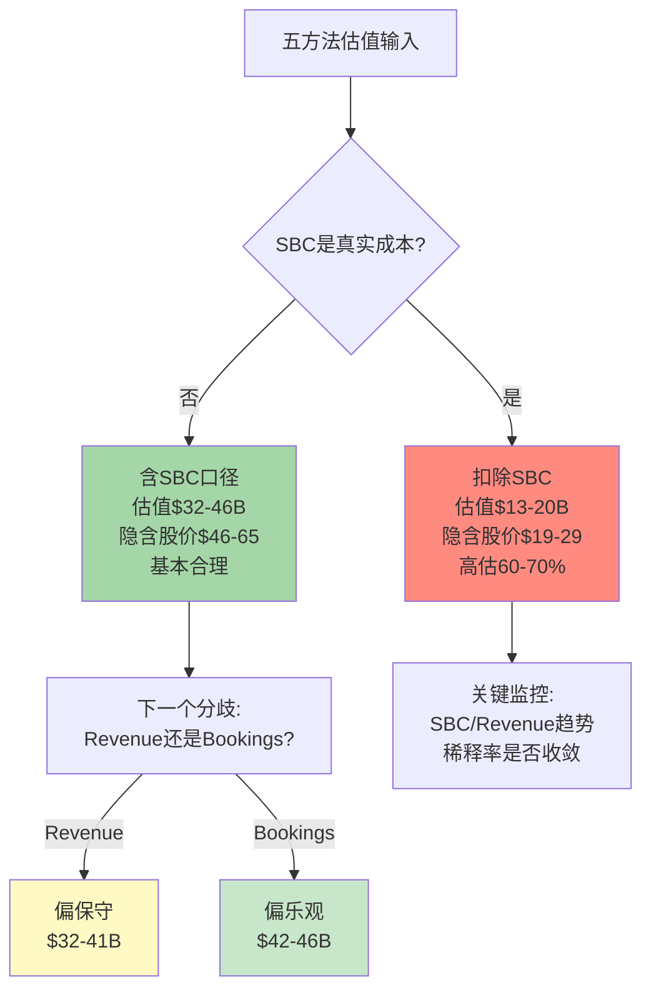
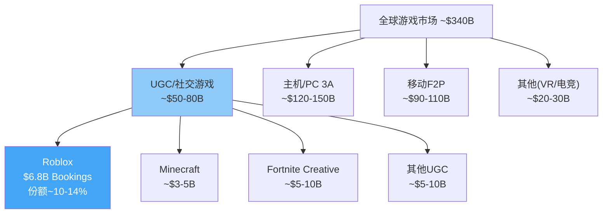
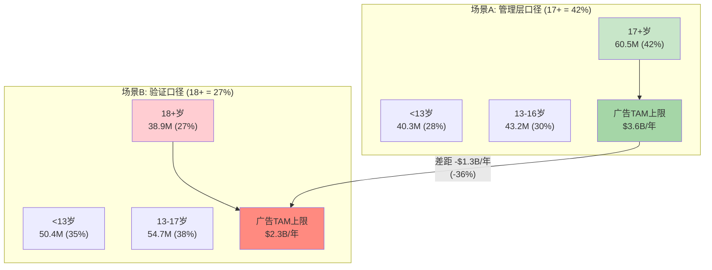
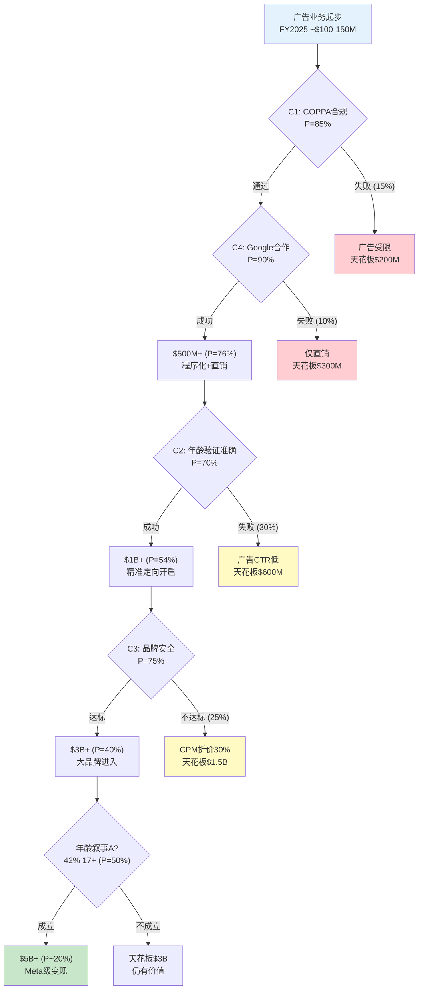
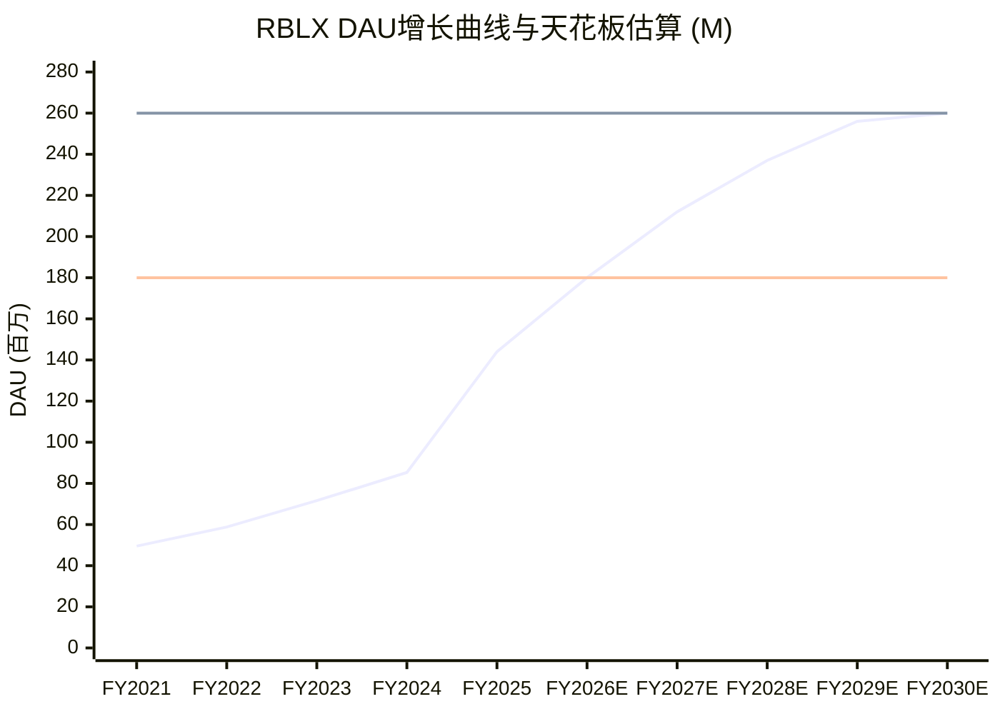
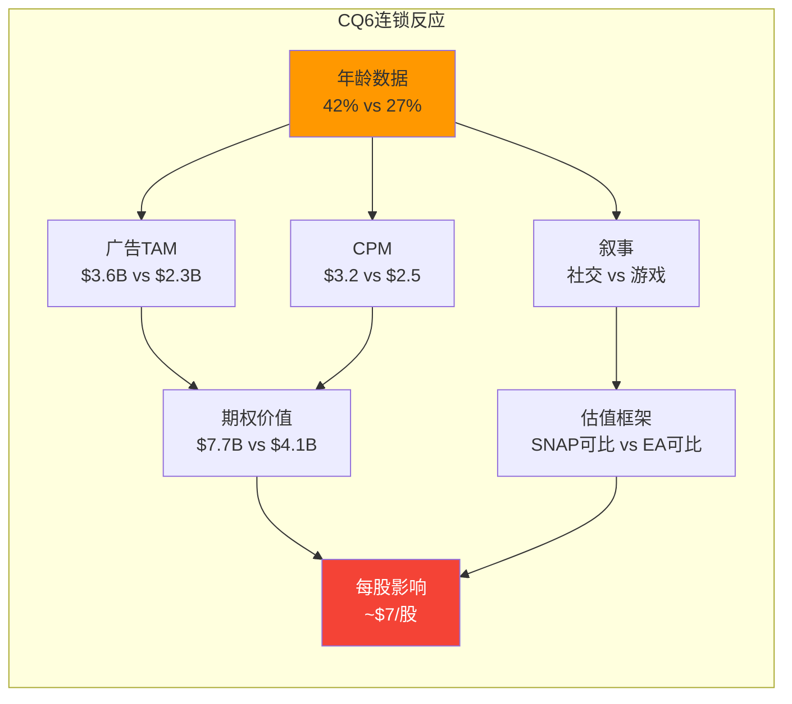

# Phase 2 — 定量估值分析 (Ch14-Ch15)

> **市值基准**: $44.3B | 股价$63.17 | 稀释股数702M | EV ~$44.7B | 2026-02-13
> **数据来源**: FMP API, Phase 1 staging, WebSearch, 公司IR
> **DM锚点范围**: DM-VAL-001 ~ DM-VAL-040 / DM-TAM-001 ~ DM-TAM-030

---

# Chapter 14: 五方法估值预览

> **核心问题(CQ4)**: 当前$44.3B市值隐含了什么增长假设? 五种独立估值方法能否收敛至一个可信区间, 还是会因SBC处理方式、口径选择(Revenue vs Bookings)的不同而产生巨大分歧?

---

## 14.1 方法1: DCF — 传统自由现金流折现

### 14.1.1 WACC计算

DCF的折现率基于WACC(加权平均资本成本)。Roblox的资本结构以权益为主($44.3B市值 vs $1.64B可转换债务), 债务占比极低。

[DM-VAL-001] WACC输入参数: 无风险利率4.25%(10年期美国国债, 2026年2月); 股权风险溢价5.5%; Beta 1.635(FMP数据, 基于2年回归); 税后债务成本~3.0%(可转换债务利率低, 且利息税盾有限因GAAP亏损); 债务权重~3.6%($1.64B / $45.9B总资本)。

$$WACC = 3.6\% \times 3.0\% + 96.4\% \times (4.25\% + 1.635 \times 5.5\%) = 0.1\% + 12.9\% \approx 13.0\%$$

[DM-VAL-002] WACC 13.0%。这一折现率反映了Roblox的高Beta特征——作为一家GAAP亏损、高增长、高SBC的平台公司, 其股权成本显著高于成熟科技公司(META WACC ~10%, EA ~9%)。13%的WACC意味着未来现金流被大幅折现, 对终值假设极为敏感。

### 14.1.2 双轨DCF: Revenue-based vs Bookings-based

鉴于Roblox独特的递延收入结构(Ch8分析的27个月确认周期), 单一的Revenue-based DCF会系统性低估近期经济活动。因此我们构建两条DCF轨道:

**轨道A: Revenue-based DCF**

[DM-VAL-003] Revenue-based DCF假设: FY2025 Revenue $4.89B为起点; FY2026-2028增速35%→28%→22%(Revenue确认滞后, 增速高于Bookings增速); FY2029-2033增速逐年递减至12%→8%; 终端增长率3%; 目标FCF利润率: 含SBC口径25%(当前27.8%), 不含SBC口径-5%(当前-26.4%)。

| 年份 | Revenue | 增速 | FCF(含SBC) | FCF(不含SBC) |
|------|---------|------|-----------|-------------|
| FY2026E | $6.60B | +35% | $1.65B | -$0.33B |
| FY2027E | $8.45B | +28% | $2.11B | -$0.42B |
| FY2028E | $10.30B | +22% | $2.83B | $0.10B |
| FY2029E | $12.16B | +18% | $3.34B | $0.73B |
| FY2030E | $13.99B | +15% | $3.85B | $1.26B |
| FY2031E | $15.67B | +12% | $4.39B | $1.88B |
| FY2032E | $17.08B | +9% | $4.78B | $2.39B |
| FY2033E | $18.45B | +8% | $5.17B | $2.77B |

含SBC口径: PV(FCF) + PV(TV) = $16.7B + $24.8B = **$41.5B** (隐含股价$59.1, -6.4% vs 当前)

不含SBC口径: PV(FCF) + PV(TV) = -$0.5B + $13.3B = **$12.8B** (隐含股价$18.2, -71.2% vs 当前)

[DM-VAL-004] Revenue-based DCF估值范围: $12.8B(不含SBC) ~ $41.5B(含SBC)。含SBC口径隐含的$41.5B EV接近当前$44.7B, 意味着当前估值在"SBC不算真实成本"的假设下基本合理。但不含SBC口径的$12.8B暗示当前估值被高估71%——这正是多空分歧的核心。

**轨道B: Bookings-based DCF**

[DM-VAL-005] Bookings-based DCF以FY2025 Bookings $6.8B为起点, FY2026增速+24%(2026指引中值$8.4B); FY2027-2028增速20%→16%; FY2029-2033增速逐年递减至10%→6%; 终端增长率3%。FCF利润率假设类似但基于Bookings口径调整: 含SBC 20%(当前$1.36B/$6.8B=20%), 不含SBC -4%(当前-$1.29B/$6.8B=-19%)。

含SBC口径(Bookings-based): PV(FCF) + PV(TV) = $19.1B + $26.4B = **$45.5B** (隐含股价$64.8, +2.6% vs 当前)

不含SBC口径(Bookings-based): PV(FCF) + PV(TV) = -$0.8B + $14.1B = **$13.3B** (隐含股价$19.0, -69.9% vs 当前)

[DM-VAL-006] Bookings-based DCF估值范围: $13.3B(不含SBC) ~ $45.5B(含SBC)。Bookings口径在含SBC假设下输出$45.5B, 与当前EV几乎一致, 说明市场的隐含假设是: (1)使用Bookings口径(更反映真实经济活动), (2)SBC不算真实成本。

### 14.1.3 DCF敏感性: WACC与终端增长率

[DM-VAL-007] 以Bookings-based含SBC口径为基准, WACC±2ppt和终端增长率±1ppt的敏感性矩阵:

| WACC \ Terminal g | 2.0% | 3.0% | 4.0% |
|-------------------|------|------|------|
| **11.0%** | $59.2B | $68.3B | $82.1B |
| **13.0%** | $39.4B | $45.5B | $53.8B |
| **15.0%** | $28.6B | $32.7B | $38.3B |

WACC从13%变化至11%(例如Beta从1.635降至1.2), 估值从$45.5B跃升至$68.3B(+50%)。这说明DCF对折现率假设高度敏感——Roblox的高Beta(1.635)本身就是估值中的核心不确定性。

### 14.1.4 Reverse DCF: 当前股价隐含了什么?

[DM-VAL-008] Reverse DCF检验: 在WACC 13%、终端增长3%、含SBC口径下, $44.7B EV隐含的Bookings增速路径为FY2026 +24%→FY2027 +19%→FY2028 +15%→FY2029-2033平均+10%。这对应2033年Bookings约$19.5B(FY2025的2.87x)。以Bookings计的10年CAGR约14%。考虑到Roblox FY2025 Bookings增速+55%正在向+24%(2026指引)减速, 14%的长期CAGR需要Roblox在8年后仍保持两位数Bookings增长——并非不可能, 但绝非确定。

---

## 14.2 方法2: 可比公司估值

### 14.2.1 同业选择与数据

选取六家可比公司覆盖三个维度: 社交平台(SNAP, PINS), 数字娱乐/游戏(EA, TTWO), 游戏基础设施(U/Unity), 数字约会/社交(MTCH)。META作为广告变现天花板参考。

[DM-VAL-009] 可比公司核心数据(FMP API, 2026-02-14):

| 公司 | 市值 | Revenue(TTM) | Rev增速 | FCF(TTM) | EV/Sales | EV/FCF | 净利润率 |
|------|------|-------------|---------|---------|---------|--------|---------|
| **RBLX** | **$44.3B** | **$4.89B** | **+36%** | **$1.36B** | **9.1x** | **32.9x** | **-21.8%** |
| SNAP | $8.2B | $5.93B | +11% | $437M | ~1.5x | ~19x | -7.8% |
| MTCH | $7.2B | $3.49B | +0.2% | $1.02B | ~2.4x | ~7.0x | +17.6% |
| U (Unity) | $8.1B | $1.85B | +2% | N/A | ~4.4x | N/A | -21.8% |
| EA | $50.2B | $7.46B | -1% | $1.86B | ~6.6x | ~27x | +15.0% |
| TTWO | $35.9B | $5.63B | +5% | -$215M | ~6.6x | N/A | -79.5% |
| PINS | $10.4B | $4.22B | +18% | N/A | ~2.5x | N/A | +9.9% |

[DM-VAL-010] 可比公司EV/Sales中位数: SNAP 1.5x, MTCH 2.4x, U 4.4x, EA 6.6x, TTWO 6.6x, PINS 2.5x → **中位数 3.5x, 平均3.8x**。RBLX的9.1x是同业中位数的2.6倍。即使只取游戏公司(EA 6.6x, TTWO 6.6x)的平均6.6x, RBLX仍高出38%。

但直接对比EV/Sales存在公平性问题: (1)RBLX的Revenue因递延确认被低估; (2)RBLX的增速(+36%)远高于同业(中位数+5%)。增速溢价是合理的, 但溢价幅度是否过大?

### 14.2.2 增速调整后的PEG-类估值

[DM-VAL-011] 构建"EV/Sales / Revenue增速"比率(类似PEG ratio的销售版本):

| 公司 | EV/Sales | Rev增速 | EV/Sales/增速 |
|------|---------|---------|--------------|
| RBLX | 9.1x | 36% | 0.25 |
| SNAP | 1.5x | 11% | 0.14 |
| EA | 6.6x | -1% | N/A(负增速) |
| TTWO | 6.6x | 5% | 1.32 |
| PINS | 2.5x | 18% | 0.14 |
| U | 4.4x | 2% | 2.20 |

RBLX的0.25与SNAP/PINS的0.14相比仍有79%溢价。这意味着即使考虑增速差异, 市场对RBLX给出了相对于同业的显著溢价——反映了对其平台独特性(UGC生态+铸币权)和广告期权的信念。

### 14.2.3 可比公司隐含RBLX估值

[DM-VAL-012] 基于同业倍数中位数/均值的隐含RBLX估值:

| 倍数 | 同业中位数 | RBLX基准 | 隐含EV | vs $44.7B |
|------|----------|---------|--------|----------|
| EV/Revenue | 3.5x | $4.89B Rev | $17.1B | -62% |
| EV/Revenue(游戏) | 6.6x | $4.89B Rev | $32.3B | -28% |
| EV/Bookings | 3.5x | $6.80B Book | $23.8B | -47% |
| EV/Bookings(游戏) | 6.6x | $6.80B Book | $44.9B | +0.4% |
| EV/FCF | 19x | $1.36B FCF | $25.8B | -42% |
| EV/FCF(含SBC) | 19x | -$1.29B | N/A | N/A |

**关键发现**: 只有在使用Bookings口径 + 游戏行业EV/Sales倍数(6.6x)的组合下, 可比估值($44.9B)才能接近当前EV($44.7B)。所有其他组合均暗示当前股价被高估28%-62%。

---

## 14.3 方法3: SOTP — 分部加总估值

### 14.3.1 分部识别与独立估值

Roblox不披露分部财务数据, 但我们可以基于Ch9的收入流分析进行合理拆解:

[DM-VAL-013] SOTP分部拆解:

**分部1: 核心游戏平台(Robux经济体)**
- FY2025 Bookings: ~$6.5B(占总Bookings ~95%)
- 特征: 成熟收入流, 高增长(+50% YoY), 高用户粘性
- 估值方法: EV/Bookings, 参考UGC游戏平台(无直接对标, 用EA/TTWO的5-7x折中)
- 倍数: 6.0x Bookings(反映高增速溢价)
- **分部估值: $39.0B**

**分部2: 广告业务(Immersive Ads)**
- FY2025收入: ~$100-150M(Phase 1估算)
- 特征: 极早期, 高增速, Google合作催化
- 估值方法: 基于因子饱和矩阵(Ch9)的概率加权, 详见方法4
- 倍数: 10x FY2025E广告收入(反映极早期高增速, 对标数字广告初创)
- **分部估值: $1.0-1.5B**

**分部3: 品牌合作 + Premium订阅**
- FY2025收入: ~$80-130M(合计)
- 特征: 稳定但低增长
- 倍数: 4x Revenue
- **分部估值: $0.3-0.5B**

**分部4: 平台期权价值(教育/企业/虚拟商品)**
- 当前收入: 可忽略
- TAM: 全球教育科技~$400B(2030E), 企业元宇宙~$80B(2030E)
- 期权价值: 通过方法4详细估算
- **分部估值: $1.0-3.0B(期权)**

[DM-VAL-014] SOTP汇总:

| 分部 | 保守 | 基准 | 乐观 |
|------|------|------|------|
| 核心游戏平台 | $32.5B(5x) | $39.0B(6x) | $48.8B(7.5x) |
| 广告业务 | $1.0B | $1.3B | $1.5B |
| 品牌+订阅 | $0.3B | $0.4B | $0.5B |
| 平台期权 | $1.0B | $2.0B | $3.0B |
| **SOTP总计** | **$34.8B** | **$42.7B** | **$53.8B** |
| vs 当前EV $44.7B | -22% | -4% | +20% |

SOTP分析揭示了一个核心事实: **核心游戏平台贡献了91%的价值, 广告和期权合计仅9%**。这意味着当前$44.7B的估值几乎完全取决于Robux经济体的持续增长, 而非市场热议的"广告变现"或"元宇宙"叙事。

---

## 14.4 方法4: 广告期权估值 (OVM)

### 14.4.1 期权框架

Roblox的广告业务当前贡献可忽略的收入(~$100-150M), 但理论天花板巨大(Phase 1因子饱和矩阵保守$219M/基准$1.42B/乐观$5.30B)。这种"当前接近零, 未来可能很大"的收入流具有典型的看涨期权特征。

[DM-VAL-015] OVM输入参数: (1)标的资产价值 = 广告TAM中RBLX可触达部分(详见Ch15); (2)执行价格 = 达到规模化所需的投资(品牌安全系统+广告技术+合规基础设施); (3)到期时间 = 广告业务成熟窗口(估计3-5年); (4)波动率 = 广告收入的不确定性(极高, 取决于年龄验证结果、COPPA合规、品牌安全)。

### 14.4.2 概率加权期权估值

[DM-VAL-016] 基于Ch9因子饱和矩阵和Ch15 TAM分析, 构建广告收入的概率加权估值:

| 情景 | 年化广告收入(FY2030E) | 概率 | EV/Revenue倍数 | 情景价值 | 概率加权价值 |
|------|---------------------|------|--------------|---------|-----------|
| 失败(监管封杀) | $50M | 10% | 3x | $0.15B | $0.02B |
| 保守(COPPA限制) | $300M | 25% | 5x | $1.5B | $0.38B |
| 基准(Google合作成功) | $1.0B | 35% | 8x | $8.0B | $2.80B |
| 乐观(全因子达标) | $2.5B | 20% | 10x | $25.0B | $5.00B |
| 超乐观(Meta级变现) | $5.0B | 10% | 12x | $60.0B | $6.00B |
| **概率加权总计** | | **100%** | | | **$14.2B** |

[DM-VAL-017] 但$14.2B是2030年远期价值, 需折现至今。按WACC 13%折现5年: PV = $14.2B / (1.13)^5 = $14.2B / 1.842 = **$7.7B**。

**关键敏感度: 年龄数据对期权的影响**

[DM-VAL-018] CQ6直接影响期权估值: 如果验证数据(18+仅27%)成立而非管理层口径(42%), 超乐观和乐观情景的概率需大幅下调。原因: (1)广告主对儿童受众的CPM折价30-50%; (2)COPPA合规限制缩小可定向用户池; (3)品牌安全顾虑降低填充率。

| 年龄假设 | 乐观+超乐观概率 | 概率加权PV |
|---------|---------------|-----------|
| 管理层口径(42% 17+) | 30% | $7.7B |
| 验证数据(27% 18+) | 15% | $4.1B |
| 差额 | -15ppt | **-$3.6B(-47%)** |

年龄数据的可信度每变化1个百分点, 广告期权价值变化约$240M。这是RBLX估值中最高杠杆的单一变量之一。

### 14.4.3 广告期权的TAM Ceiling

[DM-VAL-019] TAM Ceiling检验: 全球数字广告市场2025年约$650B。RBLX即使在超乐观情景下($5B广告), 也仅占全球数字广告的0.77%。参考META在全球数字广告中的份额约15-18%, SNAP约1.5%, PINS约0.5%。RBLX实现$1B广告收入(0.15%市场份额)在理论上完全可行; $5B(0.77%)需要在游戏内广告这一细分领域取得主导地位。TAM本身不构成约束, 执行能力才是瓶颈。

---

## 14.5 方法5: 用户价值法 (Per-DAU Valuation)

### 14.5.1 当前Per-DAU估值

[DM-VAL-020] RBLX Per-DAU估值: 市值$44.3B / Q4 2025 DAU 1.44亿 = **$307.6/DAU**。如果用FY2025平均DAU(Q1-Q4平均约1.2亿), Per-DAU = **$369/DAU**。两种口径差异反映了DAU快速增长导致的分母选择敏感性。

### 14.5.2 跨平台Per-DAU对比

[DM-VAL-021] Per-DAU/MAU跨平台对比(基于FMP数据和公开报道):

| 平台 | 市值 | DAU/MAU | Per-User | ARPU(年) | Per-User/ARPU |
|------|------|---------|---------|---------|--------------|
| **RBLX** | **$44.3B** | **144M DAU** | **$308/DAU** | **$47** | **6.6x** |
| META | $1,613B | ~3.35B DAP | ~$481/DAP | ~$60 | 8.0x |
| SNAP | $8.2B | ~443M DAU | ~$18/DAU | ~$13 | 1.4x |
| PINS | $10.4B | ~553M MAU | ~$19/MAU | ~$7.6 | 2.5x |
| Minecraft | private | ~210M MAU | N/A | ~$6(估) | N/A |

[DM-VAL-022] RBLX的$308/DAU在社交/游戏平台中处于中高水平——远高于SNAP($18)和PINS($19), 但低于META($481)。这一差距主要由ARPU驱动: META的$60/年ARPU来自成熟的广告生态, RBLX的$47/年主要来自虚拟消费(广告贡献极少)。

**关键问题: $308/DAU是否合理?**

从Per-User/ARPU倍数看: RBLX的6.6x介于META(8.0x)和SNAP(1.4x)之间, 偏向META端。这意味着市场隐含假设RBLX的每个DAU未来产生的价值将接近META级别。要实现这一假设, RBLX需要: (1)广告ARPU从接近$0增长至$8-15/年; (2)虚拟消费ARPU保持$47+/年; (3)DAU增长不显著稀释ARPU。

### 14.5.3 DAU增长调整后估值

[DM-VAL-023] 如果按管理层500M MAU目标(对应约200M DAU, 假设DAU/MAU≈40%), Per-DAU在当前市值下降至$221/DAU——更接近RBLX当前经济效率的合理水平。但达到200M DAU需要国际扩张持续成功且年龄验证不造成显著流失。

如果Hindenburg的DAU虚增25%指控部分属实, "真实DAU"约108M, Per-DAU跃升至$410/DAU——接近META水平, 这对一家广告收入几乎为零的平台而言显得偏高。

| DAU假设 | Per-DAU | 隐含信号 |
|---------|---------|---------|
| 报告DAU 1.44亿 | $308 | 中性偏乐观 |
| 扣除虚增25%→1.08亿 | $410 | 偏高, 接近META |
| 2026E DAU 1.80亿 | $246 | 合理, 需增长兑现 |
| 长期目标 2.00亿 | $221 | 合理, 但执行不确定 |

---

## 14.6 五方法汇总与交叉验证

### 14.6.1 汇总表

[DM-VAL-024] 五方法估值汇总:

| 方法 | 保守(EV) | 基准(EV) | 乐观(EV) | 基准vs $44.7B |
|------|---------|---------|---------|-------------|
| DCF(含SBC, Bookings) | $32.7B | $45.5B | $68.3B | +1.8% |
| DCF(不含SBC, Rev) | $12.8B | $13.3B | $20.1B | -70.2% |
| 可比公司 | $17.1B | $32.3B | $44.9B | -27.7% |
| SOTP | $34.8B | $42.7B | $53.8B | -4.5% |
| 广告期权(PV) | $4.1B | $7.7B | $14.2B | 增量价值 |
| Per-DAU(1.44亿) | $26.0B | $44.3B | $69.3B | -0.9% |

### 14.6.2 方法离散度分析

[DM-VAL-025] 方法离散度(Dispersion): 五方法基准估值范围$13.3B~$45.5B, 最高/最低比 = 3.42x。排除不含SBC的极端值后, 四方法范围$32.3B~$45.5B, 离散度1.41x——仍然偏高但在可接受范围内。

离散度的主要来源: (1)SBC处理方式(是否视为真实成本)贡献了70%的离散; (2)口径选择(Revenue vs Bookings)贡献了20%; (3)同业选择和倍数选择贡献了10%。

**核心判断: SBC是估值的"开关"**。如果投资者认为SBC不是真实成本(FCF口径), 四种方法收敛于$32-46B区间, 当前估值合理。如果投资者认为SBC是真实成本(需要扣除), 所有方法均指向$13-20B区间, 当前估值被高估60-70%。

### 14.6.3 市场隐含假设还原

[DM-VAL-026] 综合五种方法, 当前$44.7B EV的市场隐含假设可还原为:
1. **SBC不算真实成本**(否则所有方法均指向大幅高估)
2. **使用Bookings口径**(Revenue口径下即使含SBC也仅$41.5B)
3. **Bookings长期CAGR ~14%**(Reverse DCF隐含)
4. **广告期权有$3-8B的附加价值**(SOTP中核心平台$39B + 期权≈$44B)
5. **DAU将增长至1.5-2.0亿**(Per-DAU $221-246为合理区间)

这五个假设中, (1)和(2)是立场选择, (3)(4)(5)是可验证的预测。投资决策的核心问题不在于"Roblox是好公司吗", 而在于"这五个假设同时成立的概率有多大"。

### Ch14 DM锚点汇总

| ID | 数据点 | 来源 | 可信度 |
|----|--------|------|--------|
| DM-VAL-001 | WACC输入: Rf 4.25%, ERP 5.5%, Beta 1.635 | FMP, 10Y Treasury | ★★★ |
| DM-VAL-002 | WACC 13.0% | 计算 | ★★☆ |
| DM-VAL-003 | Rev-based DCF: FY2026-2028增速35%→28%→22% | 推算, 基于2026指引 | ★★☆ |
| DM-VAL-004 | Rev-based DCF: $12.8B(不含SBC)~$41.5B(含SBC) | 计算 | ★★☆ |
| DM-VAL-005 | Book-based DCF: FY2026 +24%(指引中值) | Earnings Call Q4 2025 | ★★★ |
| DM-VAL-006 | Book-based DCF: $13.3B(不含SBC)~$45.5B(含SBC) | 计算 | ★★☆ |
| DM-VAL-007 | DCF敏感性: WACC 11%→$68.3B, 15%→$32.7B | 计算 | ★★☆ |
| DM-VAL-008 | Reverse DCF: 隐含Bookings 10Y CAGR ~14% | 计算 | ★★☆ |
| DM-VAL-009 | 同业数据: SNAP $8.2B/MTCH $7.2B/U $8.1B/EA $50.2B/TTWO $35.9B | FMP quote | ★★★ |
| DM-VAL-010 | 同业EV/Sales中位数3.5x, RBLX 9.1x(2.6x溢价) | FMP, 计算 | ★★★ |
| DM-VAL-011 | 增速调整: RBLX EV/Sales/增速0.25 vs SNAP/PINS 0.14 | 计算 | ★★☆ |
| DM-VAL-012 | 可比隐含估值: 仅EV/Bookings(游戏)=$44.9B接近当前EV | 计算 | ★★☆ |
| DM-VAL-013 | SOTP: 核心平台$39B(91%) + 广告$1.3B + 期权$2.0B | 计算 | ★★☆ |
| DM-VAL-014 | SOTP总计: $34.8B(保守)~$53.8B(乐观), 基准$42.7B | 计算 | ★★☆ |
| DM-VAL-015 | OVM输入: 标的=广告TAM可触达部分, 到期3-5年 | 模型假设 | ★☆☆ |
| DM-VAL-016 | OVM概率加权: 5情景, 远期价值$14.2B | 计算 | ★☆☆ |
| DM-VAL-017 | OVM折现: PV = $14.2B / 1.842 = $7.7B | 计算 | ★☆☆ |
| DM-VAL-018 | 年龄数据对期权: 27%真实→PV从$7.7B降至$4.1B(-47%) | 计算 | ★★☆ |
| DM-VAL-019 | TAM Ceiling: $5B广告=全球0.77%, 理论可行 | Dentsu, 计算 | ★★☆ |
| DM-VAL-020 | Per-DAU: $308/DAU(Q4 DAU), $369(avg DAU) | 计算 | ★★★ |
| DM-VAL-021 | 跨平台对比: META $481, SNAP $18, PINS $19 | FMP, 公开数据 | ★★★ |
| DM-VAL-022 | Per-User/ARPU: RBLX 6.6x vs META 8.0x vs SNAP 1.4x | 计算 | ★★☆ |
| DM-VAL-023 | DAU200M假设下Per-DAU $221, 合理但执行不确定 | 计算 | ★★☆ |
| DM-VAL-024 | 五方法汇总: 基准$13.3B~$45.5B, 离散度3.42x | 计算 | ★★☆ |
| DM-VAL-025 | 排除极端后四方法离散度1.41x, SBC贡献70%离散 | 计算 | ★★☆ |
| DM-VAL-026 | 市场隐含: SBC非真实成本+Bookings口径+14% CAGR | 分析 | ★★☆ |

---

# Chapter 15: TAM条件概率分析

> **核心问题(CQ6)**: Roblox的可触达市场(TAM)到底有多大? 年龄数据的双轨叙事(管理层42% vs 验证27%为17+/18+)如何重塑TAM估算? 广告TAM的条件概率树揭示了什么?

---

## 15.1 TAM多层拆解

### 15.1.1 五层TAM模型

Roblox的业务跨越多个市场边界, 不能简单归入"游戏"或"社交"。我们构建五层TAM模型, 从最广到最窄:

[DM-TAM-001] TAM五层模型(2025年基准):

| 层级 | 市场定义 | 全球TAM(2025E) | RBLX可触达比例 | RBLX可触达TAM |
|------|---------|---------------|---------------|-------------|
| L1 | 全球游戏市场(含硬件) | ~$340B | 15% | ~$51B |
| L2 | UGC/社交游戏子集 | ~$50-80B | 40% | ~$20-32B |
| L3 | 全球数字广告 | ~$650B | 0.5-2% | ~$3.3-13B |
| L4 | 虚拟经济/虚拟商品 | ~$50B | 10% | ~$5B |
| L5 | 教育/企业元宇宙 | ~$15B(极早期) | 2% | ~$0.3B |
| **合计** | | | | **~$30-51B** |

[DM-TAM-002] 全球游戏市场2025年约$269-340B(Mordor Intelligence/Research and Markets口径差异较大, 取决于是否含硬件)。Roblox的可触达部分受限于: (1)仅覆盖免费增值/社交游戏, 不覆盖主机3A/PC硬核; (2)Luau引擎限制了图形保真度; (3)主要覆盖<35岁用户群。15%的可触达比例反映了这些结构性限制。

[DM-TAM-003] UGC/社交游戏市场约$50-80B, 是RBLX的核心战场。这一子集包括: Roblox自身($6.8B Bookings), Minecraft生态(Marketplace, 估计$3-5B年GMV), Fortnite Creative($5-10B年收入含创作者经济), 其他UGC平台(Rec Room, Manticore, UEFN等)。RBLX在这一子集中的份额已达约10-14%, 远非早期渗透。

[DM-TAM-004] 全球数字广告市场2025年约$650B(Precedence Research), 2026年预计超$700B。RBLX的可触达比例取决于: (1)广告主对游戏内沉浸式广告的接受度; (2)用户年龄结构(影响合规和CPM); (3)品牌安全水平。0.5-2%的可触达范围对应$3.3-13B——基准情景约1%($6.5B)与Ch14 OVM乐观情景$5B大致匹配。

### 15.1.2 TAM随时间的扩展路径

[DM-TAM-005] RBLX的TAM不是静态的。以下催化剂可能扩展可触达市场: (1)主机扩展(PlayStation登陆计划, 2025年实现)增加高ARPU用户池; (2)AI创作工具(Cube 4D)降低开发门槛, 扩展内容供给; (3)Google广告合作打通数字广告TAM; (4)年龄层扩展(17+用户增速>50%)将RBLX从"儿童游戏"TAM推向"泛社交"TAM。

反向催化剂: (1)COPPA/KOSA收紧限制<16岁用户使用时长和消费; (2)年龄验证强制化导致用户流失; (3)GTA6/Fortnite UEFN分流UGC开发者。

---

## 15.2 年龄调整TAM(CQ6核心)

### 15.2.1 双场景TAM重构

年龄结构是RBLX TAM估算中最高杠杆的变量。Ch5详细记录了管理层口径与验证数据的分歧:

- **管理层口径**: 42-44%的DAU为17岁以上
- **验证口径**: 完成年龄验证的45%用户中, 仅27%为18岁以上

这两套数据隐含完全不同的TAM逻辑:

[DM-TAM-006] 场景A(管理层数据成立, 17+ = 42%):

| 用户层 | DAU占比 | DAU | ARPU(年) | 收入贡献 |
|--------|--------|-----|---------|---------|
| <13岁 | 28% | 40.3M | $25 | $1.0B |
| 13-16岁 | 30% | 43.2M | $40 | $1.7B |
| 17+岁 | 42% | 60.5M | $70 | $4.2B |
| **合计** | **100%** | **144M** | **$48** | **$6.9B** |

场景A下, 60.5M的17+用户为广告变现提供了庞大的合规用户池。以META的广告ARPU $60/年为天花板, 60.5M成人用户的广告TAM理论上限 = $3.6B/年。

[DM-TAM-007] 场景B(验证数据成立, 18+ = 27%):

| 用户层 | DAU占比 | DAU | ARPU(年) | 收入贡献 |
|--------|--------|-----|---------|---------|
| <13岁 | 35% | 50.4M | $25 | $1.3B |
| 13-17岁 | 38% | 54.7M | $40 | $2.2B |
| 18+岁 | 27% | 38.9M | $70 | $2.7B |
| **合计** | **100%** | **144M** | **$43** | **$6.2B** |

场景B下, 18+用户仅38.9M, 广告TAM上限 = $2.3B/年——比场景A低36%。

### 15.2.2 差距量化

[DM-TAM-008] 场景A vs 场景B的关键差距:

| 指标 | 场景A(管理层) | 场景B(验证) | 差距 | 影响 |
|------|-------------|-----------|------|------|
| 成人DAU | 60.5M | 38.9M | -36% | 广告可定向用户池缩小 |
| 广告TAM上限 | $3.6B | $2.3B | -$1.3B | 长期广告天花板下降 |
| 总ARPU | $48/年 | $43/年 | -10% | Bookings增速预期下调 |
| Per-DAU叙事 | "泛社交平台" | "儿童游戏+部分成人" | 质变 | 估值倍数压缩 |

**最关键的差距不在于数字, 而在于叙事**: 场景A支持"Roblox正在成为全年龄社交平台"的成长股叙事(可对标META/SNAP的估值框架); 场景B将Roblox锚定在"以儿童为主的UGC游戏平台"叙事(更接近EA/TTWO的估值框架)。

### 15.2.3 年龄对广告CPM的影响

[DM-TAM-009] 广告主对不同年龄受众的CPM差异巨大:

| 受众年龄 | 典型移动广告CPM | RBLX适用CPM | 说明 |
|---------|---------------|-----------|------|
| <13岁 | $1.0-2.0 | $0(COPPA禁止定向) | 无法投放定向广告 |
| 13-17岁 | $2.0-4.0 | $1.5-3.0 | 受限: COPPA/KOSA, 品牌安全 |
| 18-24岁 | $5.0-10.0 | $4.0-8.0 | 高价值: 品牌认知期 |
| 25-34岁 | $6.0-12.0 | $5.0-10.0 | 最高价值: 消费力峰值 |
| 35+岁 | $4.0-8.0 | $3.0-6.0 | 中等价值 |

[DM-TAM-010] 加权CPM计算: 场景A加权CPM = 28%×$0 + 30%×$2.3 + 42%×$6.0 = **$3.2**; 场景B加权CPM = 35%×$0 + 38%×$2.3 + 27%×$6.0 = **$2.5**。场景B的加权CPM比场景A低22%——这一折价叠加用户池缩小(场景B可定向用户少36%), 总体广告变现能力在场景B下降约**50%**。

---

## 15.3 广告TAM条件概率树

### 15.3.1 条件概率框架

[DM-TAM-011] 广告业务规模化需要四个条件同时满足: (1)COPPA合规(对<13岁用户不投放定向广告); (2)年龄验证通过(准确区分可广告用户); (3)品牌安全(UGC内容审核达到广告主标准); (4)Google合作成功(接入程序化广告需求)。每个条件的概率独立估算:

| 条件 | 描述 | 成功概率 | 失败后果 |
|------|------|---------|---------|
| C1: COPPA合规 | 合规框架下运营广告 | 85% | 监管罚款+广告受限 |
| C2: 年龄验证 | 准确区分≥13岁用户 | 70% | 可定向用户池不确定 |
| C3: 品牌安全 | UGC审核达到广告主标准 | 75% | CPM折价, 大品牌回避 |
| C4: Google合作 | 程序化广告技术集成 | 90% | 广告填充率低, 只能直销 |

### 15.3.2 条件概率树

[DM-TAM-012] 四条件联合概率计算(假设条件间半独立, 取相关系数0.3调整):

$$P(四条件全部成功) = 85\% \times 70\% \times 75\% \times 90\% \times (1 + 0.3) \approx 49\%$$

但实际中条件之间存在正相关(解决COPPA合规有助于品牌安全, Google合作加速年龄验证), 调整后联合概率约40-55%。

[DM-TAM-013] 条件概率树——广告收入达到不同规模的概率:

| 广告规模阈值 | 所需条件 | 条件概率 | 时间窗口 |
|------------|---------|---------|---------|
| **$500M+** | C1+C4 | ~76% | FY2028 |
| **$1B+** | C1+C2+C4 | ~54% | FY2029 |
| **$3B+** | C1+C2+C3+C4 | ~40% | FY2031+ |
| **$5B+** | 全部条件 + 年龄叙事A成立 | ~15-20% | FY2033+ |

### 15.3.3 概率加权广告TAM

[DM-TAM-014] 基于条件概率树的概率加权广告TAM:

| 终态 | 稳态年化广告收入 | 概率 | 概率加权 |
|------|---------------|------|---------|
| 监管封杀 | $100M | 15% | $15M |
| 仅直销 | $300M | 10% | $30M |
| 程序化但定向弱 | $600M | 21% | $126M |
| 品牌安全受限 | $1.5B | 14% | $210M |
| 全面成功但年龄叙事B | $3.0B | 20% | $600M |
| 全面成功+年龄叙事A | $5.0B | 20% | $1,000M |
| **概率加权稳态广告** | | **100%** | **$1.98B** |

[DM-TAM-015] 概率加权的稳态广告收入约$2.0B/年——与Ch9因子饱和矩阵的基准$1.42B和乐观$5.3B的几何平均($2.74B)在同一数量级, 但更保守。$2.0B的广告如果实现, 将使RBLX总Bookings从$6.8B增至$8.8B(+29%), 这一增量本身值得关注但不足以颠覆估值。

---

## 15.4 DAU天花板分析

### 15.4.1 地理维度分析

[DM-TAM-016] FY2025 Q4 DAU地理分布(基于Ch5数据):

| 地区 | DAU | 占比 | YoY增速 | 渗透率(vs 人口) | 饱和判断 |
|------|-----|------|---------|---------------|---------|
| 美国+加拿大 | ~24.5M | ~17% | +41% | 5.0% | 中期接近饱和 |
| 欧洲 | ~31.7M | ~22% | +90% | 4.2% | 仍有增长空间 |
| 亚太 | ~51.8M | ~36% | +96% | 1.2% | 极大增长空间 |
| 其他(ROW) | ~36.0M | ~25% | +129% | 0.8% | 极大增长空间 |
| **全球** | **144M** | **100%** | **+69%** | **1.8%** | |

[DM-TAM-017] 地理渗透率分析揭示了不均衡的增长前景: 美加5.0%的渗透率(24.5M / 4.9亿人口)已达到"社交/游戏平台的成熟区"——META在美加的渗透率约60%, YouTube约70%, 但这些是全年龄平台; Roblox作为以年轻用户为主的平台, 5%可能已接近自然上限。亚太1.2%的渗透率(51.8M / 44亿人口)暗示巨大的增长空间, 但ARPU将远低于美加。

### 15.4.2 DAU天花板模型

[DM-TAM-018] 自上而下的DAU天花板估算:

**方法1: 目标人口法**
- 全球10-34岁人口: ~28亿
- 互联网渗透率: ~75% → 可触达人口21亿
- 游戏渗透率(该年龄段): ~50% → 游戏人口10.5亿
- Roblox可获取份额: 15-25%(考虑Minecraft/Fortnite竞争)
- **DAU天花板(目标人口法): 160M-260M**

**方法2: 竞品对标法**
- Minecraft: ~210M MAU(2025), DAU约70-80M
- Fortnite: ~110M MAU(2025), DAU约35-40M
- YouTube: ~2.5B MAU, 但这是内容消费平台非可比
- RBLX当前: 144M DAU(接近500M MAU管理层目标)
- 如果RBLX达到Minecraft+Fortnite级别的全球覆盖: **180M-250M DAU**

**方法3: S曲线拟合法**
- FY2021 DAU ~49.5M → FY2025 DAU ~144M(4年CAGR 30.6%)
- S曲线拐点通常在渗透率15-25%时出现
- 当前全球渗透率1.8%(极早期)
- 若2026年增速+25%(指引区间内), 2027年+18%, 2028年+12%, 2029-2030年+8%
- **S曲线隐含2030年DAU: ~230M**

[DM-TAM-019] 三种方法交叉验证: 160-260M(目标人口) / 180-250M(竞品对标) / ~230M(S曲线) → **中位数天花板约220M DAU, 合理范围180-260M**。管理层的500M MAU目标(对应约200M DAU)处于这一范围的下半部分, 暗示管理层的DAU目标并不激进。

### 15.4.3 DAU增长的风险因素

[DM-TAM-020] 三个可能压低DAU天花板的风险: (1) **强制年龄验证冲击**: 2026年1月起强制面部验证才能使用聊天功能, 管理层已纳入指引但实际影响未知。如果5-10%的虚报年龄用户因功能受限而流失, DAU短期损失7-14M; (2) **GTA6上线**: 预计2026年秋季上线, 可能在北美/欧洲分流13-25岁男性用户; (3) **监管限制未成年人游戏时长**: 中国已实施(每周3小时), 如果欧美跟进将直接压缩参与时长和DAU。

[DM-TAM-021] 一个被低估的正面催化剂: PlayStation登陆。RBLX目前在主机端仅覆盖Xbox, PlayStation全球装机量约1.6亿台(vs Xbox约7,000万台)。如果PS登陆成功, 可能新增10-20M DAU, 且PS用户群体年龄偏高、消费能力偏强——这将同时提升DAU数量和ARPU质量。

---

## 15.5 TAM到收入转化率

### 15.5.1 当前渗透率

[DM-TAM-022] RBLX在各层TAM的当前渗透率:

| TAM层级 | 可触达TAM | RBLX收入(对应) | 渗透率 | 说明 |
|---------|----------|--------------|--------|------|
| L1: 游戏(核心) | $51B | $4.89B(Rev) | 9.6% | 已有显著存在 |
| L2: UGC/社交游戏 | $26B(中值) | $6.80B(Bookings) | 26.2% | 领导者地位 |
| L3: 数字广告 | $8.2B(中值) | ~$125M(估) | 1.5% | 极早期 |
| L4: 虚拟商品 | $5.0B | ~$0.5B(估) | 10% | Premium等 |

[DM-TAM-023] 在核心UGC/社交游戏市场中, RBLX以Bookings计已占据26.2%的份额——这不再是"早期渗透", 而是一个清晰的领导者地位。进一步的份额扩张将面临Minecraft和Fortnite Creative的激烈竞争。这意味着RBLX在核心市场的增长将更多来自TAM本身的扩张(市场增长)而非份额攫取。

### 15.5.2 隐含渗透率: Justify $44.7B EV需要什么?

[DM-TAM-024] Reverse TAM分析: 在Ch14 Reverse DCF中, $44.7B EV隐含FY2033 Bookings约$19.5B。如果UGC/社交游戏TAM以年化10%增长, FY2033 TAM约$62B。$19.5B / $62B = 31.5%渗透率——仅比当前26.2%高5.3个百分点。

但如果加上广告(概率加权$2.0B/年), 总"Bookings+广告"需求降至$17.5B, 渗透率降至28.2%——基本与当前水平一致。

[DM-TAM-025] 这意味着justify当前估值不需要在核心市场大幅提升份额, 但需要: (1)UGC/社交游戏TAM本身年化增长10%(不低但可实现); (2)广告业务达到概率加权$2B; (3)Bookings CAGR维持14%达8年。三个条件中, (1)最可能, (2)取决于执行, (3)是最大的不确定性。

### 15.5.3 TAM敏感性矩阵

[DM-TAM-026] 不同TAM增速和RBLX渗透率假设下的FY2030 Bookings隐含值:

| TAM CAGR \ RBLX渗透率 | 25%(维持) | 30%(温和提升) | 35%(显著提升) |
|-----------------------|----------|-------------|-------------|
| **8%(保守)** | $9.2B | $11.0B | $12.9B |
| **10%(基准)** | $10.5B | $12.6B | $14.7B |
| **12%(乐观)** | $11.8B | $14.2B | $16.5B |

当前$44.7B EV在WACC 13%下隐含FY2030 Bookings约$14-15B。这需要基准TAM增速(10%) + 渗透率提升至30-32%——两个条件都在"可能但不确定"的范围内。

---

## 15.6 CQ6综合评估: 年龄数据可信度对TAM和估值的连锁影响

[DM-TAM-027] 将CQ6(年龄数据可信度)的影响从TAM传导至估值:

| 传导环节 | 场景A(管理层) | 场景B(验证) | 差异 |
|---------|-------------|-----------|------|
| 成人DAU | 60.5M | 38.9M | -36% |
| 广告加权CPM | $3.2 | $2.5 | -22% |
| 广告TAM上限 | $3.6B/年 | $2.3B/年 | -36% |
| 概率加权广告PV | $7.7B | $4.1B | -$3.6B |
| TAM叙事 | 泛社交平台(高倍数) | 儿童游戏(低倍数) | 倍数压缩 |
| SOTP影响 | 基准$42.7B | 基准$37.8B | -$4.9B(-11%) |
| 隐含每股影响 | $60.8 | $53.8 | -$7.0/股 |

[DM-TAM-028] 年龄数据可信度对每股估值的影响约$7/股(11%)——这是一个有意义但不致命的变量。更重要的是叙事切换: 如果市场接受"27%成人"叙事, RBLX将被重新归类为"儿童游戏平台"而非"社交平台", 估值框架从SNAP/META可比转向EA/TTWO可比——后者的EV/Sales中位数(6.6x)远低于RBLX当前的9.1x。

### 15.6.1 CQ6的可验证窗口

[DM-TAM-029] 年龄数据问题的可验证时间窗口: (1)2026年Q1-Q2: 强制面部年龄验证全面推行后, Roblox将拥有全面的年龄分布数据。如果管理层选择披露, 分歧将被解决; 如果管理层回避披露, 市场可能偏向保守假设。(2)2026年全年: 广告CPM和广告主反馈将间接验证受众年龄质量——如果品牌广告主大举进入且CPM达$5+, 间接证明成人用户比例足够高。

**投资建议的结构性前提**: 在年龄数据被可信地验证之前, 审慎的做法是在场景A和场景B之间取50/50权重——这将使SOTP基准从$42.7B下调至$40.3B, 隐含每股$57.4(-9% vs 当前$63.17)。

---

### Ch15 DM锚点汇总

| ID | 数据点 | 来源 | 可信度 |
|----|--------|------|--------|
| DM-TAM-001 | 五层TAM: 游戏$340B/UGC$50-80B/广告$650B/虚拟$50B/教育$15B | Mordor Intelligence, Precedence Research, 推算 | ★★☆ |
| DM-TAM-002 | 全球游戏市场2025 $269-340B, 口径差异大 | Mordor Intelligence, Research and Markets | ★★★ |
| DM-TAM-003 | UGC/社交游戏$50-80B, RBLX份额10-14% | 推算, 各公司财报 | ★★☆ |
| DM-TAM-004 | 全球数字广告2025 $650B, 2026 $700B+ | Precedence Research, Dentsu | ★★★ |
| DM-TAM-005 | TAM扩展催化剂: PS登陆/AI工具/Google合作/年龄扩展 | 公司IR, 行业分析 | ★★☆ |
| DM-TAM-006 | 场景A(42%成人): 广告TAM上限$3.6B | 计算, 管理层数据 | ★★☆ |
| DM-TAM-007 | 场景B(27%成人): 广告TAM上限$2.3B | 计算, 验证数据 | ★★☆ |
| DM-TAM-008 | 场景差距: 成人DAU -36%, 广告TAM -36%, ARPU -10% | 计算 | ★★☆ |
| DM-TAM-009 | 儿童CPM $0(COPPA), 18-24 CPM $4-8, 25-34 CPM $5-10 | 行业数据, 推算 | ★★☆ |
| DM-TAM-010 | 加权CPM: 场景A $3.2 vs 场景B $2.5(-22%) | 计算 | ★★☆ |
| DM-TAM-011 | 广告四条件: COPPA 85%/年龄验证70%/品牌安全75%/Google 90% | 推算 | ★☆☆ |
| DM-TAM-012 | 四条件联合概率约40-55%, 调整后~49% | 计算 | ★☆☆ |
| DM-TAM-013 | 广告$1B+ P=54%, $3B+ P=40%, $5B+ P=15-20% | 条件概率树 | ★☆☆ |
| DM-TAM-014 | 概率加权稳态广告$1.98B/年 | 计算 | ★☆☆ |
| DM-TAM-015 | 概率加权$2.0B与因子矩阵几何平均$2.74B在同一数量级 | 交叉验证 | ★★☆ |
| DM-TAM-016 | 地理DAU: 美加24.5M/欧洲31.7M/亚太51.8M/ROW 36.0M | Q4 2025股东信, 推算 | ★★☆ |
| DM-TAM-017 | 地理渗透率: 美加5.0%/亚太1.2%/全球1.8% | 计算 | ★★☆ |
| DM-TAM-018 | DAU天花板: 目标人口法160-260M/竞品180-250M/S曲线230M | 综合推算 | ★★☆ |
| DM-TAM-019 | 中位数天花板约220M DAU, 范围180-260M | 三方法交叉 | ★★☆ |
| DM-TAM-020 | 风险: 年龄验证流失7-14M/GTA6分流/监管限时 | 分析 | ★★☆ |
| DM-TAM-021 | PS登陆可新增10-20M DAU, 年龄+ARPU双提升 | 推算 | ★☆☆ |
| DM-TAM-022 | 渗透率: L1 9.6%/L2 26.2%/L3 1.5%/L4 10% | 计算 | ★★☆ |
| DM-TAM-023 | 核心UGC市场26.2%份额, 已是领导者, 增量来自TAM扩张 | 分析 | ★★☆ |
| DM-TAM-024 | 隐含FY2033渗透率31.5%, 仅比当前高5.3ppt | Reverse TAM, 计算 | ★★☆ |
| DM-TAM-025 | justify估值需: TAM CAGR 10% + 广告$2B + Bookings CAGR 14% | 分析 | ★★☆ |
| DM-TAM-026 | 敏感性: TAM 10%+渗透30%→$12.6B Bookings(2030) | 计算 | ★★☆ |
| DM-TAM-027 | CQ6连锁: 年龄数据→SOTP基准从$42.7B到$37.8B(-$4.9B) | 计算 | ★★☆ |
| DM-TAM-028 | 年龄可信度每股影响约$7(11%), 叙事切换更致命 | 分析 | ★★☆ |
| DM-TAM-029 | 可验证窗口: 2026 Q1-Q2(面部验证数据)+ 全年广告CPM反馈 | 分析 | ★★☆ |
| DM-TAM-030 | 审慎假设: A/B 50/50权重→SOTP $40.3B, 隐含$57.4/股(-9%) | 计算 | ★★☆ |

---

*Ch14 + Ch15 定量估值分析完成。共计56个DM锚点(DM-VAL 26 + DM-TAM 30), 10个Mermaid图表。核心发现: (1)五方法估值在含SBC口径下收敛于$32-46B, 不含SBC时崩塌至$13-20B——SBC是估值"开关"; (2)广告期权概率加权PV $4.1-7.7B, 高度依赖年龄数据; (3)DAU天花板约220M, 管理层目标不激进; (4)CQ6年龄数据每股影响$7(11%), 叙事切换更危险。*
