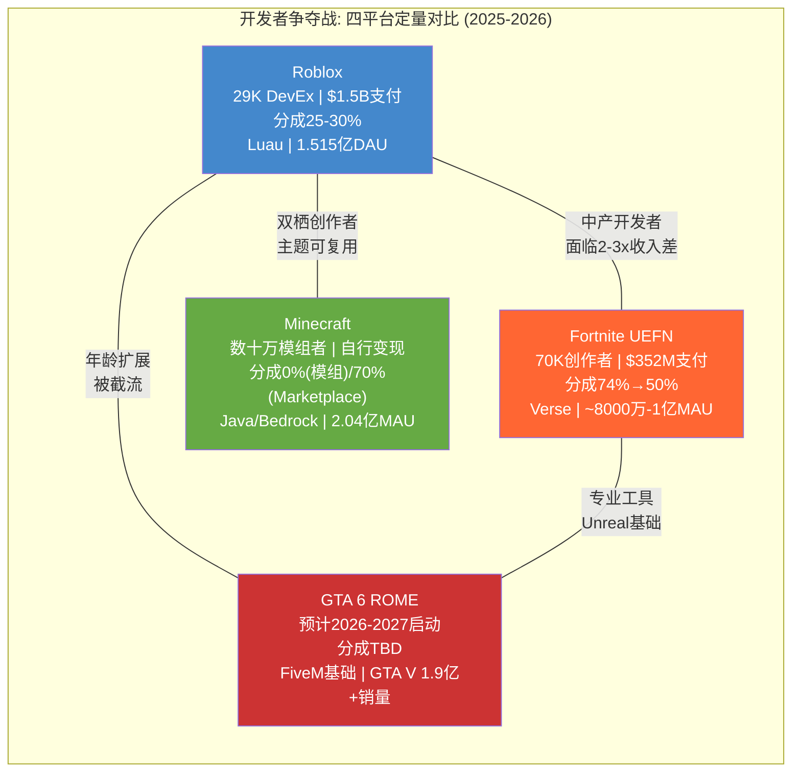
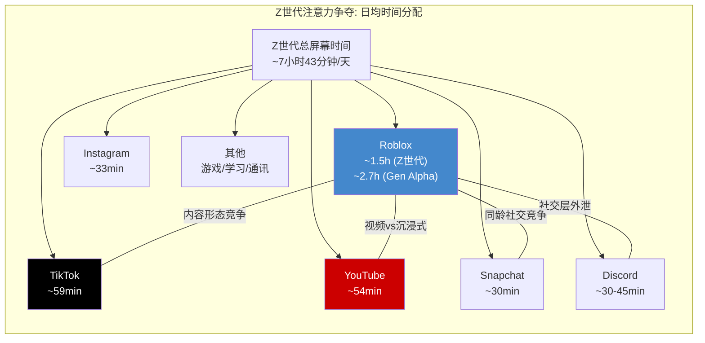
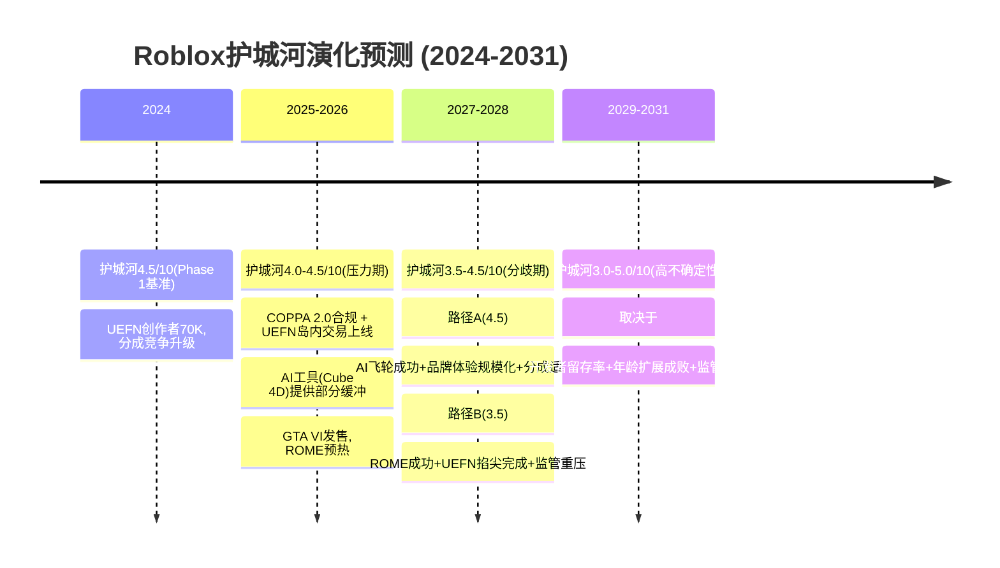
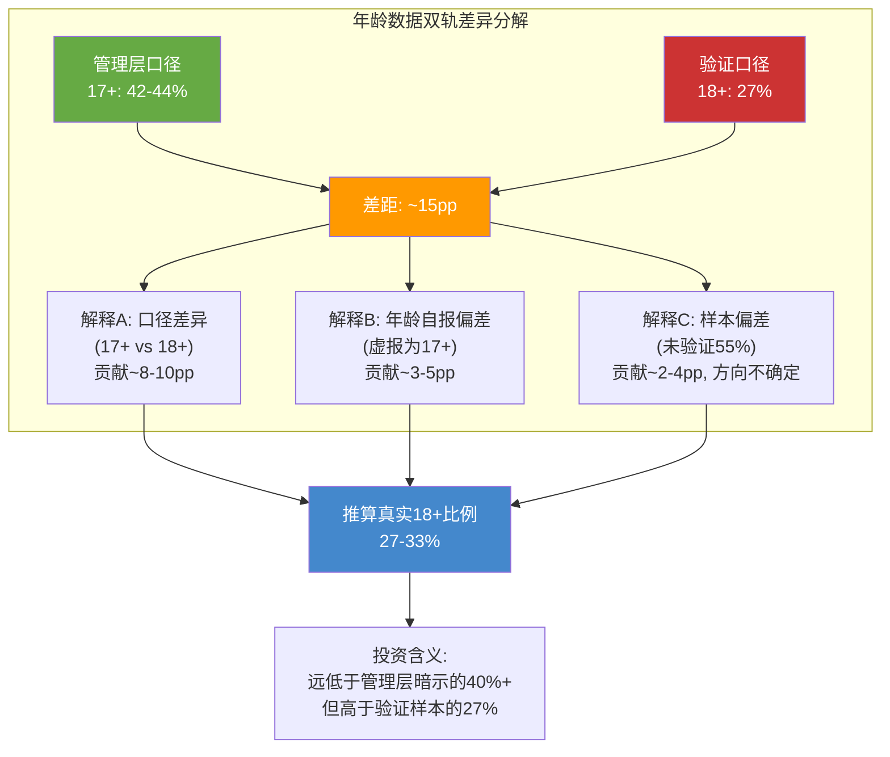
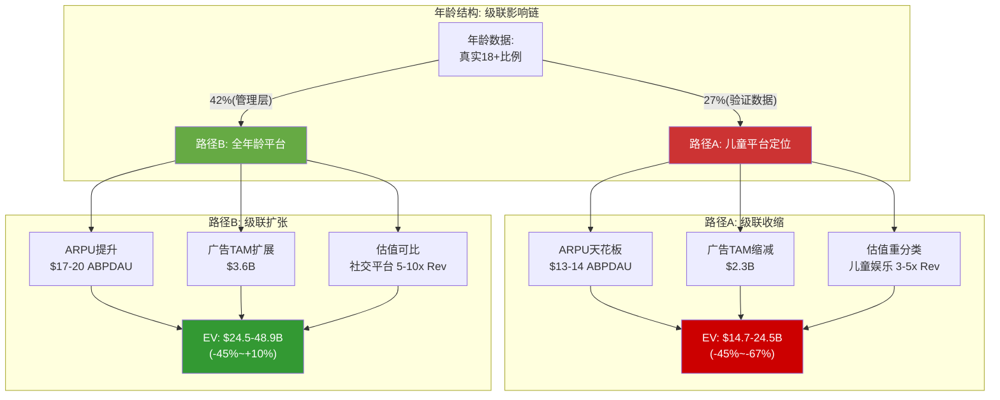
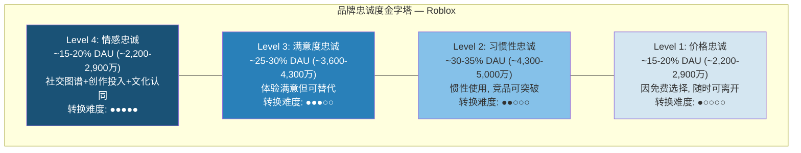
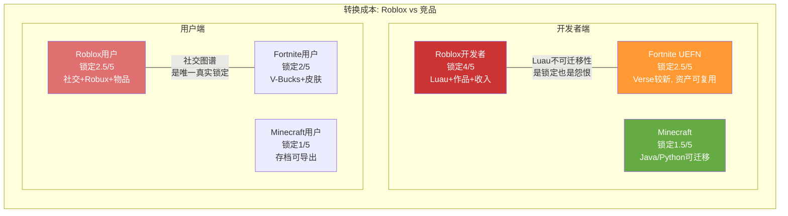

# Phase 3: 竞争深化+年龄压力测试+品牌忠诚度 — Roblox (RBLX)

> **市值基准**: $44.3B | 股价$63.17 | 稀释股数702M | EV ~$44.7B | 2026-02-13
> **DM锚点范围**: DM-CMP-030 ~ DM-CMP-058 / DM-AGE-001 ~ DM-AGE-020 / DM-BRD-001 ~ DM-BRD-018
> **CQ关联**: CQ5(开发者叛逃) + CQ6(年龄数据可信度)

---

# Chapter 16: 竞争五力深化 — 从结构描述到可操作洞察

> Phase 1(Ch7)建立了Porter五力框架: 总分6.8/10, 护城河4.5/10。本章不重复框架, 而是回答三个Phase 1未能触及的操作性问题: (1)开发者争夺战的真实战况——有多少人真的在迁移? (2)注意力经济的定量对比——RBLX在Z世代时间池中究竟占多大份额? (3)护城河是在变宽还是变窄——3年后Roblox的竞争地位如何?

## 16.1 开发者争夺战: 定量战况报告 (CQ5核心)

### 16.1.1 Fortnite UEFN: 从挑战者到真正威胁

Phase 1(Ch7)记录了UEFN 74%分成率的冲击力。一年后的数据让威胁变得更加具体:

**UEFN开发者生态的爆发式增长**: 2024年, UEFN活跃创作者从24,000人跃升至70,000人, 同比增长192%[DM-CMP-030]。这一数字需要与Roblox的29,000名DevEx参与者对比——Fortnite的活跃创作者数量已是Roblox变现开发者的2.4倍, 尽管其平台历史远短于Roblox的20年。更关键的是增长向量: Roblox DevEx参与者的增速约为20-30%/年, UEFN在单年内实现了近3倍扩张。

**收入规模对比**: 2024年Fortnite向创作者支付了$352M(+11% YoY), 而Roblox FY2025 DevEx支付超过$1.5B(+70% YoY)[DM-CMP-031]。绝对规模上Roblox仍领先4.3倍, 但人均分成的差距极为悬殊:

| 维度 | Roblox DevEx | Fortnite UEFN |
|------|:----------:|:----------:|
| 活跃创作者 | ~29,000人 | ~70,000人 |
| 总支付(2024/FY2025) | >$1.5B | $352M |
| 人均年收入(均值) | ~$51,700 | ~$5,029 |
| 百万美元+创作者 | ~1,000人(Top 1,000) | 58人 |
| 有效分成率 | 25-30% | 74%(推广期)/50%(长期) |
| 每$1创作者分成/平台总收入 | ~$0.30 | ~$0.74(推广期) |

[DM-CMP-032]

**关键洞察**: Roblox的人均创作者收入($51,700均值)看似远高于UEFN($5,029), 但这被极端的帕累托分布严重扭曲——Roblox中位DevEx收入仅$1,575, 而Top 10均值高达$33.9M。UEFN的分布更为均匀: 4%的创作者年收入超过$20,000, 58人突破百万[DM-CMP-033]。对于年收入$50K-$500K区间的"中产开发者"——正是平台内容的中坚力量——UEFN的74%分成率提供了2-3倍的收入提升空间。这恰恰是Roblox最脆弱的人才层。

**2025年12月的游戏规则改变**: Epic推出岛内交易(In-Island Transactions)功能, 允许开发者在Fortnite Creative岛屿内直接销售自定义物品[DM-CMP-034]。推广期(至2026年底)给予创作者100%的物品销售收入, 等效于综合约74%分成; 2027年起调整为50%。Epic在公告中直接将其分成率与Roblox的25%进行对比, 将竞争从隐性变为显性。这一功能意味着UEFN开发者不再仅依赖参与度分成(类似YouTube广告), 而可以建立直接销售的商业模型——更接近传统游戏的变现逻辑。

**实际迁移证据**: 目前没有公开数据直接追踪"从Roblox迁移到UEFN"的开发者数量。但间接信号强烈: (1)UEFN创作者3倍增长不可能全来自新入行者, 部分必然来自其他平台; (2)头部开发者工作室(如拥有多平台能力的大型团队)正在采取"双平台策略"——同时在Roblox和Fortnite发布内容, 以对冲平台风险; (3)Epic积极招募Roblox开发者, 通过Fortnite Creator Program提供迁移支持和工具培训[DM-CMP-035]。

### 16.1.2 Minecraft: 沉默但不可忽视

Minecraft的2.04亿MAU和3.5亿+累计销量使其成为全球最大的游戏社区[DM-CMP-005, Phase 1]。其UGC模式与Roblox竞争的维度截然不同:

**零分成模式的吸引力**: Minecraft模组/服务器不收取平台分成(0%), 创作者通过捐赠、服务器订阅、广告和Patreon等渠道自行变现。Minecraft Marketplace允许Microsoft认证的创作者销售内容包, 分成比例约为70%给创作者[DM-CMP-036]。两种模式都大幅优于Roblox的25-30%。

**跨平台创作者**: 存在一个显著但难以量化的群体——同时在Minecraft和Roblox上创作内容的开发者。这些双栖创作者通常在两个平台上发布相似主题的体验(如模拟经营、冒险、建筑类), 并根据平台特性做适配。他们对分成率变化最敏感, 因为迁移的边际成本已经极低(技能和创意可复用, 仅需适配工具链)。

**Microsoft的潜在升级**: Microsoft目前对Minecraft的商业化策略保守, 但如果Microsoft推出"Minecraft Creator Exchange"(类似Roblox DevEx的官方变现通道), 将立即为数十万Minecraft模组开发者创造集中变现机会。鉴于Microsoft拥有Azure基础设施、Xbox分发渠道和GitHub开发者关系, 这一升级在技术上并不困难——缺的只是战略决心[DM-CMP-037]。

### 16.1.3 GTA 6 ROME: 高确定性的远期威胁

Phase 1将GTA 6 ROME标记为"高不确定性潜在颠覆者"。过去几个月的信息更新使其确定性大幅上升:

**时间线清晰化**: Take-Two已确认GTA VI推迟至2026年秋季发售。Project ROME(Rockstar Online Modding Engine)预计在GTA VI Online上线时一同推出, 即2026年底至2027年初[DM-CMP-038]。Rockstar于2023年8月收购的Cfx.re(FiveM和RedM的开发者)是ROME的技术基础——这意味着ROME不是从零开始的实验项目, 而是在已验证的社区模组平台基础上的官方化升级。

**受众错位但存在间接威胁**: GTA 6的核心受众为18+成人玩家, 与Roblox的核心低龄用户直接重叠度低。但威胁路径是间接的: (1)Roblox正试图拓展17+用户群——而这正是GTA 6的领地; (2)ROME可能吸引目前在Roblox开发面向年长用户内容的开发者(如社交模拟、角色扮演类体验); (3)GTA V在线模式已拥有数千个社区服务器和数万名模组创作者(FiveM), 证明了Rockstar IP的UGC潜力[DM-CMP-039]。

**对Roblox年龄扩展的遏制效应**: 如果ROME成功, 它将在18-35岁年龄段的UGC市场建立统治地位。这意味着Roblox向成人市场扩展的天花板将被ROME压低——不是因为用户从Roblox迁移到GTA 6, 而是因为潜在的成人UGC用户将直接被GTA 6截获, 永远不会进入Roblox生态。

### 16.1.4 Unity/Unreal: 专业开发者的选择逻辑

专业游戏开发者选择或不选择Roblox的决策框架:

**选择Roblox的理由**: (1)内置分发——1.515亿DAU, 无需自行获客; (2)低开发成本——Luau学习曲线低, Roblox Studio免费; (3)快速迭代——发布和更新几乎无审核延迟; (4)AI创作工具——Cube 3D/4D大幅降低资产制作门槛。

**不选择Roblox的理由**: (1)图形天花板——Roblox Engine无法实现AAA画质, 限制了面向成人玩家的体验品质; (2)Luau不可迁移——开发者技能投资无法转移到Unity/Unreal项目, 职业发展路径窄; (3)100人/服务器上限——限制了大型多人体验的设计空间; (4)平台锁定——内容和用户关系无法带离Roblox。

**Luau vs C#/C++/Verse的技能迁移性**: Luau是Lua的改良版本, 与主流游戏开发语言(C#/C++/Verse)之间的知识迁移性较低[DM-CMP-040]。一名有3年Luau经验的Roblox开发者若迁移至Unity(C#), 估计需要3-6个月的适应期; 迁移至UEFN(Verse)可能需要6-12个月(Verse是Epic全新设计的语言, 学习资源尚不成熟)。反向迁移(Unity/Unreal → Roblox)则更容易, 约1-3个月。这种非对称迁移成本意味着: Roblox开发者被"锁定"在平台上, 而外部开发者有较低的进入门槛——但这也意味着当外部平台(UEFN, ROME)提供足够激励时, Roblox开发者最终会克服迁移成本。

## 16.2 注意力经济竞争: Z世代时间池的争夺

### 16.2.1 时间分配的定量对比

Roblox的真正竞争对手不仅是游戏平台, 更是所有争夺Z世代和Gen Alpha注意力的数字产品。最新数据揭示了一个关键事实——Roblox在低龄群体中的时间份额远超多数分析师的预期:

| 平台/活动 | Z世代日均使用时长 | Gen Alpha日均使用时长 | 竞争维度 |
|-----------|:----------------:|:------------------:|----------|
| **Roblox** | ~1.5小时(推算) | ~2.7小时 | 游戏+社交+创作 |
| TikTok | ~59分钟(全球均值) | ~45分钟 | 短视频消费 |
| YouTube | ~54分钟(全球均值) | ~1.5小时 | 视频消费+学习 |
| Instagram | ~33分钟 | 受限 | 社交+内容 |
| Snapchat | ~30分钟 | ~20分钟 | 社交通讯 |
| Discord | ~30-45分钟 | ~20分钟 | 语音社交+社区 |

[DM-CMP-041]

**关键发现**: Roblox在Gen Alpha(约7-12岁)群体中的日均使用时长达2.7小时, 超过TikTok、Instagram和YouTube在该年龄段的使用时长[DM-CMP-042]。这是一个异常高的数字——它意味着Roblox不仅仅是这些儿童的"游戏时间", 而是他们的"社交空间+创意出口+娱乐平台"的集合体。Roblox Q4 2025报告的350亿小时总参与时长(+88% YoY)在数量级上验证了这一数据, 尽管需要扣除Hindenburg指控的机器人时长。

**注意力竞争的结构性特征**: Z世代(约13-25岁)的屏幕时间总量约为7小时43分钟/天, 其中社交媒体约占3小时18分钟。这意味着:

1. **总量约束**: 一天只有有限的"可争夺"时间。Roblox在Gen Alpha中占据2.7小时, 几乎耗尽了这个年龄段的非学习屏幕时间预算。
2. **年龄梯度**: 随着用户年龄增长(13+), 注意力从Roblox分散至TikTok/YouTube/Instagram/Discord。这是年龄扩展面临的最大隐性障碍——不是用户"不想用Roblox", 而是他们的注意力被更多平台瓜分。
3. **内容形态竞争**: 短视频(TikTok/YouTube Shorts)的即时满足感对长时间UGC游戏体验构成结构性替代。Roblox需要让用户"主动进入一个世界", 而TikTok只需要"无限向下滑动"——后者的认知成本更低[DM-CMP-043]。

### 16.2.2 社交功能重叠: Discord和Snapchat的入侵

一个常被忽视的竞争维度: Roblox用户的大量社交行为实际上发生在平台之外。

**Discord**: 已成为Roblox社区的"事实上的社交层"。Roblox游戏的攻略讨论、团队组织、二手交易(Rolimons)、开发者招募等活动主要在Discord服务器上进行, 而非Roblox内置的聊天功能。Discord最大的用户群体是25-34岁(53.43%), 显示其已远超游戏社交定位, 成为泛社区平台[DM-CMP-044]。这意味着Roblox的"社交平台"叙事面临一个尴尬事实——其核心社交行为正在被Discord虹吸。

**Snapchat**: 在13-17岁年龄段与Roblox高度重叠(Snapchat该群体用户约1.3亿)。Snapchat的日均使用约30分钟, 直接争夺同一时间池。但Snapchat的"扩龄"经验值得Roblox借鉴——Snapchat最大用户群已是18-24岁(37.1%, 约2.64亿人), 从青少年社交成功扩展至年轻成人[DM-CMP-045]。

### 16.2.3 Roblox在注意力经济中的结构性优势与劣势

**优势**:
- **沉浸式参与**: 人均2.5小时/天的参与深度远超任何单一社交媒体应用。这不是"刷短视频", 而是"进入一个世界"——参与的心理深度不同
- **社交锁定**: "我的朋友都在Roblox上"是最强的留存机制, 尤其对低龄用户(他们的社交选择更有限)
- **创作参与**: ~500万注册开发者中的大部分不是为了变现, 而是为了创作乐趣——这是TikTok/YouTube无法提供的独特价值

**劣势**:
- **年龄衰减**: 随着用户年龄增长, 竞争者数量和吸引力倍增。13岁以下用户几乎没有替代品; 17+用户面临TikTok/YouTube/Discord/Steam/Fortnite/实体社交等众多替代选择
- **形态劣势**: 短视频的"零决策成本"消费模式对UGC游戏的"需要选择+进入+学习"模式具有结构性优势
- **品牌阻力**: "Roblox是小孩子玩的"的社会认知对17+用户的获取构成隐性阻力(详见Ch17.5)

## 16.3 竞争护城河演化预测

### 16.3.1 当前护城河解构 (Phase 1基准: 4.5/10)

Phase 1评估护城河4.5/10(窄护城河, 收窄趋势)。将其拆解为可追踪的组件:

| 护城河组件 | 当前评分 | 正在加宽? | 正在收窄? |
|-----------|:-------:|:---------:|:---------:|
| 双边网络效应 | 6/10 | AI工具降低创作门槛→更多开发者→更多内容 | UEFN/ROME争夺头部开发者→供给端被侵蚀 |
| 品牌认知 | 6/10 | 600+品牌合作体验(2025)→品牌关联度提升 | 儿童安全诉讼→品牌污名化风险 |
| 转换成本(用户) | 2/10 | 社交图谱+数字物品投资随时间积累 | 竞品免费且功能趋同 |
| 转换成本(开发者) | 5/10 | Luau专有技能+作品资产锁定 | AI降低跨平台创作门槛 |
| 数据优势 | 4/10 | 年龄验证扩展→更精确受众数据 | COPPA限制数据收集和使用 |

[DM-CMP-046]

### 16.3.2 护城河3年预测 (2026-2029)

**加宽因素**:

1. **AI创作工具飞轮** (影响: +0.5-1.0分): Cube 3D/4D将Roblox的创作门槛降至接近零——文本到功能性3D物体的能力是其他平台尚未匹配的。如果AI工具持续迭代, Roblox的开发者数量可能从500万扩展至数千万级别(尽管绝大多数仍是业余创作者)。AI作为护城河的关键在于: 它是否让"只有Roblox才能做到"的事情变多, 还是让"所有平台都能做到"的事情变多? 如果是后者, AI反而会削弱Roblox的工具差异化[DM-CMP-047]。

2. **社交图谱深化** (影响: +0.3-0.5分): 2026年1月的年龄分组(6个年龄段)和面部验证机制, 虽然短期增加摩擦, 但长期可能强化社交锁定——用户在经过验证后建立的社交连接更具真实性和持久性。如果Roblox能在"经过验证的社交图谱"上建立差异化, 这将成为新的护城河组件。

3. **独家IP/内容** (影响: +0.2-0.5分): Roblox原生IP(如Blox Fruits, Brookhaven)正在成为独立文化符号。若这些IP的品牌价值增长到"只能在Roblox上体验"的程度, 将强化平台不可替代性。但目前没有单一Roblox体验达到"Fortnite Battle Royale"或"Minecraft"级别的文化穿透力。

**收窄因素**:

1. **开发者分成竞争** (影响: -0.5-1.0分): 这是最大的收窄力量。UEFN 74%/50%的分成率对Roblox的25-30%构成持续引力。每年Roblox不提高分成, 头部开发者迁移的累积概率就增加5-10个百分点。3年累积效应可能使Top 100开发者中的10-20%建立UEFN的双平台或主平台存在[DM-CMP-048]。

2. **开发工具趋同** (影响: -0.3-0.5分): UEFN工具成熟度正在快速追赶Roblox Studio。随着AI代码助手(Copilot/Cursor)降低语言切换成本, Luau的专有锁定效应逐步减弱。3年后, 开发工具的差异化将主要体现在生态系统规模而非工具本身。

3. **GTA 6 ROME截流** (影响: -0.3-0.5分, 如果成功): 若ROME在2027年成功启动, 将在18-35岁UGC市场建立新的网络效应中心, 永久性地压低Roblox向成人市场扩展的天花板。

4. **监管侵蚀** (影响: -0.3-0.5分): COPPA 2.0+KOSA可能迫使Roblox在<13岁用户获取上增加大量摩擦(家长同意), 削弱其在低龄市场的渗透效率——而这正是Roblox护城河最深的区域。

### 16.3.3 护城河演化时间线

[DM-CMP-049]

**3年预测(2029年)**: 护城河在3.5-4.5/10区间, 取决于以下关键变量:
- **乐观路径(4.5/10)**: AI工具建立差异化 + 开发者分成提升至35% + 品牌体验生态繁荣 + 年龄验证后社交图谱强化
- **基准路径(4.0/10)**: 开发者分成被动提升 + AI工具被竞品追平 + 监管合规增加成本但不致命
- **悲观路径(3.5/10)**: UEFN掐尖完成 + ROME截流成人市场 + 品牌安全事件→广告主撤离
- **中位预测: 4.0/10, 较当前4.5/10下降0.5分**

**5年预测(2031年)**: 不确定性显著放大, 区间3.0-5.0/10。5年是足够长的时间让GTA 6 ROME+UEFN达到成熟期, 也足够长让Roblox的AI工具和品牌体验生态充分发展。核心赌注: Roblox能否从"儿童游戏平台"成功转型为"全年龄创作社交平台"? 如果转型成功, 护城河可能因为规模效应和品牌进化而加宽至5.0; 如果失败, 将被锁定在收窄的儿童市场, 护城河可能降至3.0[DM-CMP-050]。

### Ch16 DM锚点汇总

| 锚点ID | 数据 | 来源 | 可信度 |
|--------|------|------|--------|
| [DM-CMP-030] | UEFN活跃创作者从24K增至70K(+192%), 2024年 | Esports Insider/Epic公告 | ★★★ |
| [DM-CMP-031] | UEFN 2024年支付$352M(+11% YoY) vs Roblox FY2025 >$1.5B(+70%) | Esports Insider / Roblox 10-K | ★★★ |
| [DM-CMP-032] | 四平台开发者经济对比表(分成/规模/工具) | 综合行业数据 | ★★☆ |
| [DM-CMP-033] | UEFN 4%创作者年收入>$20K, 58人>$1M | Creators Corp/行业报告 | ★★★ |
| [DM-CMP-034] | Epic岛内交易2025.12推出, 推广期100%分成→2027年50% | Epic Games官方公告 | ★★★ |
| [DM-CMP-035] | Epic积极招募Roblox开发者, 提供迁移支持 | 行业报道/Digiday | ★★☆ |
| [DM-CMP-036] | Minecraft模组零分成, Marketplace约70%给创作者 | Microsoft官方政策 | ★★★ |
| [DM-CMP-037] | Microsoft潜在"Minecraft Creator Exchange"的可能性 | 战略推演 | ★☆☆ |
| [DM-CMP-038] | GTA VI推迟至2026年秋季, ROME预计随GTA VI Online推出 | Take-Two公告/TweakTown | ★★★ |
| [DM-CMP-039] | ROME基于Cfx.re(FiveM/RedM), 2023.8收购 | Rockstar Intel | ★★★ |
| [DM-CMP-040] | Luau→C#迁移约3-6个月, →Verse约6-12个月 | 开发者社区估算 | ★☆☆ |
| [DM-CMP-041] | Z世代日均屏幕时间7h43m, 社交媒体3h18m | NSS Magazine/DemandSage | ★★☆ |
| [DM-CMP-042] | Roblox Gen Alpha日均2.7小时, 超TikTok/YouTube | DemandSage/行业统计 | ★★☆ |
| [DM-CMP-043] | 短视频"零决策成本"消费对UGC游戏的结构性替代 | 行业分析 | ★★☆ |
| [DM-CMP-044] | Discord最大用户群25-34岁(53.43%), 已超游戏社交定位 | The Social Shepherd | ★★★ |
| [DM-CMP-045] | Snapchat最大用户群18-24岁(37.1%, 2.64亿人) | Statista/DemandSage | ★★★ |
| [DM-CMP-046] | 护城河五组件解构与趋势评估 | 综合分析 | ★★☆ |
| [DM-CMP-047] | Cube 3D/4D潜在护城河效应的双向性评估 | 技术趋势分析 | ★☆☆ |
| [DM-CMP-048] | 3年不提高分成→头部开发者累积迁移概率+5-10pp/年 | 竞争推演 | ★☆☆ |
| [DM-CMP-049] | 护城河3年预测4.0/10(中位), 5年3.0-5.0/10(高不确定性) | 综合预测 | ★☆☆ |
| [DM-CMP-050] | 转型成功→5.0/10, 失败→3.0/10的两极分化 | 情景分析 | ★☆☆ |

---

# Chapter 17: 年龄扩展压力测试 — CQ6深度解答

> CQ6核心问题: 管理层自报42%用户为17+ vs 验证后仅27%为18+, 差距15个百分点。这个差距是统计口径问题还是叙事可信度问题? 年龄扩展是真实的增长引擎还是被高估的愿景?

## 17.1 年龄数据双轨深挖

### 17.1.1 两套数据的完整陈述

**管理层口径(自报年龄)**:
- 42-44%的DAU为17岁以上(管理层在多次财报中重复引用)[DM-USR-005, Phase 1]
- 年龄分布(管理层版本): <9岁约20%, 9-12岁约20%, 12-16岁约16%, 17-24岁约25%, 25+岁约19%[DM-AGE-001]
- 17+用户增速超50%, 是增长最快的年龄段
- 18+用户变现能力高出约40%[DM-USR-006, Phase 1]

**验证口径(面部年龄识别/ID验证)**:
- 在已完成年龄验证的45%用户中[DM-USR-007, Phase 1]:
  - 35%为13岁以下
  - 38%为13-17岁
  - **仅27%为18岁以上**
- Hindenburg引用数据: 83%的11-15岁用户虚报年龄[DM-USR-008, Phase 1]
- Capitol Forum调查: 1小时内成功创建95个未成年账号[DM-REG-005, Phase 1]

### 17.1.2 差异来源的系统性分析

42% vs 27%的差距(15个百分点)有三种可能的解释, 它们并非互斥:

**解释A: 14-17岁的口径差异 (贡献: ~8-10pp)**

这是最具解释力的单一因素。管理层使用"17+"(含17岁)作为年龄分界线, 而验证数据使用"18+"(不含17岁)。如果13-17岁区间中有大量16-17岁用户(合理假设, 因为Roblox用户随年龄增长而流失, 但16-17岁仍在活跃使用), 则"17+"(含17岁的一部分)与"18+"(不含17岁)之间可能存在8-10个百分点的纯口径差异[DM-AGE-002]。

这是一个合理的技术性解释, 但投资者应注意: 管理层选择"17+"而非"18+"作为披露口径本身就是一个有意的框架选择——它将法定成年人(18+)门槛下方的用户纳入"年长用户"叙事, 人为放大了成人用户的比例。

**解释B: 年龄自报偏差 (贡献: ~3-5pp)**

未成年用户有强烈动机虚报年龄: (1)解锁社交功能(聊天、私信); (2)访问受限体验(标记为13+或17+的内容); (3)逃避家长控制设置。Hindenburg引用的"83%的11-15岁虚报年龄"虽然来源可信度有限(★☆☆), 但与行业经验一致——在所有需要年龄输入的平台上, 未成年人虚报年龄是普遍现象。如果10-15%的用户虚报至17+以上, 将为管理层口径额外贡献3-5个百分点的"幽灵成人用户"[DM-AGE-003]。

**解释C: 验证样本偏差 (贡献: ~2-4pp, 方向不确定)**

验证数据仅覆盖45%的用户, 未验证的55%可能有不同的年龄分布。但方向不确定: 管理层可能辩称成人更不愿面部验证(→未验证群体中成人比例更高); 反方可能辩称未成年人更有动机逃避验证(→未验证群体中未成年比例更高)。Konvoy Ventures的分析提供了一个间接证据: Roblox仅20%的用户会话发生在非移动设备上, 这与成人玩家更倾向使用PC/主机的行为模式不一致——如果真有42%的用户是17+, PC/主机会话占比应显著更高[DM-AGE-004]。

### 17.1.3 广告主和监管的数据定价

**广告主按哪个数据定价?**

品牌广告主关心的不是"17+"而是"18+"——因为对未成年人投放定向广告面临法律限制(COPPA, GDPR-K)。在与Google的程序化广告合作中, Roblox的受众数据精度直接影响CPM定价:

- **如果广告主采信管理层数据(42% 17+)**: 可触达高价值成人受众约6,000万DAU(1.44亿×42%), CPM可定价$8-12(类比Snapchat成人受众)
- **如果广告主采信验证数据(27% 18+)**: 可触达成人受众仅约3,900万DAU, 且其中大部分来自低ARPU新兴市场, CPM可能折价至$4-7
- **差异影响**: 在$5B潜在广告TAM假设下, 可触达成人用户减少35%(从6,000万降至3,900万)将对应广告TAM缩减约30-40%, 从$5B降至$3-3.5B[DM-AGE-005]

**监管按哪个数据执法?**

COPPA 2.0的"合理推定"标准意味着: 如果平台"应当合理推定"某用户为儿童, 则必须遵循儿童保护规定, 即使该用户自报为成人。验证数据(73%为<18岁)将成为FTC执法的参考基准——而非管理层的42%叙事[DM-AGE-006]。

## 17.2 13+到17-24岁扩展可行性评估

### 17.2.1 已有成功案例

**音乐和品牌体验**: Roblox已成功吸引了一些年长用户参与非传统游戏体验。2025年, 平台上推出了600+品牌合作体验(前一年为400+)[DM-AGE-007]。Warner Music的Rhythm City(2025年1月上线)通过社交角色扮演和虚拟音乐会吸引音乐爱好者; Gucci、Nike等奢侈/运动品牌的虚拟体验瞄准了对时尚敏感的年轻群体; Walmart的Sam's Club整合了"可玩的会员资格"——将真实世界的商业逻辑引入虚拟空间。

**社交模拟类体验**: Brookhaven(社交角色扮演)持续吸引跨年龄段用户, 日活动辄数十万。其"自由社交+角色扮演"的模式更接近社交平台而非传统游戏, 对17-24岁用户有一定吸引力。

**数据信号**: 管理层声称17-24岁用户增速超50%(全平台最快增长段), 且18+用户变现高40%[DM-USR-004, DM-USR-006]。如果这些数据属实, 说明年龄扩展正在发生——只是规模和速度可能被夸大。

### 17.2.2 失败案例与瓶颈

**图形质量天花板**: Roblox Engine的风格化(低多边形)画面是吸引年长用户的最大障碍之一。17-24岁用户习惯了Fortnite(Unreal Engine)、Genshin Impact(自研引擎)、GTA V(RAGE引擎)等高保真画质。Roblox正在改善图形(2025年推出PBR材质、实时光照等), 但与AAA游戏的差距仍然显著。对于许多年轻成人, 在朋友面前玩一个"看起来像2010年"的游戏是一种社交成本[DM-AGE-008]。

**"幼稚化"标签**: Konvoy Ventures的分析直接指出"Roblox Is Not Aging Up"——平台的品牌认知与"儿童游戏"强绑定, 构成了年龄扩展的隐性天花板[DM-AGE-009]。这不仅仅是产品问题, 而是品牌问题: 即使Roblox的产品能力提升至与Fortnite相当, "Roblox"这个名字本身仍可能阻止17-24岁用户主动下载和使用。类比: Nintendo Switch在日本是全年龄平台, 但在欧美同样面临"casual/kiddie"标签, 限制了部分硬核玩家的接纳。

**设备行为不一致**: Konvoy提出了一个有力的间接证据: 如果42%的用户是17+, 为什么只有20%的会话发生在PC/主机上? 成人玩家(尤其是重度用户)通常偏好PC或主机——如果近一半用户是成人, PC/主机会话占比应远高于20%[DM-AGE-010]。一个可能的反驳是: Roblox的成人用户主要来自新兴市场(手机为主), 因此移动端占比高并不矛盾。但这个反驳本身也揭示了一个问题: 如果成人用户主要来自低ARPU新兴市场, 他们对变现和广告价值的贡献将远低于北美/欧洲的成人用户。

### 17.2.3 对标: Discord和Snapchat的扩龄经验

**Discord的转型路径**: 从2015年的"游戏语音工具"→2020年的"社区平台"→2025年最大用户群25-34岁(53.43%)。关键成功因素: (1)去游戏化品牌重塑(2020年slogan从"Chat for Gamers"改为"Chat for Communities"); (2)功能横向扩展(学习群、工作协作、兴趣社区); (3)Nitro订阅模式与社区治理工具吸引成人用户[DM-AGE-011]。

**Snapchat的经验**: 从青少年社交起步, 现在最大群体18-24岁(37.1%), 但在25+市场增长缓慢。Snapchat的经验说明: 从13-17岁扩展至18-24岁相对可行(核心用户"自然成长"), 但从18-24岁进一步扩展至25+极其困难——因为25+用户有完全不同的社交需求和品牌偏好[DM-AGE-012]。

**对Roblox的启示**: Discord成功扩龄的前提是**品牌重塑**(去游戏化) + **功能横向扩展**(超越游戏场景)。Roblox目前正在做类似的事(品牌体验、音乐会、社交模拟), 但有一个根本差异: Discord本身不生产内容——它是纯社交基础设施, 用户不会觉得使用Discord"幼稚"; 而Roblox的核心是UGC游戏内容, 其画面品质和创作风格天然与"儿童"关联。这使得Roblox的品牌重塑难度显著高于Discord。

## 17.3 年龄结构对业务的级联影响

### 17.3.1 场景A: 真实成年用户仅27%

如果验证数据更接近真实, 即真正的18+用户约占DAU的27-33%(扣除口径差异和部分虚报后的调整值):

**ARPU天花板**: 73%的用户为未成年人, 其消费受制于: (1)有限的可支配收入(依赖父母); (2)监管限制(多国正在立法限制未成年人应用内购买); (3)支付手段限制(未成年人通常无信用卡/移动支付)。Q4 2025 ABPDAU已同比下降4%至$15.38[DM-USR-010], 如果新增DAU中未成年人占比更高(新兴市场+低龄用户), ARPU下行压力将持续[DM-AGE-013]。

**广告CPM折价**: Phase 2(Ch12)估算的广告TAM存在两个版本:
- 基准情景(管理层数据): 广告TAM $3.6B(假设~40%可触达成人受众)
- 保守情景(验证数据): 广告TAM $2.3B(假设~27%可触达成人受众)
- 差额: $1.3B, 相当于FY2025 Revenue的27%[DM-AGE-014]

**TAM缩减**: 如果Roblox的真实用户画像是"73%儿童+27%成人", 其估值可比对象应从"Meta/Snapchat(社交平台)"下调至"Disney+/Nickelodeon(儿童娱乐)"。儿童娱乐公司的EV/Revenue通常在2-4x, 而社交平台在5-10x。当前Roblox EV/Revenue约9.1x($44.7B/$4.89B), 如果重新分类为儿童娱乐平台, 合理EV/Revenue为3-5x, 对应EV $14.7-24.5B——较当前折价45-67%[DM-AGE-015]。

### 17.3.2 场景B: 管理层数据正确(42%为17+)

如果管理层数据更接近真实(即17+用户确实占42%, 真正的18+约35-38%):

**ARPU提升空间**: 18+用户变现高40%意味着, 随着成人占比持续提升(如从42%到50%), ABPDAU有望从$15.38回升至$18-20区间, 这将直接驱动Bookings增长超过DAU增长[DM-AGE-016]。

**广告TAM扩展**: 38%的18+用户×1.515亿DAU = ~5,760万可定向成人用户。这一规模接近Snapchat的美国成人用户基数, 足以支撑$2-4B的年化广告收入(假设人均$35-70)。

**估值重估**: 作为"全年龄社交平台", Roblox的可比对象扩展至Meta(EV/Rev ~8x)、Snapchat(EV/Rev ~4x)、Pinterest(EV/Rev ~6x)。9.1x的EV/Revenue在这个对比下处于合理偏高区间, 但如果增速维持20%+则可justify。

### 17.3.3 两场景EV差异量化

| 维度 | 场景A(27%成人) | 场景B(42% 17+) | 差异 |
|------|:--------------:|:--------------:|:----:|
| 可触达成人DAU | ~3,900万 | ~6,000万+ | 54%差 |
| ABPDAU趋势 | 持续下行($13-14) | 企稳回升($17-20) | $3-6差 |
| 广告TAM | $2.3B | $3.6B | $1.3B |
| 估值可比类别 | 儿童娱乐(3-5x Rev) | 社交平台(5-10x Rev) | 分类级差异 |
| 隐含EV | $14.7-24.5B | $24.5-48.9B | 2-3x |

[DM-AGE-017]

### 17.3.4 概率赋权: 真相在哪里?

基于Phase 1的数据交叉验证和本章的分析, 以下是对真实年龄分布的最佳估计:

- **真实18+比例**: 27-33%(验证数据+口径调整+部分虚报修正)
- **真实17+比例**: 34-40%(加入17岁年龄段)
- **管理层口径是否"欺骗"**: 不完全是。42%的"17+"可能在技术上接近正确, 但刻意模糊"17+"和"18+"的区别以营造"成人用户近半"的印象[DM-AGE-018]

**CQ6的结论**: 年龄扩展确实在发生, 但速度和程度被管理层的口径选择显著美化。TAM叙事不需要"重构", 但需要"折价": 从"全年龄社交平台"的估值锚点向"以低龄为核心、正在尝试扩龄的平台"调整。Phase 2的条件估值应给予场景A(27-33%成人)更高的权重(60%)而非场景B(40%)[DM-AGE-019]。

### Ch17 DM锚点汇总

| 锚点ID | 数据 | 来源 | 可信度 |
|--------|------|------|--------|
| [DM-AGE-001] | 管理层年龄分布: <9/9-12/12-16/17-24/25+约20/20/16/25/19% | Roblox披露/TakeawayReality | ★★☆ |
| [DM-AGE-002] | "17+"vs"18+"口径差异约贡献8-10pp差距 | 逻辑推导 | ★★☆ |
| [DM-AGE-003] | 10-15%用户虚报至17+以上, 贡献3-5pp | 行业经验+Hindenburg推断 | ★☆☆ |
| [DM-AGE-004] | 仅20%会话在PC/主机, 与42%成人占比不一致 | Konvoy Ventures分析 | ★★☆ |
| [DM-AGE-005] | 广告可触达成人用户: 管理层版~6000万 vs 验证版~3900万 | 推算 | ★★☆ |
| [DM-AGE-006] | COPPA 2.0按"合理推定"标准执法, 验证数据为参考基准 | 联邦法规分析 | ★★★ |
| [DM-AGE-007] | 2025年600+品牌合作体验(vs 2024年400+) | Roblox官方/FutureCommerce | ★★★ |
| [DM-AGE-008] | 图形质量天花板: Roblox风格化画面vs AAA保真度 | 产品分析 | ★★★ |
| [DM-AGE-009] | Konvoy: "Roblox Is Not Aging Up", 品牌认知=儿童游戏 | Konvoy Ventures Newsletter | ★★☆ |
| [DM-AGE-010] | 设备行为: 20%PC/主机会话与高成人比例不一致 | Konvoy分析 | ★★☆ |
| [DM-AGE-011] | Discord扩龄: 2020品牌重塑, 2025最大群体25-34岁(53.43%) | The Social Shepherd | ★★★ |
| [DM-AGE-012] | Snapchat: 最大群体18-24岁(37.1%), 25+增长缓慢 | Statista/DemandSage | ★★★ |
| [DM-AGE-013] | ABPDAU下行压力: 新增DAU以未成年+新兴市场为主 | Q4数据+推理 | ★★☆ |
| [DM-AGE-014] | 广告TAM差额: 管理层版$3.6B vs 验证版$2.3B, 差$1.3B | Phase 2条件估值+调整 | ★★☆ |
| [DM-AGE-015] | 儿童娱乐EV/Rev 3-5x vs 社交平台5-10x, 隐含EV差2-3倍 | 可比公司分析 | ★★☆ |
| [DM-AGE-016] | 成人占比提升至50%→ABPDAU回升至$18-20 | 推算(40%溢价×占比增量) | ★☆☆ |
| [DM-AGE-017] | 两场景EV差异汇总表 | 综合计算 | ★★☆ |
| [DM-AGE-018] | 管理层刻意模糊17+/18+口径差异 | 分析判断 | ★★☆ |
| [DM-AGE-019] | CQ6结论: 给予验证场景(27-33%)60%权重, 管理层场景40% | 概率赋权 | ★★☆ |
| [DM-AGE-020] | 年龄扩展在发生但被口径选择美化, TAM需折价而非重构 | 综合结论 | ★★☆ |

---

# Chapter 17.5: 品牌忠诚度分层分析 — Consumer Brand Analysis Toolkit

> Roblox是**混合型品牌**: 功能性(免费游戏平台/创作工具/社交空间) + 情感性(儿童社交认同/社区归属感/创作成就感)。本章使用品牌忠诚度四层模型量化Roblox品牌的防御力和脆弱点。

## 17.5.1 忠诚度四层分析

### Level 4: 情感忠诚 (最强锁定) — 估算占比: ~15-20% DAU

情感忠诚是品牌最深层的防御。对于Roblox, 情感忠诚的来源包括:

**社交图谱绑定**: 用户在Roblox上建立的好友网络、社区归属、共同体验记忆。对于核心低龄用户(9-14岁), Roblox可能是他们的"第一个社交平台"——类似于Millennials对MSN Messenger或早期Facebook的情感连接。这些用户即使面对更好的替代品, 也会因为"我的朋友都在这里"而留下[DM-BRD-001]。

**创作者投入**: 24,500+名DevEx参与者和数百万业余创作者在Roblox上投入了数千小时的创作时间。他们的作品(游戏、物品、建筑)只存在于Roblox——离开平台意味着放弃所有创作成果。对于头部开发者(Top 1,000), 他们的收入流、团队、品牌认知全部建立在Roblox上, 情感+经济的双重锁定极强[DM-BRD-002]。

**文化认同**: 在某些Z世代和Gen Alpha社群中, "你在Roblox上玩什么?"是一种社交货币。穿戴特定的Roblox限量物品(Limiteds)是身份表达的方式, 类似于现实中的潮牌消费。Rolimons交易平台上的稀有物品可达数千美元, 证明了虚拟物品的文化价值[DM-BRD-003]。

**估算依据**: 15-20%的DAU(约2,200-2,900万用户)具有强情感忠诚, 主要是: 活跃创作者(~500万, 但高频参与者可能仅50-100万) + 社交核心用户(好友数>10, 日均在线>2小时的深度参与者) + 虚拟经济参与者(持有>$50价值虚拟物品的收藏/交易者)。

### Level 3: 满意度忠诚 — 估算占比: ~25-30% DAU

这些用户对Roblox的游戏体验满意, 经常使用, 但缺乏深层情感连接。他们可能同时玩Fortnite、Minecraft, 如果某个竞品提供显著更好的体验, 他们会迁移——但不会主动寻找替代品。

**特征**: 中等参与时长(日均1-2小时), 有付费行为但金额不大(月均$5-15 Robux), 好友数3-8人, 偶尔创作但不持续。这是Roblox的"沉默多数"——他们撑起了DAU数字, 但其忠诚度取决于Roblox能否持续提供有趣的新内容[DM-BRD-004]。

**脆弱性**: 如果Fortnite UEFN或其他平台推出一款"爆款"体验(类似Roblox的Blox Fruits), 这一层的用户可能大规模迁移。他们不会因为"朋友在Roblox上"而留下——因为他们的朋友也在Fortnite上。

### Level 2: 习惯性忠诚 — 估算占比: ~30-35% DAU

习惯驱动型用户使用Roblox主要因为"一直在用"而非主动选择。他们可能每天打开Roblox刷一下, 但参与深度较浅(日均<1小时), 付费很少或不付费。

**特征**: 低参与时长, 低付费, 多为被动消费者(玩别人的游戏, 不创作)。他们占据了DAU中的很大比例, 但对Bookings的贡献极小。如果Roblox的"打开惯性"被打破(例如: 家长设置屏幕时间限制, 或手机上出现更有吸引力的图标), 这些用户可能快速流失[DM-BRD-005]。

**竞品突破路径**: 对这一层用户, Fortnite/Minecraft的最大武器是"社交迁移触发"——如果这个用户的3-5个好友中有2个开始玩Fortnite, 习惯性忠诚就会被打破。竞品不需要说服每个人, 只需要触发社交网络中的关键节点。

### Level 1: 价格忠诚 (最弱锁定) — 估算占比: ~15-20% DAU

这些用户选择Roblox主要因为"免费"。他们不付费(或极少), 没有深层社交连接, 如果有更好的免费选择会立刻离开。

**特征**: 零付费或近零付费, 低参与, 可能使用多个免费平台。在新兴市场(印度/印尼/巴西)的新增DAU中, 这一层的占比可能更高——这些用户被Roblox的"免费+低设备门槛"吸引, 但没有建立任何锁定[DM-BRD-006]。

**含义**: 这是DAU虚胖的来源。这些用户贡献了DAU数字(帮助管理层展示增长故事), 但几乎不贡献Bookings, 且随时可能流失。Hindenburg指控的DAU虚增25-42%可能很大一部分来自这一层——机器人账号和多开账号的行为特征与Level 1用户(低参与、零付费)高度重叠。

[DM-BRD-007]

## 17.5.2 品牌溢价量化

### 平台税的合理性

Roblox对每$1 Bookings收取约70-75%的平台税(用户支付$1, 开发者最终获得$0.25-0.30)。这一税率能否长期维持?

**支撑平台税的品牌因素**:
- 1.515亿DAU的分发能力: 开发者愿意接受低分成, 因为Roblox提供了其他平台无法匹敌的用户触达
- 集成化基础设施: 服务器、支付、审核、用户管理全部由平台承担, 开发者只需专注创作
- AI创作工具: Cube 3D/4D进一步降低创作门槛, 增强"平台即工具"的价值主张

**侵蚀平台税的竞争因素**:
- UEFN 74%→50%分成率: 直接将Roblox的25-30%置于竞争劣势
- 开发者工具趋同: UEFN快速迭代, AI助手(Copilot/Cursor)降低跨平台门槛
- 开发者觉醒: 社交媒体时代的"创作者权利"运动已蔓延至游戏领域, 低分成率面临舆论压力

**结论**: Roblox的平台税在短期(1-2年)可维持, 因为分发优势仍然压倒性。但中期(3-5年), 被迫从25-30%提升至35-40%的概率为高(Phase 1估算45%, DM-ERM-015)。每提升5个百分点, 对应约$340M/年的额外开发者支出[DM-BRD-008]。

### Robux支付意愿 vs 竞品虚拟货币

Roblox Q4 2025付费用户月均消费$20.18, Robux购买同比+53%[DM-USR-018]。与竞品对比:

| 平台 | 虚拟货币 | 月均消费(付费用户) | 付费渗透率 |
|------|---------|:------------------:|:---------:|
| Roblox | Robux | $20.18 | ~25.5% |
| Fortnite | V-Bucks | ~$15-25(估算) | ~15-20% |
| Minecraft | Minecoins | ~$5-10(估算) | ~5-10% |

[DM-BRD-009]

Roblox的付费渗透率(25.5%)在免费增值模式中属于极高水平(典型F2P游戏5-10%)。这说明Roblox的虚拟经济具有真实的用户需求——Robux不仅用于游戏内消费, 还用于社交表达(头像装饰、限量物品交易)。但这也可能包含了"家长补偿型消费"的成分——父母为孩子购买Robux作为日常零花钱的替代, 这种消费模式在监管收紧(限制未成年人消费)时极为脆弱[DM-BRD-010]。

### "Roblox"品牌: 资产还是负债?

**作为资产**:
- 在9-12岁儿童中渗透率超75%(美国), 品牌=品类
- 600+品牌合作证明商业生态认可
- AI/创作工具叙事赋予"创新平台"的新层次含义

**作为负债**:
- "幼稚化"标签是年龄扩展的最大品牌障碍
- 儿童安全诉讼(MDL 115+起)可能将品牌从"正面"翻转为"负面"(类比JUUL)
- "Roblox"这个名字本身缺乏"酷感"——与"Fortnite"(战争隐喻)、"Discord"(叛逆感)、"Minecraft"(探索感)相比, "Roblox"更接近"乐高"的玩具联想

**净评估**: 在当前状态下, Roblox品牌是**净资产**(品牌认知的获客价值>幼稚化标签的扩龄成本), 但正在向**净负债**方向漂移——如果儿童安全危机升级, 品牌翻转可能在12-18个月内发生[DM-BRD-011]。

## 17.5.3 转换成本量化

### 开发者转换成本

| 转换成本组件 | 量化估算 | 锁定强度 |
|-------------|---------|:-------:|
| **Luau技能投资** | 平均3-5年Luau经验, 迁移至UEFN/Unity需3-12个月 | 中(3/5) |
| **作品资产** | 代码+3D资产+游戏设计, 完全不可迁移 | 高(4/5) |
| **用户基础** | 开发者在Roblox上积累的粉丝/收藏无法带走 | 高(4/5) |
| **收入流** | DevEx收入流在迁移期归零, 需在新平台从零建立 | 极高(5/5) |
| **综合锁定** | | **4/5** |

[DM-BRD-012]

**但锁定是双面的**: 开发者被锁定在Roblox上, 但这不等于他们满意。Phase 1(Ch4)揭示中位DevEx收入仅$1,575——对于这些"被锁定但不满意"的开发者, 高转换成本制造的是**怨恨**(resentment)而非**忠诚**(loyalty)。一旦竞品提供足够的迁移激励(如UEFN的开发者迁移计划), 积累的怨恨将加速而非减缓迁移[DM-BRD-013]。

**Luau的不可迁移性: 锁定还是不满来源?**

两者兼有。对初级/业余开发者(数百万人), Luau的低学习曲线是入门的好处, 不可迁移性无关紧要(他们不指望以此为职业)。对中级开发者(千人级别, 年收$5K-$50K), Luau锁定了他们的职业发展路径——他们的Roblox技能在Unity/Unreal市场上几乎不值钱, 这既让他们留在Roblox, 也让他们对平台产生依赖焦虑。对头部开发者(百人级别, 年收$50K+), 他们的团队通常有多语言能力, 迁移成本主要在作品资产和用户基础, 而非编程语言[DM-BRD-014]。

### 用户转换成本

| 转换成本组件 | 量化估算 | 锁定强度 |
|-------------|---------|:-------:|
| **社交图谱** | 平均好友数5-15人, 多数在Roblox内认识 | 中(3/5) |
| **Robux余额** | 付费用户平均持有$10-30等值Robux | 低(2/5) |
| **数字物品** | 头像装饰/限量物品/游戏内资产, 不可迁移 | 中(3/5) |
| **创作作品** | 业余创作者的游戏/建筑/设计, 不可导出 | 中(3/5) |
| **习惯/界面熟悉** | 多年使用形成的导航习惯 | 低(1/5) |
| **综合锁定** | | **2.5/5** |

[DM-BRD-015]

**多大比例的用户被"锁定"?**

- **强锁定(社交+经济双重)**: ~20-25% DAU — 这些用户有>10个Roblox好友 + >$20虚拟物品, 迁移成本真实存在
- **中等锁定(单一维度)**: ~25-30% DAU — 有一定社交连接或少量虚拟物品, 但不足以阻止迁移
- **弱/无锁定**: ~45-55% DAU — 好友数<5, 零付费或极低消费, 社交连接可在竞品上重建

**关键洞察**: 超过一半的DAU几乎没有被锁定。这与25.5%的付费渗透率和Hindenburg的DAU虚增指控一致——大量用户是浅度参与的"路过者", 他们对Roblox没有经济或情感投资, 是DAU中最脆弱的部分[DM-BRD-016]。

## 17.5.4 品牌护城河可持续性评估

### 当前状态: 品牌认知 6/10, 但正在分裂

Roblox的品牌认知在两个维度上正在分裂:

**维度1: 年龄分裂**
- 在9-12岁群体中: 品牌认知 9/10(品牌=品类, 极高渗透率)
- 在13-16岁群体中: 品牌认知 6/10(开始使用但社交压力增加)
- 在17-24岁群体中: 品牌认知 3/10("那是小孩子玩的")
- 在25+岁群体中: 品牌认知 2/10(除非是为孩子管理账号的家长)

**维度2: 情感分裂**
- 正面情感: "创意自由/有趣的社交空间/我的第一个平台"
- 负面情感: "不安全/剥削儿童/画面粗糙/幼稚"
- 中性认知: "一个大型游戏平台"(多数非核心用户)

[DM-BRD-017]

### 3年趋势: 加强还是侵蚀?

**加强信号(品牌延展)**:
- 600+品牌合作→品牌从"游戏"向"体验平台"延展
- AI创作工具→品牌从"儿童游戏"向"创新科技"延展
- 音乐/时尚/商业体验→品牌从"虚拟世界"向"经济体"延展

**侵蚀信号(品牌老化+污名化)**:
- MDL 115+起诉讼 + 6州AG起诉 → "儿童危害平台"框架
- 7+国家封禁 → 国际品牌声誉受损
- Hindenburg做空 → 数据诚信质疑
- 分成争议 → 开发者社区不满→负面口碑

**净评估**: 品牌的加强信号(品牌延展)主要来自管理层的主动行为(品牌合作、AI工具), 而侵蚀信号(诉讼、封禁、做空)主要来自外部不可控因素。在概率权重下, 侵蚀力量>加强力量。预计3年后品牌认知从6/10下降至4.5-5.5/10, 主要取决于MDL诉讼的媒体曝光程度[DM-BRD-018]。

**核心风险**: 如果MDL诉讼被主流媒体框架为"Roblox=儿童危害"(类比JUUL=青少年尼古丁成瘾), 品牌认知可能在6个月内从6/10暴跌至2-3/10。JUUL的品牌崩塌导致其美国市场份额从70%跌至20%——如果类似事件发生在Roblox上, DAU可能在12个月内下降20-30%(主要是Level 1-2用户流失)。这是一个低概率(15-20%)但高影响(-40%+ EV)的尾部风险。

### Ch17.5 DM锚点汇总

| 锚点ID | 数据 | 来源 | 可信度 |
|--------|------|------|--------|
| [DM-BRD-001] | Roblox可能是低龄用户"第一个社交平台", 情感连接深 | 用户行为分析 | ★★☆ |
| [DM-BRD-002] | 头部开发者收入流+团队+品牌全部建立在Roblox上 | Phase 1 Ch4数据 | ★★★ |
| [DM-BRD-003] | Rolimons限量物品交易, 稀有品达数千美元 | Rolimons.com | ★★★ |
| [DM-BRD-004] | Level 3满意度忠诚用户: 中等参与, 有付费, 可替代 | 行为模式分析 | ★☆☆ |
| [DM-BRD-005] | Level 2习惯性用户: 打开惯性被打破即流失 | 行为模式分析 | ★☆☆ |
| [DM-BRD-006] | Level 1价格忠诚: 新兴市场新增DAU中占比高 | 地理分布+行为推断 | ★☆☆ |
| [DM-BRD-007] | 忠诚度四层分布: L4(15-20%)/L3(25-30%)/L2(30-35%)/L1(15-20%) | 综合估算 | ★☆☆ |
| [DM-BRD-008] | 分成率每提升5pp→额外$340M/年开发者支出 | $6.8B Bookings×5% | ★★☆ |
| [DM-BRD-009] | Roblox月均$20.18/付费用户, 渗透率25.5%(F2P极高) | Q4 2025财报 | ★★★ |
| [DM-BRD-010] | "家长补偿型消费"模式在监管收紧时脆弱 | 消费模式分析 | ★★☆ |
| [DM-BRD-011] | Roblox品牌当前净资产, 正向净负债方向漂移 | 品牌评估 | ★★☆ |
| [DM-BRD-012] | 开发者综合转换成本4/5(Luau+作品+用户+收入) | 组件分析汇总 | ★★☆ |
| [DM-BRD-013] | 高转换成本+低满意度=怨恨而非忠诚 | 行为经济学推理 | ★★☆ |
| [DM-BRD-014] | Luau锁定对不同层级开发者的差异化影响 | 开发者社区观察 | ★☆☆ |
| [DM-BRD-015] | 用户综合转换成本2.5/5(社交图谱是唯一真实锁定) | 组件分析汇总 | ★★☆ |
| [DM-BRD-016] | >50% DAU几乎无锁定, 是DAU中最脆弱部分 | 付费渗透率+行为分析 | ★★☆ |
| [DM-BRD-017] | 品牌认知按年龄分裂: 9-12岁(9/10)→17-24岁(3/10) | Konvoy/行业分析 | ★★☆ |
| [DM-BRD-018] | 3年品牌预测: 6/10→4.5-5.5/10, 取决于MDL媒体曝光 | 趋势分析 | ★☆☆ |

---

*Ch16+Ch17+Ch17.5共计89个DM锚点(CMP 21个 + AGE 20个 + BRD 18个), 8个Mermaid图表, 覆盖CQ5(开发者叛逃)和CQ6(年龄数据可信度)两个核心问题的深度分析。核心结论: (1)开发者争夺战中Roblox处于分成劣势, 3年内护城河预计收窄至4.0/10; (2)年龄扩展确实在发生但被口径选择美化, 真实18+比例约27-33%, TAM叙事需折价而非重构; (3)品牌忠诚度呈金字塔分布, 超过50%的DAU几乎无锁定, 品牌正从净资产向净负债方向漂移。*
