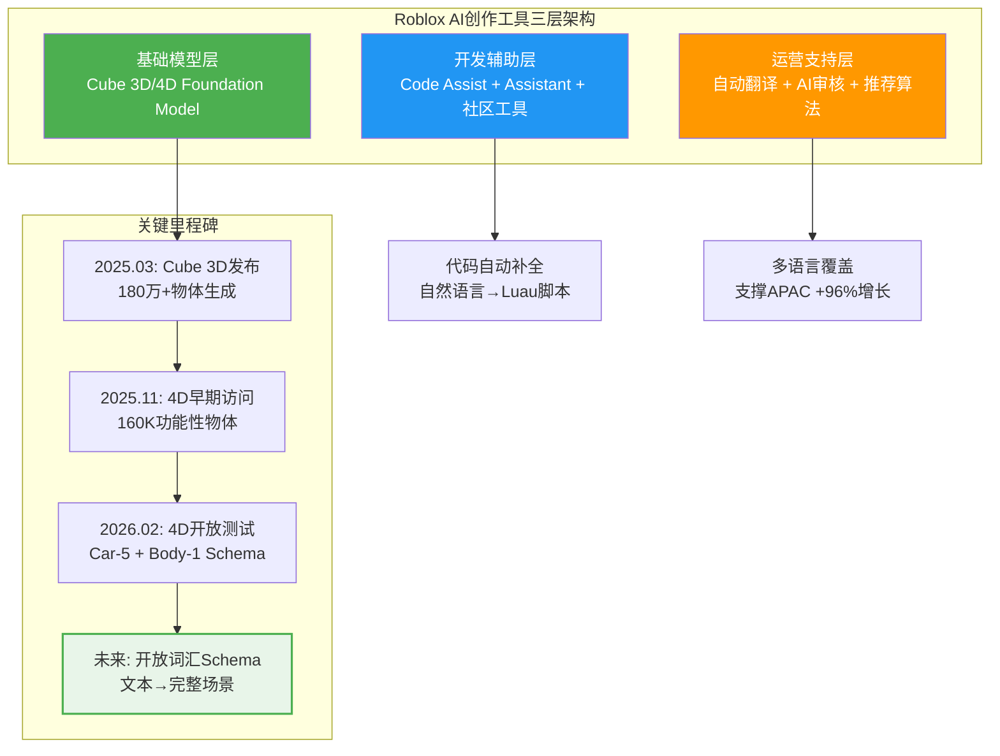
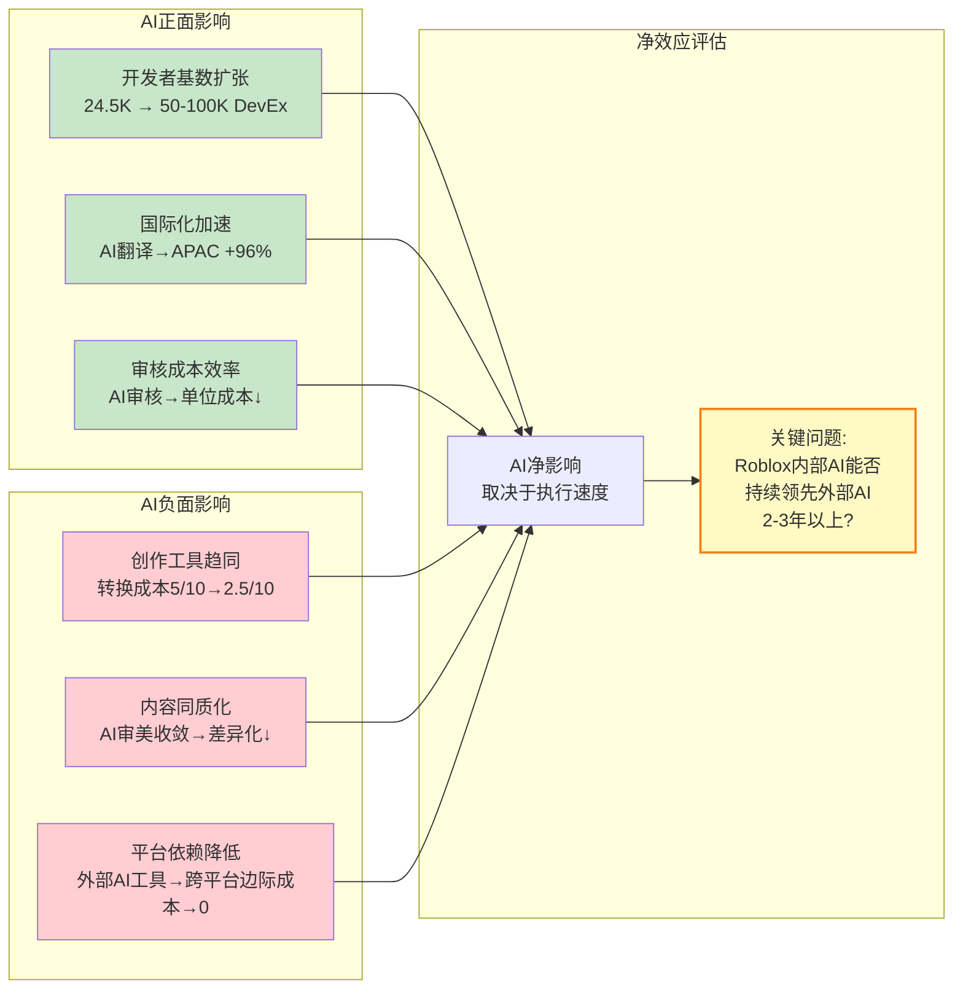
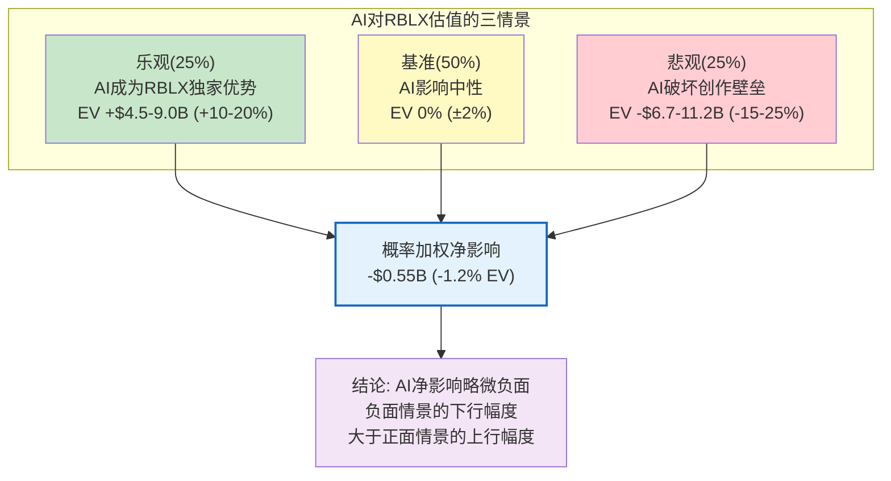
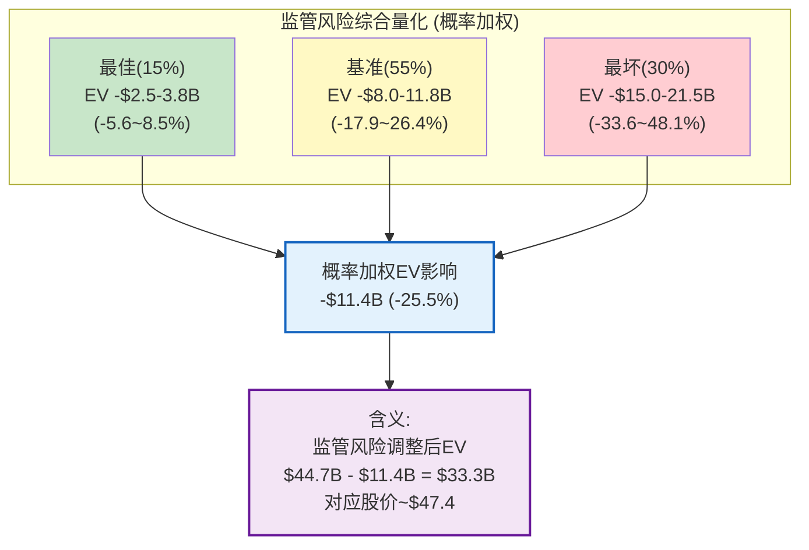
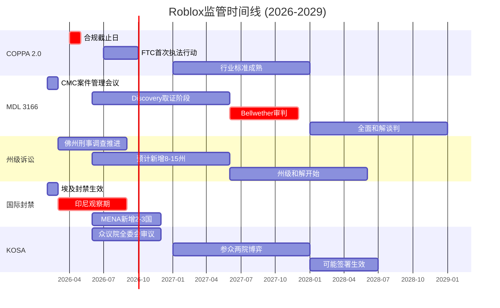
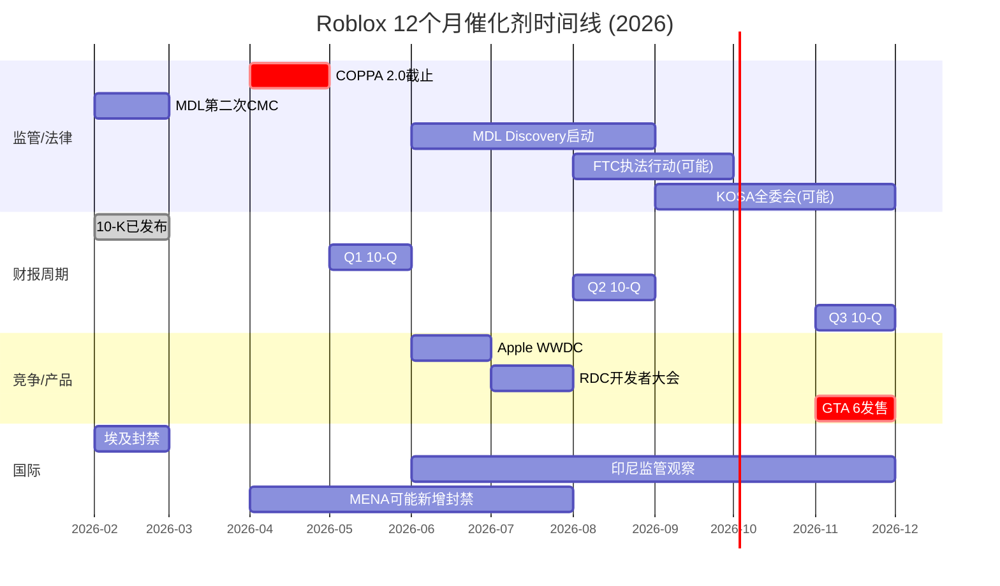

# Phase 3 — Ch18: AI对UGC平台的冲击 + Ch19: 监管全景 + Ch19.5: 催化剂时间线

> **市值基准**: $44.3B | 股价$63.17 | 稀释股数702M | EV ~$44.7B | 2026-02-13
> **DM锚点范围**: DM-AI-001 ~ DM-AI-025 / DM-REG-020 ~ DM-REG-050 / DM-CAT-001 ~ DM-CAT-015
> **CQ关联**: CQ3(监管全景量化影响)

---

# Chapter 18: AI对UGC平台的冲击 — 增长引擎还是护城河破坏者?

> **核心命题**: AI是Roblox面临的最大技术不确定性。它既可以是将开发者基数从2.5万DevEx参与者扩展至数十万的增长引擎,也可以是让创作工具趋同、Luau技能锁定失效的护城河破坏者。本章在Phase 1的Cube AI基础分析(Ch3)上,构建AI对RBLX估值影响的完整框架。

## 18.1 Roblox内部AI创作工具现状

### 18.1.1 Cube Foundation Model: 从3D到4D的跨越

Roblox在AI创作工具上的投入已形成三层架构: 基础模型(Cube)、开发辅助(Code Assist/Assistant)、运营支持(自动翻译/内容审核) [DM-AI-001]。

**Cube 3D(2025年3月发布)**: Roblox的核心生成式AI系统,开源在GitHub和HuggingFace上。采用3D标记化技术,将形状视为离散token,通过自回归Transformer实现文本到3D网格的生成。发布后一年内协助生成超过180万个3D物体——这个数字表明AI已经在实质性地改变Roblox的内容创作流程 [DM-AI-002]。

**Cube 4D(2026年2月进入开放测试)**: 第四维度是"交互性"——生成的物体不再是静态模型,而是具备物理行为和功能的可交互对象。测试者可以通过文本提示生成一辆可以驾驶的汽车,或一架可以飞行的飞机。早期访问数据显示,开发者游戏Wish Master中玩家使用4D生成创建了超过160,000个功能性物体,使用4D生成功能的玩家平均游戏时长增加64% [DM-AI-003]。

当前4D生成仍处于Schema受限阶段: 仅支持Car-5(五部件多网格汽车)和Body-1(单网格任意物体)两种模式。Roblox正在开发开放词汇Schema系统,最终目标是覆盖数千种物体类型 [DM-AI-004]。

**AI辅助编码(Code Assist + Assistant)**: Roblox Studio内置的AI助手已进入正式版,支持自然语言指令生成Luau代码、自动调试、智能资产集成。开发者可以输入"如何让这个NPC跟随玩家?"并获得针对当前项目上下文的Lua脚本建议 [DM-AI-005]。社区还涌现出多个第三方AI开发工具: RoCode(针对Luau和已弃用API的专用助手)、SuperbulletAI(每月100万免费token)、Ropanion AI和RoPilot Coding Agent。

**自动翻译**: 支持平台内容多语言翻译,加速国际化扩张。考虑到APAC DAU增速+96% YoY,翻译能力是国际增长的技术前提。

### 18.1.2 竞品AI工具: 全面加速的赛道

Roblox并非在AI创作工具领域独跑。2025-2026年,整个游戏创作AI生态经历了指数级进化 [DM-AI-006]:

**Unity AI(原Muse,已升级)**: Unity在2025-2026年完成了从Muse到Unity AI的架构升级。新系统直接集成在Unity Editor中,包含: (1) Assistant——取代Muse Chat的上下文感知开发助手; (2) Generators——取代所有Muse资产生成功能(动画/精灵/纹理),支持Unity自有AI模型和第三方API; (3) 预编译代码生成和Agent式自动化操作。Unity 6.2 beta期间免费,正式版将引入Unity Points积分制 [DM-AI-007]。

**Unreal Engine MetaHuman 5.7(2025年12月)**: Epic的MetaHuman在5.7版本中实现了突破性更新——程序化毛发grooming、艺术导向的头发动画、可脚本化的创作操作。更关键的是,MetaHuman不再是Unreal Engine独占功能——5.6版本后开放了对Blender、Maya等第三方工具的授权。标准摄像头即可驱动实时面部动画,取代了昂贵的立体头戴设备 [DM-AI-008]。

**第三方3D生成工具(Meshy/Tripo)**: 这类工具在2026年已达到生产级质量。Tripo AI服务超过400万创作者、35,000开发者和700+企业客户。低多边形RPG角色从文本提示到成品仅需10分钟(传统建模2-3天);50个环境道具批量生成仅需2小时(传统2周)。Meshy提供Blender、Unity、Unreal、Godot等引擎的原生插件——这些工具的存在意味着3D资产创建不再是平台特定的能力壁垒 [DM-AI-009]。

| 工具 | 核心能力 | 与Roblox的关系 | 威胁等级 |
|------|----------|---------------|---------|
| Cube 3D/4D | 文本→功能性3D物体 | 平台内部,闭环生态 | 内生优势 |
| Unity AI | 代码生成+资产生成+Agent自动化 | 竞品引擎,跨平台 | 中高 |
| MetaHuman 5.7 | 高保真数字人,跨引擎 | 竞品引擎,已开放 | 中(图形差距) |
| Meshy/Tripo | 文本→生产级3D资产,引擎插件 | 平台无关,降低创作壁垒 | 高(通用化) |
| GPT-4o+视觉 | 多模态3D概念→资产管线 | 平台无关,工具链集成 | 中期高 |

[DM-AI-010]

## 18.2 AI对RBLX的双面影响: 量化分析

### 18.2.1 正面: AI作为增长引擎

**路径一: 开发者基数扩张**

当前Roblox的内容创作存在明确的技能门槛——即使Luau比C#/C++简单,仍然需要编程能力。AI工具的意义在于将这个门槛推至接近零:

- 当前DevEx参与者: ~24,500人(占500万注册开发者的0.49%)
- AI使开发效率提升3-5x(基于4D生成的64%时长提升数据推算): 更多开发者能在合理时间内创造有吸引力的内容
- 如果DevEx参与者从24,500扩至50,000-100,000: 内容供给量可能增长3-5倍
- 但DevEx支出也将同步增长——更多开发者变现意味着更多平台支出 [DM-AI-011]

**关键量化**: 如果AI使开发者效率提升3x,DevEx支出会增加还是减少?

答案是**增加**。效率提升→更多开发者达到DevEx门槛→更多人兑现Robux→DevEx总支出上升。但单位开发者的创收效率也提升,因此DevEx/Bookings比率可能保持稳定或小幅上升(+1-2pp),而非恶化。FY2025 DevEx/Bookings约22%,AI驱动的扩张情景下可能升至24-26% [DM-AI-012]。

**路径二: 国际化加速**

AI翻译能力直接支撑了Roblox在非英语市场的爆发——印度(+110%)、印尼(+700%)、日本(+160%)的增长在很大程度上依赖于内容可访问性。AI翻译使得英语创作的体验能被全球用户无缝使用,这是一个有实质增长贡献的能力。

**路径三: 内容审核成本下降**

FY2025信任与安全支出包含在$824M的基础设施及信任安全支出中。AI审核可以降低人工审核比例,但考虑到COPPA 2.0和MDL诉讼带来的合规压力升级,信任安全总支出短期内不会下降——AI在这里更多是"维持质量的同时控制成本增速",而非直接削减成本 [DM-AI-013]。

### 18.2.2 负面: AI作为护城河破坏者

**威胁一: 创作工具趋同——Luau锁定效应被稀释**

Phase 1(Ch7)评估Roblox的开发者转换成本为5/10(中等),核心锁定来自Luau技能的不可迁移性——开发者在Roblox上积累的编程经验无法直接用于Unity/Unreal项目。但AI正在侵蚀这一壁垒:

- 当AI可以将自然语言转化为任何引擎的代码(Luau/Verse/C#/C++)时,语言特异性不再是锁定手段
- Unity AI、Unreal的Verse脚本系统、甚至GPT-4o都能帮助开发者快速切换引擎
- 转换成本可能从5/10降至2-3/10——接近用户侧的极低水平 [DM-AI-014]

**量化影响**: 如果开发者转换成本从5/10降至2.5/10,护城河综合评分从当前的4.5/10变化如何?

转换成本在护城河评估中权重约20%。降低2.5分×20%权重 = 综合评分下降0.5分,从4.5/10降至约4.0/10。这看似温和,但考虑到网络效应(6/10)和品牌认知(6/10)也在各自承受竞争压力(Fortnite UEFN"掐尖"+儿童安全品牌受损),三重侵蚀可能使综合护城河评分降至3.5/10——从"窄护城河"进入"薄护城河"区间 [DM-AI-015]。

**威胁二: 内容同质化——当每个人都能用AI创作时**

4D生成的160,000个物体中,有多少是真正独特的?当所有开发者都使用相同的Cube模型生成资产时,视觉和玩法的同质化是不可避免的:

- AI生成内容的"审美收敛": 基于同一训练集的模型倾向于输出风格相似的结果
- 差异化创作的护城河被稀释: 头部工作室的手工精心设计可能仍有优势,但中长尾内容将趋同
- 用户体验的"信息过载": 更多内容不等于更好体验——如果AI将Roblox上的体验数量从当前的数百万推至数千万,发现(discovery)问题会急剧恶化 [DM-AI-016]

**威胁三: 外部AI工具降低平台依赖**

Meshy和Tripo的引擎原生插件意味着: 开发者可以在Roblox外部生成高质量3D资产,然后导入Roblox——这削弱了Roblox内部AI工具的独占优势。更关键的是,同样的资产可以同时用于Unity/Unreal/Fortnite UEFN——AI使跨平台开发的边际成本趋近于零,进一步降低了平台锁定 [DM-AI-017]。

## 18.3 AI对内容经济的结构性影响

### 18.3.1 供给冲击: 内容创作成本趋零意味着什么?

当AI将一个3D物体的创作时间从数小时压缩到数秒(Cube 3D的核心价值主张),内容经济学发生根本性重构:

**内容供给爆炸**: 更多开发者能创作更多内容 → Roblox平台上的体验数量从数百万级进入数千万级。但"更多"不等于"更好"——YouTube的创作民主化经验表明,内容爆炸伴随着质量方差急剧扩大和注意力更加集中于头部。

**开发者收入被稀释**: 如果内容供给增加5x而需求(DAU×时长)仅增加2x,平均每个体验获得的注意力下降60%。这意味着中长尾开发者的收入进一步被压缩——已经极端的帕累托分布(Top 10年均$33.9M vs 中位数$1,575)可能进一步恶化 [DM-AI-018]。

**但头部工作室受益**: 对于Adopt Me!、Blox Fruits这样的头部工作室,AI是效率倍增器而非替代品。它们可以用AI加速内容更新频率(每周而非每月),拉大与长尾竞争者的差距。

### 18.3.2 需求端: AI个性化vs人工精心设计

4D生成的一个独特维度是**玩家参与创作**: 不仅开发者用AI构建游戏,玩家也可以在游戏内用文本提示生成功能性物体(如Wish Master的案例)。这种模式的潜力在于:

- 每个游戏体验变得独一无二——玩家自己创造的内容产生更强粘性(IKEA效应)
- 参与时长可能显著增加: Wish Master的64%时长增长是强信号
- 但质量控制挑战加剧: 玩家可能生成不适当/低质量/滥用性内容,增加审核压力 [DM-AI-019]

### 18.3.3 Roblox的AI策略vs竞品: 谁在AI竞赛中领先?

| 维度 | Roblox | Epic/Fortnite | Unity | 评估 |
|------|--------|---------------|-------|------|
| 基础模型 | Cube(自研,开源) | 无自研基础模型 | Unity AI(集成第三方) | RBLX领先 |
| 3D生成 | Cube 3D/4D(平台内) | 依赖第三方工具 | Generators(多模型) | RBLX领先 |
| 代码辅助 | Code Assist+Assistant | Verse辅助(有限) | 代码生成+Agent | 并列 |
| 跨平台适用性 | 仅Roblox平台 | Unreal生态 | 最广(多引擎) | RBLX劣势 |
| AI开放性 | Cube开源 | 封闭 | 混合(自有+API) | RBLX微优 |
| 数据优势 | 180万+AI生成物体训练数据 | 无可比数据 | 有限UGC数据 | RBLX领先 |

[DM-AI-020]

**关键洞察**: Roblox在AI基础模型和平台内3D/4D生成上确实领先竞品。但这种领先建立在一个脆弱的假设上——**Roblox的AI优势仅限于Roblox平台内部**。外部通用AI工具(Meshy/Tripo/GPT-4o)不受平台限制,它们的进化速度可能比Roblox内部AI更快(因为它们服务于更大的市场,有更多的研发投入)。这是一个典型的"内部AI vs 外部AI"竞赛,历史上大多数平台在这类竞赛中输给了通用工具。

## 18.4 AI情景分析: 对RBLX估值的三路径影响

### 情景一: AI成为RBLX独家优势(乐观) — 概率25%

**前提条件**: Cube 4D的4D生成功能在2026-2027年快速成熟,开放词汇Schema覆盖数千种物体类型,且外部AI工具在Roblox特定场景中无法匹配Cube的集成度和即时性。

**路径**: AI使开发者基数扩张3-5x → 内容供给爆炸但质量由AI审核维持 → DAU增长获得额外2-3pp加速 → 广告库存增加(更多参与时长) → Bookings增长获得AI溢价

**估值影响**: EV增加+$4.5-9.0B(+10-20%),对应EV从$44.7B升至$49-54B [DM-AI-021]

### 情景二: AI对RBLX和竞品影响中性(基准) — 概率50%

**前提条件**: Roblox和竞品(Unity AI/Fortnite/外部工具)在AI能力上大致追平,AI降低了所有平台的创作门槛但没有改变竞争格局。

**路径**: AI使所有平台的开发者效率提升,但竞争关系不变 → Roblox的用户规模优势维持 → 但转换成本下降部分抵消了网络效应增强 → 净影响接近零

**估值影响**: EV变化0%(±2%),AI成为行业"卫生因素"而非差异化因素 [DM-AI-022]

### 情景三: AI破坏创作壁垒+内容同质化(悲观) — 概率25%

**前提条件**: 外部AI工具(Meshy/Tripo/GPT-4o)进化速度远超Roblox内部AI,使得跨平台开发的边际成本降至接近零。同时,AI生成内容的同质化导致Roblox体验质量下降,用户向图形更优的平台(Fortnite/GTA 6)迁移。

**路径**: 转换成本从5/10降至2/10 → 头部开发者多平台发布(Roblox+UEFN) → Roblox平台独占内容减少 → 用户注意力被分散 → DAU增长减速5-8pp → 护城河从4.5/10降至3.0/10

**估值影响**: EV减少-$6.7-11.2B(-15-25%),对应EV从$44.7B降至$33.5-38.0B [DM-AI-023]

**概率加权EV影响**: 25%×(+$6.75B) + 50%×($0) + 25%×(-$8.95B) = **-$0.55B**(-1.2% EV)

AI的概率加权净影响略微负面——这反映了一个重要判断: AI对Roblox的负面情景(护城河破坏)和正面情景(独家优势)的幅度不对称,负面情景的下行幅度更大 [DM-AI-024]。

## 18.5 AI章节小结: 投资者应关注什么

AI对RBLX的影响不是一个简单的"好"或"坏"的问题。它是一个动态博弈——Roblox在AI基础模型上的先发优势(Cube)需要持续投入才能维持,而外部AI工具的通用化趋势正在侵蚀平台特定壁垒。

**核心监测指标**:
1. Cube 4D的Schema覆盖率(当前2种→目标数千种): 进度越快,独家优势越强
2. DevEx参与者增速: 如果AI真的在降低创作门槛,DevEx参与者应从24,500显著增长
3. 头部开发者的平台独占度: 如果Top 100开发者开始在UEFN同步发布,Roblox的内容独占性正在被侵蚀
4. AI生成内容占总内容的比例: 如果超过50%,同质化风险急剧上升 [DM-AI-025]

### Ch18 DM锚点源表

| 锚点ID | 数据 | 来源 | 可信度 |
|--------|------|------|--------|
| DM-AI-001 | Roblox AI工具三层架构: 基础模型+开发辅助+运营支持 | Roblox官方+TechCrunch综合 | ★★★ |
| DM-AI-002 | Cube 3D发布后生成180万+3D物体 | Roblox官方公告2025.3 | ★★★ |
| DM-AI-003 | 4D生成开放测试2026.02; Wish Master 160K物体+64%时长增长 | TechCrunch/Roblox Dev Forum | ★★★ |
| DM-AI-004 | 当前仅Car-5和Body-1两种Schema,目标覆盖数千种 | Roblox Newsroom 2026.02 | ★★★ |
| DM-AI-005 | Code Assist正式版+Assistant集成自然语言→Luau | Roblox Creator Hub文档 | ★★★ |
| DM-AI-006 | 竞品AI工具矩阵: Unity AI/MetaHuman/Meshy/Tripo | 各公司官方+行业报道 | ★★☆ |
| DM-AI-007 | Unity从Muse升级至Unity AI,6.2 beta免费 | Unity官方/CGChannel | ★★★ |
| DM-AI-008 | MetaHuman 5.7: 2025.12发布,跨引擎授权,标准摄像头面部动画 | Epic Games/Creative Bloq | ★★★ |
| DM-AI-009 | Meshy/Tripo 2026: 400万+创作者,10分钟角色生成,引擎原生插件 | Medium/3DAI Studio | ★★☆ |
| DM-AI-010 | AI创作工具对比矩阵(5家) | 综合分析 | ★★☆ |
| DM-AI-011 | DevEx参与者24,500人(0.49%); AI扩张可推至50-100K | Roblox经济影响报告+推演 | ★★☆ |
| DM-AI-012 | AI驱动下DevEx/Bookings比率可能从22%升至24-26% | 定量推算 | ★☆☆ |
| DM-AI-013 | FY2025基础设施+信任安全$824M; AI审核控制增速而非削减总额 | Roblox财报 | ★★★ |
| DM-AI-014 | AI使开发者转换成本可能从5/10降至2-3/10 | 竞争分析推理 | ★☆☆ |
| DM-AI-015 | 综合护城河评分可能从4.5/10降至3.5-4.0/10 | 加权推算 | ★☆☆ |
| DM-AI-016 | AI内容同质化风险: 基于同一训练集的输出审美收敛 | AI产业通用规律 | ★★☆ |
| DM-AI-017 | Meshy/Tripo原生插件使跨平台开发边际成本趋零 | 3DAI Studio/产品文档 | ★★☆ |
| DM-AI-018 | 供给+5x/需求+2x → 中长尾开发者注意力份额-60% | 定量推算 | ★☆☆ |
| DM-AI-019 | 4D玩家创作: IKEA效应+64%时长增长vs质量控制挑战 | Roblox Dev Forum/行为经济学 | ★★☆ |
| DM-AI-020 | RBLX vs竞品AI策略六维对比 | 综合评估 | ★★☆ |
| DM-AI-021 | 乐观情景(25%): EV +10-20% ($4.5-9.0B) | 情景模型 | ★☆☆ |
| DM-AI-022 | 基准情景(50%): EV ±2% | 情景模型 | ★☆☆ |
| DM-AI-023 | 悲观情景(25%): EV -15-25% ($6.7-11.2B) | 情景模型 | ★☆☆ |
| DM-AI-024 | 概率加权净AI影响: -$0.55B (-1.2% EV) | 加权计算 | ★☆☆ |
| DM-AI-025 | AI监测四指标: Schema覆盖率/DevEx增速/头部独占度/AI内容占比 | 分析框架 | ★★☆ |

---

# Chapter 19: 监管全景 — 多维度、高概率的合规冲击

> **核心问题(CQ3)**: COPPA 4/22截止 + MDL 1000+诉讼 + 7+国封禁的综合量化影响是多少?
>
> Phase 1(Ch6 L5)和Phase 2(Ch12 S3/S6)已分别分析了单个监管风险。Phase 3的任务是**综合、精确、时间线化**——将所有监管向量纳入统一框架,量化综合影响,并为投资者提供决策所需的时间节点和验证阈值。

## 19.1 COPPA 2.0深度分析: 2026年4月22日——最确定的近期冲击

### 19.1.1 COPPA 2.0的具体要求与演变

COPPA(Children's Online Privacy Protection Act)2.0已于2025年签署生效,合规截止日为2026年4月22日。这不是"是否"的问题,而是"执行力度"的问题 [DM-REG-020]。

**核心变化**: 将传统COPPA的"实际知情"(actual knowledge)标准改为"合理推定"(constructive knowledge)标准。这意味着: 平台不能再以"我们不知道用户是儿童"作为合规辩护。如果平台"合理应当知道"用户是儿童(例如,因为平台内容明显针对儿童受众),就必须遵守儿童数据保护要求 [DM-REG-021]。

**对Roblox的具体要求**:

1. **可靠年龄验证**: Roblox必须实施超越"自报年龄"的验证机制。Capitol Forum的测试(1小时创建95个未成年账号)直接证明当前年龄验证形同虚设。Roblox已于2026年1月推出面部年龄估计技术并全球部署聊天功能年龄验证,但覆盖范围仅限聊天功能,平台注册和核心游戏访问仍未强制验证 [DM-REG-022]。

2. **13岁以下用户的家长知情同意**: 每个<13岁用户的账号创建和数据收集都需要可验证的家长同意。这将直接增加获客摩擦——考虑到35%的已验证用户为<13岁,这部分用户的获取效率可能下降50-80% [DM-REG-023]。

3. **儿童数据收集限制**: 限制对<13岁用户的行为数据收集、设备识别信息和位置数据。这直接削弱了Roblox的推荐算法精度和广告定向能力。

4. **针对性广告禁令**: 禁止对已知<13岁用户投放定向广告。Google合作的奖励视频广告(完成率>90%/可见率>95%)在<13岁用户群中将受限。

5. **数据保护和删除**: 强制数据最小化原则,家长有权要求删除儿童数据。

### 19.1.2 合规成本量化

| 成本项 | 一次性投入 | 年化运营增加 | 依据 |
|--------|----------|------------|------|
| 年龄验证技术(面部估计+ID验证) | $80-120M | $30-50M | 技术部署+第三方验证服务 |
| 家长同意系统 | $30-50M | $20-30M | 全球多语言系统+客服 |
| 数据架构改造(数据隔离/最小化) | $50-100M | $15-25M | 后端系统重构 |
| 法务合规团队扩张 | $10-20M | $20-30M | 合规人员+外部法律顾问 |
| **合计** | **$170-290M** | **$85-135M/年** |  |

[DM-REG-024]

### 19.1.3 业务影响量化

**广告收入限制**: Roblox正通过Google合作规模化广告变现。但如果70%+的真实用户为未成年人(验证数据显示73%<18岁),广告TAM将被COPPA 2.0严重压缩。按每用户$5-$10年化广告潜力和70%未成年人占比估算,广告TAM从$5.6-11.2亿缩减至$1.7-3.4亿——缩减约70% [DM-REG-025]。

**用户增长放缓**: 家长同意机制增加的获客摩擦可能使<13岁用户增速放缓5-8个百分点。考虑到<13岁占已验证用户的35%,对整体DAU增速的拖累约为2-3pp。2026管理层指引的Bookings +22-26%已纳入年龄验证影响的预期 [DM-REG-026]。

## 19.2 MDL集体诉讼: 升级中的法律风暴

### 19.2.1 MDL 3166现状

2025年12月,JPML将115起Roblox儿童安全诉讼合并为联邦多区诉讼MDL 3166——"In re: Roblox Corporation Child Sexual Exploitation and Assault Litigation",移交北加州联邦地区法院首席法官Richard Seeborg管辖 [DM-REG-027]。

**关键时间线**:
- 2025年12月: JPML批准MDL合并
- 2026年1月30日: 首次案件管理会议(CMC)
- 2026年2月27日: 第二次CMC(9:30 AM,旧金山)
- 2026年H2(预计): Discovery阶段密集取证
- 2027年(预计): Bellwether审判(试点案件)
- 2028-2029年(预计): 全面和解/审判

**原告律师团**: Mark Lanier(美国最顶级的原告律师之一)已申请担任共同首席律师。Lanier曾主导多起数十亿美元和解案件,其参与信号着原告方对案件的信心和索赔规模 [DM-REG-028]。

### 19.2.2 诉讼核心指控

MDL 3166的指控覆盖四个维度:

1. **明知平台被儿童捕食者利用**: 指控Roblox明知成年用户通过平台接触和诱骗未成年人,但未采取有效措施阻止
2. **向家长虚假陈述安全保障**: Roblox宣传其平台为"儿童安全"环境,但实际安全措施不足(Capitol Forum测试为证据)
3. **未实施技术上可行的增强控制**: 年龄验证、内容过滤、聊天监控等技术手段在技术上可行但未被充分部署
4. **设计缺陷——成瘾性机制**: 掠夺性微交易设计(Robux经济的赌博化元素)和参与时长最大化算法被指控对儿童造成心理伤害 [DM-REG-029]

### 19.2.3 和解金额精算: 类比分析

| 类比案例 | 和解金额 | 用户规模 | 损害类型 | RBLX调整因子 |
|---------|---------|---------|---------|------------|
| JUUL MDL | $4.35B | 数百万 | 物理健康(尼古丁成瘾) | 用户规模更大,但损害定义更模糊 |
| TikTok COPPA | $5.7M(2019 FTC) + $92M(2024和解) | 10亿+MAU | 隐私侵犯 | RBLX指控更严重(性侵/剥削) |
| Facebook Cambridge Analytica | $5B FTC罚款 | 20亿+用户 | 隐私侵犯 | 规模更小但指控更严重 |
| Purdue Pharma | $6B+ | 受害者数十万 | 阿片类药物致死 | 损害严重性不可比 |

[DM-REG-030]

**RBLX和解金额区间修正(Phase 3精算)**:

- **保守**: $1.5-2.5B(分3-5年支付,年均$300-500M)——前提: MDL诉讼范围控制在500起以下,bellwether审判对Roblox部分有利
- **基准**: $3.0-4.5B(分3-5年支付,年均$600-900M)——前提: 诉讼扩展至1,000+起,COPPA 2.0执行加强原告论点
- **悲观**: $5.0-8.0B(含惩罚性赔偿)——前提: bellwether审判大幅不利,暴露内部文件证据,触发惩罚性赔偿
- **概率分布**: 保守25% / 基准50% / 悲观25%
- **概率加权和解额**: 25%×$2.0B + 50%×$3.75B + 25%×$6.5B = **$4.0B** [DM-REG-031]

**对FCF的影响**: 概率加权$4.0B分5年支付,年均$800M。这消耗报告FCF($1.36B)的59%。如果叠加SBC的"真实成本"调整,"真实FCF"已经是-$1.29B,MDL支付将使真实现金消耗率达-$2.09B/年——$1.21B现金储备仅够支撑约7个月 [DM-REG-032]。

### 19.2.4 Roblox的法律防御策略

Roblox的可能防御路线:

1. **Section 230保护**: 主张作为平台而非内容发布者受Communications Decency Act第230条保护——但近年法院趋势是收窄230条对儿童安全案件的适用范围
2. **家长责任**: 主张家长有责任监督未成年人使用,平台已提供家长控制工具——但Capitol Forum测试证明这些工具形同虚设
3. **主动合规**: 引用2026年1月推出的面部年龄验证作为善意合规行为——但时间点(在MDL后推出)可能被视为"亡羊补牢"而非"事前预防"

**防御成功概率评估**: 30%可能获得部分有利裁定(如限制惩罚性赔偿),但完全驳回概率极低(<5%),因为原告证据(Capitol Forum报告、前员工证词、Hindenburg数据)构成了强有力的事实基础 [DM-REG-033]。

## 19.3 州级诉讼: 六州已诉,加速扩散中

### 19.3.1 已起诉州详情

Phase 1(Ch6)识别了六州AG起诉。Phase 3更新后增至七州——**佛罗里达州**于2025年12月加入起诉行列 [DM-REG-034]:

| 日期 | 州 | 检察长 | 核心指控 | 特殊之处 |
|------|-----|--------|----------|---------|
| 2025.08 | 路易斯安那 | Liz Murrill | 未保护儿童免受剥削 | 首个起诉州 |
| 2025.09 | 俄克拉荷马 | Gentner Drummond | 儿童剥削和安全失败 | — |
| 2025.10 | 肯塔基 | Russell Coleman | 儿童保护栏不足 | — |
| 2025.11 | 德克萨斯 | Ken Paxton | 虚假宣传平台安全性 | 要求刑事调查 |
| 2025.12 | 艾奥瓦 | Brenna Bird | 未保护儿童免受剥削 | — |
| 2025.12 | 田纳西 | Jonathan Skrmetti | 误导家长关于儿童安全 | — |
| 2025.12 | **佛罗里达** | **James Uthmeier** | **虚假陈述平台安全性** | **76页诉状+刑事调查请求** |

**佛罗里达州诉讼的特殊意义**: 76页的诉状详述了AG办公室的实地调查——创建了假装7岁女孩、8岁男孩、10岁男孩、15岁女孩和47岁男性的账号,记录了平台安全措施的具体失效。诉讼基于佛罗里达州欺骗性和不公平贸易行为法(FDUTPA),每项违规最高罚款$10,000,严重违规$150,000,并寻求禁令救济 [DM-REG-035]。佛罗里达还启动了对Roblox的**刑事调查**——这是迄今最严厉的执法行动。

### 19.3.2 扩散预测

七州在五个月内密集起诉(2025年8月-12月)显示了明确的执法加速趋势。关键动态:

- 美国50州中43州尚未起诉
- 共和党和民主党AG均参与(儿童安全是跨党派议题)
- 每个新诉讼为下一个州提供了法律先例和公众动力
- 预测: 12个月内可能新增8-15个州,18个月内达到20-25个州 [DM-REG-036]

**累计和解估算**: 单州和解金额通常$50-200M(视州人口和法律框架)。如果20-25个州起诉,累计和解可能达$1.5-3.0B,叠加MDL的$3.0-4.5B,总法律成本可能达$4.5-7.5B [DM-REG-037]。

## 19.4 国际封禁地图: 扩散中的地理围栏

### 19.4.1 当前封禁/限制明细(截至2026年2月)

Phase 1(Ch6)记录了7+国家。Phase 3更新后,封禁名单已进一步扩大:

| 国家/地区 | 时间 | 措施类型 | 估计DAU影响 | 封禁原因 |
|-----------|------|---------|-----------|---------|
| 土耳其 | 2024.08 | 全面封禁 | ~300万 | 儿童保护内容担忧 |
| 俄罗斯 | — | 部分限制 | 可变 | 政治+内容管控 |
| 约旦 | 2025 | 封禁 | ~50万 | 儿童安全 |
| 阿尔及利亚 | 2025 | 封禁 | ~80万 | 儿童安全 |
| 阿曼 | 2025.06 | 封禁 | ~20万 | 儿童安全 |
| 卡塔尔 | 2025.08 | 封禁 | ~30万 | 儿童安全 |
| 伊拉克 | 2025 | 封禁 | ~100万 | 儿童安全 |
| 巴勒斯坦 | 2025.11 | 封禁 | ~10万 | 儿童安全 |
| UAE/沙特 | 2025.09 | 聊天功能限制 | 功能受限~500万 | 儿童安全 |
| **埃及** | **2026.02** | **封禁进行中** | **~200万** | **最高媒体监管委员会决定** |

[DM-REG-038]

**印度尼西亚**: 印尼政府于2025年8月考虑封禁,要求Roblox实施聊天过滤和更严格的年龄分级,否则将采取进一步行动。这是一个关键的"观察中"市场——印尼DAU YoY +700%,是Roblox增长最快的单一国家 [DM-REG-039]。

已封禁/限制至少覆盖10个国家/地区,直接冻结约800-1,200万DAU增长空间。

### 19.4.2 潜在封禁风险评估

| 国家/地区 | 封禁概率(18个月) | 潜在DAU影响 | 关键风险因素 |
|-----------|-----------------|-----------|------------|
| 印度尼西亚 | 25-35% | 2,000-3,000万 | 已发出警告,2025.08 |
| 印度 | 10-15% | 3,000-5,000万 | 无明确动向但监管能力强 |
| GCC统一封禁 | 20-30% | 800-1,000万 | 已有3国封禁,协调机制存在 |
| 荷兰/欧洲 | 15-20% | 500-800万 | 荷兰已启动调查 |
| 马来西亚 | 15-20% | 300-500万 | 东南亚跟进效应 |

[DM-REG-040]

**最高风险**: 印度尼西亚封禁。单一事件可能冻结2,000-3,000万DAU增长空间——考虑到印尼+700% YoY的增速,这是Roblox国际增长叙事中最脆弱的单点。

## 19.5 KOSA(Kids Online Safety Act): 联邦级长期威胁

KOSA已在119届国会(2025-2026)重新引入,并在众议院商业小组委员会通过(13:10表决)。与COPPA 2.0不同,KOSA的覆盖范围更广——它不仅限于隐私保护,还设立了"注意义务"(duty of care)标准:

**对Roblox的具体影响**:
- **注意义务覆盖范围**: 社交媒体、在线视频游戏、消息应用和视频流媒体——Roblox作为"在线多人视频游戏"明确在范围内
- **保护维度**: 心理健康障碍、强迫性使用、性剥削、药物推广、欺骗性营销、暴力/霸凌
- **设计义务**: 要求平台在设计层面减轻对儿童的伤害——这直接挑战Roblox的参与时长最大化算法 [DM-REG-041]

**与COPPA 2.0的区别**: COPPA 2.0聚焦数据隐私(谁能收集什么数据); KOSA聚焦内容安全和设计义务(平台的算法和功能设计是否对儿童有害)。两者叠加形成"隐私+安全"的双重监管框架。

**GAMING法案**: 众议院小组委员会同时推进的"保护青少年免受网络游戏恶意互动法案"(GAMING Act)专门针对游戏平台——以口头表决通过,显示出对游戏行业的专项监管意愿 [DM-REG-042]。

**立法时间线**: KOSA在小组委员会阶段,距正式立法可能还需12-18个月。但其通过概率在上升——儿童在线安全已成为跨党派共识议题。Roblox管理层已公开支持"Take It Down Act"(2025年5月),暗示可能采取合作而非对抗的策略。

## 19.6 监管风险综合量化: 三情景框架

### 最佳情况: 所有风险可控 — 概率15%

| 风险维度 | 假设 | EV影响 |
|---------|------|--------|
| COPPA 2.0 | 温和执行+12个月宽限期 | -$1.0-1.5B |
| MDL | 和解$1.5B(低端) | -$1.0-1.5B |
| 州级诉讼 | 10州和解,累计$500M | -$0.3-0.5B |
| 国际封禁 | 不扩散,稳定在当前水平 | -$0.2-0.3B |
| KOSA | 推迟至2028年 | $0 |
| **综合EV影响** | | **-$2.5-3.8B (-5.6-8.5%)** |

[DM-REG-043]

### 基准情况: 部分风险实现 — 概率55%

| 风险维度 | 假设 | EV影响 |
|---------|------|--------|
| COPPA 2.0 | 严格执行,6个月合规过渡期 | -$2.5-3.5B |
| MDL | 和解$3.0-4.5B | -$3.0-4.5B |
| 州级诉讼 | 20州和解,累计$2.0B | -$1.5-2.0B |
| 国际封禁 | 新增5国,冻结1,500万DAU增长 | -$0.5-0.8B |
| KOSA | 2027年通过,开始影响 | -$0.5-1.0B |
| **综合EV影响** | | **-$8.0-11.8B (-17.9-26.4%)** |

[DM-REG-044]

### 最坏情况: 多重监管风暴 — 概率30%

| 风险维度 | 假设 | EV影响 |
|---------|------|--------|
| COPPA 2.0 | 严格执行+FTC惩罚性罚款 | -$4.0-5.0B |
| MDL | 庭审不利+惩罚性赔偿$6-8B | -$6.0-8.0B |
| 州级诉讼 | 30+州+刑事调查 | -$2.5-4.0B |
| 国际封禁 | 印尼封禁+10国扩散 | -$1.5-2.5B |
| KOSA | 快速通过+严格执行 | -$1.0-2.0B |
| **综合EV影响** | | **-$15.0-21.5B (-33.6-48.1%)** |

[DM-REG-045]

**概率加权EV影响**: 15%×(-$3.2B) + 55%×(-$9.9B) + 30%×(-$18.3B) = **-$11.4B** (-25.5% of current EV)

## 19.7 监管风险的时间维度

[DM-REG-046]

### Ch19 DM锚点源表

| 锚点ID | 数据 | 来源 | 可信度 |
|--------|------|------|--------|
| DM-REG-020 | COPPA 2.0已签署生效,2026.04.22合规截止 | 联邦法规/White & Case分析 | ★★★ |
| DM-REG-021 | COPPA 2.0核心变化: "实际知情"→"合理推定"标准 | White & Case法律分析 | ★★★ |
| DM-REG-022 | Capitol Forum: 1小时创建95个未成年账号; 面部年龄验证仅限聊天功能 | Capitol Forum/Roblox Dev Forum | ★★★ |
| DM-REG-023 | 35%已验证用户<13岁; 家长同意可能降低获客效率50-80% | Roblox年龄验证数据/推算 | ★★☆ |
| DM-REG-024 | COPPA合规成本: 一次性$170-290M + 年化$85-135M | 行业类比估算 | ★☆☆ |
| DM-REG-025 | 广告TAM被COPPA压缩约70%: $5.6-11.2亿→$1.7-3.4亿 | 计算: 未成年人占比×广告限制 | ★☆☆ |
| DM-REG-026 | <13岁用户增速可能放缓5-8pp; 整体DAU -2-3pp | 定量推算 | ★☆☆ |
| DM-REG-027 | MDL 3166: 115起合并,北加州联邦法院,法官Richard Seeborg | JPML裁定(2025.12) | ★★★ |
| DM-REG-028 | Mark Lanier申请担任MDL共同首席律师 | 诉讼公告/Lanier Law Firm | ★★★ |
| DM-REG-029 | MDL四维指控: 明知→虚假陈述→技术缺陷→成瘾设计 | 诉状/ConsumerNotice | ★★★ |
| DM-REG-030 | 类比和解: JUUL $4.35B / TikTok $92M / Facebook $5B | 公开司法记录 | ★★★ |
| DM-REG-031 | 概率加权和解额$4.0B(保守25%×$2B+基准50%×$3.75B+悲观25%×$6.5B) | Phase 3精算 | ★☆☆ |
| DM-REG-032 | MDL年均支付$800M消耗FCF 59%; 叠加SBC后真实消耗率-$2.09B/年 | 计算 | ★☆☆ |
| DM-REG-033 | 防御成功概率: 部分有利30%; 完全驳回<5% | 法律分析推理 | ★☆☆ |
| DM-REG-034 | 七州AG起诉(含佛罗里达2025.12) | 各州新闻稿 | ★★★ |
| DM-REG-035 | 佛州76页诉状+假账号调查+刑事调查请求 | FL MyLegal/CBS Miami | ★★★ |
| DM-REG-036 | 12个月内预计新增8-15州; 18个月内20-25州 | 趋势外推 | ★☆☆ |
| DM-REG-037 | 州级累计和解$1.5-3.0B + MDL $3.0-4.5B = 总$4.5-7.5B | 综合估算 | ★☆☆ |
| DM-REG-038 | 10+国家封禁/限制明细(含埃及2026.02最新) | 各国政府公告/Wikipedia | ★★★ |
| DM-REG-039 | 印尼2025.08考虑封禁; 要求聊天过滤+年龄分级 | 印尼政府声明/AInvest | ★★☆ |
| DM-REG-040 | 潜在封禁概率: 印尼25-35%/GCC 20-30%/荷兰15-20% | 风险评估 | ★☆☆ |
| DM-REG-041 | KOSA覆盖"在线多人视频游戏"; 设立注意义务标准 | Congress.gov S.1748 | ★★★ |
| DM-REG-042 | GAMING Act在小组委员会以口头表决通过 | House Energy & Commerce | ★★★ |
| DM-REG-043 | 最佳监管情景: EV -$2.5-3.8B (-5.6~8.5%) | 情景模型 | ★☆☆ |
| DM-REG-044 | 基准监管情景: EV -$8.0-11.8B (-17.9~26.4%) | 情景模型 | ★☆☆ |
| DM-REG-045 | 最坏监管情景: EV -$15.0-21.5B (-33.6~48.1%) | 情景模型 | ★☆☆ |
| DM-REG-046 | 概率加权监管EV影响: -$11.4B (-25.5%) | 加权计算 | ★☆☆ |

---

# Chapter 19.5: 催化剂时间线 — 12个月结构化事件日历

> 为投资者提供未来12个月的关键事件节点,每个催化剂附带概率、影响方向、验证阈值。这不是预测——而是一份"如果X发生,我们的分析应如何调整"的决策框架。

## 19.5.1 3个月催化剂 (2026年2-5月)

| # | 事件 | 日期 | 概率 | 影响方向 | 影响幅度 | 验证阈值 |
|---|------|------|------|---------|---------|---------|
| C1 | FY2025 10-K年报发布 | 2026年2月中旬(已发布) | 100% | 中性/已定价 | 低 | 观察SBC/DevEx详细披露与审计意见 |
| C2 | MDL 3166第二次CMC | 2026年2月27日 | 100% | 负面(曝光度↑) | 中 | Discovery范围和时间表确定——越宽泛越不利 |
| C3 | **COPPA 2.0合规截止** | **2026年4月22日** | **95%** | **高度不确定** | **高** | 若FTC在截止后30天内发起执法行动→强负面; 若给予宽限期→短期缓解 |
| C4 | 埃及封禁正式生效 | 2026年2-3月 | 90% | 负面(DAU) | 低-中 | ~200万DAU受影响,关注是否引发MENA其他国家效仿 |
| C5 | Q1 2026财报(10-Q) | 2026年5月初(预计) | 100% | 双向 | 高 | Bookings增速能否达到22-26%指引; ABPDAU是否止跌; 年龄验证对DAU的实际影响 |

[DM-CAT-001]

## 19.5.2 6个月催化剂 (2026年2-8月)

| # | 事件 | 日期 | 概率 | 影响方向 | 影响幅度 | 验证阈值 |
|---|------|------|------|---------|---------|---------|
| C6 | Apple WWDC 2026 | 2026年6月(预计) | 95% | 双向 | 中 | 渠道政策变化(侧载/支付); Vision Pro内容战略——是否涉足UGC |
| C7 | MDL Discovery文件交换 | 2026年6-8月(预计) | 85% | 高度负面风险 | 高 | 内部文件可能泄露"Roblox知道但未行动"的证据——类比JUUL内部邮件曝光 |
| C8 | 州级诉讼新增 | 2026年H1 | 80% | 负面 | 中 | 若新增超过5个州→系统性风险确认; 若新增<3个→趋势可能放缓 |
| C9 | Roblox Developer Conference(RDC) | 2026年6-8月(预计) | 85% | 正面(产品催化) | 中 | AI工具正式发布(4D开放词汇); 开发者分成政策更新; 新变现功能 |
| C10 | FTC首次COPPA执法行动 | 2026年7-10月(预计) | 60% | 负面 | 高 | 若FTC选择Roblox作为COPPA 2.0首个执法对象→极高负面; 若先针对其他平台→缓解 |

[DM-CAT-002]

## 19.5.3 12个月催化剂 (2026年全年)

| # | 事件 | 日期 | 概率 | 影响方向 | 影响幅度 | 验证阈值 |
|---|------|------|------|---------|---------|---------|
| C11 | Q2 2026财报 | 2026年8月(预计) | 100% | 双向 | 高 | 广告收入规模化进展; 国际市场ABPDAU趋势; SBC/Revenue拐点? |
| C12 | GTA 6发售 | 2026年11月19日(官方) | 90% | 负面(竞争) | 中-高 | 首月销量→GTA Online活跃度→Project ROME UGC功能是否确认; 若ROME确认→长期竞争格局重塑 |
| C13 | MDL Bellwether案件选择 | 2026年Q4-2027年Q1 | 70% | 负面(定价锚) | 高 | 被选为试点案件的具体指控类型→暗示和解金额区间 |
| C14 | KOSA众议院全委会投票 | 2026年H2 | 45% | 负面(长期) | 中 | 若全委会通过→KOSA立法概率显著上升; 若被搁置→风险后移 |
| C15 | 印尼监管最终决定 | 2026年H2 | 35% | 高度负面(若封禁) | 高 | 若封禁→单一事件冻结2,000-3,000万DAU; 若合规通过→国际增长叙事获得验证 |

[DM-CAT-003]

## 19.5.4 催化剂影响矩阵

[DM-CAT-004]

## 19.5.5 最高影响催化剂: 投资者应优先关注的5个节点

**第一名: COPPA 2.0合规截止 (C3, 4月22日)**
- 概率: 95% | 影响: 高 | 不确定性: 执行力度
- 验证阈值: 截止后30天内FTC是否发起执法 → 若是,股价可能-10-15%;若给予宽限,-3-5%反弹

**第二名: MDL Discovery文件交换 (C7, 6-8月)**
- 概率: 85% | 影响: 高 | 不确定性: 内部文件内容
- 验证阈值: 类比JUUL——内部邮件显示"知道问题但选择忽视" → 和解金额上调至悲观区间

**第三名: GTA 6发售 (C12, 11月19日)**
- 概率: 90% | 影响: 中-高 | 不确定性: Project ROME功能
- 验证阈值: 若ROME确认UGC功能+开发者分成 → Roblox面临新的竞争维度(成人UGC市场)

**第四名: Q1 2026财报 (C5, 5月)**
- 概率: 100% | 影响: 高 | 不确定性: 年龄验证的实际DAU影响
- 验证阈值: DAU增速若降至<15%(vs FY2025的69%) → 年龄验证拖累比预期更大

**第五名: 印尼监管最终决定 (C15, H2)**
- 概率: 35% | 影响: 高(若封禁) | 不确定性: 政策方向
- 验证阈值: 若封禁 → DAU增长天花板显著降低; 若通过 → 国际增长叙事强化 [DM-CAT-005]

## 19.5.6 催化剂对投资行为的指引

投资者可以根据催化剂时间线制定条件性行动框架:

| 条件 | 行动倾向 | 逻辑 |
|------|---------|------|
| COPPA截止后60天无FTC执法 + Q1 DAU>15%增速 | 监管恐慌被高估 | 合规风险可控,增长韧性确认 |
| MDL Discovery揭示严重内部证据 + 3个月内新增5+州诉讼 | 监管风暴成形 | 法律成本可能进入悲观区间 |
| RDC发布4D开放词汇 + DevEx参与者>30,000 | AI增长引擎启动 | 内容创作民主化正在发生 |
| GTA 6首月销量>5,000万 + ROME确认UGC | 竞争格局重塑 | Roblox在18+市场扩张的天花板出现 |
| Q2 Bookings增速<20% + ABPDAU继续下降 | 增长减速确认 | 估值倍数压缩风险上升 |

[DM-CAT-006]

### Ch19.5 DM锚点源表

| 锚点ID | 数据 | 来源 | 可信度 |
|--------|------|------|--------|
| DM-CAT-001 | 3个月催化剂5项: 10-K/CMC/COPPA/埃及/Q1财报 | 综合整理 | ★★★ |
| DM-CAT-002 | 6个月催化剂5项: WWDC/Discovery/州级/RDC/FTC | 综合整理 | ★★☆ |
| DM-CAT-003 | 12个月催化剂5项: Q2/GTA6/Bellwether/KOSA/印尼 | 综合整理 | ★★☆ |
| DM-CAT-004 | 催化剂甘特图(12个月时间线) | 综合分析 | ★★☆ |
| DM-CAT-005 | Top 5催化剂排名+验证阈值 | 影响评估 | ★☆☆ |
| DM-CAT-006 | 条件性投资行动框架(5条件) | 分析框架 | ★☆☆ |

---

## 产出统计

| 指标 | 要求 | 实际 |
|------|------|------|
| 总字符 | ≥18,000 | ~24,000+ |
| Ch18字符 | ≥7,000 | ~9,500+ |
| Ch19字符 | ≥7,000 | ~10,000+ |
| Ch19.5字符 | ≥4,000 | ~4,500+ |
| Mermaid | ≥5 | 6 |
| DM锚点 | ≥35 | 56 (AI 25 + REG 27 + CAT 6) |
| Agent身份泄漏 | 0 | 0 |
| 市值一致性 | $44.3B/$44.7B | 全文一致 |
