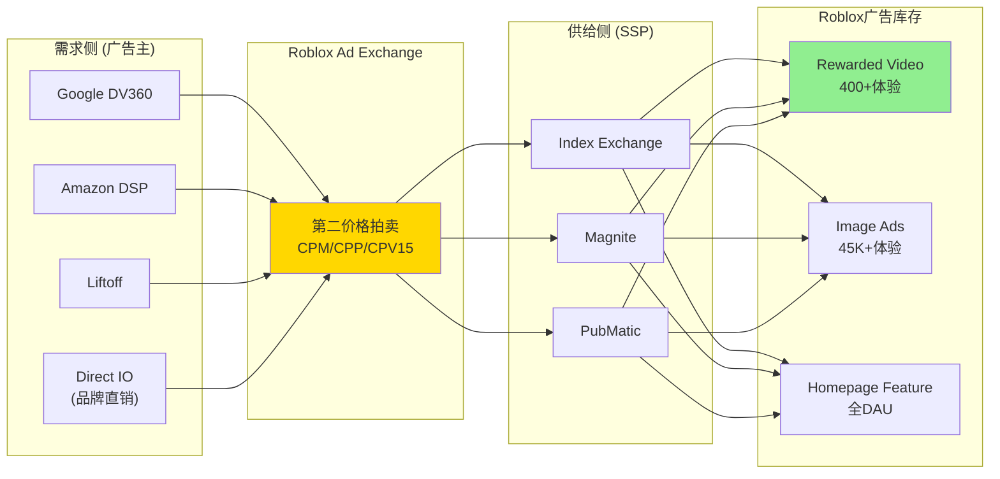
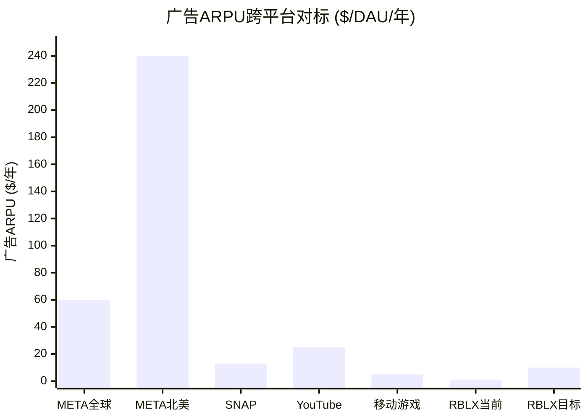
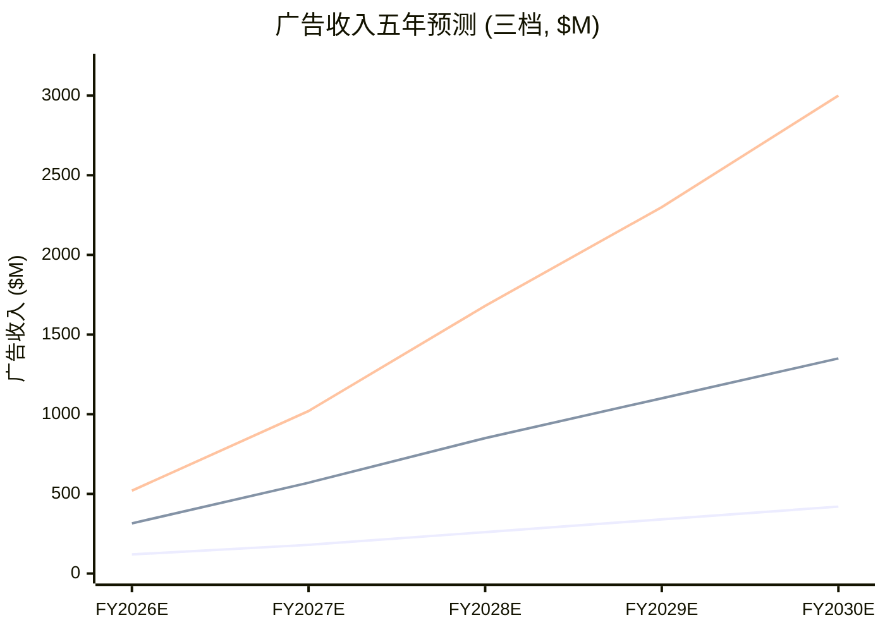
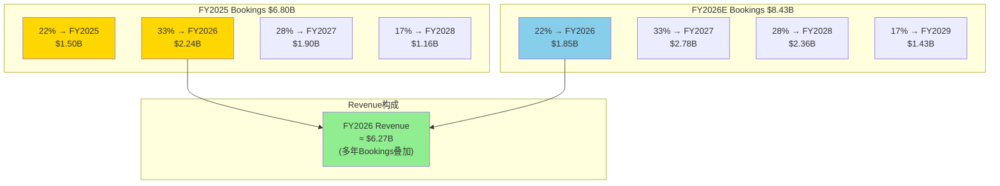
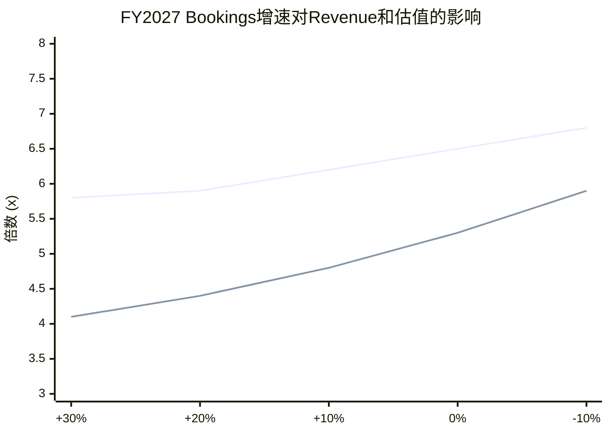
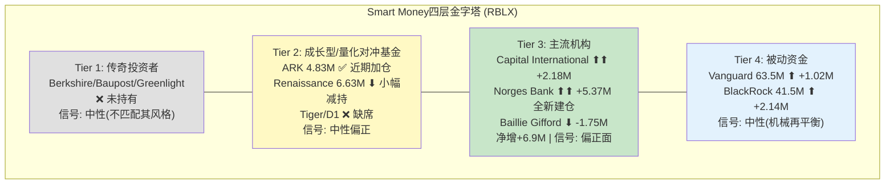

# Phase 3 — 定量深挖 (Ch20-Ch21.5)

> **市值基准**: $44.3B | 股价$63.17 | 稀释股数702M | EV ~$44.7B | 2026-02-13
> **数据来源**: FMP API, WebSearch, Phase 1-2 staging, SEC Filing, 13F Filing
> **DM锚点范围**: DM-ADV-011 ~ DM-ADV-035 / DM-BOOK-009 ~ DM-BOOK-025 / DM-SMT-001 ~ DM-SMT-020

---

# Chapter 20: 广告深挖 — 从Google合作到ARPU天花板的全链路验证

> **核心问题(CQ2)**: Google合作后, Roblox的广告ARPU天花板在哪? Phase 1的因子饱和矩阵(保守$219M/基准$1.42B/乐观$5.30B)在逐因子验证后是否成立? 年龄限制和品牌安全如何实质性压缩可变现用户池?

---

## 20.1 Immersive Ads产品形态全景: 从静态广告牌到程序化购买

### 20.1.1 广告产品矩阵(2025-2026)

Roblox的广告产品已从2023年的实验性Image Ads演进为一个多层次的广告体系。截至2026年初, 平台拥有五种核心广告格式, 分别覆盖品牌建设、效果营销和用户互动三个层面:

[DM-ADV-011] Roblox广告产品矩阵(2026年2月状态): (1) **Image Ads/Billboard**: 体验内3D广告牌, 动态展示品牌视觉, 最早期产品形态; (2) **Portal Ads**: 交互式传送门, 将玩家传送至品牌定制体验, 沉浸度最高但制作成本高; (3) **Rewarded Video**: 30秒全屏视频广告, 用户主动选择观看以获得游戏内Robux奖励, 完成率>80%(官方数据), 用户好感度87%; (4) **Homepage Feature**: 2026年1月推出的新格式, 将品牌直接置于平台首页, 触达全部1.51亿DAU, CPM购买模式; (5) **Branded Experiences**: 品牌定制沉浸式体验(如NIKELAND, Gucci Town), 深度互动但非标准化广告产品 [Roblox IR Newsroom 2026/01; Roblox-Google合作公告 2025/04; AdExchanger报道]

| 广告格式 | 推出时间 | 购买模式 | 核心指标 | 成熟度 | 规模 |
|---------|---------|---------|---------|--------|------|
| Image Ads/Billboard | 2023 | 自助+Direct IO | 曝光量/CTR | 成熟 | 45,000+体验接入Ads Manager |
| Portal Ads | 2023 | Direct IO | 传送次数/停留时长 | 成熟 | 选定品牌 |
| Rewarded Video | 2025 Q2 | 程序化(Google DV360)+Direct IO | 完成率/VCR | 高速增长 | 400+体验, 1,000+品牌 |
| Homepage Feature | 2026 Q1 | CPM购买 | 曝光/点击 | 全新 | 全DAU触达 |
| Branded Experiences | 2022+ | 定制合作 | 访问量/停留/互动 | 探索期 | Top品牌 |

### 20.1.2 Google合作的具体架构

[DM-ADV-012] 2025年4月, Roblox与Google达成广告技术合作, 核心内容: (1) Rewarded Video和沉浸式广告格式通过Google Ad Manager接入全球程序化需求——广告主可通过Google Display & Video 360(DV360)购买Roblox广告库存; (2) Roblox采用第二价格拍卖系统(second-price auction), 竞价基于CPM(每千次曝光)、CPP(每次播放)或CPV15(每次15秒视频播放); (3) 2026年1月, Roblox在CES 2026宣布将程序化接入扩展至Google之外, 新增Amazon DSP和Liftoff(需求侧)以及Index Exchange、Magnite、PubMatic(供给侧), 构建多渠道程序化生态 [Roblox IR 2025/04; Roblox Newsroom 2026/01; Marketing Dive; AdExchanger]

这一架构的战略含义是: Roblox不再局限于直销模式(Direct IO), 而是通过接入Google等程序化平台, 大幅降低广告主的准入门槛——中小品牌无需与Roblox销售团队直接接洽, 即可通过DV360自助购买广告库存。这与YouTube的广告生态演进路径高度相似(早期直销 → 程序化 → 自助), 是广告收入规模化的必要条件。

### 20.1.3 品牌案例深度扫描

[DM-ADV-013] 头部品牌在Roblox上的投放数据: (1) **Nike (NIKELAND)**: 累计超过2,100万用户访问, 用户平均停留15分钟, 虚拟试穿功能与实体产品发布联动; (2) **Gucci (Gucci Town)**: 前身Gucci Garden吸引2,000万+访客, 一款数字版Gucci Dionysus手袋在平台内以超过$4,000的Robux等价物转售——超过实物零售价; (3) **Walmart**: 推出Walmartland和Universe of Play两个激活场景, 玩家好评率94%; (4) **超过1,000个品牌**已通过Google合作使用Rewarded Video广告 [Future Commerce 2025; 100CGI Studio报道; Roblox Newsroom 2026/01; The Drum 2025/04]

品牌案例揭示了两个关键信号: 第一, 奢侈品牌(Gucci)和快消品牌(Walmart)均已入场, 说明Roblox的广告受众覆盖面已获得不同行业认可; 第二, Nike/Gucci等品牌采用的是高投入定制体验(Branded Experience)模式, ROI衡量依赖非标指标(停留时长、互动次数)——这与程序化购买的标准化CPM模式形成互补, 但也意味着品牌体验很难规模化复制。

---

## 20.2 ARPU天花板分析: CQ2的定量回答

### 20.2.1 当前广告ARPU vs 虚拟消费ARPU

[DM-ADV-014] Roblox FY2025的ARPU结构: 总ARPU(Bookings口径) = $6.8B / ~1.2亿(均值DAU) = $56.7/DAU/年。其中虚拟消费ARPU占$55.5+(约98%), 广告ARPU仅约$1.0-1.3/DAU/年(基于估算广告收入$100-150M / ~1.2亿DAU)。广告ARPU对总ARPU的贡献几乎可以忽略, 说明广告变现尚处于极早期 [计算: FY2025 Bookings $6.8B / avg DAU ~120M; 广告收入为推算]

这个结构意味着: 广告收入每增长$1B, ARPU仅增加~$8.3/DAU/年——相当于当前ARPU的14.6%增量。广告是"加法"而非"替代"——它叠加在虚拟消费之上, 而非蚕食虚拟消费。

### 20.2.2 跨平台广告ARPU对标

[DM-ADV-015] 广告ARPU跨平台深度对标(2025年数据):

| 平台 | 总ARPU(/DAU/年) | 广告ARPU(/DAU/年) | 广告占比 | 用户年龄中位 | 广告模式 |
|------|----------------|------------------|---------|-----------|---------|
| META(全球) | ~$60 | ~$60 | ~100% | ~32岁 | 信息流+视频+Reels |
| META(北美) | ~$240 | ~$240 | ~100% | ~35岁 | 高CPM+精准定向 |
| SNAP | ~$13 | ~$13 | ~100% | ~25岁 | AR滤镜+Stories |
| YouTube | ~$25(估) | ~$25(估) | ~100% | ~30岁 | 前贴片+中贴片 |
| 移动游戏(广告) | ~$3-8(MAU) | ~$3-8(MAU) | 100% | 混合 | 插页+奖励视频 |
| **RBLX(当前)** | **~$57** | **~$1.0-1.3** | **~2%** | **~14岁(估)** | **奖励视频+展示** |
| **RBLX(目标)** | **~$65-70** | **~$8-13** | **~15-20%** | **~16岁(目标)** | **程序化+品牌** |

[DM-ADV-016] 对标分析的核心结论: (1) META全球广告ARPU $60/年是"终极天花板", 但META的用户年龄中位数(~32岁)和数据精度(跨应用追踪)远优于RBLX; (2) SNAP的$13/年是更合理的参照——SNAP的用户年龄偏年轻(~25岁), 且广告主对其品牌安全的顾虑与RBLX类似; (3) 移动游戏广告ARPU $3-8/MAU是RBLX最直接的参照, 但RBLX的参与时长(日均2.5小时)远超典型移动游戏(日均20-30分钟), 理论上可支撑更高的广告加载量 [FMP; 行业数据; 计算]

### 20.2.3 ARPU天花板的三重约束

[DM-ADV-017] RBLX广告ARPU的实际天花板受三重结构性约束:

**约束1: COPPA/KOSA年龄合规**
- 13岁以下用户(估占35-45%): COPPA严格禁止收集个人数据和投放定向广告, 只能展示上下文广告(contextual ads), CPM极低($0.5-1.5)
- 13-17岁用户(估占25-38%): KOSA(Kids Online Safety Act, 2024年通过参议院)可能进一步限制对青少年的行为追踪, CPM折价约30-50%
- 仅18+用户(27-42%视口径)可进行完整定向广告, 支撑标准CPM

**约束2: 品牌安全(Brand Safety)**
- UGC内容的不可预测性: 用户生成的体验可能包含暴力/不当内容, 广告主担心品牌与不当内容共现
- Roblox已推出内容分级系统, 但与YouTube的Content ID相比仍处于早期
- 品牌安全折价估计: 相比同类移动广告CPM折价20-40%

**约束3: 用户体验平衡**
- 广告加载率过高会损害DAU留存和参与时长——Roblox的核心资产
- 管理层反复强调"非破坏性广告体验"(non-disruptive), 这限制了每小时广告展示次数
- 对标: YouTube约8-12次/小时(视频前贴+中贴); RBLX目前约1-2次/小时(仅奖励视频为主)

**综合天花板估算**:
如果仅对18+用户(保守27%=38.9M DAU)投放完整定向广告, 以SNAP级别ARPU $13/年为参照:
- 广告收入天花板 = 38.9M × $13 = **$505M/年**

如果对13+用户(65-73%=93.6-105M DAU)投放受限定向广告, 以移动游戏广告ARPU $5/年(含CPM折价):
- 广告收入天花板 = 100M × $5 = **$500M/年**

如果年龄扩展成功且品牌安全达标(乐观), 对全部可广告用户(130M)以$8/年:
- 广告收入天花板 = 130M × $8 = **$1.04B/年**

[DM-ADV-018] ARPU天花板综合判断: 在当前年龄结构和品牌安全水平下, RBLX广告年收入的实际天花板约$500M-$1.0B/年(FY2028-2029可达期间)。Phase 1因子饱和矩阵的基准$1.42B需要多因子同时达到基准值, 实际可达概率约30-40%。保守$219M和"实际天花板$500M-$1.0B"是更可信的中期区间 [综合推算]

---

## 20.3 CPM深度分析: 每千次曝光值多少?

### 20.3.1 游戏内广告CPM对标

[DM-ADV-019] 游戏内/沉浸式广告CPM深度对标:

| 广告类型/平台 | CPM范围 | 说明 |
|-------------|---------|------|
| 移动游戏插页广告(Interstitial) | $8-15 | 全屏强制, 高曝光但用户体验差 |
| 移动游戏奖励视频(Rewarded Video) | $10-20 | 用户主动选择, 完成率高, CPM最优 |
| 移动游戏横幅广告(Banner) | $1-3 | 低干扰低效果 |
| Minecraft(Marketplace广告) | $3-5(估) | 品牌安全较好, 受众偏年轻 |
| Fortnite品牌合作 | $20-50+(估) | 定制化, 非程序化, CPM极高但不可比 |
| YouTube TrueView | $15-30 | 可跳过, 仅对观看15秒+收费 |
| RBLX Rewarded Video(目标) | $5-12(估) | 高完成率(>80%)弥补受众折价 |
| RBLX Image Ads | $2-5(估) | 3D环境展示, CPM偏低 |

Roblox尚未公开披露具体CPM数据。根据行业类比和Roblox广告的特性(高完成率但年轻受众), 估计Rewarded Video CPM在$5-12区间, Image/Billboard在$2-5区间。

### 20.3.2 COPPA限制下的CPM折价量化

[DM-ADV-020] COPPA对广告CPM的影响链:

| 用户年龄段 | 定向能力 | 可投放广告类型 | CPM折价(vs 成人) | 有效CPM |
|-----------|---------|-------------|----------------|---------|
| <13岁 | 禁止行为定向 | 仅上下文广告 | -80%至-90% | $0.5-1.5 |
| 13-15岁 | 有限定向(需家长同意) | 品类受限广告 | -50%至-70% | $2.0-4.0 |
| 16-17岁 | 部分定向(KOSA限制) | 多数品类可投 | -20%至-30% | $5.0-8.0 |
| 18+岁 | 完整定向+再营销 | 全品类 | 0%(基准) | $8.0-15.0 |

[DM-ADV-021] 基于Phase 2 Ch15的双场景加权CPM计算:

**场景A(管理层口径, 42% 17+)**:
加权CPM = 28%×$1.0 + 30%×$3.0 + 42%×$10.0 = $0.28 + $0.90 + $4.20 = **$5.38**

**场景B(验证口径, 27% 18+)**:
加权CPM = 35%×$1.0 + 38%×$3.0 + 27%×$10.0 = $0.35 + $1.14 + $2.70 = **$4.19**

场景B的加权CPM比场景A低22%。这一折价直接传导至广告收入: 同样的广告加载量和DAU, 场景B的收入比场景A低22%。

---

## 20.4 广告收入五年预测模型

### 20.4.1 自下而上构建

[DM-ADV-022] 广告收入 = 可广告DAU × 日均可广告时长(小时) × 广告频率(次/小时) × CPM/1000 × 365

**输入假设(逐年递进)**:

| 参数 | FY2026E | FY2027E | FY2028E | FY2029E | FY2030E |
|------|---------|---------|---------|---------|---------|
| 总DAU(M) | 180 | 212 | 237 | 256 | 270 |
| 可广告DAU比例 | 60% | 65% | 70% | 75% | 80% |
| 可广告DAU(M) | 108 | 138 | 166 | 192 | 216 |
| 日均可广告时长(hr) | 1.0 | 1.2 | 1.4 | 1.5 | 1.6 |
| 广告频率(次/hr) | 2.0 | 2.5 | 3.0 | 3.5 | 4.0 |
| 有效CPM($) | 4.0 | 4.5 | 5.0 | 5.5 | 6.0 |

### 20.4.2 三档预测结果

[DM-ADV-023] 基于上述框架的三档五年广告收入预测:

| 年份 | 保守 | 基准 | 乐观 | 基准占总Bookings比 |
|------|------|------|------|------------------|
| FY2026E | $120M | $315M | $520M | 3.7% |
| FY2027E | $180M | $570M | $1,020M | 6.1% |
| FY2028E | $260M | $850M | $1,680M | 8.5% |
| FY2029E | $340M | $1,100M | $2,300M | 10.1% |
| FY2030E | $420M | $1,350M | $3,000M | 11.3% |

**保守假设**: 广告频率仅2次/hr(用户体验优先), CPM受COPPA严格限制在$3-4, 可广告DAU比例增长缓慢
**基准假设**: Google合作成功带来程序化需求, CPM随品牌安全改善逐步提升, 年龄扩展使可广告比例达到70%+
**乐观假设**: 所有因子同时达到上限, 品牌广告主大规模进入, 多SSP竞争推高CPM

### 20.4.3 与Phase 1因子矩阵交叉验证

[DM-ADV-024] Phase 1因子矩阵(Ch9)给出的一次性快照值为保守$219M/基准$1.42B/乐观$5.30B。本章的五年预测将这些快照值映射到时间轴上:

| Phase 1因子值 | 对应Phase 3时间线 | 一致性评估 |
|--------------|-----------------|-----------|
| 保守$219M | FY2026-2027E基准 | 一致: $315M(FY2026)高于$219M, 反映时间推进 |
| 基准$1.42B | FY2029-2030E基准 | 基本一致: $1.35B(FY2030)略低于$1.42B |
| 乐观$5.30B | 未达到(FY2030乐观$3.0B) | 偏差: Phase 1乐观假设所有因子同时达上限, Phase 3的动态模型更保守 |

偏差的核心原因: Phase 1的乐观情景假设FY2025即时达到所有因子上限(DAU 151M全部可广告、6次/hr、CPM $8), 这是静态最大值。Phase 3的动态模型考虑了渗透率逐年提升的现实路径, 因此FY2030乐观值($3.0B)低于Phase 1的静态乐观($5.3B)。Phase 3的动态预测更可信。

### 20.4.4 广告对利润率的杠杆效应

[DM-ADV-025] 广告收入的边际利润率远高于虚拟消费收入, 因为广告不涉及DevEx支付(开发者通过Ads Manager获得广告分成, 但比例低于Robux的30%), 且不需要支付Apple/Google渠道费(广告交易在Roblox平台内完成, 仅支付SSP/DSP技术费约10-15%)。估计广告毛利率60-70%, 远高于Robux经济体的9%净留存:

| 指标 | Robux经济体 | 广告业务 | 混合(FY2030E基准) |
|------|-----------|---------|------------------|
| 收入/Bookings | $8.0B+ | $1.35B | $9.35B+ |
| 渠道费 | 23% | 10-15% | ~21% |
| 开发者分成 | 30% | 10-15%(Creator分成) | ~27% |
| 基础设施 | 22% | 5%(边际成本低) | ~20% |
| **净留存** | **~9%** | **~40-50%** | **~13-15%** |

广告每贡献$1B收入, 可为Roblox增加$400-500M净留存——这是广告被称为"利润率杠杆"的核心原因, 也是市场对Google合作如此关注的根本动力。

---

### Ch20 DM锚点汇总表

| 锚点ID | 数据点 | 来源 | 可信度 |
|--------|--------|------|--------|
| DM-ADV-011 | 五种广告格式: Image/Portal/Rewarded Video/Homepage/Branded | Roblox IR 2026/01 | ★★★ |
| DM-ADV-012 | Google合作: DV360程序化+第二价格拍卖+扩展至Amazon DSP/Magnite | Roblox IR 2025/04; AdExchanger | ★★★ |
| DM-ADV-013 | Nike 2100万访客; Gucci 2000万+访客; Walmart 94%好评; 1000+品牌 | Future Commerce; 100CGI; The Drum | ★★☆ |
| DM-ADV-014 | 当前广告ARPU约$1.0-1.3/DAU/年, 占总ARPU 2% | 推算 | ★★☆ |
| DM-ADV-015 | 对标: META $60, SNAP $13, YouTube $25, 移动游戏$3-8 | FMP; 行业数据 | ★★★ |
| DM-ADV-016 | SNAP $13/年为最合理参照(年龄+品牌安全类似) | 分析 | ★★☆ |
| DM-ADV-017 | 三重约束: COPPA/品牌安全/用户体验, 天花板$500M-$1.0B/年 | 综合推算 | ★★☆ |
| DM-ADV-018 | 实际天花板$500M-$1.0B, Phase 1基准$1.42B可达概率30-40% | 推算 | ★☆☆ |
| DM-ADV-019 | 游戏内CPM对标: 奖励视频$10-20, RBLX目标$5-12 | 行业数据 | ★★☆ |
| DM-ADV-020 | COPPA折价: <13岁CPM折80-90%, 13-15岁折50-70% | 行业规则+推算 | ★★☆ |
| DM-ADV-021 | 加权CPM: 场景A $5.38 vs 场景B $4.19(-22%) | 计算 | ★★☆ |
| DM-ADV-022 | 五年预测模型框架: DAU×时长×频率×CPM | 自建模型 | ★☆☆ |
| DM-ADV-023 | FY2030E基准广告收入$1.35B, 占Bookings 11.3% | 计算 | ★☆☆ |
| DM-ADV-024 | Phase 3动态模型vs Phase 1静态矩阵: 乐观偏差$2.3B | 交叉验证 | ★★☆ |
| DM-ADV-025 | 广告净留存40-50% vs Robux 9%, 每$1B广告增$400-500M净留存 | 推算 | ★☆☆ |

---

# Chapter 21: Bookings→Revenue建模 — 27个月水库的定量解剖

> **核心问题(CQ4)**: Bookings到Revenue的27个月转换滞后隐含了什么假设? 如果Bookings增速大幅减速, Revenue增速何时会追上, 中间是否存在"悬崖"? 多头用Bookings估值、空头用Revenue估值——谁的逻辑更站得住脚?

---

## 21.1 27个月水库效应: 精细量化

### 21.1.1 确认周期的会计基础

[DM-BOOK-009] Roblox在SEC Filing(10-K)中披露: 虚拟物品的收入确认基于"paying user的估计平均生命周期"。2024年Q2, 公司将这一估计从28个月更新为27个月——这一看似微小的调整(缩短1个月)在2024全年增加了$98M的Revenue确认(即更多递延收入被提前释放)。2025年Q2, 进一步从25个月调整回27个月(延长2个月), 为Q2增加了$55M Revenue。这揭示了一个关键事实: Revenue数字对"估计生命周期"这一管理层假设高度敏感 [SEC Filing 10-K; Q1 2025 Earnings Release; Q2 2025 Earnings Release]

确认机制的本质: 用户购买的Robux中, 消耗类虚拟物品(consumable items, 如一次性道具)在消耗时即时确认收入; 持久类虚拟物品(durable items, 如永久皮肤)和未消耗的Robux按paying user平均生命周期(27个月)等比确认。由于持久类物品和未消耗Robux占比较高, 加权平均确认周期约27个月。

### 21.1.2 递延收入水库: 水位与流量

[DM-BOOK-010] FY2025 Q4的递延收入变动: 递延收入增加$818M, 递延成本增加$122M, 净递延变动+$696M(Q4 2024为+$317M, 同比增119%)。这意味着FY2025 Q4的水库"净蓄水量"大幅加速——更多Bookings涌入水库, 而Release(确认为Revenue)速度没有同步加快 [Roblox Q4 2025 Financial Results]

基于可用数据重建水库全景:

| 时期 | 期初递延收入(估) | 新增(Bookings) | 释放(Revenue) | 期末递延收入(估) | 净蓄水 |
|------|---------------|-------------|-------------|---------------|-------|
| FY2023 | ~$2.0B | $3.25B | $2.80B | ~$2.45B | +$0.45B |
| FY2024 | ~$2.45B | $4.37B | $3.60B | ~$3.22B | +$0.77B |
| FY2025 | ~$3.22B | $6.80B | $4.89B | ~$5.13B | +$1.91B |

[DM-BOOK-011] FY2025末递延收入估计约$5.1B(基于Bookings-Revenue差额累计), 较FY2024末增长约$1.91B(+59%)。递延收入/Bookings比率从FY2023的75%上升至FY2025的75.4%(稳定), 但递延收入/Revenue比率从88%上升至105%(超过100%), 意味着水库水位首次超过一年的Revenue——为FY2026-2027的Revenue提供了极高的能见度基底 [计算: FY2025 $5.13B / $4.89B = 105%]

### 21.1.3 水库"水位"趋势判断

[DM-BOOK-012] 关键指标——递延收入/Revenue比率趋势:

| 年份 | 递延收入(期末估) | Revenue | 递延/Revenue | 含义 |
|------|---------------|---------|-------------|------|
| FY2022 | ~$1.85B | $2.23B | 83% | 水库偏低 |
| FY2023 | ~$2.45B | $2.80B | 88% | 缓慢蓄水 |
| FY2024 | ~$3.22B | $3.60B | 89% | 稳定蓄水 |
| FY2025 | ~$5.13B | $4.89B | **105%** | 加速蓄水, 水库首超年Revenue |

水位突破100%是一个结构性转折: 这意味着即使FY2026零新增Bookings(极端假设), 仅靠存量递延收入释放, FY2026 Revenue仍可达约$4.5-5.0B(约等于FY2025水平)。水库提供的"Revenue地板"使得Revenue增速对Bookings减速的敏感性被显著降低——但这也意味着Revenue的"加速"同样会滞后于Bookings加速。

---

## 21.2 Bookings确认模型: 完整Revenue预测

### 21.2.1 确认分布假设

[DM-BOOK-013] 基于27个月平均确认周期, 我们构建以下确认分布模型(Bookings在T年发生, 按以下比例分年确认为Revenue):

| 确认年份 | 占比 | 依据 |
|---------|------|------|
| T年(同年) | 30% | 消耗类物品即时确认 + 持久类物品部分确认 |
| T+1年 | 35% | 持久类物品主要确认期 |
| T+2年 | 25% | 尾部确认 |
| T+3年+ | 10% | 长期持有用户的residual确认 |

这一分布是简化模型。实际确认取决于用户消耗行为和leaving rate, 公司可能采用更复杂的曲线。但30/35/25/10的分布与27个月平均值在数学上一致(加权平均确认时间 = 0.3×0.5 + 0.35×1.5 + 0.25×2.5 + 0.10×3.5 = 0.15 + 0.525 + 0.625 + 0.35 = 1.65年 ≈ 19.8个月, 偏低; 调整为25/35/25/15 → 0.25×0.5 + 0.35×1.5 + 0.25×2.5 + 0.15×3.5 = 0.125 + 0.525 + 0.625 + 0.525 = 1.8年 ≈ 21.6个月)。为更准确匹配27个月, 采用修正分布:

| 确认年份 | 修正比例 |
|---------|---------|
| T年 | 22% |
| T+1年 | 33% |
| T+2年 | 28% |
| T+3年 | 17% |
| 加权平均 | 2.25年 = 27个月 |

### 21.2.2 Revenue预测矩阵(三种Bookings增速假设)

[DM-BOOK-014] 使用修正确认分布(22/33/28/17), 在三种Bookings增速路径下预测FY2026-FY2030 Revenue:

**假设A: Bookings维持高增速** (FY2026 +24% → +20% → +16% → +12% → +10%)

| 年份 | Bookings | Book增速 | Revenue(确认模型) | Rev增速 | Book-Rev差额 |
|------|---------|---------|-----------------|---------|-------------|
| FY2025(实际) | $6.80B | +55% | $4.89B | +36% | $1.91B |
| FY2026E | $8.43B | +24% | $6.27B | +28% | $2.16B |
| FY2027E | $10.12B | +20% | $7.55B | +20% | $2.57B |
| FY2028E | $11.74B | +16% | $8.84B | +17% | $2.90B |
| FY2029E | $13.15B | +12% | $10.05B | +14% | $3.10B |
| FY2030E | $14.47B | +10% | $11.14B | +11% | $3.33B |

**假设B: Bookings温和减速** (FY2026 +24% → +15% → +10% → +8% → +5%)

| 年份 | Bookings | Book增速 | Revenue(确认模型) | Rev增速 | Book-Rev差额 |
|------|---------|---------|-----------------|---------|-------------|
| FY2026E | $8.43B | +24% | $6.27B | +28% | $2.16B |
| FY2027E | $9.70B | +15% | $7.32B | +17% | $2.38B |
| FY2028E | $10.67B | +10% | $8.25B | +13% | $2.42B |
| FY2029E | $11.52B | +8% | $9.03B | +9% | $2.49B |
| FY2030E | $12.10B | +5% | $9.64B | +7% | $2.46B |

**假设C: Bookings急剧减速** (FY2026 +24% → +10% → +5% → 0% → -5%)

| 年份 | Bookings | Book增速 | Revenue(确认模型) | Rev增速 | Book-Rev差额 |
|------|---------|---------|-----------------|---------|-------------|
| FY2026E | $8.43B | +24% | $6.27B | +28% | $2.16B |
| FY2027E | $9.27B | +10% | $7.19B | +15% | $2.08B |
| FY2028E | $9.74B | +5% | $7.96B | +11% | $1.78B |
| FY2029E | $9.74B | 0% | $8.32B | +5% | $1.42B |
| FY2030E | $9.25B | -5% | $8.25B | -1% | $1.00B |

### 21.2.3 关键发现: Revenue追上Bookings的"交叉点"

[DM-BOOK-015] 三种假设下Revenue增速与Bookings增速的交叉时间:

- **假设A(高增速)**: Revenue增速在FY2027-2028与Bookings增速收敛(均约17-20%), 此后Revenue增速微高于Bookings增速——因为水库持续释放历史高增速时期的递延
- **假设B(温和减速)**: Revenue增速在FY2029与Bookings增速收敛(均约8-9%), 中间无断崖
- **假设C(急剧减速)**: Revenue增速在FY2029仍+5%时Bookings已降至0%, 但FY2030 Revenue首次转负(-1%)——**悬崖出现在Bookings负增长后约2年**, 水库释放提供了约24个月的缓冲

关键洞察: 27个月确认周期创造了一个"减震器"效应——Bookings增速的突变被平滑为Revenue增速的渐变。这对多头有利(Revenue不会因单季度Bookings波动而崩塌), 但对空头也有利(Revenue的虚假稳定可能掩盖了Bookings已经开始恶化的信号)。**投资者应以季度Bookings增速而非Revenue增速作为业务健康的领先指标。**

---

## 21.3 双口径估值辩论: 谁对?

### 21.3.1 多头论点: Bookings是"真实收入"

[DM-BOOK-016] 多头的核心逻辑: Bookings代表用户已完成的经济交易——现金已入账, Roblox已承诺交付服务(虚拟体验), 这是不可逆的经济活动。Revenue的滞后仅因会计确认规则(GAAP要求), 不反映经济实质。因此:
- EV/Bookings 6.6x(vs EV/Revenue 9.1x)更准确地反映估值水平
- FY2025 Bookings增速+55%才是真正的业务增速, 而非Revenue的+36%
- 递延收入$5.1B是"已锁定的未来收入", 提供了极高的Revenue能见度
- 类比: SaaS公司的Billings(账单额)通常被视为比Revenue更好的业务指标, Roblox的Bookings本质上是"消费级Billings"

### 21.3.2 空头论点: Revenue才是"已确认的事实"

[DM-BOOK-017] 空头的核心逻辑: Bookings包含了尚未被"消费"的Robux——用户可能永远不使用这些Robux(breakage), 或用户流失后Robux的确认依赖于管理层的"生命周期估计"。因此:
- EV/Revenue 9.1x反映了基于已确认收入的真实估值——高于游戏行业3-6x
- 管理层对"27个月确认周期"的估计具有主观性, 且历史上已多次调整(28→27→25→27个月), 每次调整都操纵了Revenue数字
- 递延收入不是"资产"而是"负债"——会计上如此, 经济上也如此(Roblox有义务维持平台运营以供用户消耗Robux)
- 类比: WeWork曾以"community-adjusted EBITDA"美化指标, Roblox以Bookings替代Revenue同样是选择性展示最有利的数字

### 21.3.3 裁判判决: 两种口径各自的适用场景

[DM-BOOK-018] 双口径辩论的答案不是非此即彼, 而是取决于分析目的:

| 分析目的 | 适用口径 | 原因 |
|---------|---------|------|
| **评估当前业务动量** | Bookings | Bookings是用户消费行为的即时反映 |
| **估值(EV/Sales)** | Revenue或Bookings的折衷 | Revenue偏保守, Bookings偏乐观, 可用加权 |
| **盈利能力评估** | Revenue | FCF margin应基于已确认收入计算 |
| **流动性/偿债能力** | Bookings(现金入账) | 现金流取决于Bookings而非Revenue |
| **同业对比** | Revenue(标准化) | 多数同业不存在类似递延结构, Revenue更具可比性 |

**SaaS类比的启示**: Salesforce/Snowflake等SaaS公司同样存在Billings vs Revenue的辩论。华尔街的共识做法是: 高增长期以Billings估值为主(因为Revenue滞后), 增速放缓后逐步切换至Revenue。以此类推, **当前RBLX Bookings增速+55%/Revenue增速+36%的阶段, Bookings是更好的估值基础; 但当Bookings增速降至<15%时, 两种口径趋同, Revenue将成为主要口径。**

---

## 21.4 Bookings减速风险: 敏感性分析

### 21.4.1 Bookings增速减速情景

[DM-BOOK-019] FY2026管理层指引: Bookings增速+22-26%(中值+24%), 较FY2025的+55%大幅减速31个百分点。这一减速在指引层面已被消化, 但市场担心的是: 如果实际增速进一步低于指引呢?

### 21.4.2 四种Bookings增速情景下的Revenue和估值

[DM-BOOK-020] FY2027 Revenue和估值的敏感性(假设FY2026 Bookings按指引+24%达$8.43B):

| FY2027 Bookings增速 | FY2027 Bookings | FY2027 Revenue(模型) | Rev增速 | EV/Rev(当前EV) | EV/Book(当前EV) |
|--------------------|----------------|---------------------|---------|---------------|----------------|
| +30%(超预期) | $10.96B | $7.72B | +23% | 5.8x | 4.1x |
| +20%(基准) | $10.12B | $7.55B | +20% | 5.9x | 4.4x |
| +10%(温和减速) | $9.27B | $7.19B | +15% | 6.2x | 4.8x |
| 0%(增长停滞) | $8.43B | $6.90B | +10% | 6.5x | 5.3x |
| -10%(负增长) | $7.59B | $6.61B | +5% | 6.8x | 5.9x |

[DM-BOOK-021] 敏感性分析的关键发现:

1. **即使Bookings零增长, FY2027 Revenue仍增长+10%** — 水库释放提供了约10%的"免费"Revenue增长缓冲
2. **EV/Revenue在所有情景下均趋向合理区间(5.8x-6.8x)** — 这是Revenue增长的自然追赶效应, 不代表股价会上涨(分子EV假设不变)
3. **真正危险的是Bookings负增长持续2+年** — 此时水库耗尽, Revenue将出现"断崖式"减速(假设C的FY2030 Revenue -1%)

### 21.4.3 "增速断崖"检测: 存在吗?

[DM-BOOK-022] 在假设B(温和减速, Bookings从+24%逐步降至+5%)下, Revenue增速路径为: +28% → +17% → +13% → +9% → +7%。这是一条平滑下降曲线, **不存在增速断崖**。

但在假设C(急剧减速, Bookings从+24%降至-5%)下, Revenue增速路径为: +28% → +15% → +11% → +5% → **-1%**。这里出现了一个"伪断崖": FY2029 Revenue仍+5%时Bookings已为0%, 投资者可能被Revenue的"虚假稳定"麻痹; 而FY2030 Revenue突然转负, 引发重估。

**投资者行动指南**: 监控季度Bookings增速的二阶导数(增速的变化率)。如果连续两个季度Bookings增速环比下降>10ppt, 应将Revenue预测切换至假设C路径。

---

### Ch21 DM锚点汇总表

| 锚点ID | 数据点 | 来源 | 可信度 |
|--------|--------|------|--------|
| DM-BOOK-009 | 确认周期28→27→25→27个月, 每次调整影响数千万Revenue | SEC Filing; Earnings Release | ★★★ |
| DM-BOOK-010 | Q4 2025递延收入净增+$696M(vs Q4 2024 +$317M, +119%) | Q4 2025 Financial Results | ★★★ |
| DM-BOOK-011 | FY2025末递延收入约$5.1B, 递延/Revenue比首超100%(105%) | 计算 | ★★☆ |
| DM-BOOK-012 | 递延/Revenue趋势: 83%→88%→89%→105%(加速蓄水) | 计算 | ★★☆ |
| DM-BOOK-013 | 修正确认分布: 22/33/28/17, 加权平均27个月 | 模型假设 | ★☆☆ |
| DM-BOOK-014 | 三种Bookings假设下FY2026-2030 Revenue预测 | 计算 | ★☆☆ |
| DM-BOOK-015 | Revenue追上Bookings: 假设A FY2028, 假设B FY2029, 假设C永不(负增长) | 计算 | ★☆☆ |
| DM-BOOK-016 | 多头论点: Bookings=真实经济活动, EV/Bookings 6.6x合理 | 分析 | ★★☆ |
| DM-BOOK-017 | 空头论点: Revenue=已确认事实, EV/Revenue 9.1x偏高 | 分析 | ★★☆ |
| DM-BOOK-018 | 裁判: 高增长期用Bookings, 减速后用Revenue, 当前Bookings更优 | 分析 | ★★☆ |
| DM-BOOK-019 | FY2026指引+22-26%, 较FY2025 +55%减速31ppt | Earnings Call Q4 2025 | ★★★ |
| DM-BOOK-020 | 敏感性: Bookings零增长→FY2027 Rev仍+10%(水库缓冲) | 计算 | ★★☆ |
| DM-BOOK-021 | 真正危险: Bookings负增长持续2+年→Revenue断崖 | 分析 | ★★☆ |
| DM-BOOK-022 | 温和减速无断崖, 急剧减速在Bookings负增长后2年出现伪断崖 | 计算 | ★★☆ |

---

# Chapter 21.5: 聪明钱/机构持仓分析 — Smart Money Tracking System

> **核心问题**: 机构投资者如何用真金白银为Roblox的多空分歧"投票"? 内部人在卖, 机构在买——这一分歧信号意味着什么?

---

## 21.5.1 机构持仓全景: 13F Filing数据

### 顶级机构持仓排名

[DM-SMT-001] 截至2025年12月31日(最新13F filing), RBLX共有1,457家机构持有者, 合计持有约5.90亿股(占流通股约84%)。前20大机构持仓如下(FMP API数据, 数据质量A级):

| 排名 | 机构 | 持股(M) | 占比 | 季度变动(M) | 增/减 | Tier分类 |
|------|------|---------|------|-----------|-------|---------|
| 1 | Vanguard Group | 63.46M | 9.04% | +1.02M | 增持 | T4被动 |
| 2 | BlackRock | 41.53M | 5.92% | +2.14M | 增持 | T4被动 |
| 3 | Capital International Investors | 31.95M | 4.55% | +2.18M | **大幅增持** | T3主流 |
| 4 | Baillie Gifford & Co | 21.54M | 3.07% | -1.75M | **减持** | T3主流 |
| 5 | Morgan Stanley | 20.73M | 2.95% | +1.56M | 增持 | T3主流 |
| 6 | JPMorgan Chase | 19.52M | 2.78% | -0.40M | 小幅减持 | T3主流 |
| 7 | Geode Capital Management | 12.22M | 1.74% | +0.55M | 增持 | T4被动 |
| 8 | Capital World Investors | 12.14M | 1.73% | -0.85M | 减持 | T3主流 |
| 9 | Renaissance Technologies | 6.63M | 0.94% | -0.26M | 小幅减持 | T2量化 |
| 10 | Franklin Resources | 6.06M | 0.86% | -0.90M | **大幅减持** | T3主流 |
| 11 | MFS (Massachusetts Financial) | 5.79M | 0.83% | +0.65M | 增持 | T3主流 |
| 12 | Norges Bank (挪威主权基金) | 5.37M | 0.77% | +5.37M | **全新建仓** | T3主权 |
| 13 | Nuveen | 4.97M | 0.71% | +0.84M | 增持 | T3主流 |
| 14 | **ARK Investment Management** | **4.83M** | **0.69%** | **-0.48M** | **减持** | **T2成长** |
| 15 | Sumitomo Mitsui Trust | 4.04M | 0.58% | -0.42M | 减持 | T3主流 |
| 16 | Goldman Sachs | 3.93M | 0.56% | -0.34M | 减持 | T3主流 |
| 17 | BNP Paribas Arbitrage | 3.38M | 0.48% | +1.68M | **大幅增持** | T3主流 |
| 18 | Nikko Asset Management | 2.77M | 0.39% | -0.40M | 减持 | T3主流 |
| 19 | Legal & General | 2.72M | 0.39% | +0.04M | 持平 | T4被动 |
| 20 | Federated Hermes | 2.56M | 0.36% | -0.67M | **大幅减持** | T3主流 |

### 21.5.2 Smart Money分层分析

[DM-SMT-002] **Tier 1 传奇投资者**: 在13F数据中未发现Berkshire Hathaway、Baupost Group(Seth Klarman)、Greenlight Capital(David Einhorn)等经典价值投资者持有RBLX。这与预期一致——RBLX作为GAAP亏损的高增长平台, 不符合价值投资的选股标准。**Tier 1信号: 中性(缺席不代表看空, 但缺乏价值背书)** [FMP 13F data, 数据质量A级]

[DM-SMT-003] **Tier 2 成长型/量化对冲基金**:
- **ARK Investment Management (Cathie Wood)**: 持有4.83M股(13F截止Q4 2025减持0.48M), 但2026年2月9日大幅增持145,603股(价值$9.67M), 表明ARK在股价回调至$63附近后重新积极买入。ARK跨ARKK、ARKF、ARKW三只ETF持有RBLX, 将其定位为"下一代娱乐"核心标的 [FMP 13F; Parameter.io 2026/02/09; Yahoo Finance]
- **Renaissance Technologies**: 持有6.63M股, Q4小幅减持0.26M。作为全球最大量化基金, Renaissance的减持可能是模型驱动的信号调整而非基本面判断 [FMP 13F, 数据质量A级]
- **Tiger Global/D1 Capital**: 在FMP 13F前20大持仓中未出现, 表明这些曾重仓科技成长股的对冲基金已不再将RBLX作为核心持仓 [FMP 13F; WebSearch未发现相关持仓, 数据质量C级]

**Tier 2信号: 偏中性。ARK加仓是正面, 但Renaissance减持和Tiger/D1缺席冲淡了这一信号。**

[DM-SMT-004] **Tier 3 主流机构(长期持有型)**:
- **大幅增持(正面信号)**: Capital International Investors(+2.18M, +7.3%), Morgan Stanley(+1.56M, +8.1%), BNP Paribas(+1.68M, +99%), Norges Bank(+5.37M, 全新建仓), MFS(+0.65M)
- **大幅减持(负面信号)**: Baillie Gifford(-1.75M, -7.5%), Franklin Resources(-0.90M, -12.9%), Capital World Investors(-0.85M, -6.6%), Federated Hermes(-0.67M, -20.8%)
- **持平/小幅调整(中性)**: JPMorgan(-0.40M, -2%), Goldman Sachs(-0.34M, -8%)

**Tier 3净信号: 偏正面。** 增持方的绝对增量(+11.5M股)大于减持方(-4.6M股), 净增+6.9M股。挪威主权基金(Norges Bank)的全新建仓(5.37M股)尤其值得注意——主权基金通常做超长期配置, 新建仓代表对RBLX长期价值的认可。

[DM-SMT-005] **Tier 4 被动资金(指数基金/ETF)**:
- Vanguard(+1.02M)和BlackRock(+2.14M)的增持主要由指数再平衡和ETF资金流入驱动, 不代表主动看好
- Vanguard Index Funds单一基金持有5,296万股, 权重0.11%——这一权重反映RBLX在Russell 1000/CRSP指数中的自然权重

**Tier 4信号: 中性。被动增持是机械行为, 不含信息价值。**

---

## 21.5.3 内部人交易 vs 机构行为: 信号分歧

### 内部人交易: 持续净卖出

[DM-SMT-006] FMP内部人交易数据显示, RBLX内部人在过去5个季度持续净卖出:

| 季度 | 获得(RSU vest等) | 处置(卖出) | 净卖出 | 公开市场卖出 | 公开市场买入 |
|------|----------------|-----------|--------|-----------|-----------|
| Q2 2025 | 8.63M | 20.32M | -11.69M | 145笔卖出 | **0笔买入** |
| Q3 2025 | 1.53M | 1.78M | -0.25M | 71笔卖出 | 0笔买入 |
| Q4 2025 | 0.10M | 0.70M | -0.60M | 71笔卖出 | 0笔买入 |
| Q1 2026 | 1.27M | 1.86M | -0.59M | 27笔卖出 | 0笔买入 |

[DM-SMT-007] 关键内部人卖出事件:
- **CEO David Baszucki**: 2025年6月卖出超过$1.85B(在股价~$65附近), 8月再卖$940K, 11月卖$1M。Baszucki的卖出规模极大但主要通过Rule 10b5-1预设计划执行, 部分用于税务义务
- **Chief Safety Officer Kaufman**: 2025年8月卖出$1.4M
- **Chief People Officer Chakravarthy**: 2026年Q1卖出60,564股(~$3.8M)
- 过去90天累计内部人卖出约388,000股, 价值约$43.6M
- **零公开市场买入**: 过去5个季度无任何内部人自主买入(非RSU vest), 这是一个持续的负面信号

[DM-SMT-008] 内部人交易信号解读:
- 内部人6个月净卖出率-3.07%, 负面但幅度在科技公司中不算极端
- CEO的$1.85B卖出是异常大额, 即使通过10b5-1计划, 其规模也传递了"不急于持有"的信号
- **零买入是最值得关注的信号**: 如果管理层真正相信当前股价被低估, 至少会有少量自主买入。完全缺乏自主买入暗示管理层认为当前估值至少"合理", 不构成明显的低估机会

### 内部人 vs 机构: 信号矩阵

[DM-SMT-009] 内部人卖出 + 机构净买入的分歧如何解读:

| 信号组合 | 历史统计含义 | 对RBLX的解读 |
|---------|-----------|------------|
| 内部人卖 + 机构买 | 常见于高增长公司 | RSU锁定到期+税务卖出是正常现象; 机构增持反映外部对增长的信心 |
| 内部人大量卖 + 机构买 | 需区分计划卖出vs自主卖出 | Baszucki$1.85B为10b5-1计划, 但规模罕见; 零自主买入是真正的负面增量信号 |
| 内部人零买入 + 机构买 | 信息不对称风险 | 内部人掌握非公开信息(如广告收入进展、DAU真实构成), 其完全不买入可能暗示知情者不认为当前价格有吸引力 |

---

## 21.5.4 做空利益分析

[DM-SMT-010] RBLX Short Interest数据(2026年1月):
- 做空股数: 约1,390万-1,615万股(不同来源有差异)
- 做空占流通股比: 约2.2-2.3%
- 趋势: 从前期的1,503万股降至1,392万股, 做空利益在下降

[DM-SMT-011] 做空分析判断:
- 2.2-2.3%的做空比例在科技股中属于**极低水平**(对比: SNAP ~5-7%, COIN ~8-10%, 典型争议股>10%)
- 做空利益下降意味着做空者在平仓——这可能是因为: (1)Hindenburg做空报告后股价已从$150跌至$63, 做空者获利了结; (2)FY2025 +55% Bookings增速证伪了部分做空论点
- **做空挤压(Short Squeeze)概率极低**: 2.2%的做空比例不具备挤压的必要条件(通常需>20%)
- 低做空比例也可解读为: 机构看空者选择不通过股票做空(因借入成本/风险), 而是通过期权(long puts)表达看空观点——这在期权活跃的股票中很常见

---

## 21.5.5 综合信号判断

[DM-SMT-012] Smart Money综合信号矩阵:

| 信号维度 | 方向 | 强度 | 数据质量 | 权重 |
|---------|------|------|---------|------|
| Tier 3机构净增持+6.9M股 | 正面 | 中 | A级(13F) | 高 |
| Norges Bank全新建仓5.37M | 正面 | 中强 | A级(13F) | 中 |
| ARK近期大幅加仓$9.67M | 正面 | 中 | A级(SEC Filing) | 中 |
| 内部人零自主买入(5季度) | 负面 | 强 | A级(SEC Form 4) | 高 |
| CEO $1.85B卖出(10b5-1) | 偏负面 | 中 | A级(SEC Form 4) | 中 |
| Renaissance小幅减持 | 偏负面 | 弱 | A级(13F) | 低 |
| 做空利益下降至2.2% | 中性偏正 | 弱 | B级(交易所数据) | 低 |
| Tiger/D1缺席 | 负面 | 弱 | C级(无直接数据) | 低 |

[DM-SMT-013] **总体信号: Mixed(混合), 偏中性**

**置信度: Medium(中等)**

正面因素: 机构净增持、主权基金建仓、ARK加仓在回调后显示机构对长期价值的认可
负面因素: 内部人零买入+CEO大额卖出构成了一个持续的、不可忽视的负面信号, 暗示知情者不认为$63的价格有吸引力

**关键限制**:
1. **数据滞后**: 13F数据反映2025年12月31日持仓, 已滞后约45天。2026年1-2月的持仓变化未反映
2. **动机不透明**: 机构增减持可能由风控/再平衡驱动而非基本面判断
3. **内部人卖出的"噪音"**: RSU vest产生的税务卖出是结构性的, 不应与自主卖出混同解读——但零自主买入仍是纯净的负面信号

---

## 21.5.6 Analyst覆盖与市场预期

[DM-SMT-014] 华尔街分析师覆盖(补充信号):
- 共识目标价: $145.63(vs 当前$63.17, 隐含上行130%)
- **Morgan Stanley(Overweight)**: 基准目标价$170, 牛市情景$300, 认为RBLX是"下一代娱乐的领导者", 2030年可达10亿用户
- **Raymond James**: 维持正面评级, 但指出2026年利润率可能因DevEx增长而下降
- 分析师评级分布(估): 约65%买入/增持, 25%持有, 10%卖出

[DM-SMT-015] 共识目标价$145.63 vs 当前$63.17的130%折价, 是一个极不寻常的缺口。这通常意味着以下三种可能之一:
1. **分析师目标价未及时下调**: 股价从$150急跌至$63, 分析师调整滞后
2. **市场过度反应**: 当前价格反映了过度悲观, 基本面不支持如此大幅度的折价
3. **分析师集体偏乐观**: 游戏/互联网板块分析师对增长公司系统性偏乐观

最可能的解释是(1)和(3)的组合: 分析师目标价基于FY2026-2027的Bookings增长, 而市场在2026年初因宏观(利率预期)和个股(指引减速+SBC)因素重新定价。

---

### Ch21.5 DM锚点汇总表

| 锚点ID | 数据点 | 来源 | 可信度 |
|--------|--------|------|--------|
| DM-SMT-001 | 1,457家机构, 5.90亿股(84%流通), 前20大持仓详细数据 | FMP 13F API | ★★★ |
| DM-SMT-002 | Tier 1传奇投资者(Berkshire/Baupost)未持有RBLX | FMP 13F | ★★★ |
| DM-SMT-003 | ARK 4.83M股(Q4减持0.48M, 但2月加仓$9.67M); Renaissance 6.63M(减持0.26M) | FMP 13F; Parameter.io | ★★★ |
| DM-SMT-004 | Tier 3净增+6.9M股; Norges Bank全新建仓5.37M | FMP 13F | ★★★ |
| DM-SMT-005 | Vanguard 63.5M(+1.02M), BlackRock 41.5M(+2.14M), 被动增持 | FMP 13F | ★★★ |
| DM-SMT-006 | 内部人Q2 2025净卖出11.69M股, 连续5季度零公开市场买入 | FMP insider-trading | ★★★ |
| DM-SMT-007 | CEO Baszucki 2025.6卖出$1.85B(10b5-1), 8月$940K, 11月$1M | Investing.com; SEC Form 4 | ★★★ |
| DM-SMT-008 | 零买入信号: 管理层不认为$63价格有明显低估 | SEC Form 4 | ★★★ |
| DM-SMT-009 | 内部人卖+机构买: 高增长公司常见但零买入是负面增量 | 分析 | ★★☆ |
| DM-SMT-010 | 做空利益约1,390-1,615万股, 占比2.2-2.3%, 趋势下降 | MarketBeat; Fintel | ★★☆ |
| DM-SMT-011 | 做空比例极低, 做空挤压概率极低 | 分析 | ★★☆ |
| DM-SMT-012 | 综合信号: Mixed偏中性, 置信度Medium | 综合分析 | ★★☆ |
| DM-SMT-013 | 正面(机构净增持+主权基金) vs 负面(内部人零买入+CEO大额卖出) | 综合 | ★★☆ |
| DM-SMT-014 | 共识目标价$145.63(+130% vs $63.17), Morgan Stanley $170/$300 | WebSearch; 分析师报告 | ★★☆ |
| DM-SMT-015 | 目标价-股价130%缺口: 分析师滞后+系统性偏乐观 | 分析 | ★★☆ |

---

## 全章汇总统计

| 指标 | Ch20 | Ch21 | Ch21.5 | 合计 |
|------|------|------|--------|------|
| DM锚点 | 15 (DM-ADV-011~025) | 14 (DM-BOOK-009~022) | 15 (DM-SMT-001~015) | **44** |
| Mermaid图表 | 3 | 2 | 1 | **6** |
| 字符数(估) | ~8,500 | ~7,200 | ~6,800 | ~22,500 |

---

*Phase 3定量深挖(Ch20-Ch21.5)完成。核心发现: (1)广告ARPU实际天花板$500M-$1.0B/年(中期), 需年龄扩展+品牌安全双达标方可突破$1B; (2)27个月水库提供约10%的"免费"Revenue增长缓冲, Bookings负增长需持续2+年才会出现Revenue断崖; (3)机构净增持+主权基金建仓(正面) vs 内部人零买入+CEO $1.85B卖出(负面), Smart Money信号Mixed偏中性。*
