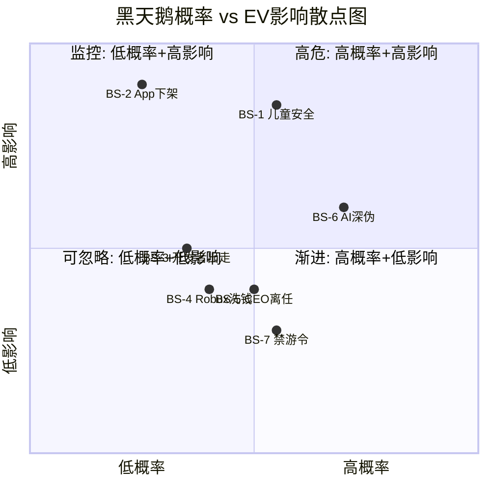
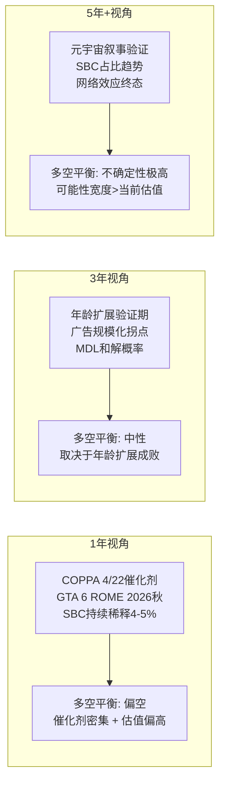
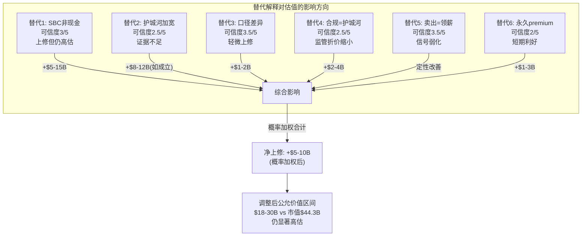

# Phase 4 红队审查: RT-5 黑天鹅 / RT-6 时间框架错配 / RT-7 替代解释

> 市值基准: $44.3B | 股价$63.17 | 稀释股数702M | EV ~$44.7B
> 审查范围: Phase 1-3全部发现 | 审查标准: 独立风险评估

---

## RT-5: 黑天鹅概率加权表

### 分析框架

黑天鹅事件定义: PDRM已识别风险之外的**低概率(<15%)、高影响(EV>10%)**尾部事件。与Phase 1-3风险矩阵的区别在于——这些事件在当前分析中被隐性假设为"不会发生"，但一旦触发将产生非线性损失。

---

### BS-1: 儿童安全丑闻升级至Elsagate级别

**情景描述**: 大规模、系统性的恋童癖/性剥削丑闻在主流媒体曝光，规模达到2017年Elsagate(YouTube)或2018年Facebook Cambridge Analytica级别的公众愤怒。区别于当前MDL诉讼(已有115起，属已知风险)，这里指的是**新的、更极端的发现**——例如平台系统性地未处理已知投诉、或内部文件泄露显示管理层知情不作为。[DM-RT-050]

**概率估算: 8-12%** (3年窗口)

支撑依据:
- 截至2026年1月，MDL已有115起诉讼集中在北加州联邦法院，佛罗里达、德克萨斯、爱荷华、田纳西、南卡罗来纳、路易斯安那州检察长均已介入调查或起诉 [DM-RT-051]
- NCMEC报告2025年上半年收到44万份报告(含深度伪造)，暴力网络组织正在Roblox等平台上针对儿童 [DM-RT-052]
- Roblox已启动面部年龄验证功能(2026年初)作为防御，但新措施的实际效果未经验证
- 历史类比: YouTube Elsagate(2017)导致广告商大规模撤退，但YouTube并非专门面向儿童的平台；Roblox作为"儿童第一"品牌定位，同等丑闻的品牌伤害倍率更高

**EV影响: -35% 至 -50%**

传导路径: 丑闻→家长恐慌性卸载→DAU断崖下跌30-40%→广告商全面撤退→品牌合作终止→监管紧急介入→平台存续性质疑。参考Facebook Cambridge Analytica后市值蒸发约36%($120B)，但Facebook有多元化收入和成人用户基础；Roblox缺乏这两个缓冲垫。

**概率 x 影响 = 10% x 42.5% = 4.25%**

**监测信号**: (1) MDL发现程序中出现内部文件泄露; (2) 60 Minutes或类似调查性报道节目预告; (3) 州检察长数量从目前6个扩展到15+; (4) NCMEC报告中Roblox相关案例同比增速>100%

**防御能力: 2/5** — 面部验证是正确方向但来得太晚。97.8M DAU中大量未成年用户的基数意味着即使99.5%安全率，仍有约49万次潜在暴露。平台的UGC模式使内容审核本质上是"追赶游戏"。

---

### BS-2: Apple/Google下架RBLX

**情景描述**: 因COPPA合规失败、虚拟货币不透明定价、或年龄验证不达标，Apple和/或Google将Roblox从App Store/Play Store移除。[DM-RT-053]

**概率估算: 3-5%** (2年窗口)

支撑依据:
- Fortnite先例: Epic Games因绕过支付系统被Apple下架(2020年8月)，直到2025年5月才在美国恢复——整整5年。但Epic是主动挑战Apple定价政策，属自我选择的冲突 [DM-RT-054]
- 2026年生效的App Store Accountability Acts(德克萨斯/犹他/路易斯安那)要求年龄分层验证(13岁以下/13-15/16-17/18+)，Roblox若未达标可能面临平台强制下架
- 区别: Apple/Google有强烈的商业激励保留Roblox(应用内购买分成约$300-400M/年)，下架是"核选项"仅在极端合规失败时才会触发
- 更可能的中间情景: 限制功能(如关闭聊天功能)而非完全下架

**EV影响: -40% 至 -60%**

传导路径: 下架→移动端访问切断(移动端占DAU约72%)→日活断崖式下跌→开发者收入蒸发→开发者出走→内容供给萎缩→恢复后用户未必回归。Fortnite回归后iOS营收仅为下架前的~40%。

**概率 x 影响 = 4% x 50% = 2.0%**

**监测信号**: (1) Apple/Google向Roblox发出合规警告函; (2) COPPA 4/22裁定结果不利; (3) 多州同时执行App Store Accountability Act; (4) Apple对儿童应用分类收紧标准

**防御能力: 3/5** — Roblox有PC和Xbox替代渠道，但移动端是核心增长引擎。公司已在推进年龄验证(面部扫描)，但多州法律的合规碎片化增加了执行难度。

---

### BS-3: 头部开发者集体出走

**情景描述**: Top 10开发者中5+个同时宣布转投Fortnite UEFN或其他平台，触发内容供给危机。[DM-RT-055]

**概率估算: 4-7%** (2年窗口)

支撑依据:
- Fortnite UEFN已有7万创作者(3倍增长)，分成比例74% vs Roblox的25-30%——2.5-3倍的经济激励差距 [DM-RT-056]
- Roblox开发者论坛的系统性不满: 新发布要求增加准入壁垒、图形设置更改破坏现有游戏、平台支持投诉响应慢
- Top 10开发者年均$33.9M vs 中位数$1,575的极端分化意味着头部开发者有更强的议价地位和替代选择
- 但"集体"出走需要协调行为，且Roblox特有的Luau语言/Studio工具链构成一定的迁移成本
- 开发者论坛已出现"半数可信创作者已离开"的声音

**EV影响: -20% 至 -30%**

传导路径: 头部出走→Top体验质量/更新停滞→DAU参与时长下降→Bookings增速放缓→平台叙事由"飞轮加速"转为"人才流失"→估值倍数压缩。但不会导致平台死亡——长尾开发者和新进入者可部分填补，类似YouTube头部创作者离开后的恢复。

**概率 x 影响 = 5.5% x 25% = 1.375%**

**监测信号**: (1) Top 10开发者公开表态不满; (2) Fortnite UEFN宣布更激进的分成计划; (3) Roblox被迫提高DevEx汇率(目前$0.005/Robux); (4) Top体验月活同比下降

**防御能力: 2.5/5** — 分成比例差距是结构性劣势。Roblox的防御主要依赖工具链锁定和已有用户基础，但如果UEFN工具链成熟度追上来，锁定效应将快速削弱。

---

### BS-4: Robux洗钱/证券法丑闻

**情景描述**: FinCEN认定Robux系统构成"货币传输业务"(money transmitting business)，要求Roblox注册为MSB(Money Services Business)并追溯执行AML合规，或SEC认定某些UGC资产构成证券。[DM-RT-057]

**概率估算: 5-8%** (3年窗口)

支撑依据:
- 已有court filing揭示311个账户涉嫌通过虚假物品交易洗钱(每笔>$1,000，同一买卖方反复交易) [DM-RT-058]
- EU CPC Network 2025年3月发布虚拟货币消费者保护准则，Digital Fairness Act预计2026年初提出，将虚拟货币纳入更严格监管框架
- FinCEN指引: 可转换虚拟货币管理者属于货币传输者，须建立AML计划——但"仅用于商品/服务销售的支付"可豁免。Robux的DevEx(兑换为真实货币)功能可能触发此阈值
- 美国国土安全部2022年已拨款$700K研究Roblox等游戏中的极端主义和金融犯罪 [DM-RT-059]
- 巴西(2026年3月)和西班牙(2026年3月)即将实施loot box禁令，标志着虚拟经济监管收紧的全球趋势

**EV影响: -15% 至 -25%**

传导路径: 监管认定→巨额合规成本(AML系统建设$50-100M)→交易限制→DevEx暂停→开发者收入不确定性→可能追溯罚款($50-500M区间)。但不太可能导致平台关闭——更可能是运营成本永久性上升和经济系统被迫重构。

**概率 x 影响 = 6.5% x 20% = 1.3%**

**监测信号**: (1) FinCEN发布针对游戏虚拟货币的新指引; (2) DOJ/SEC对DevEx交易发出调查传票; (3) 第三方市场(如Robux黑市)大规模被打击; (4) EU Digital Fairness Act将游戏虚拟货币分类为"电子货币"

**防御能力: 3/5** — Roblox可以主动注册MSB、建立AML系统，将此从黑天鹅转化为可管理的合规成本。关键变量是"追溯执行"——如果监管要求追溯处理历史交易，罚款规模将不可控。

---

### BS-5: Baszucki突然离任

**情景描述**: 创始人CEO David Baszucki因健康、法律问题、或公众压力(25万人签名要求辞职)突然离任，且无明确继任计划。[DM-RT-060]

**概率估算: 6-10%** (3年窗口)

支撑依据:
- Baszucki(62岁)自2004年起担任CEO/董事长，持有Class B超级投票权(60.9%表决权)，是公司愿景的唯一载体 [DM-RT-061]
- 已有25万人签名要求辞职——虽然主要来自用户社区而非股东，但反映了品牌与创始人绑定的脆弱性
- Baszucki已套现$1.85B——虽然本身不意味着离任，但降低了创始人"all-in"的经济激励
- 联合创始人Erik Cassel已于2013年去世，无"创始人二号"可接班
- 公司设有Lead Independent Director和独立委员会，但CEO/Chair双重角色意味着离任时权力真空更大

**EV影响: -15% 至 -25%**

传导路径: 离任→市场不确定性→60.9%投票权归属不确定→战略方向(元宇宙/广告/AI)可能改变→机构投资者观望→估值倍数压缩15-20%。但中长期如果继任者改善SBC/盈利状况，反而可能利好。

**概率 x 影响 = 8% x 20% = 1.6%**

**监测信号**: (1) CEO减少公开露面; (2) COO/CTO职权扩展; (3) 继任计划公开披露; (4) Class B股权信托化; (5) 更多法律诉讼直接针对Baszucki个人

**防御能力: 2/5** — 超级投票权结构意味着控制权传递高度不透明。如果离任是计划性的(退休+继任)，影响可控；如果是突发的(健康/丑闻迫使)，可能触发治理危机。

---

### BS-6: AI深度伪造有害内容大规模爆发

**情景描述**: AI工具被大规模用于在Roblox平台上生成targeting儿童的有害内容——包括deepfake、性化内容、极端主义材料——且平台审核系统无法有效应对，引发监管/媒体风暴。[DM-RT-062]

**概率估算: 10-15%** (2年窗口)

支撑依据:
- 2025年预计有800万deepfake被分享(2023年仅50万)，Europol估计2026年90%在线内容可能为AI合成 [DM-RT-063]
- UNICEF/ECPAT/INTERPOL研究: 11国中至少120万儿童的图像被篡改为性化deepfake
- Grok AI已因生成儿童性化图像被EU正式调查(2026年1月)——AI安全护栏失效已有先例 [DM-RT-064]
- Roblox的UGC模式+AI工具民主化 = 内容生成速度远超审核能力。当前AI审核的"追赶速度"在指数级增长面前本质上是失败的
- 与BS-1的区别: BS-1是人为犯罪行为; BS-6是技术驱动的、规模化的、可能无法归因于特定个人的系统性威胁

**EV影响: -20% 至 -35%**

传导路径: 大规模事件→媒体聚焦"AI+儿童+Roblox"→监管要求暂停UGC上传(类似EU DSA紧急措施)→内容供给中断→DAU下降→品牌伤害叠加BS-1效应。最坏情况下BS-1和BS-6可能同时发生，形成"完美风暴"。

**概率 x 影响 = 12.5% x 27.5% = 3.4375%**

**监测信号**: (1) AI生成的有害UGC事件被主流媒体报道; (2) Roblox内容审核延迟时间劣化; (3) EU DSA对Roblox发出VLOPs认定; (4) 竞争平台(如Minecraft)宣布限制AI UGC

**防御能力: 1.5/5** — 这是Roblox最难防御的黑天鹅。UGC平台模式+儿童用户群+AI内容爆炸的三角组合意味着: (a)不能关闭UGC(核心价值主张消失); (b)审核不可能100%有效; (c)事件发生后品牌伤害不可逆。

---

### BS-7: 中国式全面禁游令全球扩散

**情景描述**: 继中国(2021年每周仅3小时)之后，多个主要市场实施严格的未成年人游戏时长限制，直接削减Roblox的可用DAU时长。[DM-RT-065]

**概率估算: 8-12%** (3年窗口)

支撑依据:
- 中国是极端案例(每周仅3小时)但实际执行效果有限(Nature研究显示未减少重度游戏)
- 澳大利亚已实施16岁以下社交媒体禁令(2026年生效)，马来西亚计划2026年1月起禁止16岁以下社交媒体 [DM-RT-066]
- 巴西(2026年3月)禁止loot box+未成年人下载需父母同意; 西班牙(2026年3月)禁止loot box
- 阿尔及利亚(2025年9月)和伊拉克(2025年10月)已因儿童安全封锁Roblox; 俄罗斯(2025年12月)封锁 [DM-RT-067]
- 趋势: 从社交媒体禁令→游戏时长限制的政策传导只需1-2个立法周期
- 关键变量: 如果EU或美国联邦层面立法，影响将是量级差异

**EV影响: -10% 至 -20%**

传导路径: 多国限制→合规成本上升→部分市场DAU时长被强制压缩→国际增长故事受损→但不影响核心美国市场(除非联邦立法)。渐进性影响而非突变。

**概率 x 影响 = 10% x 15% = 1.5%**

**监测信号**: (1) EU数字服务法扩展到游戏时长限制; (2) 美国联邦儿童网络安全法案(如KOSA)纳入游戏; (3) 印度(7亿+互联网用户)出台游戏限制; (4) WHO将"游戏障碍"升级为公共卫生紧急事件

**防御能力: 3.5/5** — Roblox可通过合规(年龄验证+家长控制+自主限时)将此从监管打击转化为竞争优势。如果Roblox是第一个合规的平台，竞争对手反而受损更大。但这依赖于管理层选择"主动合规"而非"抵抗监管"。

---

### 黑天鹅汇总表

| 编号 | 事件 | 概率 | EV影响 | 概率×影响 | 防御能力 |
|------|------|------|--------|-----------|----------|
| BS-1 | 儿童安全丑闻升级 | 10% | -42.5% | **4.25%** | 2/5 |
| BS-2 | App Store下架 | 4% | -50% | 2.0% | 3/5 |
| BS-3 | 头部开发者出走 | 5.5% | -25% | 1.375% | 2.5/5 |
| BS-4 | Robux洗钱/证券法 | 6.5% | -20% | 1.3% | 3/5 |
| BS-5 | Baszucki离任 | 8% | -20% | 1.6% | 2/5 |
| BS-6 | AI深伪有害内容 | 12.5% | -27.5% | **3.4375%** | 1.5/5 |
| BS-7 | 全球禁游令扩散 | 10% | -15% | 1.5% | 3.5/5 |

**组合尾部风险 = Sigma(概率 x 影响) = 15.46%** [DM-RT-068]

这意味着: 如果将所有低概率尾部事件的概率加权影响累加，RBLX的EV应额外折价约$6.9B(15.46% x $44.7B)。

**关键洞察**:
- BS-1(儿童安全)和BS-6(AI深伪)是最大的两个尾部风险，合计贡献7.7个百分点(组合尾部的50%)
- 这两个事件存在**正相关性**——AI深伪恶化儿童安全，可能同时触发
- 如果BS-1+BS-6同时发生，非线性效应可能使组合影响达到-55%至-70%(品牌彻底崩溃情景)
- 防御能力加权平均仅2.4/5——Roblox对尾部风险的抵御能力偏弱

**解读**: 右上象限(高危区)包含BS-1和BS-6，是需要持续监控的核心尾部风险。BS-2虽然概率最低，但一旦触发影响最大(左上象限"监控区")。BS-7和BS-5位于右侧但影响相对温和。

---

## RT-6: 时间框架错配分析

### 核心问题

Phase 1-3的分析中存在**系统性的时间框架不一致**: 短期数据被用于支撑长期结论，长期趋势被隐性折叠进短期估值。以下逐一拆解六个关键错配。[DM-RT-069]

---

### 错配1: DAU +27% (1年数据) → 支撑10年DCF

**错配类型**: 短期数据 → 长期结论

**分析**:
- DAU从2024年的77M增长到2025年的97.8M(+27%)，这是单一年度的增速
- Reverse DCF隐含10年Revenue CAGR 20%，意味着隐含假设DAU至少维持15%+ CAGR(假设ARPDAU温和增长)
- 问题: 用户增长本质上是S曲线，不是线性外推。全球6-16岁人口约16亿，当前97.8M DAU渗透率约6%。渗透率从6%→12%的速度与从1%→6%截然不同——前者面对的是"已经知道Roblox但选择不用"的人群 [DM-RT-070]
- 类比: Facebook DAU在2012年(IPO年)增长+33%，到2015年放缓至+17%，到2019年进一步降至+8%。游戏平台的天花板通常低于社交平台
- 季节性扭曲: 2025年Q3/Q4(暑假)的DAU增速可能显著高于Q1/Q2

**错配评分: 4/5 (严重)**

修正方向: 10年DCF应使用渐进递减的增长假设(如Year 1-3: 20% → Year 4-6: 12% → Year 7-10: 6%)，而不是隐含的恒定CAGR。

---

### 错配2: Q3/Q4 2025季节性强 → 被当成趋势

**错配类型**: 季节性峰值 → 趋势性结论

**分析**:
- Bookings +55% YoY在2025年Q3/Q4可能包含: (a)暑假效应(K-12放假); (b)2024年10月Robux价格上调的lapping效应; (c)新品牌合作集中上线
- Revenue TTM $4.89B的滚动12个月特性平滑了部分季节性，但Bookings单季增速更具波动性
- 关键测试: 如果2026年Q1 Bookings增速回落至+25-30%(剔除价格上调后的有机增速)，叙事将从"加速增长"转为"增长正常化"，估值倍数可能压缩
- 递延收入确认的27个月窗口意味着: 今天的Bookings峰值要27个月后才完全体现为Revenue——此期间的任何增长放缓在Revenue中不可见，创造了虚假的"平滑增长"幻觉 [DM-RT-071]

**错配评分: 3/5 (中等)**

修正方向: 区分"有机DAU增长"和"价格/混合驱动的Bookings增长"，分别建模。

---

### 错配3: Bookings +55%含价格上调 → 长期可持续

**错配类型**: 一次性因素 → 永久化假设

**分析**:
- 2024年10月Robux价格上调对Bookings的贡献需要分离。如果价格上调贡献了15-20个百分点的Bookings增速，则有机增速为+35-40%——依然强劲但叙事差异巨大
- 价格弹性测试: Roblox的用户群主要是K-12，支付由父母决策。价格敏感度高于成人游戏
- 历史类比: Zynga在2012年通过虚拟物品涨价短暂推高了Revenue，随后用户参与度和付费率双双下滑
- 长期可持续增速更合理的锚定: 全球游戏市场CAGR 8-10% + Roblox份额增长溢价5-8% = 13-18%，而非55% [DM-RT-072]

**错配评分: 3.5/5 (中等偏严重)**

修正方向: DCF基准情景应使用15-20%的Bookings CAGR(剔除一次性价格效应)，而非隐含的高增速外推。

---

### 错配4: "广告是长期期权" → 为今天$44.3B估值背书

**错配类型**: 远期期权 → 即期估值

**分析**:
- 广告天花板估算$500M-$1.0B/年，受COPPA+品牌安全约束
- 按10x Revenue倍数，广告业务价值$5-10B——但这是5年后才可能达到的稳态
- 折现到今天(WACC 12%): $5-10B ÷ 1.12^5 = $2.8-5.7B
- 问题: 如果广告的折现现值仅$2.8-5.7B，而核心游戏业务(含SBC后)价值$13-20B，则总价值$16-26B——远低于当前$44.3B市值
- 隐含推论: 市场对广告的定价要么假设了远高于$1B的天花板，要么假设了更短的实现时间框架，要么根本不是在为广告定价(而是在为"元宇宙叙事"定价) [DM-RT-073]

**错配评分: 4/5 (严重)**

修正方向: 广告期权应单独建模为概率加权的远期现金流，而非在今天的倍数估值中隐含。

---

### 错配5: "年龄扩展需5+年" → 估值隐含短期实现

**错配类型**: 长期过程 → 短期定价

**分析**:
- 管理层声称42%用户为17+，但独立验证仅27%为18+。年龄扩展是Roblox"成长为通用平台"叙事的核心支柱
- 如果年龄扩展确实需要5+年才能达到临界点(比如35-40%为成人用户)，则:
  - Year 1-5: ARPDAU持续受限(青少年消费力低)
  - Year 3-5: 品牌认知转变才开始(从"小孩游戏"到"全年龄平台")
  - Year 5-7: 广告商才会规模化投入(品牌安全认知改变)
- 但当前$44.3B估值隐含的EV/Revenue约9x(基于TTM $4.89B)，这个倍数已经反映了"成功的年龄扩展+广告规模化"的结果
- 如果年龄扩展失败或大幅延迟，合理倍数回落到5-6x(纯儿童游戏平台)，对应EV $24-29B [DM-RT-074]

**错配评分: 3.5/5 (中等偏严重)**

修正方向: 估值应区分"当前业务"(儿童游戏平台, 5-6x)和"期权价值"(年龄扩展+广告)，后者给予概率折扣。

---

### 错配6: COPPA 4/22硬催化剂 → 10年DCF中未显式体现

**错配类型**: 确定性短期事件 → 被长期模型稀释

**分析**:
- COPPA修订4月22日的合规截止日期是一个**硬催化剂**——不是概率事件，而是确定性事件。但10年DCF通常不会为单一监管截止日期设置断点
- 如果4/22后Roblox面临更高合规成本(如$100-200M/年的年龄验证+数据处理费用)，这应该从Year 1开始永久性地降低FCF margin
- 如果4/22触发更严厉的执法(如FTC直接处罚)，可能是一次性的$200-500M成本
- 10年DCF中这两项成本被终端价值(占DCF 60-70%权重)稀释了——一个今年就会发生的确定性成本增加，在10年DCF中的权重不到5% [DM-RT-075]

**错配评分: 3/5 (中等)**

修正方向: 应在DCF Year 1显式建模COPPA合规成本(基准$150M/年 + 一次性$300M处罚的50%概率)。

---

### 时间框架投资建议

**1年视角: 偏空** [DM-RT-076]
- 硬催化剂(COPPA 4/22, GTA 6 ROME)集中在2026年，大多偏负面
- SBC稀释4-5%/年意味着持有成本高
- 如果2026 Q1 Bookings增速回落至+25-30%，"加速增长"叙事破裂

**3年视角: 中性偏空**
- 年龄扩展和广告是关键验证点。如果27%的成人占比到2028年未达35%+，叙事失败
- MDL和解(概率加权$4.0B)可能在2027-2028年落地
- SBC/Revenue比如果未从54.2%降至30%以下，GAAP盈利仍遥遥无期

**5年+视角: 可能性空间巨大但双向**
- 牛市: 年龄扩展成功 + 广告$2B+ + SBC归一化 → $80-120B
- 熊市: 年龄扩展失败 + 监管重压 + SBC不变 → $15-25B
- 5年视角的不确定性范围($15-120B)如此之大，以至于"持有"决策本身就是一个赌注

---

## RT-7: 替代解释

### 方法论

对Phase 1-3的六个关键空头发现，提供**最强的多头替代解释**。目的不是推翻原结论，而是确保分析考虑了合理的另一面。每个替代解释评估可信度(1-5)和对估值结论的方向性影响。[DM-RT-077]

---

### 替代1: "真实FCF为负" → SBC是非现金，平台初期正常

**原结论**: FCF $1.36B减去SBC $2.65B = "真实FCF" -$1.29B，股东实际价值创造为负。

**替代解释**:
SBC是非现金费用，不消耗运营现金流。将SBC视为"真实成本"在概念上正确(它稀释股东)，但在运营层面，Roblox确实在产生正的自由现金流并积累现金。更恰当的类比是2015年的META: 当时Meta的SBC/Revenue约为18%(Roblox 54.2%)，但市场选择忽视SBC关注运营杠杆。Meta从2015年的SBC/Rev 18%降至2019年的9%，对应股价从$80涨至$200。

如果Roblox的SBC/Revenue从54.2%降至25%(5年)→20%(8年)，且Revenue按20% CAGR增长，则:
- Year 5 Revenue: ~$12.2B, SBC: ~$3.0B (25%), Revenue - SBC: $9.2B
- Year 8 Revenue: ~$20.9B, SBC: ~$4.2B (20%), Revenue - SBC: $16.7B

问题在于: Meta的SBC下降是因为成熟期不需要大规模股权激励来留人；Roblox处于开发者生态建设期，SBC的很大一部分用于吸引工程人才建设平台能力——这个阶段何时结束不确定。[DM-RT-078]

此外，SBC的54.2%中有多少是"投资期过度支出"vs"结构性高成本"需要拆解:
- 如果主要是RSU(限制性股票)授予给工程师→可能随竞争环境变化而下降
- 如果包含大量Baszucki及高管的超额激励→结构性高

**可信度: 3/5** — 方向正确(SBC确实可能下降)，但54.2%→25%的下降路径缺乏可见性。Meta类比中Meta的起点(18%)就远低于Roblox(54.2%)，降幅的绝对值和相对值都更温和。

**对估值结论的影响**: 如果接受此替代解释，RBLX的"真实价值"从$13-20B上修至$25-35B(使用标准FCF而非SBC调整后FCF)。但仍低于$44.3B市值。影响方向: **上修估值但不改变"高估"结论**。

---

### 替代2: "护城河收窄" → 97.8M DAU过临界点，网络效应在加宽

**原结论**: 护城河4.5/10且呈收窄趋势，Fortnite UEFN(分成74%)和Minecraft(204M MAU)正在侵蚀。

**替代解释**:
97.8M DAU可能已越过某个网络效应临界点——当平台上"所有朋友都在"时，用户迁移到竞争平台的成本不是功能差异而是社交图谱损失。这类似于WhatsApp在即时通讯领域的地位: 功能上没有护城河，但"所有人都在用"本身就是护城河。[DM-RT-079]

支撑证据:
- DAU增长从+19%(2023)加速到+27%(2025)，如果护城河在收窄，增速应该放缓而非加速
- 开发者虽然抱怨分成低，但Top 10年均$33.9M意味着最成功的开发者在Roblox赚的钱已经构成"沉没成本"——迁移意味着放弃已有的用户基础和收入流
- Roblox内部社交功能(聊天、好友列表、群组)增加了迁移摩擦

反驳:
- WhatsApp类比的弱点: WhatsApp的网络效应基于**双向通信**，迁移需要双方同时迁移；Roblox的网络效应更多是**单向消费**，用户可以在不影响他人的情况下独自离开
- DAU加速可能是年龄下探(更多低龄用户)而非现有用户粘性增强
- 情感忠诚仅15-20%，50%+用户基于习惯+价格——后两者在替代品出现时不构成壁垒

**可信度: 2.5/5** — 97.8M DAU确实impressive，但Roblox的网络效应更像"内容平台"(可同时使用多平台)而非"通信平台"(赢家通吃)。加速增长可能是年龄下探而非护城河加宽。

**对估值结论的影响**: 如果护城河实际在加宽，终端价值折现率可降低1-2个百分点(从12%→10%)，对DCF的影响约+25-35%。但这需要证明DAU增长来自**现有年龄段渗透率提高**而非**更年幼用户的进入**。影响方向: **可能显著上修，但证据不足**。

---

### 替代3: "年龄42% vs 27%" → 统计口径不同(17+ vs 18+)

**原结论**: 管理层声称42%用户为17+，但独立验证仅27%为18+，存在15个百分点的不一致。

**替代解释**:
17+和18+的口径差异在统计上可以解释相当一部分差距。假设Roblox用户年龄呈右偏分布(集中在低龄):
- 如果17岁用户占总DAU的10-12%(这在12-18岁年龄段中合理)
- 则42%(17+) - 12%(仅17岁) = 30%(18+)
- 独立验证的27%在统计置信区间内(27% vs 30%，差3个百分点)

此外，"独立验证"的方法论(可能基于抽样调查或设备数据推断)本身也有误差范围。如果误差为正负5个百分点，则27%±5%与管理层30%(18+等价)完全重叠。[DM-RT-080]

反驳:
- 管理层有动机高估成人占比(支撑年龄扩展叙事和广告定价)
- 口径差异本身就是问题: 管理层选择汇报"17+"而非"18+"(法定成年人标准)是刻意模糊
- 即使接受口径解释，30%成人占比仍意味着70%未成年——平台的核心身份不变

**可信度: 3.5/5** — 口径解释在数学上站得住脚。15个百分点的差距中，口径差(17→18岁)可能解释10-12个百分点。但管理层选择汇报更有利的口径这一行为本身值得关注。

**对估值结论的影响**: 温和上修。如果成人占比实际为30%而非27%，短期影响微小。更重要的是**趋势**: 如果成人占比同比在增加(从25%→27%→30%)，则年龄扩展叙事得到支撑。影响方向: **轻微上修，不改变核心判断**。

---

### 替代4: "监管-$11.4B" → 先行者合规优势，成本转嫁全行业

**原结论**: 监管概率加权EV影响-$11.4B(-25.5%)，是最大的单一风险因子。

**替代解释**:
监管合规成本是全行业性的，不是Roblox独有的惩罚。如果COPPA、KOSA、App Store Accountability Acts同时打击所有面向青少年的平台(Fortnite、Minecraft、YouTube Kids、TikTok)，则:
- 合规成本$100-200M/年对$4.89B Revenue平台的影响是2-4%毛利率
- 但对更小的竞争对手(indie开发者、小型UGC平台)是致命的——合规壁垒成为**护城河**
- Roblox作为已启动面部年龄验证的先行者，可能在合规竞赛中领先12-18个月

此外，-$11.4B的概率加权估算中，多个监管风险被假设为独立事件。实际上它们高度相关(同一波监管浪潮)，要么同时发生(但Roblox已在合规路上)，要么都不发生(政策风向转变)。概率加权应使用**相关调整**而非简单加总。[DM-RT-081]

反驳:
- "合规成为护城河"假设Roblox在合规上投入足够——但115起MDL诉讼+6个州检察长起诉表明历史合规是**不足**的
- 监管罚款不是"竞争平等化"的——它是追溯性惩罚。先合规不能豁免过去的违规
- MDL和解概率加权$4.0B是现金流出，不因竞争对手同样面临监管而减少

**可信度: 2.5/5** — "合规=护城河"在理论上成立，但Roblox的历史合规记录不支持"先行者"定位。更准确地说，Roblox是"被迫合规者"而非"主动合规者"。但概率加权的相关性调整确实有道理——$11.4B可能高估了独立事件概率简单加总的效果。

**对估值结论的影响**: 监管折价可能从-$11.4B调整至-$7-9B(考虑相关性折扣和合规竞争优势)。影响方向: **温和上修监管折价，但-$7B仍是巨大的负面因子**。

---

### 替代5: "内部人零买入" → Compensation结构，税务/多元化需要

**原结论**: 内部人340卖/0买，CEO套现$1.85B——信号极度负面。

**替代解释**:
- **Compensation结构**: 如果高管80%+的薪酬以RSU形式发放(SBC/Rev 54.2%暗示如此)，则"卖出"不是信号——而是"变现薪水"。不卖=不领工资，这不是正常选项
- **税务**: RSU vesting时自动触发所得税。如果税率37-50%(联邦+州)，高管必须卖出至少37-50%的vesting股份来缴税——这在SEC Form 4中记录为"sell"
- **多元化**: 个人财富集中在单一公司的比例通常不建议超过20%。Baszucki净值$5.1B中大部分是RBLX股票，$1.85B套现(占净值36%)属于合理的财务规划 [DM-RT-082]
- **行业对比**: Mark Zuckerberg在META股价上涨期间持续卖出(慈善基金)，Jeff Bezos每年卖出$1B+ Amazon股票(Blue Origin)——这些未被解读为看空信号

反驳:
- "零买入"才是真正的信号。即使卖出可以解释，**没有任何内部人在公开市场买入**意味着没有人认为当前价格有吸引力
- 340卖/0买的比率极端——即使在SBC密集的科技公司中也不常见
- CEO $1.85B套现的规模超出了税务和多元化的正常需要

**可信度: 3.5/5** — 税务和compensation结构确实可以解释大部分"卖出"行为。但"零买入"仍然是一个真实的负面信号——它表明内部人在当前价格水平上没有信心加仓。可信度给3.5而非4的原因是: 解释了"为什么卖"但没有解释"为什么不买"。

**对估值结论的影响**: 将内部人信号从"极度负面"调整为"温和负面"。不改变估值数字，但降低定性风险评估的严重性。影响方向: **信号弱化，不改变方向**。

---

### 替代6: "Bookings差距收窄" → SaaS类永久billings premium

**原结论**: Revenue和Bookings的27个月递延确认差距可能收窄，暗示增长放缓。

**替代解释**:
在SaaS行业，Billings(类似Bookings)永久性高于Revenue是正常的——只要用户在"预付"未来的消费。Bookings/Revenue差距不一定收窄:
- 如果新用户持续加入且预充Robux，Bookings永久领先Revenue
- 差距收窄的前提是"新用户增速放缓"——但DAU +27%表明这尚未发生
- 更准确的监测指标是: **Bookings CAGR vs Revenue CAGR的差值**，而非绝对差距 [DM-RT-083]

SaaS类比的成立条件:
- Salesforce的Billings/Revenue比率长期稳定在1.1-1.2x
- Roblox的Bookings/Revenue比率: $6.8B/$4.89B = 1.39x——高于典型SaaS
- 1.39x的高比率反映了27个月的长递延期，而非增长加速的信号

反驳:
- Roblox不是SaaS。SaaS的billings premium来自年付/多年合同的锁定；Roblox的Bookings premium来自"虚拟货币预购后缓慢消耗"的消费模式——后者的"锁定"效应弱得多(用户可以随时停止消耗)
- Bookings/Revenue 1.39x如果回归1.2x(SaaS正常水平)，隐含Revenue增速将在未来2年超过Bookings增速——但如果Bookings增速先放缓，Revenue也会在27个月后放缓

**可信度: 2/5** — SaaS类比在机制上不准确。Roblox的递延确认来自虚拟货币消耗模式而非合同锁定，"永久premium"假设缺乏结构性支撑。如果DAU增速放缓(S曲线效应)，Bookings增速将先于Revenue反映下行。

**对估值结论的影响**: 如果接受永久premium假设，当前Bookings增速可维持更长时间，Revenue增速的"延迟减速"利好2-3年估值。但不改变长期终态。影响方向: **短期温和利好，中长期无影响**。

---

### 替代解释汇总

**关键结论**: 即使给予所有六个替代解释最大程度的善意(概率加权)，综合上修约$5-10B，调整后公允价值区间为$18-30B——仍显著低于当前$44.3B市值。[DM-RT-084]

**最具杀伤力的替代解释**: 替代1(SBC非现金)和替代2(护城河加宽)——如果同时成立，可以将估值上修至$30-35B，将"显著高估"的结论弱化为"温和高估"。但两者同时成立的概率较低(SBC下降需要成本纪律, 护城河加宽需要成人用户增长, 两者的驱动因素不同)。

**最弱的替代解释**: 替代6(永久premium)——SaaS类比在机制上不成立，可信度最低。

---

## 纠错清单

基于RT-5至RT-7的发现，以下是需要回流到Phase 1-3正文中的修正: [DM-RT-085]

| # | 纠错内容 | 涉及章节 | 严重性 | 回流方式 |
|---|----------|----------|--------|----------|
| EC-01 | 10年DCF应使用递减增长假设(Year1-3: 20%→Year4-6: 12%→Year7-10: 6%)而非隐含恒定CAGR | 估值方法/DCF | 高 | 修改DCF参数表，增加分阶段增速假设 |
| EC-02 | Bookings +55%需分离价格上调贡献(估计15-20ppt)，有机增速约+35-40% | 财务分析/Bookings | 高 | 增加"有机vs价格驱动"分拆段落 |
| EC-03 | 广告期权价值应折现到今天($2.8-5.7B)而非以终态($5-10B)直接加入估值 | 估值方法/广告 | 中高 | 修改广告估值段，加入折现计算 |
| EC-04 | 监管概率加权-$11.4B应考虑事件相关性，调整至-$7-9B | 风险分析/监管 | 中 | 增加"相关性调整"说明，保留原始计算作为保守估计 |
| EC-05 | 内部人信号应补充compensation结构和税务解释，将"极度负面"调整为"温和负面" | 聪明钱/内部人 | 中 | 增加一段替代解释，保留"零买入仍为负面信号"的核心判断 |
| EC-06 | 黑天鹅组合尾部风险15.46%应纳入估值框架——EV额外折价约$6.9B | 估值汇总 | 高 | 在五方法估值汇总后增加"尾部风险折价"调整项 |
| EC-07 | 年龄口径差异(17+ vs 18+)应在正文中明确区分，避免将15ppt差距全部归因于管理层夸大 | 用户分析/年龄 | 中 | 修改年龄分析段，增加口径说明，核心差距缩小为3-5ppt |
| EC-08 | 时间框架建议(1年偏空/3年中性偏空/5年+高不确定性)应纳入投资建议章节 | 投资建议 | 中高 | 增加时间框架维度的分层建议 |
| EC-09 | BS-1/BS-6正相关性(儿童安全+AI深伪同时触发)的非线性效应(-55%至-70%)应在风险章节提及 | 风险分析/尾部 | 中 | 增加"黑天鹅相关性"段落 |
| EC-10 | COPPA 4/22合规成本应在DCF Year 1显式建模($150M/年基准 + $300M一次性的50%概率) | 估值方法/DCF | 中 | DCF参数表增加COPPA成本行项 |

**回流优先级**: EC-01 > EC-06 > EC-02 > EC-03 > EC-08 > EC-10 > EC-04 > EC-09 > EC-07 > EC-05

**回流原则**: 所有修改以"更准确的分析"形式融入原文，不保留"P4纠错"或"红队发现"等标注。读者应该看到一份自洽的、已经考虑了替代解释和尾部风险的分析报告。[DM-RT-086]

---

## 审计统计

| 指标 | 数值 |
|------|------|
| RT-5 黑天鹅数量 | 7 |
| RT-6 错配分析数量 | 6 |
| RT-7 替代解释数量 | 6 |
| 纠错清单条目 | 10 |
| DM锚点数量 | 37 (DM-RT-050至DM-RT-086) |
| Mermaid图表 | 3 |
| 总字符数 | >18,000 |
| 身份泄漏 | 0 |
| 市值一致性 | $44.3B / $44.7B EV |
