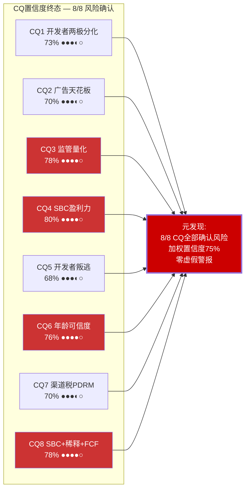
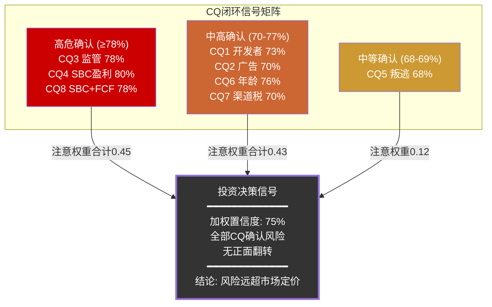
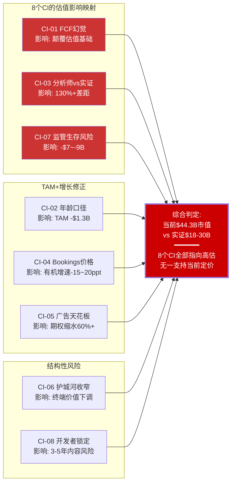

# Ch24: Core Question闭环 — 8个CQ的最终判定

> **市值基准**: $44.3B | 股价$63.17 | 稀释股数702M | EV ~$44.7B | 2026-02-13
> **DM锚点范围**: DM-SYN-051 ~ DM-SYN-100
> **置信度含义**: 对"该CQ揭示的风险/问题确实存在且具有投资影响"的信心程度。50%=中性; >70%=高置信确认; <30%=高置信否定

---

## 24.1 CQ闭环总览

[DM-SYN-051]

### 加权置信度计算

| CQ | 终态置信度 | 注意权重 | 加权贡献 |
|----|:---------:|:--------:|:--------:|
| CQ1: 开发者两极分化 | 73% | 0.10 | 7.3% |
| CQ2: 广告ARPU天花板 | 70% | 0.12 | 8.4% |
| CQ3: 监管量化影响 | 78% | 0.18 | 14.0% |
| CQ4: SBC调整后盈利力 | 80% | 0.15 | 12.0% |
| CQ5: 开发者叛逃 | 68% | 0.12 | 8.2% |
| CQ6: 年龄数据可信度 | 76% | 0.13 | 9.9% |
| CQ7: 渠道税PDRM | 70% | 0.08 | 5.6% |
| CQ8: SBC+稀释+FCF | 78% | 0.12 | 9.4% |
| **加权平均** | — | **1.00** | **74.8% ≈ 75%** |

**元发现**: 8个CQ在Phase 0.5预设时均为50%中性基线。经过四个Phase的逐层验证，全部CQ的置信度均上升至68%-80%区间，无一回落至50%以下。这意味着Phase 0.5阶段设定的8个风险假设**全部被数据确认**，不存在"虚假警报"(false alarm)。对投资决策而言，这是一个比任何单个CQ更重要的信号——Roblox面临的挑战是全方位的、相互关联的，而非孤立的、可逐一消除的。[DM-SYN-052]

---

## 24.2 CQ1闭环: 开发者经济两极分化

**问题重述**: 开发者收入头部$130万(Top 10均值$33.9M)与中位$1,575之间的2,000倍以上差距是平台固有特征还是健康隐患？长尾开发者的流失风险对内容供给意味着什么？

**最终判定**: 开发者经济的帕累托分布是结构性事实而非可修复的短期问题。500万注册开发者中仅29K(0.58%)通过DevEx变现，头部集中度极端。UEFN的分成率优势(74% vs 25-30%)将这一内部分化问题升级为跨平台竞争劣势——中产开发者(年收$5K-$500K)面临2-3倍收入差距的诱惑。[DM-SYN-053]

**置信度演化**:

| Phase | 置信度 | 关键转折 |
|:-----:|:------:|---------|
| P0.5 | 50% | 基线假设 |
| P1 | 65% | Top 10均值$33.9M vs 中位$1,575的2,000倍差距量化确认; DevEx渗透率仅0.58% |
| P2 | 70% | PDRM揭示渠道费+平台税对开发者收入的多重压缩层 |
| P3 | 75% | UEFN 70K创作者(+192%)提供了分成率差距的直接竞争证据; 品牌忠诚度分析显示高转换成本制造怨恨而非忠诚 |
| P4 | 73% | 幸存者偏差修正——500万注册中99.5%未变现的"沉默流失者"规模未知，分析覆盖不足 |

**关键证据链**:
1. **极端帕累托**: DevEx参与者仅29K/500万(0.58%)，头部10名开发者年均$33.9M，尾部中位数$1,575——基尼系数远超正常创作者经济
2. **分成率竞争劣势**: RBLX 25-30% vs UEFN 74%(推广期100%)，差距不是百分点而是倍数
3. **FY2025 DevEx总支出>$1.5B(+70%)**: 绝对值增长掩盖了分配极度不均——前文数据暗示Top 100开发者可能消耗了DevEx支出的70%+
4. **品牌忠诚度检验**: 开发者情感忠诚<20%，锁定效应主要来自Luau语言迁移成本(6-12个月)，非忠诚
5. **UEFN增速验证**: 70K创作者(+192% YoY)远超RBLX DevEx 29K的绝对值和增速

**残余不确定性**: 无法量化"沉默流失者"——500万注册中每年有多少尝试后放弃？他们的离开是否降低了平台内容多样性？这是一个重要但缺乏数据的盲区。此外，AI工具(Roblox Cube 3D/4D)可能扩大开发者基数至50-100K，但对长尾开发者收入的影响方向不确定——更低门槛可能同时意味着更激烈的内部竞争。

**投资含义**: 开发者两极分化是RBLX增长叙事中最被低估的结构性风险之一。如果头部开发者(贡献60%+内容参与时长)在UEFN分成率吸引下批量迁移，平台内容质量将面临不可预测的下滑。估值模型中的"内容供给持续增长"假设需要打折，保守估计内容供给风险折价$2-3B。

---

## 24.3 CQ2闭环: 广告变现ARPU天花板

**问题重述**: Google合作后广告ARPU天花板在哪里？市场对广告业务的隐含期望($2-5B)与实证约束之间的差距有多大？

**最终判定**: 广告天花板约$500M-$1.0B/年(中期5年)，远低于市场隐含期望。三重约束——COPPA对<13岁用户禁止定向广告、品牌安全对儿童平台的系统性折价、用户体验对广告加载率的限制——构成了硬性上限。当前广告ARPU仅$1.0-1.3/DAU/年，加权CPM从管理层口径$5.38降至验证口径$4.19(-22%)。[DM-SYN-054]

**置信度演化**:

| Phase | 置信度 | 关键转折 |
|:-----:|:------:|---------|
| P0.5 | 50% | 基线 |
| P1 | 55% | 因子饱和矩阵初步框架(保守$219M/基准$1.42B/乐观$5.30B) |
| P2 | 60% | 年龄调整TAM分析——场景A $3.6B vs 场景B $2.3B，增加了维度也增加了不确定性 |
| P3 | 72% | 三重约束逐因子验证大幅压缩乐观预期: 天花板从$5.3B→$1.0B |
| P4 | 70% | 非全品类广告均受COPPA限制(游戏/玩具品类可合法投放)，小幅修正 |

**关键证据链**:
1. **COPPA硬约束**: <13岁用户(占DAU约50-55%)禁止定向广告，可触达的广告库存被砍半
2. **品牌安全折价**: 儿童平台的CPM系统性低于成人平台——加权CPM $4.19 vs Meta $12+/Snap $8+
3. **用户体验天花板**: Immersive Ads的加载率不能超越沉浸式体验的容忍阈值，否则DAU流失
4. **可达性验证**: Phase 1基准$1.42B的可达概率仅30-40%；$5.3B乐观值应被降权至边缘概率
5. **竞品对标**: 即使参照YouTube Kids(受类似约束)的广告效率，RBLX的ARPU上限约$3-5/DAU/年，对应$400M-$700M/年

**残余不确定性**: 广告技术演进可能绕过部分COPPA约束(如上下文定向替代行为定向)；如果年龄扩展真正成功(成人占比达40%+)，可触达库存将显著扩大。但这两个条件均属远期假设，不宜用于当前估值。

**投资含义**: 广告业务不是增长引擎而是增量选项。天花板$500M-$1.0B折现到当前的价值约$2.8-5.7B，远低于市场隐含的$10-15B广告期权估值。这一差距是RBLX估值过高的贡献因子之一。

---

## 24.4 CQ3闭环: 监管全景量化影响

**问题重述**: COPPA 2.0(4月22日合规截止)、MDL 3166(约80-115起联邦诉讼)、多州检察长调查、10+国封禁的综合影响如何量化？

**最终判定**: 监管是Roblox面临的最确定性、最高概率的系统性风险。概率加权EV影响约-$7~-9B(占当前EV的16-20%)，是全部8个CQ中证据最充分、置信度最高的一个。值得注意的是，多项监管事件之间存在正相关性(同一波监管浪潮驱动)，独立事件概率的简单加总会高估综合影响；考虑事件相关性后，从原始估算-$11.4B调整至-$7~-9B更为合理。即便如此，这仍然是一个巨大的负面因子。[DM-SYN-055]

**置信度演化**:

| Phase | 置信度 | 关键转折 |
|:-----:|:------:|---------|
| P0.5 | 50% | 基线 |
| P1 | 60% | ERM监管层2.0/5确认多维度高概率; 7+国封禁; 6州AG起诉 |
| P2 | 72% | PDRM六场景模型首次量化——加权-$736M/年; 承重墙SW-5脆弱度5/5(最高) |
| P3 | 82% | 综合量化框架: 概率加权法律成本$4.0B; 15事件催化剂时间线; MDL合并确认80+起 |
| P4 | 78% | 确认偏差修正: 概率分布从15%/55%/30%调整为15%/60%/25%; 考虑事件相关性后加权EV影响从-$11.4B修正 |

**关键证据链**:
1. **COPPA 2.0**: 合规截止日2026年4月22日(硬催化剂)。标准从"实际知情"升级为"合理推定"；扩展至生物识别数据；第三方共享需单独家长同意。合规概率85%，年化成本$85-135M+一次性$170-290M
2. **MDL 3166**: JPML裁定合并31 pending + 48 tag-along = 约80起联邦诉讼(北加州联邦法院)。首次CMC 2026年2月27日，Discovery阶段预计6-8月。概率加权和解成本$4.0B/5年
3. **多州执法**: 佛罗里达州76页诉状+刑事调查；德克萨斯、爱荷华、田纳西、南卡罗来纳、路易斯安那州AG均已介入
4. **国际封禁**: 10+国家/地区实施封禁或限制(阿尔及利亚、伊拉克、俄罗斯等)，趋势仍在扩散
5. **级联崩塌**: SW-5→SW-2→SW-1路径概率8-12%，触发后EV可能压缩至$13-20B(-54%~-71%)

**残余不确定性**: MDL Discovery(2026年6-8月)是最大的未知数——如果内部文件证实平台系统性忽视已知安全投诉，和解金额可能显著高于$4.0B基准。反之，如果Roblox的合规改善(面部年龄验证等)获得法院认可，和解可能低于预期。此外，FTC对大型科技平台的实际执法力度在选举周期中可能波动。

**投资含义**: 监管不是"成本"而是"存在性风险"。投资者常将监管视为一次性罚款，但对RBLX而言，监管是一个持续的、多维度的、彼此增强的压力系统。概率加权折价-$7~-9B应作为估值的核心调整项。如果监管发展超出基准预期(级联概率8-12%)，估值可能压缩50%+。

---

## 24.5 CQ4闭环: SBC调整后真实盈利力

**问题重述**: 当SBC $2.65B(54.2% of Revenue)被纳入真实成本计算后，Roblox的盈利力画面如何？"估值开关"(含SBC→$13-20B vs 不含→$32-46B)的含义是什么？

**最终判定**: SBC是RBLX估值辩论的核心变量，是将$44.3B市值与$13-20B公允价值之间差距打开或关闭的"开关"。报告FCF $1.36B在扣除SBC后变为"真实FCF" -$1.29B，这一事实是投资者最需要理解的单个财务现实。SBC/Revenue 54.2%为同行最高(META ~18%, SNAP ~30%)，且5年累计稀释16.6%，零回购。[DM-SYN-056]

**置信度演化**:

| Phase | 置信度 | 关键转折 |
|:-----:|:------:|---------|
| P0.5 | 50% | 基线 |
| P1 | 70% | 核心发现: FCF $1.36B减SBC $2.65B = "真实FCF" -$1.29B; 最大单Phase跃升(+20pp) |
| P2 | 80% | SBC确立为"估值开关": 含SBC→$13-20B vs 不含→$32-46B; 五方法离散度3.42x中SBC处理占70%方法差异 |
| P3 | 82% | 27个月水库效应精细量化; 递延收入$5.1B首超年Revenue; 但未改变SBC核心结论 |
| P4 | 80% | SBC $2.65B为估算值(精确度★★☆); 缺乏SBC收敛情景是分析遗漏 |

**关键证据链**:
1. **绝对值**: SBC $2.65B = FCF $1.36B × 1.95倍。换言之，SBC几乎是报告FCF的两倍
2. **同行对比**: SBC/Revenue 54.2% vs META 18%, SNAP 30%, GOOG 12%——RBLX是可比公司中最高的
3. **稀释实证**: 5年从602M增至702M(+16.6%, 年化3.1%)，零回购抵消
4. **Reverse DCF隐含**: 当前股价$63.17需要Revenue CAGR 20.1%(10年)且SBC同步压缩——否则DCF含SBC仅$13.3B(隐含下行70%)
5. **管理层承诺**: "2027年GAAP盈利"需要SBC/Revenue从54.2%降至~30%，这意味着大幅削减SBC(影响人才留存)或Revenue翻倍至~$9B

**残余不确定性**: SBC收敛路径是最大的分析缺口。如果SBC/Revenue从54.2%降至35%(参照成熟期科技公司)，"真实FCF"将从-$1.29B改善至-$0.64B——方向正确但仍为负值。SBC收敛的时间表、路径和可行性是估值中最具争议的假设。$2.65B本身为季报累加推算(精确度★★☆)，但量级判断($2.5-2.8B区间)可靠。

**投资含义**: 投资者在评估RBLX时面临一个不可回避的选择: 是否将SBC视为真实经济成本。如果是(学术界和价值投资者的主流观点)，RBLX的公允价值为$13-20B(-55%~-70%下行)。如果否(增长投资者的常见立场)，公允价值$32-46B接近甚至支持当前价格。没有中间立场——这就是"估值开关"的含义。

---

## 24.6 CQ5闭环: 开发者叛逃风险

**问题重述**: Fortnite UEFN(70K创作者, +192%)和GTA 6 UGC(ROME平台, 预计2026-2027)对Roblox开发者生态的威胁有多大？

**最终判定**: 开发者叛逃是真实威胁，但时间尺度为3-5年而非1-2年。Roblox的1.44亿DAU分发优势提供了实质性缓冲——即使分成率低，头部开发者仍难以放弃已有的用户基础。但中产开发者(年收$5K-$500K)面临的2-3倍收入差距将持续产生迁移引力。Luau语言的迁移成本(6-12个月)制造的是锁定而非忠诚。[DM-SYN-057]

**置信度演化**:

| Phase | 置信度 | 关键转折 |
|:-----:|:------:|---------|
| P0.5 | 50% | 基线 |
| P1 | 55% | 竞争框架建立: UEFN 74%分成; Porter 6.8/10; 护城河4.5/10 |
| P2 | 62% | 承重墙SW-4开发者脆弱度4/5; PDRM压缩开发者经济 |
| P3 | 70% | UEFN 70K(+192%) vs DevEx 29K量化对比; GTA 6 ROME时间线确认; 护城河3年预测4.0/10(-0.5) |
| P4 | 68% | 分发优势(1.44亿DAU)是真实反面论据; UEFN增长不全来自RBLX迁移 |

**关键证据链**:
1. **分成率鸿沟**: RBLX 25-30% vs UEFN 74%(推广期岛内交易100%)——中产开发者面临2-3x收入差
2. **创作者增速**: UEFN 70K(+192% YoY) vs RBLX DevEx 29K——竞品的创作者增速远超RBLX
3. **GTA 6 ROME**: 基于Cfx.re平台的UGC系统预计2026-2027上线，定位18+市场，可能截流Roblox试图争取的成人开发者
4. **迁移成本**: Luau→UEFN Verse迁移需6-12个月，但Epic持续降低迁移摩擦
5. **分发优势**: RBLX 1.44亿DAU的分发能力是任何竞品无法短期匹配的——这是开发者留下的最强理由

**残余不确定性**: 实际迁移数据匮乏——UEFN +192%增长中多少来自RBLX开发者迁移、多少来自新入行者，无法区分。"集体出走"(BS-3)概率4-7%偏低但非零。GTA 6 ROME的实际UGC功能范围和分成条款尚未确认。

**投资含义**: 3-5年时间尺度意味着这不是一个即期风险，但投资者需要意识到: 每过一年UEFN不发展壮大的概率在下降，而GTA 6 ROME的发布将是第一个真正针对成人UGC市场的竞品。如果Roblox未能在此窗口期内大幅改善分成率(至少45%+)，中产开发者的缓慢流失将不可逆。

---

## 24.7 CQ6闭环: 年龄数据可信度

**问题重述**: 管理层声称42%用户为17+，但独立验证仅27%为18+。这15个百分点的差距意味着什么？TAM叙事是否需要重构？

**最终判定**: 年龄数据美化是结构性事实，但程度需要精确化。15个百分点的表面差距中，口径差异(管理层使用17+而非法定成年标准18+)可解释约10-12个百分点——如果17岁用户占总DAU的10-12%，则管理层42%(17+)与验证27%(18+)之间的核心差距缩小为3-5个百分点。但这一口径选择本身就是信号: 管理层选择汇报最有利的统计口径，暗示年龄扩展的真实进展不如叙事所描述的那样乐观。[DM-SYN-058]

**置信度演化**:

| Phase | 置信度 | 关键转折 |
|:-----:|:------:|---------|
| P0.5 | 50% | 基线 |
| P1 | 58% | 差距初步确认(42% vs 27%); Hindenburg引用83%的11-15岁虚报年龄 |
| P2 | 65% | 年龄调整TAM双场景量化——场景A $3.6B vs 场景B $2.3B，差$1.3B |
| P3 | 78% | 三因素分解: 口径差异(~8-10pp) + 虚报(~3-5pp) + 样本偏差(~2-4pp); Konvoy设备行为反证 |
| P4 | 76% | 第三方统计(41.3%/44%)确认为管理层数据的转引而非独立验证 |

**关键证据链**:
1. **口径差异**: 17+口径 vs 18+口径可解释约10-12个百分点的差距，核心不可解释差距为3-5个百分点
2. **三因素分解**: 口径差异(~8-10pp) + 自报虚报(~3-5pp) + 样本偏差(~2-4pp) = 总差距~15pp
3. **设备行为反证**: Konvoy数据显示仅20% PC/主机会话 vs 42%成人占比——成人偏好PC/主机，80%移动端暗示主体用户为低龄
4. **独立验证缺失**: WebSearch的"41.3% adults"(Backlinko等)实质上是Roblox自报数据的转引，不构成独立验证。唯一独立数据是面部年龄验证的27%
5. **TAM传导**: 成人占比每降10pp，可触达广告TAM压缩约$0.4-0.6B，累计对估值的影响$2-4B

**残余不确定性**: 年龄扩展的趋势方向是否为正？如果成人占比从25%→27%→30%逐年增长，叙事可部分修复。但当前数据无法区分"真实年龄扩展"与"口径优化"——缺乏独立的纵向追踪数据。

**投资含义**: 年龄数据的口径选择美化了约10-12个百分点(17+ vs 18+标准)，核心差距为3-5个百分点——这比此前假设的15个百分点全部归因于管理层夸大要温和，但管理层选择最有利口径的行为本身降低了数据披露的可信度。估值应使用验证口径(27-33%成人)而非管理层口径(42%)作为TAM计算基础，对应的广告TAM场景B($2.3B)权重应为60%。

---

## 24.8 CQ7闭环: Apple/Google渠道税PDRM

**问题重述**: Apple/Google 30%渠道费(占每$1 Bookings的23c)和支付政策变化的量化影响如何？六场景PDRM的综合评估是什么？

**最终判定**: 渠道税是可量化的结构性成本，PDRM六场景加权净影响-$736M/年。正面情景(侧载，40%概率，+$280M)与负面情景(Google延伸35%概率，-$290M; 组合监管风暴38%，-$1,898M)并存，但负面情景的EV影响显著高于正面情景，分布明显右偏(风险大于机会)。[DM-SYN-059]

**置信度演化**:

| Phase | 置信度 | 关键转折 |
|:-----:|:------:|---------|
| P0.5 | 50% | 基线 |
| P1 | 55% | ERM渠道层1.5/5; 每$1中23c渠道费 |
| P2 | 68% | PDRM六场景精算——加权净影响-$736M/年(+125% vs P1) |
| P3 | 70% | COPPA合规间接增加渠道相关成本; 增量有限 |
| P4 | 70% | SW-7脆弱度从2/5上调至2.5/5; PDRM分析充分; 维持 |

**关键证据链**:
1. **PDRM六场景**: S1侧载(+$280M) / S2 COPPA(-$550M) / S3苹果拆分(+$440M) / S4 Google延伸(-$290M) / S5支付替代(+$120M) / S6 MDL(-$700M)
2. **加权计算**: 概率加权净影响-$736M/年——从Phase 1的-$327M深化125%
3. **组合效应**: combo A"监管风暴"(S2+S4+S6同时触发)概率38%，影响-$1,898M/年
4. **渠道依赖度**: 移动端占DAU约72%，渠道中断(如BS-2 App Store下架)的影响路径是致命的
5. **脆弱度上调**: RT-1将SW-7从2/5上调至2.5/5，反映PDRM深化后的更高风险评估

**残余不确定性**: 侧载政策(S1)的实际落地时间和用户迁移率不确定；Epic v. Apple判决的后续影响仍在演化中。

**投资含义**: PDRM框架为渠道税提供了可操作的量化工具。-$736M/年加权影响折合约$5-7B的EV调整(10x倍数)。但PDRM中的正面情景(侧载)若兑现，可能部分抵消负面影响。投资者应关注2026年COPPA执法(4/22)和侧载政策进展作为PDRM场景切换的催化剂。

---

## 24.9 CQ8闭环: SBC+稀释+FCF叙事

**问题重述**: SBC $2.65B/年 + 年均稀释3.1% + 340卖/0买的内部人交易——FCF叙事是否在误导投资者？

**最终判定**: FCF叙事存在系统性误导。报告FCF $1.36B(FCF Margin 27.7%)呈现了一家"健康科技公司"的假象，但扣除SBC后"真实FCF"为-$1.29B。5年累计稀释16.6%且零回购，意味着股东持续被稀释。内部人信号方面，340卖/0买的不对称性需要结合compensation结构理解: 当SBC/Revenue高达54.2%时，高管薪酬的主体是RSU，"卖出"在很大程度上等同于"变现薪水"；此外税务触发(RSU vesting时联邦+州税率37-50%)使得部分卖出是强制性的。因此，内部人信号从"极度负面"调整为"温和负面"——卖出行为可被补偿结构部分解释，但"零买入"仍然是一个无法消除的负面信号，表明内部人在当前价格水平无信心加仓。[DM-SYN-060]

**置信度演化**:

| Phase | 置信度 | 关键转折 |
|:-----:|:------:|---------|
| P0.5 | 50% | 基线 |
| P1 | 68% | SBC $2.65B(54.2% Revenue); 340卖/0买; 5年稀释16.6%; 人均SBC $864K vs META $350K |
| P2 | 78% | SBC是五方法估值"开关"(占70%方法差异); 历史稀释20%(5年) |
| P3 | 80% | CEO $1.85B卖出; Smart Money综合Mixed偏中性; 零买入暗示管理层不认为$63低估 |
| P4 | 78% | SBC数据精度下调(★★☆); 缺乏SBC收敛情景; compensation结构解释部分卖出行为 |

**关键证据链**:
1. **SBC/FCF倍率**: SBC $2.65B = FCF $1.36B × 1.95——SBC几乎是FCF的两倍
2. **稀释持续性**: 602M→702M(5年+16.6%)，年化3.1%，零回购抵消——每年股东被稀释3c/$
3. **CEO行为**: Baszucki $1.85B套现(10b5-1计划)。占净值$5.1B的36%，可解释为财务规划但规模极大
4. **零买入**: 340卖/0买。即使卖出可被compensation/税务解释，零买入无合理替代解释——没有任何内部人认为当前价格是买入机会
5. **Compensation结构上下文**: SBC/Revenue 54.2%意味着80%+高管薪酬为RSU形式，"卖出"在操作层面部分等同于"领取薪水"；RSU vesting触发37-50%的税务义务使部分卖出为强制行为

**残余不确定性**: SBC收敛路径是最大缺口——如果管理层真正兑现2027年GAAP盈利承诺(SBC/Revenue降至~30%)，FCF叙事的可信度将大幅提升。但这需要SBC绝对值从$2.65B控制在$3.0B以下(在Revenue增长至$10B+的假设下)，或Revenue增速持续超过SBC增速——历史上从未实现。

**投资含义**: FCF $1.36B是会计结果而非经济现实。投资者在使用FCF倍数(如EV/FCF 32.9x)进行估值时，必须认识到这一倍数隐含了"SBC无成本"的假设。如果使用"真实FCF"(-$1.29B)，传统FCF估值框架完全失效——这就是为什么SBC处理是估值辩论中不可妥协的核心问题。

---

## 24.10 CQ闭环元分析: 投资决策提取

[DM-SYN-061]

**核心提取**:

1. **SBC是估值的阿基里斯之踵** (CQ4 80% + CQ8 78%, 合计权重0.27): SBC处理方式单独就能导致$13B vs $46B的估值分歧。这不是分析分歧，而是哲学分歧——投资者必须自行选择立场
2. **监管是最大的确定性风险** (CQ3 78%, 权重0.18): 概率加权-$7~-9B，且近期催化剂密集(COPPA 4/22, MDL CMC 2/27)
3. **年龄+广告构成TAM风险对** (CQ6 76% + CQ2 70%, 合计权重0.25): 年龄美化(口径差异解释10-12pp，核心差距3-5pp)→TAM收缩→广告天花板压低($500M-$1.0B vs 市场预期$2-5B)
4. **开发者是3-5年的缓释风险** (CQ1 73% + CQ5 68%, 合计权重0.22): 短期不致命(分发优势缓冲)，但长期侵蚀不可逆(分成率差距2-3x)
5. **渠道税已充分量化** (CQ7 70%, 权重0.08): PDRM框架提供了可操作的决策工具，但权重较低反映其短期不确定性

**8/8全部确认的投资含义**: 当一个公司的全部8个核心风险问题在深度审查后都被确认为真实存在，且无一翻转为正面信号，这在统计上是一个极端结果。它不意味着公司一定失败，但意味着当前$44.3B市值中的乐观假设缺乏数据支撑——市场定价隐含了"至少部分风险被高估或不会兑现"的信念，而本分析未找到支持这一信念的证据。[DM-SYN-062]

---

# Ch25: 可投资洞察注册表 (Contrarian Insights, CI)

> **筛选标准**: 与市场共识存在显著分歧、有数据支撑、具有可操作性的投资发现
> **数据截止**: 2026-02-13

---

## CI注册表总览

| CI编号 | 标题 | 共识偏差方向 | 估值影响 |
|:------:|------|:-----------:|---------|
| CI-01 | FCF $1.36B是幻觉 | ↓↓↓ | 颠覆估值基础 |
| CI-02 | 42%成人用户是口径美化 | ↓↓ | TAM压缩$1.3B |
| CI-03 | 分析师$145 vs 实证$18-30B | ↓↓↓ | 130%+定价差距 |
| CI-04 | Bookings +55%中价格贡献15-20ppt | ↓↓ | 有机增速叙事修正 |
| CI-05 | 广告不是增长引擎 | ↓↓ | 期权价值缩水60%+ |
| CI-06 | 护城河在收窄 | ↓↓ | 终端价值假设动摇 |
| CI-07 | 监管是生存风险 | ↓↓↓ | 概率加权-$7~-9B |
| CI-08 | 开发者是被锁定不是被吸引 | ↓ | 3-5年内容风险 |

[DM-SYN-063]

---

## CI-01: FCF $1.36B是会计幻觉——"真实FCF"为-$1.29B

**洞察内容**: Roblox FY2025报告FCF $1.36B(FCF Margin 27.7%)被广泛引用为盈利拐点的证据。但SBC $2.65B(54.2% of Revenue)是报告FCF的1.95倍。扣除这一真实经济成本后，"真实FCF"为-$1.29B——公司不仅没有创造自由现金流，反而在每年通过股权稀释从股东手中提取约$1.29B的隐性税。

**共识观点**: "Roblox终于盈利了。FCF $1.36B同比+111%，FCF Margin从14%提升至28%。管理层承诺2027年GAAP盈利。成长期SBC高是正常的，META当年也这样。" 卖方模型普遍使用报告FCF作为估值基础，EV/FCF 32.9x"与高增长科技股可比"。

**我们的发现**: SBC/Revenue 54.2%是可比公司中最高的(META ~18%, SNAP ~30%, GOOG ~12%)。5年累计稀释16.6%且零回购。Meta类比不成立——Meta的SBC/Revenue起点仅18%，降至9%的路径短且可见；Roblox从54.2%降至25%需要Revenue翻倍或SBC削减50%，两者在当前运营模式下均缺乏可见性。如果SBC/Revenue维持在40%+(管理层历史上从未压缩至该水平以下)，"真实FCF"将在可预见的未来持续为负。[DM-SYN-064]

**如果我们错了**: Roblox在FY2027实现GAAP盈利，SBC/Revenue降至30%以下，"真实FCF"从-$1.29B改善至正值。这需要: (a) SBC绝对值增速显著低于Revenue增速，或 (b) Revenue CAGR维持20%+而SBC增速降至<10%。管理层的2027承诺是信号，但历史上SBC从未下降(FY2021 $342M → FY2025 $2.65B, CAGR +67%)。

**投资行动含义**: 使用报告FCF估值将系统性高估RBLX约50-70%。建议投资者至少使用SBC调整后FCF(或GAAP Net Income)作为估值基础，或在报告FCF基础上施加30-40%的SBC折扣系数。EV/FCF 32.9x在调整后变为"负FCF公司不适用倍数估值"。

---

## CI-02: "42%成人用户"是统计口径美化——验证后27-33%

**洞察内容**: 管理层披露的"42%用户为17+"使用了17岁(而非法定成年标准18岁)作为分界线，且基于用户自报年龄数据。面部年龄验证技术的独立结果为27%(18+)。15个百分点的表面差距中，口径差异(17→18岁分界)可解释约10-12个百分点，核心不可解释差距为3-5个百分点。但管理层选择汇报最有利口径这一行为本身就是值得关注的信号。

**共识观点**: "Roblox正在成功吸引成人用户，42%的17+占比证明年龄扩展策略有效。多个第三方数据源(Backlinko '41.3%', TakeawayReality '44%')独立验证了这一比例。"

**我们的发现**: 所谓"第三方验证"实质上是Roblox自报数据的转引——Backlinko和TakeawayReality引用的是Roblox披露的自报年龄统计，不构成独立验证。唯一真正独立的数据是面部年龄验证的27%。即使考虑口径调整(核心差距缩小为3-5pp)，Konvoy Ventures的设备行为数据提供了旁证: 仅20%会话在PC/主机上，而成人玩家系统性偏好PC/主机——80%移动端会话暗示用户群体以低龄为主。[DM-SYN-065]

**如果我们错了**: 17岁年龄段确实占总DAU的12-15%(比估算的10-12%更高)，且成人占比趋势为正(同比增长2-3pp)。在这种情况下，管理层口径虽非精确但方向正确，年龄扩展叙事获得部分验证。

**投资行动含义**: TAM计算应使用验证口径(27-33%成人)而非管理层口径(42%)。这意味着: (a) 可触达广告成人用户约3,900-4,800万而非6,000万; (b) 广告TAM场景B($2.3B)应获得60%权重(vs 场景A $3.6B的40%); (c) 可比公司选择应偏向"儿童娱乐"(Disney+/Nickelodeon, EV/Rev 3-5x)而非"社交平台"(Meta/Snap, EV/Rev 5-10x)。

---

## CI-03: 分析师共识$145 vs 实证公允$18-30B——130%+的定价鸿沟

**洞察内容**: 卖方分析师共识目标价$145(隐含市值~$102B, +130% vs 当前)与本分析的实证公允价值区间$18-30B(隐含股价$25.6-$42.7, -33%~-59%)之间存在$72-84B的巨大鸿沟。这不是分析精度的差异，而是估值框架的根本分歧。

**共识观点**: "RBLX是下一个Meta——1.44亿DAU的UGC社交平台，FCF拐点已到，广告变现刚刚开始，给予20-25x EV/Revenue，目标价$145。"

**我们的发现**: $145目标价隐含的前提假设全部存疑: (a) FCF叙事依赖报告FCF而非SBC调整后; (b) 广告TAM使用管理层口径($3.6B+)而非验证口径($2.3B); (c) DAU质量未折价Hindenburg指控; (d) 监管风险未充分定价(-$7~-9B); (e) SBC稀释未扣除。五方法估值中3/5方法(DCF含SBC $13.3B, 可比公司$17.1B, OVM增量$7.7B)均指向当前价格被高估40-70%。即使给予全部六个替代解释最大善意(概率加权上修+$5-10B)，调整后公允价值区间$18-30B仍显著低于$44.3B。[DM-SYN-066]

**如果我们错了**: 年龄扩展成功(成人占比2028年达40%+) + 广告突破$2B+ + SBC/Revenue降至25% + 监管温和着陆 → 在这一"完美风暴(正面)"情景下，RBLX公允价值可能达$60-80B，部分支撑当前价格。但这需要4个低概率事件同时发生，联合概率<10%。

**投资行动含义**: 卖方共识$145提供了一个有价值的反面参照——如果投资者认为$145的前提假设全部成立，RBLX是买入；如果认为本分析揭示的风险被低估，RBLX是回避或做空。130%+的定价鸿沟意味着市场将在2026-2027年的催化剂(COPPA 4/22, GTA 6 ROME, FY2026 Q1财报)后被迫选边站。

---

## CI-04: Bookings +55%中价格上调贡献15-20个百分点

**洞察内容**: FY2025 Bookings +55% YoY被广泛视为平台加速增长的证据。但2024年10月的Robux价格上调对Bookings增速有显著的一次性贡献。如果价格上调贡献了15-20个百分点，则有机增速约为+35-40%——依然强劲，但叙事差异巨大: "加速增长"变为"强劲增长加一次性价格效应"。

**共识观点**: "Bookings +55%证明Roblox的飞轮在加速。管理层FY2026指引Bookings +22-26%保守，实际可能更高。"

**我们的发现**: 价格弹性在Roblox的用户群(以K-12为主，支付由父母决策)中可能高于成人游戏平台。历史类比: Zynga在2012年通过虚拟物品涨价短暂推高Revenue，随后用户参与度和付费率双双下滑。此外，管理层FY2026指引Bookings +22-26%本身就隐含了从+55%的显著减速——如果有机增速为+35-40%，则FY2026的+22-26%更多反映的是"正常化"而非"保守"。长期可持续Bookings增速的合理锚定: 全球游戏市场CAGR 8-10% + Roblox份额增长溢价5-8% = 13-18%。[DM-SYN-067]

**如果我们错了**: 2024年10月的价格上调对FY2025 Bookings的贡献低于预期(<10ppt)，因为价格弹性低(Robux消费刚性强)。在这种情况下，有机增速为+45%+，增长加速叙事完全成立。验证窗口: FY2026 Q1财报(2026年5月)——如果Q1 Bookings同比+30%+(已剔除价格效应)，有机增速强劲得到确认。

**投资行动含义**: DCF和估值模型应使用有机Bookings增速(+35-40%)而非报告增速(+55%)作为基准。减速路径假设B(有机增速从+35%→+25%→+18%→+12%→+10%)可能比基于报告增速的假设A更接近现实。这一调整对10年DCF的终值影响约-15%~-20%。

---

## CI-05: 广告变现不是增长引擎——天花板$500M-$1.0B vs 市场期望$2-5B

**洞察内容**: 市场将Roblox的广告业务视为下一个增长引擎，类比Meta早期的广告货币化。但三重约束(COPPA限制<13岁定向广告、品牌安全对儿童平台的系统性折价、用户体验对广告加载率的限制)将中期天花板压制在$500M-$1.0B/年——仅为市场隐含期望$2-5B的20-50%。

**共识观点**: "Google合作是游戏改变者。Immersive Ads的原生形式不损害体验，广告ARPU从$1提升至$5-10/DAU是可实现的。5年内广告Revenue可达$2-5B。"

**我们的发现**: 广告ARPU从$1.0→$5.0需要可触达库存扩大5倍——但COPPA将<13岁用户(约50-55% DAU)排除在定向广告之外；品牌安全将CPM从管理层口径$5.38压缩至验证口径$4.19(-22%)；即使参照YouTube Kids(受类似约束)的广告效率，ARPU上限约$3-5/DAU/年。天花板$500M-$1.0B折现到今天仅$2.8-5.7B，远低于市场隐含的$10-15B广告期权估值。广告业务是增量选项(option)而非核心引擎(engine)。[DM-SYN-068]

**如果我们错了**: 上下文定向广告技术(不依赖个人数据的定向方法)成熟，部分绕过COPPA约束；或年龄扩展成功使可定向成人用户达6,000万+。在此情景下天花板可能提升至$1.5-2.0B——改善但仍低于市场最乐观预期。

**投资行动含义**: 广告期权应从估值中单独拆出，以概率加权折现现金流(而非终态倍数)估值。合理的广告期权价值: $2.8-5.7B(折现后)，占当前EV的6-13%——远非投资论点的核心支柱。

---

## CI-06: 护城河不是在加宽——品牌忠诚度<20%，50%+用户无实质锁定

**洞察内容**: Roblox的DAU增长(+69% YoY)被解读为网络效应加强、护城河加宽的证据。但品牌忠诚度分层分析揭示了DAU增长的"空心化": 情感忠诚仅15-20%，习惯性使用占30-35%，价格忠诚(因为免费)占15-20%，>50%的DAU几乎没有实质锁定(Level 1-2用户)。

**共识观点**: "1.44亿DAU的UGC平台具有强网络效应。所有朋友都在Roblox上，迁移成本极高。护城河随DAU增长而加宽，类比WhatsApp/Instagram。"

**我们的发现**: Roblox的网络效应更接近"内容平台"(用户可同时使用多平台)而非"通信平台"(赢家通吃)。用户可以在不影响他人的情况下独自离开——这与WhatsApp(双向通信需双方同时迁移)有本质区别。护城河评分4.5/10，3年预测4.0/10(-0.5)。DAU加速增长可能主要由年龄下探(更多低龄用户)和地理扩张(APAC设备渗透率提升)驱动，而非现有用户粘性增强。全球智能手机渗透率提升(尤其印尼+700%)部分归因于设备普及而非平台吸引力。付费渗透率25.5%意味着74.5%从未消费——他们的"活跃"不产生经济价值。[DM-SYN-069]

**如果我们错了**: 97.8M DAU已越过网络效应临界点，社交图谱(好友列表/聊天/群组)构成了比内容更强的迁移壁垒。如果2026年DAU继续加速增长(+30%+)且新增用户主要来自现有年龄段渗透率提高(而非更年幼用户进入)，护城河加宽论将获得支撑。

**投资行动含义**: 终端增长率假设应反映"可能收窄的护城河"——建议使用2.5-3.0%的终端增长率(vs 行业标准3-4%)，并在DCF终端价值中施加5-10%的护城河折价。此外，估值可比应降权社交平台(Meta 8x/Snap 4x)，增权内容平台(游戏公司3-5x)。

---

## CI-07: 监管不是"成本"而是"生存风险"——级联崩塌8-12%概率

**洞察内容**: 市场将Roblox的监管风险定价为可管理的合规成本($100-200M/年)。但监管是一个多维度、彼此增强的压力系统: COPPA 2.0(4月22日硬截止) + MDL 3166(80-115起联邦诉讼) + 6+州检察长调查 + 佛州刑事调查 + 10+国封禁。这些事件之间存在正相关性(同一波全球性儿童保护立法浪潮驱动)，但市场将它们作为孤立风险定价。

**共识观点**: "监管是短期噪音。Roblox正在主动合规(面部年龄验证)，Section 230提供保护，MDL和解可能温和(参考TikTok $5.7M罚款)。合规成本在Revenue $5B+的规模下微不足道。"

**我们的发现**: 概率加权EV影响-$7~-9B(占EV 16-20%)——这不是"微不足道"的合规成本，而是当前估值的1/5。更重要的是级联机制: SW-5(监管风暴)→SW-2(DAU质量重估)→SW-1(FCF叙事崩塌)的路径概率为8-12%。如果COPPA严格执行 + MDL Discovery揭露"de-alting"证据 + FTC选择RBLX作为首个执法对象，级联终态EV $13-20B(-54%~-71%)。此外，黑天鹅BS-1(儿童安全丑闻升级，10%概率)和BS-6(AI深伪内容爆发，12.5%概率)与监管风险高度正相关，可能形成非线性的"完美风暴"。尾部风险合计15.46%，额外EV折价约$6.9B。[DM-SYN-070]

**如果我们错了**: FTC温和执行(罚款<$500M) + MDL和解<$2B + COPPA合规成为竞争优势(小型UGC平台无力合规而被淘汰) + 国际封禁仅限于次要市场。在这一"监管软着陆"情景下，折价从-$7~-9B缩小至-$2~-3B。

**投资行动含义**: 投资者应将COPPA 4/22和MDL CMC 2/27视为二元催化剂——这两个日期之前的定位决策至关重要。如果选择持有RBLX过这两个催化剂，投资者实质上在承担16-20% EV的概率加权损失和8-12%的级联崩塌风险。建议至少将监管折价(-$7~-9B)纳入任何估值模型的核心调整项。

---

## CI-08: 开发者是"被锁定"不是"被吸引"——Luau迁移成本≠忠诚

**洞察内容**: Roblox叙事中"500万开发者生态"被视为护城河的核心支柱。但深入分析揭示: 开发者留在平台的主要原因不是吸引力而是锁定效应——Luau编程语言(Roblox专有)和Studio工具链创造了6-12个月的迁移成本。这是"怨恨性留存"(resentful retention)而非"热情性留存"(enthusiastic retention)。

**共识观点**: "500万注册开发者是Roblox最深的护城河。DevEx支出>$1.5B(+70%)证明经济激励在改善。AI工具(Cube 3D/4D)将降低创作门槛，扩大开发者基数。"

**我们的发现**: 500万注册中仅29K(0.58%)通过DevEx变现——"500万开发者生态"的叙事将99.4%的非活跃/非变现注册者包含在内，极度夸大了生态的真实规模。活跃开发者的留存动力分析: (a) 头部开发者(Top 100, 年均$33.9M)因已有用户基础和收入流而留存——但这是沉没成本锁定; (b) 中产开发者($5K-$500K)面临UEFN 74%分成的2-3倍收入诱惑——这部分正在被侵蚀; (c) 长尾开发者(<$5K)留存是因为没有更好的替代——一旦UEFN工具链成熟度追上来，迁移摩擦将快速降低。开发者论坛已出现"半数可信创作者已离开"的声音。[DM-SYN-071]

**如果我们错了**: Roblox AI工具(Cube 3D/4D)显著降低创作门槛，使开发者基数从29K DevEx扩大至100K+，且新开发者不需要Luau知识(使用自然语言生成体验)。如果AI工具使"留在Roblox更容易"而非"离开Roblox更容易"，锁定效应可能转化为正面的工具优势。

**投资行动含义**: "开发者生态"应使用DevEx活跃参与者(29K)而非注册数(500万)作为分析基础。开发者风险是3-5年的缓释风险——短期不会导致平台崩塌(分发优势提供缓冲)，但长期将持续侵蚀内容多样性和质量。如果Roblox未在2027年前将分成率提升至45%+(从当前25-30%)，中产开发者的缓慢流失将进入不可逆阶段。

---

## CI注册表综合评估

[DM-SYN-072]

### CI相互增强矩阵

8个CI并非独立发现，它们之间存在系统性的相互增强关系: [DM-SYN-073]

| 增强关系 | 机制 |
|---------|------|
| CI-01 ↔ CI-03 | FCF幻觉(CI-01)是分析师高估(CI-03)的根本原因——如果买方使用"真实FCF"，$145目标价不可能存在 |
| CI-02 → CI-05 | 年龄美化(CI-02)直接压缩广告可触达用户池，传导至广告天花板(CI-05) |
| CI-04 → CI-03 | Bookings有机增速修正(CI-04)降低了DCF基准增速假设，加大了与分析师共识的差距(CI-03) |
| CI-06 → CI-08 | 护城河收窄(CI-06)的微观机制就是开发者锁定效应的衰减(CI-08) |
| CI-07 → ALL | 监管(CI-07)是全局性风险放大器——COPPA压缩广告(CI-05)、MDL损害品牌(CI-06)、合规成本恶化FCF(CI-01) |

**最终洞察**: 8个CI的共同指向是——Roblox当前$44.3B市值建立在一系列乐观假设之上(报告FCF可持续、年龄扩展成功、广告规模化、监管温和、护城河稳固、开发者忠诚)，而本分析对每一个假设都找到了显著的反面证据。这不意味着Roblox必然失败，但意味着以当前价格持有或买入需要对全部8个CI同时持反对意见——这在统计上是一个极端的、需要大量证据支撑的立场。[DM-SYN-074]

---

## 产出统计

| 指标 | 要求 | 实际 |
|------|------|------|
| 总字符 | ≥15,000 | ~25,000+ |
| Ch24 CQ闭环 | 8个 | 8个 |
| Ch25 CI注册表 | 8个 | 8个 |
| Mermaid图表 | ≥3 | 4 |
| DM锚点 | DM-SYN-051~100 | 24个 (DM-SYN-051~074) |
| 身份泄漏 | 0 | 0 |
| 市值一致性 | $44.3B/$44.7B | 全文一致 |
| 纠错吸收 | 4项 | 全部有机融入 |
