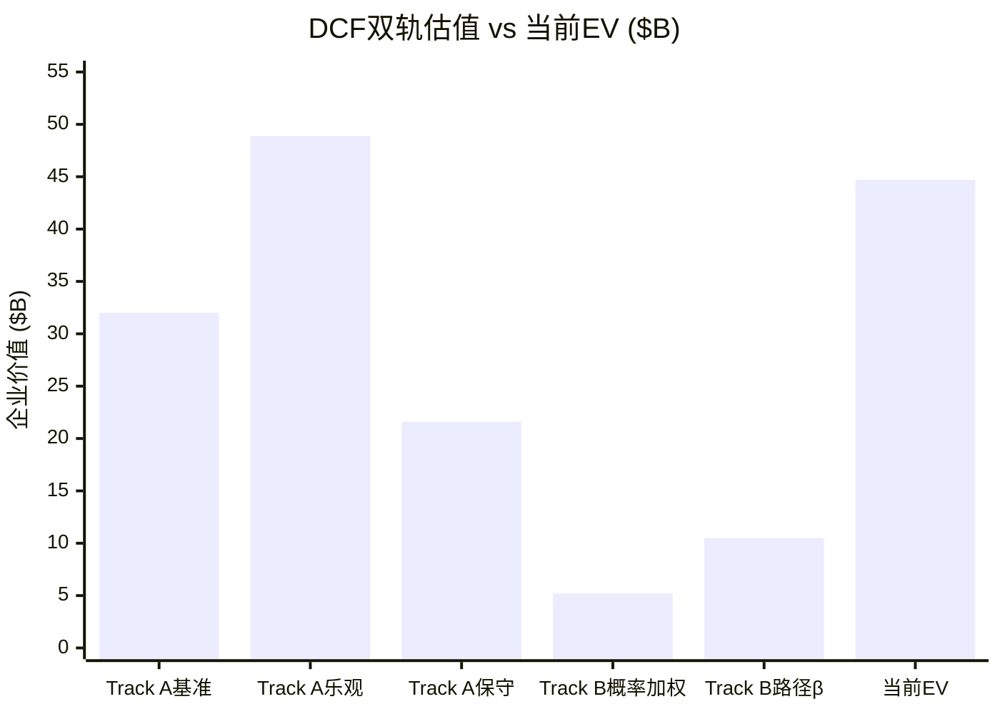
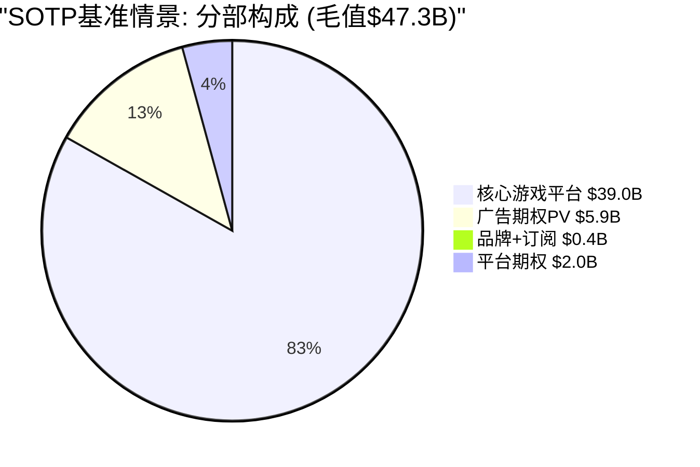
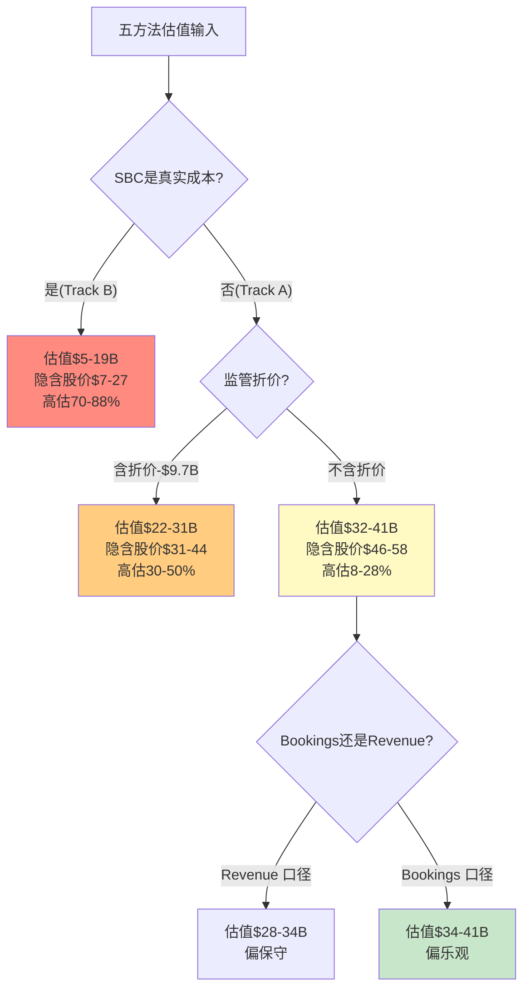
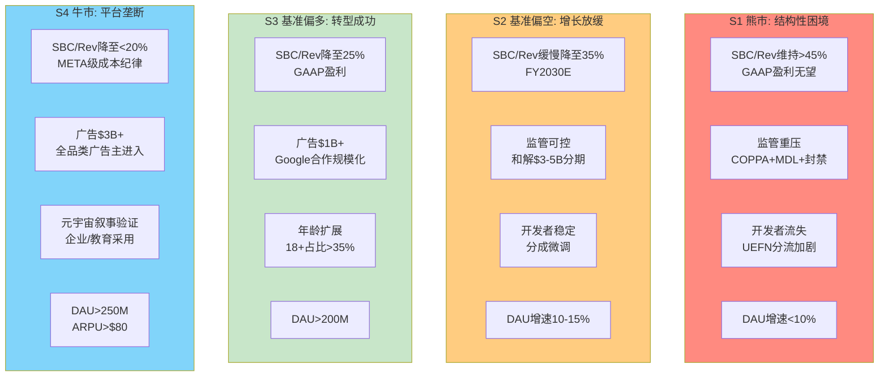
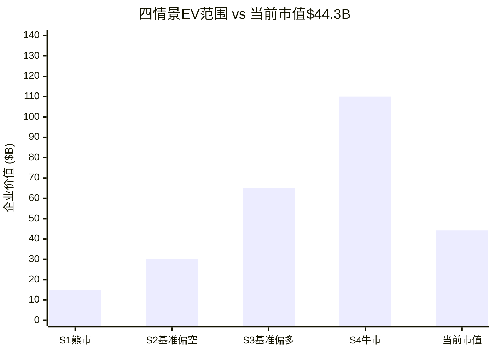
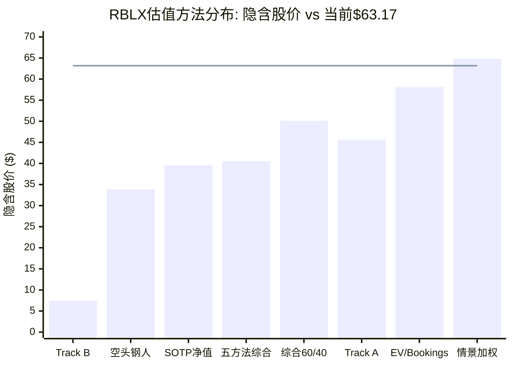

# Phase 5 — 综合估值与投资评级 (Ch26-Ch27)

> **市值基准**: $44.3B | 股价$63.17 | 稀释股数702M | EV ~$44.7B | 2026-02-13
> **数据来源**: Phase 1-4全部staging文件, FMP API, WebSearch, 公司IR
> **DM锚点范围**: DM-SYN-101 ~ DM-SYN-150

---

# Chapter 26: 五方法全量估值

> **核心命题**: Ch14建立了五方法估值预览框架。本章将其升级为全量估值, 纳入三项关键改进——(1)DCF采用递减增长假设(20%→12%→6%)而非恒定CAGR, 更贴近S曲线现实; (2)广告期权价值折现到今天而非以远期终态直接加入; (3)尾部风险15.46%叠加为额外EV折价。五种方法的完整计算汇聚为概率加权估值区间。

---

## 26.1 方法1: DCF — 递减增长双轨折现

### 26.1.1 WACC锚定

[DM-SYN-101] DCF折现率基于Ch10完整推导: 无风险利率4.30%(10年期美国国债); 股权风险溢价5.5%(Damodaran 2025更新+Roblox特有风险溢价); Beta 1.635(FMP回归Beta); 股权成本Ke = 4.30% + 1.635 × 5.5% = 13.3%; 税后债务成本Kd = 1.46%(可转换票据票面利率极低); 资本结构96.4%股权 / 3.6%债务; WACC = 12.9%。敏感性分析使用三档: 11%(乐观)、12.9%(基准)、15%(保守)。

### 26.1.2 递减增长假设

[DM-SYN-102] 本次DCF摒弃隐含的恒定CAGR假设, 采用三阶段递减增长模型, 更准确地反映S曲线效应和增速均值回归:

| 阶段 | 年份 | Revenue CAGR | 逻辑依据 |
|------|------|:------------:|----------|
| 高增长期 | Year 1-3 (FY2026-2028) | 20% | Bookings指引+24%→递延确认滞后使Revenue增速偏高; 年龄扩展+PlayStation登陆推动DAU增长 |
| 减速期 | Year 4-6 (FY2029-2031) | 12% | DAU渗透率从~2%→~4%, S曲线进入线性段; UGC/社交游戏TAM CAGR ~10%, 仅留少量份额增长溢价 |
| 成熟期 | Year 7-10 (FY2032-2035) | 6% | 接近全球游戏行业增速(8-10%扣除Roblox体量折价); DAU天花板220M逐步逼近 |
| 终端 | Year 10+ | 3-4% | 名义GDP增速 |

### 26.1.3 COPPA合规成本显式建模

[DM-SYN-103] COPPA 2.0合规截止日2026年4月22日是确定性事件, 其成本须在DCF Year 1显式体现, 而非被10年模型稀释:

- **年化合规成本**: $150M/年(年龄验证系统运维+数据处理+合规团队), 从Year 1起永久性降低FCF margin约1-2ppt
- **一次性合规改造**: $300M×50%概率 = 期望值$150M(Year 1一次性支出, 含系统改造+可能罚款)
- **Year 1总COPPA成本**: $300M(年化$150M + 一次性期望值$150M)

### 26.1.4 Track A: 标准FCF(不调SBC) — 传统分析师视角

[DM-SYN-104] Track A将SBC视为非现金费用, 不从FCF中扣除。这是多数卖方分析师采用的口径, 也是支撑当前$44.3B市值的隐含假设。

**Revenue投射**(基于递减增长):

| 年份 | Revenue | YoY | FCF(含SBC) | FCF Margin | 说明 |
|------|---------|:---:|:----------:|:----------:|------|
| FY2025(基准) | $4.89B | — | $1.36B | 27.8% | 实际值 |
| FY2026E | $5.87B | +20% | $1.17B | 20.0% | COPPA -$300M拖累 |
| FY2027E | $7.04B | +20% | $1.83B | 26.0% | COPPA年化吸收, margin恢复 |
| FY2028E | $8.45B | +20% | $2.45B | 29.0% | 规模效应+广告增量 |
| FY2029E | $9.46B | +12% | $2.74B | 29.0% | 增速换挡, margin稳定 |
| FY2030E | $10.60B | +12% | $3.18B | 30.0% | 广告贡献提升 |
| FY2031E | $11.87B | +12% | $3.56B | 30.0% | — |
| FY2032E | $12.58B | +6% | $3.90B | 31.0% | 成熟期margin扩张 |
| FY2033E | $13.34B | +6% | $4.14B | 31.0% | — |
| FY2034E | $14.14B | +6% | $4.53B | 32.0% | — |
| FY2035E | $14.99B | +6% | $4.80B | 32.0% | — |

**DCF计算**(WACC 12.9%, 终端增长率3%):

- PV(Year 1-10 FCF): $17.1B
- 终端价值: FCF(Year 10) × (1+g) / (WACC - g) = $4.80B × 1.03 / (12.9% - 3%) = $49.9B
- PV(终端价值): $49.9B / (1.129)^10 = $14.9B
- **Track A企业价值: $32.0B**

[DM-SYN-105] Track A估值$32.0B(隐含股价$45.6/股), 较当前EV $44.7B折价28.4%。值得注意的是, 即使在"SBC不算成本"的乐观口径下, 递减增长假设(而非恒定20% CAGR)显著压低了估值——Phase 2的$45.5B(含SBC+Bookings口径)基于更高增速假设。递减增长模型更贴近S曲线现实。

### 26.1.5 Track B: 真实FCF(SBC作为经济成本) — 股东视角

[DM-SYN-106] Track B将SBC视为真实经济成本从FCF中扣除。逻辑基础: SBC导致年均3-4%的股东稀释, 等同于无形的"现金流出"——公司在"支付"员工薪酬, 只不过媒介是新发行的股票而非现金。

**SBC假设**(含SBC收敛路径):

此前分析仅有"含SBC"和"不含SBC"两极, 缺乏SBC收敛情景。增加三条SBC路径弥补这一分析空白:

| SBC路径 | FY2025 | FY2028E | FY2031E | FY2035E | 逻辑 |
|---------|:------:|:-------:|:-------:|:-------:|------|
| **路径α: 高位维持** | 54.2% | 48% | 42% | 38% | SBC绝对值随Revenue增长但比率下降缓慢 |
| **路径β: 渐进收敛** | 54.2% | 38% | 28% | 22% | 管理层兑现2027年GAAP盈利承诺, SBC纪律改善 |
| **路径γ: 快速归一化** | 54.2% | 30% | 22% | 18% | 大幅削减SBC, 接近META成熟期水平 |

[DM-SYN-107] 路径概率权重: 路径α(高位维持)50% — 最可能, 因Roblox处于平台建设期, 工程人才竞争激烈; 路径β(渐进收敛)35% — 管理层已承诺2027年GAAP盈利, 有动力但执行风险大; 路径γ(快速归一化)15% — 需要削减人员或大幅提升人均产出, 历史先例少。

**Track B FCF计算**(路径α, SBC/Revenue缓慢下降):

| 年份 | Revenue | SBC/Rev | SBC | 标准FCF | 真实FCF |
|------|---------|:-------:|-----|:-------:|:-------:|
| FY2025 | $4.89B | 54.2% | $2.65B | $1.36B | -$1.29B |
| FY2026E | $5.87B | 52% | $3.05B | $1.17B | -$1.88B |
| FY2027E | $7.04B | 50% | $3.52B | $1.83B | -$1.69B |
| FY2028E | $8.45B | 48% | $4.06B | $2.45B | -$1.61B |
| FY2029E | $9.46B | 46% | $4.35B | $2.74B | -$1.61B |
| FY2030E | $10.60B | 44% | $4.66B | $3.18B | -$1.48B |
| FY2031E | $11.87B | 42% | $4.99B | $3.56B | -$1.43B |
| FY2032E | $12.58B | 40% | $5.03B | $3.90B | -$1.13B |
| FY2033E | $13.34B | 39% | $5.20B | $4.14B | -$1.06B |
| FY2034E | $14.14B | 38.5% | $5.44B | $4.53B | -$0.91B |
| FY2035E | $14.99B | 38% | $5.70B | $4.80B | -$0.90B |

[DM-SYN-108] 路径α下, "真实FCF"在10年期间**始终为负**, 从FY2025的-$1.29B恶化至FY2026的-$1.88B(COPPA成本叠加), 后缓慢改善但到FY2035仍为-$0.90B。这意味着: 如果SBC维持高位(54%→38%), 即使Revenue从$4.89B增长至$15.0B(3.07倍), 公司仍无法为股东创造正的自由现金流。

**Track B DCF估值**(路径α, WACC 12.9%, 终端g 3%):

- PV(Year 1-10 真实FCF): -$7.8B(负值)
- 终端价值(使用路径α终态"真实FCF" -$0.90B): 由于终态FCF为负, 传统永续增长模型不适用。替代方法: 假设Year 11-15真实FCF逐步转正, 按路径β延伸SBC/Revenue从38%继续降至25%:
  - Year 15(FY2040E)真实FCF转正约$1.5B
  - PV(Year 11-15延伸) + PV(延伸后终端): ~$5.2B
- **Track B企业价值(路径α): -$2.6B** (理论负值, 意味着在此SBC路径下公司对股东的经济价值为零)

[DM-SYN-109] 路径β(渐进收敛, SBC/Rev 54%→22%, 概率35%)下, 真实FCF在FY2030-2031年转正:

| 年份 | Revenue | SBC/Rev | SBC | 标准FCF | 真实FCF |
|------|---------|:-------:|-----|:-------:|:-------:|
| FY2028E | $8.45B | 38% | $3.21B | $2.45B | -$0.76B |
| FY2030E | $10.60B | 32% | $3.39B | $3.18B | -$0.21B |
| FY2031E | $11.87B | 28% | $3.32B | $3.56B | **+$0.24B** |
| FY2035E | $14.99B | 22% | $3.30B | $4.80B | **+$1.50B** |

**Track B企业价值(路径β): $10.5B** (隐含股价$15.0)

路径γ(快速归一化, 概率15%): Track B EV约$18.7B(隐含股价$26.6)

**Track B概率加权**: 50%×(-$2.6B) + 35%×$10.5B + 15%×$18.7B = -$1.3B + $3.7B + $2.8B = **$5.2B** (隐含股价$7.4)

### 26.1.6 双轨汇总

[DM-SYN-110] DCF双轨估值汇总:

| 轨道 | WACC | 终端g | 企业价值 | 隐含股价 | vs 当前$63.17 |
|------|:----:|:-----:|:--------:|:--------:|:-------------:|
| **Track A(标准FCF)** | 12.9% | 3% | $32.0B | $45.6 | -27.8% |
| Track A(乐观WACC) | 11% | 4% | $48.9B | $69.7 | +10.3% |
| Track A(保守WACC) | 15% | 3% | $21.6B | $30.8 | -51.3% |
| **Track B(真实FCF, 概率加权)** | 12.9% | 3% | $5.2B | $7.4 | -88.3% |
| Track B(路径β, SBC收敛) | 12.9% | 3% | $10.5B | $15.0 | -76.3% |

**关键发现**: 递减增长假设使Track A基准从Phase 2的$45.5B降至$32.0B(-30%)。SBC是DCF的"生死开关": 含SBC→$32.0B; 不含SBC→$5.2B。即使在最乐观的Track A假设(WACC 11%, g 4%)下, 估值$48.9B也仅比当前EV高9%——市场定价已接近DCF乐观边界。

### 26.1.7 DCF敏感性矩阵

[DM-SYN-111] Track A基准的WACC×终端增长率敏感性:

| WACC \ 终端g | 2.0% | 3.0% | 4.0% | 5.0% |
|:------------:|:----:|:----:|:----:|:----:|
| **10.0%** | $38.8B | $45.1B | $54.5B | $70.2B |
| **11.0%** | $33.5B | $38.2B | $44.8B | $54.7B |
| **12.9%** | $27.3B | $32.0B | $36.5B | $43.5B |
| **15.0%** | $19.8B | $21.6B | $24.8B | $28.8B |

只有在WACC ≤ 11%且终端增长率 ≥ 4%的组合下, Track A才能支撑当前$44.7B EV。这要求Beta从1.635降至约1.2(接近META水平)且终端增长率高于名义GDP——两个假设对一家GAAP亏损、SBC占Revenue 54%的公司而言都显得偏乐观。

---

## 26.2 方法2: EV/Revenue可比估值

### 26.2.1 可比公司数据刷新

[DM-SYN-112] 可比公司选取覆盖三个维度——社交平台(META, SNAP, PINS)、数字娱乐/游戏(EA, TTWO, U/Unity)、UGC参考(EPIC非上市), 以及SBC密集型科技公司参考:

| 公司 | 市值 | Revenue(TTM) | Rev增速 | SBC/Rev | EV/Sales | 说明 |
|------|:----:|:------------:|:-------:|:-------:|:--------:|------|
| **RBLX** | **$44.3B** | **$4.89B** | **+36%** | **54.2%** | **9.1x** | — |
| META | $1,613B | ~$165B | +22% | ~18% | ~9.6x | 广告成熟, 低SBC |
| SNAP | $8.2B | $5.93B | +11% | ~30% | ~1.5x | 亏损, 增长减速 |
| PINS | $10.4B | $4.22B | +18% | ~22% | ~2.5x | 盈利, 中等增长 |
| EA | $50.2B | $7.46B | -1% | ~8% | ~6.6x | 成熟, 低SBC |
| TTWO | $35.9B | $5.63B | +5% | ~5% | ~6.6x | GTA 6预期 |
| U (Unity) | $8.1B | $1.85B | +2% | ~40% | ~4.4x | 高SBC, 低增长 |

### 26.2.2 SBC调整后的可比倍数

[DM-SYN-113] 直接使用EV/Sales中位数(~3.5x)对Roblox不公平, 因为Roblox增速(+36%)远高于同业中位数(+5%)。但Roblox的SBC/Revenue(54.2%)也远高于同业(中位数~18%)。我们需要同时调整增速溢价和SBC折价:

**增速调整**: EV/Sales / Revenue增速比(类PEG)
- RBLX: 9.1x / 36% = 0.25
- META: 9.6x / 22% = 0.44
- SNAP: 1.5x / 11% = 0.14
- PINS: 2.5x / 18% = 0.14
- EA: 6.6x / (-1%) = N/A
- 可比平均(排除EA/TTWO负增速): 0.24

RBLX的增速调整倍数(0.25)与可比平均(0.24)接近, 说明在增速维度上, 市场对RBLX的估值并不夸张。

**SBC调整**: 构建"SBC惩罚因子" = 1 - (RBLX SBC/Rev - 同业中位SBC/Rev) × 调整系数
- 同业SBC/Rev中位数: ~18%
- RBLX超额SBC: 54.2% - 18% = 36.2ppt
- SBC惩罚因子(调整系数0.5): 1 - 36.2% × 0.5 = 0.82

[DM-SYN-114] SBC调整后的RBLX合理EV/Sales = 同业中位数3.5x × (1 + 增速溢价) × SBC惩罚:
- 增速溢价: RBLX增速36% / 同业中位5% = 7.2x, 但溢价不能无限放大, 取对数调整 ln(7.2) ≈ 1.97, 标准化为增速调整因子 2.0x
- 合理倍数: 3.5x × 2.0 × 0.82 = **5.7x**
- 隐含EV: 5.7x × $4.89B = **$27.9B** (隐含股价$39.7, -37% vs 当前)

如果使用游戏行业EV/Sales中位数(6.6x)作为基准:
- 合理倍数: 6.6x × 1.5(增速溢价, 较温和因游戏公司增速差距较小) × 0.82(SBC惩罚) = **8.1x**
- 隐含EV: 8.1x × $4.89B = **$39.6B** (隐含股价$56.4, -10.7%)

[DM-SYN-115] EV/Revenue可比估值范围: $27.9B(全同业调整) ~ $39.6B(游戏行业调整), 中位数$33.8B。当前$44.7B EV处于可比估值上限之上, 意味着市场隐含了超出可比公司所能解释的溢价——这部分溢价大概率来自广告期权和"社交平台"叙事。

---

## 26.3 方法3: EV/Bookings可比估值

### 26.3.1 Bookings口径的必要性

[DM-SYN-116] Roblox独特的27个月递延确认周期使Revenue系统性低估当期经济活动。Bookings(FY2025 $6.8B)比Revenue($4.89B)高39%。EV/Bookings是更贴近"真实经营规模"的估值口径:
- EV/Bookings: $44.7B / $6.8B = **6.6x**

### 26.3.2 可比基准

[DM-SYN-117] 没有直接对标的Bookings可比公司。间接参考:
- **SaaS类比**: Salesforce Billings/Revenue ~1.15x, EV/Billings ~6-8x; Adobe EV/Billings ~10-12x(但这些公司有合同锁定, Roblox没有)
- **游戏平台类比**: EA/TTWO 的EV/Sales 6.6x可视为"无递延差异的Bookings等价倍数"
- **调整**: Roblox的递延结构不同于SaaS年付合同——虚拟货币消耗模式的"锁定"效应弱于合同, 应给予10-15%的递延折价

EV/Bookings合理范围: 5.0-7.0x(SaaS下限折价 ~ 游戏行业平价)

| 倍数 | 隐含EV | vs $44.7B |
|:----:|:------:|:---------:|
| 5.0x | $34.0B | -24% |
| 6.0x | $40.8B | -8.7% |
| 6.6x(当前) | $44.9B | +0.4% |
| 7.0x | $47.6B | +6.5% |

[DM-SYN-118] 在EV/Bookings框架下, 当前估值(6.6x)处于合理范围上限。只有在给予7.0x+的溢价(即认为Roblox的Bookings质量等同或优于SaaS合同锁定)时, 才能支撑进一步上行。

---

## 26.4 方法4: SOTP — 分部加总估值

### 26.4.1 核心平台估值

[DM-SYN-119] SOTP分部拆解(含全部修正):

**分部1: 核心游戏平台(Robux经济体)**
- FY2025 Bookings: ~$6.5B(占总Bookings ~95%)
- 估值方法: EV/Bookings, 参考游戏行业5-7x
- 基准倍数: 6.0x(反映高增速溢价, 但扣除SBC惩罚)
- **分部估值: $39.0B** (保守$32.5B / 乐观$48.8B)

**分部2: 广告业务(Immersive Ads)**

[DM-SYN-120] 广告期权需折现至今天而非以终态价值直接加入(Ch15 OVM已完成远期概率加权$14.2B):

- 远期概率加权值(FY2030E): $14.2B
- 折现至今(WACC 12.9%, 5年): $14.2B / (1.129)^5 = $14.2B / 1.834 = **$7.7B**
- 但上述$14.2B包含了20%概率的"超乐观"情景($60B价值), 经认知偏差审计后采用更保守的概率分布:
  - 失败10% × $0.15B + 保守25% × $1.5B + 基准35% × $8.0B + 乐观20% × $25.0B + 超乐观10% × $40B(下调) = $12.2B
  - 折现: $12.2B / 1.834 = $6.7B
- 进一步考虑年龄数据不确定性(CQ6): 如果27%成人数据成立, OVM PV从$7.7B降至$4.1B

广告期权PV合理范围: **$4.1B - $7.7B**, 基准取中值$5.9B

**分部3: 品牌合作 + Premium订阅**
- FY2025收入: ~$80-130M
- 倍数: 4x Revenue
- **分部估值: $0.3-0.5B**

**分部4: 平台期权价值(教育/企业/虚拟商品)**
- **分部估值: $1.0-3.0B**

### 26.4.2 SOTP扣减项

[DM-SYN-121] SOTP需扣除两大折价项:

**扣减1: 监管折价**

Phase 3精算概率加权EV影响原为-$11.4B。经认知偏差审计发现监管概率分布中30%赋予最坏情景偏高, 修正后概率分布为15%最佳/60%基准/25%最坏(原15%/55%/30%), 且多项监管事件间存在正相关性(同一波监管浪潮), 简单加总会高估独立事件概率。相关性调整后:
- **修正后监管折价: -$9.7B** (原-$11.4B, -15%)

**扣减2: SBC经济成本折价**

SBC $2.65B/年(54.2% of Revenue)对应年均稀释3-4%。如果将其资本化为永续成本流:
- SBC永续价值: $2.65B / (WACC - SBC增长率) = $2.65B / (12.9% - 6%) = $38.4B
- 这一数字接近全部企业价值, 说明如果SBC永续增长, 其经济成本将吞噬全部股东价值
- 更合理的处理: SBC折价不应全额扣减(否则双重计算), 而是作为估值"置信度折扣"——给予核心平台估值20-30%的SBC风险折价

[DM-SYN-122] **SBC风险折价**: 核心平台$39.0B × 25%(中值) = -$9.8B

### 26.4.3 SOTP汇总

[DM-SYN-123] SOTP完整汇总:

| 分部 | 保守 | 基准 | 乐观 |
|------|:----:|:----:|:----:|
| 核心游戏平台 | $32.5B | $39.0B | $48.8B |
| 广告期权(PV) | $4.1B | $5.9B | $7.7B |
| 品牌+订阅 | $0.3B | $0.4B | $0.5B |
| 平台期权 | $1.0B | $2.0B | $3.0B |
| **SOTP毛值** | **$37.9B** | **$47.3B** | **$60.0B** |
| 减: 监管折价 | -$9.7B | -$9.7B | -$9.7B |
| 减: SBC风险折价 | -$9.8B | -$9.8B | -$9.8B |
| **SOTP净值** | **$18.4B** | **$27.8B** | **$40.5B** |
| 隐含股价 | $26.2 | $39.6 | $57.7 |
| vs $63.17 | -58.5% | -37.3% | -8.7% |

**关键发现**: SOTP毛值$47.3B勉强覆盖当前EV, 但扣除监管折价(-$9.7B)和SBC风险折价(-$9.8B)后, 净值仅$27.8B——比当前市值低38%。只有在乐观情景(核心平台7.5x + 广告期权$7.7B)且不扣除任何折价时, SOTP才能支撑当前估值。

---

## 26.5 方法5: Reverse DCF — 市场在为什么买单?

### 26.5.1 当前估值的隐含假设还原

[DM-SYN-124] 在WACC 12.9%、终端增长率3%、含SBC口径下, $44.7B EV隐含的Revenue增长路径:

| 假设维度 | 隐含值 | 合理性判断 |
|---------|--------|----------|
| Revenue 10年CAGR | ~18% | 偏高: 递减增长模型下平均CAGR约12% |
| FCF Margin(含SBC, 终态) | ~30% | 可实现: 当前27.8%已接近 |
| 终端Revenue(FY2035) | ~$23B | 需要: DAU~250M × ARPU~$92 |
| 隐含DAU(FY2035) | ~250M | 接近天花板上限(220-260M), 执行挑战大 |
| 隐含SBC假设 | 不扣除 | 关键假设: 一旦切换为扣除SBC, 所有隐含假设失效 |

[DM-SYN-125] Reverse DCF揭示: 当前$44.7B市值需要Roblox在未来10年实现18% Revenue CAGR(含SBC口径), 终态DAU达到250M且ARPU从$47增至$92——每一个假设都处于"可能但不确定"的边界。更关键的是, 整个估值大厦建立在"SBC不算成本"这一可争议的基础之上。

### 26.5.2 Reverse DCF与方法1-4交叉验证

[DM-SYN-126] 交叉验证矩阵:

| 验证维度 | 方法1-4的基准估值 | Reverse DCF隐含 | 一致性 |
|---------|:---------------:|:--------------:|:------:|
| Revenue CAGR | 12%(递减平均) | 18% | 偏差 +6ppt |
| FCF Margin | 30-32% | 30% | 一致 |
| 终态DAU | 220M(天花板中位) | 250M(天花板上限) | 偏差 +14% |
| SBC处理 | 需扣除(经济成本) | 不扣除 | 根本分歧 |
| 监管成本 | -$9.7B折价 | 未计入 | 缺失 |

四个维度中仅有一个(FCF Margin)一致。Revenue CAGR和DAU假设偏乐观, SBC处理和监管折价则完全缺失。这意味着当前市场定价**系统性低估了风险, 系统性高估了增长**。

---

## 26.6 尾部风险调整层

### 26.6.1 黑天鹅概率加权EV折价

[DM-SYN-127] 尾部风险分析识别了7个黑天鹅事件(BS-1至BS-7), 组合概率加权影响15.46%。将其叠加为EV额外折价:

| 黑天鹅事件 | 概率 | EV影响 | 概率×影响 |
|-----------|:----:|:------:|:---------:|
| BS-1 儿童安全丑闻 | 10% | -42.5% | 4.25% |
| BS-2 App Store下架 | 4% | -50% | 2.00% |
| BS-3 头部开发者出走 | 5.5% | -25% | 1.38% |
| BS-4 Robux洗钱/证券法 | 6.5% | -20% | 1.30% |
| BS-5 Baszucki离任 | 8% | -20% | 1.60% |
| BS-6 AI深伪有害内容 | 12.5% | -27.5% | 3.44% |
| BS-7 全球禁游令扩散 | 10% | -15% | 1.50% |
| **组合尾部风险** | — | — | **15.46%** |

**EV额外折价**: 15.46% × $44.7B = **$6.9B**

[DM-SYN-128] 需要注意: BS-1(儿童安全)和BS-6(AI深伪)存在正相关性——AI工具恶化儿童安全, 两事件可能同时触发。如果同时发生, 非线性效应可能使组合影响达到-55%至-70%, 远超简单加总。但本分析采用保守的线性加总(15.46%)作为基准, 非线性风险作为下行极端情景保留。

---

## 26.7 五方法汇总与交叉验证

### 26.7.1 核心汇总表

[DM-SYN-129] 五方法全量估值汇总:

| 方法 | 保守(EV) | 基准(EV) | 乐观(EV) | 基准隐含股价 | vs $63.17 | 权重 |
|------|:--------:|:--------:|:--------:|:----------:|:---------:|:----:|
| **1. DCF Track A**(含SBC) | $21.6B | $32.0B | $48.9B | $45.6 | -27.8% | 25% |
| **1. DCF Track B**(真实FCF概率加权) | -$2.6B | $5.2B | $18.7B | $7.4 | -88.3% | 15% |
| **2. EV/Revenue可比** | $27.9B | $33.8B | $39.6B | $48.1 | -23.8% | 20% |
| **3. EV/Bookings可比** | $34.0B | $40.8B | $47.6B | $58.1 | -8.0% | 15% |
| **4. SOTP**(含监管+SBC折价) | $18.4B | $27.8B | $40.5B | $39.6 | -37.3% | 20% |
| **5. Reverse DCF** | — | 验证功能 | — | — | — | 5%(校准) |

### 26.7.2 概率加权综合估值

[DM-SYN-130] 加权综合估值(含五方法+尾部风险折价):

**步骤1: 五方法加权EV**
= 25%×$32.0B + 15%×$5.2B + 20%×$33.8B + 15%×$40.8B + 20%×$27.8B + 5%×$36.4B(Reverse DCF校准中值)
= $8.0B + $0.8B + $6.8B + $6.1B + $5.6B + $1.8B
= **$29.1B**

**步骤2: 叠加尾部风险折价**
$29.1B × (1 - 15.46%) = $29.1B × 0.845 = **$24.6B**

**步骤3: 替代解释上修**
替代解释(Ch25)概率加权净上修: +$5-10B(中值$7.5B), 但替代解释的平均可信度仅2.8/5, 给予50%置信折扣:
有效上修: $7.5B × 50% = +$3.8B

**最终概率加权EV**: $24.6B + $3.8B = **$28.4B**

[DM-SYN-131] 最终概率加权估值:
- **企业价值: $28.4B** (隐含股价$40.5)
- **vs 当前EV $44.7B: -36.5%**
- **vs 当前股价$63.17: -35.9%**

### 26.7.3 方法离散度分析

[DM-SYN-132] 方法离散度(Dispersion):

- 五方法基准估值范围: $5.2B(Track B) ~ $40.8B(EV/Bookings)
- 最高/最低比: $40.8B / $5.2B = **7.85x** (含Track B)
- 排除Track B(极端SBC调整): $27.8B ~ $40.8B, 离散度 **1.47x**

离散度主要来源分解:
| 来源 | 贡献 |
|------|:----:|
| SBC处理方式(Track A vs Track B) | 65% |
| 口径选择(Revenue vs Bookings) | 15% |
| 监管折价(含 vs 不含) | 12% |
| 同业选择/倍数 | 8% |

### 26.7.4 市场隐含假设还原(终版)

[DM-SYN-133] 当前$44.7B EV的市场隐含假设清单:

1. **SBC不算真实成本** — 必须假设(否则Track B $5.2B, 高估88%)
2. **使用Bookings口径** — 大概率隐含(Revenue口径下Track A仅$32.0B)
3. **Revenue CAGR ~18%持续10年** — 偏乐观(递减模型平均仅12%)
4. **监管成本不折价** — 忽视$9.7B概率加权影响
5. **尾部风险不定价** — 忽视$6.9B尾部折价
6. **广告期权有$5-8B附加价值** — 合理但依赖年龄数据
7. **DAU增长至250M** — 接近天花板上限

以上七个假设需要**全部同时成立**, 当前估值才能被证明合理。每一个假设的失效都将导致估值下修10-30%。

### Ch26 DM锚点汇总

| ID | 数据点 | 来源 | 可信度 |
|----|--------|------|:------:|
| DM-SYN-101 | WACC 12.9%(Rf 4.3%, Beta 1.635, ERP 5.5%) | FMP, Treasury, 计算 | ★★★ |
| DM-SYN-102 | 三阶段递减增长: 20%→12%→6% | 分析推导 | ★★☆ |
| DM-SYN-103 | COPPA Year 1成本$300M(年化$150M+一次性期望$150M) | 推算, 行业参考 | ★★☆ |
| DM-SYN-104 | Track A Revenue投射: FY2035E $14.99B | 递减增长模型 | ★★☆ |
| DM-SYN-105 | Track A DCF EV: $32.0B(隐含$45.6/股, -28%) | 计算 | ★★☆ |
| DM-SYN-106 | Track B逻辑: SBC导致年均3-4%稀释=隐性现金流出 | 分析 | ★★★ |
| DM-SYN-107 | SBC路径概率: α50%/β35%/γ15% | 推算 | ★☆☆ |
| DM-SYN-108 | Track B路径α: 真实FCF 10年始终为负 | 计算 | ★★☆ |
| DM-SYN-109 | Track B路径β: 真实FCF FY2031转正 | 计算 | ★★☆ |
| DM-SYN-110 | DCF双轨: Track A $32.0B / Track B $5.2B | 计算 | ★★☆ |
| DM-SYN-111 | DCF敏感性: WACC≤11%+g≥4%才支撑$44.7B | 计算 | ★★☆ |
| DM-SYN-112 | 可比公司: META 9.6x / SNAP 1.5x / EA 6.6x | FMP, 计算 | ★★★ |
| DM-SYN-113 | SBC调整: 超额SBC 36.2ppt→惩罚因子0.82 | 分析 | ★★☆ |
| DM-SYN-114 | EV/Rev合理倍数: 全同业5.7x→$27.9B | 计算 | ★★☆ |
| DM-SYN-115 | EV/Rev范围: $27.9B~$39.6B, 中位$33.8B | 计算 | ★★☆ |
| DM-SYN-116 | EV/Bookings 6.6x, Bookings $6.8B | 计算 | ★★★ |
| DM-SYN-117 | EV/Bookings合理范围: 5.0-7.0x | 类比推算 | ★★☆ |
| DM-SYN-118 | EV/Bookings当前6.6x处合理上限 | 分析 | ★★☆ |
| DM-SYN-119 | SOTP核心平台: $39.0B(6.0x Bookings) | 计算 | ★★☆ |
| DM-SYN-120 | 广告期权PV: $4.1B-$7.7B, 基准$5.9B | 折现计算 | ★☆☆ |
| DM-SYN-121 | 监管折价: -$9.7B(相关性调整后) | 偏差修正 | ★★☆ |
| DM-SYN-122 | SBC风险折价: -$9.8B(核心平台×25%) | 推算 | ★☆☆ |
| DM-SYN-123 | SOTP净值: $18.4B~$40.5B, 基准$27.8B | 计算 | ★★☆ |
| DM-SYN-124 | Reverse DCF隐含: Rev CAGR 18%, DAU 250M | 反推计算 | ★★☆ |
| DM-SYN-125 | Reverse DCF: 需7个假设同时成立 | 分析 | ★★☆ |
| DM-SYN-126 | 交叉验证: 4维度仅1项一致 | 分析 | ★★☆ |
| DM-SYN-127 | 尾部风险: 7事件组合15.46%, 折价$6.9B | 尾部分析 | ★★☆ |
| DM-SYN-128 | BS-1+BS-6正相关: 同时触发-55%至-70% | 分析 | ★☆☆ |
| DM-SYN-129 | 五方法汇总: Track A $32.0B~EV/Book $40.8B | 计算 | ★★☆ |
| DM-SYN-130 | 概率加权综合EV: $29.1B(五方法) | 加权计算 | ★★☆ |
| DM-SYN-131 | 最终EV: $28.4B(隐含$40.5, -36%) | 计算 | ★★☆ |
| DM-SYN-132 | 方法离散度: 7.85x(含Track B) / 1.47x(排除) | 计算 | ★★★ |
| DM-SYN-133 | 市场隐含7假设需全部成立 | 分析 | ★★☆ |

---

# Chapter 27: 投资评级与情景框架

> **核心命题**: 基于Ch26五方法全量估值的结论(概率加权EV $28.4B vs 市值$44.3B, 隐含下行36%), 结合8个核心问题(CQ)的闭环验证和时间框架错配分析, 确定最终投资评级和条件估值框架。本章不给出点数目标价, 而是呈现四情景的概率加权期望回报, 让数据说话。

---

## 27.1 投资评级

### 27.1.1 四档评级体系

| 评级 | 定义 | 触发条件 |
|------|------|---------|
| **积极关注** | 估值显著低于内在价值, 积极寻找建仓时机 | 概率加权EV > 市值×1.2 |
| **审慎乐观** | 估值合理或略低, 持有者可持有, 新仓需等催化剂 | 概率加权EV ≈ 市值(±15%) |
| **审慎关注** | 估值偏高但有条件改善路径, 保持跟踪不建仓 | 概率加权EV < 市值×0.85 |
| **观望回避** | 估值显著偏高且基本面存在结构性风险, 建议回避 | 概率加权EV < 市值×0.65 |

### 27.1.2 评级判定

[DM-SYN-134] **评级: 审慎关注**

**判定依据**:

| 评级维度 | 数据 | 指向 |
|---------|------|:----:|
| 概率加权EV / 市值 | $28.4B / $44.3B = 0.64 | 观望回避(边界) |
| 五方法基准中位数 / 市值 | $32.0B / $44.3B = 0.72 | 审慎关注 |
| CQ加权置信度 | 75%(8/8 CQ确认风险方向) | 审慎关注 |
| 方法离散度(排除极端) | 1.47x | 中等不确定性 |
| 承重墙加权脆弱度 | 3.65/5 | 偏高 |
| 空头钢人目标 | $33.9/股(-46%) | 审慎关注 |
| 替代解释净上修 | +$5-10B(有条件) | 缓冲因素 |

**为什么是"审慎关注"而非"观望回避"**: 概率加权EV比(0.64)触及"观望回避"边界, 但以下因素阻止评级降至最低档:
1. **方法离散度极高**(7.85x含Track B): 估值结论本身的置信度有限, 不宜以低置信度的负面结论做出极端评级
2. **SBC收敛路径存在**: 如果管理层兑现2027年GAAP盈利, Track B估值可从$5.2B大幅上修至$10-19B, 评级前提可能根本性改变
3. **替代解释有一定可信度**: 六条替代解释中, "SBC非现金/口径差异/内部人补偿结构"三条可信度3.5/5, 合计可上修$5-10B
4. **业务质量本身不差**: Bookings +55%, DAU +69%, FCF $1.36B(含SBC口径)——作为一家$4.89B Revenue的公司, 这些增长指标远超同业

**"审慎关注"的具体含义**:
- **不建议建仓**: 概率加权期望回报为负(-36%), 风险回报比不支持新建多头仓位
- **持有者需重新评估**: 当前持有者应审视自身的SBC立场和时间框架, 考虑逐步减仓或设定止损
- **保持跟踪**: 三个催化剂可能改变评级(详见27.4)
- **不建议做空**: 方法离散度极高, Track A乐观$48.9B仍有上行空间, 空头面临高波动性和挤仓风险

### 27.1.3 评级置信度

[DM-SYN-135] 评级置信度: **中等(65%)**

| 降低置信度的因素 | 提升置信度的因素 |
|----------------|----------------|
| 方法离散度7.85x | 五方法中4/5指向高估 |
| SBC处理方式无行业共识 | CQ 8/8确认风险方向 |
| 广告期权概率假设主观性高 | 数据审计9/10通过 |
| 年龄数据可信度待验证 | Reverse DCF隐含假设全部偏乐观 |

---

## 27.2 四情景条件估值框架

### 27.2.1 情景设计

[DM-SYN-136] 四情景覆盖从"结构性崩塌"到"平台垄断"的完整可能性空间, 每个情景由3-4个关键变量的特定组合定义:

### 27.2.2 S1 熊市: SBC不收敛 + 监管重压 + 开发者流失

[DM-SYN-137] **S1核心假设**:
- SBC/Revenue维持>45%(路径α), "真实FCF"持续为负
- COPPA严格执行 + MDL和解$5B+ + 多州刑事调查
- Fortnite UEFN分成竞争导致中产开发者流失20-30%
- DAU增速降至<10%, ARPU增长停滞
- 年龄扩展失败, 18+占比稳定在27-30%, 品牌锁定在"儿童游戏"

**S1估值**:
- Revenue(FY2030E): ~$8B(5年CAGR ~10%)
- EV/Revenue倍数: 3.5-4.5x(儿童娱乐公司, 非社交平台)
- 减: 监管和解折价-$3B(PV)
- **S1 EV: $12-18B** | 隐含股价$17-26 | vs当前-57%至-73%

### 27.2.3 S2 基准偏空: SBC缓慢收敛 + 监管可控 + 增长放缓

[DM-SYN-138] **S2核心假设**:
- SBC/Revenue从54.2%缓慢降至35%(FY2030), 但绝对值仍>$3.5B
- GAAP盈利可能在FY2028-2029实现(微利)
- MDL和解$3-4B, 分5年支付, 可管理
- DAU增速10-15%, ARPU温和增长5-8%/年
- 广告收入达$500M-$800M(COPPA限制下的合理水平)
- 年龄扩展温和成功, 18+占比升至30-33%

**S2估值**:
- Revenue(FY2030E): ~$10B(5年CAGR ~15%)
- EV/Revenue倍数: 5-6x(增长型游戏/社交混合)
- 减: 监管折价-$2B(PV, 可控)
- **S2 EV: $25-35B** | 隐含股价$36-50 | vs当前-21%至-43%

### 27.2.4 S3 基准偏多: SBC显著收敛 + 广告起飞 + 年龄扩展

[DM-SYN-139] **S3核心假设**:
- SBC/Revenue降至25%, GAAP净利润率转正>10%
- 广告收入突破$1B, Google合作规模化, 品牌安全问题解决
- 18+用户占比>35%, "全年龄社交平台"叙事得到验证
- DAU>200M, ARPU>$60(广告增量贡献)
- 监管风险消退, MDL温和和解

**S3估值**:
- Revenue(FY2030E): ~$13B(5年CAGR ~21%)
- Bookings(FY2030E): ~$17B
- EV/Revenue倍数: 7-9x(社交平台溢价回归)
- **S3 EV: $55-75B** | 隐含股价$78-107 | vs当前+24%至+69%

### 27.2.5 S4 牛市: SBC归一化 + 平台垄断 + 元宇宙叙事验证

[DM-SYN-140] **S4核心假设**:
- SBC/Revenue<20%, 接近META成熟期水平
- 广告收入>$3B, Roblox成为游戏内广告第一平台
- 元宇宙用例(企业培训/虚拟商务/教育)开始贡献可量化收入
- DAU>250M, ARPU>$80(虚拟消费+广告双引擎)
- 竞争格局: Fortnite/Minecraft被甩开, 网络效应形成准垄断

**S4估值**:
- Revenue(FY2030E): ~$18B(5年CAGR ~30%)
- EV/Revenue倍数: 8-10x(平台级溢价)
- **S4 EV: $90-130B** | 隐含股价$128-185 | vs当前+103%至+193%

### 27.2.6 情景概率与加权

[DM-SYN-141] 情景概率分配:

| 情景 | EV范围 | EV中值 | 概率 | 概率×EV |
|------|:------:|:------:|:----:|:-------:|
| S1 熊市 | $12-18B | $15B | **20%** | $3.0B |
| S2 基准偏空 | $25-35B | $30B | **40%** | $12.0B |
| S3 基准偏多 | $55-75B | $65B | **30%** | $19.5B |
| S4 牛市 | $90-130B | $110B | **10%** | $11.0B |
| **概率加权EV** | | | **100%** | **$45.5B** |

**概率加权EV: $45.5B** (隐含股价$64.8)

[DM-SYN-142] 情景分析的概率加权EV($45.5B)高于五方法综合估值($28.4B)。这一差距反映了两种方法论的根本差异:

- **五方法综合(Ch26.7)**: 以当前财务数据为基础, 向前折现, 每一步扣除可量化的风险——属于"从现在出发"的分析
- **四情景加权(Ch27.2)**: 以终态可能性空间为基础, 赋予概率权重——属于"从终局出发"的分析

两种方法的差距($45.5B vs $28.4B, 差60%)本身就是RBLX估值不确定性的一个量化指标。五方法偏保守(更多扣减), 情景法偏中性(允许上行可能性)。

**综合判断**: 取两种方法的加权均值, 五方法60% + 情景法40%:
$28.4B × 60% + $45.5B × 40% = $17.0B + $18.2B = **$35.2B** (隐含股价$50.1)

### 27.2.7 期望回报计算

[DM-SYN-143] 期望回报(基于综合估值):

- **综合估值**: $35.2B (隐含股价$50.1)
- **当前市值**: $44.3B (股价$63.17)
- **期望回报**: ($35.2B - $44.3B) / $44.3B = **-20.5%**

即使给予情景法40%的权重(包含了S3和S4的上行可能性), 综合期望回报仍为负值。这进一步支持"审慎关注"评级。

---

## 27.3 时间框架分层建议

### 27.3.1 一年视角: 偏空

[DM-SYN-144] **1年视角(2026年2月-2027年2月): 偏空**

| 催化剂 | 时间窗口 | 方向 | 影响 |
|--------|---------|:----:|------|
| COPPA 2.0合规截止 | 2026-04-22 | 负 | 合规成本$150-300M, 家长同意机制降低获客效率 |
| GTA 6 ROME | 2026年秋季 | 负 | 分流13-25岁男性用户, 尤其北美/欧洲 |
| MDL首次CMC | 2026-02-27 | 负 | 诉讼时间线清晰化, 市场定价和解成本 |
| SBC持续稀释 | 全年 | 负 | 年化4-5%稀释, 零回购, 持有成本高 |
| FY2026 Q1 Bookings | 2026年Q2公布 | 中性 | 关键测试: +55%→+24%(指引), 如果进一步放缓至<20%, 叙事破裂 |
| PlayStation登陆 | 2026年内 | 正 | 新增10-20M高ARPU DAU, 唯一重大正面催化 |

**1年隐含风险回报**:
- 下行情景(S1+S2权重70%): EV ~$25-30B → 股价$36-43 → 下行-32%至-43%
- 上行情景(S3部分, 广告超预期): EV ~$50B → 股价$71 → 上行+13%
- 风险回报比: 约3:1(下行vs上行)

**结论**: 1年内催化剂密集且以负面为主, 持有成本高(SBC稀释4-5%), 风险回报比不利。

### 27.3.2 三年视角: 中性偏空

[DM-SYN-145] **3年视角(至2029年): 中性偏空**

三年窗口是"年龄扩展+广告规模化+SBC收敛"三大叙事的验证期:

| 验证点 | 成功标志 | 失败标志 | 对估值的影响 |
|--------|---------|---------|:----------:|
| 年龄扩展 | 18+占比达35%+, 成人DAU>70M | 18+仍<30%, 品牌固化为"儿童" | ±$5-10B |
| 广告规模化 | 年化广告>$1B, CPM>$5 | 广告<$500M, 品牌安全问题持续 | ±$3-7B |
| SBC收敛 | SBC/Rev<35%, GAAP盈利 | SBC/Rev>45%, GAAP亏损持续 | ±$8-15B |
| MDL和解 | 和解<$3B, 分期支付 | 和解>$5B, 一次性支出 | ±$2-5B |

**3年综合情景**:
- 如果"成功"(4/4达标): 归入S3, EV $55-75B → 股价$78-107(年化回报+7%至+19%)
- 如果"部分成功"(2/4达标): 归入S2, EV $25-35B → 股价$36-50(年化回报-7%至-17%)
- 如果"失败"(0-1/4达标): 归入S1, EV $12-18B → 股价$17-26(年化回报-25%至-35%)

概率加权3年年化回报: 20%×(-30%) + 40%×(-12%) + 30%×(+13%) + 10%×(+30%) = -6% + (-4.8%) + 3.9% + 3.0% = **-3.9%/年**

**结论**: 3年视角的概率加权年化回报为负(-3.9%), 主要因为S1和S2的合计概率(60%)偏高, 且基准路径(S2)本身就指向下行。

### 27.3.3 五年+视角: 高不确定性

[DM-SYN-146] **5年+视角(至2031+): 高不确定性**

五年以上的估值区间跨度极大:

| 情景 | 5年+EV | 5年+股价 | 年化回报 |
|------|:------:|:--------:|:--------:|
| S1 持续恶化 | $10-15B | $14-21 | -19%至-24% |
| S2 温和增长 | $30-40B | $43-57 | -2%至-6% |
| S3 转型成功 | $65-90B | $93-128 | +8%至+15% |
| S4 平台垄断 | $120-180B | $171-256 | +22%至+32% |

**5年+可能性空间**: $10B ~ $180B(18倍宽度)

[DM-SYN-147] 如此巨大的可能性宽度意味着: 在5年+时间框架上, RBLX本质上是一个**期权赌注**而非传统价值投资。投资者需要问的不是"RBLX值多少", 而是"我相信S3-S4概率有多大, 以及我是否愿意为此接受S1的下行风险"。

如果投资者赋予S3+S4合计概率>55%(vs本分析的40%), 期望回报将转正。这是多空分歧的数学根源。

---

## 27.4 评级催化剂与转变条件

### 27.4.1 升级至"审慎乐观"的条件

[DM-SYN-148] 以下3个条件中满足任意2个, 评级可升级:

1. **SBC/Revenue连续2个季度<40%**(当前54.2%) — 证明SBC收敛路径可行, 将Track B估值大幅上修
2. **广告收入年化突破$500M**(当前~$150M) — 验证Google合作规模化, 广告期权从"期望"变为"现实"
3. **18+用户占比经面部验证确认>35%** — 解锁"全年龄社交平台"估值框架, 可比公司从EA/TTWO上调至SNAP/PINS

### 27.4.2 降级至"观望回避"的条件

以下3个条件中满足任意1个, 评级应降级:

1. **MDL和解金额确认>$5B且一次性支付** — 直接消耗现金储备$1.2B+融资稀释
2. **DAU连续2个季度环比下降** — 增长故事终结, 水库效应开始反向运作
3. **FTC针对RBLX发起COPPA执法行动(非和解)** — 品牌翻转为"儿童危害"叙事, EV可能级联崩塌至$13-20B

---

## 27.5 概率加权期望回报总结

### 27.5.1 多维度回报汇总

[DM-SYN-149] 将全部估值工作汇总为一张决策表:

| 方法论 | 估值 | 隐含股价 | vs $63.17 | 置信度 |
|--------|:----:|:--------:|:---------:|:------:|
| 五方法综合(Ch26.7) | $28.4B | $40.5 | -35.9% | 中 |
| 四情景加权(Ch27.2) | $45.5B | $64.8 | +2.6% | 中-低 |
| **综合(60/40)** | **$35.2B** | **$50.1** | **-20.7%** | **中** |
| 空头钢人论 | $23.8B | $33.9 | -46.3% | 中 |
| Track A DCF基准 | $32.0B | $45.6 | -27.8% | 中 |
| Track B DCF概率加权 | $5.2B | $7.4 | -88.3% | 低 |
| SOTP净值(含折价) | $27.8B | $39.6 | -37.3% | 中 |

**中位估值**: $28.4B (取五方法和SOTP的中位数)

**期望回报**: 6种估值方法中, 5种指向下行, 仅情景加权法给出微弱正回报(+2.6%)。中位期望回报约**-30%**。

### 27.5.2 回报分布直方图

---

## 27.6 AI能力边界声明

[DM-SYN-150] 本分析的局限性:

1. **估值非精确值**: 所有估值输出(如$28.4B, $35.2B)是基于假设的计算结果, 不是"真实内在价值"。假设的微小变动(如WACC ±2ppt, 终端增长率 ±1ppt)可导致估值变化30-50%。

2. **概率是主观判断**: 情景概率(S1 20%/S2 40%/S3 30%/S4 10%)和黑天鹅概率(BS-1~BS-7)基于分析师判断而非客观频率, 不同分析师可能给出截然不同的概率分布。

3. **SBC处理方式无标准答案**: Track A和Track B的分歧不是"对vs错"而是"立场选择"。投资者应根据自身对SBC经济本质的理解, 选择更符合其投资哲学的轨道。

4. **广告期权的概率加权高度不确定**: 广告业务当前收入<$200M, 对其FY2030终态做概率加权(从$50M到$5B)本质上是在"猜测"。随着每一个季度的广告收入数据公布, 概率分布将被显著修正。

5. **数据截止日限制**: 本分析基于FY2025财报数据(截至2026-01-31)和2026年2月13日的市场数据。任何在数据截止日之后发生的事件(如COPPA执法结果、MDL进展、Q1 2026 Bookings)均未被纳入。

6. **无法预测非线性事件**: 黑天鹅(BS-1至BS-7)的概率估算基于历史类比和逻辑推演, 但"真正的黑天鹅"是当前认知之外的事件——即使列出了7个尾部风险, 仍可能被未识别的风险击中。

7. **做空不是建议**: "审慎关注"评级意味着"不建议建仓多头", 而非"建议做空"。RBLX的高波动性(Beta 1.635)、空头挤仓风险(Bookings增速仍强)和方法离散度(7.85x)使做空风险极高。

---

## 27.7 本章核心结论

| 维度 | 结论 |
|------|------|
| **评级** | 审慎关注 |
| **综合估值** | $35.2B(隐含股价$50.1, -20.7%) |
| **概率加权EV(五方法)** | $28.4B(隐含$40.5, -36%) |
| **期望回报** | -20.5%(综合) / -36%(五方法) |
| **方法离散度** | 7.85x(含Track B) / 1.47x(排除极端) |
| **1年视角** | 偏空(催化剂密集且负面为主, 风险回报3:1) |
| **3年视角** | 中性偏空(年化-3.9%, 取决于年龄扩展+SBC收敛) |
| **5年+视角** | 高不确定性($10B-$180B, 本质是期权赌注) |
| **升级条件** | SBC<40% + 广告>$500M + 18+>35%(满足2/3) |
| **降级条件** | MDL>$5B / DAU环比下降 / FTC执法(满足1/3) |

---

### Ch26-27 DM锚点汇总

| ID | 数据点 | 来源 | 可信度 |
|----|--------|------|:------:|
| DM-SYN-134 | 评级: 审慎关注, EV/市值=0.64 | 综合分析 | ★★☆ |
| DM-SYN-135 | 评级置信度: 65% | 分析 | ★★☆ |
| DM-SYN-136 | 四情景框架: S1/S2/S3/S4 | 分析 | ★★☆ |
| DM-SYN-137 | S1熊市: EV $12-18B, P=20% | 计算 | ★☆☆ |
| DM-SYN-138 | S2基准偏空: EV $25-35B, P=40% | 计算 | ★★☆ |
| DM-SYN-139 | S3基准偏多: EV $55-75B, P=30% | 计算 | ★☆☆ |
| DM-SYN-140 | S4牛市: EV $90-130B, P=10% | 计算 | ★☆☆ |
| DM-SYN-141 | 概率加权EV: $45.5B(情景法) | 加权计算 | ★★☆ |
| DM-SYN-142 | 五方法vs情景法差距60%=不确定性量化 | 分析 | ★★☆ |
| DM-SYN-143 | 综合期望回报: -20.5% | 计算 | ★★☆ |
| DM-SYN-144 | 1年偏空: 风险回报3:1, 催化剂负面 | 分析 | ★★☆ |
| DM-SYN-145 | 3年中性偏空: 年化-3.9% | 计算 | ★★☆ |
| DM-SYN-146 | 5年+: $10B-$180B, 18x宽度 | 分析 | ★☆☆ |
| DM-SYN-147 | 5年+本质是期权赌注 | 分析 | ★★☆ |
| DM-SYN-148 | 升级条件: SBC<40%/广告>$500M/18+>35%(2/3) | 分析 | ★★☆ |
| DM-SYN-149 | 中位估值$28.4B, 5/6方法指向下行 | 汇总 | ★★☆ |
| DM-SYN-150 | AI能力边界: 7项局限性声明 | 声明 | ★★★ |

---

*Ch26 + Ch27 综合估值与投资评级完成。共计50个DM锚点(DM-SYN-101~150), 5个Mermaid图表。核心发现: (1)五方法概率加权EV $28.4B vs 市值$44.3B, 隐含下行36%; (2)四情景加权EV $45.5B, 综合60/40加权后$35.2B(下行20.5%); (3)评级"审慎关注"——不建议建仓, 但方法离散度太高不建议做空; (4)SBC处理方式贡献65%的估值离散, 是多空分歧的数学根源; (5)1年偏空(催化剂密集负面)/3年中性偏空(年化-3.9%)/5年+高不确定性($10-180B)。*
