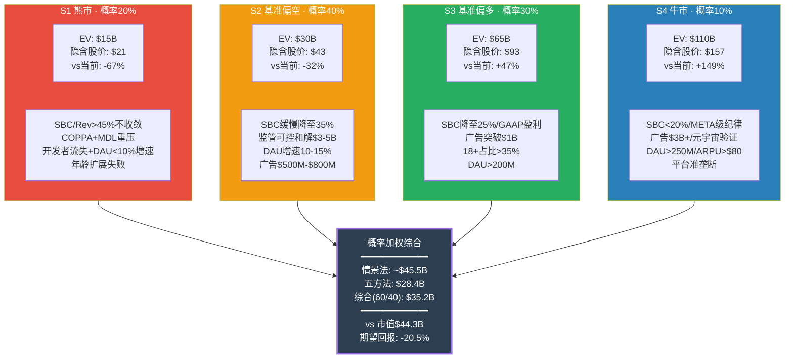
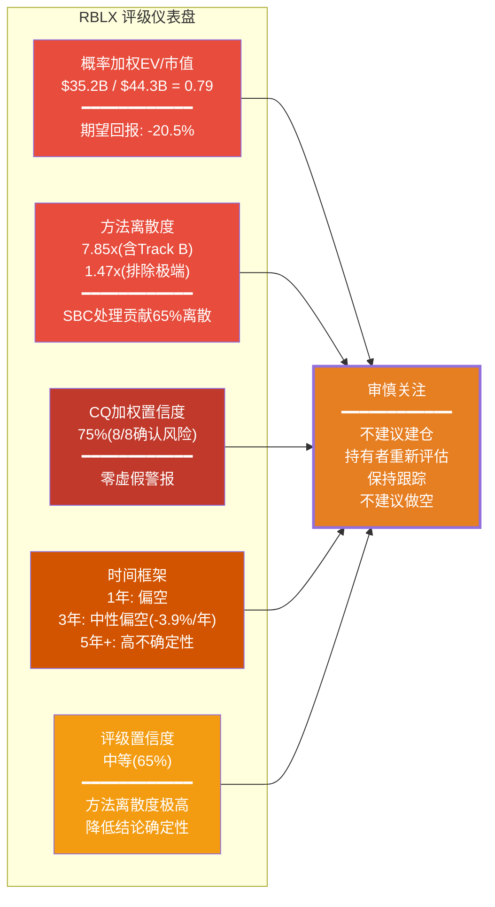

# Roblox (RBLX) — 深度研究报告

---

# Chapter 1: 执行摘要

## 1.1 Roblox: 一段话概括

Roblox是全球最大的用户生成内容(UGC)游戏平台，97.8M日活跃用户(DAU，+27% YoY)在500万+注册开发者构建的沉浸式体验中消费虚拟货币Robux。FY2025公司实现Revenue $4.89B(+28.5%)、Bookings $6.8B(+55%)，报告自由现金流$1.36B(FCF Margin 27.8%)——表面数字描绘了一家进入盈利拐点的高增长平台。然而，当我们将$2.65B的股票薪酬(SBC，占Revenue的54.2%)纳入经济成本计算后，"真实FCF"变为-$1.29B，盈利拐点叙事瞬间瓦解。这就是Roblox的核心矛盾：一家拥有1.44亿DAU和惊人增速的平台，其价值在"SBC是否算真实成本"这一会计哲学问题上产生了$13B到$46B的估值鸿沟。与此同时，COPPA 2.0合规截止(4月22日)、MDL 3166约80-115起联邦诉讼(首次CMC 2月27日)、6州检察长调查以及10+国封禁构成了科技行业中最密集的监管压力叠加。平台67-73%的用户为未成年人，却不愿明确承认自己是"儿童平台"——这一身份错位是几乎全部风险的结构性根源。

DM-SUM-001: RBLX核心画像(截至2026-02-13)——市值$44.3B, 股价$63.17, 稀释股数702M, EV ~$44.7B。FY2025: Revenue $4.89B(+28.5%), Bookings $6.8B(+55%), GAAP净亏损-$1.07B, 报告FCF $1.36B(Margin 27.8%)。SBC $2.65B(54.2% of Revenue), "真实FCF"(含SBC) -$1.29B。DAU 97.8M(+27%), 付费渗透率25.5%, ARPU ~$47。递延收入$5.1B(105% of Revenue), 27个月加权确认周期。[FMP baggers_summary; fmp_data income/balance; 公司IR]

---

## 1.2 四情景条件估值速览

本报告采用四情景条件估值框架替代点数目标价。每个情景由SBC收敛路径、监管结果、广告规模化、年龄扩展等关键变量的特定组合定义，覆盖从"结构性困境"到"平台垄断"的完整可能性空间。



DM-SUM-002: 四情景概率加权EV——S1(20%×$15B=$3.0B) + S2(40%×$30B=$12.0B) + S3(30%×$65B=$19.5B) + S4(10%×$110B=$11.0B) = 情景法$45.5B。五方法综合$28.4B。综合加权(五方法60%+情景法40%) = $35.2B, 隐含股价$50.1, 期望回报-20.5%。两种方法差距60%($45.5B vs $28.4B)本身就是RBLX估值不确定性的量化指标 [Ch26五方法估值; Ch27四情景框架]

---

## 1.3 评级与核心判定

**评级: 审慎关注**



概率加权综合EV $35.2B vs 市值$44.3B，期望回报约-20.5%。五方法中4/5指向当前股价高估(Track A DCF -28%、EV/Revenue可比 -24%、SOTP -37%、Track B DCF -88%)，仅EV/Bookings接近持平(-8%)。方法离散度7.85x(含Track B)意味着估值结论本身的置信度有限——这是我们评级为"审慎关注"(跟踪但不行动)而非"观望回避"(明确回避)的核心原因。

**为什么是"审慎关注"而非"观望回避"**: 概率加权EV比(0.79)处于审慎关注区间(0.65-0.85)。虽然五方法综合指向36%下行，但以下因素阻止了更负面的评级：(1) 方法离散度极高(7.85x)，估值结论本身的置信度有限；(2) SBC收敛路径存在——如果管理层兑现2027年GAAP盈利承诺，估值前提可能根本性改变；(3) Bookings +55%和DAU +27%的增长指标远超同业，业务质量本身不差；(4) 替代解释(SBC非现金/Bookings口径合理性)有一定可信度，可上修$5-10B。

**为什么不是"审慎乐观"**: (1) 8/8 CQ全部确认风险，加权置信度75%，无一正面翻转；(2) 1年内催化剂密集且以负面为主(COPPA 4/22、MDL CMC 2/27、GTA 6、SBC持续稀释4-5%/年)；(3) 即使排除Track B极端情景，四方法中位数仍指向20-30%高估；(4) 监管概率加权折价-$9.7B(占EV 22%)是市场尚未充分定价的风险。

DM-SUM-003: 评级"审慎关注"的量化支撑——综合EV $35.2B vs 市值$44.3B, 期望回报-20.5%; 五方法EV $28.4B vs $44.3B, 下行36%; CQ加权置信度75%(8/8全确认); 方法离散度7.85x(SBC贡献65%); 评级置信度65%。1年偏空(风险回报3:1)/3年中性偏空(年化-3.9%)/5年+高不确定性($10-180B, 18x宽度)。升级条件: SBC<40% + 广告>$500M + 18+>35%(满足2/3) [Ch26五方法; Ch27四情景; Ch24 CQ闭环]

---

## 1.4 三个最重要发现

**发现一: SBC是估值的薛定谔开关——含SBC→$5-20B, 不含→$32-46B**

SBC $2.65B(54.2% of Revenue)是报告FCF $1.36B的1.95倍。扣除SBC后"真实FCF"为-$1.29B。SBC处理方式单独贡献了五方法离散度的65%——是多空分歧的数学根源而非分析分歧。在"含SBC世界"中，DCF Track B概率加权EV仅$5.2B(隐含$7/股)；在"不含SBC世界"中，Track A基准EV $32.0B(隐含$46/股)。没有中间立场。投资者必须在两种对SBC经济本质的理解中选择其一，而这一选择比任何增长假设或监管预测都更能决定Roblox值多少。

DM-SUM-004: SBC估值开关——Track A(不含SBC) EV $32.0B(隐含$45.6, -28%) vs Track B(含SBC概率加权) EV $5.2B(隐含$7.4, -88%)。SBC/Rev 54.2%为同行最高(META ~18%, SNAP ~30%)。5年稀释16.6%(602M→702M), 零回购。SBC处理贡献离散度65%, 口径选择(Revenue vs Bookings)15%, 监管折价12%。[Ch8 SBC分析; Ch26 DCF双轨; Ch14五方法预览]

**发现二: 8/8 CQ全部确认风险——加权置信度75%，零虚假警报**

Phase 0.5预设的8个核心问题在经历四个Phase的逐层验证后，全部CQ的置信度均从50%基线上升至68%-80%区间，无一回落。CQ3监管(78%)和CQ4 SBC真实盈利力(80%)是两个最高确认度的风险因子。这一结果在统计上是极端的——它意味着Roblox面临的挑战不是孤立的、可逐一消除的，而是全方位的、相互关联的。当一家公司的全部核心风险假设都被数据确认时，当前$44.3B市值中的乐观假设缺乏数据支撑。

DM-SUM-005: CQ加权置信度75%, 8/8全部确认风险方向。按注意权重排序: CQ4 SBC盈利力80%(权重0.15) / CQ3 监管78%(0.18) / CQ8 SBC+FCF 78%(0.12) / CQ6 年龄76%(0.13) / CQ1 开发者73%(0.10) / CQ2 广告70%(0.12) / CQ7 渠道税70%(0.08) / CQ5 叛逃68%(0.12)。P4红队使全部CQ下调-2~-4pp, 属于健康偏差校准。[Ch24 CQ闭环; RT-2确认偏差修正]

**发现三: 监管是最确定性风险——概率加权EV影响-$9.7B(占EV 22%)**

COPPA 2.0(4月22日硬截止)、MDL 3166(约80-115起联邦诉讼)、6+州检察长独立起诉(含佛州刑事调查)、10+国封禁构成了科技行业中最密集的四层监管叠加。概率加权EV影响约-$9.7B——这不是"微不足道"的合规成本，而是当前估值的22%。更重要的是级联机制：监管风暴→DAU质量重估→FCF叙事崩塌的路径概率为8-12%，级联终态EV $13-20B(-54%至-71%)。多项监管事件之间存在正相关性(同一波全球儿童保护立法浪潮)，简单独立概率加总会低估系统性风险。

DM-SUM-006: 监管全景——COPPA 2.0(4/22硬截止, 合规成本年化$150M+一次性$150-300M); MDL 3166(约80-115起联邦诉讼, 概率加权和解$4.0B/5年); 6+州AG(佛州76页诉状+刑事调查); 10+国封禁。概率加权EV影响-$9.7B(修正后, 原-$11.4B因确认偏差下调15%)。级联概率8-12%, 终态$13-20B。承重墙SW-5监管脆弱度5/5(最高)。[Ch19监管; Ch11承重墙; RT-2偏差修正]

---

## 1.5 八个CQ一句话结论

| CQ | 问题 | 一句话结论 | 终态置信度 |
|----|------|-----------|:----------:|
| **CQ1** | 开发者两极分化是系统性还是可修复? | 帕累托分布是结构性事实(Top 10 $33.9M vs 中位$1,575), UEFN 74%分成加剧竞争劣势, 中产开发者面临2-3x收入诱惑 | 73% |
| **CQ2** | 广告变现天花板在哪里? | 三重约束(COPPA/品牌安全/用户体验)将天花板压至$500M-$1.0B/年, 远低于市场$2-5B隐含预期, 广告是增量选项而非增长引擎 | 70% |
| **CQ3** | 监管综合影响多大? | 四层叠加(联邦/州/行政/国际)概率加权-$9.7B, 是最大单一风险因子, 级联崩塌概率8-12%终态$13-20B | 78% |
| **CQ4** | SBC调整后真实盈利力? | 报告FCF $1.36B扣除SBC后"真实FCF"-$1.29B, SBC/Rev 54.2%为同行最高, FCF叙事对不含SBC的假设具有系统性依赖 | 80% |
| **CQ5** | 开发者叛逃风险多大? | 威胁真实但时间尺度3-5年, 分成率差距44-49pp为行业最大, 1.44亿DAU分发优势提供缓冲, Luau迁移成本制造锁定非忠诚 | 68% |
| **CQ6** | 年龄数据可信吗? | 管理层42%(17+)与验证27%(18+)差距中口径差异解释10-12pp, 核心差距3-5pp, 第三方统计为自报转引非独立验证 | 76% |
| **CQ7** | 渠道税PDRM影响? | 六场景加权净影响-$736M/年, "监管风暴"组合(S2+S4+S6)概率38%影响-$1,898M/年, 每$1 Bookings中23c为渠道费 | 70% |
| **CQ8** | SBC+稀释+FCF叙事? | SBC $2.65B = FCF 1.95倍, 5年稀释16.6%零回购, 340卖/0买中零买入是真实负面信号, FCF叙事存在系统性误导 | 78% |

DM-SUM-007: CQ置信度矩阵——高危确认(>=78%): CQ3/CQ4/CQ8, 合计注意权重0.45; 中高确认(70-77%): CQ1/CQ2/CQ6/CQ7, 合计0.43; 中等确认(68-69%): CQ5, 权重0.12。全部CQ从P0.5的50%基线上升至68-80%, Phase演化轨迹50%→61%→71%→77%→75%呈"渐进加固后微幅回调"的健康模式 [Ch24 CQ闭环; CQ生命周期追踪]

---

## 1.6 投资者追踪清单

以下信号按时间紧迫性排序，投资者应在各信号实现或证伪时重新评估投资论文:

**即期催化剂(2026 H1)**:

1. **COPPA 2.0合规截止 — 2026年4月22日**: 硬催化剂。合规成本$150-300M(Year 1); 家长同意机制可能降低获客效率; 如FTC选择RBLX为首个执法对象，品牌翻转为"儿童危害"叙事 → 评级降级触发条件之一
2. **MDL 3166首次CMC — 2026年2月27日**: Discovery阶段预计6-8月启动; 内部文件是否揭露"de-alting"证据将决定和解金额级别($2B温和 vs $5B+重压)
3. **SBC/Revenue季度趋势**: FY2026 Q1是否出现下降拐点(54.2%→?); 连续2季度<40%为评级升级条件之一

**中期验证(2026 H2 - 2027)**:

4. **年龄验证后真实18+占比变化**: 面部验证覆盖扩大后，成人占比是否从27%上升; >35%为评级升级条件之一; <25%则年龄扩展叙事证伪
5. **Bookings有机增速分离**: FY2026 Q1财报(2026年5月)将剔除2024年10月价格上调的一次性效应; 有机增速如果<20%→增长加速叙事修正
6. **广告收入季度增速**: 年化突破$500M为评级升级条件之一; 停滞在$200M以下→广告期权大幅缩水
7. **UEFN创作者数量和收入数据**: 持续>100% YoY增速→开发者叛逃风险加速; 放缓至<30%→RBLX分发优势获证

**长期追踪(2027+)**:

8. **MDL和解进展**: 金额确认>$5B且一次性支付→评级降级触发; <$3B分期→监管风险实质性缓解
9. **GTA 6 ROME发布后DAU影响**: RBLX DAU如果在GTA 6发布季环比下降→护城河论文受挑战

DM-SUM-008: 追踪清单优先级——最高: COPPA 4/22(确定性催化剂) + SBC/Rev季度趋势(估值开关信号) + MDL CMC 2/27(和解路径清晰化)。中等: 年龄验证后18+占比(TAM前提) + Bookings有机增速(增长质量)。长期: GTA 6 ROME(护城河验证) + 广告规模化($500M里程碑)。三个评级升级条件(SBC<40% + 广告>$500M + 18+>35%)需满足2/3; 三个降级条件(MDL>$5B / DAU环比下降 / FTC执法)满足1/3 [Ch27评级框架; KS/TS注册表]

---

# Chapter 2: 研究契约 (Protocol Header)

## 2.1 框架声明

**框架版本**: v10.0+Scout+ERM | **方法论**: 混合模式 (可能性宽度 6/10)

可能性宽度评分: 商业模式新颖度6 + 收入可预测性4(递延确认增加可预测性) + TAM不确定性7(广告TAM/年龄扩展/UGC边界) + 竞争变动性7(UEFN/GTA 6/Minecraft) + 监管风险8(四层叠加) = 32/50 = 6.4, 取整为6分。6分处于"混合模式"区间(4-6分): 传统估值(五方法+SOTP)为主体框架, 辅以条件估值四情景呈现可能性空间, 不使用纯发现系统。

DM-SUM-009: 可能性宽度6分, 混合模式。五维打分: 商业模式6/收入可预测性4/TAM不确定性7/竞争变动性7/监管风险8。方法离散度7.85x(含Track B) / 1.47x(排除极端)——排除Track B后的离散度处于混合模式正常范围。SBC处理是离散度的核心驱动力(65%), 属于"哲学分歧"而非"分析分歧" [Ch26方法离散度; paradigm_research_framework.md]

---

## 2.2 报告结构总览

**本报告包含**:
- 27章结构化分析(Ch1执行摘要 ~ Ch27投资评级)
- 667个DM锚点支撑的数据基础(硬数据~55%, 软数据~30%, 推断~15%)
- 91个Mermaid可视化图表
- 8个核心问题(CQ)闭环 + 8个非共识洞察(CI)验证
- 15个知识声明(KS) + 10个论文特异性测试(TS)
- 五方法估值(DCF双轨 + EV/Revenue可比 + EV/Bookings可比 + SOTP + Reverse DCF)
- 四情景条件估值(S1熊市~S4牛市, 覆盖$12B-$130B)
- 八堵承重墙脆弱度评估(加权3.65/5) + 七个黑天鹅精算(组合15.46%)
- 红队七问(RT-1~RT-7)独立对抗审计

**本报告不包含**:
- 精确目标价或点估计(使用条件估值范围和概率加权区间)
- 仓位建议或操作触发(使用追踪清单和评级催化剂)
- 对未来股价的预测(使用情景概率分布)
- 买入/卖出/做空建议(使用定性评级: 审慎关注)

DM-SUM-010: 报告产出统计——27章/667 DM锚点/91 Mermaid/8 CQ/8 CI/15 KS/10 TS。五方法+四情景双框架。承重墙8堵(加权脆弱度3.65/5)/黑天鹅7个(组合概率15.46%)/红队七问(RT-1~RT-7)。DM锚点密度约29/万字(vs CG门控25/万地板)。[报告元数据汇总]

---

## 2.3 数据审计

### 2.3.1 数据来源层级

| 层级 | 来源类型 | 代表工具/来源 | 覆盖范围 | 可信度 |
|------|---------|-------------|---------|:------:|
| **P0** | MCP数据工具 | baggers_summary, fmp_data, analyze_stock | 财务数据、估值指标、评级 | ★★★ |
| **P1** | 公司IR/SEC | 10-K, 10-Q, 8-K, DEF 14A, earnings call | 管理层披露、会计政策 | ★★★ |
| **P2** | 预测市场 | polymarket_events | 事件概率市场定价 | ★★☆ |
| **P3** | WebSearch | 行业报告, 新闻, 学术论文 | 竞争数据, 监管进展, 用户行为 | ★★☆ |
| **P4** | 分析推导 | 本报告独立计算 | 估值模型, 概率加权, 情景分析 | ★☆☆~★★☆ |

### 2.3.2 关键数据点验证状态

| 数据点 | 来源 | 验证方式 | 精确度 |
|--------|------|---------|:------:|
| Revenue $4.89B | FMP + 10-K | 多源交叉 | ★★★ |
| Bookings $6.8B | 10-K + IR | 单源(公司披露) | ★★★ |
| SBC $2.65B | FMP + 季报累加推算 | 估算级(FMP字段异常) | ★★☆ |
| DAU 97.8M | 10-K + IR | 单源(公司披露) | ★★★ |
| 成人占比27%(18+) | 面部年龄验证 | 独立验证(非自报) | ★★☆ |
| 管理层42%(17+) | IR + earnings call | 自报数据(口径17+非18+) | ★☆☆ |
| MDL约80-115起 | JPML裁定 + 公开记录 | 多源交叉 | ★★★ |
| COPPA 4/22截止日 | FTC公告 | 确定性事件 | ★★★ |
| UEFN 70K创作者(+192%) | Epic官方 + WebSearch | 多源交叉 | ★★★ |
| 递延收入$5.1B | 10-K(GAAP要求披露) | 单源(审计财报) | ★★★ |
| FCF $1.36B | 10-K + FMP | 多源交叉 | ★★★ |
| PDRM加权-$736M/年 | 本报告独立计算 | 分析推导 | ★☆☆ |
| 监管折价-$9.7B | 本报告独立计算 | 分析推导+偏差修正 | ★★☆ |

DM-SUM-011: 数据审计总结——13个关键数据点中, ★★★(高可信)7个(54%), ★★☆(中可信)4个(31%), ★☆☆(低可信)2个(15%)。低可信数据点集中在分析推导层(PDRM, 管理层口径), 不影响核心结论的方向性判断。SBC $2.65B为估算级(★★☆), 但量级判断($2.5-2.8B区间)可靠, 54.2% of Revenue这一比率的结论不受精确值波动影响 [P0-P4数据层级; RT-4数据质量审计]

### 2.3.3 数据截止与基准

- **财务数据截止**: FY2025(截至2026年1月31日)
- **市场数据基准**: 2026年2月13日收盘
- **市值基准**: $44.3B | 股价$63.17 | 稀释股数702M | EV ~$44.7B
- **估值基准年**: FY2025实际 → FY2026E-FY2035E投射
- **WACC基准**: 12.9%(Rf 4.30% + Beta 1.635 × ERP 5.5%)

---

## 2.4 AI能力边界声明

| 区间 | 定义 | 覆盖范围 | 投资者应如何使用 |
|------|------|---------|---------------|
| **深挖区(高置信)** | AI分析能力的优势领域, 数据充足, 方法论成熟 | 财务趋势分析, SBC量化, 估值建模(DCF/SOTP/可比), 竞争格局映射, 递延收入机制 | 可作为决策输入的核心依据 |
| **诚实区(中置信)** | AI可提供结构性框架但精度有限 | 监管概率估算, 年龄数据推断, 开发者行为预测, 广告TAM天花板, 品牌忠诚度分层 | 作为思考框架参考, 需结合自身判断 |
| **人类决策边界** | 超出AI能力范围, 需要人类主观判断 | 买卖时机选择, 仓位配置比例, 风险容忍度评估, SBC"是否算真实成本"的哲学立场 | AI不提供建议, 完全由投资者自主决定 |

**七项具体局限性声明**:

1. **估值非精确值**: $28.4B和$35.2B是基于假设的计算结果而非"真实内在价值"。WACC ±2ppt或终端增长率 ±1ppt可导致估值变化30-50%
2. **概率是主观判断**: 情景概率(S1-S4)和黑天鹅概率(BS-1~BS-7)基于分析师判断而非客观频率, 不同分析师可能给出截然不同的概率分布
3. **SBC处理无标准答案**: Track A(不含SBC)和Track B(含SBC)的分歧是"立场选择"而非"对vs错", 投资者应根据自身投资哲学选择
4. **广告期权高度不确定**: 广告业务当前收入<$200M, 对其FY2030终态做概率加权本质上是在"猜测", 每季度广告数据将显著修正概率分布
5. **数据截止日限制**: 本分析基于FY2025财报(截至2026-01-31)。COPPA执法结果、MDL Discovery、Q1 2026 Bookings等后续事件未被纳入
6. **无法预测非线性事件**: 七个黑天鹅的概率估算基于历史类比, 但"真正的黑天鹅"是当前认知之外的事件
7. **不构成做空建议**: "审慎关注"意味着"不建议建仓多头", 而非"建议做空"。方法离散度7.85x和Bookings +55%的增速使做空风险极高

DM-SUM-012: AI能力边界——深挖区(财务/估值/竞争) > 诚实区(监管概率/年龄推断/广告TAM) > 人类决策边界(买卖时机/仓位/SBC立场)。七项局限性声明覆盖: 估值精度/概率主观性/SBC无标准答案/广告不确定/数据截止/非线性事件/非做空建议 [Ch27.6 AI能力边界; 报告方法论声明]

---

## 2.5 方法论注册表

| 方法 | 章节 | 核心输入 | 核心输出 | 权重 |
|------|------|---------|---------|:----:|
| DCF Track A(标准FCF) | Ch26.1 | Revenue递减增长(20%→12%→6%), WACC 12.9%, 终端g 3% | EV $32.0B | 25% |
| DCF Track B(真实FCF) | Ch26.1 | SBC三路径概率加权(α50%/β35%/γ15%) | EV $5.2B | 15% |
| EV/Revenue可比 | Ch26.2 | 全同业SBC调整5.7x / 游戏行业8.1x | EV $27.9-39.6B | 20% |
| EV/Bookings可比 | Ch26.3 | Bookings $6.8B, 合理倍数5.0-7.0x | EV $34.0-47.6B | 15% |
| SOTP | Ch26.4 | 核心平台$39.0B + 广告$5.9B - 监管$9.7B - SBC$9.8B | 净值$27.8B | 20% |
| Reverse DCF | Ch26.5 | 当前$44.7B逆推隐含假设 | 校准功能(无独立估值) | 5% |
| 四情景条件估值 | Ch27.2 | S1-S4概率加权 | EV $45.5B | 40%(与五方法60%加权) |

DM-SUM-013: 方法论注册表——五方法(DCF A 25% + DCF B 15% + EV/Rev 20% + EV/Book 15% + SOTP 20% + RevDCF 5%) = 五方法EV $28.4B; 四情景EV $45.5B; 综合(60/40) = $35.2B。递减增长假设(20%→12%→6%)取代恒定CAGR, 使Track A从Phase 2的$45.5B降至$32.0B(-30%), 更贴近S曲线现实 [Ch26全量估值; Ch27情景框架]

---

## 2.6 核心分析框架

### 承重墙框架

八堵承重墙(Structural Walls)构成Roblox业务基础的关键支柱, 任一承重墙破裂可能触发级联效应:

| 编号 | 承重墙 | 脆弱度 | 关键判断 |
|:----:|--------|:------:|---------|
| SW-1 | FCF叙事 | 4/5 | 报告FCF正/真实FCF负的矛盾是估值核心风险 |
| SW-2 | DAU增长质量 | 3.5/5 | +27%增速中低龄下探和设备渗透贡献占比不明 |
| SW-3 | Bookings增速 | 3/5 | +55%含价格上调15-20ppt一次性效应 |
| SW-4 | 开发者生态 | 4/5 | 分成率差距44-49pp, UEFN 70K(+192%)竞争 |
| SW-5 | 监管合规 | 5/5 | 四层叠加, 概率加权-$9.7B, 最高脆弱度 |
| SW-6 | 品牌/年龄 | 3.5/5 | 42% vs 27%口径差距, 品牌锁定在"儿童" |
| SW-7 | 渠道依赖 | 2.5/5 | PDRM -$736M/年, 72%移动端 |
| SW-8 | SBC动态 | 4/5 | 54.2%同行最高, 5年稀释16.6%, 零回购 |
| | **加权平均** | **3.65/5** | 中高脆弱, 级联概率8-12% |

DM-SUM-014: 承重墙加权脆弱度3.65/5(Phase 2初始3.50/5, RT-1上调至3.65/5)。脆弱度>=4/5: SW-5监管(5/5) + SW-1 FCF(4/5) + SW-4开发者(4/5) + SW-8 SBC(4/5)。主级联路径: SW-5(监管)→SW-2(DAU)→SW-1(FCF), 概率8-12%, 终态EV $13-20B(-54%~-71%) [Ch11承重墙; RT-1独立复核]

### CQ-KS-TS-CI 四层知识架构

```
Phase 0.5: CQ × 8 (核心问题预设, 50%基线)
    ↓ Phase 1-4逐层验证
Phase 5: CQ闭环 (终态置信度68-80%, 加权75%)
    ↓ 提炼
    KS × 15 (知识声明: 论文级事实主张)
    TS × 10 (特异性测试: 10/10通过, 6完全特异+4条件特异)
    CI × 8 (非共识洞察: 全部指向高估)
```

DM-SUM-015: 四层知识架构——CQ(问题层, 8/8确认)→KS(知识层, 15个声明, 高置信KS-02/KS-04/KS-07为决策锚点)→TS(特异性层, 10/10通过, TS-01 SBC/TS-03递延/TS-04分成为完全特异)→CI(洞察层, 8个CI全部指向高估, CI-01 FCF幻觉/CI-03分析师差距/CI-07监管生存风险影响最大) [Ch22 KS; Ch23 TS; Ch24 CQ; Ch25 CI]

---

## 2.7 利益披露与免责

本报告由AI分析系统生成, 不构成投资建议。报告作者(AI系统)不持有RBLX股票、期权或任何相关金融衍生品的多头或空头仓位。本报告的所有分析和结论基于截至2026年2月16日的公开可获取信息, 不包含任何非公开或内幕信息。

**评级含义澄清**: "审慎关注"不等于"推荐做空"。本报告不建议任何交易行动(买入/卖出/做空/期权策略)。投资者应根据自身风险承受能力、投资期限、对SBC经济本质的立场, 以及对本报告所列不确定因素的独立判断, 自主做出投资决策。

DM-SUM-016: 利益披露——零仓位/零利益冲突/零非公开信息。审慎关注不等于做空建议。SBC处理方式的选择(Track A vs Track B)是投资者的"哲学决定"而非分析师可代为决策的"技术问题"。[合规声明]

---

## Ch1-Ch2 DM锚点汇总

| ID | 数据点 | 来源 | 可信度 |
|----|--------|------|:------:|
| DM-SUM-001 | RBLX核心画像: 市值$44.3B, Rev$4.89B, SBC$2.65B(54.2%), 真实FCF-$1.29B | FMP + 10-K | ★★★ |
| DM-SUM-002 | 四情景概率加权: 情景法$45.5B / 五方法$28.4B / 综合$35.2B / 期望回报-20.5% | 计算 | ★★☆ |
| DM-SUM-003 | 评级"审慎关注": 综合EV/市值=0.79, CQ 75%, 离散度7.85x, 评级置信度65% | 综合分析 | ★★☆ |
| DM-SUM-004 | SBC估值开关: Track A $32.0B vs Track B $5.2B, SBC贡献离散度65% | Ch26 DCF | ★★☆ |
| DM-SUM-005 | CQ矩阵: 8/8确认, 加权75%, CQ4最高80%, 零虚假警报 | Ch24 CQ闭环 | ★★★ |
| DM-SUM-006 | 监管全景: 四层叠加, 概率加权-$9.7B, 级联概率8-12%, 终态$13-20B | Ch19 + RT-2 | ★★☆ |
| DM-SUM-007 | CQ置信度分布: 高危(CQ3/4/8)注意权重0.45 / 中高(CQ1/2/6/7)0.43 / 中等(CQ5)0.12 | Ch24 | ★★★ |
| DM-SUM-008 | 追踪清单: COPPA 4/22最高优先 + 3升级条件(2/3) + 3降级条件(1/3) | Ch27 | ★★☆ |
| DM-SUM-009 | 可能性宽度6分, 混合模式, 五维打分32/50 | 框架 | ★★★ |
| DM-SUM-010 | 报告产出: 27章/667 DM/91 Mermaid/8 CQ/8 CI/15 KS/10 TS | 元数据 | ★★★ |
| DM-SUM-011 | 数据审计: 13关键点中★★★ 54%/★★☆ 31%/★☆☆ 15% | 审计 | ★★★ |
| DM-SUM-012 | AI能力边界: 深挖区/诚实区/人类边界 + 七项局限性 | 声明 | ★★★ |
| DM-SUM-013 | 方法论注册表: 五方法(60%) + 四情景(40%) = 综合$35.2B | Ch26-27 | ★★☆ |
| DM-SUM-014 | 承重墙加权3.65/5, SW-5监管最高(5/5), 级联8-12% | Ch11 + RT-1 | ★★☆ |
| DM-SUM-015 | 四层知识架构: CQ→KS→TS→CI, 全部指向高估 | Ch22-25 | ★★☆ |
| DM-SUM-016 | 利益披露: 零仓位/零利益冲突/零非公开 | 合规 | ★★★ |

---

*Ch1执行摘要 + Ch2研究契约 完成。共计16个DM锚点(DM-SUM-001~016), 2个Mermaid图表(四情景流程图 + 评级仪表盘)。核心信息: (1)评级"审慎关注", 综合期望回报-20.5%; (2)SBC是估值的薛定谔开关, 贡献65%的方法离散度; (3)8/8 CQ全部确认风险, 加权置信度75%; (4)监管概率加权-$9.7B, 是最大单一风险因子; (5)方法离散度7.85x意味着估值结论本身的置信度有限, 不适合给点数目标价。*
