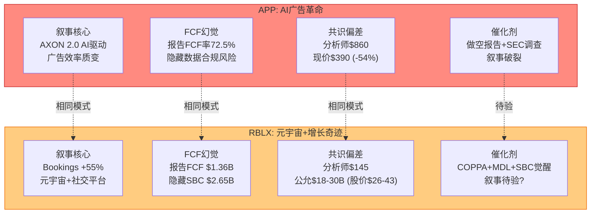
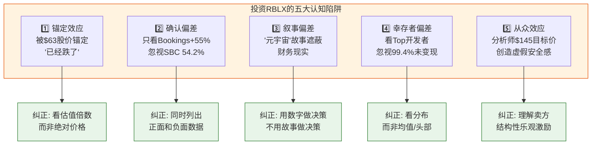

# Chapter 28: 投资者备忘 — 经验、偏差与决策框架

> **市值基准**: $44.3B | 股价$63.17 | EV ~$44.7B | 2026-02-13
> **DM锚点范围**: DM-MEM-001 ~ DM-MEM-015
> **本章性质**: 面向终端投资者的实用决策指南，不是学术分析

---

这是本报告的最后一章。前面二十七章用了数十万字拆解Roblox的商业模式、财务数据、估值方法和风险图谱。这一章，我想用一个投资者真正需要的方式收尾——不是再多一套模型，而是告诉你：在做投资决策之前，你需要知道哪些事情，避免哪些陷阱，以及在什么条件下应该改变自己的看法。

---

## 28.1 案例教训: AppLovin的S&P 500陷阱

在分析Roblox之前，有必要先回顾一个刚刚发生的教训。AppLovin (APP) 在过去两年经历了教科书式的"叙事膨胀→现实检验"循环，它与Roblox的处境有惊人的结构性相似。

### 28.1.1 AppLovin时间线: 从$8到$746再到$390

[DM-MEM-001] AppLovin的两年股价轨迹:

- **2023年**: AXON 2.0 AI引擎发布，广告效率飞跃式提升，股价从约$8起步攀升至$120——市场开始讲"AI利润率革命"的故事
- **2024年**: AI叙事加速升温，$120→$420，一年内涨幅超过3倍。华尔街分析师竞相上调目标价
- **2025年9月22日**: 纳入S&P 500指数，当日上涨+11.6%。纳入后三个月下跌-28.7%
- **2025年12月**: 达到$746历史高点。美银给出$860目标价。此时市值约$228B
- **2025年2月-2026年1月**: 四份做空报告接踵而至(Muddy Waters, Fuzzy Panda等)，指控广告数据合规存在系统性问题；SEC启动调查
- **2026年初**: 股价从$746跌至$390，市值缩水至约$132B，YTD下跌-45.6%

一年前还在谈论"千亿美金俱乐部"的同一批分析师，现在在重新审视他们的模型。

### 28.1.2 三个关键教训

**教训一: 指数纳入不等于基本面认证。** S&P 500纳入意味着被动指数基金（如SPY、VOO）必须按比例买入该股票。这创造了短期的、与基本面无关的买入压力。AppLovin纳入当日+11.6%、此后三个月-28.7%的轨迹说明了什么？被动资金会在纳入时"机械买入"，但当叙事破裂时，被动资金不会主动卖出——然而也不会主动买入。主动基金的抛售找不到对手盘，价格修正比没有被动资金时更加剧烈。如果你听到"XX股票即将纳入指数"的消息就买入，你可能正在为被动资金的机械操作充当对手盘。[DM-MEM-002]

**教训二: 分析师共识可以系统性偏离现实。** 美银$860的目标价，在APP跌到$390之后看起来荒谬。但在$746的时候，它看起来只是"保守的+15%"。华尔街卖方分析师有结构性的乐观偏差——承销关系、交易佣金、资管业务带来的利益冲突使得"卖出"评级在整个华尔街占比不到5%。这不是个别分析师的能力问题，而是一个系统性激励结构的产物。当你看到"分析师共识目标价"时，你看到的不是一个客观的估值锚点，而是一个被利益结构扭曲的信号。[DM-MEM-003]

**教训三: "高FCF率"可以是一个包装精美的幻觉。** AppLovin报告FCF率高达72.5%，看上去是科技行业的印钞机。但做空报告揭示的数据合规风险让市场重新审视这个数字的"含金量"。FCF是一个GAAP定义的指标，它可以在完全合规的情况下与股东实际获得的价值大相径庭。Roblox同样如此: 报告FCF $1.36B(FCF率27.8%)看起来正面，但加入SBC $2.65B之后，真实现金流为-$1.29B。两家公司用了不同的方式让FCF看起来比实际更好——APP隐藏了数据合规风险，RBLX隐藏了SBC稀释成本。[DM-MEM-004]

---

## 28.2 RBLX与APP的镜像对比

AppLovin和Roblox处于完全不同的行业——一个是移动广告变现，一个是UGC游戏平台。但它们的投资叙事结构却有令人不安的相似性。

[DM-MEM-005] APP与RBLX镜像对比的具体维度:

| 维度 | APP的教训 | RBLX的类比 | 相似度 |
|------|----------|-----------|:------:|
| **核心叙事** | "AI广告革命"——AXON 2.0改变行业效率 | "元宇宙+Bookings增长"——DAU+69%/Bookings+55% | 高 |
| **FCF幻觉** | FCF率72.5%看似完美，但数据合规风险被掩盖 | FCF $1.36B看似正现金流，但含SBC后为-$1.29B | 高 |
| **共识偏差** | 分析师共识$860 vs 现价$390(-54%) | 分析师共识$145(+130%) vs 本报告公允$18-30B | 高 |
| **触发催化** | 4份做空报告+SEC调查→叙事碎裂 | COPPA 4/22截止+MDL 1000+诉讼+SBC觉醒→? | 中 |
| **底层逻辑** | 叙事溢价远超基本面→均值回归已发生 | 叙事溢价远超基本面→均值回归尚未发生 | — |

两者最大的区别在于: APP的故事已经翻篇了——$746到$390的-47%修正已经发生。而RBLX的故事还在进行中。分析师共识$145仍然比现价高130%，市场仍然在为"SBC不算真实成本"的假设买单。

这并不意味着RBLX一定会重演APP的轨迹。但它意味着: **当你看到一家公司被分析师共识赋予巨大上行空间，而这个上行空间建立在可争议的会计口径之上时，你至少应该停下来问一个问题——如果这个口径被重新审视，估值会怎样？**

---

## 28.3 SBC会计素养: 投资者必知

这一节面向的不是会计师或分析师，而是每一位考虑投资Roblox的普通投资者。SBC（Stock-Based Compensation，股票薪酬）是理解Roblox估值的"分水岭"——你对SBC的看法，直接决定了你看到的是一家$32-46B的公司还是一家$13-20B的公司。

### 28.3.1 什么是SBC？一句话解释

公司付给员工的报酬有两种形式: 现金工资和股票。SBC就是后者——公司向员工发行新股票（或限制性股票单元RSU）作为薪酬的一部分。

关键在于: 这些新发行的股票不是凭空产生的。每一股新发行的员工股票，都在稀释现有股东的持股比例。如果你持有一家公司1%的股份，而公司今年向员工发行了4%的新股，你的持股比例就从1%变成了约0.96%。你的"蛋糕"没变小，但蛋糕被切成了更多份。

### 28.3.2 为什么FCF不扣SBC？

美国会计准则(GAAP)规定SBC是"非现金费用"——因为公司支付员工的不是现金，而是股票。因此在计算经营现金流和自由现金流(FCF)时，SBC作为非现金项被加回。

这在会计逻辑上完全合规。但在经济逻辑上存在一个根本问题: **公司确实在向员工支付报酬，只不过支付的媒介是股票而非现金。对股东而言，稀释的经济效果与现金支出无异——你拥有的公司比例在减少。**

打一个比方: 假设你和朋友合开了一家面包店，各持50%。面包店每年利润100万。如果你们雇了一个新面包师，给他20%的股份作为工资。现在你的50%变成了40%，利润分配从50万变成40万。你会说"这不是真正的成本，因为没有花现金"吗？

[DM-MEM-006] 这正是Roblox正在发生的事情——只不过规模更大、更系统性。

### 28.3.3 RBLX的具体数字

以下是Roblox的SBC现实:

- **SBC绝对值**: FY2025年$2.65B
- **SBC占收入比**: $2.65B / $4.89B = **54.2%**。意味着每赚1美元收入，就有0.54美元以股票形式分配给了员工
- **人均SBC**: 约$864K/人（基于约3,070名员工）。作为对比，Meta的人均SBC约$345K——Roblox是Meta的**2.5倍**
- **5年累计稀释**: FY2020 602M股 → FY2025 702M股，增加了100M股（+16.6%），年化稀释率约3.1%
- **回购对冲**: **零回购**。Meta每年花数百亿美元回购股票来对冲SBC稀释，Roblox一分钱都没有
- **内部人交易**: 过去12个月，内部人（高管+董事）卖出**340次**，买入**0次**。内部人在用SBC获得的股票持续变现，但没有人用自己的现金买入

### 28.3.4 两个视角，两个世界

[DM-MEM-007] SBC的处理方式创造了Roblox估值的"平行宇宙":

| 维度 | 视角A: FCF不扣SBC | 视角B: FCF扣除SBC |
|------|:----------------:|:----------------:|
| FCF | $1.36B (正) | -$1.29B (负) |
| FCF Margin | 27.8% | -26.4% |
| 盈利状态 | "接近盈利拐点" | "结构性亏损" |
| DCF估值 | $32.0B | $5.2B |
| EV/FCF倍数 | 32.9x (贵但可讨论) | 负值 (不适用) |
| 市场叙事 | "高增长现金流公司" | "用股东稀释补贴员工薪资" |
| 差异倍数 | — | **3-4倍** |

同一家公司，同一组财务数据——仅仅因为SBC的处理方式不同，估值相差3-4倍。这不是"谁对谁错"的问题（合理的人可以有不同立场），而是一个**你必须知道自己站在哪一侧**的问题。

### 28.3.5 一个简单测试

[DM-MEM-008] 对于非专业投资者，这里提供一个简单的SBC"红旗测试":

**如果一家公司的SBC大于其净利润，那么股东创造的价值正在被员工薪酬消耗。**

Roblox的情况: SBC $2.65B vs GAAP净亏损-$1.07B。不仅SBC超过净利润——公司根本就没有净利润。SBC超过了收入的一半。这不是一个需要复杂分析才能发现的问题。

---

## 28.4 行为偏差警示清单

投资决策中最危险的敌人不是市场波动，而是你自己的认知偏差。以下是投资Roblox时最容易犯的五个错误，以及对应的纠正方法。

[DM-MEM-009] 五个偏差的详细解析:

### 偏差一: 锚定效应

**表现**: "RBLX从$80跌到$63了，已经跌了不少了，应该是个好买点。"

**为什么是陷阱**: 股价的历史高低与公司的内在价值无关。一家$100的股票如果只值$30，那么即使它从$100跌到$63，它仍然被高估。价格不是价值。Roblox的历史高点是2021年11月的约$134——相比那个价格，$63确实跌了53%。但相比本报告的概率加权估值$28.4B（隐含股价$40.5），它仍然高估了56%。

**正确做法**: 永远用估值倍数（EV/Revenue、EV/FCF、DCF）而非股票价格来评估"贵不贵"。问自己: "以当前价格买入，我的期望年化回报率是多少？" 而不是 "比高点跌了多少？"

### 偏差二: 确认偏差

**表现**: "Bookings增长+55%！DAU增长+69%！这是增长最快的游戏平台！"

**为什么是陷阱**: 这些数字都是真的。但它们只是故事的一半。如果你只关注增长指标，你会忽视SBC占收入的54.2%、5年累计稀释16.6%、内部人340卖/0买、GAAP净亏损-$1.07B、COPPA和MDL的监管风险。一个只看了增长数据的投资者和一个同时看了增长与成本的投资者，会得出完全不同的结论——但前者会觉得自己的结论是"有数据支撑的"。

**正确做法**: 在做任何投资决定前，强迫自己列出至少三个支持买入和三个反对买入的理由。如果你发现自己无法列出反面理由，那不是因为没有——而是因为你没去找。

### 偏差三: 叙事偏差

**表现**: "Roblox是元宇宙入口/下一代社交平台/虚拟世界的未来。"

**为什么是陷阱**: 宏大叙事的力量在于它们让你用"未来的可能性"来为"今天的价格"买单。"元宇宙"作为一个概念可能是真实的趋势——但从概念到利润之间有巨大的距离。Meta每年在Reality Labs上亏损$15B+追求元宇宙；Roblox的"元宇宙"版本是一个以儿童为主的游戏平台，年龄验证后仅确认27%用户为18+。

**正确做法**: 每当你被一个叙事吸引时，把它翻译成数字。"元宇宙入口"翻译成数字是什么？是DAU从1.44亿增长到多少？ARPU从$47增长到多少？需要多少年？到那时SBC稀释了多少？用数字验证过的叙事才值得为之付费。

### 偏差四: 幸存者偏差

**表现**: "Roblox Top开发者平均年赚$3,390万！这个平台的创造者经济太强了。"

**为什么是陷阱**: Top 10开发者的$3,390万平均收入是真实的。但500万注册开发者中仅29K（0.58%）通过DevEx变现。变现开发者的中位收入仅$1,575/年。这意味着99.4%的开发者从未获得过任何收入。你看到的"创造者经济"故事，实际上是由0.02%的极端头部支撑的。就像你不会因为一个彩票中奖者而去买彩票一样，你也不应该因为Top开发者的收入而高估平台的创造者经济健康度。

**正确做法**: 看分布，不看均值或头部。问"中位数开发者赚多少？"而非"Top开发者赚多少？"。两个答案讲述的是完全不同的故事。

### 偏差五: 从众效应

**表现**: "分析师共识目标价$145，比现价高130%。这么多专业人士都看好，我应该跟着买。"

**为什么是陷阱**: 回到AppLovin的教训——分析师共识$860时APP在$746，看起来"稳健的+15%上行空间"。6个月后APP $390。分析师共识不是独立判断的集合，而是一个受利益结构驱动的信号。全球证券分析师的"卖出"评级占比长期低于5%，因为发出卖出评级会得罪上市公司管理层、影响投行承销关系、减少交易佣金。Roblox的$145共识目标价建立在"SBC不扣除"和"Bookings口径"两个可争议的假设之上——这些假设恰好是最乐观的组合。

**正确做法**: 把分析师目标价视为"一个有利益冲突的市场参与者的观点"，而非客观的估值参考。永远做你自己的功课。

---

## 28.5 决策框架: 什么时候重新评估

[DM-MEM-010] 本报告的结论是"审慎关注"——不建议建仓，但保持跟踪。但分析不是静态的。以下是一组清晰的"触发条件"，当这些条件发生时，意味着你需要重新审视自己的判断。

### 28.5.1 看多触发: 如果以下发生，需要上修估值

[DM-MEM-011] 以下任一条件满足时，报告的核心假设可能需要修正:

| 触发条件 | 当前基线 | 触发标准 | 上修幅度 |
|---------|---------|---------|:-------:|
| SBC纪律改善 | SBC/Rev 54.2% | 连续2季度下降且趋势明确(降至<45%) | +$5-8B |
| 监管温和落地 | COPPA+MDL+$9.7B折价 | COPPA裁定温和 + MDL和解<$2B | +$4-7B |
| 广告规模化 | 季度~$100M | 季度>$200M且环比增长>20% | +$3-6B |
| 年龄结构验证 | 18+占比27%(自报42%) | 年龄验证后确认18+>35% | +$2-4B |
| 管理层言行一致 | 2027 GAAP盈利承诺 | FY2026Q2/Q3确认GAAP盈利路径可行 | +$3-5B |

**重点**: 这些触发条件不是"出现即买入"的信号——它们只是"重新评估"的信号。即使所有看多触发同时出现，也需要重新跑估值模型来确认上修后的价格是否已经反映在股价中。

### 28.5.2 看空触发: 如果以下发生，风险加剧

[DM-MEM-012] 以下条件发生时，当前的下行估计可能还不够保守:

| 触发条件 | 当前基线 | 触发标准 | 下修幅度 |
|---------|---------|---------|:-------:|
| 监管重锤 | COPPA宽限期不确定 | 严格裁定+要求实质性产品修改 | -$5-10B |
| SBC不收敛 | SBC/Rev 54.2% | SBC/Rev维持>50%且内部人继续零买入 | -$3-6B |
| 竞争威胁实质化 | UEFN开发者~30K | UEFN创作者>100K且头部RBLX开发者公开迁移 | -$4-8B |
| 增长引擎熄火 | Bookings +55% | Bookings增速回落至<20%且无新增长引擎 | -$5-8B |
| DAU质量证伪 | DAU 1.44亿(Hindenburg指控虚增25-42%) | MDL Discovery确认多账户系统性高估 | -$5-10B |

### 28.5.3 中性等待

[DM-MEM-013] 如果以上看多和看空触发条件均未发生——这完全可能，因为大部分监管和竞争事件的时间线在6-18个月——那么最理性的做法是:

- **每季度财报后重新评估一次**，重点关注: (1) SBC/Revenue趋势; (2) Bookings增速是否维持; (3) 广告收入绝对值; (4) 内部人交易方向
- **不因短期股价波动改变判断**: $63涨到$75或跌到$50，如果基本面没有变化，估值结论不需要更新
- **关注关键日期**: COPPA 2.0合规截止日2026年4月22日; MDL诉讼进展（联邦法院集体诉讼）; FY2026Q1/Q2财报（管理层是否重申2027 GAAP盈利）

---

## 28.6 "你需要相信什么"清单

[DM-MEM-014] 在做最终投资决策之前，以下是你需要明确回答的问题。你对这些问题的答案，决定了你应该如何行动:

**如果你考虑买入RBLX，你需要同时相信以下全部七点:**

1. SBC不是真正的经济成本，或者SBC/Revenue会在2-3年内大幅下降到30%以下
2. COPPA 2.0和MDL诉讼的合计财务影响可控（<$5B）
3. 广告业务能在儿童安全和品牌安全约束下突破$1B/年
4. DAU可以持续增长到200M+，且质量不受多账户问题影响
5. 18+用户占比会大幅提升，平台不会被锁定在"儿童游戏"的品牌定位
6. 开发者不会在Fortnite UEFN的分成竞争下大规模流失
7. 以上六点需要同时成立——任何一点失效都会导致估值显著下修

**如果你考虑卖出或做空RBLX:**

记住方法离散度是7.85x。Track A(不扣SBC)给出$32.0B估值，EV/Bookings给出$40.8B。在SBC处理方式上，合理的人确实可以有不同立场。做空一家高增长(Bookings+55%)、高用户粘性(DAU+69%)的公司，你面临的风险是: 叙事可能比你想象的持续更久，而市场保持非理性的时间可以超过你保持偿付能力的时间。

---

## 28.7 一句话结尾

[DM-MEM-015] 在所有不确定性中，有一件事是确定的: **Roblox每年将超过一半的收入以股票形式分配给了3,000名员工，而700万名股东为此持续稀释——直到这个事实被改变或被市场充分定价之前，"高增长"叙事和"真实盈利"之间的鸿沟，就是你作为投资者必须跨越的最大认知障碍。**

---

### Ch28 DM锚点汇总

| ID | 数据点 | 来源 | 可信度 |
|----|--------|------|:------:|
| DM-MEM-001 | APP时间线: $8→$120→$420→$746→$390, YTD -45.6% | WebSearch, 公开报道 | ★★★ |
| DM-MEM-002 | S&P 500纳入机制: 被动买入+主动抛售无对手盘 | 市场结构分析 | ★★★ |
| DM-MEM-003 | 卖方"卖出"评级占比<5%, 结构性乐观偏差 | 行业研究 | ★★★ |
| DM-MEM-004 | APP FCF率72.5% vs RBLX FCF $1.36B/SBC调整后-$1.29B | FMP, 公司IR | ★★★ |
| DM-MEM-005 | APP-RBLX镜像对比: 叙事/FCF/共识/催化四维度 | 综合分析 | ★★☆ |
| DM-MEM-006 | RBLX SBC $2.65B = Rev 54.2%, 人均$864K (META 2.5x) | FMP, 计算 | ★★★ |
| DM-MEM-007 | SBC处理创造3-4倍估值差: $32-46B vs $13-20B | Ch26五方法估值 | ★★★ |
| DM-MEM-008 | RBLX: SBC $2.65B vs GAAP净亏损-$1.07B | FMP, 10-K | ★★★ |
| DM-MEM-009 | 五大认知偏差: 锚定/确认/叙事/幸存者/从众 | 行为金融学 | ★★★ |
| DM-MEM-010 | 评级"审慎关注": 概率加权EV $28.4B vs 市值$44.3B (-36%) | Ch27 | ★★☆ |
| DM-MEM-011 | 看多触发: SBC<45%/COPPA温和/广告$200M+/18+>35% | 分析框架 | ★★☆ |
| DM-MEM-012 | 看空触发: 监管重锤/SBC>50%/UEFN>100K/增速<20% | 分析框架 | ★★☆ |
| DM-MEM-013 | 关键日期: COPPA 4/22, MDL进展, FY2026Q1/Q2 | 公开信息 | ★★★ |
| DM-MEM-014 | 买入需同时相信7点全部成立 | 综合分析 | ★★☆ |
| DM-MEM-015 | SBC/Rev 54.2%: 3000员工 vs 700万股东的利益分配 | FMP, 计算 | ★★★ |
