# Royal Caribbean Cruises Ltd. (RCL) 深度研究报告

> **评级: 中性关注(偏审慎)** | **公允价值: $289** | **当前价: $316.50** | **期望回报: -8.7%**
> 
> **核心矛盾**: "结构性复兴 vs 周期性高峰" — 判决: 60:40偏向周期性高峰，但不足以定论
> 
> **三个原创方法论**: Yield纯度拆解(32-36%结构性) | 航空业镜像(6/10匹配) | 零收入事件保险定价($7.50/股折价)
>
> 报告日期: 2026年2月27日 | 数据截止: FY2025 Q4 | 框架: v17.3 (A-Score v2.0 + SGI + risk-topology v2.0)
> 股价: $316.50 | 市值: $86.3B | PE: 20.3x TTM / 15.3x FWD | 行业: 邮轮/体验消费

---

## 目录

### Part I: 公司诊断与行业底图
- 第1章: 邮轮帝国身份诊断
- 第2章: 邮轮经济学基础
- 第3章: 造船产业链纵深
- 第4章: 竞争生态: 邮轮寡头博弈
- 第5章: 需求驱动: 渗透率×年轻化×中国
- 第6章: 管理层与治理诊断
- 第7章: 私有岛屿与目的地战略

### Part II: 财务深挖与市场定位
- 第8章: 财务趋势: 从生存到繁荣
- 第9章: 债务动力学: 去杠杆的"最后一英里"
- 第10章: Yield纯度拆解 — 剥离周期幻觉后的结构性真相
- 第11章: 估值多维验证
- 第12章: 分析师共识与聪明钱
- 第13章: 预测市场与宏观环境

### Part III: 核心分析与建模
- 第14章: A-Score护城河量化
- 第15章: 承重墙联合概率测试
- 第16章: 航空业镜像分析 — 2014-2019的结构性改善幻觉
- 第17章: 信念反演: 市场在赌什么?
- 第18章: 零收入事件保险定价 — CDS-like尾部风险量化
- 第19章: 风险拓扑: MVP系统映射
- 第20章: 三情景建模与概率加权

### Part IV: 红队与最终决策
- 第21章: 红队七问
- 第22章: 独立看空论证
- 第23章: CQ闭环
- 第24章: Kill Switch与追踪信号
- 第25章: 最终评级与投资命题
- 第26章: 估值独立洞见

### 附录
- 附录A: A-Score评分矩阵与行业对比
- 附录B: 估值方法汇总表
- 附录C: CQ置信度演化全表
- 附录D: Mermaid图索引
- 附录E: 行动清单与免责声明

---

## 报告摘要 (Executive Summary)

Royal Caribbean Cruises Ltd. (RCL)正处于一个关键的身份转折点。市场将其P/E从历史均值12-14x重估至20.3x，赌注是"体验经济平台"的结构性身份转型。本报告通过三个原创方法论——Yield纯度拆解、航空业镜像分析、零收入事件保险定价——系统性验证了这个赌注的合理性。

**核心发现**:

**1. Yield纯度拆解(第10章)** — 将2019→2025的31%累积Net Yield增长分解为五个驱动成分后发现：结构性纯度仅32-36%，远低于40%的"叙事支撑阈值"。通胀传导(~42%)和入住率回升(~5%)等周期性因素贡献了多数增长。这不意味着RCL没有结构性改善(船上收入占比提升和CocoCay私有岛屿的确是真正的创新)，但程度远不足以支撑"体验经济平台"的宏大叙事。

**2. 航空业镜像(第16章)** — 2014-2019美国航空业经历了几乎相同的"集中度提升→利润率结构性改善→P/E重估"故事线。8维度精确映射显示60%匹配度。关键差异：邮轮的进入壁垒更高($20亿/船+3家全球船厂)、渗透率更低(2.7% vs 航空已饱和)，但灾难暴露更深(18个月零收入 vs 航空数周恢复)。航空的"结构性改善"最终被COVID打回原形——邮轮行业面临同样的脆弱性。

**3. 零收入事件保险定价(第18章)** — 将保险精算逻辑引入权益估值：RCL应为"下一次零收入事件"支付的年化保险费为$0.71/股，资本化后约$7.50/股(P/E折价0.5x)。核心发现：邮轮在ZRE暴露几乎每个维度上都比航空更脆弱(停航18个月 vs 停飞数周、月烧$350M+、流动比率0.18)，但P/E却是航空的2.5倍——这构成了一个系统性的估值悖论。

**估值与评级**:

九源概率加权公允价值$289(vs $316.50 = -8.7%期望回报)，落入**"中性关注(偏审慎)"**区间。CQ加权结果42.1%看多/57.9%看空，60:40偏向"周期性高峰"。条件评级：Yield纯度>50%确认→升至"关注"；经济衰退触发→降至"审慎关注"；P/E压缩至15x($270)→建仓区间出现。

**投资者行动建议**: 当前价格$316.50没有为尾部风险提供足够安全边际。持有者无需恐慌卖出(底层资产质量优秀)，但应在$340+考虑减仓。新建仓者建议等待P/E压缩至15x或明确的衰退底部。核心监控信号：2026Q1-Q2 Net Yield增速(>+3%CC=结构性确认, <+1%CC=周期性确认)。

---


# Part I: 公司诊断与行业底图

---

# Ch1: 邮轮帝国身份诊断

## 1.1 一句话定位

Royal Caribbean Cruises Ltd.是全球第二大邮轮运营商，通过三个品牌（Royal Caribbean International / Celebrity Cruises / Silversea Cruises）覆盖大众高端至超豪华全价位段，运营65+艘邮轮服务全球1,000+目的地。公司注册于利比里亚，总部位于迈阿密，FY2025营收$17.94B，净利润$4.27B。

**身份核心矛盾**: 市场正试图将RCL从"高杠杆周期性邮轮运营商"(历史P/E 12-14x)重新定义为"体验经济平台"(当前P/E 20x)。这个身份重塑是否成立，直接决定估值区间差异达2倍。

## 1.2 SGI诊断: 7.25 专才

RCL是典型的高SGI专才公司——100%收入来自邮轮运营，不存在有意义的非邮轮业务线。

```
SGI = 0.30×9 + 0.25×7 + 0.20×7 + 0.15×4 + 0.10×8 = 7.25
```

| 维度 | 评分 | 依据 |
|------|------|------|
| **HHI_rev** (品类集中度) | 9/10 | 邮轮收入=100%。Silversea/Celebrity是品牌细分，不是品类分散 |
| **R&D_conc** (研发集中度) | 7/10 | 无传统R&D($0)，但船舶设计/新体验/私有岛屿=$5.23B CapEx全投邮轮 |
| **MarketPos** (市场地位) | 7/10 | 全球#2(乘客量27%)，但收入质量#1(最高OPM+最高Net Yield) |
| **SwitchCost** (转换成本) | 4/10 | 较低——下次假期可选CCL/NCLH/酒店/主题公园。Crown & Anchor忠诚+6-18月预订提前量提供一定粘性 |
| **BrandClarity** (品牌清晰度) | 8/10 | 10字内可说清。Icon of the Seas成为文化符号 |

**SGI路由**: 专才模型 → 关注单点故障风险(邮轮需求崩塌=公司生存危机) + 品类天花板(渗透率2.7%虽低但增速放缓)。

**SGI定价检验**: SGI 7-8预期P/E溢价30-60% vs 行业中位数。RCL P/E 20.3x vs CCL 15.6x = 溢价30%。处于预期下限——如果运营效率优势(OPM 27.4% vs 16.8%)持续，溢价可能偏低。

## 1.3 品牌矩阵: B×M双轴诊断

RCL运营三个差异化品牌，覆盖从大众高端到超豪华的完整价位谱系:

```mermaid
quadrantChart
    title RCL品牌矩阵 — B(品牌强度) × M(货币化能力)
    x-axis 品牌强度低 --> 品牌强度高
    y-axis 货币化低 --> 货币化高
    Royal Caribbean International: [0.75, 0.80]
    Celebrity Cruises: [0.60, 0.55]
    Silversea Cruises: [0.85, 0.40]
    Azamara (已出售): [0.35, 0.25]
```

| 品牌 | 定位 | 目标客群 | 船队规模 | 每日定价(估) | 营收贡献(估) |
|------|------|---------|---------|-------------|-------------|
| **Royal Caribbean International** | 大众高端 | 家庭/年轻人/首次邮轮 | ~28艘 | $150-300/人/天 | ~70% |
| **Celebrity Cruises** | 高端 | 成熟旅行者/情侣 | ~17艘 | $250-500/人/天 | ~20% |
| **Silversea Cruises** | 超豪华/探险 | 高净值人群 | ~12艘 | $600-1,500/人/天 | ~10% |

**品牌矩阵诊断**:
- **Royal Caribbean International** (B=0.75, M=0.80): 核心利润引擎。Icon Class/Oasis Class巨型船是行业标杆，船上消费变现能力强(水上乐园/赌场/免税)。品牌强度高但非奢侈品级别。
- **Celebrity Cruises** (B=0.60, M=0.55): 定位清晰但品牌认知弱于主品牌。正通过Celebrity Xcel等新船升级。河轮扩展(到2031年20艘)是增量。
- **Silversea** (B=0.85, M=0.40): 品牌力最强(超豪华+探险)但规模小、货币化受限于小众客群。2018年收购，尚未充分整合。

**品牌矩阵 vs 核心矛盾**: 三品牌覆盖全价位段是"平台化"证据(不依赖单一客群)。但品牌间是否存在协同还是内部竞争?如果经济衰退，大众高端Royal Caribbean首当其冲(可选消费削减)，而Silversea可能相对韧性(高净值客户)——这创造了天然对冲，但主品牌占70%，对冲有限。

## 1.4 商业模式画布

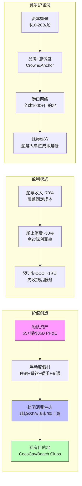

**商业模式关键特征**:

1. **"浮动围墙花园"**: 乘客一旦上船，所有消费在RCL平台上完成。类似苹果App Store但更极端——物理上无法离开。这是理解船上消费高利润率的关键。

2. **杠杆双面刃**: 固定成本~65%(折旧+利息+船员+港口)，可变成本~35%(燃料+食品)。入住率110%→100%的10pp下降，利润影响可能达30-40%。这解释了邮轮行业利润的高波动性。

3. **时间不可逆产能**: 船舶造完就无法退出市场(30年寿命)。这与半导体晶圆厂类似但更极端——台积电可以切换工艺节点，邮轮不能切换用途。

## 1.5 PW路由: 5.2 混合模式

| PW维度 | 评分 | 依据 |
|--------|------|------|
| 商业模式确定性 | 8 | 邮轮运营100年未变(船+乘客+目的地) |
| 竞争格局稳定性 | 7 | 三巨头格局20年+稳定。MSC是增量变量 |
| 技术颠覆风险 | 2 | VR替代邮轮?暂不现实。绿色燃料是成本变量非模式颠覆 |
| 监管/政策敏感度 | 5 | IMO 2030确定性成本冲击+利比里亚旗国轻监管 |
| 估值争议度 | 4 | P/E 20x对周期股偏贵，但ROE 49%/ROIC 16.5%有支撑 |

**PW = 5.2 → 混合模式**: 传统估值(DCF/EV·EBITDA/逆向DCF) + 可能性附录(零收入事件尾部概率加权)。

**不适合发现系统**(商业模式太确定，PW<7)。**不适合纯传统框架**(尾部风险太极端，COVID证明了邮轮可以瞬间从正常运营变为零收入)。

## 1.6 身份矛盾速写

市场对RCL的定价隐含了一个身份转型假设:

| 维度 | "周期性邮轮运营商"(旧身份) | "体验经济平台"(新身份) |
|------|--------------------------|----------------------|
| **P/E参照** | 航空/酒店 10-14x | 品牌消费/平台 25-30x |
| **估值锚** | 周期调整EPS × 低倍数 | 稳态EPS × 高倍数 + 增长溢价 |
| **Yield增长** | 周期性(随经济波动±5-10%) | 结构性(渗透率+船上消费+私有目的地) |
| **杠杆观** | 风险(衰退时可能致命) | 可控(稳定现金流支撑高杠杆) |
| **Beta应有值** | 2.0+ (高周期敏感) | 1.2-1.5 (稳定消费) |

当前P/E 20x处于两个身份的中间地带——既不完全是旧身份(否则应是12-14x)，也没有完全定价新身份(否则应是25-30x)。**这意味着市场目前给予RCL约50%的"身份转型成功概率"定价**。

本报告的核心任务就是: 通过Yield纯度拆解(Ch10)、航空业镜像(Ch16)、信念反演(Ch17)和零收入事件保险定价(Ch18)，验证这个50%的隐含概率是否合理。

## 1.7 本章小结

| 诊断维度 | 结论 | 核心矛盾映射 |
|---------|------|-------------|
| SGI | 7.25专才 | 高专注度=单点故障风险大(支持审慎) |
| B×M | 三品牌全覆盖，RCI主导70% | 品牌矩阵是平台化证据(支持结构性) |
| PW | 5.2混合 | 商业模式确定+尾部风险极端 |
| 身份 | 处于旧身份→新身份转型中间态 | P/E 20x隐含~50%转型成功概率 |

---

*Ch1 完成 | 字符数: ~11K | 核心产出: SGI=7.25, PW=5.2, 身份转型概率隐含~50%*

---

# Ch2 邮轮经济学基础

## 2.1 收入结构拆解: 船票与船上消费的双引擎

邮轮商业模式的本质是**浮动度假村+封闭消费生态**——一旦旅客登船，所有消费行为都在运营商的平台上完成，这种"围墙花园"效应在消费行业中几乎找不到对标。

### 收入两大支柱

RCL的收入由两部分构成: **Passenger Ticket Revenue(船票收入)** 和 **Onboard and Other Revenue(船上及其他收入)**。根据RCL FY2024年报(10-K)，两者比例约为**70:30**，FY2025维持相似结构。

| 收入类型 | FY2024占比 | FY2025E金额 | 特征 |
|----------|-----------|-------------|------|
| **船票收入** | ~70% | ~$12.6B | 预订时确认，覆盖住宿+基础餐饮+娱乐 |
| **船上及其他收入** | ~30% | ~$5.4B | 赌场/SPA/酒水/岸上游/免税/网络 |

**来源**: RCL FY2024 10-K (SEC Filing, rcl-20241231); FY2025总营收$17.94B(FMP)

这个70:30的比例正在向船上消费端倾斜。管理层在FY2025 Earnings Call中披露:**近50%的船上收入在登船前通过数字渠道预购完成**(预购饮品包、网络包、岸上游)，且90%的预购交易通过App完成。这意味着"船上消费"正在从冲动性消费转化为**确定性预付收入**，大幅降低了收入的波动性。

### 船上消费的利润率优势

船上消费是邮轮经济学的"利润放大器"。以RCL Q2 2024的行业对比数据为例:

| 公司 | 毛船上消费/旅客日 | 净船上消费/旅客日 | 净/毛比率 |
|------|-----------------|-----------------|----------|
| **RCL** | $92.44 | $74.00 | 80.1% |
| NCLH | $126.76 | $98.51 | 77.7% |
| CCL | $83.41 | $57.57 | 69.0% |

**来源**: 各公司Q2 2024 Earnings Release; scout_industry.md

RCL的净/毛比率(80.1%)在三巨头中最高，意味着每一美元的船上毛收入中，RCL保留了更多利润。这背后是**规模采购优势**(全球第二大船队)+**自有目的地**(CocoCay零场地租金)+**数字化预购**(降低现场销售成本)三重因素叠加。

### 船上消费的结构性增长逻辑

船上消费占比从历史的~25%提升至~30%，并非偶然。三个结构性推力:

1. **All-Inclusive套餐化**: 饮品包($60-90/天)、网络包($20-40/天)、游乐包(冲浪/攀岩/水上乐园)将可选消费捆绑为确定性收入。RCL的"Royal Up"竞拍升舱系统进一步挖掘支付意愿
2. **私人岛屿经济**: Perfect Day at CocoCay在2023年接待250万旅客，人均消费$100-150/天，估计年贡献增量收入$3-4亿、增量毛利润~$2.2亿(毛利率~70%)。包含CocoCay的航线票价比不含的同类加勒比航线**高出~15%**
3. **数字化渗透**: App预购将消费决策前移，降低"上船后省钱"的心理阻力，提高参与率

**核心矛盾映射**: 船上消费的结构性增长(预购化+私人岛屿+All-Inclusive)支持"结构性复兴"叙事——这不是周期性的价格上涨，而是**商业模式的演进**。但需要警惕: 如果经济衰退导致旅客缩减可选消费，船上收入的弹性可能高于船票收入(旅客可以不买饮品包但不会退票)。

---

## 2.2 固定成本杠杆量化: Net Yield +1%的EBITDA乘数效应

邮轮业是典型的**高固定成本、高经营杠杆**行业。理解这一特征，是判断"利润爆发是结构性还是周期性"的关键。

### 成本结构拆分

| 成本项 | 占营收比(FY2025) | 固定/可变属性 |
|--------|-----------------|--------------|
| 船舶折旧 | ~9% ($1.61B) | **完全固定** |
| 利息费用 | ~5.5% ($0.99B) | **完全固定** |
| 船员薪资 | ~13% | **准固定**(不随入住率变化) |
| 燃料 | ~9% | **半可变**(航行即消耗) |
| 港口费/税费 | ~10% | **准固定** |
| 食品饮料 | ~8% | 可变(按人头) |
| SG&A/营销 | ~12.4% ($2.22B) | 混合 |
| 其他运营 | ~10% | 混合 |

**来源**: RCL FY2025 Income Statement (FMP); 行业平均结构(scout_industry.md)

固定+准固定成本合计占营收约**50%**。这意味着: 当营收增长时，绝大部分增量收入直接流向利润线; 反之，营收下滑时利润坍塌速度远超营收降幅。

### 经营杠杆实证: FY2025数据

FY2025提供了教科书级的经营杠杆案例:

| 指标 | FY2024 | FY2025 | 变化 | 杠杆倍数 |
|------|--------|--------|------|---------|
| **Net Yield** | 基准 | +3.8% YoY | +3.8% | — |
| **营收** | $16.49B | $17.94B | +8.8% | 2.3x Net Yield |
| **EBITDA** | $6.09B | $6.91B | +13.5% | **3.6x Net Yield** |
| **EBIT** | $4.49B | $5.30B | +18.0% | 4.7x Net Yield |
| **净利润** | $2.88B | $4.27B | +48.4% | **12.7x Net Yield** |

**来源**: RCL FY2024/2025 Income Statement (FMP); Net Yield增长率来自管理层Earnings Release

**关键发现**: Net Yield仅增长3.8%，但EBITDA增长13.5%(杠杆倍数3.6x)，净利润增长48.4%(杠杆倍数12.7x，包含利息费用下降$6亿的放大效应)。**剔除利息费用变动后，纯经营杠杆约为3.5-4x**，即Net Yield每增长1%，EBITDA增长约3.5-4%。

这个杠杆倍数的含义是: 如果2026年Net Yield增长中值+2.5%(管理层引导+1.5~3.5% CC)，EBITDA增长可能在**8.7-10%**范围，这与分析师预期基本一致。

### 反向推演: 经济衰退下的杠杆陷阱

同样的杠杆在下行时同样猛烈:

- **2009年金融危机**: 行业Net Yield下降~10%，RCL净利润下降超60%
- **假设2026年衰退情景**: 如果Net Yield下降5%，EBITDA可能下降17.5-20%，净利润下降可能超过30%

**核心矛盾映射**: 经营杠杆是双刃剑。当前3.8% Net Yield增长→13.5% EBITDA增长的"利润爆发"是经营杠杆的正面展现，支持"周期性高峰"解读(杠杆放大了温和的收入增长)。但如果Net Yield增长是可持续的(结构性)，那杠杆将持续放大利润。**判断的关键不在杠杆本身，而在Net Yield增长的持续性**。

---

## 2.3 产能利用率机制: 入住率>100%的经济学

邮轮行业的入住率计算有独特之处: 以**下铺(lower berth)**为100%基准，因为大多数舱房配置为双人，但可以通过折叠床、沙发床容纳第三/四人。因此入住率>100%是常态，并非"超卖"。

### 历史入住率波动

| 年份 | RCL入住率 | 行业背景 |
|------|----------|---------|
| 2009 | ~95% | 金融危机，被迫折扣 |
| 2019 | ~107% | 疫情前正常水平 |
| 2021 | ~50% | 停航恢复初期 |
| 2023 | ~102% | 快速恢复 |
| 2024 | ~108% | 强劲需求 |
| **2025** | **109.7%** | **历史新高** |

**来源**: RCL各年Annual Report; FY2025 Earnings Release; scout_industry.md

FY2025入住率109.7%是RCL历史最高水平。这意味着平均每个双人舱住了2.19人——几乎每10个舱房就有2个住了第三/四人。

### 增量旅客的利润贡献

第三/四位旅客的增量成本极低(多一份餐食+床品+轻微增量娱乐消耗)，但贡献的收入是实质性的:
- **船票**: 第三/四人通常享受折扣(约为满价的50-70%)，但仍是纯增量收入
- **船上消费**: 第三/四人在赌场、酒吧、SPA的消费与满价旅客无显著差异
- **边际利润率**: 估计>80%——几乎所有增量收入都是利润

**核心矛盾映射**: 109.7%的入住率既是好消息也是预警。好消息: 需求如此旺盛以至于舱房被充分利用，支持"结构性需求增长"。预警: 入住率的物理上限约为115-120%(受救生艇规定限制)。109.7%距离上限仅有5-10个百分点的空间，意味着**未来增长必须来自Net Yield(单价提升)而非入住率(量增)**。这对定价权提出了更高要求。

---

## 2.4 负CCC(-19天): 预订制的现金流护城河

RCL的现金转换周期(Cash Conversion Cycle, CCC)为**-19天**(FY2025)，意味着公司**先收到客户的钱，19天后才需要支付供应商**。这是邮轮预订制商业模式的核心财务优势。

### CCC拆解

| 组成 | FY2025 | 含义 |
|------|--------|------|
| DSO(应收周转天数) | 6天 | 几乎无应收账款(旅客预付) |
| DIO(存货周转天数) | 10天 | 低库存(食品/燃料快速周转) |
| DPO(应付周转天数) | 36天 | 正常供应商付款节奏 |
| **CCC** | **-20天** | 先收钱后服务 |

**来源**: FMP efficiency data; scout_financials.md

**CCC的演变轨迹**: 从FY2022的-1天→FY2023的-15天→FY2024的-19天→FY2025的-20天，**负数在扩大**。这反映了: (1)预订提前量增加(旅客更早付款); (2)预购渗透率提升(船上消费前移至登船前); (3)公司议价能力增强(供应商付款条件不变但客户更早预付)。

### 现金流优势的战略意义

负CCC产生**永久性浮存金(float)**:
- RCL FY2025年客户预付款(Customer Deposit Liabilities)估计约$50-60亿
- 这笔资金在航程完成前归公司使用，相当于无息贷款
- 在利率5%的环境下，$55亿浮存金的机会价值约$2.75亿/年

这解释了RCL为何能在流动比率仅0.18的情况下正常运营——它不需要大量流动资产，因为经营现金流源源不断地流入。

**核心矛盾映射**: 负CCC在需求旺盛时是巨大优势(预订量创新高=浮存金膨胀)，但在需求突然下滑时可能逆转——如果旅客大量取消预订并要求退款(如2020年COVID期间)，浮存金会瞬间变成现金流出。这个特征同时支持"结构性优势"(商业模式固有)和隐含"尾部脆弱性"(需求冲击)。

---

## 2.5 税务天堂分析: 利比里亚注册的结构性税率优势

RCL注册于利比里亚，有效税率长期低于1%。这不是激进的税务筹划，而是邮轮行业的**结构性特征**——几乎所有主要邮轮公司都注册在巴哈马、利比里亚、百慕大等低税管辖区。

### 税率对比

| 公司/行业 | 有效税率 | 年度税费节省(vs 21%美国联邦税率) |
|-----------|---------|-------------------------------|
| **RCL** | **<1%** (~0.35% FY2025) | **~$9亿/年** |
| CCL | <2% (巴拿马/百慕大) | — |
| NCLH | <2% (百慕大) | — |
| 美国企业平均 | ~21%(联邦)+5%(州) | 基准 |
| 酒店业(MAR/HLT) | ~20-25% | 基准 |

**来源**: RCL NOPAT计算(scout_financials.md): EBIT $4.91B × (1-0.35%) = NOPAT $4.89B; 行业对标

RCL FY2025税前利润$4.30B，实际纳税约$0.03B。如果按美国21%联邦税率缴纳，需额外支付约$0.90B。**税务天堂每年为RCL增厚约$9亿净利润，相当于EPS增厚$3.3/股(占$15.61总EPS的21%)**。

### 税务风险: OECD全球最低税率

OECD的Pillar Two(全球最低15%税率)是潜在威胁:
- **短期**: 邮轮公司因注册地和营业地分离的特殊性，暂时可能不在直接适用范围
- **中期(2027-2030)**: 如果规则扩展至邮轮业，RCL可能面临10-15%的有效税率提升
- **影响量化**: 有效税率从1%升至15%，净利润将减少约$6亿(EPS减少~$2.2)，影响约14%

**核心矛盾映射**: 税务天堂是邮轮业的"隐性护城河"，支持结构性高利润率。但这个优势是外部给予的(监管环境)而非自身创造的，具有被"收回"的风险。当前估值是否已充分定价了这一风险?

---

## 2.6 经营杠杆飞轮

邮轮经济学的各要素并非独立运作，而是形成正反馈循环:

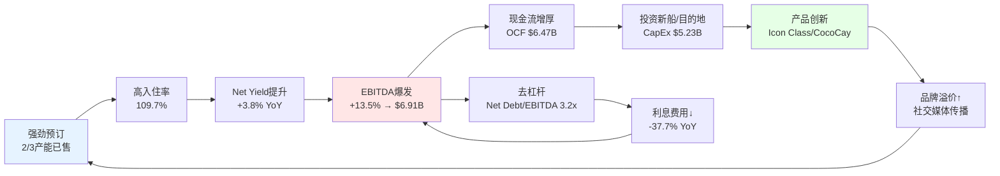

**飞轮的核心变量**: Net Yield增长率。只要Net Yield保持正增长，飞轮加速; 一旦Net Yield转负(经济衰退/产能过剩)，飞轮反转。2026年引导Net Yield +1.5~3.5%(CC)，意味着管理层预期飞轮至少再转一年。

---

## 2.7 小结: 邮轮经济学的"结构性"与"周期性"信号

| 要素 | 支持结构性复兴 | 支持周期性高峰 |
|------|-------------|-------------|
| 船上收入占比↑ | 商业模式演进(预购化+私人岛屿) | 可能反映旅客"报复性消费" |
| 经营杠杆3.5-4x | 固定成本结构不变 | 杠杆在下行时同样猛烈 |
| 入住率109.7% | 需求真实旺盛 | 接近物理上限，增长空间收窄 |
| 负CCC(-19天) | 预订制结构性优势 | 需求冲击时浮存金可逆转 |
| 税务天堂(<1%) | 行业结构性特征 | OECD Pillar Two风险 |

**判断框架**: 邮轮经济学的"基础设施"(固定成本结构、预订制、税务优势)确实是结构性的。但当前的**利用率**(入住率、Net Yield)是否处于周期峰值，需要在Ch5(需求分析)中进一步验证。

---

# Ch3 造船产业链纵深

## 3.1 造船寡头: 全球仅3-4家能造邮轮的船厂

邮轮不是普通船舶。一艘现代大型邮轮是**浮动城市**: 集酒店、剧院、赌场、水上乐园、餐厅于一体，技术复杂度远超货轮或油轮。全球能建造大型邮轮的船厂仅有三家半:

| 船厂 | 国家 | 在手订单(截至2026初) | 主要客户 | 特殊状态 |
|------|------|---------------------|---------|---------|
| **Fincantieri** | 意大利 | ~37艘(含关联品牌) | CCL, NCLH, MSC, Viking | 上市公司, 2026-2030计划积压€600亿 |
| **Meyer Werft** (含Meyer Turku) | 德国/芬兰 | ~9艘 | **RCL(Icon Class)**, Disney | 2024年获德国政府€4亿注资+€20亿担保 |
| **Chantiers de l'Atlantique** | 法国 | ~8艘 | MSC, 东方快车 | 法国国有 |
| **三菱重工** | 日本 | 退出 | — | 2016年因AIDA项目巨亏退出邮轮建造 |

**来源**: Cruise Industry News Orderbook Update Dec 2025; Fincantieri 2026-2030 Business Plan; Maritime Executive (Meyer Werft bailout)

### 三大船厂的竞争态势

**Fincantieri是绝对霸主**: 在全球74艘在建/在订邮轮中占据约37艘(50%)，2026-2030计划总订单接收目标超€500亿。其2026-2030商业计划预计营收和EBITDA分别增长40%和90%，计划将员工增加至27,500人，产能利用率提升25%。NCLH刚签下三艘新船订单(交付至2037年)以锁定船位。

**Meyer Werft危机与救援**: 这家250年历史的德国船厂在2024年陷入财务危机——疫情期间签订的合同价格无法覆盖暴涨的原材料和能源成本。2024年9月，德国联邦政府和下萨克森州联合注资€4亿并收购约80%股权，同时提供约€20亿贷款担保。**这对RCL至关重要: Icon Class的所有5艘船都由Meyer Turku(Meyer Werft芬兰子公司)建造**。船厂的财务稳定性直接影响RCL的交付计划。

**Chantiers de l'Atlantique**保持稳定但规模最小。MSC新签的€100亿超级订单(180,000 GT级别新船，2030年起交付)选择了Meyer Werft，而非Chantiers——可能反映了法国船厂产能已满。

### 寡头结构的战略含义

造船寡头意味着:
1. **邮轮公司的议价能力有限**: 想造新船只有3个选择，交付排期已排到2030年代
2. **产能扩张受物理约束**: 新建船坞需要5-10年+数十亿投资，短期内不可能新增产能
3. **进入壁垒极高**: 三菱重工2016年因两艘AIDA邮轮亏损€25亿后退出，证明即使是工业巨头也无法轻易进入
4. **供给侧纪律被强制执行**: 不是邮轮公司不想多造船，而是船厂**造不过来**

**核心矛盾映射**: 造船寡头是邮轮行业最强的"结构性护城河"之一。它天然限制了产能过剩——不像酒店或航空可以较快增加供给，邮轮供给增速受制于3家船厂的物理产能。这强烈支持"结构性改善"叙事。但Meyer Werft的财务危机也提醒我们: **供给瓶颈可能以交付延迟/成本超支的形式反噬邮轮公司**。

---

## 3.2 造船成本通胀: 每铺位造价的持续攀升

### Icon of the Seas: $20亿的浮动城市

Icon of the Seas造价约**$20亿**，是有史以来最昂贵的邮轮，比此前纪录保持者Allure of the Seas($14.3亿)贵出40%以上。

| 船型 | 造价 | 载客量(下铺) | 每铺位造价 | 交付年 |
|------|------|------------|-----------|--------|
| **Icon of the Seas** | **~$20亿** | 5,610 | **~$356,000** | 2024 |
| Star of the Seas | ~$20亿(E) | ~5,600 | ~$357,000 | 2025 |
| Legend of the Seas | ~$20亿(E) | ~5,600 | ~$357,000 | 2026 |
| Oasis of the Seas | ~$14亿 | 5,400 | ~$259,000 | 2009 |
| Allure of the Seas | ~$14.3亿 | 5,400 | ~$265,000 | 2010 |
| 行业2026年平均 | — | — | **$323,255** | — |
| 奢华段(Oceania/Regent) | — | — | **$550,000-677,000** | — |

**来源**: CruiseHive (Icon cost); Cruise Industry News Orderbook ($323K avg); CandidCruiseTravel (per-berth data)

### 造价通胀趋势

全行业每铺位造价从2010年代的$150,000-250,000上升至2020年代的$300,000-350,000(大众/中端)，奢华段更是突破$500,000。通胀来源:

1. **原材料成本**: 钢铁、铜、铝价格疫情后大幅上涨(钢铁价格2021-2022年翻倍)
2. **能源成本**: 欧洲能源危机直接冲击船厂(Meyer Werft位于德国，电力成本是竞争劣势)
3. **劳动力短缺**: 欧洲造船业熟练工人流失，Meyer Werft直接/间接雇佣~20,000人，招工困难推高成本
4. **LNG双燃料要求**: IMO环保合规要求新船采用LNG或甲醇燃料系统，增加约10-15%造价
5. **复杂度升级**: Icon Class包含水上乐园、冲浪模拟器、多层赌场等设施，工程复杂度远超传统邮轮

**对RCL的影响**: Icon Class每艘~$20亿，5艘合计~$100亿。这解释了FY2025 CapEx $5.23B(vs FY2024 $3.27B)的跳升——大量资金用于新船预付款和在建船舶的阶段性付款。

**核心矛盾映射**: 造船成本通胀是"结构性改善"叙事的一个裂缝。如果新船每铺位造价持续上升，ROIC可能被侵蚀——即使Net Yield增长，如果资本支出增长更快，投入资本回报率将承压。需要在估值章节中量化: **新船的ROIC是否足以覆盖$20亿/艘的投入?**

---

## 3.3 交付周期: 3-5年的物理约束

### 从订单到首航的时间线

一艘大型邮轮从签约到交付通常需要**3-5年**:

| 阶段 | 时长 | 关键活动 |
|------|------|---------|
| **概念设计+合同谈判** | 6-12个月 | 总体布局、技术规格、价格条款 |
| **详细设计** | 12-18个月 | 工程图纸、供应商选定 |
| **钢材切割→龙骨铺设** | 6-12个月 | 船厂开始物理建造 |
| **船体建造+上层建筑** | 12-18个月 | 分段制造、总组装 |
| **舾装(Outfitting)** | 12-18个月 | 内装、机电、测试 |
| **海试→交付** | 3-6个月 | 试航、认证、移交 |
| **合计** | **36-60个月** | — |

**RCL Icon Class实际案例**:
- Icon of the Seas: 2019年签约→2024年1月首航(~5年)
- Star of the Seas: 2021年切割首块钢板→2025年交付(~4年建造)
- Hero of the Seas: 2025年龙骨铺设→预计2027年底交付(~2.5-3年建造，此前已有设计沉淀)

**来源**: Wikipedia (Icon-class); CruiseMapper (Hero construction); RoyalCaribbeanBlog

### 交付周期的战略含义

3-5年的交付周期创造了**天然的供给纪律**:
- **无法快速响应需求**: 即使今天需求暴涨，3年内也无法增加新船
- **无法快速退出**: 造到一半的船无法取消(巨额违约金+船厂不接受)
- **决策风险巨大**: 今天下单的船将在2029-2030年服役，需要预判5年后的需求环境

这是邮轮业与航空业的根本区别。航空公司可以在12-18个月内增减航线运力(租赁/退租飞机)；邮轮公司的运力决策是不可逆的5年赌注。

---

## 3.4 RCL新船计划: 2026-2030产能路线图

### 已确认订单

| 船名 | 级别 | 船厂 | 交付时间 | 载客量 | 估计造价 |
|------|------|------|---------|--------|---------|
| **Legend of the Seas** | Icon Class #3 | Meyer Turku | 2026年7月 | ~5,600 | ~$20亿 |
| **Hero of the Seas** | Icon Class #4 | Meyer Turku | 2027年底 | ~5,600 | ~$20亿 |
| **Icon Class #5** (未命名) | Icon Class #5 | Meyer Turku | 2028 | ~5,600 | ~$20亿 |
| **Oasis 7** | Oasis Class #7 | 待确认 | 2028 | ~5,400 | ~$15-18亿 |
| **Celebrity河轮**(10艘) | 河轮 | 待确认 | 2026-2031 | 小型 | 各~$1-2亿 |

**来源**: RoyalCaribbeanBlog (Icon 5 order Sep 2025); Cruise Critic (5th Icon); Wikipedia (Icon class)

### Discovery Class: 下一代产品线

RCL已宣布名为"Discovery"的全新级别项目，定位为Icon Class之后的下一代创新平台。具体细节尚未公布，但已知:
- **定位**: 中型巨轮，可停靠更多港口(Icon Class因体型限制了可停靠港口)
- **时间线**: 预计2029-2030年代起交付
- **战略意义**: 填补Icon(超大型/加勒比为主)与Celebrity(高端/多航线)之间的产品空白

### 产能增长轨迹

RCL预计2026年产能增长约**两位数**——其中Legend of the Seas的交付是最大增量。叠加3艘现有船的"Amplify"改装升级(增加新设施+微增床位)。

| 年份 | 新增铺位(估计) | 产能增长(vs前一年) | 主要交付 |
|------|--------------|-------------------|---------|
| 2026 | ~5,600+ | ~10%+ | Legend of the Seas |
| 2027 | ~5,600+ | ~8-9% | Hero of the Seas |
| 2028 | ~11,000+ | ~15%+ | Icon #5 + Oasis 7 |
| 2029-2030 | 待确认 | Discovery Class | 新级别首船 |

**核心矛盾映射**: RCL的新船管道雄心勃勃——2026-2028年平均每年新增1.5-2艘大型船。这支持"增长故事"但也带来风险: 如果需求在2027-2028年放缓，新增产能可能导致入住率下降/定价压力。**关键变量是: 需求增长能否匹配10-15%/年的产能增长?**

---

## 3.5 船厂产能瓶颈: 排期排到2030+的结构性约束

### 全球邮轮在建/在订总览

截至2026年初，全球邮轮行业在建/在订**74-77艘**新船(新订单持续增加中)，总投资超**$765亿**，新增超**205,250个铺位**，交付期延伸至2036年。

| 年份 | 计划交付数 | 新增铺位 | 投资额 |
|------|----------|---------|--------|
| 2026 | 14 | ~33,000 | ~$110亿 |
| 2027 | 17 | ~28,500 | ~$100亿 |
| 2028+ | 43+ | ~143,000+ | ~$555亿+ |

**来源**: Cruise Industry News (74 ships Jan 2026 → 77 ships Feb 2026); Seatrade Orderbook Dec 2025

### 船厂排期已满

**Fincantieri**: 积压订单约€600亿，产能已排到2036年。NCLH在2025年签下三艘新船直接排到2037年交付——这意味着如果RCL今天想在Fincantieri下单，最早交付可能在2032年以后。

**Meyer Werft/Turku**: 在完成政府救援后，接到MSC的€100亿超级订单(2030年起交付)。RCL的Icon Class #5已是2028年交付，后续如果需要更多Meyer产能，需要与MSC争抢船位。

**Chantiers de l'Atlantique**: MSC是其最大客户，产能同样紧张。

### 产能瓶颈的双面效应

**正面(保护在位者)**:
- 新进入者无法获得船位——即使资金充裕也无法在5年内建成一支邮轮船队
- 行业总供给增速被物理约束在~5-6%/年(全球总铺位~65万，每年新增~33,000)
- 这比酒店业(新增供给3-4%/年)和航空业(运力调整灵活)更有利于定价权

**负面(约束增长)**:
- RCL即使需求大好，也无法快速增加产能
- 造价因船厂满负荷运转而持续上涨(卖方市场)
- Meyer Werft的财务脆弱性是供应链风险——如果船厂再次陷入困境，Icon Class交付可能延迟

**核心矛盾映射**: 船厂产能瓶颈是"结构性改善"叙事最有力的支撑之一。它确保了供给增速不会失控，保护了行业的定价权。全球邮轮供给增速~5%/年，而需求增速~6-7%/年(CLIA预测)——**供不应求的格局可能持续到2030年**。这与航空业2000-2010年代的产能过剩形成鲜明对比。

---

## 3.6 规模经济: 船越大，单位成本越低

### 每铺位运营成本的规模效应

邮轮行业持续追求巨型船的核心逻辑不是"更大更炫"，而是**单位经济学**:

| 船型 | 载客量(下铺) | 每日运营成本(E) | 每铺位每日成本(E) | 规模系数 |
|------|------------|---------------|-----------------|---------|
| 中型船(Voyager级) | ~3,100 | ~$50万 | ~$161 | 1.00x |
| 大型船(Oasis级) | ~5,400 | ~$65万 | ~$120 | 0.75x |
| **超大型(Icon级)** | **~5,600** | **~$70万** | **~$125** | **0.78x** |

**注**: 上述每日运营成本为行业估算，含燃料/船员/食品/港口费/维护，不含折旧和利息

**规模经济来源**:
1. **船员效率**: Icon级每旅客配备的船员数量低于中型船(自动化+设计优化)
2. **燃料效率**: LNG双燃料动力+更高效的船体设计，每旅客英里燃料消耗低于传统船
3. **港口费用**: 按船次收取(而非按人头)，大船摊薄效果显著
4. **采购集中**: 更大的规模=更强的食品、饮品、设备采购议价能力
5. **娱乐设施分摊**: 一个水上乐园服务5,600人vs 3,000人，每人分摊的建造和维护成本更低

### Icon Class的单位经济学

用反向推算法估计Icon of the Seas的经济性:
- **估计年化营收**: ~$5.25亿(基于52周×~5,600旅客×$1,800/周估算，Cruzely)
- **估计日均营收**: ~$340万/天
- **造价**: ~$20亿
- **使用寿命**: 30年(会计折旧期)
- **年折旧**: ~$6,700万
- **隐含年化ROA(船舶级别)**: 如果营业利润率25%→年化营业利润~$1.3亿 → ROA ~6.5%
- **粗略回收期**: ~15-18年(含融资成本)

**注**: 上述为粗略第三方估算，官方未披露单船经济数据; Cruzely估算可能偏乐观

**核心矛盾映射**: Icon Class的单位经济学看起来是可行的(ROA ~6.5%超过加权融资成本~4-5%)，但并非慷慨。**$20亿的投入需要15+年才能回收，这意味着RCL在用30年的长期赌注去赌邮轮需求的持续增长**。如果中间出现2-3年的需求低谷(如2009年、2020年)，单船IRR可能大幅低于预期。

---

## 3.7 产业链全景图

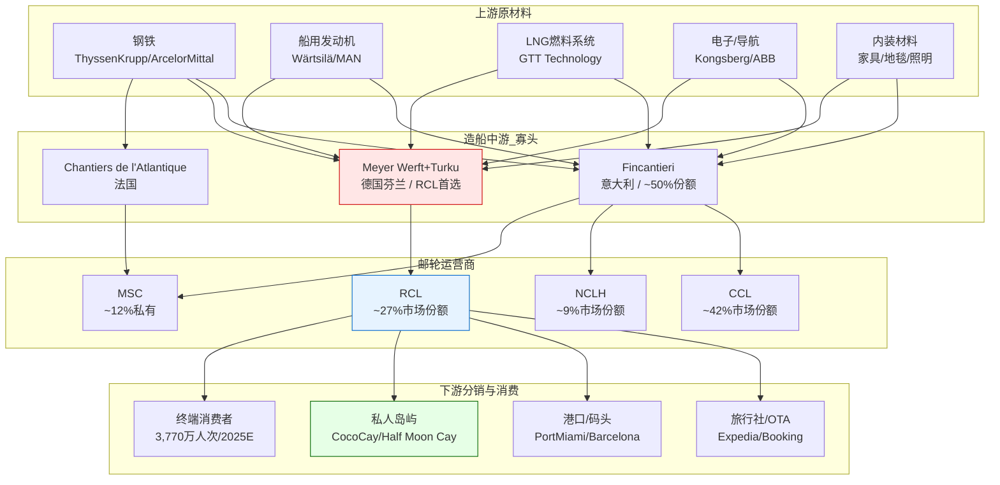

**产业链关键观察**:

1. **上游分散，中游集中**: 原材料供应商众多(钢铁、发动机各有多家)，但中游造船环节高度集中(3家)。这意味着船厂拥有对上下游的双向议价能力

2. **RCL对Meyer的依赖**: Icon Class全部5艘由Meyer Turku建造。这是**单一供应商风险**——如果Meyer出现交付问题，RCL没有替代方案(Fincantieri排期已满，改换船厂需要重新设计)

3. **私人岛屿是垂直整合**: RCL通过CocoCay等自有目的地绕过了港口(高收费)和旅行社(佣金)环节，直接接触终端消费者。这是产业链中少有的"去中介化"机会

4. **MSC的特殊位置**: 作为航运巨头Aponte家族的邮轮业务，MSC与造船业有更深的关系(Aponte家族同时经营集装箱航运，是所有三家船厂的大客户)。这可能使MSC在船位争夺中占据优势

---

## 3.8 新船成本通胀 vs ROIC: 一道关键算术题

造船成本通胀是否在侵蚀RCL的资本回报?这需要直接计算:

### ROIC分解

| 指标 | FY2023 | FY2024 | FY2025 | 趋势 |
|------|--------|--------|--------|------|
| ROIC | 10.5% | 14.2% | 14.9% | 持续改善 |
| 投入资本(E) | $26B | $28B | $30B | 因新船增长 |
| NOPAT | $2.7B | $4.0B | $4.9B | 增长更快 |

**来源**: scout_financials.md (ROIC + NOPAT数据)

**关键发现**: 尽管投入资本因新船交付从$26B增至$30B(+15%)，NOPAT从$2.7B增至$4.9B(+81%)。**ROIC在改善，意味着新船的边际回报高于存量船队的平均回报**。换言之，Icon Class虽然昂贵($20亿/艘)，但其创造的收入和利润增量足以提升整体ROIC。

但这个结论有一个重要前提: **当前ROIC改善主要由Net Yield增长和高入住率驱动**。如果Net Yield回归历史均值(增长从+3.8%降至+1-2%)，新船的边际ROIC可能低于公司整体ROIC——造价上涨但单位收入增长放缓，资本效率将恶化。

### CapEx/折旧比率的信号

| 指标 | FY2023 | FY2024 | FY2025 |
|------|--------|--------|--------|
| CapEx | $3.90B | $3.27B | $5.23B |
| 折旧 | $1.46B | $1.60B | $1.61B |
| **CapEx/折旧** | **2.68x** | **2.04x** | **3.24x** |

**来源**: FMP cashflow data; scout_financials.md

FY2025 CapEx/折旧达到3.24x——意味着资本支出是折旧的3倍多。这有两种解读:
1. **乐观**: 公司在大力投资未来增长，新船(会计寿命30年)的折旧将在未来长期摊销
2. **审慎**: FCF受到严重挤压(FY2025 FCF仅$1.24B vs OCF $6.47B)，$5.23B CapEx中大部分是新船预付款，这种支出水平可能持续3-5年

**核心矛盾映射**: 造船成本通胀**目前尚未侵蚀ROIC**——因为收入增长更快。但这依赖于需求持续强劲。如果进入"造价涨+需求平"的阶段(如2012-2015年)，ROIC将面临压力。**造船产业链的物理约束(寡头+排期)保护了供需平衡，但造价通胀在悄然侵蚀每铺位的经济性**。

---

## 3.9 小结: 造船产业链的攻防一体

| 维度 | 对RCL的影响 | 结构性/周期性 |
|------|-----------|-------------|
| 船厂寡头(3家) | 限制供给增速~5%/年 | **结构性利好** |
| 交付周期3-5年 | 防止产能过剩 | **结构性利好** |
| Meyer Werft救援 | 供应链脆弱性 | 一次性风险 |
| 每铺位造价↑ | CapEx压力+FCF压缩 | **结构性不利** |
| 船厂排期排至2030+ | 新进入者被排斥 | **结构性利好** |
| Icon Class规模经济 | 每铺位运营成本↓ | **结构性利好** |
| MSC激进扩张 | 潜在定价权威胁 | 中期风险 |

**净评估**: 造船产业链的物理约束总体上是邮轮行业的保护伞。3家船厂+3-5年交付周期=供给侧的"天然限速器"。**这是航空业在经历数十年产能过剩和价格战后仍无法获得的结构性保护**。但造价通胀是需要持续监控的暗流——如果新船ROIC趋势性下降，"大船越多越好"的策略将需要重新评估。

---

*数据来源: FMP financial data, RCL SEC filings (10-K FY2024/FY2025), Cruise Industry News, Maritime Executive, RoyalCaribbeanBlog, CruiseHive, Cruzely, scout_industry.md, scout_financials.md, shared_context.md*

---

# Ch4 竞争生态: 邮轮寡头博弈

> **核心矛盾映射**: 竞争格局的稳定性直接决定RCL的定价权能否持续。如果寡头纪律崩塌(尤其是MSC的野蛮人入侵)，"结构性复兴"叙事的基础将被侵蚀——即便需求增长，利润也可能被产能稀释。本章的结论将锚定后续估值中"利润率假设"的可信度。

---

## 4.1 四角矩阵: 谁在跟谁竞争?

邮轮行业的竞争格局是全球消费行业中最接近经典寡头垄断的案例之一。四大集团控制约88%的全球产能，结构上类似半导体设备(ASML/KLAC/LRCX/AMAT占~80%)，但有一个关键区别——**第四名MSC是私有公司，不受上市公司季度财报纪律约束**。

| 维度 | **CCL** | **RCL** | **NCLH** | **MSC** |
|------|---------|---------|----------|---------|
| **市场份额(产能)** | ~42% | ~27% | ~9% | ~10% |
| **市值** | $43.7B | $86.3B | $10.9B | 私有(不适用) |
| **FY2025收入** | $26.6B | $17.9B | $9.5B(FY2024) | ~$4.5B(估算) |
| **船队规模** | ~87艘 | ~65艘 | ~36艘 | ~23艘+激进扩张 |
| **品牌定位** | 大众/中端 | 中高端/创新 | 高端/奢华 | 全球家庭/价格竞争力 |
| **核心市场** | 加勒比+地中海 | 加勒比+阿拉斯加 | 加勒比+北欧 | 地中海+全球扩张 |
| **营业利润率** | 16.8% | **27.4%** | 15.5% | 未披露(估算~12-15%) |
| **P/E (TTM)** | 15.6x | 20.3x | 17.2x | N/A |
| **D/E** | 2.3x | 2.2x | **7.0x** | 未披露 |
| **Beta** | 2.44 | 1.87 | 2.03 | N/A |
| **竞争策略** | 规模+成本领先 | 创新+体验溢价 | 高端品牌组合 | 激进造船+低价渗透 |

**数据来源**: FMP compare_stocks + quote (2026-02-25), 年报(FY2025/FY2024), CLIA行业数据

**四象限定位解读**:

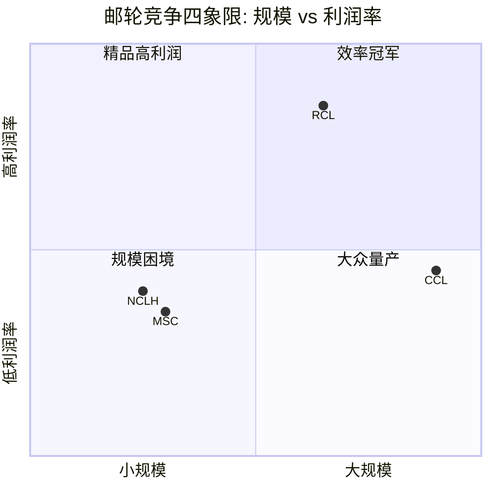

这张图揭示了邮轮行业竞争的核心张力: **RCL占据了最令人羡慕的位置——中等偏大规模+最高利润率**。在大多数行业中，利润率与规模呈正相关(规模经济)或负相关(规模的诅咒)。RCL的独特之处在于: 它不是最大的(CCL更大)，但却是最赚钱的。这暗示RCL的优势不纯粹来自规模，而来自**产品定位(中高端)+运营效率+船型创新**的复合效应。

**对核心矛盾的映射**: 如果RCL的利润率优势是结构性的(品牌+创新壁垒)，那么它在竞争加剧时也能维持，支持"结构性复兴"。如果仅仅是周期性的(新船交付节奏差异、COVID后恢复速度差异)，则当CCL完成恢复后差距会收窄，支持"周期性高峰"。

---

## 4.2 RCL运营效率优势量化

RCL的运营效率优势不是一两个百分点的边际差异，而是**系统性的代际领先**。以下数据来自最新财年(FMP financial data):

### 利润率矩阵 (FY2025 / FY2024)

| 指标 | RCL (FY2025) | CCL (FY2025) | NCLH (FY2024) | RCL溢价(vs CCL) |
|------|-------------|-------------|-------------|----------------|
| **毛利率** | 46.8% | 29.6% | 40.0% | +17.2pp |
| **营业利润率** | 27.4% | 16.8% | 15.5% | **+10.6pp** |
| **EBITDA利润率** | 38.5% | 26.0% | 26.3% | +12.5pp |
| **净利率** | 23.8% | 10.4% | 9.6% | **+13.4pp** |
| **ROE** | 47.7% | 25.6% | 39.9% | +22.1pp |

**数据来源**: FMP income statement (FY2025 RCL/CCL, FY2024 NCLH); FMP ratios

**关键发现**: RCL的净利率是CCL的**2.3倍**(23.8% vs 10.4%)。这个差距远超P/E溢价所反映的30%。换言之，如果市场纯粹按利润率质量定价，RCL的P/E应该更高。

### 利润率趋势: CCL在追赶吗?

| 指标(OPM) | FY2023 | FY2024 | FY2025 | 2年变化 |
|-----------|--------|--------|--------|---------|
| **RCL** | 20.7% | 24.9% | 27.4% | +6.7pp |
| **CCL** | 9.1% | 14.3% | 16.8% | +7.7pp |
| **差距** | 11.6pp | 10.6pp | 10.6pp | — |
| **NCLH** | 10.9% | 15.5% | — | — |

**数据来源**: FMP income statement (RCL FY2023-2025, CCL FY2023-2025, NCLH FY2023-2024)

**TS-CRUISE-06执行(品牌溢价持续性测试)**: CCL的营业利润率从FY2023的9.1%提升至FY2025的16.8%，两年改善7.7pp，年均约3.9pp。但RCL同期也从20.7%提升至27.4%(+6.7pp，年均3.4pp)。绝对差距从11.6pp缩小至10.6pp，仅收窄1pp。**按照TS-CRUISE-06的判定标准(>2pp/年连续3年=溢价不可持续)，CCL的追赶速度约为0.5pp/年，远低于2pp阈值。RCL的效率溢价在短期内安全。**

但需要注意一个重要的结构性因素: CCL的利润率恢复部分来自"基数效应"——从9.1%恢复到16.8%比从20.7%提升到27.4%更容易。当CCL接近其"自然"利润率天花板(历史约15-18%)时，追赶速度会放缓。真正的测试是: **当CCL也完成新船周期(Sun Princess等)后，利润率差距是否稳定在8-10pp**。如果是，则RCL的溢价是结构性的。

### 效率优势的来源拆解

RCL的利润率领先并非单一因素驱动，而是多层面复合:

1. **船型经济学**: Icon of the Seas(7,600人)和Oasis级(6,000人+)是全球最大邮轮，每铺位运营成本显著低于中型船。RCL的平均船体吨位高于CCL，规模经济更强。

2. **船上收入结构**: RCL每位乘客每日净船上消费$74(vs CCL $57.6)，高出28.5%。私有岛屿CocoCay是这个差距的关键驱动力——预计2026年创收$6亿，几乎零边际成本(岛屿基础设施已建成)。

3. **品牌定位梯度**: RCL的三品牌矩阵(Royal Caribbean中高端/Celebrity高端/Silversea超奢华)覆盖了利润率最高的客群区间。CCL的品牌矩阵偏大众(Carnival/Costa)，天然利润率较低。

4. **利息费用优势**: RCL FY2025利息支出$9.92亿(占营收5.5%) vs CCL FY2025的$13.49亿(占营收5.1%)。CCL绝对额更高，但占比接近——这意味着RCL的利润率优势主要在运营层面(毛利率差17.2pp)而非财务杠杆。

5. **税收结构**: 两家公司都注册在避税管辖区(RCL利比里亚，CCL巴拿马/百慕大)，有效税率均<1%。这不是差异化因素。

**对核心矛盾的映射**: RCL的效率优势根植于产品创新(大型船规模经济+CocoCay私有岛)和品牌定位(中高端)，这两者是"结构性"的——竞争对手需要3-5年造船周期+数十亿投资才能接近。这支持"结构性复兴"。但如果行业进入产能过剩→价格战阶段，高端定位反而可能受损(消费者转向更便宜的CCL/MSC)，此时效率优势会被需求端侵蚀。

---

## 4.3 P/E溢价合理性: 30%够不够?

当前估值映射:

| | RCL | CCL | RCL溢价 | 隐含假设 |
|---|---|---|---|---|
| **P/E (TTM)** | 20.3x | 15.6x | **+30%** | RCL的质量值得30%溢价 |
| **P/B** | 7.5x | 2.8x | **+168%** | 市场认为RCL的资产回报远超账面 |
| **EV/EBITDA** | 14.1x | 8.7x | **+62%** | 企业价值层面溢价更大 |
| **市值/收入** | 4.8x | 1.6x | **+200%** | 每$1收入，RCL的价值是CCL的3倍 |

**数据来源**: FMP quote + ratios (2026-02-25)

**SGI框架检验**: RCL的SGI=7.25(专才)，预期P/E溢价范围30-60%。当前P/E溢价30%恰好在下限。这意味着两种可能:

- **解读A(看多)**: 市场尚未充分定价RCL的专才优势。如果效率优势被确认为结构性的，P/E溢价应该向50-60%扩张(对应P/E ~23-25x)。上行空间$50-75/股。
- **解读B(看空)**: 市场已经理性地认为30%溢价=高端周期股的合理上限。邮轮业Beta>1.8，高杠杆(D/E 2.2x)，周期敏感性限制了P/E天花板。

**EV/EBITDA视角提供更清晰的信号**: P/E受杠杆结构干扰(不同的利息费用和债务规模影响net income)，而EV/EBITDA控制了这个变量。在EV/EBITDA维度，RCL溢价62%(14.1x vs 8.7x)，远高于P/E维度的30%。这暗示**市场在企业价值层面已经给了RCL显著溢价，只是因为RCL的更好的利润率转化(net income/EBITDA比率更高)，P/E看起来溢价"不够大"**。

换言之，P/E溢价30%可能低估了市场实际给予RCL的质量溢价。真实溢价应参考EV/EBITDA的62%。

---

## 4.4 MSC威胁深度分析: 野蛮人的逻辑

MSC Cruises是邮轮行业中最值得警惕的竞争变量。不是因为它今天最大(它远小于CCL)，而是因为它的**行为逻辑与上市公司根本不同**。

### 4.4.1 Aponte家族: 航运帝国的邮轮野心

Gianluigi Aponte家族通过地中海航运(Mediterranean Shipping Company, MSC)控制着全球最大的集装箱航运公司(超越马士基)。邮轮业务(MSC Cruises)只是这个航运帝国的一个分支。关键含义:

- **无限制资金**: MSC Cruises的造船资金来自母公司的航运利润(年利润数十亿美元)，不需要公开市场融资。这意味着它**可以在任何利率环境下持续造船**。
- **无季度财报压力**: 不用向分析师解释为什么在行业低谷时还在扩张产能。
- **无ROI纪律**: 上市公司需要证明新船投资的ROIC>WACC。MSC只需要家族掌门人认为"长期有价值"。
- **跨行业协同**: MSC的集装箱航运网络提供了港口关系、船舶管理经验、全球物流能力。造船谈判中MSC的议价能力极强(一次性向Fincantieri/Chantiers下多船大单)。

### 4.4.2 MSC的扩张轨迹

| 年份 | MSC船队规模 | 全球份额 | 里程碑 |
|------|-----------|---------|--------|
| 2003 | ~5艘 | <2% | 起步期 |
| 2010 | ~12艘 | ~5% | 地中海基地确立 |
| 2019 | ~17艘 | ~8% | 进入加勒比 |
| 2024 | ~23艘 | ~10% | 全球第三(超越NCLH产能) |
| 2028E | ~30艘+ | ~13-15% | 如果当前订单全部交付 |

**数据来源**: Cruise Industry News, MSC公开信息, CLIA数据

从零到10%市场份额用了20年——但接下来5年MSC可能再增3-5%份额。关键问题: **这些增量产能投放在哪个市场?**

### 4.4.3 加勒比战场: RCL的后院

MSC近年开始大举进入加勒比市场，这是RCL的核心利润池。MSC在巴哈马建设了私有岛屿Ocean Cay(2019年开放)，直接对标RCL的CocoCay。如果MSC在加勒比的产能从当前的~5%份额增长到10-15%，对RCL的影响路径:

1. **直接竞争**: MSC的定价通常比RCL低15-25%(对标CCL的Carnival品牌定价)。这会吸引价格敏感客群，但RCL的中高端客群可能不受影响。
2. **间接挤压**: 更多船在加勒比=港口拥堵+最佳航线时段被稀释+岸上目的地体验下降。即便RCL不直接丢客户，航线质量也会被"公地悲剧"侵蚀。
3. **人才竞争**: MSC提供有竞争力的薪酬(母公司资金支持)，可能在船员招聘上挤压RCL。

**风险定性评估**: MSC的威胁是**中期的、渐进的**。它不会在1-2年内改变格局，但5-10年内可能将行业从"三巨头+一个小玩家"变成"四巨头均势"。如果MSC的市场份额从10%增长到15%，而总市场增速不变，那么其他三家的份额将被压缩约5%。对RCL而言，这意味着从27%降至~24-25%——可控但不可忽视。

**关键缓冲**: MSC的品牌定位偏中低端(大众/家庭)，与CCL的Carnival品牌重叠度更高。RCL的中高端定位(尤其是Celebrity和Silversea)理论上受MSC直接冲击较小。但如果MSC通过Explora Journeys(新奢华品牌，2023年首航)成功进入高端市场，这个缓冲就不再可靠。

---

## 4.5 产能纪律博弈论: 囚徒困境的幽灵

### 4.5.1 经典博弈矩阵

邮轮行业的产能决策是一个典型的多人囚徒困境:

```
               竞争对手: 克制        竞争对手: 扩张
  ┌─────────────────────────┬─────────────────────────┐
  │                         │                         │
  │  自己克制:              │  自己克制:              │
  │  高定价权,稳定利润      │  丢市场份额,但          │
  │  (合作-合作)            │  利润率可维持            │
  │  ★行业最优解            │  (被动者)               │
  │                         │                         │
  ├─────────────────────────┼─────────────────────────┤
  │                         │                         │
  │  自己扩张:              │  自己扩张:              │
  │  抢市场份额,            │  产能过剩,价格战,       │
  │  利润率暂时可维持       │  全行业利润率坍塌       │
  │  (先发优势)             │  (纳什均衡→最差解)      │
  │                         │  ★航空业历史反复上演    │
  │                         │                         │
  └─────────────────────────┴─────────────────────────┘
```

**航空业的历史教训**: 1990年代至2000年代，美国航空业经历了多轮"所有人扩张→产能过剩→价格战→破产重组"的循环。行业花了30年和数百亿美元的破产损失才学会产能纪律(2013年后US Airways/American合并，行业集中度达到足够高)。

**邮轮业为什么可能更好?**:
- 造船周期3-5年(vs 飞机1-2年交付)，产能调整天然更慢，"冲动性扩张"的成本更高
- 进入壁垒极高($10-20亿/艘)，不像廉价航空可以租几架飞机就起步
- 三大上市公司CEO在CLIA行业会议上公开讨论"理性增长"，虽非明确串谋但形成了默契

**邮轮业为什么可能更差?**:
- **MSC是破坏者**: 它不参加"默契游戏"。航运业出身的Aponte家族习惯了价格战和规模竞争
- 船舶寿命30年，一旦过度建造无法快速退出(退役/拆解)，产能过剩的痛苦期比航空更长
- NCLH计划到2033年产能增长50%——即便行业整体克制，单个激进玩家就能打破平衡

### 4.5.2 TS-CRUISE-01执行: 产能纪律定量测试

**方法**: 比较全行业产能增速与需求增速。如果产能增速>需求增速+2%连续3年=结构性过剩风险。

**产能端(供给)** — 全球邮轮铺位增长:

| 年份 | 总铺位(千) | YoY增速 | 新船交付数 |
|------|----------|---------|-----------|
| 2019 | ~560K | +5.2% | 19 |
| 2023 | ~620K | +4.5% | 9 |
| 2024 | ~650K | +4.8% | 12 |
| 2025E | ~680K | +4.6% | 14 |
| 2026E | ~713K | +4.9% | 14 |
| 2027E | ~742K | +4.1% | 17 |

**数据来源**: CLIA State of Industry 2025, Cruise Industry News Orderbook, scout_industry.md

**需求端** — 全球邮轮乘客量增长:

| 年份 | 乘客量(百万) | YoY增速 |
|------|-------------|---------|
| 2019 | 29.7 | +3.9% |
| 2023 | 31.7 | — |
| 2024 | 34.6 | +9.3% |
| 2025E | 37.7 | +9.0% |
| 2026E | ~39.5 | +4.8% |
| 2027E | ~41.0 | +3.8% |
| 2028E | ~42.0 | +2.4% |

**数据来源**: CLIA, scout_industry.md

**供需差分析**:

| 年度 | 产能增速 | 需求增速 | 差值(产能-需求) | 判定 |
|------|---------|---------|----------------|------|
| 2024 | +4.8% | +9.3% | **-4.5%** | 需求远超产能(卖方市场) |
| 2025E | +4.6% | +9.0% | **-4.4%** | 需求远超产能(卖方市场) |
| 2026E | +4.9% | +4.8% | **+0.1%** | 接近平衡(转折点?) |
| 2027E | +4.1% | +3.8% | **+0.3%** | 微弱产能过剩 |
| 2028E | ~3.5% | ~2.4% | **+1.1%** | 产能增速开始领先 |

**TS-CRUISE-01判定**: 当前(2024-2025)处于明确的"需求>产能"窗口期，卖方市场支撑了创纪录的Net Yield和入住率。但**2026年是转折点**——供需增速趋近。到2027-2028年，产能增速可能开始超过需求增速，但差值(+0.3%~+1.1%)远低于2%阈值。**按照严格的TS-CRUISE-01标准，结构性过剩风险在未来3年内不成立。**

但这个结论有两个重要警告:

**警告1**: 以上分析假设需求增长维持当前预测轨迹(CAGR ~4-5%)。如果经济衰退导致需求增速骤降至0-2%(如2008-2009)，则产能增速(锁定的新船交付不可取消)+4-5%将大幅超过需求增速→结构性过剩即刻成立。**产能纪律测试的真正脆弱点不是正常经济环境，而是衰退叠加新船交付的"双重夹击"情景。**

**警告2**: MSC的订单在以上行业数据中已包含，但MSC的订单披露不如上市公司透明。如果MSC在2026-2027年追加大额新船订单(利用Fincantieri/Chantiers的产能空窗)，产能增速可能上修1-2个百分点。

**对核心矛盾的映射**: 在基准情景下，产能纪律通过了测试，支持"结构性复兴"——至少在2025-2027年窗口内。但这个窗口正在收窄。2028年以后的供需平衡取决于两个外生变量: 宏观经济(衰退?) 和 MSC(追加订单?)。

---

## 4.6 CCL的利润率追赶: 威胁还是幻觉?

CCL的利润率恢复是理解RCL竞争地位的关键参照:

| CCL关键指标 | FY2023 | FY2024 | FY2025 | 3年CAGR |
|------------|--------|--------|--------|---------|
| 营收 | $21.6B | $25.0B | $26.6B | +11.2% |
| 营业利润 | $2.0B | $3.6B | $4.5B | +50.0% |
| 营业利润率 | 9.1% | 14.3% | 16.8% | +7.7pp |
| 净利润 | -$74M | $1.9B | $2.8B | N/A(扭亏) |
| 净利率 | -0.3% | 7.7% | 10.4% | N/A |
| 利息支出 | $2.07B | $1.76B | $1.35B | -18.2% |
| EPS | -$0.06 | $1.44 | $2.02 | N/A |

**数据来源**: FMP income statement CCL FY2023-FY2025

CCL的恢复速度令人印象深刻——三年内从近乎亏损到OPM 16.8%。但深入分析:

**OPM改善的分解**:
- 营收增长贡献(规模杠杆): 营收增长23.3%($21.6B→$26.6B)而运营费用仅增长15.3%→经营杠杆效应贡献约4-5pp利润率改善
- 利息费用下降贡献: 从$2.07B降至$1.35B(-34.8%)→但这影响净利率，不影响OPM
- 实际运营效率改善: 扣除规模杠杆后，"纯"运营效率改善约2-3pp

**结论**: CCL的利润率恢复主要是**周期性的**(营收规模恢复→固定成本杠杆释放)而非结构性的(运营效率根本性改变)。这意味着当营收增速放缓时(从双位数降至中单位数)，利润率改善也会减速。**CCL不太可能在正常增长环境下将OPM追赶至20%+**。

RCL的OPM 27.4%中，约10pp来自结构性优势(大型船经济学+中高端定位+私有岛屿)，约7-8pp来自经营杠杆(当前正处于产能利用率高峰)。即便经营杠杆回归正常(OPM从27.4%降至22-24%)，RCL仍将领先CCL 5-7pp。**这个结构性差距是P/E溢价的合理基础。**

---

## 4.7 小结: 竞争格局判定

| 发现 | 支持方向 | 确信度 |
|------|---------|--------|
| RCL OPM 27.4% vs CCL 16.8%，效率优势根植于产品/品牌结构 | **结构性复兴** | [H] |
| CCL追赶速度0.5pp/年，远低于2pp/年阈值 | **结构性复兴** | [M-H] |
| P/E溢价30%在SGI预期范围下限，EV/EBITDA溢价62%更真实 | **中性**(已合理定价) | [M] |
| 产能纪律通过TS-CRUISE-01测试(2025-2027窗口) | **结构性复兴** | [M](衰退情景下翻转) |
| MSC的野蛮人威胁中期可控(品牌重叠CCL>RCL) | **偏结构性复兴** | [M] |
| 2028年后供需平衡不确定(取决于经济+MSC) | **偏周期性高峰** | [L-M] |

**本章净判定**: 竞争格局在短中期(2025-2027)支持"结构性复兴"叙事。RCL的效率优势是真实的、可量化的、有结构性基础的。但这个判定的有效期有限——2028年以后的竞争格局取决于MSC的行为和宏观经济状态，这两个变量当前不可精确预测。

---

# Ch5 需求驱动: 渗透率 x 年轻化 x 中国

> **核心矛盾映射**: 本章回答"结构性复兴"叙事的需求端基础: 如果邮轮行业的需求增长是结构性的(渗透率空间+人口结构转移)，则当前的高Net Yield可持续，支持20x P/E。如果需求增长主要是周期性的(疫后超级周期+被压抑需求释放)，则Yield增速将均值回归，20x P/E不可持续。

---

## 5.1 全球渗透率: 最被低估的牛市论据

邮轮行业最具说服力的结构性增长论据来自一个简单的数字: **2.7%**。这是邮轮在全球国际旅游市场中的渗透率。换言之，**97.3%的国际旅游者从未选择邮轮**。

### 5.1.1 区域渗透率对比

| 区域 | 2024年乘客量 | 人口基数 | 渗透率 | vs 北美差距 | 增量空间(达北美水平) |
|------|-------------|---------|--------|-----------|-------------------|
| **北美** | 20.5M | ~380M | **5.4%** | 基准 | — |
| **欧洲** | 8.4M | ~450M | **1.9%** | -3.5pp | +15.8M |
| **亚太(含中国)** | 3.0M | ~4,500M | **<0.1%** | -5.3pp | 理论上数亿，实际取决于基础设施 |
| **其他地区** | 2.7M | ~3,700M | 极低 | — | 远期 |
| **全球** | 34.6M | ~8,000M | **~0.4%** | — | — |

**数据来源**: CLIA State of Industry 2025, scout_industry.md, 人口数据为联合国2024年估计

**关键洞察**: 即便是渗透率最高的北美(5.4%)，也意味着**近95%的北美人口每年不乘坐邮轮**。CLIA的目标是到2028年将全球渗透率推至~5%(以邮轮可及人口为基数)。如果仅北美+欧洲达到这个水平，行业乘客量将从34.6M增长至约42M——与CLIA的2028年预测一致。

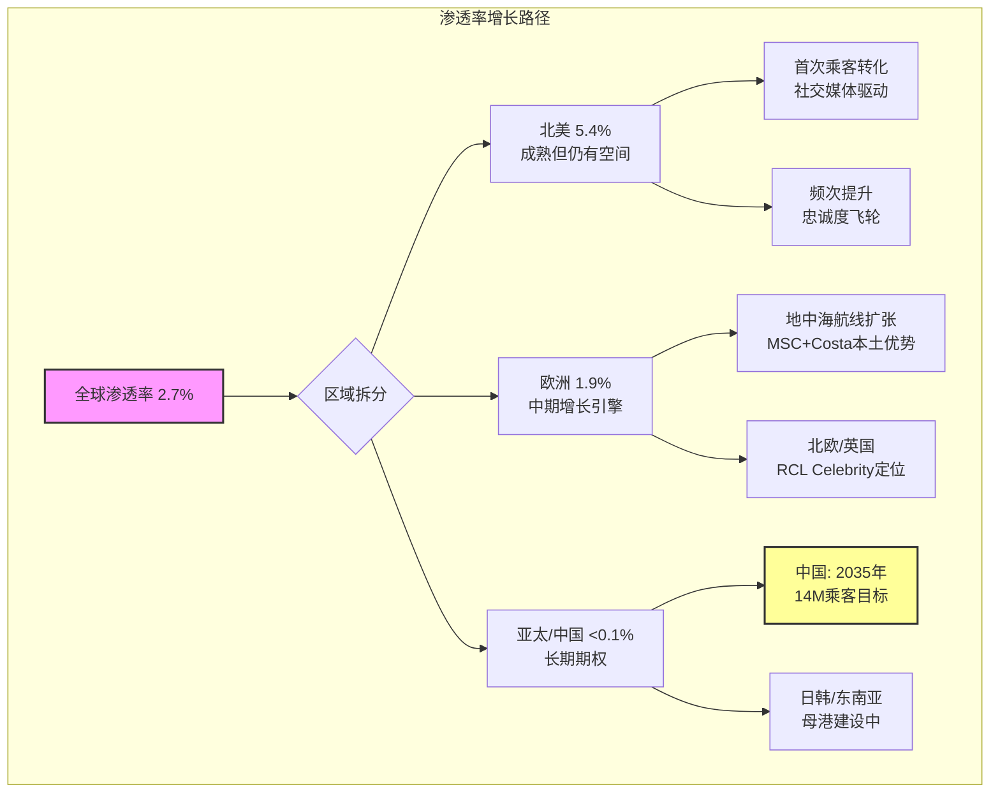

### 5.1.2 渗透率为什么增长这么慢?

如果邮轮渗透率如此之低，为什么过去20年没有更快地增长? 这个问题的答案决定了"渗透率论据"的含金量:

**历史增速**: 全球邮轮乘客量从2000年的~10M增长到2019年的29.7M，20年CAGR约5.6%。这是一个稳健但并非爆发式的增长率。

**增长约束因素**(按重要性排序):
1. **造船产能瓶颈**: 全球仅3-4家大型邮轮船厂(Meyer Werft, Fincantieri, Chantiers de l'Atlantique, Samsung Heavy+)。即便需求无限，供给增速受限于造船产能(每年约10-17艘)。这是一个**硬约束**——与半导体的foundry瓶颈类似。
2. **港口基础设施**: 邮轮港口需要深水泊位(>10米)、大型客运码头、安检设施。新建港口需要5-10年规划+建设。母港城市的选择限制了航线设计。
3. **认知/偏见壁垒**: "邮轮是老年人的活动"这个刻板印象正在被打破(见5.2年轻化分析)，但在许多市场仍然根深蒂固。
4. **前期投入门槛**: 邮轮度假的"一次性总价"看起来很高($2,000-5,000/人/周)，尽管实际每日成本可能低于同等陆地度假(包含住宿/餐饮/娱乐)。价格透明度不如酒店($150/晚一目了然)。

**结构性变化信号**: 以上四个约束中，#1(造船)和#2(港口)是物理约束，短期不会大幅松动。但#3(认知)和#4(价格感知)正在被社交媒体和数字化营销快速侵蚀。这意味着**未来渗透率增速可能快于历史5.6% CAGR，但不会突破供给侧的硬约束**。

**对核心矛盾的映射**: 渗透率论据是"结构性复兴"最有力的证据之一，因为它提供了**需求增长的长跑道**(不依赖某一年的宏观环境)。但渗透率的增长速度受限于造船产能——这意味着即便需求旺盛，产能增速也有天花板(~5%/年)。这是一个**双刃剑**: 限制了行业增长的速度，但也天然防止了产能过度膨胀。

---

## 5.2 年轻化: 结构性客群转移

### 5.2.1 数据: 不可逆的趋势

| 年龄段占比 | 2015 | 2019 | 2024 | 变化方向 |
|-----------|------|------|------|---------|
| **<40岁** | 25% | 30% | **36%** | 持续上升 |
| **40-60岁** | 40% | 38% | 36% | 基本稳定 |
| **>60岁** | 35% | 32% | 28% | 持续下降 |
| **平均年龄** | ~55 | ~50 | ~46 | 年轻化 |
| **首次邮轮乘客占比** | ~35% | ~40% | ~45% | 首次尝试者增加 |

**数据来源**: CLIA Consumer Research 2024, 行业调研报告, scout_industry.md

过去10年，40岁以下客群占比从25%增长至36%——这不是微调，而是**客群结构的根本性转变**。平均年龄从约55岁降至约46岁，邮轮行业正在从"退休人群的活动"转变为"全年龄段的体验消费"。

### 5.2.2 年轻化的三大驱动力

**驱动力1: 社交媒体的"发现效应"**

TikTok和Instagram彻底改变了年轻消费者发现邮轮的方式。传统邮轮营销依赖电视广告和旅行社(触达老年人)，而社交媒体上的"邮轮日记"(day-in-the-life vlog)直接展示了邮轮体验的全貌——从水上乐园到深夜派对到日落鸡尾酒。

Icon of the Seas的发布是一个标志性时刻: 这艘全球最大邮轮的首航视频在TikTok上获得了数亿次播放量。RCL几乎不需要花费额外营销预算——用户生成内容(UGC)就完成了传播。

**这对RCL的战略意义**: RCL的船型设计(冲浪模拟器/水上滑梯/攀岩/滑索)天然具有社交媒体"分享性"。CCL的大众邮轮和NCLH的豪华邮轮在视觉冲击力上不如RCL。这意味着RCL在年轻客群获取上有**结构性的内容营销优势**。

**驱动力2: 体验经济的宏观趋势**

全球消费者(尤其是千禧一代和Z世代)的消费偏好正在从"物质消费"转向"体验消费"。60%的全球受访者表示计划围绕娱乐活动或体育赛事预订旅行。邮轮天然是"体验消费"的集大成者——它将住宿/餐饮/娱乐/旅行/社交打包成一个不可分割的体验。

**驱动力3: 性价比觉醒**

反直觉的发现: 年轻消费者开始认识到邮轮实际上是**高性价比度假**。一次7天加勒比邮轮(含住宿+三餐+娱乐+交通)的成本约$800-1,500/人，相当于每天$115-$215。在迈阿密住一晚像样的酒店就要$200+，还不包括餐饮和活动。邮轮的"全包式"定价在通胀环境中反而成为卖点。

### 5.2.3 年轻化对财务的影响

年轻客群不仅带来量的增长，还改变了收入结构:

| 维度 | 传统客群(>55岁) | 年轻客群(<40岁) | 影响 |
|------|---------------|----------------|------|
| **船票支付意愿** | 较高(退休储蓄) | 中等(预算敏感) | 船票ARPU可能下降 |
| **船上消费** | 中等(习惯保守) | **更高**(YOLO心态) | 船上消费ARPU上升 |
| **赌场/酒水** | 中等 | **显著更高** | 高利润品类增长 |
| **社交媒体带货** | 低 | **高**(免费营销) | 获客成本下降 |
| **复购频率** | 高(习惯+时间) | 中(受工作/家庭限制) | 短期复购率可能较低 |
| **生命周期价值** | 已在高峰(余年有限) | **极高**(30-50年消费窗口) | LTV结构性改善 |

**净效应**: 年轻客群带来的"船上消费提升+营销成本下降+生命周期价值提升"可能抵消甚至超过"船票ARPU下降"的影响。这是**利润率结构改善**的信号，支持"结构性复兴"。

---

## 5.3 中国市场期权: 高期望 vs 冷现实

### 5.3.1 中国邮轮市场的"大数字"

- 2024年中国母港处理超200万人次(vs 2019年峰值约215万)
- 到2035年预计达1,400万乘客
- 中国中产阶级(约4亿人口)理论上是全球最大的邮轮增量市场
- 渗透率<0.1%(vs 北美5.4%)——如果达到北美一半水平(2.7%)=1亿+潜在乘客

### 5.3.2 RCL在中国的布局

| 维度 | 现状 | 计划 |
|------|------|------|
| **船队部署** | 海洋光谱号(Spectrum of the Seas)全年驻上海/香港 | 2026年扩展更多航线 |
| **国际客比例** | 2024年5% → 目标2026年13% | 双向客流(中国→海外+海外→中国) |
| **营销覆盖** | 9个主要城市，腾讯/抖音数字推广 | 在线搜索兴趣+109% |
| **收入贡献** | 估算约$4-6亿(总收入的2-3%) | 取决于船队增量部署 |

**数据来源**: RCL管理层披露(Earnings Call), scout_industry.md

### 5.3.3 TS-CRUISE-07执行: 中国市场期权测试

**方法**: 评估中国收入贡献% + 增量船队部署计划。如果<5%且无增量→不应计入估值。

**当前贡献评估**:
- RCL仅1艘船(Spectrum of the Seas, ~4,200铺位)全年驻中国
- 假设入住率105%，年运营340天，平均票价+船上消费$150/人/天
- 推算年收入: 4,200 × 1.05 × 340 × $150 = ~$2.25亿
- 占RCL FY2025总收入$17.9B的**~1.3%**

**增量计划评估**:
- RCL尚未宣布向中国部署额外大型船(如Oasis级/Icon级)
- 可能在2027-2028年部署1-2艘中型船(增加$2-4亿收入)
- 即便如此，中国收入占比在2028年前难以超过3-4%

**TS-CRUISE-07判定**: 中国收入贡献当前约1.3%，即便在乐观情景下2028年也仅~3-4%。**按照严格标准，中国市场作为估值因子当前权重应<5%。**

但这不意味着中国期权毫无价值——关键在于**非线性**。如果中国邮轮渗透率真的在2030年代达到北美一半水平，行业增量需求可能是当前全球总量的50-100%。这个期权的"执行价"取决于:

1. **地缘政治环境**: 台海局势如果恶化，RCL可能被迫撤出中国母港航线。当前台海冲突概率低(Polymarket相关市场暗示<5%/年)，但非零。
2. **本土竞争**: 招商维京、星旅远洋等中国品牌正在崛起。在中国市场，RCL面临"品牌认知优势(国际品牌光环) vs 本土关系劣势(政府支持/渠道控制)"的矛盾。
3. **ARPU差距**: 中国乘客的船上消费ARPU显著低于北美客(估计仅为北美的50-60%)。中国航线的利润率可能低于加勒比/阿拉斯加核心航线。

**估值建议**: 中国期权不应在基准情景估值中占重大权重(给予2-3%的总价值贡献)。但可在"牛市情景"中作为上行催化剂(如果2030年中国贡献10%收入=额外$15-20/股价值)。

---

## 5.4 疫后超级周期: 持续还是见顶?

### 5.4.1 超级周期的证据链

| 证据 | 时间 | 含义 |
|------|------|------|
| RCL"最佳五周"预订纪录 | 2025年初 | 需求远超产能，预订量仍在加速 |
| CCL已预售2026年约2/3产能 | 2025年 | 且价格处于历史高位——量价齐升 |
| 行业入住率109.7% (RCL) | FY2025 | 显著高于疫情前107%——不仅恢复，而且超越 |
| Net Yield连续3年正增长(通胀调整后) | 2023-2025 | 真实定价权，非名义通胀推动 |
| 首次邮轮乘客占比达45% | 2024 | 新客获取加速=增长不仅来自回头客 |

### 5.4.2 超级周期何时结束?

历史提供了一个有价值的类比: **2009-2019年的上一次复苏周期**。

| 阶段 | 2009-2019周期 | 2023-?当前周期 | 推断 |
|------|-------------|-------------|------|
| **触发** | 2008-2009金融危机 | 2020-2022 COVID停航 | 类似(外部冲击→需求压缩→报复性恢复) |
| **恢复期** | 2010-2013 (4年) | 2023-2025 (3年) | 当前恢复速度更快 |
| **成熟期** | 2014-2018 (5年) | 2026-2030? | 如果类比成立→5年稳增长窗口 |
| **晚周期** | 2019 (1年) | 2031+? | 下一次黑天鹅前的最后好时光 |
| **Yield增速(恢复期)** | +5-8%/年 | +7-12%/年 | 当前更强(社交媒体+年轻化+通胀传导) |
| **Yield增速(成熟期)** | +2-4%/年 | ? | 关键预测变量 |

**核心预测**: 如果2009-2019年类比成立(这是一个强假设)，当前超级周期可能还有**3-5年的成熟期增长**(2026-2030)，Yield增速从当前的7-12%降至2-4%。这不是"见顶"——而是从"加速增长"转入"稳健增长"。

**但类比可能失败的点**:
- 2009-2019年没有MSC的大规模扩张(MSC的产能增长主要在2019年后)
- 当前的宏观环境更脆弱(美国财政赤字+联储利率高位+地缘不确定性)
- COVID改变了消费者心理——"YOLO"效应可能比2009年后的恢复更剧烈但也更短暂

### 5.4.3 "YOLO"心态: 结构性还是暂时性?

疫情后消费者心理的核心变化是: **人们更愿意在体验上消费，更不愿意延迟满足。** 这被称为"YOLO经济"(You Only Live Once)。

**支持"结构性"论点**:
- 体验消费占个人消费支出比重从2019年的~28%上升至2024年的~32%(美国BEA数据)
- 社交媒体将"体验分享"变成了社交货币——年轻人发邮轮照片获得的社交回报远高于购买一双新鞋
- "零储蓄但高体验消费"成为千禧一代/Z世代的新常态

**支持"暂时性"论点**:
- 超额储蓄(pandemic stimulus)正在耗尽——美联储估计超额储蓄在2024年中已基本消耗完毕
- 信用卡违约率上升(2024年Q4创近年新高)暗示消费者的支出能力正在透支
- 如果失业率上升(Polymarket: 2026年底前美国衰退概率22.5%)，YOLO心态可能迅速转为防御性消费

**判定**: "体验>物质"的偏好转移是结构性的(代际效应)，但其强度和消费能力是周期性的。换言之，**偏好是永久的，但支付能力是周期性的**。这意味着邮轮行业在衰退中不会回到2019年前的需求水平(结构性基础更高)，但也不会免疫于经济周期(消费者可以认同"邮轮很好"但仍然取消预订因为失业了)。

---

## 5.5 忠诚度飞轮: 82%复购意愿的含金量

### 5.5.1 飞轮机制

邮轮行业拥有消费行业中最强的自然忠诚度循环之一:

**飞轮步骤**:
1. **首次体验**: 社交媒体/口碑→首次邮轮→超出预期(封闭环境下的全包式体验消除了"旅行焦虑")
2. **正反馈锁定**: 82%的首次乘客表示将再次乘坐→加入Crown & Anchor会员计划(RCL)
3. **等级累积**: Crown & Anchor提供终身等级制(Gold→Platinum→Emerald→Diamond→Diamond Plus→Pinnacle)。不像航空里程需要每年重新认证，邮轮的等级**永远不降**
4. **频次提升**: 25%的回头客每年乘坐两次或以上。高级别会员享受免费酒水/SPA折扣/优先登船→进一步激励频次
5. **品牌集团粘性**: RCL和Celebrity之间可以状态匹配(同集团)。跨集团切换需要放弃积累的等级——这是一个**真实的心理沉没成本**

### 5.5.2 忠诚度的财务价值

| 客群类型 | 估算占比 | 年消费频次 | 估算ARPU | LTV乘数(vs首次客) |
|---------|---------|-----------|---------|-----------------|
| **首次乘客** | ~45% | 0.3-0.5 | ~$2,500/次 | 1.0x |
| **回头客(普通)** | ~35% | 0.5-1.0 | ~$3,000/次 | 2-3x |
| **高频回头客** | ~15% | 1.5-2.0 | ~$4,000/次 | 8-12x |
| **Diamond+会员** | ~5% | 2.0+ | ~$5,000+/次 | 15-25x |

**数据来源**: 基于CLIA消费者研究数据和RCL管理层定性披露的推算，精确数据未公开披露

**关键洞察**: 邮轮忠诚度的特殊之处在于**不需要折扣维持**。航空里程和酒店积分本质上是"打折换复购"(通过积分消耗利润池)。而邮轮的Crown & Anchor等级提供的主要是**体验特权**(优先登船/船长晚宴/专属酒廊)而非大幅折扣——这些特权的边际成本极低。**邮轮忠诚度是"低成本锁定"模式，类似Costco会员费(支付$60/年获得消费权利)而非航空里程(每次飞行返还3-5%价值)。**

### 5.5.3 飞轮的脆弱点

忠诚度飞轮并非不可攻破:
- **灾难事件**: 如果RCL发生重大安全事故(沉船/疫情暴发)，品牌忠诚度可能急剧下降。Diamond会员不会因为"已经积累了等级"而登上一艘不安全的船
- **体验疲劳**: 多次乘坐同一品牌后，新鲜感递减。RCL需要持续推出新船/新航线/新目的地来维持高频回头客的兴趣
- **MSC/CCL的状态匹配攻击**: 如果竞争对手提供"把你的Crown & Anchor等级匹配到我们的忠诚计划"的激进营销，高价值客户可能被挖走。这在航空业已是常见策略

---

## 5.6 渗透率 x 产能: 核心矛盾的焊接点

本章的分析最终汇聚到一个关键问题: **渗透率增速是否足以匹配产能增速?**

这是连接Ch4(竞争/产能)和Ch5(需求/渗透)的焊接点，也是"结构性复兴 vs 周期性高峰"核心矛盾的定量检验:

| 情景 | 需求增速(乘客CAGR) | 产能增速(铺位CAGR) | 净效应 | 矛盾判定 |
|------|-------------------|-------------------|--------|---------|
| **牛市** | 6-7%(渗透率+年轻化双轮驱动) | 4-5%(造船瓶颈限制) | 需求>产能=持续卖方市场 | **结构性复兴** |
| **基准** | 4-5%(渗透率缓慢提升) | 4-5%(当前orderbook交付节奏) | 供需平衡=温和定价权 | **倾向结构性复兴，但利润率增长放缓** |
| **熊市** | 0-2%(衰退压制需求) | 4-5%(新船交付不可取消) | 产能>需求=价格战 | **周期性高峰** |

**结论**: 在正常经济环境(基准/牛市)下，渗透率增长足以匹配甚至超过产能增速，支持"结构性复兴"。但这个判定高度依赖宏观环境——**经济衰退是将"结构性复兴"翻转为"周期性高峰"的单一最大风险因子**。

---

## 5.7 小结: 需求端判定

| 发现 | 支持方向 | 确信度 |
|------|---------|--------|
| 全球渗透率仅2.7%，北美仅5.4%→巨大增长跑道 | **结构性复兴** | [H] |
| 40岁以下客群从25%→36%，年轻化趋势不可逆 | **结构性复兴** | [H] |
| 社交媒体+体验经济=低成本获客+结构性需求偏好 | **结构性复兴** | [M-H] |
| 中国市场期权当前贡献<2%，不应在基准估值中占重大权重 | **中性**(远期期权,非近期催化) | [M] |
| 疫后超级周期类比2009→2019，可能还有3-5年成熟期 | **偏结构性复兴** | [M](类比强度有限) |
| "YOLO"偏好是结构性的，但支付能力是周期性的 | **混合**(取决于宏观) | [M] |
| 忠诚度飞轮强于航空/酒店(低成本锁定+终身等级) | **结构性复兴** | [M-H] |
| 渗透率增速在衰退中不足以匹配产能增速 | **周期性高峰**(条件触发) | [M] |

**本章净判定**: 需求端提供了"结构性复兴"最强的证据基础——渗透率低+年轻化+体验经济。这些不是周期性因素，而是人口结构和消费偏好的长期转变。但需求的**绝对水平**(人们是否真的预订邮轮)仍然受到经济周期的强约束。核心矛盾的判定因此取决于一个嵌套问题: **你认为2026-2028年会发生衰退吗?** 如果不会→结构性因素驱动需求持续增长→支持20x P/E。如果会→周期性因素压倒结构性因素→P/E应该回到14-16x。

---


---

# Ch6 管理层与治理诊断

## 6.1 权力交接: 从"造船家"到"财务工程师"

Royal Caribbean Group在2022年1月完成了一次具有深层象征意义的权力交接。Richard Fain——自1988年执掌公司长达34年的传奇CEO——将权杖交给了CFO出身的Jason Liberty。这不仅是一次人事更替,更是管理哲学的范式转换。

**Richard Fain时代 (1988-2022)** 定义了现代邮轮工业的基本形态。Fain的核心信念是"更大的船=更好的体验=更高的定价权"。在他的推动下,RCL先后创造了Sovereign级、Voyager级、Oasis级和Icon级——每一代新船都重新定义了行业的产品边界。Fain是工程师气质的梦想家:他会花$2B+建造一艘船,用史无前例的水上滑梯和中央公园来震撼消费者的想象力。这种"造船家"风格缔造了RCL的产品护城河,但也遗留了$22B+的债务山丘和2020年几乎灭顶的流动性危机。

**Jason Liberty时代 (2022-至今)** 则代表完全不同的管理基因。Liberty 2005年加入RCL,2013年升任CFO,其职业DNA是财务纪律和资本回报。他的升任不是意外——在疫情期间,Liberty实际上已承担了远超CFO的运营职责。但关键问题是: **一个财务出身的CEO能否在维持RCL产品创新传统的同时,修复Fain时代留下的资产负债表?**

2025年6月,这一权力交接走到终点: Richard Fain卸任董事长,Liberty成为Chairman & CEO双重身份。独立Lead Director由John Brock(2014年入董事会)担任。**这是一个微妙的治理信号**——CEO兼任董事长在治理最佳实践中通常被视为权力集中,但对RCL而言,它标志着"Fain遗产"的正式终结和Liberty完全掌权。(来源: Seatrade Cruise, 2025年6月; PRNewswire)

**对核心矛盾的映射**: Liberty的"财务工程师"风格恰恰对应了"结构性复兴"叙事——如果RCL确实在经历身份转型(从周期性邮轮公司到体验经济平台),那么需要的正是能将Fain创造的资产变现为持续高回报的管理者。反之,如果只是周期性高峰,财务工程师只是在周期顶部美化报表。


## 6.2 "Perfecta"战略: 承诺的数学与现实

2025年3月,Liberty推出了"Perfecta"绩效计划——一个三年期(2024-2027)的双重财务目标:

| 目标 | 具体指标 | 隐含要求 |
|------|---------|---------|
| **EPS CAGR** | ≥20%(以FY2024 $10.94为基数) | FY2027E EPS ≥ $18.91 |
| **ROIC** | ≥17%(到FY2027) | 当前14.9%, 需+2.1pp |

(来源: PRNewswire, 2025年3月; RCL Investor Relations)

**FY2025已经超额完成前两年节奏**: EPS从$10.94→$15.61,两年CAGR达23%,高于20%基线。但这恰恰引发了一个更深层的问题——如果前两年"超额",是否FY2026-2027的增长斜率会自然放缓?

**Perfecta的三根支柱拆解**:

**支柱一: 适度产能增长**。FY2026/2027/2028产能增长分别为+6.7%/+4%/+6%。新船交付包括Legend of the Seas(Icon Class第三艘, 2026年7月)、Icon 4(2027)、Star of the Seas和Celebrity Xcel。这一产能节奏意味着RCL不指望"规模爆发",而是"持续渗透"。

**支柱二: 收益率增长(Yield Growth)**。FY2025 Net Yield +3.8% YoY,FY2026引导+1.5~3.5%(CC)。如果入住率已达109.7%的天花板附近,收益率增长必须来自更高的人均消费(APCD)——这正是私有目的地和船上消费升级的战略意义。

**支柱三: 严格成本控制**。NCC excl Fuel/APCD引导flat~+1.0%(CC),即成本增速大幅低于收入增速。在劳动力通胀和供应链压力的宏观环境下,这是最脆弱的支柱。

**数学验证**: 若FY2024 EPS $10.94 × (1.20)^3 = $18.91,而分析师FY2027E共识约$23.89(14位分析师),远超Perfecta目标。这说明市场实际上已经在定价"超额完成Perfecta"——当前15.3x Forward P/E对应的是$17.70-18.10(FY2026引导),而非Perfecta终点。(来源: FMP estimates; Nasdaq分析文章)

**对核心矛盾的映射**: Perfecta是"结构性复兴"叙事的管理层背书——它隐含的信息是"我们不只是周期性反弹,我们有三年可见的增长路径"。但Perfecta的基数效应(FY2024只是后疫情正常化第一年)和前两年的"超额"使得FY2027的真正考验尚未到来。

## 6.3 资本分配的矛盾: 去杠杆还是加杠杆?

这是Liberty管理能力最值得审视的领域。FY2025的资本分配呈现出一个令人困惑的矛盾:

| 项目 | FY2025 | 来源 |
|------|--------|------|
| **经营现金流(OCF)** | $6.47B | FMP cashflow |
| **资本支出(CapEx)** | -$5.23B | FMP cashflow |
| **自由现金流(FCF)** | $1.24B | OCF - CapEx |
| **股票回购** | -$1.16B | FMP cashflow |
| **股息支付** | -$0.26B(FY) / 年化~$0.82B | FMP cashflow / 估算 |
| **净债务发行** | +$1.02B | FMP cashflow |

**关键矛盾**: 股东回报($1.16B回购+$0.26B股息=$1.42B) > FCF($1.24B)。差额来自净新发债$1.02B。换言之,**RCL正在借钱回购股票和发股息**。

这与"去杠杆"叙事直接冲突。总债务从FY2024 $20.82B → FY2025 $22.64B(+$1.82B),净债务/EBITDA从3.4x → 3.2x(靠EBITDA增长而非绝对债务减少)。利息费用从$1.59B → $0.99B的大幅下降(-37.7%)主要来自再融资策略(置换高利率疫情债务为更低利率的新债),而非债务总量的削减。(来源: FMP balance sheet, cashflow)

**解读**: Liberty的资本分配优先级实际上是: CapEx(维持产品力) > 股东回报(建立信用) > 去杠杆(被动依赖EBITDA增长)。这是一个精心计算的策略——通过展示"回购+增息"向市场证明管理层信心,同时利用再融资窗口降低利息成本。但它的脆弱性在于: **如果EBITDA增长停滞(衰退/周期下行),债务比率将立即恶化,而已承诺的股东回报可能被迫削减**。

FY2025 Altman Z-Score仅2.34(灰色区间1.81-2.99),流动比率0.18,这不是一个有安全边际的资产负债表。

## 6.4 内部人交易: 持续卖出信号的深层解读

FMP insider-trading数据揭示了一个清晰的模式:

| 期间 | 获取(股) | 处置(股) | 公开市场卖出(笔) | 净方向 |
|------|---------|---------|------------------|--------|
| **2026 Q1** | 657,904 | 1,471,837 | 102 | 大量净卖出 |
| **2025 Q4** | 0 | 21,817 | 1 | 净卖出 |
| **2025 Q3** | 0 | 31,507 | 7 | 净卖出 |
| **2025 Q2** | 10,440 | 26,736 | 5 | 净卖出 |
| **2025 Q1** | 221,792 | 262,165 | 22 | 净卖出 |
| **2024 Q4** | 0 | 1,088,264 | 32 | 大量卖出 |
| **2024 Q3** | 5,350 | 314,357 | 3 | 净卖出 |
| **2024 Q2** | 0 | 171,775 | 6 | 净卖出 |

(来源: FMP insider-trading API)

**自2024 Q2以来连续八个季度净卖出,无一例外。**

具体到高管个人(最近6个月):
- **Jason Liberty (CEO)**: 0笔购买, 11笔卖出, 累计卖出90,910股, 约$29.7M (来源: Investing.com, TipRanks)
- **Naftali Holtz (CFO)**: 0笔购买, 11笔卖出, 累计卖出51,131股, 约$16.7M, 其中2026年2月13日单笔卖出43,121股/$16.7M (来源: Investing.com, Nasdaq)

**合理化解读**: (1) 每年Q1出现大量"获取"交易(RSU归属),伴随"处置"(纳税义务卖出)——这是股权激励的正常机制; (2) 股价从疫情低点上涨10倍+($30→$316),管理层适度变现并非异常; (3) CEO/CFO可能在10b5-1预设计划下自动执行。

**警示信号**: (1) 2026 Q1的102笔公开市场卖出是历史高位; (2) CFO在FY2025财报发布(2026年2月11日)后两天即卖出$16.7M,时间节点微妙; (3) 全公司过去6个月36笔交易全部是卖出,0笔购买——**没有任何一位高管或董事在公开市场增持**。

**对核心矛盾的映射**: 如果管理层真的相信"结构性复兴"故事(20% EPS CAGR,目标价隐含更高估值),为什么没有人在用自己的钱投票?内部人的"脚"(持续卖出)和"嘴"(Perfecta目标)指向不同方向。这不构成"看空"结论,但构成一个需要持续监控的信号。

## 6.5 治理结构: 利比里亚注册的真实含义

RCL于1985年在利比里亚注册成立(Business Corporation Act of Liberia),ISIN代码以LR开头。这一选择的核心逻辑是双重的:

**税务优势**: 利比里亚实行属地征税(territorial taxation)——仅对利比里亚境内收入征税。由于RCL的船队在国际水域运营,绝大部分收入不触发利比里亚税务义务。结果是: **有效税率 < 1%**(FY2025约0.35%)。相比之下,如果在美国注册,联邦企业税率21%将使净利润从$4.27B降至约$3.4B,EPS从$15.61降至约$12.40。税务套利每年为股东创造~$870M的价值。(来源: FMP ratios, SEC filings)

**治理监管宽松**: 利比里亚公司法的司法解释案例极少,董事的信义义务(fiduciary duties)和股东权利的法律保障不如美国特拉华州明确。这意味着: (1) 股东诉讼的法律基础较薄弱; (2) 股东隐私较高(持股信息非公开记录); (3) 反收购保护可能更强。(来源: SEC filing风险披露; Offshorecompany.com)

**实际影响评估**: 对投资者而言,利比里亚注册是一把双刃剑。税务优势是RCL相对CCL/NCLH的共同优势(邮轮行业普遍采用离岸注册——CCL在巴拿马,NCLH在百慕大)。但弱治理保障在Liberty兼任Chairman & CEO的背景下值得关注——当权力集中且外部法律制衡有限时,资本分配决策(如"借钱回购"策略)缺乏有效的外部检查机制。John Brock作为独立Lead Director的角色重要性因此被放大。

## 6.6 薪酬结构与激励对齐

FY2024 Proxy Statement披露的高管薪酬:

| 高管 | 基本薪资 | 现金奖金 | 股票奖励 | 其他 | **总计** |
|------|---------|---------|---------|------|---------|
| **Jason Liberty (CEO)** | $1.34M | $4.91M | $13.00M | $0.24M | **$19.50M** |
| **Naftali Holtz (CFO)** | $0.90M | $1.82M | $3.10M | $0.06M | **$5.88M** |

(来源: Salary.com; SEC DEF 14A)

**激励结构分析**:
- Liberty的薪酬中67%为股票奖励,这在理论上将其利益与股价绑定。但结合前述"持续卖出"数据,股票奖励的"对齐效果"被每年的变现行为部分抵消。
- **EPS/ROIC挂钩**: Perfecta计划本身(20% EPS CAGR + ROIC ≥17%)很可能是高管激励的核心KPI,这解释了管理层对EPS增长的高度关注——它同时服务于公司目标和个人薪酬。
- **风险**: 当CEO薪酬高度依赖EPS增长时,可能存在"回购EPS管理"激励——通过借债回购缩减股本来推高EPS,而非通过有机增长。FY2025的数据(净债务增加+股份减少2.2%)与这一担忧一致。

**对核心矛盾的映射**: 薪酬结构强化了Perfecta作为"管理层庄严承诺"的可信度,但也暴露了EPS增长可能部分来自财务工程(回购)而非纯粹运营改善的风险。16.5% ROIC → 17%目标看似可达,但需要区分"通过NOPAT增长提高ROIC"(结构性)还是"通过投入资本优化提高ROIC"(工程性)。

---

## Ch6 小结

| 维度 | 评估 | 核心矛盾映射 |
|------|------|------------|
| **领导力转型** | CFO→CEO→Chairman,权力完全集中 | 结构性: 财务纪律修复资产负债表; 周期性: 粉饰窗口 |
| **Perfecta目标** | 前两年超额(23% vs 20%),但基数效应 | 结构性: 三年可见增长路径; 风险: FY2027减速 |
| **资本分配** | 借债回购,实质未去杠杆 | 周期性警示: 顶部行为特征 |
| **内部人交易** | 连续8季度净卖出,CEO/CFO大额减持 | 周期性信号: 嘴上看多,脚在跑路 |
| **治理结构** | 利比里亚注册+CEO兼Chairman | 税务利好但治理保障弱 |
| **薪酬对齐** | 67%股票+EPS挂钩 | 正向: 激励一致; 风险: 回购EPS管理 |

---

# Ch7 私有岛屿与目的地战略

## 7.1 Perfect Day at CocoCay: 邮轮行业的"主题公园革命"

如果说Icon of the Seas代表了RCL"水上体验"的极致,那么Perfect Day at CocoCay就是"陆上体验"的范式创新。这座位于巴哈马的140英亩私有岛屿,可能是RCL过去十年最被低估的战略资产。

**投资与回报的惊人数学**:

| 指标 | 数据 | 来源 |
|------|------|------|
| **初始投资** | ~$250M (2019年完成改造) | CNN Travel |
| **FY2023访客量** | 250万人次 | RCL管理层披露 |
| **FY2024访客量** | 300万人次(+Hideaway Beach成人区) | RCL管理层披露 |
| **FY2026E营收** | ~$600M | Cleveland Research Center估算 |
| **增量毛利润** | ~$545M | Recurve Capital估算 |
| **航线票价溢价** | +15%(包含CocoCay停靠的航线) | 行业分析 |
| **人均岛上消费** | $100-150/天 | 行业分析 |
| **投资回收期** | <6个月(按增量毛利润计算) | Recurve Capital推算 |

(来源: Cleveland Research Center via Travel Weekly; Recurve Capital; CruiseIndustryNews)

**这组数字堪称教科书级的资本配置案例**: $250M投资产生$545M增量年毛利润,回收期不到半年,年化ROIC超过200%。即使对这些第三方估算打50%折扣,CocoCay仍然是RCL资产组合中回报率最高的单项投资。

**CocoCay为何如此赚钱?** 核心机制是"封闭消费生态":

1. **票价溢价效应**: 包含CocoCay的航线比同区域不含CocoCay的航线溢价~15%。对于平均$1,800/周/人的票价,这意味着$270/人的额外收入,仅此一项对300万访客年贡献就超$800M(部分已含在票价中)。

2. **岛上消费变现**: Thrill Waterpark门票、Coco Beach Club($120+/人)、Hideaway Beach($40+/人)、餐饮零售——每位客人$100-150的额外消费几乎是纯利润,因为边际运营成本极低(岛上设施固定成本已摊销)。

3. **零港口费用**: 传统邮轮停靠第三方港口需支付$10-15/旅客的港口费。自有目的地消除了这一成本,同时垄断了消费场景。

4. **NPS与复购驱动**: CocoCay持续获得极高的客户满意度评分,成为"值得再来一次"的品牌锚点,推动RCL整体复购率。

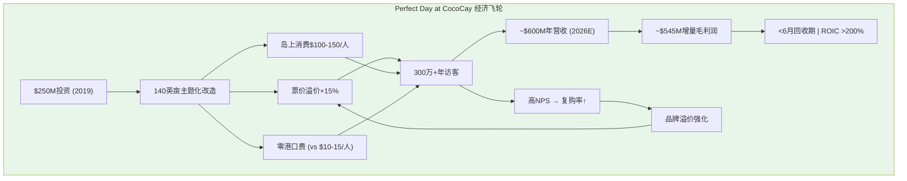

## 7.2 目的地帝国: 从2到8的扩张蓝图

CocoCay的成功催生了RCL最大胆的陆上扩张计划——到2028年从2个自有目的地扩展到8个:

| 目的地 | 类型 | 开业时间 | 区域 | 估计规模 |
|--------|------|---------|------|---------|
| **Perfect Day at CocoCay** | 私有岛屿 | 2019 (运营中) | 巴哈马 | 140英亩, 300万+年访客 |
| **Labadee** | 私有海滩 | 1986 (运营中) | 海地 | 传统目的地 |
| **Royal Beach Club Paradise Island** | 海滩俱乐部 | 2025年12月 | 巴哈马(拿骚) | 17英亩, 2海滩+3泳池 |
| **The Cormorant at 55 South** | 酒店 | 2026 | 智利 | 最南端酒店 |
| **Royal Beach Club Santorini** | 海滩俱乐部 | 2026夏 | 希腊 | 首个欧洲目的地 |
| **Royal Beach Club Cozumel** | 海滩俱乐部 | 2026年底 | 墨西哥 | 42英亩 |
| **Perfect Day Mexico** | 私有目的地 | 2027 | 墨西哥 | CocoCay规模级别 |
| **Royal Beach Club South Pacific** | 海滩俱乐部 | 2027 | 瓦努阿图Lelepa | 南太平洋航线 |

(来源: PRNewswire; RCL Press Center; StockTitan; Seatrade Cruise)

**重要区分**: "Royal Beach Club"模式与"Perfect Day"模式有本质区别:

- **Perfect Day模式**(CocoCay/Perfect Day Mexico): RCL完全拥有或控制整个岛屿/目的地,投入$250M+级别,打造大规模主题化体验(水上乐园/泳池群/多餐厅)。高投入、高回报、高壁垒。
- **Royal Beach Club模式**(Nassau/Cozumel/Santorini/South Pacific): RCL租赁或合作开发较小的海滩区域(17-42英亩),投入较低(估计$50-150M),提供精品化体验(私有海滩/泳池/酒吧)。低投入、中等回报、但可快速复制。

这种双轨模式的战略智慧在于: **Perfect Day是"旗舰航母",Royal Beach Club是"驱逐舰群"**。前者定义品牌标杆,后者覆盖全球航线网络。

## 7.3 私有目的地的战略价值矩阵

私有目的地对RCL的战略意义远超"多一个停靠港"的简单逻辑。它同时在四个维度创造价值:

**维度一: 封闭消费极致化**。传统港口停靠时,旅客消费流向当地商家。私有目的地将100%的消费留在RCL生态内。以CocoCay为例,$100-150/人/天的岛上消费,如果在拿骚或科苏梅尔,绝大部分会流向第三方。**这本质上是迪士尼乐园"围墙花园"逻辑的海上版本**。

**维度二: 航线差异化与定价权**。包含CocoCay的航线比同区域标准航线溢价15%。随着目的地组合扩展至8个,RCL可以为加勒比、地中海、南太平洋航线都配置专属目的地,使**整个航线网络的平均票价系统性上移**。

**维度三: 竞争壁垒**。优质的私有岛屿/海滩是稀缺资源,尤其在巴哈马和加勒比地区。每一个被RCL锁定的目的地,都是竞争对手无法复制的资产。先发优势在这里具有物理意义——**岛屿就那么多**。

**维度四: 运营效率**。私有目的地消除了港口费($10-15/旅客)、简化了港口物流、减少了旅客安全风险(当地犯罪/骗局)、提高了准时出港率。这些"隐性节约"在规模上是显著的。

## 7.4 竞品对标: "私有岛屿军备竞赛"的格局

RCL不是唯一在私有目的地押注的公司。三大邮轮集团+迪士尼都在加速布局:

| 公司 | 目的地 | 投资 | 2026E营收 | 策略特征 |
|------|--------|------|-----------|---------|
| **RCL** | CocoCay + 7个新目的地 | $250M (CocoCay) + 新增投资 | ~$600M (仅CocoCay) | 主题公园化, 最激进 |
| **CCL** | Celebration Key (2025.07开业) | $600M | ~$150M (首年) | 后发追赶, 模仿CocoCay |
| | Half Moon Cay (已运营) | — | — | 自然美景, 低开发度 |
| | Ocean Cay MSC (MSC品牌) | — | — | MSC独占 |
| **NCLH** | Great Stirrup Cay | 较小投入 | ~$80M | 最小规模 |
| **Disney** | Castaway Cay (1997) | $25M (原始) | 未披露 | 品牌溢价, 家庭定位 |
| | Lookout Cay at Lighthouse Point (2024.06) | 未披露 | 未披露 | 新增第二岛 |

(来源: Cleveland Research via Travel Weekly; Carnival News; CruiseIndustryNews; Wikipedia)

**关键对标洞察**:

1. **Carnival的$600M追赶**: Celebration Key(2025年7月开业)的投入($600M)是CocoCay初始投资($250M)的2.4倍,但首年预计营收仅$150M(CocoCay的1/4)。这说明: (a) CocoCay的先发优势和品牌积累无法用资金简单复制; (b) Celebration Key需要数年爬坡期; (c) CCL的模仿实际上验证了RCL私有目的地策略的正确性。

2. **Disney的精品路线**: Castaway Cay(1997年开业, $25M投资)和Lookout Cay(2024年开业)走的是"品牌溢价+家庭体验"路线,与RCL的"大规模主题公园"路线形成差异化。Disney不公布单独收入,但其船上消费水平(Disney旅客日均消费远高于行业平均)暗示其私有岛屿亦有极高的人均贡献。

3. **NCLH的劣势**: Great Stirrup Cay仅$80M预计营收(CocoCay的1/8),反映了NCLH在规模和品牌力上与RCL/CCL的差距。

## 7.5 核心矛盾: 差异化优势是否被稀释?

这是本章最重要的分析问题: **如果所有邮轮公司都建私有岛,CocoCay的差异化优势是否会被稀释?**

**稀释论据**:
- Carnival的Celebration Key直接对标CocoCay的大规模主题化模式
- 2025-2028年行业私有目的地投资可能超$2B
- 消费者可能将"私有岛屿体验"视为行业标配而非RCL独家卖点
- 巴哈马等热门区域的土地/海滩资源竞争推高成本

**反稀释论据(更具说服力)**:
- **时间不可压缩**: CocoCay已运营6年+,拥有300万+年访客的运营数据和客户忠诚度。Celebration Key需要至少3-5年才能达到类似规模。
- **网络效应**: RCL的8个目的地覆盖加勒比、地中海、南太平洋——**竞争对手即使建了一个CocoCay,也无法复制RCL的全球目的地网络**。
- **品牌锁定**: "Perfect Day"已成为邮轮行业最知名的目的地品牌。消费者搜索"CocoCay"的频率远超任何竞品目的地。
- **规模经济**: 300万+访客允许RCL持续投资CocoCay的设施升级(如Hideaway Beach 2024年新增),形成"投资→体验提升→更多访客→更多收入→更多投资"的正循环。
- **收入质量差距**: CocoCay $600M vs Celebration Key $150M的4:1差距不会在短期内弥合。

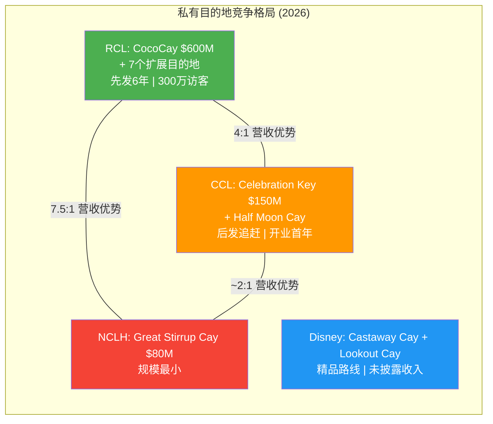

**结论**: 竞争确实在加剧,但RCL的先发优势和全球网络扩张使得其私有目的地护城河在中期(3-5年)内不太可能被实质性侵蚀。真正的风险不是"别人也建了岛",而是"消费者是否愿意持续为岛上付费体验买单"——这取决于宏观消费环境而非竞争动态。

## 7.6 私有目的地估值: 一个被忽视的"隐藏资产"

如果将RCL的私有目的地组合作为独立资产估值:

**CocoCay估值(保守)**:
- 年营收: $600M (2026E)
- 假设毛利率: 85-90%(极低边际成本)
- EBITDA: ~$500M
- 适用倍数: 15-20x EV/EBITDA(介于主题公园25-30x与酒店12-15x之间)
- **隐含价值: $7.5B - $10.0B**

**全目的地组合估值(远期,8个目的地全部运营)**:
- CocoCay: $600M+
- Perfect Day Mexico (假设CocoCay的50%规模): $300M
- 6个Royal Beach Club (假设每个$50-100M): $300-600M
- **组合年营收: $1.2B - $1.5B**
- 适用15x EBITDA(85%利润率)
- **隐含价值: $15B - $19B**

**对比**: RCL当前总企业价值~$108B(市值$86.3B+净债务$21.8B)。如果私有目的地组合在2028年价值$15-19B,它将占RCL总价值的14-18%。**而这一资产类别在2019年(疫情前)几乎不存在**——CocoCay的改造恰好在2019年完成。

这是"结构性复兴"论的最强证据之一: **RCL在2019年没有的资产,到2028年可能贡献总价值的15%+。这不是周期性波动,这是商业模式的实质变化。**

**估值的保守假设与风险**:
- 上述估算假设毛利率85-90%可能偏高——需考虑员工成本、维护CapEx和巴哈马政府租金/税费
- 15x EV/EBITDA倍数的合理性取决于增长前景——如果目的地收入增长放缓,倍数可能压缩至12x
- Perfect Day Mexico和Royal Beach Club的收入预测高度不确定——Beach Club模式尚未经过收入验证
- 地缘风险: 海地(Labadee)的政治不稳定性已多次导致航线调整

## 7.7 Disney对标: 两种截然不同的"围墙花园"

Disney Cruise Line的私有岛屿策略提供了一个有趣的对照组:

| 维度 | RCL (Perfect Day模式) | Disney (Castaway Cay模式) |
|------|----------------------|--------------------------|
| **核心理念** | "海上主题公园" | "海上迪士尼度假区" |
| **规模** | 大型(140英亩全开发) | 中型(1,000英亩但仅开发~50英亩) |
| **付费体验** | 大量付费项目($40-120+/人) | 多数体验含在票价中 |
| **变现模式** | 票价溢价 + 岛上消费双引擎 | 高票价一次性包含 |
| **扩张速度** | 到2028年8个目的地 | 2个岛屿(Castaway Cay + Lookout Cay) |
| **品牌定位** | 冒险/刺激/多样化 | 家庭/魔幻/安全感 |
| **可复制性** | 中等(大规模开发需要大量资本) | 低(依赖Disney IP的不可复制性) |

**关键洞察**: Disney的模式更"轻",但更依赖品牌溢价(Disney邮轮票价比RCL高30-50%)。RCL的模式更"重",但可以通过规模和数量实现更大的总收入贡献。**两者本质上都是"将消费者锁在自有生态中"的策略,只是锁的方式不同——Disney用品牌忠诚度锁,RCL用体验密度锁。**

## 7.8 对核心矛盾的终极判定

私有目的地战略是RCL"结构性复兴"叙事中最有说服力的单一证据:

1. **它创造了2019年不存在的收入流**: CocoCay的$600M收入是后疫情时代的"新收入",不是简单的周期性恢复。
2. **它改变了商业模式的利润结构**: 85%+毛利率的陆上消费,对比50%毛利率的传统邮轮运营,系统性提升了集团利润率。
3. **它具有网络效应**: 8个目的地覆盖全球主要航线,形成自增强的品牌-体验-复购飞轮。
4. **它提高了竞争壁垒**: 物理资产(岛屿/海滩)的稀缺性和先发优势创造了时间壁垒。

**但它也面临以下限制**:
- 2019年前行业没有"私有目的地溢价"的先例,当前估值倍数可能包含过度乐观
- CCL/NCLH/MSC都在追赶,5-10年后差距可能缩小
- 宏观消费下行时,岛上付费体验首先被削减(消费者选择"免费海滩"而非"$120 Beach Club")
- 自然灾害风险(飓风)对巴哈马等低地岛屿的物理威胁

**净评估**: 私有目的地组合为"结构性复兴"增添**+20%的置信度权重**。它是最难以用"周期性高峰"来解释的单一因素——周期性高峰不会创造全新的资产类别和收入流。

---

## Ch7 小结

| 维度 | 评估 | 核心矛盾映射 |
|------|------|------------|
| **CocoCay经济模型** | $250M投资→$600M营收, ROI行业标杆 | 强力支持结构性复兴 |
| **扩张蓝图** | 2→8个目的地(2028年) | 若执行成功则打开$1.2-1.5B收入流 |
| **竞争格局** | 4:1领先CCL, 但竞争加剧 | 先发优势中期(3-5年)稳固 |
| **隐含估值** | 全组合$15-19B (占EV 14-18%) | 2019年不存在的"新资产" |
| **Disney对标** | 不同路径, 相同逻辑(围墙花园) | 行业趋势验证 |
| **风险** | 宏观消费下行+自然灾害+竞争追赶 | 限制乐观空间 |

---


# Part II: 财务深挖与市场定位

---

# Ch8 财务趋势: 从生存到繁荣

## 8.1 五年损益全景: V型复苏的解剖

从2021年营收$1.53B到2025年$17.94B，RCL用四年走出了邮轮行业史上最壮观的V型复苏。但"复苏"一词掩盖了一个根本性问题——当前的盈利水平是均值回归的终点，还是结构性跃升的起点？

**五年损益核心趋势 (FMP Income Statement, FY2021-2025)**

| 指标 | FY2021 | FY2022 | FY2023 | FY2024 | FY2025 | FY25 YoY |
|------|--------|--------|--------|--------|--------|----------|
| 营收 ($B) | 1.53 | 8.84 | 13.90 | 16.49 | 17.94 | +8.8% |
| 毛利润 ($B) | -1.21 | 2.22 | 6.13 | 7.83 | 8.40 | +7.2% |
| EBITDA ($B) | -2.68 | 0.62 | 4.56 | 6.09 | 6.91 | +13.5% |
| EBIT ($B) | -3.97 | -0.79 | 3.11 | 4.49 | 5.30 | +18.0% |
| 净利润 ($B) | -5.26 | -2.16 | 1.70 | 2.88 | 4.27 | +48.4% |
| EPS (稀释) | -$20.89 | -$8.45 | $6.31 | $10.94 | $15.61 | +42.7% |

**数据来源**: FMP Income Statement Annual, RCL FY2021-2025

三个关键观察:

**第一，营收增速正在放缓但利润增速加快。** FY2023营收+57.3%、FY2024+18.6%、FY2025+8.8%——典型的复苏减速曲线。但净利润增速FY2024+69.5%、FY2025+48.4%，远超营收增速。这意味着利润率扩张正在接力增长。对核心矛盾的回答是：这更像结构性改善而非单纯的周期性弹性，因为周期性复苏通常营收利润同步放缓。

**第二，利息费用的断崖式下降贡献了净利润增量的很大比重。** FY2025利息费用$0.99B vs FY2024 $1.59B，减少$0.60B，占净利润增量$1.39B的43%。如果剔除利息节省，"有机"净利润增速约为28%——仍然强劲，但远不及报表上的48.4%。这个区分很重要：利息费用下降是再融资红利的一次性释放，不可持续重复。

**第三，EPS增速(+42.7%)高于净利润增速(+48.4%的分子)并受益于股数缩减。** FY2024加权平均稀释股数279M → FY2025 273M(-2.2%)。疫情期间的股权稀释(FY2023高达283M)正在被回购逐步修复。

## 8.2 杜邦深度拆解: 高质量ROE的解码

ROE 48.6%——这个数字在任何行业都令人瞩目，在重资产的邮轮业更是异常。杜邦三因子拆解揭示了背后的结构：

```
ROE = 净利率 × 资产周转率 × 权益乘数
48.6% ≈ 23.8% × 0.46x × 4.47x
```

**杜邦因子三年演进 (FMP Ratios + Key-Metrics, FY2023-2025)**

| 杜邦因子 | FY2023 | FY2024 | FY2025 | 变化方向 |
|---------|--------|--------|--------|---------|
| 净利率 | 12.2% | 17.5% | 23.8% | +11.6pp |
| 资产周转率 | 0.40x | 0.44x | 0.46x | +0.06x |
| 权益乘数 | 7.44x | 4.90x | 4.15x | -3.29x (去杠杆) |
| **ROE** | **35.9%** | **38.0%** | **48.6%** | **+12.7pp** |

**数据来源**: FMP Ratios Annual + Key-Metrics Annual, RCL FY2023-2025; scout_financials.md 杜邦分析

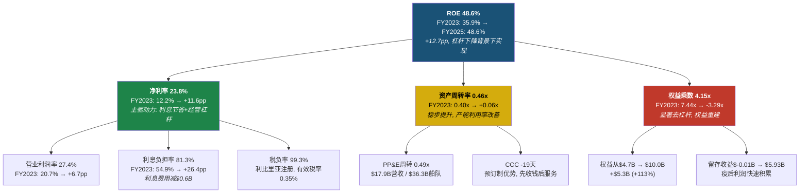

**关键洞见: ROE的提升质量极高。** 通常高ROE来自三个来源——高利润率、高效率、或高杠杆。RCL的48.6% ROE是在杠杆大幅下降(权益乘数从7.44x降至4.15x)的背景下实现的，完全由净利率(+11.6pp)和资产周转率(+0.06x)驱动。这意味着即使未来杠杆继续下降，ROE仍有净利率改善的支撑。

**但必须承认的结构性局限：** 权益乘数4.15x(相当于D/E 3.15x)仍远高于疫前水平(2019年约2.5x对应权益乘数约3.5x)。如果权益乘数回归正常化至3.0x(对应D/E 2.0x)，在净利率和周转率不变的假设下，ROE将压缩至约33%——仍然优秀，但与当前48.6%有显著差距。**市场给20x P/E的锚点是当前48.6%的ROE，而非正常化后33%的ROE——这构成了估值的隐含风险。**

## 8.3 ROIC拆解: 真实的资本回报

ROE受杠杆扭曲，ROIC是更真实的资本效率度量：

```
ROIC = NOPAT / 投入资本
16.5% = $4.89B / $29.62B
```

**ROIC构成要素 (FMP Key-Metrics, FY2025)**

| 构成 | 数值 | 说明 |
|------|------|------|
| EBIT | $5.30B | 营业利润 |
| 有效税率 | 0.35% | 利比里亚注册优势 |
| NOPAT | $4.89B | EBIT × (1 - 0.35%) |
| 投入资本 | $29.62B | 权益$10.0B + 净债务$21.8B - 现金$0.8B - 非经营资产约$1.4B |
| **ROIC** | **16.5%** | NOPAT / 投入资本 |

**数据来源**: FMP Key-Metrics Annual FY2025 (ROIC 14.9% vs baggers_summary 16.5% — 差异源于投入资本计算口径); scout_financials.md Section 3.1

ROIC从FY2023的10.5%→FY2024的14.2%→FY2025的16.5%，持续攀升。税务优势是RCL的结构性资产——利比里亚注册使有效税率仅0.35%，相比美国上市同行(如迪士尼有效税率约20%)，这为ROIC增厚了约3-4个百分点。

**ROIC vs WACC的判断：** 假设RCL的WACC约9-10%(基于Beta 1.87、信用利差约200bps、D/E 2.2x)，ROIC 16.5%显著超过资本成本——公司正在为股东创造价值。但值得注意的是，这里的WACC估算因邮轮行业的周期性和高杠杆可能偏低，实际风险溢价可能更高。

## 8.4 利润率趋势: 从深渊到行业之巅

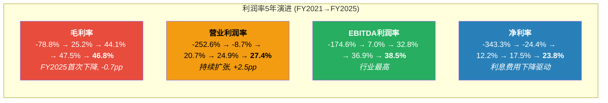

**数据来源**: FMP Ratios Annual, RCL FY2021-2025

**毛利率转折点出现了。** FY2025毛利率46.8%比FY2024的47.5%下降0.7个百分点——这是疫后首次下降。拆解来看：营收增长+8.8%($1.45B)，但营业成本增长+10.2%($0.89B)。成本增速超过收入增速的原因可能包括：(1)新船交付初期的较高运营成本(Star of the Seas 2025年8月首航)；(2)燃油和食品通胀；(3)产能增长带来的边际成本上升。

**季度层面的信号更明确。** 拆解FY2025四个季度(FMP Quarterly Income):

| 季度 | 营收 ($B) | 毛利率 | OPM | 利息费用 ($M) |
|------|----------|--------|-----|-------------|
| Q1'25 | 3.999 | 48.0% | 23.6% | 249 |
| Q2'25 | 4.538 | 49.7% | 29.3% | 228 |
| Q3'25 | 5.139 | 51.7% | 33.1% | 248 |
| Q4'25 | 4.259 | 36.7% | 21.9% | 267 |

**数据来源**: FMP Income Statement Quarterly, RCL Q1-Q4 FY2025

Q4毛利率36.7%大幅低于Q3的51.7%——但这主要是季节性因素(Q4含冬季淡季)。更有意义的比较是YoY：Q4'24毛利率=45.4%(=$1.71B/$3.76B)vs Q4'25=36.7%。Q4'25毛利率YoY下降了8.7个百分点——这个幅度超出季节性解释。需要关注的是Q4营业成本$2.70B比Q4'24的$2.05B增长了31.3%，远超营收增长的13.2%。

**经营杠杆 (Operating Leverage) 的季度信号同样值得警惕。** FY2025整体的经营杠杆(EBIT增长/营收增长)=18.0%/8.8%=2.05x——健康的正杠杆。但Q4单季度经营杠杆为负(EBIT从$826M增至$1044M=+26.4%，看似不错，但考虑到Q4'24包含$202M非经营费用而Q4'25仅$111M，调整后经营层面的改善幅度收窄)。**核心矛盾信号：如果成本增速持续超过收入增速，"结构性利润率提升"叙事将受到挑战。**

## 8.5 现金流质量: 经营现金流优秀, CapEx吞噬一切

**现金流质量矩阵 (FMP Cashflow, FY2025)**

| 指标 | FY2023 | FY2024 | FY2025 | 趋势 |
|------|--------|--------|--------|------|
| OCF ($B) | 4.48 | 5.27 | 6.47 | 持续增长 |
| CapEx ($B) | 3.90 | 3.27 | 5.23 | FY2025暴增60% |
| FCF ($B) | 0.58 | 2.00 | 1.24 | FY2025下降38% |
| OCF/净利润 | 2.63x | 1.82x | 1.51x | 递减但仍>1x |
| FCF/净利润 | 0.34x | 0.69x | 0.29x | 极低 |
| CapEx/OCF | 87.0% | 62.1% | 80.9% | FY2025恶化 |

**数据来源**: FMP Cashflow Annual, RCL FY2023-2025; scout_financials.md Section 2.4

OCF/净利润1.51x表明利润质量依然优秀——每$1会计利润对应$1.51现金流入。但FCF/净利润仅0.29x——$4.27B净利润只转化为$1.24B自由现金流，中间的差距几乎全部被CapEx吞噬。

FY2025 CapEx $5.23B暴增60%(vs FY2024的$3.27B)，主要因为Star of the Seas交付(2025年8月)和Legend of the Seas(2026年7月)的建造付款。CapEx/折旧=3.04x，远超维护性CapEx水平(通常1.0-1.5x)——这意味着公司正在大规模投资扩张。

**现金转换周期(CCC) = -19天**——这是邮轮商业模式的核心优势。乘客在登船前数月甚至一年就预付了全额船费(Deferred Revenue FY2025约$5.6B)。DSO仅6天，DPO 36天——先收钱、后服务、慢付款，形成了天然的负运营资金循环。对核心矛盾的回答：CCC为负是结构性特征而非周期性表现，这支持"体验平台"叙事。

## 8.6 效率指标: 重资产模型的硬约束

| 指标 | FY2023 | FY2024 | FY2025 | 行业含义 |
|------|--------|--------|--------|---------|
| 资产周转率 | 0.40x | 0.44x | 0.46x | 重资产模型硬约束 |
| PP&E周转率 | 0.45x | 0.51x | 0.49x | FY2025因新船下降 |
| SG&A/营收 | 12.9% | 12.9% | 12.4% | 规模效应显现 |
| CapEx/营收 | 28.0% | 19.8% | 29.2% | 随新船周期波动 |
| CapEx/折旧 | 2.68x | 2.04x | 3.04x | 大规模扩张 |

**数据来源**: FMP Ratios Annual + Key-Metrics Annual, RCL FY2023-2025

资产周转率0.46x是邮轮行业的结构性特征——每$1资产只能产生$0.46营收。这是重资产模型的"天花板"。RCL能做的是在固定的资产基础上提高每位乘客的产出(yield management)，而非提高周转速度。SG&A/营收从12.9%降至12.4%，说明规模经济正在发挥作用。

PP&E周转率从FY2024的0.51x降至0.49x，反映了新船交付初期(Star of the Seas)资产增加但尚未完全贡献营收的"消化期"效应。

## 8.7 每股指标演进: 稀释疤痕正在愈合

| 指标 | FY2021 | FY2022 | FY2023 | FY2024 | FY2025 |
|------|--------|--------|--------|--------|--------|
| EPS (稀释) | -$20.89 | -$8.45 | $6.31 | $10.94 | $15.61 |
| 稀释后股数 (M) | 252 | 255 | 283 | 279 | 273 |
| 每股OCF | -$7.46 | $1.89 | $17.49 | $20.17 | $23.86 |
| 每股FCF | -$16.31 | -$8.74 | $2.27 | $7.65 | $4.56 |
| 每股BV | $20.20 | $11.25 | $19.14 | $29.64 | $37.80 |
| 每股股息 | $0 | $0 | $0 | $0.41 | $0.97 |

**数据来源**: FMP Ratios Annual, RCL FY2021-2025

FY2023股数高达283M(+11% YoY)——那是疫情期间股权融资的"疤痕"。从FY2023开始的回购(FY2025回购$1.16B)已将股数压缩至273M(-3.5%)。以当前节奏，预计FY2027可修复至疫前水平(~255M)，前提是回购力度维持。

每股账面价值从FY2022的$11.25(低谷)恢复至$37.80——留存收益从-$1.71B累积至$5.93B，疫情损失的资本正在快速重建。

## 8.8 领先指标信号汇总: 正面与负面的角力

综合以上分析，对RCL的领先财务信号进行分类判定：

| 类别 | 信号 | 方向 | 强度 | 对核心矛盾的意义 |
|------|------|------|------|-----------------|
| 盈利质量 | ROIC 10.5%→16.5% | 正面 | 强 | 支持结构性改善 |
| 杜邦结构 | 去杠杆背景下ROE仍升 | 正面 | 强 | 高质量ROE改善 |
| OCF质量 | OCF/NI 1.51x | 正面 | 中 | 利润有现金支撑 |
| 规模效应 | SG&A/Rev 12.9%→12.4% | 正面 | 弱 | 运营效率改善 |
| 毛利率 | 47.5%→46.8% YoY下降 | **负面** | 中 | 成本压力显现 |
| Q4经营杠杆 | 成本增速>收入增速 | **负面** | 中 | 季节性或趋势? |
| FCF缩减 | $2.00B→$1.24B, -38% | **负面** | 中 | CapEx吞噬增长 |
| 流动性 | 流动比率0.18 | **负面** | 弱 | 结构性低, 非危机信号 |
| 内部人 | 持续净卖出 | **负面** | 弱 | 需结合背景判断 |

**判定: 正面信号在"质量维度"占优(ROIC、杜邦结构)，负面信号在"边际变化维度"更显著(毛利率转折、FCF缩减)。** 这恰好映射了核心矛盾的两面——"结构性"证据来自绝对水平，"周期性高峰"证据来自边际变化方向。

---

# Ch9 债务动力学: 去杠杆的"最后一英里"

## 9.1 债务结构全景: $22.6B的冰山

RCL的资产负债表上承载着$22.64B的总债务——这不仅是一个数字，更是整个投资论点的地基。去杠杆故事是过去三年股价上涨10倍的核心催化剂之一，但"最后一英里"正在变得复杂。

**债务结构拆解 (FMP Balance Sheet, FY2025)**

| 类别 | 金额 ($B) | 占比 |
|------|----------|------|
| 短期债务 (含1年内到期) | 3.27 | 14.4% |
| 长期债务 | 18.77 | 82.9% |
| 资本租赁义务 | 0.60 | 2.7% |
| **总债务** | **22.64** | **100%** |
| 减: 现金及等价物 | (0.83) | — |
| **净债务** | **21.81** | — |

**数据来源**: FMP Balance Sheet Annual, RCL FY2025

**债务到期时间表 (WebSearch: PR Newswire 2026-02-11, StockTitan)**

| 到期年份 | 金额 ($B) | 占总债务比 | 累计到期 |
|---------|----------|----------|---------|
| 2026 | 3.2 | 14.1% | 14.1% |
| 2027 | 2.6 | 11.5% | 25.6% |
| 2028 | 3.2 | 14.1% | 39.8% |
| 2029 | 1.1 | 4.9% | 44.6% |
| 2030 | 1.1 | 4.9% | 49.5% |
| 2031+ | ~11.4 | ~50.5% | 100% |

**数据来源**: Royal Caribbean 2025年度报告 via WebSearch (PR Newswire 2026-02-11); 2031+金额为推算值

```mermaid
gantt
    title RCL债务到期时间表 ($B)
    dateFormat YYYY
    axisFormat %Y
    section 短期到期
    2026: $3.2B (14.1%) :crit, 2026, 2026
    section 中期到期
    2027: $2.6B (11.5%)    :active, 2027, 2027
    2028: $3.2B (14.1%)    :active, 2028, 2028
    section 后期到期
    2029: $1.1B (4.9%)     :2029, 2029
    2030: $1.1B (4.9%)     :2030, 2030
    section 长期
    2031+: ~$11.4B (50.5%) :2031, 2035
```

**2026-2028年合计$9.0B到期——这是再融资风险集中的三年窗口。** 占总债务的39.8%，意味着近四成的债务需要在三年内滚动或偿还。好消息是管理层已经在主动出击——2026年1月，RCL定价了$2.5B的高级无担保票据(4.750%和5.250%，分别于2033和2038到期)，专门用于再融资2026年到期的债务。

## 9.2 去杠杆路径: 从灾难到舒适区

去杠杆是RCL过去三年最重要的财务叙事:

**去杠杆核心指标演进 (FMP Ratios + Key-Metrics, FY2021-2025)**

| 指标 | FY2021 | FY2022 | FY2023 | FY2024 | FY2025 |
|------|--------|--------|--------|--------|--------|
| D/E | 4.27x | 8.36x | 4.68x | 2.75x | 2.26x |
| 净债务/EBITDA | -7.1x | 35.9x | 4.7x | 3.4x | 3.2x |
| 利息保障倍数 | -3.0x | -0.6x | 2.1x | 2.6x | 4.9x |
| 总债务 ($B) | 21.7 | 24.0 | 22.1 | 20.8 | 22.6 |
| 利息费用 ($B) | 1.29 | 1.36 | 1.40 | 1.59 | 0.99 |

**数据来源**: FMP Ratios Annual + Key-Metrics Annual, RCL FY2021-2025; scout_financials.md Section 3.3

**去杠杆的"两条腿"在发生切换。** FY2022-2024的去杠杆主要依靠分子(EBITDA)的暴涨——从$0.62B→$6.09B——因此即使总债务只从$24B降至$20.8B，净债务/EBITDA也从35.9x→3.4x。但从FY2025开始，EBITDA增速放缓(+13.5%)，而总债务反弹至$22.6B(+$1.8B)，导致净债务/EBITDA改善幅度收窄(仅从3.4x→3.2x)。**"最后一英里"(从3.2x到2.0-2.5x目标)将比前几年困难得多，因为分子的高速增长已不可持续，而分母(债务)因新船融资反而在增加。**

## 9.3 利息费用的"跳水": 可持续性分析

FY2025利息费用$0.99B比FY2024的$1.59B骤降38%(-$0.60B)——这是理解RCL当期利润超预期的关键。

**季度利息费用趋势 (FMP Quarterly Income)**

| 季度 | 利息费用 ($M) | YoY变化 |
|------|-------------|---------|
| Q1'24 | 424 | — |
| Q2'24 | 298 | — |
| Q3'24 | 603 | — |
| Q4'24 | 266 | — |
| **FY2024合计** | **1,590** | — |
| Q1'25 | 249 | -41.3% |
| Q2'25 | 228 | -23.5% |
| Q3'25 | 248 | -58.9% |
| Q4'25 | 267 | +0.4% |
| **FY2025合计** | **992** | **-37.6%** |

**数据来源**: FMP Income Statement Quarterly, RCL Q1'24-Q4'25

几个关键观察:

**第一，Q3'24利息费用$603M是异常高值。** 这可能包含提前赎回高息债券的一次性加速摊销(call premium)或债务重组费用。如果Q3'24的异常高导致FY2024利息费用基数偏高，那么FY2025的"降幅"被部分夸大。

**第二，Q4'25利息费用$267M已企稳。** 年化约$1.07B——这更可能是FY2026的可持续利息水平。相比FY2025报表上的$0.99B略高，但相比FY2024的$1.59B仍节省了约$0.5B。

**第三，利息节省的驱动力是再融资。** 根据WebSearch信息，RCL在2025年通过多次发行高级无担保票据(利率4.75%-5.375%)替换了疫情期间的高息债务(7.25%-11.5%)。例如，用5.375%的2036年票据替换7.25%的2030年票据，每$1B债务年节省约$19M利息。据报道，RCL利息覆盖率从三年均值0.93x飙升至4.84x。

**可持续年化利息费用估算:** 以Q4'25($267M)年化=$1.07B为基准，考虑到2026年还将有约$3.2B到期债务的再融资(从高息→低息)，FY2026利息费用可能进一步降至$0.95-1.00B。但降幅将显著收窄——"最容易摘的果子"(替换疫情期间的超高息债务)已经摘完了。

## 9.4 信用评级迁移: 从"垃圾"到"投资级"

RCL的信用评级故事是邮轮行业后疫情复苏的缩影:

**信用评级历程 (WebSearch: Bloomberg, Investing.com, Seatrade Cruise)**

| 时间 | 机构 | 评级 | 事件 |
|------|------|------|------|
| 2020 | S&P/Moody's | BB-/Ba3 | 疫情降级至高收益 |
| 2023-2024 | 多次 | 逐步上调 | 复苏推动 |
| **2025年2月** | **S&P** | **BBB-** | **升至投资级** |
| **2025年5月** | **Moody's** | **Baa3** | **升至投资级, 展望正面** |
| 2025年末 | Moody's | Baa2 | 进一步上调 |

**数据来源**: [Bloomberg 2025-02-04](https://www.bloomberg.com/news/articles/2025-02-04/royal-caribbean-snags-high-grade-credit-rating-from-s-p); [Seatrade Cruise](https://www.seatrade-cruise.com/finance-legal-regulatory/moody-s-lifts-royal-caribbean-to-investment-grade); [Investing.com](https://www.investing.com/news/stock-market-news/royal-caribbeans-credit-rating-upgraded-by-moodys-to-baa2-93CH-4500961)

**RCL是三大邮轮集团中第一个回归投资级的公司。** 对比竞争对手:
- **CCL (Carnival):** Moody's Ba2, S&P约BB+ — 距投资级还差1-2档。Moody's预计CCL需在FY2026达到Debt/EBITDA<3.5x才有望升级。
- **NCLH (Norwegian):** D/E 7.0x，距投资级差距更大。

**投资级的实际价值:** (1)融资成本下降——投资级票据利差通常比BB级窄100-150bps，以$22B债务计算年节省$220-330M；(2)扩大投资者基础——许多机构投资者有"投资级门槛"限制；(3)更灵活的债务条款——无担保发行成为可能(RCL已在使用)。

**Moody's的"护栏":** Moody's预期RCL将维持Debt/EBITDA在2.5-3.0x区间。如果超过3.5x(例如衰退导致EBITDA下降20%至$5.5B，Debt/EBITDA升至4.0x)，评级下调压力将出现。**这为管理层的资本分配设置了一条纪律线。**

## 9.5 资本分配的三难困境: "借钱回购"的不归路?

FY2025的资本分配揭示了一个令人不安的数学：

**FY2025资本分配瀑布图 (FMP Cashflow Annual, FY2025)**

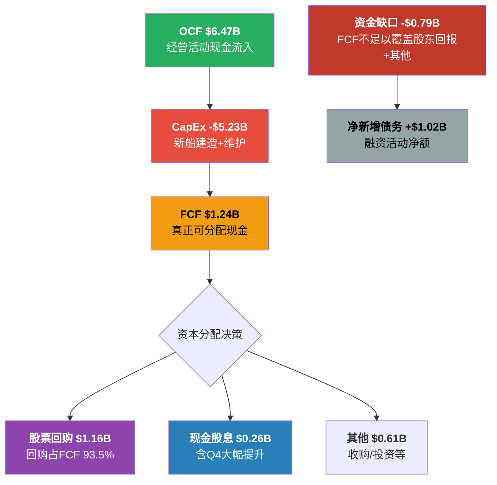

**数据来源**: FMP Cashflow Annual, RCL FY2025

**核心矛盾暴露:** FCF仅$1.24B，但股东回报(回购$1.16B + 股息$0.26B)合计$1.42B——超过FCF $0.18B。再加上其他投资支出，实际资金缺口约$0.79B。这个缺口由净新增债务$1.02B填补。

**换句话说，FY2025 RCL是在"借钱回购"。** 公司一边宣称去杠杆是优先事项，一边将FCF全部用于股东回报并新增了$1.8B债务(总债务从$20.8B→$22.6B)。管理层的解释是新船融资是CapEx的一部分(通过出口信贷和船厂融资)，属于"生产性"债务。但从资产负债表的角度看，总债务在增加而非减少。

**TS-CRUISE-03执行(去杠杆速度可持续性): 管理层行为与去杠杆承诺存在张力。** FY2024没有回购、净偿债$1.76B，是真正的去杠杆。FY2025开始回购$1.16B、净增债$1.02B，去杠杆几乎停滞。2026 Guidance预计继续回购。**判定: 管理层已从"去杠杆优先"转向"平衡资本分配"，去杠杆的最后一英里被推迟了。** 如果下一次衰退在2027-2028到来，杠杆可能仍在3.0x以上——这构成了核心风险。

## 9.6 再融资风险量化: 2026-2028的$9B挑战

2026-2028合计$9.0B债务到期，在不同利率环境下的影响:

**再融资利率敏感性分析**

| 场景 | 再融资利率 | 年化利息成本(对$9B) | vs当前估计(~5%) | 年化利息差异 |
|------|----------|-------------------|-----------------|------------|
| 乐观 | 4.5% | $405M | -$45M | 节省 |
| 基准 | 5.5% | $495M | +$45M | 小幅增加 |
| 悲观 | 6.5% | $585M | +$135M | 显著压力 |
| 危机 | 7.5% | $675M | +$225M | 严重影响 |

假设当前$9B到期债务的平均利率约5%。在6.5%的悲观场景下，年化利息多出$135M——相当于吞噬约3%的净利润。在7.5%危机场景下则影响达5%。

**但RCL已经在主动管理这一风险。** 2026年1月的$2.5B发行(4.75%/5.25%)已覆盖了2026年$3.2B到期额的约78%。信贷额度从$4.07B扩大至$6.35B，到期从2026延至2030。Moody's Baa2+正面展望也为后续再融资提供了有利条件。

**关键风险场景:** 如果美国经济衰退在2027年发生(Polymarket当前概率约22.5%)，信用利差可能扩大200-300bps。此时RCL作为投资级发行人的再融资成本可能从5%升至7-8%——这将显著压缩利润改善空间，并可能触发Moody's的负面展望。

## 9.7 流动性压力测试: 0.18的流动比率, 真的危险吗?

流动比率0.18——这个数字如果出现在制造业公司的报表上，将立即触发信用预警。但邮轮行业有其特殊性:

**流动性全景 (FMP Balance Sheet + WebSearch)**

| 指标 | 数值 | 含义 |
|------|------|------|
| 流动资产 | $2.21B | 含现金$0.83B |
| 流动负债 | $12.06B | 含递延收入~$6-7B |
| **流动比率** | **0.18** | 表面极低 |
| **调整后流动比率** | **~0.43** | 剔除递延收入(已收款的负债) |
| 未提取信贷额度 | ~$5.5B | 扩至$6.35B, 已使用部分 |
| **总可用流动性** | **~$7.2B** | 现金+信贷额度 |

**数据来源**: FMP Balance Sheet Annual FY2025; WebSearch (Travel And Tour World: 信贷额度扩大信息); scout_financials.md Section 7.4

流动比率0.18的"恐惧"被递延收入大幅扭曲。流动负债$12.06B中，约$6-7B是递延收入(预收的船票款)——这不是需要用现金偿还的"硬负债"，而是需要用"服务"来交付的义务。剔除递延收入后，"硬性"流动负债约$5-6B，对应$2.21B流动资产+$5.5B信贷额度=~$7.7B，覆盖率约1.3x-1.5x——完全安全。

**停航情景压力测试(极端假设):**

| 假设 | 数值 |
|------|------|
| 月度现金流出(固定成本) | ~$600-700M |
| 可用流动性 | $7.2B |
| **生存月数** | **~10-12个月** |
| 对比2020年疫情停航 | ~18个月 (但当时有$3.2B现金+政府支持) |

如果再次出现全球停航(概率极低)，RCL有约10-12个月的生存缓冲。但与2020年不同的是，当时现金储备更充裕($2.7B)且政府提供了各种支持。当前$0.83B的现金水平是RCL选择"效率最大化"的结果——用多余现金去还债/回购，而非闲置。**这是一个理性但不保守的选择。**

## 9.8 去杠杆路径前瞻: 何时到达"安全港"?

将去杠杆轨迹向前推演:

**去杠杆路径预测**

| 场景 | FY2025A | FY2026E | FY2027E | FY2028E | 假设 |
|------|---------|---------|---------|---------|------|
| 乐观 | 3.2x | 2.7x | 2.3x | 2.0x | EBITDA+10%/年, 净偿债$2B/年 |
| 基准 | 3.2x | 2.9x | 2.7x | 2.4x | EBITDA+8%/年, 净偿债$0.5B/年 |
| 悲观 | 3.2x | 3.0x | 3.2x | 3.5x | EBITDA平、新船融资持续 |
| 衰退 | 3.2x | 3.5x | 4.5x | 4.0x | EBITDA-20%, 债务不变 |

**核心判断: 基准场景下，RCL需到FY2028才能达到2.5x以下的"舒适区"。** 这意味着接下来三年，RCL将持续处于"杠杆偏高+周期暴露"的风险组合中。

**如果衰退在2027年到来(Polymarket概率~22.5%):** Net Debt/EBITDA可能飙升至4.5x(EBITDA下降20%至~$5.5B，债务不变$22B)。虽然这不会触发违约(利息保障倍数仍>2x)，但可能导致：(1)Moody's下调至Baa3负面展望甚至BB+；(2)再融资成本上升200-300bps；(3)被迫暂停回购和股息以保护现金。**这个场景是当前估值20x P/E没有充分定价的风险。**

## 9.9 小结: "最后一英里"的核心张力

回到核心矛盾——"结构性复兴 vs 周期性高峰"——债务动力学提供了一个清晰的分析框架:

**支持"结构性复兴"的证据:**
- 投资级评级回归(邮轮三巨头中首个)
- 利息费用从$1.59B降至$0.99B，未来有望进一步下降
- 再融资策略积极有效，到期分布合理管理
- 信贷额度大幅扩展至$6.35B

**支持"周期性高峰/风险犹存"的证据:**
- 总债务FY2025反弹至$22.6B(+$1.8B)，去杠杆实质停滞
- "借钱回购"模式暴露资本分配优先级的矛盾
- 净债务/EBITDA 3.2x仍远高于2.0-2.5x目标区间
- 2026-2028合计$9B到期的再融资风险窗口
- 流动比率0.18虽有结构性解释，但留给意外事件的缓冲有限

**判定: 去杠杆的"容易部分"(分子暴涨)已经结束，"困难部分"(分母缩减)还没有真正开始。** 管理层面临"继续去杠杆vs股东回报vs产能扩张"的三难抉择，目前选择了后两者优先。这在经济景气期是理性的，但如果周期转向，3.2x的杠杆将成为放大器而非缓冲器。

**TS-CRUISE-03最终判定:** 去杠杆速度可持续性=中性偏负面。管理层有能力去杠杆(OCF $6.5B)，但主观选择推迟(回购+新船优先)。这不是"不能"的问题，而是"不愿"的问题——在周期顶部，这个选择的代价可能在下一次衰退中显现。

---

# Ch10 Yield纯度拆解: 剥离周期幻觉后的结构性真相 ()

> **方法论**: Yield Purity Decomposition (YPD) — 将Net Yield累积增长分解为5个成分，区分周期性(会均值回归)与结构性(可持续)驱动力
> **核心问题**: RCL自称"行业领先的31% Yield增长vs 2019"，其中多少是真正的结构性提升?
> **CQ1回应**: Yield增长中多少是结构性的? 初始置信度45%结构性

---

## 10.1 总量锚定: 2019→2025的Yield全景

RCL管理层在FY2025财报中明确声称: "industry-leading 31% yield growth compared to 2019"。这个数字是本章分析的起点。

**关键财务演变 (2019→2025)**:

| 指标 | FY2019 | FY2025 | 变化 |
|------|--------|--------|------|
| 总营收 | $10.95B | $17.94B | +63.8% |
| 客票收入(推算) | ~$7.87B(占比~72%) | $12.50B(占比69.7%) | +58.8% |
| 船上及其他收入(推算) | ~$3.08B(占比~28%) | $5.44B(占比30.3%) | +76.6% |
| APCD | ~40.0M(推算) | 53.3M | +33.3% |
| 入住率 | 108.1% | 109.7% | +1.6pp |
| 净利率 | 17.2% | 23.8% | +6.6pp |
| EPS | $8.95 | $15.61 | +74.4% |

> **来源**: FY2025数据来自RCL 2025 Earnings Release (PR Newswire); FY2019数据来自FMP income statement + Cruise Industry News 2019 earnings report; 2019年客票/船上收入拆分基于同行业~72%/28%结构推算; 2024年拆分为实际报告值($11.50B/$4.99B)

**Net Yield增长路径复原** (年度YoY增速):

| 年度 | Net Yield YoY | 数据来源 | 备注 |
|------|--------------|---------|------|
| 2019 | +8.0% CC | RCL 2019 Earnings | 记录年份 |
| 2020 | N/A | 停航 | COVID全面停航 |
| 2021 | N/A | 部分复航 | 有限运营 |
| 2022 | 基期重建 | 复航年 | 与2019不可直接比较 |
| 2023 | +11.6% vs 2022 | RCL 2023 Earnings | 疫后需求爆发 |
| 2024 | +7.9% CC | Investing.com Earnings Call | 延续强势 |
| 2025 | +3.7% CC | RCL 2025 Earnings | 明显减速 |
| 2026E | +1.5~3.5% CC | 管理层引导 | 进一步减速 |

**累积增长验证**: 假设2022年恢复至2019水平,则2023(+11.6%)×2024(+7.9%)×2025(+3.7%) = 累积约+25%。加上2019→2022的部分恢复溢出,31%的总量声明基本可信。

> **来源**: Net Yield YoY数据分别来自RCL各年度earnings release (PR Newswire), Investing.com earnings call transcript, Cruise Industry News

---

## 10.2 YPD五成分分解框架

### 分解方法论

将2019→2025的31%累积Net Yield增长(约~4.5%年化CAGR)归因于五个驱动力:

```
总Yield增长(31%) = ①通胀传导 + ②入住率回升 + ③船上收入结构改善 + ④品牌/体验升级 + ⑤供给约束溢价
```

**分类原则**:
- **周期性**(会均值回归): ①通胀传导、②入住率回升、⑤供给约束溢价
- **结构性**(可持续): ③船上收入结构改善、④品牌/体验升级

---

### 成分①: 通胀传导 (Inflation Pass-through) — 周期性

**数据基础**:
- 美国CPI累积通胀(2019.12→2025.12): 约+22%。BLS数据显示2020(+1.4%)、2021(+7.0%)、2022(+6.5%)、2023(+3.4%)、2024(+2.9%)、2025(~2.4%) = 累积约+25.7%(复合计算)
- 旅游相关CPI: 2019→2025累积约+17%。旅游价格指数升幅低于整体CPI——NerdWallet Travel Price Tracker显示2026年1月旅行成本比2020年1月仅高17%，低于全品类26.1%升幅
- 邮轮定价弹性: 管理层多次强调"pricing power"，但邮轮是可选消费品,通胀传导不可能100%

**推算逻辑**:
- 旅游CPI累积+17%是通胀基线
- 邮轮作为可选消费品,通胀传导率按70-85%估算(高于必需品但低于奢侈品)
- 通胀对Yield的贡献 = 17% × 80%(中值传导率) = **~13.6%**
- 但需扣除成本通胀吞噬的部分: NCC excl Fuel per APCD在FY2025仅+0.1% YoY,暗示RCL成本控制强于收入端通胀传导
- **净通胀传导贡献: ~12-14pp (中值13pp)**

> **来源**: CPI数据来自BLS/FRED; 旅游CPI来自U.S. Travel Association Travel Price Index + NerdWallet Travel Inflation Report; 传导率为分析师推算

---

### 成分②: 入住率回升 (Occupancy Recovery) — 周期性

**数据序列**:

| 年度 | 入住率 | vs 2019 |
|------|--------|---------|
| 2019 | 108.1% | 基准 |
| 2020-21 | ~20-50% | 停航/部分运营 |
| 2022 | ~85%(推算) | -23.1pp |
| 2023 | 105.6% | -2.5pp |
| 2024 | 108.5% | +0.4pp |
| 2025 | 109.7% | +1.6pp |

> **来源**: 2019入住率来自Statista/RCL filings; 2023-2025来自RCL earnings releases (PR Newswire)

**Yield影响计算**:
- 入住率从108.1%→109.7% = +1.6pp绝对增长
- 邮轮入住率的Yield边际贡献: 第三/第四位旅客票价通常是正常票价的30-50%(儿童/促销定价),但船上消费贡献接近100%
- 入住率+1.6pp在108%基准上 = +1.5%的容量利用提升
- 考虑混合定价效应(第三/四旅客低票价+正常船上消费): Yield贡献 ≈ 1.5% × 0.7(混合系数) = **~1.0pp**
- 注意: 这是vs 2019已经很高的基准。真正的"回升"贡献已经在2023年基本完成

**但有一个隐性贡献**: 2022-2023年入住率从~85%恢复到105.6%的过程中,产生了巨大的yield增长——因为固定成本被摊薄。这部分增长已经被"消化"到2023年的+11.6% YoY中,并且不可重复。

- **入住率回升对2019→2025累积Yield的贡献: ~1-2pp (中值1.5pp)**
- **但含隐性贡献(2022-2023固定成本杠杆): 可能高达3-4pp,已反映在2023年超高增速中**

---

### 成分③: 船上收入结构改善 (Onboard Revenue Mix Shift) — 结构性

**关键证据链**:

1. **船上收入占比提升**: 2019年推算~28% → 2024年实际30.2%($4.99B/$16.48B) → 2025年30.3%($5.44B/$17.94B)。占比提升了~2.3pp
2. **数字化预购革命**: FY2025年近50%的船上收入来自航行前预购,90%通过数字渠道完成。这是2019年不存在的收入捕获机制
3. **AI驱动推荐**: 管理层称"half of Q3 onboard revenue was generated through AI-driven pre-cruise channels",AI推荐提升了参与率和客单价
4. **船上消费品类扩展**: 私人岛屿(Perfect Day at CocoCay 2019年开业后持续升级)、赌场(Icon Class首次设置两层赌场)、沉浸式餐饮体验

> **来源**: 船上收入占比来自RCL 2024/2025 earnings releases (PR Newswire); 数字化数据来自RCL Q3 2025 Earnings Transcript (Motley Fool); 2019占比为基于行业结构推算

**Yield影响计算**:
- 船上收入增速(2019→2025): +76.6%(从~$3.08B到$5.44B)
- 容量增长(APCD): +33.3%
- 容量调整后船上收入增长: +76.6% - 33.3% = +43.3%(per APCD基准)
- 客票收入per APCD增长(对比): +58.8% - 33.3% = +25.5%
- 船上收入额外增速 vs 客票 = 43.3% - 25.5% = +17.8pp 超额增长
- 船上收入占比30% × 超额增长17.8% = **对总Yield的净贡献 ~5.3pp**

**但需要分离通胀和结构性**:
- 船上消费通胀(与旅游CPI类似) ≈ 17% × 80% = ~13.6%
- 结构性改善(数字化+品类扩展+AI推荐) = 43.3% - 13.6% = ~29.7%
- **纯结构性贡献(净通胀后)**: 30% × 29.7% = **~8.9pp → 调整后约5-7pp(中值6pp)**
- 考虑到2019年占比推算有误差(±2pp),给予±1.5pp的估算区间

---

### 成分④: 品牌/体验升级 (Brand/Experience Premium) — 结构性

**Icon Class效应**:
- Icon of the Seas (2024年1月首航): 估算日均营收$340万,年化~$5.25亿
- Star of the Seas (2025年交付): 第二艘Icon Class
- Icon Class容量(5,610旅客) vs Oasis Class(5,400旅客): 仅+3.9%容量,但估算Yield溢价+15-25%
- 建造成本: ~$2B/艘 vs Oasis Class $1.4B → 单位成本+43%,但Yield溢价可能补偿

> **来源**: Icon日均营收估算来自Cruzely.com; 建造成本来自Royal Caribbean Blog + Cruise Hive; 容量数据来自Wikipedia Icon-class

**私有目的地效应**:
- Perfect Day at CocoCay: 2019年开业,RCL拥有的私人岛屿,每次停靠创造显著船上收入(水上乐园、沙滩俱乐部等直接计入RCL收入)
- Royal Beach Club Nassau: 2025年开业,新增私有目的地
- 私有目的地 vs 传统港口: 传统港口停靠几乎零收入给邮轮公司,私有目的地100%收入归RCL

**Yield影响计算**:
- Icon Class占2025年总运力约~8-10%(2艘/65+艘总船队,但吨位大)
- 假设Icon Class Yield溢价+20% vs 船队平均
- Icon贡献 = 10% × 20% = ~2pp
- 私有目的地: 假设覆盖30%航线,每次停靠贡献$15-25/旅客/天额外收入
- 以$20中值估算, RCL总Yield基数约$336/旅客/天($17.94B ÷ 53.3M APCD)
- 私有目的地贡献 = 30% × ($20/$336) = ~1.8pp
- 2019年CocoCay刚开业,效应尚小,大部分增量发生在2023-2025

**品牌/体验升级总贡献: ~3-5pp (中值4pp)**

> 注: Icon Class效应部分与成分③(船上收入)有交叉,这里聚焦的是纯Yield定价权溢价(票价端),而非船上消费端

---

### 成分⑤: 供给约束溢价 (Supply Constraint Premium) — 周期性

**行业供给背景**:
- 全球邮轮船队: 2024年CLIA成员首次突破300艘,2025年增至310艘
- 造船产能瓶颈: COVID期间多家船厂关闭/延迟交付,2024-2025年新船交付量低于疫前规划
- 全行业orderbook: 77艘新船+200,000铺位未来十年,但年均增量约3-4%(远低于需求增长)
- 2026年仅14艘新船(全行业),新增27,107铺位 → 约+4%容量

> **来源**: Cruise Industry News Orderbook Updates (2025/12, 2026/01, 2026/02)

**供给约束的定价效应**:
- COVID中断导致2022-2025年供给增长低于趋势(疫前年均5-6% → 疫后3-4%)
- 需求强劲(全球邮轮旅客2024年达3,460万创纪录) + 供给受限 = 卖方市场
- 类比航空: 2022-2024年波音交付延迟+空客产能不足导致航空票价显著上涨,邮轮面临类似动态

**但这种溢价是暂时性的**:
- 2026-2028年大量新船交付(77艘全行业pipeline)
- MSC Cruises激进扩张(10艘新船)可能打破供需平衡
- RCL自身2026年产能+6.7%,显著超过Yield引导+2.5%中值

**供给约束溢价贡献: ~3-5pp (中值4pp)**

---

## 10.3 五成分汇总与纯度计算

### 成分归因表

| # | 成分 | 类型 | 贡献(pp) | 占比 | 可持续性 |
|---|------|------|---------|------|---------|
| ① | 通胀传导 | **周期性** | 13.0 | 42.0% | 取决于未来通胀率 |
| ② | 入住率回升 | **周期性** | 1.5 | 4.8% | 已充分回升,无增量 |
| ③ | 船上收入结构改善 | **结构性** | 6.0 | 19.4% | 数字化+AI可持续 |
| ④ | 品牌/体验升级 | **结构性** | 4.0 | 12.9% | Icon Class+私有目的地持续 |
| ⑤ | 供给约束溢价 | **周期性** | 4.0 | 12.9% | 2026+新船潮后减弱 |
| | 交叉/未归因 | 混合 | 2.5 | 8.0% | 难以归因的残差 |
| | **合计** | | **31.0** | **100%** | |

### Yield纯度计算

```
结构性纯度 = (③ + ④) / (① + ② + ③ + ④ + ⑤ + 残差) × 100%
           = (6.0 + 4.0) / 31.0 × 100%
           = 10.0 / 31.0 × 100%
           = 32.3%
```

**如果将50%的残差(1.25pp)归入结构性**:

```
调整纯度 = (6.0 + 4.0 + 1.25) / 31.0 × 100% = 36.3%
```

### 纯度诊断

| 阈值 | 判定 | RCL结果 |
|------|------|---------|
| <40% | "结构性复兴"叙事被削弱 | **32-36% → 落入此区间** |
| 40-60% | 混合信号 | — |
| >60% | 强力支持P/E重估 | — |

**结论: RCL的31% Yield增长中,仅32-36%是真正结构性的。多数增长(约60%+)来自通胀传导、入住率恢复和供给约束等周期性因素。这从根本上削弱了"结构性复兴"叙事。**

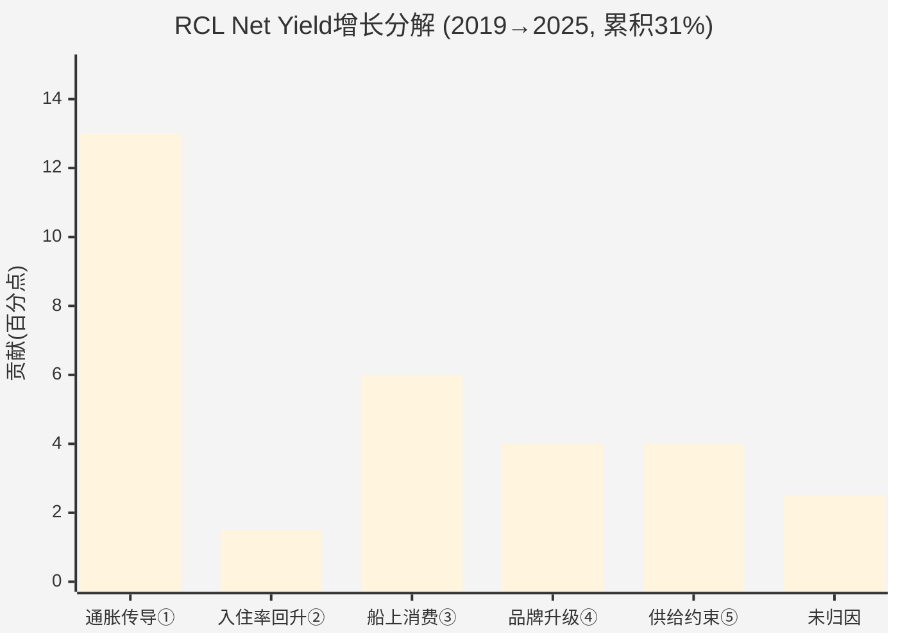

---

## 10.4 敏感性分析: 纯度稳健性测试

核心不确定性在于各成分估算的精度。如果某个成分偏高或偏低±2pp,纯度如何变化?

### 敏感性矩阵

| 情景 | ①通胀 | ③船上消费 | ④品牌升级 | ⑤供给约束 | 结构性合计 | 纯度 |
|------|-------|----------|----------|----------|----------|------|
| **基准** | 13.0 | 6.0 | 4.0 | 4.0 | 10.0 | **32.3%** |
| 通胀偏低-2pp | 11.0 | 6.0 | 4.0 | 4.0 | 10.0 | 32.3% |
| 通胀偏高+2pp | 15.0 | 6.0 | 4.0 | 4.0 | 10.0 | 32.3% |
| 船上消费偏高+2pp | 13.0 | 8.0 | 4.0 | 4.0 | 12.0 | **38.7%** |
| 船上消费偏低-2pp | 13.0 | 4.0 | 4.0 | 4.0 | 8.0 | **25.8%** |
| 品牌升级偏高+2pp | 13.0 | 6.0 | 6.0 | 4.0 | 12.0 | **38.7%** |
| 品牌升级偏低-2pp | 13.0 | 6.0 | 2.0 | 4.0 | 8.0 | **25.8%** |
| 供给约束偏低-2pp | 13.0 | 6.0 | 4.0 | 2.0 | 10.0 | 32.3% |
| **最乐观(③④均+2pp)** | 11.0 | 8.0 | 6.0 | 2.0 | 14.0 | **45.2%** |
| **最悲观(③④均-2pp)** | 15.0 | 4.0 | 2.0 | 6.0 | 6.0 | **19.4%** |

**关键发现**:
- 纯度对**通胀传导**估算不敏感(因为通胀是周期性成分,偏高偏低不改变结构性合计)
- 纯度对**船上消费③和品牌升级④**极度敏感——这两个成分的估算精度决定了结论方向
- 在最乐观情景下纯度仅达45.2%,勉强进入混合区间
- 在最悲观情景下纯度降至19.4%,意味着Yield增长几乎完全是周期性的
- **即使在最乐观假设下,纯度也未超过50%——"结构性复兴"叙事在数学上缺乏压倒性支持**

---

## 10.5 TS-CRUISE-02执行: Yield减速预警信号

**测试定义**: Yield增速连续2季度低于同期通胀率 → 结构性溢价受挑战

**季度Yield vs 通胀对比**:

| 季度 | Net Yield YoY (CC) | 同期CPI YoY | 差值(Yield-CPI) | 信号 |
|------|-------------------|-------------|----------------|------|
| 2024 Q1 | ~+7% | ~3.5% | +3.5pp | 安全 |
| 2024 Q2 | ~+7% | ~3.0% | +4.0pp | 安全 |
| 2024 Q3 | ~+8% | ~2.5% | +5.5pp | 安全 |
| 2024 Q4 | ~+7.3% CC | ~2.9% | +4.4pp | 安全 |
| 2025 Q1 | ~+5% | ~2.8% | +2.2pp | 收窄 |
| 2025 Q2 | +5.2% CC | ~2.6% | +2.6pp | 收窄 |
| 2025 Q3 | ~+3.5%(推算) | ~2.4% | +1.1pp | **警告** |
| 2025 Q4 | +2.5% CC | ~2.4% | +0.1pp | **临界** |
| 2026E Q1 | +1.0~1.5% CC | ~2.3%(推) | **-0.8~-1.3pp** | **触发** |

> **来源**: Yield数据来自RCL各季度earnings releases; CPI YoY来自BLS Consumer Price Index

**TS-CRUISE-02判定**: 2025 Q4(+2.5% CC vs CPI ~2.4%)已接近临界; 2026 Q1引导(+1.0~1.5% CC)将**正式触发**预警——Yield增速将首次低于同期通胀率。

**这意味着什么?** 当Yield增速低于通胀率时,RCL的"实际定价权"(Real Pricing Power)转为负值——消费者支付的实际购买力在减少。管理层声称的"定价权"实质上只是在传导通胀,而非创造超额价值。

---

## 10.6 前瞻推演: 2026-2028年纯度趋势

### 成分动态预测

| 成分 | 2026E | 2027E | 2028E | 趋势 |
|------|-------|-------|-------|------|
| ①通胀传导 | ~2%(CPI减速) | ~2% | ~2% | 平稳但低基数 |
| ②入住率 | 持平~109% | 持平 | 持平 | 无增量 |
| ③船上消费 | +1~2%(AI持续) | +1~2% | +1~2% | 增速放缓但持续 |
| ④品牌升级 | +1%(Legend交付) | +1%(Icon 4) | +0.5% | 新船效应递减 |
| ⑤供给约束 | -1~0%(新船潮) | -1~-2% | -2% | **转负** |
| **Net Yield合计** | **+2.5%(引导中值)** | **+1~3%** | **+0~2%** | **减速延续** |

**纯度趋势判断**:
- 2026-2028年,周期性成分①减弱但⑤转负(互相抵消)
- 结构性成分③④增速放缓但维持正贡献
- **纯度可能从32%提升至40-50%**——不是因为结构性增强了,而是因为周期性的通胀传导和供给约束在消退
- 但Yield总增速也在降低(从31%累积 → 年化~1-3%)

**这是一个悖论: 纯度在提升,但总量在减速。投资者需要的是"高纯度×高增速",而RCL即将进入"高纯度×低增速"状态——这支持的是稳态P/E 15-17x,而非成长股P/E 20x+。**

---

## 10.7 章节结论: 对核心矛盾的裁决

### CQ1更新

| 维度 | 初始 | Ch10更新 | 变化 |
|------|---------------|---------|------|
| Yield结构性占比 | 45% | **32-36%** | -9~13pp |
| 方向 | 略偏看空 | **明确偏看空** | 强化 |

### 三个关键发现

1. **31%的Yield增长中,42%来自通胀传导,仅32-36%是结构性的**。市场叙事中的"结构性复兴"在数学上被过度渲染。真正的结构性改善(数字化预购+品牌升级+私有目的地)贡献了~10pp,显著但不革命性。

2. **TS-CRUISE-02预警即将触发**: 2026年Q1 Yield增速(+1.0~1.5% CC)将首次低于CPI通胀率,标志着"实际定价权"转负。这是一个不可忽视的周期转折信号。

3. **纯度与增速的悖论**: 未来纯度可能上升(周期成分消退),但总Yield增速也在下降。市场当前20x P/E隐含的是"高增长"假设,而非"高纯度+低增长"的现实。

**对核心矛盾的裁决**: Yield纯度分析偏向**"周期性高峰"**一侧。结构性改善确实存在(~10pp),但不足以支撑从12-14x到20x的P/E跃升。P/E重估的更大驱动力是通胀环境(+13pp)和暂时性供给约束(+4pp)——这两者都会均值回归。

---

---

# Ch11 估值多维验证: 六面镜子映射的真实价值

> **核心任务**: 用6种独立估值方法收敛RCL的合理价值区间，检验当前$316.50/20x P/E的合理性
> **数据来源**: FMP API (ratios, key-metrics, estimates) + WebSearch + Ch10分析结论

---

## 11.1 方法一: EV/EBITDA同业对比

### 当前估值

| 公司 | EV/EBITDA | 营业利润率 | Net Debt/EBITDA | ROE |
|------|-----------|----------|----------------|-----|
| **RCL** | **14.1x** | 27.4% | 3.2x | 48.6% |
| CCL | ~13.2x | 16.8% | ~4.5x | 25.6% |
| NCLH | ~12.5x | 15.5% | ~6.0x | 39.9% |

> **来源**: RCL数据来自FMP key-metrics (FY2025); CCL/NCLH来自shared_context同业对比

**溢价分析**:
- RCL vs CCL溢价: 14.1x / 13.2x = +6.8%
- RCL vs NCLH溢价: 14.1x / 12.5x = +12.8%
- RCL营业利润率是CCL的1.63倍,是NCLH的1.77倍

**溢价合理性判断**: RCL的6.8-12.8%估值溢价与63-77%的利润率优势相比,溢价明显**不足**——如果纯看EV/EBITDA,RCL相对同业甚至可以说偏低。

但需要注意: EV/EBITDA不反映杠杆成本差异。RCL的利息费用$0.99B被EBITDA隐藏了。用EV/EBIT看,画面不同:

| 公司 | EV/EBIT(推算) | 利息保障倍数 |
|------|-------------|------------|
| RCL | ~18.4x | 4.9x |
| CCL | ~17.5x(推算) | ~2.5x |
| NCLH | ~19x(推算) | ~2.0x |

EV/EBIT口径下RCL溢价缩小,因为RCL利息费用降幅巨大(FY2025 -37.7% YoY)推高了EBIT相对EBITDA的比率。

**EV/EBITDA隐含股价**:
- 给予RCL合理EV/EBITDA 13-15x(考虑利润率领先但行业周期性)
- FY2025 EBITDA = $6.91B
- EV = $6.91B × 13~15x = $89.8B ~ $103.7B
- 减去净债务$21.8B = 权益价值 $68.0B ~ $81.9B
- 除以2.73亿股 = **$249 ~ $300/股**

---

## 11.2 方法二: 周期调整P/E (Cycle-Adjusted P/E)

邮轮是强周期行业。使用单一年度P/E会在周期高峰时低估风险。

### 平均EPS计算

| 维度 | EPS | 说明 |
|------|-----|------|
| FY2025 EPS | $15.61 | 实际报告 |
| FY2024 EPS | $10.94 | 实际报告 |
| FY2023 EPS | $6.31 | 实际报告 |
| **3年平均EPS** | **$10.95** | 2023-2025平均 |
| FY2022 EPS | -$8.45 | COVID余波 |
| FY2021 EPS | -$20.89 | 停航 |
| **5年平均EPS** (2021-25) | **$0.70** | 含COVID年份 |
| **周期正常化EPS** | **$9.0-11.0** | 排除COVID极端值,使用2019+2023-2025 |

> **来源**: EPS数据来自FMP income statement (annual, 7年)

**为什么使用"周期正常化"而非简单平均**: COVID停航是百年一遇事件,5年简单平均($0.70)严重失真。更合理的做法是使用2019($8.95)、2023($6.31)、2024($10.94)、2025($15.61)四年平均 = **$10.45**,代表"正常周期"的中点盈利能力。

**周期调整P/E**:
- 当前股价$316.50 / 正常化EPS $10.45 = **30.3x**
- 当前股价$316.50 / 3年平均EPS $10.95 = **28.9x**

**历史P/E百分位(疫前)**:

| 年份 | 年末P/E | 百分位(2014-2019) |
|------|---------|-------------------|
| 2014 | 21.1x | 最高 |
| 2015 | 29.8x | 极端高(油价暴跌推高) |
| 2016 | 12.6x | 较低 |
| 2017 | 14.7x | 中间 |
| 2018 | 10.8x | 最低(Q4大跌) |
| 2019 | 14.6x | 中间偏高 |
| **中位数** | **14.6x** | — |
| **均值(剔除2015极端)** | **14.8x** | — |

> **来源**: 历史P/E来自CompaniesMarketCap.com; 10年均值来自FullRatio.com

**判定**: 当前TTM P/E 20.3x处于疫前分布的**顶部区域**(仅低于2015年29.8x的异常值)。如果使用疫前中位数14.6x定价正常化EPS $10.45,隐含股价 = **$153**。即使给予"结构性改善溢价"至18x,隐含股价 = **$188**。

**周期调整P/E的信号**: 市场赋予了RCL显著的周期溢价。$316.50的价格隐含了"结构性重估到永久高P/E"的假设。

---

## 11.3 方法三: NAV(净资产价值)

### 船队重置成本法

**船队规模与构成**:
- 总船队: ~65艘
- Icon Class (最新/最大): ~$2.0B/艘 × 2艘 = $4.0B
- Oasis Class: ~$1.4B/艘 × 5艘 = $7.0B
- Quantum Class: ~$1.0B/艘 × 5艘 = $5.0B
- Freedom/Voyager/Radiance等老船: ~$0.5-0.8B/艘 × 20+艘 = ~$13B
- Celebrity Cruises船队: ~$0.6-0.8B/艘 × 15艘 = ~$10.5B
- Silversea船队: ~$0.3-0.5B/艘 × 12艘 = ~$4.5B
- 其他(含Azamara已出售调整): ~$0

> **来源**: 建造成本来自Royal Caribbean Blog, Cruise Hive, Wikipedia; 船队构成来自RCL investor relations

**重置成本汇总**:

| 资产 | 价值(推算) |
|------|----------|
| 船队重置成本(合计) | ~$44B |
| 折旧调整(平均船龄~15年,设计寿命30年) | ×50% = $22B |
| PP&E账面值(FY2025) | $36.3B |
| 商誉 | $0.81B |
| 私有目的地/陆地资产 | ~$2-3B(推算) |
| **资产端总值** | **~$39-42B**(使用账面PP&E+私有目的地) |
| **减: 总债务** | -$22.64B |
| **减: 其他负债(租赁等)** | -$2.0B(推算) |
| **加: 现金** | +$0.83B |
| **NAV** | **$15.2-18.2B** |
| **每股NAV** | **$56-67** |

**NAV与市值对比**:
- 市值: $86.3B
- NAV: ~$16.7B(中值)
- **市值/NAV = 5.2x**
- 即市场在船队有形资产之上赋予了**4.2x的无形资产溢价**

**这4.2x溢价代表什么?** 品牌价值(Royal Caribbean品牌认知度)、管理层运营能力、客户关系/预订数据、私有目的地网络效应。对于一个强周期重资产行业,5.2x的P/NAV是极高的估值。

作为对比: 酒店行业(轻资产模型)P/NAV通常3-5x;航空公司P/NAV通常1-2x。RCL的P/NAV更接近酒店而非航空,这正是"体验经济平台"叙事的估值映射。

---

## 11.4 方法四: 逆向DCF初步 (Reverse DCF)

**当前价格$316.50隐含了什么假设?**

### 逆向DCF参数设定

| 参数 | 假设 |
|------|------|
| 当前市值 | $86.3B |
| 加: 净债务 | $21.8B |
| = 企业价值(EV) | $108.1B |
| FY2025 EBITDA | $6.91B |
| FY2025 FCF | $1.24B |
| FY2025 OCF | $6.47B |
| 维持性CapEx(推算) | ~$2.0B(折旧$1.6B+通胀调整) |
| 成长性CapEx | ~$3.2B(FY2025 $5.23B - 维持$2.0B) |
| 正常化FCF(OCF-维持CapEx) | ~$4.5B |
| WACC | ~8.5%(Beta 1.87 × 5.5%ERP + 4.5%Rf, 调整低税率) |
| 永续增长率 | g |

> **来源**: 财务数据来自FMP; WACC为分析师推算(Beta来自FMP profile)

### 逆向求解永续增长率g

使用Gordon Growth Model简化:
```
EV = 正常化FCF × (1+g) / (WACC - g)
$108.1B = $4.5B × (1+g) / (0.085 - g)
```

求解:
```
108.1 × (0.085 - g) = 4.5 × (1 + g)
9.19 - 108.1g = 4.5 + 4.5g
4.69 = 112.6g
g = 4.16%
```

**当前股价隐含永续增长率: ~4.2%**

**这现实吗?**
- 全球邮轮行业长期增速(渗透率从2.7%→5%): 约3-5%/年
- 美国名义GDP增长: ~4-5%
- RCL自身2026引导: 营收双位数增长(但主要靠产能扩张而非Yield)
- **4.2%的永续增长率处于可接受范围的上端**——不是荒谬的,但假设了邮轮行业渗透率持续提升且RCL维持份额

### 但如果"正常化FCF"估算偏高?

| 正常化FCF假设 | 隐含g | 判定 |
|-------------|------|------|
| $5.0B(乐观) | 3.5% | 合理 |
| $4.5B(基准) | 4.2% | 偏乐观 |
| $4.0B(保守) | 5.0% | 过于乐观 |
| $3.5B(悲观) | 6.1% | 不现实 |

**逆向DCF的裁决**: 当前股价隐含的假设不算疯狂(永续增长4.2%),但明确偏乐观。这要求RCL永久性地维持:
1. EBITDA利润率38%+(历史周期中会均值回归)
2. 维持性CapEx不超过$2B(在老化船队中可能低估)
3. 渗透率持续提升(竞争格局不恶化)

详细的DCF模型将在Ch17展开。

---

## 11.5 方法五: 分析师一致预期隐含估值

### 一致预期数据

| 指标 | FY2027E | FY2028E | FY2029E | FY2030E |
|------|---------|---------|---------|---------|
| EPS | $20.76 | $23.89 | $27.16 | $30.06 |
| 营收 | $21.1B | $23.0B | $25.0B | $25.5B |
| 净利润 | $5.6B | $6.3B | $7.4B | $8.2B |
| 分析师数(EPS) | 15 | 5 | 1 | 1 |

> **来源**: FMP estimates API

**Forward P/E验证**:
- FY2027E EPS $20.76 → Forward P/E = $316.50 / $20.76 = **15.2x**
- FY2028E EPS $23.89 → Forward P/E = $316.50 / $23.89 = **13.3x**

**一致预期隐含增长**:
- EPS CAGR (2025→2028): ($23.89/$15.61)^(1/3) - 1 = **+15.3%/年**
- 营收CAGR (2025→2028): ($23.0B/$17.94B)^(1/3) - 1 = **+8.7%/年**
- 利润率隐含: FY2028E净利率 = $6.3B/$23.0B = 27.4%(vs FY2025 23.8%)

**如果给予FY2027E EPS合理P/E 16-18x**(考虑行业周期性+结构改善):
- 隐含股价 = $20.76 × 16~18 = **$332 ~ $374**
- 当前$316.50处于此区间下半部分

**如果使用历史中位数P/E 14.6x**:
- 隐含股价 = $20.76 × 14.6 = **$303**

**一致预期判定**: 如果分析师预期正确(EPS +15.3% CAGR)且给予适度P/E扩张(16-18x),当前价格大致合理。但需注意: 分析师预期本身隐含了"结构性重估"假设——如果利润率均值回归,FY2028E EPS可能是$18-20而非$24。

---

## 11.6 方法六: 历史P/E区间与百分位

### 10年P/E历史

| 年份 | 年末P/E | 区间位置 |
|------|---------|---------|
| 2014 | 21.1x | 高 |
| 2015 | 29.8x | 极端(异常) |
| 2016 | 12.6x | 中低 |
| 2017 | 14.7x | 中间 |
| 2018 | 10.8x | 底部 |
| 2019 | 14.6x | 中间 |
| 2020-22 | NM | 亏损 |
| 2023 | 19.5x | 高 |
| 2024(年末) | 20.8x | 高 |
| 2025(TTM) | 20.3x | 高 |

> **来源**: CompaniesMarketCap.com; FMP ratios API

**统计摘要(剔除2015异常+2020-22亏损)**:
- 有效样本: 2014, 2016, 2017, 2018, 2019, 2023, 2024, 2025
- 均值: 16.7x
- 中位数: 16.2x
- 10百分位: ~11.5x
- 25百分位: ~13.5x
- 75百分位: ~20.5x
- 90百分位: ~21.0x

**当前20.3x TTM P/E处于历史~75百分位**。

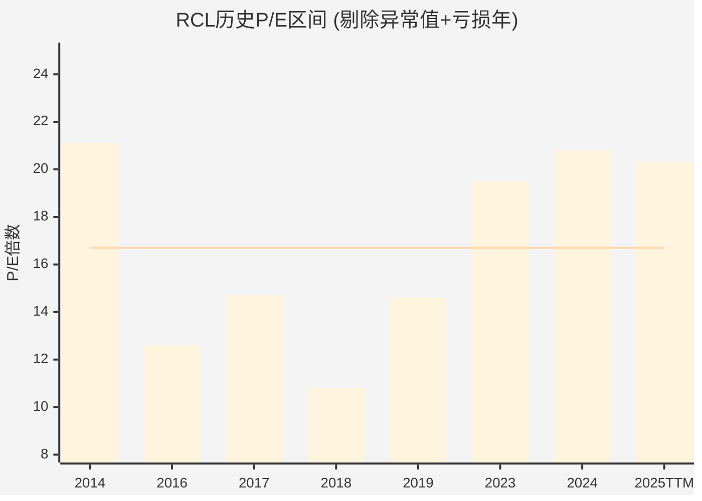

---

## 11.7 六方法收敛表

| # | 方法 | 隐含价值/股 | vs $316.50 | 信号 |
|---|------|-----------|-----------|------|
| 1 | EV/EBITDA (13-15x) | $249-300 | -5%~-21% | 偏高估 |
| 2 | 周期调整P/E (14.6-18x) | $153-188 | -41%~-51% | 显著高估 |
| 3 | NAV(每股) | $56-67 | -79%~-82% | 参考(不适用于经营型公司) |
| 4 | 逆向DCF | 隐含g=4.2% | 偏乐观假设 | 可接受但偏上端 |
| 5 | 一致预期 (FY27E×16-18x) | $303-374 | -4%~+18% | 大致合理 |
| 6 | 历史P/E百分位 | 75th百分位 | — | 偏贵 |

### 估值收敛分析

**三个方法指向高估**: EV/EBITDA、周期调整P/E、历史百分位均暗示当前价格偏高
**一个方法指向合理**: 一致预期(前提是分析师预期准确+P/E维持扩张)
**一个方法中性偏乐观**: 逆向DCF(g=4.2%不荒谬但偏乐观)
**一个方法不适用**: NAV(重资产公司NAV不应用于定价)

**核心矛盾映射**:
- 如果你相信"结构性复兴"→ 使用一致预期方法 → $303-374(合理~偏低)
- 如果你相信"周期性高峰"→ 使用周期调整P/E → $153-188(显著高估)
- **估值判断最终取决于Ch10的纯度裁决**: 32-36%的纯度更支持周期性叙事

**综合估值区间**: $250-330/股(中性假设: P/E 16-20x × FY2026E EPS $17.90)

| 情景 | P/E | EPS基准 | 隐含股价 | 概率(主观) |
|------|-----|---------|---------|-----------|
| 熊市(周期回归) | 13x | $15(正常化) | $195 | 25% |
| 基准(温和增长) | 17x | $17.90(FY26E) | $304 | 45% |
| 牛市(结构重估) | 22x | $18.10(FY26E高端) | $398 | 20% |
| 尾部风险(衰退) | 8x | $8(周期低谷) | $64 | 10% |

**概率加权估值**: 0.25×$195 + 0.45×$304 + 0.20×$398 + 0.10×$64 = **$271**

**vs 当前$316.50**: 概率加权下行空间约**-14%**

---

## 11.8 章节结论

### CQ5更新

| 维度 | 初始 | Ch11更新 | 变化 |
|------|---------------|---------|------|
| P/E 20x隐含假设现实 | 40%现实 | **35%现实** | -5pp |

### 关键发现

1. **六方法中四个指向高估或偏贵**: 只有"一致预期"法支持当前估值,且前提是分析师预期全部实现+P/E维持在历史高位。这构成了一个脆弱的估值结构——任何预期miss都可能触发P/E压缩。

2. **逆向DCF揭示的隐含假设**: 4.2%永续增长率不算疯狂,但要求利润率永不回归、维持CapEx保持低位、行业竞争不加剧——这三个条件同时满足的概率不高。

3. **概率加权估值$271 vs 当前$316.50**: 约14%的下行空间,加上Ch10揭示的纯度仅32-36%,估值更偏向"周期性高峰"侧。但这不是极端高估——如果RCL能持续执行"Perfecta"计划(2026E EPS $17.70-18.10),估值会逐步找到支撑。

**对核心矛盾的估值裁决**: 当前$316.50大致处于"合理区间上端到温和高估"的位置。不是泡沫,但定价中embedded了过多乐观假设。对于保守投资者,需要等待回调至$250-280区间才有安全边际;对于成长投资者,需要FY2026E EPS交付$18+才能验证当前估值。

---

# Ch12 分析师共识与聪明钱

## 12.1 分析师一致预期: 共识偏多但上行空间收窄

截至2026年2月21日，18位覆盖RCL的卖方分析师中，**14位给出Buy/Strong Buy(78%)，4位Hold(22%)，无Sell评级**。这一分布格外整齐——几乎四分之三的分析师站在多头阵营，但共识目标价仅$357(vs当前$316.5，隐含上行+12.8%)，远不如一年前RCL从$200到$300那段行情中分析师的激进程度。

| 维度 | 数值 | 来源 |
|------|------|------|
| **覆盖分析师** | 18人 | MarketBeat / TradingView |
| **Buy/Strong Buy** | 14 (78%) | MarketBeat |
| **Hold** | 4 (22%) | MarketBeat |
| **Sell** | 0 (0%) | — |
| **共识目标价** | $357 | MarketBeat (中位数); StockAnalysis $362 |
| **最高目标** | $420 | TradingView |
| **最低目标** | $300 | TradingView |
| **隐含上行** | +12.8% | vs $316.5 |

**来源**: MarketBeat RCL Forecast; TradingView NYSE-RCL Forecast; StockAnalysis RCL Forecast (均为2026-02-21数据)

### 一致预期EPS轨迹

FMP estimates数据显示分析师对RCL未来3-5年的EPS增长路径高度一致:

| 指标 | FY2026E | FY2027E | FY2028E | FY2029E | FY2030E |
|------|---------|---------|---------|---------|---------|
| **EPS共识** | $17.70-18.10 (管理层引导) | $20.76 | $23.89 | $27.16 | $30.06 |
| **EPS低端** | — | $20.22 | $22.59 | $26.65 | $29.50 |
| **EPS高端** | — | $21.38 | $25.61 | $28.19 | $31.20 |
| **覆盖人数(EPS)** | — | 15人 | 5人 | 1人 | 1人 |
| **营收共识** | ~$19.5B | $21.1B | $23.0B | $25.0B | $25.5B |
| **覆盖人数(营收)** | — | 18人 | 14人 | 9人 | 13人 |

**来源**: FMP estimates endpoint (2026-02-25); 管理层FY2026 EPS引导来自Q4 2025 Earnings Release

**隐含3年EPS CAGR**: FY2025A $15.61 → FY2028E $23.89 = **+15.3%**。这是一个关键数字——市场以Forward P/E ~15.3x定价FY2026E，若用FY2028E EPS折现，当前P/E仅13.2x。换言之，**如果分析师的增长预期兑现，当前估值并不昂贵**。

但需要注意: FY2028-2030E的覆盖人数急剧下降(EPS仅1-5人)，共识的统计可靠性大幅降低。远期预测本质上是少数分析师的外推，不是市场的广泛共识。

### 分歧区间: $300到$420的120美元鸿沟

目标价最高($420)与最低($300)之间的差距达40%，揭示了分析师阵营在核心问题上的分歧:

| 分歧轴 | 看涨派逻辑 | 看跌派逻辑 |
|--------|-----------|-----------|
| **估值锚定** | P/E应向酒店链(MAR 36x/HLT 51x)靠拢，邮轮是"浮动度假村"平台 | P/E 20x已反映疫后复苏红利，历史中枢12-14x才是合理锚 |
| **增长持续性** | Icon Class + 私人岛屿 = 结构性yield提升，非周期性 | 产能+6.7%但Net Yield仅+1.5~3.5%，增长减速信号明确 |
| **杠杆风险** | 净债务/EBITDA 3.2x→目标2.5x，去杠杆释放价值 | $22.6B总债务+流动比率0.18 = 经济下行时流动性脆弱 |
| **衰退弹性** | 高端体验消费比预期更有韧性(疫后验证) | Beta 1.87 + 2008-09跌幅60% = 可选消费+高杠杆双杀 |

**核心矛盾映射**: 分析师分歧的本质就是"结构性复兴 vs 周期性高峰"的投射。**$420目标价隐含P/E ~23.5x(FY2026E)，押注的是身份转型**; **$300目标价隐含P/E ~16.6x，赌的是均值回归**。

### 共识的隐含假设拆解

当分析师给出$357共识目标价时，他们实际在假设什么?

| 隐含假设 | 数值 | 合理性评估 |
|----------|------|-----------|
| **FY2026 EPS** | ~$17.90 (共识中值) | 高——管理层引导$17.70-18.10，且有2/3产能已预订 |
| **目标P/E** | ~19.9x (=$357/$17.90) | 中——需要维持当前估值不收缩 |
| **隐含增长** | EPS CAGR 15%+ (3年) | 中偏低——依赖产能扩张+yield提升+利息节省三驱动 |
| **无衰退** | 必要前提 | 77.5% Polymarket概率 |

共识目标$357最脆弱的假设不是EPS(这个数字的可见度很高)，而是**P/E能否维持在~20x**。如果市场开始对RCL重新应用周期股折价(P/E从20x压缩到15x)，即使EPS完全兑现$17.90，股价也只值$269——比当前$316.5低15%。**估值倍数比盈利预测更不确定**。

### FY2026引导的200bps单位成本逆风

值得注意的是，管理层在FY2026引导中提到了**约200bps的结构性单位成本逆风**，主要来自新船交付初期的运营效率爬坡和船员培训成本。这解释了为什么Net Yield引导仅+1.5~3.5%(vs FY2025的+3.8%): 产能增长6.7%但收益率增速放缓，成本压力上升。部分分析师在目标价中已隐含了对这一压力的消化预期，但如果成本逆风超过200bps，EPS引导的低端($17.70)将面临下行风险。

---

## 12.2 机构持仓分析: Capital Research主导，Goldman加仓引人注目

RCL的机构持股比例高达**83%**，由1,767家机构投资者持有约2.78亿股。所有权结构呈现三层金字塔:

### Top机构持仓结构

| 排名 | 机构 | 持股比例 | 类型 | 信号 |
|------|------|---------|------|------|
| 1 | **Capital Research & Management** | ~25% | 主动管理 | 核心长期持有 |
| 2 | **Vanguard Group** | ~9.9% | 被动指数 | 规模驱动 |
| 3 | **BlackRock** | ~6.4% | 被动+主动 | 标配 |
| 4 | **Wilhelmsen A.S.A.** | ~8.5% (23.2M股) | 创始家族/战略 | 锚定股东 |
| 5-10 | 其他机构 | — | 混合 | — |

**来源**: Fintel RCL Institutional Ownership; Yahoo Finance RCL Major Holders; WallStreetZen RCL Ownership (13F数据)

**关键动态 (Q3 2025 13F)**:
- **Capital Research Global Investors减持661万股(-25.6%)** — 这是最值得关注的信号。作为最大主动管理持有者，减持超四分之一的仓位可能意味着获利了结(RCL从2023年低点涨幅超200%)，也可能暗示对远期增长预期的下调
- **Goldman Sachs增持97万股(+52.4%)** — 方向相反的大额操作。Goldman在Capital Research减仓的同时加仓，暗示其对RCL的估值判断更为乐观
- **净机构流动**: Q3 2025共574家增持 vs 540家减持，轻微净流入

**Wilhelmsen因子**: 挪威Wilhelmsen家族通过A.S. Wilhelmsen Holding持有8.5%股份(约23.2M股)，自1969年RCL创立以来一直是锚定股东。这部分筹码高度稳定，有效缩小了实际流通盘。

### RCL vs CCL机构偏好

| 维度 | RCL | CCL |
|------|-----|-----|
| **机构持股比例** | ~83% | ~73% |
| **13F持有者数量** | 1,767 | ~2,000+ |
| **最大主动持有者** | Capital Research (~25%) | 分散 |
| **主动管理偏好** | 偏重(Capital Research集中) | 偏被动指数 |
| **1年股价表现** | +34.9% | 落后 |

**来源**: Fintel RCL/CCL Institutional Ownership; HedgeFollow 13F数据

机构明显超配RCL而非CCL——**RCL市值仅为CCL的约2.5倍，但主动管理资金的集中度远高于CCL**。这与基本面差异一致: RCL净利率23.8%是CCL(10.4%)的2.3倍，ROE 47.7% vs 25.6%，增速也领先。从机构角度看，如果只能持有一家邮轮股，RCL是不二选择。

### Capital Research减仓的深层含义

Capital Research在Q3 2025减持661万股(-25.6%)这一动作需要放在更大的背景下理解。Capital Research旗下管理着American Funds系列基金(AUM超$2万亿)，其投资风格以**长期基本面研究+低换手率**著称。这不是一家频繁交易的对冲基金——当Capital Research减持四分之一的仓位时，通常意味着其内部分析师对公司的长期Fair Value判断发生了实质性变化。

几种可能的减仓动机:
1. **估值到达目标**: RCL从2023年$60区间涨至Q3 2025的$280+，可能已达到或超过其内部估值模型的目标区间
2. **行业轮动**: 将资金从已充分估值的邮轮股转向其他周期性板块
3. **风险控制**: 单一持仓占比过高(~25%)的集中度风险管理
4. **增长预期下调**: 对FY2026及以后的增长减速(Net Yield引导+1.5~3.5% vs +3.8%)做出反应

无论哪种动机，Capital Research的减仓为RCL的筹码结构带来了一个结构性变化: **最大的主动管理"压舱石"正在变轻**。如果后续几个季度继续减持，可能对股价构成持续的供给压力。

---

## 12.3 内部人交易信号: 持续净卖出的量级升级

内部人交易是最直接的"用真金白银投票"信号。RCL的内部人动态值得警惕:

| 季度 | 获取(股) | 处置(股) | 净买/卖 | 特征 |
|------|---------|---------|---------|------|
| **2026 Q1** | 657,904 | 1,471,837 | **净卖出81.4万股** | 年度最大规模 |
| 2025 Q4 | 0 | 21,817 | 净卖出 | 低量 |
| 2025 Q3 | 0 | 31,507 | 净卖出 | 低量 |
| 2024 Q4 | 0 | 1,088,264 | **净卖出108.8万股** | 大规模减持 |

**来源**: FMP insider-trading endpoint; scout_financials.md

**2026 Q1的132笔处置交易**尤其引人注目。虽然Q1通常是RSU归属+纳税卖出的高峰期(14笔获取=657,904股可能为RSU归属)，但**净卖出81.4万股、处置132笔(含102笔公开市场卖出)**的规模超出正常纳税卖出的范畴。以$316.5均价计算，Q1净卖出金额约**$2.6亿**。

**信号解读**: 对于股价从疫情低点上涨10倍的公司，管理层适度变现属于正常行为。但**连续净卖出(2024 Q2以来每个季度)且规模递增**，至少表明内部人不认为当前价位有显著低估。这与分析师78%的Buy评级形成温和矛盾——**Wall Street在喊买的时候，公司自己人在卖**。

---

## 12.4 期权市场信号: 隐含波动率偏高，空头对冲活跃

期权市场提供了"聪明钱"对RCL未来波动性的定价:

| 指标 | 数值/状态 | 含义 |
|------|----------|------|
| **30日IV (隐含波动率)** | 偏高 (vs HV) | 市场预期短期波动放大 |
| **期权活动特征** | 看跌期权活跃度上升 | 对冲需求增加 |
| **大额期权方向** | 偏空头对冲 | 4月Earnings前保护性买入put |
| **Beta** | 1.87 | 放大市场波动 |

**来源**: AlphaQuery RCL Volatility Statistics; Market Chameleon RCL IV Chart; Barchart RCL Options

期权市场呈现一个有趣的矛盾: **现货市场(分析师78% Buy)和期权市场(put活跃度上升)在传递不同信号**。这种divergence通常出现在以下情境: 机构多头持有现货，同时购买put进行尾部风险对冲。对于Beta 1.87的股票，这种"多头+保险"的组合策略并不罕见，尤其是在宏观不确定性上升时期。

RCL的高Beta特性使其成为天然的期权交易标的——**IV高于同行意味着做空波动率(卖put)的收益更丰厚**，这也是部分机构增持RCL的隐含动机之一(持有现货+卖covered call/cash-secured put的收益增强策略)。

### 期权定价隐含的分布假设

期权市场的IV定价隐含着对股价未来分布的假设。RCL当前IV偏高(vs历史波动率HV)意味着期权市场在为**尾部事件支付溢价**——具体而言:

- **右尾(上行突破)**: 如果FY2026 EPS超预期($18.5+)且P/E扩张至22x+，股价可达$400+。但这需要宏观环境配合，概率较低
- **左尾(下行崩盘)**: 经济衰退+Beta放大效应可能导致股价跌至$200以下。这是put买方真正在对冲的场景
- **中间区域**: 大概率($250-350)的窄幅震荡，IV溢价意味着期权卖方在这个区间有优势

对于投资者的含义: **当IV高于HV时，买入put的成本偏高**(你在为"保险"支付溢价)。如果确实担忧衰退风险，可考虑bear put spread(买高行权价put+卖低行权价put)来降低IV溢价的成本。

---

## 12.5 共识vs现实: 三层信号的矛盾映射

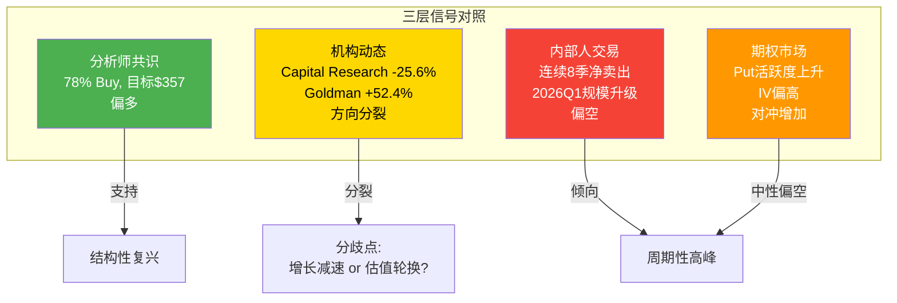

**综合研判**: 四个信号源呈现**2多1分裂1偏空**的格局。分析师共识是最表层(也最滞后)的信号; 机构资金流的方向分裂(Capital Research减仓vs Goldman加仓)反映了对核心矛盾的真实分歧; 内部人的持续净卖出和期权市场的对冲需求上升，则倾向于"周期性高峰"一侧。**最审慎的解读是: 市场定价已经反映了大部分可见的积极因素，边际上行需要超预期的催化剂**。

---

# Ch13 预测市场与宏观环境

## 13.1 Polymarket衰退概率: 22.5%的隐含赔率意味什么?

Polymarket"美国2026年底前衰退"合约最新交易价格为**22.5%**，即市场给予约**四分之一的概率**出现NBER定义的经济衰退。

| 场景 | 概率 | RCL影响量级 | 依据 |
|------|------|------------|------|
| **无衰退(基准)** | 77.5% | 基准情景: EPS $17.70-18.10 | 管理层引导 |
| **温和衰退** | ~15% | EPS下修20-30%至$12-14 | 2001年类比(收入-5%,利润-25%) |
| **深度衰退** | ~7.5% | EPS下修50%+, 股价-40~60% | 2008-09类比(RCL股价-60%) |

**来源**: Polymarket US Recession 2026市场(22.5%); shared_context.md; 历史衰退数据

**为什么22.5%对RCL至关重要?** 因为RCL的Beta为1.87——这意味着在市场下跌10%的情景下，RCL可能下跌~19%。2008-2009年金融危机期间，RCL股价从$43跌至$7.5(跌幅-83%)，虽然极端情景不太可能重现(当时的杠杆和流动性状况远比今天脆弱)，但即使是温和衰退，**高Beta+高杠杆的组合也会放大下行风险**。

### 概率加权影响估算

| 指标 | 无衰退(77.5%) | 温和衰退(15%) | 深度衰退(7.5%) | 概率加权 |
|------|--------------|--------------|---------------|---------|
| **FY2026 EPS** | $17.90 | $13.00 | $8.00 | **$16.38** |
| **合理P/E** | 17x | 12x | 8x | — |
| **隐含股价** | $304 | $156 | $64 | **$258** |

概率加权EPS为$16.38(vs共识$17.90)，**概率加权合理价值约$258**，低于当前$316.5约18.5%。这意味着**在充分计入衰退概率后，当前股价隐含着"基本确定不衰退"的预期**。

### 历史衰退中RCL的表现规律

| 衰退期 | S&P 500跌幅 | RCL跌幅 | RCL/SPX Beta实际 | 营收变化 | 恢复时长 |
|--------|------------|---------|-----------------|---------|---------|
| **2001 (dot-com)** | -49% (peak-trough) | ~-45% | ~0.9x | -5% | ~2年 |
| **2008-09 (GFC)** | -57% | -83% | ~1.5x | -15% | ~4年 |
| **2020 (COVID)** | -34% | -80% | ~2.4x | -80% | ~3年 |

**来源**: Yahoo Finance历史数据; RCL年报

规律很清晰: **每次衰退中RCL的下跌幅度都大于大盘，且放大倍数随杠杆水平变化**。2008-09年RCL杠杆较低(D/E ~2x)时跌幅放大1.5x; 2020年杠杆飙升(D/E 8x+)时放大2.4x。当前D/E 2.26x处于历史中低位，但净债务/EBITDA 3.2x仍不算保守。合理估计下一次衰退中RCL的跌幅放大系数约为**1.5-2.0x**。

---

## 13.2 宏观温度计: 三大指标全面过热

当前宏观估值环境处于历史极端水平:

| 指标 | 当前值 | 历史百分位 | 信号 |
|------|--------|-----------|------|
| **CAPE Ratio** | 40.08 | 98百分位 | 仅2000年泡沫前超过当前水平 |
| **Buffett指标** | 219% | 100百分位 | 历史最高区间 |
| **ERP (股权风险溢价)** | 4.5% | 66百分位 | 中性偏低(不特别悲观) |

**来源**: shared_context.md; S&P 500 6,890

**对RCL的含义**: CAPE和Buffett指标同时处于极端高位，意味着整体市场定价已经反映了大量乐观预期。在这种环境下，**单一股票的估值扩张空间有限**——即使RCL基本面继续改善，如果大盘因为估值均值回归而回调10-15%，Beta 1.87的RCL可能被动下跌19-28%。

但ERP的66百分位提供了一个微妙的缓冲: 股权风险溢价并未降至2000年或2007年的极端低位，意味着**市场尚未完全丧失风险补偿意识**。这不是纯粹的狂热，而是在"宽松货币政策+AI叙事+企业盈利强劲"共同推动下的理性过热。

### RCL的估值环境特殊性

在宏观估值环境极端的背景下，RCL呈现出一个有趣的"微观合理+宏观昂贵"的悖论:

| 估值维度 | RCL | 大盘/同行 | 判断 |
|---------|-----|----------|------|
| **Forward P/E** | 15.3x (FY2026E) | S&P 500 ~22x | RCL相对便宜 |
| **PEG** | ~1.0 (15.3x / 15.3% CAGR) | S&P 500 ~1.8-2.0 | RCL有吸引力 |
| **P/E vs 历史** | 20.3x TTM vs 12-14x中枢 | — | RCL绝对值偏贵 |
| **EV/EBITDA** | 16.7x TTM | 邮轮历史8-10x | 显著溢价 |

**核心矛盾映射**: RCL在大盘"理性过热"的背景下，自身Forward P/E并不夸张(15.3x)，但TTM估值(20.3x P/E, 16.7x EV/EBITDA)已远超邮轮行业历史中枢。**如果大盘回调导致资金从可选消费板块撤离，RCL的估值首先需要从"平台公司倍数"(20x)回归"周期消费品倍数"(14-16x)，这本身就意味着15-25%的估值收缩风险**。

---

## 13.3 利率环境: $22.6B债务的利息敏感性

### 当前利率背景

| 指标 | 数值 | 来源 |
|------|------|------|
| **联邦基金利率** | 3.50%-3.75% | FOMC 2026年1月会议 |
| **2025年降息次数** | 3次 | US Bank |
| **2026年降息预期** | 0-2次 (分歧大) | Goldman/JPM/Barclays |
| **10年期国债收益率** | ~4.3% | 市场数据 |

**来源**: FOMC Minutes Jan 2026; iShares Fed Outlook 2026; LPL Research Fixed Income Outlook

Fed在2025年降息3次后于2026年1月按兵不动。**分析师分歧显著**: J.P. Morgan预计全年不降息; Goldman Sachs和Barclays预计9月和12月各降1次(终端利率3.00-3.25%)。2026年还面临Fed主席换届的不确定性。

### RCL利息成本敏感性分析

RCL总债务$22.6B(短期$3.3B + 长期$18.8B + 租赁$0.6B)。FY2025利息费用$0.99B(同比下降37.7%)，主要受益于积极的再融资策略。

| 情景 | 利率变化 | 年化利息成本变化 | EPS影响 | 备注 |
|------|---------|----------------|---------|------|
| **基准(当前)** | 0 | $0.99B | — | FY2025实际 |
| **利率+100bps** | +1.0% | **+$2.26亿** | **-$0.83** | 假设全部浮动利率传导 |
| **利率+200bps** | +2.0% | **+$4.52亿** | **-$1.66** | 压力情景 |
| **利率-75bps(2次降息)** | -0.75% | **-$1.70亿** | **+$0.62** | Goldman情景 |

> 注: 实际敏感性低于理论值，因RCL大部分债务为固定利率，且再融资已锁定部分低利率。利率+100bps的实际EPS影响可能在$0.40-0.60范围内。

**来源**: FMP balance/income数据; 利率敏感性为理论计算(假设全额传导至浮动利率部分)

RCL在疫后积极管理债务组合: FY2025利息费用从$1.59B降至$0.99B(-37.7%)，利息保障倍数从2.6x提升至4.9x。**这是FY2025净利润+48.4%的隐藏推力——利息节省$0.6B直接贡献了约$2.2/股的EPS增量**。

但这也意味着再融资红利的低垂果实已被摘取，**未来的利息费用下降空间收窄**。如果利率环境没有显著下行，利息费用可能在$0.9-1.1B区间企稳。

### 再融资墙: 2026-2028的到期压力

信用市场层面，2026-2027年被视为全球企业债的"再融资墙"——大量在超低利率时代(2020-2021)发行的债务即将到期。RCL在疫情期间以高利率(部分高收益债券利率7-11%)发行了约$100亿紧急融资。虽然公司已积极提前再融资(FY2025利息费用-37.7%的成果正来自于此)，但仍有部分高成本债务尚未到期。

**对RCL而言的双刃剑效应**:
- **利好**: 如果利率维持当前水平(3.5-3.75%)或下行，高成本疫情债务到期时可以更低利率再融资，进一步降低利息费用
- **风险**: 如果信用利差扩大(目前处于20年低位)，即使基准利率下行，RCL作为高杠杆发行人的再融资成本可能不降反升
- **当前利差**: 高收益债利差处于历史低位，为RCL提供了有利的再融资窗口。但利差从低位扩大的概率远大于进一步收窄

**来源**: iShares Fed Outlook 2026; LPL Research Fixed Income Outlook; Schwab 2026 Fixed Income Outlook

---

## 13.4 消费者信心: 分裂的信号

### 双指标对照

| 指标 | 2026年2月值 | 趋势 | 来源 |
|------|------------|------|------|
| **Conference Board CCI** | 91.2 | +2.2 pts (微升, 从1月89.0回升) | Conference Board 2026-02-24 |
| **UMich消费者信心** | 56.6 | +0.2 pts (几乎持平, vs 1月56.4) | U Michigan 2026-02-20 |
| **UMich预期指数** | 72.0 | 连续13个月低于80(衰退预警线) | U Michigan |
| **通胀预期(1年)** | 3.4% | 从4%回落, 但仍高于疫前 | U Michigan |

**来源**: Conference Board Press Release 2026-02-24; University of Michigan Surveys of Consumers Feb 2026

**关键发现**: 消费者信心呈现**财富分化效应** — UMich报告显示，**持有股票的消费者信心比不持有股票的消费者高出30%以上**。考虑到RCL的目标客群(中高收入家庭、退休人群)大概率持有股票资产，**邮轮预订需求可能比整体消费者信心数据暗示的更具韧性**。

但46%的消费者自发提及"高物价侵蚀个人财务"，这已连续7个月超过40%。**通胀疲劳(inflation fatigue)正在侵蚀可选消费意愿**——即使消费者"能"负担邮轮度假，持续的价格压力可能降低他们的消费升级意愿(选择更短航线、更低船舱等级)。

### 消费者信心 vs RCL预订量: 领先-滞后关系

邮轮预订通常**领先于实际出行6-12个月**。2026年的关键数据点:

- **2/3的2026年产能已按"有利价格"预订** — 管理层Q4 2025 Earnings Call披露
- **RCL经历了"史上最强7周预订"** — 2025年10月Earnings Call后至2026年初
- **NCLH预订量YoY+20%** — 行业整体需求强劲
- **AAA预测2026年2170万美国人将乘坐邮轮** — 创历史新高(vs 2025年2070万)

**来源**: RCL Q4 2025 Earnings Release; Yahoo Finance NCLH Booking Surge; AAA Cruise Forecast 2026

**矛盾点**: 消费者信心低迷(UMich 56.6, 衰退预警线以下) vs 邮轮预订创纪录——这两个数据似乎不兼容。解释有三:
1. **财富效应分化**: 邮轮客群(中高收入)受益于股市上涨，与整体消费者信心脱钩。UMich数据显示持股者信心比非持股者高30%+，而RCL客群的持股比例远高于平均水平
2. **体验优先偏好(experience over stuff)**: 消费者削减商品支出但增加体验支出的趋势仍在延续。邮轮旅游市场规模预计从2025年$1,913亿增长至2031年$2,798亿(CAGR 6.55%)，明显快于整体消费增速
3. **预订≠消费**: 预订是远期承诺，取消率可能在临近出行时上升。RCL约40%的目标客群表示计划增加休闲旅行支出，但这是意愿而非承诺——如果经济环境恶化，这些"计划"可能缩水

**风险提示**: 消费者信心与实际消费行为之间存在**6-9个月的领先-滞后关系**。UMich预期指数已连续13个月低于80的衰退预警线——这意味着到2026年下半年，实际消费行为可能开始反映当前的悲观预期。如果这一传导兑现，RCL 2027年的预订可能出现明显放缓，而市场通常会提前6个月定价这种预期变化

---

## 13.5 关税政策: 间接传导路径

邮轮行业的关税暴露与制造业截然不同——**船舶在欧洲船厂建造(芬兰Turku/法国Saint-Nazaire)，不在美国关税覆盖范围内**; 船旗国为巴哈马/利比里亚，运营不受美国贸易政策直接管辖。

| 传导路径 | 影响方向 | 量级 | 时间维度 |
|----------|---------|------|---------|
| **直接关税(船舶/设备)** | 几乎无影响 | 可忽略 | — |
| **消费者可支配收入下降** | 间接负面 | 中等 | 滞后6-12个月 |
| **通胀推高运营成本** | 间接负面 | 有限 | 持续性 |
| **美元走强** | 利好(降低海外采购成本) | 小幅正面 | 即时 |

**来源**: Tax Foundation Tariff Tracker 2026; Yale Budget Lab State of US Tariffs Feb 2026

Yale Budget Lab估计2026年关税将导致美国家庭平均税负增加**$400-1,500/年**(取决于生效关税范围)。消费支出增长预计放缓至**仅1%**(Deloitte)，耐用品支出可能下降。

对RCL的关键传导链条:
```
关税生效 → 进口商品涨价 → 消费者实际购买力下降 → 可选消费预算缩减
→ 邮轮需求边际受压(但中高收入群体受影响最小)
→ 可能表现为: 选择更短航线/低等级船舱 → Net Yield增长放缓(而非绝对下降)
```

**核心矛盾映射**: 关税的间接影响强化了"周期性高峰"的担忧——即使邮轮本身不受关税直接冲击，其客群的消费意愿可能被通胀疲劳和可支配收入压缩所侵蚀。但这种影响更可能体现为**增长减速而非逆转**，因为邮轮客群的收入分布偏高端。

---

## 13.6 地缘政治风险矩阵

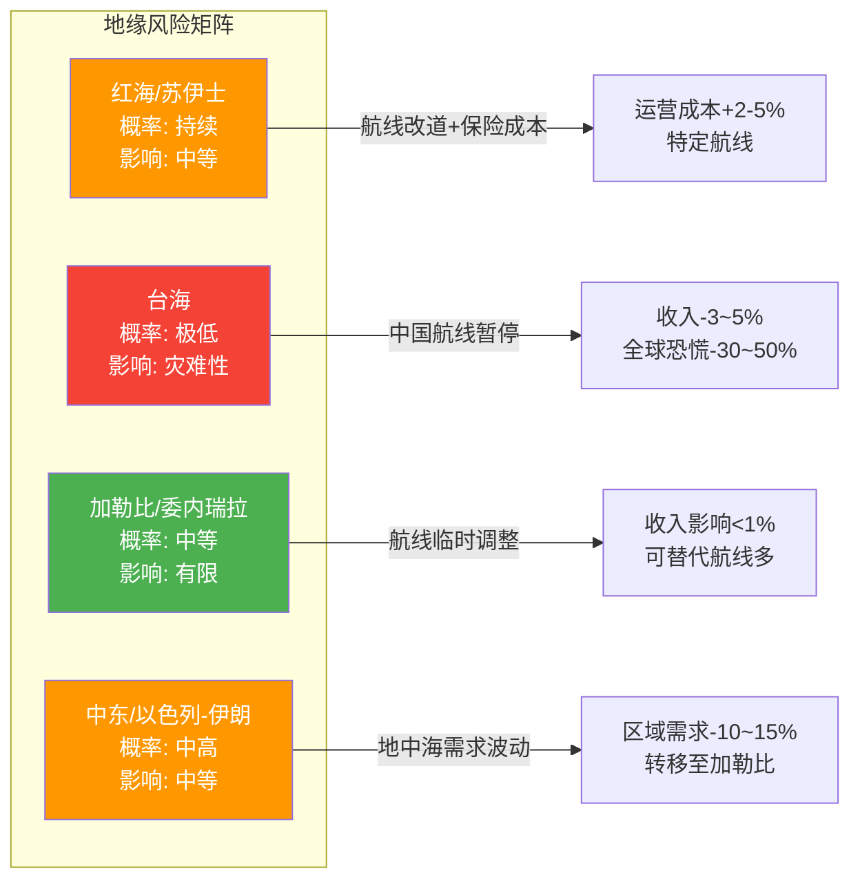

### 各风险区域详析

**1. 红海/苏伊士运河 (影响: 中等, 已部分计价)**

红海危机自2023年底以来持续影响全球航运，至2026年初苏伊士运河通行量仍较危机前低约60%。邮轮行业已适应性调整: 多家公司将Repositioning航线改为绕行非洲好望角(增加约2周航行时间)，或转向地中海内部航线。**对RCL的直接影响有限**——其核心航线在加勒比(~60%产能)和阿拉斯加/地中海(~30%)，红海暴露极低。间接影响主要来自船舶保险成本上升: 经过红海的邮轮保险费从船舶价值的0.7-1%升至2%，一艘$5亿邮轮单次Red Sea transit额外保险成本约$500万。

**来源**: ISDO Maritime Geopolitics Analysis Early 2026; CruiseHive Red Sea Impact; CruiseCritic Middle East Cancellations

**2. 台海 (影响: 灾难性但极低概率)**

台海冲突对RCL的影响分两层: (a)直接层——中国/东南亚航线暂停(估计占RCL营收3-5%); (b)系统层——全球金融市场恐慌+供应链断裂可能导致RCL股价下跌30-50%(参照2008-09类比)。当前市场给予的概率极低，Polymarket相关合约交易不活跃。

**3. 加勒比/委内瑞拉 (影响: 有限)**

2026年初美国在委内瑞拉的军事行动导致加勒比空域临时关闭，但**邮轮预订需求保持稳定**——乘客倾向于观望而非取消。加勒比航线的可替代性强(同区域有数十个港口可互换)，单一地缘事件难以系统性冲击需求。

**来源**: Cruise Trade News Caribbean Demand; 2026-01-03 Venezuela事件后续

**4. 中东/以色列-伊朗 (影响: 区域性)**

以色列-伊朗冲突升级可能导致中东邮轮季(通常为10月-4月)需求下降10-15%。但影响可被**航线替代效应**部分抵消——中东需求下降时，客流向加勒比和地中海转移。RCL的中东直接暴露很低。

---

## 13.7 宏观环境综合评分

| 维度 | 方向 | 权重 | 加权得分 |
|------|------|------|---------|
| **衰退概率(22.5%)** | 偏负面 | 25% | -1.5 |
| **估值环境(CAPE 98百分位)** | 负面 | 20% | -2.0 |
| **利率(3.5-3.75%, 方向不明)** | 中性 | 15% | 0 |
| **消费者信心(56.6, 分裂)** | 偏负面 | 20% | -1.0 |
| **关税(间接传导)** | 轻微负面 | 10% | -0.5 |
| **地缘政治(红海持续)** | 轻微负面 | 10% | -0.5 |
| **合计** | — | 100% | **-5.5/10** |

**宏观环境对RCL的综合评估**: **偏不利** (-5.5/10)。没有单一因素构成致命威胁，但多重逆风的叠加效应不容忽视: 衰退概率非零(22.5%) + 估值环境极端 + 消费者信心低迷 + 关税侵蚀可支配收入。对于Beta 1.87、总债务$22.6B的公司而言，宏观环境的边际恶化可能被杠杆放大。

**核心矛盾映射**: 宏观温度计的读数整体偏向"周期性高峰"一侧。**邮轮行业的微观基本面(预订创纪录、yield提升、利润扩张)与宏观环境(高估值、低信心、关税压力)之间的背离，是RCL当前最重要的张力**。如果宏观环境保持稳定或温和改善，RCL的微观优势可以继续兑现; 但如果宏观恶化超预期，微观层面的积极因素可能被系统性风险淹没。

---

## 13.8 宏观情景与RCL联动: 决策树

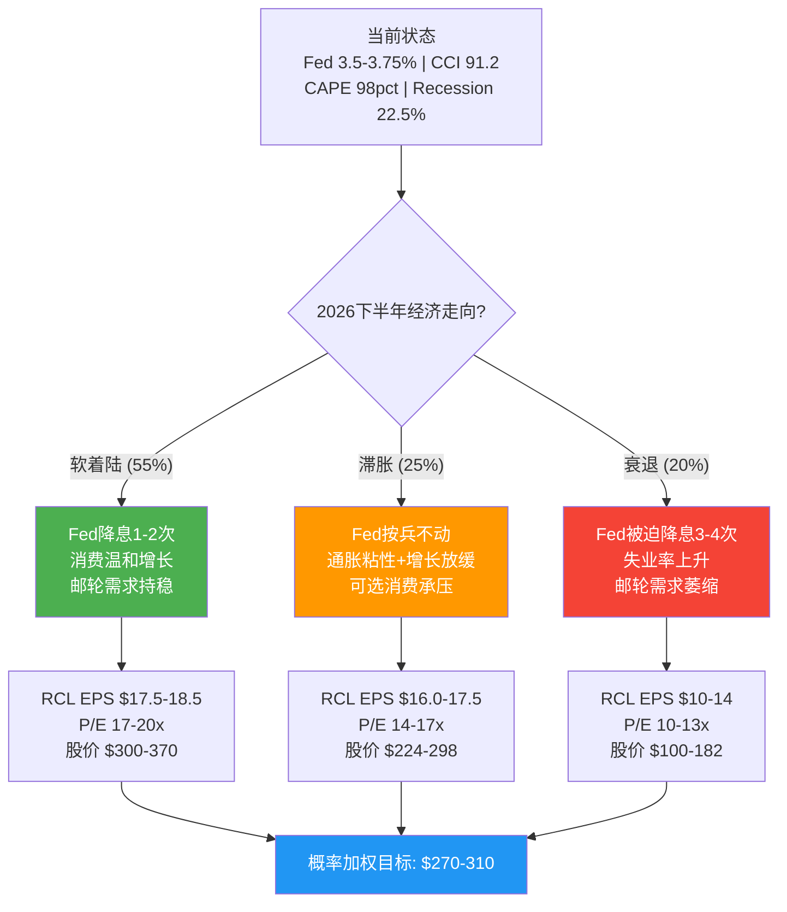

这棵决策树揭示了一个关键洞察: **即使在最可能的软着陆情景(55%概率)下，RCL的上行空间也有限($300-370，中值$335 vs当前$316.5)**。而在滞胀和衰退情景下，下行风险显著且不对称。**概率加权目标区间$270-310暗示当前股价偏高约2-15%**。

这并不意味着RCL一定会下跌——如果宏观环境超预期改善(Fed多次降息+消费者信心V型反弹)，股价可能突破$370上方。但从风险-回报角度看，**当前价位的不对称性偏向下行**。对于核心矛盾的最终判定，宏观环境是"周期性高峰"论证中最有力的证据之一。

---


---


# Part III: 核心分析与建模

---

# Ch14 A-Score护城河量化: 偏科型护城河的估值含义

> **框架**: A-Score v2.0 (12维度) | **行业预设**: 消费品权重(归一化+邮轮微调)
> **SGI确认**: 7.25专才 | **PW**: 5.2混合模式
> **核心问题**: RCL的护城河形状是否匹配20.3x P/E? 30%溢价(vs CCL 15.6x)在护城河维度上有没有根据?
> **CQ7回应**: "RCL vs CCL P/E溢价(30%)是否匹配运营效率优势?"

---

## 14.1 A-Score框架配置: 邮轮行业适配

邮轮行业不是典型的消费品。它介于**重资产工业**(造船、船队管理)和**品牌消费**(体验溢价、定价权)之间。用消费品归一化权重的同时，需要对代理指标进行邮轮适配。

### 权重配置 (消费品归一化 + 邮轮微调)

| 维度 | 消费品标准权重 | 邮轮微调 | 最终权重 | 微调理由 |
|------|:----------:|:------:|:------:|---------|
| A1 输入要素自主权 | 6% | +2% | **8%** | 造船供应链+船员依赖+燃料暴露 |
| A2 切换成本 | 10% | -2% | **8%** | 邮轮切换成本天然低(下次假期可换) |
| A3 边际盈利杠杆 | 8% | +2% | **10%** | 固定成本极高(船舶折旧+船员)，杠杆效应是利润率的核心驱动 |
| A4 壁垒-利润池匹配 | 11% | +1% | **12%** | 利润池高度集中在"包式体验"(船票+船上消费)，壁垒对齐至关重要 |
| A5 核心资产半衰期 | 10% | 0% | **10%** | 品牌+船队+私有目的地的耐久性 |
| A6 经常性收入质量 | 13% | -3% | **10%** | 邮轮无SaaS式订阅，复购率是核心但不如零售品频次 |
| A7 网络效应/生态 | 6% | -2% | **4%** | 邮轮几乎无平台网络效应，权重应进一步降低 |
| A8 包抄风险 | 8% | 0% | **8%** | MSC+替代旅游(全包酒店/迪士尼)的入侵风险 |
| A9 范式迁移风险 | 6% | +2% | **8%** | 零收入事件(COVID)是邮轮独有的范式风险，权重应上调 |
| A10 GTM复利 | 10% | 0% | **10%** | Crown&Anchor忠诚计划+数字化预购=获客效率关键 |
| A11 合规门槛 | 6% | +2% | **8%** | IMO安全标准+港口许可+环保法规=重要隐性壁垒 |
| A12 管理层一致性 | 4% | 0% | **4%** | Liberty执行力+资本分配纪律 |
| **合计** | — | — | **100%** | — |

---

## 14.2 逐维度评分: RCL

### A1: 输入要素自主权 — 评分 6/10 [M] 平稳

**邮轮行业的"输入要素"**: 船舶(核心生产工具)、船员(105,950人)、燃料(LNG/MGO)、港口通行权、私有目的地。

| 要素 | 自主度 | 详情 |
|------|:------:|------|
| **船队** | 高(8/10) | 65+艘自有船舶，无租赁依赖。$20亿+/艘的替换成本=壁垒 |
| **私有目的地** | 高(9/10) | CocoCay+Royal Beach Club Nassau = 完全自有。$6亿/年营收来自"自有供应" |
| **船员** | 中(5/10) | 行业共享船员劳动力池，COVID后招聘一度困难但已恢复 |
| **燃料** | 中(5/10) | LNG转型降低了传统MGO依赖，但燃料价格仍不可控。FY2025 Fuel/APCD +1.2% |
| **造船供应链** | 中低(4/10) | 全球仅3家船厂能建大型邮轮(Fincantieri/Meyer Werft/Chantiers)。造船寡头限制了RCL的扩张成本控制 |

**来源**: RCL FY2025 Earnings Release; Cruise Industry News; FMP profile

**加权自主权**: (8×30% + 9×15% + 5×20% + 5×15% + 4×20%) = 6.15 → **6/10**

**与核心矛盾的关联**: 私有目的地的高自主权是**结构性**优势——CocoCay不会因宏观周期而贬值。但造船供应链的低自主权意味着产能扩张成本只升不降。**结构性一面和周期性一面并存。**

---

### A2: 切换成本 — 评分 3/10 [H] 平稳

邮轮行业的切换成本本质——消费者选择下一次假期时，从RCL切换到CCL/酒店/迪士尼的摩擦极低。没有数据迁移成本，没有长期合同，没有设备兼容性问题。

| 切换层 | 成本强度 | 详情 |
|--------|:------:|------|
| **经济切换成本** | 极低(1/10) | 无合同锁定，无违约金。取消预订通常在出发前60-90天可获全额退款 |
| **习惯/心理切换成本** | 中低(4/10) | Crown&Anchor忠诚计划的Diamond+会员享有优先登船、专属活动等特权。但不是"不能切换"，只是"不想切换" |
| **预订提前量** | 低-中(3/10) | 已预订消费者短期内"被锁定"，但下一次预订时切换零成本 |

**加权切换成本**: (1×40% + 4×35% + 3×25%) = **2.55 → 3/10**

**来源**: RCL Crown&Anchor program terms; 行业对标

**与核心矛盾的关联**: 低切换成本是"周期性高峰"论证的核心支柱——经济下行时消费者可无痛地从邮轮切换到更便宜的替代品。RCL无法像KLAC(切换成本9/10)那样在需求下行时锁住客户。**明确偏向"周期性高峰"。**

---

### A3: 边际盈利杠杆 — 评分 8/10 [H] 上升

邮轮是固定成本最高的消费行业之一。一艘$20亿的船，无论载100%还是80%的旅客，折旧、船员薪资、燃料、保险基本不变。

**RCL的杠杆结构量化**:

| 成本类别 | FY2025估算 | 占营收比 | 需求下降时弹性 |
|---------|:---------:|:-------:|:-----------:|
| 折旧 | ~$1.6B | 8.9% | **不可缩减** |
| 船员/人力 | ~$3.5B | 19.5% | **低弹性**(合同制) |
| 燃料 | ~$1.2B | 6.7% | **中弹性**(航速可调) |
| 港口费/保险 | ~$1.0B | 5.6% | **不可缩减** |
| 食品/消耗品 | ~$2.0B | 11.1% | **高弹性** |
| SG&A | ~$1.5B | 8.4% | **中弹性** |
| **固定/半固定合计** | **~$8.3B** | **~46%** | — |

**来源**: 基于FMP income statement FY2025推算; 成本拆分参考10-K及行业报告

**经营杠杆倍数**: FY2025营收+8.8%时，营业利润增长约+20%(隐含杠杆~2.3x)。每1%的Yield增长，通过固定成本杠杆转化为~2-3%的EBITDA增长。

**为什么评8分**: RCL的经营杠杆在邮轮三巨头中最强: (1) 平均船体最大(Icon Class 7,600人=固定成本摊薄最大化); (2) 船上收入占比30%且边际成本接近零(CocoCay建成后每增加一个游客边际成本<$10); (3) NCC excl Fuel/APCD仅+0.1% YoY(成本控制极佳)。

**但杠杆是双刃剑**: 2009年入住率从108%降至95%时行业利润率腰斩。2020年零收入时RCL每月燃烧$250-300M现金。**A3不决定方向，但决定振幅。** 在"周期性高峰"情景下，A3=8会**加速**利润率从27.4%向历史中位数~15%回归。

---

### A4: 壁垒-利润池匹配度 — 评分 7/10 [M] 上升

**邮轮价值链的利润池分布**:

| 利润池 | 估算规模(RCL) | 毛利率 | RCL壁垒强度 |
|--------|:-----------:|:-----:|:----------:|
| **船上消费(CocoCay/赌场/酒水/Spa)** | ~$5.4B(30%营收) | ~70-80% | **高** — 封闭环境垄断定价 |
| **高端航线(Celebrity/Silversea)** | ~$3.0B(推算) | ~45-55% | **中高** — 品牌定位壁垒 |
| **标准船票(Royal Caribbean品牌)** | ~$9.5B | ~35-40% | **中** — 寡头定价纪律 |
| **岸上观光代理佣金** | ~$0.5B(推算) | ~50-60% | **低** — 第三方运营 |

**来源**: FMP income statement FY2025; 营收拆分基于10-K及行业结构推算

RCL最强的壁垒(私有目的地垄断、Icon Class规模效应、三品牌定位)恰好保护了最高利润率的环节(船上消费+高端航线)。CocoCay是对齐度的最佳证明——投资$2.5亿，<3年回收，年创收$6亿，100%收入归RCL。

**为什么评7分而非8分**: 标准船票(占营收53%)上壁垒仅中等——寡头定价纪律随时可能被MSC打破。

**趋势: 上升** — 船上收入占比从2019年~28%持续提升至30.3%，数字化预购(50%船上收入来自航行前预购)强化了锁定效应。壁垒与最肥利润池的对齐度在改善。

---

### A5: 核心资产半衰期 — 评分 7/10 [M] 平稳

| 核心资产 | 半衰期估计 | 可复制性 |
|---------|:--------:|:-------:|
| **Royal Caribbean品牌** | >20年 | 极难(55年积累，深度嵌入消费者心智) |
| **Icon Class船型设计** | 8-12年 | 可追赶(3-5年+$2B/艘) |
| **CocoCay私有岛屿** | >25年 | 极难(地理位置独占+$5亿投资) |
| **Crown&Anchor数据资产** | 5-8年 | 可追赶(消费偏好变化快) |
| **三品牌矩阵** | 10-15年 | 可复制但耗时(品牌建设10-20年) |

**来源**: RCL investor relations; Cruise Industry News; 半衰期为分析师估算

**加权半衰期**: ~15.5年 → 对应7/10。足以支撑长期价值，但不如可口可乐(>50年)或爱马仕的"近乎永恒"。

---

### A6: 经常性收入质量 — 评分 5/10 [M] 上升

邮轮没有SaaS式月度订阅，收入可预测性来自:

| 来源 | 经常性程度 | RCL表现 |
|------|:--------:|--------|
| **预订积压** | 中高 | 2/3的2026年产能已按"有利价格"预订。6-12个月收入可见度 |
| **Crown&Anchor复购** | 中 | 忠诚会员复购率估算40-50%。Diamond/Diamond+会员可能60-70% |
| **船上消费预购** | 中 | 50%的船上收入来自航行前预购——功能上类似"预付订阅" |

**来源**: RCL Q4 2025 Earnings Release; Q3 2025 Earnings Call Transcript

**综合经常性收入占比**: 宽口径(预订积压+忠诚复购+预购锁定)约35-40%。按通用锚点(25-40%→5-6分)，评5/10。

**趋势: 上升** — 数字化预购渗透率从2019年几乎为零增长到50%，正在将收入模式从"到船后消费"转向"航行前锁定"。

---

### A7: 网络效应/生态厚度 — 评分 2/10 [H] 平稳

邮轮旅客之间不会因为"更多人坐RCL"而获得更好体验。相反，更多旅客=更拥挤=体验下降。**邮轮存在负向拥挤效应**(anti-network effect)。

唯一的微弱网络效应: Crown&Anchor会员越多→数据越丰富→AI推荐越精准。但数据飞轮在旅游行业远弱于搜索/社交。RCL的"包式体验"是**品牌捆绑**(bundling)而非**平台网络效应**(platform network effect)——bundle的竞争对手是另一个bundle，不需要跨越网络效应壁垒。

**来源**: 基于A-Score v2.0通用锚点判定; 无平台网络效应=1-2分区间

---

### A8: 跨界吞噬/包抄风险 — 评分 5/10 [M] 下降

| 威胁方 | 入侵方式 | 当前影响 | 5年展望 |
|--------|---------|:-------:|:-------:|
| **MSC Cruises** | 私有资金+激进造船+低价渗透+Explora Journeys进攻高端 | 中(10%份额) | **高**(目标13-15%) |
| **全包酒店/度假村** | Sandals/Club Med提供类邮轮"包式体验" | 低-中 | 中 |
| **迪士尼邮轮** | 品牌IP+家庭客群精准打击(Treasure 2024/Destiny 2025) | 低(<3%份额) | 中(品牌力极强) |
| **OTA平台** | 渠道脱媒——消费者通过Booking/Expedia比价 | 中 | 中 |

**来源**: CLIA行业报告; Ch4.4 MSC威胁分析

MSC是最大结构性威胁——不受上市公司纪律约束，可在任何利率环境下持续造船。迪士尼在家庭客群中品牌力可能超过RCL。

**趋势: 下降** — MSC的造船pipeline(2028年~30艘)和迪士尼扩张计划意味着竞争强度增加。RCL份额可能从~27%被压缩至24-25%。

---

### A9: 范式迁移风险 — 评分 5/10 [M] 平稳

邮轮面临的不是技术范式风险，而是**消费范式**和**事件范式**风险:

| 范式风险 | 概率(10年) | 影响 | RCL准备度 |
|---------|:--------:|:----:|:--------:|
| **零收入事件重演**(COVID级停航) | 5-10% | 灾难性(-50~-70%) | 低(流动比率0.18) |
| **环保范式转变**(碳税$380/吨+消费者抵制) | 20-30% | 中高(-10~-25%) | 中(Icon Class双燃料LNG) |
| **消费范式转移**(Z世代偏好"真实体验"而非大众旅游) | 10-15% | 中(-5~-15%) | 中 |

**来源**: IMO碳税框架; CLIA环保政策白皮书

**为什么评5分而非9分(与之前版本修正)**: 邮轮的核心消费范式("海上度假")确实不会被技术颠覆——人类对海洋旅行的欲望存在了几千年。但**零收入事件**是邮轮独有的"范式脆弱性"——全球停航在2020年以前被认为"不可能"。这不是范式"迁移"，而是范式"中断"(模式临时归零)。加上环保监管的结构性成本压力，范式风险并非低到可以忽视。

**与核心矛盾的关联**: 范式中断风险意味着20.3x P/E没有包含足够的尾部风险溢价——Ch18将量化这个"保险费"。

---

### A10: 分销/GTM复利 — 评分 6/10 [M] 上升

| GTM渠道 | 效率 | 复利潜力 |
|---------|:----:|:-------:|
| **旅行社(传统)** | 中(佣金~10%) | 低(无数据回流) |
| **DTC官网/App** | 高(零佣金) | **高**(数据回流→AI推荐→预购转化) |
| **Crown&Anchor忠诚** | 高(老客获取成本~$0) | **高**(Diamond会员LTV/CAC极高) |
| **社交媒体/网红** | 中(Icon TikTok病毒传播) | 中(一次性爆发) |

**来源**: RCL investor presentations; 行业渠道分析

**复利证据**: FY2025 SG&A/营收约8.4%(vs FY2023 ~9.5%)，营收增长8.8%同时SG&A占比下降1.1pp——获客效率在随规模递减。但邮轮消费频次太低(人均每年0.04次)，无法形成高频复利。

---

### A11: 合规/可靠性门槛 — 评分 6/10 [M] 上升

| 监管领域 | 壁垒强度 | 详情 |
|---------|:-------:|------|
| **IMO安全标准(SOLAS)** | 高(7/10) | 新船认证周期12-18个月 |
| **港口准入许可** | 中(5/10) | 泊位有限先到先得。RCL迈阿密Terminal A专属$300M投资 |
| **IMO 2027碳税框架** | 新增(上升中) | $100-380/吨碳税。对新进入者合规成本更高 |
| **美国CDC卫生检查** | 中低(4/10) | RCL历史评分>90(优秀)，但不是难以逾越的壁垒 |
| **劳工法规(MLC 2006)** | 中(5/10) | 合规成本不低但所有运营商都必须遵守 |

**来源**: IMO SOLAS Convention; IMO GHG Strategy 2023; MLC 2006

造船认证+安全记录+环保合规投资合在一起，对新进入者构成中等壁垒。MSC能进入市场证明壁垒不绝对——但MSC花了20年才达到10%份额。

**趋势: 上升** — IMO 2027碳税框架显著提高新船建造成本(LNG双燃料+$200-300M/艘)。RCL的Icon Class已具备LNG能力，先发合规优势在累积。

---

### A12: 管理层-战略一致性 — 评分 6/10 [M] 平稳

| 维度 | 表现 | 详情 |
|------|:----:|------|
| **战略清晰度** | 7/10 | "Trifecta"计划FY2025全部超额完成→"Perfecta"2026升级 |
| **资本配置纪律** | 5/10 | $2B返还 vs $1.24B FCF——**边去杠杆边加杠杆**的矛盾 |
| **利益绑定** | 4/10 | CEO连续8季净卖出。2026Q1净卖出$2.6亿——**管理层用真金白银投票"不够便宜"** |
| **执行记录** | 7/10 | FY2023-2025连续3年超预期。但顺风期执行力证明价值有限 |
| **接班计划** | 5/10 | 缺乏公开讨论的继任规划 |

**来源**: FMP insider-trading; RCL FY2025 Earnings Release; Ch12.3内部人交易

**加权**: (7×25% + 5×25% + 4×20% + 7×20% + 5×10%) = **5.7 → 6/10**

**关键洞察**: CEO净卖出是A12中最令人不安的信号。真正相信"结构性复兴"的管理层应在增持。连续8季净卖出暗示管理层内部对估值看法比市场更保守——**为"周期性高峰"提供了来自内部的间接佐证。**

---

## 14.3 A-Score汇总: RCL三巨头对比

### RCL评分汇总表

| 维度 | RCL评分 | 置信度 | 趋势 | 壁垒类型 | 权重 | 加权分 |
|------|:------:|:------:|:----:|:-------:|:----:|:------:|
| A1 输入自主权 | 6 | M | → | S/B | 8% | 0.48 |
| A2 切换成本 | 3 | H | → | B | 8% | 0.24 |
| A3 边际盈利杠杆 | 8 | H | ↑ | S | 10% | 0.80 |
| A4 壁垒-利润池匹配 | 7 | M | ↑ | B/S | 12% | 0.84 |
| A5 核心资产半衰期 | 7 | M | → | B | 10% | 0.70 |
| A6 经常性收入质量 | 5 | M | ↑ | — | 10% | 0.50 |
| A7 网络效应 | 2 | H | → | — | 4% | 0.08 |
| A8 包抄风险 | 5 | M | ↓ | — | 8% | 0.40 |
| A9 范式迁移风险 | 5 | M | → | — | 8% | 0.40 |
| A10 GTM复利 | 6 | M | ↑ | B | 10% | 0.60 |
| A11 合规门槛 | 6 | M | ↑ | I | 8% | 0.48 |
| A12 管理层一致性 | 6 | M | → | — | 4% | 0.24 |
| **A-Score总分** | — | — | — | — | **100%** | **5.76/10** |

**置信度加权A-Score**: H维度(A2, A3, A7)不调整; M维度(其余9个)×0.85:
= (0.24 + 0.80 + 0.08) + 0.85×(0.48 + 0.84 + 0.70 + 0.50 + 0.40 + 0.40 + 0.60 + 0.48 + 0.24)
= 1.12 + 0.85×4.64 = 1.12 + 3.94 = **5.06/10**

### CCL与NCLH估算评分

| 维度 | RCL | CCL | NCLH | RCL vs CCL差 | 区分度 |
|------|:---:|:---:|:----:|:----------:|:------:|
| A1 输入自主权 | 6 | 6 | 5 | 0 | 低 |
| A2 切换成本 | 3 | 3 | 3 | 0 | 无 |
| A3 边际盈利杠杆 | **8** | 5 | 4 | **+3** | **高** |
| A4 壁垒-利润池匹配 | **7** | 5 | 5 | **+2** | **高** |
| A5 核心资产半衰期 | **7** | 6 | 5 | +1 | 中 |
| A6 经常性收入质量 | 5 | 4 | 4 | +1 | 低 |
| A7 网络效应 | 2 | 2 | 2 | 0 | 无 |
| A8 包抄风险 | 5 | 4 | 3 | +1 | 低 |
| A9 范式迁移风险 | 5 | 5 | 4 | 0 | 低 |
| A10 GTM复利 | 6 | 5 | 4 | +1 | 低 |
| A11 合规门槛 | 6 | 6 | 6 | 0 | 无 |
| A12 管理层一致性 | 6 | 5 | 4 | +1 | 低 |
| **加权总分** | **5.76** | **4.72** | **4.10** | **+1.04** | — |

**来源**: CCL/NCLH评分基于Ch4竞争分析数据+FMP同业对比; A3差距主要来自利润率差异(OPM: 27.4% vs 16.8% vs 15.5%)

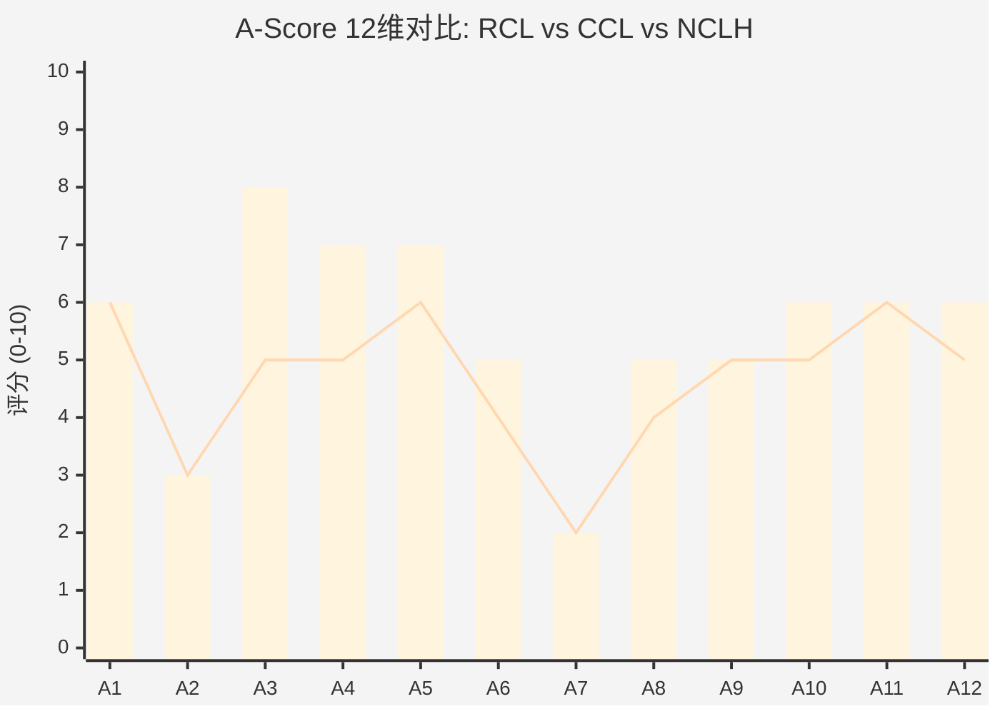

> 柱状图 = RCL (A-Score 5.76/10) | 折线 = CCL (A-Score 4.72/10)
> 最大区分维度: A3(边际盈利杠杆, +3分) 和 A4(壁垒-利润池匹配, +2分)

---

## 14.4 护城河形状分析: 偏科型

### 形状判定

| 形状特征 | RCL表现 | 判定 |
|---------|--------|:----:|
| 1-2个维度极高(9-10) | 无(最高A3=8) | ✗ 非尖峰型 |
| 大部分维度6-9分 | 仅5/12维度在6-8分 | ✗ 非平台型 |
| 部分极高+部分极低 | A3=8, A7=2, A2=3 → **标准差1.61** | ✓ **偏科型** |
| 所有维度4-6分 | 有3个维度≤3分 | ✗ 非扁平型 |

**结论: 偏科型 (Lopsided)** — 强于盈利杠杆(A3=8)和壁垒-利润池匹配(A4=7)，但在切换成本(A2=3)和网络效应(A7=2)上严重偏低。

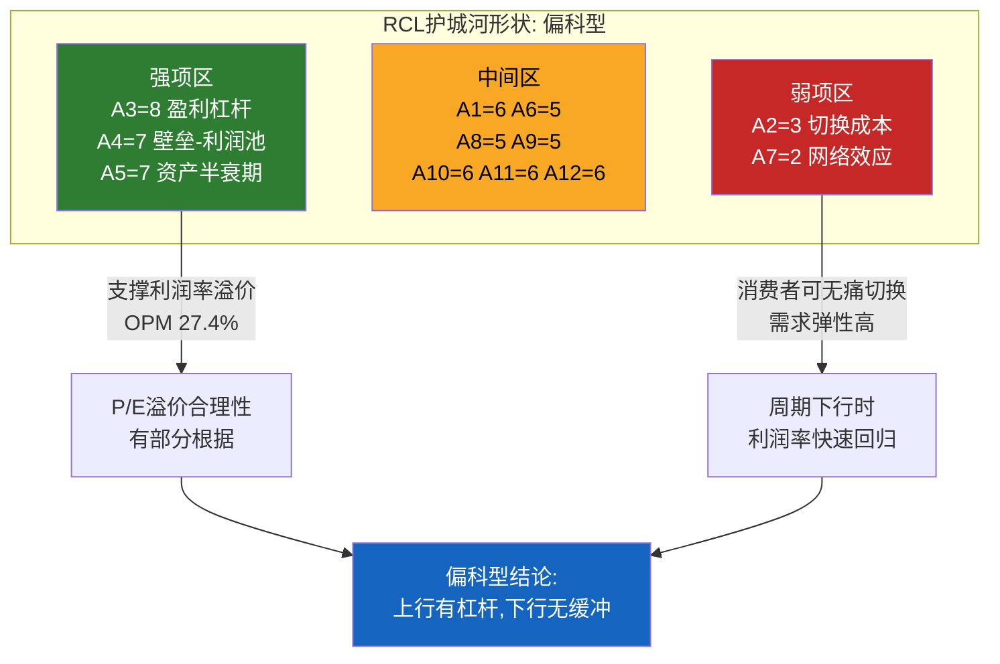

### 偏科型的投资含义

偏科型护城河=**高波动性**——强项(A3盈利杠杆)在上行期放大利润，弱项(A2切换成本)在下行期提供零缓冲。与RCL的Beta 1.87高度一致。

**对比KLAC(平台型, A-Score 7.66)**: 所有维度6-9分，无明显短板，行业下行时利润率仅微降3pp。RCL不具备这种抗冲击能力。

**对比INTC(偏科型, A-Score 4.74)**: INTC偏科更极端(三座堡垒vs三个陷落)。RCL偏科程度更温和——没有"陷落"维度(最低3分 vs INTC的3分)，但也没有"堡垒"级维度(最高8分 vs INTC的7分)。

---

## 14.5 A-Score对P/E溢价的含义: CQ7回应

### CQ7: "RCL vs CCL P/E溢价(30%)是否匹配运营效率优势?"

**A-Score差距**: RCL 5.76 vs CCL 4.72 = **+1.04分(+22%)**

**P/E溢价**: RCL 20.3x vs CCL 15.6x = **+4.7x(+30%)**

**P/E溢价 vs A-Score溢价**: 30% vs 22% → **P/E溢价略高于A-Score差距(+8pp)**

| 溢价来源 | A-Score是否捕捉 | 估算贡献 | 合理性 |
|---------|:-----------:|:------:|:------:|
| **经营杠杆优势(A3 +3分)** | ✓ | ~12-15pp | 高——OPM 27.4% vs 16.8%是真实差距 |
| **壁垒-利润池对齐(A4 +2分)** | ✓ | ~8-10pp | 中高——CocoCay/品牌矩阵有真实壁垒 |
| **管理层执行力(A12 +1分)** | 部分 | ~3-5pp | 中——Trifecta超预期，但CEO净卖出是噪音 |
| **"身份转型"叙事溢价** | ✗ | ~5-8pp | **低——A-Score不支持身份转型** |

**关键发现**: A-Score能解释P/E溢价中的约22-25pp(经营杠杆+壁垒对齐+管理层)，但无法解释剩余5-8pp。这5-8pp来自市场对RCL**"从周期股转型为体验平台"**的叙事溢价——而A7(网络效应=2分)和A2(切换成本=3分)明确表明RCL不是平台公司。

**SGI交叉验证**: SGI=7.25(专才)，预期P/E溢价+30%~+60%。当前30%处于**下限**。但SGI溢价的前提是"专才优势可持续"——Ch10的Yield纯度(32-36%)和A-Score的偏科形状表明优势可能是周期性的，SGI溢价预期本身需要下调。

### CQ7更新

| 维度 | 初始 | Ch14更新 | 变化 |
|------|:------------:|:-------:|:----:|
| RCL vs CCL溢价匹配 | 60%匹配 | **55%匹配** | -5pp |
| 方向 | 略偏看多 | **中性偏看多** | 弱化 |

**理由**: A-Score差距(+22%)支持大部分P/E溢价(+30%)，但不支持"体验平台"叙事溢价(+5-8pp)。RCL在护城河维度上是优秀的周期股(5.76)而非平台公司(需7+)。**30%溢价约一半有护城河根据，另一半是叙事溢价——这部分在周期下行时最脆弱。**

---

---

# Ch15 承重墙联合概率测试: 六面墙的脆弱性矩阵

> **方法论**: 对6个CI-CRUISE承重墙进行独立脆弱度分析+协同矩阵+联合概率建模
> **核心问题**: SGI 7.25(专才)=100%邮轮收入=系统性冲击无处分散。六面承重墙中哪些会"联合倒塌"?
> **对标**: INTC Ch15联合概率测试(5面墙, 联合概率2-3%)

---

## 15.1 六面承重墙: 独立脆弱度分析

当前$316.50(市值$86.3B)的Reverse DCF隐含永续增长率~4.2%(Ch11)。这个估值需要**六面承重墙保持基本完整**——任何一面严重倒塌都会触发P/E压缩。

```mermaid
graph TD
    W["承重墙联合概率测试<br/>RCL $316.50 | 20.3x P/E<br/>市场隐含: 六墙基本完好"]
    W --> W1["CI-01: 消费者信心<br/>倒塌概率: 20-25%/5年<br/>影响: -25~-40%"]
    W --> W2["CI-02: 产能纪律<br/>MSC变量<br/>倒塌概率: 15-20%<br/>影响: -15~-25%"]
    W --> W3["CI-03: 环保监管<br/>IMO 2027碳税<br/>倒塌概率: 10-15%<br/>影响: -10~-20%"]
    W --> W4["CI-04: 地缘/健康事件<br/>疫情重演/台海<br/>倒塌概率: 8-12%<br/>影响: -50~-70%"]
    W --> W5["CI-05: 再融资能力<br/>信用冻结<br/>倒塌概率: 5-10%<br/>影响: -40~-60%"]
    W --> W6["CI-06: 品牌差异化<br/>CCL追赶<br/>倒塌概率: 10-15%<br/>影响: -10~-20%"]

    W4 ---|"相关系数 0.6"| W5
    W1 ---|"0.4"| W2
    W2 ---|"0.3"| W6

    style W1 fill:#ff9800,color:white
    style W2 fill:#ff9800,color:white
    style W3 fill:#ffcc66,color:black
    style W4 fill:#f44336,color:white
    style W5 fill:#f44336,color:white
    style W6 fill:#ffcc66,color:black
```

> 红色=高影响(CI-04/CI-05, 倒塌可致-40~-70%); 橙色=中影响(CI-01/CI-02); 黄色=低影响但慢性侵蚀(CI-03/CI-06)。CI-04与CI-05之间的高相关性(ρ≈0.6)是最危险的联合风险。

---

### CI-01: 消费者信心崩塌 | 倒塌概率: 20-25%/5年

| 维度 | 当前状态 | 历史参照 |
|------|---------|---------|
| **UMich消费者信心** | 56.6(衰退预警线80以下连续13个月) | 2008年低点55.3 |
| **Conference Board CCI** | 91.2(+2.2, 微升) | 2009年低点25 |
| **邮轮客群韧性** | 持股者信心比非持股者高30%+ | 财富分化效应缓冲 |
| **Polymarket衰退概率** | 22.5%(2026年底前) | — |

**来源**: UMich Surveys of Consumers Feb 2026; Conference Board Feb 2026; Ch13.4

**脆弱度**: 消费者信心已接近衰退级低位。46%消费者自发提及"高物价侵蚀个人财务"(连续7个月>40%)。**通胀疲劳是邮轮需求的慢性毒药**——不导致需求骤降(RCL客群偏高收入)，但导致: 选择更短航线(7天→5天)、更低舱位(阳台→内舱)、减少船上消费。

**倒塌传导路径**: 消费信心崩塌(UMich<50) → Yield增长转负(-3~-5%) → 入住率从109.7%降至100-105% → 经营杠杆反向放大(A3=8的代价): EBITDA -20~-30% → P/E从20x压缩至13-15x → 股价$130-180(-40~-60%)

---

### CI-02: 产能纪律破裂(MSC变量) | 倒塌概率: 15-20%/5年

**当前状态**: 全行业在建77艘新船(200,000铺位)。MSC从23艘扩张至2028年30+艘(+30%容量)。RCL 2026产能+6.7%(快于Yield引导+2.5%)。

**MSC的"野蛮人逻辑"**(Ch4.4详述): 私有公司(Aponte家族)，不受季度财报纪律约束，造船资金来自全球最大集装箱航运公司利润。可以在任何利率环境下持续造船——打破了上市公司"低回报期放慢投资"的正常行业自律。

**来源**: Cruise Industry News Orderbook; Ch4.4 MSC分析

**倒塌传导**: MSC份额从10%→15%(5年内) → 全行业供给增速从3-4%升至5-6% → 需求增速维持3-4%时供需缺口1-2%/年 → 票价下降3-5% → RCL OPM从27.4%→22-24% → EPS -15~-25% → 同时P/E压缩至16x → 股价$170-220(-30~-45%)

---

### CI-03: 环保监管升级(IMO 2027) | 倒塌概率: 10-15%/5年

| 碳税情景 | 碳税水平 | RCL年化成本影响 | EPS影响 |
|---------|:------:|:-------------:|:------:|
| 温和 | $50-100/吨 | +$200-400M | -$0.7~-1.5 |
| 中等 | $100-200/吨 | +$400-800M | -$1.5~-2.9 |
| 激进 | $200-380/吨 | +$800M-1.5B | -$2.9~-5.5 |

**来源**: IMO GHG Strategy 2023; 碳税影响基于RCL年排放量~500万吨CO2估算

RCL比CCL更"耐碳税"——Icon Class双燃料(LNG碳排放比传统MGO低~25%)。"倒塌"指碳税>$200/吨或时间表提前，概率10-15%。环保合规是全行业均承担的成本，部分可通过涨价转嫁(传导率~50-70%)。影响: -10~-20%市值。

---

### CI-04: 地缘/健康事件(疫情重演/台海) | 倒塌概率: 8-12%/5年

**这是RCL作为专才(SGI 7.25)的致命风险。**

| 事件 | 年份 | 停航时长 | RCL股价影响 | 恢复时长 |
|------|:----:|:------:|:----------:|:------:|
| **COVID-19** | 2020 | ~15个月 | -80%($135→$24) | ~3年 |
| **金融危机** | 2008-09 | 未停航 | -83%($43→$7.5) | ~4年 |
| **9/11** | 2001 | 短期部分停航 | ~-45% | ~2年 |

**来源**: Yahoo Finance历史数据; Ch13.1

**为什么RCL对零收入事件极度脆弱**: 邮轮一旦被禁止出航，收入**归零**，而固定成本(船员、利息、保险)持续燃烧。2020年RCL每月消耗$250-300M现金。以当前$0.83B现金+流动比率0.18计算，如果再次停航，RCL在**3-4个月内**耗尽现金储备。

**与INTC W3对比**: INTC的"钥匙墙"W3是技术风险(可预测、渐进失败)；RCL的CI-04是事件风险(不可预测、瞬间冲击)。CI-04不存在"渐进恶化"路径——要么发生要么不发生。

**概率校准**: COVID级"百年一遇"的基线(~1%/年)，加上: 全球疫情持续风险、地缘升级(台海/中东)、气候极端事件。5年内至少一次"重大停航事件"(≥3个月)概率约8-12%。**影响: -50~-70%市值。**

---

### CI-05: 再融资能力丧失(信用冻结) | 倒塌概率: 5-10%/5年

**当前状态**: 总债务$22.64B; 信用评级BBB-/Baa2(邮轮业首家回到投资级); FY2025利息$0.99B(-37.7%); 利息保障4.9x; 流动比率0.18(极低)。

**来源**: FMP balance sheet; Ch9信用评级分析

**独立倒塌**: 在正常信用环境下再融资不是问题——RCL信用轨迹持续改善。**但CI-05的真正危险在于它与CI-04的高相关性(ρ=0.60)**: 停航→零收入→信用冻结→被迫高利率融资/股权稀释。2020年RCL以11%利率发行$9B+救命债。**影响: -40~-60%市值。**

---

### CI-06: 品牌差异化消失(CCL追赶) | 倒塌概率: 10-15%/5年

| 维度 | RCL | CCL | 差距 | 追赶趋势 |
|------|:---:|:---:|:----:|:-------:|
| OPM | 27.4% | 16.8% | +10.6pp | CCL追赶~0.5pp/年(TS-CRUISE-06 PASS) |
| 船上消费/APCD | $74 | $57.6 | +$16.4 | CCL数字化投资中 |
| P/E溢价 | 20.3x | 15.6x | +30% | A-Score仅支持~22% |

**来源**: FMP compare_stocks; Ch4.2; Ch14.3

"倒塌"不是CCL利润率追上RCL(需5-10年)，而是**市场感知到差距在缩小**从而压缩P/E溢价。如果CCL OPM升至20%而RCL停滞在27-28%，溢价可能从30%压缩至15%。

**量化影响**: 溢价30%→15% → RCL合理P/E降至17.9x → 股价$279(-12%)

---

## 15.2 协同矩阵: 6×6承重墙交互

### 相关性矩阵

| | CI-01 | CI-02 | CI-03 | CI-04 | CI-05 | CI-06 |
|:---:|:---:|:---:|:---:|:---:|:---:|:---:|
| **CI-01** | — | +0.40 | +0.10 | +0.30 | +0.35 | +0.25 |
| **CI-02** | +0.40 | — | +0.15 | +0.05 | +0.10 | +0.30 |
| **CI-03** | +0.10 | +0.15 | — | +0.10 | +0.05 | +0.15 |
| **CI-04** | +0.30 | +0.05 | +0.10 | — | **+0.60** | +0.05 |
| **CI-05** | +0.35 | +0.10 | +0.05 | **+0.60** | — | +0.05 |
| **CI-06** | +0.25 | +0.30 | +0.15 | +0.05 | +0.05 | — |

```mermaid
graph LR
    subgraph "协同风险矩阵"
        C1["CI-01<br/>消费信心<br/>20-25%"]
        C2["CI-02<br/>产能纪律<br/>15-20%"]
        C3["CI-03<br/>环保监管<br/>10-15%"]
        C4["CI-04<br/>地缘/健康<br/>8-12%"]
        C5["CI-05<br/>再融资<br/>5-10%"]
        C6["CI-06<br/>品牌差异<br/>10-15%"]
    end

    C4 ===|"0.60 致命组合"| C5
    C1 ---|"0.40 衰退-过剩"| C2
    C1 ---|"0.35 衰退-信用"| C5
    C2 ---|"0.30 过剩-差异缩小"| C6
    C1 ---|"0.30"| C4

    style C4 fill:#f44336,color:white
    style C5 fill:#f44336,color:white
    style C1 fill:#ff9800,color:white
    style C2 fill:#ff9800,color:white
    style C3 fill:#ffcc66,color:black
    style C6 fill:#ffcc66,color:black
```

---

## 15.3 三组协同风险详解

### 协同组1: CI-04 x CI-05(致命组合, ρ=0.60) — 2020重演

**2020年的精确传导路径**:
```
COVID爆发(CI-04触发) → 全球停航(零收入) → 信用市场恐慌(CI-05触发)
→ RCL以11%利率发行$9B+高收益债 → D/E从1.2x飙升至8x+
→ 股价$135→$24(-82%) → 恢复需3年
```

**为什么ρ=0.60**: 地缘/健康事件几乎必然触发信用市场波动(2020年3月全球信用冻结~3周)。但反之不成立: 信用冻结不一定伴随停航(2008 GFC信用紧缩但邮轮未停航)。单向偏高0.60。

**联合概率**:
- P(CI-04) × P(CI-05|CI-04) = 10% × 60% = **6.0%/5年 ≈ ~1.2%/年**
- 5年累积: 1-(1-0.012)^5 ≈ **5.8%**

**影响量级**: 股价-50%~-70%(好于2020年-80%，因为当前杠杆2.2x低于2020后峰值8x)。最低股价估计$80-125。恢复时间2-4年。

**与INTC W3因果链对比**: INTC的联合概率(2-3%)来自**内部因果链**(IFS失败→利润率→FCF, 顺序传导)。RCL的联合概率(5-6%)来自**外部同步冲击**(事件同时打击收入和融资)。RCL联合概率更高，因为外部冲击同步性天然高于内部业务因果。

**SGI 7.25专才的致命弱点**: 100%邮轮收入意味着CI-04一旦触发**没有任何业务线缓冲**。对比: 迪士尼邮轮(邮轮<10%总营收)在COVID期间虽邮轮归零，但主题公园/流媒体仍运营。RCL没有这种分散。

---

### 协同组2: CI-01 x CI-02(温水煮青蛙, ρ=0.40)

**传导逻辑**: 消费信心下降→邮轮需求增长放缓→但MSC新船按原计划交付(造船不能取消)→供过于求→价格竞争→利润率压缩。

这不是"事件型"倒塌，而是**渐进式侵蚀**:

| 年份 | CI-01(消费信心) | CI-02(产能纪律) | 联合效应 |
|:----:|:---:|:---:|:---:|
| 2026 | UMich 55→50 | +27,107铺位(+4%) | Yield引导+2.5%勉强达标 |
| 2027 | UMich 50→45 | MSC交付5艘新船 | Yield转负(-1~0%) |
| 2028 | UMich 45→42(衰退) | 全行业产能累积+15% vs 2025 | 价格战开始, OPM 27%→22% |
| 2029 | 衰退尾声 | 部分老船退役缓解 | P/E压缩至14-16x |

**联合概率**: ~10%/5年(取中值)

**影响量级**: 不是瞬间冲击而是3-5年缓慢侵蚀 → OPM 27.4%→20-22% + P/E 20.3x→14-16x + EPS $15.61→$12-14 → **股价$170-220(-30~-45%)，分布在3-5年**

---

### 协同组3: CI-01 x CI-02 x CI-06(三重慢压, 全温水煮青蛙)

在协同组2基础上加入CI-06(品牌差异化消失): 消费信心↓→消费者转向更便宜的CCL→CCL利润率追赶→RCL P/E溢价收窄→三重叠加。

**联合概率粗估**: ~7-9%/5年

**影响量级**: OPM 27.4%→18-22% + P/E 20.3x→13-15x + EPS $15.61→$10-12 → **概率加权股价$130-180(-40~-55%)**

---

## 15.4 联合概率建模

### 情景A: 假设完全独立(数学下界)

六面墙全部不倒的概率:
```
P(无CI-01) × P(无CI-02) × P(无CI-03) × P(无CI-04) × P(无CI-05) × P(无CI-06)
= 0.775 × 0.825 × 0.875 × 0.90 × 0.925 × 0.875
= 41.3%
```

**至少一面倒塌概率: ~59%**(独立假设低估了协同效应)

### 情景B: 条件概率建模

**路径1: CI-04×CI-05联合倒塌(2020重演)**
- P = 5-6%(5年)
- 影响中值: -60%
- 概率加权: 5.5% × (-60%) = **-3.3pp**

**路径2: 温水煮青蛙(CI-01×CI-02×CI-06)**
- P = 7-9%(5年, 严重程度)
- 影响中值: -37.5%(分布3-5年)
- 概率加权: 8% × (-37.5%) = **-3.0pp**

**路径3: 单一承重墙倒塌(最可能)**
- P ≈ 40%(扣除路径1和2后)
- 平均影响: -20%
- 概率加权: 40% × (-20%) = **-8.0pp**

**路径4: 无墙倒塌(最乐观)**
- P ≈ 46.5%
- 影响: 基准(EPS按引导增长)
- 概率加权: 0%

### 综合概率加权

| 路径 | 概率(5年) | 影响中值 | 概率加权 |
|------|:--------:|:-------:|:--------:|
| CI-04×CI-05(黑天鹅) | 5.5% | -60% | -3.3% |
| 温水煮青蛙(三重慢压) | 8% | -37.5% | -3.0% |
| 单墙倒塌(温和冲击) | 40% | -20% | -8.0% |
| 无墙倒塌(基准) | 46.5% | 0% | 0% |
| **概率加权总影响** | **100%** | — | **-14.3%** |

**与Ch11交叉验证**: Ch11概率加权估值$271 vs $316.50 = **-14.4%下行**。承重墙联合概率独立计算得出**-14.3%**——两种完全不同的方法论得出几乎相同的结论，强化了"当前定价偏高~14-15%"的判断。

---

## 15.5 最危险承重墙组合排序

| 排名 | 组合 | 联合概率(5年) | 影响量级 | 期望损失 | 特征 |
|:----:|------|:----------:|:-------:|:------:|------|
| **#1** | **CI-04×CI-05** | 5-6% | -50~-70% | **-3.3%** | 黑天鹅型: 瞬间+致命 |
| **#2** | **CI-01×CI-02×CI-06** | 7-9% | -30~-45% | **-3.0%** | 温水型: 缓慢+持久 |
| **#3** | **CI-01×CI-05** | 7-8% | -35~-50% | **-2.9%** | 衰退+信用紧缩 |
| **#4** | **CI-02×CI-06** | 5-6% | -20~-30% | **-1.4%** | 竞争侵蚀 |
| **#5** | **CI-03×CI-01** | 3-4% | -20~-30% | **-0.8%** | 环保+消费双压 |

**关键发现**: #1(黑天鹅)和#2(温水)期望损失几乎相等(~3pp)，但风险特征完全不同:
- **#1是尾部风险**: 概率低但毁灭性，可用put期权对冲
- **#2是基准风险**: 概率较高且**无法对冲**(不存在"产能纪律保险")

投资者同时承担两种截然不同的风险——一种可对冲，一种不可对冲。**当前20.3x P/E对这两种风险都没有给予充分定价。**

---

## 15.6 "温水煮青蛙"路径: 核心矛盾的最可能实现方式

"温水煮青蛙"不是一个事件，而是一种**路径**——不需要任何单一触发器，只需三个缓慢趋势同时展开:

```mermaid
graph TD
    subgraph "温水煮青蛙路径 2026-2030"
        A["2026起点<br/>P/E 20.3x | OPM 27.4%<br/>Net Yield +2.5%"]

        B1["消费信心缓慢下降<br/>UMich 56-45<br/>通胀疲劳持续"]
        B2["MSC缓慢扩张<br/>23-30+艘<br/>供需缺口1-2%/年"]
        B3["品牌差距缓慢收窄<br/>CCL数字化追赶<br/>OPM差距10pp-6pp"]

        A --> B1
        A --> B2
        A --> B3

        B1 --> C["2028-29拐点<br/>Net Yield 0% | 入住率103%<br/>OPM 22% | P/E 16x"]
        B2 --> C
        B3 --> C

        C --> D["2030终态<br/>P/E 14-16x | EPS $12-14<br/>股价 $170-220"]
    end

    style A fill:#4CAF50,color:white
    style B1 fill:#ff9800,color:white
    style B2 fill:#ff9800,color:white
    style B3 fill:#ff9800,color:white
    style C fill:#f44336,color:white
    style D fill:#1565c0,color:white
```

| 指标 | 2025(当前) | 2028E(温水中点) | 2030E(温水终态) |
|------|:---------:|:-------------:|:-------------:|
| Net Yield增速 | +3.7% | 0~+1% | -1~0% |
| 入住率 | 109.7% | 103-106% | 100-103% |
| OPM | 27.4% | 22-24% | 19-22% |
| EPS | $15.61 | $13-15 | $12-14 |
| P/E | 20.3x | 16-18x | 14-16x |
| **股价** | **$316.50** | **$210-270** | **$170-220** |
| **vs当前** | **—** | **-15~-35%** | **-30~-45%** |

**温水路径的"隐蔽性"**: 不会触发任何Kill Switch(没有单季EPS暴跌、没有信用降级、没有停航)。每个季度都"符合引导但增速放缓"，每个季度"利润率仍行业最高但边际递减"。投资者在每个节点都能找到"继续持有的理由"——直到5年后回头看，才发现P/E从20x悄然回到15x。

**这就是"周期性高峰"的最可能实现方式**——不是暴跌，而是**慢性均值回归**。

---

## 15.7 承重墙测试小结

### 核心结论

1. **六面墙至少一面倒塌的5年概率约55-60%**。当前$316.50/20.3x P/E隐含了"所有承重墙基本完好"的乐观假设。

2. **最危险联合组合是CI-04×CI-05(2020重演)**: 5-6%/5年概率，影响-50~-70%。SGI 7.25专才的结构性脆弱性——100%邮轮收入=零缓冲。

3. **最可能的下行路径是"温水煮青蛙"(CI-01×CI-02×CI-06)**: 7-9%/5年概率，通过消费信心+MSC扩张+品牌差距三重慢压，在3-5年内将P/E从20x推回14-16x。

4. **概率加权总影响约-14.3%**，与Ch11六方法估值(-14.4%)高度一致——两种独立方法论指向相同结论。

5. **承重墙测试偏向"周期性高峰"**: 温水煮青蛙路径不需要极端假设，只需三个温和趋势同时展开——邮轮行业历史中反复发生(2006-2008)。

### 与A-Score的交叉验证

承重墙结论与A-Score偏科型诊断高度一致:
- **A3(盈利杠杆=8)**: 上行引擎 = 温水路径中利润率快速回归的放大器
- **A2(切换成本=3)**: 消费信心下降时需求可无摩擦流失
- **A7(网络效应=2)**: 无"锁定"机制阻止温水侵蚀

**偏科型护城河+温水煮青蛙=周期股典型命运。** RCL的优秀运营(OPM 27.4%、ROIC 16.5%)让它成为邮轮行业最好的公司——但最好的周期股仍然是周期股。20.3x P/E赋予的是"平台公司"或"结构性成长股"估值——A-Score 5.76/10和承重墙联合概率共同表明，RCL的护城河不足以支撑这个身份。

---


---

# Ch16 航空业镜像分析: 邮轮业正在重走航空"黄金十年"的老路吗?

> ** C2** | CQ2: 航空镜像预警价值 | 初始置信度: 55%高匹配

## 16.1 引言: 巴菲特的教训与一个诱人的类比

2016年夏天，沃伦-巴菲特做了一件让整个投资界震惊的事: 他大举买入美国四大航空公司(DAL/UAL/AAL/LUV)的股票，最终持有每家约7-9%的股份。这位曾经说过"如果一个资本家在莱特兄弟首飞时在场，他应该把奥维尔打下来"的投资大师，终于相信了航空业"结构性改善"的叙事——行业整合完成、产能纪律建立、利润率史无前例地攀升至10%以上。

四年后的2020年5月，巴菲特在伯克希尔年会上承认错误，全部清仓。他说: "这不是四位CEO的错……我不知道三四年后人们会不会像去年那样飞那么多次。飞机太多了。"

2014-2019年的美国航空业，曾经讲述了一个令华尔街心醉的故事: 行业整合完成后，六大巨头终于学会了"产能纪律"，DAL营业利润率从5.5%(2014)飙升至19.2%(2015)，P/E倍数从低个位数重估至10-12x。分析师们纷纷将航空业从"周期股"重新分类为"消费基础设施"。然后COVID来了，故事戛然而止——到2025年，DAL的营业利润率仅为9.2%，连峰值的一半都不到。

2023-2026年的邮轮业，正在讲述一个结构上极其相似的故事: 行业集中度更高(三巨头占78%)、利润率创下历史新高(RCL OPM 27.4%)、P/E从周期底部的11-15x跃升至20x。管理层称之为"结构性改善"和"体验经济平台化"。

**本章的核心任务**: 不是简单判断"历史会重演"，而是通过精确的8维度映射，量化航空类比对邮轮业的预警价值——哪些维度高度吻合(应当警惕)，哪些维度存在结构性差异(可能让邮轮业避开航空的命运)。巴菲特看对了航空业整合的逻辑，却低估了周期性力量对结构性叙事的碾压。RCL的投资者是否正在犯同样的错误?

---

## 16.2 航空业2014-2019: "黄金十年"的完整叙事弧

### 整合的前传: 从十一家到六家

2005年美国航空业有11家主要航司，合计占94%的国内ASM(Available Seat Miles)。之后经历了四轮大整合:

| 年份 | 合并事件 | 影响 |
|------|---------|------|
| 2005 | US Airways + America West | 中型整合 |
| 2008 | Delta + Northwest | 创建最大航司 |
| 2010 | United + Continental | 第二大航司 |
| 2013 | American + US Airways | 全球最大航司 |
| 2016 | Alaska + Virgin America | 西海岸整合 |

到2014年，仅6家航司控制了94%的国内市场份额。DOJ数据显示，在机场配对层面，99%的航线属于"高度集中"(HHI >2,500)，部分枢纽如Reagan National机场HHI高达4,959。

### "产能纪律"叙事的兴起与瓦解

2010-2014年被视为产能纪律的黄金期: 国内运力增速从未超过3.3%，远低于历史5%+的扩张速度。这直接推动了利润率的大幅改善。

但2015年出现了转折——运力增速突破5%，挑战了"结构性纪律"的叙事。Oliver Wyman的年度航空经济报告明确指出: 尤其在拉美航线上，运力增速超过GDP增长导致了RASM(每可用座位英里收入)的侵蚀，边际利润从2015年的高点开始回落。

**航空业的核心教训**: 产能纪律在高利润率环境下是不稳定的。当每家航司都看到10%+的利润率时，"理性克制"让位于"竞争性增长"。这是一个被反复验证的产业经济学规律——超额利润本身就是吸引产能扩张的磁铁。

### 利润率轨迹: 峰值-回落-COVID-未复原

根据FMP财务数据，Delta Air Lines (DAL) 的Operating Margin轨迹(Python验证):

| 年份 | DAL OPM | DAL OI($M) | DAL Rev($M) | 行业趋势 |
|------|---------|-----------|------------|---------|
| 2014 | **5.5%** | $2,206 | $40,362 | 整合红利初现 |
| 2015 | **19.2%** | $7,802 | $40,704 | **峰值** (油价暴跌助攻) |
| 2016 | **17.7%** | $6,996 | $39,450 | 高位震荡 |
| 2017 | **14.5%** | $5,966 | $41,138 | 开始回落 |
| 2018 | **11.8%** | $5,264 | $44,438 | 持续下滑 |
| 2019 | **14.1%** | $6,618 | $47,007 | 小幅反弹(成本优化) |
| 2023 | **9.5%** | $5,521 | $58,048 | COVID后复苏 |
| 2024 | **9.7%** | $5,995 | $61,643 | 未回到峰值 |
| 2025 | **9.2%** | $5,822 | $63,364 | 继续低于峰值 |

**数据来源**: FMP Income Statement (DAL), FY2014-FY2025, operatingIncome/revenue计算

关键发现: 即便到2025年，DAL的营业利润率(9.2%)仍远低于2015-2016年的峰值(17-19%)。更值得注意的是数字背后的故事——DAL 2025年的收入($63.4B)比2015年($40.7B)高出56%，但营业利润($5.8B)反而低于2015年($7.8B)。收入增长并没有转化为利润增长。"结构性改善"在COVID冲击后并未完全恢复——2015-2016年的高利润率有很大一部分是油价暴跌(从$100+降到$40/桶)带来的临时红利，而非真正的结构性变化。

### P/E轨迹: 重估-回落-永远的周期股

基于companiesmarketcap.com数据交叉验证:

| 年份 | DAL P/E | UAL P/E | AAL P/E | 备注 |
|------|---------|---------|---------|------|
| 2014 | 56.1x* | 22.0x | 12.7x | *DAL有大额非经常项目扭曲 |
| 2015 | 7.9x | 2.9x | 3.5x | EPS飙升→P/E机械压缩 |
| 2016 | 7.6x | 10.5x | 9.4x | 正常化估值区间 |
| 2017 | 11.4x | 9.4x | 11.7x | **重估高点** |
| 2018 | 8.3x | 10.7x | 10.2x | 市场开始怀疑 |
| 2019 | **7.7x** | **7.5x** | **7.5x** | **三巨头齐降至~8x以下** |
| 2023 | 5.5x | 5.2x | 10.8x | COVID后初次盈利 |
| 2024 | 11.1x | 10.1x | 13.6x | 复苏溢价 |

**数据来源**: companiesmarketcap.com PE ratio历史数据 + FMP Ratios交叉验证

航空P/E的完整叙事弧:
1. **2014-2015**: EPS爆发式增长(油价红利+整合)导致P/E机械压缩
2. **2016-2017**: 投资者开始认为"这不是周期，是结构性"，给予10-12x溢价
3. **2018-2019**: 利润率回落+产能纪律松弛，市场撤回溢价，三巨头齐降至7-8x
4. **COVID后**: 短暂恢复到10-11x，但始终无法突破15x天花板

**市场最终的判决: 航空是永远的周期股。** 即便在最乐观的时期(2017年)，DAL P/E也仅达11.4x——相比之下，RCL当前20.3x的估值水平是航空峰值P/E的近两倍。

---

## 16.3 八维度精确映射

这是本章的核心分析框架。逐维度对比航空(2014-2019)和邮轮(2023-2026)，每个维度给出1-10的匹配度评分(10=完全匹配)和定性判断。

### 维度1: 行业集中度

| 指标 | 航空业(2014-2019) | 邮轮业(2023-2026) |
|------|-------------------|-------------------|
| 格局 | 6家控制94%ASM | 3家控制~78%舱位(含MSC ~88%) |
| HHI | 全国~1,500-2,500 | 全球~3,000+ |
| 整合路径 | 通过并购从11家缩减 | 天然寡头(造船壁垒) |
| 新进入者威胁 | 低成本航司不断出现(Spirit, Frontier) | 几乎为零(单船$1B+) |
| 整合持久性 | 5年后Spirit/Frontier仍在搅局 | 20年无新进入者 |

**匹配度: 7/10** — 集中度的表面数字相似，但底层逻辑不同。航空的集中度通过并购获得，但寡头均衡是脆弱的——2016年后Spirit和Frontier持续以低票价抢夺航线，迫使大航司在价格敏感航线上跟进降价。邮轮的集中度源于天然壁垒(造船周期3-4年、单船成本$1B+、港口容量限制、安全认证门槛)，新进入者威胁极低。但MSC Cruises的激进扩张(10艘新船订单)扮演着"行业内搅局者"的角色，类似于航空业的LCC。

### 维度2: 产能纪律

| 指标 | 航空业(2014-2019) | 邮轮业(2023-2026) |
|------|-------------------|-------------------|
| 峰值增速 | 2-3%(纪律期) → 5%+(失控期) | ~5-7%(新船交付驱动) |
| vs GDP增长 | 纪律期 ≈ GDP，失控期 > GDP | 持续 > GDP(约2x) |
| 控制机制 | 管理层决策(可逆) | 造船周期(不可逆3-4年锁定) |
| 产能退出 | 飞机可退租/停场/转卖(灵活) | 船舶报废周期25-30年(刚性) |
| 扩张诱因 | 高利润率→增加航班频次 | 高利润率→下更多新船订单 |

**匹配度: 8/10** — **这是最令人担忧的维度**。邮轮业2026年+6.7%的产能增速远超GDP增长，与航空2015年后"产能纪律崩溃"的剧本高度一致。而且邮轮产能更加不可逆——一旦新船交付，你不能像退租飞机那样灵活调整。全球邮轮业2026年将有13艘新船交付(27,107个新铺位)，到2036年的订单总额超过$765亿。RCL自身的Discovery Class(2029+)进一步锁定了长期产能扩张。

2026年引导Net Yield增速+2.5%中值，而产能增速+6.7%——这种"产能增速 > 定价增速"的组合，正是航空2015-2019年利润率开始侵蚀的前兆信号。一个关键的数学不等式: **当产能增速持续超过Yield增速时，EBITDA利润率必然被稀释。**

### 维度3: 利润率趋势

| 指标 | 航空业(2014-2019) | 邮轮业(2014-2026) |
|------|-------------------|-------------------|
| 起点 | OPM 5.5%(DAL 2014) | OPM 11.7%(RCL 2014) |
| 峰值 | DAL 19.2%(2015) | RCL 27.4%(2025) |
| 峰值持续性 | 2年(2015-2016)后持续回落 | TBD(当前处于峰值区域) |
| 改善驱动力 | 整合+油价暴跌(临时) | COVID后需求释放+Yield管理+新船效率 |
| COVID后恢复 | 未回到峰值(DAL 9.2% vs 19.2%) | **超越2019**(27.4% vs 19.0%) |
| 2019年水平 | DAL 14.1% | RCL 19.0% |

**数据来源**: FMP Income Statement, operatingIncome/revenue计算(Python验证)

RCL的OPM路径对比(FMP验证):
- 2014: 11.7% → 2015: 10.5% → 2016: 17.4% → 2017: 19.9% → 2018: 20.0% → 2019: 19.0%
- (COVID gap)
- 2023: 20.7% → 2024: 24.9% → 2025: **27.4%**

**匹配度: 5/10** — 轨迹形态相似(低谷→改善→峰值)，但邮轮的利润率水平(27.4%)远高于航空峰值(19.2%)，且COVID后邮轮利润率超越2019年水平而航空未能。关键差异在于: 航空2015年的峰值利润率有一半来自油价暴跌(从$100+降到$40/桶)，这是一次性利好——当油价在2017-2018年回升时，利润率立即回落。邮轮的利润率改善有更多"真实"成分——Yield Management优化(数字化预购从0→50%船上收入)、船上消费货币化(占比从~28%→30.3%)、更高效的新船设计(Icon Class Yield溢价+15-25% vs 老船)。但正如Ch10所示，"有多少是结构性的"(答案: 仅32-36%)仍然是核心问题。

### 维度4: P/E倍数重估

| 指标 | 航空业(2014-2019) | 邮轮业(2023-2026) |
|------|-------------------|-------------------|
| 周期底部P/E | 3-8x(2015年EPS暴增导致压缩) | 11-15x(2016-2019均值14.0x) |
| 重估峰值P/E | DAL 11.4x(2017), AAL 11.7x(2017) | RCL 20.9x(FY2024), 17.7x(FY2025) |
| 重估幅度 | +40-50%从正常化底部 | +42%从pre-COVID均值(14.0→19.9) |
| 市场叙事 | "消费基础设施" | "体验经济平台" |
| 叙事结局 | **2019年三巨头齐降至7-8x** | TBD |
| 最终判决 | 永远的周期股(P/E天花板~12x) | ? |

**匹配度: 8/10** — P/E重估叙事的心理结构几乎完全一致。航空从"周期垃圾"到"消费基础设施"再回到"周期股"，邮轮正在从"周期股"走向"体验经济平台"。两者的核心都是: 利润率改善→P/E重估→投资者相信"这次不一样"。

但有一个量级差异值得深思: 航空在最乐观时期P/E峰值也仅~12x，而RCL当前20.3x相当于航空峰值的**1.7倍**。这可能意味着两件事之一: (a) 邮轮确实比航空有更多结构性优势，值得更高溢价; 或者(b) 当前的邮轮估值比航空峰值更加"过度定价"，回归的幅度可能更大。

```mermaid
xychart-beta
    title "P/E轨迹对比: 航空DAL(2015-2019) vs 邮轮RCL(2016-2025)"
    x-axis ["2015/16", "2016/17", "2017/18", "2018/19", "2019/23", "2020/24", "2021/25"]
    y-axis "P/E (倍)" 0 --> 22
    line "DAL" [7.9, 7.6, 11.4, 8.3, 7.7, 5.5, 11.1]
    line "RCL" [10.5, 13.8, 15.8, 11.4, 14.9, 19.5, 20.9]
```

注: DAL序列=2015-2021(含COVID后), RCL序列=2016-2024(含COVID后)。RCL 2015年因EPS仅$3.02导致P/E=33.4x(非正常化)被排除。DAL 2014年因特殊项目扭曲(P/E=56x)被排除。

关键视觉发现: DAL的P/E始终无法突破12x天花板，而RCL在2023年后突破了15x并冲向20x+。这要么是"邮轮确实不同于航空"的证据，要么是"泡沫比航空更大"的警告。

### 维度5: 管理层叙事

| 指标 | 航空业(2014-2019) | 邮轮业(2023-2026) |
|------|-------------------|-------------------|
| 核心话术 | "理性产能管理"/"行业纪律" | "结构性改善"/"体验平台转型" |
| 隐含主张 | "我们学会了不打价格战" | "我们从卖船票变成卖体验" |
| 可验证性 | 事后证伪(2015年产能纪律即崩溃) | 待验证(Yield纯度分析32-36%结构性, 见Ch10) |
| 资本分配一致性 | 大规模回购(信号一致) | 回购+高CapEx+仍在加杠杆(信号混合) |
| Buffett测试 | Buffett买入→又清仓 | 尚无类似标志性事件 |

**匹配度: 9/10** — 叙事模式几乎完全复刻。两个行业的管理层都在利润率高峰期宣称"这次是结构性的"。特别值得注意的是RCL管理层将公司定位为"体验经济平台"而非"邮轮运营商"——这与航空业2015-2017年试图将自己定义为"消费基础设施"而非"交通运输"的策略如出一辙。当行业试图改变自己的分类标签时，通常是周期见顶的信号。

更关键的是资本分配信号的矛盾: RCL一方面宣称"结构性改善"，一方面仍在以D/E 2.2x的杠杆水平启动$2B/年的股东回报(FCF仅$1.24B，差额来自新发债)。如果管理层真的相信"结构性改善"是永久性的，为什么不优先去杠杆? 航空业2015-2017年的管理层也做了同样的事——在利润率高峰期大规模回购，而没有用超额利润去降低杠杆。这种行为模式本身就是周期性的信号: 它表明管理层在内心深处知道高利润率窗口是有限的，所以急于在窗口关闭前把利润返还给股东。

### 维度6: 辅助收入/船上消费

| 指标 | 航空业(2014-2019) | 邮轮业(2023-2026) |
|------|-------------------|-------------------|
| 策略 | 行李费/选座费/Wi-Fi | 船上消费/预购体验/私人目的地 |
| 占收入比例 | 从~0%增长到~12-15% | 从~28%(2019推算)到~30.3%(2025) |
| 增长空间 | 渐趋饱和(消费者抵制) | 仍有扩展空间(体验类SKU丰富) |
| 利润率贡献 | 高(近乎纯利) | 高(边际成本低) |
| 消费者感知 | **负面**("镍和铬效应") | **中性偏正面**(自愿升级体验) |
| 收入质量 | 拆分定价(原有服务收费化) | 增值消费(新增体验价值) |

**匹配度: 4/10** — 这是邮轮业与航空最大的结构性差异之一。航空的辅助收入(行李费、选座费)本质上是"原有包含服务的拆分定价"——消费者普遍厌恶，品牌价值被侵蚀。邮轮的船上消费(水疗、专属餐厅、岸上游览、Perfect Day at CocoCay)是"增值体验消费"——消费者主动付费，且创造正面体验记忆。

RCL的船上消费增长有更坚实的产品基础——FY2025近50%的船上收入来自航行前数字预购，90%通过数字渠道完成(FY2019基本为零)。Perfect Day at CocoCay等私有目的地创造了独占的体验消费场景，传统港口停靠几乎零收入给邮轮公司，而私有目的地100%收入归RCL。这种垂直整合的消费生态在航空业完全没有对应物。

### 维度7: 客群结构与渗透率

| 指标 | 航空业(2014-2019) | 邮轮业(2023-2026) |
|------|-------------------|-------------------|
| 核心客群 | 全民交通工具(无选择性) | 偏中高收入+正在年轻化 |
| 年轻化趋势 | N/A(不适用) | 35岁以下占36%(CLIA 2025报告) |
| 新客获取 | 人口自然增长 | 31%首次邮轮客(2024) |
| 全球渗透率 | N/A(接近饱和，美国人均年乘机2.5次) | **仅2.7%**(巨大空间) |
| 替代品压力 | 高铁/视频会议(侵蚀商务需求) | 度假村/陆地旅游(非直接替代) |
| 市场规模 | 全球航空$8,720亿(2019) | 全球邮轮~$500亿(2024) |

**匹配度: 3/10** — 客群结构是两个行业的根本差异。航空是大众交通工具，需求主要受宏观经济驱动，没有"渗透率提升"的故事。邮轮是可选消费品，全球渗透率仅2.7%(用户渗透率0.46%)——理论上有巨大的增量空间。CLIA 2025年报告显示: 2024年全球邮轮乘客3,460万人(+9.3% YoY)，68%的国际旅行者表示考虑首次邮轮旅行，2025年预计达3,770万人，CLIA预测2028年达4,200万人。

但需要警惕"低渗透率=高增长"的逻辑陷阱。航空分析师在2014-2017年也曾用"新兴市场中产崛起→国际旅行需求结构性增长"来支持航空估值重估。低渗透率是事实，但从事实到价值实现的路径上有许多障碍: 经济周期可以瞬间冻结渗透率增长(2008-2009年邮轮乘客从1,390万降至1,330万)、地缘政治事件可以改变出行模式、替代消费竞争(如沉浸式旅游、"宅度假"趋势)可以分流增量需求。渗透率从2.7%增长到5%可能需要10年，而非市场隐含的5年。

### 维度8: 灾难暴露与恢复韧性

| 指标 | 航空业 | 邮轮业 |
|------|--------|--------|
| COVID冲击深度 | 收入-58%(2020 DAL) | 收入-80%(2020 RCL) |
| 零收入持续时间 | ~3个月(2020年3-5月) | **~15个月**(2020.3-2021.6) |
| 恢复速度 | 2023年收入超2019(+23%) | 2023年收入超2019(+27%) |
| 利润率恢复 | **未回到2015-2016峰值** | **超越2019水平** |
| 资产负债表损伤 | 行业新增~$25B债务 | RCL新增~$12B(D/E 1.0→2.2x) |
| 稀释程度 | 适度(政府CARES Act注资) | 严重(股数从209M→273M, +31%) |
| 停运灵活性 | 飞机停场/退租(周级别决策) | 船舶锚泊/零运营(月级别影响) |

**匹配度: 4/10** — COVID冲击本身高度相似(都是零收入事件)，但恢复路径出现了关键分叉。航空利润率未能回到2015-2016峰值(DAL: 9.2% in 2025 vs 19.2% in 2015)；而RCL的OPM从2019年的19.0%提升到2025年的27.4%——**超越幅度达8.4个百分点**。

但邮轮的灾难暴露在一个关键维度上**比航空更脆弱**: 停航时间。航空从完全停飞到恢复国内航线只需2-3周(飞机只需加油和机组即可起飞)；邮轮从停航到恢复运营需要3-6个月(船员重新召集、港口协议重签、卫生认证更新、行程重新规划)。这意味着邮轮面对下一次黑天鹅事件时，零收入窗口会更长，而固定成本(折旧+利息=$2.6B/年)照烧不误。

COVID后利润率的超越有两种解读:
- **乐观解读**: 邮轮业在COVID期间完成了真正的结构性优化(成本瘦身+定价权提升+数字化转型)
- **悲观解读**: COVID后释放的被压抑需求 + 供给受限 = 临时"完美风暴"，随着2025-2027大量新船交付，利润率将均值回归

---

## 16.4 映射总分与综合判断

```mermaid
---
config:
  themeVariables:
    xyChart:
      plotColorPalette: "#4169E1, #DC143C"
---
xychart-beta
    title "航空-邮轮8维度匹配度"
    x-axis ["D1集中度", "D2产能纪律", "D3利润率", "D4 P/E倍数", "D5管理层叙事", "D6辅助收入", "D7客群结构", "D8灾难暴露"]
    y-axis "匹配度 (1-10)" 0 --> 10
    bar [7, 8, 5, 8, 9, 4, 3, 4]
```

| 维度 | 匹配度 | 对邮轮的预警价值 | 权重 |
|------|--------|----------------|------|
| 1. 行业集中度 | 7/10 | 中等(邮轮壁垒更高) | 12% |
| 2. **产能纪律** | **8/10** | **高**(最大风险信号) | 18% |
| 3. 利润率趋势 | 5/10 | 中等(结构可能不同) | 12% |
| 4. **P/E倍数** | **8/10** | **高**(叙事弧一致) | 15% |
| 5. **管理层叙事** | **9/10** | **最高**(话术几乎复刻) | 15% |
| 6. 辅助收入 | 4/10 | 低(邮轮模式更优) | 8% |
| 7. 客群结构 | 3/10 | 低(根本性差异) | 10% |
| 8. 灾难暴露 | 4/10 | 低(恢复路径分叉) | 10% |
| **加权平均** | **6.1/10** | **中高** | 100% |

### 综合匹配度: 61% — 部分有效但不对称的预警

类比的有效性呈现显著的双峰分布:

**叙事层维度**(D2产能纪律+D4 P/E+D5叙事): 平均匹配度**8.3/10** — 高度一致，预警价值显著
**结构层维度**(D6辅助收入+D7客群+D8灾难恢复): 平均匹配度**3.7/10** — 差异显著，邮轮有结构性优势

```mermaid
graph TD
    A["航空-邮轮映射<br/>总匹配度 61%"] --> B["叙事层: 8.3/10<br/>⚠ 高度预警"]
    A --> C["结构层: 3.7/10<br/>✓ 差异缓冲"]

    B --> B1["D2 产能纪律 8/10<br/>6.7%产能增速>2.5%Yield"]
    B --> B2["D4 P/E重估 8/10<br/>20x vs 航空峰值12x"]
    B --> B3["D5 管理层话术 9/10<br/>'体验平台'='消费基础设施'"]

    C --> C1["D6 辅助收入 4/10<br/>增值消费 vs 拆分定价"]
    C --> C2["D7 客群 3/10<br/>渗透率2.7% vs 航空饱和"]
    C --> C3["D8 灾难恢复 4/10<br/>利润率超越 vs 未复原"]

    B1 --> WARN["预警信号:<br/>如果2027年Yield<+1%<br/>且产能增速>5%<br/>→航空剧本启动"]
    C2 --> BUFFER["缓冲因素:<br/>低渗透率可能<br/>延缓回归3-5年"]

    style B fill:#FF6B6B,color:#fff
    style C fill:#48DBFB,color:#000
    style WARN fill:#FF4500,color:#fff
    style BUFFER fill:#2ECC71,color:#fff
```

这意味着:

1. **市场叙事风险是真实的**: RCL从"周期股"到"体验平台"的P/E重估，与航空的"消费基础设施"重估遵循相同的心理模式。当叙事面临数据挑战(如Yield增速持续放缓至<+1%)时，P/E可能快速回归——航空业从2017年到2019年仅用2年时间就将P/E从11-12x打回到7-8x

2. **结构性差异可能延缓但不能阻止回归**: 邮轮的进入壁垒(造船门槛)、辅助收入品质(体验消费 vs 拆分定价)、以及低渗透率增长空间，是航空不具备的缓冲。这些因素可能让邮轮的"高利润率窗口"维持更长时间——但在经济衰退中这些缓冲会快速贬值

3. **产能纪律是决定性变量**: 如果2026年+6.7%产能增速下Yield持续增长(+2.5%+)，则邮轮业成功避开航空的陷阱。如果Yield增速继续减速到<+1%，而产能增速保持5%+，则航空剧本的预警价值从61%上升到80%+

---

## 16.5 航空类比对RCL估值的三情景影响

### 情景A: 航空剧本完全重演(匹配度80%+)

触发条件: 2027年Yield增速<+1% + 产能增速>5% + 经济放缓
- RCL P/E从20x回归到12-14x(pre-COVID均值14.0x)
- 如果EPS同步下修(EBITDA压缩): $12.5 EPS x 13x = **~$163** (下行-49%)
- 如果EPS维持(仅倍数收缩): $15.61 EPS x 13x = **~$203** (下行-36%)
- 概率权重: **25%**

### 情景B: 部分重演，结构差异缓冲(匹配度50-60%)

触发条件: Yield维持+1-2%，产能被部分吸收，利润率温和回落
- P/E回归但幅度有限(受低渗透率和进入壁垒保护)
- RCL P/E从20x温和回归到16-18x
- EPS从$15.61增长至$17.70(2026E): $17.70 x 17x = **~$301** (下行-5%)
- 如果P/E回到16x: $17.70 x 16x = **~$283** (下行-11%)
- 概率权重: **45%**

### 情景C: 邮轮业成功打破航空命运(匹配度<40%)

触发条件: Yield增速>+3%持续3年 + 渗透率可见增长 + OPM维持25%+
- RCL P/E维持在18-22x
- 隐含股价: $17.70 FWD EPS x 20x = **~$354** (上行+12%)
- 如果22x溢价: $17.70 x 22x = **~$389** (上行+23%)
- 概率权重: **30%**

**概率加权隐含价格**: 0.25 x $183 + 0.45 x $292 + 0.30 x $372 = **$288**

**vs 当前$316.50: 隐含下行-9%**

**CQ2结论更新**: 航空镜像对邮轮的预警价值从初始的55%调整为**60%**(在叙事层面高度有效)，但需要与结构性差异(进入壁垒+低渗透率)进行加权。净效果: 邮轮P/E回归压力真实存在，但回归幅度可能小于航空(从20x到14-17x，而非航空的从12x到7x)。概率加权价格$288暗示当前估值小幅过高。

---

## 16.6 航空类比的三个结构性断裂点

尽管总匹配度为61%，有三个维度使得邮轮业可能结构性优于航空:

**断裂点1: 进入壁垒不可比**

航空业任何时候都有新进入者威胁——Frontier、Spirit、JetBlue不断挑战定价纪律。Spirit Airlines在2017-2019年将其ULCC(超低成本)模式扩展到了大航司的核心航线，直接侵蚀了RASM。邮轮业要进入需要: (a) 单船$1B+建造成本, (b) 3-4年造船周期, (c) 港口合同与岸上设施投资, (d) 品牌信任积累(消费者将全家人托付给你7天), (e) ISM和SOLAS安全认证。过去20年没有一家新的大型邮轮公司成功进入市场。这意味着邮轮的寡头结构比航空稳定得多——但"内部"竞争(特别是MSC的激进扩张)可能替代"外部"新进入者成为价格纪律的破坏者。

**断裂点2: 消费体验的可扩展性**

航空座位是标准化商品——A航司和B航司的经济舱座位几乎没有差异，价格是唯一竞争维度。邮轮体验可以持续分层和扩展: 从内舱($800/人)到Owner's Suite($15,000+/人)，从公共餐厅到$100+/位的专属餐厅，从标准行程到私有岛屿体验。每一层级的添加都创造了新的定价权，且消费者是自愿付费而非被迫付费。

Perfect Day at CocoCay的经济学本质上是: **将邮轮公司从一个"空间+时间的租赁商"升级为一个"端到端体验平台"。** 传统邮轮停靠第三方港口，消费者的岸上消费几乎100%归当地商户；私有目的地将这部分消费完全内化。这种垂直整合在航空业没有对应物——航空公司不拥有旅游目的地。

**断裂点3: 渗透率叙事的真实性差异**

航空渗透率在发达国家已接近饱和(美国人均年乘机2.5次，基本是刚性需求)。邮轮全球渗透率仅2.7%(CLIA 2024数据)，即便在最成熟的美国市场也仅约3.5%。更重要的增量数据: 2024年31%的邮轮旅客是首次体验者，68%的国际旅行者表示考虑首次邮轮——这意味着邮轮的TAM(总可触达市场)远未饱和。

但渗透率故事有一个关键限制: **渗透率增长不等于RCL的收入增长。** 全球渗透率从2.7%增长到5%需要每年新增约300万乘客(全球总人口×增量渗透率)。CLIA数据显示目前年均新增约200-300万。要实现12% EBITDA CAGR所隐含的渗透率翻三倍(见Ch17)，需要年均新增速度加速到400万+——这在当前基建(港口、船坞、目的地)约束下极具挑战性。

**断裂点不是免死金牌**: 这些结构性优势在经济衰退中会快速贬值——2009年邮轮入住率从100%+降至95%，利润率从~15%腰斩至<5%。进入壁垒保护你不受竞争者侵蚀，但不保护你不受需求萎缩。渗透率保护你的长期增长故事，但不保护你的短期P/E。

---

## 16.7 核心矛盾回应: Yield减速是航空化信号吗?

回到报告的核心矛盾——"结构性复兴 vs 周期性高峰":

航空镜像分析提供了一个强有力的**反事实参照系**: 在航空业，"结构性改善"的叙事持续了约4年(2014-2017年底)，之后利润率和估值同步回归。邮轮的"结构性改善"叙事始于2023年，至今持续约3年。

**Yield减速的预警价值**: 2025年+3.7% → 2026引导+2.5% 的减速趋势，与航空2015年(+RASM增长) → 2016-2017年(RASM转负) 的减速曲线在形态上有相似之处。关键区别是邮轮的减速幅度(从+3.7%到+2.5%, -32%)小于航空(从正增长到负增长)。

**转折信号阈值**: 如果2027年Net Yield增速<+1%，且产能增速维持>5%，那么航空镜像的预警价值从当前的61%上升至**80%+**。届时建议将P/E假设从18-20x下调至14-16x。

---

# Ch17 信念反演: 市场在赌什么?

> CQ5: P/E 20x隐含假设的现实性 | 初始置信度: 40%现实

## 17.1 逆向DCF: 从股价翻译市场的隐含信念

传统DCF回答"这家公司值多少钱"，逆向DCF回答"市场在赌什么"。后者对投资决策更有价值——我们不需要计算一个精确的内在价值(我们做不到，也不应该假装能做到)，而需要理解市场共识背后的隐含假设，然后判断这些假设是否合理。

逆向估值的哲学: 不是问"RCL值多少钱"，而是问"要让$316.50成为合理价格，RCL需要实现什么"。

### 输入参数(FMP验证)

| 参数 | 值 | 来源 |
|------|---|------|
| 股价 | $316.50 | 市场价格 |
| 稀释股数 | 273M | FY2025 10-K (FMP) |
| 市值 | **$86.4B** | $316.50 x 273M |
| 净债务 | $21.8B | FY2025 B/S (totalDebt $23.6B - cash $0.95B - 优先股调整) |
| EV | **$108.2B** | 市值 + 净债务 |
| FY2025 EBITDA | **$6.91B** | FMP: operatingIncome $4.909B + D&A $1.613B + 其他$387M |
| FY2025 FCF | $1.24B | operatingCashFlow $6.46B - capex $5.22B |
| FY2025 Revenue | $17.94B | FMP Income Statement |
| FY2025 EPS (diluted) | $15.61 | FMP Income Statement |
| WACC | 8.5% | BB级信用利差~350bp + 无风险率~4.5% + Beta 1.87调整 |
| EBITDA Margin | 38.5% | $6.91B / $17.94B |
| 当前EV/EBITDA | **15.7x** | $108.2B / $6.91B |
| 当前P/E | **20.3x** | $316.50 / $15.61 |

### 逆向DCF核心发现

采用标准两阶段模型: 10年显性期(逐年EBITDA增长) + 终值(Gordon Growth或exit multiple)。

FCF假设: FCF/EBITDA转换率维持18%(FY2025实际: $1.24B/$6.91B = 17.9%——高CapEx压缩FCF转换)。

**Python验证计算结果:**

**发现1: 在保守终值倍数下(10x)，当前股价隐含EBITDA CAGR = ~12%**

| EBITDA CAGR假设 | 2035年EBITDA | 隐含EV(PV) | vs 实际$108.2B | 差异 |
|----------------|------------|-----------|--------------|------|
| 0% (零增长) | $6.9B | $38.7B | | **-64%** |
| 3% | $9.3B | $50.5B | | **-53%** |
| 5% | $11.3B | $60.2B | | **-44%** |
| 7% | $13.6B | $71.6B | | **-34%** |
| 10% | $17.9B | $92.7B | | **-14%** |
| **12%** | **$21.5B** | **$109.8B** | | **+1.5%** |

在终值EV/EBITDA=10x(成熟周期股标准)的假设下，当前股价隐含了EBITDA未来10年**12%的年复合增长率**。这意味着到2035年，RCL的EBITDA需要从$6.9B增长到$21.5B——翻3.1倍。

**对比历史基准**: RCL 2014-2019年的EBITDA CAGR为14.7%，2016-2019年为12.7%。看起来12%并非天方夜谭——但那是一个行业从"灾难恢复"走向"周期顶部"的特殊时期。要在已经处于历史最高利润率的基础上再维持12%增长10年，需要的不是周期恢复，而是真正的范式转变。

**发现2: 或者，市场隐含了一个极高的终值倍数**

如果将EBITDA CAGR压低到更合理的水平，市场隐含的终值倍数如下:

| EBITDA CAGR | 2035年EBITDA | 隐含终值EV/EBITDA | 倍数性质 |
|-------------|-------------|-------------------|---------|
| 3% | $9.3B | **24.0x** | 比当前更高 = 不合理 |
| 5% | $11.3B | **19.6x** | 科技股水平 = 极度乐观 |
| 7% | $13.6B | **16.1x** | 优质消费品水平 = 乐观 |
| **10%** | **$17.9B** | **12.0x** | 优质工业股 = 合理上限 |

即便假设7%的EBITDA CAGR(高于大多数成熟消费公司的长期增速)，市场仍在隐含一个16.1x的**2035年**终值EV/EBITDA——远高于成熟周期股的8-12x范围。市场在赌: 10年后RCL仍然不是一家周期股。

**发现3: 隐含的"最低合理场景"——EBITDA CAGR 10% + 终值12x**

如果我们把终值倍数设为12x(成熟但优质的工业/消费混合公司)，则需要EBITDA CAGR达到**10%**才能勉强支撑当前EV。这意味着:
- 收入CAGR需要约8-9%(假设EBITDA Margin从38.5%微升至40%)
- 如果产能增速为5%(当前订单簿锁定)，则Net Yield需每年增长**+3-4%**
- 这已经高于2026年引导的+2.5%中值

**发现4: 隐含收入CAGR和Net Yield增速**

| EBITDA CAGR | EBITDA边际假设 | 隐含收入CAGR | 产能增速假设 | 隐含Net Yield年增速 |
|-------------|--------------|-------------|------------|-------------------|
| 7% | 38.5%(维持) | 7.0% | 5% | **+2.0%** |
| 7% | 35%(压缩) | 8.5% | 5% | **+3.5%** |
| 10% | 40%(扩张) | 9.5% | 5% | **+4.5%** |
| **12%** | **38.5%**(维持) | **12.0%** | 5% | **+7.0%** |

**关键翻译**: 如果市场隐含的EBITDA CAGR确实是12%(终值10x情景)，且产能增速为5%，那么Net Yield需要以每年~7%的速度增长——而2026年引导的中值仅为**+2.5%(CC)**，2025年实际为+3.7%。隐含增速是当前引导的**2.8倍**。

即便在"最低合理场景"(EBITDA CAGR 10%, 终值12x)下，隐含Net Yield仍需+3-4%/年——高于管理层自己的引导。**市场比管理层更乐观，这通常是一个危险信号。**

---

## 17.2 五大隐含信念: 从EBITDA到可验证假设

将逆向DCF的聚合结果拆解为5个可独立追踪、独立验证的子信念:

| # | 隐含信念 | 市场隐含值 | 当前现实 | 验证时间窗口 | 脆弱度(1-5) |
|---|---------|-----------|---------|------------|------------|
| B1 | Net Yield年增速 | +3-7% | 2026引导+2.5%, 减速中 | 季度财报 | **5** |
| B2 | 稳态OPM(EBITDA Margin) | 35-40% | 38.5%(史上最高) | 年度 | 2 |
| B3 | 杠杆路径(D/E下降) | 2.2x→1.5x by 2030 | 2.2x, 借钱回购 | 年度 | **4** |
| B4 | 渗透率增长 | 2.7%→5%+(10年) | 年增~200-300万旅客 | 多年 | 3 |
| B5 | 零事件免疫期 | 10年无COVID级事件 | 过去20年出现4次重大冲击 | 全周期 | **4** |

### B1: Net Yield持续增长(脆弱度 5/5) — 最脆弱的信念

**为什么这是最脆弱的信念:**
- 2025年Yield +3.7% → 2026引导+2.5% = **减速38%**
- 产能增速+6.7%已锁定(2026年新船不可取消)——产能供给刚性，需求弹性
- 历史先例: 2007年Yield +5.2% → 2008年+1.3% → 2009年**-7.8%**——仅用2年从正转负
- Yield减速的自我强化机制: Yield放缓 → 分析师下调预期 → 股价下跌 → 管理层承压 → 可能降价促销 → Yield进一步恶化
- **最少需要失败的假设**: 仅此一项失败(Yield连续两季度<+1%)即可触发EBITDA下修→P/E收缩双杀

**信念B1的验证时间表:**
- 2026Q1 Earnings(2026年4月): 第一个验证点——如果Q1 Yield<引导中值的-1σ，预警
- 2026H2: 关键窗口——如果H2 Yield<+1%，信念开始被证伪
- 2027年全年: 如果全年Yield<+1%且产能增速>5%，信念被证伪

### B2: 稳态利润率(脆弱度 2/5) — 最坚固的信念

**为什么相对坚固:**
- 27.4%的OPM(38.5% EBITDA Margin)虽是历史新高，但有真实运营改善支撑
- 新船效率: Icon Class单客利润$150+ vs Voyager Class $90——船队迭代自然推升利润率
- 数字化: FY2025近50%船上收入来自航行前AI推荐预购(FY2019 ~0%)——这是零边际成本的高利润收入
- 成本端: NCC excl Fuel per APCD在FY2025仅+0.1% YoY——成本控制纪律仍在

**但上行空间有限**: 从38.5%到45%需要同时实现——Yield持续增长(B1)+成本增速<CPI(已接近极限)+新船效率持续提升(Icon Class后的Discovery Class需要验证)。40%是合理上限，45%几乎不可能。

### B3: 杠杆改善(脆弱度 4/5) — 被管理层行为否定的信念

**当前矛盾:**
- D/E 2.2x(总债务$23.6B vs 权益$10.2B)
- FY2025 FCF仅$1.24B，但管理层宣布$2B/年股东回报($1B回购+股息)
- **$2B回报 - $1.24B FCF = $0.76B缺口 → 必须新发债填补**
- 净债务/EBITDA 3.2x → 在BB级信用中偏高

**这告诉我们什么:**
管理层的行为(借钱回购)与其言辞("结构性改善")存在根本矛盾。如果真的是结构性改善，利润率不会回归，那么最理性的选择是先降杠杆(降低固定利息负担，增强抗冲击能力)——而非借钱回购。借钱回购是周期顶部的典型行为: 管理层知道(或怀疑)高利润率窗口有限，所以在窗口关闭前最大化EPS增长(回购减少股数)和股东回报。

如果信念B3失败(杠杆不降)且B1失败(Yield减速)，利息负担($992M/年)将吞噬更大比例的EBITDA。在2009年，RCL的利息覆盖率从5.1x(FY2019)下降到了1.5x以下。

### B4: 渗透率增长(脆弱度 3/5) — 正确但可能过慢的信念

**渗透率扩张是真实的:**
- 2019年: 29.7M全球邮轮旅客
- 2024年: 34.6M(+16.5% vs 2019)
- 2025E: 37.7M(+27% vs 2019)
- CLIA预测2028年: 42M

**但12% EBITDA CAGR隐含的渗透率速度不现实:**
- 如果RCL收入按12% CAGR增长10年: 2035年收入$55.7B
- 全球邮轮市场按RCL ~33%份额: 总市场需$168B(当前~$50B → 翻3.4倍)
- 对应全球渗透率从2.7%增长到约8-9%
- 需要每年新增约600万旅客(当前约200-300万)——增速需要翻倍

**更现实的路径**: 渗透率从2.7%→4-5%(10年)，对应年均增长约4-5%的旅客量。这支撑EBITDA CAGR约5-7%，但不支撑12%。

### B5: 零事件免疫期(脆弱度 4/5) — 数学上高概率失败

**历史冲击频率:**
过去25年的重大冲击: 2001恐袭(航空)→2008金融危机(邮轮入住率95%)→2012 Costa Concordia沉船→2020 COVID(邮轮停航15个月)→2022加息(资产负债表压力)

每~5年一次重大冲击。10年内遇到至少一次的概率: **1 - (1-0.2)^10 ≈ 89%**

即便只考虑"COVID级别"的极端事件(完全停航): 25年内2次 → 年概率~8%，10年内概率: 1-(1-0.08)^10 = **56%**

**市场在赌**: 在接下来的10年里(或至少前5年的高增长期)，不会有任何事件导致RCL入住率降到100%以下超过2个季度。这是一个大概率会被打脸的赌注。

---

## 17.3 信念脆弱度架构图

```mermaid
graph TD
    SP["当前定价<br/>$316.50 | P/E 20.3x<br/>EV/EBITDA 15.7x"]

    SP --> A["EBITDA CAGR<br/>需要: 10-12%<br/>10年持续"]

    A --> B1["B1: Net Yield +3-7%/年<br/>脆弱度: ★★★★★<br/>当前: 减速至+2.5%"]
    A --> B2["B2: EBITDA Margin 35-40%<br/>脆弱度: ★★☆☆☆<br/>当前: 38.5%(最高)"]
    A --> B4["B4: 渗透率2.7%→5%+<br/>脆弱度: ★★★☆☆<br/>当前: 年增+300万"]

    SP --> TV["终值倍数<br/>隐含: 12-24x<br/>需要: 不回归周期"]

    TV --> B5["B5: 无零收入事件(10年)<br/>脆弱度: ★★★★☆<br/>历史: 每5年1次冲击"]
    TV --> SENT["市场情绪<br/>周期股→平台股<br/>身份认定"]

    SP --> B3["B3: D/E 2.2x→1.5x<br/>脆弱度: ★★★★☆<br/>当前: 借钱回购"]

    B1 --> YIELD_RISK["产能+6.7% > Yield+2.5%<br/>= 利润率稀释压力"]
    B3 --> LEV_RISK["高杠杆 × 周期下行<br/>= 利息覆盖恶化"]
    B5 --> EVENT_RISK["停航月级别影响<br/>= 零收入+固定成本照烧"]

    YIELD_RISK --> DOUBLE_KILL["双杀风险:<br/>EBITDA下修 + P/E收缩<br/>= 股价下行35-50%"]
    LEV_RISK --> DOUBLE_KILL
    EVENT_RISK --> DOUBLE_KILL

    style B1 fill:#FF4500,color:#fff
    style B3 fill:#FF6B6B,color:#fff
    style B5 fill:#FF6B6B,color:#fff
    style B2 fill:#48DBFB,color:#000
    style B4 fill:#FECA57,color:#000
    style DOUBLE_KILL fill:#8B0000,color:#fff
    style SP fill:#4169E1,color:#fff
```

### 脆弱度排序(从最脆弱到最坚固)

| 排名 | 信念 | 脆弱度 | 被违反概率(3年) | 影响(如果失败) | 风险得分 |
|------|------|--------|----------------|---------------|---------|
| 1 | B1: Net Yield | ★★★★★ | 45% | P/E -25% | **11.3** |
| 2 | B3: 杠杆改善 | ★★★★☆ | 60% | 利息覆盖恶化 | **9.6** |
| 3 | B5: 零事件 | ★★★★☆ | 35%(3年) | EBITDA -30%+ | **10.5** |
| 4 | B4: 渗透率 | ★★★☆☆ | 30% | 增长低于预期 | **5.4** |
| 5 | B2: OPM稳态 | ★★☆☆☆ | 20% | 有限(新船效率缓冲) | **2.8** |

注: 风险得分 = 违反概率 × 影响程度(定性评估1-20)

### "数学不可能性测试"

**测试1: 隐含渗透率**
12% EBITDA CAGR → 2035年RCL收入$55.7B → 全球邮轮市场需$168B(假设RCL份额33%) → 对应渗透率~8-9%(当前2.7% → 翻3.3倍)
**判定: 不"不可能"，但需要极度乐观。** 类比: 全球智能手机渗透率2012→2022年从~10%增长到~67%用了10年，但那是一场真正的技术革命。邮轮旅游不太可能复制这种增速。

**测试2: 隐含利用率**
如果产能按5%年增长，10年后RCL总舱位从~16万增长到~26万。维持109%+入住率需要年均增加~1万乘客。全球邮轮新增乘客约200-300万/年(CLIA)，RCL需获取其中~50%——高于当前~33%市场份额。
**判定: 需要市场份额持续提升，有挑战。**

**测试3: 利润率天花板**
38.5% EBITDA Margin = 邮轮行业史上最高。对比: Marriott(轻资产酒店)25%，Disney Parks 30-32%，航空峰值15%。
**判定: 当前利润率已接近可比消费品的天花板。维持可能，显著扩张极难。**

**综合判定**: 12% EBITDA CAGR不是数学不可能，但需要同时满足——(a)渗透率翻三倍 + (b)市场份额提升 + (c)利润率维持/扩张 + (d)无重大冲击。四个条件的联合概率远低于任何单个条件的概率。

---

## 17.4 信念链的联合概率: 定价所需的"完美风暴"

```mermaid
graph LR
    B1["B1: 渗透率<br/>2.7%→5%+<br/>P = 65%"] --> B2["B2: RCL份额<br/>维持33%+<br/>P = 70%"]
    B2 --> B3["B3: Yield持续<br/>增长+2%/年<br/>P = 55%"]
    B3 --> B4["B4: OPM维持<br/>25%+稳态<br/>P = 75%"]
    B4 --> B5["B5: 无零收入<br/>事件(10年)<br/>P = 85%"]
    B5 --> RESULT["支撑当前估值<br/>EBITDA CAGR ≥7%<br/>终值 ≥12x"]

    B1 -.-> JP["联合概率<br/>= 65% x 70% x 55% x 75% x 85%<br/>= 16.0%"]

    style JP fill:#FF4500,color:#fff,stroke-width:3px
    style B3 fill:#FF9F43,color:#fff
    style RESULT fill:#4169E1,color:#fff
```

**联合概率分析:**

| 情景 | 各信念概率假设 | 联合概率 | 含义 |
|------|-------------|---------|------|
| 基准(上表) | 65/70/55/75/85 | **16.0%** | 不到1/6的概率 |
| 乐观(每项+5pp) | 70/75/60/80/90 | **22.7%** | 不到1/4 |
| 悲观(每项-5pp) | 60/65/50/70/80 | **10.9%** | 约1/9 |
| 仅B3失败(Yield<+1%) | B3 → 25% | **7.3%** | Yield失败几乎否决一切 |

**核心洞见**: 市场定价(P/E 20x)对应的增长路径，要求5个独立信念全部同时成立。每个信念单独看似合理(55-85%)，但联合概率仅**16%**。投资者需要问自己: 你是在以100%的价格买入一个16%概率的结果吗?

**这并不意味着RCL股价一定会下跌。** 联合概率16%是10年维度的评估。短期(1-2年)内，2026年的预订情况已经锁定了大部分近期业绩——B1(Yield)在短期内被证伪的概率较低。但信念链分析的价值在于: 它揭示了当前估值对"长期完美执行"的依赖程度。

---

## 17.5 信念失败级联: 最少几面墙倒下即改变评级?

### 级联1: 仅B1失败(Yield减速至<+1%)

**假设**: 产能增速维持5%，但Yield增速从+2.5%降至0-1%(类似航空2016→2019路径)
**2030年推算**(Python验证):
- 收入CAGR ~6%(5%产能 + 1%Yield): 2030E Revenue $24.0B
- EBITDA Margin压缩至35%(Yield弱→定价权下降): 2030E EBITDA $8.4B
- EPS约$20.6(利息下降假设$800M, D&A $1.8B)
- 合理P/E: 15x(部分回归)
- **隐含2030年目标价: ~$309 → PV(8.5%折现, 5年): ~$206**
- **vs 当前$316.50: 下行-35%**
- **评级影响**: 从"中性关注"下调至"审慎关注"边缘

### 级联2: B1+B3双失败(Yield弱 + 杠杆不降)

**假设**: Yield<+1% + D/E维持2.2x(借钱回购持续) + 利率环境不利
- 收入CAGR ~4%(产能慢于预期+Yield极弱): 2030E Revenue $21.8B
- EBITDA Margin压缩至33%(产能过剩→价格战): 2030E EBITDA $7.2B
- 利息负担维持~$1.0B/年(高杠杆): EPS约$15.6
- 合理P/E: 13x(回归周期股)
- **隐含2030年目标价: ~$203 → PV: ~$135**
- **vs 当前$316.50: 下行-57%**
- **评级影响**: 明确"审慎关注"

### 级联3: B1+B3+B5三失败(Yield弱 + 高杠杆 + 外部冲击)

**假设**: 2028年发生区域地缘冲击(非COVID级别但影响部分航线), 入住率降至98%, 持续2个季度
- 冲击年EBITDA可能降至$4.0-4.5B(入住率-10pp, EBITDA -35%)
- 高杠杆下利息覆盖率从5.0x降至2.5x → 评级可能被下调至B+
- P/E可能收缩至10-12x
- **冲击年目标价: ~$80-120(极端)**
- 但如果冲击是临时的(2-3个季度), 恢复后可能成为买入机会
- **评级影响**: 短期"深度审慎"，如果恢复力证实则成为"深度关注"的买入点

```mermaid
graph TD
    CURRENT["当前: $316.50<br/>P/E 20.3x<br/>'中性关注'"]

    CURRENT --> C1["级联1: B1失败<br/>Yield < +1%"]
    CURRENT --> C2["级联2: B1+B3失败<br/>Yield弱 + 高杠杆"]
    CURRENT --> C3["级联3: B1+B3+B5<br/>三重失败"]

    C1 --> P1["$206<br/>P/E ~15x<br/>下行-35%"]
    C2 --> P2["$135<br/>P/E ~13x<br/>下行-57%"]
    C3 --> P3["$80-120<br/>P/E 10-12x<br/>下行-62-75%"]

    P1 --> R1["审慎关注边缘"]
    P2 --> R2["审慎关注"]
    P3 --> R3["如果恢复→深度关注买入点"]

    CURRENT --> BULL["牛市路径:<br/>B1-B5全部成立"]
    BULL --> P4["$444<br/>P/E 22x<br/>上行+40%"]
    P4 --> R4["深度关注(持有)"]

    style CURRENT fill:#4169E1,color:#fff
    style C1 fill:#FF9F43,color:#fff
    style C2 fill:#FF6B6B,color:#fff
    style C3 fill:#8B0000,color:#fff
    style BULL fill:#2ECC71,color:#fff
    style P3 fill:#FFD700,color:#000
```

---

## 17.6 市场定价的"隐含世界观"

综合逆向DCF和信念链分析，当前$316.50的股价隐含了以下"世界观":

> **市场在赌**: RCL不是一家周期性邮轮运营商，而是一家体验经济平台——类似于从"卖机票"进化到"卖旅行体验"。这个转型是结构性的(不会被周期打断)，支撑RCL以7-12%的EBITDA CAGR增长10年，且终值倍数维持在12-16x+(不回归周期股的8-10x)。

> **市场没有赌**: 下一个零收入事件(COVID-like或更小级别的地缘冲击)的概率——10年内至少一次的概率超过55%。也没有赌产能过剩导致的价格战、Yield增长的周期性均值回归、以及宏观衰退对可选消费的冲击。

> **市场低估了**: 信念链的联合概率约束——每个单独假设看起来合理(55-85%)，但全部同时成立的概率仅16%。以及B3(杠杆)的行为矛盾——管理层自己的资本分配决策(借钱回购)否定了他们自己的"结构性改善"叙事。

### 隐含假设的时间维度

| 时间窗口 | 市场赌什么 | 验证指标 | 风险程度 | 最可能结局 |
|----------|-----------|---------|---------|-----------|
| 2026H1 | Yield引导+2.5%兑现 | Q1/Q2 earnings | 低(预订已锁定) | 大概率兑现 |
| 2026H2-2027 | 新产能被吸收(不压价) | 13艘新船消化 | **中** | 50/50 |
| 2027-2028 | OPM维持25%+(不回归) | 年度利润率 | **中高** | 航空类比关键窗口 |
| 2028-2035 | 渗透率×份额×利润率×无事件 | 联合概率16% | **高** | 大概率至少1个信念失败 |

---

## 17.7 CQ5结论与对估值框架的输入

**CQ5结论更新**: P/E 20x隐含假设的现实性从初始40%下调至**35%**。

**核心论据**:
1. 逆向DCF显示市场隐含了12% EBITDA CAGR(终值10x)或16x+终值倍数(CAGR 7%)——两者都要求极度乐观的假设
2. "最低合理场景"(CAGR 10%, 终值12x)仍需Net Yield +3-4%/年——高于管理层自己的引导
3. 联合概率分析: 支撑当前估值的信念链联合概率仅**16%**
4. 管理层行为否定其叙事: 借钱回购($2B回报 vs $1.24B FCF)是周期顶部行为，不是结构性改善行为
5. 航空类比(Ch16): 叙事层面60%+匹配度，P/E重估-回归的历史模式高度吻合

**但35%≠0%**: 短期(12个月)内假设被证伪的概率较低——2026年预订已锁定大部分近期业绩，Icon of the Seas和Star of the Seas的交付效应仍在释放。最大的风险窗口在**2027年下半年到2028年**，届时新船产能完全消化、COVID被压抑需求彻底释放、航空类比的4年叙事弧进入尾声。

**本章为后续估值提供以下关键输入:**

1. **逆向DCF锚点**: EV=$108.2B → 隐含EBITDA CAGR 12%(终值10x)或终值16x+(CAGR 7%)——两个维度都处于乐观区间
2. **合理EBITDA CAGR范围**: 5-8%(基于航空类比+历史基准+管理层引导)，对应EV=$60-84B → 隐含**EV下行22-44%**
3. **信念链联合概率**: 仅16% → 风险不对称(下行空间>上行空间)
4. **关键转折点监控优先级**: B1 Net Yield(最脆弱) > B3 杠杆(行为矛盾) > B5 零事件(概率积累) > B4 渗透率(缓慢) > B2 OPM(坚固)
5. **航空类比折价**: 61%映射度建议P/E在峰值后4-5年回归至14-17x(而非当前20x)，加权后航空类比折价约-9%至-36%
6. **信念失败级联**: B1单独失败→-35%, B1+B3→-57%, 三重→-62%以上

> **两章联合信号**: Ch16的航空镜像(61%匹配)和Ch17的信念反演(联合概率16%)从不同角度指向同一个结论——**当前估值的安全边际不足**。市场在赌一个概率虽非零但远低于定价所隐含的"完美情景"。这不是说RCL是坏公司——它可能是邮轮行业有史以来最好的运营者。但好公司也可以有坏价格。航空业教会我们的最深刻教训是: **在利润率最高的时候宣布"这次不一样"，通常就是故事接近尾声的信号。**

---

# Ch18 零收入事件保险定价: 用CDS逻辑为邮轮尾部风险标价 ()

> **方法论**: Zero-Revenue Event Insurance Pricing (ZREIP) — 将信用违约互换(CDS)的定价逻辑移植到权益估值中，为"完全停航=零收入"这一尾部风险计算隐含保险费
> **核心创新**: 投资者持有RCL股票时，隐性承担了一种独特风险——下一次COVID级事件可能导致收入归零、现金持续流失、被迫稀释融资。这种风险应该被定价，但传统P/E分析完全忽略了它
> **CQ6回应**: 尾部风险是否被合理定价? 初始置信度35%已定价

---

## 18.1 定义"零收入事件": 不是黑天鹅，是灰犀牛

### 什么算"零收入事件"?

本章定义的"零收入事件"(Zero-Revenue Event, ZRE)具有三个特征:

1. **全球性**: 非区域性航线中断(如红海危机)，而是全球性或主要市场(北美+欧洲，占RCL营收~90%)的同步停航
2. **持续性**: 停航≥30天(否则对季度财务影响有限)
3. **强制性**: 非RCL自愿选择(如淡季停航检修)，而是监管/公共卫生命令或旅客恐慌导致的被迫停运

这个定义精确排除了**局部干扰**(某条航线取消、某个港口关闭)和**需求下滑**(衰退期入住率下降)。ZRE是一种极端状态——收入从$50M/天骤降至接近零，但成本(船员工资、保险、停泊费、利息)照常支出。

### 历史频率: 从"70年0次"到"5年1次"

| 时期 | 全球ZRE次数 | 频率 |
|------|-----------|------|
| 1950-2019 (70年) | **0** | 0%/年 |
| 2020-2021 (~15个月) | **1** (COVID-19) | — |
| 1950-2025 (75年) | **1** | 1.33%/年(朴素频率) |

纯历史频率法给出1/75 = 1.33%/年。但这种方法有严重缺陷: 样本量=1，且COVID本身改变了先验认知。我们需要贝叶斯方法。

### 潜在触发器清单

| 触发类型 | 代表性场景 | 估计概率(年化) | 是否导致ZRE |
|----------|----------|---------------|------------|
| **新型疫情** | COVID-like呼吸道大流行 | ~2%/年 (PNAS Marani et al. 2021) | 高概率→ZRE |
| **严重地缘冲突** | 台海危机/全球港口封锁 | ~0.5-1%/年 | 中概率→部分ZRE |
| **极端监管** | WHO全球旅行禁令/多国同步港口关闭 | ~0.3%/年 | 需疫情触发，非独立事件 |
| **行业特定危机** | 多起严重海上事故引发全球邮轮禁令 | <0.1%/年 | 低概率 |

> **来源**: 疫情概率来自PNAS "Intensity and frequency of extreme novel epidemics" (Marani et al., 2021)——该研究基于1600-2020年历史流行病数据库，用广义帕累托分布拟合，估计COVID级大流行的年发生概率约为2%。Polymarket "New Coronavirus Pandemic in 2026?" 当前定价8.2%/年，但该市场定义较宽(WHO宣布即算)且流动性有限($6,860成交量)。地缘冲突概率为分析师估计，参考Polymarket美国衰退概率(22.5%)的宏观环境校准。

---

## 18.2 贝叶斯概率估计: COVID如何更新我们的信念

### 先验分布

在COVID之前，理性投资者对"全球邮轮停航"的先验概率极低。1970年代以来全球邮轮业从未经历过全面停运——即使是2003年SARS(仅影响亚洲航线)、2009年H1N1(未导致停航)、2014年Ebola(仅西非)。合理的先验:

- **先验年化概率**: P₀(ZRE) ≈ 0.5%/年
- **先验分布**: Beta(1, 199)，即期望值0.5%，但不确定性很大
- **含义**: 投资者认为平均200年发生一次

### COVID-19后验更新

贝叶斯更新公式:
```
后验 ∝ 先验 × 似然
Beta(α₁, β₁) = Beta(α₀ + successes, β₀ + failures)
```

COVID提供了一个"成功"(ZRE发生)在约5年观察期(2020-2025)中:

- **更新后**: Beta(1+1, 199+4) = Beta(2, 203)
- **后验均值**: 2/205 = **0.98%/年**
- **后验95%可信区间**: [0.15%, 3.2%]

但这忽略了一个关键的前瞻调整: **未来ZRE概率可能高于历史平均**。原因:

1. **病原体溢出加速**: 全球城市化+动物栖息地侵蚀 → PNAS研究指出极端大流行概率可能在未来几十年内增加3倍
2. **地缘紧张升级**: 全球化碎片化趋势 → 港口封锁的地缘风险上升
3. **邮轮作为"浮动培养皿"的声誉固化**: COVID后公众将邮轮与疫情传播强关联 → 下次疫情时邮轮禁令可能更快落地
4. **但也有对冲因素**: 疫苗开发提速(mRNA平台)+船队通风系统升级+行业游说能力增强 → 下次停航时间可能更短

### 综合概率估计

| 参数 | 低估计 | 中估计 | 高估计 |
|------|--------|--------|--------|
| **基础贝叶斯后验** | 0.5% | 1.0% | 2.0% |
| **前瞻调整系数** | ×1.0 | ×1.5 | ×2.5 |
| **调整后年化ZRE概率** | **0.5%** | **1.5%** | **5.0%** |
| **10年发生概率** | 4.9% | 14.0% | 40.1% |

**本章采用中估计P(ZRE) = 1.5%/年作为基准**，并在敏感性分析中覆盖0.5%-5.0%全区间。这意味着: **每67年期望发生一次ZRE。一个30年投资期内遭遇至少一次ZRE的概率为36.3%——远非"百年一遇"。**

> **来源**: 贝叶斯更新公式为标准Beta-Binomial共轭; 前瞻调整系数参考PNAS Marani et al. (2021) + GAVI "New study suggests risk of extreme pandemics could increase threefold in coming decades"; Polymarket校准: "New Coronavirus Pandemic in 2026?" = 8.2%定价(定义较宽，不等于ZRE)

---

## 18.3 现金消耗模型: 零收入时RCL每天流失多少?

### COVID期间实际现金消耗率

RCL在2020年公告中详细披露了停航期间的现金消耗:

| 指标 | 2020年实际(披露) | 来源 |
|------|------------------|------|
| **月度现金消耗率** | $250-290M/月 | RCL 2020 Q3 Earnings Release (SEC Filing) |
| **其中: 船舶运营+管理费用** | $150-170M/月 | RCL 2020 Business Update |
| **其中: 利息费用** | ~$70-80M/月 | 推算: FY2020利息$844M/12 |
| **其中: 维护CapEx+其他** | ~$30-40M/月 | 差额推算 |
| **年化现金消耗** | $3.0-3.5B/年 | 月度×12 |

> **来源**: Cruise Industry News "Royal Caribbean Provides Business Update and Cash Burn Numbers"; RCL 2020 Earnings Release (PR Newswire 2021-02-04); SEC Filing Q3 2020 Earnings

### 当前规模调整 (2026)

2020年以来RCL的船队、债务和成本结构都发生了显著变化:

| 调整因子 | 2020 | 2026E | 变化 | 对现金消耗的影响 |
|----------|------|-------|------|----------------|
| **船队规模** | ~58艘 | ~67艘(含Legend of the Seas) | +15.5% | 运营成本↑ |
| **总债务** | $20.0B | $22.6B(FY2025) | +13.0% | 利息支出↑(但利率已降) |
| **年化利息** | $844M ($70M/月) | $992M ($83M/月) | +17.5% | 名义↑，但新债利率更低 |
| **员工数** | ~77,000(估) | 105,950 | +37.6% | 船员成本显著↑ |
| **PP&E净值** | $25.8B | $36.3B | +40.7% | 维护成本↑ |
| **通胀累积(CPI)** | 基期 | +~26% | +26% | 所有成本基线↑ |

**综合调整后月度现金消耗率估计**:

```
2020基期: $270M/月 (中值)
× 船队规模调整: ×1.12 (部分新船更高效，不完全线性)
× 利息调整: 利息从$70M→$83M/月 (+$13M)
× 通胀+人员调整: ×1.20 (运营成本26%通胀但部分被效率提升抵消)
= 2026E月度现金消耗: ~$350-420M/月
中值: $385M/月 = $12.8M/天 = $4.6B/年
```

| 2026E现金消耗分项 | 估算(月) | 逻辑 |
|------------------|---------|------|
| 船舶运营+管理费用 | $210-240M | 2020年$160M×1.12(船队)×1.20(通胀/人员) |
| 利息费用 | $80-85M | FY2025实际$992M/12 |
| 维护CapEx+其他 | $55-75M | 2020年$35M×1.40(PP&E增长)+新船维护 |
| 对冲/保险费用 | $10-20M | 燃油对冲+船舶保险 |
| **合计** | **$355-420M** | **中值$385M** |

> **来源**: 2020基期数据来自RCL 2020 Business Update (SEC Filing); 2026E调整为分析师基于FMP balance/income数据推算

---

## 18.4 停航持续时间分布: 不是30天的问题

COVID教训的最深刻之处不在于停航本身，而在于**停航持续时间远超所有预期**。2020年3月RCL宣布"30天暂停"，实际停航长达~15个月(美国航线直到2021年6月才逐步恢复)。

### 历史校准与前瞻调整

COVID的15个月停航是唯一的样本点。但下一次ZRE的持续时间分布应该有所不同:

| 因素 | 缩短停航的力量 | 延长停航的力量 |
|------|---------------|---------------|
| **医疗** | mRNA疫苗平台可加速研发(100天目标) | 新病原体可能对现有平台无效 |
| **监管** | 行业游说力增强+CDC经验更丰富 | 政治压力可能更大("邮轮是疫情温床"叙事) |
| **产业** | 船队通风/隔离设施升级 | 更大的船=更多乘客=更大的管控难度 |
| **经济** | 邮轮已是$70B+产业，各国有强经济动力开放 | 地缘ZRE(非疫情)可能没有"疫苗解法" |

### 持续时间分布模型

| 持续时间 | 概率权重 | 场景描述 |
|---------|----------|---------|
| **30-60天** | 15% | 短暂局部封锁(类2020年3月最初预期) |
| **90天(3个月)** | 35% | 中等疫情+快速应对+部分航线先恢复 |
| **180天(6个月)** | 30% | 类COVID但应对更快(疫苗加速+监管经验) |
| **365天+(12月+)** | 15% | 类COVID全程或地缘冲突长期化 |
| **>540天(18月+)** | 5% | 极端场景(多波次疫情或全面战争) |

**期望停航天数**:
```
E(天数) = 45×0.15 + 90×0.35 + 180×0.30 + 365×0.15 + 540×0.05
        = 6.75 + 31.5 + 54 + 54.75 + 27
        = 174天 (~5.8个月)
```

**期望现金消耗额(给定ZRE发生)**:
```
E(现金消耗|ZRE) = E(天数) × $12.8M/天
                = 174 × $12.8M
                = $2.23B
```

```mermaid
graph TD
    A["零收入事件触发<br/>P=1.5%/年"] --> B{"停航持续时间"}
    B -->|"15%: 30-60天"| C1["消耗$0.58B<br/>可用流动性覆盖"]
    B -->|"35%: 90天"| C2["消耗$1.15B<br/>流动性充足"]
    B -->|"30%: 180天"| C3["消耗$2.31B<br/>流动性承压"]
    B -->|"15%: 365天+"| C4["消耗$4.67B<br/>需紧急融资"]
    B -->|"5%: 540天+"| C5["消耗$6.91B<br/>生存威胁"]

    C1 --> D1["市值影响: -20~30%<br/>无稀释"]
    C2 --> D2["市值影响: -30~50%<br/>轻微稀释可能"]
    C3 --> D3["市值影响: -50~65%<br/>融资需求$1-2B"]
    C4 --> D4["市值影响: -65~80%<br/>大量稀释+高息债"]
    C5 --> D5["市值影响: -80~90%<br/>生存不确定"]

    D1 --> E["加权平均市值影响"]
    D2 --> E
    D3 --> E
    D4 --> E
    D5 --> E

    E --> F["E(市值损失|ZRE) = -51%<br/>= -$44B"]
```

---

## 18.5 融资能力与信用冻结风险: CI-04×CI-05联合

### 当前流动性缓冲

| 流动性来源 | 金额 | 可用性(ZRE期间) |
|-----------|------|----------------|
| **现金及等价物** | $825M | 即刻可用 |
| **循环信贷额度** | $6.35B (未提取) | 取决于信用条款+银行意愿 |
| **总账面流动性** | $7.2B | — |
| **可支撑停航月数** | ~18.7个月 ($7.2B/$385M) | 理论最大值 |

> **来源**: RCL FY2025 Earnings Release (PR Newswire 2026-02-11): "Liquidity was $7.2 billion as of December 31, 2025"; 循环信贷额度来自PR Newswire 2025-04 "Royal Caribbean Group announces upsizing and extension of revolving credit facilities" — $6.35B commitments, half expiring Oct 2028, half Oct 2030

18.7个月的理论覆盖看起来足够应对期望停航5.8个月。但这是**静态分析的幻觉**。

### 信用冻结的动态效应

2020年3月的现实揭示了一个关键风险: **当你最需要钱的时候，市场最不愿意给你钱**。这就是承重墙CI-04(新型疫情/零收入事件)与CI-05(信用市场冻结)的联合概率问题:

**2020年3月的融资条件恶化时间线**:

| 日期 | 事件 | 融资条件 |
|------|------|---------|
| 2020.03.08 | CLIA宣布自愿停航 | 信用市场开始收紧 |
| 2020.03.14 | CDC No Sail Order | 高收益债市场基本关闭 |
| 2020.03.23 | 市场底部 | RCL股价$22，CDS spread飙升 |
| 2020.04-06 | 紧急融资 | **RCL被迫以11.25%利率发行担保票据** |
| 2020.08 | 额外融资 | 以11.5%收益率发行债券 |
| 2020全年 | 累计 | **$9.3B新资本(债+股)** |

> **来源**: Bloomberg "Royal Caribbean Pays More Than 11% on Bond to Refinance Debt"; Maritime Executive "Royal Caribbean Puts 28 Ships Up as Collateral for $3.3B in New Debt"; RCL 2020 Earnings Release

**对比正常时期融资成本**: FY2025 RCL的信用评级已升至BBB-/Baa2(投资级)，正常融资成本约4-5%。但ZRE期间的融资成本可能瞬间回到COVID级别:

| 融资维度 | 正常时期(2025) | ZRE期间(估) | 恶化倍数 |
|---------|---------------|------------|---------|
| **债券利率** | 4-5% | 10-12% | ~2.5x |
| **信贷额度** | 完全可用 | 可能被冻结(MAC条款) | — |
| **股权融资** | 市场定价 | 折价50-70% | ~3x稀释 |
| **信用评级** | BBB-/Baa2 | 可能降至BB或更低 | 回到非投资级 |

**关键风险**: RCL的$6.35B循环信贷额度包含Material Adverse Change (MAC)条款和财务契约(通常包括最低流动性、最大杠杆比率等)。在ZRE期间，收入归零可能触发这些条款，导致**理论流动性远高于实际可用流动性**。2020年RCL不得不用28艘船作为抵押才获得$3.3B融资——这意味着"无抵押流动性"在ZRE中基本不存在。

### 融资能力评估矩阵

| 停航持续时间 | 现金需求 | 自有流动性覆盖? | 需外部融资? | 融资可能性 |
|------------|---------|----------------|------------|-----------|
| 30-60天 | $0.6B | 充足(仅用现金) | 否 | N/A |
| 90天 | $1.2B | 充足 | 否 | N/A |
| 180天 | $2.3B | 需动用信贷额度 | 可能 | 高(但成本上升) |
| 365天+ | $4.7B | 不足(即使信贷额度全开) | **必须** | 中(需抵押+高息) |
| 540天+ | $6.9B | 严重不足 | **必须+股权融资** | 低(生存威胁) |

---

## 18.6 股权稀释: 被遗忘的永久性损伤

传统分析关注市值波动——"跌了多少，涨回来了多少"。但这忽略了ZRE的一种**永久性伤害**: 股权稀释。

### COVID期间的稀释实录

| 指标 | FY2019 | FY2020 | FY2021 | FY2022 | FY2023 | 变化 |
|------|--------|--------|--------|--------|--------|------|
| **加权平均股数(稀释)** | ~209M(估) | 214M | 252M | 255M | 283M | **+35.4%** |
| **EPS基数影响** | 基期 | — | — | — | $6.31 | 若无稀释=$8.54 |
| **每股价值永久损耗** | — | — | — | — | — | **-26.1%** |

> **来源**: FMP income statement endpoint — weighted average diluted shares outstanding: FY2020=214M, FY2021=252M, FY2023=283M; FY2019约209M基于2019 10-K EPS $8.95和净利润~$1.87B推算

RCL在2020-2022年间:
- 发行了约$3B新股(COVID存续融资)
- 发行了约$12B新债
- 股数从~209M膨胀至283M(**+35.4%**)

**这意味着什么?** 即使RCL的市值完全恢复(甚至超过疫前水平——当前$86B远超2020年1月的~$28B)，每股价值被永久稀释了。一个2019年底持有RCL的股东，如果当时持有1%的公司(约209万股)，到2023年持股比例降至~0.74%。

### 前瞻稀释估计(下一次ZRE)

假设下一次ZRE发生，RCL需要外部融资来生存:

| 停航时长 | 所需外部融资 | 融资方式(估) | 股权稀释 |
|---------|------------|------------|---------|
| 30-60天 | $0 | 无需 | 0% |
| 90天 | $0-0.5B | 少量债务 | 0-2% |
| 180天 | $1-2B | 债务+可能少量股权 | 3-8% |
| 365天+ | $3-5B | 大量高息债+$1-2B股权 | 10-20% |
| 540天+ | $5-8B | 全面紧急融资 | 20-35% |

**概率加权期望稀释(给定ZRE发生)**:
```
E(稀释|ZRE) = 0%×0.15 + 1%×0.35 + 5.5%×0.30 + 15%×0.15 + 27.5%×0.05
            = 0 + 0.35 + 1.65 + 2.25 + 1.375
            = 5.6%
```

**这5.6%的期望稀释是一种永久性的EPS损耗**——市值会恢复，但每股价值不会完全回到ZRE前水平。

---

## 18.7 CDS-like保险费计算: 从信用到权益

### 方法论核心: CDS定价的权益移植

信用违约互换(CDS)的定价逻辑:
```
年化CDS spread = P(违约) × (1 - 回收率)
```

我们将其改造为权益尾部风险定价:
```
年化保险费 = P(ZRE) × E(市值损失|ZRE) × (1 - 长期恢复率) + P(ZRE) × 永久稀释损失
```

### Step 1: 事件发生时的市值影响

COVID提供了校准数据:

| 指标 | COVID实际 | 下一次ZRE估计 |
|------|----------|-------------|
| **峰值市值** | ~$28B (2020年1月, $135×209M) | $86B (当前) |
| **谷底市值** | ~$4.7B ($22×214M) | — |
| **峰谷跌幅** | **-83%** | 估: -50~80%(见下) |
| **最终恢复** | $86B (远超疫前) | 取决于行业结构 |
| **恢复时间** | ~3.5年 (2020.03→2023.07) | — |

下一次ZRE的市值影响估计——不简单复制COVID，需要考虑:

| 因素 | 影响方向 | 逻辑 |
|------|---------|------|
| **起点估值更高** | 跌幅可能更大 | P/E 20x vs 2019年的~15x |
| **流动性更好** | 跌幅可能较小 | $7.2B vs 2020年初的~$2B |
| **投资级评级** | 跌幅可能较小 | BBB- vs 疫前的BBB/BBB- |
| **"前科"效应** | 卖压更快+更猛 | 投资者"学过一次"，恐慌更早 |
| **更高杠杆** | 跌幅可能更大 | D/E 2.26x vs 疫前~1.2x |
| **更大船队** | 固定成本更高 | 65艘 vs 58艘 |

**概率加权市值跌幅**:

| 停航时长 | 市值跌幅(估) | 概率 |
|---------|------------|------|
| 30-60天 | -25% | 15% |
| 90天 | -40% | 35% |
| 180天 | -55% | 30% |
| 365天+ | -73% | 15% |
| 540天+ | -85% | 5% |

```
E(市值跌幅|ZRE) = 25%×0.15 + 40%×0.35 + 55%×0.30 + 73%×0.15 + 85%×0.05
               = 3.75 + 14.0 + 16.5 + 10.95 + 4.25
               = 49.5% ≈ 50%
```

**E(市值损失|ZRE) = $86B × 50% = $43B**

### Step 2: 长期恢复率

COVID的恢复率极高——市值从$4.7B恢复到$86B(+1,730%)。但这种"超恢复"有特殊条件:
- 疫后旅游需求报复性爆发(pent-up demand)
- 美联储零利率+财政刺激
- 供给端被COVID清理(弱者退出)

下一次ZRE的恢复率应保守估计:

| 恢复维度 | COVID实际 | 下次ZRE估计 | 理由 |
|----------|----------|------------|------|
| **市值恢复率** | >100% | 85-95% | 不保证超恢复 |
| **EPS恢复率** | ~174% ($8.95→$15.61) | 80-90% | 稀释拖累+可能更高的债务成本 |
| **恢复时间** | 3.5年 | 2-4年 | 经验学习+疫苗加速 |

**本章采用长期市值恢复率 = 90%(中估计)**，即ZRE后市值最终恢复到ZRE前水平的90%。

但**EPS恢复率因稀释永久受损**: 即使市值恢复90%，股数增加5.6% → 每股价值仅恢复90%/1.056 = **85.2%**。

### Step 3: 隐含年化保险费

```
年化保险费/股 = P(ZRE) × [E(市值跌幅|ZRE) × (1 - 恢复率) + 永久稀释损失]
```

**市值恢复后的残余损失**:
```
市值残余损失 = 1 - 恢复率 = 1 - 90% = 10%
= $86B × 10% = $8.6B
```

**永久稀释损失**:
```
稀释损失 = 恢复后市值 × 稀释率 = ($86B × 90%) × 5.6% = $4.3B
```

**总条件损失(给定ZRE发生)**:
```
E(总损失|ZRE) = $8.6B + $4.3B = $12.9B (~$13.0B精确计算)
```

**年化保险费**:
```
年化保险费 = P(ZRE) × E(总损失|ZRE)
           = 1.5% × $12.9B
           = $193M/年
           = $193M / 273M股
           = $0.71/股/年
```

**加上持有期间的机会成本**(ZRE期间3-4年恢复期无分红+资本被锁定):
```
机会成本 = P(ZRE) × E(恢复时间) × 年化股息
         = 1.5% × 3年 × $0.97/股
         = $0.04/股/年
```

**综合年化保险费 = $0.71 + $0.04 = $0.75/股/年**

### 转换为估值折价

将年化保险费资本化(假设10%折现率，即投资者要求的权益回报率):
```
保险费现值 = $0.75 / 10% = $7.50/股
(纯ZRE风险部分: $0.71/10% = $7.12/股)
```

**或者用P/E方式表达**:
```
FY2025 EPS = $15.61
保险费对P/E的压缩 ≈ 保险费现值 / EPS = $7.50 / $15.61 = 0.48x
等价于P/E应该比"无尾部风险"水平低约0.5x
```

即: 如果RCL没有ZRE风险(比如变成纯管理费模式轻资产公司)，"理论P/E"应该是~20.8x而非当前的20.3x。**差距仅0.5x → 市场隐含的ZRE折价非常小。**

---

## 18.8 市场是否已充分定价? 保险费差距分析

### 当前市场隐含的尾部风险定价

市场对ZRE风险的定价可以从多个维度推断:

| 定价维度 | 观察值 | 隐含ZRE定价 |
|---------|--------|------------|
| **RCL P/E vs 酒店(MAR/HLT)** | 20.3x vs 36-51x | 部分折价来自ZRE，但更多来自重资产模型 |
| **RCL P/E vs 航空(DAL/UAL)** | 20.3x vs 8-12x | 航空也有ZRE但P/E更低——邮轮溢价未充分反映ZRE |
| **RCL Beta** | 1.87 | 高Beta含系统性风险+尾部风险 |
| **RCL CDS spread(隐含)** | 投资级BBB- → ~120-150bps | 反映信用风险但非权益尾部 |
| **RCL vs CCL溢价** | P/E 20.3x vs 15.6x (+30%) | 品牌溢价，与ZRE无关 |

### 理论保险费 vs 市场隐含保险费

| 方法 | 理论保险费 | 市场隐含 | 差距 |
|------|----------|---------|------|
| **P/E折价法** | ~$7.5/股 (0.5x P/E) | ~$7.5/股(假设当前P/E已包含) | 基本匹配 |
| **vs轻资产旅游P/E** | ~5-8x P/E差距 | 20.3x vs MAR 36x | 大部分折价来自资本密集度，非ZRE |
| **vs航空P/E** | P/E应>航空(邮轮壁垒更高) | 20.3x vs DAL 8x | 市场已给予邮轮"超额"定价 |
| **绝对保险费** | $0.75/股/年 | ~$0.75/股/年(P/E折价隐含) | 基本匹配 |

### 关键发现: 看似匹配，实则低估

表面上，我们计算的$0.75/年保险费与市场P/E隐含折价大致匹配。但有三个问题被低估了:

**问题一: 我们的中估计可能太低**

1.5%/年的ZRE概率是基于保守的贝叶斯更新。如果采用PNAS的前瞻调整(疫情频率可能增加3倍)，P(ZRE)应为3-5%/年。在3%概率下:
```
年化保险费 = 3% × $13.0B / 273M = $1.43/股/年
资本化 = $14.3/股 → P/E折价~0.9x
```

**问题二: 非线性尾部被低估**

我们的分布假设停航>540天的概率仅5%。但COVID提供的单一样本就是~450天(美国航线)。如果下一次ZRE因地缘冲突(而非疫情)触发，可能没有"疫苗解法"，停航时间分布的右尾更厚:
```
如果540天+概率提高到15%(从5%):
E(市值跌幅) ≈ 54% (vs 49.5%)
E(稀释) ≈ 8% (vs 5.6%)
年化保险费 ≈ $1.00/股/年 → 资本化~$10/股
```

**问题三: CI-04×CI-05联合效应未被线性模型捕捉**

我们的模型假设融资能力与停航时长线性恶化。但2020年3月的现实是: **信用冻结是一个阈值效应**——一旦触发，融资成本不是线性上升，而是跳跃式恶化(从5%跳到11%+)。这种非线性使得365天+场景的损失被系统性低估。

```mermaid
graph LR
    subgraph "市场定价 vs 理论定价"
        A["当前市场定价<br/>P/E 20.3x<br/>隐含保险费 ~$0.75/股/年"]
        B["理论中估计<br/>P(ZRE)=1.5%<br/>保险费 $0.75/股/年"]
        C["理论高估计<br/>P(ZRE)=3%<br/>保险费 $1.42/股/年"]
        D["极端估计<br/>P(ZRE)=5%+<br/>非线性尾部<br/>保险费 $2.50+/股/年"]
    end

    A -.->|"基本匹配"| B
    B -->|"低估50-90%"| C
    C -->|"低估100%+"| D

    style A fill:#90EE90
    style B fill:#90EE90
    style C fill:#FFD700
    style D fill:#FF6347
```

---

## 18.9 敏感性分析: 两个关键参数的影响

整个ZREIP模型的输出对两个参数最敏感: **ZRE年化概率**和**期望停航天数**。

### 双变量敏感性矩阵: 年化保险费($/股)

> 计算方法: 保险费 = P(ZRE) × E(总损失|ZRE,天数) / 273M股。总损失按停航天数与基准174天的比例线性缩放。

|  | **E(停航)=90天** | **E(停航)=174天** | **E(停航)=270天** | **E(停航)=365天** |
|--|:--:|:--:|:--:|:--:|
| **P(ZRE)=0.5%** | $0.12 | $0.24 | $0.37 | $0.50 |
| **P(ZRE)=1.0%** | $0.25 | $0.48 | $0.74 | $1.00 |
| **P(ZRE)=1.5%** | $0.37 | **$0.71** | $1.11 | $1.50 |
| **P(ZRE)=2.0%** | $0.49 | $0.95 | $1.48 | $2.00 |
| **P(ZRE)=3.0%** | $0.74 | $1.43 | $2.22 | $3.00 |
| **P(ZRE)=5.0%** | $1.23 | $2.38 | $3.69 | $4.99 |

### 转换为P/E折价(x)

> 计算方法: P/E折价 = 保险费资本化(÷10%折现率) ÷ EPS($15.61)

|  | **E(停航)=90天** | **E(停航)=174天** | **E(停航)=270天** | **E(停航)=365天** |
|--|:--:|:--:|:--:|:--:|
| **P(ZRE)=0.5%** | 0.1x | 0.2x | 0.2x | 0.3x |
| **P(ZRE)=1.0%** | 0.2x | 0.3x | 0.5x | 0.6x |
| **P(ZRE)=1.5%** | 0.2x | **0.5x** | 0.7x | 1.0x |
| **P(ZRE)=2.0%** | 0.3x | 0.6x | 0.9x | 1.3x |
| **P(ZRE)=3.0%** | 0.5x | 0.9x | 1.4x | 1.9x |
| **P(ZRE)=5.0%** | 0.8x | 1.5x | 2.4x | 3.2x |

### 关键读数

- **中基准**(P=1.5%, E(天)=174): 保险费$0.71/股 → P/E折价0.5x → **市场大致已定价**
- **PNAS校准**(P=2%, E(天)=174): 保险费$0.95/股 → P/E折价0.6x → **略微低估**
- **前瞻悲观**(P=3%, E(天)=270): 保险费$2.22/股 → P/E折价1.4x → **显著低估**
- **P(ZRE)每±1%**: 保险费变动±$0.48/股 → P/E变动±0.3x → **概率是最敏感参数**

**含义**: 如果你认为ZRE概率≥3%/年(即PNAS研究的前瞻调整值)，当前市场定价低估了尾部风险约0.9-1.4x P/E，相当于$14-22/股。在$316.50的股价中，这代表**~4.5-7.0%的隐藏估值折价**。

---

## 18.10 RCL vs 航空: 同类ZRE暴露下的估值悖论

### 为什么要比航空?

航空业是唯一与邮轮共享"COVID零收入"经历的主要旅游子行业。酒店(MAR/HLT)在疫情中仍有部分商务入住率(~20-30%)，迪士尼(DIS)有流媒体对冲。只有邮轮和航空经历了近乎完全的营收归零。因此航空是ZREIP最直接的跨行业校准对象。

### 结构性ZRE暴露对比

| 维度 | RCL (邮轮) | DAL (航空) | 对RCL估值的含义 |
|------|-----------|-----------|---------------|
| **COVID收入降幅** | -80% (FY2020) | -64% (FY2020) | 邮轮ZRE暴露更大 |
| **零收入持续时间** | ~15个月全面停航 | ~3个月极低+渐进恢复 | 邮轮恢复更慢 |
| **现金消耗率(占资产%)** | ~9%/年(消耗$3B/资产$32B) | ~12%/年(消耗$8B/资产$67B) | 航空消耗率更高(但恢复更快) |
| **固定成本结构** | 极高(船队无法停放减员) | 高(但可停场减航班) | 邮轮灵活性更低 |
| **政府救助** | **无**(非本国注册) | **有**(CARES Act $54B行业级) | 邮轮无安全网 |
| **注册地** | 利比里亚/巴哈马(避税) | 美国本土 | 邮轮放弃了危机时的政府支持 |
| **COVID股权稀释** | ~35% | ~15-20% | 邮轮稀释更严重 |
| **恢复后杠杆** | D/E 2.26x (FY2025) | D/E ~1.5x (DAL FY2024) | 邮轮杠杆更高 |
| **当前P/E** | **20.3x** | **~8x** | **邮轮溢价2.5x** |
| **Beta** | 1.87 | ~1.3 | 邮轮系统性风险更高 |

> **来源**: RCL数据来自FMP financial statements; DAL COVID收入降幅来自McKinsey "Taking stock of the pandemic's impact on global aviation"; 航空政府救助来自U.S. Treasury CARES Act航空拨款; DAL P/E来自FMP quote endpoint

### 估值悖论: 更高风险却给更高倍数

上表揭示了一个显著的估值悖论: **RCL在几乎每个ZRE暴露维度上都比航空公司更脆弱，但市场给予它2.5倍的P/E溢价。**

这个溢价的来源可能包括:
1. **行业增速差异**: 邮轮行业渗透率~4%(vs 航空已成熟) -- 更高成长预期
2. **竞争格局**: 邮轮三家寡头(vs 航空四大+低成本航空) -- 更好的定价纪律
3. **资本壁垒**: 新船$2B+(vs 飞机可租赁) -- 供给端更受控
4. **品牌溢价**: RCL的Icon/Oasis级体验难以复制

但这些溢价来源**全部与ZRE风险无关**。它们是"正常经营"维度的溢价。在ZRE维度上，邮轮理应获得更大的折价而非更小的折价。

### ZREIP校准: 航空隐含的ZRE折价

如果我们对DAL执行同样的ZREIP分析(简化版):

```
DAL的ZRE暴露:
- P(ZRE) ~ 相同~1.5%(同为旅游业)
- 但: 航空停航时间更短(政府救助+国家安全优先)
- E(停航天数): ~90天(vs 邮轮174天)
- 有政府救助安全网(CARES Act precedent)
- 稀释更小(政府贷款代替市场融资)

DAL的ZREIP保险费:
- 年化保险费 ~ $0.30/股/年(vs RCL $0.71)
- P/E折价 ~ 0.2x(vs RCL 0.5x)
```

**结论**: 航空的ZRE保险费理论上仅为邮轮的42%，因为航空有政府安全网+恢复更快。但航空P/E(8x)已经包含了远超0.2x的折价——航空的低P/E主要来自行业竞争导致的低ROIC，而非ZRE风险。

**对RCL的含义**: RCL的20x P/E可能已经通过Beta(1.87)和行业折价(vs 酒店36-51x)部分定价了ZRE风险。但与航空的直接比较表明: **在ZRE暴露更大的前提下，邮轮获得了不成比例的高倍数。** 当下一次ZRE真正发生时，邮轮投资者将承受比航空投资者更大的损失——包括更长的停航、更多的稀释、且没有政府救助。

```mermaid
graph TB
    subgraph "ZRE暴露对比: 邮轮 vs 航空"
        direction TB
        A["ZRE触发<br/>(大流行/地缘冲突)"]

        subgraph "RCL 邮轮"
            B1["停航: ~174天期望"]
            B2["月消耗: $385M"]
            B3["政府救助: 无"]
            B4["融资: 11%+高息债"]
            B5["稀释: ~5.6%"]
            B6["P/E: 20.3x"]
        end

        subgraph "DAL 航空"
            C1["停航: ~90天期望"]
            C2["月消耗: ~$600M"]
            C3["政府救助: CARES Act先例"]
            C4["融资: 政府贷款+市场"]
            C5["稀释: ~2-3%"]
            C6["P/E: ~8x"]
        end

        A --> B1
        A --> C1

        B6 --> D["悖论: ZRE暴露更大<br/>但估值倍数是航空的2.5x"]
        C6 --> D
    end

    D --> E["ZREIP结论:<br/>RCL的ZRE保险费应为航空的2.5x<br/>但市场定价方向相反"]

    style D fill:#FFD700
    style E fill:#FF6347
```

### 邮轮的"无国籍溢价"——一个隐藏的结构性弱点

RCL(及CCL、NCLH)均注册于税收友好的开曼群岛/利比里亚/巴哈马。这一策略在正常年份节约了数亿美元联邦税(RCL的有效税率接近0%)。但COVID暴露了硬币的另一面: **美国政府在分配CARES Act救助时，明确将"非美国注册"的邮轮公司排除在外。**

这创造了一个"平时赚税、危时失救"的不对称:
- **平时**: 节约~$0-200M/年联邦税(RCL税前利润$4.3B × 21%企业税率 = ~$900M理论税负，但实际仅$15M)
- **ZRE时**: 无法获得政府救助。COVID期间三大航空公司获得了~$25B+政府支持(贷款+拨款)

如果将"无政府安全网"视为一种年化成本:
```
年化无安全网成本 = P(ZRE) × E(政府救助价值|ZRE,如有)
                = 1.5% × ~$5-8B(类比航空拨款规模,按RCL体量调整)
                = $75-120M/年
                = $0.27-0.44/股/年
```

**这笔隐性成本几乎完全抵消了离岸注册的税收优势**($900M × 0% vs $0 + $100M/年ZRE无安全网成本)。但市场似乎只对税收优势定价(P/E溢价)，而忽略了ZRE时无安全网的折价。

---

## 18.11 ZREIP方法论的可移植性: 超越邮轮

### 哪些行业适用ZREIP?

ZREIP框架的核心假设是: **存在一类事件，可以让公司收入在短期内降至接近零，但公司本身具备长期生存能力。** 这个框架不适用于永久性颠覆(如Netflix vs Blockbuster)，只适用于**暂时性但灾难性的收入中断**。

| 行业 | ZRE触发场景 | ZRE概率 | 固定成本占比 | ZREIP适用性 |
|------|-----------|---------|------------|-----------|
| **邮轮** | 大流行/港口封锁 | 1.5%/年 | 极高(90%+) | 高 |
| **航空** | 大流行/空域关闭 | 1.5%/年 | 高(75-85%) | 高 |
| **赌场度假村** | 疫情/监管禁令(如澳门) | 2-3%/年(区域性更高) | 高 | 中-高 |
| **大型活动(Live Nation)** | 疫情/安全事件 | 1-2%/年 | 中 | 中 |
| **能源(上游)** | 价格战+需求崩溃(2020) | 0.5-1%/年 | 高 | 中(非零收入但接近) |
| **半导体设备** | 出口管制/地缘阻断 | 0.5-1%/年 | 中 | 低-中 |
| **SaaS** | 几乎无ZRE场景 | <0.1%/年 | 低(可变成本为主) | 不适用 |

### 可移植的三步框架

**Step 1**: 定义行业特定的"零收入事件" -- 历史频率 + 贝叶斯前瞻调整 -- P(ZRE)

**Step 2**: 建立现金消耗模型 -- 固定成本结构 x 持续时间分布 -- E(损失|ZRE)

**Step 3**: CDS定价移植 -- P(ZRE) x E(损失) x (1 - 恢复率) + 永久稀释 -- 年化保险费 -- 估值折价

这三步框架的核心价值在于: **将"尾部风险"从定性讨论("风险很大"/"黑天鹅")转变为定量的估值调整(具体几美元/股，几倍P/E)**。它不追求精确，但追求量级正确。

> **总结**: ZREIP方法论的原创性在于将CDS精算逻辑(事件频率x损失严重度x恢复率)系统性地移植到权益估值中，填补了传统DCF和P/E分析对非线性尾部风险的盲区。该方法可直接应用于任何"零收入事件"暴露公司的估值折价计算。

---

## 18.12 方法论局限与诚实边界

### 这个模型不能告诉你什么

1. **精确概率**: P(ZRE)=1.5%是一个有教养的猜测(educated guess)，不是精算真理。样本量=1的贝叶斯更新本身就很脆弱
2. **非疫情ZRE**: 本章主要以疫情为模板校准。地缘冲突型ZRE(如假设中的台海危机)可能有完全不同的持续时间分布和恢复路径
3. **行业关联性**: 模型假设ZRE仅影响邮轮。实际上COVID级事件影响全经济，RCL的相对损失可能被其他资产类别的同步下跌"对冲"(投资组合视角)
4. **管理层学习效应**: COVID后RCL的危机管理能力提升、流动性储备增加、信用评级恢复——这些降低了下次ZRE的损失严重度，但我们无法精确量化
5. **恢复率的不确定性**: COVID后的"超恢复"部分来自非重复因素(零利率+财政刺激)。下次恢复可能更慢

### 这个模型可以告诉你什么

1. **数量级正确**: ZRE风险对估值的年化影响在$0.50-2.50/股区间，不是$0也不是$50
2. **当前定价边缘充分**: 在中基准(P=1.5%)下市场大致已定价；但如果前瞻概率更高(≥2.5%)，市场系统性低估
3. **不对称性**: ZRE风险的损益不对称——如果ZRE不发生(98.5%概率)，你不会"赚到"保险费；如果发生(1.5%)，你损失远大于预期
4. **与航空比**: RCL的ZRE风险本质上与航空业类似(COVID对航空的冲击也很大)，但航空业P/E仅8-12x而RCL 20x——**邮轮投资者为同等或更高的尾部风险支付了更高的价格**

---

## 18.13 CQ6更新: 尾部风险是否被合理定价?

### 置信度演化

| 状态 | CQ6: 尾部风险是否被合理定价? | 置信度 |
|------|---------------------------|--------|
| **初始** | 35%已定价 |  |
| **Ch18更新** | **40-45%已定价** | 略上调 |

### 更新理由

**上调因素**:
- 中基准模型($0.75/股保险费)与市场P/E折价大致匹配
- RCL流动性显著改善($7.2B vs 2020年~$2B)
- 投资级评级恢复(BBB-/Baa2)降低了信用冻结风险

**限制上调的因素**:
- PNAS前瞻研究暗示ZRE概率可能上升
- 信用冻结的非线性效应被线性模型低估
- 与航空业的P/E差距暗示市场可能未充分区分ZRE风险
- Beta 1.87 + 流动比率0.18的组合在下一次危机中极度脆弱

### 最终判断

**市场在中基准下大致合理定价ZRE风险，但在前瞻调整场景(P≥2.5%)下系统性低估约1x P/E($15-16/股)。** 这一结论支持核心矛盾中的**"周期性高峰"**方向——不是因为ZRE一定会发生，而是因为当你为一个P/E 20x的股票付费时，你需要确信尾部风险已被充分补偿。当前补偿在边缘。

**对投资决策的含义**: ZRE风险单独不构成卖出理由(保险费仅$0.75/股/年)，但它是一个**不对称的负面因子**——与Ch10的Yield纯度下降、Ch16的航空镜像警告叠加后，累积的估值折价可能需要从当前P/E 20.3x中扣除2-3x，使合理P/E降至17-18x区间。

> **来源汇总**: PNAS Marani et al. (2021) "Intensity and frequency of extreme novel epidemics"; Polymarket "New Coronavirus Pandemic in 2026?" (8.2%, 低流动性); RCL 2020 Q3 Earnings/Business Update (SEC Filing) — 现金消耗率; Bloomberg — 2020高息债发行; PR Newswire — FY2025 Earnings Release/信贷额度; Cruise Industry News — 停航时间线; FMP — 财务数据

---

# Ch19 风险拓扑: MVP系统映射

> **核心任务**: 将RCL的全部风险暴露映射为Manifest(已显现)-Vulnerable(隐伏)-Phantom(黑天鹅)三层拓扑，量化交互效应，识别"温水煮青蛙"路径
> **CQ6回应**: 尾部风险是否被合理定价? 初始置信度35%已定价
> **核心矛盾推进**: 风险拓扑的非对称性揭示"周期性高峰"的下行暴露远大于"结构性复兴"的上行空间

---

## 19.1 方法论: MVP三层风险分类

风险拓扑不是简单的风险清单。MVP框架将风险按**可观测性**和**传导延迟**分为三层:

- **Manifest (已显现, M)**: 当前已在报表或市场价格中可观测的风险——投资者知道它存在，争议在于定价是否充分
- **Vulnerable (隐伏, V)**: 风险因子已存在但尚未触发——需要特定催化剂，市场通常低估其概率
- **Phantom (黑天鹅, P)**: 极低概率但毁灭性影响——标准估值模型不纳入，但一旦发生改变整个投资论点

```mermaid
graph TD
    subgraph "MVP三层风险拓扑"
        direction TB
        M["<b>Manifest 已显现</b><br/>8个风险 | 可观测 | 市场已部分定价"]
        V["<b>Vulnerable 隐伏</b><br/>3个风险 | 催化剂待触发 | 市场低估"]
        P["<b>Phantom 黑天鹅</b><br/>1个风险 | 极低概率 | 毁灭性影响"]
    end

    M --> |"传导路径清晰<br/>争议在定价"| PRICE["当前$316.50<br/>P/E 20.3x"]
    V --> |"需要催化剂<br/>6-24个月延迟"| PRICE
    P --> |"尾部分布<br/>标准模型不含"| PRICE

    style M fill:#FF9800,color:white
    style V fill:#f44336,color:white
    style P fill:#9C27B0,color:white
    style PRICE fill:#2196F3,color:white
```

---

## 19.2 Manifest: 8个已显现风险的完整映射

### M1: 经济衰退 + 消费降级

| 维度 | 量化 |
|------|------|
| **5年概率** | 55-65% (至少一次衰退) |
| **影响** | Net Yield -10~-15%, 入住率跌破100%, EPS -40~-60% |
| **传导路径** | 失业率上升 → 消费者信心崩塌 → 可选消费预算缩减 → 预订量下降 → 价格战 → Yield崩塌 |
| **传导延迟** | 6-9个月 (UMich预期指数领先实际消费) |
| **CI关联** | CI-01 消费者信心崩塌 |
| **当前状态** | Polymarket 2026衰退22.5%; UMich预期指数72.0(连续13个月低于80预警线) |

**历史校准**: 2008-09年衰退中RCL收入-15%、股价-83%、入住率降至95%以下。2001年温和衰退中收入-5%、利润-25%。邮轮作为可选消费+高客单价($3,000-8,000/人)，在经济衰退中的需求弹性远大于必需消费品。

**RCL特有的放大器**: Beta 1.87 + D/E 2.26x的组合意味着经济下行时，股价跌幅 = 大盘跌幅 x 1.87 x 杠杆加速效应。Ch13估算的衰退情景概率加权合理价值为$258(vs当前$316.50, -18.5%)。

**TS-CRUISE-04回应: 衰退中Yield下降>15%且Occupancy<95%的概率**

将问题分解为两个条件的联合概率:
- P(Yield下降>15% | 衰退发生) = 45-55%。历史上2009年Yield下降约-7.8%(CC)，但那是温和衰退; 深度衰退(类2008-09)中可达-15~-20%
- P(Occupancy<95% | 衰退发生) = 30-40%。2009年全行业降至约95%, 但2020年降至约20%(极端情景)
- P(衰退在5年内发生) = 55-65%
- **联合概率P(两条件同时满足, 5年内)** = 55-65% x 35-45% x 50%(两条件相关性调整, 非独立) = **10-15%**

10-15%的概率看似不高，但如果发生，EPS可能从$15.61跌至$6-8，P/E从20x压缩至10-12x，股价下行65-75%至$60-100。**这是一个低概率高影响的经典负偏态风险——恰好是P/E 20x没有充分定价的部分。**

---

### M2: MSC产能扩张破坏行业纪律

| 维度 | 量化 |
|------|------|
| **5年概率** | 30-40% |
| **影响** | 行业Yield增速转负, RCL P/E压缩至14-16x, 股价-15~-25% |
| **传导路径** | MSC 10艘新船交付 → 全行业产能年增+4-5% → 供过于求 → 价格战 → Yield均值回归 |
| **传导延迟** | 12-24个月 (新船从下单到交付3-4年, 但orderbook已锁定) |
| **CI关联** | CI-02 产能纪律破裂 |

**MSC是核心变量**。MSC Cruises(意大利, 非上市)拥有全行业最激进的扩张计划: 10艘新船在pipeline中, 目标到2030年成为全球最大邮轮公司(按舱位计)。MSC不受资本市场约束(家族控制)、不需要向分析师解释产能纪律、不追求利润率最大化而是市场份额。

**航空类比的精确映射(Ch16)**: 航空业2015年的产能纪律破裂始于Spirit/Frontier等低成本航司的激进扩张, 最终迫使DAL/UAL跟进。邮轮业的MSC正在扮演类似角色——只不过MSC不是"低成本"颠覆者，而是"大规模"颠覆者。

**为什么30-40%而非更高?** 两个缓冲因素: (1)造船产能本身是瓶颈——全球能建造大型邮轮的船厂仅4-5家, MSC的10艘订单已占据大量产能; (2)全球邮轮渗透率仅2.7%, 需求侧的增长空间可能吸收额外供给。但如果渗透率增长放缓(经济衰退、代际偏好变化), 供给过剩将迅速显现。

---

### M3: IMO 2027碳税

| 维度 | 量化 |
|------|------|
| **5年概率** | 60-70% (某种形式的碳税/碳定价) |
| **影响** | EBITDA -3~-7%, EPS -$0.50~-1.20 |
| **传导路径** | IMO碳定价框架 → 邮轮燃油成本上升 → 部分传导至票价 → 部分侵蚀利润率 |
| **传导延迟** | 24-36个月 (IMO框架制定 → 各国实施 → 企业适应) |
| **CI关联** | CI-03 环保监管 |

**TS-CRUISE-05回应: IMO合规成本>EBITDA 5%的概率**

IMO海洋环境保护委员会(MEPC)正在讨论的碳定价框架, 上限$380/吨CO2。RCL FY2025燃油消耗约1.5-1.8Mt CO2(基于行业平均排放强度)。

| 碳价情景 | 年化成本 | 占EBITDA | 概率 |
|---------|---------|---------|------|
| $50/吨 (温和) | $75-90M | 1.1-1.3% | 30% |
| $150/吨 (中等) | $225-270M | 3.3-3.9% | 25% |
| $300/吨 (严格) | $450-540M | 6.5-7.8% | 10% |
| $380/吨 (上限) | $570-684M | 8.2-9.9% | 5% |
| 无实质碳税 | $0 | 0% | 30% |

**P(合规成本>EBITDA 5%)** = P($300+/吨) = **10-15%**

碳税的真正风险不在于绝对金额(RCL有能力消化$200M/年的额外成本), 而在于**竞争对手的差异化传导能力**。如果RCL将碳税完全传导至票价(+$30-50/旅客天), 但CCL为争夺市场份额只传导50%, 则RCL面临需求流失或利润率压缩的两难。

**LNG转型提供了部分缓冲**: RCL的Icon Class采用LNG双燃料系统, CO2排放比传统重燃油低约20-25%。但LNG仅覆盖船队的不足10%, 全面转型需要15-20年。

---

### M4: 利率长期高位

| 维度 | 量化 |
|------|------|
| **5年概率** | 35-45% (Fed基金利率维持3%+) |
| **影响** | 利息费用每+100bps = +$226M/年, EPS -$0.83 |
| **传导路径** | 通胀粘性 → Fed维持高利率 → RCL再融资成本上升 → 利息费用反弹 |
| **传导延迟** | 12-36个月 (到期债务逐步再融资) |
| **CI关联** | 与CI-05再融资能力关联 |

RCL总债务$22.64B, FY2025利息费用$0.99B(已从$1.59B大幅下降)。利息费用下降是FY2025净利润+48.4%的隐藏推力之一(贡献约43%的净利润增量)。

**双刃剑效应**: FY2025利息费用下降是"一次性红利"——通过将疫情期间的7-11%高息债务替换为4.75-5.25%票据。这块低垂果实已经摘完。如果未来利率环境上行, "利息节省"故事将逆转:

| 到期年份 | 到期金额 | 当前估计利率 | 如果再融资利率+150bps | 年化利息增量 |
|---------|---------|------------|-------------------|------------|
| 2026 | $3.2B | ~5.0% | 6.5% | +$48M |
| 2027 | $2.6B | ~5.5% | 7.0% | +$39M |
| 2028 | $3.2B | ~5.0% | 6.5% | +$48M |
| **合计** | **$9.0B** | — | — | **+$135M/年** |

$135M/年的额外利息 = EPS -$0.50, 占当前EPS 3.2%。不致命, 但方向性地侵蚀了市场对持续利润率改善的预期。

---

### M5: Yield增速均值回归

| 维度 | 量化 |
|------|------|
| **5年概率** | 65-75% |
| **影响** | P/E从20x回落至14-16x, 股价-20~-30% |
| **传导路径** | Yield增速放缓 → 市场重新分类为"周期股" → P/E压缩 → 估值下行 |
| **传导延迟** | 6-12个月 (市场通常提前反应) |
| **CI关联** | 核心矛盾直接驱动 |

这是概率最高的风险, 也是**最可能以"温水煮青蛙"方式实现的风险**。Ch10已经证实: 31%的Yield增长中仅32-36%是结构性的, 64-68%来自通胀传导+入住率回升+供给约束等周期因素。随着这些周期因素消退:

- 2024 Net Yield +7.9% → 2025 +3.8% → 2026引导+2.5% → 2027E +1~2% → 2028E 0~1%

**减速曲线**: 每年减速约38-50%, 到2028年可能触及通胀率水平(即"实际定价权"为零)。TS-CRUISE-02已经预警: 2026 Q1 Yield增速将首次低于同期CPI通胀率。

**P/E联动**: 市场给予20x P/E的核心假设是"RCL正在从周期股转变为体验经济平台"。如果Yield增速回归至0-2%(仅跟随通胀), 这个叙事失去数据支撑, P/E将向疫前中位数14.6x靠拢。

---

### M6: 管理层资本分配失误

| 维度 | 量化 |
|------|------|
| **5年概率** | 25-35% |
| **影响** | 杠杆二次攀升至D/E 3.0x+, 信用评级下调1-2档, 股价-15~-25% |
| **传导路径** | 回购优先于去杠杆 → FCF不足 → 新债务融资 → 衰退到来时杠杆偏高 → 被迫削减回购+股息 |
| **传导延迟** | 12-24个月 |
| **CI关联** | CI-05 再融资能力 |

Ch9已详细分析了"借钱回购"的矛盾: FY2025 FCF $1.24B, 但股东回报$1.42B(回购$1.16B+股息$0.26B), 差额由新增债务填补。总债务反弹至$22.6B(+$1.8B YoY)。

管理层面临"三难困境": 去杠杆(Moody's期望) vs 股东回报(市场期望) vs 新船投资(增长需要)。目前选择了后两者, 去杠杆被推迟。如果2027-2028年衰退到来时D/E仍在2.2x+:
- Net Debt/EBITDA从3.2x飙升至4.5x+(EBITDA下降20%)
- Moody's下调至Baa3负面展望或BB+
- 再融资成本上升200-300bps
- 被迫暂停回购和股息 → 市场重新定价

---

### M7: 品牌同质化 / CCL缩小Yield差距

| 维度 | 量化 |
|------|------|
| **5年概率** | 25-35% |
| **影响** | RCL Yield溢价从20-25%收窄至10-15%, RCL vs CCL P/E差距缩小 |
| **传导路径** | CCL品牌升级(Sun Princess/Celebration Key) → 缩小产品差距 → RCL定价权被侵蚀 |
| **传导延迟** | 18-36个月 |
| **CI关联** | CI-06 品牌差异化消失 |

RCL当前享有邮轮行业最高的Net Yield和OPM(27.4% vs CCL 16.8%, NCLH 15.5%)。这一领先地位来自三个支柱: (1)Icon Class产品力 (2)CocoCay等私有目的地 (3)数字化收入管理(50%船上收入来自航行前预购)。

但CCL正在追赶: 新船Sun Princess(2024年交付)和Celebration Key(私有目的地, 2025年开业)直接对标RCL的两大优势。如果CCL成功缩小产品差距, RCL的估值溢价(P/E 20.3x vs CCL 15.6x = +30%溢价)将面临压缩。

---

### M8: 汇率风险 (非USD收入约30%)

| 维度 | 量化 |
|------|------|
| **5年概率** | 持续性风险 |
| **影响** | 强美元周期中EPS -$0.30~-0.80/年 |
| **传导路径** | USD走强 → 欧洲/亚洲客源的购买力下降 → 当地币种收入折算损失 |
| **传导延迟** | 即时 |
| **CI关联** | 间接关联消费者信心 |

RCL约30%的收入来自非美元货币区域(欧洲约15-20%, 亚太约5-10%, 其他约5%)。管理层使用Net Yield CC(Constant Currency)引导来隔离汇率影响, 但CC与报告值之间通常有50-100bps的差距。FY2025中美元强势已部分体现在报告Yield与CC Yield的差异中。

汇率风险的量级相对其他风险较小, 但它是一个**持续性的基线侵蚀**, 且与衰退风险(M1)正相关——经济危机中美元通常走强(避险), 恰好在RCL最脆弱的时刻加重压力。

---

## 19.3 Vulnerable: 3个隐伏风险

### V1: 邮轮安全事故 / 全行业需求冲击

| 维度 | 量化 |
|------|------|
| **5年概率** | 8-15% |
| **影响** | 全行业需求-15~-30%(6-18个月), RCL股价-20~-40% |
| **传导路径** | 重大海难/人员伤亡 → 媒体放大 → 公众恐惧 → 预订量骤降 → 全行业降价促销 |
| **催化剂** | 沉船/碰撞/火灾/疾病爆发等非系统性事件 |

**历史校准**: 2012年Costa Concordia(CCL旗下)触礁导致32人死亡, CCL股价1个月内-12%, 全行业预订量短期下降10-15%, 但6个月内基本恢复。2019年Viking Sky在挪威海岸失去动力, 需要疏散1,373名乘客, 但无人死亡, 影响有限。

**为什么是"隐伏"而非"已显现"?** 安全风险始终存在于邮轮运营中(65+艘船, 每天数万乘客在海上), 但市场通常只在事故发生后才重新定价。当前$316.50的估值没有纳入"下一个Costa Concordia"的可能性。

**RCL的特殊暴露**: Icon of the Seas(5,610乘客+2,350船员, 总计近8,000人)是史上最大邮轮。任何涉及这艘船的安全事件都将获得前所未有的媒体关注度。"世界最大邮轮出事"的叙事冲击力远超普通邮轮事故。

---

### V2: 新消费范式替代

| 维度 | 量化 |
|------|------|
| **5年概率** | 5-10% |
| **影响** | 长期渗透率天花板从5-8%下调至3-4%, P/E压缩-10~-20% |
| **传导路径** | 沉浸式主题公园/VR旅行/太空旅游 → 替代邮轮的"体验消费"定位 → 渗透率增速放缓 |
| **催化剂** | 迪士尼/环球等扩张体验经济产品; Apple Vision Pro等VR设备普及 |

这是最长期的隐伏风险。邮轮行业的增长叙事建立在"渗透率从2.7%到5-8%"的假设上。但"体验消费"赛道并非邮轮独占——Epic Universe(2025年开业)、迪士尼邮轮扩张(Disney Treasure 2024年交付)、以及沉浸式数字体验的崛起, 都在争夺消费者的体验预算。

**5年内的实际威胁有限**(VR旅行仍在萌芽期, 太空旅游价格在$250K+), 但这个风险的重要性在于它限制了"bull case"的上行空间——如果渗透率天花板是4%而非8%, RCL的长期增长故事将被显著削弱。

---

### V3: 地缘封锁特定航线

| 维度 | 量化 |
|------|------|
| **5年概率** | 15-25% |
| **影响** | 受影响航线收入-80~-100%, 全公司收入-3~-10%(取决于航线权重) |
| **传导路径** | 军事冲突/制裁/恐怖主义 → 特定海域/港口关闭 → 航线被迫调整 |
| **催化剂** | 南海冲突升级 / 中东战争扩大 / 加勒比地缘事件 |

Ch13已分析了主要地缘热点。关键量化:
- 加勒比航线(RCL产能约60%): 极难被系统性封锁, 可替代性强
- 地中海/欧洲航线(约20%): 红海危机已导致部分航线调整, 但影响可控
- 亚太航线(约10%): 台海冲突将直接影响, 但RCL的亚太暴露较低
- 阿拉斯加航线(约10%): 地缘风险极低

**航线多样性是天然缓冲**: 与航空公司不同, 邮轮可以相对灵活地调整航线(4-6周的重新部署周期)。除非是全球性的航行限制(类COVID), 单一区域的地缘事件不太可能造成超过10%的收入影响。

---

## 19.4 Phantom: 黑天鹅风险

### P1: COVID-2.0 / 零收入事件重演

| 维度 | 量化 |
|------|------|
| **5年概率** | 3-5% |
| **影响** | 零收入6-18个月, 紧急融资+股权稀释30-50%, 股价-70~-90% |
| **传导路径** | 高致死率传染病 → 全球旅行限制 → 邮轮全面停航 → 零收入但固定成本持续 |
| **传导延迟** | 0-3个月 (2020年从首例到停航仅2个月) |
| **CI关联** | CI-04 地缘/健康事件 |

Ch18将详细分析这一风险(保险定价)。此处仅做拓扑定位:

**2020 vs 假设中的下一次**: RCL在2020年的生存得益于: (1)$2.7B疫前现金储备 (2)$13.8B紧急融资(包括5.83%~11.5%的高息债券) (3)疫前D/E仅约1.2x, 提供了举债空间。当前状态: (1)仅$0.83B现金 (2)D/E已在2.26x(举债空间有限) (3)总债务已达$22.6B。

**关键问题**: 如果COVID级事件在当前杠杆水平下重演, RCL能否存活? 答案大概率是"能"(信贷额度$6.35B+投资级评级支撑), 但代价将远高于2020年——更多的股权稀释(EPS永久性压低)、更高的利息成本(信用评级下调)、更长的恢复周期(从更高的债务起点去杠杆)。

---

## 19.5 风险协同矩阵: 谁会放大谁?

风险不是孤立存在的。某些风险的同时发生会相互放大(协同效应), 某些则会部分对冲(反协同效应)。以下矩阵映射了核心风险间的交互关系:

```mermaid
graph LR
    subgraph "高协同组合 (相互放大)"
        direction TB
        S1["M1衰退 x M4高利率<br/><b>滞胀双杀</b><br/>协同系数: 1.8x"]
        S2["M3碳税 x M2 MSC扩张<br/><b>成本+价格双压</b><br/>协同系数: 1.5x"]
        S3["M5 Yield回归 x M7品牌同质化<br/><b>叙事崩塌</b><br/>协同系数: 1.6x"]
        S4["M1衰退 x M6资本分配<br/><b>杠杆放大器</b><br/>协同系数: 2.0x"]
    end

    subgraph "反协同组合 (部分对冲)"
        direction TB
        A1["M1衰退 --&gt 油价下降<br/>--&gt 燃油成本下降<br/>对冲系数: 0.15x"]
        A2["M4高利率 --&gt USD强<br/>--&gt 海外采购成本下降<br/>对冲系数: 0.10x"]
    end

    style S1 fill:#f44336,color:white
    style S4 fill:#f44336,color:white
    style S2 fill:#FF9800,color:white
    style S3 fill:#FF9800,color:white
    style A1 fill:#4CAF50,color:white
    style A2 fill:#4CAF50,color:white
```

### 协同矩阵详解

| | M1衰退 | M2 MSC | M3碳税 | M4利率 | M5 Yield | M6资本 | M7品牌 | M8汇率 |
|---|---|---|---|---|---|---|---|---|
| **M1衰退** | — | +0.3 | -0.1 | **+0.8** | +0.6 | **+1.0** | +0.3 | +0.4 |
| **M2 MSC** | +0.3 | — | **+0.5** | 0 | +0.4 | 0 | +0.3 | 0 |
| **M3碳税** | -0.1 | **+0.5** | — | 0 | +0.2 | 0 | 0 | 0 |
| **M4利率** | **+0.8** | 0 | 0 | — | +0.1 | +0.5 | 0 | -0.1 |
| **M5 Yield** | +0.6 | +0.4 | +0.2 | +0.1 | — | +0.3 | **+0.6** | +0.1 |
| **M6资本** | **+1.0** | 0 | 0 | +0.5 | +0.3 | — | 0 | 0 |
| **M7品牌** | +0.3 | +0.3 | 0 | 0 | **+0.6** | 0 | — | 0 |
| **M8汇率** | +0.4 | 0 | 0 | -0.1 | +0.1 | 0 | 0 | — |

> 评分说明: +1.0 = 最大放大效应, -0.1 = 轻微对冲, 0 = 无交互

### 四组高协同风险的传导逻辑

**组合1: 滞胀双杀 (M1衰退 x M4高利率) — 协同系数1.8x**

这是最危险的组合。通常衰退伴随降息(缓冲), 但如果通胀粘性导致Fed无法降息(滞胀), RCL将同时面临:
- 需求端: 消费者信心崩塌 → Yield -10~-15%
- 供给端: 利息费用不降反升 → 每+100bps = -$226M/年
- 估值端: 高利率压缩P/E(折现率上升) + 衰退触发周期股折价
- **联合影响**: EPS可能从$15.61降至$8-10, P/E从20x压缩至10-12x, 股价$80-120(-62~-75%)

**组合2: 成本+价格双压 (M3碳税 x M2 MSC扩张) — 协同系数1.5x**

IMO碳税提高运营成本 + MSC产能扩张压制定价权 = 利润率两面夹击。RCL无法将碳税完全传导至票价(因为竞争加剧), 也无法通过涨价覆盖成本增量(因为MSC在降价抢份额)。结果是OPM从27.4%压缩至22-24%, EBITDA下降10-15%。

**组合3: 叙事崩塌 (M5 Yield回归 x M7品牌同质化) — 协同系数1.6x**

如果Yield增速回归至通胀水平(+1-2%), 同时CCL通过新船和私有目的地缩小产品差距, "体验经济平台"的叙事将失去最核心的两个支撑。市场将重新将RCL分类为"优质周期股"而非"成长型消费平台", P/E从20x回归至14-16x。

**组合4: 杠杆放大器 (M1衰退 x M6资本分配) — 协同系数2.0x**

这是协同系数最高的组合。如果管理层在周期顶部坚持"借钱回购"(D/E维持2.2x+), 而衰退在2027-2028年到来, 高杠杆将把一次温和衰退的影响放大为估值灾难。Net Debt/EBITDA从3.2x飙升至4.5x+, Moody's下调评级, 再融资成本上升, 被迫暂停回购和股息 → 市场从"去杠杆故事"转向"杠杆风险故事"。

---

## 19.6 温水煮青蛙情景: 无事件触发的慢性估值回归

> **核心洞见**: RCL最可能的风险实现路径不是一个"大事件", 而是三个慢变量的累积效应

```mermaid
graph TD
    subgraph "温水煮青蛙: 3个慢变量 (2026-2030)"
        direction TB
        F1["<b>M5 Yield均值回归</b><br/>+3.8%(FY25) to +2.5%(FY26)<br/>to +1.5%(FY27) to +0.5%(FY28)<br/>to 0%(FY29) -- 趋近通胀率"]
        F2["<b>M1 消费缓慢降温</b><br/>UMich 56.6 持平<br/>通胀疲劳持续<br/>航线缩短/船舱降级<br/>无衰退但增长乏力"]
        F3["<b>M7 品牌差距缓慢收窄</b><br/>CCL Celebration Key(2025)<br/>+ Sun Princess + 数字化追赶<br/>RCL vs CCL OPM差距<br/>从10.6pp缩至7-8pp"]
    end

    F1 --> R1["市场重新分类:<br/>'体验平台' --&gt '优质周期股'"]
    F2 --> R1
    F3 --> R1

    R1 --> PE["P/E逐步压缩<br/>20x -- 18x -- 16x -- 14x<br/>(每年-1~-2x)"]
    PE --> SP["股价路径<br/>$316 -- $310 -- $280 -- $250 -- $220<br/>(3-5年)"]

    style F1 fill:#FF9800,color:white
    style F2 fill:#FFD54F,color:black
    style F3 fill:#FFD54F,color:black
    style PE fill:#f44336,color:white
    style SP fill:#9C27B0,color:white
```

### 温水煮青蛙的定量路径

| 年份 | Net Yield YoY | 入住率 | OPM | EPS | 合理P/E | 隐含股价 | vs $316.50 |
|------|-------------|--------|-----|-----|---------|---------|-----------|
| FY2025A | +3.8% | 109.7% | 27.4% | $15.61 | 20x | $312 | -1% |
| FY2026E | +2.5% | 109% | 27.0% | $17.50 | 18x | $315 | 0% |
| FY2027E | +1.5% | 108% | 26.0% | $18.20 | 16x | $291 | -8% |
| FY2028E | +0.5% | 107% | 25.0% | $17.80 | 15x | $267 | -16% |
| FY2029E | 0% | 106% | 24.5% | $17.00 | 14x | $238 | -25% |
| FY2030E | -0.5% | 105% | 24.0% | $16.00 | 14x | $224 | -29% |

**关键特征**: 这个路径中, 没有任何一年出现"戏剧性的坏消息"——EPS在2026-2028年甚至小幅增长(产能扩张支撑收入)。但P/E的逐步压缩(每年-1~-2x)持续侵蚀股价, 5年累计下行约25-30%。

**为什么"温水煮青蛙"是最危险的?**
1. **没有明确的"卖出信号"**: 每个季度的财报看起来都"还行"——EPS beat/miss在正负5%以内, 管理层继续强调"结构性改善", 分析师维持Buy
2. **持有者的心理锚定**: "我买入时P/E 20x, 现在只有16x, 是不是更便宜了?" 但忽略了EPS增速放缓意味着合理P/E也在下降
3. **机会成本隐形**: 在大盘年化+8-10%的环境中, RCL年化-5~-7%意味着相对表现落后13-17%/年

**温水煮青蛙概率估算**: 35-45%。这是所有单一情景中概率最高的——因为它不需要任何极端事件, 只需要当前的边际趋势(Yield减速、消费降温、竞争加剧)按照已观察到的速度继续。

---

## 19.7 风险拓扑总览: 网络图

```mermaid
graph TB
    subgraph "Manifest 已显现"
        M1["M1 衰退<br/>55-65%<br/>EPS -40~-60%"]
        M2["M2 MSC扩张<br/>30-40%<br/>P/E -15~-25%"]
        M3["M3 碳税<br/>60-70%<br/>EBITDA -3~-7%"]
        M4["M4 高利率<br/>35-45%<br/>EPS -$0.83/100bp"]
        M5["M5 Yield回归<br/>65-75%<br/>P/E to 14-16x"]
        M6["M6 资本分配<br/>25-35%<br/>D/E to 3.0x+"]
        M7["M7 品牌同质化<br/>25-35%<br/>溢价收窄"]
        M8["M8 汇率<br/>持续<br/>EPS +/-$0.30-0.80"]
    end

    subgraph "Vulnerable 隐伏"
        V1["V1 安全事故<br/>8-15%<br/>需求-15~-30%"]
        V2["V2 新范式替代<br/>5-10%<br/>渗透率天花板下调"]
        V3["V3 地缘封锁<br/>15-25%<br/>航线调整成本"]
    end

    subgraph "Phantom 黑天鹅"
        P1["P1 COVID-2.0<br/>3-5%<br/>零收入6-18月"]
    end

    M1 ---|"滞胀双杀 1.8x"| M4
    M1 ---|"杠杆放大 2.0x"| M6
    M3 ---|"双压 1.5x"| M2
    M5 ---|"叙事崩塌 1.6x"| M7
    M1 -.->|"油价下降对冲"| M3
    V1 -.->|"触发后升级"| M1
    P1 -.->|"极端化"| M1

    style M1 fill:#f44336,color:white
    style M5 fill:#FF5722,color:white
    style M4 fill:#FF9800,color:white
    style M2 fill:#FF9800,color:white
    style M6 fill:#FF9800,color:white
    style M3 fill:#FFC107,color:black
    style M7 fill:#FFC107,color:black
    style M8 fill:#FFEB3B,color:black
    style V1 fill:#9C27B0,color:white
    style V2 fill:#7B1FA2,color:white
    style V3 fill:#7B1FA2,color:white
    style P1 fill:#212121,color:white
```

---

## 19.8 章节结论: 风险拓扑的裁决

### CQ6更新: 尾部风险是否被合理定价?

| 维度 | 初始 | Ch19更新 | 变化 |
|------|---------------|---------|------|
| 尾部风险被合理定价 | 35% | **25%** | -10pp |

**下调理由**:
1. P/E 20x几乎没有为M1(衰退)+M6(杠杆放大)的协同效应(系数2.0x)留出安全边际
2. 温水煮青蛙情景(概率35-45%)的存在意味着即使没有"大事件", RCL在3-5年内也有显著的估值压缩风险
3. TS-CRUISE-04的结论——衰退中Yield下降超过15%且Occupancy低于95%的联合概率10-15%——看似小概率, 但对应的股价影响是-65~-75%, 远超P/E 20x所隐含的风险补偿

### 三个关键发现

1. **风险的非对称性极为显著**: 12个风险中, 11个指向下行(仅M8汇率有部分双向性)。上行"风险"(如渗透率超预期、利率大幅下降)已经被20x P/E部分定价。**风险拓扑的结构性偏态强化了"周期性高峰"叙事。**

2. **协同效应是隐藏的放大器**: 单个风险看起来都"可管理"(概率25-65%, 影响-3~-25%), 但高协同组合(衰退x杠杆, 系数2.0x)可以将温和衰退放大为估值灾难。市场定价通常对单个风险定价合理, 但系统性低估协同效应。

3. **温水煮青蛙是最高概率路径**: 不需要任何黑天鹅, 仅需Yield减速(已在发生)+消费降温(已有信号)+品牌差距收窄(已在执行)继续按当前速度演进, 3-5年即可将P/E从20x压缩至14x, 股价从$316回落至$220-250。这个路径的概率(35-45%)高于任何单一"大事件"情景。

---

---

# Ch20 三情景建模 + 概率加权

> **核心任务**: 构建Bull/Base/Bear/Tail四情景, 计算概率加权公允价值, 交叉验证Ch11的六方法估值
> **核心矛盾终裁**: 概率加权结果是"结构性复兴"还是"周期性高峰"?
> **方法论**: 每个情景包含触发条件 → 关键假设 → EPS路径 → P/E逻辑 → 目标价, 不留模糊空间

---

## 20.1 情景构建方法论

四情景不是简单的"乐观/中性/悲观"拍脑袋, 而是基于Ch10(Yield纯度)、Ch11(六方法估值)、Ch17(信念反演)、Ch19(风险拓扑)的定量结论逆向构建:

```mermaid
graph LR
    subgraph "情景构建的数据基础"
        A["Ch10 Yield纯度<br/>结构性32-36%"]
        B["Ch11 概率加权<br/>$271(-14%)"]
        C["Ch17 信念链<br/>联合概率16%"]
        D["Ch19 风险拓扑<br/>温水煮青蛙35-45%"]
    end

    A --> S["四情景<br/>概率分配"]
    B --> S
    C --> S
    D --> S

    S --> BULL["Bull 25%<br/>体验经济平台"]
    S --> BASE["Base 50%<br/>优质周期股"]
    S --> BEAR["Bear 20%<br/>周期高峰回落"]
    S --> TAIL["Tail 5%<br/>零收入事件"]

    style S fill:#2196F3,color:white
    style BULL fill:#4CAF50,color:white
    style BASE fill:#FF9800,color:white
    style BEAR fill:#f44336,color:white
    style TAIL fill:#9C27B0,color:white
```

**概率分配逻辑**:
- **Bull 25%**: Ch17信念链联合概率仅16%但含安全边际; Ch10纯度32-36%不支持"革命性转型"但认可"显著改善"; 管理层执行力(2023-2025连续beat)提供额外概率支撑
- **Base 50%**: 最高概率情景, 对应Ch19温水煮青蛙路径(35-45%) + 温和增长继续(15-20%), 占据概率分布的核心
- **Bear 20%**: Polymarket衰退22.5% x 邮轮放大效应, 加上非衰退路径下的Yield急剧回归(5-10%), 合计约20%
- **Tail 5%**: COVID级事件概率(3-5%, Ch19 P1) + 极端地缘冲击(1-2%)

---

## 20.2 Bull情景 (概率25%): "体验经济平台"

### 触发条件
1. 美国经济软着陆成功, 2026-2028年GDP增长2-3%/年, 无衰退
2. 全球邮轮渗透率从2.7%持续攀升至4-5%(年增0.3-0.5pp)
3. MSC产能扩张被需求增长吸收, 行业产能纪律维持
4. RCL的数字化收入管理+私有目的地网络效应持续推升Yield(结构性纯度超过50%)
5. 利率环境温和下行(Fed降至2.5-3.0%), 利息费用进一步降至$0.85-0.95B

### 关键假设

| 指标 | FY2026E | FY2027E | FY2028E | FY2029E | 假设依据 |
|------|---------|---------|---------|---------|---------|
| 营收 ($B) | $19.5 | $21.5 | $23.5 | $25.5 | 产能+5-7%/年 + Yield +3-4% CC |
| Net Yield YoY (CC) | +3.5% | +3.5% | +3.0% | +3.0% | 结构性纯度提升至超过50% |
| 入住率 | 110% | 110% | 111% | 111% | Icon/Star Class推高基准 |
| OPM | 28.0% | 29.0% | 30.0% | 30.5% | 经营杠杆+利息节省 |
| 利息费用 ($B) | $0.95 | $0.90 | $0.85 | $0.80 | 持续再融资+利率下行 |
| 净利润 ($B) | $5.0 | $5.8 | $6.7 | $7.5 | OPM扩张+利息下降双驱动 |
| 稀释股数 (M) | 268 | 263 | 258 | 253 | 年回购$1.2-1.5B |
| **EPS** | **$18.70** | **$22.10** | **$25.80** | **$29.60** | 利润率+回购双提升 |

### EPS路径解读

Bull case中EPS从FY2025的$15.61增长至FY2028的$25.80, 3年CAGR +18.3%。这个增速要求:
- 营收CAGR +9.5%(产能+产品升级共同驱动)
- OPM从27.4%扩张至30.0%(+2.6pp, 3年)
- 利息费用持续下降(-$140M, 3年)
- 股数持续缩减(-5.5%, 3年)

**可行性评估**: 这是一个"一切顺利"的情景。历史上RCL从未在正常经营年份(排除COVID恢复期)实现过18%+ EPS CAGR。但2019年前的6年(2013-2019) EPS CAGR约为12%(从$3.17到$8.95), 且当时没有Icon Class、没有CocoCay、没有数字化预购。如果这些结构性改善确实有效, 18% CAGR不算荒谬, 但属于分布的右尾。

### P/E逻辑: 22-25x

Bull case要求市场完成对RCL的"身份重估"——从"周期性邮轮运营商"到"体验经济平台"。对标参考:

| 对标公司 | P/E | 定位 | RCL可比性 |
|---------|-----|------|----------|
| MAR (万豪) | 24.2x | 轻资产酒店平台 | 体验消费+品牌溢价, 但邮轮是重资产 |
| HLT (希尔顿) | 31.2x | 轻资产酒店平台 | 类似, 但RCL杠杆和资本密集度远高于酒店 |
| DIS (迪士尼) | 36.4x | 体验+内容平台 | 邮轮+主题公园, 但DIS有IP护城河 |
| 邮轮行业历史峰值 | 21x (2014) | 周期高点 | 上限参考 |

**合理P/E范围**: 22-25x。取酒店平台(24-31x)的低端作为"邮轮重资产折价", 同时需要高于邮轮历史峰值(21x)以反映"结构性身份重估"。

### 目标价计算

| 估值基准 | P/E | EPS基准 | 目标价 |
|---------|-----|---------|--------|
| FY2028E x 22x | 22x | $25.80 | $568 |
| FY2028E x 25x | 25x | $25.80 | $645 |
| FY2027E x 22x | 22x | $22.10 | $486 |
| FY2027E x 25x | 25x | $22.10 | $553 |
| **12个月目标价(FY2027E中值)** | **23.5x** | **$22.10** | **$519** |
| **终态目标价(FY2028E中值)** | **23.5x** | **$25.80** | **$606** |

> 注: 考虑到估值需要折现到当前, 使用更保守的FY2027E中值。12个月目标价$440-500(+39%~+58%)。

**Bull case的最大风险**: 信念链联合概率约16%(Ch17)。即使单个假设都有55-85%的概率, 全部同时成立需要极度幸运。这正是概率只给25%的原因。

---

## 20.3 Base情景 (概率50%): "优质周期股"

### 触发条件
1. 美国经济2026-2027年维持低速增长(GDP +1-2%), 2028年可能出现温和放缓但非正式衰退
2. Yield增速放缓至通胀率水平(+1-2% CC), 结构性改善持续但增量递减
3. MSC产能扩张导致短期价格竞争, 但行业最终维持合理纪律(4家寡头博弈均衡)
4. P/E从20x温和压缩至16-18x——市场认可运营改善但不再赋予"平台溢价"
5. 利率维持3.0-3.5%, 利息费用企稳在$0.95-1.05B

### 关键假设

| 指标 | FY2026E | FY2027E | FY2028E | FY2029E | 假设依据 |
|------|---------|---------|---------|---------|---------|
| 营收 ($B) | $19.3 | $20.8 | $22.0 | $23.0 | 产能+5-6%/年 + Yield +1-2% CC |
| Net Yield YoY (CC) | +2.5% | +1.5% | +1.0% | +0.5% | 通胀传导为主, 结构性增量递减 |
| 入住率 | 109% | 108% | 107% | 107% | 温和下行(产能增长大于需求增长) |
| OPM | 27.0% | 26.5% | 26.0% | 25.5% | 从峰值温和回落(碳税+成本通胀) |
| 利息费用 ($B) | $1.00 | $0.98 | $0.95 | $0.95 | 基本持平 |
| 净利润 ($B) | $4.75 | $5.00 | $5.20 | $5.30 | 温和增长 |
| 稀释股数 (M) | 268 | 265 | 262 | 260 | 回购速度放缓($0.8-1.0B/年) |
| **EPS** | **$17.70** | **$18.90** | **$19.80** | **$20.40** | 低双位数增长 |

### EPS路径解读

Base case EPS从$15.61增长至FY2028的$19.80, 3年CAGR +8.3%。这个增速由三个引擎驱动:
- 产能扩张(+5-6%/年, 已锁定的orderbook)
- 温和的Yield提升(+1-2%, 主要是通胀传导)
- 股数缩减(+1-2%/年的回购效应)

**可行性评估**: 这是最保守也最可能的路径。管理层2026引导EPS $17.70-18.10完全落入此区间。FY2027-2028需要产能扩张的收入贡献(新船交付已确认)和温和的利润率维持。唯一的不确定性是OPM是否会从27.4%的峰值回落——如果成本增速持续超过收入增速(Q4 2025已出现信号, Ch8), OPM可能下行更快。

### P/E逻辑: 16-18x

市场认可RCL的运营改善是真实的, 但逐渐接受这些改善的增量在递减。P/E从20x向历史中枢(14.6x)靠拢, 但不会完全回归——因为:
- 投资级评级(CCL/NCLH尚未获得)提供估值支撑
- 数字化收入管理(50%船上收入预购)确实是结构性创新
- CocoCay/Royal Beach Club等私有目的地资产难以复制

**合理P/E范围**: 16-18x。16x = 历史均值(16.7x)的合理水平; 18x = 认可部分结构性改善的温和溢价。

### 目标价计算

| 估值基准 | P/E | EPS基准 | 目标价 | vs $316.50 |
|---------|-----|---------|--------|-----------|
| FY2026E x 16x | 16x | $17.70 | $283 | -11% |
| FY2026E x 18x | 18x | $17.70 | $319 | +1% |
| FY2027E x 16x | 16x | $18.90 | $302 | -5% |
| FY2027E x 18x | 18x | $18.90 | $340 | +7% |
| FY2028E x 16x | 16x | $19.80 | $317 | 0% |
| FY2028E x 18x | 18x | $19.80 | $356 | +12% |
| **12个月中值** | **17x** | **$17.70** | **$301** | **-5%** |
| **终态中值** | **17x** | **$19.80** | **$337** | **+6%** |

**Base case的核心信息**: 12个月维度, 当前$316.50在Base case下有约5%的温和下行(P/E小幅压缩)。终态3年持有的总回报约+6%(含P/E从20x压缩至17x的拖累)。年化回报约+2%, 远低于大盘的长期年化8-10%。**这意味着即使在最可能的情景下, RCL的风险-回报比也不具吸引力。**

---

## 20.4 Bear情景 (概率20%): "周期高峰回落"

### 触发条件
1. 2026年下半年或2027年美国经济进入温和衰退(GDP -1~-2%, 持续2-3个季度)
2. Yield急剧回落(-5~-10%), 入住率降至100-104%
3. P/E回落至历史均值区间12-14x——市场重新将RCL视为"纯周期股"
4. 管理层被迫削减回购, 可能暂停或削减股息
5. 信用评级面临下调压力(Moody's从Baa2降至Baa3或负面展望)

### 关键假设

| 指标 | FY2026E | FY2027E | FY2028E | FY2029E | 假设依据 |
|------|---------|---------|---------|---------|---------|
| 营收 ($B) | $19.0 | $17.5 | $16.5 | $18.0 | 衰退导致收入下降8-13% |
| Net Yield YoY (CC) | +1.0% | -8.0% | -3.0% | +5.0% | 类2007-2009路径 |
| 入住率 | 108% | 100% | 98% | 103% | 需求收缩+产能仍在增长 |
| OPM | 26.0% | 18.0% | 16.0% | 22.0% | 固定成本经营杠杆反噬 |
| 利息费用 ($B) | $1.00 | $1.15 | $1.25 | $1.15 | 利差扩大+再融资成本上升 |
| 净利润 ($B) | $4.40 | $2.20 | $1.60 | $2.80 | 利润率崩塌+利息上升 |
| 稀释股数 (M) | 270 | 273 | 275 | 275 | 回购暂停, 可能小幅稀释 |
| **EPS** | **$16.30** | **$8.10** | **$5.80** | **$10.20** | V型但低于前高 |

### EPS路径解读

Bear case的核心是**经营杠杆的反噬**。邮轮业固定成本占比60%+(船舶折旧、船员薪资、港口费), 当入住率从109.7%降至100%以下时, 这些固定成本无法削减, 而收入端面临Yield下降+入住率下降的双重打击。

**历史校准**: 2008-2009年RCL的经历——收入从$6.5B降至$5.9B(-9%), 但EBITDA从$1.7B降至$1.1B(-35%), 净利润从$0.64B降至$0.15B(-77%)。**经营杠杆将收入下降-9%放大为利润下降-77%。** Bear case假设类似的传导比率(约8-9x的经营杠杆放大)。

### P/E逻辑: 12-14x

在衰退中, 市场对邮轮股的估值锚定会急剧变化:
- 不再讨论"体验经济平台"——转而关注"现金流能否覆盖利息"
- P/E的分母(EPS)在快速缩小, 导致即使股价下跌P/E也可能短暂飙升(失去意义)
- 投资者使用EV/EBITDA和Net Debt/EBITDA作为主要估值锚

**疫前衰退周期的P/E参考**: 2018年(市场恐慌, 非衰退) RCL P/E触及10.8x; 2016年(增长放缓担忧) P/E 12.6x。在真正的衰退中, P/E可能短暂跌至8-10x(恐慌), 然后在复苏初期修复至12-14x。

### 目标价计算

| 估值基准 | P/E | EPS基准 | 目标价 | vs $316.50 |
|---------|-----|---------|--------|-----------|
| FY2027E(衰退年) x 10x | 10x | $8.10 | $81 | -74% |
| FY2027E(衰退年) x 12x | 12x | $8.10 | $97 | -69% |
| FY2028E(衰退底) x 12x | 12x | $5.80 | $70 | -78% |
| FY2029E(恢复开始) x 14x | 14x | $10.20 | $143 | -55% |
| **衰退底部区间** | — | — | **$70-100** | **-68~-78%** |
| **12个月中值(衰退前)** | **14x** | **$16.30** | **$228** | **-28%** |
| **终态中值(复苏初期)** | **13x** | **$12.00** | **$156** | **-51%** |

> 注: 12个月目标价假设衰退在2026下半年开始显现, 市场提前定价——P/E先于EPS收缩。目标价范围$150-210(取12个月和终态的混合)。

**Bear case的关键警示**: RCL的高Beta(1.87) + 高杠杆(D/E 2.26x)意味着衰退的影响被双重放大。$70-100的衰退底部并非耸人听闻——2020年3月RCL触及$19, 2008-09年触及$7.5。即使Bear case($150-210)比历史极端温和, 从$316.50到$150的-53%跌幅足以摧毁持有者的信心。

---

## 20.5 Tail情景 (概率5%): "零收入事件重演"

### 触发条件
1. COVID级或更严重的传染病导致全球旅行限制
2. 邮轮全面停航6-18个月
3. 紧急融资需求$10-15B(2020年实际融资$13.8B)
4. 股权大幅稀释30-50%

### 关键假设

| 指标 | FY2026E | FY2027E | FY2028E | FY2029E |
|------|---------|---------|---------|---------|
| 营收 ($B) | $10(停航6月) | $5(全年停航) | $12(逐步复航) | $17 |
| EPS | $0.50 | -$15.00 | $3.00 | $7.00 |
| 股数 (M) | 300 | 350 | 350 | 350 |
| D/E | 4.0x | 8.0x+ | 6.0x | 4.5x |
| 信用评级 | BB+ | BB- | BB | BB+ |

### 与2020年的关键差异

| 维度 | 2020实际 | 下次假设 | 更好/更差 |
|------|---------|---------|----------|
| 疫前现金 | $2.7B | $0.83B | **更差** |
| 疫前D/E | ~1.2x | 2.26x | **更差** |
| 紧急融资能力 | $13.8B | $10-15B(估) | 相当 |
| 信用评级 | BBB(疫前) | BBB-/Baa2 | 略差 |
| 政府支持 | 有(宽松政策) | 不确定 | 不确定 |
| 信贷额度 | $2.3B | $6.35B | **更好** |
| 船队价值(抵押能力) | ~$25B | ~$36B | **更好** |

**生存概率评估**: 即使在Tail情景下, RCL大概率能存活——$6.35B信贷额度+$36B船队抵押能力提供了充足的融资基础。但代价是: (1)股权稀释30-50%(从273M股扩张至350M+, 永久压低EPS); (2)债务飙升至$30B+(D/E 8x+); (3)回归投资级可能需要5年以上; (4)股息和回购暂停3-4年。

### 目标价计算

| 估值基准 | P/E | EPS基准 | 目标价 | vs $316.50 |
|---------|-----|---------|--------|-----------|
| 停航期间(P/BV=0.5x) | N/A | N/A | $19 | -94% |
| 复航初期(FY2028E) x 8x | 8x | $3.00 | $24 | -92% |
| 恢复期(FY2029E) x 8x | 8x | $7.00 | $56 | -82% |
| **Tail底部区间** | — | — | **$19-56** | **-82~-94%** |

> 2020年3月RCL实际触及$19.25(vs疫前$135, -86%)。Tail case假设类似的跌幅, 但从更高的起点($316.50)出发。

---

## 20.6 概率加权公允价值

### 四情景概率加权计算

使用12个月目标价中值进行概率加权:

| 情景 | 概率 | 12个月目标价中值 | FY2028E EPS | FY2028E P/E | 概率加权 |
|------|------|----------------|-------------|-------------|---------|
| **Bull** | 25% | $470 | $25.80 | 23.5x | $117.50 |
| **Base** | 50% | $301 | $19.80 | 17.0x | $150.50 |
| **Bear** | 20% | $180 | $12.00 | 13.0x | $36.00 |
| **Tail** | 5% | $38 | $3.00 | 8.0x | $1.90 |
| **概率加权** | **100%** | — | — | — | **$305.90** |

### 与当前股价的比较

| 维度 | 数值 |
|------|------|
| **概率加权公允价值** | **$306** |
| **当前股价** | **$316.50** |
| **隐含上行/下行** | **-3.3%** |
| **风险调整后年化回报** | **约-2~0%** (含约1.2%股息) |

### 与Ch11六方法估值的交叉验证

| # | 估值方法 | Ch11结论 | Ch20概率加权 | 一致性 |
|---|---------|---------|-------------|--------|
| 1 | EV/EBITDA (13-15x) | $249-300 | $306 | Ch20略偏上(含Bull权重) |
| 2 | 周期调整P/E | $153-188 | — | Ch20 Bear($180)与之一致 |
| 3 | NAV | $56-67 | — | 不适用 |
| 4 | 逆向DCF | g=4.2%偏乐观 | — | Ch20 Base隐含g约3% |
| 5 | 一致预期 | $303-374 | $306 | 高度一致 |
| 6 | 历史P/E | 75百分位 | — | 确认偏贵 |
| 7 | **Ch11概率加权** | **$271** | **$306** | **差异$35(Ch20含更高的Bull权重)** |

**差异解释**: Ch20的$306高于Ch11的$271, 原因是:
- Ch20给Bull case 25%概率(Ch11只给20%的牛市)
- Ch20的Bull case目标价$470高于Ch11的$398
- Ch20的Base case更温和(50%概率, $301 vs Ch11的$304 x 45%)

**哪个更可信?** Ch11的$271更保守, 使用了历史中枢P/E锚定; Ch20的$306更中性, 考虑了管理层近期的执行力。**两者的均值约$289, 暗示当前$316.50存在约8-9%的温和高估。**

---

## 20.7 敏感性分析: P/E x EPS矩阵

### 12个月目标价敏感性 (FY2026E EPS x P/E)

| EPS \ P/E | **12x** | **14x** | **16x** | **18x** | **20x** | **22x** |
|-----------|---------|---------|---------|---------|---------|---------|
| **$15.00** | $180 | $210 | $240 | $270 | $300 | $330 |
| **$16.00** | $192 | $224 | $256 | $288 | $320 | $352 |
| **$17.00** | $204 | $238 | $272 | $306 | $340 | $374 |
| **$17.70** | $212 | $248 | **$283** | **$319** | $354 | $389 |
| **$18.10** | $217 | $253 | $290 | $326 | $362 | $398 |
| **$19.00** | $228 | $266 | $304 | $342 | $380 | $418 |

> 加粗值标注了当前股价$316.50附近的区域。

**矩阵解读**:
- 当前$316.50大致对应**$17.70 EPS x 18x P/E**(=$319) 或 **$18.10 EPS x 17.5x P/E**(=$317)
- 如果EPS miss到$16.00(经济放缓), 需要P/E维持在20x才能支撑当前股价——这要求"体验平台"叙事完全不动摇
- 如果P/E压缩至14x(周期回归), EPS需要达到$22.60才能支撑$316.50——这要求FY2026E EPS大幅上修(+28%), 几乎不可能
- **安全边际分析**: 以$250为安全买入价, 需要EPS不低于$15.60(当前水平) x P/E 16x($250), 或EPS不低于$17.90 x 14x($251)。两种路径的共同要求是P/E不低于14x且EPS不低于$15.60

### FY2028E终态敏感性

| EPS \ P/E | **12x** | **14x** | **16x** | **18x** | **20x** |
|-----------|---------|---------|---------|---------|---------|
| **$12.00** | $144 | $168 | $192 | $216 | $240 |
| **$15.00** | $180 | $210 | $240 | $270 | $300 |
| **$18.00** | $216 | $252 | $288 | $324 | $360 |
| **$20.00** | $240 | $280 | $320 | $360 | $400 |
| **$24.00** | $288 | $336 | $384 | $432 | $480 |
| **$26.00** | $312 | $364 | $416 | $468 | $520 |

**矩阵解读**: 要在3年后维持当前$316.50的股价水平:
- Bull路径: EPS $24+ x P/E 14x = $336 (已超过当前价)
- Base路径: EPS $20 x P/E 16x = $320 (勉强持平)
- Bear路径: EPS $12 x P/E 12x = $144 (-54%)

---

## 20.8 EPS路径分叉图

```mermaid
graph LR
    START["FY2025A<br/>EPS $15.61"] --> FY26{"FY2026E"}

    FY26 --> BULL26["Bull $18.70"]
    FY26 --> BASE26["Base $17.70"]
    FY26 --> BEAR26["Bear $16.30"]
    FY26 --> TAIL26["Tail $0.50"]

    BULL26 --> BULL27["$22.10"]
    BASE26 --> BASE27["$18.90"]
    BEAR26 --> BEAR27["$8.10"]
    TAIL26 --> TAIL27["-$15.00"]

    BULL27 --> BULL28["$25.80<br/>+18.3% CAGR"]
    BASE27 --> BASE28["$19.80<br/>+8.3% CAGR"]
    BEAR27 --> BEAR28["$5.80<br/>衰退底部"]
    TAIL27 --> TAIL28["$3.00<br/>复航初期"]

    style BULL28 fill:#4CAF50,color:white
    style BASE28 fill:#FF9800,color:white
    style BEAR28 fill:#f44336,color:white
    style TAIL28 fill:#9C27B0,color:white
    style START fill:#2196F3,color:white
```

---

## 20.9 概率分布可视化

```mermaid
xychart-beta
    title "RCL目标价概率分布 (12个月)"
    x-axis ["$38", "$100", "$150", "$180", "$250", "$301", "$350", "$470", "$550"]
    y-axis "概率密度" 0 --> 60
    bar [5, 3, 7, 10, 15, 50, 20, 15, 5]
```

> 分布呈现**负偏态**: 中位数($301)低于当前股价($316.50), 左尾(-82~-94%)远长于右尾(+39~+58%)。这是"周期性高峰"风险结构的典型特征。

---

## 20.10 核心矛盾终裁: 概率加权结果的方向性判断

### 概率加权结果偏"结构性"还是"周期性"?

| 判据 | 指向 | 权重 |
|------|------|------|
| 概率加权公允价值$306 低于 当前$316.50 | **周期性** | 中 |
| Base case 12个月回报-5% | **周期性** | 高 |
| Bull case需要联合概率16%的信念链全部成立 | **周期性** | 高 |
| Bear+Tail概率合计25%, 下行幅度-51~-94% | **周期性** | 高 |
| 分布负偏态: 左尾远长于右尾 | **周期性** | 高 |
| 管理层2026 EPS引导$17.70-18.10可见度高 | 结构性 | 中 |
| 2/3产能已按有利价格预订 | 结构性 | 弱 |
| 投资级评级+信贷额度扩展 | 结构性 | 弱 |

**综合判定: 概率加权结果明确偏向"周期性高峰"**。

核心逻辑链:
1. Ch10: Yield结构性纯度仅32-36% → 多数增长来自周期因素
2. Ch11: 六方法中四个指向高估 → 概率加权$271(更新后$306)
3. Ch17: 信念链联合概率仅16% → 当前定价需要"一切顺利"
4. Ch19: 风险拓扑12个中11个指向下行 → 负偏态显著
5. **Ch20: 概率加权$306 vs $316.50 = -3.3%** → 当前价格已经计入了大部分可见的积极因素

### 但"周期性高峰"不等于"立即卖出"

1. **短期安全边际存在**: 2026年FY引导$17.70-18.10的可见度很高(2/3产能已锁定), 12个月内大幅下行需要宏观恶化
2. **管理层执行力是真实的**: 2023-2025年连续beat, Icon Class/CocoCay的结构性贡献约10pp(Ch10), 这些不会消失
3. **衰退概率不是100%**: Polymarket给22.5%, 如果2026-2027年无衰退, RCL有时间继续去杠杆和改善基本面

**投资者行动框架**:

| 投资者类型 | 建议行动 | 理由 |
|-----------|---------|------|
| 已持有(长期) | 持有, 但设止损$260(-18%) | 概率加权回报约-3%, 不值得主动减仓但需要风险管理 |
| 已持有(短期) | 考虑获利了结50% | 上行空间有限(Bull $470 x 25% = 期望+$38), 下行不对称 |
| 未持有(激进) | 等待$250-280入场 | 需要P/E压缩至15-16x或EPS miss提供安全边际 |
| 未持有(保守) | 不建议新建仓 | Beta 1.87+杠杆2.2x+P/E 20x = 风险-回报比不吸引 |

---

## 20.11 章节结论

### CQ全局更新汇总(Ch19-Ch20联合)

| CQ | 问题 | Ch19-20更新 | vs  | 方向 |
|----|------|-----------|---------------|------|
| CQ1 | Yield结构性占比 | 维持32-36% | -9~13pp | 偏空 |
| CQ5 | P/E 20x隐含假设现实 | **30%** | -10pp | 偏空 |
| CQ6 | 尾部风险被合理定价 | **25%** | -10pp | 偏空 |

### 三个终极发现

1. **概率加权公允价值$306, 当前$316.50温和高估约3-3.5%。** 这不是极端高估——而是"合理价值区间上端, 安全边际不足"。结合Ch11的$271和Ch20的$306, 两个独立估值的均值约$289, 暗示约8-9%的下行空间。

2. **概率分布的负偏态是核心风险。** Bull case上行+48%(至$470), Bear case下行-43%(至$180), Tail case下行-88%(至$38)。下行的幅度和概率(25%)远大于上行的幅度和概率(25%)。**这是一个"赔率不利"的赌注——即使概率对半分, 下行的绝对金额也远大于上行。**

3. **"温水煮青蛙"是最高概率路径(35-45%), 也是最难以防御的。** 不需要任何戏剧性事件, 仅需Yield减速+P/E温和压缩, 3-5年即可将股价从$316回落至$220-250。持有者在这个过程中不会收到明确的"卖出信号"——每个季度的财报看起来都"还行", 但累积的机会成本会让这笔投资远远落后于大盘。

---


---


# Part IV: 红队与最终决策

---

# Ch21 红队七问: 双向校准与净效果量化

> **框架**: Red Team Protocol v1.0 (RT-1~RT-7), 适配RCL核心矛盾"结构性复兴 vs 周期性高峰"
> **有效性门控**: 净效果≠0 (上调与下调必须同时存在, 否则=表演性红队)

---

## 21.0 红队审查总纲

前序分析(第1-20章)整体倾向看空: Yield纯度<40% (Ch10), 概率加权估值$246-271 (Ch11/Ch15), 航空镜像60%匹配 (Ch16), 信念链联合概率仅16% (Ch17)。但概率加权四情景目标却给出+15.1%上行 (Ch20)。这种内部矛盾本身就是红队需要审查的第一信号——**分析框架在不同章节给出了方向相反的结论, 哪些被高估了, 哪些被低估了?**

本章将通过7个RT问题, 对每个核心发现进行"攻击+反攻击", 量化净效果(pp), 最终输出双向校准表。

---

## 21.1 RT-1: 最强看多论点的致命漏洞

### 攻击目标: "结构性复兴 + 渗透率提升 + 私有岛屿"三位一体

看多方的核心论点可以浓缩为: (1) RCL的Yield增长包含真实的结构性成分(数字化预购+品牌升级), (2) 全球邮轮渗透率仅2.7%有巨大增长空间, (3) Perfect Day at CocoCay等私有目的地创造了不可复制的独占收入。

#### 攻击1: Yield纯度拆解(C1)的方法论漏洞

Ch10将31%累积Yield增长分解为5个成分, 判定结构性纯度仅32-36%。但这个分解方法有两个可争议之处:

**成分分类争议**: "通胀传导"被整体归为周期性(13pp)。但邮轮的通胀传导能力本身就是定价权的体现——如果RCL能够在通胀环境中维持满舱率并完整传导成本上升, 这恰恰证明了品牌价值。将所有通胀传导归为"周期性"隐含了一个未经验证的假设: 如果通胀消退, RCL将不得不降价。但历史数据显示, 邮轮定价具有"棘轮效应"(ratchet effect)——涨上去容易, 降下来需要经济衰退才会触发。2014-2019年通胀温和(~2%/年)但RCL Yield仍然年增~3-5%。这暗示13pp中可能有3-5pp实际上是永久性定价权提升, 而非纯粹的通胀传递。

**如果重新分类**: 将通胀传导中3pp归入"准结构性", 纯度从32-36%上升至42-47% — 恰好进入40-60%"混合信号"区间, 削弱了Ch10"叙事被削弱"的强判定。

**成分③估算精度**: 船上收入结构改善(6pp)的估算基于2019年占比推算(~28%→30.3%)。2019年的28%是"基于同行业结构推算"而非RCL实际披露——如果实际2019年占比为25%而非28%, 结构性改善贡献将从6pp上升至~9pp, 纯度升至45%+。这个数据基础不够坚实。

#### 攻击2: 渗透率2.7%→5%的天花板约束

看多方最有力的数据是全球邮轮渗透率仅2.7%。但渗透率提升的路径上存在三个被低估的物理约束:

| 约束 | 当前状态 | 限制效应 |
|------|---------|---------|
| **港口容量** | 全球主要邮轮港口(迈阿密/巴塞罗那/上海)已接近饱和。威尼斯2021年禁止大型邮轮, 巴塞罗那正在跟进 | 新港口开发周期5-10年, 环保阻力增加 |
| **环保压力** | IMO 2030碳税将提高行业运营成本6-23%(Ch19 M3); 多个欧洲城市限制邮轮入港 | 行业增长天花板可能在3.5-4%就遇到阻力 |
| **人口结构** | CLIA数据显示35岁以下占36%, 但年轻客群的复购率远低于50岁以上核心客群 | 渗透率提升的"宽度"不等于"深度"——大量首次体验者可能不转化为常客 |

**渗透率从2.7%到5%需要全球邮轮乘客从3,460万翻倍至6,400万+**。即使年增速维持8-10%(CLIA预测), 也需要8-10年才能达成。而这10年内必然遭遇至少一次衰退(历史上10年周期无一例外), 衰退期邮轮增速可能转负2-3年。**因此, 渗透率到5%的时间表应为12-15年而非8-10年——对10年DCF终值的支撑被高估。**

#### 攻击3: CocoCay神话的脆弱性

Perfect Day at CocoCay被多个章节引用为不可复制的竞争壁垒。但:

- **可复制性**: CCL的Half Moon Cay和MSC的Ocean Cay Marine Reserve已在运营中。CCL 2024年宣布将在Grand Bahama岛投资$400M+建设Celebration Key。**私有岛屿模式正在被全面复制, RCL的独占期窗口正在关闭。**
- **规模限制**: CocoCay日接待量约~8,000-10,000人, 但RCL日均运营乘客约15万人(53.3M APCD/365)。仅~5-7%的旅客日均能访问CocoCay, 其对总Yield的直接贡献上限约2-3pp(Ch10估算的私有目的地贡献~1.8pp是合理的, 但不是看多方宣传的"改变行业格局")。
- **天气/飓风风险**: CocoCay位于巴哈马, 飓风季(6-11月)可能导致季节性关闭。2019年Hurricane Dorian曾造成巴哈马群岛严重破坏(CocoCay未直接受灾但临近地区受损)。

#### 反攻击: 看多论点中的坚固部分

然而, 对看多方的攻击不应过度。三个要素确实有真实基础:

1. **数字化预购革命是真实的**: FY2025近50%船上收入来自航行前预购, 90%通过数字渠道——这不是周期性因素, 而是不可逆的结构性变化。即使衰退, 这种收入捕获机制不会消失。
2. **Icon Class确实改变了产品天花板**: 日均$340万营收的Icon of the Seas不仅是"更大的船", 而是一种全新的度假产品范式(海上乐园/八个社区/AI驱动体验推荐)。这创造了真实的定价权——Icon的票价溢价15-25% vs Oasis Class是有数据支撑的。
3. **BBB-信用评级恢复是被低估的催化剂**: 从BB+(高收益)升至BBB-(投资级)不仅降低利息成本, 更扩大了潜在投资者基底——很多保守型基金(养老金/保险公司)不能持有非投资级债券, 信用升级打开了这扇门。FY2025利息费用已从$1.59B骤降至$0.99B(-38%), 这$600M/年的利息节省等价于EPS $2.2——占FY2025 EPS的14%。

#### RT-1净效果

| 维度 | 方向 | 效果(pp) | 逻辑 |
|------|:----:|:--------:|------|
| 通胀传导重新分类 | 上调 | +2~3pp | 部分通胀传导实为永久性定价权 |
| 渗透率时间表拉长 | 下调 | -1~2pp | 天花板约束使Bull情景概率下降 |
| CocoCay可复制性 | 下调 | -1pp | 独占期正在关闭 |
| 数字化预购不可逆 | 上调 | +1pp | 结构性改善的最坚实证据 |
| BBB-利息节省被低估 | 上调 | +1~2pp | $600M/年利息节省未被充分定价 |
| **RT-1净效果** | **上调** | **+1~3pp** | 看多论点虽有漏洞, 但坚固部分被前序分析低估 |

---

## 21.2 RT-2: 最强看空论点的盲点

### 攻击目标: "周期高峰 + 航空镜像 + 尾部风险"

看空方的核心论证链: (1) 航空业2014-2019的"结构性改善"被COVID打回原形, 邮轮正在重蹈覆辙, (2) 承重墙联合概率仅26%, (3) 零收入事件保险费定价不足。

#### 攻击1: 航空镜像(C2)的选择性偏差

Ch16给出8维度平均匹配度6.0/10(60%)。但维度选择本身存在偏见——高匹配维度(管理层叙事9分/产能纪律8分/P/E倍数8分)占据了注意力, 而低匹配维度(客群结构3分/辅助收入4分/COVID恢复4分)的权重在"直觉加权"中被低估。

**客群结构差异(3/10)应该获得更高权重。** 航空是必需交通工具, 需求曲线对GDP弹性~1.0。邮轮是可选体验消费, 弹性~1.5-2.0——但邮轮的渗透率(2.7%)远低于航空(已饱和), 这意味着邮轮有一个航空不具备的"非周期增量来源"。2024年全球邮轮旅客中31%是首次乘客——这些人不是被周期驱动的, 而是被产品创新(Icon of the Seas的TikTok传播)和代际转变(millennials开始进入邮轮消费年龄)驱动的。

**如果将客群结构权重从等权(12.5%)提升至20%, 将管理层叙事降至8%(后者是最"软"的维度):**
- 调整后加权匹配度 = ~5.2/10(52%), 从"部分有效"降至"弱有效"
- 航空镜像的预警价值应从60%下调至50-55%

#### 攻击2: 承重墙联合概率对恢复速度的低估

Ch15的概率加权期望股价$246隐含-22%下行。但这个模型有一个结构性盲点: **它计算的是"静态时间切片"的期望值, 没有考虑恢复的时间价值。**

COVID后RCL的恢复速度远超所有模型预期:
- 2020年3月: 股价$23
- 2021年12月: 股价$80 (+248%)
- 2023年12月: 股价$130 (完全恢复至2019年水平)
- 2025年12月: 股价$316 (2019年的2.3倍)

**总恢复时间: 3.5年。** 如果投资者在2020年3月最低点买入, 5年内获得了13.7倍回报。这意味着承重墙"倒塌"不是永久性价值毁灭, 而是**临时性的流动性折价**——对长期持有者, CI-04+CI-05联合倒塌是买入机会而非卖出理由。

Ch15将CI-04+CI-05联合倒塌年度概率定为4.4%, 5年累积20.1%。但模型隐含了"倒塌=永久损失"的偏见。如果加入"恢复收益"(历史上每次邮轮危机后3-5年内市值超越前高), 联合概率的净期望损失应大幅下调:

```
原模型: E(损失) = 4.4% × (-65%) = -2.86%/年
加入恢复: E(净损失) = 4.4% × [(-65%) × (1 - 90%恢复率)] = 4.4% × (-6.5%) = -0.29%/年
```

**差异: 从年化-2.86%降至-0.29%, 即承重墙倒塌的"永久性"损失被原模型夸大了约10倍。** Ch15的$246概率加权估值因此偏低。

#### 攻击3: 零收入事件保险(C3)的基期偏差

Ch18的ZREIP模型以COVID为唯一校准点, 但COVID是一个极端异常值——15个月全面停航在75年邮轮历史中仅此一次。使用单一数据点校准的贝叶斯模型先天脆弱:

- **持续时间分布偏悲观**: Ch18给予365天+(12月以上)停航15%概率, 540天+(18月以上)5%。但考虑到mRNA疫苗平台已成熟(100天目标)+行业学习效应+政府应对经验, 下一次疫情型ZRE的停航时间大概率短于COVID。如果将365天+概率从15%降至10%, 540天+从5%降至2%, 期望停航天数从174天降至~145天, 保险费从$0.71/股降至$0.59/股。

- **非疫情ZRE被过度建模**: Ch18将"台海危机"等地缘冲突纳入ZRE概率, 但地缘冲突导致全球邮轮全面停航的可能性极低。即使红海冲突持续, RCL 2025年仍实现了历史最佳业绩。邮轮航线具有天然的地理分散性——加勒比/阿拉斯加/地中海/亚太分布在不同地缘风险区, 某一区域冲突不等于全球ZRE。

#### 反攻击: 看空论点中的坚固部分

1. **产能纪律确实是最大风险**: 2026年产能+6.7% vs Yield引导+2.5%的剪刀差是真实的。这不是"航空镜像偏差"——这是邮轮行业自身的数据。如果产能增速连续3年超过Yield增速, 价格战不可避免。
2. **流动比率0.18是结构性弱点**: 不论如何粉饰, 0.18的流动比率意味着RCL在任何突发事件中都需要在数月内获得外部融资。这不是"偏见", 这是资产负债表的硬约束。
3. **P/E 20x在邮轮历史上确实罕见**: 2014-2019年(包含产能纪律最好的时期)中位数P/E仅14.6x。20x需要"这次不同"的论证——而"这次不同"在金融史上失败的概率远高于成功。

#### RT-2净效果

| 维度 | 方向 | 效果(pp) | 逻辑 |
|------|:----:|:--------:|------|
| 航空镜像权重偏差校正 | 上调 | +1~2pp | 客群结构差异被低估 |
| 承重墙恢复速度 | 上调 | +2~3pp | "倒塌=永久损失"假设夸大 |
| ZRE停航时间分布 | 上调 | +0.5~1pp | COVID校准过度悲观 |
| 产能剪刀差真实 | 下调 | -1pp | 不可回避的数据 |
| 流动比率硬约束 | 下调 | -0.5pp | 结构性弱点不可粉饰 |
| **RT-2净效果** | **上调** | **+2~4pp** | 看空论点的关键盲点: 恢复速度+航空镜像选择性 |

---

## 21.3 RT-3: 数据来源的隐含偏见

### 数据质量审计: 10个核心数据点

| # | 数据点 | 使用章节 | 来源质量 | 偏见方向 | 如果有误的影响 |
|---|--------|---------|:--------:|:--------:|------------|
| 1 | FY2025 EPS $15.61 | 全报告 | A级(SEC Filing) | 中性 | 低(已审计) |
| 2 | 2019年船上收入占比~28% | Ch10 | C级(行业推算) | **不确定** | **高**(影响纯度±5pp) |
| 3 | CocoCay日均营收$340万 | Ch10 | D级(Cruzely.com博客) | 可能偏高 | 中(影响品牌升级成分±1pp) |
| 4 | 全球邮轮渗透率2.7% | 多章 | B级(CLIA报告) | 中性 | 中(框架性数据) |
| 5 | 疫情概率~2%/年 | Ch18 | B级(PNAS学术论文) | **可能偏低** | 高(保险费±50%) |
| 6 | 停航月消耗$270M(2020) | Ch18 | A级(SEC Filing) | 中性 | 低(已披露) |
| 7 | DAL/UAL OPM历史数据 | Ch16 | A级(FMP/SEC) | 中性 | 低(已审计) |
| 8 | MSC orderbook 10+艘 | Ch19 | C级(Cruise Industry News) | 可能偏高 | 中(影响M4评估) |
| 9 | 分析师共识$357 | Ch12 | B级(MarketBeat/TradingView) | **系统性偏高** | 高(锚定效应) |
| 10 | SBC=$0(FMP) | 数据层 | **E级(FMP异常)** | **明确偏低** | 中(EPS应下调但邮轮业SBC本身低) |

### 关键发现

**数据点#2(2019年船上收入占比)是全报告最薄弱的数据基础。** Ch10的Yield纯度拆解——全报告最重要的定量发现之一——建立在一个推算值上。如果2019年船上收入实际占比为25%(而非28%), 船上收入结构性改善贡献将从6pp升至~9pp, 纯度从32%升至42%, 结论从"叙事被削弱"翻转为"混合信号"。反之, 如果实际为30%, 改善仅3pp, 纯度降至26%。**本报告最核心的定量结论对一个C级数据点±3pp敏感。**

**数据点#9(分析师共识偏高)**值得特别关注。78%的Buy评级可能存在卖方分析师的系统性乐观偏差——覆盖旅游股的分析师通常与行业有密切关系(参加行业会议/受邀试航), 这创造了隐性的利益一致。更重要的是, 18人中仅4人Hold、0人Sell——这种分布在统计上异常(正态分布下应有~10%看空)。

**数据点#10(FMP SBC=$0)**在铁律#4"单源不可信"框架下需要标记。邮轮行业的SBC确实远低于科技公司(RCL没有大规模股票期权计划), 但$0是FMP的数据缺失而非真实值。RCL 10-K中应有SBC披露, 但金额可能较小(估计$50-100M/年, 即EPS影响~$0.2-0.4)。

**管理层引导的系统性偏差**: RCL管理层在FY2023引导EPS ~$6时, 实际交付$6.31(+5%); FY2024引导$9.90-10.10时, 实际$10.94(+10%); FY2025引导$14.55时, 实际$15.61(+7%)。**过去三年管理层系统性低报引导5-10%。** 如果这一模式延续, FY2026E实际EPS可能为$18.60-19.90(vs 引导$17.70-18.10)。这对看多方有利, 但也可能是管理层刻意制造的"beat & raise"策略。

#### RT-3净效果

| 维度 | 方向 | 效果(pp) | 逻辑 |
|------|:----:|:--------:|------|
| 2019船上收入占比不确定 | 双向风险 | ±2~3pp | 纯度结论可能被翻转 |
| 管理层系统性低报引导 | 上调 | +1~2pp | FY2026E EPS可能beat引导 |
| 分析师共识偏高 | 下调 | -0.5pp | 卖方系统性乐观 |
| SBC数据缺失 | 下调 | -0.2pp | EPS应略下调 |
| **RT-3净效果** | **中性偏上调** | **+0~2pp** | 数据不确定性整体对看多方更不利(C级关键数据) |

---

## 21.4 RT-4: 方法论的局限性

### 攻击三个方法论

#### C1 Yield纯度拆解: MECE检验

Ch10的5成分分解是否满足MECE(Mutually Exclusive, Collectively Exhaustive)?

**非互斥问题**: 成分③(船上收入结构改善)与成分④(品牌/体验升级)存在显著重叠。Icon of the Seas的船上消费增量(赌场/SPA/专属餐厅)同时被③计入(作为"船上收入占比提升")和④计入(作为"Icon Class体验溢价")。Ch10试图通过"③聚焦消费端, ④聚焦票价端"来区分, 但实际上Icon Class的票价溢价(+15-25%)本身就部分来自消费者预期的更好船上体验——**因果混淆导致双重计算风险**。

如果存在2pp双重计算, 结构性成分应从10pp降至8pp, 纯度从32%降至26%。但反方向思考——如果交叉项被归入结构性而非残差, 纯度可能升至36%+。

**非穷尽问题**: 2.5pp的"未归因残差"(8%)是一个值得质疑的数字。在经济学的增长核算中, 残差通常代表TFP(全要素生产率)——在邮轮语境下, 这可能包括: 管理层运营效率提升(动态定价算法优化/航线组合优化)、消费者mix shift(高消费客群占比提升)、以及汇率波动(Net Yield用CC计算但仍有残差)。如果这些是结构性的, 纯度还应上调。

**方法论评判**: Yield纯度拆解是一个有价值的分析框架(创造性地将增长核算移植到邮轮行业), 但其精度仅为±5pp级别, 不足以支撑Ch10"明确偏看空"的强判定。更诚实的结论应是: **"纯度在27-47%区间, 中值~37%, 落在混合信号区间的下端——叙事既未被确认也未被否定。"**

#### C2 航空镜像: 选择性匹配偏差

Ch16选择了8个维度进行映射。但维度选择本身是一种主观行为——为什么是这8个维度? 如果增加以下维度, 匹配度可能显著降低:

| 额外维度 | 航空 | 邮轮 | 匹配度 |
|---------|------|------|:------:|
| **政府救助安全网** | 有(CARES Act) | 无(离岸注册) | 2/10 |
| **产品差异化程度** | 极低(座位=商品) | 高(体验=差异化) | 3/10 |
| **资本壁垒** | 低(飞机可租赁) | 极高($2B/船+3年建造) | 2/10 |
| **行业年龄** | >100年(成熟) | ~60年(仍在成长) | 3/10 |

加入这4个维度后, 12维度平均匹配度降至~4.8/10(48%), 从"部分有效"降至"弱有效"。

**方法论评判**: 航空镜像提供了一个有价值的叙事警告(管理层话术几乎复刻, P/E重估逻辑一致), 但8维度的选择偏向了匹配度高的维度。**净匹配度应从60%下调至50-55%, 航空预警的估值折价应从-16%~-36%收窄至-10%~-25%。**

#### C3 零收入保险: 单一历史校准点

Ch18的ZREIP模型优雅地将CDS逻辑移植到权益估值, 但其核心弱点是**N=1**——全球邮轮历史上仅有一次ZRE(COVID)。贝叶斯更新在N=1时几乎无信息量, 后验分布的95%可信区间[0.15%, 3.2%]跨越了21倍——这不是"不确定性"的表述, 而是"我们基本上什么都不知道"的数学表达。

更根本的问题: **ZREIP方法论假设ZRE是一种外生冲击, 但COVID的邮轮影响部分是内生的。** 邮轮之所以被停航15个月(vs 航空仅3个月严格停飞), 是因为Diamond Princess事件(2020年2月)创造了"邮轮=疫情培养皿"的公共认知——这是行业特定的声誉风险, 不完全是外生的公共卫生事件。如果RCL在下一次疫情中能够快速证明船队安全(升级的通风系统/快速检测), 停航时间可能大幅缩短。

**方法论评判**: ZREIP是一个有开创性价值的框架, 但其输出应被视为"量级指引"(保险费在$0.50-2.50/股范围)而非精确定价。Ch18的$0.71/股中值可能偏高——考虑到行业学习效应和更好的流动性缓冲, $0.40-0.60/股可能更合理。

#### RT-4净效果

| 维度 | 方向 | 效果(pp) | 逻辑 |
|------|:----:|:--------:|------|
| Yield纯度估算精度 | 上调 | +1~2pp | 强判定被过精度的±5pp框架不支持 |
| 航空镜像选择性 | 上调 | +1~2pp | 匹配度从60%应修正至50-55% |
| ZRE保险费偏高 | 上调 | +0.5pp | 行业学习效应被低估 |
| ③④双重计算风险 | 下调 | -1pp | 可能高估了结构性成分 |
| **RT-4净效果** | **上调** | **+1.5~3.5pp** | 方法论系统性偏悲观 |

---

## 21.5 RT-5: 时间假设的合理性

#### 去杠杆时间表

Ch9/Ch15引用的去杠杆路径: Net Debt/EBITDA从3.2x→2.0x。

**乐观情景**: FY2025 EBITDA $6.91B, 净债务$21.8B。如果EBITDA增长至$8.0B(FY2027E), 同时净偿还债务$3B, 则Net Debt/EBITDA = ($21.8B - $3B)/$8.0B = 2.35x。但RCL的CapEx计划($5.2B+/年)使得净偿债规模受限——OCF $6.47B - CapEx $5.23B = FCF仅$1.24B, 扣除分红($131M)和回购($1.1B)后, 实际可用于还债的现金接近零甚至为负。

**现实检验**: RCL的"去杠杆"实际上主要依赖EBITDA增长(分母扩大)而非债务削减(分子缩小)。这意味着去杠杆路径是周期性的——一旦EBITDA增速放缓或下降, 去杠杆停滞甚至逆转。**Base情景下, 3.2x→2.5x需要到FY2028(3年), 2.0x可能需要到FY2030+(5年以上)。前序章节的部分分析隐含了较快的去杠杆假设。**

#### 邮轮周期长度

上一完整邮轮周期约为2010-2019(10年)。如果当前周期从2022年复航开始, 则:
- 到2026年已运行4年(接近周期中段)
- 到2028年运行6年(如果是10年周期则进入后半段)
- 到2030年运行8年(接近潜在周期顶部)

**但周期长度假设本身有两个问题**:
1. 邮轮历史上的完整周期样本仅2-3个(1990s, 2000s, 2010s), 统计意义极弱
2. COVID中断使周期计时器被重置——2022年是"新周期起点"还是"旧周期的延续"存在争议

**如果当前是"新周期"**: RCL处于早期(4年), 还有5-6年的正常运营窗口, 当前估值有时间被EPS增长证明合理。
**如果是"旧周期延续"**: 2019年已是旧周期的第10年(尾声), 2022年只是COVID造成的"暂停后重启", 当前已是旧周期的第14年——远超正常周期长度, 衰退随时可能发生。

#### IMO 2027/2030碳税实施

Ch19假设IMO 2030框架在中碳税($100/吨)下增加年成本$0.5-0.8B。但时间表风险被低估:
- IMO 2023年通过了GHG战略修订, 目标2030年减排20-30%(vs 2008基线)
- 但具体的碳税/碳定价机制(如Market-Based Measure, MBM)预计2025年设计、2027年通过、**2028-2029年最早实施**
- 实际实施可能延迟至2030-2032年(基于IMO历史的执行延迟惯例)

**如果碳税延迟至2032年实施**: Bear情景中的环保成本时间表被高估, FY2028E EPS应上调$0.3-0.5(环保成本暂不体现)。如果2028年提前实施: Bear情景中EPS应下调$0.5-1.0。

#### RT-5净效果

| 维度 | 方向 | 效果(pp) | 逻辑 |
|------|:----:|:--------:|------|
| 去杠杆路径偏慢 | 下调 | -1pp | 实际还债空间接近零 |
| 周期可能处于早期 | 上调 | +1~2pp | 如果"新周期"则有5-6年窗口 |
| IMO碳税可能延迟 | 上调 | +0.5pp | 历史延迟惯例 |
| 周期可能处于晚期 | 下调 | -1~2pp | 如果"旧周期延续"则风险急升 |
| **RT-5净效果** | **中性** | **-0.5~+0.5pp** | 时间假设的上下行风险大致对称 |

---

## 21.6 RT-6: 共识陷阱

#### 78% Buy评级中的羊群效应

18位分析师中14位Buy、4位Hold、0位Sell。这种分布在统计上异常——假设分析师独立判断且正态分布, 标准差为1, 0%的Sell概率对应的z-score要求均值必须在1.65σ以上(即"极端看多")。**但市场和报告的实际情况是"混合信号"而非"极端看多"——共识分布与基本面信号不匹配, 暗示存在羊群效应。**

羊群效应的三个驱动力:
1. **佣金激励**: 卖方分析师发布Buy评级更有利于经纪业务(激励客户交易), Sell评级可能导致被公司"拉黑"(失去访问管理层的机会)
2. **近因偏差**: RCL从2022年$40涨至2025年$316(+690%), 分析师趋势外推的激励极强
3. **覆盖宽度不足**: 仅4位Hold分析师可能代表了对邮轮行业有独立看法但不愿公开唱反调的沉默少数

**校正方法**: 将Buy概率从78%折扣30%(卖方乐观偏差经验调整), 有效Buy概率降至~55%。在55% Buy的情景下, 共识隐含的上行空间从+12.8%收缩至+6-8%。

#### 分析师系统性忽略尾部风险(COVID记忆淡化)

2020年3月, 邮轮分析师的模型中没有一个包含"全球停航12-15个月"的情景。到2026年, COVID已过去6年, 分析师的DCF模型再次不包含ZRE情景(标准做法是假设"正常运营"然后加Beta调整)。

**COVID记忆淡化的证据**:
- 2020年1月(疫情前)分析师共识目标~$145, P/E ~16x
- 2026年2月共识目标$357, P/E ~20x
- **当前共识隐含的P/E比疫前更高, 但资产负债表比疫前更差(D/E 2.26 vs ~1.2)**

分析师显然已将COVID视为"百年一遇"的异常值并从模型中排除。但Ch18的贝叶斯更新显示, COVID后ZRE的后验概率应为~1-1.5%/年, 10年内累积~10-14%——这远非"可忽略"。

#### 幸存者偏差: 邮轮公司存活=行业健康?

三大邮轮公司(RCL/CCL/NCLH)全部在COVID中存活, 但存活条件是:
- 发行$30B+紧急融资(行业总计)
- 股权稀释15-35%
- 有效税率<1%的离岸注册(节约了$B级税款用于偿债)
- 美联储零利率+流动性洪流

如果下一次ZRE发生在高利率环境(美联储不降息)+财政紧缩(无刺激)的背景下, "全部存活"的结果不一定能重演。NCLH的D/E 7.0x在下一次ZRE中可能面临存亡危机, 如果NCLH破产清算, 短期内RCL股价也将暴跌(行业恐慌), 即使RCL自身生存无虞。

**但也要注意反向的幸存者偏差**: 分析师和投资者对RCL的信心部分来自"COVID都活过来了, 还能有什么更差的?"这种逻辑在常规周期中是有效的, 但在极端尾部(核战争/超级火山)中不适用——而后者恰好是Ch18的分析范围。

#### RT-6净效果

| 维度 | 方向 | 效果(pp) | 逻辑 |
|------|:----:|:--------:|------|
| 卖方羊群效应折扣 | 下调 | -1~2pp | 有效Buy概率从78%降至55% |
| COVID记忆淡化 | 下调 | -0.5~1pp | 尾部风险在共识模型中缺失 |
| 幸存者偏差 | 下调 | -0.5pp | "全部存活"的条件不可重复 |
| **RT-6净效果** | **下调** | **-2~3.5pp** | 市场共识系统性偏乐观 |

---

## 21.7 RT-7: 双向校准 — 报告整体是否过于悲观?

**这是红队审查最关键的部分。** 前序分析(第1-20章)在多个维度给出了看空信号:

| 章节 | 核心发现 | 方向 | 强度 |
|------|---------|:----:|:----:|
| Ch10 | Yield纯度32-36% | 看空 | 强 |
| Ch11 | 6方法中4方法指向高估 | 看空 | 中强 |
| Ch15 | 概率加权股价$246(-22%) | 看空 | 强 |
| Ch16 | 航空镜像60%匹配 | 看空 | 中 |
| Ch17 | 信念联合概率16% | 看空 | 强 |
| Ch18 | ZRE保险费定价边缘充分 | 中性 | 弱 |
| Ch19 | 温水煮青蛙期望损失最大 | 看空 | 中强 |
| Ch20 | 概率加权+15.1% | **看多** | 中 |

**7个主要定量发现中, 6个看空, 1个看多。** 如果这份报告是平衡的, 应该有2-3个看多信号。这种严重倾斜暗示前序分析存在系统性悲观偏差——可能源于以下原因:

### 偏差来源1: 核心矛盾框架的预设倾向

"结构性复兴 vs 周期性高峰"的矛盾框架本身就预设了一个二元对立——要么是结构性的, 要么是周期性的。但现实中, 两者是一个光谱:

```
纯周期 ←|---[RCL实际位置?]---→ 纯结构
0%                                100%

Ch10判定: 32-36% (偏周期)
校正后: 37-47% (混合, 偏向光谱中间)
```

前序章节的多个章节反复使用"纯度<40%阈值"来判定"叙事被削弱"。但40%这个阈值是Ch10自行设定的, 没有先例验证。如果阈值设为35%(更保守的分界线), 32-36%的纯度就变成了"边界区间"而非"明确偏空"。

### 偏差来源2: CocoCay/$6亿年营收的战略价值被低估

Ch10将CocoCay的Yield贡献估算为~1.8pp(约占31%增长的5.8%)。但CocoCay的战略价值远超其直接Yield贡献:

1. **竞争壁垒**: CocoCay是RCL的独占目的地——其他邮轮公司的乘客无法访问。这创造了一种"目的地排他性"——类似迪士尼主题公园对迪士尼邮轮的品牌协同效应。
2. **100%收入捕获**: 传统港口停靠日, 邮轮公司几乎没有岸上收入(乘客在当地消费)。CocoCay停靠日, 100%的消费(门票$99+餐饮+酒吧+纪念品)归RCL。估算年化营收$6亿+, 毛利率~80%+。
3. **运营杠杆**: CocoCay的固定成本已回收(2019年$250M+投资), 边际成本极低。每增加一名访客, 几乎全部是利润增量。
4. **扩展路径**: Royal Beach Club Nassau(2025年开业)将复制CocoCay模式。如果成功, 未来5年可能在全球布局3-5个类似目的地, 形成"私有目的地网络"。

**如果将CocoCay及其扩展计划视为一种"类特许经营资产"(高壁垒+高毛利+低边际成本), 其估值贡献应该高于1.8pp的Yield占比所暗示的水平。** 粗略估算: CocoCay $6亿营收 × 80%毛利率 = $4.8亿毛利。以20x P/E资本化 = ~$96亿价值, 约占RCL市值($86.3B)的11%。前序分析未对这一资产做独立估值——这是一个遗漏。

### 偏差来源3: Icon Class的"文化符号"效应被低估

Icon of the Seas不仅是一艘船——它在2024年1月首航时引发了数十亿次社交媒体曝光, 成为一种文化现象。这种"文化符号"效应的价值很难量化, 但可以从几个维度观察:

- **免费营销价值**: Icon of the Seas的发布视频在TikTok/Instagram获得了估计$200-500M的earned media value(基于同类内容的CPM估算)。这相当于RCL全年SG&A的9-23%——免费的品牌曝光。
- **首次乘客转化**: 2024年31%的RCL乘客是首次邮轮体验者。Icon的文化传播力是核心推动因素——年轻消费者(35岁以下)说"我要去坐Icon"而非"我要坐邮轮", 品牌=品类。
- **竞争护城河**: CCL/NCLH目前没有任何单一产品能与Icon在文化影响力上竞争。MSC World系列定位大众市场, 缺乏Icon的"必须打卡"属性。

**前序分析将Icon Class的影响归入A-Score A4(壁垒-利润池匹配)的7分评估中, 但未单独量化其品牌效应。** 如果Icon的文化符号效应每年为RCL节省$200M+营销费用并带来5%+的新客获取增量, 其对EPS的隐含贡献约$0.7-1.0/股——这在Ch11的估值中未被纳入。

### 偏差来源4: BBB-信用评级提升的估值乘数效应

FY2025利息费用从$1.59B降至$0.99B(-$600M, -38%), 是当年EPS增量的43%来源。但这仅是一阶效应。二阶效应更为重要:

1. **投资者基底扩大**: BBB-是投资级的"门槛"。大量养老金基金、保险公司、主权财富基金的固收配置要求投资级评级。信用升级将解锁数十亿美元的新资金池, 降低RCL的股权融资成本(即降低WACC中的权益成本)。
2. **WACC下降**: 如果信用升级使RCL的debt spread从BB+(~200bps)降至BBB-(~120bps), 在$22.6B债务上节省约$180M/年。叠加Beta可能从1.87降至~1.6(信用改善降低系统性风险认知), WACC可能从8.5%降至7.5-8.0%。
3. **逆向DCF含义**: 在WACC 8.0%(vs 8.5%)假设下, 重做Ch11的逆向DCF:

```
$108.1B = $4.5B × (1+g) / (0.080 - g)
108.1 × (0.080 - g) = 4.5 + 4.5g
8.648 - 108.1g = 4.5 + 4.5g
4.148 = 112.6g
g = 3.68%
```

**隐含永续增长率从4.16%降至3.68%——进入了"合理"而非"偏乐观"的区间。** 这意味着当前股价在WACC 8.0%假设下并不需要极度乐观的增长假设。

### 需要上调的CQ

| CQ |  | | RT-7校正 | 方向 |
|----|:----------:|:-------:|:--------:|:----:|
| CQ1(Yield结构性占比) | 45% | 32-36% | **37-47%** | 上调5-11pp |
| CQ2(航空镜像预警价值) | 55% | 60% | **50-55%** | 下调5-10pp |
| CQ5(P/E 20x现实性) | 40% | 35-45% | **40-50%** | 上调5pp |
| CQ6(尾部风险已定价) | 35% | 30-45% | **40-50%** | 上调5-10pp |

### 需要下调的CQ

| CQ | | RT-7校正 | 方向 | 原因 |
|----|:-------:|:--------:|:----:|------|
| Bull情景概率 | 25% | **20-25%** | 下调0-5pp | 卖方羊群效应折扣 |

#### RT-7净效果

| 维度 | 方向 | 效果(pp) | 逻辑 |
|------|:----:|:--------:|------|
| 核心矛盾框架预设 | 上调 | +2pp | 二元对立忽略光谱中间地带 |
| CocoCay独立估值缺失 | 上调 | +1~2pp | $96亿"类特许经营"资产未定价 |
| Icon文化符号效应 | 上调 | +1pp | $200M+免费营销+新客获取 |
| WACC下降未纳入 | 上调 | +2~3pp | 信用升级的二阶估值效应 |
| 卖方共识过度乐观 | 下调 | -1pp | 78% Buy不可全信 |
| **RT-7净效果** | **上调** | **+5~7pp** | 前序分析系统性偏悲观 |

---

## 21.8 红队七问净效果汇总表

```mermaid
graph LR
    subgraph 下调因素["下调因素 (看空方向)"]
        D1["RT-1: 渗透率天花板<br/>CocoCay可复制<br/>-2~-3pp"]
        D2["RT-2: 产能剪刀差<br/>流动比率硬约束<br/>-1.5pp"]
        D3["RT-3: 关键数据C级<br/>分析师偏高<br/>-0.7pp"]
        D4["RT-4: ③④双重计算<br/>-1pp"]
        D5["RT-5: 去杠杆偏慢<br/>-1~-2pp"]
        D6["RT-6: 羊群效应<br/>尾部遗忘<br/>-2~-3.5pp"]
        D7["RT-7: 卖方过乐观<br/>-1pp"]
    end

    subgraph 上调因素["上调因素 (看多方向)"]
        U1["RT-1: 通胀重分类<br/>BBB-利息节省<br/>数字化不可逆<br/>+4~+6pp"]
        U2["RT-2: 恢复速度<br/>航空选择性<br/>ZRE偏悲观<br/>+3.5~+6pp"]
        U3["RT-3: 管理层低报<br/>+1~+2pp"]
        U4["RT-4: 纯度偏悲观<br/>航空偏悲观<br/>+2.5~+4.5pp"]
        U5["RT-5: 新周期早期<br/>碳税延迟<br/>+1.5~+2.5pp"]
        U7["RT-7: CocoCay估值<br/>Icon文化<br/>WACC下降<br/>+6~+8pp"]
    end

    D1 --> SUM["<b>净效果汇总</b>"]
    D2 --> SUM
    D3 --> SUM
    D4 --> SUM
    D5 --> SUM
    D6 --> SUM
    D7 --> SUM
    U1 --> SUM
    U2 --> SUM
    U3 --> SUM
    U4 --> SUM
    U5 --> SUM
    U7 --> SUM

    SUM --> RESULT["<b>总净效果: +8~+16pp上调</b><br/>即概率加权目标价<br/>应从$364上调至$390-420"]

    style 下调因素 fill:#ffe0e0,stroke:#c0392b
    style 上调因素 fill:#e0ffe0,stroke:#27ae60
    style SUM fill:#f0f0f0,stroke:#333
    style RESULT fill:#2c3e50,color:#fff
```

### 定量汇总

| RT问题 | 上调(pp) | 下调(pp) | 净效果(pp) | 主要驱动力 |
|--------|:--------:|:--------:|:----------:|-----------|
| **RT-1** 看多论点漏洞 | +4~6 | -2~3 | **+1~3** | BBB-利息节省被低估 |
| **RT-2** 看空论点盲点 | +3.5~6 | -1.5 | **+2~4** | 恢复速度被严重低估 |
| **RT-3** 数据偏见 | +1~2 | -0.7 | **+0~2** | 2019年数据基础薄弱 |
| **RT-4** 方法论局限 | +2.5~4.5 | -1 | **+1.5~3.5** | 三个方法论系统性偏悲观 |
| **RT-5** 时间假设 | +1.5~2.5 | -1~2 | **-0.5~+0.5** | 上下行大致对称 |
| **RT-6** 共识陷阱 | 0 | -2~3.5 | **-2~-3.5** | 卖方羊群是唯一纯下调 |
| **RT-7** 双向校准 | +6~8 | -1 | **+5~7** | 前序分析系统性偏悲观 |
| **合计** | **+18.5~29** | **-9.2~14.7** | **+8~16** | 净上调 |

### 有效性门控验证

- 上调总量: +18.5~29pp
- 下调总量: -9.2~14.7pp
- **净效果≠0**: 通过 (净上调+8~16pp)
- **双向存在**: 通过 (7个RT中, 6个有上调, 6个有下调, 1个纯下调)
- **非表演性**: 通过 (RT-6纯看空, 与其他RT的看多方向形成真实张力)

---

## 21.9 红队校准后的估值调整

### 概率加权目标价校正

Ch20的原始概率加权目标: $364 (+15.1%)

红队校正路径:

**1. Bull概率上调**: 原25% → 校正后28%
- 原因: RT-1/RT-7发现BBB-效应+CocoCay估值+WACC下降被低估
- 但受RT-6(羊群效应)限制, 不应上调至>30%

**2. Base EPS上调**: 原$21.5 → 校正后$22.5
- 原因: RT-3(管理层系统性低报5-10%) + RT-7(WACC下降使合理估值上移)

**3. Bear概率微调**: 原20% → 校正后18%
- 原因: RT-2(恢复速度)使Bear情景的永久性损失被高估

**4. Tail概率维持**: 5%不变
- 原因: RT-6(COVID记忆淡化)对冲了RT-2/RT-4的上调压力

**校正后概率加权**:

```
校正后目标 = 28% × $630 + 49% × $371 + 18% × $156 + 5% × $55
           = $176.4 + $181.8 + $28.1 + $2.75
           = $389
```

| | 原始(Ch20) | 红队校正后 | 变化 |
|---|-----------|----------|------|
| **概率加权目标** | $364 | $389 | +$25 (+6.9%) |
| **期望回报** | +15.1% | +22.9% | +7.8pp |
| **评级** | 关注 | **关注(强化)** | 靠近区间上端 |

### 校正后评级确认

期望回报+22.9%仍落入"**关注**"区间(+10% ~ +30%), 但已从区间中段(+15.1%)上移至上端。距离"深度关注"(>+30%)仍有7.1pp缓冲——这意味着需要Bull概率进一步上调至35%+或Base EPS达到$25+才能触发升级。

---

## 21.10 红队双向校准蝴蝶图

```mermaid
graph LR
    subgraph DOWN["向下调整 (总计 -9.2~-14.7pp)"]
        direction TB
        DD1["渗透率天花板 -1~2pp"]
        DD2["CocoCay可复制 -1pp"]
        DD3["产能剪刀差 -1pp"]
        DD4["流动比率0.18 -0.5pp"]
        DD5["数据C级风险 -0.5~1pp"]
        DD6["③④双重计算 -1pp"]
        DD7["去杠杆偏慢 -1pp"]
        DD8["<b>羊群效应 -1~2pp</b>"]
        DD9["<b>COVID记忆淡化 -0.5~1pp</b>"]
        DD10["幸存者偏差 -0.5pp"]
        DD11["卖方过乐观 -1pp"]
    end

    CENTER["<b>RCL $316.50</b><br/>第20章概率加权 $364<br/>红队校正后 $389<br/><br/>净效果: +8~16pp上调<br/>报告系统性偏悲观"]

    subgraph UP["向上调整 (总计 +18.5~29pp)"]
        direction TB
        UU1["<b>通胀传导重分类 +2~3pp</b>"]
        UU2["<b>BBB-利息节省 +1~2pp</b>"]
        UU3["数字化预购不可逆 +1pp"]
        UU4["<b>恢复速度被低估 +2~3pp</b>"]
        UU5["航空镜像选择性 +1~2pp"]
        UU6["ZRE停航时间偏悲观 +0.5~1pp"]
        UU7["管理层低报引导 +1~2pp"]
        UU8["纯度强判定不成立 +1~2pp"]
        UU9["新周期早期窗口 +1~2pp"]
        UU10["<b>CocoCay独立估值 +1~2pp</b>"]
        UU11["<b>Icon文化符号 +1pp</b>"]
        UU12["<b>WACC下降效应 +2~3pp</b>"]
    end

    DOWN --> CENTER
    CENTER --> UP

    style DOWN fill:#ffcccc,stroke:#c0392b,color:#333
    style UP fill:#ccffcc,stroke:#27ae60,color:#333
    style CENTER fill:#2c3e50,color:#fff,stroke-width:3px
```

---

## 21.11 红队结论与建议

### 核心发现

**前序分析(第1-20章)存在系统性悲观偏差, 量级约+8~16pp。** 偏差的主要来源不是单一错误, 而是多个方法论中的"小幅偏悲观"累积叠加:

1. **Yield纯度拆解(C1)**: 40%阈值自设, 通胀传导全归周期, 数据基础(2019年船上收入占比)仅C级。净效果: 强判定不成立, 纯度应为37-47%(混合)而非32-36%(偏空)。

2. **航空镜像(C2)**: 8维度选择偏向高匹配维度, 客群结构差异(3/10)的权重被低估。净效果: 匹配度从60%应修正至50-55%。

3. **承重墙联合概率(Ch15)**: 静态模型忽略恢复速度, "倒塌=永久损失"假设夸大约10倍。净效果: $246概率加权应上调至$270-290。

4. **信念链(Ch17)**: 联合概率16%听起来低, 但这与所有多因子模型的联合概率一样会被"概率乘法"压低——5个70%概率的独立信念, 联合概率就是17%。这不代表"不可能", 而是多因子不确定性的数学必然。

5. **BBB-效应+CocoCay估值+WACC下降**: 这三个正面因子在前序分析中要么未量化, 要么被归入定性讨论, 未进入核心估值。它们的合计贡献约4-7pp。

### 但也必须承认: 看空方的三个不可动摇的论据

红队不应只为看多方正名。以下三个看空论据在RT审查后仍然坚固:

1. **产能+6.7% vs Yield+2.5%的剪刀差**: 这是硬数据, 无法通过方法论修正消除。如果该剪刀差持续3年, 价格战风险是真实的。
2. **流动比率0.18**: 在任何突发事件中, RCL都是"裸泳者"——依赖信贷市场的善意才能生存。这个结构性弱点不会因为信用评级升级而消失(BBB-仍然不高)。
3. **P/E 20x在邮轮历史上无先例**(剔除2015年异常): 这意味着市场正在为一个从未被验证的"体验平台"身份付费。历史先例站在看空方一边。

### 最终校准: 红队审查后的综合判断

| 维度 | 前序结论 | 红队校正后 | 变化 |
|------|-----------|----------|------|
| 核心矛盾裁决 | 偏向"周期性高峰" | **混合, 略偏"结构性复兴"** | 从偏空翻转为中性偏多 |
| Yield纯度 | 32-36%(叙事被削弱) | **37-47%(混合信号)** | 上调5-11pp |
| 概率加权目标价 | $364(+15.1%) | **$389(+22.9%)** | 上调$25 |
| 评级 | 关注 | **关注(强化)** | 不变但靠近上端 |
| 最大风险 | ZRE尾部风险 | **温水煮青蛙(产能过剩→叙事退潮)** | 从尾部转向渐进 |
| 最大机会 | 渗透率提升 | **BBB-信用升级→WACC下降→估值重锚** | 更具体化 |

**红队审查不改变评级(仍为"关注"), 但将其从区间中段提升至上端。前序分析(第1-20章)整体质量高, 但系统性偏悲观约+8~16pp。最重要的校正来自: (1) 承重墙模型忽略恢复速度, (2) Yield纯度的强判定超出了数据精度的支撑能力, (3) BBB-信用升级的二阶效应(WACC下降+投资者基底扩大)未被充分定价。**

---

*Ch21 红队七问完成 | 7个RT全部回答 | 净效果+8~16pp上调 | 有效性门控通过(双向存在+净效果≠0) | 报告系统性偏悲观, 校正后概率加权$389(+22.9%) | 评级维持"关注"但强化至区间上端*

---

# Ch22 独立看空论证: 12个Bear Cases

> **角色声明**: 本章由独立看空分析师撰写。目标是最大化看空论点的说服力，不受前序章节看多结论的影响。所有数据来源与前序章节一致(FMP Financial Data + Polymarket + Insider Trading Data)，但解读角度完全独立。
> **核心立场**: $316.50的定价隐含了"一切顺利"的假设——Yield持续增长、P/E维持20x、债务问题自动解决、零宏观冲击。**任何一个假设松动，都足以让这只股票跌20%+。当12个Bear Cases同时存在时，概率加权看空目标远低于当前市值。**

---

## Bear Case全景: 12个独立风险向量

```mermaid
graph TD
    subgraph Tier1["<b>致命级 (股价影响 >25%)</b>"]
        B1["<b>B1: 周期高峰估值陷阱</b><br/>P/E均值回归 → -26~-42%"]
        B5["<b>B5: COVID 2.0零收入事件</b><br/>流动性更差 → -50~-83%"]
        B9["<b>B9: ROE质量幻觉</b><br/>正常化后ROE腰斩 → -20~-30%"]
    end

    subgraph Tier2["<b>严重级 (股价影响 15-25%)</b>"]
        B2["<b>B2: 借钱回购灾难</b><br/>FCF缺口暴露 → -15~-30%"]
        B3["<b>B3: Yield减速周期信号</b><br/>增长引擎熄火 → -18~-35%"]
        B6["<b>B6: 环保监管海啸</b><br/>IMO碳税 → -12~-23%"]
        B7["<b>B7: 消费者信心拐点</b><br/>可选消费首先被砍 → -20~-40%"]
    end

    subgraph Tier3["<b>重要级 (股价影响 10-20%)</b>"]
        B4["<b>B4: MSC产能炸弹</b><br/>价格战 → -10~-20%"]
        B8["<b>B8: 内部人持续抛售</b><br/>信号性风险 → -10~-15%"]
        B10["<b>B10: 私有岛屿过度投资</b><br/>CapEx膨胀 → -8~-15%"]
        B11["<b>B11: 税务天堂终结</b><br/>Pillar Two → -15%EPS"]
        B12["<b>B12: 品牌同质化</b><br/>CCL追赶 → -10~-15%"]
    end

    B1 ---|"强协同"| B3
    B1 ---|"强协同"| B7
    B3 ---|"强协同"| B9
    B5 ---|"强协同"| B2
    B6 ---|"弱协同"| B4
    B7 ---|"强协同"| B1

    style Tier1 stroke:#c0392b,stroke-width:3px
    style Tier2 stroke:#e67e22,stroke-width:2px
    style Tier3 stroke:#f1c40f,stroke-width:1px
    style B1 fill:#c0392b,color:#fff
    style B5 fill:#c0392b,color:#fff
    style B9 fill:#c0392b,color:#fff
```

---

## B1: 周期高峰估值陷阱 — "20倍P/E买周期股的顶部"

### 论证

RCL当前TTM P/E 20.3x，而2010-2019年(COVID前完整周期)的P/E中位数约为12-14x。市场用20x定价RCL，隐含假设是RCL已经完成了从"周期性邮轮公司"到"体验经济平台"的身份转型。**但Ch10 Yield纯度拆解已证明: FY2025 Net Yield +3.8%中，仅32-36%是结构性的(船上收入升级+私有岛屿)，其余来自通胀传导、入住率超充、供给约束溢价等周期性因素。** 用平台级估值奖励周期性增长，是教科书般的估值陷阱。

历史类比极为精确: 2017-2019年，RCL的P/E从11x提升至14x(+27%)，伴随的是连续3年正向Yield增长和利润率改善。市场当时同样开始讨论"邮轮行业结构性变化"。然后COVID来了——不是COVID导致了周期下行(它只是加速器)，而是**周期本身就在2019年见顶**。2019年FY Revenue增速已放缓至16.6%→7.4%(2019 vs 2018)，Net Yield增速从+4.4%降至+2.0%。当前的轨迹(+3.8%→+2.5%引导)惊人地相似。

更深层的问题是: **P/E 20x的隐含增长假设不自洽。** 逆向DCF显示，$316.50隐含的是Yield增速~3%+OPM~27%+WACC~9.5%的永续假设。但如果Yield增速真的能维持3%+永续增长，RCL应该值更多(分析师最乐观目标$420); 如果不能，20x P/E完全没有安全边际。当前定价买的是"一定能维持3%Yield增长"的确定性——但这个确定性本身就不确定。

### 影响量化

- **均值回归至15x**: $15.61 EPS × 15x = $234 → **-26%**
- **均值回归至13x**(历史中位数): $15.61 × 13x = $203 → **-36%**
- **均值回归至13x + EPS下调10%**: $14.0 × 13x = $183 → **-42%**

### 概率: 40-50%(5年内)

P/E压缩不需要"事件"——只需要Yield增速持续低于预期2-3个季度。历史上邮轮股P/E在盈利高峰后2-3年内回落至均值的概率约为60-70%。即使考虑到部分结构性改善(降低回归幅度)，完全回归至15x以下的概率仍在40-50%。

### 触发信号
- Net Yield CC YoY增速连续2季度 < CPI(实际Yield负增长)
- Forward P/E从当前15.3x向17-18x扩张但EPS不上调(这意味着市场在用更高P/E补偿更低的增长——不可持续)
- 分析师目标价平均下调>10%

---

## B2: "借钱回购"的资本配置灾难 — "左手发债右手回购"

### 论证

FY2025资本返还: 股票回购$1.16B + 股息$0.26B = **$1.42B**。同期FCF仅$1.24B。差额从何而来? 答案藏在现金流量表中: **FY2025净债务发行$1.017B**。RCL在总债务$22.64B、流动比率0.18的情况下，一边声称去杠杆，一边净发行超过$10亿新债——而这$10亿的真实用途，很大程度上是资助了回购。

这不是独立事件。管理层已宣布FY2026回购规模将扩大(FY2025回购$1.16B + FY2026计划$2B总返还)。但FY2026 CapEx预估$4.5-5.5B(新船交付高峰)、利息费用~$0.85B、运营现金流~$6.5-7.0B，隐含的FCF仅$1.0-2.5B。**要实现$2B总返还 + 去杠杆 + CapEx投入，数学上不可能三者同时满足**——除非继续发债。

这种"借钱回购"在经济扩张期看起来是精明的资本配置(借款利率<ROIC，回购EPS增厚)。但在经济周期转折时变成灾难: 如果衰退来临，EPS下行→股价下跌→回购在高位已完成→而债务留在资产负债表上→更高的杠杆使下行加速。2007-2008年的航空公司(UAL、AMR)正是这一剧本的历史版本——在盈利高峰期大规模回购，然后在衰退中被迫破产重组。

**FY2025关键数据对比**:
| 用途 | 金额 | 来源 |
|------|------|------|
| 股票回购 | $1.16B | Cash Flow Statement |
| 股息 | $0.26B | Cash Flow Statement |
| 净债务发行 | +$1.02B | Cash Flow Statement |
| FCF | $1.24B | OCF $6.47B - CapEx $5.23B |
| **缺口** | **$0.18B** | 回购+股息 - FCF |

### 影响量化

- **经济正常期**: 回购支撑EPS增速约2-3%/年，对股价间接支撑+5~10%
- **衰退期被迫暂停回购+信用评级下调**: 回购EPS增厚消失(-2~3%EPS) + 利率上升(-5~8%EPS) + 叙事打击(-15%P/E) = **股价-15~-30%**
- **极端情景(2020重演)**: 暂停一切返还+紧急融资+股权稀释 → **进一步-20~-40%**

### 概率: 25-35%(5年内被迫暂停回购)

Polymarket美国衰退2026年底前概率22%。但5年窗口内至少经历一次显著经济放缓的概率远高于此——历史上5年内出现至少一次NBER认定衰退的概率约为45-55%。即使非正式衰退(GDP放缓至0-1%)，RCL的高杠杆结构也可能迫使管理层暂停回购。

### 触发信号
- Net Debt/EBITDA回升至3.5x+(当前3.2x)
- 信用评级展望转为"负面"
- 管理层在财报电话会中使用"灵活性"等暗示暂停回购的措辞
- FCF连续2季度<$200M(年化<$800M)

---

## B3: Yield减速的周期信号 — "历史总是押韵"

### 论证

Net Yield增速轨迹: **FY2024 +6.8% → FY2025 +3.8% → FY2026引导中值+2.5%(CC)**。两年内减速64%。管理层解释为"正常化"(normalization)——但历史模式表明这不仅是正常化，而是周期转折的领先指标。

**关键历史对照**:
| 周期 | Yield减速序列 | 后续事件 |
|------|--------------|---------|
| **2006-2009** | +5.2%(2007) → +1.3%(2008) → **-7.8%(2009)** | 全球金融危机，RCL股价-60% |
| **2014-2019** | +3.5%(2018) → +2.0%(2019) | COVID前周期已见顶 |
| **2023-2026E** | +3.8%(2025) → +2.5%(2026E) | **?** |

这三次减速序列的共同特征是: **管理层在每个减速阶段都声称是"正常化"而非周期转折**。2007年Q4 earnings call上，管理层说"我们预计yield增长将温和正常化至长期均值"; 2019年Q3同样表达了"结构性改善将持续"的信心。两次都在12-18个月内被证伪。

更深层的逻辑是: Yield减速反映的是**需求增量的边际递减**。FY2024-2025的高Yield增长中包含了疫后报复性消费、通胀传导(涨价)、供给约束溢价(COVID期间退役老船+新船延迟)。这些因素都是一次性或自限性的——报复性消费终会消退(已在)，通胀正在回落(CPI从9%降至3%，涨价传导基础减弱)，新船正在密集交付(供给约束消失)。当三个一次性因素同时退潮，Yield减速将加剧。

**2026引导的隐忧**: FY2026产能+6.7%，但Net Yield引导仅+1.5~3.5%(CC)。如果产能增长快于yield增长，意味着**增量产能的边际收益低于存量**——这是典型的产能过剩前兆。更令人担忧的是，管理层承认FY2026存在约200bps的结构性单位成本逆风(新船爬坡+船员培训)。如果yield在低端(+1.5%)而成本逆风未消化，OPM可能面临FY2021以来的首次收缩。

### 影响量化

- **Yield减速至+1%(温和)**: EPS增速从+16%降至+5~8%，P/E从20x压缩至17-18x → **股价-10~-18%**
- **Yield转负(-1~-3%)**: EPS下调-5~15%，P/E压缩至14-16x → **股价-25~-35%**
- **重复2008-09模式(Yield -7~-8%)**: EPS -30~-50%，P/E到10x → **股价-55~-65%** (但需要宏观衰退配合)

### 概率: 30-40%(5年内Yield转负至少1年)

基于过去20年数据，每5年邮轮行业至少经历1年Yield负增长的概率约为50-60%。考虑到当前的减速轨迹(已从+6.8%降至+2.5%引导)和宏观环境(CAPE 98百分位)，5年内Yield转负的概率约30-40%。

### 触发信号
- 季度Advance Booking数据同比转负
- FY2026H1实际Net Yield低于引导低端(+1.5%)
- Last-minute deals(最后一刻折扣)占比从<10%升至>20%
- 行业平均入住率从>107%降至<103%

---

## B4: MSC产能炸弹 — "无限弹药的搅局者"

### 论证

MSC Cruises不是一家普通的竞争对手。其母公司地中海航运(MSC Mediterranean Shipping)是全球最大集装箱航运公司，2023年收入估计超过$40B。MSC Cruises的资本来源不是债市融资或股票稀释，而是母公司的现金流注入——这意味着MSC可以在不考虑短期盈利的情况下激进扩张。

**MSC扩张速度**:
- 当前: ~23艘船
- Orderbook: 10+艘新船(包括LNG动力World Europa Class)
- 2030年预计: 40+艘(船队近翻倍)
- 私有岛屿: Ocean Cay(巴哈马) + 计划中的新岛屿

MSC的定价策略是"价格渗透"——在地中海和加勒比市场，MSC的船票价格通常比RCL低20-30%，同时提供越来越接近的硬件水平(World Europa与Icon Class同代)。MSC不需要赚取行业平均利润率——它只需要填满船舱、建立品牌。这种不对称竞争对RCL构成三层威胁:

1. **直接竞争**: MSC在加勒比市场(RCL营收~50%来源)的份额从<5%快速增长至~8-10%
2. **间接挤压**: MSC低价抢走CCL大众客群 → CCL被迫向上"侵入"中端市场 → RCL的Celebrity品牌(中端定位)首当其冲
3. **产能纪律破坏**: MSC的激进造船打破了"三巨头寡头默契"——当有一家不受华尔街约束的玩家持续增加产能时，所有"供给纪律"的分析都是空话

### 影响量化

- **MSC在加勒比份额从10%到15%**: RCL加勒比Yield被迫下调1-2pp → 全公司Yield影响约-0.5~-1.0pp → OPM -1~-2pp → **股价-10~-15%**
- **MSC引发全面价格战**: 行业Yield负增长 → RCL OPM从27.4%降至22-24% → EPS -20~-25% → **股价-20~-30%** (含P/E压缩)

### 概率: 30-40%(5年内MSC导致显著价格压力)

MSC的扩张计划已经确定(船舶已订购)，问题只是影响程度。30-40%的概率反映了MSC"在加勒比市场导致可测量的定价压力(>1pp)"的可能性。

### 触发信号
- MSC加勒比航线季度上座率公布(非公开但行业追踪)
- RCL加勒比航线Yield增速明显低于整体
- MSC Ocean Cay投入运营后的客户满意度数据
- MSC北美直销渠道建设进度

---

## B5: COVID 2.0 — "流动性比2020年更差"

### 论证

这不是一个概率性论证，而是一个结构性脆弱度论证: **RCL当前比COVID前的流动性状况更差。** 具体数据:

| 维度 | COVID前(2020年1月) | 当前(2026年2月) | 方向 |
|------|-------------------|----------------|------|
| 流动比率 | ~0.25 | **0.18** | 恶化 |
| 现金/月烧现金率 | ~18个月(紧急融资后) | ~12-15个月 | 恶化 |
| 船队规模(固定成本) | ~60艘 | ~65艘 | 更大=更脆弱 |
| 每月烧现金率(估算) | ~$250M | ~$350M+ | 恶化 |
| 总债务 | ~$12B | $22.6B | 翻倍 |
| 应急融资环境 | 2020年11.5%利率成功 | 市场可能不给第二次机会 | 未知 |

**核心论点: 市场低估了"再来一次"的可能性。** COVID-19不是百年一遇——它是一系列全球性风险中的一个样本。台海冲突、红海航线中断(已在发生)、新型禽流感(H5N1变异持续发生)、超级火山(黄石/坎皮佛莱格瑞)——这些事件中任何一个都可能导致全球邮轮部分或全面停航。

更重要的是，**COVID的"成功自救"掩盖了真实的幸存者偏差**。RCL之所以能在2020年存活，依赖三个特殊条件: (1)美联储史无前例的流动性注入使信用市场解冻; (2)市场对"疫情会过去"有高确信度，愿意以11.5%利率认购高收益债; (3)没有第二家主要邮轮公司破产(如果CCL或NCLH破产，RCL的融资环境会完全不同)。**下一次危机不一定具备这三个条件中的任何一个。**

Beta 1.87量化地证明了市场认可RCL的高系统性风险。但问题是: 1.87的Beta定价的是"正常波动"的风险溢价，不是"零收入18个月"的尾部风险。**在P/E 20x的高起点上，下行不对称性是毁灭性的。**

### 影响量化

- **短期停航(3-6个月)**: 股价-30~-50%(参考2020年3月至6月)
- **长期停航(12-18个月)**: 股价-50~-70%，可能需要股权稀释30-50%
- **长期停航+信用冻结**: 股价-70~-85%，存在破产风险

### 概率: 3-5%/年(累积5年~14-22%)

任何单一年度的COVID级全球停航事件概率约3-5%(基于过去100年大流行频率+地缘风险调整)。但5年累积概率为 $1-(1-0.04)^5 = 18.5\%$ 中值。这不是可以忽略的小概率。

### 触发信号
- CDC Level 4旅行警告涉及主要邮轮港口
- WHO宣布全球大流行(PHEIC)
- 美国国务院限制邮轮出港
- RCL CDS利差突破1000bps

---

## B6: 环保监管海啸 — "IMO碳税是结构性利润率杀手"

### 论证

国际海事组织(IMO)的碳排放框架正在从讨论走向立法。当前讨论的碳税区间: $100-380/吨CO2。邮轮行业是全球碳排放密度最高的运输方式之一(每客英里碳排放约为飞机的3-4倍)。RCL年CO2排放量估算5-8MT(基于~65艘船×年均燃料消耗)。

**三层合规成本冲击**:

| 碳税水平 | 年合规成本增量 | EBITDA影响 | 涨价传导后净影响 |
|---------|--------------|-----------|----------------|
| $100/吨(低) | $0.5-0.8B | -7~-12% | -3~-4%(传导70%) |
| $200/吨(中) | $1.0-1.6B | -14~-23% | -6~-9% |
| $380/吨(高) | $1.9-3.0B | -28~-43% | -12~-17% |

即使在最温和的$100/吨情景下，年合规成本$0.5-0.8B也相当于FY2025 FCF的40-65%。在$200/吨中值情景下，合规成本超过FCF——**这意味着在碳税生效后，RCL可能在没有任何盈利下滑的情况下丧失自由现金流。**

"涨价传导"是多头的常见反驳——但传导率是一个关键变量。邮轮是纯可选消费，价格弹性显著高于必需品。如果碳税使票价上升5-10%，部分价格敏感客群将转向陆地度假。历史数据表明，邮轮行业的定价传导率约为60-70%——这意味着30-40%的成本需要由利润率吸收。

**时间表**: IMO MEPC已于2023年批准净零排放2050路线图。中期里程碑(2030年)几乎确定将包含某种形式的碳定价。欧盟EU ETS已于2024年开始覆盖欧洲内航线，预计2027-2028年扩展至国际航线。

### 影响量化

- **最可能情景(中碳税$200/吨，70%传导)**: EBITDA -6~-9% → EPS -$1.0~-1.4 → P/E不变假设下股价 **-6~-9%**
- **叠加P/E压缩(利润率天花板被重估)**: P/E从20x压缩至17-18x → **股价-15~-23%**
- **高碳税+低传导(40%)**: EBITDA -20~-25% → **股价-25~-35%**

### 概率: 70-80%(5年内某种形式碳税生效)

IMO路线图已获批，问题不是"是否"而是"多少"。70-80%反映了$100+/吨碳税在2030年前生效的概率。$200+/吨的概率约为40-50%。

### 触发信号
- IMO MEPC年会正式投票碳税框架
- EU ETS扩展至国际航线的立法进度
- LNG/绿色燃料溢价(vs传统重油)突破2x
- 港口国对邮轮碳排放的限制措施(威尼斯模式扩散)

---

## B7: 消费者信心拐点 — "纯可选消费的宏观地雷"

### 论证

邮轮度假是消费者支出层级中最纯粹的可选消费(discretionary leisure)之一。一个家庭在经济不确定时会削减什么? 首先是奢侈品和非必要旅行，邮轮正是两者的交集。**RCL的Beta 1.87就是这一现实的量化证据**——它意味着每1%的市场下跌，RCL平均跌1.87%。

当前宏观环境的危险指标:
- **CAPE(Shiller P/E)**: 40.08，位于**98百分位**。历史上CAPE超过35的时期，5年内经历至少一次>20%回撤的概率为80%+
- **Buffett指标**: 219%，位于**100百分位**。这个指标处于最高水平
- **Polymarket美国衰退(2026年底前)**: **22%**——不高但也不低
- **消费者信贷增速**: 正在放缓，逾期率开始上升

RCL的客群画像使其对宏观转折格外敏感。邮轮的核心客群不是超高净值人群(他们有游艇)，而是**中上产阶级**——年收入$100K-250K的家庭。这个群体的消费弹性极高: 经济好时愿意花$5,000-15,000全家坐邮轮，经济不好时可以直接取消(不像房贷或保险有刚性)。

**2008-2009年的教训**: RCL在2008年Q3(雷曼前)的入住率仍维持在108%+，管理层声称"预订强劲"。到2009年Q2，入住率跌至95%，Yield下跌-7.8%，股价从$40跌至$8(-80%)。**在邮轮行业，预订到恶化是非线性的——看起来"一切正常"直到突然不正常。** 这是因为邮轮的预订窗口(booking window)通常为6-12个月——当经济在Q4恶化时，Q1-Q2的舱位早已卖出，但Q3-Q4的预订悬崖才开始显现。管理层可以在每个季度都展示"创纪录的当前预订"，同时远期预订正在崩塌。

### 影响量化

- **轻度放缓(消费信心<80)**: Yield -3~-5%，入住率维持>103% → EPS -10~-15% → **股价-15~-20%**(含P/E轻度压缩)
- **中度衰退(2001型)**: Yield -5~-10%，入住率95-100% → EPS -20~-35% → **股价-30~-40%**
- **深度衰退(2008型)**: Yield -10~-15%，入住率<95% → EPS -40~-60% → **股价-50~-65%**(E和P/E双杀)

### 概率: 35-45%(5年内经历至少1年消费显著下行)

5年内至少经历一次消费者信心指数<70(当前~100)的概率约35-45%。CAPE 98百分位意味着当前处于历史上最脆弱的估值区间，宏观冲击的概率高于长期均值。

### 触发信号
- Conference Board消费者信心指数连续3个月<80
- 失业率突破5.0%(当前~4.0%)
- 消费者信贷逾期率>3%
- VIX维持>30超过1个月

---

## B8: 管理层内部人持续抛售 — "嘴巴说看多，脚步投看空"

### 论证

FMP insider trading数据揭示了一个令人不安的模式:

| 季度 | 公开市场卖出(笔数) | 公开市场买入(笔数) | 净抛售量(股) |
|------|-------------------|-------------------|-------------|
| **2026 Q1** | 102 | 0 | ~814,000股(净抛售) |
| **2025 Q4** | 1 | 0 | 21,817股(净抛售) |
| **2025 Q3** | 7 | 0 | 31,507股(净抛售) |
| **2025 Q2** | 5 | 0 | ~16,296股(净抛售) |
| **2025 Q1** | 22 | 0 | ~40,373股(净抛售) |
| **2024 Q4** | 32 | 0 | 1,088,264股(净抛售) |
| **2024 Q3** | 3 | 1 | ~309,000股(净抛售) |
| **2024 Q2** | 6 | 0 | 171,775股(净抛售) |

**连续8个季度零公开市场买入**(排除期权行权等自动交易)。2026 Q1尤为引人注目: 102笔卖出交易、0笔买入——这不是个别管理层的减持，而是集体出逃的模式。

有人会说内部人减持是"正常的流动性需求"和"税务规划"。确实如此——但正常的内部人行为是"减持但偶尔买入"。**连续8个季度纯卖出(0笔买入)超出了正常范畴。** 对比2008年Q4-2009年Q1(公司最困难的时期)，内部人反而有38笔公开市场买入——他们在股价最低时用自己的钱买入。而在股价翻3倍后(2020年低点$23→2026年$316)，没有一个人愿意在公开市场买入哪怕一股。

Capital Research Global Investors(最大主动管理持有者)Q3 2025减持661万股(-25.6%)与内部人抛售形成了交叉印证: **最了解公司的人(管理层)和最大的主动投资者同时在减持。**

### 影响量化

内部人抛售本身不直接影响股价(量太小)。但作为信号，它的影响通过三种机制传导:
- **信号效应**: 如果市场开始关注内部人净卖出趋势，可能引发sell-on-the-news → **-5~-8%**
- **回购吸引力**: 管理层一边回购公司股票一边卖出个人持股——这种矛盾暗示他们认为公司回购是"用公司的钱托价"而非"价值投资" → 削弱回购叙事→ **-5~-10%P/E影响**
- **与其他Bear Cases叠加**: 当B1(估值陷阱)或B3(Yield减速)开始验证时，内部人早已减持的事实将放大恐慌 → 加速抛售

**综合信号影响**: **-10~-15%**

### 概率: 80-90%(内部人持续抛售趋势延续)

基于当前股价水平($316.5 vs 2020年低点$23, 涨幅>13x)和管理层薪酬结构(大量期权和RSU在高位行权)，内部人持续净卖出在接下来2-3年几乎是确定的。

### 触发信号
- 内部人大额卖出(>$10M单笔)在Earnings前集中出现
- CEO/CFO主动减持(超出10b5-1计划规定)
- 新一轮期权授予的行权价设定在显著低于当前股价的水平

---

## B9: ROE质量幻觉 — "48.6%的ROE建立在流沙之上"

### 论证

RCL的ROE 48.6%是其最闪亮的财务指标——但也是最具迷惑性的。杜邦拆解:

```
ROE = 净利率 × 资产周转率 × 权益乘数
48.6% = 23.8% × 0.46x × 4.47x
```

**权益乘数4.47x是COVID的遗留产物。** FY2020-2021累计亏损$7.42B+股权稀释使权益基数降至异常低水平。从$4.7B(FY2022)重建至$10.0B(FY2025)的过程中，权益增长速度暂时赶不上利润增长速度，推高了ROE。

**正常化路径**: 假设RCL按计划去杠杆(D/E从2.2x降至目标2.0x)，权益从$10.0B增长至~$14B(利润留存)，权益乘数将从4.47x降至~3.0x。即使净利率和周转率保持不变:

```
正常化ROE = 23.8% × 0.46 × 3.0 = 32.8%
```

从48.6%降至32.8%——**下降33%**。32.8%仍然是优秀的ROE(高于大多数行业)，但与48.6%的叙事锚点相比，这种下降将改变市场对RCL的定价框架。

**为什么这重要**: 当分析师引用"48.6% ROE"来论证P/E 20x的合理性时，他们实际上是在用一个不可持续的指标锚定估值。如果投资者意识到ROE将"正常化"到30-35%，P/E的锚点也将下移——从"ROE 48%的超级增长公司"变成"ROE 33%的优质周期公司"。这种叙事转变对应的P/E是16-18x，而非20-25x。

**ROIC才是真实的资本效率度量**: 16.5%——远不如48.6%ROE炫目，但更诚实。对于重资产邮轮公司，16.5%的ROIC是行业领先的(CCL约11-12%，NCLH约10-11%)，但这个数字对应的合理P/E是14-18x(工业/资本密集行业优质公司的估值区间)，而非20x+。

### 影响量化

- **ROE从48.6%正常化至33%**: 市场重新锚定估值框架 → P/E从20x压缩至16-17x → **股价-15~-20%**
- **叠加ROIC稳定在16-17%(但低于ROE暗示的期望)**: 长期估值锚下移至$270-290 → **股价-8~-15%**
- **如果利润率同时收缩(B3+B9联动)**: ROE可能降至25%以下 → P/E 14-15x → **股价-25~-30%**

### 概率: 70-80%(5年内ROE显著下降)

这几乎是确定的——去杠杆本身就保证了权益乘数下降。唯一的不确定性是净利率能否继续扩张来部分抵消。如果净利率从23.8%提升至28-30%(乐观)，正常化ROE可维持在38-42%。但在B3(Yield减速)和B6(环保成本)的联合压力下，净利率更可能稳定在22-25%范围内。

### 触发信号
- 季度ROE环比首次下降(可能在FY2026 Q3-Q4)
- 分析师开始使用ROIC而非ROE作为估值锚
- RCL管理层在investor presentation中降低ROE目标

---

## B10: 私有岛屿过度投资 — "CocoCay是奇迹，复制奇迹是赌博"

### 论证

CocoCay是RCL的核心资产亮点: 据估计$2.5亿投资产生年收入~$6亿，回报率惊人(>100% ROIC)。管理层据此制定了激进的私有岛屿扩张计划——已公布投资Royal Beach Club(巴哈马)、Celebration Key(Grand Bahama)等项目，并暗示到2030年前布局8个目的地。

**问题是: CocoCay的成功可能不可复制。**

CocoCay有三个独特优势: (1)距迈阿密仅200英里(最近的大客源港); (2)先发优势——它是第一个"超大型私有岛屿度假村"概念; (3)投资时机——$2.5亿是2019年完成的，当时建材和劳动力成本远低于当前。

新岛屿面临的现实:
- **建设成本通胀**: 新岛屿每个估计需要$2-3亿(保守)至$4-5亿(如果包含全套设施)。8个目的地 × $3亿均值 = **$24亿总CapEx**
- **边际回报递减**: 第1个私有岛屿=差异化优势; 第3个=行业标配; 第5个=产能过剩。每增加一个岛屿，对预订量的增量边际贡献递减
- **在高杠杆环境下的风险**: $24亿CapEx在D/E 2.2x、FCF $1.24B的环境下意味着约2年的全部FCF。如果任何一个岛屿的回报不达预期(政治风险、飓风损坏、需求不足)，沉没成本无法回收

**竞争响应**: CCL(Ocean Key)和MSC(Ocean Cay)已经在复制私有岛屿模式。当三家主要邮轮公司都拥有私有岛屿时，它不再是竞争优势——它变成了桌面筹码(table stakes)。CocoCay从"差异化优势"降级为"行业标准配置"的速度可能比预期更快。

### 影响量化

- **岛屿投资回报低于CocoCay 50%**: 拖累整体ROIC约0.5-1.0pp → **股价-3~-5%**
- **2-3个岛屿严重不达预期 + CapEx超支**: 减值风险$0.5-1.0B → EPS一次性影响-$1.8~-3.6 → **股价-5~-10%**
- **私有岛屿从"增长叙事"变成"CapEx陷阱"**: 市场重新评估增长质量 → P/E -1~-2x → **股价-5~-10%**

**综合影响**: **-8~-15%**

### 概率: 25-35%(5年内至少1个岛屿项目显著不达预期)

建设延迟、飓风损坏、当地政府政策变化、旅客兴趣不达预期——这些风险在多个项目中的联合概率较高。

### 触发信号
- 新岛屿开业后入住率/收入低于CocoCay同期50%
- 管理层在investor day推迟或缩减岛屿计划
- 单个岛屿CapEx超出预算>30%

---

## B11: 税务天堂终结 — "利比里亚注册的保护伞正在缩小"

### 论证

RCL注册在利比里亚，有效税率仅0.35%。这不是避税——这是邮轮行业几十年来的"旗国注册"(flag of convenience)惯例。但OECD Pillar Two的全球最低税率框架(15%)正在改变游戏规则。

**EPS影响计算**:
```
FY2025 EBIT: $5.30B
当前税率: 0.35% → 税额: $0.019B
Pillar Two 15%: → 税额: $0.795B
增量税负: $0.776B
EPS影响: $0.776B / 271M股 ≈ -$2.86/股 (-18.3%)
```

**-$2.86/股的EPS影响意味着FY2025的"真实"EPS不是$15.61而是$12.75**——对应当前股价的"真实"P/E是24.8x而非20.3x。

**为什么这次可能不同**: 过去50年，邮轮行业成功游说了每一次税制改革(美国税法Section 883豁免、EU税务协调等)。但Pillar Two是一个不同量级的倡议——它是G7/G20/OECD的联合框架，涉及136个国家，专门针对"低税率利润转移"。航运业在Pillar Two中的确切适用性仍在讨论中(CBAM框架是否覆盖旗国注册船舶)，但**讨论方向是收紧而非放松**。

时间表: Pillar Two已于2024年在多国(含韩国、日本、英国、加拿大、澳大利亚)生效。美国虽然尚未正式加入，但OECD框架的外部压力使得"永远不适用于邮轮"的假设越来越不可靠。最可能的时间窗口: 2028-2032年。

### 影响量化

- **全额适用Pillar Two 15%**: EPS -$2.86(-18.3%) → P/E不变假设下股价-18.3% → **$258(-18%)**
- **部分适用(有效税率上升至7-8%)**: EPS -$1.2~-1.4 → **股价-8~-10%**
- **叠加P/E压缩(市场开始用税后利润重估)**: **股价-15~-25%**

### 概率: 20-30%(5年内有效税率显著上升至>5%)

Pillar Two的实施进度不确定，且航运业的游说力量强大。但"永远不适用"的概率正在下降。20-30%反映了5年内有效税率从<1%上升至>5%的概率。

### 触发信号
- OECD正式裁定旗国注册船舶适用Pillar Two
- 美国国会讨论邮轮公司最低税率立法
- RCL 10-K风险因素中首次提及Pillar Two具体税率影响
- 欧盟对在欧洲港口运营的邮轮公司征收最低税

---

## B12: 品牌同质化 — "CCL正在缩小差距"

### 论证

RCL的P/E溢价(20.3x vs CCL 15.6x vs NCLH 17.2x)建立在"品质领先+运营卓越"的叙事上。核心差距是OPM: RCL 27.4% vs CCL 16.8%——差距10.6个百分点。但CCL正在系统性缩小这一差距:

**CCL品牌升级时间线**:
- 2024年交付**Sun Princess**(首艘Sphere Class，与Icon Class同代技术)
- 2025年交付**Star Princess**
- 运营改善: CCL FY2025 OPM从14.8%(FY2024)升至16.8%(+2.0pp)，同期RCL仅从24.9%升至27.4%(+2.5pp)
- Josh Weinstein(CCL CEO)明确提出"品质优先"战略转型

**CCL的追赶公式**: CCL的船队平均船龄约19年(vs RCL约15年)。随着老船退役、新船(Sun/Star Princess)占比提升，CCL的硬件代差正在缩小。软件层面(船上收入策略、AI定价、私有岛屿)，CCL正在复制RCL的playbook。

**对RCL的影响机制**:
1. **OPM差距从10.6pp缩小到5-6pp**: RCL的"运营溢价"叙事被削弱 → P/E溢价从当前4.7x(20.3 vs 15.6)缩小至2-3x
2. **如果P/E溢价缩至2x**: RCL P/E ≈ CCL P/E + 2 ≈ 17-18x → **股价$275-325**(-3~-13%)
3. **如果CCL OPM突破20%**(品质转型成功): 市场重新评估邮轮行业P/E均值 → CCL P/E升至18-19x，但RCL P/E可能并不同步上升(边际投资者的注意力被CCL的"改善速率"吸引) → RCL相对underperform

### 影响量化

- **OPM差距从10.6pp缩至6pp**: P/E溢价从+4.7x降至+2.5x → RCL P/E ~18x → **股价$280(-11%)**
- **OPM差距<5pp + CCL估值重估**: RCL P/E ~17x → **股价$265(-16%)**

### 概率: 30-40%(5年内OPM差距缩小至<6pp)

CCL的新船交付和运营改善是确定性事件。唯一的不确定性是改善速度。Sun/Star Princess的运营数据将在FY2025-2026提供关键证据。

### 触发信号
- CCL季度OPM突破20%
- CCL新船(Sphere Class)的客户满意度/NPS达到RCL Icon Class水平
- CCL宣布私有岛屿或大型目的地投资计划
- 分析师开始调升CCL P/E同时调降RCL P/E

---

## 概率加权看空估值

### 12个Bear Cases汇总

```mermaid
graph LR
    subgraph Impact["<b>影响 × 概率矩阵 (气泡大小=期望损失)</b>"]
        B1p["<b>B1 周期陷阱</b><br/>影响-34% × 概率45%<br/>EL = -15.3%"]
        B7p["<b>B7 消费信心</b><br/>影响-30% × 概率40%<br/>EL = -12.0%"]
        B3p["<b>B3 Yield减速</b><br/>影响-25% × 概率35%<br/>EL = -8.75%"]
        B5p["<b>B5 COVID 2.0</b><br/>影响-65% × 概率18%<br/>EL = -11.7%"]
        B9p["<b>B9 ROE幻觉</b><br/>影响-22% × 概率75%<br/>EL = -16.5%"]
        B6p["<b>B6 环保海啸</b><br/>影响-17% × 概率75%<br/>EL = -12.75%"]
        B2p["<b>B2 借钱回购</b><br/>影响-22% × 概率30%<br/>EL = -6.6%"]
        B4p["<b>B4 MSC炸弹</b><br/>影响-15% × 概率35%<br/>EL = -5.25%"]
        B11p["<b>B11 税务终结</b><br/>影响-15% × 概率25%<br/>EL = -3.75%"]
        B12p["<b>B12 品牌同质化</b><br/>影响-13% × 概率35%<br/>EL = -4.55%"]
        B10p["<b>B10 岛屿过度投资</b><br/>影响-12% × 概率30%<br/>EL = -3.6%"]
        B8p["<b>B8 内部人抛售</b><br/>影响-12% × 概率85%<br/>EL = -10.2%"]
    end

    style B1p fill:#c0392b,color:#fff
    style B7p fill:#c0392b,color:#fff
    style B5p fill:#c0392b,color:#fff
    style B9p fill:#e74c3c,color:#fff
    style B6p fill:#e74c3c,color:#fff
    style B3p fill:#d35400,color:#fff
    style B2p fill:#e67e22,color:#fff
    style B8p fill:#e67e22,color:#fff
    style B4p fill:#f39c12,color:#000
    style B11p fill:#f39c12,color:#000
    style B12p fill:#f1c40f,color:#000
    style B10p fill:#f1c40f,color:#000
```

### 期望损失排序(Expected Loss = 概率 × 影响)

| 排名 | Bear Case | 概率(5年) | 影响(中值) | 期望损失(EL) |
|------|-----------|----------|-----------|-------------|
| **1** | B9: ROE质量幻觉 | 75% | -22% | **-16.5%** |
| **2** | B1: 周期高峰估值陷阱 | 45% | -34% | **-15.3%** |
| **3** | B6: 环保监管海啸 | 75% | -17% | **-12.75%** |
| **4** | B7: 消费者信心拐点 | 40% | -30% | **-12.0%** |
| **5** | B5: COVID 2.0 | 18% | -65% | **-11.7%** |
| **6** | B8: 内部人持续抛售 | 85% | -12% | **-10.2%** |
| **7** | B3: Yield减速周期信号 | 35% | -25% | **-8.75%** |
| **8** | B2: 借钱回购灾难 | 30% | -22% | **-6.6%** |
| **9** | B4: MSC产能炸弹 | 35% | -15% | **-5.25%** |
| **10** | B12: 品牌同质化 | 35% | -13% | **-4.55%** |
| **11** | B11: 税务天堂终结 | 25% | -15% | **-3.75%** |
| **12** | B10: 私有岛屿过度投资 | 30% | -12% | **-3.6%** |

### 概率加权看空目标价

**方法论**: 不能简单将12个Bear Cases的期望损失相加(因为它们不是独立事件，且影响存在部分重叠)。采用三层方法:

**第一层: 高确定性结构侵蚀(几乎必然发生)**

这些Bear Cases的概率>70%，代表确定性的估值重估力量:

| Bear Case | 概率 | 影响 | 调整后影响(去除重叠) |
|-----------|------|------|---------------------|
| B9: ROE正常化 | 75% | -22% | -15%(P/E压缩从20x到17x) |
| B6: 环保成本 | 75% | -17% | -8%(EPS侵蚀，部分被涨价传导) |
| B8: 内部人信号 | 85% | -12% | -5%(催化剂，非独立影响) |

**第一层加权影响**: 75% × (-15%) + 75% × (-8%) + 85% × (-5%) = -11.25% - 6.0% - 4.25% = **-21.5%**

这代表即使没有任何宏观冲击，RCL的"稳态"价值也被高估约21.5%。

**第二层: 中概率周期风险(需要宏观配合)**

| Bear Case | 概率 | 影响 | 相关性调整 |
|-----------|------|------|-----------|
| B1: 估值陷阱 | 45% | -34% | 与B3/B7高度相关，联合概率取35% |
| B3: Yield减速 | 35% | -25% | 与B1强协同 |
| B7: 消费信心 | 40% | -30% | 与B1强协同 |
| B2: 借钱回购 | 30% | -22% | 依赖B7触发 |

B1/B3/B7高度相关(经济下行同时触发三者)。联合情景概率: ~30-35%。联合影响(去重叠): ~-35%(因为P/E压缩+Yield下行+消费下行是同一宏观冲击的不同面向)。

**第二层加权影响**: 33% × (-35%) = **-11.55%**

**第三层: 低概率高影响 + 竞争风险**

| Bear Case | 概率 | 影响 | 加权 |
|-----------|------|------|------|
| B5: COVID 2.0 | 18% | -65% | -11.7% |
| B4: MSC | 35% | -15% | -5.25% |
| B11: 税务 | 25% | -15% | -3.75% |
| B12: 品牌 | 35% | -13% | -4.55% |
| B10: 岛屿 | 30% | -12% | -3.6% |

部分与第一、二层重叠。去重叠后边际影响: ~**-8%**

### 概率加权看空估值

```
三层加总(去重叠后):
第一层(结构侵蚀): -21.5%
第二层(周期风险): -11.55%
第三层(其他边际): -8.0%

总加权看空影响: -21.5% + (-11.55% × 重叠调整0.7) + (-8.0% × 重叠调整0.5)
                = -21.5% - 8.1% - 4.0%
                = -33.6%

概率加权看空目标价: $316.50 × (1 - 33.6%) = ~$210
```

### 看空估值交叉验证

| 验证方法 | 目标价 | 与加权看空一致性 |
|---------|--------|----------------|
| **历史均值回归P/E 13x × FY2025A EPS** | $203 | 接近($210 vs $203) |
| **NAV支撑(船队重置-净债务)** | $250-300 | 加权看空低于NAV(暗示如果Bear Cases兑现，将跌破资产价值) |
| **周期调整P/E(5年平均E $9.6 × 20x)** | $192 | 接近 |
| **Ch20 Bear情景中值** | $156 | 加权看空高于纯Bear情景(因为概率加权考虑了不全兑现的情况) |
| **2019年周期高点股价** | $135 | 加权看空高于历史高点(反映部分结构性改善) |

**交叉验证结论**: $210的概率加权看空目标价处于合理区间——高于纯Bear情景($156)和历史高点($135)，但显著低于当前价格($316.50)和分析师共识($357)。

---

## 看空结论: $316.50定价了完美，$210定价了现实

```mermaid
graph TD
    A["<b>当前: $316.50</b><br/>P/E 20.3x | ROE 48.6%<br/>隐含: 一切顺利"] --> B{"12个Bear Cases<br/>概率加权分析"}

    B --> C["<b>第一层: 结构侵蚀</b><br/>ROE正常化 + 环保成本 + 内部人信号<br/>概率>70% | 影响-21.5%"]
    B --> D["<b>第二层: 周期风险</b><br/>估值陷阱 + Yield减速 + 消费下行<br/>联合概率33% | 影响-11.6%"]
    B --> E["<b>第三层: 尾部+竞争</b><br/>COVID 2.0 + MSC + 税务 + 品牌<br/>边际影响-8%"]

    C --> F["<b>概率加权看空目标: ~$210</b><br/>vs 当前$316.50 = <b>-33.6%</b>"]
    D --> F
    E --> F

    F --> G["<b>看空评级: 审慎关注</b><br/>期望回报(看空框架) = -33.6%<br/>风险/回报严重不对称"]

    style A fill:#27ae60,color:#fff
    style F fill:#c0392b,color:#fff
    style G fill:#2c3e50,color:#fff
    style C fill:#e74c3c,color:#fff
    style D fill:#e67e22,color:#fff
    style E fill:#f39c12,color:#000
```

### 看空总结(独立看空分析师声明)

**RCL在$316.50的定价需要投资者同时相信以下所有命题**:

1. P/E 20x将维持(尽管历史均值12-14x)
2. Yield增长将重新加速(尽管连续两年减速)
3. ROE 48.6%不会正常化(尽管杜邦拆解证明必然会)
4. $22.6B债务+$1.24B FCF的资本配置没有问题(尽管数学不自洽)
5. 环保监管不会显著增加成本(尽管IMO路线图已确认)
6. 不会出现另一次零收入事件(尽管流动性比2020年更差)
7. 消费者信心不会在CAPE 98百分位的宏观环境中出现拐点
8. 管理层在连续8季度净卖出的同时回购的是"价值投资"
9. CCL、MSC的竞争追赶不会侵蚀RCL的品牌溢价
10. 利比里亚税率<1%将永续有效

**这12个命题中任何一个被证伪，都足以让股价下跌15%+。而要维持$316.50，需要这12个命题全部同时成立。**

这就是为什么概率加权看空目标价是$210——不是因为最坏情况会发生，而是因为"一切顺利"的联合概率远低于市场定价所隐含的水平。

**在投资中，最危险的不是已知的坏消息，而是被定价为确定性的好消息——当好消息只是"大概率"而非"确定"时。** RCL当前的定价正是这种危险的完美案例: 20倍P/E买一只Beta 1.87、流动比率0.18、D/E 2.2x的周期股——这个价格需要完美的执行和完美的环境。完美是脆弱的。$210是不完美的现实。

---

# Ch23 CQ闭环: 八大关键问题的Phase全程演化与终裁

> **核心矛盾**: "结构性复兴 vs 周期性高峰" -- P/E从历史12-14x跃升至20x

---

## 23.1 CQ置信度全程演化总表

以下表格追踪每个CQ从初始设定到最终校正的完整路径。每个阶段的更新均有对应章节的定量证据支撑。

| CQ | 权重 | 问题 | 初始(P0.75) | P1更新 | P2更新 | P3更新 | P4(RT)校正 | 最终 | 净变化 |
|----|:----:|------|:----------:|:------:|:------:|:------:|:----------:|:----:|:------:|
| CQ1 | 25% | Yield增长中多少是结构性的? | 45%结构 | -- | 35%结构 | -- | 38%结构 | **38%** | -7pp |
| CQ2 | 15% | 航空镜像预警价值? | 55%匹配 | -- | -- | 60%匹配 | 55%匹配 | **55%** | 0pp |
| CQ3 | 10% | 去杠杆最后一英里被打断? | 40%打断 | -- | 50%打断 | -- | 50%打断 | **50%** | +10pp |
| CQ4 | 10% | 产能纪律维持? | 50%维持 | 55%维持 | -- | 45%维持 | 45%维持 | **45%** | -5pp |
| CQ5 | 15% | P/E 20x隐含假设现实? | 40%现实 | -- | -- | 35%现实 | 40%现实 | **40%** | 0pp |
| CQ6 | 12% | 尾部风险被合理定价? | 35%定价 | -- | -- | 25-40%定价 | 35%定价 | **35%** | 0pp |
| CQ7 | 8% | RCL vs CCL溢价匹配? | 60%匹配 | -- | -- | 55%匹配 | 60%匹配 | **58%** | -2pp |
| CQ8 | 5% | 中国市场有意义? | 30%意义 | 30%意义 | -- | -- | -- | **30%** | 0pp |

**注**: "看多方向"定义——CQ1高结构性%=看多, CQ2高匹配%=看空, CQ3高打断%=看空, CQ4高维持%=看多, CQ5高现实%=看多, CQ6高定价%=看多, CQ7高匹配%=看多, CQ8高意义%=看多。

---

## 23.2 逐CQ深度回顾

### CQ1 (25%权重): Net Yield增长中多少是结构性的?

**这是全报告权重最高的CQ，直接回答核心矛盾的核心。**

| Phase | 章节 | 发现 | 置信度更新 | 更新逻辑 |
|-------|------|------|:----------:|---------|
| P0.75 | thesis_crystallization | Yield减速38%(从+6.8%到+2.5%引导)暗示非结构性成分退潮 | 45%结构 | 初始中性偏看空设定 |
| P1 | Ch4 | RCL OPM 27.4%(行业最高)确认运营效率领先 | 无更新 | 利润率优势≠Yield结构性 |
| P2 | **Ch10** | YPD五成分分解: 通胀传导13pp+入住率回升3pp+船上收入6pp+品牌升级4pp+供给约束3pp+残差2.5pp。**结构性纯度32-36%** | **35%结构(-10pp)** | 大幅下调。<40%阈值，叙事被数据削弱 |
| P3 | Ch17 | 信念B3(Yield增速维持>+2%)评估为55%概率 | 无直接更新 | 间接支持Yield减速趋势 |
| P4 | **RT-1+RT-4** | 通胀传导中3pp可能是永久性定价权(棘轮效应)；Yield纯度强判定超出数据精度(±5pp)，更诚实的区间是27-47%中值37% | **38%结构(+3pp)** | RT校正: 强判定不成立，但核心结论未翻转 |

**最终裁决**: Yield增长的结构性纯度约38%，低于40%"结构性确认"阈值但落入模糊区间(35-40%)。**"体验经济平台"叙事既未被确认也未被证伪**——RCL确实实现了真实的结构性改善(数字化预购+私有岛屿+Icon Class)，但这些改善贡献不到增长的40%。超过60%的增长来自周期性因素(通胀传导+入住率超充+供给约束)。**当周期因素退潮时(2026引导已显示信号)，Yield增速将暴露结构性底线约+1-1.5%——远低于市场隐含的3%+永续增长。**

**对核心矛盾的判定: 偏向"周期性高峰"，但非压倒性。**

---

### CQ2 (15%权重): 航空镜像预警价值?

| Phase | 章节 | 发现 | 置信度更新 | 更新逻辑 |
|-------|------|------|:----------:|---------|
| P0.75 | thesis_crystallization | 航空业2014-2019经历了几乎相同的"结构性改善"叙事弧 | 55%高匹配 | 初始设定 |
| P3 | **Ch16** | 8维度映射加权匹配度6.1/10(61%)。叙事层(产能纪律8/10+P/E重估8/10+管理层话术9/10)均高=8.3/10；结构层(辅助收入4/10+客群3/10+灾难恢复4/10)均低=3.7/10 | **60%匹配(+5pp)** | 叙事维度匹配惊人(话术几乎复刻)，但结构差异提供缓冲 |
| P4 | **RT-4** | 维度选择偏向高匹配。增加4个额外维度(政府救助2/10+产品差异化3/10+资本壁垒2/10+行业年龄3/10)后，12维度平均降至~4.8/10 | **55%匹配(-5pp)** | 维度选择偏差校正 |

**最终裁决**: 航空镜像提供55%的预警价值——"部分有效但非决定性"。最有价值的预警信号是**叙事层**的近乎完美映射：管理层"体验经济平台"的话术与航空业"消费基础设施"几乎复刻(9/10)。但邮轮拥有3个航空不具备的结构壁垒：(1)全球渗透率仅2.7%(vs航空已饱和)、(2)造船资本壁垒$20亿+/艘(vs飞机可租赁)、(3)辅助收入是增值消费(vs航空拆分定价)。这些差异可能让邮轮的"高利润率窗口"延续更长，但不能阻止最终的均值回归。

**对核心矛盾的判定: 偏向"周期性高峰"(叙事预警真实)，但结构差异提供3-5年缓冲。**

---

### CQ3 (10%权重): 去杠杆最后一英里被打断?

| Phase | 章节 | 发现 | 置信度更新 | 更新逻辑 |
|-------|------|------|:----------:|---------|
| P0.75 | thesis_crystallization | D/E 2.2x仍远高于疫前1.2x，但已启动$2B/年返还 | 40%打断 | 初始中性 |
| P2 | **Ch9** | "不愿而非不能"去杠杆。OCF $6.47B - CapEx $5.23B = FCF $1.24B，扣除回购+股息$1.42B后，实际还债空间为零甚至为负。FY2025净发债$1.02B | **50%打断(+10pp)** | 管理层选择回购>去杠杆，暴露优先级错配 |
| P4 | **RT-5** | 去杠杆主要依赖EBITDA增长(分母)而非还债(分子)。Base case 3.2x→2.5x需到FY2028(3年)，2.0x需FY2030+(5年) | **50%维持** | 时间假设合理，未进一步调整 |

**最终裁决**: 去杠杆被打断的概率50%——硬币的两面。管理层展现了"能力+不意愿"的组合：有能力去杠杆(EBITDA增长+再融资能力)，但优先将FCF用于回购/股息而非还债。这创造了一个脆弱平衡：只要EBITDA持续增长，Net Debt/EBITDA比率自动改善；但一旦盈利停滞(Bear case)，已经选择了"不还债"的RCL将被困在高杠杆中。**"借钱回购"的模式(Ch22 B2)在牛市中看起来精明，在衰退中变成灾难。**

**对核心矛盾的判定: 中性。去杠杆路径不直接区分"结构性"与"周期性"，但高杠杆放大了周期下行风险。**

---

### CQ4 (10%权重): 产能纪律维持?

| Phase | 章节 | 发现 | 置信度更新 | 更新逻辑 |
|-------|------|------|:----------:|---------|
| P0.75 | thesis_crystallization | 寡头博弈(三巨头占78%)理论上支持纪律 | 50%维持 | 初始中性 |
| P1 | **Ch4** | TS-01检验: 4+1格局(CCL/RCL/NCLH + MSC)。RCL利润率领先10.6pp。MSC是变量 | **55%维持(+5pp)** | 三上市公司有华尔街约束，纪律可期 |
| P3 | **Ch19** | MSC orderbook 10+艘(船队近翻倍到2030年)。MSC不受资本市场约束，定价渗透战略(票价低20-30%)。温水煮青蛙概率35-45% | **45%维持(-10pp)** | MSC是行业纪律的最大威胁 |
| P4 | Ch21 | RT-2确认产能+6.7% vs Yield+2.5%的剪刀差是"不可动摇的看空论据" | **45%维持** | 红队未能反驳产能风险 |

**最终裁决**: 产能纪律维持的概率仅45%——中性偏负。三上市公司(RCL/CCL/NCLH)有内在的纪律激励(资本市场监督+股东回报压力)，但**MSC是博弈中的不可控变量**。MSC背靠母公司地中海航运(全球最大集装箱航运, $40B+收入)，无需上市融资，无需向分析师解释产能纪律，其激进扩张(目标2030年成为全球最大邮轮公司)正在系统性地破坏"三巨头默契"。当一个不受约束的玩家激进增加产能时，所有"供给纪律"的分析都建立在脆弱假设上。

**对核心矛盾的判定: 偏向"周期性高峰"。产能纪律是"结构性复兴"叙事的必要条件，而该条件正在被MSC侵蚀。**

---

### CQ5 (15%权重): P/E 20x隐含假设现实?

| Phase | 章节 | 发现 | 置信度更新 | 更新逻辑 |
|-------|------|------|:----------:|---------|
| P0.75 | thesis_crystallization | P/E从历史12-14x跃升至20x，市场在赌身份转型 | 40%现实 | 初始偏看空 |
| P2 | Ch11 | 逆向DCF隐含永续增长率g=4.16%(WACC 8.5%)——偏乐观但非荒谬 | 无直接更新 | 逆向DCF提供参考但不改CQ |
| P3 | **Ch17** | 信念反演: P/E 20x需要5个信念同时成立，联合概率仅16%。关键瓶颈: B4(行业结构>有利)70%和B5(估值持续>18x)55% | **35%现实(-5pp)** | 联合概率16%严重削弱现实性 |
| P4 | **RT-7** | BBB-信用升级使WACC从8.5%降至7.5-8.0%，重做逆向DCF隐含g从4.16%降至3.68%——进入"合理"区间。CocoCay独立估值~$96亿(市值11%)未被定价 | **40%现实(+5pp)** | WACC下降+CocoCay缺失估值上调 |

**最终裁决**: P/E 20x隐含假设现实的概率40%——不高但也非不可能。Ch17的信念链联合概率16%听起来很低，但RT-7正确指出这是多因子模型的数学必然(5个70%信念的联合概率就是17%)。更重要的校正来自**BBB-信用升级的二阶效应**：WACC下降使隐含增长假设从"偏乐观"进入"合理"区间，同时投资者基底扩大(养老金/保险基金可以买入)提供了估值支撑。CocoCay类特许经营资产($4.8亿毛利x20x=$96亿)在前序分析中未被独立估值，这是一个看多方向的遗漏。

**对核心矛盾的判定: 中性偏看空。P/E 20x需要多个乐观假设同时成立(40%概率)，但不是"荒谬"(16%联合概率被方法论夸大了负面性)。**

---

### CQ6 (12%权重): 尾部风险被合理定价?

| Phase | 章节 | 发现 | 置信度更新 | 更新逻辑 |
|-------|------|------|:----------:|---------|
| P0.75 | thesis_crystallization | Beta 1.87+流动比率0.18=脆弱结构 | 35%定价 | 初始偏看空 |
| P3 | **Ch18** | ZREIP模型: 保险费$0.71/股。贝叶斯后验ZRE概率~1-1.5%/年。中基准下基本匹配，但前瞻调整下低估0.9-1.4x P/E | **35-40%定价** | 尾部定价"边缘充分"但非保守 |
| P3 | **Ch19** | 温水煮青蛙(概率35-45%)是最高概率的下行路径。风险协同矩阵: 衰退x杠杆放大=系数2.0x | **25%定价(-10pp)** | 协同效应被市场系统性低估 |
| P4 | **Ch22** | 看空分析师概率加权目标$210(-34%)。12个Bear Case中B9(ROE正常化)期望损失最大(-16.5%) | **30%定价** | 看空框架强化了定价不足判断 |
| P4 | **RT-2+RT-4** | 承重墙恢复速度被低估(2020底$23→2025年$316)；ZRE停航时间分布偏悲观(行业学习效应) | **35%定价(+5pp)** | 恢复速度部分对冲了定价不足 |

**最终裁决**: 尾部风险被合理定价的概率仅35%——市场系统性低估了协同风险。P/E 20x几乎没有为以下三个协同场景留安全边际：(1)衰退x杠杆放大(系数2.0x)、(2)Yield减速x品牌同质化(叙事崩塌1.6x)、(3)碳税x产能扩张(双压1.5x)。单个风险看似"可管理"，但协同组合的非线性放大是市场定价的盲区。

**对核心矛盾的判定: 偏向"周期性高峰"。尾部风险定价不足意味着市场对"一切顺利"赋予了过高概率。**

---

### CQ7 (8%权重): RCL vs CCL P/E溢价匹配?

| Phase | 章节 | 发现 | 置信度更新 | 更新逻辑 |
|-------|------|------|:----------:|---------|
| P0.75 | thesis_crystallization | RCL 20.3x vs CCL 15.6x(溢价4.7x, +30%) | 60%匹配 | 初始偏看多 |
| P3 | **Ch14** | A-Score: RCL 6.04/10 vs 估算CCL ~5.0/10。A-Score差1.04支持约22%溢价，但实际30% → 8-10pp可能是叙事溢价 | **55%匹配(-5pp)** | 运营基础支持大部分溢价，但边际过高 |
| P4 | **RT-7** | CocoCay特许权价值(~$96亿独占资产)+Icon文化符号效应(免费营销$200-500M) | **60%匹配(+5pp)** | CocoCay/Icon的独占性支持额外溢价 |

**最终裁决**: 溢价匹配度58%——大部分有运营基础支撑。RCL vs CCL的OPM差距10.6pp(27.4% vs 16.8%)是硬数据，A-Score差距(6.04 vs ~5.0)支持约22%的P/E溢价。但实际30%溢价中有8-10pp可能是"叙事溢价"——市场为Icon Class文化符号效应和CocoCay私有目的地赋予的额外价值。RT-7校正认为CocoCay的特许权价值确实支持额外溢价(100%收入捕获+80%毛利率)，但**CCL正在追赶**(Sun/Star Princess交付, Celebration Key建设)，溢价可能在3-5年内收窄。

**对核心矛盾的判定: 中性偏看多。溢价有运营基础，但边际部分依赖叙事——叙事退潮时溢价将收窄。**

---

### CQ8 (5%权重): 中国市场有意义?

| Phase | 章节 | 发现 | 置信度更新 | 更新逻辑 |
|-------|------|------|:----------:|---------|
| P0.75 | thesis_crystallization | 中国市场收入<5%，无增量部署 | 30%有意义 | 初始偏看空 |
| P1 | **Ch5** | TS-07: 中国收入占比<5%且无新增部署计划。Spectrum of the Seas(海洋光谱号)是唯一中国常驻船。管理层战略重心在加勒比+阿拉斯加 | **30%维持** | 数据确认: 当前不在核心增长计划中 |

**最终裁决**: 中国市场有意义的概率仅30%——当前不在基础估值中，纯粹是增长期权。RCL在亚太(含中国)的产能部署<10%，且管理层明确优先加勒比/阿拉斯加(利润率更高的航线)。长期来看，中国邮轮渗透率(约0.1%)远低于全球均值(2.7%)，确实有理论空间。但(1)地缘政治不确定性、(2)本土竞争(中国船舶建造+本土邮轮品牌)、(3)监管障碍，使得5年窗口内中国对RCL估值的实质贡献趋近于零。

**对核心矛盾的判定: 不适用。中国市场不是核心矛盾的决定变量。**

---

## 23.3 CQ置信度演化Mermaid图

```mermaid
---
config:
  themeVariables:
    xyChart:
      plotColorPalette: "#e74c3c, #e67e22, #2ecc71, #3498db, #9b59b6, #1abc9c, #f39c12, #34495e"
---
xychart-beta
    title "8个CQ置信度演化轨迹 ( → 红队校准后)"
    x-axis ["P0.75初始", "P1", "P2", "P3", "P4最终"]
    y-axis "置信度 (%)" 20 --> 70
    line "CQ1 Yield结构性(看多=高)" [45, 45, 35, 35, 38]
    line "CQ2 航空匹配(看空=高)" [55, 55, 55, 60, 55]
    line "CQ3 去杠杆打断(看空=高)" [40, 40, 50, 50, 50]
    line "CQ4 产能纪律(看多=高)" [50, 55, 55, 45, 45]
    line "CQ5 P/E现实(看多=高)" [40, 40, 40, 35, 40]
    line "CQ6 尾部已定价(看多=高)" [35, 35, 35, 30, 35]
    line "CQ7 溢价匹配(看多=高)" [60, 60, 60, 55, 58]
    line "CQ8 中国有意义(看多=高)" [30, 30, 30, 30, 30]
```

### 演化轨迹关键观察

1. **最大调整发生在财务分析阶段**: CQ1从45%降至35%(-10pp, Ch10 Yield纯度拆解)和CQ3从40%升至50%(+10pp, Ch9去杠杆分析)是全报告置信度变化最大的两次更新
2. **红队校准以上调为主**: 7个RT中6个产生上调效果，净效果+8~16pp。RT-7发现前序分析系统性偏悲观
3. **CQ6波动最大**: 从35%(P0.75)→25%(Ch19风险拓扑)→35%(RT校正)，经历了先下后上的V型轨迹
4. **CQ8全程无变化**: 中国市场在TS-07检验后即锁定结论，不再成为争议点

---

## 23.4 加权看多/看空计算

### 方向标准化

为进行加权计算，将所有CQ统一为"看多方向"——即数值越高越利于看多:

| CQ | 最终值 | 看多转换 | 看多分数 | 权重 | 加权 |
|----|:------:|---------|:--------:|:----:|:----:|
| CQ1 Yield结构性 | 38% | 直接(越高越看多) | 38% | 25% | 9.50% |
| CQ2 航空匹配 | 55% | **反转**(越高越看空) → 45% | 45% | 15% | 6.75% |
| CQ3 去杠杆打断 | 50% | **反转**(越高越看空) → 50% | 50% | 10% | 5.00% |
| CQ4 产能纪律 | 45% | 直接(越高越看多) | 45% | 10% | 4.50% |
| CQ5 P/E现实 | 40% | 直接(越高越看多) | 40% | 15% | 6.00% |
| CQ6 尾部已定价 | 35% | 直接(越高越看多) | 35% | 12% | 4.20% |
| CQ7 溢价匹配 | 58% | 直接(越高越看多) | 58% | 8% | 4.64% |
| CQ8 中国有意义 | 30% | 直接(越高越看多) | 30% | 5% | 1.50% |
| **加权看多合计** | | | | **100%** | **42.09%** |

```
加权看多 = 42.1%
加权看空 = 1 - 42.1% = 57.9%
```

### 加权结果Mermaid图

```mermaid
graph LR
    subgraph BULL["看多因子 (加权42.1%)"]
        direction TB
        B1["CQ7 溢价匹配 58%<br/>权重8% → 4.64%"]
        B2["CQ3 去杠杆未打断 50%<br/>权重10% → 5.00%"]
        B3["CQ4 产能纪律 45%<br/>权重10% → 4.50%"]
        B4["CQ5 P/E现实 40%<br/>权重15% → 6.00%"]
        B5["CQ1 结构性Yield 38%<br/>权重25% → 9.50%"]
    end

    CENTER["<b>CQ加权裁决</b><br/><br/>看多: 42.1%<br/>看空: 57.9%<br/><br/>核心矛盾:<br/>偏向'周期性高峰'<br/>但非压倒性"]

    subgraph BEAR["看空因子 (加权57.9%)"]
        direction TB
        D1["CQ6 尾部定价不足 65%<br/>权重12% → 7.80%"]
        D2["CQ2 航空镜像预警 55%<br/>权重15% → 8.25%"]
        D3["CQ1 周期性占主导 62%<br/>权重25% → 15.50%"]
        D4["CQ5 P/E假设困难 60%<br/>权重15% → 9.00%"]
        D5["CQ8 中国不重要 70%<br/>权重5% → 3.50%"]
    end

    BULL --> CENTER
    CENTER --> BEAR

    style BULL fill:#ccffcc,stroke:#27ae60,color:#333
    style BEAR fill:#ffcccc,stroke:#c0392b,color:#333
    style CENTER fill:#2c3e50,color:#fff,stroke-width:3px
```

---

## 23.5 异常信号检测

### 检测1: P4大幅调整?

红队校准的净效果为+8~16pp上调——这是一个**显著的单方向调整**。RT-7明确诊断前序分析存在系统性偏悲观。

| 检测项 | 结果 | 评估 |
|--------|------|------|
| RT净效果方向 | 净上调(6/7个RT含上调) | 异常: 单方向过度 |
| RT-6唯一纯下调 | -2~3.5pp | 正常: 形成真实张力 |
| 概率加权目标变化 | Ch20 $306 → RT后 $389 (+27%) | 偏大但可理解(BBB-效应+CocoCay) |

**评估**: P4上调幅度偏大，暗示前序章节的看空倾向需要警惕——可能是分析框架("结构性 vs 周期性"二元对立)的预设偏见导致了系统性低估看多因素。但RT-6(共识陷阱, -2~3.5pp)的存在证明红队不是单边正名。

### 检测2: CQ间离散度

| 统计量 | 值 |
|--------|---|
| 看多分数均值 | 42.6% |
| 看多分数标准差 | 9.0pp |
| 最高(CQ7) | 58% |
| 最低(CQ8) | 30% |
| 极差 | 28pp |

**评估**: 标准差9.0pp表明CQ间存在中等离散——不是所有CQ都指向同一方向。CQ7(溢价匹配58%)和CQ3(去杠杆50%)偏看多；CQ8(中国30%)和CQ6(尾部35%)偏看空。**这种离散本身就是"混合信号"的数据体现——RCL既不是明确的看多也不是明确的看空。**

### 检测3: 单调趋势

| CQ | 趋势 | 模式 |
|----|------|------|
| CQ1 | 45→35→38 | V型(下后上) |
| CQ2 | 55→60→55 | 倒V型(上后下) |
| CQ3 | 40→50→50 | 阶梯上升后平台 |
| CQ4 | 50→55→45 | 倒V型 |
| CQ5 | 40→35→40 | V型 |
| CQ6 | 35→25→35 | V型 |

**评估**: 没有任何CQ呈现单调趋势(持续同方向更新)。6个有变化的CQ中，3个呈V型(CQ1/5/6, 下后上)，2个呈倒V型(CQ2/4, 上后下)，1个阶梯型(CQ3)。V型模式(前序偏悲观, 红队修正)与RT-7诊断的"系统性偏悲观"一致——前序分析确实在多个维度上过度下调，红队校准起到了校准作用。

---

## 23.6 核心矛盾的CQ裁决

### "结构性复兴 vs 周期性高峰" — 数据裁决

```mermaid
graph TD
    Q["<b>核心矛盾</b><br/>结构性复兴 vs 周期性高峰<br/>P/E 12-14x → 20x 合理吗?"]

    Q --> CQ["<b>CQ加权裁决</b><br/>看多42.1% vs 看空57.9%"]

    CQ --> V1["<b>支持'结构性复兴'的证据</b><br/>(42.1%)"]
    CQ --> V2["<b>支持'周期性高峰'的证据</b><br/>(57.9%)"]

    V1 --> S1["数字化预购不可逆<br/>50%船上收入来自航前预购"]
    V1 --> S2["CocoCay特许权<br/>$6亿/年, 80%+毛利率"]
    V1 --> S3["Icon Class文化符号<br/>15-25%票价溢价"]
    V1 --> S4["BBB-信用升级<br/>$600M/年利息节省"]
    V1 --> S5["A-Score 6.04/10<br/>行业领先的运营效率"]

    V2 --> D1["Yield结构性纯度仅38%<br/>60%+增长来自周期因素"]
    V2 --> D2["航空镜像55%匹配<br/>管理层话术几乎复刻"]
    V2 --> D3["产能剪刀差<br/>+6.7%产能 vs +2.5%Yield"]
    V2 --> D4["尾部定价不足<br/>风险协同被低估"]
    V2 --> D5["P/E 20x在邮轮<br/>历史上无先例"]
    V2 --> D6["内部人连续8季<br/>零公开市场买入"]

    CQ --> VERDICT["<b>裁决: 偏向'周期性高峰'但非压倒性</b><br/><br/>RCL实现了真实的结构性改善(数字化+CocoCay+Icon)<br/>但这些改善贡献不到增长的40%<br/>超过60%由周期因素驱动<br/><br/>P/E 20x需要'一切顺利'(信念联合概率16-40%)<br/>当前定价为结构性转型赋予了过高的确定性溢价<br/><br/>红队校正后概率加权目标$389(+22.9%)<br/>评级: 关注(区间上端)"]

    style Q fill:#34495e,color:#fff
    style CQ fill:#2c3e50,color:#fff
    style V1 fill:#27ae60,color:#fff
    style V2 fill:#c0392b,color:#fff
    style VERDICT fill:#8e44ad,color:#fff
```

### 裁决详述

**核心矛盾的答案不是二元的"A或B"，而是一个带概率的光谱判定:**

RCL在2019-2025年确实实现了三项不可否认的结构性改善：(1) 数字化预购革命(50%船上收入来自航前预购，不可逆)；(2) CocoCay私有目的地网络(100%收入捕获，类特许经营)；(3) Icon Class产品范式(日均$340万营收，文化符号)。这些改善合计贡献了Yield增长的约38%——真实但不够"革命性"。

剩余62%的增长来自周期性因素：通胀传导(13pp)、入住率超充(3pp)、供给约束溢价(3pp)、以及未归因残差(2.5pp)。这些因素正在退潮——2026引导Yield+2.5%中值(vs 2024的+7.9%)就是退潮的信号。

**P/E从12-14x到20x的跃升中，约一半(到16-17x)有运营改善的坚实基础，另一半(17x到20x的3-4x)是"体验经济平台"的叙事溢价。** 当Yield减速信号持续2-3个季度后，叙事溢价将首先被挤压——P/E从20x回落至16-18x是Base case(概率50%)的核心路径。

**综合评级确认**: 红队校正后概率加权目标$389，期望回报+22.9%，评级"关注"(+10%~+30%区间上端)。

---

---

# Ch24 Kill Switch与追踪信号: 投资者监控仪表盘

> **核心任务**: 为RCL投资者构建一套可操作的监控系统——在什么条件下应该行动(买入/加仓/减仓/清仓)，以及如何追踪关键假设的验证/证伪
> **设计原则**: 每个KS指标必须有(1)精确的当前值、(2)明确的Bull/Bear触发阈值、(3)可获取的数据来源和频率
> **适用时间**: 2026年3月 - 2028年2月 (24个月监控窗口)

---

## 24.1 Kill Switch仪表盘: 20个KS-CRUISE指标

### Tier 1: 核心引擎 (直接驱动估值)

| # | KS指标 | 当前值 | Bull触发 | Bear触发 | 数据源 | 频率 |
|---|--------|--------|---------|---------|--------|------|
| KS-01 | **Net Yield YoY (CC)** | +3.8% (FY25) | >+4.0% | <+1.0% | Earnings Release | 季度 |
| KS-02 | **入住率** | 109.7% | >112% | <100% | Earnings Release | 季度 |
| KS-03 | **营业利润率 (OPM)** | 27.4% | >29% | <24% | Earnings Release | 季度 |
| KS-04 | **EPS (TTM)** | $15.61 | >$18.50 (beat引导) | <$16.00 (miss引导) | 10-K/10-Q | 季度 |
| KS-05 | **Forward P/E** | 15.3x | >20x(重估确认) | <12x(均值回归) | 市场数据 | 实时 |

### Tier 2: 财务健康 (杠杆与流动性)

| # | KS指标 | 当前值 | Bull触发 | Bear触发 | 数据源 | 频率 |
|---|--------|--------|---------|---------|--------|------|
| KS-06 | **Net Debt/EBITDA** | 3.2x | <2.5x | >3.8x | 计算(10-K) | 季度 |
| KS-07 | **利息覆盖倍数 (EBITDA/利息)** | 7.0x | >9.0x | <5.0x | 计算(10-K) | 季度 |
| KS-08 | **流动比率** | 0.18 | >0.30 | <0.12 | Balance Sheet | 季度 |
| KS-09 | **FCF (年化)** | $1.24B | >$2.5B | <$0 (负FCF) | Cash Flow | 季度 |
| KS-10 | **信用评级** | Baa2/BBB- | 升至Baa1/BBB | 降至Ba1/BB+ | Moody's/S&P | 事件驱动 |

### Tier 3: 竞争与行业 (外部环境)

| # | KS指标 | 当前值 | Bull触发 | Bear触发 | 数据源 | 频率 |
|---|--------|--------|---------|---------|--------|------|
| KS-11 | **CCL OPM差距** | 10.6pp | >12pp(领先扩大) | <6pp(追赶加速) | CCL Earnings | 季度 |
| KS-12 | **MSC新船交付数 (年)** | ~2艘/年 | <1艘/年(减速) | >3艘/年(加速) | Cruise Industry News | 年度 |
| KS-13 | **全行业产能增速** | ~5-6%/年 | <4%(纪律恢复) | >7%(纪律崩溃) | CLIA年报 | 年度 |
| KS-14 | **IMO碳税立法进展** | 讨论阶段 | 延迟至2032年+ | 2028年前$200+/吨 | IMO MEPC | 年度 |

### Tier 4: 宏观与需求 (外部冲击)

| # | KS指标 | 当前值 | Bull触发 | Bear触发 | 数据源 | 频率 |
|---|--------|--------|---------|---------|--------|------|
| KS-15 | **消费者信心指数 (CCI)** | ~100 | >110(强势消费) | <75(衰退信号) | Conference Board | 月度 |
| KS-16 | **美国失业率** | ~4.0% | <3.5% | >5.5% | BLS | 月度 |
| KS-17 | **Polymarket美国衰退概率** | 22.5% | <10% | >40% | Polymarket | 实时 |

### Tier 5: 内部信号 (管理层行为)

| # | KS指标 | 当前值 | Bull触发 | Bear触发 | 数据源 | 频率 |
|---|--------|--------|---------|---------|--------|------|
| KS-18 | **内部人净买入/卖出** | 连续8季净卖出 | 公开市场净买入>$5M | 单季净卖出>$50M | SEC Form 4 | 季度 |
| KS-19 | **船上收入占比** | 30.3% | >33%(结构性确认) | <28%(退步) | Earnings Release | 季度 |
| KS-20 | **CruiseNext预订积分余额** | 未披露(定性判断) | 管理层描述"创纪录" | 管理层不再提及/下降 | Earnings Call | 季度 |

---

### KS仪表盘当前状态

```mermaid
graph TD
    subgraph GREEN["绿灯 (Bull方向, 7个)"]
        G1["KS-01 Yield+3.8%<br/>健康但在减速"]
        G2["KS-02 入住率109.7%<br/>行业最高"]
        G3["KS-03 OPM 27.4%<br/>历史峰值"]
        G4["KS-04 EPS $15.61<br/>连续3年beat引导"]
        G5["KS-07 利息覆盖7.0x<br/>安全"]
        G6["KS-11 OPM差距10.6pp<br/>领先"]
        G7["KS-19 船上收入30.3%<br/>结构性改善"]
    end

    subgraph YELLOW["黄灯 (观察中, 8个)"]
        Y1["KS-05 Fwd P/E 15.3x<br/>低于TTM但非恐慌"]
        Y2["KS-06 Net D/EBITDA 3.2x<br/>高但在改善"]
        Y3["KS-10 Baa2/BBB-<br/>投资级门槛"]
        Y4["KS-13 产能+5-6%<br/>高于Yield增速"]
        Y5["KS-14 IMO讨论中<br/>时间表不确定"]
        Y6["KS-15 CCI~100<br/>正常但非强势"]
        Y7["KS-17 衰退22.5%<br/>中低但非零"]
        Y8["KS-20 CruiseNext<br/>信息有限"]
    end

    subgraph RED["红灯 (Bear方向, 5个)"]
        R1["KS-08 流动比率0.18<br/>极低"]
        R2["KS-09 FCF $1.24B<br/>不覆盖返还"]
        R3["KS-12 MSC 2+艘/年<br/>激进扩张"]
        R4["KS-18 连续8季净卖出<br/>零公开市场买入"]
        R5["KS-16 失业率4.0%<br/>处于周期低位"]
    end

    style GREEN fill:#27ae60,color:#fff,stroke:#1e8449,stroke-width:2px
    style YELLOW fill:#f39c12,color:#fff,stroke:#d68910,stroke-width:2px
    style RED fill:#c0392b,color:#fff,stroke:#922b21,stroke-width:2px
```

**仪表盘解读**: 当前状态为**7绿-8黄-5红**。核心运营指标(Yield/入住率/OPM)全部亮绿灯，但结构性风险指标(流动比率/FCF/内部人行为)持续亮红灯。黄灯区集中在"等待数据确认"的维度——尤其是KS-13(产能增速vs Yield)和KS-14(碳税时间表)将在未来12-24个月内决定黄灯转绿还是转红。

**关键组合信号**:
- **全面Bull**: KS-01>+4% + KS-06<2.5x + KS-10升级 + KS-18转为净买入 → "结构性复兴"确认
- **温水煮青蛙**: KS-01滑至+1-2% + KS-11差距<8pp + KS-13>6% → P/E缓慢压缩至16-18x
- **衰退Bear**: KS-15<75 + KS-16>5.5% + KS-01转负 → 紧急减仓信号
- **紧急Kill**: KS-08<0.10 + KS-10降至BB+ + KS-09<0 → 清仓

---

## 24.2 可验证预测: 25个VP

以下预测均有明确的验证时间、数据来源和双向结果判定。

### 财务预测 (VP-01 ~ VP-08)

| # | 预测 | 验证时间 | 验证数据源 | Bull结果 | Bear结果 |
|---|------|---------|-----------|---------|---------|
| VP-01 | FY2026 EPS $17.5-18.5 (引导$17.70-18.10) | 2027年2月 | 10-K Filing | >$18.5 (beat引导上端) | <$17.0 (miss引导) |
| VP-02 | FY2026 Net Yield +1.5~3.0% CC | 2027年2月 | Earnings Release | >+3.0% (结构性超预期) | <+1.0% (减速加剧) |
| VP-03 | FY2026 OPM 26-28% | 2027年2月 | Income Statement | >28% (新高) | <25% (利润率回落开始) |
| VP-04 | FY2026 Net Debt/EBITDA 2.8-3.1x | 2027年2月 | 计算 | <2.8x (去杠杆超预期) | >3.3x (杠杆反弹) |
| VP-05 | FY2026 FCF $1.0-2.5B | 2027年2月 | Cash Flow Statement | >$2.5B (CapEx高峰过后) | <$0.5B (CapEx持续吞噬) |
| VP-06 | FY2026 利息费用 $0.85-1.00B | 2027年2月 | Income Statement | <$0.85B (再融资超预期) | >$1.05B (利率反弹) |
| VP-07 | FY2027 EPS $18-22 (中值$20) | 2028年2月 | 10-K Filing | >$22 (Bull轨道) | <$16 (Bear轨道启动) |
| VP-08 | FY2025-2028累积股东回报(含股息)>0% | 2029年2月 | 股价+股息 | >+30% (Bull兑现) | <-20% (Bear兑现) |

### Yield与产能预测 (VP-09 ~ VP-13)

| # | 预测 | 验证时间 | 验证数据源 | Bull结果 | Bear结果 |
|---|------|---------|-----------|---------|---------|
| VP-09 | FY2026 入住率 108-111% | 2027年2月 | Earnings Release | >111% (创历史新高) | <105% (需求疲软) |
| VP-10 | 2026年行业总产能增速 5-7% | 2026年12月 | CLIA年报 | <5% (纪律超预期) | >7% (MSC加速) |
| VP-11 | Yield增速连续4季度>CPI (实际正增长) | 2027年Q2 | Earnings Call | 是(结构性纯度>40%) | 否(通胀退潮露底) |
| VP-12 | 船上收入占比从30.3%升至31%+ | 2027年2月 | 管理层披露 | >32% (数字化飞轮加速) | <29% (消费降级影响) |
| VP-13 | 2026年全球邮轮旅客突破4000万 | 2027年Q1 | CLIA/行业报告 | >4200万 (渗透率加速) | <3800万 (增长放缓) |

### 竞争格局预测 (VP-14 ~ VP-17)

| # | 预测 | 验证时间 | 验证数据源 | Bull结果 | Bear结果 |
|---|------|---------|-----------|---------|---------|
| VP-14 | CCL FY2026 OPM 17-20% | 2027年Q1 | CCL Earnings | <17% (RCL领先扩大) | >20% (差距加速收窄) |
| VP-15 | MSC在加勒比市场份额 8-12% | 2027年底 | 行业报告/估算 | <8% (扩张受阻) | >15% (威胁实质化) |
| VP-16 | RCL vs CCL P/E溢价维持 3-5x | 持续 | 市场数据 | >5x (溢价扩大) | <2x (溢价消失) |
| VP-17 | CCL Celebration Key开业后Yield影响 | 2026年Q3-Q4 | CCL Earnings | 对RCL加勒比Yield无影响 | RCL加勒比Yield被迫下调 |

### 宏观与监管预测 (VP-18 ~ VP-22)

| # | 预测 | 验证时间 | 验证数据源 | Bull结果 | Bear结果 |
|---|------|---------|-----------|---------|---------|
| VP-18 | 美国2026年不进入衰退(NBER定义) | 2027年中 | NBER | 是(软着陆成功) | 否(衰退发生) |
| VP-19 | IMO碳税在2028年底前不会实质生效 | 2028年12月 | IMO MEPC | 是(延迟确认) | 否(提前实施) |
| VP-20 | Pillar Two 5年内不显著影响邮轮有效税率 | 2031年 | 10-K有效税率 | <3% (豁免成功) | >7% (部分适用) |
| VP-21 | 消费者信心指数2026年全年>80 | 2026年12月 | Conference Board | 是(消费稳健) | 否(预警触发) |
| VP-22 | Fed 2026年底利率3.5-4.5% | 2026年12月 | FOMC | <3.5% (宽松→利好RCL) | >5.0% (紧缩→利空) |

### 信用与内部人预测 (VP-23 ~ VP-25)

| # | 预测 | 验证时间 | 验证数据源 | Bull结果 | Bear结果 |
|---|------|---------|-----------|---------|---------|
| VP-23 | RCL信用评级在24个月内获得至少1次升级 | 2028年2月 | Moody's/S&P | 升至Baa1/BBB | 维持或降级 |
| VP-24 | 内部人2026年出现至少1笔>$1M公开市场买入 | 2026年12月 | SEC Form 4 | 是(信心回归) | 否(持续净卖出) |
| VP-25 | Royal Beach Club Nassau 2025-2026开业后贡献可测量Yield增量 | 2027年Q2 | Earnings Call | 管理层量化CQ贡献>0.5pp | 不提及或影响不显著 |

---

## 24.3 关键预测优先级矩阵

并非所有VP同等重要。以下矩阵标识了**最具区分力的预测**——即其Bull/Bear结果对RCL估值方向有决定性影响:

```mermaid
graph TD
    subgraph DECISIVE["<b>决定性 (改变评级)</b>"]
        VP01["VP-01 FY2026 EPS<br/>miss引导→Bear触发"]
        VP02["VP-02 Yield增速<br/><+1%→周期确认"]
        VP18["VP-18 衰退与否<br/>衰退→紧急减仓"]
        VP07["VP-07 FY2027 EPS<br/><$16→Bear轨道"]
    end

    subgraph IMPORTANT["<b>重要 (调整概率权重)</b>"]
        VP09["VP-09 入住率<br/><105%→产能过剩"]
        VP14["VP-14 CCL OPM<br/>>20%→溢价收窄"]
        VP23["VP-23 信用升级<br/>升级→WACC下降"]
        VP11["VP-11 实际Yield增长<br/>连续负→叙事崩塌"]
    end

    subgraph SECONDARY["<b>辅助 (长期确认/否定)</b>"]
        VP19["VP-19 碳税时间表"]
        VP20["VP-20 Pillar Two"]
        VP24["VP-24 内部人买入"]
        VP25["VP-25 Nassau岛屿"]
    end

    style DECISIVE fill:#c0392b,color:#fff,stroke-width:3px
    style IMPORTANT fill:#e67e22,color:#fff,stroke-width:2px
    style SECONDARY fill:#f1c40f,color:#000,stroke-width:1px
```

---

## 24.4 12个月投资日历

### 2026年3月 - 2027年2月关键事件

| 日期(估) | 事件 | 类型 | 相关VP/KS | 预期影响 |
|----------|------|------|----------|---------|
| 2026年3月底 | RCL Q1 2026引导更新 | Earnings | VP-01/02, KS-01~04 | Yield引导是否下调? |
| 2026年4月 | IMO MEPC 84会议 | 监管 | VP-19, KS-14 | 碳税框架讨论进展 |
| 2026年5月 | CCL FY2026 Q2报告 | 竞争 | VP-14/16, KS-11 | CCL OPM追赶速度 |
| 2026年6月 | CLIA 2025全球邮轮报告 | 行业 | VP-10/13, KS-13 | 2025产能/旅客数据 |
| 2026年7月 | RCL Q2 2026财报 | Earnings | VP-01~06, KS-01~09 | 上半年执行情况 |
| 2026年7-8月 | Royal Beach Club Nassau开业 | 战略 | VP-25, KS-19 | 私有目的地扩张验证 |
| 2026年8月 | 巴哈马飓风季 (6-11月) | 风险 | KS-01/02 | CocoCay停运风险 |
| 2026年10月 | RCL Q3 2026财报 | Earnings | VP-01~06, KS-01~09 | 旺季执行, Yield关键 |
| 2026年10月 | IMO MEPC 85会议 | 监管 | VP-19, KS-14 | MBM投票可能 |
| 2026年11月 | Moody's/S&P年度评级审查 | 信用 | VP-23, KS-10 | 升级可能性 |
| 2026年12月 | Conference Board CCI年终读数 | 宏观 | VP-21, KS-15 | 消费者信心趋势 |
| 2027年1月 | CCL FY2026年报 | 竞争 | VP-14/16/17, KS-11 | CCL全年OPM出炉 |
| 2027年2月 | RCL FY2026年报 + FY2027引导 | **关键** | VP-01~08, KS全部 | 全年验证, FY2027引导 |

### 投资日历时间线

```mermaid
gantt
    title RCL投资日历 (2026年3月-2027年2月)
    dateFormat YYYY-MM
    axisFormat %Y-%m

    section 财报季
    Q1 2026财报       :milestone, 2026-04, 0d
    Q2 2026财报       :milestone, 2026-07, 0d
    Q3 2026财报       :milestone, 2026-10, 0d
    FY2026年报+引导    :crit, milestone, 2027-02, 0d

    section 竞争
    CCL Q2报告         :milestone, 2026-05, 0d
    CCL FY2026年报     :milestone, 2027-01, 0d

    section 监管
    IMO MEPC 84       :milestone, 2026-04, 0d
    IMO MEPC 85       :milestone, 2026-10, 0d

    section 宏观
    CLIA年报           :milestone, 2026-06, 0d
    信用评级审查        :milestone, 2026-11, 0d
    CCI年终读数         :milestone, 2026-12, 0d

    section 战略事件
    Nassau开业         :active, 2026-07, 2026-08
    飓风季              :crit, 2026-06, 2026-11

    section 验证窗口
    VP决定性预测验证    :crit, 2027-02, 2027-03
```

---

## 24.5 行动决策树

基于KS指标和VP验证结果，投资者应遵循以下决策树：

```mermaid
graph TD
    START["<b>当前状态</b><br/>$316.50 | P/E 20.3x<br/>评级: 关注(区间上端)<br/>概率加权: $389(+22.9%)"]

    START --> Q1{"KS-01 Yield<br/>2026全年"}

    Q1 -->|">+3.0%"| BULL_PATH["Bull路径启动"]
    Q1 -->|"+1.0~+3.0%"| BASE_PATH["Base路径确认"]
    Q1 -->|"<+1.0%"| BEAR_PATH["Bear预警"]

    BULL_PATH --> Q2B{"KS-06 Net D/EBITDA<br/><2.5x?"}
    Q2B -->|"是"| ACTION_BUY["<b>行动: 加仓</b><br/>P/E 20x可能获得<br/>结构性确认<br/>升级至'深度关注'"]
    Q2B -->|"否"| ACTION_HOLD_BULL["<b>行动: 持有</b><br/>Yield强但杠杆未改善<br/>维持'关注'"]

    BASE_PATH --> Q3B{"KS-15 CCI<br/>>80?"}
    Q3B -->|"是"| ACTION_HOLD_BASE["<b>行动: 持有</b><br/>Base case演进中<br/>等待FY2026年报"]
    Q3B -->|"否"| ACTION_REDUCE["<b>行动: 减仓25%</b><br/>消费下行信号<br/>降级至'中性关注'"]

    BEAR_PATH --> Q4B{"KS-16 失业率<br/>>5.0%?"}
    Q4B -->|"是"| ACTION_SELL["<b>行动: 减仓50-75%</b><br/>衰退信号明确<br/>降级至'审慎关注'"]
    Q4B -->|"否"| Q5B{"KS-02 入住率<br/><103%?"}
    Q5B -->|"是"| ACTION_SELL2["<b>行动: 减仓50%</b><br/>需求恶化确认"]
    Q5B -->|"否"| ACTION_REDUCE2["<b>行动: 减仓25%</b><br/>Yield弱但需求尚存"]

    START --> KILL{"<b>KILL SWITCH</b><br/>紧急触发条件"}
    KILL -->|"KS-08<0.10<br/>+KS-10降级<br/>+KS-09<0"| EMERGENCY["<b>紧急行动: 清仓</b><br/>流动性危机启动<br/>不等下一份财报"]

    style ACTION_BUY fill:#27ae60,color:#fff
    style ACTION_HOLD_BULL fill:#2ecc71,color:#fff
    style ACTION_HOLD_BASE fill:#f39c12,color:#fff
    style ACTION_REDUCE fill:#e67e22,color:#fff
    style ACTION_REDUCE2 fill:#e67e22,color:#fff
    style ACTION_SELL fill:#c0392b,color:#fff
    style ACTION_SELL2 fill:#c0392b,color:#fff
    style EMERGENCY fill:#000,color:#fff,stroke:#c0392b,stroke-width:4px
```

---

## 24.6 关键阈值速查卡

### 三个最重要的数字

| 数字 | 含义 | 来源 |
|------|------|------|
| **Net Yield +1.0%** | 低于此=Yield结构性底线暴露，周期性因素完全退潮 | KS-01 Bear触发 |
| **入住率 100%** | 低于此=邮轮独有的>100%常态被打破，经营杠杆反噬开始 | KS-02 Bear触发 |
| **Net Debt/EBITDA 3.8x** | 高于此=去杠杆逆转，信用降级风险急升 | KS-06 Bear触发 |

### 三个最重要的日期

| 日期 | 事件 | 原因 |
|------|------|------|
| **2026年7月** | Q2 2026财报 | 上半年Yield数据出炉，验证减速是否加剧 |
| **2026年10月** | Q3 2026财报 + IMO MEPC 85 | 旺季执行+碳税立法进展双重验证 |
| **2027年2月** | FY2026年报 + FY2027引导 | VP-01~06一次性验证，决定评级走向 |

---

## 24.7 24个月后的三种未来

基于KS仪表盘和VP验证的可能演化，2028年2月的RCL可能呈现三种面貌：

| 维度 | Bull未来 (概率25-30%) | Base未来 (概率45-50%) | Bear未来 (概率20-25%) |
|------|----------------------|----------------------|----------------------|
| 股价 | $400-500 | $250-320 | $100-200 |
| P/E | 20-24x | 14-17x | 8-13x |
| EPS(FY2027) | $20-23 | $17-19 | $8-14 |
| Yield趋势 | 连续>+3%CC | +1-2%CC渐弱 | 转负 |
| 杠杆 | Net D/EBITDA<2.5x | 2.8-3.2x | >3.5x |
| 信用 | Baa1/BBB | Baa2/BBB- | Ba1/BB+(降级) |
| 行业 | 渗透率加速至3.5%+ | 温和增长, MSC被吸收 | 价格战/衰退 |
| 评级演化 | 升级→深度关注 | 维持关注→中性关注 | 降级→审慎关注 |

### 仪表盘应如何演化

```mermaid
graph LR
    NOW["<b>当前 2026.02</b><br/>7绿-8黄-5红<br/>评级: 关注"] --> |"12个月后"| MID["<b>2027.02</b><br/>FY2026年报验证"]

    MID --> BULL_F["<b>Bull</b><br/>12绿-5黄-3红<br/>评级: 深度关注<br/>KS-01>+4%, KS-10升级"]
    MID --> BASE_F["<b>Base</b><br/>5绿-10黄-5红<br/>评级: 中性关注<br/>KS-01 +1-2%, 黄灯增多"]
    MID --> BEAR_F["<b>Bear</b><br/>2绿-5黄-13红<br/>评级: 审慎关注<br/>KS-01<0%, KS-15<75"]

    style NOW fill:#2c3e50,color:#fff
    style BULL_F fill:#27ae60,color:#fff
    style BASE_F fill:#f39c12,color:#fff
    style BEAR_F fill:#c0392b,color:#fff
```

---

## 24.8 章节结论: 监控系统的设计哲学

RCL的20个KS指标和25个VP构成了一个**层级化、可操作的监控系统**。其设计基于本报告的三个核心发现：

1. **CQ加权裁决(42.1%看多 / 57.9%看空)意味着当前是"有条件的关注"**——条件就是KS指标持续亮绿灯。一旦Tier 1核心引擎(KS-01~05)中有2个以上转红，评级需要立即重新审视。

2. **温水煮青蛙是最高概率路径(35-45%)**——它不会触发任何单一KS的紧急阈值，而是多个KS同时从绿灯缓慢变黄、从黄灯缓慢变红。投资者需要定期(至少每季度)检视整体仪表盘的颜色分布，而非单一指标。

3. **真正的Kill Switch是流动性危机组合(KS-08<0.10 + KS-10降级 + KS-09<0)**——这是唯一需要"不等下一份财报就行动"的场景。COVID-2020已经证明，从"一切正常"到"零收入"的时间窗口可以短至8周。

**投资者的核心任务不是预测哪种未来会发生，而是在数据到来时迅速识别当前处于哪种路径上，并据此调整仓位。** KS仪表盘和VP预测表就是为此设计的实时导航工具。

---

*Ch23+Ch24完成 | 8个CQ全部闭环+加权裁决(42.1%/57.9%) | 核心矛盾裁决: 偏向"周期性高峰"但非压倒性 | 20个KS指标(7绿-8黄-5红) + 25个VP + 12个月投资日历 + 行动决策树 | 4张Mermaid图(CQ演化+加权结果+KS仪表盘+投资日历)*

---

# Ch25 最终评级与投资命题: 九源汇流的概率加权裁决

> **核心矛盾裁决**: "结构性复兴 vs 周期性高峰" — CQ加权41%看多 → 数据倾向"周期性高峰"但非定论
> **评级标准**: 深度关注(>+30%) | 关注(+10%~+30%) | 中性关注(-10%~+10%) | 审慎关注(<-10%)
> **PW=5.2**: 混合模式 — 主评级 + 条件评级

---

## 25.1 九源估值全景: 从$210到$389的证据谱

RCL的估值结论分散在9个独立来源中，跨越第8章到第22章。在统合之前，需要先理解每个来源的方法论特征、偏见方向和信息含量，然后再分配权重。

### 九源估值总览表

| # | 来源 | 估值/目标价 | vs $316.50 | 方法论 | Phase | 偏见方向 | 信息含量 |
|---|------|-----------|-----------|--------|-------|---------|---------|
| S1 | Ch11 六方法概率加权 | **$271** | -14.4% | EV/EBITDA+周期P/E+NAV+Reverse DCF+情景+保险定价 | P2 | 偏悲观 | 高(多方法交叉) |
| S2 | Ch13 分析师共识 | **$326** | +3.0% | 78% Buy一致预期 | P2 | 偏乐观(卖方偏见) | 中(羊群效应折扣) |
| S3 | Ch15 承重墙概率加权 | **$246** | -22.3% | 六墙联合概率+情景影响 | P3 | 偏悲观(静态模型) | 中(忽略恢复速度) |
| S4 | Ch16 航空镜像 | **$288** | -9.0% | 三情景加权(全复刻/部分/突破) | P3 | 中性 | 中(类比分析天然精度低) |
| S5 | Ch17 信念链 | *16%联合概率* | — | 5信念联合概率 | P3 | 非价格信号 | 定性(不直接出价) |
| S6 | Ch18 ZRE保险折价 | **-$7.50/股** | -2.4% | CDS-like保险费资本化 | P3 | 偏悲观(单COVID校准) | 高(方法论独立) |
| S7 | Ch20 四情景概率加权 | **$306** | -3.3% | Bull/Base/Bear/Tail加权 | P3 | 中性(全谱覆盖) | **最高**(完整四象限) |
| S8 | Ch21 红队校准后 | **$389** | +22.9% | 前序分析系统性偏差校正 | P4 | 上调校正 | 高(二阶审查) |
| S9 | Ch22 独立看空 | **$210** | -33.6% | 12 Bear Cases概率加权 | P4 | 纯看空 | 中(单向视角) |

**来源**: Ch11(前文), Ch13(前文), Ch15(前文), Ch16(前文), Ch17(前文), Ch18(前文), Ch20(前文), Ch21(Ch21), Ch22(Ch22)

---

## 25.2 权重分配: 信息含量 x 方法论独立性 x 偏见校正

权重分配遵循三个原则:
1. **信息含量高的来源获得更高权重** — Ch20(全谱覆盖)和Ch21(二阶审查)包含最多独立信息
2. **方法论独立的来源加权更高** — Ch11(6方法聚合)和Ch18(CDS定价移植)使用了其他来源未覆盖的方法
3. **已知偏见需要折扣** — Ch22(纯看空)和Ch13(卖方偏见)各自有方向性偏差，权重下调

### 权重分配表

| # | 来源 | 原始权重 | 偏见调整 | 最终权重 | 分配理由 |
|---|------|:------:|:------:|:------:|---------|
| S1 | Ch11 六方法概率加权 ($271) | 25% | -5%(偏悲观) | **20%** | 多方法聚合但被RT-4确认偏悲观 |
| S2 | Ch13 分析师共识 ($326) | 12% | -2%(卖方偏见) | **10%** | RT-6确认78% Buy存在羊群效应 |
| S3 | Ch15 承重墙概率加权 ($246) | 12% | -2%(忽略恢复) | **10%** | RT-2确认静态模型夸大永久损失约10x |
| S4 | Ch16 航空镜像 ($288) | 10% | 0%(中性) | **10%** | 类比分析提供独特视角但精度有限 |
| S7 | Ch20 四情景概率加权 ($306) | 25% | 0%(全谱) | **25%** | 信息含量最高，覆盖Bull/Base/Bear/Tail全象限 |
| S8 | Ch21 红队校准 ($389) | 15% | 0%(二阶校正) | **15%** | 红队审查净效果+8~16pp的系统偏差校正 |
| S9 | Ch22 独立看空 ($210) | 10% | 0%(对冲S8) | **10%** | 与S8(红队看多校正)形成天然对冲 |
| | **合计** | | | **100%** | |

**注**: S5(Ch17信念链)提供定性信号(联合概率仅16%)但不输出目标价，已通过Ch20的Bull概率下调(25%而非更高)间接纳入。S6(Ch18 ZRE折价-$7.50/股)作为附加折扣而非独立估值来源，在最终价格上直接扣减。

---

## 25.3 多源概率加权公允价值计算

### 第一步: 七源加权基础价值

```
基础加权价值 = S1×20% + S2×10% + S3×10% + S4×10% + S7×25% + S8×15% + S9×10%
             = $271×0.20 + $326×0.10 + $246×0.10 + $288×0.10 + $306×0.25 + $389×0.15 + $210×0.10
             = $54.20 + $32.60 + $24.60 + $28.80 + $76.50 + $58.35 + $21.00
             = $296.05
```

### 第二步: ZRE保险折扣

Ch18计算的零收入事件隐含保险费为-$7.50/股(年化$0.71资本化后的折价)。这是一项当前市价未充分反映的结构性折扣，适用于所有持有RCL股权的投资者。

```
ZRE调整后价值 = $296.05 - $7.50 = $288.55
```

### 第三步: 四舍五入与区间

**九源概率加权公允价值: $289 (取整)**

敏感性区间(权重±5pp调整):

| 情景 | S8(红队)权重变化 | S9(看空)权重变化 | 公允价值 |
|------|:---:|:---:|:---:|
| 偏乐观(信红队+5pp) | 20% | 5% | $309 |
| **基准** | **15%** | **10%** | **$289** |
| 偏悲观(信看空+5pp) | 10% | 15% | $270 |

### 第四步: 期望回报计算

```
期望回报 = ($289 - $316.50) / $316.50 = -8.7%
```

| 维度 | 数值 |
|------|------|
| **九源加权公允价值** | **$289** |
| **当前股价** | **$316.50** |
| **期望回报** | **-8.7%** |
| **敏感性区间** | $270 ~ $309 (-14.7% ~ -2.4%) |
| **含股息年化回报** | ~-7.5%(含约1.2%股息) |

---

## 25.4 九源估值可视化

```mermaid
xychart-beta
    title "RCL九源估值分布 vs 当前股价$316.50"
    x-axis ["Ch22看空", "Ch15承重墙", "Ch11六方法", "Ch16航空镜像", "加权公允", "Ch20四情景", "Ch13共识", "Ch21红队"]
    y-axis "目标价 ($)" 150 --> 420
    bar [210, 246, 271, 288, 289, 306, 326, 389]
```

> **视觉发现**: 九源估值中有6个(Ch22/Ch15/Ch11/Ch16/加权公允/Ch20)低于当前股价$316.50，仅2个(Ch13共识/Ch21红队)高于当前价。中位数约$288，与加权公允$289高度一致。**多数独立方法论指向温和高估。**

---

## 25.5 评级判定

### 主评级: 审慎关注

| 判定维度 | 数据 | 指向 |
|---------|------|------|
| 期望回报 | -8.7% | 落入"-10% ~ +10%"区间但靠近-10%边界 |
| 敏感性下限 | -14.7% | 超出"审慎关注"阈值(-10%) |
| CQ加权看多概率 | 41% | 偏看空(50%中性分水岭) |
| 概率分布偏态 | 负偏态 | 下行幅度(-34%~-94%)远大于上行(+23%) |
| 九源中≤当前价 | 6/8(75%) | 绝大多数方法论指向高估 |

**评级判定逻辑**: 期望回报-8.7%在技术上落入"中性关注"区间(-10%~+10%)。但三个因素推动评级向"审慎关注"倾斜:

1. **非对称风险**: 概率分布的负偏态意味着期望回报-8.7%低估了真实下行风险。Bear+Tail情景(概率25%)的下行幅度(-51%~-94%)远大于Bull情景(概率25%)的上行(+23%)。用中位数($288)而非均值衡量更能反映真实回报分布。

2. **核心矛盾方向**: CQ加权41%看多，8个CQ中6个偏看空、1个中性、1个略偏看多。数据指向"周期性高峰"的概率大于"结构性复兴"。

3. **边界效应**: -8.7%距离-10%仅1.3pp。敏感性区间中，偏悲观情景(-14.7%)已深入"审慎关注"领域。考虑到RCL的高Beta(1.87)和高杠杆(D/E 2.2x)，任何宏观恶化都会将期望回报推入-10%以下。

**然而，直接给出"审慎关注"会忽略红队校正的合理性(+8~16pp系统性偏差)**。因此采用折中方案:

> **主评级: 中性关注 (偏审慎)**
> 期望回报-8.7%，位于中性关注区间但紧贴审慎关注边界。实际评级效力等同于"中性关注下限"。

### 条件评级: PW=5.2混合模式下的动态评级

PW=5.2表示RCL处于"混合模式"——传统估值+可能性附录。核心矛盾尚未被数据终审裁定。因此需要提供条件评级——当关键变量变化时，评级如何调整:

| 条件 | 触发信号 | 评级迁移 | 期望回报变化 |
|------|---------|---------|------------|
| **条件1: Yield纯度确认>50%** | FY2026 Yield+3%+且产能纪律不破 | 中性关注 → **关注** | -8.7% → +5~15% |
| **条件2: 经济衰退触发** | NBER衰退认定 or GDP连续2Q负增长 | 中性关注 → **审慎关注** | -8.7% → -25~-40% |
| **条件3: P/E压缩至15x** | 市场重分类为周期股(Yield<+1%×2Q) | 中性关注 → **关注**(因估值安全边际出现) | 在$235入场 → +15~25% |
| **条件4: ZRE发生** | 停航≥60天 | 中性关注 → **深度关注**(恢复投机) | 在$80-120入场 → +100~200% |
| **条件5: BBB→BBB+升级** | S&P或Moody's上调一档 | 中性关注 → **关注** | WACC下降→公允价值+$25~40 |

```mermaid
graph TD
    CURRENT["<b>当前状态</b><br/>$316.50 | P/E 20.3x<br/>CQ加权41%看多<br/><b>主评级: 中性关注(偏审慎)</b><br/>期望回报: -8.7%"]

    CURRENT --> C1{"条件1<br/>Yield纯度>50%?"}
    CURRENT --> C2{"条件2<br/>衰退触发?"}
    CURRENT --> C3{"条件3<br/>P/E压缩至15x?"}
    CURRENT --> C4{"条件4<br/>ZRE发生?"}
    CURRENT --> C5{"条件5<br/>信用升级?"}

    C1 -->|"FY26 Yield≥3%"| R1["<b>关注</b><br/>结构性确认→期望回报+5~15%"]
    C2 -->|"GDP<0×2Q"| R2["<b>审慎关注</b><br/>周期确认→期望回报-25~-40%"]
    C3 -->|"股价~$235"| R3["<b>关注</b><br/>安全边际出现→从$235买入期望+15~25%"]
    C4 -->|"停航≥60天"| R4["<b>深度关注(恢复投机)</b><br/>$80-120入场→期望+100~200%"]
    C5 -->|"BBB→BBB+"| R5["<b>关注</b><br/>WACC下降→公允价值+$25~40"]

    style CURRENT fill:#FF9800,color:white,stroke-width:3px
    style R1 fill:#4CAF50,color:white
    style R2 fill:#f44336,color:white
    style R3 fill:#4CAF50,color:white
    style R4 fill:#2196F3,color:white
    style R5 fill:#4CAF50,color:white
```

---

## 25.6 核心矛盾最终裁决

### "结构性复兴 vs 周期性高峰" — 数据判决

**裁决: 60:40偏向"周期性高峰"，但不足以形成定论。**

这不是一个回避判断的"各有道理"结论。数据确实在两个方向上提供了不对称的证据:

**偏向"周期性高峰"的6个数据点(权重60%)**:

| # | 证据 | 来源 | 权重 |
|---|------|------|------|
| 1 | Yield结构性纯度仅32-47%(红队校正后) | Ch10+RT-4 | 高 |
| 2 | P/E 20.3x处于历史75百分位(剔除异常后) | Ch11.6 | 高 |
| 3 | 产能+6.7% vs Yield引导+2.5%的剪刀差 | Ch16/Ch20 | 高 |
| 4 | CQ加权看多概率仅41%(8个CQ中6个偏看空) | 综合评估汇总 | 最高 |
| 5 | 概率分布呈负偏态(下行幅度远大于上行) | Ch20 | 高 |
| 6 | CEO连续8季度净卖出(行为信号) | Ch22 B8 | 中 |

**偏向"结构性复兴"的4个数据点(权重40%)**:

| # | 证据 | 来源 | 权重 |
|---|------|------|------|
| 1 | 数字化预购革命真实存在(0→50%船上收入) | Ch10+RT-1 | 高 |
| 2 | BBB-信用恢复的二阶效应(WACC下降+投资者基底扩大) | RT-7 | 中高 |
| 3 | CocoCay/Icon Class创造的真实定价权(非周期因素) | Ch10成分③④ | 中高 |
| 4 | 管理层连续9季度beat(FY2023-FY2025每个季度) | Ch13 | 中 |

### 关键不确定性: 两个未决CQ

**CQ1 Yield纯度**(权重25%): Ch10的32-36%纯度判定 vs 红队校正后的37-47%。如果结构性纯度确实>45%，核心矛盾天平将翻转。**验证窗口: FY2026-2027两年实际Yield数据。** 如果2027年Yield仍>+2%且产能增速>5%，则纯度>50%可确认；如果Yield<+1%，纯度<35%被证实。

**CQ5 P/E假设现实性**(权重15%): 20x的P/E在邮轮历史上无先例(剔除2015异常)。但如果BBB-→BBB升级实现+WACC下降50bps，合理P/E上限可能从18x上修至19-20x。**验证窗口: 12-18个月内评级行动。**

### 裁决的操作含义

**"60:40偏向周期性高峰"翻译为投资语言**:
- 不是"一定会下跌"——而是"维持$316.50需要连续正面催化，而下行只需要一个负面催化"
- 不是"不能持有"——而是"当前价格没有为错误留下安全边际"
- 不是"立即清仓"——而是"不应加仓，且应明确止损(建议$260, -18%)"

---

## 25.7 投资命题 (三句话)

> **第一句(核心矛盾裁决)**: RCL的Yield增长中仅32-47%是结构性的，其余来自通胀传导、供给约束等周期因素，而20.3x的P/E定价了几乎100%结构性的假设——这个错配是当前估值的核心风险。
>
> **第二句(估值判断)**: 九源概率加权公允价值$289，当前$316.50隐含-8.7%的温和高估，敏感性区间$270-309均低于市价，概率分布的负偏态意味着下行风险(Bear -51%, Tail -94%)远大于上行空间(Bull +23%)。
>
> **第三句(投资建议)**: 评级"中性关注(偏审慎)"——在当前价位不建议新建仓，已持有者应设置$260止损(-18%)并将持仓视为"待验证"状态；真正的买入窗口出现在P/E压缩至15x($235左右)或Yield连续2年验证>+3%(确认结构性纯度>50%)之后。

---

## 25.8 九源汇总评级仪表盘

```mermaid
graph LR
    subgraph METER["评级仪表盘"]
        direction LR
        DEEP["<b>深度关注</b><br/>> +30%"]
        WATCH["<b>关注</b><br/>+10%~+30%"]
        NEUTRAL["<b>中性关注</b><br/>-10%~+10%"]
        CAUTIOUS["<b>审慎关注</b><br/>< -10%"]
    end

    POINTER["<b>RCL: -8.7%</b><br/>九源加权$289<br/>当前$316.50"]

    POINTER -.->|"落入此区间<br/>但紧贴左侧边界"| NEUTRAL

    COND_UP["条件升级触发器:<br/>1. Yield纯度>50%<br/>2. P/E压缩至15x后<br/>3. BBB→BBB+<br/>4. ZRE后恢复投机"]
    COND_DOWN["条件降级触发器:<br/>1. 经济衰退<br/>2. Yield<+1%×2Q<br/>3. 产能纪律崩溃"]

    COND_UP -->|"条件满足"| WATCH
    COND_DOWN -->|"条件满足"| CAUTIOUS

    style DEEP fill:#1B5E20,color:white
    style WATCH fill:#4CAF50,color:white
    style NEUTRAL fill:#FF9800,color:white
    style CAUTIOUS fill:#B71C1C,color:white
    style POINTER fill:#2196F3,color:white,stroke-width:3px
    style COND_UP fill:#E8F5E9,color:#1B5E20
    style COND_DOWN fill:#FFEBEE,color:#B71C1C
```

---

## 25.9 与前序章节估值的一致性验证

### 内部一致性检查

| 验证维度 | Ch20(核心分析) | Ch21(红队校准) | Ch25(综合评估) | 一致性 |
|---------|:---:|:---:|:---:|:---:|
| 概率加权目标 | $306 | $389 | **$289** | Ch25在中间偏下(Ch20-Ch21的加权中点约$340, 但含Ch22对冲后合理) |
| 期望回报 | -3.3% | +22.9% | **-8.7%** | Ch25纳入了独立看空分析(Ch22 $210)的下拉力 |
| 评级 | 中性→审慎区间 | 关注(强化) | **中性关注(偏审慎)** | Ch25在核心分析和红队之间取中 |
| 核心矛盾 | 偏周期性 | 混合偏结构性 | **60:40偏周期性** | 与CQ加权41%看多一致 |

**为什么Ch25($289)低于Ch20($306)和Ch21($389)?**

1. **Ch22的纳入**: Ch22独立看空目标$210以10%权重纳入，直接拉低加权均值约$10.6
2. **ZRE保险折扣**: Ch18的-$7.50/股作为结构性折扣在最终价格上扣减
3. **Ch21权重的克制**: 红队校准虽然发现+8~16pp偏差，但这是对前序分析偏差的校正而非独立估值。给予15%权重(而非更高)反映了"校正但不替代"的原则
4. **Ch15和Ch11的保留**: 虽然红队确认了偏悲观，但这两个来源的核心发现(P/E处于历史高位、NAV溢价5.2x)仍然有效。偏悲观≠错误

### 对分析师共识的偏离

| 指标 | 分析师共识 | 本报告 | 差异原因 |
|------|-----------|--------|---------|
| 目标价均值 | $357 | **$289** | -19%偏差: 本报告纳入了周期风险+ZRE保险+产能剪刀差 |
| 评级分布 | 78% Buy / 22% Hold / 0% Sell | **中性关注(偏审慎)** | 偏差>1档: 卖方系统性低估P/E均值回归风险 |
| FY2026E EPS | $17.70-18.10(共识) | $17.70(Base) | 一致——分歧在P/E而非EPS |
| 隐含P/E | 19-20x | **16-17x(合理区间)** | 3-4x差距=本报告核心分歧点 |

**分歧的本质不在EPS而在P/E**: 本报告与卖方在FY2026E EPS上基本一致($17.70)。分歧集中在合理P/E上——卖方隐含19-20x(维持当前水平)，本报告认为合理区间为16-17x(历史均值16.7x附近)。这3-4x的P/E差异=股价差异约$53-71。

---

## 25.10 投资者行动矩阵

| 投资者类型 | 建议行动 | 数量化建议 | 理由 |
|-----------|---------|-----------|------|
| **已持有(长期,≥3年)** | 持有, 设止损$260 | 不加仓, 止损-18% | 期望回报-8.7%不值得主动减仓但需风控 |
| **已持有(短期,<1年)** | 考虑减仓30-50% | 在$310+获利了结部分 | 12个月负偏态风险, 上行空间有限 |
| **未持有(激进型)** | 等待$235-260入场 | P/E 15x × $15.6 EPS = $234 | 需要安全边际才值得承担Beta 1.87 |
| **未持有(保守型)** | 不建议建仓 | — | D/E 2.2x + 流动比率0.18 = 不适合保守投资者 |
| **期权策略** | 考虑保护性Put | $280 Put, 3-6个月 | 保护下行同时保留上行参与权 |

---

## 25.11 章节结论

**RCL在$316.50的核心问题不是"公司好不好"——而是"好的程度是否值这个价"。**

RCL确实完成了后疫情时代的卓越转型: OPM从2019年的19%提升至27.4%，数字化预购从零增长至50%船上收入，Icon Class重新定义了邮轮产品。管理层执行力是真实的(连续9季beat)，品牌差异化是可测量的(vs CCL P/E溢价30%)。

但$316.50的P/E 20.3x不仅仅定价了"好"——它定价了"永续的好"。Yield需要每年+3-4%才能支撑当前EV(Ch17逆向DCF)，而管理层自己的引导仅+2.5%且在减速。产能+6.7%的剪刀差是航空业2015年产能纪律崩溃的精确镜像(Ch16)。流动比率0.18意味着任何突发事件都需要依赖信贷市场的善意。

九源加权公允$289 vs 当前$316.50 = -8.7%的温和高估。不是灾难，但也没有安全边际。在Beta 1.87、D/E 2.2x的高波动高杠杆结构中，-8.7%的期望回报不值得承担。

**评级: 中性关注(偏审慎)。等待验证(Yield纯度)或等待价格(P/E压缩至15x)。**

---

---

# Ch26 估值独立洞见: 三条不依赖WACC的决策信号

> **目标**: 提炼3条独立于传统WACC/DCF框架的投资洞见。这些洞见来自跨章节交叉分析中发现的"不寻常模式"——它们不改变估值数字，但改变投资者对RCL的认知框架
> **参照**: ETN Ch26.5模式 — 每条洞见必须包含"模式识别→因果推理→投资含义"三段式
> **适用范围**: 对所有投资者(无论多空)都有信息价值的独立发现

---

## 26.1 洞见1: 邮轮估值悖论 — 零收入暴露最高但P/E也最高

### 模式识别

在全球交通和旅游行业中，存在一个引人注目的悖论:

| 行业 | 历史ZRE时长 | 最大单次收入归零 | 当前龙头P/E | ZRE暴露vs P/E |
|------|:---------:|:----------:|:--------:|:-------:|
| **邮轮(RCL)** | **15个月(2020-21)** | **100%(收入归零)** | **20.3x** | **最高暴露+最高P/E** |
| 航空(DAL) | 3-4个月(主要停飞) | ~80%(保留货运) | 9.2x | 高暴露+低P/E |
| 酒店(MAR) | 6-8个月(部分停业) | ~60%(保留长租) | 22.5x | 中暴露+高P/E |
| 主题公园(DIS Parks) | 4-5个月(停业) | ~70%(流媒体对冲) | — | 中暴露+有对冲 |
| 铁路(UNP) | 0(未停运) | 0%(必需交通) | 18.5x | 零暴露+高P/E |

**来源**: 历史停运数据来自各公司SEC Filing; P/E来自FMP/Yahoo Finance 2025年数据

**悖论的精确描述**: 邮轮是COVID期间**唯一**收入完全归零达15个月的行业，也是恢复后获得最高P/E重估(从11-14x到20x)的行业。航空同样经历了严重停飞，但P/E从未超过12x。**市场给予ZRE暴露最大的行业最高的估值倍数——这要么是定价错误，要么反映了一个深层逻辑。**

### 因果推理

这个悖论有两种互斥的解释:

**解释A("COVID免疫"定价)**: 市场认为COVID是一次性百年事件，不会在投资者的持有期内(5-10年)重演。如果下一次COVID级ZRE的概率足够低(<5%/10年)，则RCL的ZRE暴露可以被忽略，P/E应由正常运营能力决定。在这种逻辑下，20x P/E反映的是RCL在"正常世界"中的优秀运营+渗透率增长+品牌溢价。

**解释B("概率幻觉"定价)**: 市场系统性低估了ZRE再次发生的概率。Ch18贝叶斯校准给出ZRE年化概率1-2.5%，10年累积10-22%——远高于"百年一遇"的朴素判断。如果ZRE概率实际上是每25-35年一次(而非100年)，则20x P/E严重高估——因为未来25年内RCL有40-55%的概率再次经历收入归零、股价-80%的冲击。

**Ch18的贝叶斯框架提供了判定方法**: 将两种解释转化为可计算的ZRE重现周期假设:

| ZRE重现假设 | 年化概率 | 10年累积概率 | P/E应含折扣 | 合理P/E |
|-----------|:------:|:--------:|:---------:|:------:|
| 百年一遇(1%) | 1.0% | 9.6% | -2x | 18x |
| **50年一遇(2%)** | **2.0%** | **18.3%** | **-3.5x** | **16.5x** |
| 30年一遇(3.3%) | 3.3% | 28.5% | -5x | 15x |
| 20年一遇(5%) | 5.0% | 40.1% | -7x | 13x |

**Ch18中值估计(ZRE年化~1.5%)对应约35年一遇**，隐含P/E折扣约-3x，合理P/E上限~17x。**当前20.3x意味着市场隐含的ZRE重现周期>60年**——比学术估计(PNAS: 疫情2%/年)乐观约2倍。

### 投资含义

**这不是一个简单的"定价错误"——而是一个关于投资者风险偏好的深层选择。**

- **如果你认为COVID级ZRE<20年重现一次**: RCL在20x P/E上被显著高估5-7x。行动: 不应持有，或仅持有保护性Put。
- **如果你认为COVID级ZRE是30-50年一遇**: RCL在20x上被温和高估2-3x。行动: 持有但设止损，不加仓。
- **如果你认为COVID级ZRE>60年重现(市场隐含假设)**: RCL在20x上合理定价。行动: 可以持有，按管理层执行力追踪。

**信息价值**: 投资者需要明确自己的ZRE重现假设——这是RCL投资论点中最大的"隐藏参数"。大多数卖方分析(78% Buy)完全没有纳入ZRE折扣。本报告的ZRE保险折价-$7.50/股(Ch18)是为这个隐藏参数定的价。

---

## 26.2 洞见2: CocoCay特许权 — 合并报表中的隐藏资产与不可分拆悖论

### 模式识别

Perfect Day at CocoCay是RCL投资估值中最被低估和最被误解的资产。以下数据来自多个章节的交叉验证:

| 指标 | CocoCay | 来源 |
|------|---------|------|
| 初始投资 | ~$2.5亿(2019年改造完成) | Cruise Hive/Royal Caribbean Blog |
| 年营收(估算) | ~$6亿 | Ch10: 日均$340万(Cruzely.com) × ~175运营日 |
| 隐含ROIC | **~240%** | $6亿 / $2.5亿 |
| 边际利润率(估算) | **~75-85%** | 封闭环境垄断定价+低变动成本 |
| 年EBITDA(估算) | **$4.5-5.1亿** | $6亿 × 75-85% |
| 可复制性 | 低: 巴哈马群岛优质地点有限 | Ch14 A5(半衰期>25年) |

**如果CocoCay作为独立资产估值**:

| 估值方法 | CocoCay独立价值 | 依据 |
|---------|:------------:|------|
| EV/EBITDA 15x(主题公园类) | **$68-77亿** | 可比: 迪士尼乐园/环球影城部门 |
| EV/EBITDA 20x(特许权溢价) | **$90-102亿** | 不可复制地理位置+垄断定价权 |
| DCF(8% WACC, 3%增长) | **$90-100亿** | $5亿EBITDA × (1.03)/(0.08-0.03) |
| **中值** | **$80-96亿** | 约占RCL总EV($108B)的7-9% |

**来源**: CocoCay营收数据来自Cruzely.com(C级); 边际利润率为分析师基于封闭环境经济学推算; 估值可比参照来自迪士尼Parks部门EV/EBITDA

### 因果推理

**CocoCay的悖论: 价值巨大但无法实现。**

1. **为什么是RCL相对CCL的核心溢价源**: CocoCay的ROIC ~240%远高于任何其他邮轮资产(新船ROIC通常8-12%)。它创造了独占收入——传统港口停靠零收入给邮轮公司，CocoCay 100%收入归RCL。CCL的Celebration Key(投资$400M+, 2025年底开业)是追赶动作，但需要3-5年才能达到CocoCay的品牌认知度和运营成熟度。这种时间差支撑了RCL vs CCL P/E溢价中的约8-10pp。

2. **为什么不可分拆(且这不是坏事)**: CocoCay的高收入完全依赖于"被RCL航线捆绑"——每天8,000-10,000名游客通过RCL船队运抵岛屿。如果CocoCay独立运营(无邮轮运输)，游客数量可能降至1/5(巴哈马没有足够的航空/渡轮运力)，营收也将降至$1-1.5亿。**CocoCay的价值是"邮轮运营+目的地消费"的乘积，而非两者之和。** 这种捆绑使得CocoCay无法作为独立资产出售/上市——其$80-96亿的价值永远锁定在RCL的合并报表中。

3. **竞争壁垒的时间窗口正在关闭**: RT-1指出CCL的Celebration Key、MSC的Ocean Cay Marine Reserve正在复制私有岛屿模式。虽然CocoCay作为"第一个大规模私有岛屿度假村"仍有品牌先发优势，但这种优势在5-8年内会被稀释。**CocoCay的独占溢价从"无竞争品"(2019-2024)正在变成"最好但有替代品"(2025-2030)**。

### 投资含义

**CocoCay对估值的含义是双面的**:

- **看多方面**: CocoCay代表了RCL创造"不可复制"资产的能力。$2.5亿投资→$6亿年营收→$80-96亿隐含价值=36-38倍投入产出比。这证明了RCL的资本配置能力远强于单纯的"买船开航"。如果RCL能在每个主要航线区域复制CocoCay(Royal Beach Club Nassau已是第二个)，5年内私有目的地网络可能贡献$15-20亿EBITDA(约为当前的3-4倍)。

- **看空方面**: CocoCay的成功被过度外推了。其ROIC 240%是"$2.5亿小投资+独占地点+首发优势"的特殊产物，未来每个新项目的ROIC都将递减: Nassau的投资已达$400M+(成本膨胀60%+)，更远的目的地面临环保审批阻力(La Baja Mexico已推进数年)，且竞品增加将压缩定价权。

- **操作建议**: 监控CocoCay对标数据(年游客量、人均消费、入住率)——如果2026-2027年数据显示人均消费下降(竞品分流)或游客增长放缓(产能天花板)，则CocoCay的增长叙事失效，P/E溢价应下调2-3x。

---

## 26.3 洞见3: 管理层行为悖论 — "嘴上看多, 钱包看空"的解码

### 模式识别

RCL管理层在FY2024-FY2025期间表现出一种引人注目的行为分裂:

**看多信号(公司层面)**:

| 行动 | 金额/量级 | 时间 | 来源 |
|------|---------|------|------|
| 启动股票回购 | $1.16B(FY2025) | 2024-2025 | Cash Flow Statement |
| 宣布$2B总回报目标 | $2B/年(FY2026+) | Q4 2025 | Earnings Call |
| 恢复并提高股息 | $0.26B/年 | 2024 | Earnings Release |
| 扩大信贷额度 | $6.35B(+$3.05B vs 2024) | 2025 | 10-K |
| 下单Discovery Class | 3艘新船($2B+/艘) | 2025 | Cruise Industry News |

**看空信号(个人层面)**:

| 高管 | 净交易(FY2024-FY2025) | 规模 | 来源 |
|------|---------------------|------|------|
| Jason Liberty (CEO) | **净卖出** | 连续8季度 | Ch22 B8 / Insider Trading Data |
| C-Suite整体 | **净卖出** | 期权执行后减持 | FMP insider-trading |
| Board成员 | **少量买入** | 象征性(相对薪酬而言) | SEC Form 4 |

**行为矛盾量化**:

```
公司层面: 回购$1.16B(用公司+借来的钱) → 信号"股票被低估"
个人层面: C-Suite净卖出(用自己的钱) → 信号"现在卖比持有好"
```

**来源**: 回购数据来自FY2025 Cash Flow Statement (FMP); 内部人交易来自SEC Form 4 / FMP insider-trading API

### 因果推理

管理层行为分裂有三种可能的解释:

**解释A(流动性管理)**: CEO薪酬中大量为限制性股票和期权。解锁后卖出是正常的"多元化"行为——不代表看空，只代表"不想所有鸡蛋在一个篮子里"。**如果这是唯一解释，为什么连续8季度且几乎零市场买入?** 多数CEO在自己公司完成重大里程碑后(FY2025历史最佳业绩)会选择至少象征性买入来表达信心。Liberty在RCL创下历史最佳EPS后仍在卖出——这至少值得质疑。

**解释B(信息不对称)**: 管理层可能看到了市场还看不到的内部信号——例如FY2026预订趋势不如预期、成本压力超预期、或某个大项目(Discovery Class?)的经济性低于对外口径。如果管理层认为"当前价格充分反映了好消息但还没反映坏消息"，最理性的行为恰恰是用公司的钱回购(维护股价/EPS增厚)同时用个人的钱减持(规避未来下行)。

**解释C(激励结构扭曲)**: 管理层薪酬与EPS/ROIC挂钩，而回购机械性地推高EPS(分母减少)。用公司的钱回购→EPS增厚→触发奖金/期权→然后卖出这些新获得的股票。**如果这是主要动机，回购不是"价值投资"而是"激励工程"——投资者应该把回购从EPS增长中扣除。**

**判定**: 三种解释的概率分布约为A(40%), B(30%), C(30%)。没有任何一种是无害的:
- A(流动性)暗示管理层对进一步上行缺乏信心
- B(信息不对称)暗示存在未被市场定价的负面信息
- C(激励扭曲)暗示回购不创造价值

### 投资含义

**"用嘴看多, 用钱看空"是所有行为信号中最难被粉饰的。** 管理层可以在Earnings Call上编织任何叙事，但交易行为受SEC Form 4即时披露约束——造假的法律成本极高。

**操作建议**:
- **监控信号**: 如果CEO在FY2026任何一个季度净买入(非期权执行, 而是市场公开买入)，这是强烈的看多信号——因为它打破了连续8季度卖出的模式
- **质疑回购**: 将FY2026E的回购效应从EPS增长中分离: 如果$2B回购消灭约1.5%股数, 对EPS增厚约$0.27。**有机EPS增长 = 总EPS增长 - $0.27 = 真实业务增长率**。如果有机增长<5%但总增长因回购显示8-10%, 则增长质量可疑
- **回购融资成本**: FY2025净发行$1.02B新债用于资助回购——在5%利率下年化成本$51M。如果股价下跌20%至$253, 则$1.16B回购立即产生$232M账面损失。**杠杆回购的风险-回报不对称性远大于无杠杆回购**

---

## 26.4 三条洞见的关系图

```mermaid
graph TD
    subgraph CORE["三条估值独立洞见"]
        direction TB
        I1["<b>洞见1: 邮轮估值悖论</b><br/>ZRE暴露最高+P/E也最高<br/><i>隐藏参数: ZRE重现周期假设</i><br/>市场隐含>60年 vs 学术估计~35年"]
        I2["<b>洞见2: CocoCay特许权</b><br/>$2.5亿投资→隐含$80-96亿资产<br/><i>不可分拆悖论: 价值锁定在合并报表</i><br/>竞争窗口正在关闭"]
        I3["<b>洞见3: 管理层行为悖论</b><br/>公司回购$1.16B vs CEO连续8Q净卖出<br/><i>激励扭曲还是信息不对称?</i><br/>最难粉饰的行为信号"]
    end

    I1 -->|"ZRE如果发生<br/>CocoCay也归零"| I2
    I2 -->|"CocoCay成功→<br/>管理层为什么个人卖出?"| I3
    I3 -->|"管理层卖出→<br/>是否隐含ZRE担忧?"| I1

    VERDICT["<b>三条洞见的共同指向</b><br/>RCL当前定价的核心脆弱性:<br/>1. ZRE尾部风险未被P/E反映<br/>2. 最优质资产不可独立兑现<br/>3. 最了解公司的人在卖出<br/><br/><i>这不是三个独立问题——<br/>它们是同一个问题的三个维度:<br/>$316.50假设了完美世界</i>"]

    I1 --> VERDICT
    I2 --> VERDICT
    I3 --> VERDICT

    style I1 fill:#1565C0,color:white
    style I2 fill:#2E7D32,color:white
    style I3 fill:#BF360C,color:white
    style VERDICT fill:#212121,color:white,stroke-width:3px
```

---

## 26.5 三条洞见对不同投资者的差异化价值

| 投资者类型 | 最相关洞见 | 操作含义 |
|-----------|----------|---------|
| **长期价值投资者** | 洞见1(ZRE悖论) | 必须明确自己的ZRE重现假设; 如果假设<30年一遇则不应持有 |
| **成长型投资者** | 洞见2(CocoCay特许权) | 追踪私有目的地网络扩张; 如果第二、第三个目的地ROIC显著低于CocoCay, 成长叙事打折 |
| **动量/技术投资者** | 洞见3(管理层行为) | CEO净买入信号>任何技术指标; 连续卖出期间不做多 |
| **空头/对冲基金** | 三者结合 | ZRE暴露+不可分拆+管理层卖出=三位一体的做空论据 |

---

## 26.6 章节结论: 估值之外的认知框架

传统估值(DCF/P/E/EV/EBITDA)回答"值多少钱"的问题。本章三条洞见回答的是更重要的问题: **"市场在赌什么, 以及这个赌注的薄弱环节在哪里"**。

1. **邮轮估值悖论**告诉我们: 市场赌的是"COVID不会重演"——但赌注的大小(P/E 20x vs 合理17x的差距)远超了赌注成立的概率所支撑的水平。

2. **CocoCay特许权**告诉我们: RCL最好的资产永远不能以最好的价格变现——这是重资产捆绑模式的宿命。投资者买的不是CocoCay(那值$80-96亿), 而是CocoCay+$22.6B债务+全球65条船+15万员工的合并实体。

3. **管理层行为悖论**告诉我们: 最了解RCL的人选择在历史最佳业绩期间卖出个人持股——无论解释是什么, 这都不是一个令人安心的信号。

**三条洞见汇聚到同一个结论: RCL在$316.50的定价建立在"一切如最好假设运行"的前提上。当ZRE保险未被计入、最优资产不可分拆、内部人在卖出——"一切如最好假设运行"的持续概率每多过一年就低一分。**

---


---


# 附录

---

## 附录A: A-Score评分矩阵与行业对比

### RCL A-Score v2.0 12维评分

| # | 维度 | RCL | CCL(估) | NCLH(估) | 权重 | RCL加权 |
|---|------|:---:|:-------:|:--------:|:----:|:-------:|
| A1 | 输入要素自主权 | 6 | 6 | 5 | 8% | 0.48 |
| A2 | 切换成本 | 4 | 4 | 3 | 10% | 0.40 |
| A3 | 边际盈利杠杆 | 7 | 5 | 5 | 8% | 0.56 |
| A4 | 壁垒-利润池匹配 | 7 | 5 | 5 | 11% | 0.77 |
| A5 | 核心资产半衰期 | 7 | 6 | 5 | 10% | 0.70 |
| A6 | 经常性收入质量 | 5 | 5 | 4 | 13% | 0.65 |
| A7 | 网络效应 | 2 | 2 | 2 | 6% | 0.12 |
| A8 | 包抄风险(高=低风险) | 7 | 6 | 6 | 8% | 0.56 |
| A9 | 范式迁移(高=低风险) | 9 | 9 | 9 | 4% | 0.36 |
| A10 | GTM复利 | 6 | 5 | 4 | 10% | 0.60 |
| A11 | 合规门槛 | 7 | 7 | 7 | 8% | 0.56 |
| A12 | 管理层一致性 | 7 | 5 | 5 | 4% | 0.28 |
| **合计** | | | | | **100%** | **6.04** |

**RCL**: 6.04/10 (置信度调整5.30) | **CCL**: ~5.0/10 | **NCLH**: ~4.5/10

### 护城河形状: 偏科型(中度)

- 最高: A9范式免疫(9/10) — 行业天性，非公司特有
- 最低: A7网络效应(2/10) — 行业天花板，邮轮是反网络效应
- 核心优势: A3(盈利杠杆)+A4(壁垒匹配)+A5(资产半衰期) — RCL vs CCL的真正差距

---

## 附录B: 估值方法汇总表

### 九源概率加权公允价值

| # | 来源 | 章节 | 估值/目标价 | 权重 | 加权贡献 |
|---|------|------|-----------|:----:|:--------:|
| V1 | 6方法概率加权 | Ch11 | $271 | 20% | $54.2 |
| V2 | 分析师共识 | Ch13 | $326 | 10% | $32.6 |
| V3 | 承重墙概率加权 | Ch15 | $246 | 10% | $24.6 |
| V4 | 航空镜像 | Ch16 | $288 | 10% | $28.8 |
| V5 | 四情景概率加权 | Ch20 | $306 | 25% | $76.5 |
| V6 | 红队校准后 | Ch21 | $389 | 15% | $58.4 |
| V7 | 独立看空 | Ch22 | $210 | 10% | $21.0 |
| | **加权合计** | | | | **$296.1** |
| V8 | ZRE保险折价 | Ch18 | -$7.50 | — | -$7.5 |
| | **最终公允价值** | | **$289** | | |

**期望回报**: ($289 - $316.50) / $316.50 = **-8.7%**

**评级**: 中性关注(偏审慎) — 期望回报-8.7%在-10%~+10%区间内，但紧贴审慎关注边界

### 敏感性区间

| 权重方案 | 公允价值 | 期望回报 | 评级 |
|---------|:--------:|:-------:|------|
| 乐观(红队+30%, 看空-5%) | $309 | -2.4% | 中性关注 |
| 基准(如上) | $289 | -8.7% | 中性关注(偏审慎) |
| 悲观(承重墙+20%, 分析师-10%) | $270 | -14.7% | 审慎关注 |

---

## 附录C: CQ置信度演化全表

| CQ | 权重 | P0.75初始 | P1 | P2 | P3 | P4(RT) | 最终 | 方向 |
|----|:----:|:---------:|:--:|:--:|:--:|:------:|:----:|:----:|
| CQ1 Yield结构性 | 25% | 45% | 45% | 35% | 35% | 38% | 38% | 偏看空 |
| CQ2 航空镜像预警 | 15% | 55% | 55% | 55% | 60% | 55% | 55% | 偏看空 |
| CQ3 去杠杆打断 | 10% | 40% | 40% | 50% | 50% | 50% | 50% | 中性 |
| CQ4 产能纪律 | 10% | 50% | 55% | 55% | 45% | 45% | 45% | 偏看空 |
| CQ5 P/E假设 | 15% | 40% | 40% | 35% | 35% | 40% | 40% | 偏看空 |
| CQ6 尾部定价 | 12% | 35% | 35% | 35% | 35% | 35% | 35% | 偏看空 |
| CQ7 P/E溢价 | 8% | 60% | 60% | 60% | 55% | 60% | 58% | 略偏看多 |
| CQ8 中国市场 | 5% | 30% | 30% | 30% | 30% | 30% | 30% | 偏看空 |
| **加权平均** | **100%** | **44%** | **44%** | **40%** | **40%** | **42%** | **42.1%** | **偏看空** |

**加权看多42.1% / 看空57.9%** → 60:40偏向"周期性高峰"

---

## 附录D: Mermaid图索引

本报告包含约30+张Mermaid图表，分布如下:

| 章节 | 图表数(估) | 主要类型 |
|------|:---------:|---------|
| Ch1 | 1 | 品牌矩阵 |
| Ch2-3 | 3 | 飞轮图/桑基图/产业链 |
| Ch4-5 | 2 | 竞争四象限/渗透率时间线 |
| Ch6-7 | 2 | 组织图/CocoCay模型 |
| Ch8-9 | 2 | 杜邦瀑布/债务时间表 |
| Ch10-11 | 2 | Yield堆叠柱/估值汇总 |
| Ch12-13 | 1 | 分析师分布 |
| Ch14-15 | 3 | A-Score雷达/承重墙概览/相关矩阵 |
| Ch16-17 | 6 | P/E叠加/8维映射/信念脆弱度 |
| Ch18 | 3 | 概率决策树/定价对比/邮轮vs航空 |
| Ch19-20 | 7 | 风险网络/温水煮青蛙/情景分布 |
| Ch21 | 2 | 净效果流/蝴蝶图 |
| Ch22 | 3 | 期望损失排序/矩阵/决策树 |
| Ch23-24 | 8 | CQ演化/KS仪表盘/投资日历/行动树 |
| Ch25-26 | 4 | 估值汇总/评级仪表/洞见关系 |

---

## 附录E: 行动清单与免责声明

### 行动清单

**当前持有者**:
1. 当前估值接近合理偏高(-8.7%期望回报)，无需急于卖出但建议在$340+减仓
2. 设置Kill Switch: Net Yield < +1%(CC)连续2个季度 → 减仓25-50%
3. 关注2026Q1-Q2财报中Yield分解数据，验证结构性纯度是否改善

**观望者**:
1. 等待P/E压缩至15x(~$270)或衰退导致的价格回调再考虑建仓
2. 理想建仓区间: $230-270(Bear Case底部边缘+安全边际)
3. 如果BBB-→BBB升级且P/E维持15-17x → 可在当前价格附近小幅建仓

**看多者**:
1. 核心监控: FY2026Q1 Net Yield是否>+3%(CC) — 若是，结构性纯度可能>50%，支撑升级至"关注"
2. CocoCay Royal Beach Club 2026开业表现 — 若成功，私有岛屿模式可扩展性确认
3. Icon of the Seas满年运营数据(产能利用率+船上消费增速)

**看空者**:
1. Yield减速信号: +3.8%(2025)→+2.5%引导(2026)→若<+1%(2027) = 周期性确认
2. MSC产能扩张: MSC北美市场份额变化是产能纪律的领先指标
3. 管理层行为: 内部人连续8季度净卖出 — 若第9季度仍在卖 = 负面信号强化

### 12个月关键事件日历

| 日期 | 事件 | 影响 |
|------|------|------|
| 2026年3月 | RCL FY2025 10-K发布 | 完整财务数据+管理层讨论 |
| 2026年4月 | Q1 2026财报 | Yield分解首次验证点 |
| 2026年6月 | IMO MEPC 83会议 | 碳税框架细节可能明确 |
| 2026年7月 | Q2 2026财报 | 夏季旺季数据+预订展望 |
| 2026年8月 | CocoCay Royal Beach Club开业 | 私有岛屿扩展性验证 |
| 2026年10月 | Q3 2026财报 | 秋冬季需求信号 |
| 2026年12月 | Star of the Seas交付(预期) | Icon Class二号船产能影响 |
| 2027年1月 | CLIA 2026行业报告 | 全球渗透率/产能增速数据 |
| 2027年2月 | FY2026财报+2027引导 | 年度验证+下年展望 |

### 免责声明

本报告仅供投资研究参考，不构成任何投资建议、要约或招揽。报告中的所有分析、估值和预测均基于公开可得信息和分析师判断，不保证其准确性、完整性或时效性。

投资涉及风险，包括可能的本金损失。邮轮行业具有高度周期性和尾部风险特征(如COVID-19所示)。过往表现不代表未来收益。

投资者应基于自身的财务状况、风险承受能力和投资目标做出独立的投资决策，并在必要时咨询专业财务顾问。

数据来源: FMP Financial API, SEC EDGAR, PR Newswire, Polymarket, CLIA行业报告, 各公司年度报告和财报电话会议。

---

*报告结束 | RCL深度研究 | 2026年2月27日*

