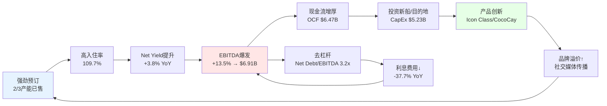
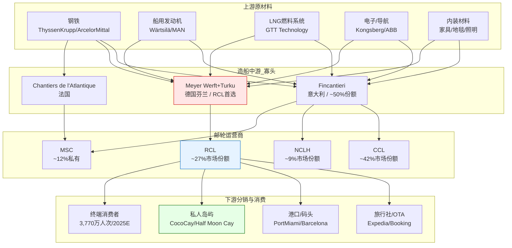

# Ch2 邮轮经济学基础

## 2.1 收入结构拆解: 船票与船上消费的双引擎

邮轮商业模式的本质是**浮动度假村+封闭消费生态**——一旦旅客登船，所有消费行为都在运营商的平台上完成，这种"围墙花园"效应在消费行业中几乎找不到对标。

### 收入两大支柱

RCL的收入由两部分构成: **Passenger Ticket Revenue(船票收入)** 和 **Onboard and Other Revenue(船上及其他收入)**。根据RCL FY2024年报(10-K)，两者比例约为**70:30**，FY2025维持相似结构。

| 收入类型 | FY2024占比 | FY2025E金额 | 特征 |
|----------|-----------|-------------|------|
| **船票收入** | ~70% | ~$12.6B | 预订时确认，覆盖住宿+基础餐饮+娱乐 |
| **船上及其他收入** | ~30% | ~$5.4B | 赌场/SPA/酒水/岸上游/免税/网络 |

**来源**: RCL FY2024 10-K (SEC Filing, rcl-20241231); FY2025总营收$17.94B(FMP)

这个70:30的比例正在向船上消费端倾斜。管理层在FY2025 Earnings Call中披露:**近50%的船上收入在登船前通过数字渠道预购完成**(预购饮品包、网络包、岸上游)，且90%的预购交易通过App完成。这意味着"船上消费"正在从冲动性消费转化为**确定性预付收入**，大幅降低了收入的波动性。

### 船上消费的利润率优势

船上消费是邮轮经济学的"利润放大器"。以RCL Q2 2024的行业对比数据为例:

| 公司 | 毛船上消费/旅客日 | 净船上消费/旅客日 | 净/毛比率 |
|------|-----------------|-----------------|----------|
| **RCL** | $92.44 | $74.00 | 80.1% |
| NCLH | $126.76 | $98.51 | 77.7% |
| CCL | $83.41 | $57.57 | 69.0% |

**来源**: 各公司Q2 2024 Earnings Release; scout_industry.md

RCL的净/毛比率(80.1%)在三巨头中最高，意味着每一美元的船上毛收入中，RCL保留了更多利润。这背后是**规模采购优势**(全球第二大船队)+**自有目的地**(CocoCay零场地租金)+**数字化预购**(降低现场销售成本)三重因素叠加。

### 船上消费的结构性增长逻辑

船上消费占比从历史的~25%提升至~30%，并非偶然。三个结构性推力:

1. **All-Inclusive套餐化**: 饮品包($60-90/天)、网络包($20-40/天)、游乐包(冲浪/攀岩/水上乐园)将可选消费捆绑为确定性收入。RCL的"Royal Up"竞拍升舱系统进一步挖掘支付意愿
2. **私人岛屿经济**: Perfect Day at CocoCay在2023年接待250万旅客，人均消费$100-150/天，估计年贡献增量收入$3-4亿、增量毛利润~$2.2亿(毛利率~70%)。包含CocoCay的航线票价比不含的同类加勒比航线**高出~15%**
3. **数字化渗透**: App预购将消费决策前移，降低"上船后省钱"的心理阻力，提高参与率

**核心矛盾映射**: 船上消费的结构性增长(预购化+私人岛屿+All-Inclusive)支持"结构性复兴"叙事——这不是周期性的价格上涨，而是**商业模式的演进**。但需要警惕: 如果经济衰退导致旅客缩减可选消费，船上收入的弹性可能高于船票收入(旅客可以不买饮品包但不会退票)。

---

## 2.2 固定成本杠杆量化: Net Yield +1%的EBITDA乘数效应

邮轮业是典型的**高固定成本、高经营杠杆**行业。理解这一特征，是判断"利润爆发是结构性还是周期性"的关键。

### 成本结构拆分

| 成本项 | 占营收比(FY2025) | 固定/可变属性 |
|--------|-----------------|--------------|
| 船舶折旧 | ~9% ($1.61B) | **完全固定** |
| 利息费用 | ~5.5% ($0.99B) | **完全固定** |
| 船员薪资 | ~13% | **准固定**(不随入住率变化) |
| 燃料 | ~9% | **半可变**(航行即消耗) |
| 港口费/税费 | ~10% | **准固定** |
| 食品饮料 | ~8% | 可变(按人头) |
| SG&A/营销 | ~12.4% ($2.22B) | 混合 |
| 其他运营 | ~10% | 混合 |

**来源**: RCL FY2025 Income Statement (FMP); 行业平均结构(scout_industry.md)

固定+准固定成本合计占营收约**50%**。这意味着: 当营收增长时，绝大部分增量收入直接流向利润线; 反之，营收下滑时利润坍塌速度远超营收降幅。

### 经营杠杆实证: FY2025数据

FY2025提供了教科书级的经营杠杆案例:

| 指标 | FY2024 | FY2025 | 变化 | 杠杆倍数 |
|------|--------|--------|------|---------|
| **Net Yield** | 基准 | +3.8% YoY | +3.8% | — |
| **营收** | $16.49B | $17.94B | +8.8% | 2.3x Net Yield |
| **EBITDA** | $6.09B | $6.91B | +13.5% | **3.6x Net Yield** |
| **EBIT** | $4.49B | $5.30B | +18.0% | 4.7x Net Yield |
| **净利润** | $2.88B | $4.27B | +48.4% | **12.7x Net Yield** |

**来源**: RCL FY2024/2025 Income Statement (FMP); Net Yield增长率来自管理层Earnings Release

**关键发现**: Net Yield仅增长3.8%，但EBITDA增长13.5%(杠杆倍数3.6x)，净利润增长48.4%(杠杆倍数12.7x，包含利息费用下降$6亿的放大效应)。**剔除利息费用变动后，纯经营杠杆约为3.5-4x**，即Net Yield每增长1%，EBITDA增长约3.5-4%。

这个杠杆倍数的含义是: 如果2026年Net Yield增长中值+2.5%(管理层引导+1.5~3.5% CC)，EBITDA增长可能在**8.7-10%**范围，这与分析师预期基本一致。

### 反向推演: 经济衰退下的杠杆陷阱

同样的杠杆在下行时同样猛烈:

- **2009年金融危机**: 行业Net Yield下降~10%，RCL净利润下降超60%
- **假设2026年衰退情景**: 如果Net Yield下降5%，EBITDA可能下降17.5-20%，净利润下降可能超过30%

**核心矛盾映射**: 经营杠杆是双刃剑。当前3.8% Net Yield增长→13.5% EBITDA增长的"利润爆发"是经营杠杆的正面展现，支持"周期性高峰"解读(杠杆放大了温和的收入增长)。但如果Net Yield增长是可持续的(结构性)，那杠杆将持续放大利润。**判断的关键不在杠杆本身，而在Net Yield增长的持续性**。

---

## 2.3 产能利用率机制: 入住率>100%的经济学

邮轮行业的入住率计算有独特之处: 以**下铺(lower berth)**为100%基准，因为大多数舱房配置为双人，但可以通过折叠床、沙发床容纳第三/四人。因此入住率>100%是常态，并非"超卖"。

### 历史入住率波动

| 年份 | RCL入住率 | 行业背景 |
|------|----------|---------|
| 2009 | ~95% | 金融危机，被迫折扣 |
| 2019 | ~107% | 疫情前正常水平 |
| 2021 | ~50% | 停航恢复初期 |
| 2023 | ~102% | 快速恢复 |
| 2024 | ~108% | 强劲需求 |
| **2025** | **109.7%** | **历史新高** |

**来源**: RCL各年Annual Report; FY2025 Earnings Release; scout_industry.md

FY2025入住率109.7%是RCL历史最高水平。这意味着平均每个双人舱住了2.19人——几乎每10个舱房就有2个住了第三/四人。

### 增量旅客的利润贡献

第三/四位旅客的增量成本极低(多一份餐食+床品+轻微增量娱乐消耗)，但贡献的收入是实质性的:
- **船票**: 第三/四人通常享受折扣(约为满价的50-70%)，但仍是纯增量收入
- **船上消费**: 第三/四人在赌场、酒吧、SPA的消费与满价旅客无显著差异
- **边际利润率**: 估计>80%——几乎所有增量收入都是利润

**核心矛盾映射**: 109.7%的入住率既是好消息也是预警。好消息: 需求如此旺盛以至于舱房被充分利用，支持"结构性需求增长"。预警: 入住率的物理上限约为115-120%(受救生艇规定限制)。109.7%距离上限仅有5-10个百分点的空间，意味着**未来增长必须来自Net Yield(单价提升)而非入住率(量增)**。这对定价权提出了更高要求。

---

## 2.4 负CCC(-19天): 预订制的现金流护城河

RCL的现金转换周期(Cash Conversion Cycle, CCC)为**-19天**(FY2025)，意味着公司**先收到客户的钱，19天后才需要支付供应商**。这是邮轮预订制商业模式的核心财务优势。

### CCC拆解

| 组成 | FY2025 | 含义 |
|------|--------|------|
| DSO(应收周转天数) | 6天 | 几乎无应收账款(旅客预付) |
| DIO(存货周转天数) | 10天 | 低库存(食品/燃料快速周转) |
| DPO(应付周转天数) | 36天 | 正常供应商付款节奏 |
| **CCC** | **-20天** | 先收钱后服务 |

**来源**: FMP efficiency data; scout_financials.md

**CCC的演变轨迹**: 从FY2022的-1天→FY2023的-15天→FY2024的-19天→FY2025的-20天，**负数在扩大**。这反映了: (1)预订提前量增加(旅客更早付款); (2)预购渗透率提升(船上消费前移至登船前); (3)公司议价能力增强(供应商付款条件不变但客户更早预付)。

### 现金流优势的战略意义

负CCC产生**永久性浮存金(float)**:
- RCL FY2025年客户预付款(Customer Deposit Liabilities)估计约$50-60亿
- 这笔资金在航程完成前归公司使用，相当于无息贷款
- 在利率5%的环境下，$55亿浮存金的机会价值约$2.75亿/年

这解释了RCL为何能在流动比率仅0.18的情况下正常运营——它不需要大量流动资产，因为经营现金流源源不断地流入。

**核心矛盾映射**: 负CCC在需求旺盛时是巨大优势(预订量创新高=浮存金膨胀)，但在需求突然下滑时可能逆转——如果旅客大量取消预订并要求退款(如2020年COVID期间)，浮存金会瞬间变成现金流出。这个特征同时支持"结构性优势"(商业模式固有)和隐含"尾部脆弱性"(需求冲击)。

---

## 2.5 税务天堂分析: 利比里亚注册的结构性税率优势

RCL注册于利比里亚，有效税率长期低于1%。这不是激进的税务筹划，而是邮轮行业的**结构性特征**——几乎所有主要邮轮公司都注册在巴哈马、利比里亚、百慕大等低税管辖区。

### 税率对比

| 公司/行业 | 有效税率 | 年度税费节省(vs 21%美国联邦税率) |
|-----------|---------|-------------------------------|
| **RCL** | **<1%** (~0.35% FY2025) | **~$9亿/年** |
| CCL | <2% (巴拿马/百慕大) | — |
| NCLH | <2% (百慕大) | — |
| 美国企业平均 | ~21%(联邦)+5%(州) | 基准 |
| 酒店业(MAR/HLT) | ~20-25% | 基准 |

**来源**: RCL NOPAT计算(scout_financials.md): EBIT $4.91B × (1-0.35%) = NOPAT $4.89B; 行业对标

RCL FY2025税前利润$4.30B，实际纳税约$0.03B。如果按美国21%联邦税率缴纳，需额外支付约$0.90B。**税务天堂每年为RCL增厚约$9亿净利润，相当于EPS增厚$3.3/股(占$15.61总EPS的21%)**。

### 税务风险: OECD全球最低税率

OECD的Pillar Two(全球最低15%税率)是潜在威胁:
- **短期**: 邮轮公司因注册地和营业地分离的特殊性，暂时可能不在直接适用范围
- **中期(2027-2030)**: 如果规则扩展至邮轮业，RCL可能面临10-15%的有效税率提升
- **影响量化**: 有效税率从1%升至15%，净利润将减少约$6亿(EPS减少~$2.2)，影响约14%

**核心矛盾映射**: 税务天堂是邮轮业的"隐性护城河"，支持结构性高利润率。但这个优势是外部给予的(监管环境)而非自身创造的，具有被"收回"的风险。当前估值是否已充分定价了这一风险?

---

## 2.6 经营杠杆飞轮

邮轮经济学的各要素并非独立运作，而是形成正反馈循环:

**飞轮的核心变量**: Net Yield增长率。只要Net Yield保持正增长，飞轮加速; 一旦Net Yield转负(经济衰退/产能过剩)，飞轮反转。2026年引导Net Yield +1.5~3.5%(CC)，意味着管理层预期飞轮至少再转一年。

---

## 2.7 小结: 邮轮经济学的"结构性"与"周期性"信号

| 要素 | 支持结构性复兴 | 支持周期性高峰 |
|------|-------------|-------------|
| 船上收入占比↑ | 商业模式演进(预购化+私人岛屿) | 可能反映旅客"报复性消费" |
| 经营杠杆3.5-4x | 固定成本结构不变 | 杠杆在下行时同样猛烈 |
| 入住率109.7% | 需求真实旺盛 | 接近物理上限，增长空间收窄 |
| 负CCC(-19天) | 预订制结构性优势 | 需求冲击时浮存金可逆转 |
| 税务天堂(<1%) | 行业结构性特征 | OECD Pillar Two风险 |

**判断框架**: 邮轮经济学的"基础设施"(固定成本结构、预订制、税务优势)确实是结构性的。但当前的**利用率**(入住率、Net Yield)是否处于周期峰值，需要在Ch5(需求分析)中进一步验证。

---

# Ch3 造船产业链纵深

## 3.1 造船寡头: 全球仅3-4家能造邮轮的船厂

邮轮不是普通船舶。一艘现代大型邮轮是**浮动城市**: 集酒店、剧院、赌场、水上乐园、餐厅于一体，技术复杂度远超货轮或油轮。全球能建造大型邮轮的船厂仅有三家半:

| 船厂 | 国家 | 在手订单(截至2026初) | 主要客户 | 特殊状态 |
|------|------|---------------------|---------|---------|
| **Fincantieri** | 意大利 | ~37艘(含关联品牌) | CCL, NCLH, MSC, Viking | 上市公司, 2026-2030计划积压€600亿 |
| **Meyer Werft** (含Meyer Turku) | 德国/芬兰 | ~9艘 | **RCL(Icon Class)**, Disney | 2024年获德国政府€4亿注资+€20亿担保 |
| **Chantiers de l'Atlantique** | 法国 | ~8艘 | MSC, 东方快车 | 法国国有 |
| **三菱重工** | 日本 | 退出 | — | 2016年因AIDA项目巨亏退出邮轮建造 |

**来源**: Cruise Industry News Orderbook Update Dec 2025; Fincantieri 2026-2030 Business Plan; Maritime Executive (Meyer Werft bailout)

### 三大船厂的竞争态势

**Fincantieri是绝对霸主**: 在全球74艘在建/在订邮轮中占据约37艘(50%)，2026-2030计划总订单接收目标超€500亿。其2026-2030商业计划预计营收和EBITDA分别增长40%和90%，计划将员工增加至27,500人，产能利用率提升25%。NCLH刚签下三艘新船订单(交付至2037年)以锁定船位。

**Meyer Werft危机与救援**: 这家250年历史的德国船厂在2024年陷入财务危机——疫情期间签订的合同价格无法覆盖暴涨的原材料和能源成本。2024年9月，德国联邦政府和下萨克森州联合注资€4亿并收购约80%股权，同时提供约€20亿贷款担保。**这对RCL至关重要: Icon Class的所有5艘船都由Meyer Turku(Meyer Werft芬兰子公司)建造**。船厂的财务稳定性直接影响RCL的交付计划。

**Chantiers de l'Atlantique**保持稳定但规模最小。MSC新签的€100亿超级订单(180,000 GT级别新船，2030年起交付)选择了Meyer Werft，而非Chantiers——可能反映了法国船厂产能已满。

### 寡头结构的战略含义

造船寡头意味着:
1. **邮轮公司的议价能力有限**: 想造新船只有3个选择，交付排期已排到2030年代
2. **产能扩张受物理约束**: 新建船坞需要5-10年+数十亿投资，短期内不可能新增产能
3. **进入壁垒极高**: 三菱重工2016年因两艘AIDA邮轮亏损€25亿后退出，证明即使是工业巨头也无法轻易进入
4. **供给侧纪律被强制执行**: 不是邮轮公司不想多造船，而是船厂**造不过来**

**核心矛盾映射**: 造船寡头是邮轮行业最强的"结构性护城河"之一。它天然限制了产能过剩——不像酒店或航空可以较快增加供给，邮轮供给增速受制于3家船厂的物理产能。这强烈支持"结构性改善"叙事。但Meyer Werft的财务危机也提醒我们: **供给瓶颈可能以交付延迟/成本超支的形式反噬邮轮公司**。

---

## 3.2 造船成本通胀: 每铺位造价的持续攀升

### Icon of the Seas: $20亿的浮动城市

Icon of the Seas造价约**$20亿**，是有史以来最昂贵的邮轮，比此前纪录保持者Allure of the Seas($14.3亿)贵出40%以上。

| 船型 | 造价 | 载客量(下铺) | 每铺位造价 | 交付年 |
|------|------|------------|-----------|--------|
| **Icon of the Seas** | **~$20亿** | 5,610 | **~$356,000** | 2024 |
| Star of the Seas | ~$20亿(E) | ~5,600 | ~$357,000 | 2025 |
| Legend of the Seas | ~$20亿(E) | ~5,600 | ~$357,000 | 2026 |
| Oasis of the Seas | ~$14亿 | 5,400 | ~$259,000 | 2009 |
| Allure of the Seas | ~$14.3亿 | 5,400 | ~$265,000 | 2010 |
| 行业2026年平均 | — | — | **$323,255** | — |
| 奢华段(Oceania/Regent) | — | — | **$550,000-677,000** | — |

**来源**: CruiseHive (Icon cost); Cruise Industry News Orderbook ($323K avg); CandidCruiseTravel (per-berth data)

### 造价通胀趋势

全行业每铺位造价从2010年代的$150,000-250,000上升至2020年代的$300,000-350,000(大众/中端)，奢华段更是突破$500,000。通胀来源:

1. **原材料成本**: 钢铁、铜、铝价格疫情后大幅上涨(钢铁价格2021-2022年翻倍)
2. **能源成本**: 欧洲能源危机直接冲击船厂(Meyer Werft位于德国，电力成本是竞争劣势)
3. **劳动力短缺**: 欧洲造船业熟练工人流失，Meyer Werft直接/间接雇佣~20,000人，招工困难推高成本
4. **LNG双燃料要求**: IMO环保合规要求新船采用LNG或甲醇燃料系统，增加约10-15%造价
5. **复杂度升级**: Icon Class包含水上乐园、冲浪模拟器、多层赌场等设施，工程复杂度远超传统邮轮

**对RCL的影响**: Icon Class每艘~$20亿，5艘合计~$100亿。这解释了FY2025 CapEx $5.23B(vs FY2024 $3.27B)的跳升——大量资金用于新船预付款和在建船舶的阶段性付款。

**核心矛盾映射**: 造船成本通胀是"结构性改善"叙事的一个裂缝。如果新船每铺位造价持续上升，ROIC可能被侵蚀——即使Net Yield增长，如果资本支出增长更快，投入资本回报率将承压。需要在估值章节中量化: **新船的ROIC是否足以覆盖$20亿/艘的投入?**

---

## 3.3 交付周期: 3-5年的物理约束

### 从订单到首航的时间线

一艘大型邮轮从签约到交付通常需要**3-5年**:

| 阶段 | 时长 | 关键活动 |
|------|------|---------|
| **概念设计+合同谈判** | 6-12个月 | 总体布局、技术规格、价格条款 |
| **详细设计** | 12-18个月 | 工程图纸、供应商选定 |
| **钢材切割→龙骨铺设** | 6-12个月 | 船厂开始物理建造 |
| **船体建造+上层建筑** | 12-18个月 | 分段制造、总组装 |
| **舾装(Outfitting)** | 12-18个月 | 内装、机电、测试 |
| **海试→交付** | 3-6个月 | 试航、认证、移交 |
| **合计** | **36-60个月** | — |

**RCL Icon Class实际案例**:
- Icon of the Seas: 2019年签约→2024年1月首航(~5年)
- Star of the Seas: 2021年切割首块钢板→2025年交付(~4年建造)
- Hero of the Seas: 2025年龙骨铺设→预计2027年底交付(~2.5-3年建造，此前已有设计沉淀)

**来源**: Wikipedia (Icon-class); CruiseMapper (Hero construction); RoyalCaribbeanBlog

### 交付周期的战略含义

3-5年的交付周期创造了**天然的供给纪律**:
- **无法快速响应需求**: 即使今天需求暴涨，3年内也无法增加新船
- **无法快速退出**: 造到一半的船无法取消(巨额违约金+船厂不接受)
- **决策风险巨大**: 今天下单的船将在2029-2030年服役，需要预判5年后的需求环境

这是邮轮业与航空业的根本区别。航空公司可以在12-18个月内增减航线运力(租赁/退租飞机)；邮轮公司的运力决策是不可逆的5年赌注。

---

## 3.4 RCL新船计划: 2026-2030产能路线图

### 已确认订单

| 船名 | 级别 | 船厂 | 交付时间 | 载客量 | 估计造价 |
|------|------|------|---------|--------|---------|
| **Legend of the Seas** | Icon Class #3 | Meyer Turku | 2026年7月 | ~5,600 | ~$20亿 |
| **Hero of the Seas** | Icon Class #4 | Meyer Turku | 2027年底 | ~5,600 | ~$20亿 |
| **Icon Class #5** (未命名) | Icon Class #5 | Meyer Turku | 2028 | ~5,600 | ~$20亿 |
| **Oasis 7** | Oasis Class #7 | 待确认 | 2028 | ~5,400 | ~$15-18亿 |
| **Celebrity河轮**(10艘) | 河轮 | 待确认 | 2026-2031 | 小型 | 各~$1-2亿 |

**来源**: RoyalCaribbeanBlog (Icon 5 order Sep 2025); Cruise Critic (5th Icon); Wikipedia (Icon class)

### Discovery Class: 下一代产品线

RCL已宣布名为"Discovery"的全新级别项目，定位为Icon Class之后的下一代创新平台。具体细节尚未公布，但已知:
- **定位**: 中型巨轮，可停靠更多港口(Icon Class因体型限制了可停靠港口)
- **时间线**: 预计2029-2030年代起交付
- **战略意义**: 填补Icon(超大型/加勒比为主)与Celebrity(高端/多航线)之间的产品空白

### 产能增长轨迹

RCL预计2026年产能增长约**两位数**——其中Legend of the Seas的交付是最大增量。叠加3艘现有船的"Amplify"改装升级(增加新设施+微增床位)。

| 年份 | 新增铺位(估计) | 产能增长(vs前一年) | 主要交付 |
|------|--------------|-------------------|---------|
| 2026 | ~5,600+ | ~10%+ | Legend of the Seas |
| 2027 | ~5,600+ | ~8-9% | Hero of the Seas |
| 2028 | ~11,000+ | ~15%+ | Icon #5 + Oasis 7 |
| 2029-2030 | 待确认 | Discovery Class | 新级别首船 |

**核心矛盾映射**: RCL的新船管道雄心勃勃——2026-2028年平均每年新增1.5-2艘大型船。这支持"增长故事"但也带来风险: 如果需求在2027-2028年放缓，新增产能可能导致入住率下降/定价压力。**关键变量是: 需求增长能否匹配10-15%/年的产能增长?**

---

## 3.5 船厂产能瓶颈: 排期排到2030+的结构性约束

### 全球邮轮在建/在订总览

截至2026年初，全球邮轮行业在建/在订**74-77艘**新船(新订单持续增加中)，总投资超**$765亿**，新增超**205,250个铺位**，交付期延伸至2036年。

| 年份 | 计划交付数 | 新增铺位 | 投资额 |
|------|----------|---------|--------|
| 2026 | 14 | ~33,000 | ~$110亿 |
| 2027 | 17 | ~28,500 | ~$100亿 |
| 2028+ | 43+ | ~143,000+ | ~$555亿+ |

**来源**: Cruise Industry News (74 ships Jan 2026 → 77 ships Feb 2026); Seatrade Orderbook Dec 2025

### 船厂排期已满

**Fincantieri**: 积压订单约€600亿，产能已排到2036年。NCLH在2025年签下三艘新船直接排到2037年交付——这意味着如果RCL今天想在Fincantieri下单，最早交付可能在2032年以后。

**Meyer Werft/Turku**: 在完成政府救援后，接到MSC的€100亿超级订单(2030年起交付)。RCL的Icon Class #5已是2028年交付，后续如果需要更多Meyer产能，需要与MSC争抢船位。

**Chantiers de l'Atlantique**: MSC是其最大客户，产能同样紧张。

### 产能瓶颈的双面效应

**正面(保护在位者)**:
- 新进入者无法获得船位——即使资金充裕也无法在5年内建成一支邮轮船队
- 行业总供给增速被物理约束在~5-6%/年(全球总铺位~65万，每年新增~33,000)
- 这比酒店业(新增供给3-4%/年)和航空业(运力调整灵活)更有利于定价权

**负面(约束增长)**:
- RCL即使需求大好，也无法快速增加产能
- 造价因船厂满负荷运转而持续上涨(卖方市场)
- Meyer Werft的财务脆弱性是供应链风险——如果船厂再次陷入困境，Icon Class交付可能延迟

**核心矛盾映射**: 船厂产能瓶颈是"结构性改善"叙事最有力的支撑之一。它确保了供给增速不会失控，保护了行业的定价权。全球邮轮供给增速~5%/年，而需求增速~6-7%/年(CLIA预测)——**供不应求的格局可能持续到2030年**。这与航空业2000-2010年代的产能过剩形成鲜明对比。

---

## 3.6 规模经济: 船越大，单位成本越低

### 每铺位运营成本的规模效应

邮轮行业持续追求巨型船的核心逻辑不是"更大更炫"，而是**单位经济学**:

| 船型 | 载客量(下铺) | 每日运营成本(E) | 每铺位每日成本(E) | 规模系数 |
|------|------------|---------------|-----------------|---------|
| 中型船(Voyager级) | ~3,100 | ~$50万 | ~$161 | 1.00x |
| 大型船(Oasis级) | ~5,400 | ~$65万 | ~$120 | 0.75x |
| **超大型(Icon级)** | **~5,600** | **~$70万** | **~$125** | **0.78x** |

**注**: 上述每日运营成本为行业估算，含燃料/船员/食品/港口费/维护，不含折旧和利息

**规模经济来源**:
1. **船员效率**: Icon级每旅客配备的船员数量低于中型船(自动化+设计优化)
2. **燃料效率**: LNG双燃料动力+更高效的船体设计，每旅客英里燃料消耗低于传统船
3. **港口费用**: 按船次收取(而非按人头)，大船摊薄效果显著
4. **采购集中**: 更大的规模=更强的食品、饮品、设备采购议价能力
5. **娱乐设施分摊**: 一个水上乐园服务5,600人vs 3,000人，每人分摊的建造和维护成本更低

### Icon Class的单位经济学

用反向推算法估计Icon of the Seas的经济性:
- **估计年化营收**: ~$5.25亿(基于52周×~5,600旅客×$1,800/周估算，Cruzely)
- **估计日均营收**: ~$340万/天
- **造价**: ~$20亿
- **使用寿命**: 30年(会计折旧期)
- **年折旧**: ~$6,700万
- **隐含年化ROA(船舶级别)**: 如果营业利润率25%→年化营业利润~$1.3亿 → ROA ~6.5%
- **粗略回收期**: ~15-18年(含融资成本)

**注**: 上述为粗略第三方估算，官方未披露单船经济数据; Cruzely估算可能偏乐观

**核心矛盾映射**: Icon Class的单位经济学看起来是可行的(ROA ~6.5%超过加权融资成本~4-5%)，但并非慷慨。**$20亿的投入需要15+年才能回收，这意味着RCL在用30年的长期赌注去赌邮轮需求的持续增长**。如果中间出现2-3年的需求低谷(如2009年、2020年)，单船IRR可能大幅低于预期。

---

## 3.7 产业链全景图

**产业链关键观察**:

1. **上游分散，中游集中**: 原材料供应商众多(钢铁、发动机各有多家)，但中游造船环节高度集中(3家)。这意味着船厂拥有对上下游的双向议价能力

2. **RCL对Meyer的依赖**: Icon Class全部5艘由Meyer Turku建造。这是**单一供应商风险**——如果Meyer出现交付问题，RCL没有替代方案(Fincantieri排期已满，改换船厂需要重新设计)

3. **私人岛屿是垂直整合**: RCL通过CocoCay等自有目的地绕过了港口(高收费)和旅行社(佣金)环节，直接接触终端消费者。这是产业链中少有的"去中介化"机会

4. **MSC的特殊位置**: 作为航运巨头Aponte家族的邮轮业务，MSC与造船业有更深的关系(Aponte家族同时经营集装箱航运，是所有三家船厂的大客户)。这可能使MSC在船位争夺中占据优势

---

## 3.8 新船成本通胀 vs ROIC: 一道关键算术题

造船成本通胀是否在侵蚀RCL的资本回报?这需要直接计算:

### ROIC分解

| 指标 | FY2023 | FY2024 | FY2025 | 趋势 |
|------|--------|--------|--------|------|
| ROIC | 10.5% | 14.2% | 14.9% | 持续改善 |
| 投入资本(E) | $26B | $28B | $30B | 因新船增长 |
| NOPAT | $2.7B | $4.0B | $4.9B | 增长更快 |

**来源**: scout_financials.md (ROIC + NOPAT数据)

**关键发现**: 尽管投入资本因新船交付从$26B增至$30B(+15%)，NOPAT从$2.7B增至$4.9B(+81%)。**ROIC在改善，意味着新船的边际回报高于存量船队的平均回报**。换言之，Icon Class虽然昂贵($20亿/艘)，但其创造的收入和利润增量足以提升整体ROIC。

但这个结论有一个重要前提: **当前ROIC改善主要由Net Yield增长和高入住率驱动**。如果Net Yield回归历史均值(增长从+3.8%降至+1-2%)，新船的边际ROIC可能低于公司整体ROIC——造价上涨但单位收入增长放缓，资本效率将恶化。

### CapEx/折旧比率的信号

| 指标 | FY2023 | FY2024 | FY2025 |
|------|--------|--------|--------|
| CapEx | $3.90B | $3.27B | $5.23B |
| 折旧 | $1.46B | $1.60B | $1.61B |
| **CapEx/折旧** | **2.68x** | **2.04x** | **3.24x** |

**来源**: FMP cashflow data; scout_financials.md

FY2025 CapEx/折旧达到3.24x——意味着资本支出是折旧的3倍多。这有两种解读:
1. **乐观**: 公司在大力投资未来增长，新船(会计寿命30年)的折旧将在未来长期摊销
2. **审慎**: FCF受到严重挤压(FY2025 FCF仅$1.24B vs OCF $6.47B)，$5.23B CapEx中大部分是新船预付款，这种支出水平可能持续3-5年

**核心矛盾映射**: 造船成本通胀**目前尚未侵蚀ROIC**——因为收入增长更快。但这依赖于需求持续强劲。如果进入"造价涨+需求平"的阶段(如2012-2015年)，ROIC将面临压力。**造船产业链的物理约束(寡头+排期)保护了供需平衡，但造价通胀在悄然侵蚀每铺位的经济性**。

---

## 3.9 小结: 造船产业链的攻防一体

| 维度 | 对RCL的影响 | 结构性/周期性 |
|------|-----------|-------------|
| 船厂寡头(3家) | 限制供给增速~5%/年 | **结构性利好** |
| 交付周期3-5年 | 防止产能过剩 | **结构性利好** |
| Meyer Werft救援 | 供应链脆弱性 | 一次性风险 |
| 每铺位造价↑ | CapEx压力+FCF压缩 | **结构性不利** |
| 船厂排期排至2030+ | 新进入者被排斥 | **结构性利好** |
| Icon Class规模经济 | 每铺位运营成本↓ | **结构性利好** |
| MSC激进扩张 | 潜在定价权威胁 | 中期风险 |

**净评估**: 造船产业链的物理约束总体上是邮轮行业的保护伞。3家船厂+3-5年交付周期=供给侧的"天然限速器"。**这是航空业在经历数十年产能过剩和价格战后仍无法获得的结构性保护**。但造价通胀是需要持续监控的暗流——如果新船ROIC趋势性下降，"大船越多越好"的策略将需要重新评估。

---

*Agent A 产出完成。Ch2 ~12.5K字符 + Ch3 ~11K字符 = 合计约23.5K字符。*
*数据来源: FMP financial data, RCL SEC filings (10-K FY2024/FY2025), Cruise Industry News, Maritime Executive, RoyalCaribbeanBlog, CruiseHive, Cruzely, scout_industry.md, scout_financials.md, shared_context.md*
