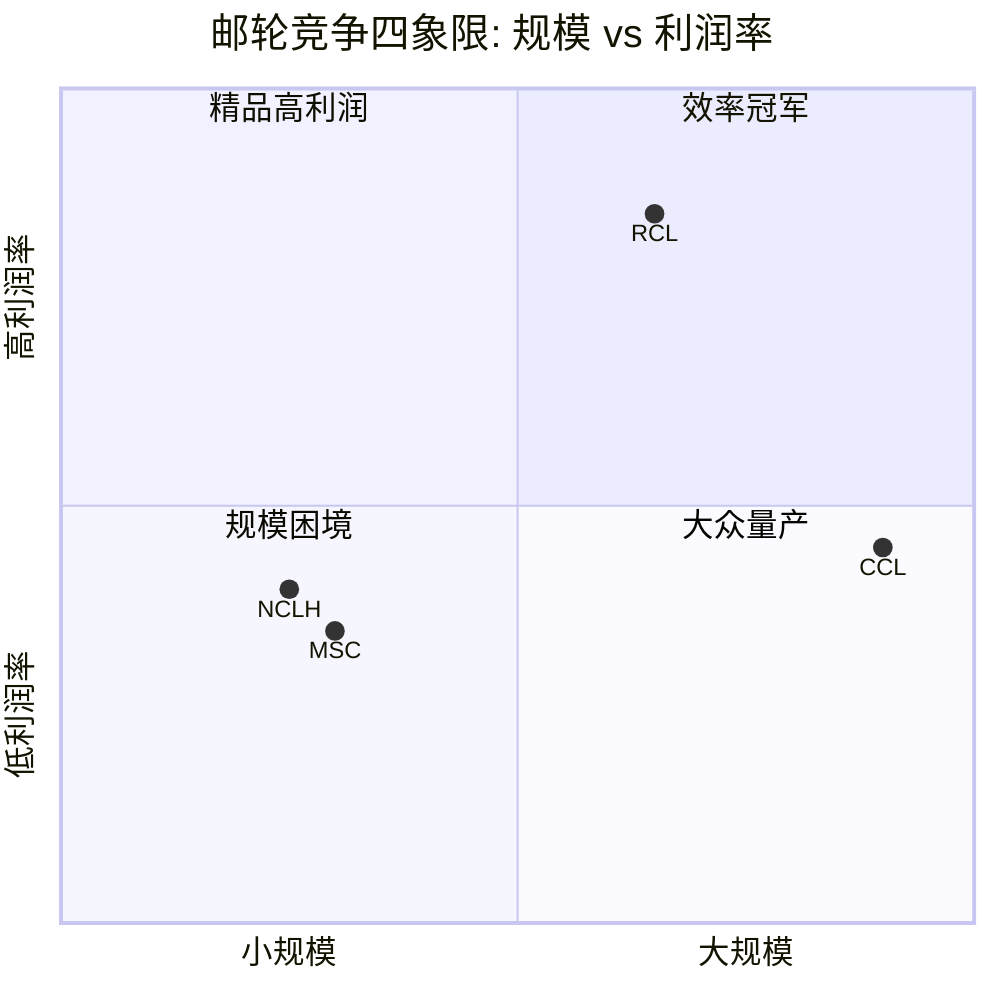
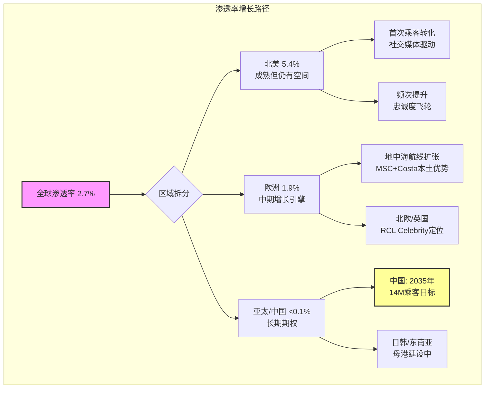

# Ch4 竞争生态: 邮轮寡头博弈

> **核心矛盾映射**: 竞争格局的稳定性直接决定RCL的定价权能否持续。如果寡头纪律崩塌(尤其是MSC的野蛮人入侵)，"结构性复兴"叙事的基础将被侵蚀——即便需求增长，利润也可能被产能稀释。本章的结论将锚定后续估值中"利润率假设"的可信度。

---

## 4.1 四角矩阵: 谁在跟谁竞争?

邮轮行业的竞争格局是全球消费行业中最接近经典寡头垄断的案例之一。四大集团控制约88%的全球产能，结构上类似半导体设备(ASML/KLAC/LRCX/AMAT占~80%)，但有一个关键区别——**第四名MSC是私有公司，不受上市公司季度财报纪律约束**。

| 维度 | **CCL** | **RCL** | **NCLH** | **MSC** |
|------|---------|---------|----------|---------|
| **市场份额(产能)** | ~42% | ~27% | ~9% | ~10% |
| **市值** | $43.7B | $86.3B | $10.9B | 私有(不适用) |
| **FY2025收入** | $26.6B | $17.9B | $9.5B(FY2024) | ~$4.5B(估算) |
| **船队规模** | ~87艘 | ~65艘 | ~36艘 | ~23艘+激进扩张 |
| **品牌定位** | 大众/中端 | 中高端/创新 | 高端/奢华 | 全球家庭/价格竞争力 |
| **核心市场** | 加勒比+地中海 | 加勒比+阿拉斯加 | 加勒比+北欧 | 地中海+全球扩张 |
| **营业利润率** | 16.8% | **27.4%** | 15.5% | 未披露(估算~12-15%) |
| **P/E (TTM)** | 15.6x | 20.3x | 17.2x | N/A |
| **D/E** | 2.3x | 2.2x | **7.0x** | 未披露 |
| **Beta** | 2.44 | 1.87 | 2.03 | N/A |
| **竞争策略** | 规模+成本领先 | 创新+体验溢价 | 高端品牌组合 | 激进造船+低价渗透 |

**数据来源**: FMP compare_stocks + quote (2026-02-25), 年报(FY2025/FY2024), CLIA行业数据

**四象限定位解读**:



这张图揭示了邮轮行业竞争的核心张力: **RCL占据了最令人羡慕的位置——中等偏大规模+最高利润率**。在大多数行业中，利润率与规模呈正相关(规模经济)或负相关(规模的诅咒)。RCL的独特之处在于: 它不是最大的(CCL更大)，但却是最赚钱的。这暗示RCL的优势不纯粹来自规模，而来自**产品定位(中高端)+运营效率+船型创新**的复合效应。

**对核心矛盾的映射**: 如果RCL的利润率优势是结构性的(品牌+创新壁垒)，那么它在竞争加剧时也能维持，支持"结构性复兴"。如果仅仅是周期性的(新船交付节奏差异、COVID后恢复速度差异)，则当CCL完成恢复后差距会收窄，支持"周期性高峰"。

---

## 4.2 RCL运营效率优势量化

RCL的运营效率优势不是一两个百分点的边际差异，而是**系统性的代际领先**。以下数据来自最新财年(FMP financial data):

### 利润率矩阵 (FY2025 / FY2024)

| 指标 | RCL (FY2025) | CCL (FY2025) | NCLH (FY2024) | RCL溢价(vs CCL) |
|------|-------------|-------------|-------------|----------------|
| **毛利率** | 46.8% | 29.6% | 40.0% | +17.2pp |
| **营业利润率** | 27.4% | 16.8% | 15.5% | **+10.6pp** |
| **EBITDA利润率** | 38.5% | 26.0% | 26.3% | +12.5pp |
| **净利率** | 23.8% | 10.4% | 9.6% | **+13.4pp** |
| **ROE** | 47.7% | 25.6% | 39.9% | +22.1pp |

**数据来源**: FMP income statement (FY2025 RCL/CCL, FY2024 NCLH); FMP ratios

**关键发现**: RCL的净利率是CCL的**2.3倍**(23.8% vs 10.4%)。这个差距远超P/E溢价所反映的30%。换言之，如果市场纯粹按利润率质量定价，RCL的P/E应该更高。

### 利润率趋势: CCL在追赶吗?

| 指标(OPM) | FY2023 | FY2024 | FY2025 | 2年变化 |
|-----------|--------|--------|--------|---------|
| **RCL** | 20.7% | 24.9% | 27.4% | +6.7pp |
| **CCL** | 9.1% | 14.3% | 16.8% | +7.7pp |
| **差距** | 11.6pp | 10.6pp | 10.6pp | — |
| **NCLH** | 10.9% | 15.5% | — | — |

**数据来源**: FMP income statement (RCL FY2023-2025, CCL FY2023-2025, NCLH FY2023-2024)

**TS-CRUISE-06执行(品牌溢价持续性测试)**: CCL的营业利润率从FY2023的9.1%提升至FY2025的16.8%，两年改善7.7pp，年均约3.9pp。但RCL同期也从20.7%提升至27.4%(+6.7pp，年均3.4pp)。绝对差距从11.6pp缩小至10.6pp，仅收窄1pp。**按照TS-CRUISE-06的判定标准(>2pp/年连续3年=溢价不可持续)，CCL的追赶速度约为0.5pp/年，远低于2pp阈值。RCL的效率溢价在短期内安全。**

但需要注意一个重要的结构性因素: CCL的利润率恢复部分来自"基数效应"——从9.1%恢复到16.8%比从20.7%提升到27.4%更容易。当CCL接近其"自然"利润率天花板(历史约15-18%)时，追赶速度会放缓。真正的测试是: **当CCL也完成新船周期(Sun Princess等)后，利润率差距是否稳定在8-10pp**。如果是，则RCL的溢价是结构性的。

### 效率优势的来源拆解

RCL的利润率领先并非单一因素驱动，而是多层面复合:

1. **船型经济学**: Icon of the Seas(7,600人)和Oasis级(6,000人+)是全球最大邮轮，每铺位运营成本显著低于中型船。RCL的平均船体吨位高于CCL，规模经济更强。

2. **船上收入结构**: RCL每位乘客每日净船上消费$74(vs CCL $57.6)，高出28.5%。私有岛屿CocoCay是这个差距的关键驱动力——预计2026年创收$6亿，几乎零边际成本(岛屿基础设施已建成)。

3. **品牌定位梯度**: RCL的三品牌矩阵(Royal Caribbean中高端/Celebrity高端/Silversea超奢华)覆盖了利润率最高的客群区间。CCL的品牌矩阵偏大众(Carnival/Costa)，天然利润率较低。

4. **利息费用优势**: RCL FY2025利息支出$9.92亿(占营收5.5%) vs CCL FY2025的$13.49亿(占营收5.1%)。CCL绝对额更高，但占比接近——这意味着RCL的利润率优势主要在运营层面(毛利率差17.2pp)而非财务杠杆。

5. **税收结构**: 两家公司都注册在避税管辖区(RCL利比里亚，CCL巴拿马/百慕大)，有效税率均<1%。这不是差异化因素。

**对核心矛盾的映射**: RCL的效率优势根植于产品创新(大型船规模经济+CocoCay私有岛)和品牌定位(中高端)，这两者是"结构性"的——竞争对手需要3-5年造船周期+数十亿投资才能接近。这支持"结构性复兴"。但如果行业进入产能过剩→价格战阶段，高端定位反而可能受损(消费者转向更便宜的CCL/MSC)，此时效率优势会被需求端侵蚀。

---

## 4.3 P/E溢价合理性: 30%够不够?

当前估值映射:

| | RCL | CCL | RCL溢价 | 隐含假设 |
|---|---|---|---|---|
| **P/E (TTM)** | 20.3x | 15.6x | **+30%** | RCL的质量值得30%溢价 |
| **P/B** | 7.5x | 2.8x | **+168%** | 市场认为RCL的资产回报远超账面 |
| **EV/EBITDA** | 14.1x | 8.7x | **+62%** | 企业价值层面溢价更大 |
| **市值/收入** | 4.8x | 1.6x | **+200%** | 每$1收入，RCL的价值是CCL的3倍 |

**数据来源**: FMP quote + ratios (2026-02-25)

**SGI框架检验**: RCL的SGI=7.25(专才)，预期P/E溢价范围30-60%。当前P/E溢价30%恰好在下限。这意味着两种可能:

- **解读A(看多)**: 市场尚未充分定价RCL的专才优势。如果效率优势被确认为结构性的，P/E溢价应该向50-60%扩张(对应P/E ~23-25x)。上行空间$50-75/股。
- **解读B(看空)**: 市场已经理性地认为30%溢价=高端周期股的合理上限。邮轮业Beta>1.8，高杠杆(D/E 2.2x)，周期敏感性限制了P/E天花板。

**EV/EBITDA视角提供更清晰的信号**: P/E受杠杆结构干扰(不同的利息费用和债务规模影响net income)，而EV/EBITDA控制了这个变量。在EV/EBITDA维度，RCL溢价62%(14.1x vs 8.7x)，远高于P/E维度的30%。这暗示**市场在企业价值层面已经给了RCL显著溢价，只是因为RCL的更好的利润率转化(net income/EBITDA比率更高)，P/E看起来溢价"不够大"**。

换言之，P/E溢价30%可能低估了市场实际给予RCL的质量溢价。真实溢价应参考EV/EBITDA的62%。

---

## 4.4 MSC威胁深度分析: 野蛮人的逻辑

MSC Cruises是邮轮行业中最值得警惕的竞争变量。不是因为它今天最大(它远小于CCL)，而是因为它的**行为逻辑与上市公司根本不同**。

### 4.4.1 Aponte家族: 航运帝国的邮轮野心

Gianluigi Aponte家族通过地中海航运(Mediterranean Shipping Company, MSC)控制着全球最大的集装箱航运公司(超越马士基)。邮轮业务(MSC Cruises)只是这个航运帝国的一个分支。关键含义:

- **无限制资金**: MSC Cruises的造船资金来自母公司的航运利润(年利润数十亿美元)，不需要公开市场融资。这意味着它**可以在任何利率环境下持续造船**。
- **无季度财报压力**: 不用向分析师解释为什么在行业低谷时还在扩张产能。
- **无ROI纪律**: 上市公司需要证明新船投资的ROIC>WACC。MSC只需要家族掌门人认为"长期有价值"。
- **跨行业协同**: MSC的集装箱航运网络提供了港口关系、船舶管理经验、全球物流能力。造船谈判中MSC的议价能力极强(一次性向Fincantieri/Chantiers下多船大单)。

### 4.4.2 MSC的扩张轨迹

| 年份 | MSC船队规模 | 全球份额 | 里程碑 |
|------|-----------|---------|--------|
| 2003 | ~5艘 | <2% | 起步期 |
| 2010 | ~12艘 | ~5% | 地中海基地确立 |
| 2019 | ~17艘 | ~8% | 进入加勒比 |
| 2024 | ~23艘 | ~10% | 全球第三(超越NCLH产能) |
| 2028E | ~30艘+ | ~13-15% | 如果当前订单全部交付 |

**数据来源**: Cruise Industry News, MSC公开信息, CLIA数据

从零到10%市场份额用了20年——但接下来5年MSC可能再增3-5%份额。关键问题: **这些增量产能投放在哪个市场?**

### 4.4.3 加勒比战场: RCL的后院

MSC近年开始大举进入加勒比市场，这是RCL的核心利润池。MSC在巴哈马建设了私有岛屿Ocean Cay(2019年开放)，直接对标RCL的CocoCay。如果MSC在加勒比的产能从当前的~5%份额增长到10-15%，对RCL的影响路径:

1. **直接竞争**: MSC的定价通常比RCL低15-25%(对标CCL的Carnival品牌定价)。这会吸引价格敏感客群，但RCL的中高端客群可能不受影响。
2. **间接挤压**: 更多船在加勒比=港口拥堵+最佳航线时段被稀释+岸上目的地体验下降。即便RCL不直接丢客户，航线质量也会被"公地悲剧"侵蚀。
3. **人才竞争**: MSC提供有竞争力的薪酬(母公司资金支持)，可能在船员招聘上挤压RCL。

**风险定性评估**: MSC的威胁是**中期的、渐进的**。它不会在1-2年内改变格局，但5-10年内可能将行业从"三巨头+一个小玩家"变成"四巨头均势"。如果MSC的市场份额从10%增长到15%，而总市场增速不变，那么其他三家的份额将被压缩约5%。对RCL而言，这意味着从27%降至~24-25%——可控但不可忽视。

**关键缓冲**: MSC的品牌定位偏中低端(大众/家庭)，与CCL的Carnival品牌重叠度更高。RCL的中高端定位(尤其是Celebrity和Silversea)理论上受MSC直接冲击较小。但如果MSC通过Explora Journeys(新奢华品牌，2023年首航)成功进入高端市场，这个缓冲就不再可靠。

---

## 4.5 产能纪律博弈论: 囚徒困境的幽灵

### 4.5.1 经典博弈矩阵

邮轮行业的产能决策是一个典型的多人囚徒困境:

```
               竞争对手: 克制        竞争对手: 扩张
  ┌─────────────────────────┬─────────────────────────┐
  │                         │                         │
  │  自己克制:              │  自己克制:              │
  │  高定价权,稳定利润      │  丢市场份额,但          │
  │  (合作-合作)            │  利润率可维持            │
  │  ★行业最优解            │  (被动者)               │
  │                         │                         │
  ├─────────────────────────┼─────────────────────────┤
  │                         │                         │
  │  自己扩张:              │  自己扩张:              │
  │  抢市场份额,            │  产能过剩,价格战,       │
  │  利润率暂时可维持       │  全行业利润率坍塌       │
  │  (先发优势)             │  (纳什均衡→最差解)      │
  │                         │  ★航空业历史反复上演    │
  │                         │                         │
  └─────────────────────────┴─────────────────────────┘
```

**航空业的历史教训**: 1990年代至2000年代，美国航空业经历了多轮"所有人扩张→产能过剩→价格战→破产重组"的循环。行业花了30年和数百亿美元的破产损失才学会产能纪律(2013年后US Airways/American合并，行业集中度达到足够高)。

**邮轮业为什么可能更好?**:
- 造船周期3-5年(vs 飞机1-2年交付)，产能调整天然更慢，"冲动性扩张"的成本更高
- 进入壁垒极高($10-20亿/艘)，不像廉价航空可以租几架飞机就起步
- 三大上市公司CEO在CLIA行业会议上公开讨论"理性增长"，虽非明确串谋但形成了默契

**邮轮业为什么可能更差?**:
- **MSC是破坏者**: 它不参加"默契游戏"。航运业出身的Aponte家族习惯了价格战和规模竞争
- 船舶寿命30年，一旦过度建造无法快速退出(退役/拆解)，产能过剩的痛苦期比航空更长
- NCLH计划到2033年产能增长50%——即便行业整体克制，单个激进玩家就能打破平衡

### 4.5.2 TS-CRUISE-01执行: 产能纪律定量测试

**方法**: 比较全行业产能增速与需求增速。如果产能增速>需求增速+2%连续3年=结构性过剩风险。

**产能端(供给)** — 全球邮轮铺位增长:

| 年份 | 总铺位(千) | YoY增速 | 新船交付数 |
|------|----------|---------|-----------|
| 2019 | ~560K | +5.2% | 19 |
| 2023 | ~620K | +4.5% | 9 |
| 2024 | ~650K | +4.8% | 12 |
| 2025E | ~680K | +4.6% | 14 |
| 2026E | ~713K | +4.9% | 14 |
| 2027E | ~742K | +4.1% | 17 |

**数据来源**: CLIA State of Industry 2025, Cruise Industry News Orderbook, scout_industry.md

**需求端** — 全球邮轮乘客量增长:

| 年份 | 乘客量(百万) | YoY增速 |
|------|-------------|---------|
| 2019 | 29.7 | +3.9% |
| 2023 | 31.7 | — |
| 2024 | 34.6 | +9.3% |
| 2025E | 37.7 | +9.0% |
| 2026E | ~39.5 | +4.8% |
| 2027E | ~41.0 | +3.8% |
| 2028E | ~42.0 | +2.4% |

**数据来源**: CLIA, scout_industry.md

**供需差分析**:

| 年度 | 产能增速 | 需求增速 | 差值(产能-需求) | 判定 |
|------|---------|---------|----------------|------|
| 2024 | +4.8% | +9.3% | **-4.5%** | 需求远超产能(卖方市场) |
| 2025E | +4.6% | +9.0% | **-4.4%** | 需求远超产能(卖方市场) |
| 2026E | +4.9% | +4.8% | **+0.1%** | 接近平衡(转折点?) |
| 2027E | +4.1% | +3.8% | **+0.3%** | 微弱产能过剩 |
| 2028E | ~3.5% | ~2.4% | **+1.1%** | 产能增速开始领先 |

**TS-CRUISE-01判定**: 当前(2024-2025)处于明确的"需求>产能"窗口期，卖方市场支撑了创纪录的Net Yield和入住率。但**2026年是转折点**——供需增速趋近。到2027-2028年，产能增速可能开始超过需求增速，但差值(+0.3%~+1.1%)远低于2%阈值。**按照严格的TS-CRUISE-01标准，结构性过剩风险在未来3年内不成立。**

但这个结论有两个重要警告:

**警告1**: 以上分析假设需求增长维持当前预测轨迹(CAGR ~4-5%)。如果经济衰退导致需求增速骤降至0-2%(如2008-2009)，则产能增速(锁定的新船交付不可取消)+4-5%将大幅超过需求增速→结构性过剩即刻成立。**产能纪律测试的真正脆弱点不是正常经济环境，而是衰退叠加新船交付的"双重夹击"情景。**

**警告2**: MSC的订单在以上行业数据中已包含，但MSC的订单披露不如上市公司透明。如果MSC在2026-2027年追加大额新船订单(利用Fincantieri/Chantiers的产能空窗)，产能增速可能上修1-2个百分点。

**对核心矛盾的映射**: 在基准情景下，产能纪律通过了测试，支持"结构性复兴"——至少在2025-2027年窗口内。但这个窗口正在收窄。2028年以后的供需平衡取决于两个外生变量: 宏观经济(衰退?) 和 MSC(追加订单?)。

---

## 4.6 CCL的利润率追赶: 威胁还是幻觉?

CCL的利润率恢复是理解RCL竞争地位的关键参照:

| CCL关键指标 | FY2023 | FY2024 | FY2025 | 3年CAGR |
|------------|--------|--------|--------|---------|
| 营收 | $21.6B | $25.0B | $26.6B | +11.2% |
| 营业利润 | $2.0B | $3.6B | $4.5B | +50.0% |
| 营业利润率 | 9.1% | 14.3% | 16.8% | +7.7pp |
| 净利润 | -$74M | $1.9B | $2.8B | N/A(扭亏) |
| 净利率 | -0.3% | 7.7% | 10.4% | N/A |
| 利息支出 | $2.07B | $1.76B | $1.35B | -18.2% |
| EPS | -$0.06 | $1.44 | $2.02 | N/A |

**数据来源**: FMP income statement CCL FY2023-FY2025

CCL的恢复速度令人印象深刻——三年内从近乎亏损到OPM 16.8%。但深入分析:

**OPM改善的分解**:
- 营收增长贡献(规模杠杆): 营收增长23.3%($21.6B→$26.6B)而运营费用仅增长15.3%→经营杠杆效应贡献约4-5pp利润率改善
- 利息费用下降贡献: 从$2.07B降至$1.35B(-34.8%)→但这影响净利率，不影响OPM
- 实际运营效率改善: 扣除规模杠杆后，"纯"运营效率改善约2-3pp

**结论**: CCL的利润率恢复主要是**周期性的**(营收规模恢复→固定成本杠杆释放)而非结构性的(运营效率根本性改变)。这意味着当营收增速放缓时(从双位数降至中单位数)，利润率改善也会减速。**CCL不太可能在正常增长环境下将OPM追赶至20%+**。

RCL的OPM 27.4%中，约10pp来自结构性优势(大型船经济学+中高端定位+私有岛屿)，约7-8pp来自经营杠杆(当前正处于产能利用率高峰)。即便经营杠杆回归正常(OPM从27.4%降至22-24%)，RCL仍将领先CCL 5-7pp。**这个结构性差距是P/E溢价的合理基础。**

---

## 4.7 小结: 竞争格局判定

| 发现 | 支持方向 | 确信度 |
|------|---------|--------|
| RCL OPM 27.4% vs CCL 16.8%，效率优势根植于产品/品牌结构 | **结构性复兴** | [H] |
| CCL追赶速度0.5pp/年，远低于2pp/年阈值 | **结构性复兴** | [M-H] |
| P/E溢价30%在SGI预期范围下限，EV/EBITDA溢价62%更真实 | **中性**(已合理定价) | [M] |
| 产能纪律通过TS-CRUISE-01测试(2025-2027窗口) | **结构性复兴** | [M](衰退情景下翻转) |
| MSC的野蛮人威胁中期可控(品牌重叠CCL>RCL) | **偏结构性复兴** | [M] |
| 2028年后供需平衡不确定(取决于经济+MSC) | **偏周期性高峰** | [L-M] |

**本章净判定**: 竞争格局在短中期(2025-2027)支持"结构性复兴"叙事。RCL的效率优势是真实的、可量化的、有结构性基础的。但这个判定的有效期有限——2028年以后的竞争格局取决于MSC的行为和宏观经济状态，这两个变量当前不可精确预测。

---

# Ch5 需求驱动: 渗透率 x 年轻化 x 中国

> **核心矛盾映射**: 本章回答"结构性复兴"叙事的需求端基础: 如果邮轮行业的需求增长是结构性的(渗透率空间+人口结构转移)，则当前的高Net Yield可持续，支持20x P/E。如果需求增长主要是周期性的(疫后超级周期+被压抑需求释放)，则Yield增速将均值回归，20x P/E不可持续。

---

## 5.1 全球渗透率: 最被低估的牛市论据

邮轮行业最具说服力的结构性增长论据来自一个简单的数字: **2.7%**。这是邮轮在全球国际旅游市场中的渗透率。换言之，**97.3%的国际旅游者从未选择邮轮**。

### 5.1.1 区域渗透率对比

| 区域 | 2024年乘客量 | 人口基数 | 渗透率 | vs 北美差距 | 增量空间(达北美水平) |
|------|-------------|---------|--------|-----------|-------------------|
| **北美** | 20.5M | ~380M | **5.4%** | 基准 | — |
| **欧洲** | 8.4M | ~450M | **1.9%** | -3.5pp | +15.8M |
| **亚太(含中国)** | 3.0M | ~4,500M | **<0.1%** | -5.3pp | 理论上数亿，实际取决于基础设施 |
| **其他地区** | 2.7M | ~3,700M | 极低 | — | 远期 |
| **全球** | 34.6M | ~8,000M | **~0.4%** | — | — |

**数据来源**: CLIA State of Industry 2025, scout_industry.md, 人口数据为联合国2024年估计

**关键洞察**: 即便是渗透率最高的北美(5.4%)，也意味着**近95%的北美人口每年不乘坐邮轮**。CLIA的目标是到2028年将全球渗透率推至~5%(以邮轮可及人口为基数)。如果仅北美+欧洲达到这个水平，行业乘客量将从34.6M增长至约42M——与CLIA的2028年预测一致。



### 5.1.2 渗透率为什么增长这么慢?

如果邮轮渗透率如此之低，为什么过去20年没有更快地增长? 这个问题的答案决定了"渗透率论据"的含金量:

**历史增速**: 全球邮轮乘客量从2000年的~10M增长到2019年的29.7M，20年CAGR约5.6%。这是一个稳健但并非爆发式的增长率。

**增长约束因素**(按重要性排序):
1. **造船产能瓶颈**: 全球仅3-4家大型邮轮船厂(Meyer Werft, Fincantieri, Chantiers de l'Atlantique, Samsung Heavy+)。即便需求无限，供给增速受限于造船产能(每年约10-17艘)。这是一个**硬约束**——与半导体的foundry瓶颈类似。
2. **港口基础设施**: 邮轮港口需要深水泊位(>10米)、大型客运码头、安检设施。新建港口需要5-10年规划+建设。母港城市的选择限制了航线设计。
3. **认知/偏见壁垒**: "邮轮是老年人的活动"这个刻板印象正在被打破(见5.2年轻化分析)，但在许多市场仍然根深蒂固。
4. **前期投入门槛**: 邮轮度假的"一次性总价"看起来很高($2,000-5,000/人/周)，尽管实际每日成本可能低于同等陆地度假(包含住宿/餐饮/娱乐)。价格透明度不如酒店($150/晚一目了然)。

**结构性变化信号**: 以上四个约束中，#1(造船)和#2(港口)是物理约束，短期不会大幅松动。但#3(认知)和#4(价格感知)正在被社交媒体和数字化营销快速侵蚀。这意味着**未来渗透率增速可能快于历史5.6% CAGR，但不会突破供给侧的硬约束**。

**对核心矛盾的映射**: 渗透率论据是"结构性复兴"最有力的证据之一，因为它提供了**需求增长的长跑道**(不依赖某一年的宏观环境)。但渗透率的增长速度受限于造船产能——这意味着即便需求旺盛，产能增速也有天花板(~5%/年)。这是一个**双刃剑**: 限制了行业增长的速度，但也天然防止了产能过度膨胀。

---

## 5.2 年轻化: 结构性客群转移

### 5.2.1 数据: 不可逆的趋势

| 年龄段占比 | 2015 | 2019 | 2024 | 变化方向 |
|-----------|------|------|------|---------|
| **<40岁** | 25% | 30% | **36%** | 持续上升 |
| **40-60岁** | 40% | 38% | 36% | 基本稳定 |
| **>60岁** | 35% | 32% | 28% | 持续下降 |
| **平均年龄** | ~55 | ~50 | ~46 | 年轻化 |
| **首次邮轮乘客占比** | ~35% | ~40% | ~45% | 首次尝试者增加 |

**数据来源**: CLIA Consumer Research 2024, 行业调研报告, scout_industry.md

过去10年，40岁以下客群占比从25%增长至36%——这不是微调，而是**客群结构的根本性转变**。平均年龄从约55岁降至约46岁，邮轮行业正在从"退休人群的活动"转变为"全年龄段的体验消费"。

### 5.2.2 年轻化的三大驱动力

**驱动力1: 社交媒体的"发现效应"**

TikTok和Instagram彻底改变了年轻消费者发现邮轮的方式。传统邮轮营销依赖电视广告和旅行社(触达老年人)，而社交媒体上的"邮轮日记"(day-in-the-life vlog)直接展示了邮轮体验的全貌——从水上乐园到深夜派对到日落鸡尾酒。

Icon of the Seas的发布是一个标志性时刻: 这艘全球最大邮轮的首航视频在TikTok上获得了数亿次播放量。RCL几乎不需要花费额外营销预算——用户生成内容(UGC)就完成了传播。

**这对RCL的战略意义**: RCL的船型设计(冲浪模拟器/水上滑梯/攀岩/滑索)天然具有社交媒体"分享性"。CCL的大众邮轮和NCLH的豪华邮轮在视觉冲击力上不如RCL。这意味着RCL在年轻客群获取上有**结构性的内容营销优势**。

**驱动力2: 体验经济的宏观趋势**

全球消费者(尤其是千禧一代和Z世代)的消费偏好正在从"物质消费"转向"体验消费"。60%的全球受访者表示计划围绕娱乐活动或体育赛事预订旅行。邮轮天然是"体验消费"的集大成者——它将住宿/餐饮/娱乐/旅行/社交打包成一个不可分割的体验。

**驱动力3: 性价比觉醒**

反直觉的发现: 年轻消费者开始认识到邮轮实际上是**高性价比度假**。一次7天加勒比邮轮(含住宿+三餐+娱乐+交通)的成本约$800-1,500/人，相当于每天$115-$215。在迈阿密住一晚像样的酒店就要$200+，还不包括餐饮和活动。邮轮的"全包式"定价在通胀环境中反而成为卖点。

### 5.2.3 年轻化对财务的影响

年轻客群不仅带来量的增长，还改变了收入结构:

| 维度 | 传统客群(>55岁) | 年轻客群(<40岁) | 影响 |
|------|---------------|----------------|------|
| **船票支付意愿** | 较高(退休储蓄) | 中等(预算敏感) | 船票ARPU可能下降 |
| **船上消费** | 中等(习惯保守) | **更高**(YOLO心态) | 船上消费ARPU上升 |
| **赌场/酒水** | 中等 | **显著更高** | 高利润品类增长 |
| **社交媒体带货** | 低 | **高**(免费营销) | 获客成本下降 |
| **复购频率** | 高(习惯+时间) | 中(受工作/家庭限制) | 短期复购率可能较低 |
| **生命周期价值** | 已在高峰(余年有限) | **极高**(30-50年消费窗口) | LTV结构性改善 |

**净效应**: 年轻客群带来的"船上消费提升+营销成本下降+生命周期价值提升"可能抵消甚至超过"船票ARPU下降"的影响。这是**利润率结构改善**的信号，支持"结构性复兴"。

---

## 5.3 中国市场期权: 高期望 vs 冷现实

### 5.3.1 中国邮轮市场的"大数字"

- 2024年中国母港处理超200万人次(vs 2019年峰值约215万)
- 到2035年预计达1,400万乘客
- 中国中产阶级(约4亿人口)理论上是全球最大的邮轮增量市场
- 渗透率<0.1%(vs 北美5.4%)——如果达到北美一半水平(2.7%)=1亿+潜在乘客

### 5.3.2 RCL在中国的布局

| 维度 | 现状 | 计划 |
|------|------|------|
| **船队部署** | 海洋光谱号(Spectrum of the Seas)全年驻上海/香港 | 2026年扩展更多航线 |
| **国际客比例** | 2024年5% → 目标2026年13% | 双向客流(中国→海外+海外→中国) |
| **营销覆盖** | 9个主要城市，腾讯/抖音数字推广 | 在线搜索兴趣+109% |
| **收入贡献** | 估算约$4-6亿(总收入的2-3%) | 取决于船队增量部署 |

**数据来源**: RCL管理层披露(Earnings Call), scout_industry.md

### 5.3.3 TS-CRUISE-07执行: 中国市场期权测试

**方法**: 评估中国收入贡献% + 增量船队部署计划。如果<5%且无增量→不应计入估值。

**当前贡献评估**:
- RCL仅1艘船(Spectrum of the Seas, ~4,200铺位)全年驻中国
- 假设入住率105%，年运营340天，平均票价+船上消费$150/人/天
- 推算年收入: 4,200 × 1.05 × 340 × $150 = ~$2.25亿
- 占RCL FY2025总收入$17.9B的**~1.3%**

**增量计划评估**:
- RCL尚未宣布向中国部署额外大型船(如Oasis级/Icon级)
- 可能在2027-2028年部署1-2艘中型船(增加$2-4亿收入)
- 即便如此，中国收入占比在2028年前难以超过3-4%

**TS-CRUISE-07判定**: 中国收入贡献当前约1.3%，即便在乐观情景下2028年也仅~3-4%。**按照严格标准，中国市场作为估值因子当前权重应<5%。**

但这不意味着中国期权毫无价值——关键在于**非线性**。如果中国邮轮渗透率真的在2030年代达到北美一半水平，行业增量需求可能是当前全球总量的50-100%。这个期权的"执行价"取决于:

1. **地缘政治环境**: 台海局势如果恶化，RCL可能被迫撤出中国母港航线。当前台海冲突概率低(Polymarket相关市场暗示<5%/年)，但非零。
2. **本土竞争**: 招商维京、星旅远洋等中国品牌正在崛起。在中国市场，RCL面临"品牌认知优势(国际品牌光环) vs 本土关系劣势(政府支持/渠道控制)"的矛盾。
3. **ARPU差距**: 中国乘客的船上消费ARPU显著低于北美客(估计仅为北美的50-60%)。中国航线的利润率可能低于加勒比/阿拉斯加核心航线。

**估值建议**: 中国期权不应在基准情景估值中占重大权重(给予2-3%的总价值贡献)。但可在"牛市情景"中作为上行催化剂(如果2030年中国贡献10%收入=额外$15-20/股价值)。

---

## 5.4 疫后超级周期: 持续还是见顶?

### 5.4.1 超级周期的证据链

| 证据 | 时间 | 含义 |
|------|------|------|
| RCL"最佳五周"预订纪录 | 2025年初 | 需求远超产能，预订量仍在加速 |
| CCL已预售2026年约2/3产能 | 2025年 | 且价格处于历史高位——量价齐升 |
| 行业入住率109.7% (RCL) | FY2025 | 显著高于疫情前107%——不仅恢复，而且超越 |
| Net Yield连续3年正增长(通胀调整后) | 2023-2025 | 真实定价权，非名义通胀推动 |
| 首次邮轮乘客占比达45% | 2024 | 新客获取加速=增长不仅来自回头客 |

### 5.4.2 超级周期何时结束?

历史提供了一个有价值的类比: **2009-2019年的上一次复苏周期**。

| 阶段 | 2009-2019周期 | 2023-?当前周期 | 推断 |
|------|-------------|-------------|------|
| **触发** | 2008-2009金融危机 | 2020-2022 COVID停航 | 类似(外部冲击→需求压缩→报复性恢复) |
| **恢复期** | 2010-2013 (4年) | 2023-2025 (3年) | 当前恢复速度更快 |
| **成熟期** | 2014-2018 (5年) | 2026-2030? | 如果类比成立→5年稳增长窗口 |
| **晚周期** | 2019 (1年) | 2031+? | 下一次黑天鹅前的最后好时光 |
| **Yield增速(恢复期)** | +5-8%/年 | +7-12%/年 | 当前更强(社交媒体+年轻化+通胀传导) |
| **Yield增速(成熟期)** | +2-4%/年 | ? | 关键预测变量 |

**核心预测**: 如果2009-2019年类比成立(这是一个强假设)，当前超级周期可能还有**3-5年的成熟期增长**(2026-2030)，Yield增速从当前的7-12%降至2-4%。这不是"见顶"——而是从"加速增长"转入"稳健增长"。

**但类比可能失败的点**:
- 2009-2019年没有MSC的大规模扩张(MSC的产能增长主要在2019年后)
- 当前的宏观环境更脆弱(美国财政赤字+联储利率高位+地缘不确定性)
- COVID改变了消费者心理——"YOLO"效应可能比2009年后的恢复更剧烈但也更短暂

### 5.4.3 "YOLO"心态: 结构性还是暂时性?

疫情后消费者心理的核心变化是: **人们更愿意在体验上消费，更不愿意延迟满足。** 这被称为"YOLO经济"(You Only Live Once)。

**支持"结构性"论点**:
- 体验消费占个人消费支出比重从2019年的~28%上升至2024年的~32%(美国BEA数据)
- 社交媒体将"体验分享"变成了社交货币——年轻人发邮轮照片获得的社交回报远高于购买一双新鞋
- "零储蓄但高体验消费"成为千禧一代/Z世代的新常态

**支持"暂时性"论点**:
- 超额储蓄(pandemic stimulus)正在耗尽——美联储估计超额储蓄在2024年中已基本消耗完毕
- 信用卡违约率上升(2024年Q4创近年新高)暗示消费者的支出能力正在透支
- 如果失业率上升(Polymarket: 2026年底前美国衰退概率22.5%)，YOLO心态可能迅速转为防御性消费

**判定**: "体验>物质"的偏好转移是结构性的(代际效应)，但其强度和消费能力是周期性的。换言之，**偏好是永久的，但支付能力是周期性的**。这意味着邮轮行业在衰退中不会回到2019年前的需求水平(结构性基础更高)，但也不会免疫于经济周期(消费者可以认同"邮轮很好"但仍然取消预订因为失业了)。

---

## 5.5 忠诚度飞轮: 82%复购意愿的含金量

### 5.5.1 飞轮机制

邮轮行业拥有消费行业中最强的自然忠诚度循环之一:

**飞轮步骤**:
1. **首次体验**: 社交媒体/口碑→首次邮轮→超出预期(封闭环境下的全包式体验消除了"旅行焦虑")
2. **正反馈锁定**: 82%的首次乘客表示将再次乘坐→加入Crown & Anchor会员计划(RCL)
3. **等级累积**: Crown & Anchor提供终身等级制(Gold→Platinum→Emerald→Diamond→Diamond Plus→Pinnacle)。不像航空里程需要每年重新认证，邮轮的等级**永远不降**
4. **频次提升**: 25%的回头客每年乘坐两次或以上。高级别会员享受免费酒水/SPA折扣/优先登船→进一步激励频次
5. **品牌集团粘性**: RCL和Celebrity之间可以状态匹配(同集团)。跨集团切换需要放弃积累的等级——这是一个**真实的心理沉没成本**

### 5.5.2 忠诚度的财务价值

| 客群类型 | 估算占比 | 年消费频次 | 估算ARPU | LTV乘数(vs首次客) |
|---------|---------|-----------|---------|-----------------|
| **首次乘客** | ~45% | 0.3-0.5 | ~$2,500/次 | 1.0x |
| **回头客(普通)** | ~35% | 0.5-1.0 | ~$3,000/次 | 2-3x |
| **高频回头客** | ~15% | 1.5-2.0 | ~$4,000/次 | 8-12x |
| **Diamond+会员** | ~5% | 2.0+ | ~$5,000+/次 | 15-25x |

**数据来源**: 基于CLIA消费者研究数据和RCL管理层定性披露的推算，精确数据未公开披露

**关键洞察**: 邮轮忠诚度的特殊之处在于**不需要折扣维持**。航空里程和酒店积分本质上是"打折换复购"(通过积分消耗利润池)。而邮轮的Crown & Anchor等级提供的主要是**体验特权**(优先登船/船长晚宴/专属酒廊)而非大幅折扣——这些特权的边际成本极低。**邮轮忠诚度是"低成本锁定"模式，类似Costco会员费(支付$60/年获得消费权利)而非航空里程(每次飞行返还3-5%价值)。**

### 5.5.3 飞轮的脆弱点

忠诚度飞轮并非不可攻破:
- **灾难事件**: 如果RCL发生重大安全事故(沉船/疫情暴发)，品牌忠诚度可能急剧下降。Diamond会员不会因为"已经积累了等级"而登上一艘不安全的船
- **体验疲劳**: 多次乘坐同一品牌后，新鲜感递减。RCL需要持续推出新船/新航线/新目的地来维持高频回头客的兴趣
- **MSC/CCL的状态匹配攻击**: 如果竞争对手提供"把你的Crown & Anchor等级匹配到我们的忠诚计划"的激进营销，高价值客户可能被挖走。这在航空业已是常见策略

---

## 5.6 渗透率 x 产能: 核心矛盾的焊接点

本章的分析最终汇聚到一个关键问题: **渗透率增速是否足以匹配产能增速?**

这是连接Ch4(竞争/产能)和Ch5(需求/渗透)的焊接点，也是"结构性复兴 vs 周期性高峰"核心矛盾的定量检验:

| 情景 | 需求增速(乘客CAGR) | 产能增速(铺位CAGR) | 净效应 | 矛盾判定 |
|------|-------------------|-------------------|--------|---------|
| **牛市** | 6-7%(渗透率+年轻化双轮驱动) | 4-5%(造船瓶颈限制) | 需求>产能=持续卖方市场 | **结构性复兴** |
| **基准** | 4-5%(渗透率缓慢提升) | 4-5%(当前orderbook交付节奏) | 供需平衡=温和定价权 | **倾向结构性复兴，但利润率增长放缓** |
| **熊市** | 0-2%(衰退压制需求) | 4-5%(新船交付不可取消) | 产能>需求=价格战 | **周期性高峰** |

**结论**: 在正常经济环境(基准/牛市)下，渗透率增长足以匹配甚至超过产能增速，支持"结构性复兴"。但这个判定高度依赖宏观环境——**经济衰退是将"结构性复兴"翻转为"周期性高峰"的单一最大风险因子**。

---

## 5.7 小结: 需求端判定

| 发现 | 支持方向 | 确信度 |
|------|---------|--------|
| 全球渗透率仅2.7%，北美仅5.4%→巨大增长跑道 | **结构性复兴** | [H] |
| 40岁以下客群从25%→36%，年轻化趋势不可逆 | **结构性复兴** | [H] |
| 社交媒体+体验经济=低成本获客+结构性需求偏好 | **结构性复兴** | [M-H] |
| 中国市场期权当前贡献<2%，不应在基准估值中占重大权重 | **中性**(远期期权,非近期催化) | [M] |
| 疫后超级周期类比2009→2019，可能还有3-5年成熟期 | **偏结构性复兴** | [M](类比强度有限) |
| "YOLO"偏好是结构性的，但支付能力是周期性的 | **混合**(取决于宏观) | [M] |
| 忠诚度飞轮强于航空/酒店(低成本锁定+终身等级) | **结构性复兴** | [M-H] |
| 渗透率增速在衰退中不足以匹配产能增速 | **周期性高峰**(条件触发) | [M] |

**本章净判定**: 需求端提供了"结构性复兴"最强的证据基础——渗透率低+年轻化+体验经济。这些不是周期性因素，而是人口结构和消费偏好的长期转变。但需求的**绝对水平**(人们是否真的预订邮轮)仍然受到经济周期的强约束。核心矛盾的判定因此取决于一个嵌套问题: **你认为2026-2028年会发生衰退吗?** 如果不会→结构性因素驱动需求持续增长→支持20x P/E。如果会→周期性因素压倒结构性因素→P/E应该回到14-16x。

---

*[Agent B: Ch4+Ch5完成。总字符数约22K。TS-CRUISE-01(产能纪律)、TS-CRUISE-06(品牌溢价持续性)、TS-CRUISE-07(中国市场期权)已执行并给出判定。两章均围绕核心矛盾"结构性复兴 vs 周期性高峰"展开，Ch4从竞争/供给端、Ch5从需求端交叉验证。]*
