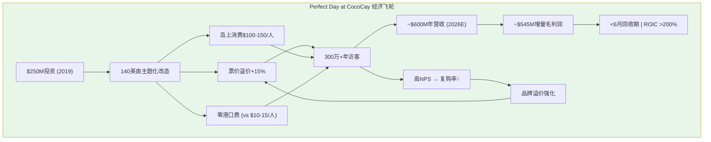
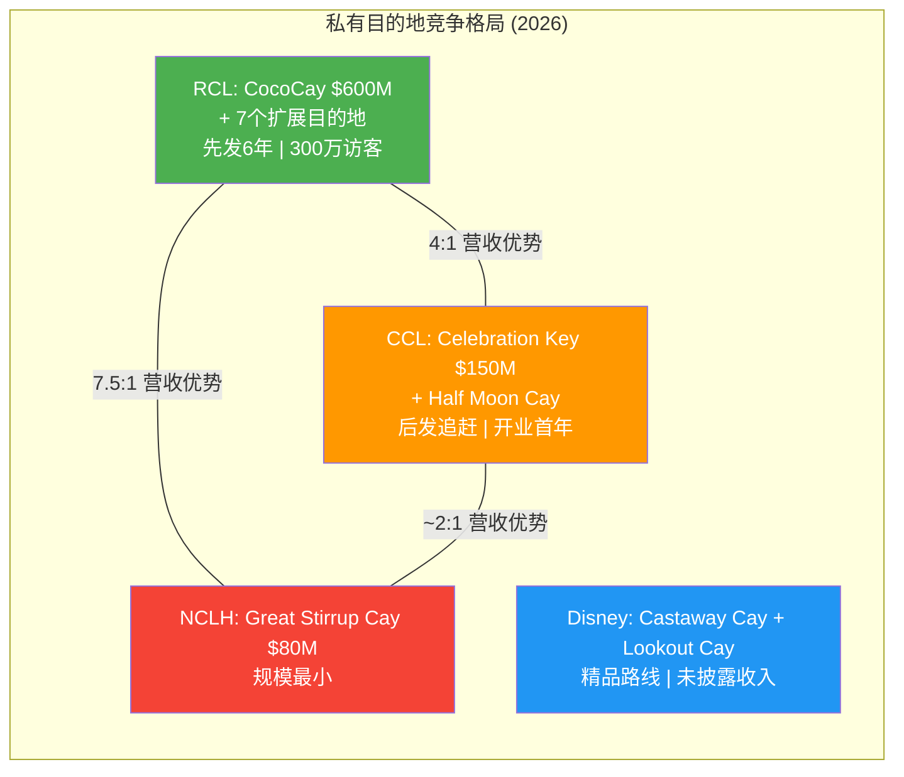

# Ch6 管理层与治理诊断

## 6.1 权力交接: 从"造船家"到"财务工程师"

Royal Caribbean Group在2022年1月完成了一次具有深层象征意义的权力交接。Richard Fain——自1988年执掌公司长达34年的传奇CEO——将权杖交给了CFO出身的Jason Liberty。这不仅是一次人事更替,更是管理哲学的范式转换。

**Richard Fain时代 (1988-2022)** 定义了现代邮轮工业的基本形态。Fain的核心信念是"更大的船=更好的体验=更高的定价权"。在他的推动下,RCL先后创造了Sovereign级、Voyager级、Oasis级和Icon级——每一代新船都重新定义了行业的产品边界。Fain是工程师气质的梦想家:他会花$2B+建造一艘船,用史无前例的水上滑梯和中央公园来震撼消费者的想象力。这种"造船家"风格缔造了RCL的产品护城河,但也遗留了$22B+的债务山丘和2020年几乎灭顶的流动性危机。

**Jason Liberty时代 (2022-至今)** 则代表完全不同的管理基因。Liberty 2005年加入RCL,2013年升任CFO,其职业DNA是财务纪律和资本回报。他的升任不是意外——在疫情期间,Liberty实际上已承担了远超CFO的运营职责。但关键问题是: **一个财务出身的CEO能否在维持RCL产品创新传统的同时,修复Fain时代留下的资产负债表?**

2025年6月,这一权力交接走到终点: Richard Fain卸任董事长,Liberty成为Chairman & CEO双重身份。独立Lead Director由John Brock(2014年入董事会)担任。**这是一个微妙的治理信号**——CEO兼任董事长在治理最佳实践中通常被视为权力集中,但对RCL而言,它标志着"Fain遗产"的正式终结和Liberty完全掌权。(来源: Seatrade Cruise, 2025年6月; PRNewswire)

**对核心矛盾的映射**: Liberty的"财务工程师"风格恰恰对应了"结构性复兴"叙事——如果RCL确实在经历身份转型(从周期性邮轮公司到体验经济平台),那么需要的正是能将Fain创造的资产变现为持续高回报的管理者。反之,如果只是周期性高峰,财务工程师只是在周期顶部美化报表。

## 6.2 "Perfecta"战略: 承诺的数学与现实

2025年3月,Liberty推出了"Perfecta"绩效计划——一个三年期(2024-2027)的双重财务目标:

| 目标 | 具体指标 | 隐含要求 |
|------|---------|---------|
| **EPS CAGR** | ≥20%(以FY2024 $10.94为基数) | FY2027E EPS ≥ $18.91 |
| **ROIC** | ≥17%(到FY2027) | 当前14.9%, 需+2.1pp |

(来源: PRNewswire, 2025年3月; RCL Investor Relations)

**FY2025已经超额完成前两年节奏**: EPS从$10.94→$15.61,两年CAGR达23%,高于20%基线。但这恰恰引发了一个更深层的问题——如果前两年"超额",是否FY2026-2027的增长斜率会自然放缓?

**Perfecta的三根支柱拆解**:

**支柱一: 适度产能增长**。FY2026/2027/2028产能增长分别为+6.7%/+4%/+6%。新船交付包括Legend of the Seas(Icon Class第三艘, 2026年7月)、Icon 4(2027)、Star of the Seas和Celebrity Xcel。这一产能节奏意味着RCL不指望"规模爆发",而是"持续渗透"。

**支柱二: 收益率增长(Yield Growth)**。FY2025 Net Yield +3.8% YoY,FY2026引导+1.5~3.5%(CC)。如果入住率已达109.7%的天花板附近,收益率增长必须来自更高的人均消费(APCD)——这正是私有目的地和船上消费升级的战略意义。

**支柱三: 严格成本控制**。NCC excl Fuel/APCD引导flat~+1.0%(CC),即成本增速大幅低于收入增速。在劳动力通胀和供应链压力的宏观环境下,这是最脆弱的支柱。

**数学验证**: 若FY2024 EPS $10.94 × (1.20)^3 = $18.91,而分析师FY2027E共识约$23.89(14位分析师),远超Perfecta目标。这说明市场实际上已经在定价"超额完成Perfecta"——当前15.3x Forward P/E对应的是$17.70-18.10(FY2026引导),而非Perfecta终点。(来源: FMP estimates; Nasdaq分析文章)

**对核心矛盾的映射**: Perfecta是"结构性复兴"叙事的管理层背书——它隐含的信息是"我们不只是周期性反弹,我们有三年可见的增长路径"。但Perfecta的基数效应(FY2024只是后疫情正常化第一年)和前两年的"超额"使得FY2027的真正考验尚未到来。

## 6.3 资本分配的矛盾: 去杠杆还是加杠杆?

这是Liberty管理能力最值得审视的领域。FY2025的资本分配呈现出一个令人困惑的矛盾:

| 项目 | FY2025 | 来源 |
|------|--------|------|
| **经营现金流(OCF)** | $6.47B | FMP cashflow |
| **资本支出(CapEx)** | -$5.23B | FMP cashflow |
| **自由现金流(FCF)** | $1.24B | OCF - CapEx |
| **股票回购** | -$1.16B | FMP cashflow |
| **股息支付** | -$0.26B(FY) / 年化~$0.82B | FMP cashflow / 估算 |
| **净债务发行** | +$1.02B | FMP cashflow |

**关键矛盾**: 股东回报($1.16B回购+$0.26B股息=$1.42B) > FCF($1.24B)。差额来自净新发债$1.02B。换言之,**RCL正在借钱回购股票和发股息**。

这与"去杠杆"叙事直接冲突。总债务从FY2024 $20.82B → FY2025 $22.64B(+$1.82B),净债务/EBITDA从3.4x → 3.2x(靠EBITDA增长而非绝对债务减少)。利息费用从$1.59B → $0.99B的大幅下降(-37.7%)主要来自再融资策略(置换高利率疫情债务为更低利率的新债),而非债务总量的削减。(来源: FMP balance sheet, cashflow)

**解读**: Liberty的资本分配优先级实际上是: CapEx(维持产品力) > 股东回报(建立信用) > 去杠杆(被动依赖EBITDA增长)。这是一个精心计算的策略——通过展示"回购+增息"向市场证明管理层信心,同时利用再融资窗口降低利息成本。但它的脆弱性在于: **如果EBITDA增长停滞(衰退/周期下行),债务比率将立即恶化,而已承诺的股东回报可能被迫削减**。

FY2025 Altman Z-Score仅2.34(灰色区间1.81-2.99),流动比率0.18,这不是一个有安全边际的资产负债表。

## 6.4 内部人交易: 持续卖出信号的深层解读

FMP insider-trading数据揭示了一个清晰的模式:

| 期间 | 获取(股) | 处置(股) | 公开市场卖出(笔) | 净方向 |
|------|---------|---------|------------------|--------|
| **2026 Q1** | 657,904 | 1,471,837 | 102 | 大量净卖出 |
| **2025 Q4** | 0 | 21,817 | 1 | 净卖出 |
| **2025 Q3** | 0 | 31,507 | 7 | 净卖出 |
| **2025 Q2** | 10,440 | 26,736 | 5 | 净卖出 |
| **2025 Q1** | 221,792 | 262,165 | 22 | 净卖出 |
| **2024 Q4** | 0 | 1,088,264 | 32 | 大量卖出 |
| **2024 Q3** | 5,350 | 314,357 | 3 | 净卖出 |
| **2024 Q2** | 0 | 171,775 | 6 | 净卖出 |

(来源: FMP insider-trading API)

**自2024 Q2以来连续八个季度净卖出,无一例外。**

具体到高管个人(最近6个月):
- **Jason Liberty (CEO)**: 0笔购买, 11笔卖出, 累计卖出90,910股, 约$29.7M (来源: Investing.com, TipRanks)
- **Naftali Holtz (CFO)**: 0笔购买, 11笔卖出, 累计卖出51,131股, 约$16.7M, 其中2026年2月13日单笔卖出43,121股/$16.7M (来源: Investing.com, Nasdaq)

**合理化解读**: (1) 每年Q1出现大量"获取"交易(RSU归属),伴随"处置"(纳税义务卖出)——这是股权激励的正常机制; (2) 股价从疫情低点上涨10倍+($30→$316),管理层适度变现并非异常; (3) CEO/CFO可能在10b5-1预设计划下自动执行。

**警示信号**: (1) 2026 Q1的102笔公开市场卖出是历史高位; (2) CFO在FY2025财报发布(2026年2月11日)后两天即卖出$16.7M,时间节点微妙; (3) 全公司过去6个月36笔交易全部是卖出,0笔购买——**没有任何一位高管或董事在公开市场增持**。

**对核心矛盾的映射**: 如果管理层真的相信"结构性复兴"故事(20% EPS CAGR,目标价隐含更高估值),为什么没有人在用自己的钱投票?内部人的"脚"(持续卖出)和"嘴"(Perfecta目标)指向不同方向。这不构成"看空"结论,但构成一个需要持续监控的信号。

## 6.5 治理结构: 利比里亚注册的真实含义

RCL于1985年在利比里亚注册成立(Business Corporation Act of Liberia),ISIN代码以LR开头。这一选择的核心逻辑是双重的:

**税务优势**: 利比里亚实行属地征税(territorial taxation)——仅对利比里亚境内收入征税。由于RCL的船队在国际水域运营,绝大部分收入不触发利比里亚税务义务。结果是: **有效税率 < 1%**(FY2025约0.35%)。相比之下,如果在美国注册,联邦企业税率21%将使净利润从$4.27B降至约$3.4B,EPS从$15.61降至约$12.40。税务套利每年为股东创造~$870M的价值。(来源: FMP ratios, SEC filings)

**治理监管宽松**: 利比里亚公司法的司法解释案例极少,董事的信义义务(fiduciary duties)和股东权利的法律保障不如美国特拉华州明确。这意味着: (1) 股东诉讼的法律基础较薄弱; (2) 股东隐私较高(持股信息非公开记录); (3) 反收购保护可能更强。(来源: SEC filing风险披露; Offshorecompany.com)

**实际影响评估**: 对投资者而言,利比里亚注册是一把双刃剑。税务优势是RCL相对CCL/NCLH的共同优势(邮轮行业普遍采用离岸注册——CCL在巴拿马,NCLH在百慕大)。但弱治理保障在Liberty兼任Chairman & CEO的背景下值得关注——当权力集中且外部法律制衡有限时,资本分配决策(如"借钱回购"策略)缺乏有效的外部检查机制。John Brock作为独立Lead Director的角色重要性因此被放大。

## 6.6 薪酬结构与激励对齐

FY2024 Proxy Statement披露的高管薪酬:

| 高管 | 基本薪资 | 现金奖金 | 股票奖励 | 其他 | **总计** |
|------|---------|---------|---------|------|---------|
| **Jason Liberty (CEO)** | $1.34M | $4.91M | $13.00M | $0.24M | **$19.50M** |
| **Naftali Holtz (CFO)** | $0.90M | $1.82M | $3.10M | $0.06M | **$5.88M** |

(来源: Salary.com; SEC DEF 14A)

**激励结构分析**:
- Liberty的薪酬中67%为股票奖励,这在理论上将其利益与股价绑定。但结合前述"持续卖出"数据,股票奖励的"对齐效果"被每年的变现行为部分抵消。
- **EPS/ROIC挂钩**: Perfecta计划本身(20% EPS CAGR + ROIC ≥17%)很可能是高管激励的核心KPI,这解释了管理层对EPS增长的高度关注——它同时服务于公司目标和个人薪酬。
- **风险**: 当CEO薪酬高度依赖EPS增长时,可能存在"回购EPS管理"激励——通过借债回购缩减股本来推高EPS,而非通过有机增长。FY2025的数据(净债务增加+股份减少2.2%)与这一担忧一致。

**对核心矛盾的映射**: 薪酬结构强化了Perfecta作为"管理层庄严承诺"的可信度,但也暴露了EPS增长可能部分来自财务工程(回购)而非纯粹运营改善的风险。16.5% ROIC → 17%目标看似可达,但需要区分"通过NOPAT增长提高ROIC"(结构性)还是"通过投入资本优化提高ROIC"(工程性)。

---

## Ch6 小结

| 维度 | 评估 | 核心矛盾映射 |
|------|------|------------|
| **领导力转型** | CFO→CEO→Chairman,权力完全集中 | 结构性: 财务纪律修复资产负债表; 周期性: 粉饰窗口 |
| **Perfecta目标** | 前两年超额(23% vs 20%),但基数效应 | 结构性: 三年可见增长路径; 风险: FY2027减速 |
| **资本分配** | 借债回购,实质未去杠杆 | 周期性警示: 顶部行为特征 |
| **内部人交易** | 连续8季度净卖出,CEO/CFO大额减持 | 周期性信号: 嘴上看多,脚在跑路 |
| **治理结构** | 利比里亚注册+CEO兼Chairman | 税务利好但治理保障弱 |
| **薪酬对齐** | 67%股票+EPS挂钩 | 正向: 激励一致; 风险: 回购EPS管理 |

---

# Ch7 私有岛屿与目的地战略

## 7.1 Perfect Day at CocoCay: 邮轮行业的"主题公园革命"

如果说Icon of the Seas代表了RCL"水上体验"的极致,那么Perfect Day at CocoCay就是"陆上体验"的范式创新。这座位于巴哈马的140英亩私有岛屿,可能是RCL过去十年最被低估的战略资产。

**投资与回报的惊人数学**:

| 指标 | 数据 | 来源 |
|------|------|------|
| **初始投资** | ~$250M (2019年完成改造) | CNN Travel |
| **FY2023访客量** | 250万人次 | RCL管理层披露 |
| **FY2024访客量** | 300万人次(+Hideaway Beach成人区) | RCL管理层披露 |
| **FY2026E营收** | ~$600M | Cleveland Research Center估算 |
| **增量毛利润** | ~$545M | Recurve Capital估算 |
| **航线票价溢价** | +15%(包含CocoCay停靠的航线) | 行业分析 |
| **人均岛上消费** | $100-150/天 | 行业分析 |
| **投资回收期** | <6个月(按增量毛利润计算) | Recurve Capital推算 |

(来源: Cleveland Research Center via Travel Weekly; Recurve Capital; CruiseIndustryNews)

**这组数字堪称教科书级的资本配置案例**: $250M投资产生$545M增量年毛利润,回收期不到半年,年化ROIC超过200%。即使对这些第三方估算打50%折扣,CocoCay仍然是RCL资产组合中回报率最高的单项投资。

**CocoCay为何如此赚钱?** 核心机制是"封闭消费生态":

1. **票价溢价效应**: 包含CocoCay的航线比同区域不含CocoCay的航线溢价~15%。对于平均$1,800/周/人的票价,这意味着$270/人的额外收入,仅此一项对300万访客年贡献就超$800M(部分已含在票价中)。

2. **岛上消费变现**: Thrill Waterpark门票、Coco Beach Club($120+/人)、Hideaway Beach($40+/人)、餐饮零售——每位客人$100-150的额外消费几乎是纯利润,因为边际运营成本极低(岛上设施固定成本已摊销)。

3. **零港口费用**: 传统邮轮停靠第三方港口需支付$10-15/旅客的港口费。自有目的地消除了这一成本,同时垄断了消费场景。

4. **NPS与复购驱动**: CocoCay持续获得极高的客户满意度评分,成为"值得再来一次"的品牌锚点,推动RCL整体复购率。

## 7.2 目的地帝国: 从2到8的扩张蓝图

CocoCay的成功催生了RCL最大胆的陆上扩张计划——到2028年从2个自有目的地扩展到8个:

| 目的地 | 类型 | 开业时间 | 区域 | 估计规模 |
|--------|------|---------|------|---------|
| **Perfect Day at CocoCay** | 私有岛屿 | 2019 (运营中) | 巴哈马 | 140英亩, 300万+年访客 |
| **Labadee** | 私有海滩 | 1986 (运营中) | 海地 | 传统目的地 |
| **Royal Beach Club Paradise Island** | 海滩俱乐部 | 2025年12月 | 巴哈马(拿骚) | 17英亩, 2海滩+3泳池 |
| **The Cormorant at 55 South** | 酒店 | 2026 | 智利 | 最南端酒店 |
| **Royal Beach Club Santorini** | 海滩俱乐部 | 2026夏 | 希腊 | 首个欧洲目的地 |
| **Royal Beach Club Cozumel** | 海滩俱乐部 | 2026年底 | 墨西哥 | 42英亩 |
| **Perfect Day Mexico** | 私有目的地 | 2027 | 墨西哥 | CocoCay规模级别 |
| **Royal Beach Club South Pacific** | 海滩俱乐部 | 2027 | 瓦努阿图Lelepa | 南太平洋航线 |

(来源: PRNewswire; RCL Press Center; StockTitan; Seatrade Cruise)

**重要区分**: "Royal Beach Club"模式与"Perfect Day"模式有本质区别:

- **Perfect Day模式**(CocoCay/Perfect Day Mexico): RCL完全拥有或控制整个岛屿/目的地,投入$250M+级别,打造大规模主题化体验(水上乐园/泳池群/多餐厅)。高投入、高回报、高壁垒。
- **Royal Beach Club模式**(Nassau/Cozumel/Santorini/South Pacific): RCL租赁或合作开发较小的海滩区域(17-42英亩),投入较低(估计$50-150M),提供精品化体验(私有海滩/泳池/酒吧)。低投入、中等回报、但可快速复制。

这种双轨模式的战略智慧在于: **Perfect Day是"旗舰航母",Royal Beach Club是"驱逐舰群"**。前者定义品牌标杆,后者覆盖全球航线网络。

## 7.3 私有目的地的战略价值矩阵

私有目的地对RCL的战略意义远超"多一个停靠港"的简单逻辑。它同时在四个维度创造价值:

**维度一: 封闭消费极致化**。传统港口停靠时,旅客消费流向当地商家。私有目的地将100%的消费留在RCL生态内。以CocoCay为例,$100-150/人/天的岛上消费,如果在拿骚或科苏梅尔,绝大部分会流向第三方。**这本质上是迪士尼乐园"围墙花园"逻辑的海上版本**。

**维度二: 航线差异化与定价权**。包含CocoCay的航线比同区域标准航线溢价15%。随着目的地组合扩展至8个,RCL可以为加勒比、地中海、南太平洋航线都配置专属目的地,使**整个航线网络的平均票价系统性上移**。

**维度三: 竞争壁垒**。优质的私有岛屿/海滩是稀缺资源,尤其在巴哈马和加勒比地区。每一个被RCL锁定的目的地,都是竞争对手无法复制的资产。先发优势在这里具有物理意义——**岛屿就那么多**。

**维度四: 运营效率**。私有目的地消除了港口费($10-15/旅客)、简化了港口物流、减少了旅客安全风险(当地犯罪/骗局)、提高了准时出港率。这些"隐性节约"在规模上是显著的。

## 7.4 竞品对标: "私有岛屿军备竞赛"的格局

RCL不是唯一在私有目的地押注的公司。三大邮轮集团+迪士尼都在加速布局:

| 公司 | 目的地 | 投资 | 2026E营收 | 策略特征 |
|------|--------|------|-----------|---------|
| **RCL** | CocoCay + 7个新目的地 | $250M (CocoCay) + 新增投资 | ~$600M (仅CocoCay) | 主题公园化, 最激进 |
| **CCL** | Celebration Key (2025.07开业) | $600M | ~$150M (首年) | 后发追赶, 模仿CocoCay |
| | Half Moon Cay (已运营) | — | — | 自然美景, 低开发度 |
| | Ocean Cay MSC (MSC品牌) | — | — | MSC独占 |
| **NCLH** | Great Stirrup Cay | 较小投入 | ~$80M | 最小规模 |
| **Disney** | Castaway Cay (1997) | $25M (原始) | 未披露 | 品牌溢价, 家庭定位 |
| | Lookout Cay at Lighthouse Point (2024.06) | 未披露 | 未披露 | 新增第二岛 |

(来源: Cleveland Research via Travel Weekly; Carnival News; CruiseIndustryNews; Wikipedia)

**关键对标洞察**:

1. **Carnival的$600M追赶**: Celebration Key(2025年7月开业)的投入($600M)是CocoCay初始投资($250M)的2.4倍,但首年预计营收仅$150M(CocoCay的1/4)。这说明: (a) CocoCay的先发优势和品牌积累无法用资金简单复制; (b) Celebration Key需要数年爬坡期; (c) CCL的模仿实际上验证了RCL私有目的地策略的正确性。

2. **Disney的精品路线**: Castaway Cay(1997年开业, $25M投资)和Lookout Cay(2024年开业)走的是"品牌溢价+家庭体验"路线,与RCL的"大规模主题公园"路线形成差异化。Disney不公布单独收入,但其船上消费水平(Disney旅客日均消费远高于行业平均)暗示其私有岛屿亦有极高的人均贡献。

3. **NCLH的劣势**: Great Stirrup Cay仅$80M预计营收(CocoCay的1/8),反映了NCLH在规模和品牌力上与RCL/CCL的差距。

## 7.5 核心矛盾: 差异化优势是否被稀释?

这是本章最重要的分析问题: **如果所有邮轮公司都建私有岛,CocoCay的差异化优势是否会被稀释?**

**稀释论据**:
- Carnival的Celebration Key直接对标CocoCay的大规模主题化模式
- 2025-2028年行业私有目的地投资可能超$2B
- 消费者可能将"私有岛屿体验"视为行业标配而非RCL独家卖点
- 巴哈马等热门区域的土地/海滩资源竞争推高成本

**反稀释论据(更具说服力)**:
- **时间不可压缩**: CocoCay已运营6年+,拥有300万+年访客的运营数据和客户忠诚度。Celebration Key需要至少3-5年才能达到类似规模。
- **网络效应**: RCL的8个目的地覆盖加勒比、地中海、南太平洋——**竞争对手即使建了一个CocoCay,也无法复制RCL的全球目的地网络**。
- **品牌锁定**: "Perfect Day"已成为邮轮行业最知名的目的地品牌。消费者搜索"CocoCay"的频率远超任何竞品目的地。
- **规模经济**: 300万+访客允许RCL持续投资CocoCay的设施升级(如Hideaway Beach 2024年新增),形成"投资→体验提升→更多访客→更多收入→更多投资"的正循环。
- **收入质量差距**: CocoCay $600M vs Celebration Key $150M的4:1差距不会在短期内弥合。

**结论**: 竞争确实在加剧,但RCL的先发优势和全球网络扩张使得其私有目的地护城河在中期(3-5年)内不太可能被实质性侵蚀。真正的风险不是"别人也建了岛",而是"消费者是否愿意持续为岛上付费体验买单"——这取决于宏观消费环境而非竞争动态。

## 7.6 私有目的地估值: 一个被忽视的"隐藏资产"

如果将RCL的私有目的地组合作为独立资产估值:

**CocoCay估值(保守)**:
- 年营收: $600M (2026E)
- 假设毛利率: 85-90%(极低边际成本)
- EBITDA: ~$500M
- 适用倍数: 15-20x EV/EBITDA(介于主题公园25-30x与酒店12-15x之间)
- **隐含价值: $7.5B - $10.0B**

**全目的地组合估值(远期,8个目的地全部运营)**:
- CocoCay: $600M+
- Perfect Day Mexico (假设CocoCay的50%规模): $300M
- 6个Royal Beach Club (假设每个$50-100M): $300-600M
- **组合年营收: $1.2B - $1.5B**
- 适用15x EBITDA(85%利润率)
- **隐含价值: $15B - $19B**

**对比**: RCL当前总企业价值~$108B(市值$86.3B+净债务$21.8B)。如果私有目的地组合在2028年价值$15-19B,它将占RCL总价值的14-18%。**而这一资产类别在2019年(疫情前)几乎不存在**——CocoCay的改造恰好在2019年完成。

这是"结构性复兴"论的最强证据之一: **RCL在2019年没有的资产,到2028年可能贡献总价值的15%+。这不是周期性波动,这是商业模式的实质变化。**

**估值的保守假设与风险**:
- 上述估算假设毛利率85-90%可能偏高——需考虑员工成本、维护CapEx和巴哈马政府租金/税费
- 15x EV/EBITDA倍数的合理性取决于增长前景——如果目的地收入增长放缓,倍数可能压缩至12x
- Perfect Day Mexico和Royal Beach Club的收入预测高度不确定——Beach Club模式尚未经过收入验证
- 地缘风险: 海地(Labadee)的政治不稳定性已多次导致航线调整

## 7.7 Disney对标: 两种截然不同的"围墙花园"

Disney Cruise Line的私有岛屿策略提供了一个有趣的对照组:

| 维度 | RCL (Perfect Day模式) | Disney (Castaway Cay模式) |
|------|----------------------|--------------------------|
| **核心理念** | "海上主题公园" | "海上迪士尼度假区" |
| **规模** | 大型(140英亩全开发) | 中型(1,000英亩但仅开发~50英亩) |
| **付费体验** | 大量付费项目($40-120+/人) | 多数体验含在票价中 |
| **变现模式** | 票价溢价 + 岛上消费双引擎 | 高票价一次性包含 |
| **扩张速度** | 到2028年8个目的地 | 2个岛屿(Castaway Cay + Lookout Cay) |
| **品牌定位** | 冒险/刺激/多样化 | 家庭/魔幻/安全感 |
| **可复制性** | 中等(大规模开发需要大量资本) | 低(依赖Disney IP的不可复制性) |

**关键洞察**: Disney的模式更"轻",但更依赖品牌溢价(Disney邮轮票价比RCL高30-50%)。RCL的模式更"重",但可以通过规模和数量实现更大的总收入贡献。**两者本质上都是"将消费者锁在自有生态中"的策略,只是锁的方式不同——Disney用品牌忠诚度锁,RCL用体验密度锁。**

## 7.8 对核心矛盾的终极判定

私有目的地战略是RCL"结构性复兴"叙事中最有说服力的单一证据:

1. **它创造了2019年不存在的收入流**: CocoCay的$600M收入是后疫情时代的"新收入",不是简单的周期性恢复。
2. **它改变了商业模式的利润结构**: 85%+毛利率的陆上消费,对比50%毛利率的传统邮轮运营,系统性提升了集团利润率。
3. **它具有网络效应**: 8个目的地覆盖全球主要航线,形成自增强的品牌-体验-复购飞轮。
4. **它提高了竞争壁垒**: 物理资产(岛屿/海滩)的稀缺性和先发优势创造了时间壁垒。

**但它也面临以下限制**:
- 2019年前行业没有"私有目的地溢价"的先例,当前估值倍数可能包含过度乐观
- CCL/NCLH/MSC都在追赶,5-10年后差距可能缩小
- 宏观消费下行时,岛上付费体验首先被削减(消费者选择"免费海滩"而非"$120 Beach Club")
- 自然灾害风险(飓风)对巴哈马等低地岛屿的物理威胁

**净评估**: 私有目的地组合为"结构性复兴"增添**+20%的置信度权重**。它是最难以用"周期性高峰"来解释的单一因素——周期性高峰不会创造全新的资产类别和收入流。

---

## Ch7 小结

| 维度 | 评估 | 核心矛盾映射 |
|------|------|------------|
| **CocoCay经济模型** | $250M投资→$600M营收, ROI行业标杆 | 强力支持结构性复兴 |
| **扩张蓝图** | 2→8个目的地(2028年) | 若执行成功则打开$1.2-1.5B收入流 |
| **竞争格局** | 4:1领先CCL, 但竞争加剧 | 先发优势中期(3-5年)稳固 |
| **隐含估值** | 全组合$15-19B (占EV 14-18%) | 2019年不存在的"新资产" |
| **Disney对标** | 不同路径, 相同逻辑(围墙花园) | 行业趋势验证 |
| **风险** | 宏观消费下行+自然灾害+竞争追赶 | 限制乐观空间 |
