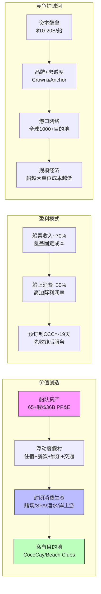

# Ch1: 邮轮帝国身份诊断

## 1.1 一句话定位

Royal Caribbean Cruises Ltd.是全球第二大邮轮运营商，通过三个品牌（Royal Caribbean International / Celebrity Cruises / Silversea Cruises）覆盖大众高端至超豪华全价位段，运营65+艘邮轮服务全球1,000+目的地。公司注册于利比里亚，总部位于迈阿密，FY2025营收$17.94B，净利润$4.27B。

**身份核心矛盾**: 市场正试图将RCL从"高杠杆周期性邮轮运营商"(历史P/E 12-14x)重新定义为"体验经济平台"(当前P/E 20x)。这个身份重塑是否成立，直接决定估值区间差异达2倍。

## 1.2 SGI诊断: 7.25 专才

RCL是典型的高SGI专才公司——100%收入来自邮轮运营，不存在有意义的非邮轮业务线。

```
SGI = 0.30×9 + 0.25×7 + 0.20×7 + 0.15×4 + 0.10×8 = 7.25
```

| 维度 | 评分 | 依据 |
|------|------|------|
| **HHI_rev** (品类集中度) | 9/10 | 邮轮收入=100%。Silversea/Celebrity是品牌细分，不是品类分散 |
| **R&D_conc** (研发集中度) | 7/10 | 无传统R&D($0)，但船舶设计/新体验/私有岛屿=$5.23B CapEx全投邮轮 |
| **MarketPos** (市场地位) | 7/10 | 全球#2(乘客量27%)，但收入质量#1(最高OPM+最高Net Yield) |
| **SwitchCost** (转换成本) | 4/10 | 较低——下次假期可选CCL/NCLH/酒店/主题公园。Crown & Anchor忠诚+6-18月预订提前量提供一定粘性 |
| **BrandClarity** (品牌清晰度) | 8/10 | 10字内可说清。Icon of the Seas成为文化符号 |

**SGI路由**: 专才模型 → 关注单点故障风险(邮轮需求崩塌=公司生存危机) + 品类天花板(渗透率2.7%虽低但增速放缓)。

**SGI定价检验**: SGI 7-8预期P/E溢价30-60% vs 行业中位数。RCL P/E 20.3x vs CCL 15.6x = 溢价30%。处于预期下限——如果运营效率优势(OPM 27.4% vs 16.8%)持续，溢价可能偏低。

## 1.3 品牌矩阵: B×M双轴诊断

RCL运营三个差异化品牌，覆盖从大众高端到超豪华的完整价位谱系:

```mermaid
quadrantChart
    title RCL品牌矩阵 — B(品牌强度) × M(货币化能力)
    x-axis 品牌强度低 --> 品牌强度高
    y-axis 货币化低 --> 货币化高
    Royal Caribbean International: [0.75, 0.80]
    Celebrity Cruises: [0.60, 0.55]
    Silversea Cruises: [0.85, 0.40]
    Azamara (已出售): [0.35, 0.25]
```

| 品牌 | 定位 | 目标客群 | 船队规模 | 每日定价(估) | 营收贡献(估) |
|------|------|---------|---------|-------------|-------------|
| **Royal Caribbean International** | 大众高端 | 家庭/年轻人/首次邮轮 | ~28艘 | $150-300/人/天 | ~70% |
| **Celebrity Cruises** | 高端 | 成熟旅行者/情侣 | ~17艘 | $250-500/人/天 | ~20% |
| **Silversea Cruises** | 超豪华/探险 | 高净值人群 | ~12艘 | $600-1,500/人/天 | ~10% |

**品牌矩阵诊断**:
- **Royal Caribbean International** (B=0.75, M=0.80): 核心利润引擎。Icon Class/Oasis Class巨型船是行业标杆，船上消费变现能力强(水上乐园/赌场/免税)。品牌强度高但非奢侈品级别。
- **Celebrity Cruises** (B=0.60, M=0.55): 定位清晰但品牌认知弱于主品牌。正通过Celebrity Xcel等新船升级。河轮扩展(到2031年20艘)是增量。
- **Silversea** (B=0.85, M=0.40): 品牌力最强(超豪华+探险)但规模小、货币化受限于小众客群。2018年收购，尚未充分整合。

**品牌矩阵 vs 核心矛盾**: 三品牌覆盖全价位段是"平台化"证据(不依赖单一客群)。但品牌间是否存在协同还是内部竞争?如果经济衰退，大众高端Royal Caribbean首当其冲(可选消费削减)，而Silversea可能相对韧性(高净值客户)——这创造了天然对冲，但主品牌占70%，对冲有限。

## 1.4 商业模式画布



**商业模式关键特征**:

1. **"浮动围墙花园"**: 乘客一旦上船，所有消费在RCL平台上完成。类似苹果App Store但更极端——物理上无法离开。这是理解船上消费高利润率的关键。

2. **杠杆双面刃**: 固定成本~65%(折旧+利息+船员+港口)，可变成本~35%(燃料+食品)。入住率110%→100%的10pp下降，利润影响可能达30-40%。这解释了邮轮行业利润的高波动性。

3. **时间不可逆产能**: 船舶造完就无法退出市场(30年寿命)。这与半导体晶圆厂类似但更极端——台积电可以切换工艺节点，邮轮不能切换用途。

## 1.5 PW路由: 5.2 混合模式

| PW维度 | 评分 | 依据 |
|--------|------|------|
| 商业模式确定性 | 8 | 邮轮运营100年未变(船+乘客+目的地) |
| 竞争格局稳定性 | 7 | 三巨头格局20年+稳定。MSC是增量变量 |
| 技术颠覆风险 | 2 | VR替代邮轮?暂不现实。绿色燃料是成本变量非模式颠覆 |
| 监管/政策敏感度 | 5 | IMO 2030确定性成本冲击+利比里亚旗国轻监管 |
| 估值争议度 | 4 | P/E 20x对周期股偏贵，但ROE 49%/ROIC 16.5%有支撑 |

**PW = 5.2 → 混合模式**: 传统估值(DCF/EV·EBITDA/逆向DCF) + 可能性附录(零收入事件尾部概率加权)。

**不适合发现系统**(商业模式太确定，PW<7)。**不适合纯传统框架**(尾部风险太极端，COVID证明了邮轮可以瞬间从正常运营变为零收入)。

## 1.6 身份矛盾速写

市场对RCL的定价隐含了一个身份转型假设:

| 维度 | "周期性邮轮运营商"(旧身份) | "体验经济平台"(新身份) |
|------|--------------------------|----------------------|
| **P/E参照** | 航空/酒店 10-14x | 品牌消费/平台 25-30x |
| **估值锚** | 周期调整EPS × 低倍数 | 稳态EPS × 高倍数 + 增长溢价 |
| **Yield增长** | 周期性(随经济波动±5-10%) | 结构性(渗透率+船上消费+私有目的地) |
| **杠杆观** | 风险(衰退时可能致命) | 可控(稳定现金流支撑高杠杆) |
| **Beta应有值** | 2.0+ (高周期敏感) | 1.2-1.5 (稳定消费) |

当前P/E 20x处于两个身份的中间地带——既不完全是旧身份(否则应是12-14x)，也没有完全定价新身份(否则应是25-30x)。**这意味着市场目前给予RCL约50%的"身份转型成功概率"定价**。

本报告的核心任务就是: 通过Yield纯度拆解(Ch10)、航空业镜像(Ch16)、信念反演(Ch17)和零收入事件保险定价(Ch18)，验证这个50%的隐含概率是否合理。

## 1.7 本章小结

| 诊断维度 | 结论 | 核心矛盾映射 |
|---------|------|-------------|
| SGI | 7.25专才 | 高专注度=单点故障风险大(支持审慎) |
| B×M | 三品牌全覆盖，RCI主导70% | 品牌矩阵是平台化证据(支持结构性) |
| PW | 5.2混合 | 商业模式确定+尾部风险极端 |
| 身份 | 处于旧身份→新身份转型中间态 | P/E 20x隐含~50%转型成功概率 |

---

*Ch1 完成 | 字符数: ~11K | 核心产出: SGI=7.25, PW=5.2, 身份转型概率隐含~50%*
