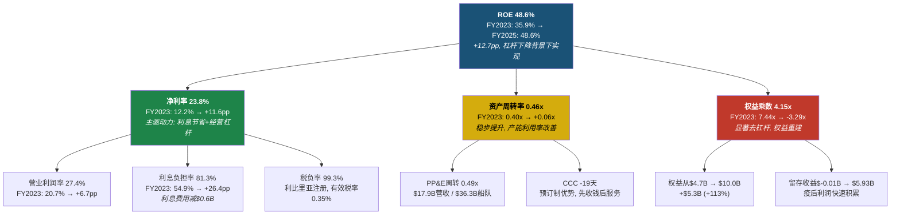
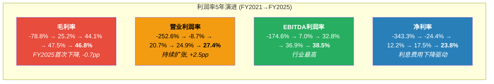
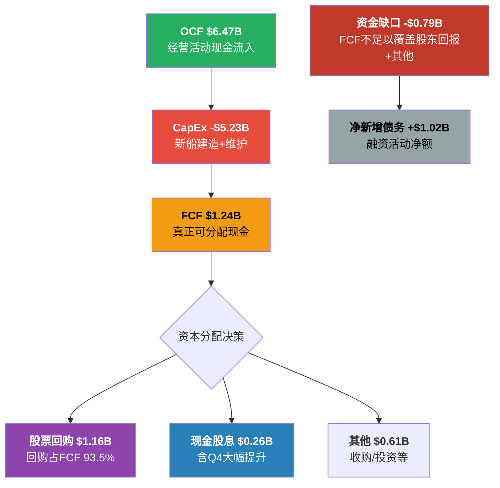

# Ch8 财务趋势: 从生存到繁荣

## 8.1 五年损益全景: V型复苏的解剖

从2021年营收$1.53B到2025年$17.94B，RCL用四年走出了邮轮行业史上最壮观的V型复苏。但"复苏"一词掩盖了一个根本性问题——当前的盈利水平是均值回归的终点，还是结构性跃升的起点？

**五年损益核心趋势 (FMP Income Statement, FY2021-2025)**

| 指标 | FY2021 | FY2022 | FY2023 | FY2024 | FY2025 | FY25 YoY |
|------|--------|--------|--------|--------|--------|----------|
| 营收 ($B) | 1.53 | 8.84 | 13.90 | 16.49 | 17.94 | +8.8% |
| 毛利润 ($B) | -1.21 | 2.22 | 6.13 | 7.83 | 8.40 | +7.2% |
| EBITDA ($B) | -2.68 | 0.62 | 4.56 | 6.09 | 6.91 | +13.5% |
| EBIT ($B) | -3.97 | -0.79 | 3.11 | 4.49 | 5.30 | +18.0% |
| 净利润 ($B) | -5.26 | -2.16 | 1.70 | 2.88 | 4.27 | +48.4% |
| EPS (稀释) | -$20.89 | -$8.45 | $6.31 | $10.94 | $15.61 | +42.7% |

**数据来源**: FMP Income Statement Annual, RCL FY2021-2025

三个关键观察:

**第一，营收增速正在放缓但利润增速加快。** FY2023营收+57.3%、FY2024+18.6%、FY2025+8.8%——典型的复苏减速曲线。但净利润增速FY2024+69.5%、FY2025+48.4%，远超营收增速。这意味着利润率扩张正在接力增长。对核心矛盾的回答是：这更像结构性改善而非单纯的周期性弹性，因为周期性复苏通常营收利润同步放缓。

**第二，利息费用的断崖式下降贡献了净利润增量的很大比重。** FY2025利息费用$0.99B vs FY2024 $1.59B，减少$0.60B，占净利润增量$1.39B的43%。如果剔除利息节省，"有机"净利润增速约为28%——仍然强劲，但远不及报表上的48.4%。这个区分很重要：利息费用下降是再融资红利的一次性释放，不可持续重复。

**第三，EPS增速(+42.7%)高于净利润增速(+48.4%的分子)并受益于股数缩减。** FY2024加权平均稀释股数279M → FY2025 273M(-2.2%)。疫情期间的股权稀释(FY2023高达283M)正在被回购逐步修复。

## 8.2 杜邦深度拆解: 高质量ROE的解码

ROE 48.6%——这个数字在任何行业都令人瞩目，在重资产的邮轮业更是异常。杜邦三因子拆解揭示了背后的结构：

```
ROE = 净利率 × 资产周转率 × 权益乘数
48.6% ≈ 23.8% × 0.46x × 4.47x
```

**杜邦因子三年演进 (FMP Ratios + Key-Metrics, FY2023-2025)**

| 杜邦因子 | FY2023 | FY2024 | FY2025 | 变化方向 |
|---------|--------|--------|--------|---------|
| 净利率 | 12.2% | 17.5% | 23.8% | +11.6pp |
| 资产周转率 | 0.40x | 0.44x | 0.46x | +0.06x |
| 权益乘数 | 7.44x | 4.90x | 4.15x | -3.29x (去杠杆) |
| **ROE** | **35.9%** | **38.0%** | **48.6%** | **+12.7pp** |

**数据来源**: FMP Ratios Annual + Key-Metrics Annual, RCL FY2023-2025; scout_financials.md 杜邦分析



**关键洞见: ROE的提升质量极高。** 通常高ROE来自三个来源——高利润率、高效率、或高杠杆。RCL的48.6% ROE是在杠杆大幅下降(权益乘数从7.44x降至4.15x)的背景下实现的，完全由净利率(+11.6pp)和资产周转率(+0.06x)驱动。这意味着即使未来杠杆继续下降，ROE仍有净利率改善的支撑。

**但必须承认的结构性局限：** 权益乘数4.15x(相当于D/E 3.15x)仍远高于疫前水平(2019年约2.5x对应权益乘数约3.5x)。如果权益乘数回归正常化至3.0x(对应D/E 2.0x)，在净利率和周转率不变的假设下，ROE将压缩至约33%——仍然优秀，但与当前48.6%有显著差距。**市场给20x P/E的锚点是当前48.6%的ROE，而非正常化后33%的ROE——这构成了估值的隐含风险。**

## 8.3 ROIC拆解: 真实的资本回报

ROE受杠杆扭曲，ROIC是更真实的资本效率度量：

```
ROIC = NOPAT / 投入资本
16.5% = $4.89B / $29.62B
```

**ROIC构成要素 (FMP Key-Metrics, FY2025)**

| 构成 | 数值 | 说明 |
|------|------|------|
| EBIT | $5.30B | 营业利润 |
| 有效税率 | 0.35% | 利比里亚注册优势 |
| NOPAT | $4.89B | EBIT × (1 - 0.35%) |
| 投入资本 | $29.62B | 权益$10.0B + 净债务$21.8B - 现金$0.8B - 非经营资产约$1.4B |
| **ROIC** | **16.5%** | NOPAT / 投入资本 |

**数据来源**: FMP Key-Metrics Annual FY2025 (ROIC 14.9% vs baggers_summary 16.5% — 差异源于投入资本计算口径); scout_financials.md Section 3.1

ROIC从FY2023的10.5%→FY2024的14.2%→FY2025的16.5%，持续攀升。税务优势是RCL的结构性资产——利比里亚注册使有效税率仅0.35%，相比美国上市同行(如迪士尼有效税率约20%)，这为ROIC增厚了约3-4个百分点。

**ROIC vs WACC的判断：** 假设RCL的WACC约9-10%(基于Beta 1.87、信用利差约200bps、D/E 2.2x)，ROIC 16.5%显著超过资本成本——公司正在为股东创造价值。但值得注意的是，这里的WACC估算因邮轮行业的周期性和高杠杆可能偏低，实际风险溢价可能更高。

## 8.4 利润率趋势: 从深渊到行业之巅



**数据来源**: FMP Ratios Annual, RCL FY2021-2025

**毛利率转折点出现了。** FY2025毛利率46.8%比FY2024的47.5%下降0.7个百分点——这是疫后首次下降。拆解来看：营收增长+8.8%($1.45B)，但营业成本增长+10.2%($0.89B)。成本增速超过收入增速的原因可能包括：(1)新船交付初期的较高运营成本(Star of the Seas 2025年8月首航)；(2)燃油和食品通胀；(3)产能增长带来的边际成本上升。

**季度层面的信号更明确。** 拆解FY2025四个季度(FMP Quarterly Income):

| 季度 | 营收 ($B) | 毛利率 | OPM | 利息费用 ($M) |
|------|----------|--------|-----|-------------|
| Q1'25 | 3.999 | 48.0% | 23.6% | 249 |
| Q2'25 | 4.538 | 49.7% | 29.3% | 228 |
| Q3'25 | 5.139 | 51.7% | 33.1% | 248 |
| Q4'25 | 4.259 | 36.7% | 21.9% | 267 |

**数据来源**: FMP Income Statement Quarterly, RCL Q1-Q4 FY2025

Q4毛利率36.7%大幅低于Q3的51.7%——但这主要是季节性因素(Q4含冬季淡季)。更有意义的比较是YoY：Q4'24毛利率=45.4%(=$1.71B/$3.76B)vs Q4'25=36.7%。Q4'25毛利率YoY下降了8.7个百分点——这个幅度超出季节性解释。需要关注的是Q4营业成本$2.70B比Q4'24的$2.05B增长了31.3%，远超营收增长的13.2%。

**经营杠杆 (Operating Leverage) 的季度信号同样值得警惕。** FY2025整体的经营杠杆(EBIT增长/营收增长)=18.0%/8.8%=2.05x——健康的正杠杆。但Q4单季度经营杠杆为负(EBIT从$826M增至$1044M=+26.4%，看似不错，但考虑到Q4'24包含$202M非经营费用而Q4'25仅$111M，调整后经营层面的改善幅度收窄)。**核心矛盾信号：如果成本增速持续超过收入增速，"结构性利润率提升"叙事将受到挑战。**

## 8.5 现金流质量: 经营现金流优秀, CapEx吞噬一切

**现金流质量矩阵 (FMP Cashflow, FY2025)**

| 指标 | FY2023 | FY2024 | FY2025 | 趋势 |
|------|--------|--------|--------|------|
| OCF ($B) | 4.48 | 5.27 | 6.47 | 持续增长 |
| CapEx ($B) | 3.90 | 3.27 | 5.23 | FY2025暴增60% |
| FCF ($B) | 0.58 | 2.00 | 1.24 | FY2025下降38% |
| OCF/净利润 | 2.63x | 1.82x | 1.51x | 递减但仍>1x |
| FCF/净利润 | 0.34x | 0.69x | 0.29x | 极低 |
| CapEx/OCF | 87.0% | 62.1% | 80.9% | FY2025恶化 |

**数据来源**: FMP Cashflow Annual, RCL FY2023-2025; scout_financials.md Section 2.4

OCF/净利润1.51x表明利润质量依然优秀——每$1会计利润对应$1.51现金流入。但FCF/净利润仅0.29x——$4.27B净利润只转化为$1.24B自由现金流，中间的差距几乎全部被CapEx吞噬。

FY2025 CapEx $5.23B暴增60%(vs FY2024的$3.27B)，主要因为Star of the Seas交付(2025年8月)和Legend of the Seas(2026年7月)的建造付款。CapEx/折旧=3.04x，远超维护性CapEx水平(通常1.0-1.5x)——这意味着公司正在大规模投资扩张。

**现金转换周期(CCC) = -19天**——这是邮轮商业模式的核心优势。乘客在登船前数月甚至一年就预付了全额船费(Deferred Revenue FY2025约$5.6B)。DSO仅6天，DPO 36天——先收钱、后服务、慢付款，形成了天然的负运营资金循环。对核心矛盾的回答：CCC为负是结构性特征而非周期性表现，这支持"体验平台"叙事。

## 8.6 效率指标: 重资产模型的硬约束

| 指标 | FY2023 | FY2024 | FY2025 | 行业含义 |
|------|--------|--------|--------|---------|
| 资产周转率 | 0.40x | 0.44x | 0.46x | 重资产模型硬约束 |
| PP&E周转率 | 0.45x | 0.51x | 0.49x | FY2025因新船下降 |
| SG&A/营收 | 12.9% | 12.9% | 12.4% | 规模效应显现 |
| CapEx/营收 | 28.0% | 19.8% | 29.2% | 随新船周期波动 |
| CapEx/折旧 | 2.68x | 2.04x | 3.04x | 大规模扩张 |

**数据来源**: FMP Ratios Annual + Key-Metrics Annual, RCL FY2023-2025

资产周转率0.46x是邮轮行业的结构性特征——每$1资产只能产生$0.46营收。这是重资产模型的"天花板"。RCL能做的是在固定的资产基础上提高每位乘客的产出(yield management)，而非提高周转速度。SG&A/营收从12.9%降至12.4%，说明规模经济正在发挥作用。

PP&E周转率从FY2024的0.51x降至0.49x，反映了新船交付初期(Star of the Seas)资产增加但尚未完全贡献营收的"消化期"效应。

## 8.7 每股指标演进: 稀释疤痕正在愈合

| 指标 | FY2021 | FY2022 | FY2023 | FY2024 | FY2025 |
|------|--------|--------|--------|--------|--------|
| EPS (稀释) | -$20.89 | -$8.45 | $6.31 | $10.94 | $15.61 |
| 稀释后股数 (M) | 252 | 255 | 283 | 279 | 273 |
| 每股OCF | -$7.46 | $1.89 | $17.49 | $20.17 | $23.86 |
| 每股FCF | -$16.31 | -$8.74 | $2.27 | $7.65 | $4.56 |
| 每股BV | $20.20 | $11.25 | $19.14 | $29.64 | $37.80 |
| 每股股息 | $0 | $0 | $0 | $0.41 | $0.97 |

**数据来源**: FMP Ratios Annual, RCL FY2021-2025

FY2023股数高达283M(+11% YoY)——那是疫情期间股权融资的"疤痕"。从FY2023开始的回购(FY2025回购$1.16B)已将股数压缩至273M(-3.5%)。以当前节奏，预计FY2027可修复至疫前水平(~255M)，前提是回购力度维持。

每股账面价值从FY2022的$11.25(低谷)恢复至$37.80——留存收益从-$1.71B累积至$5.93B，疫情损失的资本正在快速重建。

## 8.8 领先指标信号汇总: 正面与负面的角力

综合以上分析，对RCL的领先财务信号进行分类判定：

| 类别 | 信号 | 方向 | 强度 | 对核心矛盾的意义 |
|------|------|------|------|-----------------|
| 盈利质量 | ROIC 10.5%→16.5% | 正面 | 强 | 支持结构性改善 |
| 杜邦结构 | 去杠杆背景下ROE仍升 | 正面 | 强 | 高质量ROE改善 |
| OCF质量 | OCF/NI 1.51x | 正面 | 中 | 利润有现金支撑 |
| 规模效应 | SG&A/Rev 12.9%→12.4% | 正面 | 弱 | 运营效率改善 |
| 毛利率 | 47.5%→46.8% YoY下降 | **负面** | 中 | 成本压力显现 |
| Q4经营杠杆 | 成本增速>收入增速 | **负面** | 中 | 季节性或趋势? |
| FCF缩减 | $2.00B→$1.24B, -38% | **负面** | 中 | CapEx吞噬增长 |
| 流动性 | 流动比率0.18 | **负面** | 弱 | 结构性低, 非危机信号 |
| 内部人 | 持续净卖出 | **负面** | 弱 | 需结合背景判断 |

**判定: 正面信号在"质量维度"占优(ROIC、杜邦结构)，负面信号在"边际变化维度"更显著(毛利率转折、FCF缩减)。** 这恰好映射了核心矛盾的两面——"结构性"证据来自绝对水平，"周期性高峰"证据来自边际变化方向。

---

# Ch9 债务动力学: 去杠杆的"最后一英里"

## 9.1 债务结构全景: $22.6B的冰山

RCL的资产负债表上承载着$22.64B的总债务——这不仅是一个数字，更是整个投资论点的地基。去杠杆故事是过去三年股价上涨10倍的核心催化剂之一，但"最后一英里"正在变得复杂。

**债务结构拆解 (FMP Balance Sheet, FY2025)**

| 类别 | 金额 ($B) | 占比 |
|------|----------|------|
| 短期债务 (含1年内到期) | 3.27 | 14.4% |
| 长期债务 | 18.77 | 82.9% |
| 资本租赁义务 | 0.60 | 2.7% |
| **总债务** | **22.64** | **100%** |
| 减: 现金及等价物 | (0.83) | — |
| **净债务** | **21.81** | — |

**数据来源**: FMP Balance Sheet Annual, RCL FY2025

**债务到期时间表 (WebSearch: PR Newswire 2026-02-11, StockTitan)**

| 到期年份 | 金额 ($B) | 占总债务比 | 累计到期 |
|---------|----------|----------|---------|
| 2026 | 3.2 | 14.1% | 14.1% |
| 2027 | 2.6 | 11.5% | 25.6% |
| 2028 | 3.2 | 14.1% | 39.8% |
| 2029 | 1.1 | 4.9% | 44.6% |
| 2030 | 1.1 | 4.9% | 49.5% |
| 2031+ | ~11.4 | ~50.5% | 100% |

**数据来源**: Royal Caribbean 2025年度报告 via WebSearch (PR Newswire 2026-02-11); 2031+金额为推算值

```mermaid
gantt
    title RCL债务到期时间表 ($B)
    dateFormat YYYY
    axisFormat %Y
    section 短期到期
    2026: $3.2B (14.1%) :crit, 2026, 2026
    section 中期到期
    2027: $2.6B (11.5%)    :active, 2027, 2027
    2028: $3.2B (14.1%)    :active, 2028, 2028
    section 后期到期
    2029: $1.1B (4.9%)     :2029, 2029
    2030: $1.1B (4.9%)     :2030, 2030
    section 长期
    2031+: ~$11.4B (50.5%) :2031, 2035
```

**2026-2028年合计$9.0B到期——这是再融资风险集中的三年窗口。** 占总债务的39.8%，意味着近四成的债务需要在三年内滚动或偿还。好消息是管理层已经在主动出击——2026年1月，RCL定价了$2.5B的高级无担保票据(4.750%和5.250%，分别于2033和2038到期)，专门用于再融资2026年到期的债务。

## 9.2 去杠杆路径: 从灾难到舒适区

去杠杆是RCL过去三年最重要的财务叙事:

**去杠杆核心指标演进 (FMP Ratios + Key-Metrics, FY2021-2025)**

| 指标 | FY2021 | FY2022 | FY2023 | FY2024 | FY2025 |
|------|--------|--------|--------|--------|--------|
| D/E | 4.27x | 8.36x | 4.68x | 2.75x | 2.26x |
| 净债务/EBITDA | -7.1x | 35.9x | 4.7x | 3.4x | 3.2x |
| 利息保障倍数 | -3.0x | -0.6x | 2.1x | 2.6x | 4.9x |
| 总债务 ($B) | 21.7 | 24.0 | 22.1 | 20.8 | 22.6 |
| 利息费用 ($B) | 1.29 | 1.36 | 1.40 | 1.59 | 0.99 |

**数据来源**: FMP Ratios Annual + Key-Metrics Annual, RCL FY2021-2025; scout_financials.md Section 3.3

**去杠杆的"两条腿"在发生切换。** FY2022-2024的去杠杆主要依靠分子(EBITDA)的暴涨——从$0.62B→$6.09B——因此即使总债务只从$24B降至$20.8B，净债务/EBITDA也从35.9x→3.4x。但从FY2025开始，EBITDA增速放缓(+13.5%)，而总债务反弹至$22.6B(+$1.8B)，导致净债务/EBITDA改善幅度收窄(仅从3.4x→3.2x)。**"最后一英里"(从3.2x到2.0-2.5x目标)将比前几年困难得多，因为分子的高速增长已不可持续，而分母(债务)因新船融资反而在增加。**

## 9.3 利息费用的"跳水": 可持续性分析

FY2025利息费用$0.99B比FY2024的$1.59B骤降38%(-$0.60B)——这是理解RCL当期利润超预期的关键。

**季度利息费用趋势 (FMP Quarterly Income)**

| 季度 | 利息费用 ($M) | YoY变化 |
|------|-------------|---------|
| Q1'24 | 424 | — |
| Q2'24 | 298 | — |
| Q3'24 | 603 | — |
| Q4'24 | 266 | — |
| **FY2024合计** | **1,590** | — |
| Q1'25 | 249 | -41.3% |
| Q2'25 | 228 | -23.5% |
| Q3'25 | 248 | -58.9% |
| Q4'25 | 267 | +0.4% |
| **FY2025合计** | **992** | **-37.6%** |

**数据来源**: FMP Income Statement Quarterly, RCL Q1'24-Q4'25

几个关键观察:

**第一，Q3'24利息费用$603M是异常高值。** 这可能包含提前赎回高息债券的一次性加速摊销(call premium)或债务重组费用。如果Q3'24的异常高导致FY2024利息费用基数偏高，那么FY2025的"降幅"被部分夸大。

**第二，Q4'25利息费用$267M已企稳。** 年化约$1.07B——这更可能是FY2026的可持续利息水平。相比FY2025报表上的$0.99B略高，但相比FY2024的$1.59B仍节省了约$0.5B。

**第三，利息节省的驱动力是再融资。** 根据WebSearch信息，RCL在2025年通过多次发行高级无担保票据(利率4.75%-5.375%)替换了疫情期间的高息债务(7.25%-11.5%)。例如，用5.375%的2036年票据替换7.25%的2030年票据，每$1B债务年节省约$19M利息。据报道，RCL利息覆盖率从三年均值0.93x飙升至4.84x。

**可持续年化利息费用估算:** 以Q4'25($267M)年化=$1.07B为基准，考虑到2026年还将有约$3.2B到期债务的再融资(从高息→低息)，FY2026利息费用可能进一步降至$0.95-1.00B。但降幅将显著收窄——"最容易摘的果子"(替换疫情期间的超高息债务)已经摘完了。

## 9.4 信用评级迁移: 从"垃圾"到"投资级"

RCL的信用评级故事是邮轮行业后疫情复苏的缩影:

**信用评级历程 (WebSearch: Bloomberg, Investing.com, Seatrade Cruise)**

| 时间 | 机构 | 评级 | 事件 |
|------|------|------|------|
| 2020 | S&P/Moody's | BB-/Ba3 | 疫情降级至高收益 |
| 2023-2024 | 多次 | 逐步上调 | 复苏推动 |
| **2025年2月** | **S&P** | **BBB-** | **升至投资级** |
| **2025年5月** | **Moody's** | **Baa3** | **升至投资级, 展望正面** |
| 2025年末 | Moody's | Baa2 | 进一步上调 |

**数据来源**: [Bloomberg 2025-02-04](https://www.bloomberg.com/news/articles/2025-02-04/royal-caribbean-snags-high-grade-credit-rating-from-s-p); [Seatrade Cruise](https://www.seatrade-cruise.com/finance-legal-regulatory/moody-s-lifts-royal-caribbean-to-investment-grade); [Investing.com](https://www.investing.com/news/stock-market-news/royal-caribbeans-credit-rating-upgraded-by-moodys-to-baa2-93CH-4500961)

**RCL是三大邮轮集团中第一个回归投资级的公司。** 对比竞争对手:
- **CCL (Carnival):** Moody's Ba2, S&P约BB+ — 距投资级还差1-2档。Moody's预计CCL需在FY2026达到Debt/EBITDA<3.5x才有望升级。
- **NCLH (Norwegian):** D/E 7.0x，距投资级差距更大。

**投资级的实际价值:** (1)融资成本下降——投资级票据利差通常比BB级窄100-150bps，以$22B债务计算年节省$220-330M；(2)扩大投资者基础——许多机构投资者有"投资级门槛"限制；(3)更灵活的债务条款——无担保发行成为可能(RCL已在使用)。

**Moody's的"护栏":** Moody's预期RCL将维持Debt/EBITDA在2.5-3.0x区间。如果超过3.5x(例如衰退导致EBITDA下降20%至$5.5B，Debt/EBITDA升至4.0x)，评级下调压力将出现。**这为管理层的资本分配设置了一条纪律线。**

## 9.5 资本分配的三难困境: "借钱回购"的不归路?

FY2025的资本分配揭示了一个令人不安的数学：

**FY2025资本分配瀑布图 (FMP Cashflow Annual, FY2025)**



**数据来源**: FMP Cashflow Annual, RCL FY2025

**核心矛盾暴露:** FCF仅$1.24B，但股东回报(回购$1.16B + 股息$0.26B)合计$1.42B——超过FCF $0.18B。再加上其他投资支出，实际资金缺口约$0.79B。这个缺口由净新增债务$1.02B填补。

**换句话说，FY2025 RCL是在"借钱回购"。** 公司一边宣称去杠杆是优先事项，一边将FCF全部用于股东回报并新增了$1.8B债务(总债务从$20.8B→$22.6B)。管理层的解释是新船融资是CapEx的一部分(通过出口信贷和船厂融资)，属于"生产性"债务。但从资产负债表的角度看，总债务在增加而非减少。

**TS-CRUISE-03执行(去杠杆速度可持续性): 管理层行为与去杠杆承诺存在张力。** FY2024没有回购、净偿债$1.76B，是真正的去杠杆。FY2025开始回购$1.16B、净增债$1.02B，去杠杆几乎停滞。2026 Guidance预计继续回购。**判定: 管理层已从"去杠杆优先"转向"平衡资本分配"，去杠杆的最后一英里被推迟了。** 如果下一次衰退在2027-2028到来，杠杆可能仍在3.0x以上——这构成了核心风险。

## 9.6 再融资风险量化: 2026-2028的$9B挑战

2026-2028合计$9.0B债务到期，在不同利率环境下的影响:

**再融资利率敏感性分析**

| 场景 | 再融资利率 | 年化利息成本(对$9B) | vs当前估计(~5%) | 年化利息差异 |
|------|----------|-------------------|-----------------|------------|
| 乐观 | 4.5% | $405M | -$45M | 节省 |
| 基准 | 5.5% | $495M | +$45M | 小幅增加 |
| 悲观 | 6.5% | $585M | +$135M | 显著压力 |
| 危机 | 7.5% | $675M | +$225M | 严重影响 |

假设当前$9B到期债务的平均利率约5%。在6.5%的悲观场景下，年化利息多出$135M——相当于吞噬约3%的净利润。在7.5%危机场景下则影响达5%。

**但RCL已经在主动管理这一风险。** 2026年1月的$2.5B发行(4.75%/5.25%)已覆盖了2026年$3.2B到期额的约78%。信贷额度从$4.07B扩大至$6.35B，到期从2026延至2030。Moody's Baa2+正面展望也为后续再融资提供了有利条件。

**关键风险场景:** 如果美国经济衰退在2027年发生(Polymarket当前概率约22.5%)，信用利差可能扩大200-300bps。此时RCL作为投资级发行人的再融资成本可能从5%升至7-8%——这将显著压缩利润改善空间，并可能触发Moody's的负面展望。

## 9.7 流动性压力测试: 0.18的流动比率, 真的危险吗?

流动比率0.18——这个数字如果出现在制造业公司的报表上，将立即触发信用预警。但邮轮行业有其特殊性:

**流动性全景 (FMP Balance Sheet + WebSearch)**

| 指标 | 数值 | 含义 |
|------|------|------|
| 流动资产 | $2.21B | 含现金$0.83B |
| 流动负债 | $12.06B | 含递延收入~$6-7B |
| **流动比率** | **0.18** | 表面极低 |
| **调整后流动比率** | **~0.43** | 剔除递延收入(已收款的负债) |
| 未提取信贷额度 | ~$5.5B | 扩至$6.35B, 已使用部分 |
| **总可用流动性** | **~$7.2B** | 现金+信贷额度 |

**数据来源**: FMP Balance Sheet Annual FY2025; WebSearch (Travel And Tour World: 信贷额度扩大信息); scout_financials.md Section 7.4

流动比率0.18的"恐惧"被递延收入大幅扭曲。流动负债$12.06B中，约$6-7B是递延收入(预收的船票款)——这不是需要用现金偿还的"硬负债"，而是需要用"服务"来交付的义务。剔除递延收入后，"硬性"流动负债约$5-6B，对应$2.21B流动资产+$5.5B信贷额度=~$7.7B，覆盖率约1.3x-1.5x——完全安全。

**停航情景压力测试(极端假设):**

| 假设 | 数值 |
|------|------|
| 月度现金流出(固定成本) | ~$600-700M |
| 可用流动性 | $7.2B |
| **生存月数** | **~10-12个月** |
| 对比2020年疫情停航 | ~18个月 (但当时有$3.2B现金+政府支持) |

如果再次出现全球停航(概率极低)，RCL有约10-12个月的生存缓冲。但与2020年不同的是，当时现金储备更充裕($2.7B)且政府提供了各种支持。当前$0.83B的现金水平是RCL选择"效率最大化"的结果——用多余现金去还债/回购，而非闲置。**这是一个理性但不保守的选择。**

## 9.8 去杠杆路径前瞻: 何时到达"安全港"?

将去杠杆轨迹向前推演:

**去杠杆路径预测**

| 场景 | FY2025A | FY2026E | FY2027E | FY2028E | 假设 |
|------|---------|---------|---------|---------|------|
| 乐观 | 3.2x | 2.7x | 2.3x | 2.0x | EBITDA+10%/年, 净偿债$2B/年 |
| 基准 | 3.2x | 2.9x | 2.7x | 2.4x | EBITDA+8%/年, 净偿债$0.5B/年 |
| 悲观 | 3.2x | 3.0x | 3.2x | 3.5x | EBITDA平、新船融资持续 |
| 衰退 | 3.2x | 3.5x | 4.5x | 4.0x | EBITDA-20%, 债务不变 |

**核心判断: 基准场景下，RCL需到FY2028才能达到2.5x以下的"舒适区"。** 这意味着接下来三年，RCL将持续处于"杠杆偏高+周期暴露"的风险组合中。

**如果衰退在2027年到来(Polymarket概率~22.5%):** Net Debt/EBITDA可能飙升至4.5x(EBITDA下降20%至~$5.5B，债务不变$22B)。虽然这不会触发违约(利息保障倍数仍>2x)，但可能导致：(1)Moody's下调至Baa3负面展望甚至BB+；(2)再融资成本上升200-300bps；(3)被迫暂停回购和股息以保护现金。**这个场景是当前估值20x P/E没有充分定价的风险。**

## 9.9 小结: "最后一英里"的核心张力

回到核心矛盾——"结构性复兴 vs 周期性高峰"——债务动力学提供了一个清晰的分析框架:

**支持"结构性复兴"的证据:**
- 投资级评级回归(邮轮三巨头中首个)
- 利息费用从$1.59B降至$0.99B，未来有望进一步下降
- 再融资策略积极有效，到期分布合理管理
- 信贷额度大幅扩展至$6.35B

**支持"周期性高峰/风险犹存"的证据:**
- 总债务FY2025反弹至$22.6B(+$1.8B)，去杠杆实质停滞
- "借钱回购"模式暴露资本分配优先级的矛盾
- 净债务/EBITDA 3.2x仍远高于2.0-2.5x目标区间
- 2026-2028合计$9B到期的再融资风险窗口
- 流动比率0.18虽有结构性解释，但留给意外事件的缓冲有限

**判定: 去杠杆的"容易部分"(分子暴涨)已经结束，"困难部分"(分母缩减)还没有真正开始。** 管理层面临"继续去杠杆vs股东回报vs产能扩张"的三难抉择，目前选择了后两者优先。这在经济景气期是理性的，但如果周期转向，3.2x的杠杆将成为放大器而非缓冲器。

**TS-CRUISE-03最终判定:** 去杠杆速度可持续性=中性偏负面。管理层有能力去杠杆(OCF $6.5B)，但主观选择推迟(回购+新船优先)。这不是"不能"的问题，而是"不愿"的问题——在周期顶部，这个选择的代价可能在下一次衰退中显现。
