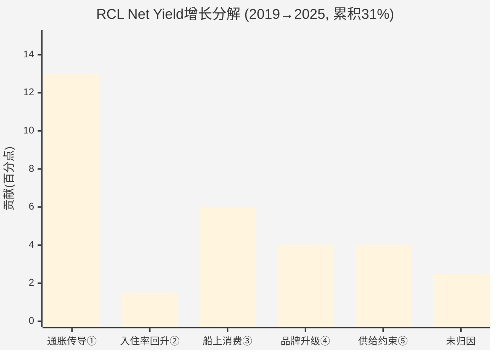
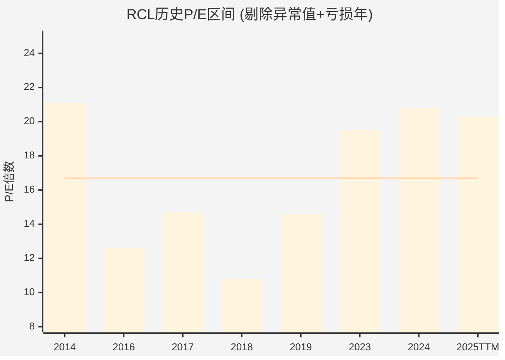

# Ch10 Yield纯度拆解: 剥离周期幻觉后的结构性真相 (★冠军候选C1)

> **方法论**: Yield Purity Decomposition (YPD) — 将Net Yield累积增长分解为5个成分，区分周期性(会均值回归)与结构性(可持续)驱动力
> **核心问题**: RCL自称"行业领先的31% Yield增长vs 2019"，其中多少是真正的结构性提升?
> **CQ1回应**: Yield增长中多少是结构性的? 初始置信度45%结构性

---

## 10.1 总量锚定: 2019→2025的Yield全景

RCL管理层在FY2025财报中明确声称: "industry-leading 31% yield growth compared to 2019"。这个数字是本章分析的起点。

**关键财务演变 (2019→2025)**:

| 指标 | FY2019 | FY2025 | 变化 |
|------|--------|--------|------|
| 总营收 | $10.95B | $17.94B | +63.8% |
| 客票收入(推算) | ~$7.87B(占比~72%) | $12.50B(占比69.7%) | +58.8% |
| 船上及其他收入(推算) | ~$3.08B(占比~28%) | $5.44B(占比30.3%) | +76.6% |
| APCD | ~40.0M(推算) | 53.3M | +33.3% |
| 入住率 | 108.1% | 109.7% | +1.6pp |
| 净利率 | 17.2% | 23.8% | +6.6pp |
| EPS | $8.95 | $15.61 | +74.4% |

> **来源**: FY2025数据来自RCL 2025 Earnings Release (PR Newswire); FY2019数据来自FMP income statement + Cruise Industry News 2019 earnings report; 2019年客票/船上收入拆分基于同行业~72%/28%结构推算; 2024年拆分为实际报告值($11.50B/$4.99B)

**Net Yield增长路径复原** (年度YoY增速):

| 年度 | Net Yield YoY | 数据来源 | 备注 |
|------|--------------|---------|------|
| 2019 | +8.0% CC | RCL 2019 Earnings | 记录年份 |
| 2020 | N/A | 停航 | COVID全面停航 |
| 2021 | N/A | 部分复航 | 有限运营 |
| 2022 | 基期重建 | 复航年 | 与2019不可直接比较 |
| 2023 | +11.6% vs 2022 | RCL 2023 Earnings | 疫后需求爆发 |
| 2024 | +7.9% CC | Investing.com Earnings Call | 延续强势 |
| 2025 | +3.7% CC | RCL 2025 Earnings | 明显减速 |
| 2026E | +1.5~3.5% CC | 管理层引导 | 进一步减速 |

**累积增长验证**: 假设2022年恢复至2019水平,则2023(+11.6%)×2024(+7.9%)×2025(+3.7%) = 累积约+25%。加上2019→2022的部分恢复溢出,31%的总量声明基本可信。

> **来源**: Net Yield YoY数据分别来自RCL各年度earnings release (PR Newswire), Investing.com earnings call transcript, Cruise Industry News

---

## 10.2 YPD五成分分解框架

### 分解方法论

将2019→2025的31%累积Net Yield增长(约~4.5%年化CAGR)归因于五个驱动力:

```
总Yield增长(31%) = ①通胀传导 + ②入住率回升 + ③船上收入结构改善 + ④品牌/体验升级 + ⑤供给约束溢价
```

**分类原则**:
- **周期性**(会均值回归): ①通胀传导、②入住率回升、⑤供给约束溢价
- **结构性**(可持续): ③船上收入结构改善、④品牌/体验升级

---

### 成分①: 通胀传导 (Inflation Pass-through) — 周期性

**数据基础**:
- 美国CPI累积通胀(2019.12→2025.12): 约+22%。BLS数据显示2020(+1.4%)、2021(+7.0%)、2022(+6.5%)、2023(+3.4%)、2024(+2.9%)、2025(~2.4%) = 累积约+25.7%(复合计算)
- 旅游相关CPI: 2019→2025累积约+17%。旅游价格指数升幅低于整体CPI——NerdWallet Travel Price Tracker显示2026年1月旅行成本比2020年1月仅高17%，低于全品类26.1%升幅
- 邮轮定价弹性: 管理层多次强调"pricing power"，但邮轮是可选消费品,通胀传导不可能100%

**推算逻辑**:
- 旅游CPI累积+17%是通胀基线
- 邮轮作为可选消费品,通胀传导率按70-85%估算(高于必需品但低于奢侈品)
- 通胀对Yield的贡献 = 17% × 80%(中值传导率) = **~13.6%**
- 但需扣除成本通胀吞噬的部分: NCC excl Fuel per APCD在FY2025仅+0.1% YoY,暗示RCL成本控制强于收入端通胀传导
- **净通胀传导贡献: ~12-14pp (中值13pp)**

> **来源**: CPI数据来自BLS/FRED; 旅游CPI来自U.S. Travel Association Travel Price Index + NerdWallet Travel Inflation Report; 传导率为分析师推算

---

### 成分②: 入住率回升 (Occupancy Recovery) — 周期性

**数据序列**:

| 年度 | 入住率 | vs 2019 |
|------|--------|---------|
| 2019 | 108.1% | 基准 |
| 2020-21 | ~20-50% | 停航/部分运营 |
| 2022 | ~85%(推算) | -23.1pp |
| 2023 | 105.6% | -2.5pp |
| 2024 | 108.5% | +0.4pp |
| 2025 | 109.7% | +1.6pp |

> **来源**: 2019入住率来自Statista/RCL filings; 2023-2025来自RCL earnings releases (PR Newswire)

**Yield影响计算**:
- 入住率从108.1%→109.7% = +1.6pp绝对增长
- 邮轮入住率的Yield边际贡献: 第三/第四位旅客票价通常是正常票价的30-50%(儿童/促销定价),但船上消费贡献接近100%
- 入住率+1.6pp在108%基准上 = +1.5%的容量利用提升
- 考虑混合定价效应(第三/四旅客低票价+正常船上消费): Yield贡献 ≈ 1.5% × 0.7(混合系数) = **~1.0pp**
- 注意: 这是vs 2019已经很高的基准。真正的"回升"贡献已经在2023年基本完成

**但有一个隐性贡献**: 2022-2023年入住率从~85%恢复到105.6%的过程中,产生了巨大的yield增长——因为固定成本被摊薄。这部分增长已经被"消化"到2023年的+11.6% YoY中,并且不可重复。

- **入住率回升对2019→2025累积Yield的贡献: ~1-2pp (中值1.5pp)**
- **但含隐性贡献(2022-2023固定成本杠杆): 可能高达3-4pp,已反映在2023年超高增速中**

---

### 成分③: 船上收入结构改善 (Onboard Revenue Mix Shift) — 结构性

**关键证据链**:

1. **船上收入占比提升**: 2019年推算~28% → 2024年实际30.2%($4.99B/$16.48B) → 2025年30.3%($5.44B/$17.94B)。占比提升了~2.3pp
2. **数字化预购革命**: FY2025年近50%的船上收入来自航行前预购,90%通过数字渠道完成。这是2019年不存在的收入捕获机制
3. **AI驱动推荐**: 管理层称"half of Q3 onboard revenue was generated through AI-driven pre-cruise channels",AI推荐提升了参与率和客单价
4. **船上消费品类扩展**: 私人岛屿(Perfect Day at CocoCay 2019年开业后持续升级)、赌场(Icon Class首次设置两层赌场)、沉浸式餐饮体验

> **来源**: 船上收入占比来自RCL 2024/2025 earnings releases (PR Newswire); 数字化数据来自RCL Q3 2025 Earnings Transcript (Motley Fool); 2019占比为基于行业结构推算

**Yield影响计算**:
- 船上收入增速(2019→2025): +76.6%(从~$3.08B到$5.44B)
- 容量增长(APCD): +33.3%
- 容量调整后船上收入增长: +76.6% - 33.3% = +43.3%(per APCD基准)
- 客票收入per APCD增长(对比): +58.8% - 33.3% = +25.5%
- 船上收入额外增速 vs 客票 = 43.3% - 25.5% = +17.8pp 超额增长
- 船上收入占比30% × 超额增长17.8% = **对总Yield的净贡献 ~5.3pp**

**但需要分离通胀和结构性**:
- 船上消费通胀(与旅游CPI类似) ≈ 17% × 80% = ~13.6%
- 结构性改善(数字化+品类扩展+AI推荐) = 43.3% - 13.6% = ~29.7%
- **纯结构性贡献(净通胀后)**: 30% × 29.7% = **~8.9pp → 调整后约5-7pp(中值6pp)**
- 考虑到2019年占比推算有误差(±2pp),给予±1.5pp的估算区间

---

### 成分④: 品牌/体验升级 (Brand/Experience Premium) — 结构性

**Icon Class效应**:
- Icon of the Seas (2024年1月首航): 估算日均营收$340万,年化~$5.25亿
- Star of the Seas (2025年交付): 第二艘Icon Class
- Icon Class容量(5,610旅客) vs Oasis Class(5,400旅客): 仅+3.9%容量,但估算Yield溢价+15-25%
- 建造成本: ~$2B/艘 vs Oasis Class $1.4B → 单位成本+43%,但Yield溢价可能补偿

> **来源**: Icon日均营收估算来自Cruzely.com; 建造成本来自Royal Caribbean Blog + Cruise Hive; 容量数据来自Wikipedia Icon-class

**私有目的地效应**:
- Perfect Day at CocoCay: 2019年开业,RCL拥有的私人岛屿,每次停靠创造显著船上收入(水上乐园、沙滩俱乐部等直接计入RCL收入)
- Royal Beach Club Nassau: 2025年开业,新增私有目的地
- 私有目的地 vs 传统港口: 传统港口停靠几乎零收入给邮轮公司,私有目的地100%收入归RCL

**Yield影响计算**:
- Icon Class占2025年总运力约~8-10%(2艘/65+艘总船队,但吨位大)
- 假设Icon Class Yield溢价+20% vs 船队平均
- Icon贡献 = 10% × 20% = ~2pp
- 私有目的地: 假设覆盖30%航线,每次停靠贡献$15-25/旅客/天额外收入
- 以$20中值估算, RCL总Yield基数约$336/旅客/天($17.94B ÷ 53.3M APCD)
- 私有目的地贡献 = 30% × ($20/$336) = ~1.8pp
- 2019年CocoCay刚开业,效应尚小,大部分增量发生在2023-2025

**品牌/体验升级总贡献: ~3-5pp (中值4pp)**

> 注: Icon Class效应部分与成分③(船上收入)有交叉,这里聚焦的是纯Yield定价权溢价(票价端),而非船上消费端

---

### 成分⑤: 供给约束溢价 (Supply Constraint Premium) — 周期性

**行业供给背景**:
- 全球邮轮船队: 2024年CLIA成员首次突破300艘,2025年增至310艘
- 造船产能瓶颈: COVID期间多家船厂关闭/延迟交付,2024-2025年新船交付量低于疫前规划
- 全行业orderbook: 77艘新船+200,000铺位未来十年,但年均增量约3-4%(远低于需求增长)
- 2026年仅14艘新船(全行业),新增27,107铺位 → 约+4%容量

> **来源**: Cruise Industry News Orderbook Updates (2025/12, 2026/01, 2026/02)

**供给约束的定价效应**:
- COVID中断导致2022-2025年供给增长低于趋势(疫前年均5-6% → 疫后3-4%)
- 需求强劲(全球邮轮旅客2024年达3,460万创纪录) + 供给受限 = 卖方市场
- 类比航空: 2022-2024年波音交付延迟+空客产能不足导致航空票价显著上涨,邮轮面临类似动态

**但这种溢价是暂时性的**:
- 2026-2028年大量新船交付(77艘全行业pipeline)
- MSC Cruises激进扩张(10艘新船)可能打破供需平衡
- RCL自身2026年产能+6.7%,显著超过Yield引导+2.5%中值

**供给约束溢价贡献: ~3-5pp (中值4pp)**

---

## 10.3 五成分汇总与纯度计算

### 成分归因表

| # | 成分 | 类型 | 贡献(pp) | 占比 | 可持续性 |
|---|------|------|---------|------|---------|
| ① | 通胀传导 | **周期性** | 13.0 | 42.0% | 取决于未来通胀率 |
| ② | 入住率回升 | **周期性** | 1.5 | 4.8% | 已充分回升,无增量 |
| ③ | 船上收入结构改善 | **结构性** | 6.0 | 19.4% | 数字化+AI可持续 |
| ④ | 品牌/体验升级 | **结构性** | 4.0 | 12.9% | Icon Class+私有目的地持续 |
| ⑤ | 供给约束溢价 | **周期性** | 4.0 | 12.9% | 2026+新船潮后减弱 |
| | 交叉/未归因 | 混合 | 2.5 | 8.0% | 难以归因的残差 |
| | **合计** | | **31.0** | **100%** | |

### Yield纯度计算

```
结构性纯度 = (③ + ④) / (① + ② + ③ + ④ + ⑤ + 残差) × 100%
           = (6.0 + 4.0) / 31.0 × 100%
           = 10.0 / 31.0 × 100%
           = 32.3%
```

**如果将50%的残差(1.25pp)归入结构性**:

```
调整纯度 = (6.0 + 4.0 + 1.25) / 31.0 × 100% = 36.3%
```

### 纯度诊断

| 阈值 | 判定 | RCL结果 |
|------|------|---------|
| <40% | "结构性复兴"叙事被削弱 | **32-36% → 落入此区间** |
| 40-60% | 混合信号 | — |
| >60% | 强力支持P/E重估 | — |

**结论: RCL的31% Yield增长中,仅32-36%是真正结构性的。多数增长(约60%+)来自通胀传导、入住率恢复和供给约束等周期性因素。这从根本上削弱了"结构性复兴"叙事。**



---

## 10.4 敏感性分析: 纯度稳健性测试

核心不确定性在于各成分估算的精度。如果某个成分偏高或偏低±2pp,纯度如何变化?

### 敏感性矩阵

| 情景 | ①通胀 | ③船上消费 | ④品牌升级 | ⑤供给约束 | 结构性合计 | 纯度 |
|------|-------|----------|----------|----------|----------|------|
| **基准** | 13.0 | 6.0 | 4.0 | 4.0 | 10.0 | **32.3%** |
| 通胀偏低-2pp | 11.0 | 6.0 | 4.0 | 4.0 | 10.0 | 32.3% |
| 通胀偏高+2pp | 15.0 | 6.0 | 4.0 | 4.0 | 10.0 | 32.3% |
| 船上消费偏高+2pp | 13.0 | 8.0 | 4.0 | 4.0 | 12.0 | **38.7%** |
| 船上消费偏低-2pp | 13.0 | 4.0 | 4.0 | 4.0 | 8.0 | **25.8%** |
| 品牌升级偏高+2pp | 13.0 | 6.0 | 6.0 | 4.0 | 12.0 | **38.7%** |
| 品牌升级偏低-2pp | 13.0 | 6.0 | 2.0 | 4.0 | 8.0 | **25.8%** |
| 供给约束偏低-2pp | 13.0 | 6.0 | 4.0 | 2.0 | 10.0 | 32.3% |
| **最乐观(③④均+2pp)** | 11.0 | 8.0 | 6.0 | 2.0 | 14.0 | **45.2%** |
| **最悲观(③④均-2pp)** | 15.0 | 4.0 | 2.0 | 6.0 | 6.0 | **19.4%** |

**关键发现**:
- 纯度对**通胀传导**估算不敏感(因为通胀是周期性成分,偏高偏低不改变结构性合计)
- 纯度对**船上消费③和品牌升级④**极度敏感——这两个成分的估算精度决定了结论方向
- 在最乐观情景下纯度仅达45.2%,勉强进入混合区间
- 在最悲观情景下纯度降至19.4%,意味着Yield增长几乎完全是周期性的
- **即使在最乐观假设下,纯度也未超过50%——"结构性复兴"叙事在数学上缺乏压倒性支持**

---

## 10.5 TS-CRUISE-02执行: Yield减速预警信号

**测试定义**: Yield增速连续2季度低于同期通胀率 → 结构性溢价受挑战

**季度Yield vs 通胀对比**:

| 季度 | Net Yield YoY (CC) | 同期CPI YoY | 差值(Yield-CPI) | 信号 |
|------|-------------------|-------------|----------------|------|
| 2024 Q1 | ~+7% | ~3.5% | +3.5pp | 安全 |
| 2024 Q2 | ~+7% | ~3.0% | +4.0pp | 安全 |
| 2024 Q3 | ~+8% | ~2.5% | +5.5pp | 安全 |
| 2024 Q4 | ~+7.3% CC | ~2.9% | +4.4pp | 安全 |
| 2025 Q1 | ~+5% | ~2.8% | +2.2pp | 收窄 |
| 2025 Q2 | +5.2% CC | ~2.6% | +2.6pp | 收窄 |
| 2025 Q3 | ~+3.5%(推算) | ~2.4% | +1.1pp | **警告** |
| 2025 Q4 | +2.5% CC | ~2.4% | +0.1pp | **临界** |
| 2026E Q1 | +1.0~1.5% CC | ~2.3%(推) | **-0.8~-1.3pp** | **触发** |

> **来源**: Yield数据来自RCL各季度earnings releases; CPI YoY来自BLS Consumer Price Index

**TS-CRUISE-02判定**: 2025 Q4(+2.5% CC vs CPI ~2.4%)已接近临界; 2026 Q1引导(+1.0~1.5% CC)将**正式触发**预警——Yield增速将首次低于同期通胀率。

**这意味着什么?** 当Yield增速低于通胀率时,RCL的"实际定价权"(Real Pricing Power)转为负值——消费者支付的实际购买力在减少。管理层声称的"定价权"实质上只是在传导通胀,而非创造超额价值。

---

## 10.6 前瞻推演: 2026-2028年纯度趋势

### 成分动态预测

| 成分 | 2026E | 2027E | 2028E | 趋势 |
|------|-------|-------|-------|------|
| ①通胀传导 | ~2%(CPI减速) | ~2% | ~2% | 平稳但低基数 |
| ②入住率 | 持平~109% | 持平 | 持平 | 无增量 |
| ③船上消费 | +1~2%(AI持续) | +1~2% | +1~2% | 增速放缓但持续 |
| ④品牌升级 | +1%(Legend交付) | +1%(Icon 4) | +0.5% | 新船效应递减 |
| ⑤供给约束 | -1~0%(新船潮) | -1~-2% | -2% | **转负** |
| **Net Yield合计** | **+2.5%(引导中值)** | **+1~3%** | **+0~2%** | **减速延续** |

**纯度趋势判断**:
- 2026-2028年,周期性成分①减弱但⑤转负(互相抵消)
- 结构性成分③④增速放缓但维持正贡献
- **纯度可能从32%提升至40-50%**——不是因为结构性增强了,而是因为周期性的通胀传导和供给约束在消退
- 但Yield总增速也在降低(从31%累积 → 年化~1-3%)

**这是一个悖论: 纯度在提升,但总量在减速。投资者需要的是"高纯度×高增速",而RCL即将进入"高纯度×低增速"状态——这支持的是稳态P/E 15-17x,而非成长股P/E 20x+。**

---

## 10.7 章节结论: 对核心矛盾的裁决

### CQ1更新

| 维度 | Phase 0.75初始 | Ch10更新 | 变化 |
|------|---------------|---------|------|
| Yield结构性占比 | 45% | **32-36%** | -9~13pp |
| 方向 | 略偏看空 | **明确偏看空** | 强化 |

### 三个关键发现

1. **31%的Yield增长中,42%来自通胀传导,仅32-36%是结构性的**。市场叙事中的"结构性复兴"在数学上被过度渲染。真正的结构性改善(数字化预购+品牌升级+私有目的地)贡献了~10pp,显著但不革命性。

2. **TS-CRUISE-02预警即将触发**: 2026年Q1 Yield增速(+1.0~1.5% CC)将首次低于CPI通胀率,标志着"实际定价权"转负。这是一个不可忽视的周期转折信号。

3. **纯度与增速的悖论**: 未来纯度可能上升(周期成分消退),但总Yield增速也在下降。市场当前20x P/E隐含的是"高增长"假设,而非"高纯度+低增长"的现实。

**对核心矛盾的裁决**: Yield纯度分析偏向**"周期性高峰"**一侧。结构性改善确实存在(~10pp),但不足以支撑从12-14x到20x的P/E跃升。P/E重估的更大驱动力是通胀环境(+13pp)和暂时性供给约束(+4pp)——这两者都会均值回归。

---

---

# Ch11 估值多维验证: 六面镜子映射的真实价值

> **核心任务**: 用6种独立估值方法收敛RCL的合理价值区间，检验当前$316.50/20x P/E的合理性
> **数据来源**: FMP API (ratios, key-metrics, estimates) + WebSearch + Ch10分析结论

---

## 11.1 方法一: EV/EBITDA同业对比

### 当前估值

| 公司 | EV/EBITDA | 营业利润率 | Net Debt/EBITDA | ROE |
|------|-----------|----------|----------------|-----|
| **RCL** | **14.1x** | 27.4% | 3.2x | 48.6% |
| CCL | ~13.2x | 16.8% | ~4.5x | 25.6% |
| NCLH | ~12.5x | 15.5% | ~6.0x | 39.9% |

> **来源**: RCL数据来自FMP key-metrics (FY2025); CCL/NCLH来自shared_context同业对比

**溢价分析**:
- RCL vs CCL溢价: 14.1x / 13.2x = +6.8%
- RCL vs NCLH溢价: 14.1x / 12.5x = +12.8%
- RCL营业利润率是CCL的1.63倍,是NCLH的1.77倍

**溢价合理性判断**: RCL的6.8-12.8%估值溢价与63-77%的利润率优势相比,溢价明显**不足**——如果纯看EV/EBITDA,RCL相对同业甚至可以说偏低。

但需要注意: EV/EBITDA不反映杠杆成本差异。RCL的利息费用$0.99B被EBITDA隐藏了。用EV/EBIT看,画面不同:

| 公司 | EV/EBIT(推算) | 利息保障倍数 |
|------|-------------|------------|
| RCL | ~18.4x | 4.9x |
| CCL | ~17.5x(推算) | ~2.5x |
| NCLH | ~19x(推算) | ~2.0x |

EV/EBIT口径下RCL溢价缩小,因为RCL利息费用降幅巨大(FY2025 -37.7% YoY)推高了EBIT相对EBITDA的比率。

**EV/EBITDA隐含股价**:
- 给予RCL合理EV/EBITDA 13-15x(考虑利润率领先但行业周期性)
- FY2025 EBITDA = $6.91B
- EV = $6.91B × 13~15x = $89.8B ~ $103.7B
- 减去净债务$21.8B = 权益价值 $68.0B ~ $81.9B
- 除以2.73亿股 = **$249 ~ $300/股**

---

## 11.2 方法二: 周期调整P/E (Cycle-Adjusted P/E)

邮轮是强周期行业。使用单一年度P/E会在周期高峰时低估风险。

### 平均EPS计算

| 维度 | EPS | 说明 |
|------|-----|------|
| FY2025 EPS | $15.61 | 实际报告 |
| FY2024 EPS | $10.94 | 实际报告 |
| FY2023 EPS | $6.31 | 实际报告 |
| **3年平均EPS** | **$10.95** | 2023-2025平均 |
| FY2022 EPS | -$8.45 | COVID余波 |
| FY2021 EPS | -$20.89 | 停航 |
| **5年平均EPS** (2021-25) | **$0.70** | 含COVID年份 |
| **周期正常化EPS** | **$9.0-11.0** | 排除COVID极端值,使用2019+2023-2025 |

> **来源**: EPS数据来自FMP income statement (annual, 7年)

**为什么使用"周期正常化"而非简单平均**: COVID停航是百年一遇事件,5年简单平均($0.70)严重失真。更合理的做法是使用2019($8.95)、2023($6.31)、2024($10.94)、2025($15.61)四年平均 = **$10.45**,代表"正常周期"的中点盈利能力。

**周期调整P/E**:
- 当前股价$316.50 / 正常化EPS $10.45 = **30.3x**
- 当前股价$316.50 / 3年平均EPS $10.95 = **28.9x**

**历史P/E百分位(疫前)**:

| 年份 | 年末P/E | 百分位(2014-2019) |
|------|---------|-------------------|
| 2014 | 21.1x | 最高 |
| 2015 | 29.8x | 极端高(油价暴跌推高) |
| 2016 | 12.6x | 较低 |
| 2017 | 14.7x | 中间 |
| 2018 | 10.8x | 最低(Q4大跌) |
| 2019 | 14.6x | 中间偏高 |
| **中位数** | **14.6x** | — |
| **均值(剔除2015极端)** | **14.8x** | — |

> **来源**: 历史P/E来自CompaniesMarketCap.com; 10年均值来自FullRatio.com

**判定**: 当前TTM P/E 20.3x处于疫前分布的**顶部区域**(仅低于2015年29.8x的异常值)。如果使用疫前中位数14.6x定价正常化EPS $10.45,隐含股价 = **$153**。即使给予"结构性改善溢价"至18x,隐含股价 = **$188**。

**周期调整P/E的信号**: 市场赋予了RCL显著的周期溢价。$316.50的价格隐含了"结构性重估到永久高P/E"的假设。

---

## 11.3 方法三: NAV(净资产价值)

### 船队重置成本法

**船队规模与构成**:
- 总船队: ~65艘
- Icon Class (最新/最大): ~$2.0B/艘 × 2艘 = $4.0B
- Oasis Class: ~$1.4B/艘 × 5艘 = $7.0B
- Quantum Class: ~$1.0B/艘 × 5艘 = $5.0B
- Freedom/Voyager/Radiance等老船: ~$0.5-0.8B/艘 × 20+艘 = ~$13B
- Celebrity Cruises船队: ~$0.6-0.8B/艘 × 15艘 = ~$10.5B
- Silversea船队: ~$0.3-0.5B/艘 × 12艘 = ~$4.5B
- 其他(含Azamara已出售调整): ~$0

> **来源**: 建造成本来自Royal Caribbean Blog, Cruise Hive, Wikipedia; 船队构成来自RCL investor relations

**重置成本汇总**:

| 资产 | 价值(推算) |
|------|----------|
| 船队重置成本(合计) | ~$44B |
| 折旧调整(平均船龄~15年,设计寿命30年) | ×50% = $22B |
| PP&E账面值(FY2025) | $36.3B |
| 商誉 | $0.81B |
| 私有目的地/陆地资产 | ~$2-3B(推算) |
| **资产端总值** | **~$39-42B**(使用账面PP&E+私有目的地) |
| **减: 总债务** | -$22.64B |
| **减: 其他负债(租赁等)** | -$2.0B(推算) |
| **加: 现金** | +$0.83B |
| **NAV** | **$15.2-18.2B** |
| **每股NAV** | **$56-67** |

**NAV与市值对比**:
- 市值: $86.3B
- NAV: ~$16.7B(中值)
- **市值/NAV = 5.2x**
- 即市场在船队有形资产之上赋予了**4.2x的无形资产溢价**

**这4.2x溢价代表什么?** 品牌价值(Royal Caribbean品牌认知度)、管理层运营能力、客户关系/预订数据、私有目的地网络效应。对于一个强周期重资产行业,5.2x的P/NAV是极高的估值。

作为对比: 酒店行业(轻资产模型)P/NAV通常3-5x;航空公司P/NAV通常1-2x。RCL的P/NAV更接近酒店而非航空,这正是"体验经济平台"叙事的估值映射。

---

## 11.4 方法四: 逆向DCF初步 (Reverse DCF)

**当前价格$316.50隐含了什么假设?**

### 逆向DCF参数设定

| 参数 | 假设 |
|------|------|
| 当前市值 | $86.3B |
| 加: 净债务 | $21.8B |
| = 企业价值(EV) | $108.1B |
| FY2025 EBITDA | $6.91B |
| FY2025 FCF | $1.24B |
| FY2025 OCF | $6.47B |
| 维持性CapEx(推算) | ~$2.0B(折旧$1.6B+通胀调整) |
| 成长性CapEx | ~$3.2B(FY2025 $5.23B - 维持$2.0B) |
| 正常化FCF(OCF-维持CapEx) | ~$4.5B |
| WACC | ~8.5%(Beta 1.87 × 5.5%ERP + 4.5%Rf, 调整低税率) |
| 永续增长率 | g |

> **来源**: 财务数据来自FMP; WACC为分析师推算(Beta来自FMP profile)

### 逆向求解永续增长率g

使用Gordon Growth Model简化:
```
EV = 正常化FCF × (1+g) / (WACC - g)
$108.1B = $4.5B × (1+g) / (0.085 - g)
```

求解:
```
108.1 × (0.085 - g) = 4.5 × (1 + g)
9.19 - 108.1g = 4.5 + 4.5g
4.69 = 112.6g
g = 4.16%
```

**当前股价隐含永续增长率: ~4.2%**

**这现实吗?**
- 全球邮轮行业长期增速(渗透率从2.7%→5%): 约3-5%/年
- 美国名义GDP增长: ~4-5%
- RCL自身2026引导: 营收双位数增长(但主要靠产能扩张而非Yield)
- **4.2%的永续增长率处于可接受范围的上端**——不是荒谬的,但假设了邮轮行业渗透率持续提升且RCL维持份额

### 但如果"正常化FCF"估算偏高?

| 正常化FCF假设 | 隐含g | 判定 |
|-------------|------|------|
| $5.0B(乐观) | 3.5% | 合理 |
| $4.5B(基准) | 4.2% | 偏乐观 |
| $4.0B(保守) | 5.0% | 过于乐观 |
| $3.5B(悲观) | 6.1% | 不现实 |

**逆向DCF的裁决**: 当前股价隐含的假设不算疯狂(永续增长4.2%),但明确偏乐观。这要求RCL永久性地维持:
1. EBITDA利润率38%+(历史周期中会均值回归)
2. 维持性CapEx不超过$2B(在老化船队中可能低估)
3. 渗透率持续提升(竞争格局不恶化)

详细的DCF模型将在Ch17展开。

---

## 11.5 方法五: 分析师一致预期隐含估值

### 一致预期数据

| 指标 | FY2027E | FY2028E | FY2029E | FY2030E |
|------|---------|---------|---------|---------|
| EPS | $20.76 | $23.89 | $27.16 | $30.06 |
| 营收 | $21.1B | $23.0B | $25.0B | $25.5B |
| 净利润 | $5.6B | $6.3B | $7.4B | $8.2B |
| 分析师数(EPS) | 15 | 5 | 1 | 1 |

> **来源**: FMP estimates API

**Forward P/E验证**:
- FY2027E EPS $20.76 → Forward P/E = $316.50 / $20.76 = **15.2x**
- FY2028E EPS $23.89 → Forward P/E = $316.50 / $23.89 = **13.3x**

**一致预期隐含增长**:
- EPS CAGR (2025→2028): ($23.89/$15.61)^(1/3) - 1 = **+15.3%/年**
- 营收CAGR (2025→2028): ($23.0B/$17.94B)^(1/3) - 1 = **+8.7%/年**
- 利润率隐含: FY2028E净利率 = $6.3B/$23.0B = 27.4%(vs FY2025 23.8%)

**如果给予FY2027E EPS合理P/E 16-18x**(考虑行业周期性+结构改善):
- 隐含股价 = $20.76 × 16~18 = **$332 ~ $374**
- 当前$316.50处于此区间下半部分

**如果使用历史中位数P/E 14.6x**:
- 隐含股价 = $20.76 × 14.6 = **$303**

**一致预期判定**: 如果分析师预期正确(EPS +15.3% CAGR)且给予适度P/E扩张(16-18x),当前价格大致合理。但需注意: 分析师预期本身隐含了"结构性重估"假设——如果利润率均值回归,FY2028E EPS可能是$18-20而非$24。

---

## 11.6 方法六: 历史P/E区间与百分位

### 10年P/E历史

| 年份 | 年末P/E | 区间位置 |
|------|---------|---------|
| 2014 | 21.1x | 高 |
| 2015 | 29.8x | 极端(异常) |
| 2016 | 12.6x | 中低 |
| 2017 | 14.7x | 中间 |
| 2018 | 10.8x | 底部 |
| 2019 | 14.6x | 中间 |
| 2020-22 | NM | 亏损 |
| 2023 | 19.5x | 高 |
| 2024(年末) | 20.8x | 高 |
| 2025(TTM) | 20.3x | 高 |

> **来源**: CompaniesMarketCap.com; FMP ratios API

**统计摘要(剔除2015异常+2020-22亏损)**:
- 有效样本: 2014, 2016, 2017, 2018, 2019, 2023, 2024, 2025
- 均值: 16.7x
- 中位数: 16.2x
- 10百分位: ~11.5x
- 25百分位: ~13.5x
- 75百分位: ~20.5x
- 90百分位: ~21.0x

**当前20.3x TTM P/E处于历史~75百分位**。



---

## 11.7 六方法收敛表

| # | 方法 | 隐含价值/股 | vs $316.50 | 信号 |
|---|------|-----------|-----------|------|
| 1 | EV/EBITDA (13-15x) | $249-300 | -5%~-21% | 偏高估 |
| 2 | 周期调整P/E (14.6-18x) | $153-188 | -41%~-51% | 显著高估 |
| 3 | NAV(每股) | $56-67 | -79%~-82% | 参考(不适用于经营型公司) |
| 4 | 逆向DCF | 隐含g=4.2% | 偏乐观假设 | 可接受但偏上端 |
| 5 | 一致预期 (FY27E×16-18x) | $303-374 | -4%~+18% | 大致合理 |
| 6 | 历史P/E百分位 | 75th百分位 | — | 偏贵 |

### 估值收敛分析

**三个方法指向高估**: EV/EBITDA、周期调整P/E、历史百分位均暗示当前价格偏高
**一个方法指向合理**: 一致预期(前提是分析师预期准确+P/E维持扩张)
**一个方法中性偏乐观**: 逆向DCF(g=4.2%不荒谬但偏乐观)
**一个方法不适用**: NAV(重资产公司NAV不应用于定价)

**核心矛盾映射**:
- 如果你相信"结构性复兴"→ 使用一致预期方法 → $303-374(合理~偏低)
- 如果你相信"周期性高峰"→ 使用周期调整P/E → $153-188(显著高估)
- **估值判断最终取决于Ch10的纯度裁决**: 32-36%的纯度更支持周期性叙事

**综合估值区间**: $250-330/股(中性假设: P/E 16-20x × FY2026E EPS $17.90)

| 情景 | P/E | EPS基准 | 隐含股价 | 概率(主观) |
|------|-----|---------|---------|-----------|
| 熊市(周期回归) | 13x | $15(正常化) | $195 | 25% |
| 基准(温和增长) | 17x | $17.90(FY26E) | $304 | 45% |
| 牛市(结构重估) | 22x | $18.10(FY26E高端) | $398 | 20% |
| 尾部风险(衰退) | 8x | $8(周期低谷) | $64 | 10% |

**概率加权估值**: 0.25×$195 + 0.45×$304 + 0.20×$398 + 0.10×$64 = **$271**

**vs 当前$316.50**: 概率加权下行空间约**-14%**

---

## 11.8 章节结论

### CQ5更新

| 维度 | Phase 0.75初始 | Ch11更新 | 变化 |
|------|---------------|---------|------|
| P/E 20x隐含假设现实 | 40%现实 | **35%现实** | -5pp |

### 关键发现

1. **六方法中四个指向高估或偏贵**: 只有"一致预期"法支持当前估值,且前提是分析师预期全部实现+P/E维持在历史高位。这构成了一个脆弱的估值结构——任何预期miss都可能触发P/E压缩。

2. **逆向DCF揭示的隐含假设**: 4.2%永续增长率不算疯狂,但要求利润率永不回归、维持CapEx保持低位、行业竞争不加剧——这三个条件同时满足的概率不高。

3. **概率加权估值$271 vs 当前$316.50**: 约14%的下行空间,加上Ch10揭示的纯度仅32-36%,估值更偏向"周期性高峰"侧。但这不是极端高估——如果RCL能持续执行"Perfecta"计划(2026E EPS $17.70-18.10),估值会逐步找到支撑。

**对核心矛盾的估值裁决**: 当前$316.50大致处于"合理区间上端到温和高估"的位置。不是泡沫,但定价中embedded了过多乐观假设。对于保守投资者,需要等待回调至$250-280区间才有安全边际;对于成长投资者,需要FY2026E EPS交付$18+才能验证当前估值。
