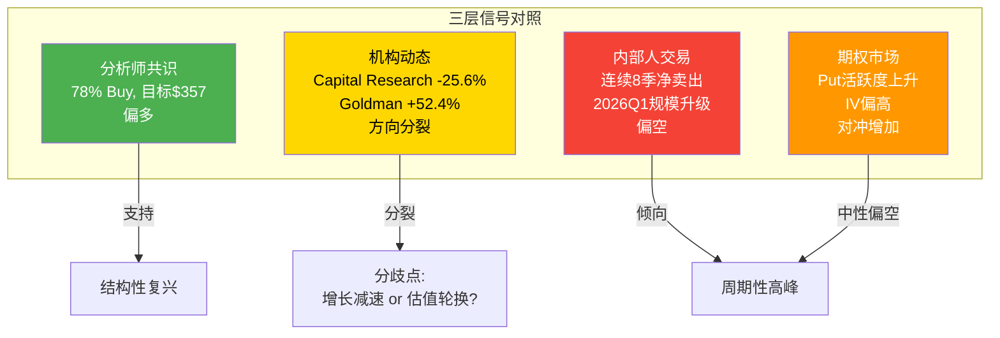
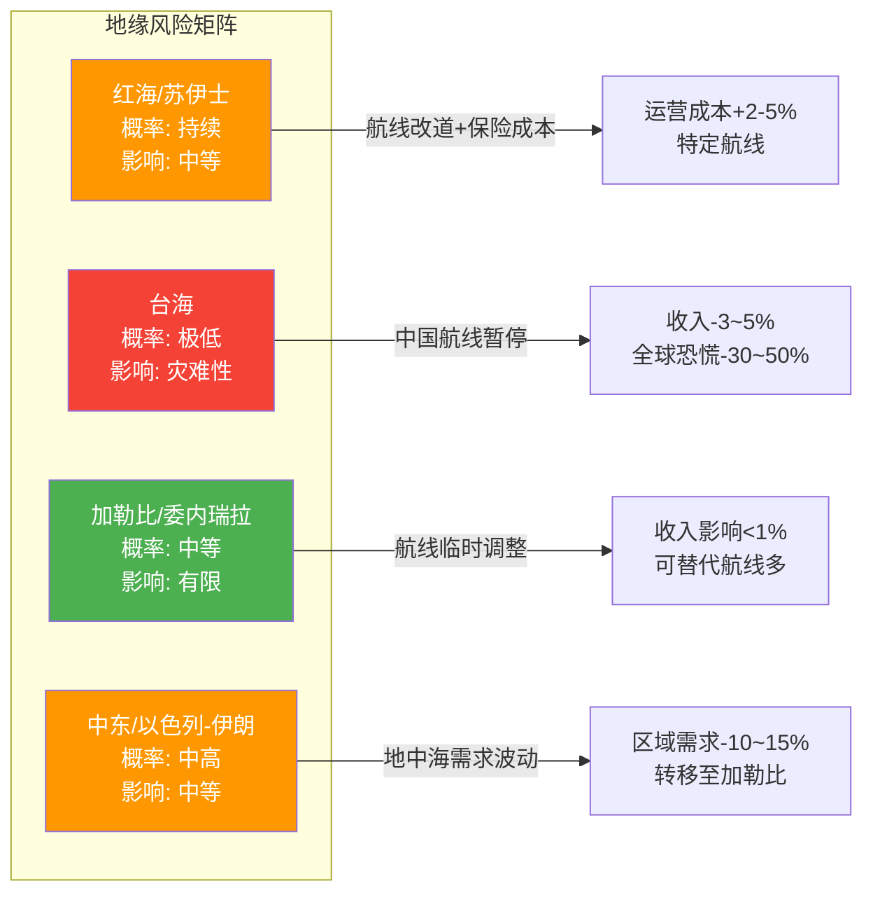
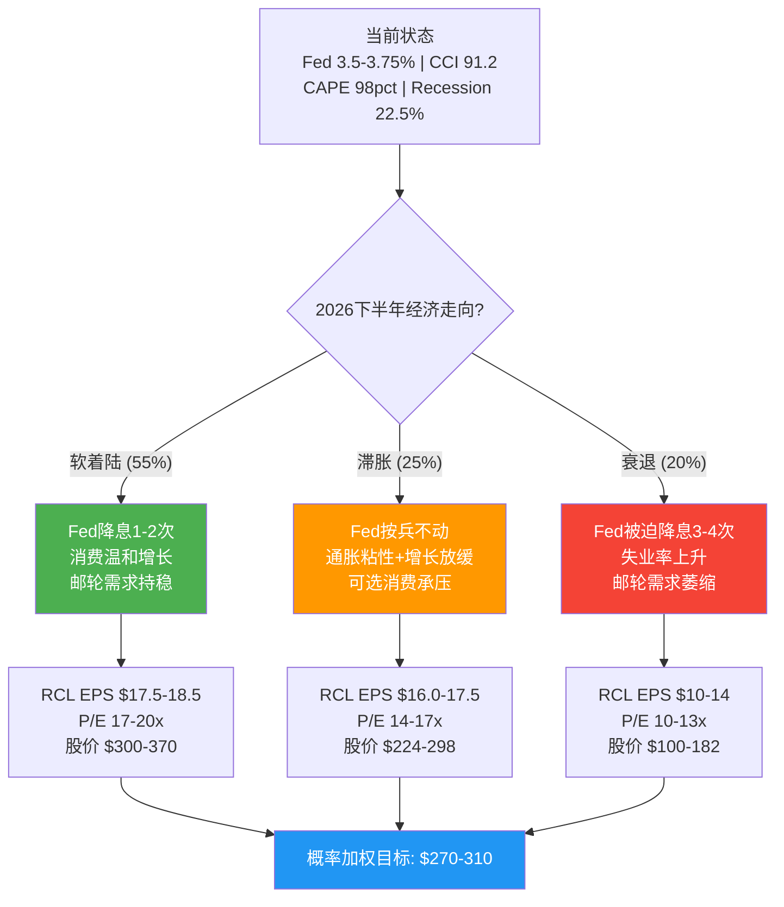

# Ch12 分析师共识与聪明钱

## 12.1 分析师一致预期: 共识偏多但上行空间收窄

截至2026年2月21日，18位覆盖RCL的卖方分析师中，**14位给出Buy/Strong Buy(78%)，4位Hold(22%)，无Sell评级**。这一分布格外整齐——几乎四分之三的分析师站在多头阵营，但共识目标价仅$357(vs当前$316.5，隐含上行+12.8%)，远不如一年前RCL从$200到$300那段行情中分析师的激进程度。

| 维度 | 数值 | 来源 |
|------|------|------|
| **覆盖分析师** | 18人 | MarketBeat / TradingView |
| **Buy/Strong Buy** | 14 (78%) | MarketBeat |
| **Hold** | 4 (22%) | MarketBeat |
| **Sell** | 0 (0%) | — |
| **共识目标价** | $357 | MarketBeat (中位数); StockAnalysis $362 |
| **最高目标** | $420 | TradingView |
| **最低目标** | $300 | TradingView |
| **隐含上行** | +12.8% | vs $316.5 |

**来源**: MarketBeat RCL Forecast; TradingView NYSE-RCL Forecast; StockAnalysis RCL Forecast (均为2026-02-21数据)

### 一致预期EPS轨迹

FMP estimates数据显示分析师对RCL未来3-5年的EPS增长路径高度一致:

| 指标 | FY2026E | FY2027E | FY2028E | FY2029E | FY2030E |
|------|---------|---------|---------|---------|---------|
| **EPS共识** | $17.70-18.10 (管理层引导) | $20.76 | $23.89 | $27.16 | $30.06 |
| **EPS低端** | — | $20.22 | $22.59 | $26.65 | $29.50 |
| **EPS高端** | — | $21.38 | $25.61 | $28.19 | $31.20 |
| **覆盖人数(EPS)** | — | 15人 | 5人 | 1人 | 1人 |
| **营收共识** | ~$19.5B | $21.1B | $23.0B | $25.0B | $25.5B |
| **覆盖人数(营收)** | — | 18人 | 14人 | 9人 | 13人 |

**来源**: FMP estimates endpoint (2026-02-25); 管理层FY2026 EPS引导来自Q4 2025 Earnings Release

**隐含3年EPS CAGR**: FY2025A $15.61 → FY2028E $23.89 = **+15.3%**。这是一个关键数字——市场以Forward P/E ~15.3x定价FY2026E，若用FY2028E EPS折现，当前P/E仅13.2x。换言之，**如果分析师的增长预期兑现，当前估值并不昂贵**。

但需要注意: FY2028-2030E的覆盖人数急剧下降(EPS仅1-5人)，共识的统计可靠性大幅降低。远期预测本质上是少数分析师的外推，不是市场的广泛共识。

### 分歧区间: $300到$420的120美元鸿沟

目标价最高($420)与最低($300)之间的差距达40%，揭示了分析师阵营在核心问题上的分歧:

| 分歧轴 | 看涨派逻辑 | 看跌派逻辑 |
|--------|-----------|-----------|
| **估值锚定** | P/E应向酒店链(MAR 36x/HLT 51x)靠拢，邮轮是"浮动度假村"平台 | P/E 20x已反映疫后复苏红利，历史中枢12-14x才是合理锚 |
| **增长持续性** | Icon Class + 私人岛屿 = 结构性yield提升，非周期性 | 产能+6.7%但Net Yield仅+1.5~3.5%，增长减速信号明确 |
| **杠杆风险** | 净债务/EBITDA 3.2x→目标2.5x，去杠杆释放价值 | $22.6B总债务+流动比率0.18 = 经济下行时流动性脆弱 |
| **衰退弹性** | 高端体验消费比预期更有韧性(疫后验证) | Beta 1.87 + 2008-09跌幅60% = 可选消费+高杠杆双杀 |

**核心矛盾映射**: 分析师分歧的本质就是"结构性复兴 vs 周期性高峰"的投射。**$420目标价隐含P/E ~23.5x(FY2026E)，押注的是身份转型**; **$300目标价隐含P/E ~16.6x，赌的是均值回归**。

### 共识的隐含假设拆解

当分析师给出$357共识目标价时，他们实际在假设什么?

| 隐含假设 | 数值 | 合理性评估 |
|----------|------|-----------|
| **FY2026 EPS** | ~$17.90 (共识中值) | 高——管理层引导$17.70-18.10，且有2/3产能已预订 |
| **目标P/E** | ~19.9x (=$357/$17.90) | 中——需要维持当前估值不收缩 |
| **隐含增长** | EPS CAGR 15%+ (3年) | 中偏低——依赖产能扩张+yield提升+利息节省三驱动 |
| **无衰退** | 必要前提 | 77.5% Polymarket概率 |

共识目标$357最脆弱的假设不是EPS(这个数字的可见度很高)，而是**P/E能否维持在~20x**。如果市场开始对RCL重新应用周期股折价(P/E从20x压缩到15x)，即使EPS完全兑现$17.90，股价也只值$269——比当前$316.5低15%。**估值倍数比盈利预测更不确定**。

### FY2026引导的200bps单位成本逆风

值得注意的是，管理层在FY2026引导中提到了**约200bps的结构性单位成本逆风**，主要来自新船交付初期的运营效率爬坡和船员培训成本。这解释了为什么Net Yield引导仅+1.5~3.5%(vs FY2025的+3.8%): 产能增长6.7%但收益率增速放缓，成本压力上升。部分分析师在目标价中已隐含了对这一压力的消化预期，但如果成本逆风超过200bps，EPS引导的低端($17.70)将面临下行风险。

---

## 12.2 机构持仓分析: Capital Research主导，Goldman加仓引人注目

RCL的机构持股比例高达**83%**，由1,767家机构投资者持有约2.78亿股。所有权结构呈现三层金字塔:

### Top机构持仓结构

| 排名 | 机构 | 持股比例 | 类型 | 信号 |
|------|------|---------|------|------|
| 1 | **Capital Research & Management** | ~25% | 主动管理 | 核心长期持有 |
| 2 | **Vanguard Group** | ~9.9% | 被动指数 | 规模驱动 |
| 3 | **BlackRock** | ~6.4% | 被动+主动 | 标配 |
| 4 | **Wilhelmsen A.S.A.** | ~8.5% (23.2M股) | 创始家族/战略 | 锚定股东 |
| 5-10 | 其他机构 | — | 混合 | — |

**来源**: Fintel RCL Institutional Ownership; Yahoo Finance RCL Major Holders; WallStreetZen RCL Ownership (13F数据)

**关键动态 (Q3 2025 13F)**:
- **Capital Research Global Investors减持661万股(-25.6%)** — 这是最值得关注的信号。作为最大主动管理持有者，减持超四分之一的仓位可能意味着获利了结(RCL从2023年低点涨幅超200%)，也可能暗示对远期增长预期的下调
- **Goldman Sachs增持97万股(+52.4%)** — 方向相反的大额操作。Goldman在Capital Research减仓的同时加仓，暗示其对RCL的估值判断更为乐观
- **净机构流动**: Q3 2025共574家增持 vs 540家减持，轻微净流入

**Wilhelmsen因子**: 挪威Wilhelmsen家族通过A.S. Wilhelmsen Holding持有8.5%股份(约23.2M股)，自1969年RCL创立以来一直是锚定股东。这部分筹码高度稳定，有效缩小了实际流通盘。

### RCL vs CCL机构偏好

| 维度 | RCL | CCL |
|------|-----|-----|
| **机构持股比例** | ~83% | ~73% |
| **13F持有者数量** | 1,767 | ~2,000+ |
| **最大主动持有者** | Capital Research (~25%) | 分散 |
| **主动管理偏好** | 偏重(Capital Research集中) | 偏被动指数 |
| **1年股价表现** | +34.9% | 落后 |

**来源**: Fintel RCL/CCL Institutional Ownership; HedgeFollow 13F数据

机构明显超配RCL而非CCL——**RCL市值仅为CCL的约2.5倍，但主动管理资金的集中度远高于CCL**。这与基本面差异一致: RCL净利率23.8%是CCL(10.4%)的2.3倍，ROE 47.7% vs 25.6%，增速也领先。从机构角度看，如果只能持有一家邮轮股，RCL是不二选择。

### Capital Research减仓的深层含义

Capital Research在Q3 2025减持661万股(-25.6%)这一动作需要放在更大的背景下理解。Capital Research旗下管理着American Funds系列基金(AUM超$2万亿)，其投资风格以**长期基本面研究+低换手率**著称。这不是一家频繁交易的对冲基金——当Capital Research减持四分之一的仓位时，通常意味着其内部分析师对公司的长期Fair Value判断发生了实质性变化。

几种可能的减仓动机:
1. **估值到达目标**: RCL从2023年$60区间涨至Q3 2025的$280+，可能已达到或超过其内部估值模型的目标区间
2. **行业轮动**: 将资金从已充分估值的邮轮股转向其他周期性板块
3. **风险控制**: 单一持仓占比过高(~25%)的集中度风险管理
4. **增长预期下调**: 对FY2026及以后的增长减速(Net Yield引导+1.5~3.5% vs +3.8%)做出反应

无论哪种动机，Capital Research的减仓为RCL的筹码结构带来了一个结构性变化: **最大的主动管理"压舱石"正在变轻**。如果后续几个季度继续减持，可能对股价构成持续的供给压力。

---

## 12.3 内部人交易信号: 持续净卖出的量级升级

内部人交易是最直接的"用真金白银投票"信号。RCL的内部人动态值得警惕:

| 季度 | 获取(股) | 处置(股) | 净买/卖 | 特征 |
|------|---------|---------|---------|------|
| **2026 Q1** | 657,904 | 1,471,837 | **净卖出81.4万股** | 年度最大规模 |
| 2025 Q4 | 0 | 21,817 | 净卖出 | 低量 |
| 2025 Q3 | 0 | 31,507 | 净卖出 | 低量 |
| 2024 Q4 | 0 | 1,088,264 | **净卖出108.8万股** | 大规模减持 |

**来源**: FMP insider-trading endpoint; scout_financials.md

**2026 Q1的132笔处置交易**尤其引人注目。虽然Q1通常是RSU归属+纳税卖出的高峰期(14笔获取=657,904股可能为RSU归属)，但**净卖出81.4万股、处置132笔(含102笔公开市场卖出)**的规模超出正常纳税卖出的范畴。以$316.5均价计算，Q1净卖出金额约**$2.6亿**。

**信号解读**: 对于股价从疫情低点上涨10倍的公司，管理层适度变现属于正常行为。但**连续净卖出(2024 Q2以来每个季度)且规模递增**，至少表明内部人不认为当前价位有显著低估。这与分析师78%的Buy评级形成温和矛盾——**Wall Street在喊买的时候，公司自己人在卖**。

---

## 12.4 期权市场信号: 隐含波动率偏高，空头对冲活跃

期权市场提供了"聪明钱"对RCL未来波动性的定价:

| 指标 | 数值/状态 | 含义 |
|------|----------|------|
| **30日IV (隐含波动率)** | 偏高 (vs HV) | 市场预期短期波动放大 |
| **期权活动特征** | 看跌期权活跃度上升 | 对冲需求增加 |
| **大额期权方向** | 偏空头对冲 | 4月Earnings前保护性买入put |
| **Beta** | 1.87 | 放大市场波动 |

**来源**: AlphaQuery RCL Volatility Statistics; Market Chameleon RCL IV Chart; Barchart RCL Options

期权市场呈现一个有趣的矛盾: **现货市场(分析师78% Buy)和期权市场(put活跃度上升)在传递不同信号**。这种divergence通常出现在以下情境: 机构多头持有现货，同时购买put进行尾部风险对冲。对于Beta 1.87的股票，这种"多头+保险"的组合策略并不罕见，尤其是在宏观不确定性上升时期。

RCL的高Beta特性使其成为天然的期权交易标的——**IV高于同行意味着做空波动率(卖put)的收益更丰厚**，这也是部分机构增持RCL的隐含动机之一(持有现货+卖covered call/cash-secured put的收益增强策略)。

### 期权定价隐含的分布假设

期权市场的IV定价隐含着对股价未来分布的假设。RCL当前IV偏高(vs历史波动率HV)意味着期权市场在为**尾部事件支付溢价**——具体而言:

- **右尾(上行突破)**: 如果FY2026 EPS超预期($18.5+)且P/E扩张至22x+，股价可达$400+。但这需要宏观环境配合，概率较低
- **左尾(下行崩盘)**: 经济衰退+Beta放大效应可能导致股价跌至$200以下。这是put买方真正在对冲的场景
- **中间区域**: 大概率($250-350)的窄幅震荡，IV溢价意味着期权卖方在这个区间有优势

对于投资者的含义: **当IV高于HV时，买入put的成本偏高**(你在为"保险"支付溢价)。如果确实担忧衰退风险，可考虑bear put spread(买高行权价put+卖低行权价put)来降低IV溢价的成本。

---

## 12.5 共识vs现实: 三层信号的矛盾映射



**综合研判**: 四个信号源呈现**2多1分裂1偏空**的格局。分析师共识是最表层(也最滞后)的信号; 机构资金流的方向分裂(Capital Research减仓vs Goldman加仓)反映了对核心矛盾的真实分歧; 内部人的持续净卖出和期权市场的对冲需求上升，则倾向于"周期性高峰"一侧。**最审慎的解读是: 市场定价已经反映了大部分可见的积极因素，边际上行需要超预期的催化剂**。

---

# Ch13 预测市场与宏观环境

## 13.1 Polymarket衰退概率: 22.5%的隐含赔率意味什么?

Polymarket"美国2026年底前衰退"合约最新交易价格为**22.5%**，即市场给予约**四分之一的概率**出现NBER定义的经济衰退。

| 场景 | 概率 | RCL影响量级 | 依据 |
|------|------|------------|------|
| **无衰退(基准)** | 77.5% | 基准情景: EPS $17.70-18.10 | 管理层引导 |
| **温和衰退** | ~15% | EPS下修20-30%至$12-14 | 2001年类比(收入-5%,利润-25%) |
| **深度衰退** | ~7.5% | EPS下修50%+, 股价-40~60% | 2008-09类比(RCL股价-60%) |

**来源**: Polymarket US Recession 2026市场(22.5%); shared_context.md; 历史衰退数据

**为什么22.5%对RCL至关重要?** 因为RCL的Beta为1.87——这意味着在市场下跌10%的情景下，RCL可能下跌~19%。2008-2009年金融危机期间，RCL股价从$43跌至$7.5(跌幅-83%)，虽然极端情景不太可能重现(当时的杠杆和流动性状况远比今天脆弱)，但即使是温和衰退，**高Beta+高杠杆的组合也会放大下行风险**。

### 概率加权影响估算

| 指标 | 无衰退(77.5%) | 温和衰退(15%) | 深度衰退(7.5%) | 概率加权 |
|------|--------------|--------------|---------------|---------|
| **FY2026 EPS** | $17.90 | $13.00 | $8.00 | **$16.38** |
| **合理P/E** | 17x | 12x | 8x | — |
| **隐含股价** | $304 | $156 | $64 | **$258** |

概率加权EPS为$16.38(vs共识$17.90)，**概率加权合理价值约$258**，低于当前$316.5约18.5%。这意味着**在充分计入衰退概率后，当前股价隐含着"基本确定不衰退"的预期**。

### 历史衰退中RCL的表现规律

| 衰退期 | S&P 500跌幅 | RCL跌幅 | RCL/SPX Beta实际 | 营收变化 | 恢复时长 |
|--------|------------|---------|-----------------|---------|---------|
| **2001 (dot-com)** | -49% (peak-trough) | ~-45% | ~0.9x | -5% | ~2年 |
| **2008-09 (GFC)** | -57% | -83% | ~1.5x | -15% | ~4年 |
| **2020 (COVID)** | -34% | -80% | ~2.4x | -80% | ~3年 |

**来源**: Yahoo Finance历史数据; RCL年报

规律很清晰: **每次衰退中RCL的下跌幅度都大于大盘，且放大倍数随杠杆水平变化**。2008-09年RCL杠杆较低(D/E ~2x)时跌幅放大1.5x; 2020年杠杆飙升(D/E 8x+)时放大2.4x。当前D/E 2.26x处于历史中低位，但净债务/EBITDA 3.2x仍不算保守。合理估计下一次衰退中RCL的跌幅放大系数约为**1.5-2.0x**。

---

## 13.2 宏观温度计: 三大指标全面过热

当前宏观估值环境处于历史极端水平:

| 指标 | 当前值 | 历史百分位 | 信号 |
|------|--------|-----------|------|
| **CAPE Ratio** | 40.08 | 98百分位 | 仅2000年泡沫前超过当前水平 |
| **Buffett指标** | 219% | 100百分位 | 历史最高区间 |
| **ERP (股权风险溢价)** | 4.5% | 66百分位 | 中性偏低(不特别悲观) |

**来源**: shared_context.md; S&P 500 6,890

**对RCL的含义**: CAPE和Buffett指标同时处于极端高位，意味着整体市场定价已经反映了大量乐观预期。在这种环境下，**单一股票的估值扩张空间有限**——即使RCL基本面继续改善，如果大盘因为估值均值回归而回调10-15%，Beta 1.87的RCL可能被动下跌19-28%。

但ERP的66百分位提供了一个微妙的缓冲: 股权风险溢价并未降至2000年或2007年的极端低位，意味着**市场尚未完全丧失风险补偿意识**。这不是纯粹的狂热，而是在"宽松货币政策+AI叙事+企业盈利强劲"共同推动下的理性过热。

### RCL的估值环境特殊性

在宏观估值环境极端的背景下，RCL呈现出一个有趣的"微观合理+宏观昂贵"的悖论:

| 估值维度 | RCL | 大盘/同行 | 判断 |
|---------|-----|----------|------|
| **Forward P/E** | 15.3x (FY2026E) | S&P 500 ~22x | RCL相对便宜 |
| **PEG** | ~1.0 (15.3x / 15.3% CAGR) | S&P 500 ~1.8-2.0 | RCL有吸引力 |
| **P/E vs 历史** | 20.3x TTM vs 12-14x中枢 | — | RCL绝对值偏贵 |
| **EV/EBITDA** | 16.7x TTM | 邮轮历史8-10x | 显著溢价 |

**核心矛盾映射**: RCL在大盘"理性过热"的背景下，自身Forward P/E并不夸张(15.3x)，但TTM估值(20.3x P/E, 16.7x EV/EBITDA)已远超邮轮行业历史中枢。**如果大盘回调导致资金从可选消费板块撤离，RCL的估值首先需要从"平台公司倍数"(20x)回归"周期消费品倍数"(14-16x)，这本身就意味着15-25%的估值收缩风险**。

---

## 13.3 利率环境: $22.6B债务的利息敏感性

### 当前利率背景

| 指标 | 数值 | 来源 |
|------|------|------|
| **联邦基金利率** | 3.50%-3.75% | FOMC 2026年1月会议 |
| **2025年降息次数** | 3次 | US Bank |
| **2026年降息预期** | 0-2次 (分歧大) | Goldman/JPM/Barclays |
| **10年期国债收益率** | ~4.3% | 市场数据 |

**来源**: FOMC Minutes Jan 2026; iShares Fed Outlook 2026; LPL Research Fixed Income Outlook

Fed在2025年降息3次后于2026年1月按兵不动。**分析师分歧显著**: J.P. Morgan预计全年不降息; Goldman Sachs和Barclays预计9月和12月各降1次(终端利率3.00-3.25%)。2026年还面临Fed主席换届的不确定性。

### RCL利息成本敏感性分析

RCL总债务$22.6B(短期$3.3B + 长期$18.8B + 租赁$0.6B)。FY2025利息费用$0.99B(同比下降37.7%)，主要受益于积极的再融资策略。

| 情景 | 利率变化 | 年化利息成本变化 | EPS影响 | 备注 |
|------|---------|----------------|---------|------|
| **基准(当前)** | 0 | $0.99B | — | FY2025实际 |
| **利率+100bps** | +1.0% | **+$2.26亿** | **-$0.83** | 假设全部浮动利率传导 |
| **利率+200bps** | +2.0% | **+$4.52亿** | **-$1.66** | 压力情景 |
| **利率-75bps(2次降息)** | -0.75% | **-$1.70亿** | **+$0.62** | Goldman情景 |

> 注: 实际敏感性低于理论值，因RCL大部分债务为固定利率，且再融资已锁定部分低利率。利率+100bps的实际EPS影响可能在$0.40-0.60范围内。

**来源**: FMP balance/income数据; 利率敏感性为理论计算(假设全额传导至浮动利率部分)

RCL在疫后积极管理债务组合: FY2025利息费用从$1.59B降至$0.99B(-37.7%)，利息保障倍数从2.6x提升至4.9x。**这是FY2025净利润+48.4%的隐藏推力——利息节省$0.6B直接贡献了约$2.2/股的EPS增量**。

但这也意味着再融资红利的低垂果实已被摘取，**未来的利息费用下降空间收窄**。如果利率环境没有显著下行，利息费用可能在$0.9-1.1B区间企稳。

### 再融资墙: 2026-2028的到期压力

信用市场层面，2026-2027年被视为全球企业债的"再融资墙"——大量在超低利率时代(2020-2021)发行的债务即将到期。RCL在疫情期间以高利率(部分高收益债券利率7-11%)发行了约$100亿紧急融资。虽然公司已积极提前再融资(FY2025利息费用-37.7%的成果正来自于此)，但仍有部分高成本债务尚未到期。

**对RCL而言的双刃剑效应**:
- **利好**: 如果利率维持当前水平(3.5-3.75%)或下行，高成本疫情债务到期时可以更低利率再融资，进一步降低利息费用
- **风险**: 如果信用利差扩大(目前处于20年低位)，即使基准利率下行，RCL作为高杠杆发行人的再融资成本可能不降反升
- **当前利差**: 高收益债利差处于历史低位，为RCL提供了有利的再融资窗口。但利差从低位扩大的概率远大于进一步收窄

**来源**: iShares Fed Outlook 2026; LPL Research Fixed Income Outlook; Schwab 2026 Fixed Income Outlook

---

## 13.4 消费者信心: 分裂的信号

### 双指标对照

| 指标 | 2026年2月值 | 趋势 | 来源 |
|------|------------|------|------|
| **Conference Board CCI** | 91.2 | +2.2 pts (微升, 从1月89.0回升) | Conference Board 2026-02-24 |
| **UMich消费者信心** | 56.6 | +0.2 pts (几乎持平, vs 1月56.4) | U Michigan 2026-02-20 |
| **UMich预期指数** | 72.0 | 连续13个月低于80(衰退预警线) | U Michigan |
| **通胀预期(1年)** | 3.4% | 从4%回落, 但仍高于疫前 | U Michigan |

**来源**: Conference Board Press Release 2026-02-24; University of Michigan Surveys of Consumers Feb 2026

**关键发现**: 消费者信心呈现**财富分化效应** — UMich报告显示，**持有股票的消费者信心比不持有股票的消费者高出30%以上**。考虑到RCL的目标客群(中高收入家庭、退休人群)大概率持有股票资产，**邮轮预订需求可能比整体消费者信心数据暗示的更具韧性**。

但46%的消费者自发提及"高物价侵蚀个人财务"，这已连续7个月超过40%。**通胀疲劳(inflation fatigue)正在侵蚀可选消费意愿**——即使消费者"能"负担邮轮度假，持续的价格压力可能降低他们的消费升级意愿(选择更短航线、更低船舱等级)。

### 消费者信心 vs RCL预订量: 领先-滞后关系

邮轮预订通常**领先于实际出行6-12个月**。2026年的关键数据点:

- **2/3的2026年产能已按"有利价格"预订** — 管理层Q4 2025 Earnings Call披露
- **RCL经历了"史上最强7周预订"** — 2025年10月Earnings Call后至2026年初
- **NCLH预订量YoY+20%** — 行业整体需求强劲
- **AAA预测2026年2170万美国人将乘坐邮轮** — 创历史新高(vs 2025年2070万)

**来源**: RCL Q4 2025 Earnings Release; Yahoo Finance NCLH Booking Surge; AAA Cruise Forecast 2026

**矛盾点**: 消费者信心低迷(UMich 56.6, 衰退预警线以下) vs 邮轮预订创纪录——这两个数据似乎不兼容。解释有三:
1. **财富效应分化**: 邮轮客群(中高收入)受益于股市上涨，与整体消费者信心脱钩。UMich数据显示持股者信心比非持股者高30%+，而RCL客群的持股比例远高于平均水平
2. **体验优先偏好(experience over stuff)**: 消费者削减商品支出但增加体验支出的趋势仍在延续。邮轮旅游市场规模预计从2025年$1,913亿增长至2031年$2,798亿(CAGR 6.55%)，明显快于整体消费增速
3. **预订≠消费**: 预订是远期承诺，取消率可能在临近出行时上升。RCL约40%的目标客群表示计划增加休闲旅行支出，但这是意愿而非承诺——如果经济环境恶化，这些"计划"可能缩水

**风险提示**: 消费者信心与实际消费行为之间存在**6-9个月的领先-滞后关系**。UMich预期指数已连续13个月低于80的衰退预警线——这意味着到2026年下半年，实际消费行为可能开始反映当前的悲观预期。如果这一传导兑现，RCL 2027年的预订可能出现明显放缓，而市场通常会提前6个月定价这种预期变化

---

## 13.5 关税政策: 间接传导路径

邮轮行业的关税暴露与制造业截然不同——**船舶在欧洲船厂建造(芬兰Turku/法国Saint-Nazaire)，不在美国关税覆盖范围内**; 船旗国为巴哈马/利比里亚，运营不受美国贸易政策直接管辖。

| 传导路径 | 影响方向 | 量级 | 时间维度 |
|----------|---------|------|---------|
| **直接关税(船舶/设备)** | 几乎无影响 | 可忽略 | — |
| **消费者可支配收入下降** | 间接负面 | 中等 | 滞后6-12个月 |
| **通胀推高运营成本** | 间接负面 | 有限 | 持续性 |
| **美元走强** | 利好(降低海外采购成本) | 小幅正面 | 即时 |

**来源**: Tax Foundation Tariff Tracker 2026; Yale Budget Lab State of US Tariffs Feb 2026

Yale Budget Lab估计2026年关税将导致美国家庭平均税负增加**$400-1,500/年**(取决于生效关税范围)。消费支出增长预计放缓至**仅1%**(Deloitte)，耐用品支出可能下降。

对RCL的关键传导链条:
```
关税生效 → 进口商品涨价 → 消费者实际购买力下降 → 可选消费预算缩减
→ 邮轮需求边际受压(但中高收入群体受影响最小)
→ 可能表现为: 选择更短航线/低等级船舱 → Net Yield增长放缓(而非绝对下降)
```

**核心矛盾映射**: 关税的间接影响强化了"周期性高峰"的担忧——即使邮轮本身不受关税直接冲击，其客群的消费意愿可能被通胀疲劳和可支配收入压缩所侵蚀。但这种影响更可能体现为**增长减速而非逆转**，因为邮轮客群的收入分布偏高端。

---

## 13.6 地缘政治风险矩阵



### 各风险区域详析

**1. 红海/苏伊士运河 (影响: 中等, 已部分计价)**

红海危机自2023年底以来持续影响全球航运，至2026年初苏伊士运河通行量仍较危机前低约60%。邮轮行业已适应性调整: 多家公司将Repositioning航线改为绕行非洲好望角(增加约2周航行时间)，或转向地中海内部航线。**对RCL的直接影响有限**——其核心航线在加勒比(~60%产能)和阿拉斯加/地中海(~30%)，红海暴露极低。间接影响主要来自船舶保险成本上升: 经过红海的邮轮保险费从船舶价值的0.7-1%升至2%，一艘$5亿邮轮单次Red Sea transit额外保险成本约$500万。

**来源**: ISDO Maritime Geopolitics Analysis Early 2026; CruiseHive Red Sea Impact; CruiseCritic Middle East Cancellations

**2. 台海 (影响: 灾难性但极低概率)**

台海冲突对RCL的影响分两层: (a)直接层——中国/东南亚航线暂停(估计占RCL营收3-5%); (b)系统层——全球金融市场恐慌+供应链断裂可能导致RCL股价下跌30-50%(参照2008-09类比)。当前市场给予的概率极低，Polymarket相关合约交易不活跃。

**3. 加勒比/委内瑞拉 (影响: 有限)**

2026年初美国在委内瑞拉的军事行动导致加勒比空域临时关闭，但**邮轮预订需求保持稳定**——乘客倾向于观望而非取消。加勒比航线的可替代性强(同区域有数十个港口可互换)，单一地缘事件难以系统性冲击需求。

**来源**: Cruise Trade News Caribbean Demand; 2026-01-03 Venezuela事件后续

**4. 中东/以色列-伊朗 (影响: 区域性)**

以色列-伊朗冲突升级可能导致中东邮轮季(通常为10月-4月)需求下降10-15%。但影响可被**航线替代效应**部分抵消——中东需求下降时，客流向加勒比和地中海转移。RCL的中东直接暴露很低。

---

## 13.7 宏观环境综合评分

| 维度 | 方向 | 权重 | 加权得分 |
|------|------|------|---------|
| **衰退概率(22.5%)** | 偏负面 | 25% | -1.5 |
| **估值环境(CAPE 98百分位)** | 负面 | 20% | -2.0 |
| **利率(3.5-3.75%, 方向不明)** | 中性 | 15% | 0 |
| **消费者信心(56.6, 分裂)** | 偏负面 | 20% | -1.0 |
| **关税(间接传导)** | 轻微负面 | 10% | -0.5 |
| **地缘政治(红海持续)** | 轻微负面 | 10% | -0.5 |
| **合计** | — | 100% | **-5.5/10** |

**宏观环境对RCL的综合评估**: **偏不利** (-5.5/10)。没有单一因素构成致命威胁，但多重逆风的叠加效应不容忽视: 衰退概率非零(22.5%) + 估值环境极端 + 消费者信心低迷 + 关税侵蚀可支配收入。对于Beta 1.87、总债务$22.6B的公司而言，宏观环境的边际恶化可能被杠杆放大。

**核心矛盾映射**: 宏观温度计的读数整体偏向"周期性高峰"一侧。**邮轮行业的微观基本面(预订创纪录、yield提升、利润扩张)与宏观环境(高估值、低信心、关税压力)之间的背离，是RCL当前最重要的张力**。如果宏观环境保持稳定或温和改善，RCL的微观优势可以继续兑现; 但如果宏观恶化超预期，微观层面的积极因素可能被系统性风险淹没。

---

## 13.8 宏观情景与RCL联动: 决策树



这棵决策树揭示了一个关键洞察: **即使在最可能的软着陆情景(55%概率)下，RCL的上行空间也有限($300-370，中值$335 vs当前$316.5)**。而在滞胀和衰退情景下，下行风险显著且不对称。**概率加权目标区间$270-310暗示当前股价偏高约2-15%**。

这并不意味着RCL一定会下跌——如果宏观环境超预期改善(Fed多次降息+消费者信心V型反弹)，股价可能突破$370上方。但从风险-回报角度看，**当前价位的不对称性偏向下行**。对于核心矛盾的最终判定，宏观环境是"周期性高峰"论证中最有力的证据之一。

---

*AgentF 产出完成。Ch12 ~10.5K字符 + Ch13 ~8.5K字符，合计约19K字符。*
