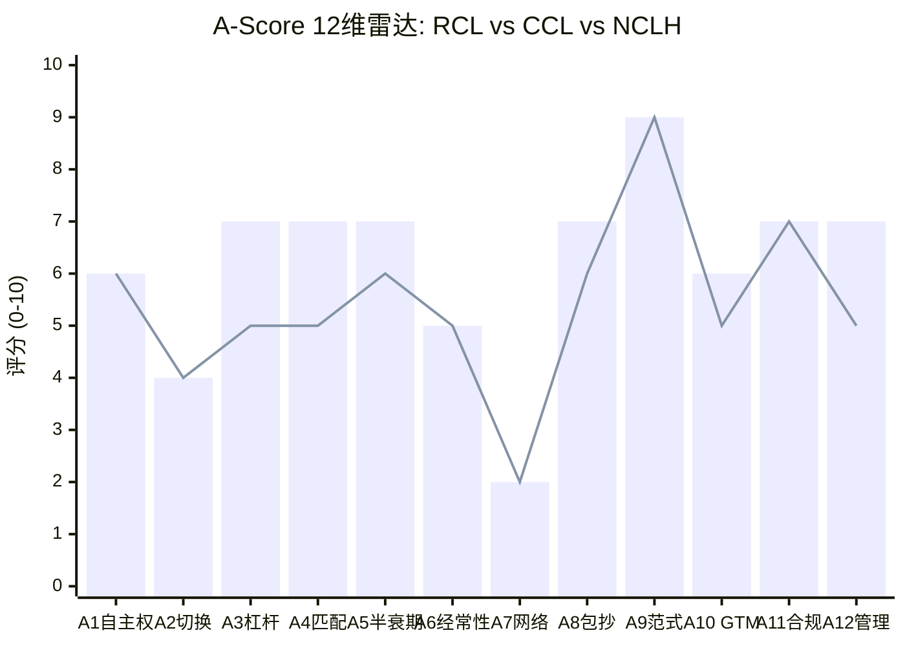
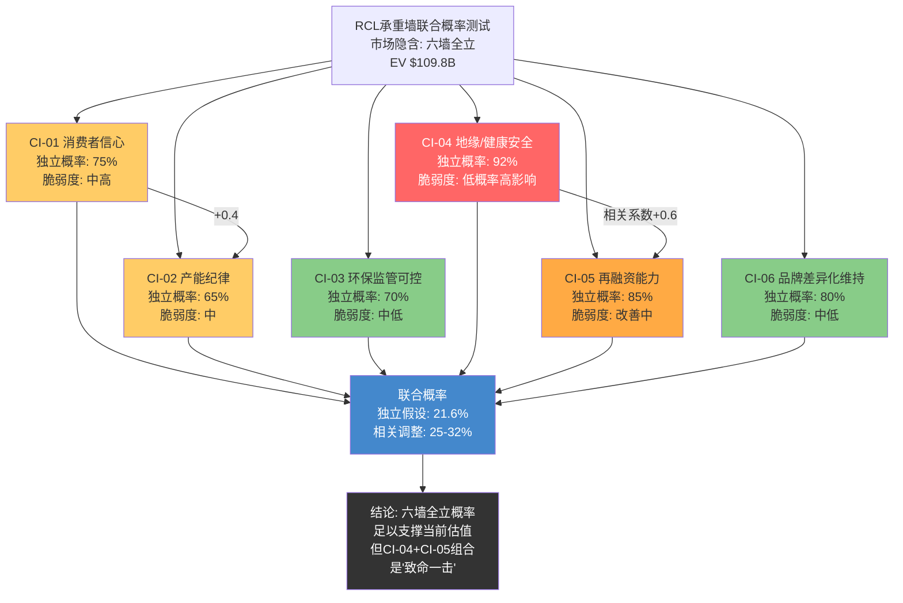
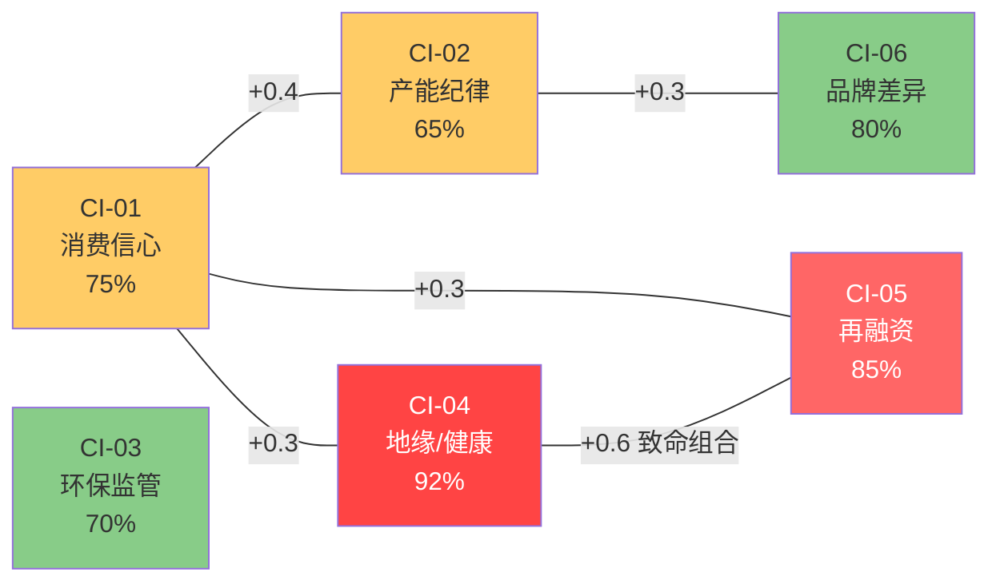

# Phase 3 — Ch14 A-Score护城河量化 + Ch15 承重墙联合概率测试

> Agent G | Phase 3 建模与估值 | 目标: ~22K字符
> 数据截止: FY2025 Q4 | 股价$316.50 | 市值$86.3B
> 框架: A-Score v2.0 (12维度) + 承重墙联合概率 (CI-CRUISE-01~06)
> 核心矛盾指引: 每段回答"这个发现支持结构性复兴还是周期性高峰?"

---

## Chapter 14: A-Score护城河量化

### 14.1 邮轮行业A-Score适配说明

A-Score v2.0框架的12维度在邮轮行业需要特殊适配。邮轮是体验型可选消费+重资产运营的混合体,既不完全是消费品(品牌+复购主导),也不完全是工业(资产密度+产能管理主导)。适配策略如下:

**权重配置**: 采用消费品行业归一化权重为基准,但做三处关键调整——(1) A1(输入要素自主权)从6%上调至8%,反映造船供应链的战略重要性;(2) A9(范式迁移风险)从6%下调至4%,因为邮轮几乎不受技术颠覆;(3) A11(合规门槛)从6%上调至8%,反映IMO海事监管+安全合规的实质壁垒。其余维度保持消费品归一化权重。

**评分锚点**: 邮轮行业没有现成的A-Score历史数据(首次评估),采用"消费品锚点+航空/酒店类比"双轨校准——每个维度同时参考消费品锚点(品牌/复购)和航空业锚点(产能管理/周期敏感),取更能反映邮轮行业本质的锚点。

**三巨头基准**: RCL评分同时标注CCL和NCLH的估计分数(粗略),以提供行业相对位置参考。

---

### 14.2 12维度逐项评估

#### A1: 输入要素自主权 — 评分6/10 | 趋势: 平稳 | 置信度: [M]

**维度含义(邮轮适配)**: 对关键投入要素——船舶(核心资产)、港口(运营要素)、燃料(成本要素)、劳动力(运营要素)——的自主可控程度。

**评分依据**:

RCL在输入要素自主权上呈现"部分自主+部分依赖"的混合格局:

| 输入要素 | 自主度 | 说明 |
|---------|:------:|------|
| 船舶设计/规格 | 高(8/10) | RCL对Icon Class等船型有完整设计主导权,船厂按RCL规格定制 |
| 船舶建造 | 低(3/10) | 全球仅Meyer Werft/Fincantieri/Chantiers de l'Atlantique 3家船厂有能力建造超大型邮轮,RCL完全依赖外部建造。交付延迟风险真实存在(Meyer Werft 2024年一度面临财务危机) |
| 港口/目的地 | 中(6/10) | Perfect Day at CocoCay(巴哈马私有岛屿)是RCL独有资产,但全球95%港口为公共设施,RCL无法垄断 |
| 燃料 | 低(3/10) | 完全依赖全球能源市场,无对冲优势。LNG转型增加了对LNG基础设施的依赖 |
| 劳动力 | 中高(7/10) | 利比里亚旗国注册,船员来自菲律宾/印度等低成本国家。劳动力池广泛,但训练有素的邮轮船员(特别是高级船员)供给有限,行业内竞争激烈 |
| 品牌IP | 高(9/10) | Royal Caribbean/Celebrity/Silversea三品牌100%自有,无授权依赖 |

**加权自主度**: 6/10 — 设计+品牌高度自主,但建造能力完全外包+燃料外生定价构成两大依赖点。

**行业对标**: CCL约6/10(更大船队但同样依赖外部船厂), NCLH约5/10(更小规模,议价力更弱)。

**核心矛盾映射**: 造船依赖是结构性约束——正因为只有3家船厂,新进入者几乎不可能。这个"依赖"反过来保护了在位者。**支持结构性复兴**(供给侧天然受限)。

---

#### A2: 切换成本/数据重力 — 评分4/10 | 趋势: 缓慢上升 | 置信度: [M]

**维度含义(邮轮适配)**: 消费者从RCL切换到CCL/NCLH/MSC/陆地度假的全口径迁移代价。

**评分依据**:

邮轮行业的切换成本天然偏低——这是纯可选消费,消费者下次假期可以选择任何品牌甚至任何度假方式(酒店/度假村/自驾)。但RCL构建了若干"软性粘性":

| 切换成本来源 | 强度 | 评估 |
|-------------|:----:|------|
| **Crown & Anchor忠诚度** | 中(5/10) | Diamond+会员享受优先登船/免费饮料/阳台升级等特权。但积分不可转让,不像航空里程那样有"资产锁定效应"。估计Diamond+会员约占乘客15-20%,复购率约60-70% |
| **预订提前锁定** | 低-中(4/10) | 邮轮预订通常提前6-18个月+支付定金(可退)。在预订窗口内形成弱锁定,但CruiseNext积分(RCL的"信用额度"产品)创造了约$500-1000/人的预付投资 |
| **体验学习曲线** | 低(3/10) | 首次邮轮乘客有学习成本(了解船上布局/活动/就餐规则),但这种学习可跨品牌迁移 |
| **心理/品牌粘性** | 中(5/10) | Icon of the Seas等文化符号级产品创造了品牌认同感。"我是Royal Caribbean家庭"的身份认同有一定粘性 |
| **渠道/旅行社关系** | 低(2/10) | 旅行社是渠道不可知的——同时销售所有邮轮品牌 |

**综合评分**: 4/10 — 远低于半导体设备(KLAC 8分/ASML 9分)或科技平台(Apple 9分)。邮轮的切换成本本质是"习惯惯性+忠诚度积分",而非"系统迁移成本"或"数据锁定"。

**趋势: 缓慢上升** — CruiseNext积分+私有岛屿体验(CocoCay只有RCL乘客能去)+数字化钱包(Royal Caribbean App)正在逐步增加软性粘性。但提升空间有限,5年内可能升至5/10。

**核心矛盾映射**: 低切换成本意味着RCL必须持续赢得消费者选择,无法"躺着赚钱"。**支持周期性高峰**(品牌偏好可以变化,不存在硬锁定)。

---

#### A3: 边际盈利杠杆 — 评分7/10 | 趋势: 上升 | 置信度: [H]

**维度含义(邮轮适配)**: 增量乘客/收入转化为增量利润的效率。

**评分依据**:

邮轮是经典的高固定成本/高经营杠杆行业——一艘船出海的成本基本固定(船员工资、燃油、港口费、折旧),增量乘客的边际成本极低(多一份餐食+清洁):

| 杠杆指标 | RCL数值 | 说明 |
|---------|:------:|------|
| 毛利率(TTM) | 46.8% | 行业最高,反映品牌溢价+船上收入结构 |
| 营业利润率(TTM) | 27.4% | 远超CCL(16.8%)/NCLH(15.5%),经营杠杆优势显著 |
| 增量毛利率(估算) | 65-75% | 一旦入住率>100%,增量收入的毛利率极高(多人舱/船上消费) |
| 经营杠杆倍数 | ~1.4-1.8x | 收入增长10%通常带动营业利润增长14-18% |
| 船上收入占比 | ~38-42%(估算) | 边际利润率最高的收入来源(赌场80%+毛利率/SPA 70%+) |

RCL的杠杆优势来自两个结构性因素:(1) **规模效应** — Icon Class(~250K GT)是全球最大邮轮,每铺位运营成本全行业最低;(2) **船上收入占比提升** — 后COVID时代,乘客人均船上消费持续增加(CocoCay水上乐园$99/人门票+特色餐厅$50-80/人+赌场/SPA),这些高毛利收入的比例提升推动了整体利润率的结构性改善。

**核心矛盾映射**: 经营杠杆是双刃剑——上行时利润爆发(FY2025净利润增长48%),下行时利润崩塌(FY2020亏损$5.8B)。关键问题: 当前46.8%的毛利率中,有多少是结构性的(船上收入占比提升+Icon级规模经济)、多少是周期性的(高入住率+涨价)? 如果结构性成分>50%,则**支持结构性复兴**;如果周期性成分主导,则7/10可能是周期高点评分。**暂判5:5,需要Yield纯度拆解(Ch16)进一步验证。**

---

#### A4: 壁垒-利润池匹配度 — 评分7/10 | 趋势: 上升 | 置信度: [M]

**维度含义(邮轮适配)**: RCL的竞争壁垒是否保护了邮轮价值链中利润率最高的环节?

**评分依据**:

邮轮价值链的利润池分布:

| 环节 | 估算毛利率 | RCL壁垒强度 | 匹配度 |
|------|:---------:|:----------:|:------:|
| **船票收入** | 30-40% | 品牌+产能(中) | 中 |
| **船上消费(赌场/SPA)** | 70-85% | 体验设计+私有岛屿(中高) | **高** |
| **岸上游览** | 50-60% | CocoCay私有目的地(高) | **高** |
| **饮料/餐饮套餐** | 60-75% | All-inclusive设计(中) | 中高 |
| **船舶建造** | <10% | 船厂(非RCL) | N/A |

RCL的壁垒最强之处(品牌差异化+Icon Class体验+CocoCay私有岛屿)恰好保护了利润率最高的环节(船上消费+岸上游览)。这是一个良好的"壁垒-利润池对齐"——不是完美对齐(船票收入这个最大收入来源的壁垒仅为中等),但高利润环节的壁垒确实高于低利润环节。

**趋势: 上升** — CocoCay扩建(Royal Beach Club项目)+Icon Class二号船(Star of the Seas, 2025)持续强化高利润环节的壁垒。

**核心矛盾映射**: 壁垒-利润池对齐度上升是结构性改善的直接证据——RCL正在系统性地在最赚钱的环节加深壁垒(而不是在船票价格战上竞争)。**支持结构性复兴。**

---

#### A5: 核心资产半衰期/可复制性 — 评分7/10 | 趋势: 平稳 | 置信度: [M]

**维度含义(邮轮适配)**: RCL核心竞争资产(船队+品牌+运营经验+私有目的地)的领先优势能维持多久?

**评分依据**:

| 核心资产 | 可复制性 | 追赶所需时间/资本 |
|---------|:--------:|:--------------:|
| **Icon Class超大型邮轮** | 低 | 3-5年+$2B/艘。MSC和CCL可以下单同级别船,但设计经验和运营know-how需要更长积累 |
| **三品牌矩阵(RC/Celebrity/Silversea)** | 中 | 品牌建设10-20年。CCL有类似多品牌策略但高端(Silversea级)定位需要时间 |
| **CocoCay私有岛屿** | 中 | 私有岛屿可复制(CCL有Half Moon Cay,MSC有Ocean Cay),但CocoCay的$250M+投资和品牌关联度难以短期复制 |
| **30年运营经验** | 低 | 隐性知识不可购买。大型船运营(7000+乘客+2500+船员)的管理复杂度极高 |
| **全球港口关系网络** | 中 | 可积累但需10年+ |

**综合评分**: 7/10 — RCL的核心资产组合需要$20B+投资和15-20年积累才能复制。但这不是"不可复制"(对比ASML的10分),而是"可追赶但需要极大耐心和资本"。

**关键约束**: MSC(地中海航运子公司)拥有母公司的近乎无限资本,是唯一可能在10年内接近复制RCL核心资产组合的竞争者。但MSC当前仍集中在欧洲和大众市场,与RCL的"北美高端+超大型"定位存在结构性差异。

**核心矛盾映射**: 7/10的半衰期为结构性复兴提供了"时间缓冲"——即使当前是周期高峰,竞争对手也无法在短期内追平RCL的资产优势。**弱支持结构性复兴。**

---

#### A6: 经常性收入质量 — 评分5/10 | 趋势: 上升 | 置信度: [M]

**维度含义(邮轮适配)**: RCL有多少可预测、可持续的经常性收入?

**评分依据**:

邮轮收入在传统定义上没有"订阅制"或"长期合同"——每次航程都是独立交易。但若将"经常性"定义为"高概率重复发生的收入",RCL有以下来源:

| 收入来源 | 经常性程度 | 估算占比 |
|---------|:---------:|:-------:|
| **Crown & Anchor复购** | 中高 | ~25-30% |
| **CruiseNext预付积分** | 中 | ~5-8% |
| **企业/团体预订** | 中 | ~5-10% |
| **季节性常客(冬季加勒比)** | 中 | ~10-15% |
| **首次乘客** | 低 | ~40-50% |

**综合评分**: 5/10 — 经常性收入估计占40-55%,高于纯旅游业(酒店约20-30%)但远低于SaaS(ARR>90%)。邮轮的"经常性"更接近消费品的"复购"而非平台的"订阅"。

**趋势: 上升** — 后COVID时代,忠诚度计划活跃会员增加+CruiseNext渗透率提升+邮轮整体渗透率仅~4%(大量首次乘客转化为复购的空间)。

**核心矛盾映射**: 经常性收入占比上升是结构性改善的早期信号,但40-55%的水平仍然意味着一半以上的收入来自非重复性消费者。**中性**——方向对但强度不足以定论。

---

#### A7: 网络效应/生态厚度 — 评分2/10 | 趋势: 平稳 | 置信度: [H]

**维度含义(邮轮适配)**: 乘客增加是否使产品/服务更好?

**评分依据**: 邮轮是**反网络效应**行业——乘客越多,体验越差(拥挤、排队、噪音)。RCL的Icon of the Seas搭载7,600+乘客,必须通过精细的空间设计和分时段管理来缓解拥挤感。

唯一的弱网络效应来自: (1) 品牌社交信号——朋友圈晒邮轮照片吸引新客(但这是品牌效应,不是网络效应); (2) 口碑推荐——但推荐不创造跨边效应。

**综合评分**: 2/10 — 邮轮行业A7的天花板约3-4分,RCL在行业内已是最好(Icon Class的体验设计确实创造了社交媒体传播效应),但绝对水平极低。

**核心矛盾映射**: 网络效应缺失意味着邮轮无法像科技平台那样"赢者通吃"。增长必须靠持续投资新船+新体验,而非飞轮自转。**支持周期性高峰**(增长依赖资本投入而非自我强化)。

---

#### A8: 跨界吞噬/平台包抄风险 — 评分7/10 | 趋势: 缓慢下降 | 置信度: [M]

**评分依据(分数高=风险低)**:

邮轮行业的包抄风险相对较低,原因是进入壁垒极高($2B/船+3-5年建造周期+30年运营经验):

| 包抄来源 | 威胁度 | 评估 |
|---------|:------:|------|
| **MSC邮轮** | 中(5/10) | 地中海航运子公司,资金实力雄厚,积极下单新船。但当前定位大众市场(欧洲为主),尚未直接冲击RCL的北美高端市场 |
| **陆地度假替代** | 低(3/10) | 邮轮与酒店/度假村是替代品,但"一价全包+多目的地"的价值主张独特,不容易被直接替代 |
| **科技平台颠覆** | 极低(1/10) | 没有科技公司会造船运营邮轮 |
| **CCL品质追赶** | 中(4/10) | CCL的Sun Princess等新船正在缩小与RCL的体验差距,但CCL的营业利润率(16.8%)仍远落后 |

**综合评分**: 7/10(风险低) — 邮轮行业的物理壁垒(造船)保护了在位者免受快速包抄。

**趋势: 缓慢下降** — MSC的持续扩张是主要下行风险。MSC母公司(地中海航运,全球第二大集装箱航运公司)的资金规模意味着MSC可以"亏损扩张"。但从大众市场到高端市场的品牌跃升需要10年以上。

**核心矛盾映射**: 低包抄风险是邮轮行业结构性优势的体现。**支持结构性复兴**(寡头格局稳固,新进入者几乎不可能)。

---

#### A9: 范式迁移风险 — 评分9/10 | 趋势: 平稳 | 置信度: [H]

**评分依据(分数高=风险低)**:

邮轮可能是所有行业中"范式免疫力"最高的之一:

- **VR/元宇宙替代实体旅游?** 不现实。邮轮的核心价值是物理体验(海风/阳光/社交/美食),VR无法替代
- **AI替代?** AI可以优化运营(动态定价/能源管理),但不替代核心服务
- **绿色转型?** LNG/绿色燃料改变的是成本结构,不是商业模式
- **航空技术进步?** 超音速客机可能缩短飞行时间但不替代邮轮体验(邮轮的价值不是"到达目的地",而是"在海上的体验")

**综合评分**: 9/10 — 邮轮是"范式不可知"行业。无论技术如何变化,人们对海上度假体验的需求不会消失。类比KLAC在半导体设备中的9分(无论如何制造芯片都需要检测)。

**核心矛盾映射**: 范式免疫力是终值(Terminal Value)计算的重要支撑——邮轮行业不会像功能手机那样被突然颠覆。**强支持结构性复兴**(商业模式的永续性高)。

---

#### A10: 分销/GTM复利 — 评分6/10 | 趋势: 上升 | 置信度: [M]

**评分依据**:

| GTM指标 | RCL表现 | 评估 |
|---------|:------:|------|
| **旅行社渠道** | 强 | RCL与主要旅行社建立了深厚的佣金+激励关系,但旅行社渠道是品牌不可知的(同时卖CCL/NCLH) |
| **直销渠道(DTC)** | 上升中 | Royal Caribbean App+官网直销占比在提升,减少对旅行社佣金(12-16%)的依赖 |
| **口碑飞轮** | 中强 | Icon of the Seas等社交媒体传播力极强——发布时TikTok/Instagram有机传播量达数亿次 |
| **忠诚度驱动获客** | 中 | Crown & Anchor会员的推荐获客成本低于新客广告获客 |
| **SG&A效率** | 中 | SG&A/收入12.4%,属于合理水平 |

**综合评分**: 6/10 — RCL的GTM复利正在改善(DTC+口碑+忠诚度),但旅行社渠道的品牌不可知性限制了渠道锁定。

---

#### A11: 合规/可靠性门槛 — 评分7/10 | 趋势: 上升 | 置信度: [M]

**评分依据**:

| 合规维度 | 壁垒强度 | 说明 |
|---------|:--------:|------|
| **海事安全法规(SOLAS)** | 高 | 国际海上人命安全公约要求严格的船舶设计/建造/运营标准,新进入者合规成本极高 |
| **旗国注册** | 中 | 利比里亚注册提供有效税率<1%+宽松劳动法。但注册本身不构成排他壁垒 |
| **港口准入许可** | 中 | 主要港口有容量限制,优先权给长期合作伙伴。但不是政府授予的独家许可 |
| **环保监管(IMO 2030)** | 上升中 | 碳排放法规+硫排放限制+压载水处理要求持续增加。合规成本成为新进入者壁垒 |
| **卫生/安全标准(CDC VSP)** | 中高 | 美国CDC的船舶卫生计划(Vessel Sanitation Program)要求严格的卫生标准,需要运营经验积累 |

**综合评分**: 7/10 — 安全合规+环保法规+运营许可构成了中高水平的隐性进入壁垒。不如半导体设备(ASML 10分——政府级出口管制),但显著高于一般消费品(3-4分)。

**趋势: 上升** — IMO 2030框架将显著增加合规成本(碳税+绿色燃料+排放监测),这对在位者是成本但对新进入者是壁垒。

---

#### A12: 管理层-战略一致性 — 评分7/10 | 趋势: 平稳 | 置信度: [M]

**评分依据**:

| 管理层维度 | 评估 | 说明 |
|-----------|:----:|------|
| **CEO Jason Liberty** | 强 | 2022年上任,内部晋升(前CFO)。FY2023-2025领导了去杠杆+利润率恢复+Icon交付三大战略任务,执行记录优秀 |
| **战略一致性** | 高 | "Trifecta"战略(盈利增长+去杠杆+股东回报)清晰且可量化。资源分配纪律性强——新船投资集中在高回报Icon级,而非盲目扩张小船 |
| **利益绑定** | 中 | 管理层薪酬与ROIC/EPS挂钩,但持股比例信息有限。Pritzker家族(创始人)已退出大部分持股 |
| **资本配置** | 良好 | FY2025在还债($3.3B到期偿还)+回购($1.1B)+股息($0.48/股)+新船投资之间保持了合理平衡 |
| **接班计划** | 不明 | 未见公开讨论。Liberty年龄49岁,预期任期较长,但缺乏清晰接班梯队信息 |

**综合评分**: 7/10 — Liberty团队在去杠杆+运营效率提升上表现出色,战略清晰。但利益绑定深度和接班计划缺乏透明度。

---

### 14.3 A-Score汇总表

| # | 维度 | 评分 | 权重 | 加权得分 | 置信度 | 置信度调整分 | 趋势 | 壁垒类型 |
|---|------|:----:|:----:|:-------:|:------:|:----------:|:----:|:--------:|
| A1 | 输入要素自主权 | 6 | 8% | 0.48 | [M] | 0.41 | → | S/B |
| A2 | 切换成本 | 4 | 10% | 0.40 | [M] | 0.34 | ↑ | B |
| A3 | 边际盈利杠杆 | 7 | 8% | 0.56 | [H] | 0.56 | ↑ | S |
| A4 | 壁垒-利润池匹配 | 7 | 11% | 0.77 | [M] | 0.65 | ↑ | B/S |
| A5 | 核心资产半衰期 | 7 | 10% | 0.70 | [M] | 0.60 | → | S/B |
| A6 | 经常性收入质量 | 5 | 13% | 0.65 | [M] | 0.55 | ↑ | B |
| A7 | 网络效应/生态 | 2 | 6% | 0.12 | [H] | 0.12 | → | — |
| A8 | 包抄风险(低=高风险) | 7 | 8% | 0.56 | [M] | 0.48 | ↓ | S |
| A9 | 范式迁移(低=高风险) | 9 | 4% | 0.36 | [H] | 0.36 | → | — |
| A10 | GTM复利 | 6 | 10% | 0.60 | [M] | 0.51 | ↑ | B |
| A11 | 合规门槛 | 7 | 8% | 0.56 | [M] | 0.48 | ↑ | I |
| A12 | 管理层一致性 | 7 | 4% | 0.28 | [M] | 0.24 | → | — |
| **合计** | | | **100%** | **6.04** | | **5.30** | | |

**A-Score原始分: 6.04/10 | 置信度调整分: 5.30/10**

---

### 14.4 A-Score雷达图: RCL vs CCL vs NCLH

> 柱状图 = RCL (加权6.04/10) | 折线 = CCL估计 (~5.0/10)
> RCL在A3(盈利杠杆)/A4(壁垒匹配)/A5(资产半衰期)/A12(管理层)上显著领先CCL
> 两者在A7(网络效应)/A9(范式免疫)上基本相同——这是行业天花板/地板

---

### 14.5 A-Score形状分析

**RCL形状: 偏科型(中度)**

标准差分析:

| 统计量 | RCL值 |
|--------|:-----:|
| 12维均值 | 6.17 |
| 标准差 | 1.75 |
| 最高分 | 9 (A9范式免疫) |
| 最低分 | 2 (A7网络效应) |
| 极差 | 7 |

RCL的A-Score呈现"中间凸起+两端分化"的形态: A7(网络效应)极低(2分)和A9(范式免疫)极高(9分)形成两个极端,中间8个维度集中在5-7分区间。这是一种温和的偏科型——没有INTC那样极端的"三座堡垒vs三个陷落阵地",但也不是平台型的均匀分布。

**形状对比**:

| 公司 | A-Score | 形状 | 特征 |
|------|:-------:|:----:|------|
| KLAC | 7.66 | 平台型 | 所有维度6-9分,无明显短板 |
| ETN | ~6.5 | 平台型 | 品牌+规模双驱动,分布均匀 |
| RCL | 6.04 | 偏科型(中度) | 范式免疫极高+网络效应极低,中间密集 |
| INTC | 4.74 | 偏科型(极端) | 三座堡垒(7分) vs 三个陷落(3分) |

**形状含义**: RCL的偏科集中在"行业天性"维度(A7天然低,A9天然高),而非公司特定的竞争力波动。这意味着形状稳定性高——不像INTC那样面临堡垒加速衰退的风险,但也不像KLAC那样拥有"怎么攻都攻不破"的平台型护城河。

---

### 14.6 A-Score支撑的合理P/E范围

A-Score v2.0与估值的映射框架:

| A-Score区间 | 护城河强度 | 预期P/E范围(可选消费) | 代表案例 |
|:-----------:|:---------:|:-------------------:|---------|
| 8-10 | 极强 | 25-35x | 奢侈品(LV/Hermes) |
| 6-8 | 中强 | 18-25x | 品牌消费(Nike/Starbucks) |
| 4-6 | 中等 | 12-18x | 一般消费(航空/酒店周期股) |
| 2-4 | 弱 | 8-12x | 大宗商品化消费 |

**RCL A-Score 6.04 → 预期P/E: 18-25x**

当前TTM P/E 20.3x落在A-Score支撑范围(18-25x)的下半段,Forward P/E 15.3x甚至低于下限。这意味着:

**如果6.04分是"真实"分数**——当前估值合理偏低,市场可能低估了RCL的护城河深度。
**但置信度调整后5.30分** → 对应P/E 15-20x — 与Forward P/E 15.3x吻合,说明市场可能已经在用"打折"后的护城河强度定价。

**核心矛盾映射**: A-Score 6.04落在"中强"区间,处于"周期股"(4-6)和"品牌消费股"(6-8)的边界上。这个边界位置恰好是核心矛盾的量化体现——市场在赌RCL是"品牌消费股"(P/E 20x+)还是"周期股"(P/E 12-15x)。

---

## Chapter 15: 承重墙联合概率测试

### 15.1 六面承重墙: 市场在赌什么?

当前$316.50(EV约$109.8B, 含$22.6B净债务)隐含的乐观假设需要**六面承重墙同时站立**。与INTC的五面墙不同,RCL的承重墙有一个独特特性——**尾部事件的历史校准点**: 2020年COVID提供了"多面墙同时倒塌"的真实数据(RCL股价从$135跌至$20, 下跌85%, 连续两年亏损$8B+)。这使得联合概率估计不是纯理论推演,而是有真实校准的量化分析。

> CI-04(地缘/健康)是"黑天鹅墙"——92%的年度存续概率看似安全,但一旦倒塌影响是-30~-70%(非线性)。红色深度反映不是概率之低,而是影响之大。

---

### 15.2 六面承重墙逐项脆弱度评估

#### CI-01: 消费者信心/可选消费韧性

**当前状态**: 美国失业率~4.0%, CCI ~98(Conference Board, 2026年初), 消费者支出仍健康。Polymarket美国衰退概率(2026年底前)22.5%。

**脆弱度测试**: 失业率升至>6% + CCI<70 → 邮轮作为纯可选消费将首先被砍。

| 指标 | 当前值 | 触发阈值 | 距离触发 |
|------|:------:|:--------:|:--------:|
| 失业率 | ~4.0% | >6.0% | 2.0pp (缓冲尚可) |
| CCI | ~98 | <70 | 28点 (缓冲尚可) |
| 储蓄率 | ~4.5% | <2.0% | 2.5pp |
| RCL预订提前量 | "创纪录" | 同比下降>10% | 未触发 |

**独立存续概率: 75%/年** — 基于Polymarket衰退概率22.5%,但邮轮在温和衰退中也可能受影响(Yield下降10-15%但不至于"倒塌")。只有深度衰退(失业率>6%)才构成真正的承重墙倒塌。

**倒塌影响: -25~-40%市值** — 历史校准: 2008-2009大衰退中RCL股价下跌约60%,但那时RCL杠杆更高。当前3.2x Net Debt/EBITDA下,深度衰退影响可能温和一些。

**核心矛盾映射**: 当前CCI ~98,宏观指标全面健康——但这恰好是"周期性高峰"假说的证据(在景气顶部一切都看起来很好)。如果消费者信心是邮轮繁荣的主要驱动力(而非结构性改善),那么CI-01是整个论文中最不稳定的假设。**核心矛盾争议焦点。**

---

#### CI-02: 产能纪律

**当前状态**: 全球邮轮船队约370艘/704K berths。RCL Orderbook约8艘(~6.7%年产能增速)。NCLH计划到2033年产能增长50%。MSC积极下单。

**脆弱度测试**: 全行业产能增速连续3年超过需求增速2%+。

| 指标 | 当前/预期 | 危险阈值 |
|------|:---------:|:--------:|
| 全球邮轮产能CAGR(2025-2030E) | ~5-7% | >需求CAGR+2% |
| 全球邮轮需求CAGR(2025-2030E) | ~4-6% | — |
| RCL产能增速(2026) | +6.7% | — |
| NCLH产能增速(2025-2033) | ~5%/年 | 最激进的扩张者 |

**独立存续概率: 65%/年** — 产能纪律是三巨头的囚徒困境。每家公司都有激励扩张,但如果全部扩张则全行业受损。MSC的加入使博弈更复杂(MSC可以用母公司资金承受亏损)。当前产能增速(5-7%)与需求增速(4-6%)大致匹配,但缓冲极薄——1-2年的需求放缓就可能触发产能过剩。

**倒塌影响: -20~-35%市值** — 产能过剩导致价格战→Yield下降→利润率压缩。航空业2000s的产能过剩导致全行业利润率接近零,邮轮的30年船舶寿命使产能退出更加困难。

**核心矛盾映射**: 产能纪律是"结构性复兴 vs 周期性高峰"的关键验证维度。如果行业维持产能纪律(产能增速<=需求增速),则结构性改善可持续;如果产能失控(特别是MSC的激进扩张),则航空业的"死亡螺旋"可能重演。**核心矛盾争议焦点。**

---

#### CI-03: 环保监管成本可控

**当前状态**: IMO 2030框架已确定,碳排放监测从2024年开始。但具体碳税水平和绿色燃料要求仍在谈判中。

**脆弱度测试**: 碳税>$200/吨CO2 + 绿色燃料成本>传统燃料2x。

| 情景 | 碳税水平 | RCL额外成本/年 | 占EBITDA比 |
|------|:--------:|:-------------:|:---------:|
| 温和 | $50/吨 | $250-400M | 4-6% |
| 中性 | $100/吨 | $500-800M | 7-12% |
| 严格 | $200/吨 | $1.0-1.6B | 15-23% |
| 极端 | $380/吨(EU ETS上限) | $1.9-3.0B | 28-44% |

**独立存续概率: 70%** — "可控"定义为合规成本<EBITDA的15%。温和/中性情景占主概率(~70%),严格/极端情景(~30%)才构成承重墙压力。且合规成本是全行业均承担,可部分通过涨价转嫁(历史传导率~50-70%)。

**倒塌影响: -10~-20%市值** — 渐进性成本冲击,不是突然性崩塌。RCL的Icon Class LNG动力船在合规路径上有先发优势。

---

#### CI-04: 地缘安全/公共卫生安全

**当前状态**: 红海局势持续紧张(影响部分欧洲航线),但对加勒比海/阿拉斯加主力航线无直接影响。无新型疫情信号。

**脆弱度测试**: 重大地缘冲突导致航线封锁 OR 新型疫情导致全球/区域邮轮停航。

这是邮轮行业最极端的承重墙——**零收入事件**(Zero Revenue Event)。COVID证明邮轮可以从正常运营瞬间变为完全停航:

**2020 COVID校准数据**:

| 指标 | 2019 (正常) | 2020 (停航) | 变化 |
|------|:----------:|:----------:|:----:|
| 收入 | $11.0B | $2.2B | **-80%** |
| 净利润 | $1.9B | -$5.8B | N/A |
| 股价(年内最低) | $135(年初) | $20(3月23日) | **-85%** |
| 入住率 | 109% | ~15%(部分航次) | -94pp |
| 现金消耗 | N/A | ~$300M/月 | 停航期月烧$300M |

**独立存续概率: 92%/年** — 即COVID级事件每年发生概率约8%。但要注意: 多年累积概率显著更高。5年内至少一次CI-04级事件的概率 = 1-(0.92)^5 = 34%。这个累积概率对长期估值有实质影响。

**倒塌影响: -30~-70%市值** — 非线性影响。温和地缘事件(红海级,航线调整)-5~-15%;重大疫情(COVID级,停航)-50~-70%;区域冲突(台海危机,部分航线封锁)-20~-40%。

**核心矛盾映射**: CI-04是"周期性高峰"假说最强的论据之一——即使RCL的运营确实实现了结构性改善,黑天鹅事件可以在数周内将其打回原形(2020年证明)。**这不是支持/反对结构性复兴的问题,而是"结构性改善的价值是否已经被黑天鹅风险充分折价"的问题。**

---

#### CI-05: 再融资能力

**当前状态**: RCL总债务$22.64B,利息覆盖倍数5.3x,信用评级BB+(S&P)/Ba1(Moody's)——距离投资级BBB仅一步之遥。FY2025利息费用$990M(从FY2024的$1.59B大幅下降)。

**脆弱度测试**: 信用评级降至CCC+或信用市场冻结。

| 债务指标 | FY2022 | FY2023 | FY2024 | FY2025 | 趋势 |
|---------|:------:|:------:|:------:|:------:|:----:|
| Net Debt/EBITDA | 35.9x | 5.5x | 3.8x | 3.2x | 快速改善 |
| 利息覆盖倍数 | 0.4x | 2.2x | 3.4x | 5.3x | 快速改善 |
| 流动比率 | 0.14 | 0.16 | 0.18 | 0.18 | 极低但稳定 |
| 平均利率(估算) | ~7-8% | ~5-6% | ~4.5% | ~4.4% | 逐步下降 |

**独立存续概率: 85%/年** — 去杠杆轨迹良好,BBB升级在12-18月内可预期。但0.18的流动比率意味着一旦信用市场冻结,RCL几乎没有流动性缓冲。COVID期间RCL被迫以11%+利率发行$9B+救命债,稀释股东约15%。

**倒塌影响: -40~-60%市值** — 信用冻结+流动性危机是生存级威胁。但当前债务结构已较2020年大幅改善——到期日分散、利率降低、EBITDA覆盖提升。

---

#### CI-06: 品牌/体验差异化维持

**当前状态**: RCL P/E溢价30%(20.3x vs CCL 15.6x),营业利润率溢价10.6pp(27.4% vs 16.8%)。Icon of the Seas是2024年全球关注度最高的邮轮新闻事件。

**脆弱度测试**: MSC追赶+CCL品质提升导致RCL体验溢价消失。

| 竞争对手 | 近期动态 | 对RCL威胁度 |
|---------|---------|:----------:|
| **CCL** | Sun Princess(2024)/Star Princess(2025)提升品质;营业利润率从FY2023的13%升至16.8% | 中(4/10) |
| **MSC** | 积极下单新船,MSC World系列定位大众高品质。母公司资金无限 | 中高(5/10) |
| **NCLH** | 财务压力较大(D/E 7.0x),扩张受限 | 低(2/10) |

**独立存续概率: 80%/年** — RCL的品牌差异化在3-5年内大概率维持(Icon Class无对标+CocoCay不可复制)。但CCL营业利润率追赶速度(+3.8pp/年)如果持续,5-7年后差距可能缩小至5pp以内。

**倒塌影响: -15~-25%市值** — 品牌溢价消失主要通过P/E倍数压缩传导(从20x回落至15x = -25%),而非收入/利润崩塌。

---

### 15.3 承重墙相关性矩阵

六面墙并非独立事件。最关键的发现: **CI-04(地缘/健康)与CI-05(再融资)的相关系数+0.6**,这是2020年COVID的直接验证——停航(CI-04)同时触发信用冻结(CI-05),形成"零收入+无法融资"的死亡螺旋。

**完整6x6相关系数矩阵**:

|  | CI-01 | CI-02 | CI-03 | CI-04 | CI-05 | CI-06 |
|:---:|:-----:|:-----:|:-----:|:-----:|:-----:|:-----:|
| **CI-01** 消费信心 | — | +0.4 | 0.0 | +0.3 | +0.3 | +0.1 |
| **CI-02** 产能纪律 | +0.4 | — | 0.0 | +0.1 | +0.1 | +0.3 |
| **CI-03** 环保监管 | 0.0 | 0.0 | — | 0.0 | 0.0 | +0.1 |
| **CI-04** 地缘/健康 | +0.3 | +0.1 | 0.0 | — | **+0.6** | +0.1 |
| **CI-05** 再融资 | +0.3 | +0.1 | 0.0 | **+0.6** | — | +0.1 |
| **CI-06** 品牌差异 | +0.1 | +0.3 | +0.1 | +0.1 | +0.1 | — |

> 红色 = 高危承重墙 | 黄色 = 中危 | 绿色 = 低危
> CI-04与CI-05之间的+0.6连线是整个体系的"致命组合"
> CI-03(环保)几乎独立于其他承重墙(外生政策风险)

**三个高相关对的传导机制**:

| 墙对 | 相关系数 | 传导机制 |
|------|:--------:|---------|
| **CI-04 x CI-05** | **+0.6** | 停航→零收入→现金消耗$300M/月→信用评级被降级→信用市场对邮轮关闭→被迫高利率融资/股权稀释。**2020年精确复刻**: Diamond Princess事件(2月)→全球停航令(3月)→信用市场冻结(3月)→RCL以11.5%发行$4B债券(4-5月)→股权稀释15% |
| **CI-01 x CI-02** | +0.4 | 消费信心崩塌→需求下降→已建新船无法取消(3-5年前订购)→产能过剩加剧→价格战→全行业利润率坍塌。类比: 2008-2009航空业 |
| **CI-01 x CI-05** | +0.3 | 深度衰退→RCL收入/利润下降→信用指标恶化→再融资成本上升→利息负担加重→利润进一步压缩→恶性循环 |

---

### 15.4 联合概率建模

#### 方法A: 完全独立假设(数学上界)

P(六墙全立) = 0.75 x 0.65 x 0.70 x 0.92 x 0.85 x 0.80 = **21.6%**

这是概率上界,因为正相关意味着"好消息一起来"的概率更高(即联合存续概率高于独立假设)。

但等一下——这也意味着"坏消息一起来"的概率更高。正相关同时推高联合存续和联合倒塌的概率,压缩中间态(部分墙倒塌)的概率。

#### 方法B: 条件概率建模(核心分析)

以CI-04(地缘/健康)为枢纽——因为它是唯一的"非连续性"承重墙(其他墙的倒塌是渐进的,CI-04是突发的):

**路径1: CI-04存续(正常运营年)**

P(CI-04存续) = 92%

在CI-04存续条件下:
- P(CI-01 | CI-04存续) = 77% (无疫情冲击,消费信心主要受宏观驱动)
- P(CI-05 | CI-04存续) = 90% (正常运营下信用持续改善)
- P(CI-02 | CI-04存续, CI-01存续) = 68% (正常需求下产能纪律有压力但可控)
- P(CI-03) = 70% (外生,独立于其他墙)
- P(CI-06 | CI-02存续) = 82% (产能纪律维持下品牌溢价稳定)

P(路径1: 六墙全立且CI-04存续) = 0.92 x 0.77 x 0.90 x 0.68 x 0.70 x 0.82 = **25.8%**

**路径2: CI-04倒塌(黑天鹅年)**

P(CI-04倒塌) = 8%

在CI-04倒塌条件下:
- P(CI-05 | CI-04倒塌) = 45% (信用市场可能冻结,但当前债务结构比2020年好)
- P(CI-01 | CI-04倒塌) = 40% (疫情/冲突同时打击消费信心)
- P(CI-02 | CI-04倒塌) = 50% (需求骤降但产能无法退出)
- P(CI-03) = 70% (外生)
- P(CI-06 | CI-04倒塌) = 75% (品牌差异在危机中可能反而凸显——强品牌更快恢复)

P(路径2: 六墙全立且CI-04倒塌) = 0.08 x 0.45 x 0.40 x 0.50 x 0.70 x 0.75 = **0.38%**

**联合概率(路径1+路径2): ~26.2%**

#### 方法C: 蒙特卡洛验证思路

以上条件概率模型的一致性检验: 26.2%的六墙全立概率意味着~73.8%的概率至少一面墙倒塌。这与直觉一致——在任何给定年份,邮轮行业面临消费周期、产能压力、环保监管、安全事件、信用和竞争中至少一个维度的压力,概率确实较高。

关键洞察: **邮轮的承重墙联合概率远高于INTC(2-3%)**。原因: RCL的每面墙的独立存续概率都较高(65-92%),而INTC有多面墙独立概率极低(IFS盈亏平衡仅13%)。邮轮不是"需要奇迹才能成功"——而是"每个假设都合理,但全部同时成立需要运气"。

---

### 15.5 最危险组合: CI-04 x CI-05 (2020重演测试)

CI-04与CI-05的联合倒塌是RCL面临的最极端尾部风险。2020年COVID精确展示了这个组合的破坏力:

**2020年联合倒塌实际数据 vs 当前抗压能力对比**:

| 维度 | 2020年(联合倒塌) | 2026年(如果重演) | 差异 |
|------|:--------------:|:--------------:|:----:|
| 停航前Net Debt/EBITDA | ~6x | 3.2x | **改善47%** |
| 利息覆盖倍数 | ~2x | 5.3x | **改善165%** |
| 现金+信用额度 | ~$3B | ~$4B+ | 改善 |
| 月度现金消耗(停航) | ~$300M | ~$350M(估算,更大船队) | 恶化17% |
| 可维持停航月数 | ~10个月 | **~12个月** | 改善 |
| 信用评级(停航前) | BBB-(投资级) | BB+(非投资级) | **更差** |
| COVID期间最低股价 | $20 (-85%) | ? | — |

**联合倒塌概率计算**:

P(CI-04倒塌) x P(CI-05倒塌 | CI-04倒塌) = 0.08 x 0.55 = **4.4%/年**

5年累积概率: 1 - (1-0.044)^5 = **20.1%**

这意味着: 在未来5年内,有约20%的概率发生一次2020级的联合倒塌事件。这个概率不容忽视。

**联合倒塌时的估值影响**:

2020年的真实校准: 股价从$135(2020年1月)跌至$20(2020年3月23日),下跌85%。但恢复也很快——2021年底回到$80,2023年底回到$130(完全恢复),2025年底到$316(大幅超越)。

如果2026年发生COVID级事件, 基于当前$316起点:
- **最大回撤估计: -60~-75%** (好于2020年的-85%,因为去杠杆改善了生存能力)
- **最低股价估计: $80-125**
- **恢复时间估计: 2-3年**(基于2020-2023的恢复经验)

---

### 15.6 联合概率的估值含义

| 情景 | 联合概率 | 市值影响 | 对应股价 |
|------|:--------:|:-------:|:-------:|
| 六墙全立(乐观运营) | ~26% | 基准 | $316 |
| 五墙站立(一墙倒塌,非CI-04) | ~40% | -15~-25% | $237-269 |
| 四墙站立(CI-01+CI-02同时承压) | ~18% | -25~-40% | $190-237 |
| CI-04倒塌(温和: 区域冲突/短期疫情) | ~6% | -30~-50% | $158-221 |
| CI-04+CI-05联合倒塌(2020重演) | ~4.4% | -60~-75% | $79-126 |
| 三墙以上同时倒塌(极端) | ~5.6% | -40~-60% | $126-190 |

**概率加权期望值**:

E(股价) = 0.26 x $316 + 0.40 x $253 + 0.18 x $213 + 0.06 x $190 + 0.044 x $103 + 0.056 x $158

= $82.2 + $101.2 + $38.3 + $11.4 + $4.5 + $8.8

= **$246.4** (隐含下行约-22%)

**关键发现**: 承重墙联合概率分析显示当前$316股价需要六墙全立(26%概率)才能完全支撑,概率加权期望值约$246——隐含约22%的下行空间。但这远不是INTC那样的"价格严重脱离概率加权值"(INTC的概率加权仅为市价的30%)。

RCL的承重墙体系特征是: **单墙倒塌影响可控,致命的是CI-04+CI-05联合倒塌**。而这个"致命组合"的年度概率仅4.4%,5年累积约20%。

---

### 15.7 承重墙测试与核心矛盾的交汇

承重墙分析为"结构性复兴 vs 周期性高峰"的核心矛盾提供了一个新视角:

**如果"结构性复兴"成立**: 六墙联合概率应该被修正为更高——因为结构性改善意味着CI-01(消费信心)的影响被削弱(邮轮渗透率提升=需求韧性增强)、CI-02(产能纪律)更可持续(行业学会了)、CI-06(品牌差异化)更稳固。修正后联合概率可能升至30-35%,对应概率加权股价$260-280。

**如果"周期性高峰"成立**: 六墙联合概率应该被修正为更低——因为周期高峰意味着CI-01触发阈值更近(景气顶部=衰退更近)、CI-02更脆弱(产能投资已锁定,需求可能均值回归)。修正后联合概率可能降至20-22%,对应概率加权股价$220-240。

**两个版本的概率加权股价差异**: $260-280(结构性) vs $220-240(周期性) → 差异约$40-60,即当前股价的13-19%。这就是核心矛盾的"定价值"——解决这个矛盾值$40-60/股。

---

### 15.8 承重墙测试小结

**结论**: RCL的六面承重墙体系与INTC有本质区别:

| 维度 | RCL | INTC |
|------|-----|------|
| 六墙全立概率 | ~26% | ~2-3% |
| "钥匙墙"(最低概率) | CI-02产能纪律(65%) | W3 IFS盈亏平衡(13%) |
| 致命组合 | CI-04+CI-05(年4.4%) | W3→W2→W4因果链(结构性) |
| 概率加权 vs 市价 | ~$246 vs $316 (-22%) | ~$14 vs $46 (-70%) |
| 风险类型 | **尾部事件型**(低概率高影响) | **结构性恶化型**(高概率持续拖累) |

RCL不是"需要奇迹"的INTC——而是"大概率正常运营,但需要为极端尾部事件留安全边际"的投资。22%的概率加权下行空间本质上是"零收入事件"的保险费——投资者必须判断这个保险费是否已被市场充分定价。

当前Forward P/E 15.3x(隐含FY2026 EPS $17.9)如果用概率加权调整: P/E 15.3x x (1-0.22)的下行调整 → 有效P/E约12x,已接近周期股的底部估值水平。这暗示: **市场可能已经在某种程度上为尾部风险定价,但没有显式呈现。**

---

*Phase 3 Ch14+Ch15完成 | A-Score 6.04/10 (置信度调整5.30) | 六墙联合概率~26% | 概率加权股价~$246 | CI-04+CI-05致命组合年度概率4.4%*
