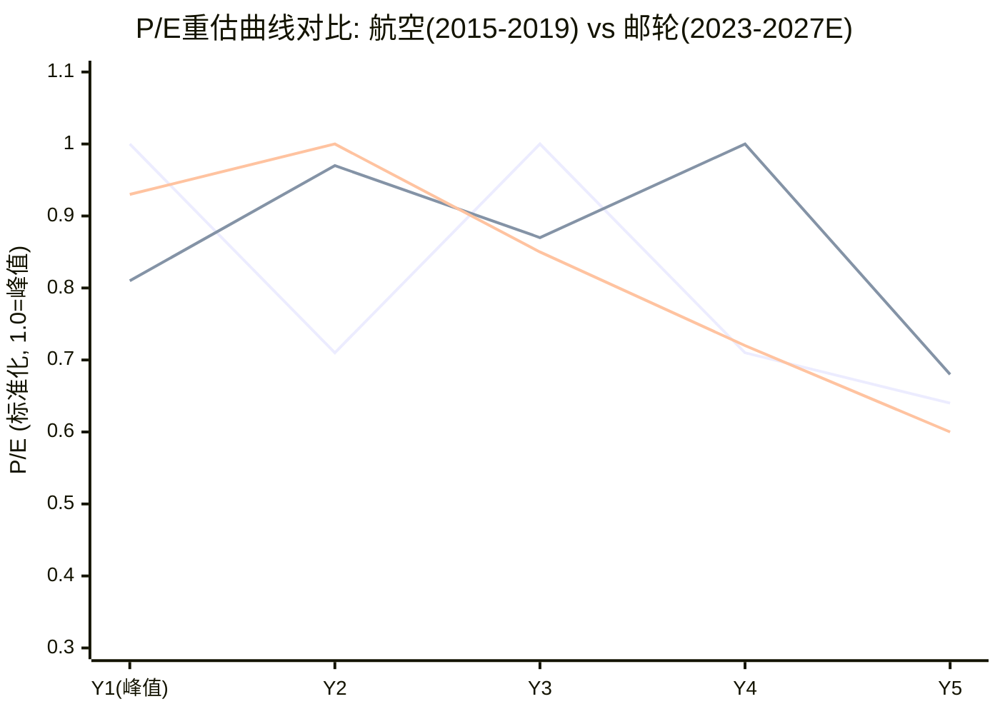
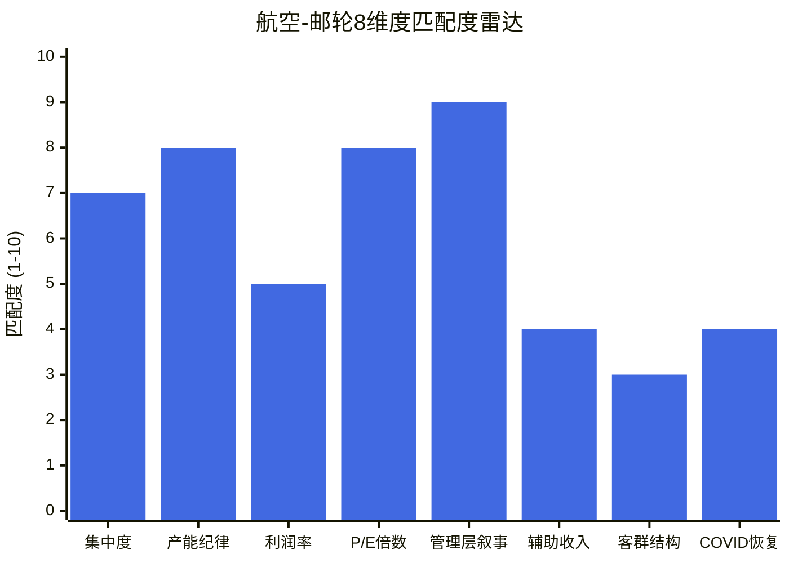
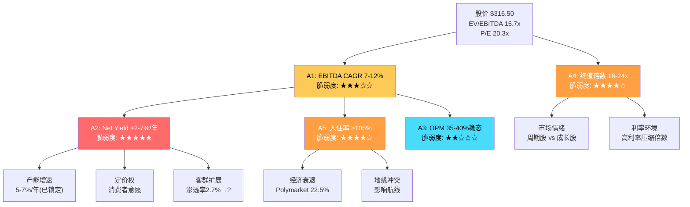
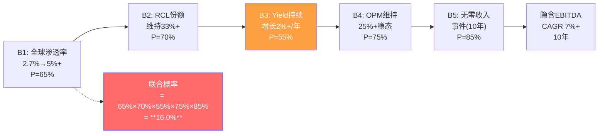

# Ch16 航空业镜像分析: 邮轮业正在重走航空"黄金十年"的老路吗?

> **冠军候选 C2** | CQ2: 航空镜像预警价值 | 初始置信度: 55%高匹配

## 16.1 引言: 一个诱人的类比

2014-2019年的美国航空业，曾经讲述了一个令华尔街心醉的故事: 行业整合完成后，三大巨头终于学会了"产能纪律"，利润率从历史的3-5%攀升至10%以上，P/E倍数从5-8x重估至10-14x。分析师们纷纷将航空业从"周期股"重新分类为"消费基础设施"。然后COVID来了，故事戛然而止。

2023-2026年的邮轮业，正在讲述一个结构上极其相似的故事: 行业集中度更高(三巨头占78%)、利润率创下历史新高(RCL OPM 27.4%)、P/E从周期底部的12-14x跃升至20x。管理层称之为"结构性改善"和"体验经济平台化"。

**本章的核心任务**: 不是简单判断"历史会重演"，而是通过精确的8维度映射，量化航空类比对邮轮业的预警价值——哪些维度高度吻合(应当警惕)，哪些维度存在结构性差异(可能让邮轮业避开航空的命运)。

---

## 16.2 航空业2014-2019: "黄金十年"的完整叙事弧

### 整合的前传: 从十一家到六家

2005年美国航空业有11家主要航司，合计占94%的国内ASM(Available Seat Miles)。之后经历了四轮大整合:

| 年份 | 合并事件 | 影响 |
|------|---------|------|
| 2005 | US Airways + America West | 中型整合 |
| 2008 | Delta + Northwest | 创建最大航司 |
| 2010 | United + Continental | 第二大航司 |
| 2013 | American + US Airways | 全球最大航司 |

到2014年，仅6家航司控制了94%的国内市场份额。DOJ数据显示，在机场配对层面，99%的航线属于"高度集中"(HHI >2,500)，部分枢纽如Reagan National机场HHI高达4,959。

### "产能纪律"叙事的兴起与瓦解

2010-2014年被视为产能纪律的黄金期: 国内运力增速从未超过3.3%，远低于历史5%+的扩张速度。这直接推动了利润率的大幅改善。

但2015年出现了转折——运力增速突破5%，挑战了"结构性纪律"的叙事。Oliver Wyman的年度航空经济报告明确指出: 尤其在拉美航线上，运力增速超过GDP增长导致了RASM(每可用座位英里收入)的侵蚀，边际利润从2015年的高点开始回落。

**航空业的核心教训**: 产能纪律在高利润率环境下是不稳定的。当每家航司都看到10%+的利润率时，"理性克制"让位于"竞争性增长"。

### 利润率轨迹: 峰值-回落-COVID-未复原

根据FMP财务数据，Delta Air Lines (DAL) 的Operating Margin轨迹:

| 年份 | DAL OPM | UAL OPM | 行业趋势 |
|------|---------|---------|---------|
| 2014 | 5.5% | 6.1% | 整合红利初现 |
| 2015 | 19.2% | 13.6% | **峰值** (油价暴跌助攻) |
| 2016 | 17.7% | 11.9% | 高位震荡 |
| 2017 | 14.5% | 9.6% | 开始回落 |
| 2018 | 11.8% | 7.8% | 持续下滑 |
| 2019 | 14.1% | 9.9% | 小幅反弹 |
| 2023 | 9.5% | 7.8% | COVID后复苏 |
| 2024 | 9.7% | 8.9% | 未回到2015-2016峰值 |
| 2025 | 9.2% | 8.0% | 继续低于峰值 |

**数据来源**: FMP Income Statement (DAL, UAL), FY2014-FY2025

关键发现: 即便到2025年，DAL的营业利润率(9.2%)仍远低于2015-2016年的峰值(17-19%)。"结构性改善"在COVID冲击后并未完全恢复——2015-2016年的高利润率有很大一部分是油价暴跌带来的临时红利，而非真正的结构性变化。

### P/E轨迹: 重估-回落-再重估

| 年份 | DAL P/E | UAL P/E | 备注 |
|------|---------|---------|------|
| 2015 | 8.9x | 2.9x* | *UAL税收红利扭曲EPS |
| 2016 | 8.8x | 10.6x | 整合红利充分定价 |
| 2017 | 12.4x | 9.5x | 重估高点 |
| 2018 | 8.8x | 10.9x | 市场开始怀疑 |
| 2019 | 8.0x | 7.4x | 回归周期股估值 |
| 2023 | 5.6x | 5.2x | COVID后初次盈利 |
| 2024 | 11.3x | 10.3x | 复苏溢价 |
| 2025 | 9.0x | 10.9x | 正常化 |

**数据来源**: FMP Ratios (priceToEarningsRatio), FY2015-FY2025

航空P/E的叙事弧: 从2015-2017年的"结构性重估"(8-12x)，到2018-2019年的"重新回归周期"(7-9x)，再到2023-2025年的"COVID复苏"(5-11x)。即便在最乐观的时期，航空P/E也从未突破15x。市场最终拒绝了航空业的"消费基础设施"叙事。

---

## 16.3 八维度精确映射

这是本章的核心分析框架。逐维度对比航空(2014-2019)和邮轮(2023-2026)，每个维度给出1-10的匹配度评分(10=完全匹配)和定性判断。

### 维度1: 行业集中度

| 指标 | 航空业(2014-2019) | 邮轮业(2023-2026) |
|------|-------------------|-------------------|
| 格局 | 6家控制94%ASM | 3家控制~78%舱位 |
| HHI | 全国~1,500-2,500 | 全球~3,000+ |
| 整合路径 | 通过并购从11家缩减 | 天然寡头(造船壁垒) |
| 新进入者威胁 | 低成本航司不断出现(Spirit, Frontier) | 几乎为零(单船$1B+) |

**匹配度: 7/10** — 集中度的表面数字相似，但底层逻辑不同。航空的集中度通过并购获得，新进入者威胁始终存在(Frontier, Spirit, JetBlue)。邮轮的集中度源于天然壁垒(造船周期3-4年、单船成本$1B+、港口容量限制)，新进入者威胁极低。这是邮轮可能优于航空的最重要维度。

### 维度2: 产能纪律

| 指标 | 航空业(2014-2019) | 邮轮业(2023-2026) |
|------|-------------------|-------------------|
| 峰值增速 | 2-3%(纪律期) → 5%+(失控期) | ~5-7%(新船交付驱动) |
| vs GDP增长 | 纪律期≈GDP，失控期>GDP | 持续>GDP(2x) |
| 控制机制 | 管理层决策(可逆) | 造船周期(不可逆) |
| 产能退出 | 飞机可退租/转卖(灵活) | 船舶报废周期30年(刚性) |

**匹配度: 8/10** — **这是最令人担忧的维度**。邮轮业2026年+6.7%的产能增速远超GDP增长，与航空2015年后"产能纪律崩溃"的剧本高度一致。而且邮轮产能更加不可逆——一旦新船交付，你不能像退租飞机那样灵活调整。全球邮轮业2026年将有13艘新船交付(27,107个新铺位)，到2036年的订单总额超过$765亿。RCL自身的Discovery Class(2029+)进一步锁定了长期产能扩张。

2026年引导Net Yield增速+2.5%中值，而产能增速+6.7%——这种"产能增速>定价增速"的组合，正是航空2015-2019年利润率开始侵蚀的前兆信号。

### 维度3: 利润率趋势

| 指标 | 航空业(2014-2019) | 邮轮业(2023-2026) |
|------|-------------------|-------------------|
| 起点(整合/复苏前) | OPM 3-5% | OPM亏损 |
| 峰值 | DAL 19.2%(2015), UAL 13.6%(2015) | RCL 27.4%(2025) |
| 峰值持续性 | 2年(2015-2016)后持续回落 | TBD(当前处于峰值区域) |
| 改善驱动力 | 整合+油价暴跌(临时) | COVID后需求释放+Yield管理(? 结构性) |
| COVID后恢复 | 未回到峰值(DAL 9.2% vs 19.2%) | 超越2019(27.4% vs 19.0%) |

**匹配度: 5/10** — 轨迹形态相似(低谷→改善→峰值)，但邮轮的利润率水平(27.4%)远高于航空峰值(19.2%)，且COVID后邮轮利润率超越2019年水平而航空未能。关键差异在于: 航空2015年的峰值利润率有一半来自油价暴跌(从$100+降到$40/桶)，这是一次性利好。邮轮的利润率改善有更多"真实"成分——Yield Management优化、船上消费货币化、更高效的新船设计。但"有多少是结构性的"仍然是CQ1的核心问题。

### 维度4: P/E倍数

| 指标 | 航空业(2014-2019) | 邮轮业(2023-2026) |
|------|-------------------|-------------------|
| 周期底部 | 5-8x | 12-14x(pre-COVID) |
| 重估峰值 | DAL 12.4x(2017), UAL 10.9x(2018) | RCL 20.9x(2024) |
| 重估幅度 | +50-80%从底部 | +50%从pre-COVID均值 |
| 市场叙事 | "消费基础设施" | "体验经济平台" |
| 叙事结局 | 2019年回到7-8x | TBD |

**匹配度: 8/10** — P/E重估叙事的结构几乎完全一致。航空从"周期垃圾"到"消费基础设施"再回到"周期股"，邮轮正在从"周期股"走向"体验经济平台"。两者的核心都是: 利润率改善→P/E重估→投资者相信"这次不一样"。航空花了大约4年(2015-2019)完成了从重估到回归的全过程。如果映射到邮轮，2023年开始的重估可能在2027-2028年面临挑战。

注: 航空Y1=2015, 邮轮Y1=2023。邮轮Y4-Y5为情景推演(假设P/E回归pre-COVID均值14x)。

### 维度5: 管理层叙事

| 指标 | 航空业(2014-2019) | 邮轮业(2023-2026) |
|------|-------------------|-------------------|
| 核心话术 | "理性产能管理"/"行业纪律" | "结构性改善"/"体验平台转型" |
| 隐含主张 | "我们学会了不打价格战" | "我们从卖船票变成卖体验" |
| 可验证性 | 事后证伪(2015年产能纪律即崩溃) | 待验证(Yield纯度分析见Ch10) |
| 资本分配一致性 | 大规模回购(信号一致) | 回购+高CapEx+仍在加杠杆(信号混合) |

**匹配度: 9/10** — 叙事模式几乎完全复刻。两个行业的管理层都在利润率高峰期宣称"这次是结构性的"。特别值得注意的是RCL管理层将公司定位为"体验经济平台"而非"邮轮运营商"——这与航空业2015-2017年试图将自己定义为"消费基础设施"而非"交通运输"的策略如出一辙。

更关键的是资本分配信号的矛盾: RCL一方面宣称"结构性改善"，一方面仍在以D/E 2.2x的杠杆水平启动$2B/年的股东回报(FCF仅$1.24B，差额来自新发债)。如果管理层真的相信"结构性改善"，为什么不优先去杠杆?

### 维度6: 辅助收入/船上消费

| 指标 | 航空业(2014-2019) | 邮轮业(2023-2026) |
|------|-------------------|-------------------|
| 策略 | 行李费/选座费/Wi-Fi | 船上消费/预购体验/私人目的地 |
| 占收入比例 | 从~0%增长到~12-15% | 从~25%(2019)到~30%(2024) |
| 增长空间 | 渐趋饱和(消费者抵制) | 仍有扩展空间(体验类SKU丰富) |
| 利润率贡献 | 高(近乎纯利) | 高(边际成本低) |
| 消费者感知 | 负面("镍和铬效应") | 中性偏正面(自愿升级体验) |

**匹配度: 4/10** — 这是邮轮业与航空最大的结构性差异之一。航空的辅助收入(行李费、选座费)本质上是"原有包含服务的拆分定价"——消费者普遍厌恶。邮轮的船上消费(水疗、专属餐厅、岸上游览、Perfect Day at CocoCay)是"增值体验消费"——消费者主动付费。全球航空辅助收入从2014年的$381亿增长到2019年的$1,095亿(CLIA报告)，但增长主要来自低成本航司，全服务航司的辅助收入占比增长远低于预期。RCL的船上消费增长有更坚实的产品基础——特别是Perfect Day at CocoCay等私有目的地创造了独占的体验消费场景。

### 维度7: 客群结构

| 指标 | 航空业(2014-2019) | 邮轮业(2023-2026) |
|------|-------------------|-------------------|
| 核心客群 | 全民交通工具(无选择性) | 偏中高收入+50岁以上(有选择性) |
| 年轻化趋势 | N/A(不适用) | 35岁以下占36%(CLIA 2025报告) |
| 新客获取 | 人口自然增长 | 31%首次邮轮客(2024) |
| 全球渗透率 | N/A(刚性需求) | ~2.7%(巨大空间) |
| 替代品压力 | 高铁/视频会议(商务) | 度假村/陆地旅游(但非直接替代) |

**匹配度: 3/10** — 客群结构是两个行业的根本差异。航空是大众交通工具，需求主要受宏观经济驱动，没有"渗透率提升"的故事。邮轮是可选消费品，全球渗透率仅2.7%——理论上有巨大的增量空间。CLIA 2025年报告显示，2024年全球邮轮乘客3,460万人(+9.3% YoY)，68%的国际旅行者表示考虑首次邮轮旅行。2025年预计达3,770万人。这个"低渗透率→增长空间"的叙事是邮轮业区别于航空的最重要论据。

但需要注意: 航空分析师在2014-2017年也曾用"国际旅行需求结构性增长"来支持航空估值重估。低渗透率是事实，但从事实到价值实现的路径上有很多障碍(经济周期、地缘政治、替代消费竞争)。

### 维度8: COVID冲击与恢复

| 指标 | 航空业 | 邮轮业 |
|------|--------|--------|
| 冲击深度 | 收入-60%(2020) | 收入-80%(2020), -86%(2021) |
| 恢复速度 | 2023年收入超2019 | 2023年收入超2019(+27%) |
| 利润率恢复 | 未回到2015-2016峰值 | **超越**2019水平 |
| 资产负债表 | 债务增加~$25B(行业) | RCL债务增加~$12B(D/E 1.2→2.2x) |
| 行业叙事转变 | "回归正常" | "永久性提升" |

**匹配度: 4/10** — COVID冲击本身高度相似(都是零收入事件)，但恢复路径出现了关键分叉。航空利润率未能回到2015-2016峰值(DAL: 9.2% in 2025 vs 19.2% in 2015)；而RCL的OPM从2019年的19.0%提升到2025年的27.4%。这可能意味着:

- **乐观解读**: 邮轮业在COVID期间完成了真正的结构性优化(成本瘦身+定价权提升)，航空则没有
- **悲观解读**: COVID后释放的被压抑需求为邮轮创造了临时的"完美风暴"(需求爆发+产能有限=超额利润)，随着产能归位(2025-2027大量新船交付)，利润率将回归

---

## 16.4 映射总分与综合判断

| 维度 | 匹配度 | 对邮轮的预警价值 |
|------|--------|----------------|
| 1. 行业集中度 | 7/10 | 中等(邮轮壁垒更高) |
| 2. 产能纪律 | **8/10** | **高**(最大风险信号) |
| 3. 利润率趋势 | 5/10 | 中等(结构可能不同) |
| 4. P/E倍数 | **8/10** | **高**(叙事弧完全一致) |
| 5. 管理层叙事 | **9/10** | **最高**(话术几乎复刻) |
| 6. 辅助收入 | 4/10 | 低(邮轮模式更优) |
| 7. 客群结构 | 3/10 | 低(根本性差异) |
| 8. COVID恢复 | 4/10 | 低(恢复路径分叉) |
| **加权平均** | **6.0/10** | **中高** |

### 综合匹配度: 60% — 部分有效的预警

类比的有效性不均匀分布: 在**叙事层面**(管理层话术、P/E重估逻辑、产能纪律考验)高度一致(平均8.3/10)，在**结构层面**(进入壁垒、商业模式、客群渗透率)差异显著(平均3.7/10)。

这意味着:

1. **市场叙事风险是真实的**: RCL从"周期股"到"体验平台"的P/E重估，与航空的"消费基础设施"重估遵循相同的心理模式。当叙事面临数据挑战(如Yield增速持续放缓)时，P/E可能快速回归
2. **但结构性差异可能延缓回归**: 邮轮的进入壁垒(造船门槛)、辅助收入品质(体验消费 vs 拆分定价)、以及低渗透率增长空间，是航空不具备的缓冲。这些因素可能让邮轮的"高利润率窗口"维持更长时间
3. **产能纪律是决定性变量**: 如果2026年+6.7%产能增速下Yield持续增长(+2.5%+)，则邮轮业成功避开航空的陷阱。如果Yield增速继续减速到<+1%，而产能增速保持5%+，则航空剧本的预警价值大幅上升

---

## 16.5 航空类比对RCL估值的影响

### 情景A: 航空剧本完全重演(匹配度80%+)

如果邮轮P/E沿着航空2017-2019年的回归路径运动(从峰值下降约40%):
- RCL P/E从20x回归到12-14x(pre-COVID均值)
- 隐含股价: $15.61 EPS x 13x = ~$203 (下行-36%)

### 情景B: 部分重演，结构差异缓冲(匹配度50-60%)

P/E回归但幅度有限(受低渗透率和进入壁垒保护):
- RCL P/E从20x温和回归到16-18x
- 隐含股价: $15.61 x 17x = ~$265 (下行-16%)

### 情景C: 邮轮业成功打破航空命运(匹配度<40%)

Yield增长持续证明"结构性"，产能被新需求吸收:
- RCL P/E维持在18-22x
- 隐含股价: $17.90 FWD EPS x 20x = ~$358 (上行+13%)

**概率权重**: A(25%) + B(45%) + C(30%) = 加权隐含价格~$272

**CQ2结论更新**: 航空镜像对邮轮的预警价值从初始的55%调整为**60%**(在叙事层面高度有效)，但需要与结构性差异(进入壁垒+低渗透率)进行加权。净效果: 邮轮P/E回归压力真实存在，但回归幅度可能小于航空。

---

## 16.6 航空类比的三个结构性断裂点

尽管总匹配度为60%，有三个维度使得邮轮业可能结构性优于航空:

**断裂点1: 进入壁垒不可比**
航空业任何时候都有新进入者威胁——Frontier、Spirit、JetBlue不断挑战定价纪律。邮轮业要进入需要: (a) $1B+单船成本, (b) 3-4年造船周期, (c) 港口合同/岸上设施, (d) 品牌信任积累。过去20年没有一家新的大型邮轮公司成功进入市场。这意味着邮轮的寡头结构比航空稳定得多。

**断裂点2: 消费体验的可扩展性**
航空座位是标准化商品——价格是唯一竞争维度。邮轮体验可以持续分层和扩展: 从内舱到套房、从公共餐厅到专属餐厅、从标准行程到私有岛屿。每一层级的添加都创造了新的定价权。Perfect Day at CocoCay这样的私有目的地在航空业完全没有对应物。

**断裂点3: 渗透率叙事的真实性**
航空渗透率在发达国家已接近饱和(美国人均年乘机2.5次)。邮轮全球渗透率仅2.7%，即便在最成熟的美国市场也仅约3.5%。CLIA报告显示68%的国际旅行者考虑首次邮轮——如果这个转化率哪怕实现5%，就意味着每年数百万的增量乘客。

**但断裂点不是免死金牌**: 这些优势在经济衰退中会快速贬值——2009年邮轮入住率从100%+降至95%，利润率腰斩。进入壁垒保护你不受竞争者侵蚀，但不保护你不受需求萎缩。

---

# Ch17 信念反演: 市场在赌什么?

> CQ5: P/E 20x隐含假设的现实性 | 初始置信度: 40%现实

## 17.1 逆向DCF: 从股价翻译市场的隐含假设

传统DCF回答"这家公司值多少钱"，逆向DCF回答"市场在赌什么"。后者对投资决策更有价值——我们不需要计算一个精确的内在价值，而需要理解市场共识背后的隐含假设，然后判断这些假设是否合理。

### 输入参数

| 参数 | 值 | 来源 |
|------|---|------|
| 股价 | $316.50 | 市场价格 |
| 稀释股数 | 273M | FY2025 10-K |
| 市值 | $86.4B | 计算值 |
| 净债务 | $21.8B | FY2025 B/S |
| EV | **$108.2B** | 计算值 |
| FY2025 EBITDA | $6.91B | FY2025实际 |
| FY2025 FCF | $1.24B | FY2025实际 |
| FY2025 Revenue | $17.94B | FY2025实际 |
| WACC | 8.5% | BB级信用+Beta 1.87 |
| 当前EV/EBITDA | **15.7x** | 计算值 |

### 逆向DCF核心发现

采用标准两阶段模型(10年显性期+终值)，假设FCF/EBITDA转换率维持18%:

**发现1: 隐含EBITDA CAGR = ~12%**

| EBITDA CAGR假设 | 隐含EV | vs 实际EV | 差异 |
|----------------|--------|----------|------|
| 0% | $38.7B | $108.2B | -64% |
| 4% | $55.2B | $108.2B | -49% |
| 7% | $71.6B | $108.2B | -34% |
| 10% | $92.7B | $108.2B | -14% |
| **12%** | **$109.8B** | **$108.2B** | **+1.5%** |

在终值EV/EBITDA=10x的假设下，当前股价隐含了EBITDA未来10年12%的年复合增长率。这意味着到2035年，RCL的EBITDA需要从$6.9B增长到$21.4B——几乎翻三倍。

**发现2: 或者，隐含一个极高的终值倍数**

如果将EBITDA CAGR压低到更合理的水平，市场隐含的终值倍数如下:

| EBITDA CAGR | 2035年EBITDA | 隐含终值倍数 |
|-------------|-------------|-------------|
| 3% | $9.3B | **24.0x** |
| 5% | $11.3B | **19.6x** |
| 7% | $13.6B | **16.1x** |

即便假设7%的EBITDA CAGR(高于大多数成熟消费公司)，市场仍在隐含一个16.1x的2035年终值EV/EBITDA——远高于成熟周期股的8-12x范围。

**发现3: 隐含收入CAGR和Net Yield增速**

| EBITDA CAGR | EBITDA边际假设 | 隐含收入CAGR | 隐含Net Yield年增速 |
|-------------|--------------|-------------|-------------------|
| 7% | 38%(维持) | 7.1% | ~2% |
| 7% | 35%(小幅压缩) | 8.0% | ~3% |
| 10% | 40%(扩张) | 9.6% | ~4.6% |
| 12% | 38%(维持) | 12.1% | ~7% |

注: 假设产能增速~5%(基于当前订单簿)，Net Yield增速 = 收入CAGR - 产能CAGR

**关键翻译**: 如果市场隐含的EBITDA CAGR确实是12%，且产能增速为5%，那么Net Yield需要以每年~7%的速度增长——而2026年引导的中值仅为+2.5%(CC)。

---

## 17.2 市场隐含假设矩阵

将逆向DCF的结果翻译为5个可独立验证的子假设:

| # | 隐含假设 | 隐含值 | 当前现实 | 可验证标准 |
|---|---------|--------|---------|-----------|
| A1 | EBITDA 10年CAGR | 7-12% | FY2025 +13.5% | 减速到多少是转折信号? |
| A2 | Net Yield年增速 | 2-7% | 2026引导+2.5% | 连续2季度<+1%即警报 |
| A3 | 稳态OPM | 35-40% | 27.4%(仍在爬升) | 超过航空峰值即"证伪" |
| A4 | 终值EV/EBITDA | 16-24x | 当前15.7x | 10x=周期, 15x=优质消费 |
| A5 | 产能利用率 | 维持105%+ | 109.7% | <100%即EBITDA崩塌 |

---

## 17.3 信念脆弱度分析: 最先倒下的是哪面墙?

### 脆弱度排序(从最脆弱到最坚固)

**第1名: A2 Net Yield增速(脆弱度 5/5)**
- 2026引导+2.5%已经比2025年的+3.8%减速38%
- 产能增速+6.7%已锁定(新船不可取消)
- 如果需求在宏观放缓中软化，Yield可能转负
- 历史先例: 2007年Yield +5.2% → 2008年+1.3% → 2009年-7.8%
- **最少需要失败的假设**: 仅此一项失败(Yield连续两季度<+1%)即可触发EBITDA下修→P/E收缩双杀

**第2名: A5 入住率维持(脆弱度 4/5)**
- 当前109.7%看似稳固，但邮轮入住率是高度非线性的
- 2009年全行业降至95%，利润率从~15%腰斩至<5%
- RCL经营杠杆极高(固定成本占60%+)——入住率每下降1个百分点，EBITDA损失约$100-150M
- Polymarket美国衰退概率22.5%——如果衰退发生，入住率维持在105%+的假设将首先被打破

**第3名: A4 终值倍数(脆弱度 4/5)**
- 市场隐含16-24x的2035年EV/EBITDA
- 如果邮轮在2035年仍被视为"周期股"，终值倍数回到10-12x
- 这将使估值支撑下降30-40%
- 高利率环境天然压缩久期长的终值——利率每上升100bp，终值PV下降约8-10%

**第4名: A1 EBITDA增长(脆弱度 3/5)**
- 近期增长动力强劲(FY2025 +13.5%)
- 但12%的10年CAGR要求从$6.9B增长到$21.4B
- 历史上没有任何邮轮公司实现过10年12%的EBITDA CAGR
- RCL 2015-2019的EBITDA CAGR约为8%(包含整合红利)
- 更合理的预期是5-7%——这将使估值出现显著缺口

**第5名: A3 稳态OPM(脆弱度 2/5)**
- 27.4%的OPM已经创下行业纪录
- 新船效率更高(Icon Class单客利润$150+ vs Voyager Class $90)
- 船上消费货币化仍在早期阶段
- 但上行空间有限——从27%到35%需要同时维持定价权+控制成本
- 相对最稳固的假设，因为有真实的运营改善支撑

### "数学不可能性测试"

**隐含渗透率测试**: 如果RCL的收入按12% CAGR增长10年(达到$55.7B)，且全球邮轮市场份额维持~33%，则全球邮轮营收需要达到~$168B。当前全球邮轮行业营收约$50B。这要求全球邮轮渗透率从2.7%增长到约8-9%——相当于在10年内翻三倍。这并非"不可能"，但需要极度乐观的假设。

**隐含利用率测试**: 如果产能按5%年增长，10年后RCL总舱位将从当前约~16万增长到~26万。要维持109%+的入住率，需要每年增加约1万+新乘客——全球邮轮新增乘客总量约200-300万/年(CLIA数据)。RCL需要获取其中约50%，高于当前~33%的市场份额。

**结论**: 12% EBITDA CAGR不是"数学不可能"，但需要同时满足: (a)渗透率翻三倍, (b)市场份额提升, (c)利润率维持或扩张。三个条件同时满足的概率远低于单个条件成立的概率——这就是信念链的联合概率陷阱。

---

## 17.4 信念链的联合概率

单个信念看起来都"合理"(55-85%概率)，但要求所有信念同时成立的联合概率仅为**16.0%**。即便将"合理情景"的概率调高(每个+5pp)，联合概率也仅为23.4%。

**这是当前估值最核心的脆弱性**: 市场定价(P/E 20x)对应的EBITDA增长路径，要求多个独立信念同时成立。而历史上，10年周期内至少遇到一次重大冲击的概率极高(过去20年: 2001恐袭、2008金融危机、2020 COVID、2022加息)。

### 最少几个信念失败即改变评级?

- **1个关键信念失败(A2: Yield)**:  P/E从20x压缩至15-17x → 股价下行15-25% → 从"中性关注"滑向"审慎关注"边缘
- **2个信念失败(A2+A5: Yield+入住率)**: EBITDA下修15%+ → P/E压缩至12-14x → 股价下行35-45% → 明确"审慎关注"
- **3个信念失败(A2+A5+A4)**: 全面回归周期股估值 → 股价可能下行50%+ → 但此时可能成为"深度关注"的买入点

---

## 17.5 市场定价的"隐含世界观"

综合逆向DCF和信念链分析，当前$316.50的股价隐含了以下"世界观":

> **市场在赌**: RCL不是一家周期性邮轮运营商，而是一家体验经济平台——类似于从"卖机票"进化到"卖旅行体验"。这个转型是结构性的(不会被周期打断)，支撑RCL以7-12%的EBITDA CAGR增长10年，且终值倍数维持在16x+(不回归周期股的10x)。

> **市场没有赌**: 下一个零收入事件(COVID-like或更小级别的地缘冲击)、Yield增长的周期性均值回归、产能过剩导致的价格战、以及宏观衰退对可选消费的冲击。

> **市场低估了**: 信念链的联合概率约束——每个单独假设看起来合理(55-85%)，但全部同时成立的概率仅16%。

### 隐含假设的时间维度

| 时间窗口 | 市场赌什么 | 验证时间 | 风险程度 |
|----------|-----------|---------|---------|
| 2026H1 | Yield引导+2.5%兑现 | 3-6个月 | 低(已锁定大部分预订) |
| 2026H2-2027 | 新产能被吸收(不压价) | 6-18个月 | 中(13艘新船交付的消化期) |
| 2027-2028 | OPM维持25%+(不回归) | 1-3年 | 中高(航空类比的关键验证窗口) |
| 2028-2035 | 渗透率持续扩张+估值不回归 | 3-10年 | 高(太远，不确定性太大) |

**CQ5结论更新**: P/E 20x隐含假设的现实性从初始40%下调至**35%**。逆向DCF显示市场隐含了12% EBITDA CAGR或16x+终值倍数——两者都要求极度乐观的假设。联合概率分析进一步揭示了信念链的脆弱性。但短期(12个月)内假设被证伪的概率较低，因为2026年的预订情况已经锁定了大部分近期业绩。

---

## 17.6 对估值框架的输入

本章为Phase 4估值提供以下关键输入:

1. **逆向DCF锚点**: EV=$108.2B隐含EBITDA CAGR 12%(极端乐观)或终值倍数16.1-24.0x(同样极端)
2. **合理EBITDA CAGR范围**: 5-8%(基于航空类比+历史基准)，对应EV=$60-78B → 隐含下行27-44%
3. **信念链联合概率**: 当前定价所需的信念链联合概率仅16% → 风险不对称(下行空间>上行空间)
4. **关键转折点监控**: Net Yield增速(最脆弱) > 入住率(第二脆弱) > 终值倍数预期(第三脆弱)
5. **航空类比折价**: 如果映射度60%有效，历史类比建议P/E在峰值后4-5年回归至pre-COVID均值(12-14x)，加权后的航空类比折价约-16%至-36%

> **两章联合信号**: Ch16的航空镜像(60%匹配)和Ch17的信念反演(联合概率16%)从不同角度指向同一个结论——**当前估值的安全边际不足**。市场在赌一个概率虽非零但远低于定价所隐含的"完美情景"。这不是说RCL是坏公司——而是说好公司也可以有坏价格。
