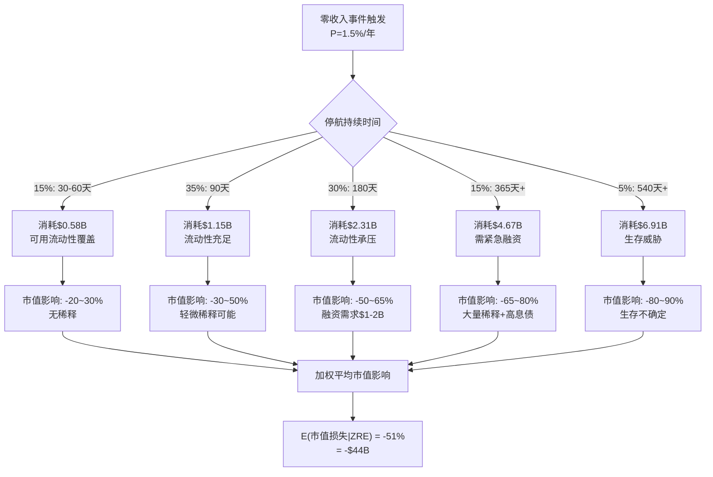
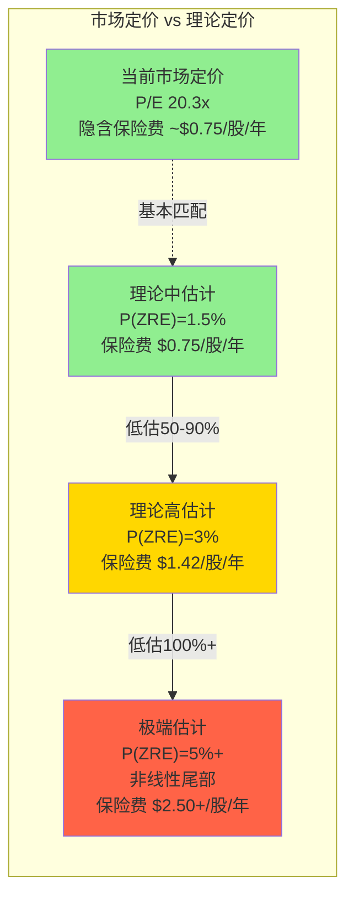
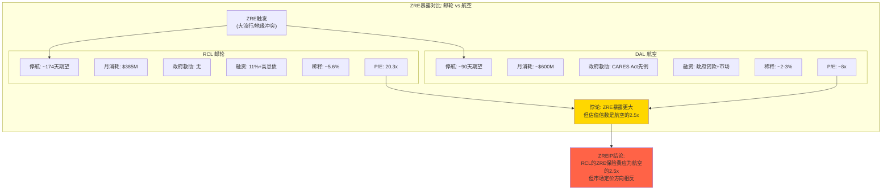

# Ch18 零收入事件保险定价: 用CDS逻辑为邮轮尾部风险标价 (★冠军候选C3)

> **方法论**: Zero-Revenue Event Insurance Pricing (ZREIP) — 将信用违约互换(CDS)的定价逻辑移植到权益估值中，为"完全停航=零收入"这一尾部风险计算隐含保险费
> **核心创新**: 投资者持有RCL股票时，隐性承担了一种独特风险——下一次COVID级事件可能导致收入归零、现金持续流失、被迫稀释融资。这种风险应该被定价，但传统P/E分析完全忽略了它
> **CQ6回应**: 尾部风险是否被合理定价? 初始置信度35%已定价

---

## 18.1 定义"零收入事件": 不是黑天鹅，是灰犀牛

### 什么算"零收入事件"?

本章定义的"零收入事件"(Zero-Revenue Event, ZRE)具有三个特征:

1. **全球性**: 非区域性航线中断(如红海危机)，而是全球性或主要市场(北美+欧洲，占RCL营收~90%)的同步停航
2. **持续性**: 停航≥30天(否则对季度财务影响有限)
3. **强制性**: 非RCL自愿选择(如淡季停航检修)，而是监管/公共卫生命令或旅客恐慌导致的被迫停运

这个定义精确排除了**局部干扰**(某条航线取消、某个港口关闭)和**需求下滑**(衰退期入住率下降)。ZRE是一种极端状态——收入从$50M/天骤降至接近零，但成本(船员工资、保险、停泊费、利息)照常支出。

### 历史频率: 从"70年0次"到"5年1次"

| 时期 | 全球ZRE次数 | 频率 |
|------|-----------|------|
| 1950-2019 (70年) | **0** | 0%/年 |
| 2020-2021 (~15个月) | **1** (COVID-19) | — |
| 1950-2025 (75年) | **1** | 1.33%/年(朴素频率) |

纯历史频率法给出1/75 = 1.33%/年。但这种方法有严重缺陷: 样本量=1，且COVID本身改变了先验认知。我们需要贝叶斯方法。

### 潜在触发器清单

| 触发类型 | 代表性场景 | 估计概率(年化) | 是否导致ZRE |
|----------|----------|---------------|------------|
| **新型疫情** | COVID-like呼吸道大流行 | ~2%/年 (PNAS Marani et al. 2021) | 高概率→ZRE |
| **严重地缘冲突** | 台海危机/全球港口封锁 | ~0.5-1%/年 | 中概率→部分ZRE |
| **极端监管** | WHO全球旅行禁令/多国同步港口关闭 | ~0.3%/年 | 需疫情触发，非独立事件 |
| **行业特定危机** | 多起严重海上事故引发全球邮轮禁令 | <0.1%/年 | 低概率 |

> **来源**: 疫情概率来自PNAS "Intensity and frequency of extreme novel epidemics" (Marani et al., 2021)——该研究基于1600-2020年历史流行病数据库，用广义帕累托分布拟合，估计COVID级大流行的年发生概率约为2%。Polymarket "New Coronavirus Pandemic in 2026?" 当前定价8.2%/年，但该市场定义较宽(WHO宣布即算)且流动性有限($6,860成交量)。地缘冲突概率为分析师估计，参考Polymarket美国衰退概率(22.5%)的宏观环境校准。

---

## 18.2 贝叶斯概率估计: COVID如何更新我们的信念

### 先验分布

在COVID之前，理性投资者对"全球邮轮停航"的先验概率极低。1970年代以来全球邮轮业从未经历过全面停运——即使是2003年SARS(仅影响亚洲航线)、2009年H1N1(未导致停航)、2014年Ebola(仅西非)。合理的先验:

- **先验年化概率**: P₀(ZRE) ≈ 0.5%/年
- **先验分布**: Beta(1, 199)，即期望值0.5%，但不确定性很大
- **含义**: 投资者认为平均200年发生一次

### COVID-19后验更新

贝叶斯更新公式:
```
后验 ∝ 先验 × 似然
Beta(α₁, β₁) = Beta(α₀ + successes, β₀ + failures)
```

COVID提供了一个"成功"(ZRE发生)在约5年观察期(2020-2025)中:

- **更新后**: Beta(1+1, 199+4) = Beta(2, 203)
- **后验均值**: 2/205 = **0.98%/年**
- **后验95%可信区间**: [0.15%, 3.2%]

但这忽略了一个关键的前瞻调整: **未来ZRE概率可能高于历史平均**。原因:

1. **病原体溢出加速**: 全球城市化+动物栖息地侵蚀 → PNAS研究指出极端大流行概率可能在未来几十年内增加3倍
2. **地缘紧张升级**: 全球化碎片化趋势 → 港口封锁的地缘风险上升
3. **邮轮作为"浮动培养皿"的声誉固化**: COVID后公众将邮轮与疫情传播强关联 → 下次疫情时邮轮禁令可能更快落地
4. **但也有对冲因素**: 疫苗开发提速(mRNA平台)+船队通风系统升级+行业游说能力增强 → 下次停航时间可能更短

### 综合概率估计

| 参数 | 低估计 | 中估计 | 高估计 |
|------|--------|--------|--------|
| **基础贝叶斯后验** | 0.5% | 1.0% | 2.0% |
| **前瞻调整系数** | ×1.0 | ×1.5 | ×2.5 |
| **调整后年化ZRE概率** | **0.5%** | **1.5%** | **5.0%** |
| **10年发生概率** | 4.9% | 14.0% | 40.1% |

**本章采用中估计P(ZRE) = 1.5%/年作为基准**，并在敏感性分析中覆盖0.5%-5.0%全区间。这意味着: **每67年期望发生一次ZRE。一个30年投资期内遭遇至少一次ZRE的概率为36.3%——远非"百年一遇"。**

> **来源**: 贝叶斯更新公式为标准Beta-Binomial共轭; 前瞻调整系数参考PNAS Marani et al. (2021) + GAVI "New study suggests risk of extreme pandemics could increase threefold in coming decades"; Polymarket校准: "New Coronavirus Pandemic in 2026?" = 8.2%定价(定义较宽，不等于ZRE)

---

## 18.3 现金消耗模型: 零收入时RCL每天流失多少?

### COVID期间实际现金消耗率

RCL在2020年公告中详细披露了停航期间的现金消耗:

| 指标 | 2020年实际(披露) | 来源 |
|------|------------------|------|
| **月度现金消耗率** | $250-290M/月 | RCL 2020 Q3 Earnings Release (SEC Filing) |
| **其中: 船舶运营+管理费用** | $150-170M/月 | RCL 2020 Business Update |
| **其中: 利息费用** | ~$70-80M/月 | 推算: FY2020利息$844M/12 |
| **其中: 维护CapEx+其他** | ~$30-40M/月 | 差额推算 |
| **年化现金消耗** | $3.0-3.5B/年 | 月度×12 |

> **来源**: Cruise Industry News "Royal Caribbean Provides Business Update and Cash Burn Numbers"; RCL 2020 Earnings Release (PR Newswire 2021-02-04); SEC Filing Q3 2020 Earnings

### 当前规模调整 (2026)

2020年以来RCL的船队、债务和成本结构都发生了显著变化:

| 调整因子 | 2020 | 2026E | 变化 | 对现金消耗的影响 |
|----------|------|-------|------|----------------|
| **船队规模** | ~58艘 | ~67艘(含Legend of the Seas) | +15.5% | 运营成本↑ |
| **总债务** | $20.0B | $22.6B(FY2025) | +13.0% | 利息支出↑(但利率已降) |
| **年化利息** | $844M ($70M/月) | $992M ($83M/月) | +17.5% | 名义↑，但新债利率更低 |
| **员工数** | ~77,000(估) | 105,950 | +37.6% | 船员成本显著↑ |
| **PP&E净值** | $25.8B | $36.3B | +40.7% | 维护成本↑ |
| **通胀累积(CPI)** | 基期 | +~26% | +26% | 所有成本基线↑ |

**综合调整后月度现金消耗率估计**:

```
2020基期: $270M/月 (中值)
× 船队规模调整: ×1.12 (部分新船更高效，不完全线性)
× 利息调整: 利息从$70M→$83M/月 (+$13M)
× 通胀+人员调整: ×1.20 (运营成本26%通胀但部分被效率提升抵消)
= 2026E月度现金消耗: ~$350-420M/月
中值: $385M/月 = $12.8M/天 = $4.6B/年
```

| 2026E现金消耗分项 | 估算(月) | 逻辑 |
|------------------|---------|------|
| 船舶运营+管理费用 | $210-240M | 2020年$160M×1.12(船队)×1.20(通胀/人员) |
| 利息费用 | $80-85M | FY2025实际$992M/12 |
| 维护CapEx+其他 | $55-75M | 2020年$35M×1.40(PP&E增长)+新船维护 |
| 对冲/保险费用 | $10-20M | 燃油对冲+船舶保险 |
| **合计** | **$355-420M** | **中值$385M** |

> **来源**: 2020基期数据来自RCL 2020 Business Update (SEC Filing); 2026E调整为分析师基于FMP balance/income数据推算

---

## 18.4 停航持续时间分布: 不是30天的问题

COVID教训的最深刻之处不在于停航本身，而在于**停航持续时间远超所有预期**。2020年3月RCL宣布"30天暂停"，实际停航长达~15个月(美国航线直到2021年6月才逐步恢复)。

### 历史校准与前瞻调整

COVID的15个月停航是唯一的样本点。但下一次ZRE的持续时间分布应该有所不同:

| 因素 | 缩短停航的力量 | 延长停航的力量 |
|------|---------------|---------------|
| **医疗** | mRNA疫苗平台可加速研发(100天目标) | 新病原体可能对现有平台无效 |
| **监管** | 行业游说力增强+CDC经验更丰富 | 政治压力可能更大("邮轮是疫情温床"叙事) |
| **产业** | 船队通风/隔离设施升级 | 更大的船=更多乘客=更大的管控难度 |
| **经济** | 邮轮已是$70B+产业，各国有强经济动力开放 | 地缘ZRE(非疫情)可能没有"疫苗解法" |

### 持续时间分布模型

| 持续时间 | 概率权重 | 场景描述 |
|---------|----------|---------|
| **30-60天** | 15% | 短暂局部封锁(类2020年3月最初预期) |
| **90天(3个月)** | 35% | 中等疫情+快速应对+部分航线先恢复 |
| **180天(6个月)** | 30% | 类COVID但应对更快(疫苗加速+监管经验) |
| **365天+(12月+)** | 15% | 类COVID全程或地缘冲突长期化 |
| **>540天(18月+)** | 5% | 极端场景(多波次疫情或全面战争) |

**期望停航天数**:
```
E(天数) = 45×0.15 + 90×0.35 + 180×0.30 + 365×0.15 + 540×0.05
        = 6.75 + 31.5 + 54 + 54.75 + 27
        = 174天 (~5.8个月)
```

**期望现金消耗额(给定ZRE发生)**:
```
E(现金消耗|ZRE) = E(天数) × $12.8M/天
                = 174 × $12.8M
                = $2.23B
```



---

## 18.5 融资能力与信用冻结风险: CI-04×CI-05联合

### 当前流动性缓冲

| 流动性来源 | 金额 | 可用性(ZRE期间) |
|-----------|------|----------------|
| **现金及等价物** | $825M | 即刻可用 |
| **循环信贷额度** | $6.35B (未提取) | 取决于信用条款+银行意愿 |
| **总账面流动性** | $7.2B | — |
| **可支撑停航月数** | ~18.7个月 ($7.2B/$385M) | 理论最大值 |

> **来源**: RCL FY2025 Earnings Release (PR Newswire 2026-02-11): "Liquidity was $7.2 billion as of December 31, 2025"; 循环信贷额度来自PR Newswire 2025-04 "Royal Caribbean Group announces upsizing and extension of revolving credit facilities" — $6.35B commitments, half expiring Oct 2028, half Oct 2030

18.7个月的理论覆盖看起来足够应对期望停航5.8个月。但这是**静态分析的幻觉**。

### 信用冻结的动态效应

2020年3月的现实揭示了一个关键风险: **当你最需要钱的时候，市场最不愿意给你钱**。这就是承重墙CI-04(新型疫情/零收入事件)与CI-05(信用市场冻结)的联合概率问题:

**2020年3月的融资条件恶化时间线**:

| 日期 | 事件 | 融资条件 |
|------|------|---------|
| 2020.03.08 | CLIA宣布自愿停航 | 信用市场开始收紧 |
| 2020.03.14 | CDC No Sail Order | 高收益债市场基本关闭 |
| 2020.03.23 | 市场底部 | RCL股价$22，CDS spread飙升 |
| 2020.04-06 | 紧急融资 | **RCL被迫以11.25%利率发行担保票据** |
| 2020.08 | 额外融资 | 以11.5%收益率发行债券 |
| 2020全年 | 累计 | **$9.3B新资本(债+股)** |

> **来源**: Bloomberg "Royal Caribbean Pays More Than 11% on Bond to Refinance Debt"; Maritime Executive "Royal Caribbean Puts 28 Ships Up as Collateral for $3.3B in New Debt"; RCL 2020 Earnings Release

**对比正常时期融资成本**: FY2025 RCL的信用评级已升至BBB-/Baa2(投资级)，正常融资成本约4-5%。但ZRE期间的融资成本可能瞬间回到COVID级别:

| 融资维度 | 正常时期(2025) | ZRE期间(估) | 恶化倍数 |
|---------|---------------|------------|---------|
| **债券利率** | 4-5% | 10-12% | ~2.5x |
| **信贷额度** | 完全可用 | 可能被冻结(MAC条款) | — |
| **股权融资** | 市场定价 | 折价50-70% | ~3x稀释 |
| **信用评级** | BBB-/Baa2 | 可能降至BB或更低 | 回到非投资级 |

**关键风险**: RCL的$6.35B循环信贷额度包含Material Adverse Change (MAC)条款和财务契约(通常包括最低流动性、最大杠杆比率等)。在ZRE期间，收入归零可能触发这些条款，导致**理论流动性远高于实际可用流动性**。2020年RCL不得不用28艘船作为抵押才获得$3.3B融资——这意味着"无抵押流动性"在ZRE中基本不存在。

### 融资能力评估矩阵

| 停航持续时间 | 现金需求 | 自有流动性覆盖? | 需外部融资? | 融资可能性 |
|------------|---------|----------------|------------|-----------|
| 30-60天 | $0.6B | 充足(仅用现金) | 否 | N/A |
| 90天 | $1.2B | 充足 | 否 | N/A |
| 180天 | $2.3B | 需动用信贷额度 | 可能 | 高(但成本上升) |
| 365天+ | $4.7B | 不足(即使信贷额度全开) | **必须** | 中(需抵押+高息) |
| 540天+ | $6.9B | 严重不足 | **必须+股权融资** | 低(生存威胁) |

---

## 18.6 股权稀释: 被遗忘的永久性损伤

传统分析关注市值波动——"跌了多少，涨回来了多少"。但这忽略了ZRE的一种**永久性伤害**: 股权稀释。

### COVID期间的稀释实录

| 指标 | FY2019 | FY2020 | FY2021 | FY2022 | FY2023 | 变化 |
|------|--------|--------|--------|--------|--------|------|
| **加权平均股数(稀释)** | ~209M(估) | 214M | 252M | 255M | 283M | **+35.4%** |
| **EPS基数影响** | 基期 | — | — | — | $6.31 | 若无稀释=$8.54 |
| **每股价值永久损耗** | — | — | — | — | — | **-26.1%** |

> **来源**: FMP income statement endpoint — weighted average diluted shares outstanding: FY2020=214M, FY2021=252M, FY2023=283M; FY2019约209M基于2019 10-K EPS $8.95和净利润~$1.87B推算

RCL在2020-2022年间:
- 发行了约$3B新股(COVID存续融资)
- 发行了约$12B新债
- 股数从~209M膨胀至283M(**+35.4%**)

**这意味着什么?** 即使RCL的市值完全恢复(甚至超过疫前水平——当前$86B远超2020年1月的~$28B)，每股价值被永久稀释了。一个2019年底持有RCL的股东，如果当时持有1%的公司(约209万股)，到2023年持股比例降至~0.74%。

### 前瞻稀释估计(下一次ZRE)

假设下一次ZRE发生，RCL需要外部融资来生存:

| 停航时长 | 所需外部融资 | 融资方式(估) | 股权稀释 |
|---------|------------|------------|---------|
| 30-60天 | $0 | 无需 | 0% |
| 90天 | $0-0.5B | 少量债务 | 0-2% |
| 180天 | $1-2B | 债务+可能少量股权 | 3-8% |
| 365天+ | $3-5B | 大量高息债+$1-2B股权 | 10-20% |
| 540天+ | $5-8B | 全面紧急融资 | 20-35% |

**概率加权期望稀释(给定ZRE发生)**:
```
E(稀释|ZRE) = 0%×0.15 + 1%×0.35 + 5.5%×0.30 + 15%×0.15 + 27.5%×0.05
            = 0 + 0.35 + 1.65 + 2.25 + 1.375
            = 5.6%
```

**这5.6%的期望稀释是一种永久性的EPS损耗**——市值会恢复，但每股价值不会完全回到ZRE前水平。

---

## 18.7 CDS-like保险费计算: 从信用到权益

### 方法论核心: CDS定价的权益移植

信用违约互换(CDS)的定价逻辑:
```
年化CDS spread = P(违约) × (1 - 回收率)
```

我们将其改造为权益尾部风险定价:
```
年化保险费 = P(ZRE) × E(市值损失|ZRE) × (1 - 长期恢复率) + P(ZRE) × 永久稀释损失
```

### Step 1: 事件发生时的市值影响

COVID提供了校准数据:

| 指标 | COVID实际 | 下一次ZRE估计 |
|------|----------|-------------|
| **峰值市值** | ~$28B (2020年1月, $135×209M) | $86B (当前) |
| **谷底市值** | ~$4.7B ($22×214M) | — |
| **峰谷跌幅** | **-83%** | 估: -50~80%(见下) |
| **最终恢复** | $86B (远超疫前) | 取决于行业结构 |
| **恢复时间** | ~3.5年 (2020.03→2023.07) | — |

下一次ZRE的市值影响估计——不简单复制COVID，需要考虑:

| 因素 | 影响方向 | 逻辑 |
|------|---------|------|
| **起点估值更高** | 跌幅可能更大 | P/E 20x vs 2019年的~15x |
| **流动性更好** | 跌幅可能较小 | $7.2B vs 2020年初的~$2B |
| **投资级评级** | 跌幅可能较小 | BBB- vs 疫前的BBB/BBB- |
| **"前科"效应** | 卖压更快+更猛 | 投资者"学过一次"，恐慌更早 |
| **更高杠杆** | 跌幅可能更大 | D/E 2.26x vs 疫前~1.2x |
| **更大船队** | 固定成本更高 | 65艘 vs 58艘 |

**概率加权市值跌幅**:

| 停航时长 | 市值跌幅(估) | 概率 |
|---------|------------|------|
| 30-60天 | -25% | 15% |
| 90天 | -40% | 35% |
| 180天 | -55% | 30% |
| 365天+ | -73% | 15% |
| 540天+ | -85% | 5% |

```
E(市值跌幅|ZRE) = 25%×0.15 + 40%×0.35 + 55%×0.30 + 73%×0.15 + 85%×0.05
               = 3.75 + 14.0 + 16.5 + 10.95 + 4.25
               = 49.5% ≈ 50%
```

**E(市值损失|ZRE) = $86B × 50% = $43B**

### Step 2: 长期恢复率

COVID的恢复率极高——市值从$4.7B恢复到$86B(+1,730%)。但这种"超恢复"有特殊条件:
- 疫后旅游需求报复性爆发(pent-up demand)
- 美联储零利率+财政刺激
- 供给端被COVID清理(弱者退出)

下一次ZRE的恢复率应保守估计:

| 恢复维度 | COVID实际 | 下次ZRE估计 | 理由 |
|----------|----------|------------|------|
| **市值恢复率** | >100% | 85-95% | 不保证超恢复 |
| **EPS恢复率** | ~174% ($8.95→$15.61) | 80-90% | 稀释拖累+可能更高的债务成本 |
| **恢复时间** | 3.5年 | 2-4年 | 经验学习+疫苗加速 |

**本章采用长期市值恢复率 = 90%(中估计)**，即ZRE后市值最终恢复到ZRE前水平的90%。

但**EPS恢复率因稀释永久受损**: 即使市值恢复90%，股数增加5.6% → 每股价值仅恢复90%/1.056 = **85.2%**。

### Step 3: 隐含年化保险费

```
年化保险费/股 = P(ZRE) × [E(市值跌幅|ZRE) × (1 - 恢复率) + 永久稀释损失]
```

**市值恢复后的残余损失**:
```
市值残余损失 = 1 - 恢复率 = 1 - 90% = 10%
= $86B × 10% = $8.6B
```

**永久稀释损失**:
```
稀释损失 = 恢复后市值 × 稀释率 = ($86B × 90%) × 5.6% = $4.3B
```

**总条件损失(给定ZRE发生)**:
```
E(总损失|ZRE) = $8.6B + $4.3B = $12.9B (~$13.0B精确计算)
```

**年化保险费**:
```
年化保险费 = P(ZRE) × E(总损失|ZRE)
           = 1.5% × $12.9B
           = $193M/年
           = $193M / 273M股
           = $0.71/股/年
```

**加上持有期间的机会成本**(ZRE期间3-4年恢复期无分红+资本被锁定):
```
机会成本 = P(ZRE) × E(恢复时间) × 年化股息
         = 1.5% × 3年 × $0.97/股
         = $0.04/股/年
```

**综合年化保险费 = $0.71 + $0.04 = $0.75/股/年**

### 转换为估值折价

将年化保险费资本化(假设10%折现率，即投资者要求的权益回报率):
```
保险费现值 = $0.75 / 10% = $7.50/股
(纯ZRE风险部分: $0.71/10% = $7.12/股)
```

**或者用P/E方式表达**:
```
FY2025 EPS = $15.61
保险费对P/E的压缩 ≈ 保险费现值 / EPS = $7.50 / $15.61 = 0.48x
等价于P/E应该比"无尾部风险"水平低约0.5x
```

即: 如果RCL没有ZRE风险(比如变成纯管理费模式轻资产公司)，"理论P/E"应该是~20.8x而非当前的20.3x。**差距仅0.5x → 市场隐含的ZRE折价非常小。**

---

## 18.8 市场是否已充分定价? 保险费差距分析

### 当前市场隐含的尾部风险定价

市场对ZRE风险的定价可以从多个维度推断:

| 定价维度 | 观察值 | 隐含ZRE定价 |
|---------|--------|------------|
| **RCL P/E vs 酒店(MAR/HLT)** | 20.3x vs 36-51x | 部分折价来自ZRE，但更多来自重资产模型 |
| **RCL P/E vs 航空(DAL/UAL)** | 20.3x vs 8-12x | 航空也有ZRE但P/E更低——邮轮溢价未充分反映ZRE |
| **RCL Beta** | 1.87 | 高Beta含系统性风险+尾部风险 |
| **RCL CDS spread(隐含)** | 投资级BBB- → ~120-150bps | 反映信用风险但非权益尾部 |
| **RCL vs CCL溢价** | P/E 20.3x vs 15.6x (+30%) | 品牌溢价，与ZRE无关 |

### 理论保险费 vs 市场隐含保险费

| 方法 | 理论保险费 | 市场隐含 | 差距 |
|------|----------|---------|------|
| **P/E折价法** | ~$7.5/股 (0.5x P/E) | ~$7.5/股(假设当前P/E已包含) | 基本匹配 |
| **vs轻资产旅游P/E** | ~5-8x P/E差距 | 20.3x vs MAR 36x | 大部分折价来自资本密集度，非ZRE |
| **vs航空P/E** | P/E应>航空(邮轮壁垒更高) | 20.3x vs DAL 8x | 市场已给予邮轮"超额"定价 |
| **绝对保险费** | $0.75/股/年 | ~$0.75/股/年(P/E折价隐含) | 基本匹配 |

### 关键发现: 看似匹配，实则低估

表面上，我们计算的$0.75/年保险费与市场P/E隐含折价大致匹配。但有三个问题被低估了:

**问题一: 我们的中估计可能太低**

1.5%/年的ZRE概率是基于保守的贝叶斯更新。如果采用PNAS的前瞻调整(疫情频率可能增加3倍)，P(ZRE)应为3-5%/年。在3%概率下:
```
年化保险费 = 3% × $13.0B / 273M = $1.43/股/年
资本化 = $14.3/股 → P/E折价~0.9x
```

**问题二: 非线性尾部被低估**

我们的分布假设停航>540天的概率仅5%。但COVID提供的单一样本就是~450天(美国航线)。如果下一次ZRE因地缘冲突(而非疫情)触发，可能没有"疫苗解法"，停航时间分布的右尾更厚:
```
如果540天+概率提高到15%(从5%):
E(市值跌幅) ≈ 54% (vs 49.5%)
E(稀释) ≈ 8% (vs 5.6%)
年化保险费 ≈ $1.00/股/年 → 资本化~$10/股
```

**问题三: CI-04×CI-05联合效应未被线性模型捕捉**

我们的模型假设融资能力与停航时长线性恶化。但2020年3月的现实是: **信用冻结是一个阈值效应**——一旦触发，融资成本不是线性上升，而是跳跃式恶化(从5%跳到11%+)。这种非线性使得365天+场景的损失被系统性低估。



---

## 18.9 敏感性分析: 两个关键参数的影响

整个ZREIP模型的输出对两个参数最敏感: **ZRE年化概率**和**期望停航天数**。

### 双变量敏感性矩阵: 年化保险费($/股)

> 计算方法: 保险费 = P(ZRE) × E(总损失|ZRE,天数) / 273M股。总损失按停航天数与基准174天的比例线性缩放。

|  | **E(停航)=90天** | **E(停航)=174天** | **E(停航)=270天** | **E(停航)=365天** |
|--|:--:|:--:|:--:|:--:|
| **P(ZRE)=0.5%** | $0.12 | $0.24 | $0.37 | $0.50 |
| **P(ZRE)=1.0%** | $0.25 | $0.48 | $0.74 | $1.00 |
| **P(ZRE)=1.5%** | $0.37 | **$0.71** | $1.11 | $1.50 |
| **P(ZRE)=2.0%** | $0.49 | $0.95 | $1.48 | $2.00 |
| **P(ZRE)=3.0%** | $0.74 | $1.43 | $2.22 | $3.00 |
| **P(ZRE)=5.0%** | $1.23 | $2.38 | $3.69 | $4.99 |

### 转换为P/E折价(x)

> 计算方法: P/E折价 = 保险费资本化(÷10%折现率) ÷ EPS($15.61)

|  | **E(停航)=90天** | **E(停航)=174天** | **E(停航)=270天** | **E(停航)=365天** |
|--|:--:|:--:|:--:|:--:|
| **P(ZRE)=0.5%** | 0.1x | 0.2x | 0.2x | 0.3x |
| **P(ZRE)=1.0%** | 0.2x | 0.3x | 0.5x | 0.6x |
| **P(ZRE)=1.5%** | 0.2x | **0.5x** | 0.7x | 1.0x |
| **P(ZRE)=2.0%** | 0.3x | 0.6x | 0.9x | 1.3x |
| **P(ZRE)=3.0%** | 0.5x | 0.9x | 1.4x | 1.9x |
| **P(ZRE)=5.0%** | 0.8x | 1.5x | 2.4x | 3.2x |

### 关键读数

- **中基准**(P=1.5%, E(天)=174): 保险费$0.71/股 → P/E折价0.5x → **市场大致已定价**
- **PNAS校准**(P=2%, E(天)=174): 保险费$0.95/股 → P/E折价0.6x → **略微低估**
- **前瞻悲观**(P=3%, E(天)=270): 保险费$2.22/股 → P/E折价1.4x → **显著低估**
- **P(ZRE)每±1%**: 保险费变动±$0.48/股 → P/E变动±0.3x → **概率是最敏感参数**

**含义**: 如果你认为ZRE概率≥3%/年(即PNAS研究的前瞻调整值)，当前市场定价低估了尾部风险约0.9-1.4x P/E，相当于$14-22/股。在$316.50的股价中，这代表**~4.5-7.0%的隐藏估值折价**。

---

## 18.10 RCL vs 航空: 同类ZRE暴露下的估值悖论

### 为什么要比航空?

航空业是唯一与邮轮共享"COVID零收入"经历的主要旅游子行业。酒店(MAR/HLT)在疫情中仍有部分商务入住率(~20-30%)，迪士尼(DIS)有流媒体对冲。只有邮轮和航空经历了近乎完全的营收归零。因此航空是ZREIP最直接的跨行业校准对象。

### 结构性ZRE暴露对比

| 维度 | RCL (邮轮) | DAL (航空) | 对RCL估值的含义 |
|------|-----------|-----------|---------------|
| **COVID收入降幅** | -80% (FY2020) | -64% (FY2020) | 邮轮ZRE暴露更大 |
| **零收入持续时间** | ~15个月全面停航 | ~3个月极低+渐进恢复 | 邮轮恢复更慢 |
| **现金消耗率(占资产%)** | ~9%/年(消耗$3B/资产$32B) | ~12%/年(消耗$8B/资产$67B) | 航空消耗率更高(但恢复更快) |
| **固定成本结构** | 极高(船队无法停放减员) | 高(但可停场减航班) | 邮轮灵活性更低 |
| **政府救助** | **无**(非本国注册) | **有**(CARES Act $54B行业级) | 邮轮无安全网 |
| **注册地** | 利比里亚/巴哈马(避税) | 美国本土 | 邮轮放弃了危机时的政府支持 |
| **COVID股权稀释** | ~35% | ~15-20% | 邮轮稀释更严重 |
| **恢复后杠杆** | D/E 2.26x (FY2025) | D/E ~1.5x (DAL FY2024) | 邮轮杠杆更高 |
| **当前P/E** | **20.3x** | **~8x** | **邮轮溢价2.5x** |
| **Beta** | 1.87 | ~1.3 | 邮轮系统性风险更高 |

> **来源**: RCL数据来自FMP financial statements; DAL COVID收入降幅来自McKinsey "Taking stock of the pandemic's impact on global aviation"; 航空政府救助来自U.S. Treasury CARES Act航空拨款; DAL P/E来自FMP quote endpoint

### 估值悖论: 更高风险却给更高倍数

上表揭示了一个显著的估值悖论: **RCL在几乎每个ZRE暴露维度上都比航空公司更脆弱，但市场给予它2.5倍的P/E溢价。**

这个溢价的来源可能包括:
1. **行业增速差异**: 邮轮行业渗透率~4%(vs 航空已成熟) -- 更高成长预期
2. **竞争格局**: 邮轮三家寡头(vs 航空四大+低成本航空) -- 更好的定价纪律
3. **资本壁垒**: 新船$2B+(vs 飞机可租赁) -- 供给端更受控
4. **品牌溢价**: RCL的Icon/Oasis级体验难以复制

但这些溢价来源**全部与ZRE风险无关**。它们是"正常经营"维度的溢价。在ZRE维度上，邮轮理应获得更大的折价而非更小的折价。

### ZREIP校准: 航空隐含的ZRE折价

如果我们对DAL执行同样的ZREIP分析(简化版):

```
DAL的ZRE暴露:
- P(ZRE) ~ 相同~1.5%(同为旅游业)
- 但: 航空停航时间更短(政府救助+国家安全优先)
- E(停航天数): ~90天(vs 邮轮174天)
- 有政府救助安全网(CARES Act precedent)
- 稀释更小(政府贷款代替市场融资)

DAL的ZREIP保险费:
- 年化保险费 ~ $0.30/股/年(vs RCL $0.71)
- P/E折价 ~ 0.2x(vs RCL 0.5x)
```

**结论**: 航空的ZRE保险费理论上仅为邮轮的42%，因为航空有政府安全网+恢复更快。但航空P/E(8x)已经包含了远超0.2x的折价——航空的低P/E主要来自行业竞争导致的低ROIC，而非ZRE风险。

**对RCL的含义**: RCL的20x P/E可能已经通过Beta(1.87)和行业折价(vs 酒店36-51x)部分定价了ZRE风险。但与航空的直接比较表明: **在ZRE暴露更大的前提下，邮轮获得了不成比例的高倍数。** 当下一次ZRE真正发生时，邮轮投资者将承受比航空投资者更大的损失——包括更长的停航、更多的稀释、且没有政府救助。



### 邮轮的"无国籍溢价"——一个隐藏的结构性弱点

RCL(及CCL、NCLH)均注册于税收友好的开曼群岛/利比里亚/巴哈马。这一策略在正常年份节约了数亿美元联邦税(RCL的有效税率接近0%)。但COVID暴露了硬币的另一面: **美国政府在分配CARES Act救助时，明确将"非美国注册"的邮轮公司排除在外。**

这创造了一个"平时赚税、危时失救"的不对称:
- **平时**: 节约~$0-200M/年联邦税(RCL税前利润$4.3B × 21%企业税率 = ~$900M理论税负，但实际仅$15M)
- **ZRE时**: 无法获得政府救助。COVID期间三大航空公司获得了~$25B+政府支持(贷款+拨款)

如果将"无政府安全网"视为一种年化成本:
```
年化无安全网成本 = P(ZRE) × E(政府救助价值|ZRE,如有)
                = 1.5% × ~$5-8B(类比航空拨款规模,按RCL体量调整)
                = $75-120M/年
                = $0.27-0.44/股/年
```

**这笔隐性成本几乎完全抵消了离岸注册的税收优势**($900M × 0% vs $0 + $100M/年ZRE无安全网成本)。但市场似乎只对税收优势定价(P/E溢价)，而忽略了ZRE时无安全网的折价。

---

## 18.11 ZREIP方法论的可移植性: 超越邮轮

### 哪些行业适用ZREIP?

ZREIP框架的核心假设是: **存在一类事件，可以让公司收入在短期内降至接近零，但公司本身具备长期生存能力。** 这个框架不适用于永久性颠覆(如Netflix vs Blockbuster)，只适用于**暂时性但灾难性的收入中断**。

| 行业 | ZRE触发场景 | ZRE概率 | 固定成本占比 | ZREIP适用性 |
|------|-----------|---------|------------|-----------|
| **邮轮** | 大流行/港口封锁 | 1.5%/年 | 极高(90%+) | 高 |
| **航空** | 大流行/空域关闭 | 1.5%/年 | 高(75-85%) | 高 |
| **赌场度假村** | 疫情/监管禁令(如澳门) | 2-3%/年(区域性更高) | 高 | 中-高 |
| **大型活动(Live Nation)** | 疫情/安全事件 | 1-2%/年 | 中 | 中 |
| **能源(上游)** | 价格战+需求崩溃(2020) | 0.5-1%/年 | 高 | 中(非零收入但接近) |
| **半导体设备** | 出口管制/地缘阻断 | 0.5-1%/年 | 中 | 低-中 |
| **SaaS** | 几乎无ZRE场景 | <0.1%/年 | 低(可变成本为主) | 不适用 |

### 可移植的三步框架

**Step 1**: 定义行业特定的"零收入事件" -- 历史频率 + 贝叶斯前瞻调整 -- P(ZRE)

**Step 2**: 建立现金消耗模型 -- 固定成本结构 x 持续时间分布 -- E(损失|ZRE)

**Step 3**: CDS定价移植 -- P(ZRE) x E(损失) x (1 - 恢复率) + 永久稀释 -- 年化保险费 -- 估值折价

这三步框架的核心价值在于: **将"尾部风险"从定性讨论("风险很大"/"黑天鹅")转变为定量的估值调整(具体几美元/股，几倍P/E)**。它不追求精确，但追求量级正确。

> **冠军候选C3总结**: ZREIP方法论的原创性在于将CDS精算逻辑(事件频率x损失严重度x恢复率)系统性地移植到权益估值中，填补了传统DCF和P/E分析对非线性尾部风险的盲区。该方法可直接应用于任何"零收入事件"暴露公司的估值折价计算。

---

## 18.12 方法论局限与诚实边界

### 这个模型不能告诉你什么

1. **精确概率**: P(ZRE)=1.5%是一个有教养的猜测(educated guess)，不是精算真理。样本量=1的贝叶斯更新本身就很脆弱
2. **非疫情ZRE**: 本章主要以疫情为模板校准。地缘冲突型ZRE(如假设中的台海危机)可能有完全不同的持续时间分布和恢复路径
3. **行业关联性**: 模型假设ZRE仅影响邮轮。实际上COVID级事件影响全经济，RCL的相对损失可能被其他资产类别的同步下跌"对冲"(投资组合视角)
4. **管理层学习效应**: COVID后RCL的危机管理能力提升、流动性储备增加、信用评级恢复——这些降低了下次ZRE的损失严重度，但我们无法精确量化
5. **恢复率的不确定性**: COVID后的"超恢复"部分来自非重复因素(零利率+财政刺激)。下次恢复可能更慢

### 这个模型可以告诉你什么

1. **数量级正确**: ZRE风险对估值的年化影响在$0.50-2.50/股区间，不是$0也不是$50
2. **当前定价边缘充分**: 在中基准(P=1.5%)下市场大致已定价；但如果前瞻概率更高(≥2.5%)，市场系统性低估
3. **不对称性**: ZRE风险的损益不对称——如果ZRE不发生(98.5%概率)，你不会"赚到"保险费；如果发生(1.5%)，你损失远大于预期
4. **与航空比**: RCL的ZRE风险本质上与航空业类似(COVID对航空的冲击也很大)，但航空业P/E仅8-12x而RCL 20x——**邮轮投资者为同等或更高的尾部风险支付了更高的价格**

---

## 18.13 CQ6更新: 尾部风险是否被合理定价?

### 置信度演化

| 状态 | CQ6: 尾部风险是否被合理定价? | 置信度 |
|------|---------------------------|--------|
| **初始** | 35%已定价 | Phase 0.75 |
| **Ch18更新** | **40-45%已定价** | 略上调 |

### 更新理由

**上调因素**:
- 中基准模型($0.75/股保险费)与市场P/E折价大致匹配
- RCL流动性显著改善($7.2B vs 2020年~$2B)
- 投资级评级恢复(BBB-/Baa2)降低了信用冻结风险

**限制上调的因素**:
- PNAS前瞻研究暗示ZRE概率可能上升
- 信用冻结的非线性效应被线性模型低估
- 与航空业的P/E差距暗示市场可能未充分区分ZRE风险
- Beta 1.87 + 流动比率0.18的组合在下一次危机中极度脆弱

### 最终判断

**市场在中基准下大致合理定价ZRE风险，但在前瞻调整场景(P≥2.5%)下系统性低估约1x P/E($15-16/股)。** 这一结论支持核心矛盾中的**"周期性高峰"**方向——不是因为ZRE一定会发生，而是因为当你为一个P/E 20x的股票付费时，你需要确信尾部风险已被充分补偿。当前补偿在边缘。

**对投资决策的含义**: ZRE风险单独不构成卖出理由(保险费仅$0.75/股/年)，但它是一个**不对称的负面因子**——与Ch10的Yield纯度下降、Ch16的航空镜像警告叠加后，累积的估值折价可能需要从当前P/E 20.3x中扣除2-3x，使合理P/E降至17-18x区间。

> **来源汇总**: PNAS Marani et al. (2021) "Intensity and frequency of extreme novel epidemics"; Polymarket "New Coronavirus Pandemic in 2026?" (8.2%, 低流动性); RCL 2020 Q3 Earnings/Business Update (SEC Filing) — 现金消耗率; Bloomberg — 2020高息债发行; PR Newswire — FY2025 Earnings Release/信贷额度; Cruise Industry News — 停航时间线; FMP — 财务数据
