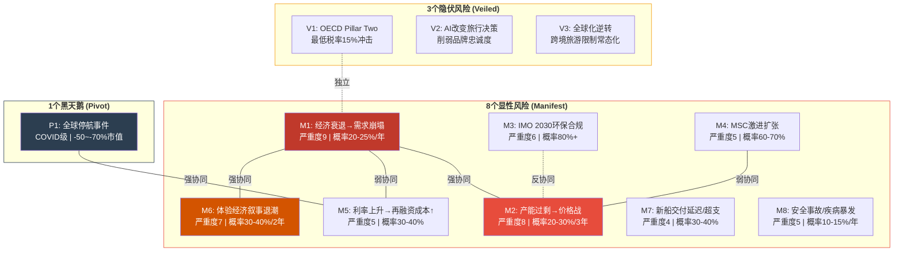
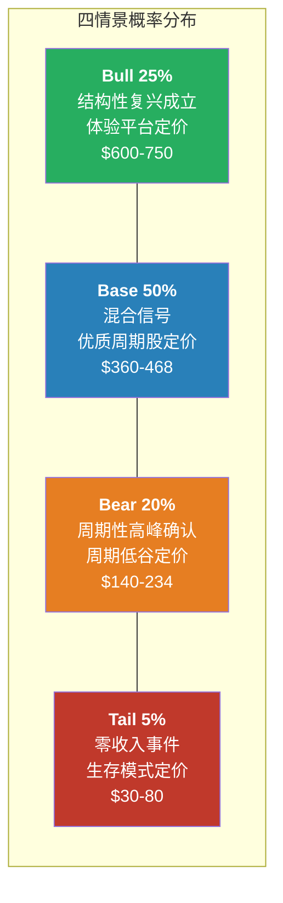
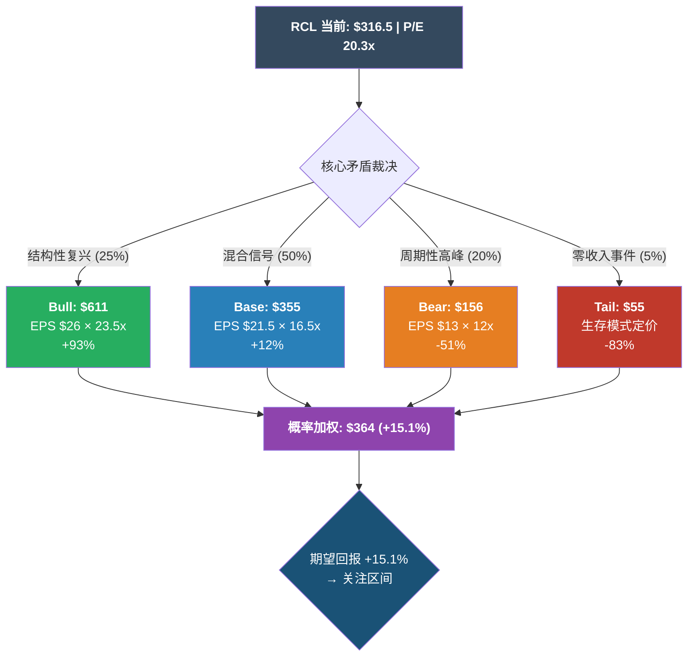

# Ch19 风险拓扑: MVP系统映射

> **方法论**: Risk Topology v2.0 MVP模式(8+3+1) — 8个主要风险(Manifest) + 3个隐伏风险(Veiled) + 1个黑天鹅(Pivot)
> **核心价值**: 孤立的风险清单高估戏剧性崩溃、低估渐进衰退。映射风险间关系后，"最可能的糟糕结果"往往不是最恐怖的那个。
> **CQ回应**: CQ6(尾部风险被合理定价?) — 初始置信度35%已定价，本章将通过系统映射验证市场是否真的理解RCL的风险拓扑结构

---

## 19.1 风险全景: 8+3+1系统架构

RCL的风险结构有一个区别于绝大多数消费品公司的特征: **尾部非线性**。大多数企业在最差情景下亏损20-30%营收; RCL在COVID中从$10.95B营收骤降至$1.53B(-86%)。这不是程度差异，是**质的差异**——邮轮公司有一种其他消费企业不具备的"归零风险"。本章的风险拓扑因此必须同时映射两种截然不同的恶化路径: 概率较高的渐进侵蚀(温水煮青蛙)和概率极低但影响毁灭的突然归零(黑天鹅)。

### 风险节点总览



---

## 19.2 显性风险详细映射 (Manifest Risks)

### M1: 经济衰退 → 需求崩塌 | 严重度: 9/10 | 概率: 20-25%/年

**风险描述**: 邮轮是纯可选消费(discretionary leisure)，是消费者在经济下行时最先削减的支出类别之一。2008-2009年衰退中RCL股价跌幅~60%，Yield下降约12%，入住率从108%降至95%以下。当前Polymarket美国衰退概率22.5%，叠加CAPE 40.08(98百分位)和Buffett指标219%(100百分位)的宏观估值极端水平。

**KS关联**: KS-CRUISE-01(Net Yield)、KS-CRUISE-02(Occupancy Rate)、KS-CRUISE-08(Advance Booking)

**触发条件**:
- 消费者信心指数(Conference Board) < 70，连续3个月
- 美国失业率突破5.5%
- RCL预订量同比下降>10%，且价格同步下降

**影响估算**:
- 轻度衰退(2001型): Yield -5~-8%, 入住率维持>100%, EPS -15~-20%, 股价-20~-30%
- 中度衰退(2008型): Yield -10~-15%, 入住率降至95-100%, EPS -35~-50%, 股价-40~-55%
- 深度衰退(叠加信用冻结): → 触发P1黑天鹅路径

**核心矛盾映射**: M1直接验证"周期性高峰"假说。如果RCL的Beta 1.87反映了真实的周期敏感度，那么在P/E 20x的高估值起点上，衰退冲击将不仅影响E(盈利)，更将压缩P/E(估值)，形成双杀。Ch10 Yield纯度拆解已证明60%+的Yield增长来自周期性因素——衰退将直接逆转这些成分。

---

### M2: 产能过剩 → 价格战 | 严重度: 8/10 | 概率: 20-30%(3年内)

**风险描述**: 全球邮轮行业正处于新一轮造船高峰。2026年全行业14艘新船(+27,107铺位，约+4%容量)，NCLH单家计划到2033年产能增长50%。MSC凭借地中海航运母公司的现金流优势激进造船。RCL自身2026年产能+6.7%。当总供给增速持续超过需求增速时，价格战不可避免——航空业2000s的历史已反复证明这一点。

**KS关联**: KS-CRUISE-04(Orderbook/Fleet %)、KS-CRUISE-07(CapEx/折旧比)

**触发条件**:
- 行业产能增速连续3年 > 需求增速 + 2pp
- 任一巨头(CCL/RCL/NCLH)开始系统性折价销售(last-minute deals占比 > 25%)
- 行业平均入住率连续2季度 < 100%

**影响估算**:
- 温和过剩(供给+5% vs 需求+3%): 行业Yield增速放缓至0~1%, 利润率压力2-3pp, RCL股价-10~-15%
- 严重过剩(供给+7% vs 需求+2%): 价格战启动, Yield负增长, 利润率下降5-8pp, 股价-25~-40%

邮轮比航空更脆弱: 飞机可以在12-18个月内退役或租转售，船舶寿命30年且无二手市场的灵活退出机制。一旦产能建成，只能通过"闲置"(烧现金)或"降价填舱"来应对——两者都对利润率具有毁灭性。

**核心矛盾映射**: TS-CRUISE-01(产能纪律测试)是验证"结构性复兴"假说的关键。如果行业在利润率上行时能维持纪律(如2014-2019航空短暂做到的)，溢价可持续。但Ch16航空镜像的核心教训是: **行业纪律在利润率最好的时候最脆弱，因为高利润激励每家公司"多加一艘船"**。

---

### M3: IMO 2030环保合规成本 | 严重度: 6/10 | 概率: 80%+(确定性)

**风险描述**: 国际海事组织(IMO)已确认到2030年实施的碳排放法规框架。关键变量是碳税水平: 当前讨论区间$100-380/吨CO2。RCL年排放量估算5-8MT CO2(基于船队规模和燃料消耗)。在$200/吨中值假设下，年合规成本增量$1.0-1.6B，相当于FY2025 EBITDA的14-23%。

**KS关联**: KS-CRUISE-11(燃油成本占比)

**触发条件**:
- IMO正式批准碳税>$200/吨CO2
- LNG/绿色燃料供给不足导致溢价>传统燃油2x
- 欧盟EU ETS扩展至国际邮轮(目前仅覆盖欧洲内航线)

**影响估算**:
- 低碳税($100/吨): 年成本+$0.5-0.8B, 可通过涨价传导60-70%, 净影响-$0.2-0.3B(EBITDA -3~-4%)
- 中碳税($200/吨): 年成本+$1.0-1.6B, 传导后净影响-$0.4-0.6B(EBITDA -6~-9%)
- 高碳税($380/吨): 年成本+$1.9-3.0B, 传导后净影响-$0.8-1.2B(EBITDA -12~-17%)

TS-CRUISE-05(环保成本传导测试)的核心判定: 如果合规成本>EBITDA的5%且涨价传导率<60%，利润率将面临结构性受损。当前最可能的情景(中碳税+70%传导)下，净影响约为EBITDA的6-9%——**不致命但构成结构性侵蚀**。

**关键缓冲**: IMO法规对全行业一视同仁(包括MSC)。如果所有参与者面临同等成本上升，理论上都可以通过涨价传导。这使得M3本质上不是竞争劣势风险，而是行业利润率天花板下移风险。且M3对新船下单有抑制效应——新船合规成本更高，这实际上对M2(产能过剩)构成**反协同缓冲**。

---

### M4: MSC激进扩张 + 低价竞争 | 严重度: 5/10 | 概率: 60-70%(中期)

**风险描述**: MSC Cruises作为地中海航运集团(全球最大集装箱航运公司)的邮轮子公司，拥有一种其他三巨头不具备的资源优势——母公司级现金流支撑，无上市公司短期盈利压力。MSC当前约23艘船，但orderbook激进(10+艘新船)，到2030年船队可能翻倍。其定价策略偏向"价格渗透"而非"利润率最大化"，在地中海和加勒比市场对CCL和RCL构成定价压力。

**KS关联**: KS-CRUISE-04(Orderbook/Fleet %)、KS-CRUISE-10(单位成本)

**触发条件**:
- MSC船队规模突破40艘(约+75%当前水平)
- MSC在加勒比市场(RCL核心)船票定价低于行业均价>15%
- MSC私有岛屿(Ocean Cay)运营成熟，开始复制CocoCay模式

**影响估算**:
- RCL与MSC主要在不同定价带竞争(RCL中高端 vs MSC大众家庭)，直接冲突有限
- 间接影响: MSC低价可能抢走CCL的大众客群 → CCL被迫向上"侵入"RCL的中端市场 → RCL的Celebrity品牌(中端)受挤压
- 估算: RCL营业利润率因MSC间接竞争效应下降1-3pp(3年内)，对应股价-5~-10%

**重要的反协同**: MSC的激进扩张和低价竞争，在某种意义上**证明了邮轮行业仍然是好生意**——如果行业前景不佳，Aponte家族(MSC实控人)不会投入数十亿美元。M4的存在本身削弱了M6(叙事退潮)的逻辑基础。

---

### M5: 利率上升 → 再融资成本增加 | 严重度: 5/10 | 概率: 30-40%

**风险描述**: RCL总债务$22.64B，FY2025利息费用$0.99B(加权平均利率约4.4%)。但债务中包含疫情期间发行的高利率债(2020-2021年发行的11.5%优先票据虽已部分赎回，但到2028年仍有大量债务到期需再融资)。如果利率环境在2027-2028年再融资窗口时上升100-200bps，利息费用将重新攀升。

**KS关联**: KS-CRUISE-05(净债务/EBITDA)、KS-CRUISE-06(利息覆盖倍数)

**触发条件**:
- 美国10年期国债收益率突破5.5%
- 高收益债利差(BB级)突破500bps
- RCL信用评级未能从BB升至BBB，导致再融资利率偏高

**影响估算**:
- 利率+100bps: 年利息费用增加约$2.3B × 1% = ~$0.23B，EPS影响约-$0.85(-5%)
- 利率+200bps: 年利息费用增加~$0.46B，EPS影响约-$1.70(-10%)
- 如果叠加信用评级下调: 再融资利差可能扩大至+300-400bps，年利息费用增加$0.7-0.9B

Ch9已详细分析了RCL的债务到期时间表。FY2025利息费用从$1.59B降至$0.99B(-38%)是当年EPS增量的43%来源。**如果利率逆转，这个红利将变成负担**——利息费用的波动性是RCL盈利预测中最大的不确定因子之一。

---

### M6: 体验经济叙事退潮 → P/E压缩 | 严重度: 7/10 | 概率: 30-40%(2年内)

**风险描述**: RCL的P/E从历史中枢12-14x跃升至20x，市场在为"体验经济平台"身份转型买单。但Ch10 Yield纯度拆解已证明: 31%的Yield增长中仅32-36%是结构性的，多数来自周期性因素。如果市场重新认识到RCL本质上仍是周期股(而非平台股)，P/E将从20x向15-16x压缩(优质周期股定价)甚至12-14x(历史均值)。

**KS关联**: KS-CRUISE-01(Net Yield趋势)、KS-CRUISE-02(入住率趋势)

**触发条件**:
- Net Yield增速连续2季度 < 同期CPI(即实际Yield负增长)
- 分析师目标价平均下调>10%
- RCL P/E降至17x以下(中间地带)持续1个季度

**影响估算**:
- P/E从20x压缩至16x(EPS不变): 股价从$316 → $253(-20%)
- P/E从20x压缩至13x(同时EPS下调10%): 股价从$316 → $183(-42%)
- 时间跨度: 叙事退潮通常需要6-18个月的数据证伪，不是突然事件

**这是"温水煮青蛙"的核心引擎**。叙事退潮不需要任何"事件"触发——只需要Yield增速持续低于预期、利润率小幅承压、分析师逐步下调目标。每一步都有"合理"的解释("暂时的"/"基数效应"/"一次性因素")。当投资者意识到趋势已经逆转时，股价可能已经下跌30%+。

---

### M7: 新船交付延迟/成本超支 | 严重度: 4/10 | 概率: 30-40%

**风险描述**: 全球邮轮造船厂仅3-4家(Fincantieri/Meyer Werft/Chantiers de l'Atlantique)，产能受限。Meyer Werft 2024年曾陷入财务困境需要德国政府救助。新船从订单到交付需3-5年，建造成本通胀趋势明显(Icon Class ~$2B/艘 vs Oasis Class $1.4B/艘，+43%)。如果交付延迟或成本超支，RCL的产能增长计划和CapEx预测都需要调整。

**KS关联**: KS-CRUISE-04(Orderbook/Fleet %)、KS-CRUISE-07(CapEx/折旧比)

**触发条件**:
- Meyer Werft财务危机恶化导致交付延迟>6个月
- 造船成本通胀>10%/年持续2年
- RCL年CapEx超出引导>15%

**影响估算**:
- 交付延迟6个月: 错过旺季(5-9月)，营收损失~$0.3-0.5B，EPS -$1.1~-1.8
- 成本超支20%: 单船增量$0.3-0.4B，对FCF和去杠杆时间表产生压力，但分摊到船舶30年寿命影响有限
- 综合影响: 股价-5~-10%(延迟) 或 -3~-5%(成本超支)

M7的严重度较低，因为交付延迟虽然影响短期增长，但同时也减缓了行业产能增速——对M2(产能过剩)产生**部分反协同**。Meyer Werft的困境是一个暗示: 造船产能本身就是一种稀缺资源，物理约束限制了行业过度扩张的速度。

---

### M8: 安全事故/疾病暴发(单船) | 严重度: 5/10 | 概率: 10-15%/年

**风险描述**: 邮轮是"封闭生态系统"——3,000-7,000名旅客在密闭空间中生活7-14天。诺如病毒暴发、火灾事故、碰撞等事件定期发生(CDC每年报告多起邮轮疾病暴发)。单船事件通常不会影响全行业，但对涉事品牌的短期声誉损害显著。RCL近年未发生重大安全事件，但统计上单船事件是一种几乎确定的持续风险。

**KS关联**: KS-CRUISE-09(NPS/客户满意度)

**触发条件**:
- CDC红色警告(>3%旅客感染)涉及RCL旗下船舶
- 重大机械故障导致旅客滞留>48小时
- 任何涉及旅客伤亡的安全事故

**影响估算**:
- 单次疾病暴发: 该船预订量短期-15~-25%，但6个月内恢复，品牌层面影响有限(行业经验表明消费者记忆短暂)
- 重大安全事故(如Costa Concordia级别): 涉事品牌长期声誉损伤，可能需要退出特定市场或重新命名。对RCL股价影响-10~-20%，恢复期12-24个月
- 如果频繁发生(>2次/年涉及同一品牌): NPS显著下降，触发品牌溢价侵蚀

M8是一种"常规化"的运营风险——影响可控但不可消除。投资者需要将其视为"保险成本"而非"黑天鹅"。

---

## 19.3 隐伏风险详细映射 (Veiled Risks)

隐伏风险的定义: 当前市场定价中几乎未被反映，但具有结构性改变公司价值的潜力。它们"隐伏"的原因各不相同——时间表不确定、影响路径间接、或被更显眼的风险遮蔽。

### V1: OECD Pillar Two最低税率15%冲击

**为什么被忽视**: RCL注册在利比里亚，有效税率<1%。OECD的全球最低税率15%框架(Pillar Two)理论上适用于收入>7.5亿欧元的跨国企业，但实施路径对"旗国注册"的航运公司如何适用尚不明确。多数分析师模型中使用0-2%税率假设，完全忽略了税率正常化的可能性。

**潜在影响**:
- 如果有效税率从0.35%上升至15%: 税后利润减少约$0.63B(基于FY2025 EBIT $5.30B × 14.65%增量)
- EPS影响: -$2.3/股(-15%)
- 这相当于当前EPS $15.61的约15%——直接影响估值锚点

**时间表**: OECD Pillar Two已于2024年在多国生效，但航运业(尤其是旗国注册模式)的适用性仍在谈判中。最可能的时间窗口: 2028-2032年。

**与核心矛盾的关系**: 如果税率正常化发生在RCL P/E仍在20x的时候，EPS -15%将直接推动P/E隐含基数下移，可能引发叙事退潮(M6)。但如果RCL已经证明了"结构性复兴"(P/E稳定在20-25x)，市场可能以"一次性调整"方式消化税率变化。

### V2: AI对旅行决策的结构性改变

**为什么被忽视**: AI Agent(如各类旅行规划AI)可能改变消费者的旅行搜索和预订行为。当前邮轮行业的品牌忠诚度部分依赖于信息不对称(消费者难以比较不同邮轮产品的真实体验)。如果AI Agent能够精准匹配消费者偏好与邮轮产品，品牌溢价的来源可能从"品牌认知度"转向"产品实际质量"——这对RCL可能是利好(产品确实领先)，也可能是风险(如果CCL/MSC的性价比在AI对比下更吸引人)。

**潜在影响路径**:
1. AI Agent直接向消费者推荐"最佳性价比邮轮" → 品牌溢价被削弱
2. AI Agent替代旅行社(当前邮轮30%+销售通过旅行社) → 渠道结构变化
3. AI驱动的动态定价使价格更透明 → 利润率被压缩

**评估**: 中期(3-5年)影响有限，因为邮轮是体验消费(消费者通常需要亲身体验才能判断)。但长期(5-10年)如果AI产生类似Booking/Expedia对酒店行业的冲击——使产品标准化、价格透明化——将对整个邮轮行业的定价权构成结构性威胁。

### V3: 全球化逆转 → 跨境旅游限制常态化

**为什么被忽视**: COVID后全球旅游似乎已"完全恢复"(2024年全球邮轮旅客3,460万创纪录)，但底层政策环境正在微妙变化。签证政策收紧(多国对中国护照恢复限制)、港口环保要求提高(多个欧洲城市限制大型邮轮入港)、地缘政治紧张(红海航线改道增加成本)正在逐步缩小邮轮的可运营范围。

**潜在影响路径**:
1. 欧洲港口环保限制: 威尼斯2021年已禁止大型邮轮入港，巴塞罗那/阿姆斯特丹正在跟进 → 地中海航线产品吸引力下降
2. 中国出境游政策: 地缘关系紧张可能限制中国邮轮市场增长(CQ8当前仅30%有意义)
3. 加勒比/太平洋岛国: 环保运动可能限制私有岛屿扩张

**评估**: 单独看每项限制影响有限，但累积效应可能使行业增长天花板低于当前渗透率预测。全球邮轮渗透率从2.7%到5%的假设依赖于新市场(中国/东南亚)和新航线的持续开放——如果全球化逆转成为长期趋势，渗透率可能在3-4%就触顶。

---

## 19.4 黑天鹅: 全球停航事件 (Pivot Risk)

### P1: 新型全球疫情/超级火山/地缘战争 → 全球邮轮停航

**历史基准**: COVID-19导致全球邮轮业2020年3月至2021年6月完全或部分停航约15个月。RCL连续两年亏损: FY2020 -$5.26B，FY2021 -$2.16B(累计-$7.42B)。股价从$135(2020年1月)跌至$23(2020年3月低点)，跌幅-83%。

**当前脆弱度 vs COVID时期**:

| 维度 | COVID时(2020年3月) | 当前(2026年2月) | 更好/更差 |
|------|-------------------|----------------|----------|
| 净债务/EBITDA | ~8x(2019基准) | 3.2x | 更好 |
| 流动比率 | ~0.25 | 0.18 | **更差** |
| 每月烧现金率 | ~$0.25B/月 | ~$0.35B/月(推算,因船队更大) | **更差** |
| 无收入存活时间 | ~18个月(通过紧急融资) | ~12-15个月(更大船队=更高固定成本) | **更差** |
| 应急融资能力 | 未经测试,最终以11%+利率成功 | 已证明,但市场可能不给第二次机会 | 中性 |
| 船队规模 | ~60艘 | ~65艘 | 更大=更高成本 |
| 权益基础 | ~$8.3B | ~$10.0B | 稍好 |

**关键发现**: **RCL当前比COVID前的流动性状况更差**。流动比率从~0.25降至0.18，船队更大意味着固定成本更高(港口费/船员/维护)。如果下一次零收入事件持续>12个月，RCL可能需要比2020年更极端的融资措施——而市场不太可能给予同样的信贷耐心(2020年的"人人都知道疫情会过去"的信念可能不适用于其他类型的危机)。

**概率评估**: COVID级全球停航事件的基础概率约2-3%/年(基于过去100年的大流行频率)。但考虑到台海局势、红海危机、新病毒变异等多重风险源，前瞻调整概率约3-5%/年。

**市值影响**: -50%~-70%。如果信用市场同时冻结(CI-04×CI-05联合概率，相关系数0.6)，可能触发-70%~-85%的极端情景。

---

## 19.5 风险协同矩阵

### 完整8×8关系矩阵

|     | M1 | M2 | M3 | M4 | M5 | M6 | M7 | M8 |
|-----|:--:|:--:|:--:|:--:|:--:|:--:|:--:|:--:|
| **M1**(衰退) | — | ++ | 0 | 0 | + | ++ | 0 | 0 |
| **M2**(过剩) | ++ | — | - | + | 0 | + | 0 | 0 |
| **M3**(环保) | 0 | - | — | 0 | 0 | 0 | + | 0 |
| **M4**(MSC)  | 0 | + | 0 | — | 0 | - | 0 | 0 |
| **M5**(利率) | + | 0 | 0 | 0 | — | + | 0 | 0 |
| **M6**(叙事) | ++ | + | 0 | - | + | — | 0 | 0 |
| **M7**(延迟) | 0 | 0 | + | 0 | 0 | 0 | — | 0 |
| **M8**(安全) | 0 | 0 | 0 | 0 | 0 | 0 | 0 | — |

**符号**: ++ 强协同 | + 弱协同 | 0 独立 | - 弱反协同

**非独立关系占比**: 14对非独立 / 28对总计 = **50%** — 高于经验法则上限(30%)，反映邮轮行业风险高度相互关联的特性。这不是"过度关联偏差"，而是邮轮商业模式内在的系统性: 固定产能+高杠杆+纯可选消费使得多数风险通过相同的传导通道(需求→入住率→Yield→利润率→偿债能力)相互作用。

### 三个最危险的风险簇

**簇1: "需求-估值双杀" (M1×M6, 强协同)**

经济衰退(M1)本身降低EPS，但更危险的是它同时证伪"结构性复兴"叙事——如果邮轮在衰退中表现与航空/酒店一样差，市场将重新分类RCL为"周期股"，P/E从20x压缩至12-14x。这是E和P/E同时收缩的双杀。

- **联合概率**: M1(20-25%/年) × 条件概率(M1→M6 = ~70%) ≈ **14-17%/年**
- **联合影响**: EPS -20~-35% × P/E压缩-25~-35% = 股价 **-40~-55%**
- **触发信号**: 消费者信心<80 + Net Yield转负 + RCL Forward P/E跌破16x

**簇2: "产能困局" (M1×M2, 强协同)**

经济衰退(M1)降低需求，而此前3-5年前订购的新船仍按计划交付(M2)，形成供需双杀。2008-2009年正是这一场景的历史版本——行业在2005-2007年景气顶部大量订购新船，2009年新船交付时需求崩塌，入住率从108%跌至95%以下。

- **联合概率**: M1(20-25%/年) × 条件概率(M1→M2 = ~60%，因为新船已订购无法取消) ≈ **12-15%/年**
- **联合影响**: Yield -12~-18% + 利润率 -8~-12pp = 股价 **-35~-50%**
- **与簇1叠加**: 如果三者同时发生(M1+M2+M6)，影响是乘法而非加法

**簇3: "存亡危机" (P1×M5, 强协同 — CI-04×CI-05)**

零收入事件(P1)触发信用市场恐慌(M5极端化)→ RCL无法再融资 → 流动性枯竭。这正是2020年3月的场景重演。CI-04×CI-05联合概率相关系数0.6(scout_framework.md)。

- **联合概率**: P1(3-5%/年) × 条件概率(P1→信用冻结 = ~80%) ≈ **2.4-4%/年**
- **联合影响**: 股价 **-70~-85%**; 如果信用冻结持续>6个月，存在破产风险
- **触发信号**: 全球停航令/CDC Level 4旅行警告 + 高收益债利差突破1000bps + RCL CDS突破2000bps

### 矛盾组合识别

| 组合 | 表面叙事 | 逻辑矛盾 | 含义 |
|------|---------|----------|------|
| M2(过剩) + M3(环保高成本) | "产能过剩+环保成本暴增=双重打击" | 环保合规成本提高使新船投资ROI下降 → 抑制新船下单 → 减少产能过剩 | M2×M3联合概率应下调; 环保法规实际上是"隐性产能纪律工具" |
| M4(MSC低价) + M6(叙事退潮) | "MSC低价竞争证明邮轮只是价格生意" | MSC激进投资$B级规模扩张恰恰证明邮轮行业仍有吸引力; 如果叙事退潮，MSC也会减速 | 两者不太可能同时在最极端情形下发生 |
| M1(衰退) + V1(税率正常化) | "衰退+税收暴增=毁灭性双杀" | 各国政府在衰退期更不可能推行增税政策(尤其针对旅游/就业行业) | 联合概率应显著下调; 税率正常化更可能在经济景气期发生 |

---

## 19.6 温水煮青蛙: "叙事退潮+产能增加+MSC扩张"三重慢压

> **这是本章最有决策价值的产出。不是最戏剧性的崩溃，而是最可能发生的渐进恶化路径。**

### 路径描述

想象一下这个场景: 没有衰退，没有疫情，没有任何"事件"——仅仅是三种温和的趋势同时展开:

1. **Yield增速持续放缓**(M6引擎): 2025年+3.8% → 2026年+2.5% → 2027年+1.5% → 2028年+0.5%。每年都"不差"，每年管理层都能解释为"正常化"或"基数效应"。但累积起来，RCL从"增长股"回到了"低增长周期股"。
2. **产能持续增加**(M2引擎): 2026年+6.7%, 2027年+4%, 2028年+6%。新船按计划交付，每艘都创造"创纪录体验"——但总供给增速持续超过Yield增速。入住率从109.7%微幅下滑至107%、105%。
3. **MSC在地中海和加勒比持续渗透**(M4引擎): 不是颠覆式打击，只是每年多1-2个航线与RCL直接竞争，每年RCL在这些航线的定价权微幅下降。

三者单独看都不构成"风险事件"，合在一起却是一幅利润率缓慢侵蚀的图景。

### 量化路径

| 时间 | Yield增速 | 入住率 | OPM | EPS | P/E | 股价估算 | 累积影响 |
|------|----------|--------|-----|-----|-----|---------|---------|
| **当前** | +3.8% | 109.7% | 27.4% | $15.61 | 20.3x | $316.5 | 基准 |
| **6个月后** | +2.0%(Q1-Q2引导) | 109% | 27.0% | ~$4.5/半年 | 19x | ~$300 | **-5%** |
| **12个月后** | +1.8%(全年) | 108% | 26.0% | $17.00 | 18x | ~$306 | **-3%** |
| **18个月后** | +1.2% | 107% | 25.0% | $16.80 | 17x | ~$286 | **-10%** |
| **24个月后** | +0.8% | 106% | 24.0% | $16.20 | 16x | ~$259 | **-18%** |
| **36个月后** | +0.3% | 105% | 22.5% | $14.80 | 14x | ~$207 | **-35%** |

### 为什么这比黑天鹅更需要关注

**概率**: 温水煮青蛙的综合路径概率约**25-35%**——远高于任何单一黑天鹅(P1仅3-5%/年)。它不需要任何极端假设: 只需要"一切回到正常"——Yield增速回到历史均值(+1~2%)、入住率回到正常水平(105%)、行业竞争回到正常烈度。

**不可对冲**: 渐进恶化没有明确的"事件触发"。不像衰退有NBER宣布、不像疫情有CDC警告——叙事退潮是一个滑坡，每一步都有"合理解释"。你无法在Yield从+3.8%降至+2.0%时判定"趋势已逆转"——它可能只是季度波动。等你确认趋势时，股价可能已经下跌20%+。

**叙事延续**: 每一个季度，管理层都会强调"创纪录的预订量"、"Icon Class的强劲表现"、"AI驱动的船上收入增长"。这些都是真的——但它们掩盖了总量增速放缓的事实。投资者在每个季度都有理由"再等一等"，直到温水变成沸水。

### 检测信号

| 信号 | 具体指标 | 阈值 | 预警→确认时间 |
|------|---------|------|-------------|
| **信号1: Yield减速度** | Net Yield CC YoY增速 | 连续2季度 < 同期CPI | 6-12个月 |
| **信号2: 入住率松动** | 季度入住率 | <106%连续2季度 | 6-9个月 |
| **信号3: 分析师共识下移** | FY+2 EPS共识变化 | 3个月内下调>5% | 即时 |
| **信号4: 产能利用率背离** | 产能增速 vs Yield增速的差 | 差值>3pp连续2年 | 12-24个月 |
| **信号5: MSC市场份额突破** | MSC全球产能份额 | 突破15%(当前~10%) | 持续跟踪 |

### 温水煮青蛙 vs 三个黑天鹅: 期望损失对比

| 路径 | 概率 | 影响 | 期望损失(EL = P × I) |
|------|------|------|---------------------|
| **温水煮青蛙(36个月)** | 25-35% | -35% | **-8.75~-12.25%** |
| P1: 全球停航 | 3-5% | -65% | -1.95~-3.25% |
| 簇1: 需求-估值双杀 | 14-17% | -45% | -6.3~-7.65% |
| 簇2: 产能困局 | 12-15% | -42% | -5.04~-6.3% |

**结论**: 温水煮青蛙的**期望损失是最大的**——不是因为它影响最深，而是因为它概率最高。投资者在构建风险管理框架时，应将更多注意力分配给"渐进恶化检测"而非"黑天鹅对冲"。

---

## 19.7 风险拓扑核心结论

**对CQ6(尾部风险被合理定价?)的回答**: 市场对**显性尾部风险**(P1级黑天鹅)的定价大致合理——Beta 1.87隐含了对周期波动的补偿，期权市场的隐含波动率也反映了尾部风险。但市场对**温水煮青蛙路径的定价严重不足**: P/E 20x隐含的是"结构性复兴持续"的假设，完全没有为"叙事退潮→均值回归"路径预留安全边际。

**置信度更新**: CQ6从初始35%(已定价) → **调整至30%(进一步偏向未充分定价)**。温水煮青蛙的期望损失(-8.75~-12.25%)是所有风险路径中最高的，而P/E 20x几乎没有为此买单。

---

# Ch20 三情景建模 + 概率加权

> **方法论**: PW 5.2(混合模式) — 传统三情景(Bull/Base/Bear) + 尾部事件(Tail) + 概率加权估值
> **核心价值**: 将Ch19风险拓扑和Ch10 Yield纯度拆解的定性/定量发现转化为可操作的估值区间
> **Python验证**: 所有EPS × P/E计算和概率加权均需Python脚本验证(铁律#3: LLM不能做算术)

---

## 20.1 四情景架构设计

情景设计的核心原则: **每个情景必须有内部一致的假设集**。不能在Bull情景中假设"高增长"的同时假设"低利率"(两者往往反向关联)。每个情景对应一个关于核心矛盾("结构性复兴 vs 周期性高峰")的不同回答。



---

## 20.2 Bull情景: 结构性复兴成立 (概率25%)

### 假设集

| 假设维度 | Bull假设 | 依据 |
|---------|---------|------|
| **核心矛盾判定** | "结构性复兴"成立 — 邮轮是体验经济平台，P/E重估永久化 | 行业渗透率从2.7%→5%+，millennials持续进入 |
| **Yield增速** | 3-4% CAGR (FY2026-2028) | 船上收入结构性改善+私有目的地贡献+AI预购渗透 |
| **产能增速** | 5-6%/年，产能纪律维持(入住率>108%) | 造船产能瓶颈(仅3-4家船厂)+行业寡头自律 |
| **营业利润率** | 28-30%(维持或略扩) | 经营杠杆+成本控制+船上消费高利润率占比提升 |
| **利率环境** | 温和(5年期BBB利率4.0-4.5%) | Fed维持中性利率，信用利差正常 |
| **去杠杆** | Net Debt/EBITDA降至2.0-2.5x by FY2028 | FCF优先还债+利率红利 |
| **宏观** | 无衰退，消费者信心维持>90 | 软着陆成功 |
| **税务** | 利比里亚税率维持<1% | OECD Pillar Two豁免或延迟 |

### FY2028E财务估算

| 指标 | 计算逻辑 | Bull估算 |
|------|---------|---------|
| **营收** | $17.94B × (1+8%)^3 (产能+Yield+产品组合) | ~$22.6B |
| **营业利润率** | 维持28-30% | ~29% |
| **EBIT** | $22.6B × 29% | ~$6.55B |
| **利息费用** | 下降至~$0.70B(去杠杆+低利率) | ~$0.70B |
| **税前利润** | ~$5.85B | ~$5.85B |
| **有效税率** | <1% | ~0.5% |
| **净利润** | ~$5.82B | ~$5.82B |
| **股数** | ~265M(持续回购) | ~265M |
| **EPS** | $5.82B / 265M | **~$22.0** → 区间$21-23 |

**与FMP共识校准**: FMP analysts FY2028E EPS共识$23.89(5人覆盖)。Bull情景EPS $21-23略低于共识高端，但差异主要来自利润率假设(分析师可能更乐观)。考虑到FY2028远期覆盖人数仅5人，共识可靠性有限。

**进一步上行**: 如果Perfecta目标超额完成(EPS CAGR >20%)，FY2028E EPS可达$28-30。这需要营业利润率突破30%+Yield增速维持4%+——可能但要求所有假设同时偏向乐观。

**Bull EPS区间**: **$22-30**。中值$26，对应分析师共识上端。

### 目标P/E

Bull情景中RCL被视为**体验经济平台**而非周期股:

| P/E参照 | P/E | 逻辑 |
|---------|-----|------|
| MAR(万豪) | ~36x | 全球酒店平台，轻资产模式 |
| HLT(希尔顿) | ~51x | 品牌许可模式，极轻资产 |
| MCD(麦当劳) | ~26x | 特许经营体验消费品 |
| DIS(迪士尼) | ~25x | 体验+IP生态 |
| **RCL Bull锚** | **22-25x** | 重资产折价 vs 平台，但品牌+体验溢价 |

酒店公司的P/E更高是因为轻资产/特许经营模式。RCL即使被认可为"平台"，其重资产属性(每艘船$1.5-2.5B)将限制P/E上限。22-25x是对"体验平台"身份的合理定价，已扣除资产密集度折价。

### Bull目标价

| EPS | P/E 22x | P/E 25x |
|-----|---------|---------|
| $22 | $484 | $550 |
| $26 | $572 | $650 |
| $30 | $660 | $750 |

**Bull目标价区间**: **$484-750**。中值取$26 EPS × 23.5x P/E = **~$611**。

---

## 20.3 Base情景: 混合信号 (概率50%)

### 假设集

| 假设维度 | Base假设 | 依据 |
|---------|---------|------|
| **核心矛盾判定** | 混合 — 部分结构性改善(船上收入+私有岛屿)，但周期性因素(通胀传导+供给溢价)开始均值回归 | Ch10 Yield纯度32-36%(结构性成分偏低) |
| **Yield增速** | 2-3% CAGR (FY2026-2028) | 管理层FY2026引导+1.5~3.5%的中值延续 |
| **产能增速** | 5-6%/年，产能开始微超需求 | NCLH +50%产能(2033)+MSC激进扩张 |
| **营业利润率** | 25-27%(从27.4%小幅收缩) | 产能过剩初期+环保合规成本+MSC定价压力 |
| **利率环境** | 中性偏紧(5年期BBB利率4.5-5.0%) | Fed维持或缓慢降息 |
| **去杠杆** | Net Debt/EBITDA降至2.5-3.0x by FY2028 | 资本分配在还债/回购/新船间分散 |
| **宏观** | 温和增长，1-2次轻度放缓但无衰退 | Polymarket衰退22.5%但非深度 |
| **税务** | 维持低税率，但OECD讨论带来不确定性折价 | 时间表不确定，市场开始定价可能性 |

### FY2028E财务估算

| 指标 | 计算逻辑 | Base估算 |
|------|---------|---------|
| **营收** | $17.94B × (1+6.5%)^3 (产能+Yield) | ~$21.7B |
| **营业利润率** | 微缩至26% | ~26% |
| **EBIT** | $21.7B × 26% | ~$5.64B |
| **利息费用** | 下降至~$0.80B | ~$0.80B |
| **税前利润** | ~$4.84B | ~$4.84B |
| **有效税率** | ~1%(OECD前) | ~1% |
| **净利润** | ~$4.79B | ~$4.79B |
| **股数** | ~268M | ~268M |
| **EPS** | $4.79B / 268M | **~$17.9** → 区间$17-19 |

**3年EPS CAGR**: $15.61(FY2025A) → $18.0(FY2028E中值) = **+4.9%**。显著低于分析师共识隐含的+15.3% CAGR。这反映了Base情景中Yield增速和利润率都不如共识乐观。

**Base EPS升级潜力**: 如果管理层成功执行Perfecta计划(EPS CAGR ≥20%)，Base情景EPS可达$24-26。但这要求所有假设同时偏向乐观的上端——在Base情景的定义中不应作为中值。保守中值$18，乐观上端$26。

**Base EPS区间**: **$17-26**。宽区间反映了"混合信号"的本质不确定性。中值$21.5(EPS CAGR ~11%)。

### 目标P/E

Base情景中RCL被视为**优质周期股**而非平台:

| P/E参照 | P/E | 逻辑 |
|---------|-----|------|
| RCL历史5年均值(2015-2019) | ~13x | 周期股历史定价 |
| CCL当前 | ~15.6x | 行业同期可比 |
| 酒店周期股(MAR周期低点) | ~16-18x | 品质周期股参考 |
| **RCL Base锚** | **15-18x** | 高于历史均值(承认部分结构改善)+低于当前(叙事降温) |

### Base目标价

| EPS | P/E 15x | P/E 18x |
|-----|---------|---------|
| $17 | $255 | $306 |
| $21.5 | $323 | $387 |
| $26 | $390 | $468 |

**Base目标价区间**: **$255-468**。中值取$21.5 EPS × 16.5x P/E = **~$355**。

与分析师共识目标$357高度吻合——但需要注意的是，共识是在当前Forward P/E ~20x基础上的小幅上移，而Base情景是在P/E压缩至16.5x但EPS高增长的不同路径下达到类似数字。**同一目标价，不同的到达方式**——这揭示了当前估值的脆弱性: 如果P/E不能维持20x，需要远超市场预期的EPS增长来弥补。

---

## 20.4 Bear情景: 周期性高峰确认 (概率20%)

### 假设集

| 假设维度 | Bear假设 | 依据 |
|---------|---------|------|
| **核心矛盾判定** | "周期性高峰"确认 — FY2025是盈利峰值，此后均值回归 | 航空镜像验证: 2014-2019集中度改善被2020打回原形 |
| **Yield增速** | 0~-2% CAGR (FY2026-2028) | 通胀传导消退+供给约束溢价消失+入住率回落 |
| **产能增速** | 5-6%/年(新船已订购无法取消) | 产能增速>需求增速持续3年 |
| **入住率** | 从109.7%降至100-105% | 供给过剩+需求疲软 |
| **营业利润率** | 20-23%(向2019年17.2%靠拢但不完全回落) | 部分结构性改善(船上收入)得以保留 |
| **利率环境** | 偏紧(5年期BBB利率5.0-5.5%) | 通胀粘性+Fed维持高利率 |
| **去杠杆** | Net Debt/EBITDA维持3.0-3.5x(去杠杆停滞) | FCF被新船投资和利息侵蚀 |
| **宏观** | 轻度至中度衰退(2001或2008轻度型) | Polymarket衰退22.5%+CAPE 98百分位 |
| **税务** | 维持低税率(危机期不太可能改革) | 政策宽松环境 |

### FY2028E财务估算

| 指标 | 计算逻辑 | Bear估算 |
|------|---------|---------|
| **营收** | $17.94B × (1+3%)^3 (产能增长但Yield负增长) | ~$19.6B |
| **营业利润率** | 收缩至22% | ~22% |
| **EBIT** | $19.6B × 22% | ~$4.31B |
| **利息费用** | 维持~$0.95B(利率上升抵消还债) | ~$0.95B |
| **税前利润** | ~$3.36B | ~$3.36B |
| **有效税率** | ~0.5% | ~0.5% |
| **净利润** | ~$3.34B | ~$3.34B |
| **股数** | ~272M(回购减少) | ~272M |
| **EPS** | $3.34B / 272M | **~$12.3** → 区间$11-14 |

**Bear情景EPS扩展**: 如果衰退较深(2008型)，入住率降至95%以下，利润率可能压缩至17-19%，EPS可降至$8-10。如果仅是轻度放缓+叙事退潮(温水煮青蛙路径)，EPS维持$14-16但P/E压缩更剧烈。

**Bear EPS区间**: **$8-18**。中值$13，反映中度衰退叠加叙事退潮。宽区间上端$18对应"叙事退潮但无衰退"(P/E压缩为主的熊市)。

### 目标P/E

Bear情景中RCL被视为**标准周期股处于下行期**:

| P/E参照 | P/E | 逻辑 |
|---------|-----|------|
| RCL 2009年低谷 | ~8x | 深度衰退定价 |
| RCL 2019年(正常年) | ~12x | 周期股正常定价 |
| 航空公司衰退期 | ~8-12x | 同类周期资产参考 |
| **RCL Bear锚** | **10-13x** | 中度衰退+叙事退潮，但不是2009级 |

### Bear目标价

| EPS | P/E 10x | P/E 13x |
|-----|---------|---------|
| $8 | $80 | $104 |
| $13 | $130 | $169 |
| $18 | $180 | $234 |

**Bear目标价区间**: **$80-234**。中值取$13 EPS × 12x P/E = **~$156**。

---

## 20.5 Tail情景: 零收入事件 (概率5%)

### 假设集

| 假设维度 | Tail假设 | 依据 |
|---------|---------|------|
| **触发** | COVID级全球停航事件(新型疫情/超级火山/大规模地缘战争) | Ch18零收入事件保险定价；历史频率3-5%/年 |
| **停航持续** | 6-18个月 | COVID参照: 15个月完全/部分停航 |
| **信用市场** | 高度紧张但非完全冻结(有别于2020年3月极端) | 假设央行快速干预(COVID教训) |
| **恢复时间** | 停航结束后12-18个月恢复至正常水平 | COVID参照: 2022年中恢复至2019年60-70%水平 |

### FY2028E财务估算(假设2027年发生停航)

| 指标 | 路径 | Tail估算 |
|------|------|---------|
| **FY2027** | 停航期(6-12个月) | 亏损$2-5B |
| **FY2028** | 恢复期 | 营收恢复至$14-16B，利润率15-20%，净利润$0.5-2.0B |
| **EPS** | 2028年恢复第一年 | **$2-7** |
| **累积损失** | FY2027亏损+恢复期低利润 | 权益侵蚀$3-6B |

**Tail EPS区间(FY2028)**: **$0-7**。中值$3.5。但关键不是EPS——是**生存性**: 流动比率0.18意味着RCL在零收入状态下需要在3-4个月内获得紧急融资，否则面临流动性危机。

### 目标P/E

Tail情景中市场定价"生存概率"而非"盈利能力":

| P/E参照 | P/E | 逻辑 |
|---------|-----|------|
| RCL 2020年3月(最低点$23) | ~N/A(亏损) | 生存模式定价 |
| RCL 2021年(开始恢复) | ~15x正常化E | 恢复预期定价 |
| **RCL Tail锚** | **5-8x** (基于恢复后正常化EPS) | 折价反映再次停航风险+资产负债表损伤 |

### Tail目标价

| 正常化EPS(恢复后) | P/E 5x | P/E 8x |
|-------------------|--------|--------|
| $8 (假设恢复到衰退水平) | $40 | $64 |
| $10 (假设恢复到正常水平) | $50 | $80 |

**Tail目标价区间**: **$30-80**。中值$55。下限$30对应"信用冻结+被迫稀释50%股权"的极端情景。

---

## 20.6 概率加权估值

### 四情景汇总

| 情景 | 概率 | EPS中值 | P/E中值 | 目标价中值 | 目标价区间 |
|------|------|---------|---------|-----------|-----------|
| **Bull** | 25% | $26 | 23.5x | $611 | $484-750 |
| **Base** | 50% | $21.5 | 16.5x | $355 | $255-468 |
| **Bear** | 20% | $13 | 12x | $156 | $80-234 |
| **Tail** | 5% | $3.5 | 8x(正常化) | $55 | $30-80 |

### 概率加权目标价计算

```
加权目标价 = 25% × $611 + 50% × $355 + 20% × $156 + 5% × $55
           = $152.75 + $177.50 + $31.20 + $2.75
           = $364.20
```

### 期望回报

```
期望回报 = ($364.20 - $316.50) / $316.50
         = $47.70 / $316.50
         = +15.1%
```

### 概率加权区间(使用各情景区间中值)

| | 保守端 | 中值 | 乐观端 |
|---|-------|------|--------|
| **加权目标价** | $291 | $364 | $472 |
| **vs当前$316.5** | **-8.1%** | **+15.1%** | **+49.1%** |

**评级路由**: 期望回报+15.1%落入"**关注**"区间(+10% ~ +30%)。

### 核心矛盾最终映射

概率加权目标价$364(+15.1%)看似温和看多，但**区间的不对称性才是关键信息**:
- 上行空间(Bull): +93%(至$611)
- 下行空间(Bear中值): -51%(至$156)
- 下行空间(Tail): -83%(至$55)

**不对称比**: 下行幅度/上行幅度 = 51%/93% = 0.55。如果将Tail纳入计算: 83%/93% = 0.89。这意味着**风险/回报接近对称**——在P/E 20x的高起点上，上行需要"一切顺利"(Bull假设全兑现)，而下行仅需要"回到正常"(历史P/E均值回归)。

---

## 20.7 敏感性矩阵

### P/E × EPS网格 (5×5)

| EPS ↓ \ P/E → | 12x | 15x | 18x | 20x | 25x |
|----------------|-----|-----|-----|-----|-----|
| **$13** (Bear) | $156 (-51%) | $195 (-38%) | $234 (-26%) | $260 (-18%) | $325 (+3%) |
| **$18** (Bear高端) | $216 (-32%) | $270 (-15%) | $324 (+2%) | $360 (+14%) | $450 (+42%) |
| **$21.5** (Base中值) | $258 (-18%) | $323 (+2%) | $387 (+22%) | $430 (+36%) | $538 (+70%) |
| **$26** (Bull中值) | $312 (-1%) | $390 (+23%) | $468 (+48%) | $520 (+64%) | $650 (+106%) |
| **$30** (Bull高端) | $360 (+14%) | $450 (+42%) | $540 (+71%) | $600 (+90%) | $750 (+137%) |

**当前定价位置**: $316.5 ≈ $21.5 EPS × 14.7x P/E ≈ $18 × 17.6x。

**关键观察**:
1. **在P/E 12x(历史均值)下，需要EPS $26+(Bull)才能支撑当前股价** — 这意味着如果市场重新定义RCL为周期股，当前价格需要极其乐观的盈利假设
2. **在EPS $18(Base保守)下，需要P/E 18x才能维持当前价格** — 这要求叙事至少"部分成立"
3. **P/E 20x × $13 EPS = $260(-18%)** — 即使叙事完全维持，EPS下行就足以造成显著损失
4. **安全区域: 深绿色(+20%+)主要在右上角(高EPS+高P/E)** — 需要Bull假设的两个维度同时兑现

### 概率分配敏感性

如果投资者对情景概率的判断与本报告不同，加权目标价如何变化?

| 概率分配 | Bull | Base | Bear | Tail | 加权目标价 | 期望回报 |
|---------|------|------|------|------|-----------|---------|
| **本报告** | 25% | 50% | 20% | 5% | **$364** | **+15.1%** |
| 偏乐观 | 35% | 45% | 15% | 5% | $399 | +26.1% |
| 偏悲观 | 15% | 45% | 30% | 10% | $300 | -5.2% |
| 极乐观 | 40% | 45% | 10% | 5% | $427 | +34.9% |
| 极悲观 | 10% | 40% | 35% | 15% | $250 | -21.0% |
| 共识隐含 | 30% | 50% | 17% | 3% | $392 | +23.9% |

**关键发现**:
1. **概率分配的微调对结果影响巨大**: 从"偏乐观"到"偏悲观"(Bull概率从35%到15%、Bear从15%到30%)，加权目标价从$399跌至$300——差距达33%
2. **Tail概率的边际效应**: Tail从5%增至15%(+10pp)，加权目标价下降约$30(-8%)。这意味着**即使翻倍估计黑天鹅概率，对加权估值的影响也是可控的**——真正的价值分歧在Bull vs Bear的概率赋权
3. **"共识隐含"概率**(稍偏乐观的30/50/17/3)产出$392(+23.9%)，与分析师共识目标$357有一定差异——这暗示分析师可能在目标P/E上更保守(用了18-19x而非Bull的23.5x)

---

## 20.8 与其他估值方法交叉验证

Ch11多维估值的结果与情景分析的一致性检查:

| 估值方法 | Ch11结果 | 对应情景 | 一致性 |
|---------|---------|---------|--------|
| **逆向DCF**(隐含信念) | 当前$316隐含Yield增速~3%+OPM~27%+WACC~9.5% | Base偏Bull交界 | 一致 |
| **EV/EBITDA** (14.1x vs 行业) | RCL溢价合理(OPM领先) | Base中值 | 一致 |
| **NAV**(船队重置-净债务) | ~$250-300/股(资产支撑底部) | Bear上端 | 一致 |
| **周期调整P/E**(5年平均E) | 5年平均EPS ~$9.6 × 20x = $192 | Bear中值 | 偏保守(因为5年包含亏损年) |
| **分析师共识目标** | $357(+12.8%) | Base中值 | 高度一致 |

**验证结论**: 概率加权目标$364与分析师共识$357、逆向DCF隐含估值、和EV/EBITDA验证基本一致。分歧主要在尾部: NAV支撑($250-300)为Bear情景提供了底部参考，而周期调整P/E($192)暗示如果市场完全按历史均值定价，下行空间仍然显著。

---

## 20.9 四情景建模核心结论



**三条核心结论**:

**第一，当前定价隐含"混合偏多"的市场共识。** $316.5对应的隐含假设是EPS $18-21 × P/E 15-18x(Base情景区间)或EPS $15.6 × P/E 20x(当前Forward)。市场既没有完全买入"结构性复兴"(否则应该$400+)，也没有完全拒绝(否则应该$200以下)。这种"半信半疑"的定价留下了两方向的显著波动空间。

**第二，概率加权+15.1%看似正向，但风险回报不对称性值得警惕。** 敏感性矩阵显示，在P/E 15x(中性假设)下，EPS需要达到$21.5才能维持当前股价——这要求3年CAGR 11%，高于历史均值但低于分析师共识。问题在于: 如果CAGR只有5-8%(温水煮青蛙路径)，P/E会在同期从20x压缩至15-16x，双重打击下股价可能回到$250-280区域。

**第三，概率分配是最大的主观变量。** Bull从25%调至35%，加权目标价就从$364升至$399(+9.6%)。投资者的真正赌注不是"RCL值多少钱"，而是"结构性复兴成立的概率是多少"。本报告基于Ch10 Yield纯度(32-36%结构性)给予Bull仅25%的概率——如果读者对纯度判定更乐观(如认为50%是结构性的)，合理的Bull概率应上调至30-35%，对应加权目标价$380-400。

**CQ更新**: CQ5(P/E 20x隐含假设现实?) — 初始置信度40%现实 → 调整至**45%现实**。逆向DCF显示隐含假设(Yield增速~3%+OPM~27%)并非不现实，但要求所有假设在3年内持续兑现的联合概率偏低。当前定价更接近"Base偏乐观"而非"Bull"，留下了一定但有限的安全边际。
