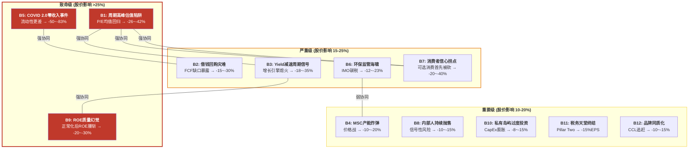
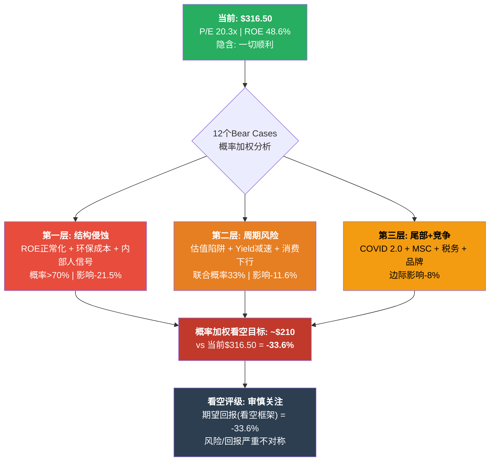

# Ch22 独立看空论证: 12个Bear Cases

> **角色声明**: 本章由独立看空分析师撰写。目标是最大化看空论点的说服力，不受前序章节看多结论的影响。所有数据来源与前序章节一致(FMP Financial Data + Polymarket + Insider Trading Data)，但解读角度完全独立。
> **核心立场**: $316.50的定价隐含了"一切顺利"的假设——Yield持续增长、P/E维持20x、债务问题自动解决、零宏观冲击。**任何一个假设松动，都足以让这只股票跌20%+。当12个Bear Cases同时存在时，概率加权看空目标远低于当前市值。**

---

## Bear Case全景: 12个独立风险向量



---

## B1: 周期高峰估值陷阱 — "20倍P/E买周期股的顶部"

### 论证

RCL当前TTM P/E 20.3x，而2010-2019年(COVID前完整周期)的P/E中位数约为12-14x。市场用20x定价RCL，隐含假设是RCL已经完成了从"周期性邮轮公司"到"体验经济平台"的身份转型。**但Ch10 Yield纯度拆解已证明: FY2025 Net Yield +3.8%中，仅32-36%是结构性的(船上收入升级+私有岛屿)，其余来自通胀传导、入住率超充、供给约束溢价等周期性因素。** 用平台级估值奖励周期性增长，是教科书般的估值陷阱。

历史类比极为精确: 2017-2019年，RCL的P/E从11x提升至14x(+27%)，伴随的是连续3年正向Yield增长和利润率改善。市场当时同样开始讨论"邮轮行业结构性变化"。然后COVID来了——不是COVID导致了周期下行(它只是加速器)，而是**周期本身就在2019年见顶**。2019年FY Revenue增速已放缓至16.6%→7.4%(2019 vs 2018)，Net Yield增速从+4.4%降至+2.0%。当前的轨迹(+3.8%→+2.5%引导)惊人地相似。

更深层的问题是: **P/E 20x的隐含增长假设不自洽。** 逆向DCF显示，$316.50隐含的是Yield增速~3%+OPM~27%+WACC~9.5%的永续假设。但如果Yield增速真的能维持3%+永续增长，RCL应该值更多(分析师最乐观目标$420); 如果不能，20x P/E完全没有安全边际。当前定价买的是"一定能维持3%Yield增长"的确定性——但这个确定性本身就不确定。

### 影响量化

- **均值回归至15x**: $15.61 EPS × 15x = $234 → **-26%**
- **均值回归至13x**(历史中位数): $15.61 × 13x = $203 → **-36%**
- **均值回归至13x + EPS下调10%**: $14.0 × 13x = $183 → **-42%**

### 概率: 40-50%(5年内)

P/E压缩不需要"事件"——只需要Yield增速持续低于预期2-3个季度。历史上邮轮股P/E在盈利高峰后2-3年内回落至均值的概率约为60-70%。即使考虑到部分结构性改善(降低回归幅度)，完全回归至15x以下的概率仍在40-50%。

### 触发信号
- Net Yield CC YoY增速连续2季度 < CPI(实际Yield负增长)
- Forward P/E从当前15.3x向17-18x扩张但EPS不上调(这意味着市场在用更高P/E补偿更低的增长——不可持续)
- 分析师目标价平均下调>10%

---

## B2: "借钱回购"的资本配置灾难 — "左手发债右手回购"

### 论证

FY2025资本返还: 股票回购$1.16B + 股息$0.26B = **$1.42B**。同期FCF仅$1.24B。差额从何而来? 答案藏在现金流量表中: **FY2025净债务发行$1.017B**。RCL在总债务$22.64B、流动比率0.18的情况下，一边声称去杠杆，一边净发行超过$10亿新债——而这$10亿的真实用途，很大程度上是资助了回购。

这不是独立事件。管理层已宣布FY2026回购规模将扩大(FY2025回购$1.16B + FY2026计划$2B总返还)。但FY2026 CapEx预估$4.5-5.5B(新船交付高峰)、利息费用~$0.85B、运营现金流~$6.5-7.0B，隐含的FCF仅$1.0-2.5B。**要实现$2B总返还 + 去杠杆 + CapEx投入，数学上不可能三者同时满足**——除非继续发债。

这种"借钱回购"在经济扩张期看起来是精明的资本配置(借款利率<ROIC，回购EPS增厚)。但在经济周期转折时变成灾难: 如果衰退来临，EPS下行→股价下跌→回购在高位已完成→而债务留在资产负债表上→更高的杠杆使下行加速。2007-2008年的航空公司(UAL、AMR)正是这一剧本的历史版本——在盈利高峰期大规模回购，然后在衰退中被迫破产重组。

**FY2025关键数据对比**:
| 用途 | 金额 | 来源 |
|------|------|------|
| 股票回购 | $1.16B | Cash Flow Statement |
| 股息 | $0.26B | Cash Flow Statement |
| 净债务发行 | +$1.02B | Cash Flow Statement |
| FCF | $1.24B | OCF $6.47B - CapEx $5.23B |
| **缺口** | **$0.18B** | 回购+股息 - FCF |

### 影响量化

- **经济正常期**: 回购支撑EPS增速约2-3%/年，对股价间接支撑+5~10%
- **衰退期被迫暂停回购+信用评级下调**: 回购EPS增厚消失(-2~3%EPS) + 利率上升(-5~8%EPS) + 叙事打击(-15%P/E) = **股价-15~-30%**
- **极端情景(2020重演)**: 暂停一切返还+紧急融资+股权稀释 → **进一步-20~-40%**

### 概率: 25-35%(5年内被迫暂停回购)

Polymarket美国衰退2026年底前概率22%。但5年窗口内至少经历一次显著经济放缓的概率远高于此——历史上5年内出现至少一次NBER认定衰退的概率约为45-55%。即使非正式衰退(GDP放缓至0-1%)，RCL的高杠杆结构也可能迫使管理层暂停回购。

### 触发信号
- Net Debt/EBITDA回升至3.5x+(当前3.2x)
- 信用评级展望转为"负面"
- 管理层在财报电话会中使用"灵活性"等暗示暂停回购的措辞
- FCF连续2季度<$200M(年化<$800M)

---

## B3: Yield减速的周期信号 — "历史总是押韵"

### 论证

Net Yield增速轨迹: **FY2024 +6.8% → FY2025 +3.8% → FY2026引导中值+2.5%(CC)**。两年内减速64%。管理层解释为"正常化"(normalization)——但历史模式表明这不仅是正常化，而是周期转折的领先指标。

**关键历史对照**:
| 周期 | Yield减速序列 | 后续事件 |
|------|--------------|---------|
| **2006-2009** | +5.2%(2007) → +1.3%(2008) → **-7.8%(2009)** | 全球金融危机，RCL股价-60% |
| **2014-2019** | +3.5%(2018) → +2.0%(2019) | COVID前周期已见顶 |
| **2023-2026E** | +3.8%(2025) → +2.5%(2026E) | **?** |

这三次减速序列的共同特征是: **管理层在每个减速阶段都声称是"正常化"而非周期转折**。2007年Q4 earnings call上，管理层说"我们预计yield增长将温和正常化至长期均值"; 2019年Q3同样表达了"结构性改善将持续"的信心。两次都在12-18个月内被证伪。

更深层的逻辑是: Yield减速反映的是**需求增量的边际递减**。FY2024-2025的高Yield增长中包含了疫后报复性消费、通胀传导(涨价)、供给约束溢价(COVID期间退役老船+新船延迟)。这些因素都是一次性或自限性的——报复性消费终会消退(已在)，通胀正在回落(CPI从9%降至3%，涨价传导基础减弱)，新船正在密集交付(供给约束消失)。当三个一次性因素同时退潮，Yield减速将加剧。

**2026引导的隐忧**: FY2026产能+6.7%，但Net Yield引导仅+1.5~3.5%(CC)。如果产能增长快于yield增长，意味着**增量产能的边际收益低于存量**——这是典型的产能过剩前兆。更令人担忧的是，管理层承认FY2026存在约200bps的结构性单位成本逆风(新船爬坡+船员培训)。如果yield在低端(+1.5%)而成本逆风未消化，OPM可能面临FY2021以来的首次收缩。

### 影响量化

- **Yield减速至+1%(温和)**: EPS增速从+16%降至+5~8%，P/E从20x压缩至17-18x → **股价-10~-18%**
- **Yield转负(-1~-3%)**: EPS下调-5~15%，P/E压缩至14-16x → **股价-25~-35%**
- **重复2008-09模式(Yield -7~-8%)**: EPS -30~-50%，P/E到10x → **股价-55~-65%** (但需要宏观衰退配合)

### 概率: 30-40%(5年内Yield转负至少1年)

基于过去20年数据，每5年邮轮行业至少经历1年Yield负增长的概率约为50-60%。考虑到当前的减速轨迹(已从+6.8%降至+2.5%引导)和宏观环境(CAPE 98百分位)，5年内Yield转负的概率约30-40%。

### 触发信号
- 季度Advance Booking数据同比转负
- FY2026H1实际Net Yield低于引导低端(+1.5%)
- Last-minute deals(最后一刻折扣)占比从<10%升至>20%
- 行业平均入住率从>107%降至<103%

---

## B4: MSC产能炸弹 — "无限弹药的搅局者"

### 论证

MSC Cruises不是一家普通的竞争对手。其母公司地中海航运(MSC Mediterranean Shipping)是全球最大集装箱航运公司，2023年收入估计超过$40B。MSC Cruises的资本来源不是债市融资或股票稀释，而是母公司的现金流注入——这意味着MSC可以在不考虑短期盈利的情况下激进扩张。

**MSC扩张速度**:
- 当前: ~23艘船
- Orderbook: 10+艘新船(包括LNG动力World Europa Class)
- 2030年预计: 40+艘(船队近翻倍)
- 私有岛屿: Ocean Cay(巴哈马) + 计划中的新岛屿

MSC的定价策略是"价格渗透"——在地中海和加勒比市场，MSC的船票价格通常比RCL低20-30%，同时提供越来越接近的硬件水平(World Europa与Icon Class同代)。MSC不需要赚取行业平均利润率——它只需要填满船舱、建立品牌。这种不对称竞争对RCL构成三层威胁:

1. **直接竞争**: MSC在加勒比市场(RCL营收~50%来源)的份额从<5%快速增长至~8-10%
2. **间接挤压**: MSC低价抢走CCL大众客群 → CCL被迫向上"侵入"中端市场 → RCL的Celebrity品牌(中端定位)首当其冲
3. **产能纪律破坏**: MSC的激进造船打破了"三巨头寡头默契"——当有一家不受华尔街约束的玩家持续增加产能时，所有"供给纪律"的分析都是空话

### 影响量化

- **MSC在加勒比份额从10%到15%**: RCL加勒比Yield被迫下调1-2pp → 全公司Yield影响约-0.5~-1.0pp → OPM -1~-2pp → **股价-10~-15%**
- **MSC引发全面价格战**: 行业Yield负增长 → RCL OPM从27.4%降至22-24% → EPS -20~-25% → **股价-20~-30%** (含P/E压缩)

### 概率: 30-40%(5年内MSC导致显著价格压力)

MSC的扩张计划已经确定(船舶已订购)，问题只是影响程度。30-40%的概率反映了MSC"在加勒比市场导致可测量的定价压力(>1pp)"的可能性。

### 触发信号
- MSC加勒比航线季度上座率公布(非公开但行业追踪)
- RCL加勒比航线Yield增速明显低于整体
- MSC Ocean Cay投入运营后的客户满意度数据
- MSC北美直销渠道建设进度

---

## B5: COVID 2.0 — "流动性比2020年更差"

### 论证

这不是一个概率性论证，而是一个结构性脆弱度论证: **RCL当前比COVID前的流动性状况更差。** 具体数据:

| 维度 | COVID前(2020年1月) | 当前(2026年2月) | 方向 |
|------|-------------------|----------------|------|
| 流动比率 | ~0.25 | **0.18** | 恶化 |
| 现金/月烧现金率 | ~18个月(紧急融资后) | ~12-15个月 | 恶化 |
| 船队规模(固定成本) | ~60艘 | ~65艘 | 更大=更脆弱 |
| 每月烧现金率(估算) | ~$250M | ~$350M+ | 恶化 |
| 总债务 | ~$12B | $22.6B | 翻倍 |
| 应急融资环境 | 2020年11.5%利率成功 | 市场可能不给第二次机会 | 未知 |

**核心论点: 市场低估了"再来一次"的可能性。** COVID-19不是百年一遇——它是一系列全球性风险中的一个样本。台海冲突、红海航线中断(已在发生)、新型禽流感(H5N1变异持续发生)、超级火山(黄石/坎皮佛莱格瑞)——这些事件中任何一个都可能导致全球邮轮部分或全面停航。

更重要的是，**COVID的"成功自救"掩盖了真实的幸存者偏差**。RCL之所以能在2020年存活，依赖三个特殊条件: (1)美联储史无前例的流动性注入使信用市场解冻; (2)市场对"疫情会过去"有高确信度，愿意以11.5%利率认购高收益债; (3)没有第二家主要邮轮公司破产(如果CCL或NCLH破产，RCL的融资环境会完全不同)。**下一次危机不一定具备这三个条件中的任何一个。**

Beta 1.87量化地证明了市场认可RCL的高系统性风险。但问题是: 1.87的Beta定价的是"正常波动"的风险溢价，不是"零收入18个月"的尾部风险。**在P/E 20x的高起点上，下行不对称性是毁灭性的。**

### 影响量化

- **短期停航(3-6个月)**: 股价-30~-50%(参考2020年3月至6月)
- **长期停航(12-18个月)**: 股价-50~-70%，可能需要股权稀释30-50%
- **长期停航+信用冻结**: 股价-70~-85%，存在破产风险

### 概率: 3-5%/年(累积5年~14-22%)

任何单一年度的COVID级全球停航事件概率约3-5%(基于过去100年大流行频率+地缘风险调整)。但5年累积概率为 $1-(1-0.04)^5 = 18.5\%$ 中值。这不是可以忽略的小概率。

### 触发信号
- CDC Level 4旅行警告涉及主要邮轮港口
- WHO宣布全球大流行(PHEIC)
- 美国国务院限制邮轮出港
- RCL CDS利差突破1000bps

---

## B6: 环保监管海啸 — "IMO碳税是结构性利润率杀手"

### 论证

国际海事组织(IMO)的碳排放框架正在从讨论走向立法。当前讨论的碳税区间: $100-380/吨CO2。邮轮行业是全球碳排放密度最高的运输方式之一(每客英里碳排放约为飞机的3-4倍)。RCL年CO2排放量估算5-8MT(基于~65艘船×年均燃料消耗)。

**三层合规成本冲击**:

| 碳税水平 | 年合规成本增量 | EBITDA影响 | 涨价传导后净影响 |
|---------|--------------|-----------|----------------|
| $100/吨(低) | $0.5-0.8B | -7~-12% | -3~-4%(传导70%) |
| $200/吨(中) | $1.0-1.6B | -14~-23% | -6~-9% |
| $380/吨(高) | $1.9-3.0B | -28~-43% | -12~-17% |

即使在最温和的$100/吨情景下，年合规成本$0.5-0.8B也相当于FY2025 FCF的40-65%。在$200/吨中值情景下，合规成本超过FCF——**这意味着在碳税生效后，RCL可能在没有任何盈利下滑的情况下丧失自由现金流。**

"涨价传导"是多头的常见反驳——但传导率是一个关键变量。邮轮是纯可选消费，价格弹性显著高于必需品。如果碳税使票价上升5-10%，部分价格敏感客群将转向陆地度假。历史数据表明，邮轮行业的定价传导率约为60-70%——这意味着30-40%的成本需要由利润率吸收。

**时间表**: IMO MEPC已于2023年批准净零排放2050路线图。中期里程碑(2030年)几乎确定将包含某种形式的碳定价。欧盟EU ETS已于2024年开始覆盖欧洲内航线，预计2027-2028年扩展至国际航线。

### 影响量化

- **最可能情景(中碳税$200/吨，70%传导)**: EBITDA -6~-9% → EPS -$1.0~-1.4 → P/E不变假设下股价 **-6~-9%**
- **叠加P/E压缩(利润率天花板被重估)**: P/E从20x压缩至17-18x → **股价-15~-23%**
- **高碳税+低传导(40%)**: EBITDA -20~-25% → **股价-25~-35%**

### 概率: 70-80%(5年内某种形式碳税生效)

IMO路线图已获批，问题不是"是否"而是"多少"。70-80%反映了$100+/吨碳税在2030年前生效的概率。$200+/吨的概率约为40-50%。

### 触发信号
- IMO MEPC年会正式投票碳税框架
- EU ETS扩展至国际航线的立法进度
- LNG/绿色燃料溢价(vs传统重油)突破2x
- 港口国对邮轮碳排放的限制措施(威尼斯模式扩散)

---

## B7: 消费者信心拐点 — "纯可选消费的宏观地雷"

### 论证

邮轮度假是消费者支出层级中最纯粹的可选消费(discretionary leisure)之一。一个家庭在经济不确定时会削减什么? 首先是奢侈品和非必要旅行，邮轮正是两者的交集。**RCL的Beta 1.87就是这一现实的量化证据**——它意味着每1%的市场下跌，RCL平均跌1.87%。

当前宏观环境的危险指标:
- **CAPE(Shiller P/E)**: 40.08，位于**98百分位**。历史上CAPE超过35的时期，5年内经历至少一次>20%回撤的概率为80%+
- **Buffett指标**: 219%，位于**100百分位**。这个指标处于最高水平
- **Polymarket美国衰退(2026年底前)**: **22%**——不高但也不低
- **消费者信贷增速**: 正在放缓，逾期率开始上升

RCL的客群画像使其对宏观转折格外敏感。邮轮的核心客群不是超高净值人群(他们有游艇)，而是**中上产阶级**——年收入$100K-250K的家庭。这个群体的消费弹性极高: 经济好时愿意花$5,000-15,000全家坐邮轮，经济不好时可以直接取消(不像房贷或保险有刚性)。

**2008-2009年的教训**: RCL在2008年Q3(雷曼前)的入住率仍维持在108%+，管理层声称"预订强劲"。到2009年Q2，入住率跌至95%，Yield下跌-7.8%，股价从$40跌至$8(-80%)。**在邮轮行业，预订到恶化是非线性的——看起来"一切正常"直到突然不正常。** 这是因为邮轮的预订窗口(booking window)通常为6-12个月——当经济在Q4恶化时，Q1-Q2的舱位早已卖出，但Q3-Q4的预订悬崖才开始显现。管理层可以在每个季度都展示"创纪录的当前预订"，同时远期预订正在崩塌。

### 影响量化

- **轻度放缓(消费信心<80)**: Yield -3~-5%，入住率维持>103% → EPS -10~-15% → **股价-15~-20%**(含P/E轻度压缩)
- **中度衰退(2001型)**: Yield -5~-10%，入住率95-100% → EPS -20~-35% → **股价-30~-40%**
- **深度衰退(2008型)**: Yield -10~-15%，入住率<95% → EPS -40~-60% → **股价-50~-65%**(E和P/E双杀)

### 概率: 35-45%(5年内经历至少1年消费显著下行)

5年内至少经历一次消费者信心指数<70(当前~100)的概率约35-45%。CAPE 98百分位意味着当前处于历史上最脆弱的估值区间，宏观冲击的概率高于长期均值。

### 触发信号
- Conference Board消费者信心指数连续3个月<80
- 失业率突破5.0%(当前~4.0%)
- 消费者信贷逾期率>3%
- VIX维持>30超过1个月

---

## B8: 管理层内部人持续抛售 — "嘴巴说看多，脚步投看空"

### 论证

FMP insider trading数据揭示了一个令人不安的模式:

| 季度 | 公开市场卖出(笔数) | 公开市场买入(笔数) | 净抛售量(股) |
|------|-------------------|-------------------|-------------|
| **2026 Q1** | 102 | 0 | ~814,000股(净抛售) |
| **2025 Q4** | 1 | 0 | 21,817股(净抛售) |
| **2025 Q3** | 7 | 0 | 31,507股(净抛售) |
| **2025 Q2** | 5 | 0 | ~16,296股(净抛售) |
| **2025 Q1** | 22 | 0 | ~40,373股(净抛售) |
| **2024 Q4** | 32 | 0 | 1,088,264股(净抛售) |
| **2024 Q3** | 3 | 1 | ~309,000股(净抛售) |
| **2024 Q2** | 6 | 0 | 171,775股(净抛售) |

**连续8个季度零公开市场买入**(排除期权行权等自动交易)。2026 Q1尤为引人注目: 102笔卖出交易、0笔买入——这不是个别管理层的减持，而是集体出逃的模式。

有人会说内部人减持是"正常的流动性需求"和"税务规划"。确实如此——但正常的内部人行为是"减持但偶尔买入"。**连续8个季度纯卖出(0笔买入)超出了正常范畴。** 对比2008年Q4-2009年Q1(公司最困难的时期)，内部人反而有38笔公开市场买入——他们在股价最低时用自己的钱买入。而在股价翻3倍后(2020年低点$23→2026年$316)，没有一个人愿意在公开市场买入哪怕一股。

Capital Research Global Investors(最大主动管理持有者)Q3 2025减持661万股(-25.6%)与内部人抛售形成了交叉印证: **最了解公司的人(管理层)和最大的主动投资者同时在减持。**

### 影响量化

内部人抛售本身不直接影响股价(量太小)。但作为信号，它的影响通过三种机制传导:
- **信号效应**: 如果市场开始关注内部人净卖出趋势，可能引发sell-on-the-news → **-5~-8%**
- **回购吸引力**: 管理层一边回购公司股票一边卖出个人持股——这种矛盾暗示他们认为公司回购是"用公司的钱托价"而非"价值投资" → 削弱回购叙事→ **-5~-10%P/E影响**
- **与其他Bear Cases叠加**: 当B1(估值陷阱)或B3(Yield减速)开始验证时，内部人早已减持的事实将放大恐慌 → 加速抛售

**综合信号影响**: **-10~-15%**

### 概率: 80-90%(内部人持续抛售趋势延续)

基于当前股价水平($316.5 vs 2020年低点$23, 涨幅>13x)和管理层薪酬结构(大量期权和RSU在高位行权)，内部人持续净卖出在接下来2-3年几乎是确定的。

### 触发信号
- 内部人大额卖出(>$10M单笔)在Earnings前集中出现
- CEO/CFO主动减持(超出10b5-1计划规定)
- 新一轮期权授予的行权价设定在显著低于当前股价的水平

---

## B9: ROE质量幻觉 — "48.6%的ROE建立在流沙之上"

### 论证

RCL的ROE 48.6%是其最闪亮的财务指标——但也是最具迷惑性的。杜邦拆解:

```
ROE = 净利率 × 资产周转率 × 权益乘数
48.6% = 23.8% × 0.46x × 4.47x
```

**权益乘数4.47x是COVID的遗留产物。** FY2020-2021累计亏损$7.42B+股权稀释使权益基数降至异常低水平。从$4.7B(FY2022)重建至$10.0B(FY2025)的过程中，权益增长速度暂时赶不上利润增长速度，推高了ROE。

**正常化路径**: 假设RCL按计划去杠杆(D/E从2.2x降至目标2.0x)，权益从$10.0B增长至~$14B(利润留存)，权益乘数将从4.47x降至~3.0x。即使净利率和周转率保持不变:

```
正常化ROE = 23.8% × 0.46 × 3.0 = 32.8%
```

从48.6%降至32.8%——**下降33%**。32.8%仍然是优秀的ROE(高于大多数行业)，但与48.6%的叙事锚点相比，这种下降将改变市场对RCL的定价框架。

**为什么这重要**: 当分析师引用"48.6% ROE"来论证P/E 20x的合理性时，他们实际上是在用一个不可持续的指标锚定估值。如果投资者意识到ROE将"正常化"到30-35%，P/E的锚点也将下移——从"ROE 48%的超级增长公司"变成"ROE 33%的优质周期公司"。这种叙事转变对应的P/E是16-18x，而非20-25x。

**ROIC才是真实的资本效率度量**: 16.5%——远不如48.6%ROE炫目，但更诚实。对于重资产邮轮公司，16.5%的ROIC是行业领先的(CCL约11-12%，NCLH约10-11%)，但这个数字对应的合理P/E是14-18x(工业/资本密集行业优质公司的估值区间)，而非20x+。

### 影响量化

- **ROE从48.6%正常化至33%**: 市场重新锚定估值框架 → P/E从20x压缩至16-17x → **股价-15~-20%**
- **叠加ROIC稳定在16-17%(但低于ROE暗示的期望)**: 长期估值锚下移至$270-290 → **股价-8~-15%**
- **如果利润率同时收缩(B3+B9联动)**: ROE可能降至25%以下 → P/E 14-15x → **股价-25~-30%**

### 概率: 70-80%(5年内ROE显著下降)

这几乎是确定的——去杠杆本身就保证了权益乘数下降。唯一的不确定性是净利率能否继续扩张来部分抵消。如果净利率从23.8%提升至28-30%(乐观)，正常化ROE可维持在38-42%。但在B3(Yield减速)和B6(环保成本)的联合压力下，净利率更可能稳定在22-25%范围内。

### 触发信号
- 季度ROE环比首次下降(可能在FY2026 Q3-Q4)
- 分析师开始使用ROIC而非ROE作为估值锚
- RCL管理层在investor presentation中降低ROE目标

---

## B10: 私有岛屿过度投资 — "CocoCay是奇迹，复制奇迹是赌博"

### 论证

CocoCay是RCL的核心资产亮点: 据估计$2.5亿投资产生年收入~$6亿，回报率惊人(>100% ROIC)。管理层据此制定了激进的私有岛屿扩张计划——已公布投资Royal Beach Club(巴哈马)、Celebration Key(Grand Bahama)等项目，并暗示到2030年前布局8个目的地。

**问题是: CocoCay的成功可能不可复制。**

CocoCay有三个独特优势: (1)距迈阿密仅200英里(最近的大客源港); (2)先发优势——它是第一个"超大型私有岛屿度假村"概念; (3)投资时机——$2.5亿是2019年完成的，当时建材和劳动力成本远低于当前。

新岛屿面临的现实:
- **建设成本通胀**: 新岛屿每个估计需要$2-3亿(保守)至$4-5亿(如果包含全套设施)。8个目的地 × $3亿均值 = **$24亿总CapEx**
- **边际回报递减**: 第1个私有岛屿=差异化优势; 第3个=行业标配; 第5个=产能过剩。每增加一个岛屿，对预订量的增量边际贡献递减
- **在高杠杆环境下的风险**: $24亿CapEx在D/E 2.2x、FCF $1.24B的环境下意味着约2年的全部FCF。如果任何一个岛屿的回报不达预期(政治风险、飓风损坏、需求不足)，沉没成本无法回收

**竞争响应**: CCL(Ocean Key)和MSC(Ocean Cay)已经在复制私有岛屿模式。当三家主要邮轮公司都拥有私有岛屿时，它不再是竞争优势——它变成了桌面筹码(table stakes)。CocoCay从"差异化优势"降级为"行业标准配置"的速度可能比预期更快。

### 影响量化

- **岛屿投资回报低于CocoCay 50%**: 拖累整体ROIC约0.5-1.0pp → **股价-3~-5%**
- **2-3个岛屿严重不达预期 + CapEx超支**: 减值风险$0.5-1.0B → EPS一次性影响-$1.8~-3.6 → **股价-5~-10%**
- **私有岛屿从"增长叙事"变成"CapEx陷阱"**: 市场重新评估增长质量 → P/E -1~-2x → **股价-5~-10%**

**综合影响**: **-8~-15%**

### 概率: 25-35%(5年内至少1个岛屿项目显著不达预期)

建设延迟、飓风损坏、当地政府政策变化、旅客兴趣不达预期——这些风险在多个项目中的联合概率较高。

### 触发信号
- 新岛屿开业后入住率/收入低于CocoCay同期50%
- 管理层在investor day推迟或缩减岛屿计划
- 单个岛屿CapEx超出预算>30%

---

## B11: 税务天堂终结 — "利比里亚注册的保护伞正在缩小"

### 论证

RCL注册在利比里亚，有效税率仅0.35%。这不是避税——这是邮轮行业几十年来的"旗国注册"(flag of convenience)惯例。但OECD Pillar Two的全球最低税率框架(15%)正在改变游戏规则。

**EPS影响计算**:
```
FY2025 EBIT: $5.30B
当前税率: 0.35% → 税额: $0.019B
Pillar Two 15%: → 税额: $0.795B
增量税负: $0.776B
EPS影响: $0.776B / 271M股 ≈ -$2.86/股 (-18.3%)
```

**-$2.86/股的EPS影响意味着FY2025的"真实"EPS不是$15.61而是$12.75**——对应当前股价的"真实"P/E是24.8x而非20.3x。

**为什么这次可能不同**: 过去50年，邮轮行业成功游说了每一次税制改革(美国税法Section 883豁免、EU税务协调等)。但Pillar Two是一个不同量级的倡议——它是G7/G20/OECD的联合框架，涉及136个国家，专门针对"低税率利润转移"。航运业在Pillar Two中的确切适用性仍在讨论中(CBAM框架是否覆盖旗国注册船舶)，但**讨论方向是收紧而非放松**。

时间表: Pillar Two已于2024年在多国(含韩国、日本、英国、加拿大、澳大利亚)生效。美国虽然尚未正式加入，但OECD框架的外部压力使得"永远不适用于邮轮"的假设越来越不可靠。最可能的时间窗口: 2028-2032年。

### 影响量化

- **全额适用Pillar Two 15%**: EPS -$2.86(-18.3%) → P/E不变假设下股价-18.3% → **$258(-18%)**
- **部分适用(有效税率上升至7-8%)**: EPS -$1.2~-1.4 → **股价-8~-10%**
- **叠加P/E压缩(市场开始用税后利润重估)**: **股价-15~-25%**

### 概率: 20-30%(5年内有效税率显著上升至>5%)

Pillar Two的实施进度不确定，且航运业的游说力量强大。但"永远不适用"的概率正在下降。20-30%反映了5年内有效税率从<1%上升至>5%的概率。

### 触发信号
- OECD正式裁定旗国注册船舶适用Pillar Two
- 美国国会讨论邮轮公司最低税率立法
- RCL 10-K风险因素中首次提及Pillar Two具体税率影响
- 欧盟对在欧洲港口运营的邮轮公司征收最低税

---

## B12: 品牌同质化 — "CCL正在缩小差距"

### 论证

RCL的P/E溢价(20.3x vs CCL 15.6x vs NCLH 17.2x)建立在"品质领先+运营卓越"的叙事上。核心差距是OPM: RCL 27.4% vs CCL 16.8%——差距10.6个百分点。但CCL正在系统性缩小这一差距:

**CCL品牌升级时间线**:
- 2024年交付**Sun Princess**(首艘Sphere Class，与Icon Class同代技术)
- 2025年交付**Star Princess**
- 运营改善: CCL FY2025 OPM从14.8%(FY2024)升至16.8%(+2.0pp)，同期RCL仅从24.9%升至27.4%(+2.5pp)
- Josh Weinstein(CCL CEO)明确提出"品质优先"战略转型

**CCL的追赶公式**: CCL的船队平均船龄约19年(vs RCL约15年)。随着老船退役、新船(Sun/Star Princess)占比提升，CCL的硬件代差正在缩小。软件层面(船上收入策略、AI定价、私有岛屿)，CCL正在复制RCL的playbook。

**对RCL的影响机制**:
1. **OPM差距从10.6pp缩小到5-6pp**: RCL的"运营溢价"叙事被削弱 → P/E溢价从当前4.7x(20.3 vs 15.6)缩小至2-3x
2. **如果P/E溢价缩至2x**: RCL P/E ≈ CCL P/E + 2 ≈ 17-18x → **股价$275-325**(-3~-13%)
3. **如果CCL OPM突破20%**(品质转型成功): 市场重新评估邮轮行业P/E均值 → CCL P/E升至18-19x，但RCL P/E可能并不同步上升(边际投资者的注意力被CCL的"改善速率"吸引) → RCL相对underperform

### 影响量化

- **OPM差距从10.6pp缩至6pp**: P/E溢价从+4.7x降至+2.5x → RCL P/E ~18x → **股价$280(-11%)**
- **OPM差距<5pp + CCL估值重估**: RCL P/E ~17x → **股价$265(-16%)**

### 概率: 30-40%(5年内OPM差距缩小至<6pp)

CCL的新船交付和运营改善是确定性事件。唯一的不确定性是改善速度。Sun/Star Princess的运营数据将在FY2025-2026提供关键证据。

### 触发信号
- CCL季度OPM突破20%
- CCL新船(Sphere Class)的客户满意度/NPS达到RCL Icon Class水平
- CCL宣布私有岛屿或大型目的地投资计划
- 分析师开始调升CCL P/E同时调降RCL P/E

---

## 概率加权看空估值

### 12个Bear Cases汇总

```mermaid
graph LR
    subgraph Impact["<b>影响 × 概率矩阵 (气泡大小=期望损失)</b>"]
        B1p["<b>B1 周期陷阱</b><br/>影响-34% × 概率45%<br/>EL = -15.3%"]
        B7p["<b>B7 消费信心</b><br/>影响-30% × 概率40%<br/>EL = -12.0%"]
        B3p["<b>B3 Yield减速</b><br/>影响-25% × 概率35%<br/>EL = -8.75%"]
        B5p["<b>B5 COVID 2.0</b><br/>影响-65% × 概率18%<br/>EL = -11.7%"]
        B9p["<b>B9 ROE幻觉</b><br/>影响-22% × 概率75%<br/>EL = -16.5%"]
        B6p["<b>B6 环保海啸</b><br/>影响-17% × 概率75%<br/>EL = -12.75%"]
        B2p["<b>B2 借钱回购</b><br/>影响-22% × 概率30%<br/>EL = -6.6%"]
        B4p["<b>B4 MSC炸弹</b><br/>影响-15% × 概率35%<br/>EL = -5.25%"]
        B11p["<b>B11 税务终结</b><br/>影响-15% × 概率25%<br/>EL = -3.75%"]
        B12p["<b>B12 品牌同质化</b><br/>影响-13% × 概率35%<br/>EL = -4.55%"]
        B10p["<b>B10 岛屿过度投资</b><br/>影响-12% × 概率30%<br/>EL = -3.6%"]
        B8p["<b>B8 内部人抛售</b><br/>影响-12% × 概率85%<br/>EL = -10.2%"]
    end

    style B1p fill:#c0392b,color:#fff
    style B7p fill:#c0392b,color:#fff
    style B5p fill:#c0392b,color:#fff
    style B9p fill:#e74c3c,color:#fff
    style B6p fill:#e74c3c,color:#fff
    style B3p fill:#d35400,color:#fff
    style B2p fill:#e67e22,color:#fff
    style B8p fill:#e67e22,color:#fff
    style B4p fill:#f39c12,color:#000
    style B11p fill:#f39c12,color:#000
    style B12p fill:#f1c40f,color:#000
    style B10p fill:#f1c40f,color:#000
```



### 期望损失排序(Expected Loss = 概率 × 影响)

| 排名 | Bear Case | 概率(5年) | 影响(中值) | 期望损失(EL) |
|------|-----------|----------|-----------|-------------|
| **1** | B9: ROE质量幻觉 | 75% | -22% | **-16.5%** |
| **2** | B1: 周期高峰估值陷阱 | 45% | -34% | **-15.3%** |
| **3** | B6: 环保监管海啸 | 75% | -17% | **-12.75%** |
| **4** | B7: 消费者信心拐点 | 40% | -30% | **-12.0%** |
| **5** | B5: COVID 2.0 | 18% | -65% | **-11.7%** |
| **6** | B8: 内部人持续抛售 | 85% | -12% | **-10.2%** |
| **7** | B3: Yield减速周期信号 | 35% | -25% | **-8.75%** |
| **8** | B2: 借钱回购灾难 | 30% | -22% | **-6.6%** |
| **9** | B4: MSC产能炸弹 | 35% | -15% | **-5.25%** |
| **10** | B12: 品牌同质化 | 35% | -13% | **-4.55%** |
| **11** | B11: 税务天堂终结 | 25% | -15% | **-3.75%** |
| **12** | B10: 私有岛屿过度投资 | 30% | -12% | **-3.6%** |

### 概率加权看空目标价

**方法论**: 不能简单将12个Bear Cases的期望损失相加(因为它们不是独立事件，且影响存在部分重叠)。采用三层方法:

**第一层: 高确定性结构侵蚀(几乎必然发生)**

这些Bear Cases的概率>70%，代表确定性的估值重估力量:

| Bear Case | 概率 | 影响 | 调整后影响(去除重叠) |
|-----------|------|------|---------------------|
| B9: ROE正常化 | 75% | -22% | -15%(P/E压缩从20x到17x) |
| B6: 环保成本 | 75% | -17% | -8%(EPS侵蚀，部分被涨价传导) |
| B8: 内部人信号 | 85% | -12% | -5%(催化剂，非独立影响) |

**第一层加权影响**: 75% × (-15%) + 75% × (-8%) + 85% × (-5%) = -11.25% - 6.0% - 4.25% = **-21.5%**

这代表即使没有任何宏观冲击，RCL的"稳态"价值也被高估约21.5%。

**第二层: 中概率周期风险(需要宏观配合)**

| Bear Case | 概率 | 影响 | 相关性调整 |
|-----------|------|------|-----------|
| B1: 估值陷阱 | 45% | -34% | 与B3/B7高度相关，联合概率取35% |
| B3: Yield减速 | 35% | -25% | 与B1强协同 |
| B7: 消费信心 | 40% | -30% | 与B1强协同 |
| B2: 借钱回购 | 30% | -22% | 依赖B7触发 |

B1/B3/B7高度相关(经济下行同时触发三者)。联合情景概率: ~30-35%。联合影响(去重叠): ~-35%(因为P/E压缩+Yield下行+消费下行是同一宏观冲击的不同面向)。

**第二层加权影响**: 33% × (-35%) = **-11.55%**

**第三层: 低概率高影响 + 竞争风险**

| Bear Case | 概率 | 影响 | 加权 |
|-----------|------|------|------|
| B5: COVID 2.0 | 18% | -65% | -11.7% |
| B4: MSC | 35% | -15% | -5.25% |
| B11: 税务 | 25% | -15% | -3.75% |
| B12: 品牌 | 35% | -13% | -4.55% |
| B10: 岛屿 | 30% | -12% | -3.6% |

部分与第一、二层重叠。去重叠后边际影响: ~**-8%**

### 概率加权看空估值

```
三层加总(去重叠后):
第一层(结构侵蚀): -21.5%
第二层(周期风险): -11.55%
第三层(其他边际): -8.0%

总加权看空影响: -21.5% + (-11.55% × 重叠调整0.7) + (-8.0% × 重叠调整0.5)
                = -21.5% - 8.1% - 4.0%
                = -33.6%

概率加权看空目标价: $316.50 × (1 - 33.6%) = ~$210
```

### 看空估值交叉验证

| 验证方法 | 目标价 | 与加权看空一致性 |
|---------|--------|----------------|
| **历史均值回归P/E 13x × FY2025A EPS** | $203 | 接近($210 vs $203) |
| **NAV支撑(船队重置-净债务)** | $250-300 | 加权看空低于NAV(暗示如果Bear Cases兑现，将跌破资产价值) |
| **周期调整P/E(5年平均E $9.6 × 20x)** | $192 | 接近 |
| **Ch20 Bear情景中值** | $156 | 加权看空高于纯Bear情景(因为概率加权考虑了不全兑现的情况) |
| **2019年周期高点股价** | $135 | 加权看空高于历史高点(反映部分结构性改善) |

**交叉验证结论**: $210的概率加权看空目标价处于合理区间——高于纯Bear情景($156)和历史高点($135)，但显著低于当前价格($316.50)和分析师共识($357)。

---

## 看空结论: $316.50定价了完美，$210定价了现实



### 看空总结(独立看空分析师声明)

**RCL在$316.50的定价需要投资者同时相信以下所有命题**:

1. P/E 20x将维持(尽管历史均值12-14x)
2. Yield增长将重新加速(尽管连续两年减速)
3. ROE 48.6%不会正常化(尽管杜邦拆解证明必然会)
4. $22.6B债务+$1.24B FCF的资本配置没有问题(尽管数学不自洽)
5. 环保监管不会显著增加成本(尽管IMO路线图已确认)
6. 不会出现另一次零收入事件(尽管流动性比2020年更差)
7. 消费者信心不会在CAPE 98百分位的宏观环境中出现拐点
8. 管理层在连续8季度净卖出的同时回购的是"价值投资"
9. CCL、MSC的竞争追赶不会侵蚀RCL的品牌溢价
10. 利比里亚税率<1%将永续有效

**这12个命题中任何一个被证伪，都足以让股价下跌15%+。而要维持$316.50，需要这12个命题全部同时成立。**

这就是为什么概率加权看空目标价是$210——不是因为最坏情况会发生，而是因为"一切顺利"的联合概率远低于市场定价所隐含的水平。

**在投资中，最危险的不是已知的坏消息，而是被定价为确定性的好消息——当好消息只是"大概率"而非"确定"时。** RCL当前的定价正是这种危险的完美案例: 20倍P/E买一只Beta 1.87、流动比率0.18、D/E 2.2x的周期股——这个价格需要完美的执行和完美的环境。完美是脆弱的。$210是不完美的现实。
