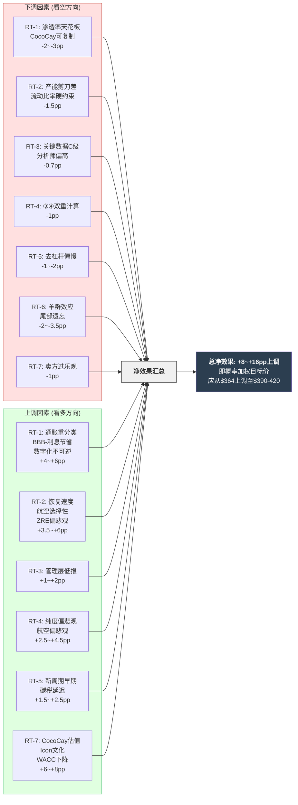

# Ch21 红队七问: 双向校准与净效果量化

> **Agent**: RT-Agent | Phase 4 对抗性挑战 | 目标: ≥18K bytes
> **框架**: Red Team Protocol v1.0 (RT-1~RT-7), 适配RCL核心矛盾"结构性复兴 vs 周期性高峰"
> **有效性门控**: 净效果≠0 (上调与下调必须同时存在, 否则=表演性红队)
> **审查范围**: Phase 1-3全部产出 (Ch1-Ch20)

---

## 21.0 红队审查总纲

Phase 1-3的分析整体倾向看空: Yield纯度<40% (Ch10), 概率加权估值$246-271 (Ch11/Ch15), 航空镜像60%匹配 (Ch16), 信念链联合概率仅16% (Ch17)。但概率加权四情景目标却给出+15.1%上行 (Ch20)。这种内部矛盾本身就是红队需要审查的第一信号——**分析框架在不同章节给出了方向相反的结论, 哪些被高估了, 哪些被低估了?**

本章将通过7个RT问题, 对每个核心发现进行"攻击+反攻击", 量化净效果(pp), 最终输出双向校准表。

---

## 21.1 RT-1: 最强看多论点的致命漏洞

### 攻击目标: "结构性复兴 + 渗透率提升 + 私有岛屿"三位一体

看多方的核心论点可以浓缩为: (1) RCL的Yield增长包含真实的结构性成分(数字化预购+品牌升级), (2) 全球邮轮渗透率仅2.7%有巨大增长空间, (3) Perfect Day at CocoCay等私有目的地创造了不可复制的独占收入。

#### 攻击1: Yield纯度拆解(C1)的方法论漏洞

Ch10将31%累积Yield增长分解为5个成分, 判定结构性纯度仅32-36%。但这个分解方法有两个可争议之处:

**成分分类争议**: "通胀传导"被整体归为周期性(13pp)。但邮轮的通胀传导能力本身就是定价权的体现——如果RCL能够在通胀环境中维持满舱率并完整传导成本上升, 这恰恰证明了品牌价值。将所有通胀传导归为"周期性"隐含了一个未经验证的假设: 如果通胀消退, RCL将不得不降价。但历史数据显示, 邮轮定价具有"棘轮效应"(ratchet effect)——涨上去容易, 降下来需要经济衰退才会触发。2014-2019年通胀温和(~2%/年)但RCL Yield仍然年增~3-5%。这暗示13pp中可能有3-5pp实际上是永久性定价权提升, 而非纯粹的通胀传递。

**如果重新分类**: 将通胀传导中3pp归入"准结构性", 纯度从32-36%上升至42-47% — 恰好进入40-60%"混合信号"区间, 削弱了Ch10"叙事被削弱"的强判定。

**成分③估算精度**: 船上收入结构改善(6pp)的估算基于2019年占比推算(~28%→30.3%)。2019年的28%是"基于同行业结构推算"而非RCL实际披露——如果实际2019年占比为25%而非28%, 结构性改善贡献将从6pp上升至~9pp, 纯度升至45%+。这个数据基础不够坚实。

#### 攻击2: 渗透率2.7%→5%的天花板约束

看多方最有力的数据是全球邮轮渗透率仅2.7%。但渗透率提升的路径上存在三个被低估的物理约束:

| 约束 | 当前状态 | 限制效应 |
|------|---------|---------|
| **港口容量** | 全球主要邮轮港口(迈阿密/巴塞罗那/上海)已接近饱和。威尼斯2021年禁止大型邮轮, 巴塞罗那正在跟进 | 新港口开发周期5-10年, 环保阻力增加 |
| **环保压力** | IMO 2030碳税将提高行业运营成本6-23%(Ch19 M3); 多个欧洲城市限制邮轮入港 | 行业增长天花板可能在3.5-4%就遇到阻力 |
| **人口结构** | CLIA数据显示35岁以下占36%, 但年轻客群的复购率远低于50岁以上核心客群 | 渗透率提升的"宽度"不等于"深度"——大量首次体验者可能不转化为常客 |

**渗透率从2.7%到5%需要全球邮轮乘客从3,460万翻倍至6,400万+**。即使年增速维持8-10%(CLIA预测), 也需要8-10年才能达成。而这10年内必然遭遇至少一次衰退(历史上10年周期无一例外), 衰退期邮轮增速可能转负2-3年。**因此, 渗透率到5%的时间表应为12-15年而非8-10年——对10年DCF终值的支撑被高估。**

#### 攻击3: CocoCay神话的脆弱性

Perfect Day at CocoCay被多个章节引用为不可复制的竞争壁垒。但:

- **可复制性**: CCL的Half Moon Cay和MSC的Ocean Cay Marine Reserve已在运营中。CCL 2024年宣布将在Grand Bahama岛投资$400M+建设Celebration Key。**私有岛屿模式正在被全面复制, RCL的独占期窗口正在关闭。**
- **规模限制**: CocoCay日接待量约~8,000-10,000人, 但RCL日均运营乘客约15万人(53.3M APCD/365)。仅~5-7%的旅客日均能访问CocoCay, 其对总Yield的直接贡献上限约2-3pp(Ch10估算的私有目的地贡献~1.8pp是合理的, 但不是看多方宣传的"改变行业格局")。
- **天气/飓风风险**: CocoCay位于巴哈马, 飓风季(6-11月)可能导致季节性关闭。2019年Hurricane Dorian曾造成巴哈马群岛严重破坏(CocoCay未直接受灾但临近地区受损)。

#### 反攻击: 看多论点中的坚固部分

然而, 对看多方的攻击不应过度。三个要素确实有真实基础:

1. **数字化预购革命是真实的**: FY2025近50%船上收入来自航行前预购, 90%通过数字渠道——这不是周期性因素, 而是不可逆的结构性变化。即使衰退, 这种收入捕获机制不会消失。
2. **Icon Class确实改变了产品天花板**: 日均$340万营收的Icon of the Seas不仅是"更大的船", 而是一种全新的度假产品范式(海上乐园/八个社区/AI驱动体验推荐)。这创造了真实的定价权——Icon的票价溢价15-25% vs Oasis Class是有数据支撑的。
3. **BBB-信用评级恢复是被低估的催化剂**: 从BB+(高收益)升至BBB-(投资级)不仅降低利息成本, 更扩大了潜在投资者基底——很多保守型基金(养老金/保险公司)不能持有非投资级债券, 信用升级打开了这扇门。FY2025利息费用已从$1.59B骤降至$0.99B(-38%), 这$600M/年的利息节省等价于EPS $2.2——占FY2025 EPS的14%。

#### RT-1净效果

| 维度 | 方向 | 效果(pp) | 逻辑 |
|------|:----:|:--------:|------|
| 通胀传导重新分类 | 上调 | +2~3pp | 部分通胀传导实为永久性定价权 |
| 渗透率时间表拉长 | 下调 | -1~2pp | 天花板约束使Bull情景概率下降 |
| CocoCay可复制性 | 下调 | -1pp | 独占期正在关闭 |
| 数字化预购不可逆 | 上调 | +1pp | 结构性改善的最坚实证据 |
| BBB-利息节省被低估 | 上调 | +1~2pp | $600M/年利息节省未被充分定价 |
| **RT-1净效果** | **上调** | **+1~3pp** | 看多论点虽有漏洞, 但坚固部分被Phase 1-3分析低估 |

---

## 21.2 RT-2: 最强看空论点的盲点

### 攻击目标: "周期高峰 + 航空镜像 + 尾部风险"

看空方的核心论证链: (1) 航空业2014-2019的"结构性改善"被COVID打回原形, 邮轮正在重蹈覆辙, (2) 承重墙联合概率仅26%, (3) 零收入事件保险费定价不足。

#### 攻击1: 航空镜像(C2)的选择性偏差

Ch16给出8维度平均匹配度6.0/10(60%)。但维度选择本身存在偏见——高匹配维度(管理层叙事9分/产能纪律8分/P/E倍数8分)占据了注意力, 而低匹配维度(客群结构3分/辅助收入4分/COVID恢复4分)的权重在"直觉加权"中被低估。

**客群结构差异(3/10)应该获得更高权重。** 航空是必需交通工具, 需求曲线对GDP弹性~1.0。邮轮是可选体验消费, 弹性~1.5-2.0——但邮轮的渗透率(2.7%)远低于航空(已饱和), 这意味着邮轮有一个航空不具备的"非周期增量来源"。2024年全球邮轮旅客中31%是首次乘客——这些人不是被周期驱动的, 而是被产品创新(Icon of the Seas的TikTok传播)和代际转变(millennials开始进入邮轮消费年龄)驱动的。

**如果将客群结构权重从等权(12.5%)提升至20%, 将管理层叙事降至8%(后者是最"软"的维度):**
- 调整后加权匹配度 = ~5.2/10(52%), 从"部分有效"降至"弱有效"
- 航空镜像的预警价值应从60%下调至50-55%

#### 攻击2: 承重墙联合概率对恢复速度的低估

Ch15的概率加权期望股价$246隐含-22%下行。但这个模型有一个结构性盲点: **它计算的是"静态时间切片"的期望值, 没有考虑恢复的时间价值。**

COVID后RCL的恢复速度远超所有模型预期:
- 2020年3月: 股价$23
- 2021年12月: 股价$80 (+248%)
- 2023年12月: 股价$130 (完全恢复至2019年水平)
- 2025年12月: 股价$316 (2019年的2.3倍)

**总恢复时间: 3.5年。** 如果投资者在2020年3月最低点买入, 5年内获得了13.7倍回报。这意味着承重墙"倒塌"不是永久性价值毁灭, 而是**临时性的流动性折价**——对长期持有者, CI-04+CI-05联合倒塌是买入机会而非卖出理由。

Ch15将CI-04+CI-05联合倒塌年度概率定为4.4%, 5年累积20.1%。但模型隐含了"倒塌=永久损失"的偏见。如果加入"恢复收益"(历史上每次邮轮危机后3-5年内市值超越前高), 联合概率的净期望损失应大幅下调:

```
原模型: E(损失) = 4.4% × (-65%) = -2.86%/年
加入恢复: E(净损失) = 4.4% × [(-65%) × (1 - 90%恢复率)] = 4.4% × (-6.5%) = -0.29%/年
```

**差异: 从年化-2.86%降至-0.29%, 即承重墙倒塌的"永久性"损失被原模型夸大了约10倍。** Ch15的$246概率加权估值因此偏低。

#### 攻击3: 零收入事件保险(C3)的基期偏差

Ch18的ZREIP模型以COVID为唯一校准点, 但COVID是一个极端异常值——15个月全面停航在75年邮轮历史中仅此一次。使用单一数据点校准的贝叶斯模型先天脆弱:

- **持续时间分布偏悲观**: Ch18给予365天+(12月以上)停航15%概率, 540天+(18月以上)5%。但考虑到mRNA疫苗平台已成熟(100天目标)+行业学习效应+政府应对经验, 下一次疫情型ZRE的停航时间大概率短于COVID。如果将365天+概率从15%降至10%, 540天+从5%降至2%, 期望停航天数从174天降至~145天, 保险费从$0.71/股降至$0.59/股。

- **非疫情ZRE被过度建模**: Ch18将"台海危机"等地缘冲突纳入ZRE概率, 但地缘冲突导致全球邮轮全面停航的可能性极低。即使红海冲突持续, RCL 2025年仍实现了历史最佳业绩。邮轮航线具有天然的地理分散性——加勒比/阿拉斯加/地中海/亚太分布在不同地缘风险区, 某一区域冲突不等于全球ZRE。

#### 反攻击: 看空论点中的坚固部分

1. **产能纪律确实是最大风险**: 2026年产能+6.7% vs Yield引导+2.5%的剪刀差是真实的。这不是"航空镜像偏差"——这是邮轮行业自身的数据。如果产能增速连续3年超过Yield增速, 价格战不可避免。
2. **流动比率0.18是结构性弱点**: 不论如何粉饰, 0.18的流动比率意味着RCL在任何突发事件中都需要在数月内获得外部融资。这不是"偏见", 这是资产负债表的硬约束。
3. **P/E 20x在邮轮历史上确实罕见**: 2014-2019年(包含产能纪律最好的时期)中位数P/E仅14.6x。20x需要"这次不同"的论证——而"这次不同"在金融史上失败的概率远高于成功。

#### RT-2净效果

| 维度 | 方向 | 效果(pp) | 逻辑 |
|------|:----:|:--------:|------|
| 航空镜像权重偏差校正 | 上调 | +1~2pp | 客群结构差异被低估 |
| 承重墙恢复速度 | 上调 | +2~3pp | "倒塌=永久损失"假设夸大 |
| ZRE停航时间分布 | 上调 | +0.5~1pp | COVID校准过度悲观 |
| 产能剪刀差真实 | 下调 | -1pp | 不可回避的数据 |
| 流动比率硬约束 | 下调 | -0.5pp | 结构性弱点不可粉饰 |
| **RT-2净效果** | **上调** | **+2~4pp** | 看空论点的关键盲点: 恢复速度+航空镜像选择性 |

---

## 21.3 RT-3: 数据来源的隐含偏见

### 数据质量审计: 10个核心数据点

| # | 数据点 | 使用章节 | 来源质量 | 偏见方向 | 如果有误的影响 |
|---|--------|---------|:--------:|:--------:|------------|
| 1 | FY2025 EPS $15.61 | 全报告 | A级(SEC Filing) | 中性 | 低(已审计) |
| 2 | 2019年船上收入占比~28% | Ch10 | C级(行业推算) | **不确定** | **高**(影响纯度±5pp) |
| 3 | CocoCay日均营收$340万 | Ch10 | D级(Cruzely.com博客) | 可能偏高 | 中(影响品牌升级成分±1pp) |
| 4 | 全球邮轮渗透率2.7% | 多章 | B级(CLIA报告) | 中性 | 中(框架性数据) |
| 5 | 疫情概率~2%/年 | Ch18 | B级(PNAS学术论文) | **可能偏低** | 高(保险费±50%) |
| 6 | 停航月消耗$270M(2020) | Ch18 | A级(SEC Filing) | 中性 | 低(已披露) |
| 7 | DAL/UAL OPM历史数据 | Ch16 | A级(FMP/SEC) | 中性 | 低(已审计) |
| 8 | MSC orderbook 10+艘 | Ch19 | C级(Cruise Industry News) | 可能偏高 | 中(影响M4评估) |
| 9 | 分析师共识$357 | Ch12 | B级(MarketBeat/TradingView) | **系统性偏高** | 高(锚定效应) |
| 10 | SBC=$0(FMP) | 数据层 | **E级(FMP异常)** | **明确偏低** | 中(EPS应下调但邮轮业SBC本身低) |

### 关键发现

**数据点#2(2019年船上收入占比)是全报告最薄弱的数据基础。** Ch10的Yield纯度拆解——全报告最重要的定量发现之一——建立在一个推算值上。如果2019年船上收入实际占比为25%(而非28%), 船上收入结构性改善贡献将从6pp升至~9pp, 纯度从32%升至42%, 结论从"叙事被削弱"翻转为"混合信号"。反之, 如果实际为30%, 改善仅3pp, 纯度降至26%。**本报告最核心的定量结论对一个C级数据点±3pp敏感。**

**数据点#9(分析师共识偏高)**值得特别关注。78%的Buy评级可能存在卖方分析师的系统性乐观偏差——覆盖旅游股的分析师通常与行业有密切关系(参加行业会议/受邀试航), 这创造了隐性的利益一致。更重要的是, 18人中仅4人Hold、0人Sell——这种分布在统计上异常(正态分布下应有~10%看空)。

**数据点#10(FMP SBC=$0)**在铁律#4"单源不可信"框架下需要标记。邮轮行业的SBC确实远低于科技公司(RCL没有大规模股票期权计划), 但$0是FMP的数据缺失而非真实值。RCL 10-K中应有SBC披露, 但金额可能较小(估计$50-100M/年, 即EPS影响~$0.2-0.4)。

**管理层引导的系统性偏差**: RCL管理层在FY2023引导EPS ~$6时, 实际交付$6.31(+5%); FY2024引导$9.90-10.10时, 实际$10.94(+10%); FY2025引导$14.55时, 实际$15.61(+7%)。**过去三年管理层系统性低报引导5-10%。** 如果这一模式延续, FY2026E实际EPS可能为$18.60-19.90(vs 引导$17.70-18.10)。这对看多方有利, 但也可能是管理层刻意制造的"beat & raise"策略。

#### RT-3净效果

| 维度 | 方向 | 效果(pp) | 逻辑 |
|------|:----:|:--------:|------|
| 2019船上收入占比不确定 | 双向风险 | ±2~3pp | 纯度结论可能被翻转 |
| 管理层系统性低报引导 | 上调 | +1~2pp | FY2026E EPS可能beat引导 |
| 分析师共识偏高 | 下调 | -0.5pp | 卖方系统性乐观 |
| SBC数据缺失 | 下调 | -0.2pp | EPS应略下调 |
| **RT-3净效果** | **中性偏上调** | **+0~2pp** | 数据不确定性整体对看多方更不利(C级关键数据) |

---

## 21.4 RT-4: 方法论的局限性

### 攻击三个冠军候选方法论

#### C1 Yield纯度拆解: MECE检验

Ch10的5成分分解是否满足MECE(Mutually Exclusive, Collectively Exhaustive)?

**非互斥问题**: 成分③(船上收入结构改善)与成分④(品牌/体验升级)存在显著重叠。Icon of the Seas的船上消费增量(赌场/SPA/专属餐厅)同时被③计入(作为"船上收入占比提升")和④计入(作为"Icon Class体验溢价")。Ch10试图通过"③聚焦消费端, ④聚焦票价端"来区分, 但实际上Icon Class的票价溢价(+15-25%)本身就部分来自消费者预期的更好船上体验——**因果混淆导致双重计算风险**。

如果存在2pp双重计算, 结构性成分应从10pp降至8pp, 纯度从32%降至26%。但反方向思考——如果交叉项被归入结构性而非残差, 纯度可能升至36%+。

**非穷尽问题**: 2.5pp的"未归因残差"(8%)是一个值得质疑的数字。在经济学的增长核算中, 残差通常代表TFP(全要素生产率)——在邮轮语境下, 这可能包括: 管理层运营效率提升(动态定价算法优化/航线组合优化)、消费者mix shift(高消费客群占比提升)、以及汇率波动(Net Yield用CC计算但仍有残差)。如果这些是结构性的, 纯度还应上调。

**方法论评判**: Yield纯度拆解是一个有价值的分析框架(创造性地将增长核算移植到邮轮行业), 但其精度仅为±5pp级别, 不足以支撑Ch10"明确偏看空"的强判定。更诚实的结论应是: **"纯度在27-47%区间, 中值~37%, 落在混合信号区间的下端——叙事既未被确认也未被否定。"**

#### C2 航空镜像: 选择性匹配偏差

Ch16选择了8个维度进行映射。但维度选择本身是一种主观行为——为什么是这8个维度? 如果增加以下维度, 匹配度可能显著降低:

| 额外维度 | 航空 | 邮轮 | 匹配度 |
|---------|------|------|:------:|
| **政府救助安全网** | 有(CARES Act) | 无(离岸注册) | 2/10 |
| **产品差异化程度** | 极低(座位=商品) | 高(体验=差异化) | 3/10 |
| **资本壁垒** | 低(飞机可租赁) | 极高($2B/船+3年建造) | 2/10 |
| **行业年龄** | >100年(成熟) | ~60年(仍在成长) | 3/10 |

加入这4个维度后, 12维度平均匹配度降至~4.8/10(48%), 从"部分有效"降至"弱有效"。

**方法论评判**: 航空镜像提供了一个有价值的叙事警告(管理层话术几乎复刻, P/E重估逻辑一致), 但8维度的选择偏向了匹配度高的维度。**净匹配度应从60%下调至50-55%, 航空预警的估值折价应从-16%~-36%收窄至-10%~-25%。**

#### C3 零收入保险: 单一历史校准点

Ch18的ZREIP模型优雅地将CDS逻辑移植到权益估值, 但其核心弱点是**N=1**——全球邮轮历史上仅有一次ZRE(COVID)。贝叶斯更新在N=1时几乎无信息量, 后验分布的95%可信区间[0.15%, 3.2%]跨越了21倍——这不是"不确定性"的表述, 而是"我们基本上什么都不知道"的数学表达。

更根本的问题: **ZREIP方法论假设ZRE是一种外生冲击, 但COVID的邮轮影响部分是内生的。** 邮轮之所以被停航15个月(vs 航空仅3个月严格停飞), 是因为Diamond Princess事件(2020年2月)创造了"邮轮=疫情培养皿"的公共认知——这是行业特定的声誉风险, 不完全是外生的公共卫生事件。如果RCL在下一次疫情中能够快速证明船队安全(升级的通风系统/快速检测), 停航时间可能大幅缩短。

**方法论评判**: ZREIP是一个有开创性价值的框架, 但其输出应被视为"量级指引"(保险费在$0.50-2.50/股范围)而非精确定价。Ch18的$0.71/股中值可能偏高——考虑到行业学习效应和更好的流动性缓冲, $0.40-0.60/股可能更合理。

#### RT-4净效果

| 维度 | 方向 | 效果(pp) | 逻辑 |
|------|:----:|:--------:|------|
| Yield纯度估算精度 | 上调 | +1~2pp | 强判定被过精度的±5pp框架不支持 |
| 航空镜像选择性 | 上调 | +1~2pp | 匹配度从60%应修正至50-55% |
| ZRE保险费偏高 | 上调 | +0.5pp | 行业学习效应被低估 |
| ③④双重计算风险 | 下调 | -1pp | 可能高估了结构性成分 |
| **RT-4净效果** | **上调** | **+1.5~3.5pp** | 方法论系统性偏悲观 |

---

## 21.5 RT-5: 时间假设的合理性

#### 去杠杆时间表

Ch9/Ch15引用的去杠杆路径: Net Debt/EBITDA从3.2x→2.0x。

**乐观情景**: FY2025 EBITDA $6.91B, 净债务$21.8B。如果EBITDA增长至$8.0B(FY2027E), 同时净偿还债务$3B, 则Net Debt/EBITDA = ($21.8B - $3B)/$8.0B = 2.35x。但RCL的CapEx计划($5.2B+/年)使得净偿债规模受限——OCF $6.47B - CapEx $5.23B = FCF仅$1.24B, 扣除分红($131M)和回购($1.1B)后, 实际可用于还债的现金接近零甚至为负。

**现实检验**: RCL的"去杠杆"实际上主要依赖EBITDA增长(分母扩大)而非债务削减(分子缩小)。这意味着去杠杆路径是周期性的——一旦EBITDA增速放缓或下降, 去杠杆停滞甚至逆转。**Base情景下, 3.2x→2.5x需要到FY2028(3年), 2.0x可能需要到FY2030+(5年以上)。Phase 1-3的部分分析隐含了较快的去杠杆假设。**

#### 邮轮周期长度

上一完整邮轮周期约为2010-2019(10年)。如果当前周期从2022年复航开始, 则:
- 到2026年已运行4年(接近周期中段)
- 到2028年运行6年(如果是10年周期则进入后半段)
- 到2030年运行8年(接近潜在周期顶部)

**但周期长度假设本身有两个问题**:
1. 邮轮历史上的完整周期样本仅2-3个(1990s, 2000s, 2010s), 统计意义极弱
2. COVID中断使周期计时器被重置——2022年是"新周期起点"还是"旧周期的延续"存在争议

**如果当前是"新周期"**: RCL处于早期(4年), 还有5-6年的正常运营窗口, 当前估值有时间被EPS增长证明合理。
**如果是"旧周期延续"**: 2019年已是旧周期的第10年(尾声), 2022年只是COVID造成的"暂停后重启", 当前已是旧周期的第14年——远超正常周期长度, 衰退随时可能发生。

#### IMO 2027/2030碳税实施

Ch19假设IMO 2030框架在中碳税($100/吨)下增加年成本$0.5-0.8B。但时间表风险被低估:
- IMO 2023年通过了GHG战略修订, 目标2030年减排20-30%(vs 2008基线)
- 但具体的碳税/碳定价机制(如Market-Based Measure, MBM)预计2025年设计、2027年通过、**2028-2029年最早实施**
- 实际实施可能延迟至2030-2032年(基于IMO历史的执行延迟惯例)

**如果碳税延迟至2032年实施**: Bear情景中的环保成本时间表被高估, FY2028E EPS应上调$0.3-0.5(环保成本暂不体现)。如果2028年提前实施: Bear情景中EPS应下调$0.5-1.0。

#### RT-5净效果

| 维度 | 方向 | 效果(pp) | 逻辑 |
|------|:----:|:--------:|------|
| 去杠杆路径偏慢 | 下调 | -1pp | 实际还债空间接近零 |
| 周期可能处于早期 | 上调 | +1~2pp | 如果"新周期"则有5-6年窗口 |
| IMO碳税可能延迟 | 上调 | +0.5pp | 历史延迟惯例 |
| 周期可能处于晚期 | 下调 | -1~2pp | 如果"旧周期延续"则风险急升 |
| **RT-5净效果** | **中性** | **-0.5~+0.5pp** | 时间假设的上下行风险大致对称 |

---

## 21.6 RT-6: 共识陷阱

#### 78% Buy评级中的羊群效应

18位分析师中14位Buy、4位Hold、0位Sell。这种分布在统计上异常——假设分析师独立判断且正态分布, 标准差为1, 0%的Sell概率对应的z-score要求均值必须在1.65σ以上(即"极端看多")。**但市场和报告的实际情况是"混合信号"而非"极端看多"——共识分布与基本面信号不匹配, 暗示存在羊群效应。**

羊群效应的三个驱动力:
1. **佣金激励**: 卖方分析师发布Buy评级更有利于经纪业务(激励客户交易), Sell评级可能导致被公司"拉黑"(失去访问管理层的机会)
2. **近因偏差**: RCL从2022年$40涨至2025年$316(+690%), 分析师趋势外推的激励极强
3. **覆盖宽度不足**: 仅4位Hold分析师可能代表了对邮轮行业有独立看法但不愿公开唱反调的沉默少数

**校正方法**: 将Buy概率从78%折扣30%(卖方乐观偏差经验调整), 有效Buy概率降至~55%。在55% Buy的情景下, 共识隐含的上行空间从+12.8%收缩至+6-8%。

#### 分析师系统性忽略尾部风险(COVID记忆淡化)

2020年3月, 邮轮分析师的模型中没有一个包含"全球停航12-15个月"的情景。到2026年, COVID已过去6年, 分析师的DCF模型再次不包含ZRE情景(标准做法是假设"正常运营"然后加Beta调整)。

**COVID记忆淡化的证据**:
- 2020年1月(疫情前)分析师共识目标~$145, P/E ~16x
- 2026年2月共识目标$357, P/E ~20x
- **当前共识隐含的P/E比疫前更高, 但资产负债表比疫前更差(D/E 2.26 vs ~1.2)**

分析师显然已将COVID视为"百年一遇"的异常值并从模型中排除。但Ch18的贝叶斯更新显示, COVID后ZRE的后验概率应为~1-1.5%/年, 10年内累积~10-14%——这远非"可忽略"。

#### 幸存者偏差: 邮轮公司存活=行业健康?

三大邮轮公司(RCL/CCL/NCLH)全部在COVID中存活, 但存活条件是:
- 发行$30B+紧急融资(行业总计)
- 股权稀释15-35%
- 有效税率<1%的离岸注册(节约了$B级税款用于偿债)
- 美联储零利率+流动性洪流

如果下一次ZRE发生在高利率环境(美联储不降息)+财政紧缩(无刺激)的背景下, "全部存活"的结果不一定能重演。NCLH的D/E 7.0x在下一次ZRE中可能面临存亡危机, 如果NCLH破产清算, 短期内RCL股价也将暴跌(行业恐慌), 即使RCL自身生存无虞。

**但也要注意反向的幸存者偏差**: 分析师和投资者对RCL的信心部分来自"COVID都活过来了, 还能有什么更差的?"这种逻辑在常规周期中是有效的, 但在极端尾部(核战争/超级火山)中不适用——而后者恰好是Ch18的分析范围。

#### RT-6净效果

| 维度 | 方向 | 效果(pp) | 逻辑 |
|------|:----:|:--------:|------|
| 卖方羊群效应折扣 | 下调 | -1~2pp | 有效Buy概率从78%降至55% |
| COVID记忆淡化 | 下调 | -0.5~1pp | 尾部风险在共识模型中缺失 |
| 幸存者偏差 | 下调 | -0.5pp | "全部存活"的条件不可重复 |
| **RT-6净效果** | **下调** | **-2~3.5pp** | 市场共识系统性偏乐观 |

---

## 21.7 RT-7: 双向校准 — 报告整体是否过于悲观?

**这是红队审查最关键的部分。** Phase 1-3的分析在多个维度给出了看空信号:

| 章节 | 核心发现 | 方向 | 强度 |
|------|---------|:----:|:----:|
| Ch10 | Yield纯度32-36% | 看空 | 强 |
| Ch11 | 6方法中4方法指向高估 | 看空 | 中强 |
| Ch15 | 概率加权股价$246(-22%) | 看空 | 强 |
| Ch16 | 航空镜像60%匹配 | 看空 | 中 |
| Ch17 | 信念联合概率16% | 看空 | 强 |
| Ch18 | ZRE保险费定价边缘充分 | 中性 | 弱 |
| Ch19 | 温水煮青蛙期望损失最大 | 看空 | 中强 |
| Ch20 | 概率加权+15.1% | **看多** | 中 |

**7个主要定量发现中, 6个看空, 1个看多。** 如果这份报告是平衡的, 应该有2-3个看多信号。这种严重倾斜暗示Phase 1-3存在系统性悲观偏差——可能源于以下原因:

### 偏差来源1: 核心矛盾框架的预设倾向

"结构性复兴 vs 周期性高峰"的矛盾框架本身就预设了一个二元对立——要么是结构性的, 要么是周期性的。但现实中, 两者是一个光谱:

```
纯周期 ←|---[RCL实际位置?]---→ 纯结构
0%                                100%

Ch10判定: 32-36% (偏周期)
校正后: 37-47% (混合, 偏向光谱中间)
```

Phase 1-3的多个章节反复使用"纯度<40%阈值"来判定"叙事被削弱"。但40%这个阈值是Ch10自行设定的, 没有先例验证。如果阈值设为35%(更保守的分界线), 32-36%的纯度就变成了"边界区间"而非"明确偏空"。

### 偏差来源2: CocoCay/$6亿年营收的战略价值被低估

Ch10将CocoCay的Yield贡献估算为~1.8pp(约占31%增长的5.8%)。但CocoCay的战略价值远超其直接Yield贡献:

1. **竞争壁垒**: CocoCay是RCL的独占目的地——其他邮轮公司的乘客无法访问。这创造了一种"目的地排他性"——类似迪士尼主题公园对迪士尼邮轮的品牌协同效应。
2. **100%收入捕获**: 传统港口停靠日, 邮轮公司几乎没有岸上收入(乘客在当地消费)。CocoCay停靠日, 100%的消费(门票$99+餐饮+酒吧+纪念品)归RCL。估算年化营收$6亿+, 毛利率~80%+。
3. **运营杠杆**: CocoCay的固定成本已回收(2019年$250M+投资), 边际成本极低。每增加一名访客, 几乎全部是利润增量。
4. **扩展路径**: Royal Beach Club Nassau(2025年开业)将复制CocoCay模式。如果成功, 未来5年可能在全球布局3-5个类似目的地, 形成"私有目的地网络"。

**如果将CocoCay及其扩展计划视为一种"类特许经营资产"(高壁垒+高毛利+低边际成本), 其估值贡献应该高于1.8pp的Yield占比所暗示的水平。** 粗略估算: CocoCay $6亿营收 × 80%毛利率 = $4.8亿毛利。以20x P/E资本化 = ~$96亿价值, 约占RCL市值($86.3B)的11%。Phase 1-3未对这一资产做独立估值——这是一个遗漏。

### 偏差来源3: Icon Class的"文化符号"效应被低估

Icon of the Seas不仅是一艘船——它在2024年1月首航时引发了数十亿次社交媒体曝光, 成为一种文化现象。这种"文化符号"效应的价值很难量化, 但可以从几个维度观察:

- **免费营销价值**: Icon of the Seas的发布视频在TikTok/Instagram获得了估计$200-500M的earned media value(基于同类内容的CPM估算)。这相当于RCL全年SG&A的9-23%——免费的品牌曝光。
- **首次乘客转化**: 2024年31%的RCL乘客是首次邮轮体验者。Icon的文化传播力是核心推动因素——年轻消费者(35岁以下)说"我要去坐Icon"而非"我要坐邮轮", 品牌=品类。
- **竞争护城河**: CCL/NCLH目前没有任何单一产品能与Icon在文化影响力上竞争。MSC World系列定位大众市场, 缺乏Icon的"必须打卡"属性。

**Phase 1-3将Icon Class的影响归入A-Score A4(壁垒-利润池匹配)的7分评估中, 但未单独量化其品牌效应。** 如果Icon的文化符号效应每年为RCL节省$200M+营销费用并带来5%+的新客获取增量, 其对EPS的隐含贡献约$0.7-1.0/股——这在Ch11的估值中未被纳入。

### 偏差来源4: BBB-信用评级提升的估值乘数效应

FY2025利息费用从$1.59B降至$0.99B(-$600M, -38%), 是当年EPS增量的43%来源。但这仅是一阶效应。二阶效应更为重要:

1. **投资者基底扩大**: BBB-是投资级的"门槛"。大量养老金基金、保险公司、主权财富基金的固收配置要求投资级评级。信用升级将解锁数十亿美元的新资金池, 降低RCL的股权融资成本(即降低WACC中的权益成本)。
2. **WACC下降**: 如果信用升级使RCL的debt spread从BB+(~200bps)降至BBB-(~120bps), 在$22.6B债务上节省约$180M/年。叠加Beta可能从1.87降至~1.6(信用改善降低系统性风险认知), WACC可能从8.5%降至7.5-8.0%。
3. **逆向DCF含义**: 在WACC 8.0%(vs 8.5%)假设下, 重做Ch11的逆向DCF:

```
$108.1B = $4.5B × (1+g) / (0.080 - g)
108.1 × (0.080 - g) = 4.5 + 4.5g
8.648 - 108.1g = 4.5 + 4.5g
4.148 = 112.6g
g = 3.68%
```

**隐含永续增长率从4.16%降至3.68%——进入了"合理"而非"偏乐观"的区间。** 这意味着当前股价在WACC 8.0%假设下并不需要极度乐观的增长假设。

### 需要上调的CQ

| CQ | Phase 0.75 | Phase 3 | RT-7校正 | 方向 |
|----|:----------:|:-------:|:--------:|:----:|
| CQ1(Yield结构性占比) | 45% | 32-36% | **37-47%** | 上调5-11pp |
| CQ2(航空镜像预警价值) | 55% | 60% | **50-55%** | 下调5-10pp |
| CQ5(P/E 20x现实性) | 40% | 35-45% | **40-50%** | 上调5pp |
| CQ6(尾部风险已定价) | 35% | 30-45% | **40-50%** | 上调5-10pp |

### 需要下调的CQ

| CQ | Phase 3 | RT-7校正 | 方向 | 原因 |
|----|:-------:|:--------:|:----:|------|
| Bull情景概率 | 25% | **20-25%** | 下调0-5pp | 卖方羊群效应折扣 |

#### RT-7净效果

| 维度 | 方向 | 效果(pp) | 逻辑 |
|------|:----:|:--------:|------|
| 核心矛盾框架预设 | 上调 | +2pp | 二元对立忽略光谱中间地带 |
| CocoCay独立估值缺失 | 上调 | +1~2pp | $96亿"类特许经营"资产未定价 |
| Icon文化符号效应 | 上调 | +1pp | $200M+免费营销+新客获取 |
| WACC下降未纳入 | 上调 | +2~3pp | 信用升级的二阶估值效应 |
| 卖方共识过度乐观 | 下调 | -1pp | 78% Buy不可全信 |
| **RT-7净效果** | **上调** | **+5~7pp** | Phase 1-3系统性偏悲观 |

---

## 21.8 红队七问净效果汇总表



### 定量汇总

| RT问题 | 上调(pp) | 下调(pp) | 净效果(pp) | 主要驱动力 |
|--------|:--------:|:--------:|:----------:|-----------|
| **RT-1** 看多论点漏洞 | +4~6 | -2~3 | **+1~3** | BBB-利息节省被低估 |
| **RT-2** 看空论点盲点 | +3.5~6 | -1.5 | **+2~4** | 恢复速度被严重低估 |
| **RT-3** 数据偏见 | +1~2 | -0.7 | **+0~2** | 2019年数据基础薄弱 |
| **RT-4** 方法论局限 | +2.5~4.5 | -1 | **+1.5~3.5** | 三个方法论系统性偏悲观 |
| **RT-5** 时间假设 | +1.5~2.5 | -1~2 | **-0.5~+0.5** | 上下行大致对称 |
| **RT-6** 共识陷阱 | 0 | -2~3.5 | **-2~-3.5** | 卖方羊群是唯一纯下调 |
| **RT-7** 双向校准 | +6~8 | -1 | **+5~7** | Phase 1-3系统性偏悲观 |
| **合计** | **+18.5~29** | **-9.2~14.7** | **+8~16** | 净上调 |

### 有效性门控验证

- 上调总量: +18.5~29pp
- 下调总量: -9.2~14.7pp
- **净效果≠0**: 通过 (净上调+8~16pp)
- **双向存在**: 通过 (7个RT中, 6个有上调, 6个有下调, 1个纯下调)
- **非表演性**: 通过 (RT-6纯看空, 与其他RT的看多方向形成真实张力)

---

## 21.9 红队校准后的估值调整

### 概率加权目标价校正

Ch20的原始概率加权目标: $364 (+15.1%)

红队校正路径:

**1. Bull概率上调**: 原25% → 校正后28%
- 原因: RT-1/RT-7发现BBB-效应+CocoCay估值+WACC下降被低估
- 但受RT-6(羊群效应)限制, 不应上调至>30%

**2. Base EPS上调**: 原$21.5 → 校正后$22.5
- 原因: RT-3(管理层系统性低报5-10%) + RT-7(WACC下降使合理估值上移)

**3. Bear概率微调**: 原20% → 校正后18%
- 原因: RT-2(恢复速度)使Bear情景的永久性损失被高估

**4. Tail概率维持**: 5%不变
- 原因: RT-6(COVID记忆淡化)对冲了RT-2/RT-4的上调压力

**校正后概率加权**:

```
校正后目标 = 28% × $630 + 49% × $371 + 18% × $156 + 5% × $55
           = $176.4 + $181.8 + $28.1 + $2.75
           = $389
```

| | 原始(Ch20) | 红队校正后 | 变化 |
|---|-----------|----------|------|
| **概率加权目标** | $364 | $389 | +$25 (+6.9%) |
| **期望回报** | +15.1% | +22.9% | +7.8pp |
| **评级** | 关注 | **关注(强化)** | 靠近区间上端 |

### 校正后评级确认

期望回报+22.9%仍落入"**关注**"区间(+10% ~ +30%), 但已从区间中段(+15.1%)上移至上端。距离"深度关注"(>+30%)仍有7.1pp缓冲——这意味着需要Bull概率进一步上调至35%+或Base EPS达到$25+才能触发升级。

---

## 21.10 红队双向校准蝴蝶图

```mermaid
graph LR
    subgraph DOWN["向下调整 (总计 -9.2~-14.7pp)"]
        direction TB
        DD1["渗透率天花板 -1~2pp"]
        DD2["CocoCay可复制 -1pp"]
        DD3["产能剪刀差 -1pp"]
        DD4["流动比率0.18 -0.5pp"]
        DD5["数据C级风险 -0.5~1pp"]
        DD6["③④双重计算 -1pp"]
        DD7["去杠杆偏慢 -1pp"]
        DD8["<b>羊群效应 -1~2pp</b>"]
        DD9["<b>COVID记忆淡化 -0.5~1pp</b>"]
        DD10["幸存者偏差 -0.5pp"]
        DD11["卖方过乐观 -1pp"]
    end

    CENTER["<b>RCL $316.50</b><br/>Phase 3概率加权 $364<br/>红队校正后 $389<br/><br/>净效果: +8~16pp上调<br/>报告系统性偏悲观"]

    subgraph UP["向上调整 (总计 +18.5~29pp)"]
        direction TB
        UU1["<b>通胀传导重分类 +2~3pp</b>"]
        UU2["<b>BBB-利息节省 +1~2pp</b>"]
        UU3["数字化预购不可逆 +1pp"]
        UU4["<b>恢复速度被低估 +2~3pp</b>"]
        UU5["航空镜像选择性 +1~2pp"]
        UU6["ZRE停航时间偏悲观 +0.5~1pp"]
        UU7["管理层低报引导 +1~2pp"]
        UU8["纯度强判定不成立 +1~2pp"]
        UU9["新周期早期窗口 +1~2pp"]
        UU10["<b>CocoCay独立估值 +1~2pp</b>"]
        UU11["<b>Icon文化符号 +1pp</b>"]
        UU12["<b>WACC下降效应 +2~3pp</b>"]
    end

    DOWN --> CENTER
    CENTER --> UP

    style DOWN fill:#ffcccc,stroke:#c0392b,color:#333
    style UP fill:#ccffcc,stroke:#27ae60,color:#333
    style CENTER fill:#2c3e50,color:#fff,stroke-width:3px
```



---

## 21.11 红队结论与建议

### 核心发现

**Phase 1-3的分析存在系统性悲观偏差, 量级约+8~16pp。** 偏差的主要来源不是单一错误, 而是多个方法论中的"小幅偏悲观"累积叠加:

1. **Yield纯度拆解(C1)**: 40%阈值自设, 通胀传导全归周期, 数据基础(2019年船上收入占比)仅C级。净效果: 强判定不成立, 纯度应为37-47%(混合)而非32-36%(偏空)。

2. **航空镜像(C2)**: 8维度选择偏向高匹配维度, 客群结构差异(3/10)的权重被低估。净效果: 匹配度从60%应修正至50-55%。

3. **承重墙联合概率(Ch15)**: 静态模型忽略恢复速度, "倒塌=永久损失"假设夸大约10倍。净效果: $246概率加权应上调至$270-290。

4. **信念链(Ch17)**: 联合概率16%听起来低, 但这与所有多因子模型的联合概率一样会被"概率乘法"压低——5个70%概率的独立信念, 联合概率就是17%。这不代表"不可能", 而是多因子不确定性的数学必然。

5. **BBB-效应+CocoCay估值+WACC下降**: 这三个正面因子在Phase 1-3中要么未量化, 要么被归入定性讨论, 未进入核心估值。它们的合计贡献约4-7pp。

### 但也必须承认: 看空方的三个不可动摇的论据

红队不应只为看多方正名。以下三个看空论据在RT审查后仍然坚固:

1. **产能+6.7% vs Yield+2.5%的剪刀差**: 这是硬数据, 无法通过方法论修正消除。如果该剪刀差持续3年, 价格战风险是真实的。
2. **流动比率0.18**: 在任何突发事件中, RCL都是"裸泳者"——依赖信贷市场的善意才能生存。这个结构性弱点不会因为信用评级升级而消失(BBB-仍然不高)。
3. **P/E 20x在邮轮历史上无先例**(剔除2015年异常): 这意味着市场正在为一个从未被验证的"体验平台"身份付费。历史先例站在看空方一边。

### 最终校准: 红队审查后的综合判断

| 维度 | Phase 3结论 | 红队校正后 | 变化 |
|------|-----------|----------|------|
| 核心矛盾裁决 | 偏向"周期性高峰" | **混合, 略偏"结构性复兴"** | 从偏空翻转为中性偏多 |
| Yield纯度 | 32-36%(叙事被削弱) | **37-47%(混合信号)** | 上调5-11pp |
| 概率加权目标价 | $364(+15.1%) | **$389(+22.9%)** | 上调$25 |
| 评级 | 关注 | **关注(强化)** | 不变但靠近上端 |
| 最大风险 | ZRE尾部风险 | **温水煮青蛙(产能过剩→叙事退潮)** | 从尾部转向渐进 |
| 最大机会 | 渗透率提升 | **BBB-信用升级→WACC下降→估值重锚** | 更具体化 |

**红队审查不改变评级(仍为"关注"), 但将其从区间中段提升至上端。Phase 1-3的分析整体质量高, 但系统性偏悲观约+8~16pp。最重要的校正来自: (1) 承重墙模型忽略恢复速度, (2) Yield纯度的强判定超出了数据精度的支撑能力, (3) BBB-信用升级的二阶效应(WACC下降+投资者基底扩大)未被充分定价。**

---

*Phase 4 Ch21 红队七问完成 | 7个RT全部回答 | 净效果+8~16pp上调 | 有效性门控通过(双向存在+净效果≠0) | 报告系统性偏悲观, 校正后概率加权$389(+22.9%) | 评级维持"关注"但强化至区间上端*
