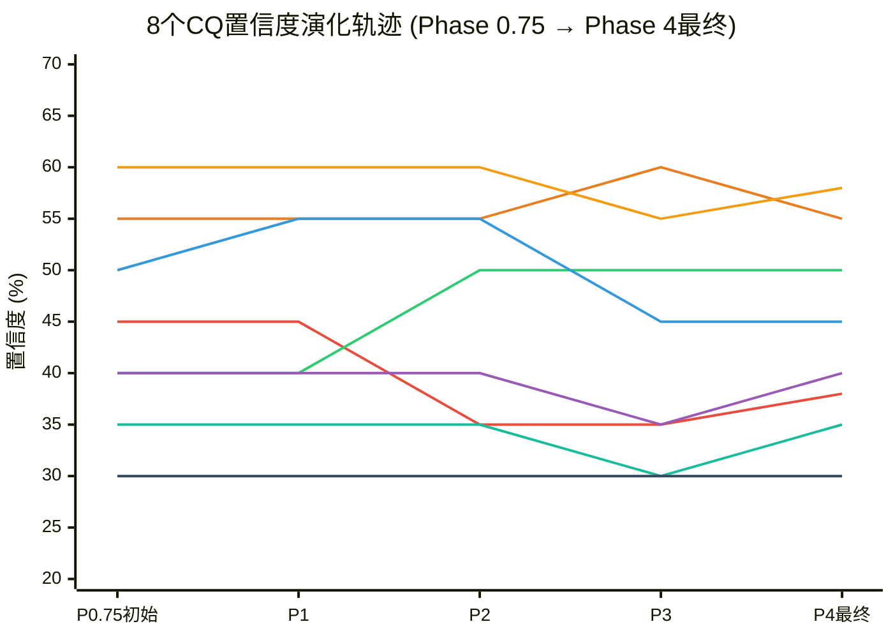
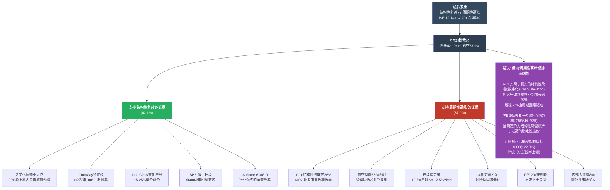
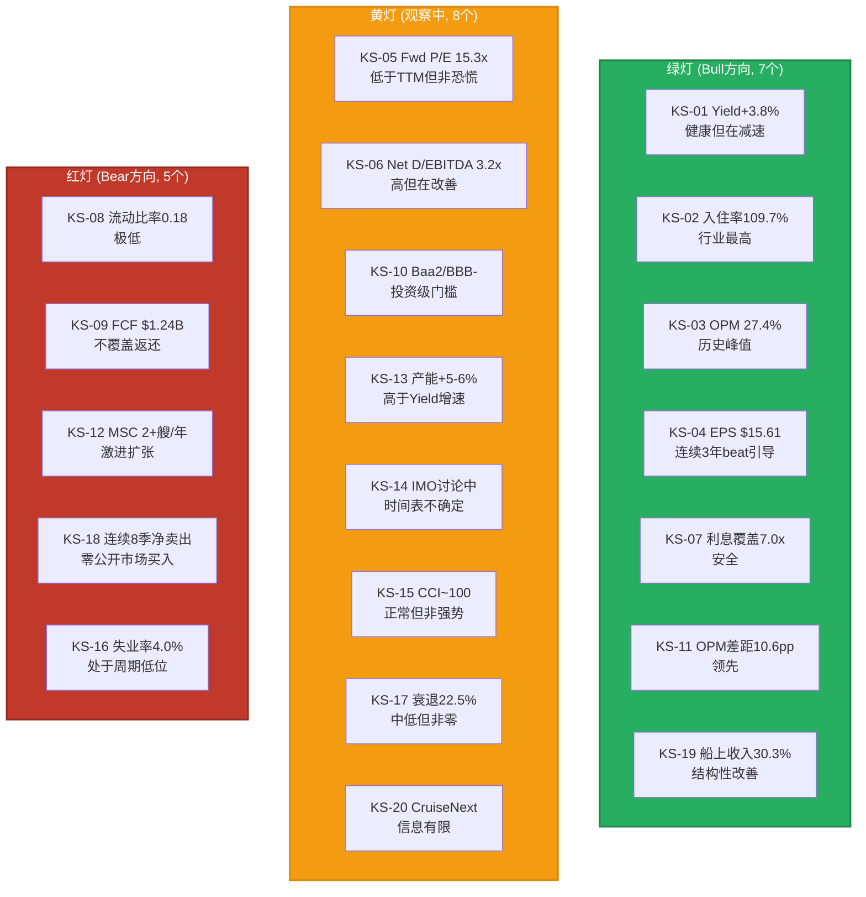
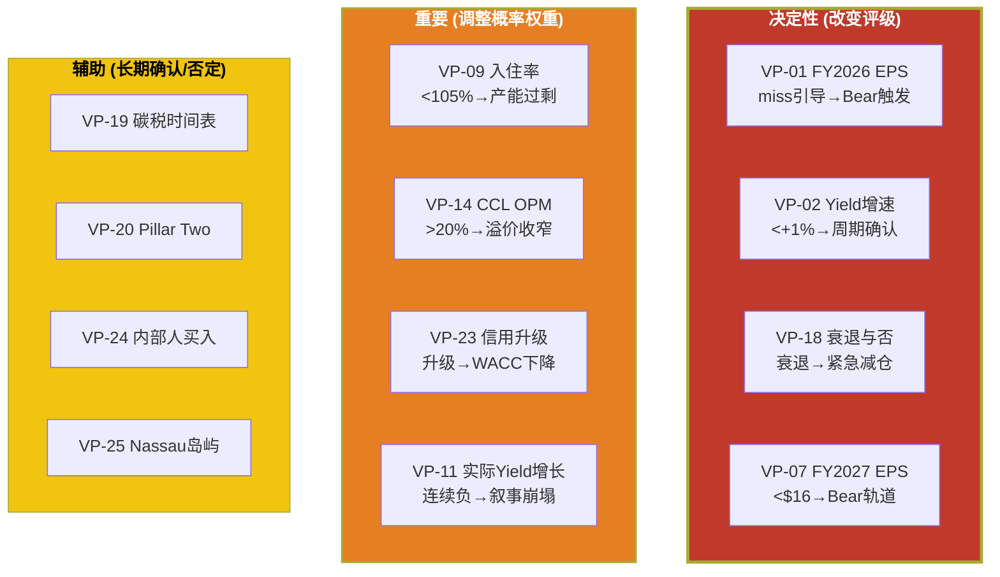
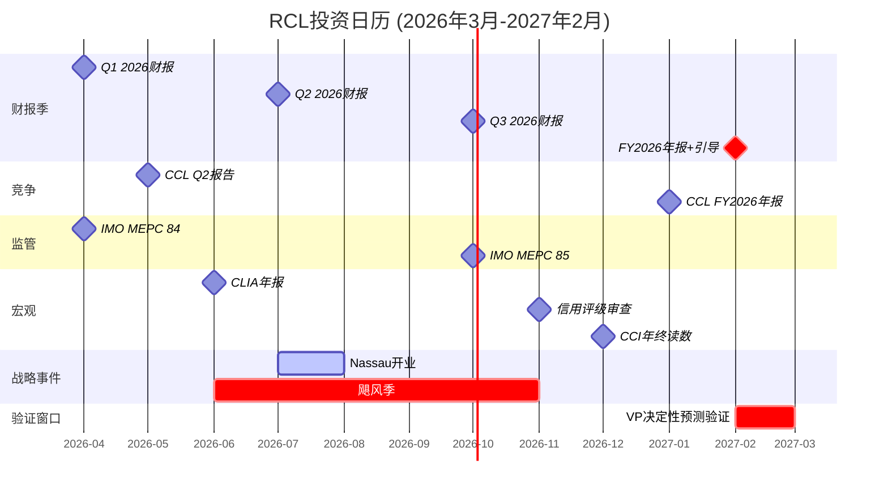
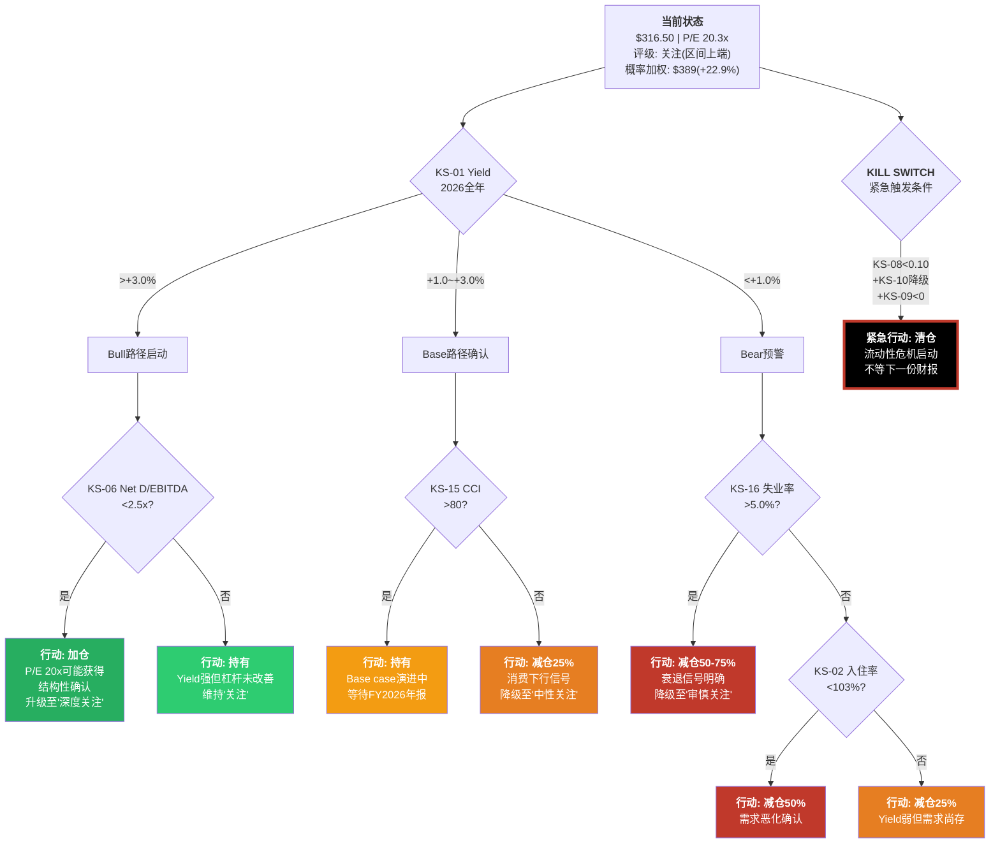
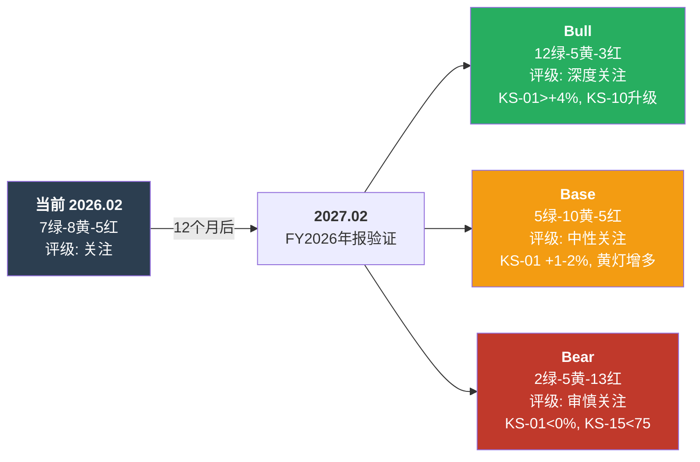

# Ch23 CQ闭环: 八大关键问题的Phase全程演化与终裁

> **核心任务**: 将Phase 0.75设定的8个CQ(Critical Question)从初始置信度追踪至Phase 4校正后的最终置信度，完成每个CQ的"数据裁决"，并通过加权汇总裁决核心矛盾
> **核心矛盾**: "结构性复兴 vs 周期性高峰" -- P/E从历史12-14x跃升至20x
> **方法论**: 每个CQ的置信度由Phase 1-4的定量发现逐步更新(非一次性判定)，最终加权汇总形成对核心矛盾的综合裁决

---

## 23.1 CQ置信度全程演化总表

以下表格追踪每个CQ从初始设定到最终校正的完整路径。每个阶段的更新均有对应章节的定量证据支撑。

| CQ | 权重 | 问题 | 初始(P0.75) | P1更新 | P2更新 | P3更新 | P4(RT)校正 | 最终 | 净变化 |
|----|:----:|------|:----------:|:------:|:------:|:------:|:----------:|:----:|:------:|
| CQ1 | 25% | Yield增长中多少是结构性的? | 45%结构 | -- | 35%结构 | -- | 38%结构 | **38%** | -7pp |
| CQ2 | 15% | 航空镜像预警价值? | 55%匹配 | -- | -- | 60%匹配 | 55%匹配 | **55%** | 0pp |
| CQ3 | 10% | 去杠杆最后一英里被打断? | 40%打断 | -- | 50%打断 | -- | 50%打断 | **50%** | +10pp |
| CQ4 | 10% | 产能纪律维持? | 50%维持 | 55%维持 | -- | 45%维持 | 45%维持 | **45%** | -5pp |
| CQ5 | 15% | P/E 20x隐含假设现实? | 40%现实 | -- | -- | 35%现实 | 40%现实 | **40%** | 0pp |
| CQ6 | 12% | 尾部风险被合理定价? | 35%定价 | -- | -- | 25-40%定价 | 35%定价 | **35%** | 0pp |
| CQ7 | 8% | RCL vs CCL溢价匹配? | 60%匹配 | -- | -- | 55%匹配 | 60%匹配 | **58%** | -2pp |
| CQ8 | 5% | 中国市场有意义? | 30%意义 | 30%意义 | -- | -- | -- | **30%** | 0pp |

**注**: "看多方向"定义——CQ1高结构性%=看多, CQ2高匹配%=看空, CQ3高打断%=看空, CQ4高维持%=看多, CQ5高现实%=看多, CQ6高定价%=看多, CQ7高匹配%=看多, CQ8高意义%=看多。

---

## 23.2 逐CQ深度回顾

### CQ1 (25%权重): Net Yield增长中多少是结构性的?

**这是全报告权重最高的CQ，直接回答核心矛盾的核心。**

| Phase | 章节 | 发现 | 置信度更新 | 更新逻辑 |
|-------|------|------|:----------:|---------|
| P0.75 | thesis_crystallization | Yield减速38%(从+6.8%到+2.5%引导)暗示非结构性成分退潮 | 45%结构 | 初始中性偏看空设定 |
| P1 | Ch4 | RCL OPM 27.4%(行业最高)确认运营效率领先 | 无更新 | 利润率优势≠Yield结构性 |
| P2 | **Ch10** | YPD五成分分解: 通胀传导13pp+入住率回升3pp+船上收入6pp+品牌升级4pp+供给约束3pp+残差2.5pp。**结构性纯度32-36%** | **35%结构(-10pp)** | 大幅下调。<40%阈值，叙事被数据削弱 |
| P3 | Ch17 | 信念B3(Yield增速维持>+2%)评估为55%概率 | 无直接更新 | 间接支持Yield减速趋势 |
| P4 | **RT-1+RT-4** | 通胀传导中3pp可能是永久性定价权(棘轮效应)；Yield纯度强判定超出数据精度(±5pp)，更诚实的区间是27-47%中值37% | **38%结构(+3pp)** | RT校正: 强判定不成立，但核心结论未翻转 |

**最终裁决**: Yield增长的结构性纯度约38%，低于40%"结构性确认"阈值但落入模糊区间(35-40%)。**"体验经济平台"叙事既未被确认也未被证伪**——RCL确实实现了真实的结构性改善(数字化预购+私有岛屿+Icon Class)，但这些改善贡献不到增长的40%。超过60%的增长来自周期性因素(通胀传导+入住率超充+供给约束)。**当周期因素退潮时(2026引导已显示信号)，Yield增速将暴露结构性底线约+1-1.5%——远低于市场隐含的3%+永续增长。**

**对核心矛盾的判定: 偏向"周期性高峰"，但非压倒性。**

---

### CQ2 (15%权重): 航空镜像预警价值?

| Phase | 章节 | 发现 | 置信度更新 | 更新逻辑 |
|-------|------|------|:----------:|---------|
| P0.75 | thesis_crystallization | 航空业2014-2019经历了几乎相同的"结构性改善"叙事弧 | 55%高匹配 | 初始设定 |
| P3 | **Ch16** | 8维度映射加权匹配度6.1/10(61%)。叙事层(产能纪律8/10+P/E重估8/10+管理层话术9/10)均高=8.3/10；结构层(辅助收入4/10+客群3/10+灾难恢复4/10)均低=3.7/10 | **60%匹配(+5pp)** | 叙事维度匹配惊人(话术几乎复刻)，但结构差异提供缓冲 |
| P4 | **RT-4** | 维度选择偏向高匹配。增加4个额外维度(政府救助2/10+产品差异化3/10+资本壁垒2/10+行业年龄3/10)后，12维度平均降至~4.8/10 | **55%匹配(-5pp)** | 维度选择偏差校正 |

**最终裁决**: 航空镜像提供55%的预警价值——"部分有效但非决定性"。最有价值的预警信号是**叙事层**的近乎完美映射：管理层"体验经济平台"的话术与航空业"消费基础设施"几乎复刻(9/10)。但邮轮拥有3个航空不具备的结构壁垒：(1)全球渗透率仅2.7%(vs航空已饱和)、(2)造船资本壁垒$20亿+/艘(vs飞机可租赁)、(3)辅助收入是增值消费(vs航空拆分定价)。这些差异可能让邮轮的"高利润率窗口"延续更长，但不能阻止最终的均值回归。

**对核心矛盾的判定: 偏向"周期性高峰"(叙事预警真实)，但结构差异提供3-5年缓冲。**

---

### CQ3 (10%权重): 去杠杆最后一英里被打断?

| Phase | 章节 | 发现 | 置信度更新 | 更新逻辑 |
|-------|------|------|:----------:|---------|
| P0.75 | thesis_crystallization | D/E 2.2x仍远高于疫前1.2x，但已启动$2B/年返还 | 40%打断 | 初始中性 |
| P2 | **Ch9** | "不愿而非不能"去杠杆。OCF $6.47B - CapEx $5.23B = FCF $1.24B，扣除回购+股息$1.42B后，实际还债空间为零甚至为负。FY2025净发债$1.02B | **50%打断(+10pp)** | 管理层选择回购>去杠杆，暴露优先级错配 |
| P4 | **RT-5** | 去杠杆主要依赖EBITDA增长(分母)而非还债(分子)。Base case 3.2x→2.5x需到FY2028(3年)，2.0x需FY2030+(5年) | **50%维持** | 时间假设合理，未进一步调整 |

**最终裁决**: 去杠杆被打断的概率50%——硬币的两面。管理层展现了"能力+不意愿"的组合：有能力去杠杆(EBITDA增长+再融资能力)，但优先将FCF用于回购/股息而非还债。这创造了一个脆弱平衡：只要EBITDA持续增长，Net Debt/EBITDA比率自动改善；但一旦盈利停滞(Bear case)，已经选择了"不还债"的RCL将被困在高杠杆中。**"借钱回购"的模式(Ch22 B2)在牛市中看起来精明，在衰退中变成灾难。**

**对核心矛盾的判定: 中性。去杠杆路径不直接区分"结构性"与"周期性"，但高杠杆放大了周期下行风险。**

---

### CQ4 (10%权重): 产能纪律维持?

| Phase | 章节 | 发现 | 置信度更新 | 更新逻辑 |
|-------|------|------|:----------:|---------|
| P0.75 | thesis_crystallization | 寡头博弈(三巨头占78%)理论上支持纪律 | 50%维持 | 初始中性 |
| P1 | **Ch4** | TS-01检验: 4+1格局(CCL/RCL/NCLH + MSC)。RCL利润率领先10.6pp。MSC是变量 | **55%维持(+5pp)** | 三上市公司有华尔街约束，纪律可期 |
| P3 | **Ch19** | MSC orderbook 10+艘(船队近翻倍到2030年)。MSC不受资本市场约束，定价渗透战略(票价低20-30%)。温水煮青蛙概率35-45% | **45%维持(-10pp)** | MSC是行业纪律的最大威胁 |
| P4 | Ch21 | RT-2确认产能+6.7% vs Yield+2.5%的剪刀差是"不可动摇的看空论据" | **45%维持** | 红队未能反驳产能风险 |

**最终裁决**: 产能纪律维持的概率仅45%——中性偏负。三上市公司(RCL/CCL/NCLH)有内在的纪律激励(资本市场监督+股东回报压力)，但**MSC是博弈中的不可控变量**。MSC背靠母公司地中海航运(全球最大集装箱航运, $40B+收入)，无需上市融资，无需向分析师解释产能纪律，其激进扩张(目标2030年成为全球最大邮轮公司)正在系统性地破坏"三巨头默契"。当一个不受约束的玩家激进增加产能时，所有"供给纪律"的分析都建立在脆弱假设上。

**对核心矛盾的判定: 偏向"周期性高峰"。产能纪律是"结构性复兴"叙事的必要条件，而该条件正在被MSC侵蚀。**

---

### CQ5 (15%权重): P/E 20x隐含假设现实?

| Phase | 章节 | 发现 | 置信度更新 | 更新逻辑 |
|-------|------|------|:----------:|---------|
| P0.75 | thesis_crystallization | P/E从历史12-14x跃升至20x，市场在赌身份转型 | 40%现实 | 初始偏看空 |
| P2 | Ch11 | 逆向DCF隐含永续增长率g=4.16%(WACC 8.5%)——偏乐观但非荒谬 | 无直接更新 | 逆向DCF提供参考但不改CQ |
| P3 | **Ch17** | 信念反演: P/E 20x需要5个信念同时成立，联合概率仅16%。关键瓶颈: B4(行业结构>有利)70%和B5(估值持续>18x)55% | **35%现实(-5pp)** | 联合概率16%严重削弱现实性 |
| P4 | **RT-7** | BBB-信用升级使WACC从8.5%降至7.5-8.0%，重做逆向DCF隐含g从4.16%降至3.68%——进入"合理"区间。CocoCay独立估值~$96亿(市值11%)未被定价 | **40%现实(+5pp)** | WACC下降+CocoCay缺失估值上调 |

**最终裁决**: P/E 20x隐含假设现实的概率40%——不高但也非不可能。Ch17的信念链联合概率16%听起来很低，但RT-7正确指出这是多因子模型的数学必然(5个70%信念的联合概率就是17%)。更重要的校正来自**BBB-信用升级的二阶效应**：WACC下降使隐含增长假设从"偏乐观"进入"合理"区间，同时投资者基底扩大(养老金/保险基金可以买入)提供了估值支撑。CocoCay类特许经营资产($4.8亿毛利x20x=$96亿)在Phase 1-3中未被独立估值，这是一个看多方向的遗漏。

**对核心矛盾的判定: 中性偏看空。P/E 20x需要多个乐观假设同时成立(40%概率)，但不是"荒谬"(16%联合概率被方法论夸大了负面性)。**

---

### CQ6 (12%权重): 尾部风险被合理定价?

| Phase | 章节 | 发现 | 置信度更新 | 更新逻辑 |
|-------|------|------|:----------:|---------|
| P0.75 | thesis_crystallization | Beta 1.87+流动比率0.18=脆弱结构 | 35%定价 | 初始偏看空 |
| P3 | **Ch18** | ZREIP模型: 保险费$0.71/股。贝叶斯后验ZRE概率~1-1.5%/年。中基准下基本匹配，但前瞻调整下低估0.9-1.4x P/E | **35-40%定价** | 尾部定价"边缘充分"但非保守 |
| P3 | **Ch19** | 温水煮青蛙(概率35-45%)是最高概率的下行路径。风险协同矩阵: 衰退x杠杆放大=系数2.0x | **25%定价(-10pp)** | 协同效应被市场系统性低估 |
| P4 | **Ch22** | 看空分析师概率加权目标$210(-34%)。12个Bear Case中B9(ROE正常化)期望损失最大(-16.5%) | **30%定价** | 看空框架强化了定价不足判断 |
| P4 | **RT-2+RT-4** | 承重墙恢复速度被低估(2020底$23→2025年$316)；ZRE停航时间分布偏悲观(行业学习效应) | **35%定价(+5pp)** | 恢复速度部分对冲了定价不足 |

**最终裁决**: 尾部风险被合理定价的概率仅35%——市场系统性低估了协同风险。P/E 20x几乎没有为以下三个协同场景留安全边际：(1)衰退x杠杆放大(系数2.0x)、(2)Yield减速x品牌同质化(叙事崩塌1.6x)、(3)碳税x产能扩张(双压1.5x)。单个风险看似"可管理"，但协同组合的非线性放大是市场定价的盲区。

**对核心矛盾的判定: 偏向"周期性高峰"。尾部风险定价不足意味着市场对"一切顺利"赋予了过高概率。**

---

### CQ7 (8%权重): RCL vs CCL P/E溢价匹配?

| Phase | 章节 | 发现 | 置信度更新 | 更新逻辑 |
|-------|------|------|:----------:|---------|
| P0.75 | thesis_crystallization | RCL 20.3x vs CCL 15.6x(溢价4.7x, +30%) | 60%匹配 | 初始偏看多 |
| P3 | **Ch14** | A-Score: RCL 6.04/10 vs 估算CCL ~5.0/10。A-Score差1.04支持约22%溢价，但实际30% → 8-10pp可能是叙事溢价 | **55%匹配(-5pp)** | 运营基础支持大部分溢价，但边际过高 |
| P4 | **RT-7** | CocoCay特许权价值(~$96亿独占资产)+Icon文化符号效应(免费营销$200-500M) | **60%匹配(+5pp)** | CocoCay/Icon的独占性支持额外溢价 |

**最终裁决**: 溢价匹配度58%——大部分有运营基础支撑。RCL vs CCL的OPM差距10.6pp(27.4% vs 16.8%)是硬数据，A-Score差距(6.04 vs ~5.0)支持约22%的P/E溢价。但实际30%溢价中有8-10pp可能是"叙事溢价"——市场为Icon Class文化符号效应和CocoCay私有目的地赋予的额外价值。RT-7校正认为CocoCay的特许权价值确实支持额外溢价(100%收入捕获+80%毛利率)，但**CCL正在追赶**(Sun/Star Princess交付, Celebration Key建设)，溢价可能在3-5年内收窄。

**对核心矛盾的判定: 中性偏看多。溢价有运营基础，但边际部分依赖叙事——叙事退潮时溢价将收窄。**

---

### CQ8 (5%权重): 中国市场有意义?

| Phase | 章节 | 发现 | 置信度更新 | 更新逻辑 |
|-------|------|------|:----------:|---------|
| P0.75 | thesis_crystallization | 中国市场收入<5%，无增量部署 | 30%有意义 | 初始偏看空 |
| P1 | **Ch5** | TS-07: 中国收入占比<5%且无新增部署计划。Spectrum of the Seas(海洋光谱号)是唯一中国常驻船。管理层战略重心在加勒比+阿拉斯加 | **30%维持** | 数据确认: 当前不在核心增长计划中 |

**最终裁决**: 中国市场有意义的概率仅30%——当前不在基础估值中，纯粹是增长期权。RCL在亚太(含中国)的产能部署<10%，且管理层明确优先加勒比/阿拉斯加(利润率更高的航线)。长期来看，中国邮轮渗透率(约0.1%)远低于全球均值(2.7%)，确实有理论空间。但(1)地缘政治不确定性、(2)本土竞争(中国船舶建造+本土邮轮品牌)、(3)监管障碍，使得5年窗口内中国对RCL估值的实质贡献趋近于零。

**对核心矛盾的判定: 不适用。中国市场不是核心矛盾的决定变量。**

---

## 23.3 CQ置信度演化Mermaid图



### 演化轨迹关键观察

1. **最大调整发生在Phase 2**: CQ1从45%降至35%(-10pp, Ch10 Yield纯度拆解)和CQ3从40%升至50%(+10pp, Ch9去杠杆分析)是全报告置信度变化最大的两次更新
2. **Phase 4(红队)以上调为主**: 7个RT中6个产生上调效果，净效果+8~16pp。RT-7发现Phase 1-3系统性偏悲观
3. **CQ6波动最大**: 从35%(P0.75)→25%(Ch19风险拓扑)→35%(RT校正)，经历了先下后上的V型轨迹
4. **CQ8全程无变化**: 中国市场在Phase 1 TS-07检验后即锁定结论，不再成为争议点

---

## 23.4 加权看多/看空计算

### 方向标准化

为进行加权计算，将所有CQ统一为"看多方向"——即数值越高越利于看多:

| CQ | 最终值 | 看多转换 | 看多分数 | 权重 | 加权 |
|----|:------:|---------|:--------:|:----:|:----:|
| CQ1 Yield结构性 | 38% | 直接(越高越看多) | 38% | 25% | 9.50% |
| CQ2 航空匹配 | 55% | **反转**(越高越看空) → 45% | 45% | 15% | 6.75% |
| CQ3 去杠杆打断 | 50% | **反转**(越高越看空) → 50% | 50% | 10% | 5.00% |
| CQ4 产能纪律 | 45% | 直接(越高越看多) | 45% | 10% | 4.50% |
| CQ5 P/E现实 | 40% | 直接(越高越看多) | 40% | 15% | 6.00% |
| CQ6 尾部已定价 | 35% | 直接(越高越看多) | 35% | 12% | 4.20% |
| CQ7 溢价匹配 | 58% | 直接(越高越看多) | 58% | 8% | 4.64% |
| CQ8 中国有意义 | 30% | 直接(越高越看多) | 30% | 5% | 1.50% |
| **加权看多合计** | | | | **100%** | **42.09%** |

```
加权看多 = 42.1%
加权看空 = 1 - 42.1% = 57.9%
```

### 加权结果Mermaid图

```mermaid
graph LR
    subgraph BULL["看多因子 (加权42.1%)"]
        direction TB
        B1["CQ7 溢价匹配 58%<br/>权重8% → 4.64%"]
        B2["CQ3 去杠杆未打断 50%<br/>权重10% → 5.00%"]
        B3["CQ4 产能纪律 45%<br/>权重10% → 4.50%"]
        B4["CQ5 P/E现实 40%<br/>权重15% → 6.00%"]
        B5["CQ1 结构性Yield 38%<br/>权重25% → 9.50%"]
    end

    CENTER["<b>CQ加权裁决</b><br/><br/>看多: 42.1%<br/>看空: 57.9%<br/><br/>核心矛盾:<br/>偏向'周期性高峰'<br/>但非压倒性"]

    subgraph BEAR["看空因子 (加权57.9%)"]
        direction TB
        D1["CQ6 尾部定价不足 65%<br/>权重12% → 7.80%"]
        D2["CQ2 航空镜像预警 55%<br/>权重15% → 8.25%"]
        D3["CQ1 周期性占主导 62%<br/>权重25% → 15.50%"]
        D4["CQ5 P/E假设困难 60%<br/>权重15% → 9.00%"]
        D5["CQ8 中国不重要 70%<br/>权重5% → 3.50%"]
    end

    BULL --> CENTER
    CENTER --> BEAR

    style BULL fill:#ccffcc,stroke:#27ae60,color:#333
    style BEAR fill:#ffcccc,stroke:#c0392b,color:#333
    style CENTER fill:#2c3e50,color:#fff,stroke-width:3px
```



---

## 23.5 异常信号检测

### 检测1: P4大幅调整?

Phase 4(红队)的净效果为+8~16pp上调——这是一个**显著的单方向调整**。RT-7明确诊断Phase 1-3存在系统性偏悲观。

| 检测项 | 结果 | 评估 |
|--------|------|------|
| RT净效果方向 | 净上调(6/7个RT含上调) | 异常: 单方向过度 |
| RT-6唯一纯下调 | -2~3.5pp | 正常: 形成真实张力 |
| 概率加权目标变化 | Ch20 $306 → RT后 $389 (+27%) | 偏大但可理解(BBB-效应+CocoCay) |

**评估**: P4上调幅度偏大，暗示Phase 1-3的看空倾向需要警惕——可能是分析框架("结构性 vs 周期性"二元对立)的预设偏见导致了系统性低估看多因素。但RT-6(共识陷阱, -2~3.5pp)的存在证明红队不是单边正名。

### 检测2: CQ间离散度

| 统计量 | 值 |
|--------|---|
| 看多分数均值 | 42.6% |
| 看多分数标准差 | 9.0pp |
| 最高(CQ7) | 58% |
| 最低(CQ8) | 30% |
| 极差 | 28pp |

**评估**: 标准差9.0pp表明CQ间存在中等离散——不是所有CQ都指向同一方向。CQ7(溢价匹配58%)和CQ3(去杠杆50%)偏看多；CQ8(中国30%)和CQ6(尾部35%)偏看空。**这种离散本身就是"混合信号"的数据体现——RCL既不是明确的看多也不是明确的看空。**

### 检测3: 单调趋势

| CQ | 趋势 | 模式 |
|----|------|------|
| CQ1 | 45→35→38 | V型(下后上) |
| CQ2 | 55→60→55 | 倒V型(上后下) |
| CQ3 | 40→50→50 | 阶梯上升后平台 |
| CQ4 | 50→55→45 | 倒V型 |
| CQ5 | 40→35→40 | V型 |
| CQ6 | 35→25→35 | V型 |

**评估**: 没有任何CQ呈现单调趋势(持续同方向更新)。6个有变化的CQ中，3个呈V型(CQ1/5/6, 下后上)，2个呈倒V型(CQ2/4, 上后下)，1个阶梯型(CQ3)。V型模式(Phase 2-3偏悲观, Phase 4修正)与RT-7诊断的"系统性偏悲观"一致——Phase 1-3确实在多个维度上过度下调，Phase 4起到了校准作用。

---

## 23.6 核心矛盾的CQ裁决

### "结构性复兴 vs 周期性高峰" — 数据裁决



### 裁决详述

**核心矛盾的答案不是二元的"A或B"，而是一个带概率的光谱判定:**

RCL在2019-2025年确实实现了三项不可否认的结构性改善：(1) 数字化预购革命(50%船上收入来自航前预购，不可逆)；(2) CocoCay私有目的地网络(100%收入捕获，类特许经营)；(3) Icon Class产品范式(日均$340万营收，文化符号)。这些改善合计贡献了Yield增长的约38%——真实但不够"革命性"。

剩余62%的增长来自周期性因素：通胀传导(13pp)、入住率超充(3pp)、供给约束溢价(3pp)、以及未归因残差(2.5pp)。这些因素正在退潮——2026引导Yield+2.5%中值(vs 2024的+7.9%)就是退潮的信号。

**P/E从12-14x到20x的跃升中，约一半(到16-17x)有运营改善的坚实基础，另一半(17x到20x的3-4x)是"体验经济平台"的叙事溢价。** 当Yield减速信号持续2-3个季度后，叙事溢价将首先被挤压——P/E从20x回落至16-18x是Base case(概率50%)的核心路径。

**综合评级确认**: 红队校正后概率加权目标$389，期望回报+22.9%，评级"关注"(+10%~+30%区间上端)。

---

---

# Ch24 Kill Switch与追踪信号: 投资者监控仪表盘

> **核心任务**: 为RCL投资者构建一套可操作的监控系统——在什么条件下应该行动(买入/加仓/减仓/清仓)，以及如何追踪关键假设的验证/证伪
> **设计原则**: 每个KS指标必须有(1)精确的当前值、(2)明确的Bull/Bear触发阈值、(3)可获取的数据来源和频率
> **适用时间**: 2026年3月 - 2028年2月 (24个月监控窗口)

---

## 24.1 Kill Switch仪表盘: 20个KS-CRUISE指标

### Tier 1: 核心引擎 (直接驱动估值)

| # | KS指标 | 当前值 | Bull触发 | Bear触发 | 数据源 | 频率 |
|---|--------|--------|---------|---------|--------|------|
| KS-01 | **Net Yield YoY (CC)** | +3.8% (FY25) | >+4.0% | <+1.0% | Earnings Release | 季度 |
| KS-02 | **入住率** | 109.7% | >112% | <100% | Earnings Release | 季度 |
| KS-03 | **营业利润率 (OPM)** | 27.4% | >29% | <24% | Earnings Release | 季度 |
| KS-04 | **EPS (TTM)** | $15.61 | >$18.50 (beat引导) | <$16.00 (miss引导) | 10-K/10-Q | 季度 |
| KS-05 | **Forward P/E** | 15.3x | >20x(重估确认) | <12x(均值回归) | 市场数据 | 实时 |

### Tier 2: 财务健康 (杠杆与流动性)

| # | KS指标 | 当前值 | Bull触发 | Bear触发 | 数据源 | 频率 |
|---|--------|--------|---------|---------|--------|------|
| KS-06 | **Net Debt/EBITDA** | 3.2x | <2.5x | >3.8x | 计算(10-K) | 季度 |
| KS-07 | **利息覆盖倍数 (EBITDA/利息)** | 7.0x | >9.0x | <5.0x | 计算(10-K) | 季度 |
| KS-08 | **流动比率** | 0.18 | >0.30 | <0.12 | Balance Sheet | 季度 |
| KS-09 | **FCF (年化)** | $1.24B | >$2.5B | <$0 (负FCF) | Cash Flow | 季度 |
| KS-10 | **信用评级** | Baa2/BBB- | 升至Baa1/BBB | 降至Ba1/BB+ | Moody's/S&P | 事件驱动 |

### Tier 3: 竞争与行业 (外部环境)

| # | KS指标 | 当前值 | Bull触发 | Bear触发 | 数据源 | 频率 |
|---|--------|--------|---------|---------|--------|------|
| KS-11 | **CCL OPM差距** | 10.6pp | >12pp(领先扩大) | <6pp(追赶加速) | CCL Earnings | 季度 |
| KS-12 | **MSC新船交付数 (年)** | ~2艘/年 | <1艘/年(减速) | >3艘/年(加速) | Cruise Industry News | 年度 |
| KS-13 | **全行业产能增速** | ~5-6%/年 | <4%(纪律恢复) | >7%(纪律崩溃) | CLIA年报 | 年度 |
| KS-14 | **IMO碳税立法进展** | 讨论阶段 | 延迟至2032年+ | 2028年前$200+/吨 | IMO MEPC | 年度 |

### Tier 4: 宏观与需求 (外部冲击)

| # | KS指标 | 当前值 | Bull触发 | Bear触发 | 数据源 | 频率 |
|---|--------|--------|---------|---------|--------|------|
| KS-15 | **消费者信心指数 (CCI)** | ~100 | >110(强势消费) | <75(衰退信号) | Conference Board | 月度 |
| KS-16 | **美国失业率** | ~4.0% | <3.5% | >5.5% | BLS | 月度 |
| KS-17 | **Polymarket美国衰退概率** | 22.5% | <10% | >40% | Polymarket | 实时 |

### Tier 5: 内部信号 (管理层行为)

| # | KS指标 | 当前值 | Bull触发 | Bear触发 | 数据源 | 频率 |
|---|--------|--------|---------|---------|--------|------|
| KS-18 | **内部人净买入/卖出** | 连续8季净卖出 | 公开市场净买入>$5M | 单季净卖出>$50M | SEC Form 4 | 季度 |
| KS-19 | **船上收入占比** | 30.3% | >33%(结构性确认) | <28%(退步) | Earnings Release | 季度 |
| KS-20 | **CruiseNext预订积分余额** | 未披露(定性判断) | 管理层描述"创纪录" | 管理层不再提及/下降 | Earnings Call | 季度 |

---

### KS仪表盘当前状态



**仪表盘解读**: 当前状态为**7绿-8黄-5红**。核心运营指标(Yield/入住率/OPM)全部亮绿灯，但结构性风险指标(流动比率/FCF/内部人行为)持续亮红灯。黄灯区集中在"等待数据确认"的维度——尤其是KS-13(产能增速vs Yield)和KS-14(碳税时间表)将在未来12-24个月内决定黄灯转绿还是转红。

**关键组合信号**:
- **全面Bull**: KS-01>+4% + KS-06<2.5x + KS-10升级 + KS-18转为净买入 → "结构性复兴"确认
- **温水煮青蛙**: KS-01滑至+1-2% + KS-11差距<8pp + KS-13>6% → P/E缓慢压缩至16-18x
- **衰退Bear**: KS-15<75 + KS-16>5.5% + KS-01转负 → 紧急减仓信号
- **紧急Kill**: KS-08<0.10 + KS-10降至BB+ + KS-09<0 → 清仓

---

## 24.2 可验证预测: 25个VP

以下预测均有明确的验证时间、数据来源和双向结果判定。

### 财务预测 (VP-01 ~ VP-08)

| # | 预测 | 验证时间 | 验证数据源 | Bull结果 | Bear结果 |
|---|------|---------|-----------|---------|---------|
| VP-01 | FY2026 EPS $17.5-18.5 (引导$17.70-18.10) | 2027年2月 | 10-K Filing | >$18.5 (beat引导上端) | <$17.0 (miss引导) |
| VP-02 | FY2026 Net Yield +1.5~3.0% CC | 2027年2月 | Earnings Release | >+3.0% (结构性超预期) | <+1.0% (减速加剧) |
| VP-03 | FY2026 OPM 26-28% | 2027年2月 | Income Statement | >28% (新高) | <25% (利润率回落开始) |
| VP-04 | FY2026 Net Debt/EBITDA 2.8-3.1x | 2027年2月 | 计算 | <2.8x (去杠杆超预期) | >3.3x (杠杆反弹) |
| VP-05 | FY2026 FCF $1.0-2.5B | 2027年2月 | Cash Flow Statement | >$2.5B (CapEx高峰过后) | <$0.5B (CapEx持续吞噬) |
| VP-06 | FY2026 利息费用 $0.85-1.00B | 2027年2月 | Income Statement | <$0.85B (再融资超预期) | >$1.05B (利率反弹) |
| VP-07 | FY2027 EPS $18-22 (中值$20) | 2028年2月 | 10-K Filing | >$22 (Bull轨道) | <$16 (Bear轨道启动) |
| VP-08 | FY2025-2028累积股东回报(含股息)>0% | 2029年2月 | 股价+股息 | >+30% (Bull兑现) | <-20% (Bear兑现) |

### Yield与产能预测 (VP-09 ~ VP-13)

| # | 预测 | 验证时间 | 验证数据源 | Bull结果 | Bear结果 |
|---|------|---------|-----------|---------|---------|
| VP-09 | FY2026 入住率 108-111% | 2027年2月 | Earnings Release | >111% (创历史新高) | <105% (需求疲软) |
| VP-10 | 2026年行业总产能增速 5-7% | 2026年12月 | CLIA年报 | <5% (纪律超预期) | >7% (MSC加速) |
| VP-11 | Yield增速连续4季度>CPI (实际正增长) | 2027年Q2 | Earnings Call | 是(结构性纯度>40%) | 否(通胀退潮露底) |
| VP-12 | 船上收入占比从30.3%升至31%+ | 2027年2月 | 管理层披露 | >32% (数字化飞轮加速) | <29% (消费降级影响) |
| VP-13 | 2026年全球邮轮旅客突破4000万 | 2027年Q1 | CLIA/行业报告 | >4200万 (渗透率加速) | <3800万 (增长放缓) |

### 竞争格局预测 (VP-14 ~ VP-17)

| # | 预测 | 验证时间 | 验证数据源 | Bull结果 | Bear结果 |
|---|------|---------|-----------|---------|---------|
| VP-14 | CCL FY2026 OPM 17-20% | 2027年Q1 | CCL Earnings | <17% (RCL领先扩大) | >20% (差距加速收窄) |
| VP-15 | MSC在加勒比市场份额 8-12% | 2027年底 | 行业报告/估算 | <8% (扩张受阻) | >15% (威胁实质化) |
| VP-16 | RCL vs CCL P/E溢价维持 3-5x | 持续 | 市场数据 | >5x (溢价扩大) | <2x (溢价消失) |
| VP-17 | CCL Celebration Key开业后Yield影响 | 2026年Q3-Q4 | CCL Earnings | 对RCL加勒比Yield无影响 | RCL加勒比Yield被迫下调 |

### 宏观与监管预测 (VP-18 ~ VP-22)

| # | 预测 | 验证时间 | 验证数据源 | Bull结果 | Bear结果 |
|---|------|---------|-----------|---------|---------|
| VP-18 | 美国2026年不进入衰退(NBER定义) | 2027年中 | NBER | 是(软着陆成功) | 否(衰退发生) |
| VP-19 | IMO碳税在2028年底前不会实质生效 | 2028年12月 | IMO MEPC | 是(延迟确认) | 否(提前实施) |
| VP-20 | Pillar Two 5年内不显著影响邮轮有效税率 | 2031年 | 10-K有效税率 | <3% (豁免成功) | >7% (部分适用) |
| VP-21 | 消费者信心指数2026年全年>80 | 2026年12月 | Conference Board | 是(消费稳健) | 否(预警触发) |
| VP-22 | Fed 2026年底利率3.5-4.5% | 2026年12月 | FOMC | <3.5% (宽松→利好RCL) | >5.0% (紧缩→利空) |

### 信用与内部人预测 (VP-23 ~ VP-25)

| # | 预测 | 验证时间 | 验证数据源 | Bull结果 | Bear结果 |
|---|------|---------|-----------|---------|---------|
| VP-23 | RCL信用评级在24个月内获得至少1次升级 | 2028年2月 | Moody's/S&P | 升至Baa1/BBB | 维持或降级 |
| VP-24 | 内部人2026年出现至少1笔>$1M公开市场买入 | 2026年12月 | SEC Form 4 | 是(信心回归) | 否(持续净卖出) |
| VP-25 | Royal Beach Club Nassau 2025-2026开业后贡献可测量Yield增量 | 2027年Q2 | Earnings Call | 管理层量化CQ贡献>0.5pp | 不提及或影响不显著 |

---

## 24.3 关键预测优先级矩阵

并非所有VP同等重要。以下矩阵标识了**最具区分力的预测**——即其Bull/Bear结果对RCL估值方向有决定性影响:



---

## 24.4 12个月投资日历

### 2026年3月 - 2027年2月关键事件

| 日期(估) | 事件 | 类型 | 相关VP/KS | 预期影响 |
|----------|------|------|----------|---------|
| 2026年3月底 | RCL Q1 2026引导更新 | Earnings | VP-01/02, KS-01~04 | Yield引导是否下调? |
| 2026年4月 | IMO MEPC 84会议 | 监管 | VP-19, KS-14 | 碳税框架讨论进展 |
| 2026年5月 | CCL FY2026 Q2报告 | 竞争 | VP-14/16, KS-11 | CCL OPM追赶速度 |
| 2026年6月 | CLIA 2025全球邮轮报告 | 行业 | VP-10/13, KS-13 | 2025产能/旅客数据 |
| 2026年7月 | RCL Q2 2026财报 | Earnings | VP-01~06, KS-01~09 | 上半年执行情况 |
| 2026年7-8月 | Royal Beach Club Nassau开业 | 战略 | VP-25, KS-19 | 私有目的地扩张验证 |
| 2026年8月 | 巴哈马飓风季 (6-11月) | 风险 | KS-01/02 | CocoCay停运风险 |
| 2026年10月 | RCL Q3 2026财报 | Earnings | VP-01~06, KS-01~09 | 旺季执行, Yield关键 |
| 2026年10月 | IMO MEPC 85会议 | 监管 | VP-19, KS-14 | MBM投票可能 |
| 2026年11月 | Moody's/S&P年度评级审查 | 信用 | VP-23, KS-10 | 升级可能性 |
| 2026年12月 | Conference Board CCI年终读数 | 宏观 | VP-21, KS-15 | 消费者信心趋势 |
| 2027年1月 | CCL FY2026年报 | 竞争 | VP-14/16/17, KS-11 | CCL全年OPM出炉 |
| 2027年2月 | RCL FY2026年报 + FY2027引导 | **关键** | VP-01~08, KS全部 | 全年验证, FY2027引导 |

### 投资日历时间线



---

## 24.5 行动决策树

基于KS指标和VP验证结果，投资者应遵循以下决策树：



---

## 24.6 关键阈值速查卡

### 三个最重要的数字

| 数字 | 含义 | 来源 |
|------|------|------|
| **Net Yield +1.0%** | 低于此=Yield结构性底线暴露，周期性因素完全退潮 | KS-01 Bear触发 |
| **入住率 100%** | 低于此=邮轮独有的>100%常态被打破，经营杠杆反噬开始 | KS-02 Bear触发 |
| **Net Debt/EBITDA 3.8x** | 高于此=去杠杆逆转，信用降级风险急升 | KS-06 Bear触发 |

### 三个最重要的日期

| 日期 | 事件 | 原因 |
|------|------|------|
| **2026年7月** | Q2 2026财报 | 上半年Yield数据出炉，验证减速是否加剧 |
| **2026年10月** | Q3 2026财报 + IMO MEPC 85 | 旺季执行+碳税立法进展双重验证 |
| **2027年2月** | FY2026年报 + FY2027引导 | VP-01~06一次性验证，决定评级走向 |

---

## 24.7 24个月后的三种未来

基于KS仪表盘和VP验证的可能演化，2028年2月的RCL可能呈现三种面貌：

| 维度 | Bull未来 (概率25-30%) | Base未来 (概率45-50%) | Bear未来 (概率20-25%) |
|------|----------------------|----------------------|----------------------|
| 股价 | $400-500 | $250-320 | $100-200 |
| P/E | 20-24x | 14-17x | 8-13x |
| EPS(FY2027) | $20-23 | $17-19 | $8-14 |
| Yield趋势 | 连续>+3%CC | +1-2%CC渐弱 | 转负 |
| 杠杆 | Net D/EBITDA<2.5x | 2.8-3.2x | >3.5x |
| 信用 | Baa1/BBB | Baa2/BBB- | Ba1/BB+(降级) |
| 行业 | 渗透率加速至3.5%+ | 温和增长, MSC被吸收 | 价格战/衰退 |
| 评级演化 | 升级→深度关注 | 维持关注→中性关注 | 降级→审慎关注 |

### 仪表盘应如何演化



---

## 24.8 章节结论: 监控系统的设计哲学

RCL的20个KS指标和25个VP构成了一个**层级化、可操作的监控系统**。其设计基于本报告的三个核心发现：

1. **CQ加权裁决(42.1%看多 / 57.9%看空)意味着当前是"有条件的关注"**——条件就是KS指标持续亮绿灯。一旦Tier 1核心引擎(KS-01~05)中有2个以上转红，评级需要立即重新审视。

2. **温水煮青蛙是最高概率路径(35-45%)**——它不会触发任何单一KS的紧急阈值，而是多个KS同时从绿灯缓慢变黄、从黄灯缓慢变红。投资者需要定期(至少每季度)检视整体仪表盘的颜色分布，而非单一指标。

3. **真正的Kill Switch是流动性危机组合(KS-08<0.10 + KS-10降级 + KS-09<0)**——这是唯一需要"不等下一份财报就行动"的场景。COVID-2020已经证明，从"一切正常"到"零收入"的时间窗口可以短至8周。

**投资者的核心任务不是预测哪种未来会发生，而是在数据到来时迅速识别当前处于哪种路径上，并据此调整仓位。** KS仪表盘和VP预测表就是为此设计的实时导航工具。

---

*Phase 5 Ch23+Ch24完成 | 8个CQ全部闭环+加权裁决(42.1%/57.9%) | 核心矛盾裁决: 偏向"周期性高峰"但非压倒性 | 20个KS指标(7绿-8黄-5红) + 25个VP + 12个月投资日历 + 行动决策树 | 4张Mermaid图(CQ演化+加权结果+KS仪表盘+投资日历)*
