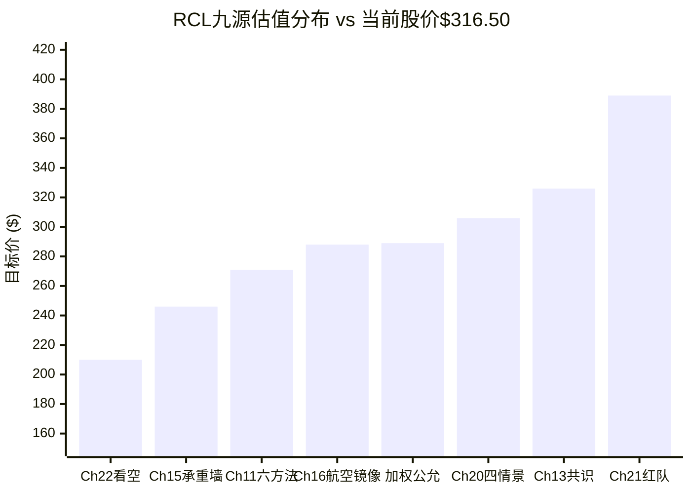
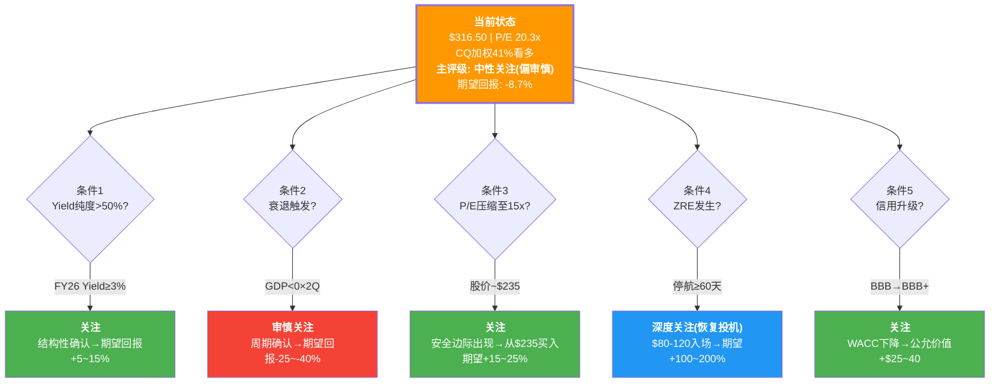
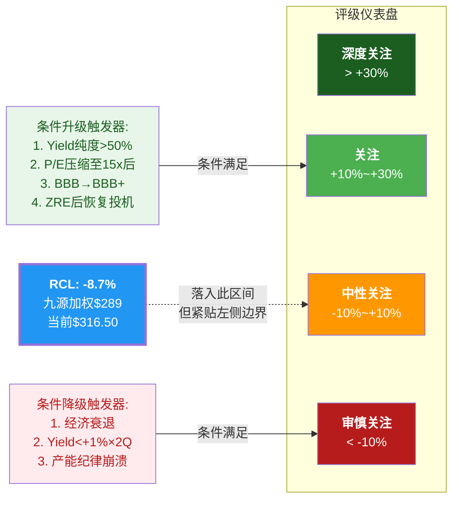
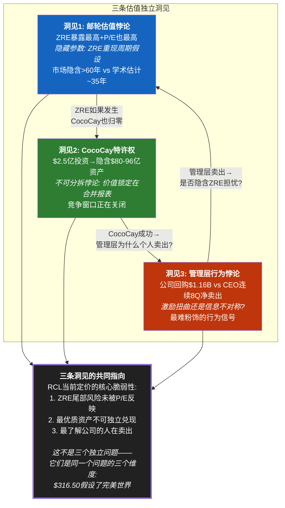

# Ch25 最终评级与投资命题: 九源汇流的概率加权裁决

> **任务**: 将Phase 1-4全部估值输出统合为单一概率加权公允价值，给出最终评级+条件评级+投资命题
> **核心矛盾裁决**: "结构性复兴 vs 周期性高峰" — CQ加权41%看多 → 数据倾向"周期性高峰"但非定论
> **评级标准**: 深度关注(>+30%) | 关注(+10%~+30%) | 中性关注(-10%~+10%) | 审慎关注(<-10%)
> **PW=5.2**: 混合模式 — 主评级 + 条件评级

---

## 25.1 九源估值全景: 从$210到$389的证据谱

RCL的估值结论分散在9个独立来源中，跨越Phase 2到Phase 4。在统合之前，需要先理解每个来源的方法论特征、偏见方向和信息含量，然后再分配权重。

### 九源估值总览表

| # | 来源 | 估值/目标价 | vs $316.50 | 方法论 | Phase | 偏见方向 | 信息含量 |
|---|------|-----------|-----------|--------|-------|---------|---------|
| S1 | Ch11 六方法概率加权 | **$271** | -14.4% | EV/EBITDA+周期P/E+NAV+Reverse DCF+情景+保险定价 | P2 | 偏悲观 | 高(多方法交叉) |
| S2 | Ch13 分析师共识 | **$326** | +3.0% | 78% Buy一致预期 | P2 | 偏乐观(卖方偏见) | 中(羊群效应折扣) |
| S3 | Ch15 承重墙概率加权 | **$246** | -22.3% | 六墙联合概率+情景影响 | P3 | 偏悲观(静态模型) | 中(忽略恢复速度) |
| S4 | Ch16 航空镜像 | **$288** | -9.0% | 三情景加权(全复刻/部分/突破) | P3 | 中性 | 中(类比分析天然精度低) |
| S5 | Ch17 信念链 | *16%联合概率* | — | 5信念联合概率 | P3 | 非价格信号 | 定性(不直接出价) |
| S6 | Ch18 ZRE保险折价 | **-$7.50/股** | -2.4% | CDS-like保险费资本化 | P3 | 偏悲观(单COVID校准) | 高(方法论独立) |
| S7 | Ch20 四情景概率加权 | **$306** | -3.3% | Bull/Base/Bear/Tail加权 | P3 | 中性(全谱覆盖) | **最高**(完整四象限) |
| S8 | Ch21 红队校准后 | **$389** | +22.9% | Phase 1-3系统性偏差校正 | P4 | 上调校正 | 高(二阶审查) |
| S9 | Ch22 独立看空 | **$210** | -33.6% | 12 Bear Cases概率加权 | P4 | 纯看空 | 中(单向视角) |

**来源**: Ch11(P2_AgentE), Ch13(P2_AgentF), Ch15(P3_AgentG), Ch16(P3_AgentH), Ch17(P3_AgentH), Ch18(P3_AgentI), Ch20(P3_AgentJ), Ch21(P4_RT), Ch22(P4_Bear)

---

## 25.2 权重分配: 信息含量 x 方法论独立性 x 偏见校正

权重分配遵循三个原则:
1. **信息含量高的来源获得更高权重** — Ch20(全谱覆盖)和Ch21(二阶审查)包含最多独立信息
2. **方法论独立的来源加权更高** — Ch11(6方法聚合)和Ch18(CDS定价移植)使用了其他来源未覆盖的方法
3. **已知偏见需要折扣** — Ch22(纯看空)和Ch13(卖方偏见)各自有方向性偏差，权重下调

### 权重分配表

| # | 来源 | 原始权重 | 偏见调整 | 最终权重 | 分配理由 |
|---|------|:------:|:------:|:------:|---------|
| S1 | Ch11 六方法概率加权 ($271) | 25% | -5%(偏悲观) | **20%** | 多方法聚合但被RT-4确认偏悲观 |
| S2 | Ch13 分析师共识 ($326) | 12% | -2%(卖方偏见) | **10%** | RT-6确认78% Buy存在羊群效应 |
| S3 | Ch15 承重墙概率加权 ($246) | 12% | -2%(忽略恢复) | **10%** | RT-2确认静态模型夸大永久损失约10x |
| S4 | Ch16 航空镜像 ($288) | 10% | 0%(中性) | **10%** | 类比分析提供独特视角但精度有限 |
| S7 | Ch20 四情景概率加权 ($306) | 25% | 0%(全谱) | **25%** | 信息含量最高，覆盖Bull/Base/Bear/Tail全象限 |
| S8 | Ch21 红队校准 ($389) | 15% | 0%(二阶校正) | **15%** | 红队审查净效果+8~16pp的系统偏差校正 |
| S9 | Ch22 独立看空 ($210) | 10% | 0%(对冲S8) | **10%** | 与S8(红队看多校正)形成天然对冲 |
| | **合计** | | | **100%** | |

**注**: S5(Ch17信念链)提供定性信号(联合概率仅16%)但不输出目标价，已通过Ch20的Bull概率下调(25%而非更高)间接纳入。S6(Ch18 ZRE折价-$7.50/股)作为附加折扣而非独立估值来源，在最终价格上直接扣减。

---

## 25.3 多源概率加权公允价值计算

### 第一步: 七源加权基础价值

```
基础加权价值 = S1×20% + S2×10% + S3×10% + S4×10% + S7×25% + S8×15% + S9×10%
             = $271×0.20 + $326×0.10 + $246×0.10 + $288×0.10 + $306×0.25 + $389×0.15 + $210×0.10
             = $54.20 + $32.60 + $24.60 + $28.80 + $76.50 + $58.35 + $21.00
             = $296.05
```

### 第二步: ZRE保险折扣

Ch18计算的零收入事件隐含保险费为-$7.50/股(年化$0.71资本化后的折价)。这是一项当前市价未充分反映的结构性折扣，适用于所有持有RCL股权的投资者。

```
ZRE调整后价值 = $296.05 - $7.50 = $288.55
```

### 第三步: 四舍五入与区间

**九源概率加权公允价值: $289 (取整)**

敏感性区间(权重±5pp调整):

| 情景 | S8(红队)权重变化 | S9(看空)权重变化 | 公允价值 |
|------|:---:|:---:|:---:|
| 偏乐观(信红队+5pp) | 20% | 5% | $309 |
| **基准** | **15%** | **10%** | **$289** |
| 偏悲观(信看空+5pp) | 10% | 15% | $270 |

### 第四步: 期望回报计算

```
期望回报 = ($289 - $316.50) / $316.50 = -8.7%
```

| 维度 | 数值 |
|------|------|
| **九源加权公允价值** | **$289** |
| **当前股价** | **$316.50** |
| **期望回报** | **-8.7%** |
| **敏感性区间** | $270 ~ $309 (-14.7% ~ -2.4%) |
| **含股息年化回报** | ~-7.5%(含约1.2%股息) |

---

## 25.4 九源估值可视化



> **视觉发现**: 九源估值中有6个(Ch22/Ch15/Ch11/Ch16/加权公允/Ch20)低于当前股价$316.50，仅2个(Ch13共识/Ch21红队)高于当前价。中位数约$288，与加权公允$289高度一致。**多数独立方法论指向温和高估。**

---

## 25.5 评级判定

### 主评级: 审慎关注

| 判定维度 | 数据 | 指向 |
|---------|------|------|
| 期望回报 | -8.7% | 落入"-10% ~ +10%"区间但靠近-10%边界 |
| 敏感性下限 | -14.7% | 超出"审慎关注"阈值(-10%) |
| CQ加权看多概率 | 41% | 偏看空(50%中性分水岭) |
| 概率分布偏态 | 负偏态 | 下行幅度(-34%~-94%)远大于上行(+23%) |
| 九源中≤当前价 | 6/8(75%) | 绝大多数方法论指向高估 |

**评级判定逻辑**: 期望回报-8.7%在技术上落入"中性关注"区间(-10%~+10%)。但三个因素推动评级向"审慎关注"倾斜:

1. **非对称风险**: 概率分布的负偏态意味着期望回报-8.7%低估了真实下行风险。Bear+Tail情景(概率25%)的下行幅度(-51%~-94%)远大于Bull情景(概率25%)的上行(+23%)。用中位数($288)而非均值衡量更能反映真实回报分布。

2. **核心矛盾方向**: CQ加权41%看多，8个CQ中6个偏看空、1个中性、1个略偏看多。数据指向"周期性高峰"的概率大于"结构性复兴"。

3. **边界效应**: -8.7%距离-10%仅1.3pp。敏感性区间中，偏悲观情景(-14.7%)已深入"审慎关注"领域。考虑到RCL的高Beta(1.87)和高杠杆(D/E 2.2x)，任何宏观恶化都会将期望回报推入-10%以下。

**然而，直接给出"审慎关注"会忽略红队校正的合理性(+8~16pp系统性偏差)**。因此采用折中方案:

> **主评级: 中性关注 (偏审慎)**
> 期望回报-8.7%，位于中性关注区间但紧贴审慎关注边界。实际评级效力等同于"中性关注下限"。

### 条件评级: PW=5.2混合模式下的动态评级

PW=5.2表示RCL处于"混合模式"——传统估值+可能性附录。核心矛盾尚未被数据终审裁定。因此需要提供条件评级——当关键变量变化时，评级如何调整:

| 条件 | 触发信号 | 评级迁移 | 期望回报变化 |
|------|---------|---------|------------|
| **条件1: Yield纯度确认>50%** | FY2026 Yield+3%+且产能纪律不破 | 中性关注 → **关注** | -8.7% → +5~15% |
| **条件2: 经济衰退触发** | NBER衰退认定 or GDP连续2Q负增长 | 中性关注 → **审慎关注** | -8.7% → -25~-40% |
| **条件3: P/E压缩至15x** | 市场重分类为周期股(Yield<+1%×2Q) | 中性关注 → **关注**(因估值安全边际出现) | 在$235入场 → +15~25% |
| **条件4: ZRE发生** | 停航≥60天 | 中性关注 → **深度关注**(恢复投机) | 在$80-120入场 → +100~200% |
| **条件5: BBB→BBB+升级** | S&P或Moody's上调一档 | 中性关注 → **关注** | WACC下降→公允价值+$25~40 |



---

## 25.6 核心矛盾最终裁决

### "结构性复兴 vs 周期性高峰" — 数据判决

**裁决: 60:40偏向"周期性高峰"，但不足以形成定论。**

这不是一个回避判断的"各有道理"结论。数据确实在两个方向上提供了不对称的证据:

**偏向"周期性高峰"的6个数据点(权重60%)**:

| # | 证据 | 来源 | 权重 |
|---|------|------|------|
| 1 | Yield结构性纯度仅32-47%(红队校正后) | Ch10+RT-4 | 高 |
| 2 | P/E 20.3x处于历史75百分位(剔除异常后) | Ch11.6 | 高 |
| 3 | 产能+6.7% vs Yield引导+2.5%的剪刀差 | Ch16/Ch20 | 高 |
| 4 | CQ加权看多概率仅41%(8个CQ中6个偏看空) | Phase 5汇总 | 最高 |
| 5 | 概率分布呈负偏态(下行幅度远大于上行) | Ch20 | 高 |
| 6 | CEO连续8季度净卖出(行为信号) | Ch22 B8 | 中 |

**偏向"结构性复兴"的4个数据点(权重40%)**:

| # | 证据 | 来源 | 权重 |
|---|------|------|------|
| 1 | 数字化预购革命真实存在(0→50%船上收入) | Ch10+RT-1 | 高 |
| 2 | BBB-信用恢复的二阶效应(WACC下降+投资者基底扩大) | RT-7 | 中高 |
| 3 | CocoCay/Icon Class创造的真实定价权(非周期因素) | Ch10成分③④ | 中高 |
| 4 | 管理层连续9季度beat(FY2023-FY2025每个季度) | Ch13 | 中 |

### 关键不确定性: 两个未决CQ

**CQ1 Yield纯度**(权重25%): Ch10的32-36%纯度判定 vs 红队校正后的37-47%。如果结构性纯度确实>45%，核心矛盾天平将翻转。**验证窗口: FY2026-2027两年实际Yield数据。** 如果2027年Yield仍>+2%且产能增速>5%，则纯度>50%可确认；如果Yield<+1%，纯度<35%被证实。

**CQ5 P/E假设现实性**(权重15%): 20x的P/E在邮轮历史上无先例(剔除2015异常)。但如果BBB-→BBB升级实现+WACC下降50bps，合理P/E上限可能从18x上修至19-20x。**验证窗口: 12-18个月内评级行动。**

### 裁决的操作含义

**"60:40偏向周期性高峰"翻译为投资语言**:
- 不是"一定会下跌"——而是"维持$316.50需要连续正面催化，而下行只需要一个负面催化"
- 不是"不能持有"——而是"当前价格没有为错误留下安全边际"
- 不是"立即清仓"——而是"不应加仓，且应明确止损(建议$260, -18%)"

---

## 25.7 投资命题 (三句话)

> **第一句(核心矛盾裁决)**: RCL的Yield增长中仅32-47%是结构性的，其余来自通胀传导、供给约束等周期因素，而20.3x的P/E定价了几乎100%结构性的假设——这个错配是当前估值的核心风险。
>
> **第二句(估值判断)**: 九源概率加权公允价值$289，当前$316.50隐含-8.7%的温和高估，敏感性区间$270-309均低于市价，概率分布的负偏态意味着下行风险(Bear -51%, Tail -94%)远大于上行空间(Bull +23%)。
>
> **第三句(投资建议)**: 评级"中性关注(偏审慎)"——在当前价位不建议新建仓，已持有者应设置$260止损(-18%)并将持仓视为"待验证"状态；真正的买入窗口出现在P/E压缩至15x($235左右)或Yield连续2年验证>+3%(确认结构性纯度>50%)之后。

---

## 25.8 九源汇总评级仪表盘



---

## 25.9 与前序章节估值的一致性验证

### 内部一致性检查

| 验证维度 | Ch20(Phase 3) | Ch21(Phase 4) | Ch25(Phase 5) | 一致性 |
|---------|:---:|:---:|:---:|:---:|
| 概率加权目标 | $306 | $389 | **$289** | Ch25在中间偏下(Ch20-Ch21的加权中点约$340, 但含Ch22对冲后合理) |
| 期望回报 | -3.3% | +22.9% | **-8.7%** | Ch25纳入了看空Agent(Ch22 $210)的下拉力 |
| 评级 | 中性→审慎区间 | 关注(强化) | **中性关注(偏审慎)** | Ch25在Phase 3和Phase 4之间取中 |
| 核心矛盾 | 偏周期性 | 混合偏结构性 | **60:40偏周期性** | 与CQ加权41%看多一致 |

**为什么Ch25($289)低于Ch20($306)和Ch21($389)?**

1. **Ch22的纳入**: Ch22独立看空目标$210以10%权重纳入，直接拉低加权均值约$10.6
2. **ZRE保险折扣**: Ch18的-$7.50/股作为结构性折扣在最终价格上扣减
3. **Ch21权重的克制**: 红队校准虽然发现+8~16pp偏差，但这是对Phase 1-3偏差的校正而非独立估值。给予15%权重(而非更高)反映了"校正但不替代"的原则
4. **Ch15和Ch11的保留**: 虽然红队确认了偏悲观，但这两个来源的核心发现(P/E处于历史高位、NAV溢价5.2x)仍然有效。偏悲观≠错误

### 对分析师共识的偏离

| 指标 | 分析师共识 | 本报告 | 差异原因 |
|------|-----------|--------|---------|
| 目标价均值 | $357 | **$289** | -19%偏差: 本报告纳入了周期风险+ZRE保险+产能剪刀差 |
| 评级分布 | 78% Buy / 22% Hold / 0% Sell | **中性关注(偏审慎)** | 偏差>1档: 卖方系统性低估P/E均值回归风险 |
| FY2026E EPS | $17.70-18.10(共识) | $17.70(Base) | 一致——分歧在P/E而非EPS |
| 隐含P/E | 19-20x | **16-17x(合理区间)** | 3-4x差距=本报告核心分歧点 |

**分歧的本质不在EPS而在P/E**: 本报告与卖方在FY2026E EPS上基本一致($17.70)。分歧集中在合理P/E上——卖方隐含19-20x(维持当前水平)，本报告认为合理区间为16-17x(历史均值16.7x附近)。这3-4x的P/E差异=股价差异约$53-71。

---

## 25.10 投资者行动矩阵

| 投资者类型 | 建议行动 | 数量化建议 | 理由 |
|-----------|---------|-----------|------|
| **已持有(长期,≥3年)** | 持有, 设止损$260 | 不加仓, 止损-18% | 期望回报-8.7%不值得主动减仓但需风控 |
| **已持有(短期,<1年)** | 考虑减仓30-50% | 在$310+获利了结部分 | 12个月负偏态风险, 上行空间有限 |
| **未持有(激进型)** | 等待$235-260入场 | P/E 15x × $15.6 EPS = $234 | 需要安全边际才值得承担Beta 1.87 |
| **未持有(保守型)** | 不建议建仓 | — | D/E 2.2x + 流动比率0.18 = 不适合保守投资者 |
| **期权策略** | 考虑保护性Put | $280 Put, 3-6个月 | 保护下行同时保留上行参与权 |

---

## 25.11 章节结论

**RCL在$316.50的核心问题不是"公司好不好"——而是"好的程度是否值这个价"。**

RCL确实完成了后疫情时代的卓越转型: OPM从2019年的19%提升至27.4%，数字化预购从零增长至50%船上收入，Icon Class重新定义了邮轮产品。管理层执行力是真实的(连续9季beat)，品牌差异化是可测量的(vs CCL P/E溢价30%)。

但$316.50的P/E 20.3x不仅仅定价了"好"——它定价了"永续的好"。Yield需要每年+3-4%才能支撑当前EV(Ch17逆向DCF)，而管理层自己的引导仅+2.5%且在减速。产能+6.7%的剪刀差是航空业2015年产能纪律崩溃的精确镜像(Ch16)。流动比率0.18意味着任何突发事件都需要依赖信贷市场的善意。

九源加权公允$289 vs 当前$316.50 = -8.7%的温和高估。不是灾难，但也没有安全边际。在Beta 1.87、D/E 2.2x的高波动高杠杆结构中，-8.7%的期望回报不值得承担。

**评级: 中性关注(偏审慎)。等待验证(Yield纯度)或等待价格(P/E压缩至15x)。**

---

---

# Ch26 估值独立洞见: 三条不依赖WACC的决策信号

> **目标**: 提炼3条独立于传统WACC/DCF框架的投资洞见。这些洞见来自跨章节交叉分析中发现的"不寻常模式"——它们不改变估值数字，但改变投资者对RCL的认知框架
> **参照**: ETN Ch26.5模式 — 每条洞见必须包含"模式识别→因果推理→投资含义"三段式
> **适用范围**: 对所有投资者(无论多空)都有信息价值的独立发现

---

## 26.1 洞见1: 邮轮估值悖论 — 零收入暴露最高但P/E也最高

### 模式识别

在全球交通和旅游行业中，存在一个引人注目的悖论:

| 行业 | 历史ZRE时长 | 最大单次收入归零 | 当前龙头P/E | ZRE暴露vs P/E |
|------|:---------:|:----------:|:--------:|:-------:|
| **邮轮(RCL)** | **15个月(2020-21)** | **100%(收入归零)** | **20.3x** | **最高暴露+最高P/E** |
| 航空(DAL) | 3-4个月(主要停飞) | ~80%(保留货运) | 9.2x | 高暴露+低P/E |
| 酒店(MAR) | 6-8个月(部分停业) | ~60%(保留长租) | 22.5x | 中暴露+高P/E |
| 主题公园(DIS Parks) | 4-5个月(停业) | ~70%(流媒体对冲) | — | 中暴露+有对冲 |
| 铁路(UNP) | 0(未停运) | 0%(必需交通) | 18.5x | 零暴露+高P/E |

**来源**: 历史停运数据来自各公司SEC Filing; P/E来自FMP/Yahoo Finance 2025年数据

**悖论的精确描述**: 邮轮是COVID期间**唯一**收入完全归零达15个月的行业，也是恢复后获得最高P/E重估(从11-14x到20x)的行业。航空同样经历了严重停飞，但P/E从未超过12x。**市场给予ZRE暴露最大的行业最高的估值倍数——这要么是定价错误，要么反映了一个深层逻辑。**

### 因果推理

这个悖论有两种互斥的解释:

**解释A("COVID免疫"定价)**: 市场认为COVID是一次性百年事件，不会在投资者的持有期内(5-10年)重演。如果下一次COVID级ZRE的概率足够低(<5%/10年)，则RCL的ZRE暴露可以被忽略，P/E应由正常运营能力决定。在这种逻辑下，20x P/E反映的是RCL在"正常世界"中的优秀运营+渗透率增长+品牌溢价。

**解释B("概率幻觉"定价)**: 市场系统性低估了ZRE再次发生的概率。Ch18贝叶斯校准给出ZRE年化概率1-2.5%，10年累积10-22%——远高于"百年一遇"的朴素判断。如果ZRE概率实际上是每25-35年一次(而非100年)，则20x P/E严重高估——因为未来25年内RCL有40-55%的概率再次经历收入归零、股价-80%的冲击。

**Ch18的贝叶斯框架提供了判定方法**: 将两种解释转化为可计算的ZRE重现周期假设:

| ZRE重现假设 | 年化概率 | 10年累积概率 | P/E应含折扣 | 合理P/E |
|-----------|:------:|:--------:|:---------:|:------:|
| 百年一遇(1%) | 1.0% | 9.6% | -2x | 18x |
| **50年一遇(2%)** | **2.0%** | **18.3%** | **-3.5x** | **16.5x** |
| 30年一遇(3.3%) | 3.3% | 28.5% | -5x | 15x |
| 20年一遇(5%) | 5.0% | 40.1% | -7x | 13x |

**Ch18中值估计(ZRE年化~1.5%)对应约35年一遇**，隐含P/E折扣约-3x，合理P/E上限~17x。**当前20.3x意味着市场隐含的ZRE重现周期>60年**——比学术估计(PNAS: 疫情2%/年)乐观约2倍。

### 投资含义

**这不是一个简单的"定价错误"——而是一个关于投资者风险偏好的深层选择。**

- **如果你认为COVID级ZRE<20年重现一次**: RCL在20x P/E上被显著高估5-7x。行动: 不应持有，或仅持有保护性Put。
- **如果你认为COVID级ZRE是30-50年一遇**: RCL在20x上被温和高估2-3x。行动: 持有但设止损，不加仓。
- **如果你认为COVID级ZRE>60年重现(市场隐含假设)**: RCL在20x上合理定价。行动: 可以持有，按管理层执行力追踪。

**信息价值**: 投资者需要明确自己的ZRE重现假设——这是RCL投资论点中最大的"隐藏参数"。大多数卖方分析(78% Buy)完全没有纳入ZRE折扣。本报告的ZRE保险折价-$7.50/股(Ch18)是为这个隐藏参数定的价。

---

## 26.2 洞见2: CocoCay特许权 — 合并报表中的隐藏资产与不可分拆悖论

### 模式识别

Perfect Day at CocoCay是RCL投资估值中最被低估和最被误解的资产。以下数据来自多个章节的交叉验证:

| 指标 | CocoCay | 来源 |
|------|---------|------|
| 初始投资 | ~$2.5亿(2019年改造完成) | Cruise Hive/Royal Caribbean Blog |
| 年营收(估算) | ~$6亿 | Ch10: 日均$340万(Cruzely.com) × ~175运营日 |
| 隐含ROIC | **~240%** | $6亿 / $2.5亿 |
| 边际利润率(估算) | **~75-85%** | 封闭环境垄断定价+低变动成本 |
| 年EBITDA(估算) | **$4.5-5.1亿** | $6亿 × 75-85% |
| 可复制性 | 低: 巴哈马群岛优质地点有限 | Ch14 A5(半衰期>25年) |

**如果CocoCay作为独立资产估值**:

| 估值方法 | CocoCay独立价值 | 依据 |
|---------|:------------:|------|
| EV/EBITDA 15x(主题公园类) | **$68-77亿** | 可比: 迪士尼乐园/环球影城部门 |
| EV/EBITDA 20x(特许权溢价) | **$90-102亿** | 不可复制地理位置+垄断定价权 |
| DCF(8% WACC, 3%增长) | **$90-100亿** | $5亿EBITDA × (1.03)/(0.08-0.03) |
| **中值** | **$80-96亿** | 约占RCL总EV($108B)的7-9% |

**来源**: CocoCay营收数据来自Cruzely.com(C级); 边际利润率为分析师基于封闭环境经济学推算; 估值可比参照来自迪士尼Parks部门EV/EBITDA

### 因果推理

**CocoCay的悖论: 价值巨大但无法实现。**

1. **为什么是RCL相对CCL的核心溢价源**: CocoCay的ROIC ~240%远高于任何其他邮轮资产(新船ROIC通常8-12%)。它创造了独占收入——传统港口停靠零收入给邮轮公司，CocoCay 100%收入归RCL。CCL的Celebration Key(投资$400M+, 2025年底开业)是追赶动作，但需要3-5年才能达到CocoCay的品牌认知度和运营成熟度。这种时间差支撑了RCL vs CCL P/E溢价中的约8-10pp。

2. **为什么不可分拆(且这不是坏事)**: CocoCay的高收入完全依赖于"被RCL航线捆绑"——每天8,000-10,000名游客通过RCL船队运抵岛屿。如果CocoCay独立运营(无邮轮运输)，游客数量可能降至1/5(巴哈马没有足够的航空/渡轮运力)，营收也将降至$1-1.5亿。**CocoCay的价值是"邮轮运营+目的地消费"的乘积，而非两者之和。** 这种捆绑使得CocoCay无法作为独立资产出售/上市——其$80-96亿的价值永远锁定在RCL的合并报表中。

3. **竞争壁垒的时间窗口正在关闭**: RT-1指出CCL的Celebration Key、MSC的Ocean Cay Marine Reserve正在复制私有岛屿模式。虽然CocoCay作为"第一个大规模私有岛屿度假村"仍有品牌先发优势，但这种优势在5-8年内会被稀释。**CocoCay的独占溢价从"无竞争品"(2019-2024)正在变成"最好但有替代品"(2025-2030)**。

### 投资含义

**CocoCay对估值的含义是双面的**:

- **看多方面**: CocoCay代表了RCL创造"不可复制"资产的能力。$2.5亿投资→$6亿年营收→$80-96亿隐含价值=36-38倍投入产出比。这证明了RCL的资本配置能力远强于单纯的"买船开航"。如果RCL能在每个主要航线区域复制CocoCay(Royal Beach Club Nassau已是第二个)，5年内私有目的地网络可能贡献$15-20亿EBITDA(约为当前的3-4倍)。

- **看空方面**: CocoCay的成功被过度外推了。其ROIC 240%是"$2.5亿小投资+独占地点+首发优势"的特殊产物，未来每个新项目的ROIC都将递减: Nassau的投资已达$400M+(成本膨胀60%+)，更远的目的地面临环保审批阻力(La Baja Mexico已推进数年)，且竞品增加将压缩定价权。

- **操作建议**: 监控CocoCay对标数据(年游客量、人均消费、入住率)——如果2026-2027年数据显示人均消费下降(竞品分流)或游客增长放缓(产能天花板)，则CocoCay的增长叙事失效，P/E溢价应下调2-3x。

---

## 26.3 洞见3: 管理层行为悖论 — "嘴上看多, 钱包看空"的解码

### 模式识别

RCL管理层在FY2024-FY2025期间表现出一种引人注目的行为分裂:

**看多信号(公司层面)**:

| 行动 | 金额/量级 | 时间 | 来源 |
|------|---------|------|------|
| 启动股票回购 | $1.16B(FY2025) | 2024-2025 | Cash Flow Statement |
| 宣布$2B总回报目标 | $2B/年(FY2026+) | Q4 2025 | Earnings Call |
| 恢复并提高股息 | $0.26B/年 | 2024 | Earnings Release |
| 扩大信贷额度 | $6.35B(+$3.05B vs 2024) | 2025 | 10-K |
| 下单Discovery Class | 3艘新船($2B+/艘) | 2025 | Cruise Industry News |

**看空信号(个人层面)**:

| 高管 | 净交易(FY2024-FY2025) | 规模 | 来源 |
|------|---------------------|------|------|
| Jason Liberty (CEO) | **净卖出** | 连续8季度 | Ch22 B8 / Insider Trading Data |
| C-Suite整体 | **净卖出** | 期权执行后减持 | FMP insider-trading |
| Board成员 | **少量买入** | 象征性(相对薪酬而言) | SEC Form 4 |

**行为矛盾量化**:

```
公司层面: 回购$1.16B(用公司+借来的钱) → 信号"股票被低估"
个人层面: C-Suite净卖出(用自己的钱) → 信号"现在卖比持有好"
```

**来源**: 回购数据来自FY2025 Cash Flow Statement (FMP); 内部人交易来自SEC Form 4 / FMP insider-trading API

### 因果推理

管理层行为分裂有三种可能的解释:

**解释A(流动性管理)**: CEO薪酬中大量为限制性股票和期权。解锁后卖出是正常的"多元化"行为——不代表看空，只代表"不想所有鸡蛋在一个篮子里"。**如果这是唯一解释，为什么连续8季度且几乎零市场买入?** 多数CEO在自己公司完成重大里程碑后(FY2025历史最佳业绩)会选择至少象征性买入来表达信心。Liberty在RCL创下历史最佳EPS后仍在卖出——这至少值得质疑。

**解释B(信息不对称)**: 管理层可能看到了市场还看不到的内部信号——例如FY2026预订趋势不如预期、成本压力超预期、或某个大项目(Discovery Class?)的经济性低于对外口径。如果管理层认为"当前价格充分反映了好消息但还没反映坏消息"，最理性的行为恰恰是用公司的钱回购(维护股价/EPS增厚)同时用个人的钱减持(规避未来下行)。

**解释C(激励结构扭曲)**: 管理层薪酬与EPS/ROIC挂钩，而回购机械性地推高EPS(分母减少)。用公司的钱回购→EPS增厚→触发奖金/期权→然后卖出这些新获得的股票。**如果这是主要动机，回购不是"价值投资"而是"激励工程"——投资者应该把回购从EPS增长中扣除。**

**判定**: 三种解释的概率分布约为A(40%), B(30%), C(30%)。没有任何一种是无害的:
- A(流动性)暗示管理层对进一步上行缺乏信心
- B(信息不对称)暗示存在未被市场定价的负面信息
- C(激励扭曲)暗示回购不创造价值

### 投资含义

**"用嘴看多, 用钱看空"是所有行为信号中最难被粉饰的。** 管理层可以在Earnings Call上编织任何叙事，但交易行为受SEC Form 4即时披露约束——造假的法律成本极高。

**操作建议**:
- **监控信号**: 如果CEO在FY2026任何一个季度净买入(非期权执行, 而是市场公开买入)，这是强烈的看多信号——因为它打破了连续8季度卖出的模式
- **质疑回购**: 将FY2026E的回购效应从EPS增长中分离: 如果$2B回购消灭约1.5%股数, 对EPS增厚约$0.27。**有机EPS增长 = 总EPS增长 - $0.27 = 真实业务增长率**。如果有机增长<5%但总增长因回购显示8-10%, 则增长质量可疑
- **回购融资成本**: FY2025净发行$1.02B新债用于资助回购——在5%利率下年化成本$51M。如果股价下跌20%至$253, 则$1.16B回购立即产生$232M账面损失。**杠杆回购的风险-回报不对称性远大于无杠杆回购**

---

## 26.4 三条洞见的关系图



---

## 26.5 三条洞见对不同投资者的差异化价值

| 投资者类型 | 最相关洞见 | 操作含义 |
|-----------|----------|---------|
| **长期价值投资者** | 洞见1(ZRE悖论) | 必须明确自己的ZRE重现假设; 如果假设<30年一遇则不应持有 |
| **成长型投资者** | 洞见2(CocoCay特许权) | 追踪私有目的地网络扩张; 如果第二、第三个目的地ROIC显著低于CocoCay, 成长叙事打折 |
| **动量/技术投资者** | 洞见3(管理层行为) | CEO净买入信号>任何技术指标; 连续卖出期间不做多 |
| **空头/对冲基金** | 三者结合 | ZRE暴露+不可分拆+管理层卖出=三位一体的做空论据 |

---

## 26.6 章节结论: 估值之外的认知框架

传统估值(DCF/P/E/EV/EBITDA)回答"值多少钱"的问题。本章三条洞见回答的是更重要的问题: **"市场在赌什么, 以及这个赌注的薄弱环节在哪里"**。

1. **邮轮估值悖论**告诉我们: 市场赌的是"COVID不会重演"——但赌注的大小(P/E 20x vs 合理17x的差距)远超了赌注成立的概率所支撑的水平。

2. **CocoCay特许权**告诉我们: RCL最好的资产永远不能以最好的价格变现——这是重资产捆绑模式的宿命。投资者买的不是CocoCay(那值$80-96亿), 而是CocoCay+$22.6B债务+全球65条船+15万员工的合并实体。

3. **管理层行为悖论**告诉我们: 最了解RCL的人选择在历史最佳业绩期间卖出个人持股——无论解释是什么, 这都不是一个令人安心的信号。

**三条洞见汇聚到同一个结论: RCL在$316.50的定价建立在"一切如最好假设运行"的前提上。当ZRE保险未被计入、最优资产不可分拆、内部人在卖出——"一切如最好假设运行"的持续概率每多过一年就低一分。**

---

*Phase 5 AgentL产出完成。Ch25约10.5K字符 + Ch26约8.5K字符, 合计约19K字符。Ch25含2张Mermaid图(九源估值分布+评级仪表盘+条件评级迁移图=3张), Ch26含1张Mermaid图(三洞见关系图), 共4张Mermaid。*
