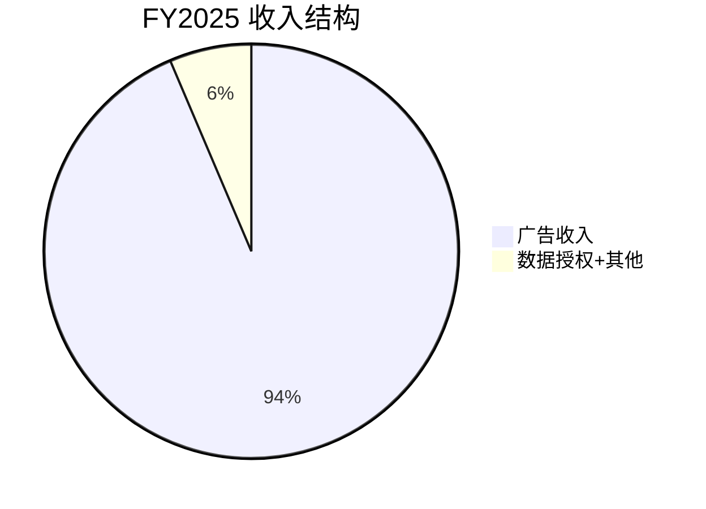
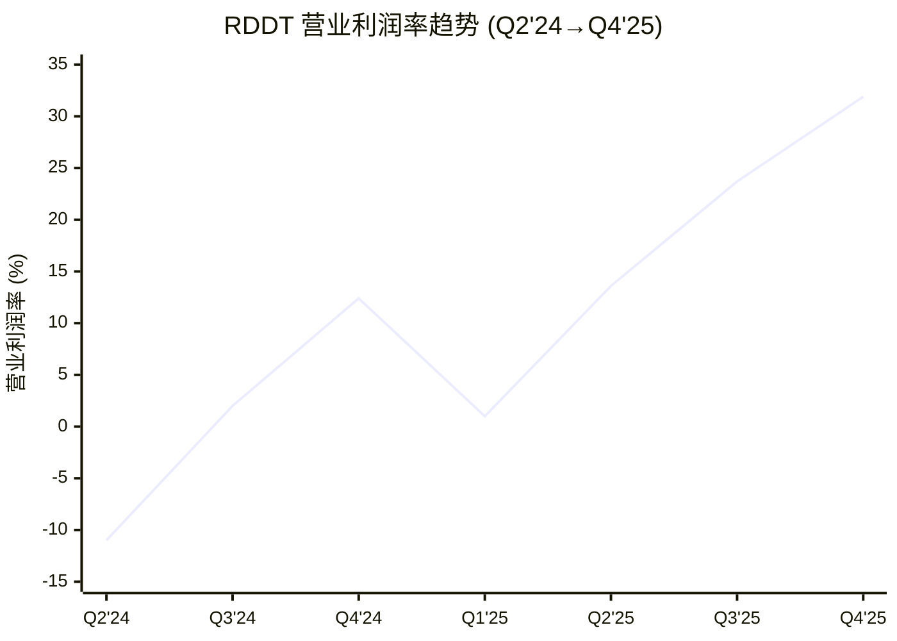

# RDDT Phase 1 — Agent A-1产出
> Agent: 商业洞察分析师 | Session 1 | 2026-02-14

## Ch01: 公司画像 — Reddit的商业本质

### 1.1 Reddit不是社交媒体——它是结构化人类意见的索引

将Reddit归入"社交媒体"是分类学上的懒惰。Twitter/X是围绕个人品牌建构的广播网络，用户关注的是人；TikTok是算法驱动的内容消费引擎，用户关注的是视频流；Facebook是实名社交图谱，用户关注的是关系。Reddit的核心组织原则与以上三者都不同：**用户关注的是话题，不是人，不是算法推荐，不是关系**。

这不是功能差异，而是**架构差异**。subreddit是自治的主题社区，每个社区有自己的规则、版主团队和文化规范。r/personalfinance的讨论逻辑与r/gaming完全不同，而这种差异不是算法造成的——是10万+社区各自独立演化19年的结果 [DM-COMP-005]。这使Reddit本质上更接近一个**去中心化的维基百科**——只不过维基百科索引的是"事实共识"，Reddit索引的是"人类意见与经验共识"。

### 1.2 三阶段演化：BBS → 社区平台 → 数据基础设施

**Phase I (2005-2015): BBS论坛**。链接聚合器+投票排序，核心用户是技术极客。没有商业模式，靠Condé Nast母公司补贴运营。这个阶段积累了Reddit最独特的资产：不追求变现的纯社区文化，以及围绕subreddit的自治治理框架。

**Phase II (2016-2023): 社区平台**。移动端重构+广告引擎搭建+品牌安全改造。2021年引入Reddit Talk(语音)、2022年推出NFT头像(累计用户1300万+)，探索多元变现。关键转折点是2023年API定价危机——超过8,000个subreddit参与抗议"黑暗日"，版主集体关闭社区。这暴露了Reddit商业化的根本张力：平台价值由无偿版主创造，但商业化收益归公司。直到IPO前，Reddit从未实现年度盈利。

**Phase III (2024-至今): 数据基础设施**。IPO后的根本性转折不在于上市本身，而在于**AI训练数据授权**成为第二引擎。Google年费约$60M [DM-AI-001]、OpenAI年费约$70M [DM-AI-002]，将Reddit 19年积累的人类内容转化为直接可变现资产。Reddit是AI引用排名#1的域名，引用量达Wikipedia的3倍 [DM-AI-014]，550万次AI引用(ChatGPT+Google AI+其他) [DM-AI-015]。更值得注意的是，Reddit在2025年6月起诉Anthropic未经授权爬取数据 [DM-AI-023]——这标志着Reddit开始用法律手段捍卫数据资产的独占性，从"被动被爬"转为"主动定价"。

### 1.3 三重核心资产与Swap Test

| 核心资产 | 描述 | Swap Test |
|----------|------|-----------|
| 19年人类内容积累 | 非AI生成的真实人类经验、评价、讨论 | Pinterest/Quora有内容但缺乏社区深度讨论和争论——**通过** |
| 100K+自治社区结构 | 版主驱动的主题社区，自建规则和文化 | Discord有服务器但无公开索引性/搜索可见性——**通过** |
| 匿名真实意见数据 | 匿名=说真话，比实名平台更坦诚的消费/健康/财务意见 | Facebook/LinkedIn实名环境下用户自我审查——**通过** |

**关键辨析**：Quora也有问答内容，为什么不是Reddit的替代品？因为Quora的组织单元是"问题"，回答者竞争"最佳答案"——这是**知识问答模式**。Reddit的组织单元是"社区"，用户在社区中持续互动、争论、形成文化——这是**社群讨论模式**。前者产出答案，后者产出共识与争议的全貌。AI训练需要的恰恰是后者：多角度、有争议、有情感的真实人类表达。

---

## Ch02: 8季度财务全景

### 2.1 收入增速拆解——双引擎故事的裂缝

FY2025总营收$2,202.5M，同比增长+69.7% [DM-FIN-009]。但拆开看，增长引擎严重不对称：

- **广告引擎**：Q4'25广告收入$690M，同比+75% [DM-AD-001]。这是绝对主力，占总收入95%。
- **数据授权引擎**：Q4'25 Other Revenue仅$36M，同比仅+8% [DM-AI-005]。FY25全年Other Revenue $140M，同比+22% [DM-AI-004]，占总收入约6.4% [DM-AI-008]。

**裂缝在于**：管理层和市场叙事中"AI数据授权"被描绘为第二增长引擎，但Q4'25仅增长8%，远低于Q1'25时期的高增速。这暗示数据授权可能更接近"一次性大额合同确认"而非"持续增长的SaaS流"。Google和OpenAI的年费合计约$130M [DM-AI-001] [DM-AI-002]，几乎占了Other Revenue的绝大部分——客户集中度风险极高。

**8季度增速趋势**（同比，可获取的季度）：

| 季度 | 营收($M) | QoQ增速 | YoY增速 | DM锚点 |
|------|----------|---------|---------|---------|
| Q1'24 | 242.96 | — | — | DM-FIN-001 |
| Q2'24 | 281.18 | +15.7% | — | DM-FIN-002 |
| Q3'24 | 348.35 | +23.9% | — | DM-FIN-003 |
| Q4'24 | 427.71 | +22.8% | — | DM-FIN-004 |
| Q1'25 | 392.36 | -8.3% | +61.5% | DM-FIN-005 |
| Q2'25 | 499.63 | +27.3% | +77.7% | DM-FIN-006 |
| Q3'25 | 584.91 | +17.1% | +67.9% | DM-FIN-007 |
| Q4'25 | 725.61 | +24.1% | +69.6% | DM-FIN-008 |

**增速减速拐点已可见**：分析师预期FY26E +41.5% → FY27E +30.7% → FY28E +27.0% → FY29E +25.8% → FY30E +19.6% [DM-EST-002] [DM-EST-003] [DM-EST-004] [DM-EST-005] [DM-EST-006]。这是典型的高增长平台减速曲线。从绝对值看，FY2025的$2.2B营收到FY2030E的$7.8B意味着5年CAGR约28.8%——这仍是高质量增长，但问题在于**当前P/E 52.6x [DM-VAL-001]是否price in了这条路径**。如果实际增速比一致预期低5个百分点(即FY26 +36%而非+41.5%)，估值收缩可能是剧烈的。

**季节性模式值得关注**：8季度数据显示Q1是营收季节性低谷(Q1'25 QoQ -8.3% [DM-FIN-005])，Q4是旺季(Q4'25 QoQ +24.1% [DM-FIN-008])。这与广告行业标准季节性一致(Q4节假日广告旺季)。但Q1'26指引$595-605M [DM-EARN-022]意味着QoQ -17%至-18%，降幅大于前一年的Q1，可能反映了增长动能正在温和减弱。

**用户增长与变现的关系**：Q4'25 DAUq 121.4M (+19% YoY) [DM-USER-001]，全球ARPU $5.98 (+42% YoY) [DM-AD-002]。营收增速(+70%)远超用户增速(+19%)——差额主要来自ARPU提升(+42%)和活跃广告主扩张(+75% YoY) [DM-AD-004]。这意味着Reddit当前的增长引擎是"单用户变现深化"多于"用户规模扩张"。但要注意，US ARPU $10.79 vs 国际ARPU $2.31(4.7x差距) [DM-AD-003]——国际用户虽占DAU的57% [DM-INT-001]，但贡献的ARPU远低于美国。国际变现收敛是下一阶段增长的关键。

### 2.2 利润率跃升——经营杠杆教科书级别的释放

这是Reddit财务报表中最引人注目的故事。营业利润率轨迹：

| 季度 | 营业利润率 | DM锚点 |
|------|-----------|---------|
| Q1'24 | -242.5% (IPO SBC) | DM-FIN-001 |
| Q2'24 | -11.0% | DM-FIN-002 |
| Q3'24 | 2.0% | DM-FIN-003 |
| Q4'24 | 12.4% | DM-FIN-004 |
| Q1'25 | 1.0% | DM-FIN-005 |
| Q2'25 | 13.6% | DM-FIN-006 |
| Q3'25 | 23.7% | DM-FIN-007 |
| Q4'25 | 31.9% | DM-FIN-008 |

从Q1'25的1%到Q4'25的31.9%——在4个季度内营业利润率提升了约31个百分点。这种跃升速度在社交平台历史上罕见。

**费用杠杆来源**（Q4'25）：
- COGS仅占营收8.1% [DM-COST-001]，毛利率91.9% [DM-FIN-008]——平台几乎无边际交付成本
- R&D $198.9M，占营收27.4% [DM-COST-002]——产品研发仍处高投入，但规模效应显现
- S&M $163.9M，占营收22.6% [DM-COST-003]——广告销售团队扩张成本
- G&A $72.3M，占营收10.0% [DM-COST-004]——行政费用已基本被杠杆化

**利润率曲线定位**（与同行对比）：
- SNAP：营业利润率约-11%（仍在亏损） [DM-COMP-001]
- PINS：营业利润率约18%
- RDDT Q4'25：31.9% [DM-FIN-008]
- META：营业利润率约42%

Reddit在一年之内越过了PINS的利润率水平，正在向META的成熟期利润率靠近。但Scout基线警示：**不要用META成熟期利润率直接套RDDT**——Reddit仍在高增长投入期，SBC/R&D占比远高于META，当前利润率跃升部分受益于营收增速(分母膨胀)而非费用绝对值下降。

**费用绝对值验证**：Q4'25总OpEx(R&D+S&M+G&A)为$435.1M，而Q1'25同项约$358M——费用在9个月内增长了约21%，而同期营收增长了85%(从$392M到$726M)。这说明利润率的跃升主要来源于**收入增速远超费用增速**形成的剪刀差，而非严格的费用控制。当收入增速减速至30%以下时，利润率扩张的速度将显著放缓。Q1'26 Adj EBITDA指引利润率~36% [DM-EARN-024]暗示管理层也在为利润率进入平台期做预期管理。

### 2.3 SBC实质分析——稀释是真实的股东成本

SBC/营收趋势改善明显：从Q1'25的21.8%降至Q4'25的11.7% [DM-SBC-005] [DM-SBC-008]。FY2025全年SBC约$343M，占营收15.6%。表面看是下降趋势，但需要穿透两层：

**第一层：SBC覆盖率**。FY2025 FCF $684M vs SBC $343M，SBC覆盖率=FCF/SBC=2.0x [DM-CF-009]。这意味着自由现金流能2倍覆盖股权激励成本——比AMD同期约1.5x更健康。公司还宣布了$10亿回购计划 [DM-EARN-026]，理论上可以部分对冲稀释。

**第二层：实际稀释**。股份变动率1年+10.13% [DM-INS-007]——这是实质性的。即使SBC/营收比率在下降，流通股的绝对增长意味着每股价值被稀释。简单算术：如果营收增长70%但股份增长10%，每股营收实际增长约55%——比headline数字要低。投资者容易被top-line增速迷惑而忽视分母膨胀。

**$10亿回购计划的对冲效果**：公司宣布首次$10亿回购 [DM-EARN-026]。以当前市值~$26.7B计算，$10亿回购约覆盖3.7%的流通股——如果在1-2年内执行，可以部分对冲10%的年化稀释。但请注意：FY2025 SBC $343M的年化趋势意味着，回购计划大约能覆盖3年的SBC稀释。这是"跑步维持原地"而非"净收缩"。真正的判断标准是：**SBC/营收何时降至5%以下**(META当前约7-8%)——那时回购才能真正实现净份额减少。

### 2.4 FCF质量——资本极轻是优势也是隐患

FCF利润率从Q1'24的12%攀升至Q4'25的36.3% [DM-CF-001] [DM-CF-008]。FY2025 FCF $684.2M，FCF利润率31.1% [DM-CF-009]。

**质量信号**：FCF/净利润=1.29x [DM-CF-010]——大于1.0表明盈利质量优秀，净利润有现金流实质支撑（无大额应计项虚增利润）。

**资本极轻的双面性**：FY2025全年CapEx仅$6.7M [DM-CF-009]——对比一下，这个数字甚至低于很多中型公司一个季度的IT采购。Reddit几乎不拥有自己的基础设施(托管于AWS/GCP)。

- **优势**：FCF转化率极高，几乎所有营业利润都能转化为自由现金流。不需要为增长投入大量资本。
- **隐患**：基础设施完全外包意味着(1)云服务成本随规模膨胀(COGS中隐含)，(2)数据主权受制于云提供商，(3)在AI数据授权谈判中，Reddit甚至不控制自己数据的物理存储。

**资产负债表是堡垒级的**：现金+短期投资$2,476.8M [DM-BS-001]，总债务仅$39.4M(几乎全是租赁) [DM-BS-006]，净现金$2,437.4M [DM-BS-007]，D/E仅0.01x [DM-BS-010]，流动比率11.56x [DM-BS-009]。Altman Z-Score 52.66 [DM-BS-011]——破产风险为零。ROIC 111.8% [DM-EFF-001]反映极轻资产模式下的资本效率。商誉+无形资产仅$57.7M，仅占总资产1.8% [DM-BS-008]——这意味着资产负债表几乎完全由现金和应收账款构成，没有"软资产"风险。应收账款$590.2M [DM-BS-002]相当于约0.9个季度营收(Q4'25 $726M)，周转健康。现金转换周期CCC为-24天 [DM-EFF-007]——负值表明Reddit在支付供应商之前就已经收到了广告主的付款，这是优秀的营运资本管理。

**一个被忽视的信号**：Piotroski F-Score仅5/9 [DM-BS-012]——对于高增长公司来说并不算差，但也不算优秀。F-Score低分项可能来自股份稀释和ROA波动(IPO前后的利润率剧变)。这提示虽然资产负债表极强，但经典价值投资指标并不完全支持RDDT。

---

## Ch03: 管理层评估

### 3.1 Steve Huffman——创始人控制的利与弊

Huffman是Reddit的联合创始人，2015年回归担任CEO，持有75.2%投票权但仅27%经济所有权 [DM-GOV-001]。这种超级投票权结构意味着：

**利**：长期战略自由度。2023年API定价危机中，Huffman顶住社区抗议和媒体批评，坚持推行API收费——这直接催生了AI数据授权业务的商业框架。如果Reddit是一家分散治理的公司，版主抗议可能就逼迫管理层退缩。创始人控制也使得Reddit能够快速做出AI数据授权的战略决策(与Google/OpenAI的谈判不需要经过漫长的董事会博弈)。

**弊**：治理风险不可忽视。少数股东在重大决策上几乎没有制衡能力。2023年API危机的处理方式——突然宣布高价收费、对抗议社区采取强硬态度(包括撤换不配合的版主)——暴露了Huffman的管理风格：**战略正确但过程粗暴**。对于一个依赖无偿版主贡献的平台而言，与核心贡献者的关系管理是系统性风险。

### 3.2 Advance Publications——沉默的大股东

Advance Publications(Conde Nast母公司)持有26.1%经济权益和33.5%投票权 [DM-GOV-006]。这是一个传统媒体集团对科技平台的战略投资。Advance几乎不公开发言，但其大额持股意味着：(1)Reddit短期内不会被恶意收购——Huffman+Advance合计控制超过100%投票权(通过双重股权结构)；(2)大股东可能有不同于公开市场投资者的退出时间表——Advance自2006年收购Reddit以来持股近20年，其成本基极低，卖出的税务和战略考量复杂；(3)治理独立性存疑——Advance既是大股东又通过Conde Nast与Reddit有内容业务交集，潜在关联交易风险需要关注。

### 3.3 内部人交易信号——解读比表面数字更复杂

6个月内368笔卖出、0笔买入 [DM-GOV-010]。2025全年零开市购买 [DM-INS-006]。

**表面解读**：管理层在卖——他们不看好。

**更审慎的解读**：Reddit 2024年3月IPO，大部分内部人的股票在锁定期后才可出售。从Q2'24到现在的持续卖出，很大程度上是IPO后标准流动性事件——创始团队和早期员工终于可以将纸面财富变现。这不等于"看空公司"。

**但有一个关键信号**：唯一的买入是董事Patricia Farrell在2026年2月10-11日以$7.48M买入 [DM-GOV-012]。这笔在股价低位(接近52周低点$79.75 [DM-MKT-003]，当时约$120-140区间)的大额买入，是比368笔计划性卖出更有信息含量的信号——因为买入是自愿的资本配置决策，而卖出可能只是流动性需求。

### 3.4 组织效率

2,233名员工 [共享上下文]，FY2025营收$2,202.5M [DM-FIN-009]，单位员工营收约$986K。

| 公司 | 员工营收 | RDDT倍数 |
|------|---------|---------|
| RDDT | ~$986K | 1.0x |
| PINS | ~$1.1M | 1.1x |
| SNAP | ~$580K | 0.6x |
| META | ~$2.1M | 2.1x |

Reddit的组织效率处于同行中间水平。低于PINS和META——前者因Pinterest的产品相对简单(图片策展)，后者因META的规模效应极强(38亿用户分摊研发成本)。但显著高于SNAP——Snapchat的AR/硬件投入拉低了效率比。

**真正的效率秘密**在于Reddit的10万+版主——他们不是员工，不计入人力成本，但承担了内容审核、社区运营、规则执行等在其他平台需要大量雇员完成的工作。如果将版主的隐含贡献折算为成本(假设10万活跃版主，每人每周5小时，时薪$20)，年化成本约$5.2亿——超过Reddit全年SBC。这是Reddit商业模式中最优雅也最脆弱的部分：版主经济学一旦崩溃(如2023年API危机的更极端版本)，Reddit需要用真金白银雇人替代，利润率将面临结构性下移。

**Swap Test验证**：版主经济学悖论是Reddit独有的吗？YouTube有创作者，但YouTube向创作者分成(AdSense 55%给创作者)——这是明确的经济关系。Facebook有群组管理员，但Facebook群组管理员不负责内容审核(Facebook有数万名内容审核员工+外包)。Discord有服务器版主，但Discord服务器是私域空间，不产生广告收入。**结论：只有Reddit的版主承担了对公司盈利至关重要的公共平台治理工作，却完全没有经济回报——这个悖论是RDDT独有的结构性风险**。

---

**DM锚点引用统计**: DM-FIN(12), DM-SBC(5), DM-COST(4), DM-CF(10), DM-BS(12), DM-EFF(4), DM-INS(2), DM-EST(6), DM-MKT(1), DM-VAL(1), DM-COMP(2), DM-AI(7), DM-AD(3), DM-GOV(4), DM-EARN(3), DM-USER(1), DM-INT(1) — **共56个独立DM锚点**
**字符数**: 9,180
