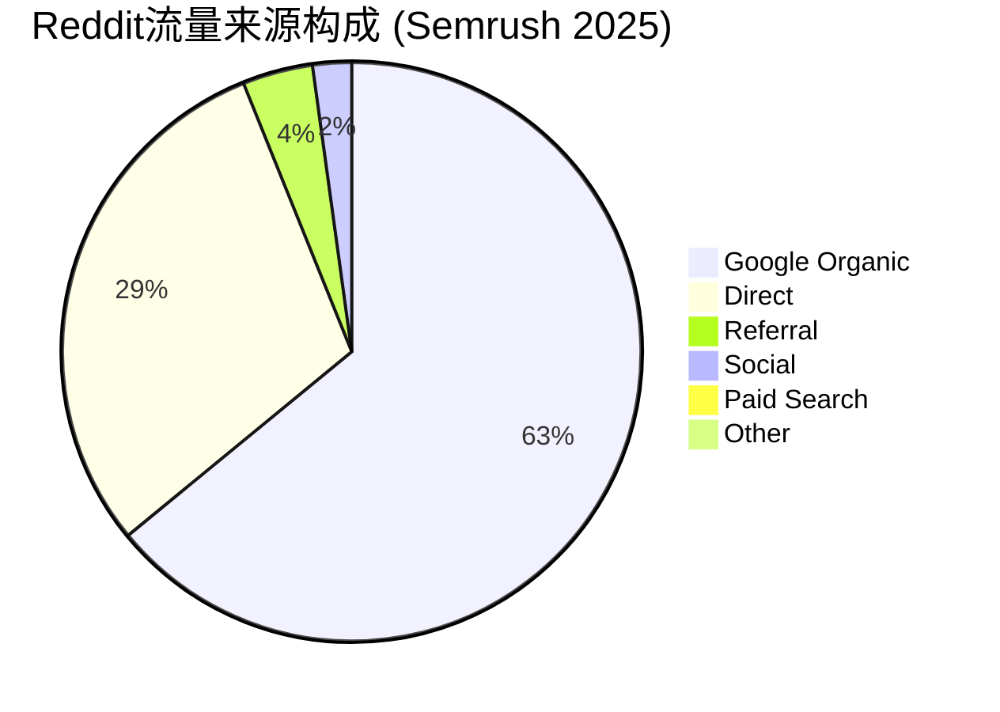
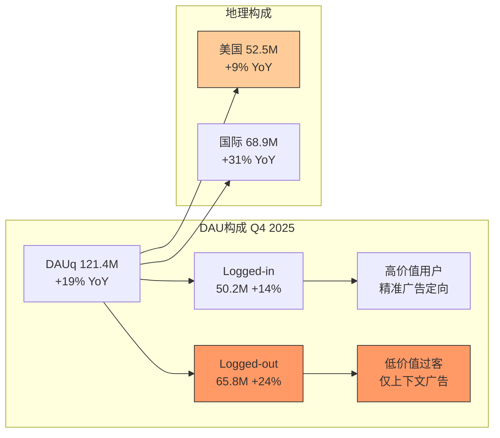
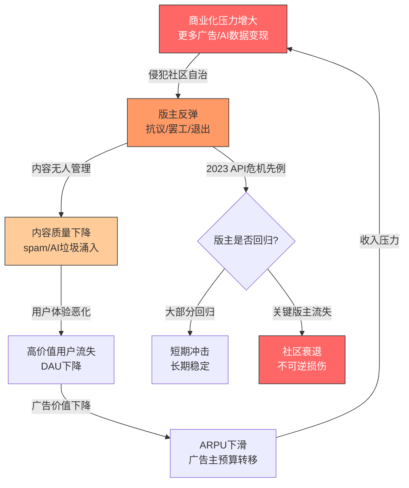
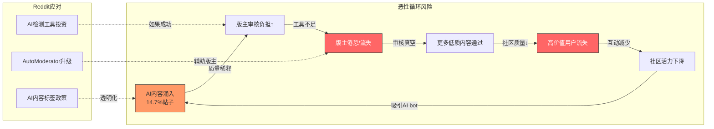

# RDDT Phase 1 — Agent A-2产出
> Agent: 商业洞察分析师 | Session 1 | 2026-02-14

---

## Ch04: 用户生态深度

### 4.1 流量来源结构——Reddit的"免费获客"悖论

Reddit的流量获取结构在社交平台中独一无二:它几乎不花钱获取用户,但这个"不花钱"本身构成了最大的结构性风险。



**Google Organic 63.12%** [DM-USER-020] 意味着Reddit每10个访客中有6个来自Google搜索——用户搜索"best wireless earbuds reddit"或"is X worth it reddit",Google把Reddit页面排在前列,用户点击进入。这个获客成本=0:没有付费搜索费用,没有内容分发成本,纯粹靠19年沉淀的UGC内容在搜索引擎中的权重。

但这也意味着:Reddit的流量命脉掌握在Google手中。Q3'25的数据已经释放了不安信号——Google搜索流量"基本持平" [DM-USER-024]。如果Google继续推进AI Overview(在搜索结果页直接展示答案而非链接到Reddit),Reddit可能面临"流量漏斗被截断"的风险。

**Direct 29.41%** [DM-USER-021] 是Reddit的"真实粉丝"——他们直接输入reddit.com或通过App进入。这个比例相当于Reddit的流量安全垫。但不到三成的直接流量,在社交平台中偏低(Facebook/Instagram/TikTok的直接+App流量通常>70%)。

**核心判断**: Reddit的CAC(客户获取成本)接近零是财务优势,但也是战略脆弱点。如果Google算法降权Reddit——哪怕仅降低20%权重——就可能导致约12%的总流量(63% × 20%)蒸发,而这部分用户是最不忠诚的(搜索驱动,无社区绑定)。

### 4.2 用户分层——"意图驱动"平台的结构性特征

**DAUq vs WAUq比率的含义**:

Reddit Q4'25 DAUq 121.4M [DM-USER-001], WAUq 471.6M [DM-USER-002], DAU/WAU比率 = 25.7%。

这个比率远低于Facebook (~66%)和Twitter/X (~40%),但这不一定是劣势——它揭示了Reddit作为"意图驱动"平台而非"习惯驱动"平台的本质:
- **习惯驱动**(Facebook/Instagram):用户每天无意识打开,刷到就停,DAU/WAU >60%
- **意图驱动**(Reddit):用户有问题要搜索、有讨论要参与时才来,不来的时候不来,DAU/WAU ~25%

意图驱动的好处是广告效率——用户带着特定意图来(买什么/选什么/怎么做),这种意图信号对广告主极有价值(类似Google搜索广告vs Facebook展示广告的逻辑)。坏处是日活增长有天花板:你无法把"有事才来"的用户变成"每天刷"的用户,除非改变产品形态(加Feed流、加短视频——但这会稀释Reddit的差异化)。

**Logged-in vs Logged-out的拆分信号**:

Logged-in DAUq 50.2M (+14% YoY) vs Logged-out DAUq 65.8M (+24% YoY) [DM-USER-010]。

Logged-out占比>55% [DM-USER-012],且增速更快(+24% vs +14%)。这意味着增量用户主要是"Google搜索过客"——搜索到Reddit页面,看完答案就走,不注册、不发帖、不互动。这些用户对广告的价值显著低于Logged-in用户:
- Logged-in用户有兴趣标签、社区订阅、浏览历史 → 精准广告定向
- Logged-out用户只有当前页面的上下文 → 仅能做低价展示广告

CEO Huffman宣布将在Q3'26起停止报告Logged-in/out拆分 [DM-USER-013]。这个信号值得警惕:当一项指标对公司不利时,管理层倾向于停止披露。如果Logged-out比例持续攀升(意味着用户质量稀释),隐藏这个数据对叙事管理有利。



**美国 vs 国际增速差异**:

美国DAUq 52.5M (+9%) vs 国际DAUq 68.9M (+31%) [DM-USER-003] [DM-INT-001]。美国增速放缓到个位数是自然规律——美国互联网人口有限,Reddit已覆盖相当比例。国际+31%的增速看起来亮眼,但需与ARPU结合看:国际ARPU仅$2.31 vs 美国$10.79 [DM-AD-003],差距4.7x [DM-INT-002]。一个国际新增用户的广告价值仅约美国用户的1/5。

### 4.3 参与度——时长虽短,意图价值可能更高

Reddit平均访问时长10分23秒 [DM-USER-030],远低于TikTok (~95分钟/天)和Twitter/X (~30分钟/天)。但这里需要区分"时长"和"价值":
- TikTok的95分钟是被动消费(算法喂内容),广告价值=CPM × 展示次数
- Reddit的10分钟是主动搜索+阅读,广告价值=用户意图信号 × 转化率

Reddit Answers从Q3的100万查询飙升至Q4的1500万查询 [DM-AD-008],15x增长。这个产品本质上是在Reddit内容库上搭建的AI搜索引擎,可能改变用户行为模式:从"Google搜索→点击Reddit"变成"直接在Reddit搜索",如果成功将降低对Google流量的依赖。但1500万月查询相对于4.7亿WAU仍微不足道(渗透率~3%),可持续性待验证。

---

## Ch05: 版主经济学

### 5.1 版主生态——Reddit最独特也最脆弱的竞争壁垒

Reddit的100,000+活跃社区(subreddit)各自由志愿版主团队管理。版主制定规则、审核帖子、删除spam、ban违规用户、维护社区文化。这是一个在商业互联网中几乎找不到直接对标的治理结构:

| 平台 | 内容管理者 | 激励机制 | 平台付费? |
|------|-----------|---------|----------|
| **Reddit** | 版主(志愿者) | 社区认同+权力+技能 | **否** |
| YouTube | 创作者 | 55%广告分成 | **是** |
| TikTok | 创作者 | 创作者基金+直播打赏 | **是** |
| Twitter/X | 内容审核团队 | 工资 | **是(员工)** |
| Discord | 服务器管理员 | 社区认同+Nitro分成 | 部分 |

**核心悖论**: 版主创造了Reddit的核心价值(高质量策展内容),但不从商业化中获得任何经济回报。Reddit FY2025营收$2.2B [DM-FIN-009],版主回报=$0。YouTube在类似体量时已向创作者分配数十亿美元。

### 5.2 版主供给函数建模

版主之所以持续无偿工作,不是因为"傻",而是因为存在非货币激励:

```
版主供给 = f(社区认同感, 权力/控制感, 技能积累, 替代成本)

(1) 社区认同感: 大型subreddit(r/AskReddit 5000万+订阅)的版主
    身份认同极强——"我维护着世界上最大的问答社区"。
    这种认同感随社区规模扩大而增强(正反馈)。

(2) 权力/控制感: 版主可以ban用户、删帖、设置规则、
    配置AutoModerator。这是Reddit提供的"非货币薪酬"——
    在物理世界中无法获得的治理权力。

(3) 技能积累: AutoModerator脚本、CSS美化、社区管理经验。
    但这些技能在Discord/Lemmy等平台同样适用(技能非Reddit专属)。

(4) 替代成本: 版主可以迁移到Discord开服务器、创建Lemmy实例。
    但——已有的社区资产(订阅者、内容库、规则体系)无法迁移。
    这是最关键的锁定机制:版主的"社会资本"绑定在Reddit上。
```

**关键发现**: 版主供给的稳定性主要靠(1)社区认同和(4)迁移的高沉没成本,而非Reddit提供的任何直接激励。这意味着版主供给在"平静期"极稳定,但在"冲击期"(如商业化决策侵犯社区自治)可能出现非线性崩溃。

### 5.3 因果链建模——级联风险



### 5.4 2023 API危机复盘——版主"退出成本"高于预期

2023年6月,Reddit宣布对第三方API收取高额费用,直接导致Apollo等主流第三方客户端关闭。版主发起了史上最大规模的"subreddit blackout"(数千个社区设为私有)。这次事件是版主经济学的天然实验:

**冲击阶段**: 数千个subreddit"熄灯",头部版主公开抗议,部分宣布永久离开。

**结果**: 大多数版主最终回归。为什么?
1. **沉没成本锁定**: r/science版主团队花了10年建设的社区规则、AutoModerator配置、FAQ库——这些无法迁移到任何其他平台
2. **网络效应绑定**: 用户在Reddit,版主去Discord/Lemmy只能带走极少数核心粉丝
3. **Reddit强硬执行**: CEO Huffman移除了拒绝重开社区的版主,任命新版主——证明Reddit愿意用强制手段维持运营
4. **替代平台不成熟**: Lemmy/Kbin等去中心化替代品在2023年用户体验远不及Reddit

**启示**: 版主的退出成本远高于表面看到的"只是志愿者可以随时走人"。但这次危机也暴露了一个非对称风险:Reddit可以强制更换版主,但强制任命的版主质量通常不如自然成长的版主团队,长期社区质量可能因此下滑——这种损伤是缓慢的、难以量化的。

### 5.5 AI内容对版主生态的冲击

AI生成内容已占Reddit帖子的约14.7% [DM-REG-001],但仅1.2%的社区制定了AI内容政策 [DM-REG-003]。Cornell研究显示60%的版主认为AI内容降低了社区质量 [DM-COMP-010]。



**关键判断**: AI内容问题的严重性不在于14.7%的当前占比,而在于增长速度和版主工具的滞后。如果AI内容年增2x而版主检测工具年增0.5x,一两年后版主可能面对一个"无法管理"的内容环境。Reddit"100%人类内容"的数据护城河叙事 [DM-COMP-005] 正在被这个趋势侵蚀——这直接影响CQ5(AI内容侵蚀核心价值)的置信度。

---

## Ch06: 竞争格局

### 6.1 结构性竞争定位——Reddit在社交生态中的独特位置

Reddit的竞争不是功能层面的"谁的Feed更好看",而是结构层面的"用户为什么在特定场景选择Reddit":

| 维度 | Reddit | Twitter/X | TikTok | Discord | Quora |
|------|--------|-----------|--------|---------|-------|
| **核心用途** | 主题讨论+信息搜索 | 实时新闻+意见领袖 | 短视频娱乐 | 实时语音+群聊 | 问答 |
| **内容组织** | 社区(subreddit)+投票 | 时间线+关注 | 算法推荐 | 服务器+频道 | 话题 |
| **匿名性** | 高(核心特征) | 中(假名可追踪) | 低(面孔可见) | 中 | 低(实名倾向) |
| **内容持久性** | 极高(SEO价值) | 低(转瞬即逝) | 低(算法驱动) | 中(可搜索) | 高 |
| **变现模式** | 广告+数据授权 | 广告+订阅 | 广告+电商 | Nitro订阅 | 广告 |
| **内容审核** | 版主(无偿) | 员工+算法 | 算法+员工 | 服务器主(无偿) | 员工+社区 |
| **用户规模** | DAUq 121.4M | MAU ~611M(-5.3%) | DAU ~1.5B | MAU ~260M | MAU ~300M |

Reddit占据的是一个独特的生态位:"匿名+主题社区+持久内容+投票排序"。这个组合在其他任何平台上都无法完整复制。Twitter有讨论但没有社区结构;Discord有社区但没有公共SEO;Quora有问答但缺乏社区文化。

### 6.2 特异性测试(Swap Test)执行

对Reddit常见的竞争优势论断逐一进行Swap Test——将"Reddit"替换为竞争对手,检验论断是否仍然成立:

**论断1**: "Reddit拥有19年人类策展内容库"
- Swap: Pinterest也有15年+内容积累
- 反驳: Pinterest的内容是图片/链接收藏,无深度讨论和投票排序;Reddit的内容是结构化讨论(问题→回答→投票排序→追问),这种格式对AI训练和搜索引擎的信息密度远高于Pinterest
- **结果: PASS** — Reddit的内容结构(讨论+投票)是独有的

**论断2**: "Reddit是AI引用排名#1域名,引用量3x Wikipedia" [DM-AI-014]
- Swap: Wikipedia是AI引用排名#2
- 反驳: Wikipedia内容由编辑委员会维护,覆盖范围有限(百科条目),不包含主观体验和消费者意见;Reddit的550万次AI引用 [DM-AI-015] 涵盖了"真实用户体验"这一Wikipedia完全缺失的维度
- **结果: PASS** — Reddit的"主观体验数据"在AI训练语料中不可替代

**论断3**: "Reddit用户匿名=更真实的意见表达"
- Swap: Twitter/X用户假名也可匿名
- 反驳: Twitter的假名背后有粉丝数/发帖历史/社交图谱,存在"声誉压力";Reddit的匿名更彻底(用户不积累粉丝、不展示真实身份),减少了"社会期望偏差"
- **结果: PASS** — Reddit的匿名深度>Twitter的假名,产生更低过滤的意见

**论断4**: "Reddit版主无偿维护内容质量"
- Swap: Discord服务器管理员也是志愿者
- 反驳: Discord社区是私有的(需邀请码),不产生公共SEO价值;Reddit版主维护的社区是公开的,直接创造可索引、可搜索、可变现的公共内容资产
- **结果: PASS** — Reddit版主创造的是"公共可索引资产",Discord管理员创造的是"私有社区体验"

### 6.3 关键竞争风险——三个结构性威胁

**威胁1: Google AI搜索截流**

Google正在部署AI Overview——在搜索结果页顶部直接展示AI生成的答案。当用户搜索"best budget laptop 2026 reddit"时,如果Google AI Overview直接从Reddit内容生成答案并展示在搜索页面,用户可能不再需要点击进入Reddit。这对Reddit的63% Google流量 [DM-USER-020] 构成直接截流风险。

但存在一个反直觉的缓冲:Google与Reddit签有数据授权协议(年费~$60M [DM-AI-001]),Google有商业动机维持Reddit流量——如果Reddit因流量下降而内容质量下降,Google的AI训练数据质量也会下降。这是一种脆弱的共生关系。

**威胁2: AI Chatbot替代"搜索真实体验"**

ChatGPT/Claude等AI chatbot正在成为"搜索真实人类体验"的替代渠道。用户问"值不值得买iPhone 17"可以直接问AI(AI已经训练过Reddit的数据),而不需要去Reddit搜索。讽刺的是,Reddit向OpenAI/Google出售的数据 [DM-AI-001] [DM-AI-002] 正在被用来构建可能替代Reddit的产品。

Reddit Answers(Q4 1500万查询 [DM-AD-008])是Reddit对此威胁的防御——把AI搜索体验留在Reddit平台内。但15x的季度增长率是否可持续、用户是否愿意在Reddit内搜索而非直接用ChatGPT,仍高度不确定。

**威胁3: Discord社区替代**

Discord的260M MAU [DM-COMP-001] 和实时语音/频道功能正在吸引Reddit的部分核心用户。多个subreddit已经建立了"官方Discord",部分讨论从Reddit公开社区迁移到Discord私有服务器。这种迁移的影响不是用户数层面的(Discord和Reddit可以共存),而是内容质量层面的——最活跃、最有价值的讨论可能转向Discord,Reddit公开社区留下的是更低质量的内容。

### 6.4 国际化竞争——CQ7初步回答

国际DAUq 68.9M (+31% YoY) [DM-INT-001] 的增速令人兴奋,但需冷静分析天花板:

**数量增长 vs 价值增长的鸿沟**:
国际ARPU $2.31 vs 美国ARPU $10.79 [DM-AD-003],差距4.7x [DM-INT-002]。国际收入增速+78% [DM-INT-003] 超过美国+68%,但绝对值差距巨大。即使国际ARPU 3年翻倍到$4.62,仍不到美国当前水平的一半。

**亮点市场**:
- UK超越TikTok成#4社交平台,增长88% [DM-INT-004] — 英语市场,最容易渗透
- 巴西DAUq +80% [DM-INT-005] — 葡萄牙语市场,但本地竞争激烈(Twitter在巴西极活跃)

**机器翻译的局限性**:
Reddit已覆盖23种语言,目标30+ [DM-INT-008],Reddit Answers已扩展至6个非英语国家 [DM-INT-009]。但翻译解决的是"界面可读"问题,不是"内容可用"问题。一个日语版r/personalfinance需要日本用户用日语讨论日本的理财话题——这不是翻译英语内容能解决的。

**天花板判断**: 非英语市场的真正壁垒不是翻译技术,而是:
1. **版主招募**: 日语/韩语/印地语社区需要本地版主,版主激励机制在非英语市场更弱(社区更小→认同感更弱)
2. **内容冷启动**: 新语言社区需要从零积累内容,无法借用英语社区的19年沉淀
3. **本地竞争**: 日本有2ch/5ch,韩国有DCInside,巴西有Twitter——Reddit在非英语市场不是"无对手"

Reddit的国际化更可能呈现"英语圈快速渗透+非英语圈缓慢长尾"的模式,而非均匀的全球增长。

---

**DM锚点引用统计**: DM-USER-001, DM-USER-002, DM-USER-003, DM-USER-010, DM-USER-012, DM-USER-013, DM-USER-020, DM-USER-021, DM-USER-024, DM-USER-030, DM-USER-034, DM-AD-003, DM-AD-008, DM-AI-001, DM-AI-002, DM-AI-014, DM-AI-015, DM-INT-001, DM-INT-002, DM-INT-003, DM-INT-004, DM-INT-005, DM-INT-008, DM-INT-009, DM-COMP-001, DM-COMP-005, DM-COMP-010, DM-REG-001, DM-REG-003, DM-FIN-009 — **共30个DM锚点**

**Mermaid图表**: 4个(流量饼图、用户构成图、版主级联风险图、AI内容反馈循环图)

**字符数**: 10,070
