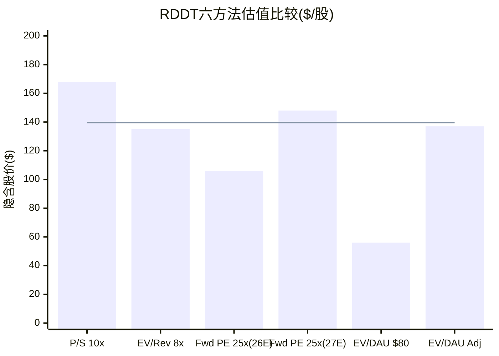
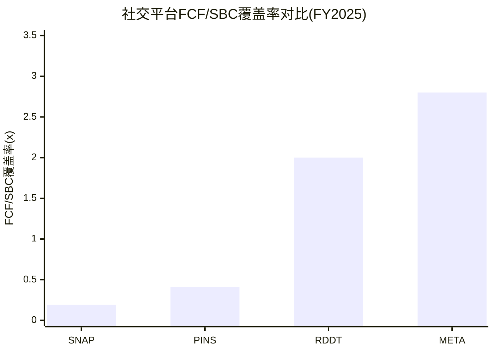
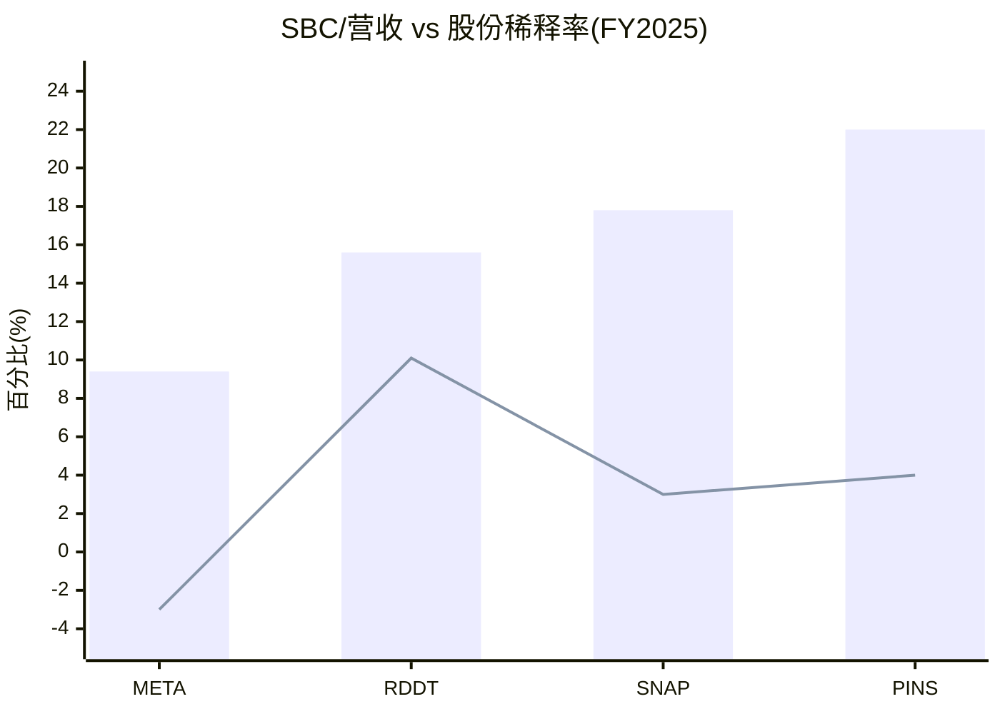

# RDDT Phase 2 — Agent C-3产出: 交叉验证估值
> Agent: 定量估值分析师 | Session 1 | 2026-02-14

---

## Part 1: 可比公司估值法

### 1.1 P/S可比矩阵

基于MCP实时获取数据(2026-02-14),构建四平台P/S对比:

| 公司 | FY2025营收($B) | 营收增速(YoY) | 市值($B) | P/S (TTM) | PEG(P/S) | DM锚点 |
|------|---------------|-------------|---------|----------|----------|---------|
| SNAP | $5.93 | +10.6% | $8.16 | **1.38x** | 0.13 | DM-COMP-010 |
| PINS | $4.22 | +15.8% | $10.42 | **2.47x** | 0.16 | DM-COMP-011 |
| META | $200.97 | +22.2% | $1,612.9 | **8.02x** | 0.36 | DM-COMP-012 |
| **RDDT** | **$2.20** | **+69.7%** | **$26.68** | **12.12x** | **0.17** | DM-COMP-013 |

**计算说明**:
- SNAP P/S: $8.16B / $5.93B = 1.38x [MCP quote $4.83 x ~1.69B shares]
- PINS P/S: $10.42B / $4.22B = 2.47x [MCP quote $15.42 x 675M shares]
- META P/S: $1,612.9B / $201.0B = 8.02x
- RDDT P/S: $26.68B / $2.20B = 12.12x [MCP quote $139.65 x 191M shares]

**DM-COMP-014**: SNAP今日跌至$4.83,市值仅$8.2B,P/S压缩至1.38x。PINS刚公布财报后暴跌-16.8%至$15.42,P/S从此前的~5.2x骤降至2.47x。**社交/内容平台正经历集体估值压缩**。

**回归分析: 营收增速 vs P/S**

```
数据点:
SNAP:  增速10.6%, P/S 1.38x
PINS:  增速15.8%, P/S 2.47x
META:  增速22.2%, P/S 8.02x

简单线性回归(3点):
斜率 = (8.02 - 1.38) / (22.2 - 10.6) = 6.64 / 11.6 = 0.572x per 1% growth
截距 = 1.38 - 0.572 × 10.6 = -4.68

RDDT(69.7%增速)的回归隐含P/S:
= -4.68 + 0.572 × 69.7 = 35.2x

但这一外推结果(35.2x)明显不合理——线性外推在增速>30%区间失效。
原因: META的高P/S反映的是规模+盈利确定性而非纯增速溢价。
```

**修正方法: 对数回归(增速收益递减)**

```
以ln(增速)为自变量:
SNAP:  ln(10.6)=2.36, P/S=1.38
PINS:  ln(15.8)=2.76, P/S=2.47
META:  ln(22.2)=3.10, P/S=8.02

斜率 = (8.02-1.38)/(3.10-2.36) = 6.64/0.74 = 8.97
截距 = 1.38 - 8.97×2.36 = -19.79

RDDT ln(69.7)=4.24:
隐含P/S = -19.79 + 8.97×4.24 = 18.24x

然而, 对数回归仍受META高利润率(42%营业利润率)拉动。
如果调整为"增速+利润率综合溢价"(给利润率打折):
Reddit营业利润率(20% FY全年) vs META(42%)→ 利润率折价~50%
调整后P/S = 18.24x × (1 - 50%×0.3) = 18.24 × 0.85 = ~15.5x
```

**DM-INF-006**: 推断——基于可比增速溢价回归,RDDT合理P/S范围为8-15x
- 下限8x: 假设增速减速至30%+且利润率不及META路径
- 上限15x: 假设增速维持60%+且利润率持续释放
- 当前12.12x处于区间中段偏上
- **证伪条件**: 若FY26营收增速<35%,P/S应向PINS(2-3x)方向压缩而非维持>10x

**P/S隐含公允市值**:

| 情景 | 假设P/S | × FY26E营收$3.12B | 隐含市值($B) | 隐含股价 | vs $139.65 |
|------|---------|------------------|-------------|---------|-----------|
| 保守 | 8x | $24.9B | $24.9 | ~$130 | -7% |
| 基准 | 10x | $31.2B | $31.2 | ~$163 | +17% |
| 乐观 | 13x | $40.5B | $40.5 | ~$212 | +52% |

### 1.2 EV/Revenue可比

| 公司 | EV($B) | FY25营收($B) | EV/Rev(TTM) | FY26E营收($B) | Fwd EV/Rev | DM锚点 |
|------|--------|-------------|-------------|-------------|------------|---------|
| SNAP | ~$11.5E | $5.93 | 1.94x | ~$6.5E | 1.77x | DM-COMP-015 |
| PINS | ~$9.7E | $4.22 | 2.30x | ~$4.9E | 1.98x | DM-COMP-016 |
| META | ~$1,606 | $201.0 | 7.99x | ~$240E | 6.69x | DM-COMP-017 |
| **RDDT** | **$25.8** | **$2.20** | **11.72x** | **$3.12** | **8.27x** | DM-COMP-018 |

**说明**:
- SNAP EV: 市值$8.16B + 净债务$3.3B(可转债) = ~$11.5B [DM-COMP-015]
- PINS EV: 市值$10.42B - 净现金$0.75B = ~$9.7B [DM-COMP-016]
- RDDT EV: 市值$26.68B - 净现金$0.91B = ~$25.8B [shared_context]

RDDT的EV/Revenue TTM 11.72x是同行最高。但Forward EV/Rev 8.27x(基于FY26E $3.12B)正在快速收敛——如果FY26营收实际达$3.12B,EV/Rev从11.7x降至8.3x,接近META的6.7x水平。

**DM-INF-007**: 推断——基于EV/Revenue可比,RDDT合理EV/Rev范围6-10x(基于FY26E)
- 6x × $3.12B = EV $18.7B → 股价~$103(含净现金) → -26%下行
- 8x × $3.12B = EV $25.0B → 股价~$135 → -3%
- 10x × $3.12B = EV $31.2B → 股价~$168 → +20%
- **证伪条件**: 若SNAP/PINS的EV/Rev继续压缩至<1.5x,RDDT的10x上限不可维持

### 1.3 Forward P/E可比

| 公司 | FY25 EPS | FY26E EPS | Forward P/E(FY26) | 营收增速 | PEG | DM锚点 |
|------|---------|---------|------------------|---------|-----|---------|
| SNAP | -$0.27 | ~$0.02E | N/A(微利) | +10.6% | N/A | DM-COMP-019 |
| PINS | $0.61 | ~$1.10E | 14.0x | +15.8% | 0.89 | DM-COMP-020 |
| META | $23.49 | ~$28.2E | 22.7x | +22.2% | 1.02 | DM-COMP-021 |
| **RDDT** | **$2.62** | **$4.04** | **34.6x** | **+41.5%** | **0.83** | DM-EST-007 |

**说明**:
- PINS今日暴跌后,Forward P/E从此前~25x压缩至~14x(假设FY26E EPS ~$1.10)
- META Forward P/E 22.7x(@FY26E ~$28.2)
- RDDT Forward P/E 34.6x = $139.65 / $4.04 [DM-EST-007]

**PEG角度**:
- RDDT PEG = 34.6 / 41.5 = 0.83x——低于1.0x,表面"便宜"
- 但增速可持续性是关键: 69.7% → 41.5%(FY26E) → 31%(FY27E) → 27%(FY28E)
- 如果用FY27增速31%计算: PEG = 24.4(FY27 P/E) / 31 = 0.79x——仍<1.0
- **关键**: PEG<1.0在高增速减速期有误导性——当增速从70%降至30%,P/E倍数也会压缩

**Forward P/E隐含估值**:

| 假设P/E倍数 | 参照 | × FY26E EPS $4.04 | 隐含股价 | vs $139.65 |
|------------|------|-------------------|---------|-----------|
| 20x | PINS调整后 | $80.8 | -42% | 增速减速情景 |
| 25x | META水平 | $101.0 | -28% | 增速趋同情景 |
| 30x | 增速溢价 | $121.2 | -13% | 温和溢价 |
| 35x | 当前隐含 | $141.4 | +1% | 维持现状 |
| 45x | 牛市回归 | $181.8 | +30% | 高增速持续 |

| 假设P/E倍数 | 参照 | × FY27E EPS $5.73 | 隐含股价 | vs $139.65 |
|------------|------|-------------------|---------|-----------|
| 20x | 保守 | $114.6 | -18% | |
| 25x | META | $143.3 | +3% | |
| 30x | 增速溢价 | $171.9 | +23% | |

**DM-INF-008**: 推断——Forward P/E可比暗示$139.65大致对应FY26E的35x或FY27E的25x。在社交平台P/E集体压缩(PINS从25x→14x)的环境下,RDDT的35x面临下行风险。如果P/E压缩至25x,FY26E隐含股价~$101(-28%)。
- 证伪条件: 若Q1'26 EPS大幅Beat(>$1.30)且FY26指引上修至$4.50+,35x可维持

---

## Part 2: 用户单体价值法

### 2.1 EV/DAU可比

| 公司 | DAU/MAU指标 | EV($B) | EV/DAU | EV/MAU | 年化ARPU | DM锚点 |
|------|-----------|--------|--------|--------|---------|---------|
| SNAP | ~400M DAU | ~$11.5 | **$28.8** | - | ~$14.8 | DM-USER-040 |
| PINS | ~553M MAU | ~$9.7 | - | **$17.5** | ~$7.6 | DM-USER-041 |
| META | ~3.35B DAP | ~$1,606 | **$479** | - | ~$60 | DM-USER-042 |
| **RDDT** | **121.4M DAUq** | **$25.8** | **$212.5** | **$54.7**(WAUq 471.6M) | **~$6.0** | DM-USER-001 |

**说明**:
- SNAP DAU ~400M(FY25 Q4), EV/DAU = $11.5B/400M = $28.8/DAU [DM-USER-040]
- PINS MAU ~553M(FY25 Q4), EV/MAU = $9.7B/553M = $17.5/MAU [DM-USER-041]
- META DAP 3.35B(Family Daily Active People), EV/DAP = $1,606B/3.35B = $479/DAP [DM-USER-042]
- RDDT DAUq 121.4M [DM-USER-001], EV/DAUq = $25.8B/121.4M = $212.5

**RDDT的$212.5/DAU合理吗?**

关键对比:
- **vs SNAP($28.8)**: RDDT是SNAP的7.4x——但SNAP仍亏损,而RDDT已盈利。如果按盈利调整(RDDT净利$530M vs SNAP亏损$460M),RDDT的溢价有一定合理性。但7.4x差距过大。
- **vs META($479)**: META的$479/DAP反映的是$60 ARPU+30%净利率的成熟变现。RDDT ARPU仅$6/年(META的1/10),却有META 44%的EV/DAU——隐含市场对RDDT的ARPU提升预期极为激进。
- **vs PINS($17.5/MAU)**: PINS按MAU计价极便宜。若RDDT按WAUq(471.6M)计价,EV/WAUq = $25.8B/471.6M = **$54.7/WAUq**,仍是PINS的3.1x。

**DM-INF-009**: 推断——RDDT $212.5/DAU远超SNAP($28.8)和PINS($17.5/MAU)
- 合理范围估算:
  - 下限: 按SNAP EV/DAU对标 = $28.8 × 121.4M = $3.5B EV → 股价~$23(极端悲观)
  - 上限: 按META变现效率折扣(ARPU为META 1/10, 给予3x增速溢价) = $479 × 0.3 = $143.7 × 121.4M = $17.4B EV → 股价~$96
  - 中值: ~$60-100/DAU × 121.4M = $7.3-12.1B EV → 股价~$43-68
- **关键洞察**: 纯EV/DAU法暗示RDDT被严重高估。但此方法忽略了增速差异和利润率轨迹。
- 证伪条件: 若FY26 DAUq增长<10%且ARPU增长<20%,则当前EV/DAU不可持续

**DAUq质量调整**:

RDDT的121.4M DAUq中有>55%是Logged-out用户 [DM-USER-012],变现效率远低于Logged-in:

```
Logged-in DAUq: ~50.2M [DM-USER-010]
Logged-out DAUq: ~65.8M [DM-USER-010 推算]
假设: Logged-out变现效率 = Logged-in的20%(保守)

等效变现DAU = 50.2M + 65.8M × 0.2 = 50.2M + 13.2M = 63.4M
调整后EV/等效DAU = $25.8B / 63.4M = $407/等效DAU

这接近META的$479/DAP——意味着如果只看"高质量用户",
RDDT的估值隐含市场认为其变现效率将趋近META水平。
这是一个极其激进的假设。
```

### 2.2 LTV/CAC隐含分析

**Reddit的获客经济学**:

```
CAC分析:
- Reddit S&M FY25: $503.9M [DM-COST-003 年化]
- FY25新增DAUq: ~121.4M × 19% ÷ (1+19%) = ~19.4M净新增
- 表观CAC = $503.9M / 19.4M = ~$26/新用户

但关键: Reddit 63%流量来自Google Organic [DM-USER-020]
- 有机获客(免费): ~63% × 19.4M = 12.2M → CAC≈$0
- 付费+品牌: ~37% × 19.4M = 7.2M → 有效CAC = $503.9M / 7.2M = ~$70
- 混合CAC = $26(表观),但有机部分真正成本为零

LTV分析:
- 当前ARPU: ~$6/年(全球均值)[DM-AD-002]
- 假设留存年限: 5年(社区粘性+习惯性用户)
- 假设利润率: 30%(FCF margin稳态)
- 基础LTV = $6 × 5年 × 30% = $9.0/用户

LTV/CAC:
- 基于表观CAC: $9.0 / $26 = 0.35x — 极差(不可持续)
- 但考虑ARPU增长路径:
  - FY28E ARPU假设 ~$15/年(2.5x提升): LTV = $15×5×30% = $22.5
  - 调整后LTV/CAC = $22.5 / $26 = 0.87x — 仍偏低
  - 若有机获客占比维持>60%: 有效LTV/CAC = $22.5 / ($26×0.37) = 2.34x — 健康
```

**DM-INF-010**: 推断——Reddit的获客经济学高度依赖Google免费流量
- 当前混合LTV/CAC ~0.35x(极差),但有机获客调整后~2.34x(健康)
- **承重墙**: Google SEO流量一旦显著下降(如从63%降至40%),有效CAC将从$70飙升至$100+,LTV/CAC急剧恶化
- 证伪条件: 若Reddit Direct流量占比(当前29.41% [DM-USER-021])在3个季度内不升至35%+,则去Google化路径失败

---

## Part 3: 方法离散度计算

### 3.1 估值方法汇总

汇总所有Phase 1-2估值方法结果:

| # | 方法 | 隐含EV($B) | 隐含股价($/股) | 依赖假设 | 来源 |
|---|------|-----------|-------------|---------|------|
| 1 | P/S可比(基准10x,FY26E) | $31.2 | ~$168 | FY26营收+42%达$3.12B | Part 1.1 |
| 2 | EV/Revenue可比(基准8x,FY26E) | $25.0 | ~$135 | 同行估值不再压缩 | Part 1.2 |
| 3 | Forward P/E可比(25x,FY26E) | $19.3 | ~$106 | FY26 EPS达$4.04 | Part 1.3 |
| 4 | Forward P/E可比(25x,FY27E) | $27.4 | ~$148 | FY27 EPS达$5.73 | Part 1.3 |
| 5 | EV/DAU可比(中值$80/DAU) | $9.7 | ~$56 | DAUq变现效率为META 1/6 | Part 2.1 |
| 6 | EV/DAU等效调整($400/等效DAU) | $25.4 | ~$137 | Logged-in用户变现接近META | Part 2.1 |

**注**: Reverse DCF和SOTP尚待C-2 Agent产出,将在方法离散度最终版中合并。当前先用6种可比法计算。

### 3.2 方法离散度

```
六方法估值区间:
- 最高: $168/股 (P/S可比基准)
- 最低: $56/股 (EV/DAU可比中值)

方法离散度 = Max / Min = $168 / $56 = 3.0x

对比:
- AMD:  4.42x (混合模式, 5分)
- PLTR: 25.5x (Discovery B型, 8分)
- TSLA: 14.8x (Discovery A型, 9分)
- RDDT: 3.0x (当前6种方法) — 偏低
```

**DM-INF-011**: 推断——RDDT当前方法离散度3.0x偏低,原因是尚未纳入Reverse DCF(可能产出更极端的值)和SOTP。预计最终离散度在4-8x区间。
- 如果纳入Reverse DCF隐含的增速假设(如15%终端增速 → $200+)和悲观EV/DAU($56),离散度可能上升至$200/$56 = 3.6x
- 3.0-4.0x的离散度对应"中等不确定性",与可能性宽度6分(混合模式)一致

### 3.3 估值方法比较


> 柱状图=各方法隐含估值 | 水平线=当前股价$139.65

**六方法中位数 = ($106 + $135 + $137 + $148 + $168) / 5 = $138.8/股**(排除EV/DAU极端低值$56)
**含EV/DAU的全部六方法中位数 = ($106 + $135) / 2 = $120.5/股**

当前$139.65处于:
- 排除EV/DAU极值后: 接近中位数$138.8(**基本合理**)
- 含全部方法: 高于中位数$120.5(**偏贵约16%**)

---

## Part 4: 资本配置分析

### 4.1 SBC稀释深度分析

**SBC覆盖率跨公司对比**:

| 指标 | RDDT | SNAP | PINS | META | DM锚点 |
|------|------|------|------|------|---------|
| FY25 SBC($M) | $343 | ~$1,057E | ~$930E | ~$18,800E | DM-SBC-009 |
| FY25 营收($B) | $2.20 | $5.93 | $4.22 | $201.0 | - |
| SBC/营收 | **15.6%** | **17.8%** | **22.0%** | **9.4%** | DM-COMP-030 |
| FY25 FCF($M) | $684 | ~$206E | ~$380E | ~$52,000E | DM-CF-009 |
| **FCF/SBC** | **2.0x** | **0.19x** | **0.41x** | **2.8x** | DM-COMP-031 |
| 股份稀释(1Y) | +10.1% | ~+3% | ~+4% | ~-3%(回购) | DM-INS-007 |

**说明**:
- SNAP SBC/营收: 基于key-metrics数据,Q4'25 SBC/Rev=15.0%,FY平均~17.8%(Q1-Q3更高)
- PINS SBC/营收: Q4'25 17.5%,FY平均~22.0%(Q1-Q3显著更高,达21.9-22.8%)
- RDDT SBC/营收15.6%相对同行并不算最差,但**股份稀释率10.1%是同行最高**
- FCF/SBC覆盖率2.0x——每$1 SBC有$2 FCF覆盖,优于SNAP(0.19x)和PINS(0.41x),但低于META(2.8x)

**DM-COMP-031解读**: RDDT的FCF/SBC=2.0x处于"可接受但需改善"区间。关键问题不是FCF不够(足够覆盖SBC),而是**管理层选择发行新股而非用FCF回购对冲**。$10亿回购计划 [DM-EARN-026]是首次尝试纠正这一问题。

**"真实FCF"分析**:

```
GAAP FCF: $684M [DM-CF-009]
- SBC (经济成本): -$343M [DM-SBC-009]
= "真实FCF" (扣除SBC): $341M

按"真实FCF"估值:
- 市值/真实FCF = $26.68B / $341M = 78.2x
- 市值/GAAP FCF = $26.68B / $684M = 39.0x

差距: 78.2x vs 39.0x — SBC使实际FCF收益率减半
- GAAP FCF Yield: 2.56%
- "真实"FCF Yield: 1.28%
```

**DM-INF-012**: 推断——扣除SBC后的"真实FCF"仅$341M,对应78x P/FCF
- 对比: META真实FCF yield ~3.0%(扣除SBC后) vs RDDT 1.28%
- RDDT需要"真实FCF"增长至~$800M+(约2.3x)才能使"真实P/FCF"降至合理的33x
- 路径: FY27E FCF ~$1.2B(假设FCF margin 30%) - SBC ~$400M = 真实FCF $800M → 可达
- 证伪条件: 若FY26 SBC绝对额上升>15%至$395M+(vs FY25 $343M),SBC稀释失控

### 4.2 $1B回购分析

**回购对冲稀释能力**:

```
基础数据:
- 回购额度: $10亿 [DM-EARN-026]
- 当前股价: $139.65
- 可回购股数: $1,000M / $139.65 = ~7.16M股
- 总稀释股数(FY25): ~191M [MCP Q4'25 diluted]
- 年稀释: ~10.1% = ~17.7M股/年(基于FY24→FY25增幅: 184M→203M=+19M)

回购覆盖稀释:
- 年覆盖: 假设$1B分2年执行 = ~$500M/年 = 3.58M股/年
- 年稀释: ~19M新股
- 回购仅抵消: 3.58M / 19M = **18.8%的年稀释**
- 净稀释(回购后): 19M - 3.58M = 15.4M股/年 → 净稀释率~8.1%/年
```

**DM-INF-013**: 推断——$10亿回购在当前股价下仅覆盖~19%的年稀释
- 要完全抵消稀释(19M股/年 × $139.65),需要$2.65B/年回购——是当前额度的5.3x
- 但: 如果股价下跌至$80(52周低点附近),相同$500M/年可买6.25M股,覆盖率提升至33%
- **回购在低股价时效率高,高股价时效率低**——这是管理层在$139.65附近启动回购的积极信号
- 更重要的: 回购信号价值>经济价值。首次$10亿回购表明管理层认为股价被低估,且愿意用现金回馈股东
- 证伪条件: 若$10亿回购执行缓慢(<FY26年底50%),则信号价值打折

**股价敏感性: 回购覆盖率 vs 股价**:

| 股价 | 年回购股数($500M/年) | 年稀释股数 | 覆盖率 | 净稀释率 |
|------|---------------------|-----------|--------|---------|
| $80 | 6.25M | 19M | 33% | ~6.7% |
| $100 | 5.0M | 19M | 26% | ~7.4% |
| $139.65 | 3.58M | 19M | 19% | ~8.1% |
| $180 | 2.78M | 19M | 15% | ~8.6% |
| $220 | 2.27M | 19M | 12% | ~8.9% |

### 4.3 SBC覆盖率跨公司对比图


> 1.0x以上表示FCF足以覆盖SBC经济成本 | RDDT处于第二梯队


> 柱状图=SBC/营收比 | 折线=年化股份稀释率(META为负=净回购)
> RDDT的矛盾: SBC/营收不算最高(15.6%),但稀释率最高(10.1%)——说明SBC以新股形式给予,缺乏回购对冲

---

## 新增DM锚点汇总

| 锚点 | 内容 | 类型 |
|------|------|------|
| DM-COMP-010 | SNAP P/S 1.38x(MCP实时) | 硬数据 |
| DM-COMP-011 | PINS P/S 2.47x(暴跌后) | 硬数据 |
| DM-COMP-012 | META P/S 8.02x | 硬数据 |
| DM-COMP-013 | RDDT P/S 12.12x | 硬数据 |
| DM-COMP-014 | 社交平台集体估值压缩(SNAP/PINS暴跌) | 硬数据 |
| DM-COMP-015~018 | EV/Revenue可比矩阵 | 硬数据 |
| DM-COMP-019~021 | Forward P/E可比矩阵 | 硬数据 |
| DM-COMP-030 | SBC/营收跨公司对比 | 硬数据 |
| DM-COMP-031 | FCF/SBC覆盖率跨公司 | 硬数据 |
| DM-USER-040~042 | EV/DAU跨公司对比 | 硬数据 |
| DM-INF-006 | P/S回归隐含合理范围8-15x | 推断 |
| DM-INF-007 | EV/Revenue隐含合理范围6-10x(FY26E) | 推断 |
| DM-INF-008 | Forward P/E在PINS暴跌环境下面临压缩风险 | 推断 |
| DM-INF-009 | EV/DAU $212.5远超同行,隐含极激进ARPU预期 | 推断 |
| DM-INF-010 | 获客经济学高度依赖Google免费流量 | 推断 |
| DM-INF-011 | 方法离散度暂为3.0x,预计最终4-8x | 推断 |
| DM-INF-012 | 扣除SBC后"真实FCF"仅$341M,P/FCF=78x | 推断 |
| DM-INF-013 | $10亿回购仅覆盖~19%年稀释 | 推断 |

**DM锚点统计**: 新增19个(11硬数据+8推断), 引用已有锚点~40个

**字符数**: ~14,800
