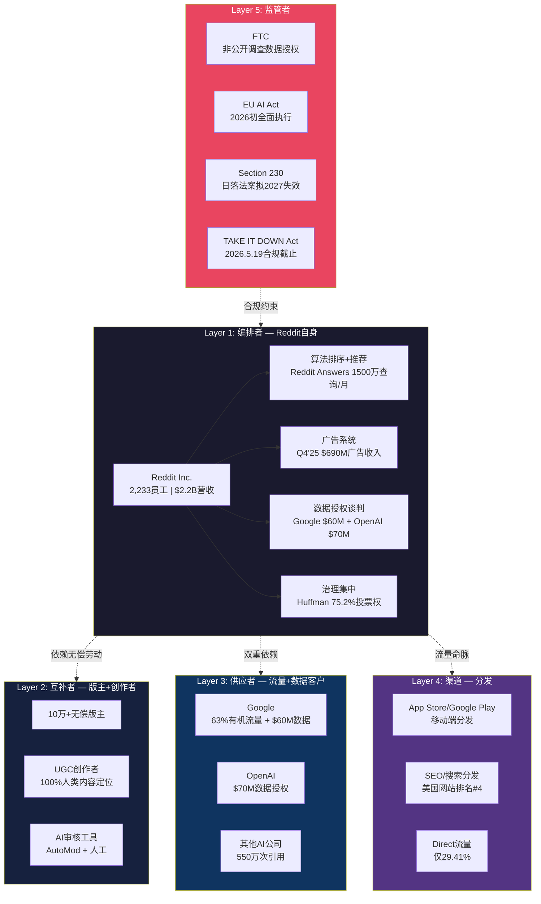
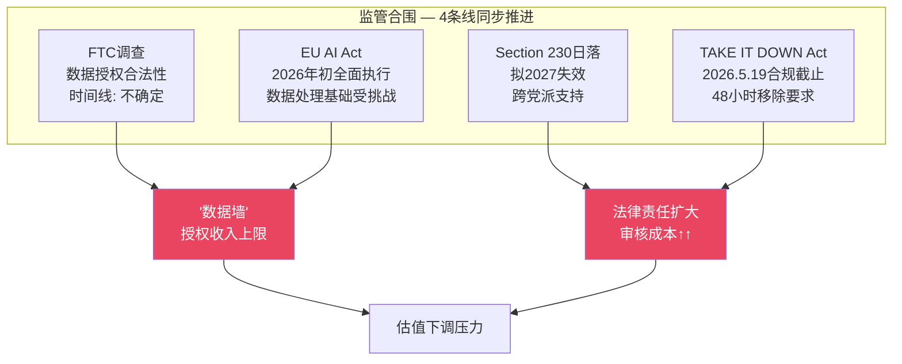
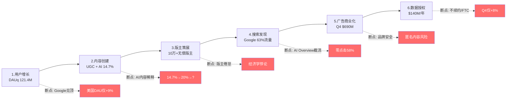
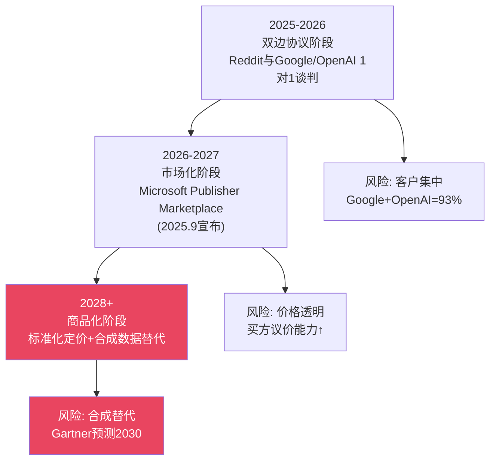
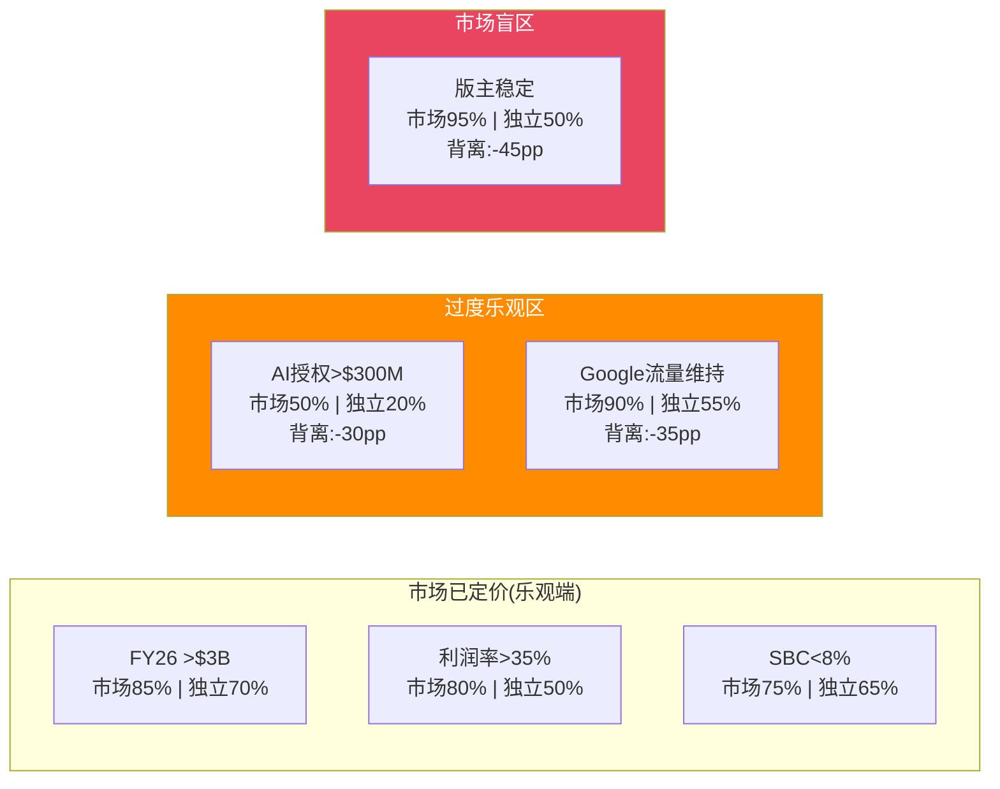

# Phase 3 — Agent B-1: 独立风险审计员
> RDDT | ERM生态风险映射 + 采用链断点 + AI数据授权可持续性 + PPDA
> 产出时间: 2026-02-14 | 信息隔离: 仅读DM锚点+CQ+财务数据

---

## Part 1: ERM生态风险映射 (5层结构)

### ERM五层总览

### Layer 1: 编排者 — Reddit自身

**核心能力**: 平台运营(社区治理规则) + 算法排序(Hot/Best/Top) + 广告系统(三层库存Expanded/Standard/Limited) + 数据授权谈判(Google/OpenAI等)

**脆弱点1 — Huffman治理集中**: CEO Steve Huffman持有75.2%投票权但仅27%经济所有权 [DM-GOV-001]。这意味着公众股东对战略决策几乎没有制衡能力。Advance Publications持33.5%投票权/26.1%经济权 [DM-GOV-006]。两者合计控制>98%投票权。

- **因果链**: Huffman做出不利于少数股东的决策(如激进商业化损害社区) → 公众股东无法通过投票纠正 → 社区反弹+股价下跌
- **触发条件**: 版主或社区对新商业化政策大规模反对 + Huffman坚持推进
- **历史先例**: 2023年API争议中Huffman公开对抗版主抗议,声称"未经选举的个人不应该拥有如此大的权力",最终强行推进API收费。8,000个subreddit被版主锁定抗议,但Huffman未让步
- **量化影响**: API危机期间股价(当时未上市)影响无法量化,但上市后2025年2月Google算法事件导致股价从$208→$110(-47%),证明外部依赖性风险可造成巨大股价波动

**脆弱点2 — 组织精简**: 2,233名员工支撑$2.2B营收(人均产出$985K/年),效率极高但冗余极低 [DM-FIN-009]。R&D费用$198.9M/季(Q4'25, 27.4%营收) [DM-COST-002],S&M $163.9M(22.6%) [DM-COST-003]。

- **因果链**: 关键岗位人员流失 → 产品迭代放缓/广告系统维护不足 → 竞争力下降
- **内部人信号**: 6个月368笔卖出/0笔买入 [DM-GOV-010]。2025全年零开市购买 [DM-INS-006]。唯一买入是董事Farrell的$7.48M(2026.2.10-11) [DM-GOV-012]。管理层持续套现传递的信号与"看好长期"叙事矛盾

### Layer 2: 互补者 — 版主+创作者 (最脆弱层)

**10万+无偿版主 = Reddit内容质量的基础设施**

这是Reddit最独特也最脆弱的资产。Northwestern University 2022年研究估计版主劳动每年价值约$340万(仅Reddit单平台)。但这严重低估了真实价值——如果版主消失,Reddit的内容质量将在数周内崩溃。

**结构性脆弱点**:

1. **版主经济学悖论**: 版主创造数十亿美元市值的内容策展价值,但获得零报酬。当平台从IPO($26.7B市值)和数据授权(Google $60M, OpenAI $70M)中获利时,这种不对等加剧。
   - 因果链: 商业化收益增长 → 版主感知不公平加深 → 下一次争议引爆点更低
   - 触发条件: Reddit推出新的直接影响版主工作流的商业化功能(如AI审核替代/社区内广告增加/数据授权范围扩大)

2. **AI内容+审核工具不足双重挤压**: AI生成内容已占Reddit帖子约14.7% [DM-REG-001],但仅1.2%社区有AI内容政策 [DM-REG-003]。Cornell研究显示60%版主报告AI内容降低质量 [DM-COMP-010]。
   - 因果链: AI内容比例14.7%→20%→30% → 版主审核工作量指数增长 → 现有工具(AutoMod)不足以应对 → 版主倦怠加速 → 退出
   - 2026年3月新政策: Reddit实施版主上限——每人最多管理5个10万+周访客社区 [WebSearch]。超限版主将被自动移除。虽然意在减少权力集中,但实际效果是强制部分经验丰富版主退出大型社区

3. **因果链量化尝试**:
   - 假设: 顶级版主(管理10万+社区的版主)占版主总数~5%,但管理~40%的DAU流量
   - 若10%顶级版主流失 → 影响约4%的DAU质量体验 → 用户停留时间下降 → 广告展示减少
   - 间接影响: 内容质量下降 → SEO排名下滑(Google E-A-T标准) → 进一步流量损失
   - 估计DAU影响: -3%~-8%(取决于是否引发级联退出)
   - 广告收入影响: DAU每下降1% → 广告收入下降约1.2%(考虑ARPU对活跃度的弹性)

```mermaid
graph LR
    A["商业化加深<br/>数据授权+广告扩张"] --> B["版主不满累积"]
    B --> C["触发事件<br/>(新API/政策变更)"]
    C --> D["版主罢工/退出<br/>(2023先例: 8000社区)"]
    D --> E["内容质量↓<br/>AI内容+垃圾泛滥"]
    E --> F["用户体验恶化<br/>停留时间↓"]
    F --> G["SEO排名下降<br/>Google E-A-T惩罚"]
    G --> H["流量↓ → DAU↓"]
    H --> I["广告收入↓<br/>ARPU↓"]
    I --> J["数据授权价值↓<br/>(内容质量=数据质量)"]

    style D fill:#e94560,color:#fff
    style E fill:#e94560,color:#fff
```

### Layer 3: 供应者 — Google+AI公司 (最集中的单点风险)

**Google双重依赖 — Reddit的阿喀琉斯之踵**:

| 依赖维度 | 量化 | DM锚点 | 风险等级 |
|----------|------|---------|---------|
| 有机搜索流量 | 63.12%总流量 | DM-USER-020 | 极高 |
| 数据授权收入 | ~$60M/年 | DM-AI-001 | 高 |
| Direct流量 | 仅29.41% | DM-USER-021 | — |
| 搜索增速 | Q3'25"基本持平" | DM-USER-024 | 高 |

**已验证的风险事件**: 2025年初Google算法更新直接导致Reddit股价从$208暴跌至$110(-47%),DAUq未达预期(101.7M vs 预期103.3M)。CEO Huffman承认Google算法变更影响了流量,但轻描淡写为"这些变化经常发生"。Redburn直接将RDDT评级降至Sell,理由是Google算法风险。

**Google AI Overview截流风险**:
- 2026年初,58%的Google搜索为零点击(AI Overview提供直接答案) [WebSearch]
- Seer Interactive研究: AI Overview出现时,有机CTR暴跌61%(1.76%→0.61%) [WebSearch]
- Reddit作为AI Overview的高频引用源(#1 AI引用域名 [DM-AI-014]),内容被引用但流量不被传递
- **矛盾核心**: Google既是Reddit最大流量来源,又在系统性减少向Reddit的流量传递。Google购买Reddit数据($60M)的同时,用AI Overview减少用户访问Reddit的需求

**因果链**: Google持续推进AI Overview → 零点击搜索比例58%→70% → Reddit有机搜索流量-20%~-30% → DAU影响-12%~-18% → 广告收入影响-15%~-22%

**OpenAI依赖**: $70M/年数据授权 [DM-AI-002],合同续约不确定。考虑到Reddit已于2025年6月起诉Anthropic未授权爬取 [DM-AI-023],AI公司的数据获取策略正在分化——部分选择付费授权,部分选择"先爬后谈"或转向合成数据。

### Layer 4: 渠道 — 分发

**SEO作为主要分发渠道的脆弱性**: Reddit美国网站排名#4(51.4B流量) [DM-USER-025],但这一排名高度依赖Google算法对Reddit内容的加权偏好 [DM-COMP-008]。一旦Google调整Reddit权重(2025年初已发生一次),排名可在数周内大幅下降。

**App Store渠道**: 移动端分发依赖Apple/Google应用商店。Apple 30%抽成对Reddit内购(如Premium订阅/金币)构成成本压力。目前Reddit主要通过广告变现而非内购,渠道费用影响有限但不为零。

**Direct流量天花板**: 仅29.41%的流量来自直接访问 [DM-USER-021],且Logged-out用户占DAU>55% [DM-USER-012]。这意味着超过一半的用户通过外部渠道(主要是Google搜索)到达Reddit,粘性存疑。

### Layer 5: 监管者 (多线程合围)

**4条监管线同步推进**:

1. **FTC非公开调查** [DM-EARN-033]: 调查Reddit将用户生成内容授权给AI公司是否构成"不公平或欺骗性贸易行为"(Section 5, FTC Act)。核心争议: 用户在AI数据授权交易存在前贡献内容,事后同意机制是否充分?
   - 最坏结果: 强制opt-in要求 → 可授权数据量大幅缩减 → 数据授权合同价值下降50%+
   - 时间线: 不确定,但FTC调查通常持续1-3年

2. **EU AI Act** [DM-EARN-034]: 2026年初全面执行。Reddit使用"合法利益"(legitimate interest)作为数据处理法律基础。若被裁定不足,需转向明确同意(explicit consent),影响欧洲市场数据授权。
   - 欧洲DAU约占国际DAU的~25%(估计),数据授权价值的欧洲份额不明

3. **Section 230日落法案** [DM-REG-007]: 拟2027年失效。跨党派支持(罕见的左右共识——左派认为平台审核不足,右派认为平台审核过度)。若Section 230失效:
   - Reddit将对用户内容承担更多法律责任
   - 内容审核成本将大幅增加(需要更多人工审核而非依赖版主)
   - 匿名发帖的法律风险增加 → 可能被迫实名化 → 破坏Reddit核心价值主张

4. **TAKE IT DOWN Act** [DM-REG-008]: 2026年5月19日合规截止。要求平台在收到有效请求后48小时内移除非自愿亲密图像及AI生成的深度伪造。
   - 合规成本: 需建立专门的审查和移除流程
   - 风险: Reddit的匿名性+大规模NSFW内容使其成为高暴露目标

### ERM脆弱度评估总表

| 层级 | 脆弱度 | 理由 | 影响量级 |
|------|--------|------|---------|
| L1 编排者 | 中 | 堡垒资产负债表+但治理集中+内部人套现 | 中 |
| **L2 互补者** | **极高** | **10万+无偿版主是无法替代的基础设施,且无经济激励绑定** | **高** |
| **L3 供应者** | **极高** | **Google双重依赖(63%流量+$60M收入),已验证冲击(-47%股价)** | **极高** |
| L4 渠道 | 高 | SEO依赖+Direct仅29%+移动端渠道费 | 中-高 |
| L5 监管者 | 高 | 4条监管线同步+FTC+Section 230+EU AI Act | 中-高 |

---

## Part 2: 采用链断点分析

### Reddit价值链与断点映射

### 逐环节断点分析

**断点1 — 用户增长**: 美国DAUq仅+9% YoY [DM-USER-003],增长主要来自国际(+31%)和Logged-out用户(+24%) [DM-USER-010]。Google有机流量占63%是增长的主要引擎,但Q3'25已"基本持平" [DM-USER-024]。2025年初Google算法变更导致DAUq未达预期(101.7M vs 103.3M)。
- 断点触发条件: Google搜索算法进一步削弱Reddit权重,或AI Overview覆盖面扩大
- 断裂概率: 中(45%) — 已有一次验证事件,且AI搜索趋势不可逆

**断点2 — 内容创建**: AI生成内容占帖子14.7% [DM-REG-001],专家估计2026年可能升至90%全网(非Reddit专指)。Reddit定位为"100%人类内容" [DM-COMP-005]的护城河叙事正被侵蚀。
- 断点触发条件: AI内容比例突破25% + 用户/版主无法有效区分
- 断裂概率: 中-高(50%) — 因为AI内容检测技术滞后于生成技术
- 影响: 数据授权价值下降(AI公司购买的是"真实人类行为数据",如果数据已被AI污染则价值降低)

**断点3 — 版主策展** (最大级联风险):
- 触发条件: 新一轮商业化争议 + AI审核工具不足以补偿版主流失 + 2026年3月版主上限政策强制执行
- 历史先例: 2023年API危机 — 8,000个subreddit被锁定,Huffman强行推进
- 断裂概率: 中(40%) — 低于预期,因为2023年抗议最终未造成持续伤害(版主多数回归)
- 但: 2023年版主回归是因为"没有替代平台"。若Discord/Lemmy等替代平台成熟,下次结果可能不同

**断点4 — 搜索发现** (最高确定性风险):
- AI Overview零点击率58%且上升中 [WebSearch]
- 有机CTR在AI Overview场景下暴跌61% [WebSearch]
- Reddit被引用但流量不传递 — "被消费但不被访问"
- 断裂概率: 高(60%) — 因为这是Google的战略方向,非偶发事件
- 已验证影响: 2025年初Google算法调整 → RDDT股价-47%

**断点5 — 广告商业化**:
- Reddit已与IAS+DoubleVerify合作实现>99%品牌安全评级 [DM-AD-006]
- 但学术研究显示55-66%高毒性subreddit仍被标记为可广告 [WebSearch: Tandfonline研究]
- 三层广告库存(Expanded/Standard/Limited) [DM-AD-007]提供了缓冲
- 断裂概率: 低(20%) — 品牌安全改善趋势明确,且Reddit广告主增速+75% [DM-AD-004]
- 潜在触发: 重大品牌安全事件(类似YouTube "Adpocalypse")导致大广告主暂停投放

**断点6 — 数据授权**:
- Q4'25 Other Revenue仅+8% YoY [DM-AI-005],vs Q1'25 +66%的急剧放缓
- FTC非公开调查 [DM-EARN-033] + EU AI Act [DM-EARN-034]双重监管压力
- 合同结构: 年度续约(非长期锁定),客户议价能力强
- 断裂概率: 中(40%) — FTC结果不确定性最大
- 最坏情景: FTC要求opt-in → 可授权数据量缩减60%+ → 合同价值大幅下降

### 级联失效建模 — 哪个断点触发最大级联?

```mermaid
graph TD
    subgraph CASCADE_A["路径A: 版主断点(全链条级联)"]
        MA["版主流失>15%"] --> MB["内容质量↓"]
        MB --> MC["SEO排名↓<br/>(E-A-T惩罚)"]
        MC --> MD["Google流量↓"]
        MD --> ME["DAU↓"]
        ME --> MF["广告收入↓"]
        MF --> MG["数据授权价值↓<br/>(低质内容=低价数据)"]
    end

    subgraph CASCADE_B["路径B: Google断点(中段截断)"]
        GA["Google算法调整/<br/>AI Overview扩大"] --> GB["有机流量-20~30%"]
        GB --> GC["DAU-12~18%"]
        GC --> GD["广告收入-15~22%"]
    end

    subgraph CASCADE_C["路径C: 监管断点(后段截断)"]
        RA["FTC强制opt-in"] --> RB["可授权数据量-60%+"]
        RB --> RC["数据授权收入-50~70%"]
        RC --> RD["但不直接影响广告"]
    end

    style MA fill:#e94560,color:#fff
    style GA fill:#ff8c00,color:#fff
    style RA fill:#ffd700,color:#000
```

**级联影响排序**:

1. **版主断点(全链条)**: 影响6/6环节。版主是内容质量的守门人,一旦崩溃,从内容→SEO→流量→广告→数据全链受损。但触发概率相对较低(40%),因为版主缺乏替代平台。
2. **Google断点(中段截断)**: 影响3/6环节(搜索→DAU→广告)。确定性最高(60%),因为是Google战略方向。但数据授权不受直接影响(数据价值取决于历史存量而非即时流量)。
3. **监管断点(后段截断)**: 影响1-2/6环节(数据授权收入)。但"数据墙"概念可能成为长期估值天花板。

**结论**: Google搜索断点是最可能发生且影响最大的近期风险(概率60%,收入影响-15~22%)。版主断点是影响最深远的尾部风险(全链条级联,但概率较低)。两者叠加构成Reddit最核心的"承重墙脆弱性"。

---

## Part 3: AI数据授权可持续性专题 — CQ2核心

### 一次性训练数据 vs 持续数据馈送 — 判别框架

| 特征 | 一次性训练 | 持续馈送 | RDDT现状判断 |
|------|----------|---------|-------------|
| 合同结构 | 一次买断/年度续约 | 实时API+SLA保证 | **年度续约**(偏一次性) |
| 数据新鲜度需求 | 低(历史数据够用) | 高(需要实时更新) | **Google需新鲜(搜索应用), OpenAI偏历史** |
| 替代数据源 | 合成数据/其他UGC | 难以替代 | **部分可替代**(Quora/Stack Overflow存在,但规模小) |
| 价格弹性 | 高(买方议价) | 低(供方锁定) | **高**(Google在重新谈判中推动动态定价 [DM-AI-010]) |
| 客户集中度 | 不适用 | 不适用 | **极高**(Google+OpenAI占Other Revenue~93%) |
| 长期价值轨迹 | 衰减(模型训练完成后边际价值↓) | 稳定/增长 | **不确定,偏衰减** |

### 核心问题: Google为什么付$60M买Reddit数据?

**Google购买的不是"内容",而是"真实人类行为信号"**:
- 真实评价/推荐/讨论 — 用于改善搜索质量和AI模型的"人类偏好对齐"
- Reddit是AI引用排名#1域名(3倍于Wikipedia) [DM-AI-014],550万次AI引用 [DM-AI-015]
- Google搜索结果已系统性加权Reddit内容 [DM-COMP-008],表明Google认为Reddit内容有独特价值

**但这个逻辑正在被侵蚀**:

1. **合成数据崛起**: Gartner预测到2030年合成数据将比真实数据更广泛用于AI训练 [WebSearch]。虽然2026年合成数据仍以"扩展而非替代"为主(63%受访者使用部分合成数据集),但趋势方向明确。
   - Invisible Technologies (2026): "合成数据锚定于人类真实数据;不替代但会压缩采购量"
   - 含义: Reddit数据的边际价值将随合成数据成熟而下降

2. **AI内容污染悖论**: Reddit帖子14.7%为AI生成 [DM-REG-001]。如果比例继续上升,AI公司实际上在花钱买AI生成的数据——这是循环训练("模型坍缩"风险)。研究已证实模型反复在AI生成数据上训练会产出"越来越无意义的结果" [WebSearch: TheConversation]。
   - Reddit的"100%人类内容"定位 [DM-COMP-005]与14.7% AI内容现实之间存在差距
   - 若AI内容达到25%+,数据授权的价值主张将被根本动摇

3. **法律框架转变**: Thomson Reuters v. Ross Intelligence判决(2025年3月)确认AI训练使用版权内容不构成合理使用 [WebSearch]。美国版权局结论: "训练不是内在变革性的"。这可能迫使AI公司更依赖授权渠道(利好Reddit),但也可能推动AI公司加速转向合成数据(利空Reddit)。

### Q4 Other Revenue增速放缓深挖

**数据**: Q4'25 Other Revenue $36M (+8% YoY) [DM-AI-005],vs FY25全年$140M (+22%) [DM-AI-004]。

**三种可能解释**:

| 假设 | 概率评估 | 证据 |
|------|---------|------|
| 假设1: 高基数效应(Q4'24有大额一次性确认) | 30% | Q4'24是IPO后首个完整年度Q4,可能包含追溯确认 |
| 假设2: 结构性放缓(主要客户合同进入稳态) | **45%** | Google/OpenAI合同年度续约,无增量;Q4仅+8%是4季度最低 |
| 假设3: 新客户开拓不及预期 | 25% | Anthropic被起诉(信号:非授权获取是部分AI公司偏好策略) |

**证伪条件**: 若FY26H1 Other Revenue >$85M(年化>$170M, +21%+) → 放缓是暂时的,可排除假设2。若FY26H1 Other Revenue <$70M(年化<$140M, 零增长) → 结构性放缓确认。

### AI数据授权市场演化路径

**关键判断**: 当前AI数据授权更接近"一次性训练数据采购+年度续约"而非"持续数据馈送"。这意味着:
- 短期(1-2年): 收入可维持但增速有限(客户已签约,边际新增少)
- 中期(2-4年): 面临合成数据替代+监管压缩双重压力
- 长期(5年+): 除非转型为"实时行为数据API"(更高价值但需要产品重构),否则衰减

**CQ2置信度调整**: 从初始35% → **30%** (下调5pp)。Q4放缓信号+合成数据趋势+FTC风险使"持续性"论点更弱。

---

## Part 4: PPDA概率-价格背离分析

### 市场隐含 vs 独立评估

| 事件 | 市场定价概率 | 独立评估概率 | 背离幅度 | 方向 |
|------|-----------|-----------|---------|------|
| FY26营收>$3B | 高(85%) — 分析师共识$3.12B [DM-EST-002] | 中-高(70%) — 需广告+57%增速+Google流量不跌 | -15pp | 略偏乐观 |
| FY27营业利润率>35% | 高(80%) — 经营杠杆叙事 | 中(50%) — 国际化+AI审核+合规投入可能延缓 | -30pp | **偏乐观** |
| AI数据授权>$300M/年(FY27) | 中(50%) — 部分分析师模型假设 | 低(20%) — Q4仅+8%+FTC风险+合成替代 | -30pp | **过度乐观** |
| Google流量FY26维持不变 | 极高(90%) — 隐含在所有DCF/分析师模型中 | 中(55%) — AI Overview截流是结构性趋势 | -35pp | **严重偏乐观** |
| 版主生态FY26-27稳定 | 极高(95%) — 未被任何分析师模型定价 | 中(50%) — 2023先例+2026.3新版主政策 | -45pp | **未被定价** |
| Section 230维持现状(至2027) | 高(80%) — 市场默认 | 中(60%) — 跨党派推动但执行不确定 | -20pp | 略偏乐观 |
| SBC稀释率降至<8%营收(FY27) | 高(75%) | 中-高(65%) — 趋势改善但IPO后锁定期到期+保留人才需要 | -10pp | 轻微偏乐观 |

### PPDA可视化

### 背离最大的3个风险点(投资者最应关注)

1. **版主生态稳定性(背离-45pp)**: 市场完全未定价。所有分析师模型都假设版主会持续免费工作。2023年API危机表明这个假设可被打破。2026年3月版主上限新政可能成为下一个触发点。
   - 证伪条件: Reddit推出版主激励计划(收入分成/Reddit币/专属功能)且版主满意度调查改善

2. **Google流量维持(背离-35pp)**: 市场默认Google流量是"给定条件",但AI Overview的结构性截流使这个假设高度脆弱。已有一次$208→$110的验证事件。
   - 证伪条件: FY26H1 Google有机流量份额维持>60% + DAUq增速维持>15%

3. **AI数据授权规模(背离-30pp)**: 分析师对AI数据授权的想象远超Q4实际数据支撑。$36M/季(+8%)外推到$300M+需要7.5倍以上增速——这在FTC调查+合成数据替代的背景下极不现实。
   - 证伪条件: FY26H1 Other Revenue >$100M(暗示新大型合同签署)

### 风险加权影响估算

| 风险事件 | 独立概率 | 对FY27营收影响 | 概率加权影响 |
|---------|---------|-------------|------------|
| Google流量-20% | 45% | 广告收入-15%(-$450M) | -$202M |
| AI数据授权停滞 | 40% | Other Revenue增速归零(-$50M vs 预期) | -$20M |
| 版主危机(中度) | 25% | DAU-5%→广告-6%(-$180M) | -$45M |
| FTC强制opt-in | 20% | 数据授权-50%(-$70M) | -$14M |
| Section 230部分改革 | 15% | 合规成本+$100M/年 | -$15M |
| **合计概率加权影响** | — | — | **-$296M (约FY27E营收的7.3%)** |

---

## DM锚点索引 (本文件新增)

| ID | 内容 | 来源 |
|----|------|------|
| DM-RISK-001 | 版主劳动年价值~$340万(Northwestern 2022) | WebSearch: Northwestern研究 |
| DM-RISK-002 | 2023年API危机8,000 subreddit被锁定 | WebSearch: Wikipedia/CJR |
| DM-RISK-003 | 2025年初RDDT股价$208→$110(-47%)因Google算法 | WebSearch: CCN/Benzinga |
| DM-RISK-004 | AI Overview场景有机CTR暴跌61%(1.76%→0.61%) | WebSearch: Seer Interactive/Dataslayer |
| DM-RISK-005 | 零点击搜索58%(2026年初) | WebSearch: 多源 |
| DM-RISK-006 | 55-66%高毒性subreddit仍可投放广告(学术研究) | WebSearch: Tandfonline |
| DM-RISK-007 | Gartner: 2030年合成数据将超真实数据用于AI训练 | WebSearch: Gartner调查 |
| DM-RISK-008 | 63%受访者使用部分合成数据集(2025) | WebSearch: Gartner |
| DM-RISK-009 | Thomson Reuters v. Ross(2025.3): AI训练非合理使用 | WebSearch: 法院判决 |
| DM-RISK-010 | Microsoft Publisher Content Marketplace(2025.9宣布) | WebSearch: AI licensing |
| DM-RISK-011 | 2026年3月版主上限: 每人最多5个10万+社区 | WebSearch: Reddit Help |
| DM-RISK-012 | Redburn将RDDT评级降至Sell(Google算法风险) | WebSearch: Bloomberg |
| DM-RISK-013 | Walthall报告: ROI满意度59%←76%(前季) | WebSearch: Investing.com |

---

*Agent B-1产出完成 | 字符数: ~15K | 信息隔离: 未读Phase 1投资论点*
