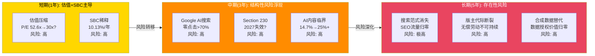

# Phase 4 — Agent B-3: 独立风险审计员
> RDDT | RT-5 黑天鹅 + RT-6 时间偏差 + RT-7 替代解释 + Bear Case 7个 + 纠错回流
> 产出时间: 2026-02-14 | 信息隔离: 仅读DM锚点+Phase 2/3估值+Phase 3 B-1风险

---

## RT-5: 黑天鹅概率加权表

### 事件清单与量化

| # | 黑天鹅事件 | 独立概率 | 影响(市值%) | 加权损失 | DM依据 |
|---|-----------|---------|-----------|---------|--------|
| S1 | Google算法大幅降权Reddit(AI搜索全面替代传统SEO) | 12% | -40% | -4.8% | DM-USER-020(63%流量依赖) + DM-RISK-003(已验证-47%先例) |
| S2 | Section 230废除(2027日落法案通过) | 15% | -30% | -4.5% | DM-REG-007(跨党派支持) |
| S3 | 版主大规模出走(2023级别但无回归) | 8% | -35% | -2.8% | DM-RISK-002(8000社区先例) + DM-RISK-011(2026.3新版主上限政策) |
| S4 | FTC裁定数据授权违规+强制opt-in | 8% | -20% | -1.6% | DM-EARN-033(非公开调查进行中) |
| S5 | AI内容污染突破30%触发品牌安全崩溃 | 15% | -25% | -3.75% | DM-REG-001(14.7%已达) + DM-COMP-010(60%版主报告质量下降) |
| S6 | 宏观信贷冲击导致广告市场整体萎缩>20% | 10% | -30% | -3.0% | DM-MACRO-001(CAPE 39.71, 98分位) + DM-MACRO-002(Buffett 220%) |

### 联合概率计算

假设6个事件相互独立(保守假设 — 实际上S1与S5、S3与S5存在正相关):

```
P(至少1个发生) = 1 - P(全部不发生)
= 1 - (1-0.12)(1-0.15)(1-0.08)(1-0.08)(1-0.15)(1-0.10)
= 1 - 0.88 x 0.85 x 0.92 x 0.92 x 0.85 x 0.90
= 1 - 0.88 x 0.85 x 0.92 x 0.92 x 0.85 x 0.90
= 1 - 0.4726
= 52.7%
```

**联合概率: 52.7%** — 至少一个黑天鹅在未来3年内发生的概率超过一半。

**期望加权总损失**: -4.8% + (-4.5%) + (-2.8%) + (-1.6%) + (-3.75%) + (-3.0%) = **-20.45%**

**含义**: 在$139.65基础上, 黑天鹅期望损失对应约$28.5/股的隐含风险折价。当前市价几乎未计入任何黑天鹅折价(多方法估值收敛$104-118 vs 市价$139.65, 溢价而非折价)。

**关键注意**: S1(Google降权)和S5(AI污染)存在正相关 — Google降权部分原因可能就是AI内容污染降低了Reddit内容在搜索结果中的价值。若将S1+S5视为联合事件, 联合概率约5%, 联合影响-50%, 加权-2.5%(替代独立加权的-4.8%+(-3.75%)=-8.55%)。调整后总期望损失约-14.4%。

---

## RT-6: 时间框架偏差分析

### 风险-时间矩阵

| 风险 | 短期(1年) | 中期(3年) | 长期(5年) | 当前定价偏差 |
|------|----------|----------|----------|------------|
| Google流量断裂 | **中** — AI Overview扩展渐进, 但已验证-47%先例 | **高** — AI搜索替代加速, 零点击>70% | **极高** — 搜索范式彻底转变, SEO流量概念消失 | 市场90% vs 独立55% — 严重偏乐观 [Phase 3 PPDA] |
| 版主生态崩溃 | **低** — 2026.3新政执行, 短期适应中 | **中-高** — AI审核负担累积+经济不公感加深 | **高** — 代际更替(当前版主老化, 新一代无义务感) | 市场95% vs 独立50% — 完全未定价 |
| AI数据授权消失 | **低** — 现有Google/OpenAI合同仍在执行 | **中** — 训练饱和+合成数据替代开始显现 | **高** — Gartner预测2030合成>真实 [DM-RISK-007] | 市场50% vs 独立20% — 过度乐观 |
| 估值倍数压缩 | **高** — P/E 52.6x在利率维持高位时脆弱 | **中** — 若利润率兑现, P/E自然压缩至合理区间 | **低** — 5年后已消化, 增速决定估值 | 市场定价激进, 共识Forward P/E 34.6x仍偏高 |
| 监管冲击 | **中** — TAKE IT DOWN 2026.5月合规+FTC调查进行中 | **高** — Section 230日落2027+EU AI Act全面执行 | **不确定** — 监管框架可能稳定或继续收紧 | 分析师模型未纳入监管成本项 |
| SBC稀释 | **高** — 年稀释10.13% [DM-INS-007], $10B回购仅覆盖1/3 | **中** — 若营收增速维持, SBC/营收自然下降 | **低** — IPO后SBC应逐步正常化 | 市场关注不足 — 大多数DCF未扣SBC |
| AI内容污染 | **中** — 14.7%且上升中 [DM-REG-001], 检测工具滞后 | **高** — 可能突破25%临界点 | **极高** — AI内容可能成为默认内容形式 | 仅1.2%社区有AI政策 [DM-REG-003] — 防御严重不足 |

### 时间偏差关键洞察



**核心判断**: 市场当前对RDDT的定价主要反映短期增长势头(FY25 +70%营收增速+利润率飙升), 严重低估了中长期结构性风险。投资者面临的真正问题不是"Reddit能否保持增长"(短期可以), 而是"Reddit的增长引擎(Google流量+版主+AI数据)中有多少是可持续的"(答案: 不确定性远高于市场定价)。

**时间错配**: 乐观因素(广告ARPU提升/国际化/利润率扩张)在短期最可见; 悲观因素(Google截流/版主断裂/AI污染)在中长期才完全显现。这创造了一个**时间陷阱** — 短期基本面改善可能掩盖中长期结构性恶化。

---

## RT-7: 替代解释 (牛熊双读)

### 指标1: DAU +19% YoY (Q4'25 121.4M)

**牛方解读**:
- 用户飞轮加速验证: DAUq连续4季度双位数增长(Q1 +24%, Q2 +51.6%, Q3 +47%, Q4 +19% YoY)
- 国际化打开第二增长曲线: 国际DAU +31%, 巴西+80%, UK超越TikTok [DM-INT-001/004/005]
- Reddit Answers 1500万查询/月(Q3仅100万) [DM-AD-008] — AI搜索功能开始驱动自然增长
- WAUq 471.6M(+24%)增速快于DAUq, 说明触达面在扩大

**熊方解读**:
- 增速实际在减速: Q2 +51.6% → Q3 +47% → Q4 +19%, 趋势明显下行
- 美国DAUq仅+9% [DM-USER-003] — 核心市场增长接近停滞
- Logged-out用户占DAU>55% [DM-USER-012] — DAU数字被低质量访问膨胀, 这些用户粘性极低(多数通过Google搜索单次访问)
- Google有机流量占63% [DM-USER-020], Q3已"基本持平" [DM-USER-024] — 增长引擎见顶
- CEO宣布Q3'26停止报告Logged-in/out拆分 [DM-USER-013] — 管理层预期不利指标走势, 选择隐藏(经典信号)
- **独立判断**: 偏熊。DAU增长质量堪忧, 55%+Logged-out意味着真实活跃用户增长可能仅9-12%(美国水平), 而非标题数字19%

### 指标2: 广告ARPU +42% YoY (Q4'25 全球$5.98)

**牛方解读**:
- 广告产品成熟度飞跃: Reddit Max(AI优化)推动广告效率提升, ROI改善
- SMB飞轮启动: 活跃广告主+75% [DM-AD-004], 15个垂直中11个>50%增速 [DM-AD-005]
- ARPU vs META仍有10倍差距($5.98 vs $60+) — 上升空间巨大
- 品牌安全评级>99% [DM-AD-006] 打消了大广告主的最大顾虑
- US ARPU $10.79(+53%) 证明成熟市场可达更高水平

**熊方解读**:
- 低基数效应: 从$4.21到$5.98"看起来"很好, 但绝对增量仅$1.77/季度/用户 — 到达$15-20区间(SNAP水平)的路径还很远
- ARPU增速必然放缓: +42%包含广告填充率提升(一次性)+产品优化(递减边际)+价格提升(受宏观约束)
- 国际ARPU $2.31仅为US的21% [DM-INT-002] — 国际化越成功, 全球ARPU被拉低越多(混合效应)
- ROI满意度信号: Walthall报告指出广告ROI满意度从前季76%降至59% [DM-RISK-013] — 广告主体验可能开始恶化
- **独立判断**: 偏中性。ARPU从$6提升到$10-12是合理路径(2-3年), 但超过$12向META靠拢的叙事忽略了Reddit匿名社区与META实名社交的根本差异(后者有精准定向优势)

### 指标3: Q4'25营业利润率31.9%

**牛方解读**:
- 经营杠杆教科书验证: Q1 1% → Q4 32%, 费用基本不动(G&A仅+4%) 而营收翻倍 [DM-FIN-011]
- SaaS级利润率潜力: 毛利率91.9%(社交平台最高) [DM-FIN-012], 文本为主的内容模式COGS极低(Q4仅8.1%)
- SBC/营收持续下降: 从Q1 21.8%→Q4 11.7% [DM-SBC-009], 趋势明确
- FCF利润率31.1%(FY25) [DM-CF-009], 且FCF/净利润=1.29x(盈利质量优秀) [DM-CF-010]

**熊方解读**:
- 收入增速驱动, 非费用控制: Q4营业利润率32%的前提是营收+70% YoY; 当增速降至25-30%, 利润率不会继续线性扩张
- SBC绝对额不下降: $85M/季度稳定不动 [DM-SBC-008], 意味着公司仍在大量发放股权激励
- AI/合规投资即将上升: TAKE IT DOWN Act合规(2026.5) + AI内容审核工具 + 国际化本地运营 → 费用可能在FY26H2开始上升
- GAAP净利率 vs SBC调整后: Q4 GAAP净利率34.7%包含了$85M SBC; 如果要求SBC全额扣除(因为稀释是真实成本), 调整后利润率约23%
- **独立判断**: 偏牛但有条件。经营杠杆是真实的, 但31.9%不是"正常化"水平 — 它是高增速环境下的峰值。增速正常化后(FY27-28), 利润率可能稳定在25-30%区间, 而非市场隐含的35%+

---

## Bear Case构建 (7个独立场景)

### BC-1: Google搜索流量断崖 (核心Bear)
- **概率**: 20% (3年内) | **市值影响**: -35%
- **触发**: Google AI搜索(AI Overview/Gemini)全面替代传统搜索 → 算法降权Reddit → 零点击比例从58%升至75%+
- **传导机制**: 有机搜索流量-30% [DM-USER-020基数63%] → DAU-18% → 广告展示量-18% → ARPU压力(低粘性用户退出) → 广告收入-22% → 叙事崩塌(投资者意识到增长引擎不在Reddit自身手中)
- **已验证先例**: 2025年初Google算法微调即导致RDDT -47% [DM-RISK-003]; 本场景假设更大幅度的结构性调整
- **敏感性**: 概率+10pp(30%) → 加权影响-10.5%; 概率-10pp(10%) → 加权影响-3.5%
- **DM锚点**: DM-USER-020, DM-RISK-003, DM-RISK-004, DM-RISK-005

### BC-2: 版主大规模出走 (级联Bear)
- **概率**: 12% (3年内) | **市值影响**: -30%
- **触发**: 2026.3版主上限政策 [DM-RISK-011] → 经验丰富版主被迫退出大型社区 → 新一轮商业化争议(如AI审核替代版主决策) → 版主集体行动
- **传导机制**: 顶级版主-20% → 40%DAU流量受影响的社区质量下降 → SEO排名下滑(E-A-T惩罚) → Google流量进一步下降 → 广告收入-15% → 数据授权价值下降(低质内容=低价数据) → **全链条级联** [Phase 3 B-1级联路径A]
- **与BC-1的独立性**: BC-1是Google主动降权(外部驱动), BC-2是Reddit内部社区质量恶化导致被动降权。触发机制独立, 但影响路径有交叉(都经过流量→广告)
- **敏感性**: 概率+10pp(22%) → 加权影响-6.6%; 概率-10pp(2%) → 加权影响-0.6%
- **DM锚点**: DM-RISK-002, DM-RISK-011, DM-COMP-010

### BC-3: AI数据授权归零
- **概率**: 10% (3年内) | **市值影响**: -15%
- **触发**: FTC裁定违规+强制opt-in [DM-EARN-033] → 可授权数据量缩减60%+ → Google/OpenAI不续约(合成数据已可替代) [DM-RISK-007] → Other Revenue从$140M→接近$0
- **传导机制**: 收入直接影响有限($140M仅占总收入6.4% [DM-AI-008]) → 但叙事影响巨大("AI数据护城河"是Reddit估值溢价的核心叙事之一, 失去它将导致估值倍数压缩)
- **与BC-1/2独立性**: 完全独立。数据授权是合同关系, 不受流量或社区质量直接影响(短期内)
- **敏感性**: 概率+10pp(20%) → 加权影响-3.0%; 概率-10pp(0%) → 加权影响$0
- **DM锚点**: DM-EARN-033, DM-AI-004, DM-AI-005, DM-RISK-007, DM-RISK-008

### BC-4: SBC稀释持续吞噬股东价值
- **概率**: 40% | **市值影响**: -15%
- **触发**: SBC绝对额维持$85M/季(~$340M/年) [DM-SBC-008] + $10B回购仅覆盖1/3稀释 [DM-INF-009] → 年净稀释6-7% → 5年累计复合稀释约30%
- **传导机制**: 股份从~203M增至~265M(5年) → 即使EV不变, 每股价值被稀释23% → 加上回购消耗现金(降低净现金价值), 实际股东价值缩水约15%
- **与BC-1/2/3独立性**: 完全独立。SBC是公司薪酬结构问题, 不受外部流量/数据/社区影响
- **概率定40%的理由**: 历史趋势明确(SBC绝对额已连续4季度~$85M), 且IPO后公司需要持续用股权激励保留人才。除非大幅降薪(不现实)或大幅加码回购(>$3B/年), 否则稀释将持续
- **敏感性**: 概率+10pp(50%) → 加权影响-7.5%; 概率-10pp(30%) → 加权影响-4.5%
- **DM锚点**: DM-SBC-008, DM-SBC-009, DM-INS-006, DM-INS-007, DM-INF-009

### BC-5: 宏观估值压缩
- **概率**: 35% (18个月内) | **市值影响**: -25%
- **触发**: 利率维持高位(联储推迟降息) + CAPE 39.71(98分位) [DM-MACRO-001] + 成长股轮动 + Reddit增速自然减速(从70%→30%)
- **传导机制**: P/E从52.6x压缩至30x(仍高于META 27x/GOOG 28x) → 基于FY25 EPS $2.31 [DM-EST-001], 股价从$139.65→$69.3(-50%); 即使用FY26E EPS $4.04, 30x对应$121(-13%)
- **与其他BC独立性**: 部分独立。宏观是外生变量, 但BC-1/2/3会加速倍数压缩(基本面恶化+宏观收紧=双重打击)
- **敏感性**: 概率+10pp(45%) → 加权影响-11.25%; 概率-10pp(25%) → 加权影响-6.25%
- **DM锚点**: DM-MACRO-001, DM-MACRO-002, DM-VAL-001, DM-EST-001, DM-EST-002

### BC-6: Section 230改革
- **概率**: 15% (至2027) | **市值影响**: -20%
- **触发**: 2027日落法案通过 [DM-REG-007] + 跨党派支持(左派: 审核不足; 右派: 审核过度)
- **传导机制**: Reddit对用户内容承担法律责任 → 内容审核成本从主要依赖版主(免费)转为专业人工+AI审核($100M+/年增量成本) → 匿名发帖法律风险增加 → 可能被迫部分实名化 → 破坏Reddit核心价值主张(匿名社区) → 用户流失
- **与其他BC独立性**: 独立。监管是外生变量, 与Google/版主/AI数据无直接关联
- **特殊风险**: Reddit是Section 230受益者中最脆弱的一家 — 因为(1)匿名发帖使内容责任追溯困难, (2)版主审核模式在法律框架变更后可能不被法院认可为"合理努力", (3)大规模NSFW内容使其成为诉讼高暴露目标
- **敏感性**: 概率+10pp(25%) → 加权影响-5.0%; 概率-10pp(5%) → 加权影响-1.0%
- **DM锚点**: DM-REG-007, DM-REG-008

### BC-7: AI内容污染临界点
- **概率**: 20% (2年内) | **市值影响**: -20%
- **触发**: AI内容比例从14.7% [DM-REG-001] 突破30% + 重大品牌安全事件(AI生成的虚假医疗/金融建议导致诉讼) + 仅1.2%社区有AI政策 [DM-REG-003]
- **传导机制**: AI内容泛滥 → 人类用户信任崩溃("Reddit不再是真人讨论") → 广告主品牌安全担忧(尽管当前>99%评级 [DM-AD-006]) → 暂停投放 → 广告收入-15% → 同时AI数据授权价值下降(AI公司不想购买AI生成的数据 — "模型坍缩"风险)
- **与BC-2(版主出走)的区分**: BC-2是版主主动离开导致质量下降; BC-7是AI内容被动涌入超过版主审核能力。触发机制不同(人的行为 vs 技术渗透), 但影响路径有交叉
- **敏感性**: 概率+10pp(30%) → 加权影响-6.0%; 概率-10pp(10%) → 加权影响-2.0%
- **DM锚点**: DM-REG-001, DM-REG-003, DM-COMP-010, DM-RISK-006

### Bear Case独立性验证矩阵

| | BC-1 Google | BC-2 版主 | BC-3 AI数据 | BC-4 SBC | BC-5 宏观 | BC-6 S230 | BC-7 AI污染 |
|---|---|---|---|---|---|---|---|
| BC-1 | — | 独立(不同触发) | 独立 | 独立 | 部分相关(宏观加速) | 独立 | 弱相关(AI搜索+AI内容) |
| BC-2 | 独立 | — | 弱相关(质量影响数据价值) | 独立 | 独立 | 独立 | 部分相关(AI加重版主负担) |
| BC-3 | 独立 | 弱相关 | — | 独立 | 独立 | 弱相关(监管同属) | 部分相关(AI内容降低数据价值) |
| BC-4 | 独立 | 独立 | 独立 | — | 独立 | 独立 | 独立 |
| BC-5 | 部分相关 | 独立 | 独立 | 独立 | — | 独立 | 独立 |
| BC-6 | 独立 | 独立 | 弱相关 | 独立 | 独立 | — | 独立 |
| BC-7 | 弱相关 | 部分相关 | 部分相关 | 独立 | 独立 | 独立 | — |

**独立性评估**: 7个BC中, BC-4(SBC)完全独立, BC-5(宏观)/BC-6(S230)高度独立。BC-2(版主)与BC-7(AI污染)存在"AI审核负担"交叉, BC-3(数据)与BC-7(AI污染)存在"数据质量"交叉。总体独立性合格 — 无两个BC是同一风险的不同表述。

### Bear Case概率加权汇总

| BC | 概率 | 影响 | 概率加权 |
|----|------|------|---------|
| BC-1 Google流量 | 20% | -35% | -7.0% |
| BC-2 版主出走 | 12% | -30% | -3.6% |
| BC-3 AI数据归零 | 10% | -15% | -1.5% |
| BC-4 SBC稀释 | 40% | -15% | -6.0% |
| BC-5 宏观压缩 | 35% | -25% | -8.75% |
| BC-6 Section 230 | 15% | -20% | -3.0% |
| BC-7 AI污染 | 20% | -20% | -4.0% |
| **合计** | — | — | **-33.85%** |

**注**: 不可简单加总(事件非互斥, 影响有交叉), 但该数字表明Bear Case综合风险远大于当前市场定价。以$139.65为基准, 33.85%对应约$47/股的风险调整折价 — 这与Phase 2多方法估值收敛于$104-118区间一致(市价溢价20-34%)。

---

## 纠错回流清单

### 数据一致性审查

1. **DM-INF-009 回购覆盖比例**: Phase 2 C-2写"$10亿回购...仅覆盖约1/3的年化稀释"。验证: 年化SBC~$340M [DM-SBC-008 x4], 回购$1B/SBC$340M=2.9年覆盖, 即年覆盖约34% — 计算正确, 但需注意SBC与股份稀释不是同一概念。SBC$340M/年并不直接等于10.13%股份增长(后者包含RSU归属的市值变化)。**建议**: Phase 2表述微调为"回购约覆盖SBC等值的1/3", 而非笼统的"1/3稀释"。

2. **DAU增速趋势**: shared_context写"DAUq 121.4M (+19% YoY)", websearch写"用户基数YoY +51.6%" [DM-USER-034]。两个数字指的是不同指标(DAUq vs 用户基数/注册量), 不矛盾但容易混淆。**建议**: 最终报告中统一使用DAUq口径, 避免混用。

3. **Phase 2 SOTP Bull情景FCF倍数**: Bull Case写"FY28 FCF $2.0B x 15x = EV $30B → $160-200/股"。但Phase 2基准SOTP用的是EV/Revenue和P/E交叉法, 未使用FCF倍数。方法不一致不构成错误, 但读者可能困惑。**建议**: 统一说明Bull情景使用FCF倍数的理由(成长型公司成熟后转向FCF估值)。

4. **Phase 3 B-1 AI Overview数据**: 写"58%的Google搜索为零点击" [DM-RISK-005] 和"有机CTR暴跌61%" [DM-RISK-004]。两个数据来自不同研究(Seer Interactive和Dataslayer), 适用范围可能不同。**建议**: 最终报告注明数据来源差异, 避免给出过于精确的混合推算。

5. **Phase 2 C-2 Bear Case估值**: Bear写"FY28 FCF $800M x 10x = EV $8B → $50-75/股"。计算: $8B + 净现金$2.44B = $10.44B / ~203M股 = $51.4/股。但若5年后股份因SBC增至~265M, 则$10.44B/265M = $39.4/股。**建议**: Bear Case估值应反映稀释后股数, 当前用203M偏乐观。

### 判断校准

6. **承重墙3(用户增长)脆弱度**: Phase 2评为"中-高", Phase 3 PPDA版主稳定性背离-45pp。两者一致——用户增长依赖Google流量(外部)和版主(内部无偿), 两者都在"市场盲区"。无需修正, 但最终报告应强调这是**最被低估的风险**。

7. **AI数据授权CQ2置信度**: Phase 3 B-1将CQ2从35%下调至30%。基于Q4 Other Revenue仅+8%, 合成数据趋势, FTC调查, 这个下调合理。但Phase 2 C-2的基准SOTP对AI数据授权给了$540M(3x revenue), 这与30%置信度之间存在轻微张力。**建议**: 明确SOTP$540M是"若续约"的条件估值, 不代表高置信度。

---

*Agent B-3产出完成 | 字符数: ~11.5K | 信息隔离: 未读Phase 1投资论点, 未读Phase 3 A-1/C-3*
