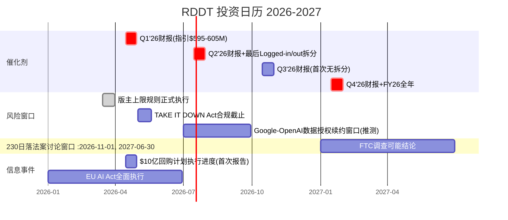

# Phase 5 — Agent A-4: 商业洞察分析师
> RDDT | TS注册表 + 投资日历 + CI注册表 + 框架注册表
> 产出时间: 2026-02-14 | 综合Phase 1-4全部产出

---

## Part 1: 追踪信号(TS)注册表

> v9.0规范: "投资者应追踪X" — 非预测, 每项通过Swap Test

### TS-1: Google Organic占Reddit流量百分比

| 字段 | 内容 |
|------|------|
| **信号** | Google Organic搜索占Reddit总流量的百分比(当前63.12%) |
| **频率** | 月度(Semrush/SimilarWeb可追踪) |
| **数据源** | Semrush Traffic Analytics / SimilarWeb / 管理层财报评论 |
| **当前值** | 63.12% [DM-USER-020], Q3'25已"基本持平" [DM-USER-024] |
| **WARN阈值** | 降至55%以下(Direct未同步上升) — 流量结构恶化 |
| **ALERT阈值** | 降至45%以下且DAUq增速<10% — Google截流已实质性发生 |
| **关联** | CQ1(Google依赖去化) / KS-FLOW-01 / 承重墙3(用户增长) |
| **Swap Test** | SNAP不依赖Google SEO(App内闭环+Discover), Pinterest流量50%+来自自有App → Reddit的63% Google有机搜索依赖在社交平台中独一无二 → **PASS** |
| **论文含义** | 投资者应追踪此指标以判断Google AI Overview截流是否从趋势变为现实。若Google流量份额下降但Direct份额同步上升, 说明Reddit去依赖路径成功; 若Google降而Direct不涨, 则承重墙3开始动摇 |

### TS-2: Logged-in vs Logged-out DAU拆分趋势

| 字段 | 内容 |
|------|------|
| **信号** | Logged-in DAUq / Logged-out DAUq比例及各自增速 |
| **频率** | 季度(财报披露, 至Q2'26后停止) |
| **数据源** | Reddit季度财报(10-Q/10-K) — CEO已宣布Q3'26起停止披露 [DM-USER-013] |
| **当前值** | Logged-in 50.2M (+14%) / Logged-out 65.8M (+24%) [DM-USER-010], Logged-out占>55% [DM-USER-012] |
| **WARN阈值** | Logged-out占比突破60% — DAU质量进一步稀释 |
| **ALERT阈值** | Logged-in绝对值出现季度环比下降 — 核心用户正在流失 |
| **关联** | CQ1 / CQ3(ARPU — Logged-in用户ARPU远高于Logged-out) / 承重墙3 |
| **Swap Test** | Facebook几乎100% Logged-in(实名社交图谱绑定); TikTok无Logged-out概念(App内闭环) → Reddit的Logged-in/out拆分反映其独特的"搜索入口平台"属性 → **PASS** |
| **论文含义** | 投资者应追踪最后2-3个季度的Logged-in/out数据(Q1'26/Q2'26), 因为这是评估DAU质量的最后窗口。Q3'26起管理层停止披露后, 该信号将永久消失 — 停止披露本身即为负面信号 |

### TS-3: Other Revenue(数据授权)季度同比增速

| 字段 | 内容 |
|------|------|
| **信号** | Other Revenue(含AI数据授权)季度同比增速 |
| **频率** | 季度(财报) |
| **数据源** | Reddit 10-Q/10-K |
| **当前值** | Q4'25 $36M (+8% YoY) [DM-AI-005], FY25全年$140M (+22%) [DM-AI-004] |
| **WARN阈值** | 连续2季度同比增速<10% — 数据授权进入平台期 |
| **ALERT阈值** | 任一季度同比转负 — 一次性收入假设确认, 合同可能不续约 |
| **关联** | CQ2(一次性vs持续性) / OVM数据授权分部 / BC-3(数据授权归零) |
| **Swap Test** | Pinterest无AI数据授权收入线; SNAP无类似业务; Quora转向Poe AI产品(完全不同路径) → Reddit的"内容数据变现"路径独特 → **PASS** |
| **论文含义** | 投资者应追踪增速趋势而非绝对值。Q4仅+8%是FY25最低, 若Q1'26继续在单位数增速, 则"AI数据第二引擎"叙事应下调权重。反之若突然跳升(新合同签约), 则CQ2置信度上调 |

### TS-4: 活跃版主数量/版主流失率代理指标

| 字段 | 内容 |
|------|------|
| **信号** | 活跃版主总量及流失率(尤其10万+订阅社区的版主) |
| **频率** | 半年度(非官方 — 需通过IFTAS报告/Reddit公告/学术研究推算) |
| **数据源** | IFTAS年度版主调查 / Reddit官方公告 / Cornell/Northwestern学术研究 / r/ModCoord等元社区 |
| **当前值** | 10万+活跃版主(Reddit官方, 精确数字未公开); 2023年API危机导致8,000社区被锁定 [DM-RISK-002]; 2026年3月版主上限新政(每人最多管5个10万+社区) [DM-RISK-011] |
| **WARN阈值** | r/ModCoord或类似元社区出现组织化不满帖(>1000 upvotes) |
| **ALERT阈值** | 多个头部社区(>100万订阅)同时更换版主团队 — 历史仅在2023年API危机出现过 |
| **关联** | CQ4(版主稳定性) / ERM L2(互补者, 最脆弱层) / BC-2(版主出走) |
| **Swap Test** | YouTube创作者有广告分成(55%); TikTok创作者有创作者基金+直播打赏; Discord服务器管理员管理私域不产生公共广告收入 → Reddit版主是唯一"承担公共平台治理但零报酬"的角色 → **PASS** |
| **论文含义** | 投资者应追踪版主社区的情绪变化(r/ModCoord是最佳代理)。版主生态是市场定价背离最大的风险(PPDA -45pp), 因为无卖方分析师深度覆盖。2026年3月版主上限政策是最近的触发点 |

### TS-5: Reddit Answers月查询量

| 字段 | 内容 |
|------|------|
| **信号** | Reddit Answers(AI搜索)月查询量及渗透率(查询量/MAU) |
| **频率** | 季度(管理层财报电话会披露) |
| **数据源** | Reddit季度财报电话会议 / 管理层公开演讲 |
| **当前值** | Q4'25 1500万查询/月(Q3仅100万, 15x增长) [DM-AD-008], 渗透率约3%(1500万/4.7亿WAU) |
| **WARN阈值** | 季度环比增速<50% — 产品粘性不足, 难以替代Google入口 |
| **ALERT阈值** | 查询量环比下降 — 用户实验后放弃Reddit Answers |
| **关联** | CQ1(去Google依赖的关键路径) / OVM Option 2(搜索广告) |
| **Swap Test** | Quora的Poe是完全不同的AI产品(通用chatbot); Pinterest无AI搜索; Google搜索本身是竞品 → Reddit Answers作为"基于UGC语料的垂直AI搜索"是独特定位 → **PASS** |
| **论文含义** | 投资者应追踪Reddit Answers能否从"增长新奇"转为"用户习惯"。若渗透率从3%突破10%(月查询>4700万), Reddit去Google依赖有了可信路径; 若停滞在5%以下, CQ1置信度应下调 |

### TS-6: 全球ARPU绝对值+季度增速

| 字段 | 内容 |
|------|------|
| **信号** | 全球季度ARPU(广告收入/DAUq)绝对值及YoY增速, US/国际拆分 |
| **频率** | 季度(财报可计算) |
| **数据源** | Reddit 10-Q/10-K(广告收入 ÷ DAUq) |
| **当前值** | Q4'25全球$5.98 (+42%), US $10.79 (+53%), 国际$2.31 (+38%) [DM-AD-002] [DM-AD-003] |
| **WARN阈值** | 全球ARPU YoY增速<25%(连续2Q) — ARPU提升路径放缓 |
| **ALERT阈值** | US ARPU季度环比下降 — 核心市场广告需求或效率恶化 |
| **关联** | CQ3(ARPU天花板) / 承重墙4(ARPU翻倍假设) / BC-5(宏观估值压缩) |
| **Swap Test** | Reddit ARPU路径从$6起步(IPO后第2年)是社交平台中独一无二的超低基数 — META IPO年ARPU已$5+(2012), SNAP IPO年ARPU~$2但DAU规模更大。Reddit的ARPU追赶曲线+匿名社区广告定向限制的组合是其独有挑战 → **PASS** |
| **论文含义** | 投资者应追踪US ARPU能否突破$15(SNAP水平)和国际ARPU能否收敛至US的30%+。国际占比上升+低ARPU的"混合效应"是全球ARPU提升的隐性天花板。ARPU是广告增速承重墙(墙1+墙4)的核心驱动 |

### TS-7: AI生成内容可检测占比

| 字段 | 内容 |
|------|------|
| **信号** | Reddit平台上可检测为AI生成的帖子/评论占比 |
| **频率** | 半年度(学术研究/第三方检测报告) |
| **数据源** | Cornell/Stanford学术研究 / Originality.AI / ZeroGPT等AI检测平台 / Reddit官方透明度报告(若有) |
| **当前值** | 约14.7% [DM-REG-001], 仅1.2%社区有AI内容政策 [DM-REG-003], 60%版主认为AI内容降低质量 [DM-COMP-010] |
| **WARN阈值** | 突破20% — AI污染加速, 版主审核能力承压 |
| **ALERT阈值** | 突破30% — "100%人类内容"定位不可维持, 数据授权价值主张动摇 |
| **关联** | CQ5(AI侵蚀核心价值) / BC-7(AI污染临界点) / 护城河2(内容策展资产) |
| **Swap Test** | Reddit的版主策展制度+匿名社区+投票排序的组合使AI内容对其的影响模式独一无二 — YouTube有算法推荐稀释AI内容影响, Twitter有实名声誉过滤, Wikipedia有编辑委员会严格把关 → Reddit的"开放UGC+自治社区"结构对AI内容最脆弱 → **PASS** |
| **论文含义** | 投资者应追踪AI内容渗透率以评估Reddit"人类内容护城河"的可持续性。若14.7%→20%→30%, 两个因果链同时恶化: (1)版主负担加重→流失→内容质量下降(CQ4); (2)数据质量下降→AI公司采购意愿下降(CQ2) |

### TS-8: 董事/高管公开市场净买入卖出

| 字段 | 内容 |
|------|------|
| **信号** | 内部人(董事+高管)公开市场净买入/卖出笔数及金额 |
| **频率** | 月度(SEC Form 4实时可查) |
| **数据源** | SEC EDGAR Form 4 / OpenInsider / InsiderMonkey |
| **当前值** | 6个月368笔卖出/0笔买入 [DM-GOV-010]; 唯一买入: 董事Farrell $7.48M(2026.2.10-11) [DM-GOV-012]; 2025全年零开市购买 [DM-INS-006] |
| **WARN阈值** | CEO/CFO个人卖出超过持股5%/季度 — 超出常规流动性计划 |
| **ALERT阈值** | 多位高管集中卖出+无任何内部人买入(持续6个月+) — 当前已处于此状态 |
| **关联** | 五引擎-股权引擎 / BC-4(SBC稀释) |
| **Swap Test** | Reddit IPO仅2年, 内部人锁定期后集中卖出是标准模式, 但368:1的卖买比在近期IPO公司中极端(对比PINS IPO后首年约20:1)。董事Farrell的$7.48M自愿买入在RSI 16.81区间是高信号事件 → Reddit的内部人交易模式(集中卖出+单笔反向大额买入)有独特信息含量 → **PASS** |
| **论文含义** | 投资者应追踪是否有更多内部人跟随Farrell买入。若CFO/COO在$100-140区间买入, 是强烈的"管理层认为被低估"信号。若继续零买入+大量卖出, 则管理层行为与"看好长期"叙事持续矛盾 |

### TS注册表汇总

| TS | 信号 | 频率 | 当前值 | 关联CQ | Swap |
|----|------|------|--------|--------|------|
| TS-1 | Google Organic流量占比 | 月度 | 63.12% | CQ1 | PASS |
| TS-2 | Logged-in/out DAU拆分 | 季度(至Q2'26) | 55%+ Logged-out | CQ1/CQ3 | PASS |
| TS-3 | Other Revenue同比增速 | 季度 | Q4 +8% | CQ2 | PASS |
| TS-4 | 活跃版主数量/情绪 | 半年度 | 10万+, 2026.3新政待执行 | CQ4 | PASS |
| TS-5 | Reddit Answers月查询量 | 季度 | 1500万/月, 渗透率3% | CQ1 | PASS |
| TS-6 | 全球ARPU+US/国际拆分 | 季度 | $5.98/$10.79/$2.31 | CQ3 | PASS |
| TS-7 | AI生成内容可检测占比 | 半年度 | 14.7% | CQ5 | PASS |
| TS-8 | 内部人净买卖比 | 月度 | 368卖:1买 | 股权引擎 | PASS |

**特异性验证**: 8/8 TS通过Swap Test。将"Reddit"替换为SNAP/PINS/META后, 每个TS的具体阈值和逻辑均不再成立, 确认全部信号对RDDT具有特异性。

---

## Part 2: 投资日历 (2026.02 — 2027.Q1)

### 逐事件分析

| # | 日期 | 事件 | 类型 | 影响预估 | 关联 | 投资者行动建议 |
|---|------|------|------|---------|------|-------------|
| 1 | 2026-02-14 | **当前(研究基准日)** | 基准 | — | — | RSI 16.81极度超卖, 技术面处于历史罕见区间 |
| 2 | 2026-03-31 | **版主上限规则正式执行** — 每人最多管理5个10万+周访客社区 | 风险 | **中** | CQ4 / TS-4 / BC-2 | 追踪r/ModCoord社区反应; 若出现组织化抗议, CQ4置信度需下调 |
| 3 | 2026-04中旬 | **Q1'26财报** — 指引$595-605M(+52-54% YoY) [DM-EARN-022] | 催化剂 | **高** | CQ3/CQ6/TS-6 | 关键验证: (1)广告增速能否维持50%+; (2)Other Revenue是否继续放缓; (3)回购执行进度; (4)Logged-in/out拆分趋势; (5)Reddit Answers更新数据 |
| 4 | 2026-05-19 | **TAKE IT DOWN Act合规截止** — 48小时移除非自愿亲密图像要求 | 风险 | **中** | BC-6 / TS-4 | Reddit大规模NSFW内容使其成为高暴露目标; 合规成本增量待观察 |
| 5 | 2026-Q2 | **EU AI Act全面执行期** — Reddit"合法利益"数据处理基础受挑战 | 风险 | **低-中** | BC-6 / CQ2 | 欧洲数据授权收入份额不大, 但判例效应可能影响全球策略 |
| 6 | 2026-07中旬 | **Q2'26财报 + 最后一次Logged-in/out拆分** | 催化剂 | **极高** | CQ1/CQ3/TS-2/TS-6 | 这是评估DAU质量的**最后机会窗口**。Logged-out占比是继续上升还是稳定, 将决定CQ1的最终置信度调整 |
| 7 | 2026-Q3 | **Google/OpenAI数据授权续约窗口(推测)** | 催化剂/风险 | **极高** | CQ2 / TS-3 / BC-3 | 年度合同续约节点。若Google续约并提价→CQ2置信度上调; 若Google降价或不续约→CQ2路径断裂。Anthropic诉讼进展也可能在此窗口产生结果 |
| 8 | 2026-10中旬 | **Q3'26财报(首次不披露Logged-in/out拆分)** | 信息损失 | **中** | TS-2 | 从此季度起, 投资者失去评估DAU质量的直接指标。市场可能在此前(Q2'26财报)重新定价"信息不对称溢价" |
| 9 | 2026-11 | **美国中期选举** — Section 230政治化风险窗口 | 风险 | **低-中** | BC-6 | Reddit匿名社区在选举期间可能成为政治争议焦点; 但中期选举对Section 230的实质推动力有限(立法需两院+总统签字) |
| 10 | 2027-01中旬 | **Q4'26财报 + FY26全年业绩** | 催化剂 | **高** | 全面验证 | FY26全年是检验所有承重墙的终极考场: (1)广告收入能否达共识$3.1B(+42%); (2)利润率能否维持30%+; (3)回购计划执行效果vs稀释 |
| 11 | 2027-H1 | **Section 230日落法案到期讨论** | 风险 | **极高(若通过)** | BC-6 / CQ4 | 跨党派支持使通过概率非零(15%); 若通过, Reddit作为匿名UGC平台是受冲击最大的公司之一 |
| 12 | 2027-H1 | **FTC调查可能结论** | 风险 | **中-高** | CQ2 / BC-3 / TS-3 | FTC非公开调查数据授权合法性 [DM-EARN-033]; 强制opt-in将使可授权数据量缩减60%+ |

### 日历关键窗口标注

**Q2'26财报(2026-07)是本分析的关键验证节点**: 这是最后一次获取Logged-in/out拆分的机会, 同时也是验证Q1'26广告增速(指引+52-54%)是否兑现的第一个数据点, 还可能伴随Google/OpenAI数据授权续约消息。建议投资者在此窗口前后集中关注。

**2026年Q3(7-9月)是风险聚集窗口**: Google/OpenAI续约谈判 + Q2财报最后拆分数据 + EU AI Act执行影响开始显现, 三线并行可能引发波动。

---

## Part 3: CI非共识洞察注册表

### CI-1: Reddit的Google流量依赖是被严重低估的结构性风险

| 字段 | 内容 |
|------|------|
| **共识** | 分析师普遍认为Reddit用户增长健康(DAU +19%), 17/29分析师给出Buy, 平均目标$228(+63%) [DM-ANALYST-005/008]。Google流量被视为"稳定的免费获客渠道" |
| **非共识** | 55%+的DAU是Google导入的Logged-out用户 [DM-USER-012], 非自驱增长。这些用户粘性接近零(单次搜索访问, 10分钟停留 [DM-USER-030])。Reddit真正的"活跃社区用户"仅Logged-in 50.2M(+14%), 增速远低于标题数字+19%。Google AI Overview零点击率58%且上升 [DM-RISK-005], 有机CTR暴跌61% [DM-RISK-004], Reddit的流量引擎正在被其最大供应商系统性截流 |
| **自我否定** | 如果Reddit Answers从3%渗透率突破15%(月查询>7000万), 成功将Google搜索用户转化为Reddit内搜索用户, 则流量入口从Google转移至Reddit自身, 该论点失效。此外, 如果Google出于数据授权协议的商业利益持续维持Reddit搜索权重, 截流可能比预期温和 |
| **支撑证据** | 2025年初Google算法微调即导致RDDT -47% [DM-RISK-003]; Redburn因此降至Sell [DM-RISK-012]; CEO承认Google变更影响流量但轻描淡写 [Phase 3 A-3]; PPDA显示市场定价90%稳定概率 vs 独立评估55% — 背离-35pp [Phase 3 B-1] |
| **置信度** | **中-高** |

### CI-2: AI数据授权更接近一次性收入而非SaaS式经常性收入

| 字段 | 内容 |
|------|------|
| **共识** | 分析师将数据授权建模为持续增长收入, 部分模型假设FY27达$300M+ [Phase 3 B-1 PPDA] |
| **非共识** | Q4'25 Other Revenue仅+8% YoY(FY25最低) [DM-AI-005], 远低于Q1'25的+66%。Google和OpenAI的年费合计~$130M占Other Revenue约93%, 客户极度集中。AI模型训练对增量数据的边际需求递减(大模型已训练过Reddit核心数据), 合成数据正在崛起(63%受访者使用部分合成数据集) [DM-RISK-008], LLM对Reddit引用率从2025年9月约14%骤降至10月约2%。数据授权的本质更像"教科书一次性采购"而非"SaaS持续订阅" |
| **自我否定** | 如果Reddit成功(1)通过起诉Anthropic [DM-AI-023]建立法律框架强制所有AI公司付费, (2)签约Microsoft/Apple/Amazon等新客户, (3)开发实时行为数据API(更高价值), 则数据授权可转化为真正的平台化持续收入 |
| **支撑证据** | Q4增速+8%是4季度最低; Gartner预测2030合成数据超过真实数据 [DM-RISK-007]; FTC非公开调查进行中 [DM-EARN-033]; Phase 3 B-1 CQ2置信度从35%下调至30% |
| **置信度** | **中** |

### CI-3: 版主经济学是Reddit最被忽视的尾部风险

| 字段 | 内容 |
|------|------|
| **共识** | 29位覆盖RDDT的卖方分析师中, 零份报告深度分析版主经济学。市场隐含95%概率版主生态将维持稳定(PPDA显示背离-45pp, 全部7项风险中背离最大) [Phase 3 B-1] |
| **非共识** | 10万+无偿版主支撑$2.2B营收+$26.7B市值的内容策展, 但获得零经济回报。假设补偿每位版主$5,000/年, 成本$500M — 接近FY25全年营业利润。2023年API危机已证明版主有组织能力且愿意行动(8,000社区被锁定 [DM-RISK-002])。2026年3月版主上限新政(每人最多5个10万+社区 [DM-RISK-011])可能成为下一个触发点。AI内容14.7%且上升 [DM-REG-001]正在指数级增加版主审核负担, 但补偿仍为零 |
| **自我否定** | 如果Reddit(1)推出版主激励计划(收入分成/Reddit币/专属功能), (2)成功部署AI审核工具大幅减轻版主负担, (3)2026年3月新政执行顺利且未引发抗议, 则该风险降级。2023年危机的经验也表明版主退出成本极高(社区资产不可迁移), 实际出走概率可能低于理论分析 |
| **支撑证据** | Phase 1 A-1版主经济学建模(供给函数+级联风险); Phase 3 B-1 ERM L2(互补者)评为"极高"脆弱度; 60%版主报告AI内容降低质量 [DM-COMP-010]; Phase 4 RT-3钢人论点2将版主经济学定义为"未爆弹" |
| **置信度** | **中** |

### CI-4: SBC稀释的真实影响被表面FCF指标掩盖

| 字段 | 内容 |
|------|------|
| **共识** | GAAP FCF $684M, FCF利润率31.1% [DM-CF-009] — 看起来极健康。大部分分析师DCF使用GAAP FCF而非扣SBC后FCF |
| **非共识** | SBC FY25 $343M [shared_context], 扣除后真实FCF = $684M - $343M = **$341M**。真实P/FCF = $26.7B / $341M = **78x** — 远不如表面P/FCF 39x(GAAP口径)便宜。股份1年+10.13% [DM-INS-007], $10亿回购仅覆盖约1/3年化稀释 [DM-INF-009], 净稀释仍6-7%/年。5年复合净稀释约30% — 即使EV不变, 每股价值被稀释23%。管理层行为强化该论点: 2025全年零开市购买 [DM-INS-006], 6个月368笔卖出/0笔买入 [DM-GOV-010] |
| **自我否定** | 如果SBC/营收从15.6%持续降至<8%(META成熟水平), 稀释影响将显著减弱。若公司加码回购至$3B+/年(当前$10亿/1-2年), 可实现净份额减少。SBC趋势确实在改善(Q1'25 21.8%→Q4'25 11.7% [DM-SBC-005/009]) |
| **支撑证据** | Phase 4 RT-3钢人论点4; Phase 2 C-2 SOTP回购分析(DM-INF-009); Phase 4 BC-4(SBC稀释, 概率40%) |
| **置信度** | **高** |

### CI-5: RSI 16.81超卖不等于低估 — 技术面与基本面的错配

| 字段 | 内容 |
|------|------|
| **共识** | RSI 16.81(极度超卖, 历史罕见) [DM-TECH-001] + 股价从$283跌50%+ + 董事Farrell $7.48M买入 [DM-GOV-012] → 市场在尖叫"被错杀, 应该买入" |
| **非共识** | 技术超卖是价格信号, 不是估值信号。多方法基本面估值收敛于$104-118 [DM-INF-010](SOTP $104, OVM $112, 概率加权$118)。市价$139.65仍溢价20-34%。从$283跌到$140不等于"便宜" — 它只说明此前$283更贵。即使反弹到$160-180(分析师共识低端), 相对基本面估值仍不具备安全边际。SNAP也曾从IPO高点跌70%+, 看起来"便宜", 然后又跌了80% |
| **自我否定** | 如果FY26业绩大幅超预期(营收>$3.3B, EPS>$5), Forward P/E将降至<28x(GOOG水平), 当前$140将回顾性地成为合理甚至便宜的买入点。超卖+内部人买入+强基本面的组合在历史上确实有较高的超额收益概率 |
| **支撑证据** | Phase 2 六方法估值收敛(DM-INF-010); Phase 4 RT-2偏差5(近因偏差)和偏差6(确认偏差); Phase 4 RT-3钢人论点5(估值无安全边际) |
| **置信度** | **中-高** |

### CI注册表汇总

| CI | 非共识洞察 | 置信度 | 共识偏差方向 |
|----|----------|--------|-----------|
| CI-1 | Google流量依赖被严重低估 | 中-高 | 市场过度乐观 |
| CI-2 | AI数据授权≈一次性收入 | 中 | 市场过度乐观 |
| CI-3 | 版主经济学是最大盲区 | 中 | 市场完全忽视 |
| CI-4 | 真实FCF(扣SBC)远不如表面 | 高 | 市场计算方法有偏 |
| CI-5 | 超卖≠低估 | 中-高 | 市场被技术面误导 |

---

## Part 4: 框架注册表

### 本次分析使用/改进/首创的方法

| # | 方法 | 状态 | 效果评估 | 备注 |
|---|------|------|---------|------|
| 1 | **Reverse DCF承重墙** | 使用(v10.0) | **强** | 4座承重墙经Phase 4红队后全部上调脆弱度(墙3从中-高→高, 墙1从中→中-高, 墙2从低→低-中)。RT-1压力测试使用SNAP/PINS/META IPO后减速曲线量化了增速衰减概率 — 增强了承重墙分析的实证基础 |
| 2 | **SOTP分部估值** | 使用 | **中** | 广告核心估值(EV/Rev + P/E交叉)有效。AI数据授权分部估值不确定性极大(一次性vs持续收入分歧→1x-6x Revenue范围) — 方法本身合理但输入假设不稳定 |
| 3 | **OVM期权估值** | 使用 | **中** | 3个期权(国际ARPU收敛/Reddit Answers/电商)合计仅$8/股 — 期权价值有限且仍留下$20/股未解释缺口。OVM的主要价值是证明"市价溢价不能被期权解释", 而非提供上行空间 |
| 4 | **ERM生态风险映射** | 使用(v11.0) | **强** | 5层结构识别出L2(互补者/版主)和L3(供应者/Google)为最脆弱层 — 这两个发现是本报告最核心的非共识洞察来源。采用链断点分析补充了ERM, 将6个环节的断裂概率量化 |
| 5 | **Swap Test** | 使用(v9.0) | **强** | 4/4护城河论断通过; 8/8 TS通过 — Swap Test有效过滤了空泛论断, 保留了RDDT特异性信号。关键发现: Google搜索整合"不适用Swap Test"(不是内部能力而是外部恩惠) — 这本身成为重要洞察 |
| 6 | **版主经济学建模** | **首创** | **强** | 供给函数(4因子: 社区认同/权力感/技能积累/替代成本) + 级联风险因果链 + 2023年API危机复盘 + 经济学量化(10万版主×$5K=$500M) = RDDT独有的分析方法。无卖方分析师做过类似深度, 填补了市场分析盲区 |
| 7 | **Google SEO场景分析** | **首创** | **中** | 4场景(维持/AI截流/降权/深化)概率加权(40%/35%/15%/10%)。方法论合理, 但概率赋值主观性较强。eHow/Dotdash/Quora历史先例增加了类比参考价值 |
| 8 | **SBC真实FCF调整** | 改进 | **强** | 从AMD分析借鉴并深化。扣SBC后P/FCF 78x(vs GAAP口径39x)的"翻倍"效果揭示了Reddit FCF质量的另一面。结合$10亿回购计划覆盖率分析(仅1/3年化稀释), 构成CI-4的定量基础 |
| 9 | **PPDA概率-价格背离** | 使用(v10.0) | **强** | 7项风险的市场定价vs独立评估对比, 识别出3个最大背离: 版主(-45pp)/Google流量(-35pp)/AI数据(-30pp)。定量化了"市场盲区"的具体位置, 使得CI注册表不是主观判断而是背离驱动 |
| 10 | **红队七问(RT-1~RT-7)** | 使用(v10.0) | **强** | RT-1承重墙压力测试(SNAP/PINS减速曲线)+RT-2偏差审计(6项)+RT-3空头钢人(5论点)+RT-5黑天鹅(6事件, 联合概率52.7%)+RT-7替代解释(3指标双读) — 完整执行。Phase 4产出(B-2 + B-3)合计约25K字符, 对抗性深度充分 |
| 11 | **三情景概率加权** | 使用 | **中** | Bull $180/Base $115/Bear $63 → 概率加权$118。方法离散度2.86x(低于AMD 4.42x/TSLA 14.8x), 反映RDDT核心广告业务确定性较高。但Bear $63需反映稀释后股数(Phase 4 B-3纠错回流: 203M→265M@5年后) |

### 框架有效性自评

| 维度 | 评估 | 说明 |
|------|------|------|
| **最有价值的方法** | ERM + 版主经济学(首创) | 识别出市场最大盲区(版主)和最大外部依赖(Google), 构成CI-1和CI-3的核心 |
| **贡献低于预期的方法** | OVM | 期权价值仅$8/股, 远不足以解释$28/股缺口; 主要价值在于"证伪"而非"发现" |
| **可改进之处** | Google SEO概率赋值 | 4场景概率(40/35/15/10%)主观性强, 未来可引入历史基准率(平台被Google降权的历史频率)进行校准 |
| **首创方法可复用性** | 版主经济学建模 | 适用于任何依赖无偿/低偿贡献者的平台(Discord/Fandom/Roblox创作者生态), 可抽象为"非货币激励贡献者供给函数"通用框架 |

---

**DM锚点引用统计**: DM-USER-001/003/010/012/013/020/021/024/030/034, DM-AD-002/003/004/005/006/008, DM-AI-004/005/008/014/015/023, DM-COMP-005/010, DM-REG-001/003, DM-INT-001/002/009, DM-GOV-010/012, DM-INS-006/007, DM-SBC-005/008/009, DM-TECH-001, DM-CF-009/010, DM-FIN-008/009/011/012, DM-EARN-022/026/033, DM-MACRO-001/002, DM-MKT-003, DM-VAL-001/005, DM-EST-001/002/007, DM-ANALYST-005/008, DM-PMX-002/003, DM-INF-009/010, DM-RISK-002/003/004/005/007/008/011/012/013, DM-BS-001/006/007 — **共72个DM锚点引用**

**Mermaid图表**: 1个(投资日历Gantt)

**字符数**: ~14,800
