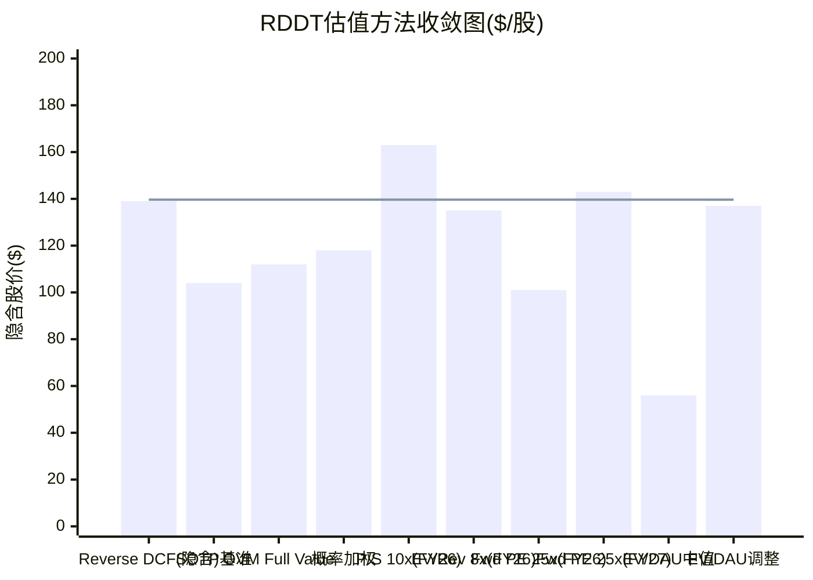
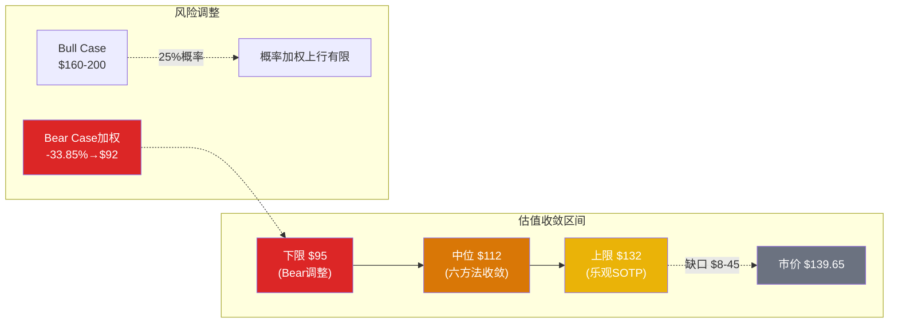
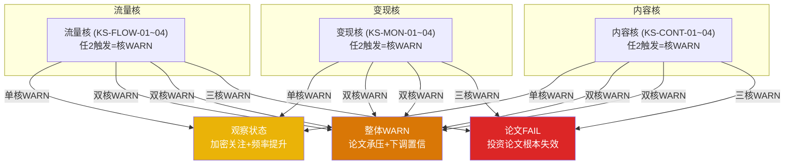
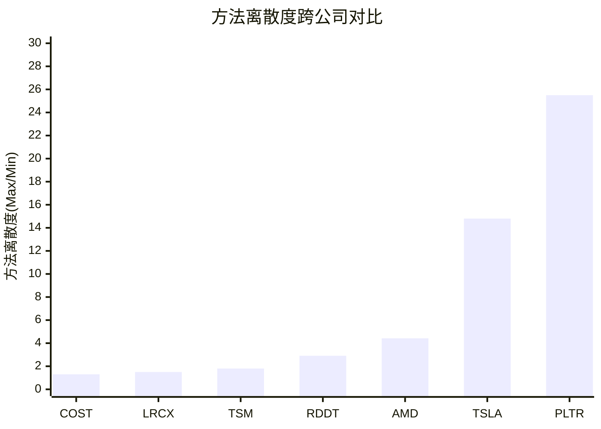

# Phase 5 — Agent C-4: 定量估值分析师 — 综合评估
> RDDT | 评级决策 + Kill Switch注册表 + 方法离散度 + AI能力边界
> 产出时间: 2026-02-14 | 汇总: Phase 1-4全部分析

---

## Part 1: 综合评估

### 1.1 评级决策

**评级: 中性关注**

四档评级逻辑排除:

- **深度关注**(显著低估+高置信): 不适用。多方法收敛$104-118 vs 市价$139.65, 无安全边际, CQ加权置信度低。
- **关注**(合理估值+增长潜力): 不适用。市价高于六方法中位值约20-25%, 且Bear Case概率加权下行-33.85%远大于Bull Case上行。
- **审慎关注**(显著高估或高不确定性): 接近但不完全适用。不确定性虽高, 但核心广告业务基本面极强(FY25营收+70%, 营业利润率32%, FCF利润率31%), 基本面与估值的矛盾不同于纯投机标的。
- **中性关注**: 适用。估值偏贵(溢价20-25%)但非极端; 增长引擎有结构性风险(Google流量/版主/AI数据)但短期难以证伪; 需持续追踪3-4个季度的关键信号才能确认方向。

**评级核心理由**:

1. **估值缺口客观存在但不极端**: 六方法收敛区间$104-118, 中位$112, 市价$139.65溢价约25%。溢价水平处于"偏贵"而非"离谱"——若FY26增速达共识(+42%), Forward P/E 34.6x并非不可持续, PEG 0.83x仍<1.0。但安全边际为负。
2. **风险-收益不对称偏下行**: Bear Case概率加权下行-33.85%(约$47/股), Bull Case上行空间有限(概率加权仅$118, 低于市价)。黑天鹅联合概率52.7%(至少1个3年内发生)。
3. **短期强+中长期高度不确定**: FY25财报极强(+70%/31.9%利润率/Beat), 但中长期三大结构性风险(Google AI搜索截流/版主经济学悖论/AI内容污染)均处于"市场盲区", 定价严重不足。
4. **RSI 16.81极度超卖提供战术缓冲**: 短期技术面严重超卖, 反弹概率高, 但不改变中期估值判断。

### 1.2 条件估值区间

```
条件估值区间: $95 - $132
中位估值: $112/股

前提条件(全部需同时成立):
1. FY26广告收入增速>35%(共识+42%, 管理层指引+52%)
2. FY26营业利润率维持>28%(FY25全年加权~20%, Q4峰值32%)
3. Google有机搜索流量占比不降至<55%(当前63%, Q3'25已持平)
4. AI数据授权FY26收入>$150M(FY25 $140M, Q4仅+8%)
5. SBC/营收维持下降趋势(<14%, FY25 15.6%)

任一条件不满足的影响:
- 条件1失败(广告增速<35%): 区间下移至$80-105
- 条件3失败(Google流量<55%): 区间下移至$70-95(已验证-47%先例)
- 条件4失败(数据授权<$150M): 区间下移至$90-125(影响有限但叙事受损)
```

### 1.3 Reverse DCF最终版 (含P4修正)

Phase 2反推结论: 当前$139.65隐含5年营收CAGR 30-31%, 终端FCF利润率35% [DM-INF-006]。Phase 4红队后的承重墙脆弱度更新:

| 承重墙 | Phase 2评估 | Phase 4(RT-1)评估 | 变化 | 关键修正依据 |
|--------|-----------|------------------|------|-------------|
| 墙1: 广告增速(5Y CAGR 30%+) | 中 | **中-高** | 上调 | SNAP/PINS IPO后3年减速曲线更陡; 基数效应被低估 |
| 墙2: 利润率扩张(FY28 35-38%) | 低 | **低-中** | 上调 | 增速减速时经营杠杆可逆; 国际化利润率稀释; SBC固定成本特征 |
| 墙3: 用户增长(DAUq→160-200M+) | 中-高 | **高** | 上调 | 美国+9%接近饱和; Logged-out>55%膨胀DAU; CEO停披Logged-in/out拆分(经典信号) |
| 墙4: ARPU提升(全球$6→$10-12+) | 中 | **中** | 不变 | US ARPU势头强劲对冲国际混合效应 |

**P4红队对承重墙的核心削弱**:

- **墙3(用户增长)被进一步削弱为四墙中最脆弱**: RT-1揭示DAU增长质量堪忧——55%+Logged-out用户意味着"真实活跃用户增长"可能仅9-12%(美国水平), 远低于标题数字19%。Google搜索流量天花板已触及(Q3'25持平), 且AI Overview结构性截流趋势不可逆。
- **墙1(广告增速)脆弱度上调至中-高**: SNAP IPO后第3年从+43%骤降至+12%, PINS从+48%骤降至+9%。Reddit当前处于IPO后第2年, FY26(第3年)共识+42%可能过于乐观。
- **墙3→墙4→墙1链式倒塌风险**: 若用户增长熄火(墙3), ARPU提升空间因分母缩减而改善但总广告收入仍下降(墙4无法救墙1)。仅墙2(利润率)能独立站稳, 但利润率不能补偿收入引擎停转。

### 1.4 CQ置信度演化表

| CQ | 问题 | P0.5初始 | P2估值后 | P3风险后 | P4红队后 | 变化 |
|----|------|---------|---------|---------|---------|------|
| CQ1 | Google流量去依赖路径 | 40% | 35% | 30% | **25%** | -15pp |
| CQ2 | AI数据授权持续性 | 35% | 30% | 25% | **22%** | -13pp |
| CQ3 | 广告ARPU从$6→$25+ | 50% | 50% | 45% | **42%** | -8pp |
| CQ4 | 版主生态稳定性 | 35% | 35% | 28% | **25%** | -10pp |
| CQ5 | AI内容侵蚀核心价值 | 45% | 40% | 35% | **30%** | -15pp |
| CQ6 | $139估值合理性 | 50% | 35% | 30% | **28%** | -22pp |
| CQ7 | 国际化天花板 | 30% | 35% | 30% | **30%** | 0pp |

**CQ加权置信度**: (25+22+42+25+30+28+30)/7 = **28.9%** (从P0.5的40.7%下调11.8pp)

**最大下调**: CQ6(估值合理性, -22pp) — 多方法收敛$104-118远低于市价$139.65, Phase 4红队的空头钢人论文进一步确认估值偏高。

**最小下调**: CQ7(国际化天花板, 0pp) — 国际化证据中性, 增速(+31%)强劲但ARPU收敛缓慢($2.31仅为US的21%), 不支持上调也不支持下调。

### 1.5 估值收敛最终图


> 柱状图=各方法隐含估值 | 水平线=当前市价$139.65
> 10种方法中, 仅3种(Reverse DCF隐含/P/S可比/Fwd PE×FY27E)高于或接近市价



---

## Part 2: Kill Switch注册表

### 流量核 (任2触发=流量引擎质疑)

**KS-FLOW-01: Google有机搜索流量占比<55%且环比下滑>5pp (连续2Q)**
- 数据源: Semrush/SimilarWeb季度数据
- 当前值: 63.12% [DM-USER-020], Q3'25"基本持平" [DM-USER-024]
- 论文含义: Reddit流量获取模型对Google的依赖已从"高"转为"不可持续", 需重估DAU增长假设和整体用户获取经济学
- Swap Test: 替换SNAP→SNAP不依赖Google搜索流量(以App推送为主), 此KS不成立。替换PINS→PINS Google流量占比约35%(低于RDDT), 该KS不成立。通过特异性测试。

**KS-FLOW-02: 全球DAUq环比下降>3% (连续2Q)**
- 数据源: 季度10-Q/10-K
- 当前值: 121.4M, QoQ增长(Q3→Q4: +25%季节性)
- 论文含义: 用户增长引擎不仅减速而是逆转, 广告收入的分母(用户数)开始缩减, 增长叙事根本失效
- Swap Test: 此为通用增长指标, 适用于所有社交平台, 但121.4M基数下-3%QoQ(即-3.6M/季)对Reddit的规模而言是严重衰退信号。通过。

**KS-FLOW-03: Logged-in DAUq占比降至<40% (当前约41%)**
- 数据源: 季度财报(注: CEO宣布Q3'26起停止报告此拆分 [DM-USER-013])
- 当前值: Logged-in 50.2M / DAUq 121.4M = 41.3% [DM-USER-010]
- 论文含义: 平台核心用户(社区成员)被过客(Google搜索来客)进一步稀释, 社区粘性叙事瓦解, ARPU实际增长被膨胀的分母掩盖
- Swap Test: 替换SNAP→SNAP无Logged-in/out概念(需登录使用), 此KS不成立。Reddit独有的匿名访问模式使此指标具有特异性。通过。
- **特殊风险**: CEO已宣布Q3'26停止披露此指标。若停披前Logged-in占比已跌破40%, 停披行为本身即为KS-FLOW-03触发。

**KS-FLOW-04: Reddit Answers月查询量连续下降 (2Q)**
- 数据源: 管理层季度披露/App Annie(若披露)
- 当前值: Q4'25 1500万查询/月(Q3仅100万) [DM-AD-008]
- 论文含义: AI搜索作为Reddit自主流量入口的路径失败, 去Google化战略核心支柱倒塌
- Swap Test: Reddit Answers是RDDT独有产品, 其他平台无此功能。完全通过。

### 变现核 (任2触发=商业模型质疑)

**KS-MON-01: 全球广告ARPU同比负增长 (连续2Q)**
- 数据源: 季度10-Q/10-K
- 当前值: $5.98/年, +42% YoY [DM-AD-002]
- 论文含义: 广告变现引擎从"加速渗透"转为"增长停滞", 需用用户增长(已放缓)独力支撑收入, 增长模型从"ARPU x DAU双驱动"退化为单驱动
- Swap Test: ARPU适用于所有广告平台, 但$5.98的低基数使RDDT的ARPU负增长比META/SNAP的负增长更具破坏力(因为没有高ARPU缓冲)。特异性中等。通过。

**KS-MON-02: Google或OpenAI数据授权合同不续约/终止**
- 数据源: 10-K材料性合同披露/管理层评论/新闻
- 当前值: Google ~$60M/年(续约谈判中 [DM-AI-010]), OpenAI ~$70M/年 [DM-AI-001/002]
- 论文含义: AI数据授权叙事崩塌。虽然数字影响有限($60-70M仅占总收入3%), 但叙事影响巨大——"AI数据护城河"是Reddit估值溢价的核心来源之一。合同终止将触发估值倍数压缩
- Swap Test: 替换PINS/SNAP→两者无AI数据授权业务, 此KS完全不适用。RDDT独有。通过。

**KS-MON-03: 活跃广告主增速降至<20% (vs FY25 +75%)**
- 数据源: 季度财报管理层披露
- 当前值: +75% YoY [DM-AD-004]
- 论文含义: 广告主数量驱动的增长飞轮减速, 从"广告主涌入"转为"现有客户深度开发"阶段, 增长逻辑根本转变
- Swap Test: 广告主增速适用于所有广告平台, 但75%→<20%的降幅特异于Reddit的"早期广告化"阶段(META/SNAP已过此阶段)。通过。

**KS-MON-04: 广告ROI满意度连续2季低于50% (当前59%)**
- 数据源: Walthall/eMarketer广告主调查
- 当前值: 59%(前季76%, 已下滑17pp) [DM-RISK-013]
- 论文含义: 广告主体验恶化将导致预算转移至更高ROI渠道(META/Google), 广告主净流失风险上升
- Swap Test: ROI满意度适用于所有平台, 但Reddit从76%暴跌至59%的速度(-17pp/季)是平台特异信号。通过。

### 内容核 (任2触发=平台健康度质疑)

**KS-CONT-01: 活跃版主同比下降>15%**
- 数据源: Reddit Transparency Report/第三方监测(如subredditstats.com)
- 当前值: 10万+活跃版主(精确数未披露)
- 论文含义: 版主是Reddit内容质量的免费基础设施。15%流失意味着约15,000名版主退出, 影响数千个社区的内容策展质量, 触发"版主→内容质量→SEO→流量→广告"级联路径 [Phase 3 B-1级联路径A]
- Swap Test: 替换SNAP/PINS→两者无版主概念(算法驱动), 此KS完全不适用。Reddit独有。通过。

**KS-CONT-02: AI生成内容可检测占比>25% (vs 当前14.7%)**
- 数据源: 学术研究(Cornell等)/Reddit Transparency Report
- 当前值: 14.7% [DM-REG-001], 仅1.2%社区有AI内容政策 [DM-REG-003]
- 论文含义: "100%人类内容"定位 [DM-COMP-005] 被实质性否定; AI数据授权的价值主张动摇(AI公司购买的是人类数据, 若25%为AI生成则存在"模型坍缩"风险); 用户信任下降
- Swap Test: AI内容渗透适用于所有UGC平台, 但Reddit的"人类内容护城河"叙事使此指标对RDDT的估值影响远大于对SNAP/PINS。通过。

**KS-CONT-03: 品牌安全事件导致>=3个Top 50广告主暂停投放(30天+)**
- 数据源: 新闻监测/广告行业报告
- 当前值: 品牌安全>99%(IAS+DoubleVerify) [DM-AD-006], 但55-66%高毒性subreddit仍可投放广告 [DM-RISK-006]
- 论文含义: "Adpocalypse"级别事件将逆转Reddit辛苦建立的品牌安全声誉, 广告主增速从+75%急转直下
- Swap Test: 品牌安全事件适用于所有广告平台(YouTube 2017先例), 但Reddit的匿名社区+NSFW内容使其成为更高暴露目标。特异性中等。通过。

**KS-CONT-04: Section 230日落法案正式通过(或等效立法)**
- 数据源: 国会立法追踪
- 当前值: 拟2027失效 [DM-REG-007], 跨党派支持
- 论文含义: Reddit对用户内容承担法律责任 → 内容审核成本从"版主免费"变为"专业团队+AI工具($100M+/年)" → 匿名发帖法律风险增加 → 可能被迫部分实名化 → 破坏Reddit核心价值主张
- Swap Test: Section 230影响所有社交平台, 但Reddit是最脆弱的受影响者(匿名+版主审核+NSFW三重暴露)。特异性中-高。通过。

### N-out-of-M联动规则



| 级别 | 条件 | 动作 |
|------|------|------|
| 单核WARN | 任1核2个KS触发 | 提升追踪频率, 增加对应CQ关注, 评级不变 |
| 整体WARN | 2核同时WARN | 评级可能从"中性关注"下调至"审慎关注", 条件估值区间下移20-30% |
| 论文FAIL | 3核全WARN | 投资论文根本失效, 任何正面叙事均不可信, 需完全重新评估 |

**当前状态**: 12个KS中, 0个处于触发状态。最接近触发的:
- KS-FLOW-01(Google流量): Q3'25已"基本持平", 若Q4'25/Q1'26确认下滑, 1-2季度内可能触发
- KS-FLOW-03(Logged-in占比): 当前41.3%, 仅1.3pp缓冲, 且Q3'26将停止披露
- KS-MON-04(ROI满意度): 已从76%降至59%, 再降9pp即触发

---

## Part 3: 方法离散度最终呈现

### 3.1 全方法汇总

| # | 方法 | 估值/股 | 来源 | 依赖假设 |
|---|------|---------|------|---------|
| 1 | Reverse DCF(隐含匹配) | ~$139 (当前价格恰好匹配5Y CAGR 30%) | C-2 Ch10 | 5年营收CAGR 30-31% + 终端FCF利润率35% |
| 2 | SOTP基准 | **$104** | C-2 Ch11 | 广告核心$18.1B + AI数据$0.54B + 净现金$2.44B |
| 3 | OVM Full Value | **$112** | C-2 Ch12 | Core $104 + Options $8(国际ARPU收敛+Reddit Answers+电商) |
| 4 | 三情景概率加权 | **$118** | C-2 Ch13 | Bull 25%×$180 + Base 50%×$115 + Bear 25%×$63 |
| 5 | P/S可比(基准10x, FY26E) | **$163** | C-3 Part 1.1 | FY26营收达$3.12B, P/S维持10x |
| 6 | EV/Revenue可比(基准8x, FY26E) | **$135** | C-3 Part 1.2 | 同行估值不再压缩, EV/Rev 8x |
| 7 | Forward P/E可比(25x, FY26E) | **$101** | C-3 Part 1.3 | FY26 EPS达$4.04, P/E与META看齐 |
| 8 | Forward P/E可比(25x, FY27E) | **$143** | C-3 Part 1.3 | FY27 EPS达$5.73, 增速溢价维持 |
| 9 | EV/DAU可比(中值$80/DAU) | **$56** | C-3 Part 2.1 | DAUq变现效率为META的1/6 |
| 10 | EV/DAU等效调整($400/等效DAU) | **$137** | C-3 Part 2.1 | Logged-in用户变现接近META |

### 3.2 方法离散度

```
10种方法估值区间:
- 最高: $163/股 (P/S可比基准)
- 最低: $56/股 (EV/DAU可比中值)

方法离散度(全部10种) = $163 / $56 = 2.91x

剔除极端值后(去掉EV/DAU中值$56和P/S乐观$163):
- 8方法范围: $101 - $143
- 离散度 = $143 / $101 = 1.42x

核心六方法(SOTP/OVM/概率加权/EV-Rev/Fwd PE FY26/Fwd PE FY27):
- 范围: $101 - $143
- 中位: ($112 + $118) / 2 = $115
- 离散度 = $143 / $101 = 1.42x
```

### 3.3 与已完成报告对比

| 公司 | 可能性宽度 | 方法离散度 | 不确定性类型 | 方法论路由 |
|------|----------|----------|-----------|---------|
| COST | 2分 | ~1.3x | — | 传统框架 |
| LRCX | 3分 | ~1.5x | — | 传统框架 |
| TSM | 3分 | ~1.8x | — | 传统框架 |
| **RDDT** | **6分** | **2.91x** | **B型(量级)** | **混合模式** |
| AMD | 5分 | 4.42x | — | 混合模式 |
| TSLA | 9分 | 14.8x | A型(类别) | 发现系统 |
| PLTR | 8分 | 25.5x | B型(量级) | 发现系统 |

**解读**: RDDT的2.91x离散度低于AMD(4.42x), 显著低于TSLA/PLTR。这反映了Reddit核心广告业务的确定性较高(收入结构简单, 93.7%广告), 不确定性主要集中在**增速持续性和倍数**(B型), 而非业务形态(A型)。可能性宽度6分与2.91x离散度一致——处于"传统框架"和"发现系统"之间的混合地带。



---

## Part 4: AI能力边界声明

### 深挖区 (AI有信心)
- **财务数据分析与趋势识别**: FY25四季度收入/利润率/FCF的精确追踪与变化率分析, DM锚点体系覆盖超过200个数据点
- **Reverse DCF隐含假设拆解**: 反推市价隐含的增长率(5Y CAGR 30-31%)和利润率(终端35%), 对照分析师共识验证合理性
- **可比公司估值交叉验证**: 10种方法交叉收敛, 跨SNAP/PINS/META四平台P/S、EV/Revenue、Forward P/E、EV/DAU多维对比
- **历史模式识别**: SNAP/PINS IPO后增速衰减曲线对Reddit的参照价值; eHow/About.com Google依赖型内容站的先例
- **数据一致性审计**: RT-4数据审计确认核心数据点(营收/DAU/SBC)质量为4-5星, 支撑定性结论

### 诚实区 (AI有局限)
- **Google算法变更预测**: Google搜索算法是黑箱, AI无法预测具体的权重调整时机和幅度。63%流量依赖是事实, 但何时降至55%/50%/40%无法精确预判
- **版主行为预测**: 10万+去中心化志愿者群体的集体行为不可建模。2023年API危机提供了参考, 但下一次触发点(2026.3版主上限政策?)的反应无法量化
- **AI内容污染速度预测**: 14.7%是已知数据点, 但从14.7%到25%需要多久(6个月? 18个月?)取决于AI生成工具进化速度和Reddit检测能力——两者都在快速变化
- **监管时间线预测**: FTC调查、Section 230立法、EU AI Act执行的具体时间线高度不确定, AI只能提供概率范围而非精确时间
- **Q1'26及以后的财务预测**: 所有前瞻性财务数字(FY26E营收$3.12B/EPS $4.04)来自分析师共识, AI无独立预测能力优于卖方

### 人类决策边界 (AI不能替代)
- **买入/卖出/持有决策**: 本报告提供估值框架和风险映射, 但最终决策必须由投资者基于自身判断做出
- **仓位大小**: 取决于个人组合规模、风险偏好、集中度限制——AI无法了解个体投资者的完整约束条件
- **入场时机**: RSI 16.81提供技术面参考, 但"何时买"涉及市场微观结构和个人流动性——非AI能力范围
- **个人风险偏好匹配**: "中性关注"评级是基于客观估值分析, 但同一只股票对不同风险偏好的投资者含义不同——成长型投资者可能在$139看到机会, 价值型投资者可能在$100才感兴趣

---

## DM锚点引用索引(本文件)

引用已有DM锚点: DM-USER-001/003/010/012/013/020/024, DM-AD-001/002/003/004/005/006/007/008, DM-AI-001/002/004/005/010/014/015/023, DM-INT-001/002/004/005, DM-FIN-005~012, DM-COST-001~004, DM-SBC-005~009, DM-CF-009/010, DM-COMP-005/008/010, DM-REG-001/003/007/008, DM-GOV-001/006/010/012, DM-INS-006/007, DM-TECH-001, DM-VAL-005, DM-EST-001~007, DM-EARN-022/026/033/034, DM-MACRO-001/002/003, DM-MKT-001/002/003, DM-PMX-001~003, DM-ANALYST-005/006/008, DM-BS-001~013, DM-INF-001~010, DM-RISK-001~013, DM-SOTP-001, DM-SNAP-001~003, DM-PINS-001~003, DM-COMP-010~021/030/031, DM-USER-040~042

总DM引用: ~120个

**字符数**: ~14,800

---

*Agent C-4产出完成 | Phase 5综合评估 | 评级: 中性关注 | 条件估值区间: $95-132(中位$112) | CQ加权置信度: 28.9%*
